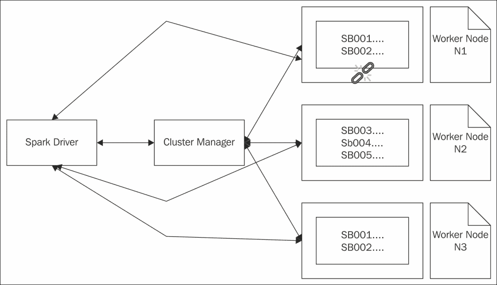
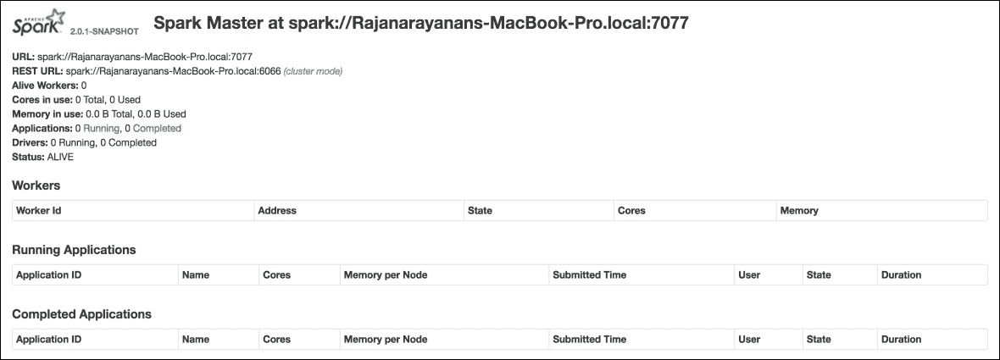
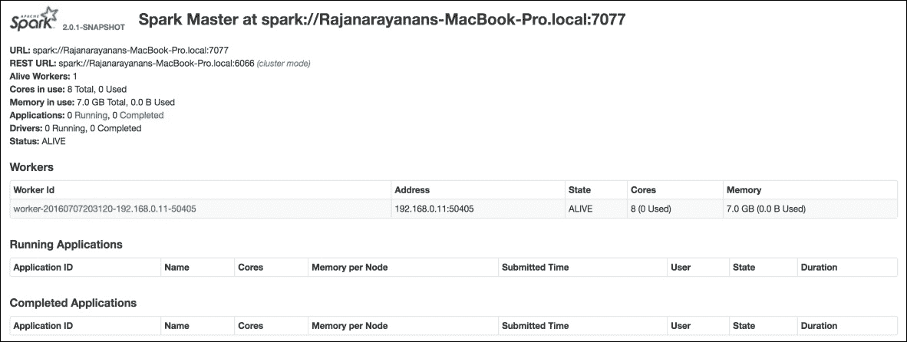
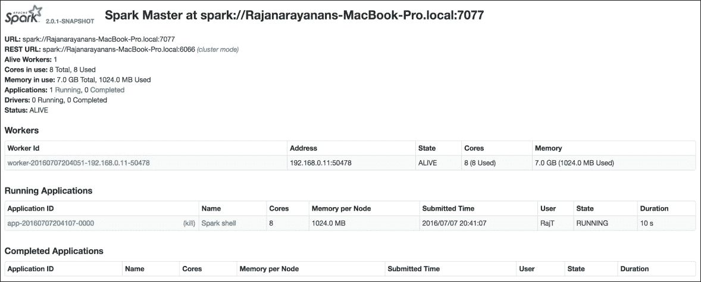
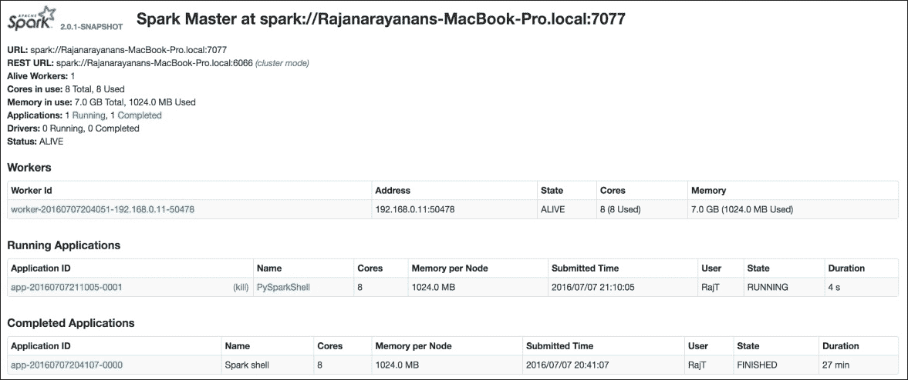
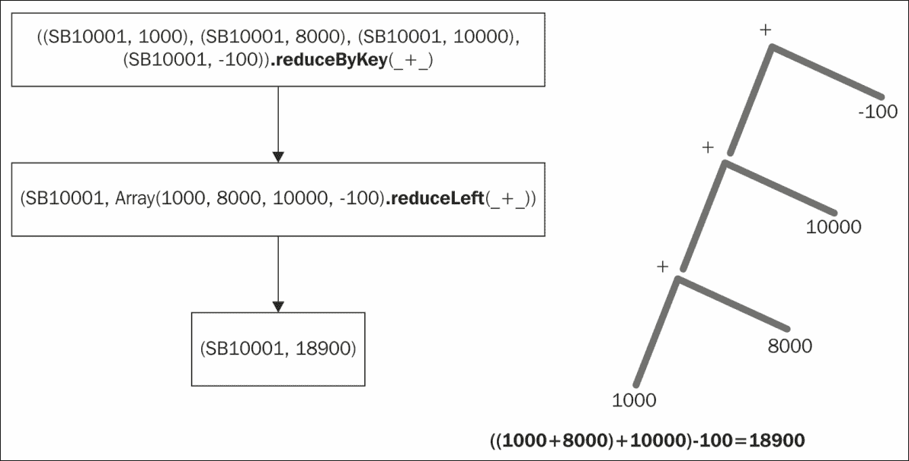
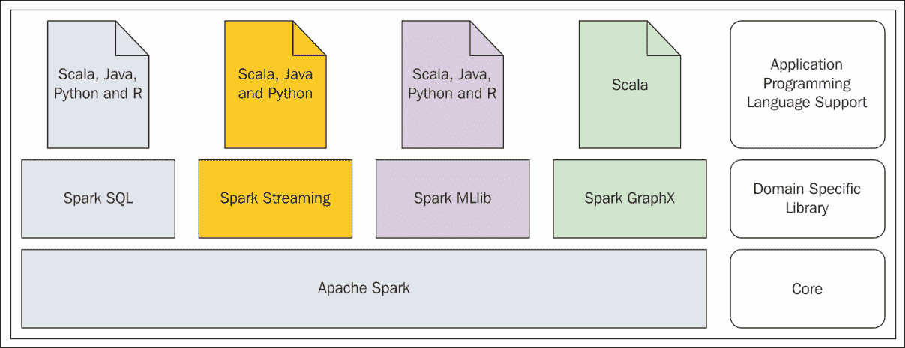

# 第二章：Spark 编程模型

**提取**（**Extract**）、**转换**（**Transform**）和**加载**（**Load**）（**ETL**）工具随着组织数据量的增长而迅速发展。在数据到达目的地之前，需要将其从一种源移动到一种或多种目的地，并在途中进行处理，这些都是当时的需求。大多数情况下，这些 ETL 工具只支持少数类型的数据，只支持少数类型的数据源和目的地，并且难以扩展以支持新的数据类型、新的源和目的地。由于这些工具的严格限制，有时甚至一个步骤的转换过程也需要分多个步骤完成。这些复杂的方法要求在人力和其他计算资源方面产生不必要的浪费。商业 ETL 供应商的主要论点始终相同，即一种解决方案不能适用于所有情况。因此，使用*我们的*工具套件而不是市场上可用的点产品。由于对数据处理的大量需求，许多组织陷入了供应商锁定。几乎在 2005 年之前推出的所有工具都没有利用计算机多核架构的真正力量，如果它们支持在通用硬件上运行其工具。因此，使用这些工具进行简单但数据量大的数据处理作业需要数小时，有时甚至需要数天才能完成。

由于 Spark 能够处理大量数据类型以及不断增长的数据源和数据目的地，它在市场上迅速走红。Spark 提供的重要且基本的数据抽象是**弹性分布式数据集**（**RDD**）。正如前一章所讨论的，Spark 支持在节点集群上的分布式处理。一旦有节点集群，在数据处理过程中，某些节点可能会死亡。当发生此类故障时，框架应该能够从这些故障中恢复。Spark 正是为此而设计的，这就是 RDD 中的*弹性*部分所表示的含义。如果需要处理大量数据，并且集群中有可用节点，框架应该具备将大数据集拆分成更小的数据块并将它们并行分配到集群中多个节点进行处理的 capability。Spark 能够做到这一点，这就是 RDD 中的*分布式*部分所表示的含义。换句话说，Spark 从一开始就被设计成其基本数据抽象能够确定性地拆分成更小的部分，并分布到集群中的多个节点进行并行处理，同时优雅地处理节点故障。

在本章中，我们将涵盖以下主题：

+   使用 Spark 进行函数式编程

+   Spark RDD

+   数据转换和操作

+   Spark 监控

+   Spark 编程基础

+   从文件创建 RDD

+   Spark 库

# 使用 Spark 进行函数式编程

运行时对象的突变，以及由于程序逻辑产生的副作用而无法从程序或函数中获得一致结果，使得许多应用程序非常复杂。如果编程语言中的函数开始像数学函数那样行为，即函数的输出仅取决于输入，这将为应用程序提供很多可预测性。计算机编程范式非常重视基于此构建函数和其他元素的过程，并且像使用其他数据类型一样使用这些函数，这种范式被称为函数式编程范式。在基于 JVM 的编程语言中，Scala 是其中最重要的之一，它具有非常强大的函数式编程能力，同时不失对象导向性。Spark 主要用 Scala 编写。正因为如此，Spark 从 Scala 中吸取了许多非常好的概念。

# 理解 Spark RDD

Spark 从 Scala 继承的最重要特性是能够将函数用作 Spark 转换和 Spark 操作的参数。在 Spark 中，RDD 的行为常常就像 Scala 中的集合对象。正因为如此，Scala 集合的一些数据转换方法名称在 Spark RDD 中被用来执行相同的功能。这是一个非常整洁的方法，那些精通 Scala 的人会发现使用 RDD 编程非常容易。在接下来的几节中，我们将看到一些重要特性。

## Spark RDD 是不可变的

RDD 的创建基于一些强规则。一旦 RDD 被创建，无论是故意还是无意，都不能对其进行更改。这为我们提供了关于 RDD 构建的另一个见解。正因为如此，当处理 RDD 某一部分的节点死亡时，驱动程序可以重新创建这些部分，并将处理这些部分的任务分配给另一个节点，最终成功完成数据处理工作。

由于 RDD 是不可变的，因此可以将一个大 RDD 拆分成更小的 RDD，将它们分发到各个工作节点进行处理，最后编译结果以生成最终结果，可以安全地进行，无需担心底层数据发生变化。

## Spark RDD 是可分发的

如果 Spark 以集群模式运行，其中存在多个可供执行任务的 worker 节点，那么所有这些节点将具有不同的执行上下文。单个任务被分发并在不同的 JVM 上运行。一个大 RDD 的所有活动，包括将其分成更小的块、分发到工作节点进行处理，以及最终组装结果，对用户来说都是完全隐藏的。

Spark 具有从系统故障和其他数据处理过程中发生的错误中恢复的机制，因此这种数据抽象具有高度的鲁棒性。

## Spark RDD 存在于内存中

Spark 尽可能地将所有 RDD 保留在内存中。只有在 Spark 内存不足或数据大小超出容量时，才会将其写入磁盘。RDD 的大部分处理都在内存中进行，这也是 Spark 能够以闪电般的速度处理数据的原因。

## Spark RDD 是强类型的

Spark RDD 可以使用任何支持的数据类型创建。这些数据类型可以是 Scala/Java 支持的内建数据类型，也可以是自定义创建的数据类型，例如您自己的类。从这个设计决策中产生的最大优势是避免了运行时错误。如果因为数据类型问题而要崩溃，它将在编译时崩溃。

以下表格捕捉了一个包含零售银行账户数据的元组的 RDD 的结构。它属于类型 RDD[(string, string, string, double)]：

| **AccountNo** | **FirstName** | **LastName** | **AccountBalance** |
| --- | --- | --- | --- |
| SB001 | John | Mathew | 250.00 |
| SB002 | Tracy | Mason | 450.00 |
| SB003 | Paul | Thomson | 560.00 |
| SB004 | Samantha | Grisham | 650.00 |
| SB005 | John | Grove | 1000.00 |

假设这个 RDD 正在通过一个过程来计算三个节点 N1、N2 和 N3 组成的集群中所有这些账户的总金额，它可以被分割并分配用于数据处理的并行化。以下表格包含了分配给节点 N1 进行处理的 RDD[(string, string, string, double)]的元素：

| **AccountNo** | **FirstName** | **LastName** | **AccountBalance** |
| --- | --- | --- | --- |
| SB001 | John | Mathew | 250.00 |
| SB002 | Tracy | Mason | 450.00 |

以下表格包含了分配给节点 N2 进行处理的 RDD[(string, string, string, double)]的元素：

| **AccountNo** | **FirstName** | **LastName** | **AccountBalance** |
| --- | --- | --- | --- |
| SB003 | Paul | Thomson | 560.00 |
| SB004 | Samantha | Grisham | 650.00 |
| SB005 | John | Grove | 1000.00 |

在节点 N1 上，进行求和过程，并将结果返回给 Spark 驱动程序。同样，在节点 N2 上，进行求和过程，将结果返回给 Spark 驱动程序，并计算最终结果。

Spark 在将大 RDD 分割成更小的块以分配到各个节点方面有非常确定的规则，因此，即使节点 N1 发生故障，Spark 也知道如何重新创建节点 N1 中丢失的块，并通过向节点 N3 发送相同的有效载荷来继续数据处理操作。

图 1 捕捉了该过程的精髓：



图 1

### 提示

Spark 在其驱动器内存和集群节点上的执行器内存中进行大量处理。Spark 有许多可配置和微调的参数，以确保在处理开始之前提供所需的资源。

# 数据转换和 RDD 操作

Spark 使用 RDD 进行数据处理。从相关数据源，如文本文件和 NoSQL 数据存储中读取数据以形成 RDD。在这样一个 RDD 上执行各种数据转换，最后收集结果。更准确地说，Spark 自带 Spark 转换和作用于 RDD 的 Spark 操作。让我们看一下以下 RDD，它捕获了零售银行交易列表，其类型为 RDD[(string, string, double)]：

| **AccountNo** | **TranNo** | **TranAmount** |
| --- | --- | --- |
| SB001 | TR001 | 250.00 |
| SB002 | TR004 | 450.00 |
| SB003 | TR010 | 120.00 |
| SB001 | TR012 | -120.00 |
| SB001 | TR015 | -10.00 |
| SB003 | TR020 | 100.00 |

要计算从形式为`(AccountNo,TranNo,TranAmount)`的 RDD 中交易的账户级别摘要：

1.  首先，它必须转换为键值对的形式`(AccountNo,TranAmount)`，其中`AccountNo`是键，但将会有多个具有相同键的元素。

1.  在这个键上对`TranAmount`进行求和操作，结果是一个形式为(AccountNo,TotalAmount)的 RDD，其中每个 AccountNo 将只有一个元素，TotalAmount 是给定 AccountNo 的所有 TranAmount 的总和。

1.  现在按`AccountNo`对键值对进行排序并存储输出。

在整个过程中描述的，所有都是 Spark 转换，除了存储输出。存储输出是一个**Spark 操作**。Spark 根据需要执行所有这些操作。Spark 在应用 Spark 转换时不采取行动。真正的行动发生在链中的第一个 Spark 操作被调用时。然后它勤奋地按顺序应用所有先前的 Spark 转换，然后执行第一个遇到的 Spark 操作。这是基于称为**延迟评估**的概念。

### 注意

在编程语言中声明和使用变量的上下文中，*延迟评估*意味着变量仅在程序中首次使用时进行评估。

除了将输出存储到磁盘上的操作之外，还有许多其他可能的 Spark 操作，包括但不限于以下列表中给出的一些：

+   将结果 RDD 中的所有内容收集到驱动程序中的数组

+   计算 RDD 中的元素数量

+   在 RDD 元素中计算每个键的元素数量

+   取 RDD 中的第一个元素

+   从 RDD 中取出常用作 Top N 报告的给定数量的元素

+   从 RDD 中取样本元素

+   遍历 RDD 中的所有元素

在这个例子中，在完成过程之前，对各种动态创建的 RDD 进行了许多转换。换句话说，每当对 RDD 进行转换时，就会创建一个新的 RDD。这是因为 RDD 本质上是不可变的。在每个转换结束时创建的这些 RDD 可以保存以供将来参考，或者最终将超出作用域。

总结来说，创建一个或多个 RDD 并在它们上应用转换和动作的过程是 Spark 应用程序中普遍存在的非常常见的使用模式。

### 注意

在前面提到的数据转换示例中，所引用的表格包含了一个类型为 RDD[(string, string, double)] 的 RDD 中的值。在这个 RDD 中，有多个元素，每个元素都是一个类型为 (string, string, double) 的元组。在程序员和用户社区中，为了便于引用和传达思想，经常使用术语 `record` 来指代 RDD 中的一个元素。在 Spark RDD 中，没有记录、行和列的概念。换句话说，术语 `record` 错误地被用来同义于 RDD 中的一个元素，该元素可能是一个复杂的数据类型，如元组或非标量数据类型。在这本书中，这种做法被严格避免，以使用正确的术语。

在 Spark 中，有大量的 Spark 转换可用。这些转换非常强大，因为其中大多数将函数作为输入参数来进行转换。换句话说，这些转换根据用户定义和提供的函数在 RDD 上进行操作。结合 Spark 的一致编程模型，这种能力变得更加强大。无论选择的编程语言是 Scala、Java、Python 还是 R，Spark 转换和 Spark 动作的使用方式都是相似的。这使得组织可以选择他们偏好的编程语言。

在 Spark 中，尽管 Spark 动作的数量有限，但它们非常强大，如果需要，用户可以编写自己的 Spark 动作。市场上有很多 Spark 连接器程序，主要用于从各种数据存储中读取和写入数据。这些连接器程序是由用户社区或数据存储供应商设计和开发的，以便与 Spark 连接。除了可用的 Spark 动作外，它们还可以定义自己的动作来补充现有的 Spark 动作集。例如，Spark Cassandra 连接器用于从 Spark 连接到 Cassandra。它有一个动作 `saveToCassandra`。

# 使用 Spark 进行监控

前一章介绍了使用 Spark 开发和运行数据处理应用程序所需的安装和开发工具设置细节。在大多数实际应用中，Spark 应用程序可能会变得非常复杂，拥有一个由 Spark 转换和 Spark 动作构成的真正巨大的**有向无环图**（**DAG**）。Spark 提供了强大的监控工具来监控给定 Spark 生态系统中的作业。监控不会自动启动。

### 小贴士

注意，这是运行 Spark 应用程序的完全可选步骤。如果启用，它将非常深入地了解 Spark 应用程序的运行方式。在生产环境中启用此功能时需要谨慎，因为它可能会影响应用程序的响应时间。

首先，需要进行一些配置更改。事件日志机制应该开启。为此，请执行以下步骤：

```py
$ cd $SPARK_HOME 
$ cd conf 
$ cp spark-defaults.conf.template spark-defaults.conf

```

完成前面的步骤后，编辑新创建的 `spark-defaults.conf` 文件，使其具有以下属性：

```py
spark.eventLog.enabled           true 
spark.eventLog.dir               <give a log directory location> 

```

### 提示

完成前面的步骤后，请确保之前使用的日志目录在文件系统中存在。

除了前面的配置文件更改之外，该配置文件中还有许多属性可以更改以微调 Spark 运行时。其中最重要的是经常使用的 Spark 驱动内存。如果应用程序处理大量数据，将此属性 `spark.driver.memory` 定制为更高的值是一个好主意。然后运行以下命令以启动 Spark 主机：

```py
$ cd $SPARK_HOME 
$ ./sbin/start-master.sh

```

完成前面的步骤后，请确保 Spark 网页 **用户界面**（**UI**）正在启动，方法是通过访问 `http://localhost:8080/`。这里的假设是 `8080` 端口上没有运行其他应用程序。如果出于某种原因需要在不同的端口上运行此应用程序，可以在启动网页用户界面时在脚本中使用命令行选项 `--webui-port <PORT>`。

网页 UI 应该看起来与图 2 中显示的类似：



图 2

在前面的图中需要注意的最重要信息是完全限定的 Spark 主机 URL（而不是 REST URL）。它将在本书中讨论的许多动手练习中反复使用。URL 可能会因系统而异，以及 DNS 设置。此外，请注意，在本书中，对于所有动手练习，都使用 Spark 独立部署，这是在单台计算机上开始部署中最容易的。

### 提示

现在提供这些 Spark 应用程序监控步骤，以便让读者熟悉 Spark 提供的工具集。那些熟悉这些工具或对应用程序行为非常有信心的人不需要这些工具的帮助。但为了理解概念、调试以及一些过程的可视化，这些工具确实提供了巨大的帮助。

从图 2 中给出的 Spark 网页 UI 可以看出，没有可用的工作节点来执行任何任务，也没有正在运行的应用程序。以下步骤记录了启动工作节点的指令。注意在启动工作节点时如何使用 Spark 主机 URL：

```py
$ cd $SPARK_HOME 
$ ./sbin/start-slave.sh spark://Rajanarayanans-MacBook-Pro.local:7077

```

一旦启动工作节点，在 Spark 网页界面中，将显示新启动的工作节点。`$SPARK_HOME/conf/slaves.template` 模板捕获了将使用前面命令启动的默认工作节点。

### 注意

如果需要额外的工作节点，将 `slaves.template` 文件复制并命名为 `slaves`，并将条目捕获在其中。当启动 spark-shell、pyspark 或 sparkR 时，可以给出指令让它使用指定的 Spark 主节点。这在需要运行 Spark 应用程序或语句在远程 Spark 集群或针对给定的 Spark 主节点时非常有用。如果没有给出任何内容，Spark 应用程序将在本地模式下运行。

```py
$ cd $SPARK_HOME 
$ ./bin/spark-shell --master spark://Rajanarayanans-MacBook-Pro.local:7077 

```

一旦成功启动工作节点，Spark 网页界面将类似于图 3 所示。在此之后，如果使用前面的 Spark 主节点 URL 运行应用程序，该应用程序的详细信息也将显示在 Spark 网页界面中。本章将详细说明应用程序。使用以下脚本停止工作节点和主进程：

```py
$ cd $SPARK_HOME 
$ ./sbin/stop-all.sh

```



图 3

# Spark 编程的基础知识

Spark 编程围绕 RDD 进行。在任何 Spark 应用程序中，要处理的数据的输入被用来创建一个适当的 RDD。首先，从最基本创建 RDD 的方式开始，即从一个列表开始。用于此类 `hello world` 类型的应用程序的输入数据是一小批零售银行业务交易。为了解释核心概念，只选取了一些非常基础的数据项。交易记录包含账户号码和交易金额。

### 提示

在这些用例以及书中所有即将到来的用例中，如果使用了术语“记录”，那么它将处于业务或用例的上下文中。

在这里用于阐明 Spark 转换和 Spark 动作的用例如下所示：

1.  交易记录以逗号分隔值的形式出现。

1.  从列表中过滤出只有好的交易记录。账户号码应以 `SB` 开头，交易金额应大于零。

1.  找出所有交易金额大于 1000 的高价值交易记录。

1.  找出所有账户号码不良的交易记录。

1.  找出所有交易金额小于或等于零的交易记录。

1.  找出所有不良交易记录的合并列表。

1.  找出所有交易金额的总和。

1.  找出所有交易金额的最大值。

1.  找出所有交易金额的最小值。

1.  找出所有良好的账户号码。

在本书中，对于将要开发的任何应用程序，所遵循的方法是从相应语言的 Spark REPL 开始。启动 Spark 的 Scala REPL 并确保它没有错误启动，并且可以看到提示符。对于这个应用程序，我们将启用监控以学习如何进行监控并在开发过程中使用它。除了明确启动 Spark 主节点和从节点外，Spark 还附带一个脚本，可以使用单个脚本同时启动这两个节点。然后，使用 Spark 主节点 URL 启动 Scala REPL：

```py
$ cd $SPARK_HOME 
$ ./sbin/start-all.sh 
$ ./bin/spark-shell --master spark://Rajanarayanans-MacBook-Pro.local:7077 

```

在 Scala REPL 提示符下，尝试以下语句。语句的输出以粗体显示。注意 `scala>` 是 Scala REPL 的提示符：

```py
scala> val acTransList = Array("SB10001,1000", "SB10002,1200", "SB10003,8000", "SB10004,400", "SB10005,300", "SB10006,10000", "SB10007,500", "SB10008,56", "SB10009,30","SB10010,7000", "CR10001,7000", "SB10002,-10") 
acTransList: Array[String] = Array(SB10001,1000, SB10002,1200, SB10003,8000, SB10004,400, SB10005,300, SB10006,10000, SB10007,500, SB10008,56, SB10009,30, SB10010,7000, CR10001,7000, SB10002,-10) 
scala> val acTransRDD = sc.parallelize(acTransList) 
acTransRDD: org.apache.spark.rdd.RDD[String] = ParallelCollectionRDD[0] at parallelize at <console>:23 
scala> val goodTransRecords = acTransRDD.filter(_.split(",")(1).toDouble > 0).filter(_.split(",")(0).startsWith("SB")) 
goodTransRecords: org.apache.spark.rdd.RDD[String] = MapPartitionsRDD[2] at filter at <console>:25 
scala> val highValueTransRecords = goodTransRecords.filter(_.split(",")(1).toDouble > 1000) 
highValueTransRecords: org.apache.spark.rdd.RDD[String] = MapPartitionsRDD[3] at filter at <console>:27 
scala> val badAmountLambda = (trans: String) => trans.split(",")(1).toDouble <= 0 
badAmountLambda: String => Boolean = <function1> 
scala> val badAcNoLambda = (trans: String) => trans.split(",")(0).startsWith("SB") == false 
badAcNoLambda: String => Boolean = <function1> 
scala> val badAmountRecords = acTransRDD.filter(badAmountLambda) 
badAmountRecords: org.apache.spark.rdd.RDD[String] = MapPartitionsRDD[4] at filter at <console>:27 
scala> val badAccountRecords = acTransRDD.filter(badAcNoLambda) 
badAccountRecords: org.apache.spark.rdd.RDD[String] = MapPartitionsRDD[5] at filter at <console>:27 
scala> val badTransRecords  = badAmountRecords.union(badAccountRecords) 
badTransRecords: org.apache.spark.rdd.RDD[String] = UnionRDD[6] at union at <console>:33

```

所有的前述语句都属于一个类别，除了第一个 RDD 创建和两个函数值定义之外。它们都是 Spark 转换。以下是逐步详细说明到目前为止所做的工作：

+   `acTransList` 的值是包含逗号分隔的交易记录的数组。

+   `acTransRDD` 的值是从数组中创建的 RDD，其中 `sc` 是 Spark 上下文或 Spark 驱动程序，RDD 以并行化方式创建，以便 RDD 元素可以形成一个分布式数据集。换句话说，向 Spark 驱动程序下达了一条指令，从给定的值集合中形成一个并行集合或 RDD。

+   `goodTransRecords` 的值是从 `acTransRDD` 中创建的 RDD，在过滤条件交易金额大于 0 且账户号码以 `SB` 开头后得到。

+   `highValueTransRecords` 的值是从 `goodTransRecords` 中创建的 RDD，在过滤条件交易金额大于 1000 后得到。

+   接下来的两个语句是将函数定义存储在 Scala 值中，以便以后方便引用。

+   `badAmountRecords` 和 `badAccountRecords` 的值是从 `acTransRDD` 中创建的 RDD，分别用于过滤包含错误交易金额和无效账户号码的坏记录。

+   `badTransRecords` 包含了 `badAmountRecords` 和 `badAccountRecords` 两个 RDD 元素的并集。

到目前为止，这个应用的 Spark Web UI 不会显示任何内容，因为到目前为止只执行了 Spark 转换。真正的活动只有在执行第一个 Spark 动作后才会开始。

以下语句是已执行语句的延续：

```py
scala> acTransRDD.collect() 
res0: Array[String] = Array(SB10001,1000, SB10002,1200, SB10003,8000, SB10004,400, SB10005,300, SB10006,10000, SB10007,500, SB10008,56, SB10009,30, SB10010,7000, CR10001,7000, SB10002,-10) 
scala> goodTransRecords.collect() 
res1: Array[String] = Array(SB10001,1000, SB10002,1200, SB10003,8000, SB10004,400, SB10005,300, SB10006,10000, SB10007,500, SB10008,56, SB10009,30, SB10010,7000) 
scala> highValueTransRecords.collect() 
res2: Array[String] = Array(SB10002,1200, SB10003,8000, SB10006,10000, SB10010,7000) 
scala> badAccountRecords.collect() 
res3: Array[String] = Array(CR10001,7000) 
scala> badAmountRecords.collect() 
res4: Array[String] = Array(SB10002,-10) 
scala> badTransRecords.collect() 
res5: Array[String] = Array(SB10002,-10, CR10001,7000) 

```

所有的前述语句都做了一件事情，那就是在之前定义的 RDD 上执行 Spark 动作。所有 RDD 的评估只在调用这些 RDD 上的 Spark 动作时发生。以下语句正在对 RDD 进行一些计算：

```py
scala> val sumAmount = goodTransRecords.map(trans => trans.split(",")(1).toDouble).reduce(_ + _) 
sumAmount: Double = 28486.0 
scala> val maxAmount = goodTransRecords.map(trans => trans.split(",")(1).toDouble).reduce((a, b) => if (a > b) a else b) 
maxAmount: Double = 10000.0 
scala> val minAmount = goodTransRecords.map(trans => trans.split(",")(1).toDouble).reduce((a, b) => if (a < b) a else b) 
minAmount: Double = 30.0

```

前面的数字计算了所有良好记录中交易金额的总和、最大值和最小值。在所有前面的转换中，交易记录是逐个处理的。从这些记录中，提取并处理账户号码和交易金额。之所以这样做，是因为用例要求是这样的。现在，在交易记录中的逗号分隔值被拆分，而不考虑它是账户号码还是交易金额。结果 RDD 将包含一个包含所有这些混合元素的集合。从这些元素中，如果选择以`SB`开头的元素，将得到良好的账户号码。以下语句将执行此操作：

```py
scala> val combineAllElements = acTransRDD.flatMap(trans => trans.split(",")) 
combineAllElements: org.apache.spark.rdd.RDD[String] = MapPartitionsRDD[10] at flatMap at <console>:25 
scala> val allGoodAccountNos = combineAllElements.filter(_.startsWith("SB")) 
allGoodAccountNos: org.apache.spark.rdd.RDD[String] = MapPartitionsRDD[11] at filter at <console>:27 
scala> combineAllElements.collect() 
res10: Array[String] = Array(SB10001, 1000, SB10002, 1200, SB10003, 8000, SB10004, 400, SB10005, 300, SB10006, 10000, SB10007, 500, SB10008, 56, SB10009, 30, SB10010, 7000, CR10001, 7000, SB10002, -10) 
scala> allGoodAccountNos.distinct().collect() 
res14: Array[String] = Array(SB10006, SB10010, SB10007, SB10008, SB10009, SB10001, SB10002, SB10003, SB10004, SB10005)

```

现在，在这个时候，如果打开 Spark Web UI，与图 3 中看到的不同，可以注意到一个差异。由于已经执行了一些 Spark 操作，将显示一个应用程序条目。由于 Spark 的 Scala REPL 仍在运行，它显示在仍在运行的应用程序列表中。以下图 4 捕捉了这一点：



图 4

通过单击应用程序 ID 进行导航，以查看与运行中的应用程序相关的所有指标，包括 DAG 可视化等。

这些语句涵盖了所有讨论过的用例，回顾到目前为止涵盖的 Spark 转换是值得的。这些是一些基本但非常重要的转换，将在大多数应用程序中反复使用：

| **Spark 转换** | **它执行的操作** |
| --- | --- |
| `filter(fn)` | **遍历 RDD 中的所有元素，应用传入的函数，并获取函数对元素评估为 true 的元素。** |
| `map(fn)` | 遍历 RDD 中的所有元素，应用传入的函数，并获取函数返回的输出。 |
| `flatMap(fn)` | 遍历 RDD 中的所有元素，应用传入的函数，并获取函数返回的输出。与 Spark 转换`map(fn)`相比，这里的大不同在于函数作用于单个元素，并返回一个扁平化的元素集合。例如，它将一条银行交易记录拆分为多个字段，从而从一个元素生成一个集合。 |
| `union(other)` | 将此 RDD 和其他 RDD 的所有元素合并。 |

值得注意的是，回顾到目前为止涵盖的 Spark 动作。这些是一些基本的动作，但将会在适当的时候涵盖更多动作。

| **Spark 动作** | **它执行的操作** |
| --- | --- |
| `collect()` | **将 RDD 中的所有元素收集到 Spark 驱动程序中的数组中。** |
| `reduce(fn)` | 对 RDD 的所有元素应用函数 fn，最终结果按照函数定义计算。它应该是一个接受两个参数并返回一个结果的函数，同时具有交换性和结合性。 |
| `foreach(fn)` | 对 RDD 的所有元素应用函数 fn。这主要用于副作用。Spark 转换`map(fn)`将函数应用于 RDD 的所有元素并返回另一个 RDD。但`foreach(fn)` Spark 转换不返回 RDD。例如，`foreach(println)`将取 RDD 中的每个元素并将其打印到控制台。尽管在这里的用例中没有使用，但仍有必要提及。 |

Spark 学习过程的下一步是尝试 Python REPL 中的语句，覆盖完全相同的用例。为了便于思想吸收，变量定义在两种语言中尽可能保持相似。与 Scala 的方式相比，它们的使用方式可能存在一些细微的差异；从概念上讲，它与选择的语言无关。

启动 Spark 的 Python REPL，并确保它没有错误地启动，并且可以看到提示符。在玩 Scala 代码时，监控已经启用。现在使用 Spark 主 URL 启动 Python REPL：

```py
$ cd $SPARK_HOME 
$ ./bin/pyspark --master spark://Rajanarayanans-MacBook-Pro.local:7077 

```

在 Python REPL 提示符下，尝试以下语句。语句的输出以粗体显示。请注意`>>>`是 Python REPL 提示符：

```py
>>> from decimal import Decimal 
>>> acTransList = ["SB10001,1000", "SB10002,1200", "SB10003,8000", "SB10004,400", "SB10005,300", "SB10006,10000", "SB10007,500", "SB10008,56", "SB10009,30","SB10010,7000", "CR10001,7000", "SB10002,-10"] 
>>> acTransRDD = sc.parallelize(acTransList) 
>>> goodTransRecords = acTransRDD.filter(lambda trans: Decimal(trans.split(",")[1]) > 0).filter(lambda trans: (trans.split(",")[0]).startswith('SB') == True) 
>>> highValueTransRecords = goodTransRecords.filter(lambda trans: Decimal(trans.split(",")[1]) > 1000) 
>>> badAmountLambda = lambda trans: Decimal(trans.split(",")[1]) <= 0 
>>> badAcNoLambda = lambda trans: (trans.split(",")[0]).startswith('SB') == False 
>>> badAmountRecords = acTransRDD.filter(badAmountLambda) 
>>> badAccountRecords = acTransRDD.filter(badAcNoLambda) 
>>> badTransRecords  = badAmountRecords.union(badAccountRecords) 
>>> acTransRDD.collect() 
['SB10001,1000', 'SB10002,1200', 'SB10003,8000', 'SB10004,400', 'SB10005,300', 'SB10006,10000', 'SB10007,500', 'SB10008,56', 'SB10009,30', 'SB10010,7000', 'CR10001,7000', 'SB10002,-10'] 
>>> goodTransRecords.collect() 
['SB10001,1000', 'SB10002,1200', 'SB10003,8000', 'SB10004,400', 'SB10005,300', 'SB10006,10000', 'SB10007,500', 'SB10008,56', 'SB10009,30', 'SB10010,7000'] 
>>> highValueTransRecords.collect() 
['SB10002,1200', 'SB10003,8000', 'SB10006,10000', 'SB10010,7000'] 
>>> badAccountRecords.collect() 
['CR10001,7000'] 
>>> badAmountRecords.collect() 
['SB10002,-10'] 
>>> badTransRecords.collect() 
['SB10002,-10', 'CR10001,7000'] 
>>> sumAmounts = goodTransRecords.map(lambda trans: Decimal(trans.split(",")[1])).reduce(lambda a,b : a+b) 
>>> sumAmounts 
Decimal('28486') 
>>> maxAmount = goodTransRecords.map(lambda trans: Decimal(trans.split(",")[1])).reduce(lambda a,b : a if a > b else b) 
>>> maxAmount 
Decimal('10000') 
>>> minAmount = goodTransRecords.map(lambda trans: Decimal(trans.split(",")[1])).reduce(lambda a,b : a if a < b else b) 
>>> minAmount 
Decimal('30') 
>>> combineAllElements = acTransRDD.flatMap(lambda trans: trans.split(",")) 
>>> combineAllElements.collect() 
['SB10001', '1000', 'SB10002', '1200', 'SB10003', '8000', 'SB10004', '400', 'SB10005', '300', 'SB10006', '10000', 'SB10007', '500', 'SB10008', '56', 'SB10009', '30', 'SB10010', '7000', 'CR10001', '7000', 'SB10002', '-10'] 
>>> allGoodAccountNos = combineAllElements.filter(lambda trans: trans.startswith('SB') == True) 
>>> allGoodAccountNos.distinct().collect() 
['SB10005', 'SB10006', 'SB10008', 'SB10002', 'SB10003', 'SB10009', 'SB10010', 'SB10004', 'SB10001', 'SB10007']

```

Spark 的统一编程模型的真实力量，在将 Scala 和 Python 代码集进行比较时表现得非常明显。Spark 的转换和操作在两种语言实现中都是相同的。由于编程语言语法差异，将这些函数传递给这些操作的方式不同。

在运行 Spark 的 Python REPL 之前，已经关闭了 Scala REPL，这是故意为之。然后，Spark Web UI 应该看起来与图 5 中所示类似。由于 Scala REPL 已关闭，因此它被列在已完成的作业列表中。由于 Python REPL 仍然打开，因此它被列在正在运行的作业列表中。注意 Spark Web UI 中 Scala REPL 和 Python REPL 的应用程序名称。这些是标准名称。当从文件运行自定义应用程序时，有方法可以在定义 Spark 上下文对象时为应用程序分配自定义名称，以方便应用程序的监控和日志记录。这些细节将在本章后面进行介绍。

花时间熟悉 Spark Web UI 中捕获的所有指标以及 UI 中给出的 DAG 可视化是一个好主意。这将在调试复杂的 Spark 应用程序时非常有帮助。



图 5

## MapReduce

从第一天起，Spark 就被定位为 Hadoop MapReduce 程序的替代品。一般来说，如果数据处理作业可以分解成多个任务并且可以并行执行，并且最终结果可以在收集所有这些分布式部分的结果后计算，那么这些作业将以 MapReduce 风格完成。与 Hadoop MapReduce 不同，Spark 即使在活动的 DAG 超过两个阶段（如 Map 和 Reduce）的情况下也能做到这一点。Spark 就是为了这个目的而设计的，这也是 Spark 强调的最大价值主张之一。

本节将继续使用相同的零售银行业务应用，并选取一些适合 MapReduce 类型数据处理的使用案例。

在这里阐述 MapReduce 类型数据处理所选择的使用案例如下：

1.  零售银行业务交易记录附带账户号码和以逗号分隔的交易金额。

1.  将交易配对，形成如(`AccNo`, `TranAmount`)这样的键/值对。

1.  找到所有交易的账户级别摘要以获取账户余额。

在 Scala REPL 提示符下，尝试以下语句：

```py
scala> val acTransList = Array("SB10001,1000", "SB10002,1200", "SB10001,8000", "SB10002,400", "SB10003,300", "SB10001,10000", "SB10004,500", "SB10005,56", "SB10003,30","SB10002,7000", "SB10001,-100", "SB10002,-10") 
acTransList: Array[String] = Array(SB10001,1000, SB10002,1200, SB10001,8000, SB10002,400, SB10003,300, SB10001,10000, SB10004,500, SB10005,56, SB10003,30, SB10002,7000, SB10001,-100, SB10002,-10) 
scala> val acTransRDD = sc.parallelize(acTransList) 
acTransRDD: org.apache.spark.rdd.RDD[String] = ParallelCollectionRDD[0] at parallelize at <console>:23 
scala> val acKeyVal = acTransRDD.map(trans => (trans.split(",")(0), trans.split(",")(1).toDouble)) 
acKeyVal: org.apache.spark.rdd.RDD[(String, Double)] = MapPartitionsRDD[1] at map at <console>:25 
scala> val accSummary = acKeyVal.reduceByKey(_ + _).sortByKey() 
accSummary: org.apache.spark.rdd.RDD[(String, Double)] = ShuffledRDD[5] at sortByKey at <console>:27 
scala> accSummary.collect() 
res0: Array[(String, Double)] = Array((SB10001,18900.0), (SB10002,8590.0), (SB10003,330.0), (SB10004,500.0), (SB10005,56.0)) 

```

这里是逐步详细捕捉到目前为止所做的工作：

1.  值`acTransList`是包含以逗号分隔的交易记录的数组。

1.  值`acTransRDD`是由数组创建的 RDD，其中 sc 是 Spark 上下文或 Spark 驱动程序，RDD 以并行方式创建，以便 RDD 元素可以形成一个分布式数据集。

1.  将`acTransRDD`转换为`acKeyVal`以形成形式为(K,V)的键值对，其中账户号码被选为键。在这个 RDD 的元素集中，将会有多个具有相同键的元素。

1.  在下一步中，根据键对键值对进行分组，并传递了一个减少函数，该函数将交易金额相加，形成包含 RDD 中特定键的一个元素和相同键的所有金额总和的键值对。然后在生成最终结果之前按键对元素进行排序。

1.  在驱动程序级别将元素收集到数组中。

假设 RDD `acKeyVal`被分成两部分并分布到集群中进行处理，图 6 捕捉了处理的核心：


图 6

以下表格捕捉了在本用例中引入的 Spark 动作：

| **Spark 动作** | **它做什么？** |
| --- | --- |
| `reduceByKey(fn,[noOfTasks])` | **在形式为(K,V)的 RDD 上应用函数 fn，并减少重复键，将作为参数传递的函数应用于键级别的值。** |
| `sortByKey([ascending], [numTasks])` | 如果 RDD 的形式为(K,V)，则按其键 K 对 RDD 元素进行排序 |

`reduceByKey`操作值得特别提及。在图 6 中，按键对元素进行分组是一个已知的操作。但在下一步中，对于相同的键，传递给参数的函数接受两个参数并返回一个。正确获取这个结果并不直观，你可能想知道在迭代每个键的(K,V)对的值时，两个输入从何而来。这种行为是从 Scala 集合方法`reduceLeft`的概念中来的。以下图 7，使用键**SB10001**的值执行`reduceByKey(_ + _)`操作，是为了解释这个概念。这只是为了说明这个示例，而实际的 Spark 实现可能不同：



图 7

在图 7 的右侧，展示了 Scala 集合方法的`reduceLeft`操作。这是尝试提供一些关于`reduceLeft`函数的两个参数来源的见解。实际上，Spark RDD 上使用的许多转换都是从 Scala 集合方法中改编而来的。

在 Python REPL 提示符下，尝试以下语句：

```py
>>> from decimal import Decimal 
>>> acTransList = ["SB10001,1000", "SB10002,1200", "SB10001,8000", "SB10002,400", "SB10003,300", "SB10001,10000", "SB10004,500", "SB10005,56", "SB10003,30","SB10002,7000", "SB10001,-100", "SB10002,-10"] 
>>> acTransRDD = sc.parallelize(acTransList) 
>>> acKeyVal = acTransRDD.map(lambda trans: (trans.split(",")[0],Decimal(trans.split(",")[1]))) 
>>> accSummary = acKeyVal.reduceByKey(lambda a,b : a+b).sortByKey() 
>>> accSummary.collect() 
[('SB10001', Decimal('18900')), ('SB10002', Decimal('8590')), ('SB10003', Decimal('330')), ('SB10004', Decimal('500')), ('SB10005', Decimal('56'))] 

```

`reduceByKey`接受一个输入参数，它是一个函数。与此类似，还有一个不同的转换，它以稍微不同的方式执行基于键的操作。它是`groupByKey()`。它收集给定键的所有值，并从所有单个元素形成值的列表。

如果需要对每个键的相同值元素集合进行多级处理，这种转换是合适的。换句话说，如果有许多(K,V)对，这种转换将为每个键返回(K, Iterable<V>)。

### 小贴士

开发者唯一需要关注的是确保这样的(K,V)对的数量不是真的很大，以免操作造成性能问题。没有硬性规则来确定这一点，这更多取决于用例。

在所有前面的代码片段中，为了从逗号分隔的交易记录中提取账户号码或其他字段，在`map()`转换中多次使用了 split(`,`)。这是为了展示在`map()`或任何其他转换或方法中使用数组元素。提取交易记录字段的一个更好的方法是将其转换为包含所需字段的元组，然后使用元组中的字段在以下代码片段中应用它们。这样，就不需要为每个字段提取重复调用 split (`,`).

## 连接

在**关系数据库管理系统**（**RDBMS**）的世界中，基于键连接多个表行是一个非常常见的做法。当涉及到 NoSQL 数据存储时，连接多个表成为一个真正的问题，因为许多 NoSQL 数据存储不支持表连接。在 NoSQL 世界中，冗余是被允许的。无论技术是否支持表连接，业务用例总是要求基于键连接数据集。因此，在许多用例中，以批量模式执行连接是必不可少的。

Spark 提供了基于键连接多个 RDD 的转换。这支持许多用例。如今，许多 NoSQL 数据存储都有与 Spark 通信的连接器。当与这样的数据存储一起工作时，构建来自多个表的数据 RDD 非常简单，可以在 Spark 中进行连接，并将结果以批量模式或近乎实时模式存储回数据存储中。Spark 转换支持左外连接、右外连接以及全外连接。

用于阐明使用键连接多个数据集的用例如下。

第一个数据集包含一个零售银行主记录摘要，包括账户号码、名和姓。第二个数据集包含零售银行账户余额，包括账户号码和余额金额。这两个数据集的关键是账户号码。将这两个数据集连接起来，创建一个包含账户号码、全名和余额金额的数据集。

在 Scala REPL 提示符下，尝试以下语句：

```py
scala> val acMasterList = Array("SB10001,Roger,Federer", "SB10002,Pete,Sampras", "SB10003,Rafael,Nadal", "SB10004,Boris,Becker", "SB10005,Ivan,Lendl") 
acMasterList: Array[String] = Array(SB10001,Roger,Federer, SB10002,Pete,Sampras, SB10003,Rafel,Nadal, SB10004,Boris,Becker, SB10005,Ivan,Lendl) 
scala> val acBalList = Array("SB10001,50000", "SB10002,12000", "SB10003,3000", "SB10004,8500", "SB10005,5000") 
acBalList: Array[String] = Array(SB10001,50000, SB10002,12000, SB10003,3000, SB10004,8500, SB10005,5000) 
scala> val acMasterRDD = sc.parallelize(acMasterList) 
acMasterRDD: org.apache.spark.rdd.RDD[String] = ParallelCollectionRDD[0] at parallelize at <console>:23 
scala> val acBalRDD = sc.parallelize(acBalList) 
acBalRDD: org.apache.spark.rdd.RDD[String] = ParallelCollectionRDD[1] at parallelize at <console>:23 
scala> val acMasterTuples = acMasterRDD.map(master => master.split(",")).map(masterList => (masterList(0), masterList(1) + " " + masterList(2))) 
acMasterTuples: org.apache.spark.rdd.RDD[(String, String)] = MapPartitionsRDD[3] at map at <console>:25 
scala> val acBalTuples = acBalRDD.map(trans => trans.split(",")).map(transList => (transList(0), transList(1))) 
acBalTuples: org.apache.spark.rdd.RDD[(String, String)] = MapPartitionsRDD[5] at map at <console>:25 
scala> val acJoinTuples = acMasterTuples.join(acBalTuples).sortByKey().map{case (accno, (name, amount)) => (accno, name,amount)} 
acJoinTuples: org.apache.spark.rdd.RDD[(String, String, String)] = MapPartitionsRDD[12] at map at <console>:33 
scala> acJoinTuples.collect() 
res0: Array[(String, String, String)] = Array((SB10001,Roger Federer,50000), (SB10002,Pete Sampras,12000), (SB10003,Rafael Nadal,3000), (SB10004,Boris Becker,8500), (SB10005,Ivan Lendl,5000)) 

```

到现在为止，所有给出的语句都应该已经熟悉，除了 Spark 转换连接。与这个转换类似，`leftOuterJoin`、`rightOuterJoin`和`fullOuterJoin`也以相同的用法模式提供：

| **Spark 转换** | **它做什么** |
| --- | --- |
| `join(other, [numTasks])` | **将此 RDD 与另一个 RDD 连接，元素根据键连接在一起。假设原始 RDD 的形式为(K,V1)，第二个 RDD 的形式为(K,V2)，那么连接操作将产生形式为(K, (V1,V2))的元组，包含每个键的所有配对。** |

在 Python REPL 提示符下，尝试以下语句：

```py
>>> acMasterList = ["SB10001,Roger,Federer", "SB10002,Pete,Sampras", "SB10003,Rafael,Nadal", "SB10004,Boris,Becker", "SB10005,Ivan,Lendl"] 
>>> acBalList = ["SB10001,50000", "SB10002,12000", "SB10003,3000", "SB10004,8500", "SB10005,5000"] 
>>> acMasterRDD = sc.parallelize(acMasterList) 
>>> acBalRDD = sc.parallelize(acBalList) 
>>> acMasterTuples = acMasterRDD.map(lambda master: master.split(",")).map(lambda masterList: (masterList[0], masterList[1] + " " + masterList[2])) 
>>> acBalTuples = acBalRDD.map(lambda trans: trans.split(",")).map(lambda transList: (transList[0], transList[1])) 
>>> acJoinTuples = acMasterTuples.join(acBalTuples).sortByKey().map(lambda tran: (tran[0], tran[1][0],tran[1][1])) 
>>> acJoinTuples.collect() 
[('SB10001', 'Roger Federer', '50000'), ('SB10002', 'Pete Sampras', '12000'), ('SB10003', 'Rafael Nadal', '3000'), ('SB10004', 'Boris Becker', '8500'), ('SB10005', 'Ivan Lendl', '5000')] 

```

## 更多动作

到目前为止，重点主要在 Spark 转换上。Spark 动作也同样重要。为了深入了解一些更重要的 Spark 动作，请看以下用例，继续从上一节用例中停止的地方：

+   从包含账户号码、姓名和账户余额的列表中，获取账户余额最高的一个

+   从包含账户号码、姓名和账户余额的列表中，获取账户余额最高的前三个

+   在账户级别计算余额交易记录数

+   计算总余额交易记录数

+   打印所有账户的名称和账户余额

+   计算账户余额总和

### 提示

非常常见的需求是遍历集合中的元素，对每个元素进行一些数学计算，并在最后使用结果。RDD 被分区并分布到工作节点上。如果在遍历 RDD 元素时使用任何普通变量来存储累积结果，则可能不会得到正确的结果。在这种情况下，而不是使用常规变量，应使用 Spark 提供的累加器。

在 Scala REPL 提示符下，尝试以下语句：

```py
scala> val acNameAndBalance = acJoinTuples.map{case (accno, name,amount) => (name,amount)} 
acNameAndBalance: org.apache.spark.rdd.RDD[(String, String)] = MapPartitionsRDD[46] at map at <console>:35 
scala> val acTuplesByAmount = acBalTuples.map{case (accno, amount) => (amount.toDouble, accno)}.sortByKey(false) 
acTuplesByAmount: org.apache.spark.rdd.RDD[(Double, String)] = ShuffledRDD[50] at sortByKey at <console>:27 
scala> acTuplesByAmount.first() 
res19: (Double, String) = (50000.0,SB10001) 
scala> acTuplesByAmount.take(3) 
res20: Array[(Double, String)] = Array((50000.0,SB10001), (12000.0,SB10002), (8500.0,SB10004)) 
scala> acBalTuples.countByKey() 
res21: scala.collection.Map[String,Long] = Map(SB10001 -> 1, SB10005 -> 1, SB10004 -> 1, SB10002 -> 1, SB10003 -> 1) 
scala> acBalTuples.count() 
res22: Long = 5 
scala> acNameAndBalance.foreach(println) 
(Boris Becker,8500) 
(Rafel Nadal,3000) 
(Roger Federer,50000) 
(Pete Sampras,12000) 
(Ivan Lendl,5000) 
scala> val balanceTotal = sc.accumulator(0.0, "Account Balance Total") 
balanceTotal: org.apache.spark.Accumulator[Double] = 0.0 
scala> acBalTuples.map{case (accno, amount) => amount.toDouble}.foreach(bal => balanceTotal += bal) 
scala> balanceTotal.value 
res8: Double = 78500.0) 

```

下表总结了在本用例中引入的 Spark 动作：

| **Spark 动作** | **执行的操作** |
| --- | --- |
| `first()` | **返回 RDD 中的第一个元素。** |
| `take(n)` | 返回 RDD 中前 `n` 个元素的数组。 |
| `countByKey()` | 返回按键的元素计数。如果 RDD 包含 (K,V) 对，则返回一个 `(K, numOfValues)` 的字典。 |
| `count()` | 返回 RDD 中的元素数量。 |
| `foreach(fn)` | 将函数 fn 应用到 RDD 中的每个元素。在上一个用例中，Spark Accumulator 与 `foreach(fn)` 一起使用。 |

在 Python REPL 提示符下，尝试以下语句：

```py
>>> acNameAndBalance = acJoinTuples.map(lambda tran: (tran[1],tran[2])) 
>>> acTuplesByAmount = acBalTuples.map(lambda tran: (Decimal(tran[1]), tran[0])).sortByKey(False) 
>>> acTuplesByAmount.first() 
(Decimal('50000'), 'SB10001') 
>>> acTuplesByAmount.take(3) 
[(Decimal('50000'), 'SB10001'), (Decimal('12000'), 'SB10002'), (Decimal('8500'), 'SB10004')] 
>>> acBalTuples.countByKey() 
defaultdict(<class 'int'>, {'SB10005': 1, 'SB10002': 1, 'SB10003': 1, 'SB10004': 1, 'SB10001': 1}) 
>>> acBalTuples.count() 
5 
>>> acNameAndBalance.foreach(print) 
('Pete Sampras', '12000') 
('Roger Federer', '50000') 
('Rafael Nadal', '3000') 
('Boris Becker', '8500') 
('Ivan Lendl', '5000') 
>>> balanceTotal = sc.accumulator(0.0) 
>>> balanceTotal.value0.0>>> acBalTuples.foreach(lambda bals: balanceTotal.add(float(bals[1]))) 
>>> balanceTotal.value 
78500.0

```

# 从文件创建 RDD

到目前为止，讨论的重点是 RDD 功能和 RDD 编程。在所有前面的用例中，RDD 的创建都是从集合对象中完成的。但在现实世界的用例中，数据将来自存储在本地文件系统中的文件和 HDFS。通常，数据将来自如 Cassandra 这样的 NoSQL 数据存储。可以通过从这些数据源读取内容来创建 RDD。一旦创建了 RDD，那么所有操作都是统一的，如前所述的用例所示。从文件系统中出来的数据文件可能是固定宽度、逗号分隔的或任何其他格式。但读取此类数据文件的常见模式是逐行读取数据并将行分割成必要的数据项分隔。在来自其他来源的数据的情况下，应使用适当的 Spark 连接器程序和适当的读取数据 API。

许多第三方库可用于从各种类型的文本文件中读取内容。例如，GitHub 上可用的 Spark CSV 库是一个非常有用的库，可以从 CSV 文件创建 RDD。

下表总结了从各种来源（如本地文件系统、HDFS 等）读取文本文件的方式。如前所述，文本文件的处理取决于用例要求：

| **文件位置** | **RDD 创建** | **执行的操作** |
| --- | --- | --- |
| 本地文件系统 | `val textFile = sc.textFile("README.md")` | **通过从 Spark shell 调用的目录中读取名为** `README.md` **的文件内容**，创建一个 RDD。在这里，RDD 的类型是 RDD[string]，元素将是文件中的行。** |
| HDFS | `val textFile = sc.textFile ("hdfs://<location in HDFS>")` | 通过读取 HDFS URL 中指定的文件内容创建一个 RDD |

从本地文件系统读取文件时最重要的方面是文件应该可在所有 Spark 工作节点上可用。除了前面表格中给出的这两个文件位置之外，还可以使用任何支持的文件系统 URI。

就像从各种文件系统中读取文件内容一样，也可以使用`saveAsTextFile`(path) Spark 操作将 RDD 写入文件。

### 小贴士

这里讨论的所有 Spark 应用程序用例都是在 Spark 相应语言的 REPL 上运行的。当编写应用程序时，它们将写入适当的源代码文件。在 Scala 和 Java 的情况下，应用程序代码文件必须编译、打包，并带有适当的库依赖项运行，通常使用 maven 或 sbt 构建。这将在本书的最后一章详细介绍设计使用 Spark 的数据处理应用程序时进行。

# 理解 Spark 库栈

Spark 附带一个核心数据处理引擎和一系列在核心引擎之上工作的库。理解在核心框架之上堆叠库的概念非常重要。

所有这些利用核心框架提供服务的库都支持核心框架提供的数据抽象，以及更多功能。在 Spark 进入市场之前，有许多独立的开源产品正在做现在讨论的库栈正在做的事情。这些点产品的最大缺点是它们的互操作性。它们不能很好地堆叠在一起。它们是用不同的编程语言实现的。这些产品支持的选择的编程语言以及这些产品暴露的 API 的不一致性，使得使用两个或更多这样的产品完成一个应用程序变得非常具有挑战性。这就是在 Spark 之上工作的库栈的相关性。它们都使用相同的编程模型一起工作。这有助于组织标准化数据处理工具集，避免供应商锁定。

Spark 附带以下特定领域的库栈，图 8 展示了开发者眼中整个生态系统的全面视图：

+   **Spark SQL**

+   **Spark Streaming**

+   **Spark MLlib**

+   **Spark GraphX**



图 8

在任何组织中，结构化数据仍然非常广泛地使用。与结构化数据最普遍的数据访问机制是 SQL。Spark SQL 提供了在称为 DataFrame API 的结构化数据抽象之上编写类似 SQL 查询的能力。DataFrame 和 SQL 配合得很好，支持来自各种来源的数据，例如 Hive、Avro、Parquet、JSON 等。一旦数据被加载到 Spark 上下文中，它们就可以像它们都来自同一来源一样进行操作。换句话说，如果需要，可以使用类似 SQL 的查询来连接来自不同来源的数据，例如 Hive 和 JSON。Spark SQL 和 DataFrame API 带给开发者的另一个重大优势是易用性以及不需要了解函数式编程方法，这是使用 RDD 进行编程的要求。

### 小贴士

使用 Spark SQL 和 DataFrame API，可以从各种数据源读取数据，并像它们都来自统一源一样进行处理。Spark 转换和 Spark 操作支持统一的编程接口。因此，数据源统一、API 统一以及使用多种编程语言编写数据处理应用程序的能力，有助于组织标准化一个数据处理框架。

组织数据接收器的数据接收量每天都在增加。同时，数据接收的速度也在增加。Spark Streaming 提供了库来处理从各种来源以极高速度接收的数据。

在过去，数据科学家面临在所选编程语言中构建自己的机器学习算法和工具的实现挑战。通常，这样的编程语言与组织的数据处理工具集不兼容。Spark MLlib 提供了统一过程，其中它自带了许多机器学习算法和工具，这些算法和工具在 Spark 数据处理引擎之上运行。

物联网应用，尤其是社交媒体应用，要求具备数据处理能力，其中数据适合于图状结构。例如，LinkedIn 中的连接、Facebook 中朋友之间的关系、工作流应用以及许多此类用例，广泛使用了图抽象。使用图进行各种计算需要非常高的数据处理能力和复杂的算法。Spark GraphX 库提供了图的 API，并利用了 Spark 的并行计算范式。

### 小贴士

社区开发了众多 Spark 库，用于各种目的。许多这样的第三方库包在网站[`spark-packages.org/`](http://spark-packages.org/)上有特色。随着 Spark 用户社区的日益增长，包的数量每天都在增加。当在 Spark 中开发数据处理应用程序时，如果需要特定的领域库，首先查看这个网站是个好主意，看看是否有人已经开发了它。

# 参考文献

如需更多信息，请访问：[`github.com/databricks/spark-csv`](https://github.com/databricks/spark-csv)

# 摘要

本章讨论了 Spark 的基本编程模型及其主要数据抽象 RDDs。本章使用 Scala 和 Python API 介绍了从各种数据源创建 RDDs，以及使用 Spark 转换和 Spark 操作在 RDDs 中处理数据。本章通过实际案例研究涵盖了 Spark 编程模型的所有重要功能。本章还讨论了 Spark 附带库栈及其各自的功能。总之，Spark 提供了一个非常用户友好的编程模型，并提供了非常强大的数据处理工具集。

下一章将讨论数据集 API 和 DataFrame API。数据集 API 将成为使用 Spark 编程的新方式，而 DataFrame API 则用于处理更结构化的数据。Spark SQL 也被引入以操作结构化数据，并展示如何将其与任何 Spark 数据处理应用程序混合使用。
