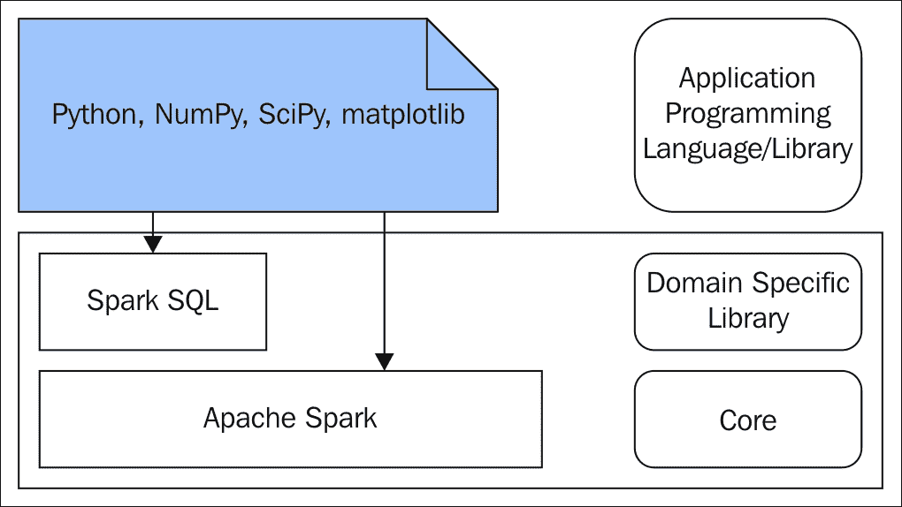
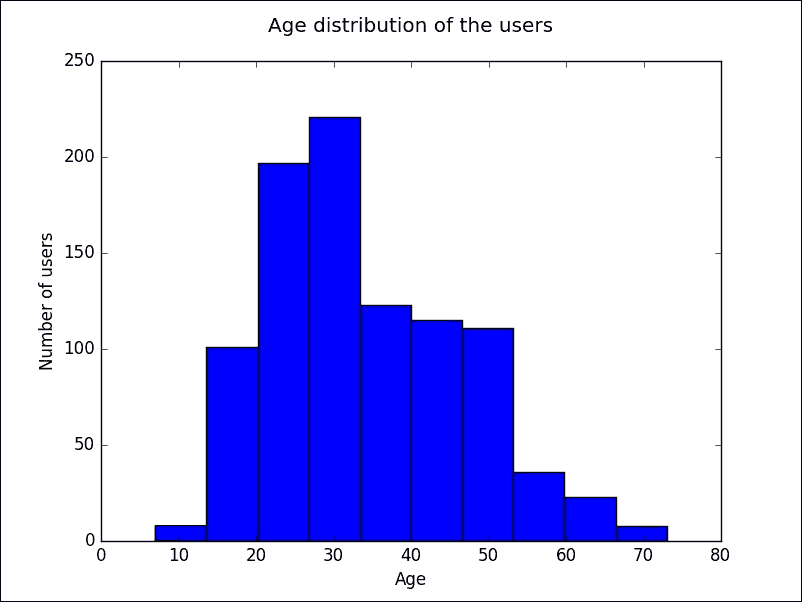
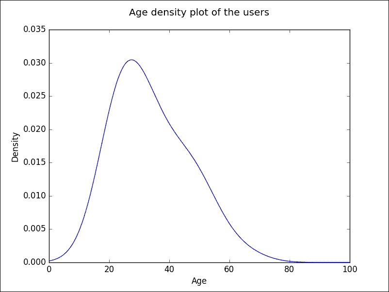
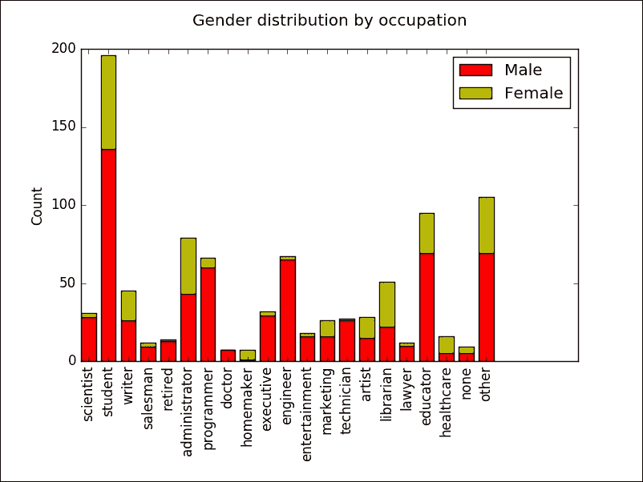
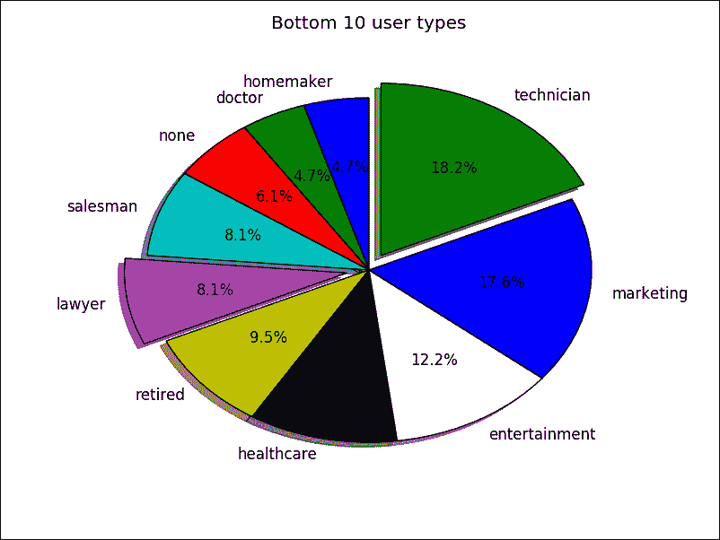
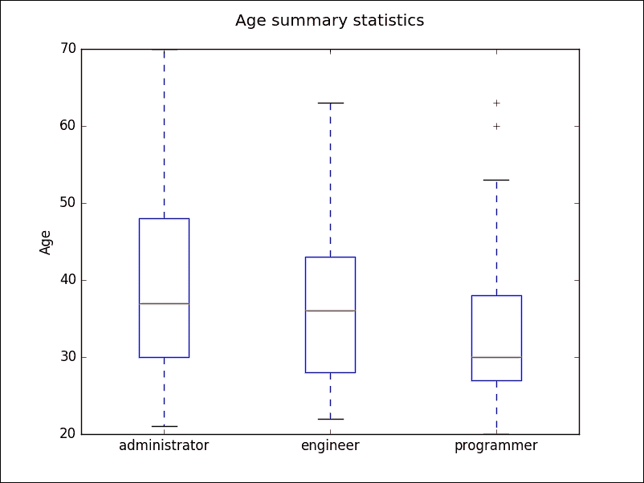
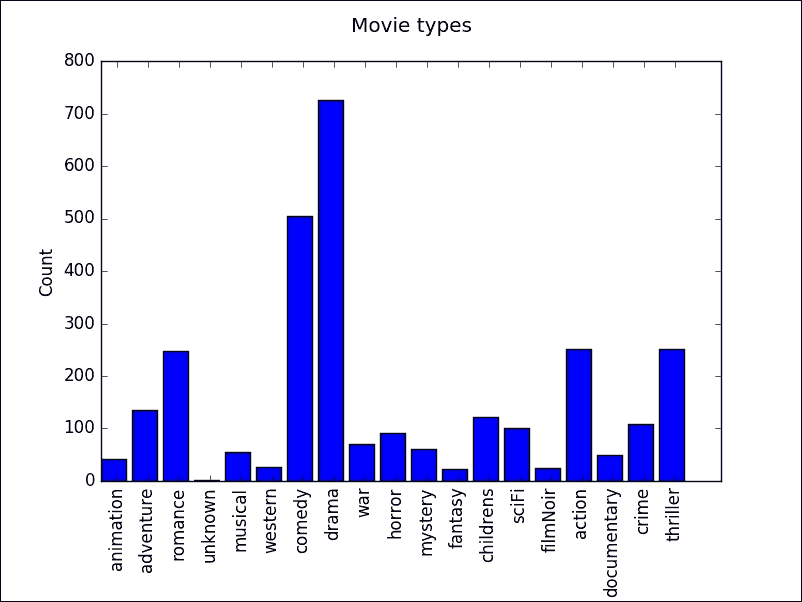
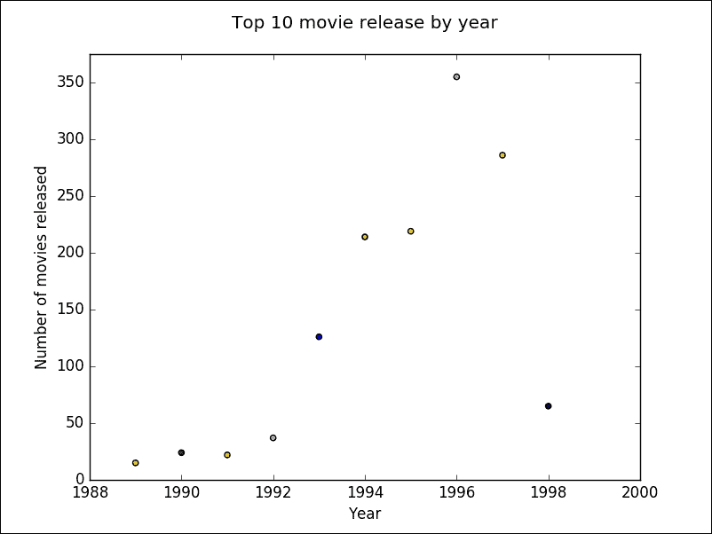
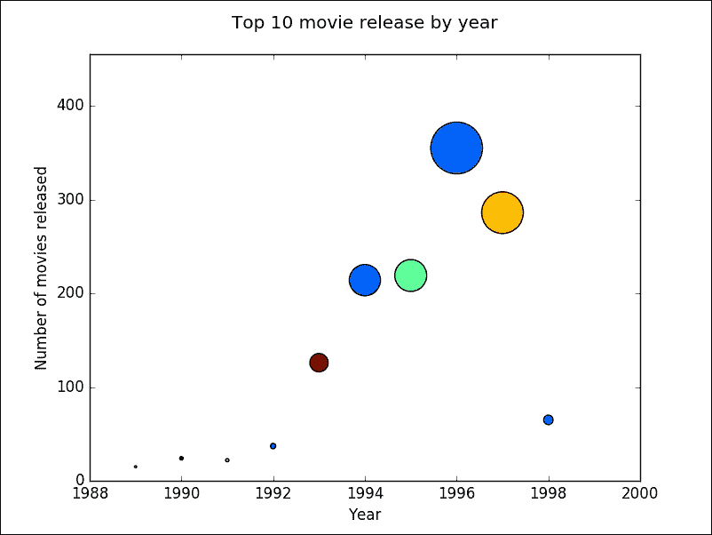

# 第五章：使用 Python 进行 Spark 数据分析

数据处理的最终目的是使用结果来回答业务问题。理解用于回答业务问题的数据非常重要。为了更好地理解数据，使用了各种表格方法、图表和图形技术。数据的可视化表示加强了底层数据的理解。正因为如此，数据可视化在数据分析中被广泛使用。

在各种出版物中，使用不同的术语来表示为回答业务问题而进行的数据分析。数据分析、数据分析和企业智能是一些普遍使用的术语。本章不会深入讨论这些术语的含义、相似性或差异。另一方面，重点是解决数据科学家或数据分析师通常进行的两个主要活动之间的差距。第一个是数据处理。第二个是使用处理后的数据，在图表和图形的帮助下进行分析。数据分析是数据分析师和数据科学家的强项。本章将专注于使用 Spark 和 Python 处理数据，并生成图表和图形。

在许多数据分析用例中，处理数据集的超集，并使用减少后的结果数据集进行数据分析。这在大数据分析的情况下特别适用，其中使用一小部分处理后的数据进行分析。根据用例，为了满足各种数据分析需求，作为先决条件进行适当的数据处理。本章将要涵盖的大多数用例都符合这种模式，其中第一步涉及必要的数据处理，第二步涉及数据分析所需的图表和图形绘制。

在典型的数据分析用例中，活动链涉及一个广泛的多阶段**提取**、**转换**和**加载**（**ETL**）管道，以数据分析和平台或应用程序结束。这一活动链的最终结果包括但不限于汇总数据的表格和各种以图表和图形形式表示的数据可视化。由于 Spark 可以非常有效地处理来自异构分布式数据源的数据，因此传统数据分析应用程序中存在的巨大 ETL 管道可以整合成自包含的应用程序，这些应用程序执行数据处理和数据分析。

本章将涵盖以下主题：

+   图表和图形库

+   设置数据集

+   捕获数据分析用例的高级细节

+   各种图表和图形

# 图表和图形库

Python 是一种目前被数据分析师和数据科学家广泛使用的编程语言。Python 中有许多科学和统计数据处理库，以及图表和绘图库，可以在 Python 程序中使用。Python 也被广泛用作在 Spark 中开发数据处理应用程序的编程语言。这为 Spark、Python 和 Python 库提供了一个统一的数据处理和分析框架，使我们能够进行科学和统计处理、图表和绘图。有大量的此类库与 Python 一起工作。在所有这些库中，这里使用**NumPy**和**SciPy**库来进行数值、统计和科学数据处理。这里使用**matplotlib**库来进行生成 2D 图像的图表和绘图。

### 小贴士

在尝试本章给出的代码示例之前，确保**NumPy**、**SciPy**和**matplotlib**Python 库与 Python 安装正常工作非常重要。这必须在将其用于 Spark 应用程序之前单独测试和验证。

如*图 1*所示的整体应用堆栈结构图：



图 1

# 设置数据集

有许多公共数据集可供公众消费，可用于教育、研究和开发目的。MovieLens 网站允许用户对电影进行评分并个性化电影推荐。GroupLens Research 发布了来自 MovieLens 的评分数据集。这些数据集可以从他们的网站[`grouplens.org/datasets/movielens/`](http://grouplens.org/datasets/movielens/)下载。在本章中，使用 MovieLens 100K 数据集来演示使用 Spark 结合 Python、NumPy、SciPy 和 matplotlib 进行分布式数据处理的使用方法。

### 小贴士

在数据集下载的 GroupLens Research 网站上，除了前面提到的数据集外，还有更多大量数据集可供下载，如 MovieLens 1M 数据集、MovieLens 10M 数据集、MovieLens 20M 数据集以及最新的 MovieLens 数据集。一旦读者对程序非常熟悉，并且达到了足够的舒适度来处理数据，这些额外的数据集就可以被读者用来进行自己的分析工作，以加强从本章获得的知识。

MovieLens 100K 数据集包含多个文件中的数据。以下是在本章数据分析用例中将要使用的一些文件：

+   `u.user`: 关于已评分电影的用户的统计数据信息。数据集的结构如下，直接从数据集附带的 README 文件中复制而来：

    +   用户 ID

    +   年龄

    +   性别

    +   职业

    +   邮编

+   `u.item`：关于用户评分的电影信息。数据集的结构如下，直接从数据集附带的 README 文件中复制，保持原样：

    +   电影 ID

    +   电影标题

    +   发布日期

    +   视频发布日期

    +   IMDb URL

    +   未知

    +   动作

    +   冒险片

    +   动画片

    +   儿童片

    +   喜剧片

    +   犯罪片

    +   纪录片

    +   剧情

    +   奇幻片

    +   黑色电影

    +   恐怖片

    +   音乐片

    +   悬疑片

    +   爱情

    +   科幻片

    +   惊悚片

    +   战争片

    +   西部片

# 数据分析用例

以下列表捕获了数据分析用例的高级细节。大多数用例都是围绕创建各种图表和图形进行的：

+   使用直方图绘制评分用户的年龄分布。

+   使用与绘制直方图相同的数据，绘制用户的年龄概率密度图。

+   绘制年龄分布数据的摘要，以找到用户的年龄最小值、25%分位数、中位数、75%分位数和最大值。

+   在同一图上绘制多个图表或图形，以便进行数据并排比较。

+   创建一个柱状图，展示按电影评分人数排名前 10 的职业。

+   创建一个堆积柱状图，展示按职业划分的男性和女性用户对电影的评分数量。

+   创建一个饼图，展示按电影评分人数排名后 10 的职业。

+   创建一个饼图，展示按电影评分人数排名前 10 的邮编。

+   使用三个职业类别，创建箱线图，展示评分用户的汇总统计信息。所有三个箱线图必须绘制在单个图上，以便进行比较。

+   创建一个柱状图，展示按电影类型划分的电影数量。

+   创建一个散点图，展示按每年上映电影数量排名前 10 的年份。

+   创建一个散点图，展示按每年上映电影数量排名前 10 的年份。在这个图中，用与该年上映电影数量成比例的圆形代替图中的点。

+   创建一个折线图，包含两个数据集，其中一个数据集是过去 10 年上映的动作电影数量，另一个数据集是过去 10 年上映的剧情电影数量，以便进行比较。

### 小贴士

在所有前面的用例中，当涉及到实现时，使用 Spark 处理数据并准备所需的数据集。一旦所需的处理数据在 Spark DataFrame 中可用，就收集到驱动程序中。换句话说，数据从 Spark 的分布式集合转移到 Python 程序中的本地集合，作为元组，用于图表和绘图。对于图表和绘图，Python 需要本地数据。它不能直接使用 Spark DataFrame 进行图表和绘图。 

# 图表和图形

本节将专注于创建各种图表和绘图，以直观地表示与上一节中描述的用例相关的 MovieLens 100K 数据集的各个方面。本章中描述的图表和绘图绘制过程遵循一个模式。以下是该活动模式中的重要步骤：

1.  使用 Spark 从数据文件中读取数据。

1.  将数据在 Spark DataFrame 中可用。

1.  使用 DataFrame API 应用必要的数据处理。

1.  处理主要是为了仅提供图表和绘图所需的最低限度和必要的数据。

1.  将处理后的数据从 Spark DataFrame 传输到 Spark Driver 程序中的本地 Python 集合对象。

1.  使用图表和绘图库，通过 Python 集合对象中的数据生成图形。

## 直方图

直方图通常用于显示给定数值数据集在连续的非重叠等大小区间上的分布情况。区间或区间大小基于数据集选择。区间或区间代表数据的范围。在本用例中，数据集由用户的年龄组成。在这种情况下，区间大小为 100 没有意义，因为只有一个区间，整个数据集都将落入其中。表示区间的柱状图的高度表示该区间或区间中数据项的频率。

以下命令集用于启动 Spark 的 Python REPL，随后是进行数据处理、图表和绘图的程序：

```py
$ cd $SPARK_HOME
$ ./bin/pyspark
>>> # Import all the required libraries 
>>> from pyspark.sql import Row
>>> import matplotlib.pyplot as plt
>>> import numpy as np
>>> import matplotlib.pyplot as plt
>>> import pylab as P
>>> plt.rcdefaults()
>>> # TODO - The following location has to be changed to the appropriate data file location
>>> dataDir = "/Users/RajT/Documents/Writing/SparkForBeginners/SparkDataAnalysisWithPython/Data/ml-100k/">>> # Create the DataFrame of the user dataset
>>> lines = sc.textFile(dataDir + "u.user")
>>> splitLines = lines.map(lambda l: l.split("|"))
>>> usersRDD = splitLines.map(lambda p: Row(id=p[0], age=int(p[1]), gender=p[2], occupation=p[3], zipcode=p[4]))
>>> usersDF = spark.createDataFrame(usersRDD)
>>> usersDF.createOrReplaceTempView("users")
>>> usersDF.show()
      +---+------+---+-------------+-------+

      |age|gender| id|   occupation|zipcode|

      +---+------+---+-------------+-------+

      | 24|     M|  1|   technician|  85711|

      | 53|     F|  2|        other|  94043|

      | 23|     M|  3|       writer|  32067|

      | 24|     M|  4|   technician|  43537|

      | 33|     F|  5|        other|  15213|

      | 42|     M|  6|    executive|  98101|

      | 57|     M|  7|administrator|  91344|

      | 36|     M|  8|administrator|  05201|

      | 29|     M|  9|      student|  01002|

      | 53|     M| 10|       lawyer|  90703|

      | 39|     F| 11|        other|  30329|

      | 28|     F| 12|        other|  06405|

      | 47|     M| 13|     educator|  29206|

      | 45|     M| 14|    scientist|  55106|

      | 49|     F| 15|     educator|  97301|

      | 21|     M| 16|entertainment|  10309|

      | 30|     M| 17|   programmer|  06355|

      | 35|     F| 18|        other|  37212|

      | 40|     M| 19|    librarian|  02138|

      | 42|     F| 20|    homemaker|  95660|

      +---+------+---+-------------+-------+

      only showing top 20 rows
    >>> # Create the DataFrame of the user dataset with only one column age
	>>> ageDF = spark.sql("SELECT age FROM users")
	>>> ageList = ageDF.rdd.map(lambda p: p.age).collect()
	>>> ageDF.describe().show()
      +-------+------------------+

      |summary|               age|

      +-------+------------------+

      |  count|               943|

      |   mean| 34.05196182396607|

      | stddev|12.186273150937206|

      |    min|                 7|

      |    max|                73|

      +-------+------------------+
 >>> # Age distribution of the users
 >>> plt.hist(ageList)
 >>> plt.title("Age distribution of the users\n")
 >>> plt.xlabel("Age")
 >>> plt.ylabel("Number of users")
 >>> plt.show(block=False)

```

在上一节中，用户数据集被逐行读取以形成 RDD。从 RDD 中创建了一个 Spark DataFrame。使用 Spark SQL，创建了一个只包含年龄列的另一个 Spark DataFrame。该 Spark DataFrame 的摘要被显示出来，以展示内容的摘要统计；内容被收集到一个本地的 Python 集合对象中。使用收集到的数据，绘制了年龄列的直方图，如图*图 2*所示：



图 2

## 密度图

另有一个与直方图非常相似的图表。它是密度图。当存在有限的数据样本且需要估计随机变量的概率密度函数时，密度图被大量使用。直方图无法显示数据平滑或数据点连续的情况。为此目的，使用密度图。

### 注意

由于直方图和密度图用于类似的目的，但对于相同的数据显示不同的行为，通常在许多应用中直方图和密度图是并排使用的。

*图 3*是为与绘制直方图相同的同一数据集绘制的密度图。

作为同一 Python REPL 的 Spark 的延续，运行以下命令：

```py
>>> # Draw a density plot
>>> from scipy.stats import gaussian_kde
>>> density = gaussian_kde(ageList)
>>> xAxisValues = np.linspace(0,100,1000)
>>> density.covariance_factor = lambda : .5
>>> density._compute_covariance()
>>> plt.title("Age density plot of the users\n")
>>> plt.xlabel("Age")
>>> plt.ylabel("Density")
>>> plt.plot(xAxisValues, density(xAxisValues))
>>> plt.show(block=False)

```



图 3

在前面的章节中，使用了只包含年龄列的相同 Spark DataFrame，并将内容收集到本地的 Python 集合对象中。使用收集到的数据，绘制了年龄列的密度图，如图 *3* 所示，线空间从 0 到 100 代表年龄。

如果需要并排查看多个图表或图形，**matplotlib** 库提供了实现这一功能的方法。图 4 展示了并排的直方图和箱线图。

作为与 Spark 相同的 Python REPL 的延续，运行以下命令：

```py
>>> # The following example demonstrates the creation of multiple diagrams
        in one figure
		>>> # There are two plots on one row
		>>> # The first one is the histogram of the distribution 
		>>> # The second one is the boxplot containing the summary of the 
        distribution
		>>> plt.subplot(121)
		>>> plt.hist(ageList)
		>>> plt.title("Age distribution of the users\n")
		>>> plt.xlabel("Age")
		>>> plt.ylabel("Number of users")
		>>> plt.subplot(122)
		>>> plt.title("Summary of distribution\n")
		>>> plt.xlabel("Age")
		>>> plt.boxplot(ageList, vert=False)
		>>> plt.show(block=False)

```


图 4

在前面的章节中，使用了只包含年龄列的相同 Spark DataFrame，并将内容收集到本地的 Python 集合对象中。使用收集到的数据，绘制了年龄列的直方图，以及包含最小值、25^(th) 分位数、中位数、75^(th) 分位数和最大值的箱线图，如图 *4* 所示。当在一个图中绘制多个图表或图形时，为了控制布局，可以查看方法调用 `plt.subplot(121)`。这指的是在一行两列布局中选择的图形，并选择了第一个。同样，`plt.subplot(122)` 指的是在一行两列布局中选择的图形，并选择了第二个。

## 条形图

条形图可以以不同的方式绘制。最常见的一种是条形垂直于 *X* 轴站立。另一种变化是条形绘制在 *Y* 轴上，条形水平排列。*图 5* 展示了一个水平条形图。

### 注意

很容易将直方图和条形图混淆。重要的区别在于，直方图用于绘制连续但有限的数值，而条形图用于表示分类数据。

作为与 Spark 相同的 Python REPL 的延续，运行以下命令：

```py
>>> occupationsTop10 = spark.sql("SELECT occupation, count(occupation) as usercount FROM users GROUP BY occupation ORDER BY usercount DESC LIMIT 10")
>>> occupationsTop10.show()
      +-------------+---------+

      |   occupation|usercount|

      +-------------+---------+

      |      student|      196|

      |        other|      105|

      |     educator|       95|

      |administrator|       79|

      |     engineer|       67|

      |   programmer|       66|

      |    librarian|       51|

      |       writer|       45|

      |    executive|       32|

      |    scientist|       31|

      +-------------+---------+
	  >>> occupationsTop10Tuple = occupationsTop10.rdd.map(lambda p:
	  (p.occupation,p.usercount)).collect()
	  >>> occupationsTop10List, countTop10List = zip(*occupationsTop10Tuple)
	  >>> occupationsTop10Tuple
	  >>> # Top 10 occupations in terms of the number of users having that
	  occupation who have rated movies
	  >>> y_pos = np.arange(len(occupationsTop10List))
	  >>> plt.barh(y_pos, countTop10List, align='center', alpha=0.4)
	  >>> plt.yticks(y_pos, occupationsTop10List)
	  >>> plt.xlabel('Number of users')
	  >>> plt.title('Top 10 user types\n')
	  >>> plt.gcf().subplots_adjust(left=0.15)
	  >>> plt.show(block=False)

```


图 5

在前面的章节中，创建了一个包含用户按评价电影数量排名前 10 的职业的 Spark DataFrame。数据被收集到 Python 集合对象中，用于绘制条形图。

### 堆叠条形图

前面章节中绘制的条形图显示了按用户数量排名的前 10 位用户职业。但这并没有给出关于用户性别构成的具体细节。在这种情况下，使用堆叠条形图是一个好主意，其中每个条形都显示了按性别划分的计数。*图 6* 展示了一个堆叠条形图。

作为与 Spark 相同的 Python REPL 的延续，运行以下命令：

```py
>>> occupationsGender = spark.sql("SELECT occupation, gender FROM users")>>> occupationsGender.show()
      +-------------+------+

      |   occupation|gender|

      +-------------+------+

      |   technician|     M|

      |        other|     F|

      |       writer|     M|

      |   technician|     M|

      |        other|     F|

      |    executive|     M|

      |administrator|     M|

      |administrator|     M|

      |      student|     M|

      |       lawyer|     M|

      |        other|     F|

      |        other|     F|

      |     educator|     M|

      |    scientist|     M|

      |     educator|     F|

      |entertainment|     M|

      |   programmer|     M|

      |        other|     F|

      |    librarian|     M|

      |    homemaker|     F|

      +-------------+------+

      only showing top 20 rows
    >>> occCrossTab = occupationsGender.stat.crosstab("occupation", "gender")>>> occCrossTab.show()
      +-----------------+---+---+

      |occupation_gender|  M|  F|

      +-----------------+---+---+

      |        scientist| 28|  3|

      |          student|136| 60|

      |           writer| 26| 19|

      |         salesman|  9|  3|

      |          retired| 13|  1|

      |    administrator| 43| 36|

      |       programmer| 60|  6|

      |           doctor|  7|  0|

      |        homemaker|  1|  6|

      |        executive| 29|  3|

      |         engineer| 65|  2|

      |    entertainment| 16|  2|

      |        marketing| 16| 10|

      |       technician| 26|  1|

      |           artist| 15| 13|

      |        librarian| 22| 29|

      |           lawyer| 10|  2|

      |         educator| 69| 26|

      |       healthcare|  5| 11|

      |             none|  5|  4|

      +-----------------+---+---+

      only showing top 20 rows
      >>> occupationsCrossTuple = occCrossTab.rdd.map(lambda p:
	 (p.occupation_gender,p.M, p.F)).collect()
	 >>> occList, mList, fList = zip(*occupationsCrossTuple)
	 >>> N = len(occList)
	 >>> ind = np.arange(N) # the x locations for the groups
	 >>> width = 0.75 # the width of the bars
	 >>> p1 = plt.bar(ind, mList, width, color='r')
	 >>> p2 = plt.bar(ind, fList, width, color='y', bottom=mList)
	 >>> plt.ylabel('Count')
	 >>> plt.title('Gender distribution by occupation\n')
	 >>> plt.xticks(ind + width/2., occList, rotation=90)
	 >>> plt.legend((p1[0], p2[0]), ('Male', 'Female'))
	 >>> plt.gcf().subplots_adjust(bottom=0.25)
	 >>> plt.show(block=False)

```



图 6

在上一节中，创建了一个只包含职业和性别列的 Spark DataFrame。对这个 DataFrame 进行了交叉表操作，生成了另一个 Spark DataFrame，其中包含了职业、男性用户数量和女性用户数量列。在第一个包含职业和性别列的 Spark DataFrame 中，这两个都是非数值列，因此基于这些数据绘制图表或图形没有意义。但是，如果对这两个列值进行交叉表操作，对于每个不同的职业字段，性别列的值计数将可用。这样，职业字段就变成了一个分类变量，使用数据绘制条形图是有意义的。由于数据中只有两个性别值，因此使用堆叠条形图来查看每个职业类别中男性和女性用户数量的总数和比例是有意义的。

在 Spark 的 DataFrame 中有很多统计和数学函数可用。在这种情况下，对 Spark DataFrame 进行交叉表操作非常有用。对于大型数据集，交叉表操作可能会非常消耗处理器资源且耗时，但 Spark 的分布式处理能力在这种情况下非常有帮助。

Spark SQL 自带了许多数学和统计数据处理能力。在上一节中，使用了`describe().show()`方法对`SparkDataFrame`对象进行了操作。在这些 Spark DataFrame 中，上述方法作用于可用的数值列。在存在多个数值列的情况下，上述方法具有选择所需列以获取汇总统计信息的能力。同样，还有方法可以在 Spark DataFrame 的数据上找到协方差、相关性等。以下代码片段演示了这些方法：

```py
>>> occCrossTab.describe('M', 'F').show()
      +-------+------------------+------------------+

      |summary|                 M|                 F|

      +-------+------------------+------------------+

      |  count|                21|                21|

      |   mean|31.904761904761905|              13.0|

      | stddev|31.595516200735347|15.491933384829668|

      |    min|                 1|                 0|

      |    max|               136|                60|

      +-------+------------------+------------------+
    >>> occCrossTab.stat.cov('M', 'F')
      381.15
    >>> occCrossTab.stat.corr('M', 'F')
      0.7416099517313641 

```

## 饼图

如果需要以视觉方式表示数据集来解释整体与部分的关系，饼图是非常常用的。*图 7*展示了饼图。

作为与 Spark 相同的 Python REPL 的延续，运行以下命令：

```py
>>> occupationsBottom10 = spark.sql("SELECT occupation, count(occupation) as usercount FROM users GROUP BY occupation ORDER BY usercount LIMIT 10")
>>> occupationsBottom10.show()
      +-------------+---------+

      |   occupation|usercount|

      +-------------+---------+

      |    homemaker|        7|

      |       doctor|        7|

      |         none|        9|

      |     salesman|       12|

      |       lawyer|       12|

      |      retired|       14|

      |   healthcare|       16|

      |entertainment|       18|

      |    marketing|       26|

      |   technician|       27|

      +-------------+---------+
    >>> occupationsBottom10Tuple = occupationsBottom10.rdd.map(lambda p: (p.occupation,p.usercount)).collect()
	>>> occupationsBottom10List, countBottom10List = zip(*occupationsBottom10Tuple)
	>>> # Bottom 10 occupations in terms of the number of users having that occupation who have rated movies
	>>> explode = (0, 0, 0, 0,0.1,0,0,0,0,0.1)
	>>> plt.pie(countBottom10List, explode=explode, labels=occupationsBottom10List, autopct='%1.1f%%', shadow=True, startangle=90)
	>>> plt.title('Bottom 10 user types\n')
	>>> plt.show(block=False)

```



图 7

在上一节中，创建了一个包含用户按评价电影数量排名前 10 的职业的 Spark DataFrame。数据被收集到一个 Python 集合对象中，以绘制饼图。

### 环形图

饼图可以以不同的形式绘制。其中一种形式，即环形图，现在经常被使用。图 8 展示了这种饼图的环形图变体。

作为与 Spark 相同的 Python REPL 的延续，运行以下命令：

```py
>>> zipTop10 = spark.sql("SELECT zipcode, count(zipcode) as usercount FROM users GROUP BY zipcode ORDER BY usercount DESC LIMIT 10")
>>> zipTop10.show()
      +-------+---------+

      |zipcode|usercount|

      +-------+---------+

      |  55414|        9|

      |  55105|        6|

      |  20009|        5|

      |  55337|        5|

      |  10003|        5|

      |  55454|        4|

      |  55408|        4|

      |  27514|        4|

      |  11217|        3|

      |  14216|        3|

      +-------+---------+
    >>> zipTop10Tuple = zipTop10.rdd.map(lambda p: (p.zipcode,p.usercount)).collect()
	>>> zipTop10List, countTop10List = zip(*zipTop10Tuple)
	>>> # Top 10 zipcodes in terms of the number of users living in that zipcode who have rated movies>>> explode = (0.1, 0, 0, 0,0,0,0,0,0,0)  # explode a slice if required
	>>> plt.pie(countTop10List, explode=explode, labels=zipTop10List, autopct='%1.1f%%', shadow=True)
	>>> #Draw a circle at the center of pie to make it look like a donut
	>>> centre_circle = plt.Circle((0,0),0.75,color='black', fc='white',linewidth=1.25)
	>>> fig = plt.gcf()
	>>> fig.gca().add_artist(centre_circle)
	>>> # The aspect ratio is to be made equal. This is to make sure that pie chart is coming perfectly as a circle.
	>>> plt.axis('equal')
	>>> plt.text(- 0.25,0,'Top 10 zip codes')
	>>> plt.show(block=False)

```


图 8

在前面的章节中，创建了一个包含用户按居住在该地区并评分的电影数量排名前 10 的邮政编码的 Spark DataFrame。数据被收集到一个 Python 集合对象中，以绘制饼图。

### 小贴士

与本书中的其他图表相比，*图 8*的标题位于中间。这是使用`text()`方法而不是使用`title()`方法完成的。此方法可用于在图表和绘图上打印水印文本。

## 箱线图

经常需要在一个图表中比较不同数据集的摘要统计信息。箱线图是一种非常常见的图表，用于以直观的方式捕捉数据集的摘要统计信息。接下来的部分正是如此，为了做到这一点，*图 9*在一个图表上显示了多个箱线图。

作为与 Spark 相同 Python REPL 的延续，运行以下命令：

```py
>>> ages = spark.sql("SELECT occupation, age FROM users WHERE occupation ='administrator' ORDER BY age")
>>> adminAges = ages.rdd.map(lambda p: p.age).collect()
>>> ages.describe().show()
      +-------+------------------+

      |summary|               age|

      +-------+------------------+

      |  count|                79|

      |   mean| 38.74683544303797|

      | stddev|11.052771408491363|

      |    min|                21|

      |    max|                70|

      +-------+------------------+
    >>> ages = spark.sql("SELECT occupation, age FROM users WHERE occupation ='engineer' ORDER BY age")>>> engAges = ages.rdd.map(lambda p: p.age).collect()
	>>> ages.describe().show()
      +-------+------------------+

      |summary|               age|

      +-------+------------------+

      |  count|                67|

      |   mean| 36.38805970149254|

      | stddev|11.115345348003853|

      |    min|                22|

      |    max|                70|

      +-------+------------------+
    >>> ages = spark.sql("SELECT occupation, age FROM users WHERE occupation ='programmer' ORDER BY age")>>> progAges = ages.rdd.map(lambda p: p.age).collect()
	>>> ages.describe().show()
      +-------+------------------+

      |summary|               age|

      +-------+------------------+

      |  count|                66|

      |   mean|33.121212121212125|

      | stddev| 9.551320948648684|

      |    min|                20|

      |    max|                63|

      +-------+------------------+
 >>> # Box plots of the ages by profession
 >>> boxPlotAges = [adminAges, engAges, progAges]
 >>> boxPlotLabels = ['administrator','engineer', 'programmer' ]
 >>> x = np.arange(len(boxPlotLabels))
 >>> plt.figure()
 >>> plt.boxplot(boxPlotAges)
 >>> plt.title('Age summary statistics\n')
 >>> plt.ylabel("Age")
 >>> plt.xticks(x + 1, boxPlotLabels, rotation=0)
 >>> plt.show(block=False)

```



图 9

在前面的章节中，创建了一个包含三个职业（管理员、工程师和程序员）的职业和年龄列的 Spark DataFrame。在一个图表上为这些数据集创建了箱线图，其中包含每个数据集的最小值、25%分位数、中位数、75%分位数、最大值和异常值指标，以方便比较。程序员职业的箱线图显示了两个由`+`符号表示的值点。它们是异常值。

## 竖直条形图

在前面的章节中，用于引发各种图表和绘图用例的主要数据集是用户数据。接下来要使用的数据集是电影数据集。在许多数据集中，为了生成各种图表和绘图，需要使数据适合适当的图形。Spark 拥有丰富的数据处理功能。

以下用例演示了通过应用一些聚合和使用 Spark SQL 来准备数据；为包含按类型计数的电影数量的经典条形图准备所需的数据集。*图 10*显示了在电影数据上应用聚合操作后的条形图。

作为与 Spark 相同 Python REPL 的延续，运行以下命令：

```py
>>> movieLines = sc.textFile(dataDir + "u.item")
>>> splitMovieLines = movieLines.map(lambda l: l.split("|"))
>>> moviesRDD = splitMovieLines.map(lambda p: Row(id=p[0], title=p[1], releaseDate=p[2], videoReleaseDate=p[3], url=p[4], unknown=int(p[5]),action=int(p[6]),adventure=int(p[7]),animation=int(p[8]),childrens=int(p[9]),comedy=int(p[10]),crime=int(p[11]),documentary=int(p[12]),drama=int(p[13]),fantasy=int(p[14]),filmNoir=int(p[15]),horror=int(p[16]),musical=int(p[17]),mystery=int(p[18]),romance=int(p[19]),sciFi=int(p[20]),thriller=int(p[21]),war=int(p[22]),western=int(p[23])))
>>> moviesDF = spark.createDataFrame(moviesRDD)
>>> moviesDF.createOrReplaceTempView("movies")
>>> genreDF = spark.sql("SELECT sum(unknown) as unknown, sum(action) as action,sum(adventure) as adventure,sum(animation) as animation, sum(childrens) as childrens,sum(comedy) as comedy,sum(crime) as crime,sum(documentary) as documentary,sum(drama) as drama,sum(fantasy) as fantasy,sum(filmNoir) as filmNoir,sum(horror) as horror,sum(musical) as musical,sum(mystery) as mystery,sum(romance) as romance,sum(sciFi) as sciFi,sum(thriller) as thriller,sum(war) as war,sum(western) as western FROM movies")
>>> genreList = genreDF.collect()
>>> genreDict = genreList[0].asDict()
>>> labelValues = list(genreDict.keys())
>>> countList = list(genreDict.values())
>>> genreDict
      {'animation': 42, 'adventure': 135, 'romance': 247, 'unknown': 2, 'musical': 56, 'western': 27, 'comedy': 505, 'drama': 725, 'war': 71, 'horror': 92, 'mystery': 61, 'fantasy': 22, 'childrens': 122, 'sciFi': 101, 'filmNoir': 24, 'action': 251, 'documentary': 50, 'crime': 109, 'thriller': 251}
    >>> # Movie types and the counts
	>>> x = np.arange(len(labelValues))
	>>> plt.title('Movie types\n')
	>>> plt.ylabel("Count")
	>>> plt.bar(x, countList)
	>>> plt.xticks(x + 0.5, labelValues, rotation=90)
	>>> plt.gcf().subplots_adjust(bottom=0.20)
	>>> plt.show(block=False)

```



图 10

在前面的章节中，使用电影数据集创建了一个`SparkDataFrame`。电影的类型被捕获在单独的列中。在整个数据集上使用 Spark SQL 进行了聚合，创建了一个新的`SparkDataFrame`摘要，并将数据值收集到一个 Python 集合对象中。由于数据集中列太多，使用 Python 函数将这种数据结构转换为包含列名作为键，所选单行值作为键的值的字典对象。从这个字典中创建了两个数据集，并绘制了一个条形图。

### 小贴士

当使用 Spark 时，Python 用于开发数据分析应用程序，几乎可以肯定会有很多图表和图形。与其在本章中尝试所有给出的代码示例在 Spark 的 Python REPL 上，不如使用 IPython 笔记本作为 IDE，这样代码和结果就可以一起查看。本书的下载部分包含了包含所有这些代码和结果的 IPython 笔记本。读者可以直接开始使用。

## 散点图

散点图非常常用，用于绘制具有两个变量的值，例如在笛卡尔空间中具有`X`值和`Y`值的点。在这个电影数据集中，给定年份上映的电影数量显示了这种行为。在散点图中，通常，在`X`坐标和`Y`坐标的交点处表示的值是点。由于最近的技术发展和复杂图形包的可用性，许多人使用不同的形状和颜色来表示点。在下面的散点图中，如图*图 11*所示，使用了具有均匀面积和随机颜色的细小圆圈来表示值。当在散点图中使用这种直观且巧妙的技术来表示点时，必须注意确保它不会破坏目的，并失去散点图提供的简单性，以传达数据的这种行为。简单且优雅的形状，不会使笛卡尔空间杂乱无章，是这种非点值表示的理想选择。

作为 Spark 相同 Python REPL 的延续，运行以下命令：

```py
>>> yearDF = spark.sql("SELECT substring(releaseDate,8,4) as releaseYear, count(*) as movieCount FROM movies GROUP BY substring(releaseDate,8,4) ORDER BY movieCount DESC LIMIT 10")
>>> yearDF.show()
      +-----------+----------+

      |releaseYear|movieCount|

      +-----------+----------+

      |       1996|       355|

      |       1997|       286|

      |       1995|       219|

      |       1994|       214|

      |       1993|       126|

      |       1998|        65|

      |       1992|        37|

      |       1990|        24|

      |       1991|        22|

      |       1986|        15|

      +-----------+----------+
    >>> yearMovieCountTuple = yearDF.rdd.map(lambda p: (int(p.releaseYear),p.movieCount)).collect()
	>>> yearList,movieCountList = zip(*yearMovieCountTuple)
	>>> countArea = yearDF.rdd.map(lambda p: np.pi * (p.movieCount/15)**2).collect()
	>>> plt.title('Top 10 movie release by year\n')
	>>> plt.xlabel("Year")
	>>> plt.ylabel("Number of movies released")
	>>> plt.ylim([0,max(movieCountList) + 20])
	>>> colors = np.random.rand(10)
	>>> plt.scatter(yearList, movieCountList,c=colors)
	>>> plt.show(block=False)

```



图 11

在前面的章节中，使用`SparkDataFrame`收集了按当年上映电影数量排名前十的年份，并将值收集到 Python 集合对象中，并绘制了散点图。

### 增强散点图

*图 11*是一个非常简单且优雅的散点图，但它并没有真正传达给定绘图值与其他相同空间内值的比较行为。为了做到这一点，如果将点绘制为面积与值成比例的圆圈，那么这将提供不同的视角。图 12 将展示具有相同数据的散点图，但圆圈具有成比例的面积来表示点。

作为 Spark 相同 Python REPL 的延续，运行以下命令：

```py
>>> # Top 10 years where the most number of movies have been released
>>> plt.title('Top 10 movie release by year\n')
>>> plt.xlabel("Year")
>>> plt.ylabel("Number of movies released")
>>> plt.ylim([0,max(movieCountList) + 100])
>>> colors = np.random.rand(10)
>>> plt.scatter(yearList, movieCountList,c=colors, s=countArea)
>>> plt.show(block=False)

```



图 12

在前面的章节中，使用相同的数据集为*图 11*绘制了相同的散点图。而不是用均匀面积的圆圈绘制点，而是用成比例面积的圆圈绘制点。

### 小贴士

在所有这些代码示例中，图表和图形都是通过 show 方法显示的。matplotlib 中有方法可以将生成的图表和图形保存到磁盘上，可用于电子邮件、发布到仪表板等。

## 折线图

散点图和折线图之间存在相似之处。散点图非常适合表示单个数据点，但将所有点综合起来则可以显示出趋势。折线图也代表单个数据点，但点之间是相连的。这对于观察从一个点到另一个点的过渡非常理想。在一个图中可以绘制多个折线图，从而实现两个数据集的比较。前面的用例使用散点图来表示过去几年内上映的电影数量。这些数字只是在一个图中绘制的离散数据点。如果需要看到电影发行随年份变化的趋势，折线图是理想的。同样，如果需要比较不同类型电影随年份的发行情况，则可以使用一条线表示每个类型，并将它们绘制在同一个折线图上。*图 13* 是一个包含多个数据集的折线图。

作为与 Spark 相同的 Python REPL 的延续，运行以下命令：

```py
>>> yearActionDF = spark.sql("SELECT substring(releaseDate,8,4) as actionReleaseYear, count(*) as actionMovieCount FROM movies WHERE action = 1 GROUP BY substring(releaseDate,8,4) ORDER BY actionReleaseYear DESC LIMIT 10")
>>> yearActionDF.show()
      +-----------------+----------------+

      |actionReleaseYear|actionMovieCount|

      +-----------------+----------------+

      |             1998|              12|

      |             1997|              46|

      |             1996|              44|

      |             1995|              40|

      |             1994|              30|

      |             1993|              20|

      |             1992|               8|

      |             1991|               2|

      |             1990|               7|

      |             1989|               6|

      +-----------------+----------------+
    >>> yearActionDF.createOrReplaceTempView("action")
	>>> yearDramaDF = spark.sql("SELECT substring(releaseDate,8,4) as dramaReleaseYear, count(*) as dramaMovieCount FROM movies WHERE drama = 1 GROUP BY substring(releaseDate,8,4) ORDER BY dramaReleaseYear DESC LIMIT 10")
	>>> yearDramaDF.show()
      +----------------+---------------+

      |dramaReleaseYear|dramaMovieCount|

      +----------------+---------------+

      |            1998|             33|

      |            1997|            113|

      |            1996|            170|

      |            1995|             89|

      |            1994|             97|

      |            1993|             64|

      |            1992|             14|

      |            1991|             11|

      |            1990|             12|

      |            1989|              8|

      +----------------+---------------+
    >>> yearDramaDF.createOrReplaceTempView("drama")
	>>> yearCombinedDF = spark.sql("SELECT a.actionReleaseYear as releaseYear, a.actionMovieCount, d.dramaMovieCount FROM action a, drama d WHERE a.actionReleaseYear = d.dramaReleaseYear ORDER BY a.actionReleaseYear DESC LIMIT 10")
	>>> yearCombinedDF.show()
      +-----------+----------------+---------------+

      |releaseYear|actionMovieCount|dramaMovieCount|

      +-----------+----------------+---------------+

      |       1998|              12|             33|

      |       1997|              46|            113|

      |       1996|              44|            170|

      |       1995|              40|             89|

      |       1994|              30|             97|

      |       1993|              20|             64|

      |       1992|               8|             14|

      |       1991|               2|             11|

      |       1990|               7|             12|

      |       1989|               6|              8|

      +-----------+----------------+---------------+
   >>> yearMovieCountTuple = yearCombinedDF.rdd.map(lambda p: (p.releaseYear,p.actionMovieCount, p.dramaMovieCount)).collect()
   >>> yearList,actionMovieCountList,dramaMovieCountList = zip(*yearMovieCountTuple)
   >>> plt.title("Movie release by year\n")
   >>> plt.xlabel("Year")
   >>> plt.ylabel("Movie count")
   >>> line_action, = plt.plot(yearList, actionMovieCountList)
   >>> line_drama, = plt.plot(yearList, dramaMovieCountList)
   >>> plt.legend([line_action, line_drama], ['Action Movies', 'Drama Movies'],loc='upper left')
   >>> plt.gca().get_xaxis().get_major_formatter().set_useOffset(False)
   >>> plt.show(block=False)

```


图 13

在前面的章节中，创建了 Spark DataFrames 来获取过去 10 年内动作电影和剧情电影发行的数据集。数据被收集到 Python 集合对象中，并在同一图中绘制了折线图。

Python 与 matplotlib 库结合使用，在生成出版物质量图表和图形的方法上非常丰富。Spark 可以用作处理来自异构数据源数据的动力源，并且结果也可以保存到多种数据格式中。

对于接触过 Python 数据分析库 **pandas** 的人来说，会发现理解本章涵盖的材料很容易，因为 Spark DataFrames 是从底层设计的，灵感来源于 R DataFrame 以及 **pandas**。

本章仅介绍了使用 **matplotlib** 库可以创建的一些示例图表和图形。本章的主要思想是帮助读者理解结合 Spark 使用此库的能力，其中 Spark 负责数据处理，而 **matplotlib** 负责图表和图形的绘制。

本章使用的数据文件是从本地文件系统读取的。相反，它也可以从 HDFS 或任何其他 Spark 支持的数据源读取。

当使用 Spark 作为数据处理的主体框架时，需要记住的最重要的一点是，任何可能的数据处理都应该由 Spark 完成，主要是因为 Spark 可以以最佳方式处理数据。只有处理过的数据需要返回给 Spark 驱动程序进行图表和图形的绘制。

# 参考文献

如需更多信息，请参阅以下链接：

+   [`www.numpy.org/`](http://www.numpy.org/)

+   [`www.scipy.org/`](http://www.scipy.org/)

+   [`matplotlib.org/`](http://matplotlib.org/)

+   [`movielens.org/`](https://movielens.org/)

+   [`grouplens.org/datasets/movielens/`](http://grouplens.org/datasets/movielens/)

+   [`pandas.pydata.org/`](http://pandas.pydata.org/)

# 摘要

处理后的数据用于数据分析。数据分析需要深入理解处理后的数据。图表和图形增强了理解底层数据特性的能力。本质上，对于数据分析应用来说，数据处理、图表制作和图形绘制是必不可少的。本章已涵盖使用 Python 与 Spark 结合，以及与 Python 图表和图形库结合，开发数据分析应用的使用方法。

在大多数组织中，业务需求推动着构建涉及实时数据摄入的数据处理应用，这些数据以各种形状和形式出现，速度极快。这要求处理流向组织数据汇聚点的数据流。下一章将讨论 Spark Streaming，这是一个在 Spark 之上工作的库，它能够处理各种类型的数据流。
