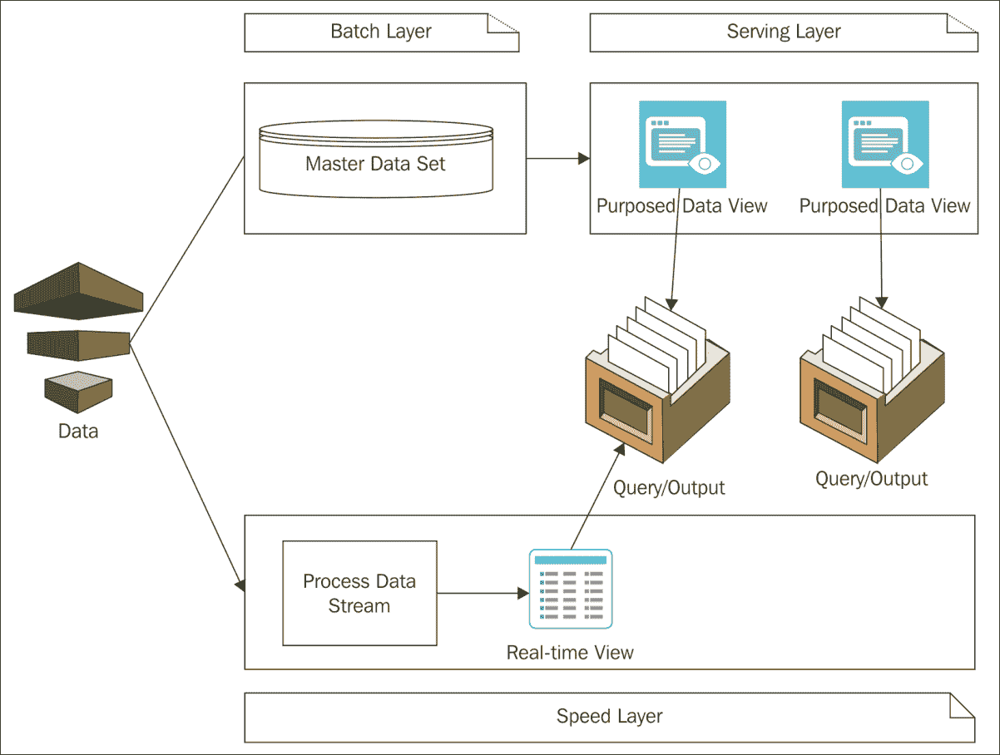
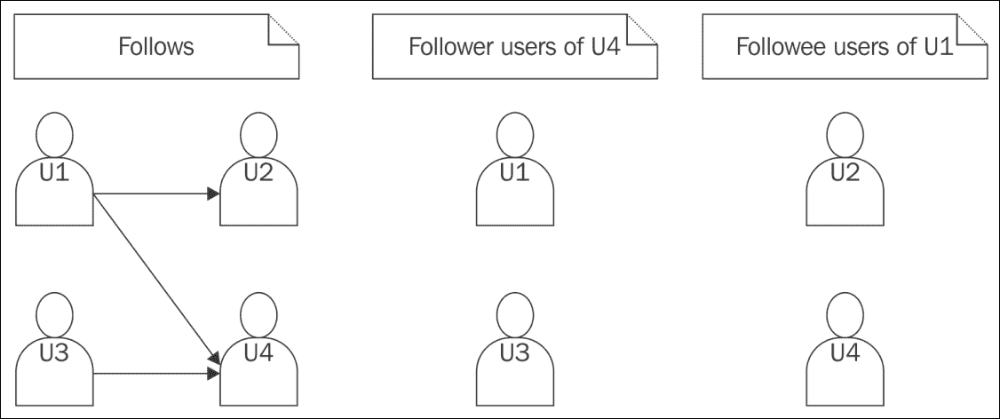
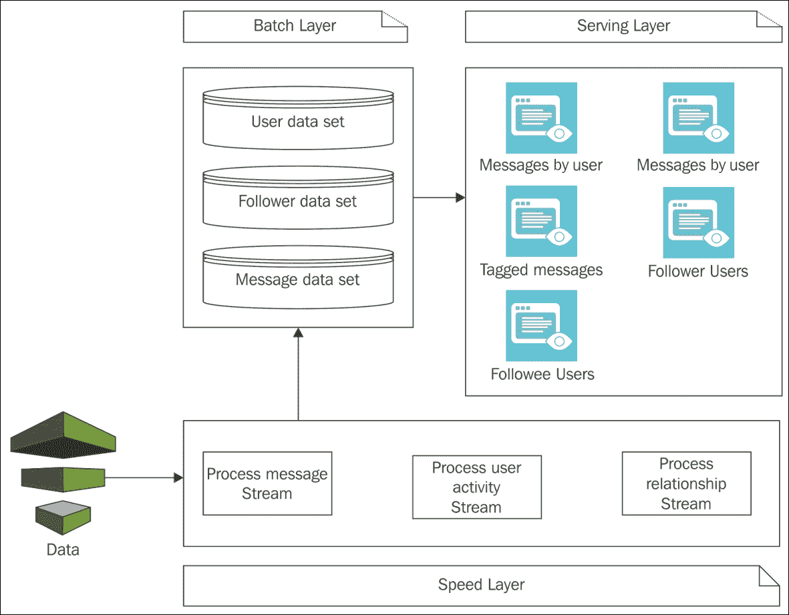
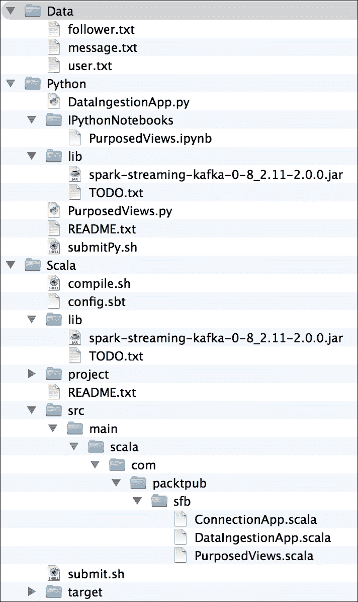
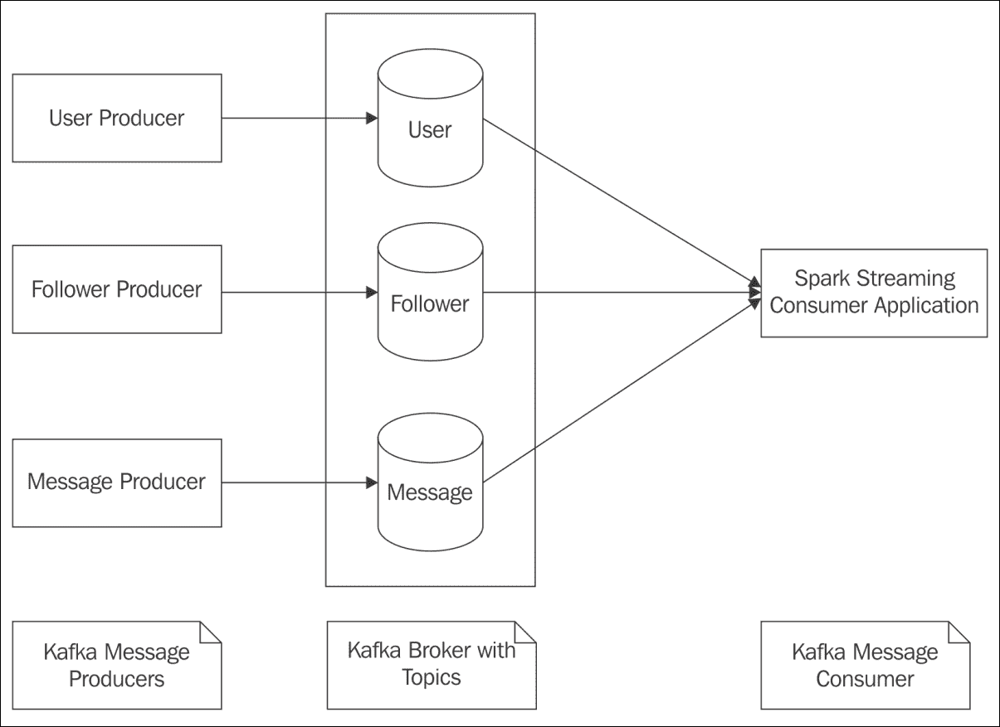

# 第九章：设计 Spark 应用程序

以函数式思维。以像管道一样设计的应用程序功能，每个部分都连接在一起，完成整个工作的某个部分。这全部关于数据处理，这正是 Spark 以高度灵活的方式所做的事情。数据处理从进入处理管道的种子数据开始。种子数据可以是系统摄取的新数据，也可以是某种存储在企业数据存储中的主数据集，需要被切割和重组以产生不同的视图，服务于各种目的和业务需求。在设计和发展数据处理应用程序时，这种切割和重组将成为常态。

任何应用程序开发练习都是从研究领域、业务需求`s`和技术工具选择开始的。这里也不例外。尽管本章将探讨 Spark 应用的设计和开发，但最初的焦点将放在数据处理应用程序的整体架构、用例、数据以及将数据从一种状态转换到另一种状态的应用程序上。Spark 只是一个将数据处理逻辑和数据组合在一起的驱动程序，利用其高度强大的基础设施产生所需的结果。

本章我们将涵盖以下主题：

+   Lambda 架构

+   使用 Spark 进行微博

+   数据字典

+   编码风格

+   数据摄取

# Lambda 架构

应用程序架构对于任何类型的软件开发都非常重要。它是决定软件如何构建的蓝图，具有相当程度的通用性和在需要时定制的功能。对于常见的应用程序需求，有一些流行的架构可供选择，使用它们不需要任何从头开始的架构努力。这些公共架构框架是由一些最优秀的大脑为公众的利益而设计的。这些流行的架构非常有用，因为它们没有进入障碍，并且被许多人使用。有流行的架构可供网络应用程序开发、数据处理等使用。

Lambda 架构是一种近期流行且理想的架构，适用于开发数据处理应用程序。市场上有很多工具和技术可用于开发数据处理应用程序。但独立于技术，数据处理应用程序组件的分层和组合是由架构框架驱动的。这就是为什么 Lambda 架构是一个技术无关的架构框架，根据需要，可以选择适当的技术来开发各个组件。*图 1* 捕捉了 Lambda 架构的精髓：



图 1

Lambda 架构由三层组成：

+   批处理层是主要的数据存储。任何类型的处理都发生在这个数据集上。这是金数据集。

+   服务层处理主数据集并为特定目的准备视图，在这里它们被称为预定视图。这个处理的中介步骤是必要的，用于服务查询或为特定需求生成输出。查询和特定数据集准备不直接访问主数据集。

+   速度层完全是关于数据流处理。数据流以实时方式处理，如果这是业务需求，则会准备易变的实时视图。查询或特定生成输出的过程可能从预定的数据视图和实时视图中消耗数据。

使用 Lambda 架构的原则来构建大数据处理系统，这里将使用 Spark 作为数据处理工具。Spark 非常适合所有三个不同层次的数据处理需求。

本章将讨论一些选定的微博应用数据处理用例。应用程序功能、其部署基础设施和可扩展性因素超出了本工作的范围。在典型的批处理层中，主数据集可以是普通的可分割序列化格式或 NoSQL 数据存储，具体取决于数据访问方法。如果应用程序用例都是批量操作，则标准序列化格式就足够了。但如果用例需要随机访问，NoSQL 数据存储将是理想的。在这里，为了简化，所有数据文件都存储在本地纯文本文件中。

典型的应用程序开发最终会形成一个完全功能的应用程序。但在这里，用例是在 Spark 数据处理应用程序中实现的。数据处理始终作为主应用程序功能的一部分，并计划以批量模式运行或作为监听器等待数据并处理它。因此，针对每个用例，都会开发单独的 Spark 应用程序，并且可以根据情况安排或使其以监听器模式运行。

# 使用 Lambda 架构进行微博

博客作为一种发布媒介已经存在了几十年，形式各异。在博客初期作为发布媒介的日子里，只有专业或渴望成为作家的作者通过博客发布文章。这导致了一个错误的观念，即只有严肃的内容才会通过博客发布。近年来，微博的概念让公众也加入了博客文化。微博是以几句话、照片、视频或链接的形式突然爆发出的个人思维过程。像 Twitter 和 Tumblr 这样的网站通过数亿活跃用户使用网站的方式，在最大规模上普及了这种文化。

## SfbMicroBlog 概述

**SfbMicroBlog**是一个拥有数百万用户发布短消息的微博应用。即将使用此应用的新用户需要使用用户名和密码进行注册。要发布消息，用户必须先登录。用户在不登录的情况下唯一能做的就是阅读用户发布的公开消息。用户可以关注其他用户。关注是一种单向关系。如果用户 A 关注用户 B，用户 A 可以看到用户 B 发布的所有消息；同时，用户 B 不能看到用户 A 发布的消息，因为用户 B 没有关注用户 A。默认情况下，所有用户发布的消息都是公开消息，可以被所有人看到。但用户有设置，可以使消息只对关注消息所有者的用户可见。成为关注者后，取消关注也是允许的。

用户名必须在所有用户中是唯一的。登录需要用户名和密码。每个用户都必须有一个主要电子邮件地址，没有这个地址，注册过程将不会完成。为了额外的安全性和密码恢复，可以在个人资料中保存备用电子邮件地址或手机号码。

消息长度不得超过 140 个字符。消息可以包含以#符号开头的前缀词，以将它们分组到不同的主题下。消息可以包含以@符号开头的前缀用户名，以通过发布的消息直接向用户发送。换句话说，用户可以在他们的消息中提及任何其他用户，而无需成为其关注者。

一旦发布，消息就不能更改。一旦发布，消息就不能删除。

## 熟悉数据

所有进入主数据集的数据都通过一个流进入。数据流被处理，检查每条消息的适当标题，并执行将其存储在数据存储中的正确操作。以下列表包含通过同一流进入存储的重要数据项：

+   **用户**: 此数据集包含用户在登录或用户数据变更时的详细信息

+   **关注者**: 此数据集包含当用户选择关注另一个用户时捕获的关系数据

+   **消息**: 此数据集包含注册用户发布的消息

此数据集列表构成了黄金数据集。基于此主数据集，创建了各种视图，以满足应用中关键业务功能的需求。以下列表包含主数据集的重要视图：

+   **用户消息**: 此视图包含系统中每个用户发布的消息。当特定用户想要查看他们自己发布的消息时，使用此视图生成的数据。这也被给定用户的关注者使用。这是一个主要数据集用于特定目的的情况。消息数据集为该视图提供了所有所需的数据。

+   **用户消息**：在消息中，可以通过在收件人用户名前加上@符号来指定特定用户。此数据视图包含使用@符号指定的用户和相应的消息。在实现中有一个限制：一条消息中只能有一个收件人。

+   **标记消息**：在消息中，以#符号开头的前缀单词成为可搜索的消息。例如，消息中的#spark 单词表示该消息可以通过#spark 进行搜索。对于给定的标签，用户可以看到所有公开消息以及他/她关注的用户的消息，都在一个列表中。此视图包含标签及其对应消息的配对。在实现中有一个限制：一条消息中只能有一个标签。

+   **关注用户**：此视图包含关注给定用户的用户列表。在*图 2*中，用户**U1**和**U3**在关注**U4**的用户列表中。

+   **关注用户**：此视图包含由给定用户关注的用户列表。在*图 2*中，用户**U2**和**U4**在用户**U1**关注的用户列表中：



图 2

简而言之，*图 3*给出了 Lambda 架构视图的解决方案，并提供了数据集和相应视图的详细信息：



图 3

## 设置数据字典

数据字典描述了数据、其含义以及与其他数据项的关系。对于 SfbMicroBlog 应用，数据字典将是一个非常简约的，以实现选定的用例。以此为基础，读者可以扩展并实现他们自己的数据项，并包括数据处理用例。数据字典提供了所有主数据集以及数据视图。

以下表格显示了用户数据集的数据项：

| **用户数据** | **类型** | **用途** |
| --- | --- | --- |
| Id | 长整型 | 用于唯一标识用户，同时也是用户关系图中的顶点标识符 |
| Username | 字符串 | 用于唯一标识系统用户 |
| 名字 | 字符串 | 用于捕获用户的第一个名字 |
| 姓氏 | 字符串 | 用于捕获用户的姓氏 |
| 电子邮件 | 字符串 | 用于与用户通信 |
| 备用电子邮件 | 字符串 | 用于密码恢复 |
| 主要电话 | 字符串 | 用于密码恢复 |

以下表格捕获了关注者数据集的数据项：

| **关注者数据** | **类型** | **用途** |
| --- | --- | --- |
| 关注者用户名 | 字符串 | 用于识别关注者 |
| 被关注用户名 | 字符串 | 用于识别被关注的人 |

以下表格捕获了消息数据集的数据项：

| **消息数据** | **类型** | **用途** |
| --- | --- | --- |
| Username | 字符串 | 用于捕获发布消息的用户 |
| 消息 ID | 长整型 | 用于唯一标识一条消息 |
| 消息 | 字符串 | 用于捕获正在发布的消息 |
| 时间戳 | 长整型 | 用于捕获消息发布的时间 |

以下表格捕获了消息到用户视图的数据项：

| **消息到用户数据** | **类型** | **用途** |
| --- | --- | --- |
| 发送者用户名 | 字符串 | 用于捕获发布消息的用户 |
| 目标用户名 | 字符串 | 用于捕获消息的目标用户；它是前缀为@符号的用户名 |
| 消息 ID | 长整型 | 用于唯一标识一条消息 |
| 消息 | 字符串 | 用于捕获正在发布的消息 |
| 时间戳 | 长整型 | 用于捕获消息发布的时间 |

以下表格捕获了标记消息视图的数据项：

| **标记消息数据** | **类型** | **用途** |
| --- | --- | --- |
| 标签 | 字符串 | 前缀为#符号的单词 |
| 用户名 | 字符串 | 用于捕获发布消息的用户 |
| 消息 ID | 长整型 | 用于唯一标识一条消息 |
| 消息 | 字符串 | 用于捕获正在发布的消息 |
| 时间戳 | 长整型 | 用于捕获消息发布的时间 |

用户的关注关系非常直接，由存储在数据存储中的用户标识号对组成。

# 实现 Lambda 架构

Lambda 架构的概念在本章的开头被引入。由于它是一个与技术无关的架构框架，当使用它设计应用程序时，捕捉特定实现中使用的具体技术选择是至关重要的。以下各节正是这样做的。

## 批处理层

批处理层的核心是一个数据存储。对于大数据应用，数据存储的选择有很多。通常，**Hadoop 分布式文件系统**（**HDFS**）与 Hadoop YARN 结合是当前和被接受的平台，数据存储在其中，主要是因为它能够在 Hadoop 集群中分区和分布数据。

任何持久存储支持两种类型的数据访问：

+   批处理读写

+   随机读写

这两者都需要单独的数据存储解决方案。对于批数据处理操作，通常使用可分割的序列化格式，如 Avro 和 Parquet。对于随机数据操作，通常使用 NoSQL 数据存储。其中一些 NoSQL 解决方案建立在 HDFS 之上，而另一些则不是。它们是否建立在 HDFS 之上并不重要，它们都提供了数据的分区和分布。因此，根据用例和正在使用的分布式平台，可以使用适当的解决方案。

当谈到在 HDFS 中存储数据时，常用的格式如 XML 和 JSON 失败，因为 HDFS 会分区和分发文件。当这种情况发生时，这些格式有开标签和结束标签，并且文件中的随机位置分割会使数据变得混乱。因此，可分割的文件格式如 Avro 或 Parquet 在 HDFS 中存储时效率更高。

当谈到 NoSQL 数据存储解决方案时，市场上有很多选择，尤其是来自开源世界的。其中一些 NoSQL 数据存储，如 Hbase，位于 HDFS 之上。还有一些 NoSQL 数据存储，如 Cassandra 和 Riak，不需要 HDFS，可以在常规操作系统上部署，并且可以以无主节点的方式部署，这样在集群中就没有单点故障。NoSQL 存储的选择再次取决于组织内部特定技术的使用、现有的生产支持合同以及许多其他参数。

### 小贴士

本书不推荐使用一组特定的数据存储技术与 Spark 一起使用，因为 Spark 驱动程序对于大多数流行的序列化格式和 NoSQL 数据存储都是丰富的。换句话说，大多数数据存储供应商已经开始大规模支持 Spark。另一个有趣的趋势是，许多突出的 ETL 工具开始支持 Spark，因此使用此类 ETL 工具的人可以在他们的 ETL 处理管道中使用 Spark 应用程序。

在这个应用中，既没有使用基于 HDFS 的数据存储，也没有使用任何基于 NoSQL 的数据存储，目的是为了保持简单，并避免为读者运行应用所需的复杂基础设施设置。在整个过程中，数据都存储在本地系统上的文本文件格式中。对尝试在 HDFS 或其他 NoSQL 数据存储上运行示例感兴趣的读者可以尝试，只需对应用的数据读写部分进行一些修改。

## 服务层

服务层可以使用 Spark 通过各种方法实现。如果数据是非结构化的且完全是基于对象的，那么基于低级 RDD 的方法是合适的。如果数据是结构化的，DataFrame 是理想的。这里讨论的使用案例是处理结构化数据，因此尽可能使用 Spark SQL 库。从数据存储中读取数据并创建 RDD。将 RDD 转换为 DataFrame，并使用 Spark SQL 完成所有服务需求。这样，代码将简洁易懂。

## 速度层

速度层将作为一个使用 Kafka 作为代理的 Spark Streaming 应用程序来实现，该代理有自己的生产者来产生消息。Spark Streaming 应用程序将作为 Kafka 主题的消费者，接收正在产生的数据。如 Spark Streaming 章节所述，生产者可以是 Kafka 控制台生产者或 Kafka 支持的任何其他生产者。但在此作为消费者的 Spark Streaming 应用程序不会实现将处理后的消息持久化到文本文件的逻辑，因为这些在现实世界的用例中通常不使用。以这个应用程序为基础，读者可以实施他们自己的持久化机制。

### 查询

所有查询都来自速度层和服务层。由于数据以 DataFrame 的形式提供，如前所述，所有针对用例的查询都是使用 Spark SQL 实现的。显而易见的原因是 Spark SQL 作为一种统一数据源和目的地的技术。当读者使用本书中的示例，并且准备在现实世界的用例中实施时，整体方法可以保持不变，但数据源和目的地可能不同。以下是一些可以从服务层生成的查询。读者可以根据自己的想象对数据字典进行必要的更改，以便能够编写这些视图或查询：

+   找到按给定标签分组的消息

+   找到发送给指定用户的消息

+   找到指定用户的粉丝

+   找到指定用户的关注者

# 与 Spark 应用程序一起工作

此应用程序的工作核心是数据处理引擎，由许多 Spark 应用程序组成。通常，它们可以分为以下类型：

+   一个用于摄取数据的 Spark Streaming 应用程序：这是主要监听应用程序，它接收作为流传入的数据并将其存储在适当的总数据集中。

+   一个用于创建目的视图和查询的 Spark 应用程序：这是用于从主数据集中创建各种目的视图的应用程序。除此之外，查询也包括在这个应用程序中。

+   一个用于执行自定义数据处理的 Spark GraphX 应用程序：这是用于处理用户关注关系的应用程序。

所有这些应用都是独立开发的，并且独立提交，但流处理应用将始终作为一个监听应用运行，以处理传入的消息。除了主要的数据流应用外，所有其他应用都像常规作业一样进行调度，例如 UNIX 系统中的 cron 作业。在这个应用中，所有这些应用都在生成各种目的的视图。调度取决于应用类型以及主数据集和视图之间可以接受的延迟量。这完全取决于业务功能。因此，本章将专注于 Spark 应用开发，而不是调度，以保持对早期章节中学到的教训的关注。

### 小贴士

在实现实际应用场景时，将速度层的数据持续存储到文本文件中并不是最佳选择。为了简化，所有数据都存储在文本文件中，以便让所有层次的读者都能以最简单的设置使用。使用 Spark Streaming 实现的速度层是一个没有持久化逻辑的骨架实现。读者可以增强这一点，将持久化引入他们希望的数据存储中。

# 代码风格

代码风格已在早期章节中讨论，并且已经进行了大量的 Spark 应用程序编程。到目前为止，本书已经证明 Spark 应用开发可以使用 Scala、Python 和 R 语言进行。在大多数早期章节中，选择的语言是 Scala 和 Python。在本章中，这一趋势将继续。只有对于 Spark GraphX 应用，由于没有 Python 支持，应用将仅使用 Scala 开发。

代码风格将简单直接。为了专注于 Spark 功能，故意避免了错误处理和其他最佳实践的应用开发。在本章中，尽可能从适当语言的 Spark REPL 运行代码。由于完整的应用程序结构和构建、编译和作为应用程序运行它们的脚本已在讨论 Spark Streaming 的章节中介绍，源代码下载将提供完整、可运行的应用程序。此外，讨论 Spark Streaming 的章节还介绍了完整 Spark 应用程序的结构，包括构建和运行 Spark 应用程序的脚本。同样的方法也将用于本章将要开发的应用程序。当运行此类独立 Spark 应用程序时，如本书最初章节所述，读者可以启用 Spark 监控并查看应用程序的行为。为了简洁起见，这些讨论将不再在此处进行。

# 设置源代码

*图 4*展示了本章中使用的源代码结构和数据目录的结构。这里没有提供每个部分的描述，因为读者应该熟悉它们，并且它们已在第六章中介绍，*Spark 流处理*。运行使用 Kafka 的程序需要外部库文件依赖项。为此，在 `lib` 文件夹中的 `TODO.txt` 文件中有下载 JAR 文件的说明。`submitPy.sh` 和 `submit.sh` 文件还使用了 Kafka 安装中的某些 Kafka 库。所有这些外部 JAR 文件依赖项已在第六章中介绍，*Spark 流处理*。



图 4

# 理解数据摄取

Spark Streaming 应用程序作为监听应用程序，接收来自其生产者的数据。由于 Kafka 将用作消息代理，Spark Streaming 应用程序将成为其消费者应用程序，监听由其生产者发送的主题。由于批处理层中的主数据集包含以下数据集，因此为每个主题以及数据集创建单独的 Kafka 主题是理想的。

+   用户数据集：User

+   关注者数据集：Follower

+   消息数据集：Message

*图 5*展示了基于 Kafka 的 Spark Streaming 应用程序结构的整体视图：



图 5

由于 Kafka 设置已在第六章中介绍，*Spark 流处理*，因此这里只介绍应用程序代码。

以下脚本需要在终端窗口中运行。请确保环境变量 `$KAFKA_HOME` 指向 Kafka 安装的目录。此外，非常重要的一点是，需要在单独的终端窗口中启动 Zookeeper、Kafka 服务器、Kafka 生产者和 Spark Streaming 日志事件数据处理应用程序。一旦脚本中显示的必要 Kafka 主题创建完成，相应的生产者必须开始产生消息。在继续之前，请参考已在第六章中介绍的 Kafka 设置细节，*Spark 流处理*。

在终端窗口提示符中尝试以下命令：

```py
 $ # Start the Zookeeper 
$ cd $KAFKA_HOME
$ $KAFKA_HOME/bin/zookeeper-server-start.sh
 $KAFKA_HOME/config/zookeeper.properties
      [2016-07-30 12:50:15,896] INFO binding to port 0.0.0.0/0.0.0.0:2181
	  (org.apache.zookeeper.server.NIOServerCnxnFactory)

	$ # Start the Kafka broker in a separate terminal window
	$ $KAFKA_HOME/bin/kafka-server-start.sh $KAFKA_HOME/config/server.properties
      [2016-07-30 12:51:39,206] INFO [Kafka Server 0], started 
	  (kafka.server.KafkaServer)

	$ # Create the necessary Kafka topics. This is to be done in a separate terminal window
	$ $KAFKA_HOME/bin/kafka-topics.sh --create --zookeeper localhost:2181
	--replication-factor 1 --partitions 1 --topic user
      Created topic "user".
    $ $KAFKA_HOME/bin/kafka-topics.sh --create --zookeeper localhost:2181
	--replication-factor 1 --partitions 1 --topic follower
      Created topic "follower".

	$ $KAFKA_HOME/bin/kafka-topics.sh --create --zookeeper localhost:2181
	--replication-factor 1 --partitions 1 --topic message
      Created topic "message".

	$ # Start producing messages and publish to the topic "message"
	$ $KAFKA_HOME/bin/kafka-console-producer.sh --broker-list localhost:9092 
	--topic message

```

本节提供了处理 Kafka 生成者产生的消息的 Kafka 主题消费者应用程序的 Scala 代码的详细信息。在运行以下代码片段之前，假设 Kafka 正在运行，所需的生成者正在产生消息，然后，如果运行应用程序，它将开始消费消息。运行数据摄取的 Scala 程序是通过将其提交到 Spark 集群来完成的。从 *图 4* 所示的 Scala 目录开始，首先编译程序然后运行它。需要查阅 `README.txt` 文件以获取额外说明。需要执行以下两个命令来编译和运行程序：

```py
 $ ./compile.sh
	$ ./submit.sh com.packtpub.sfb.DataIngestionApp 1

```

下面的代码是要使用前面命令编译和运行的程序列表：

```py
 /**
	The following program can be compiled and run using SBT
	Wrapper scripts have been provided with thisThe following script can be run to compile the code
	./compile.sh
	The following script can be used to run this application in Spark.
	The second command line argument of value 1 is very important.
	This is to flag the shipping of the kafka jar files to the Spark cluster
	./submit.sh com.packtpub.sfb.DataIngestionApp 1
	**/
	package com.packtpub.sfb
	import java.util.HashMap
	import org.apache.spark.streaming._
	import org.apache.spark.sql.{Row, SparkSession}
	import org.apache.spark.streaming.kafka._
	import org.apache.kafka.clients.producer.{ProducerConfig, KafkaProducer, ProducerRecord}
	import org.apache.spark.storage.StorageLevel
	import org.apache.log4j.{Level, Logger}
	object DataIngestionApp {
	def main(args: Array[String]) {
	// Log level settings
	LogSettings.setLogLevels()
	//Check point directory for the recovery
	val checkPointDir = "/tmp"
    /**
    * The following function has to be used to have checkpointing and driver recovery
    * The way it should be used is to use the StreamingContext.getOrCreate with this function and do a start of that
	* This function example has been discussed but not used in the chapter covering Spark Streaming. But here it is being used    */
    def sscCreateFn(): StreamingContext = {
	// Variables used for creating the Kafka stream
	// Zookeeper host
	val zooKeeperQuorum = "localhost"
	// Kaka message group
	val messageGroup = "sfb-consumer-group"
	// Kafka topic where the programming is listening for the data
	// Reader TODO: Here only one topic is included, it can take a comma separated string containing the list of topics. 
	// Reader TODO: When using multiple topics, use your own logic to extract the right message and persist to its data store
	val topics = "message"
	val numThreads = 1     
	// Create the Spark Session, the spark context and the streaming context      
	val spark = SparkSession
	.builder
	.appName(getClass.getSimpleName)
	.getOrCreate()
	val sc = spark.sparkContext
	val ssc = new StreamingContext(sc, Seconds(10))
	val topicMap = topics.split(",").map((_, numThreads.toInt)).toMap
	val messageLines = KafkaUtils.createStream(ssc, zooKeeperQuorum, messageGroup, topicMap).map(_._2)
	// This is where the messages are printed to the console. 
	// TODO - As an exercise to the reader, instead of printing messages to the console, implement your own persistence logic
	messageLines.print()
	//Do checkpointing for the recovery
	ssc.checkpoint(checkPointDir)
	// return the Spark Streaming Context
	ssc
    }
	// Note the function that is defined above for creating the Spark streaming context is being used here to create the Spark streaming context. 
	val ssc = StreamingContext.getOrCreate(checkPointDir, sscCreateFn)
	// Start the streaming
    ssc.start()
	// Wait till the application is terminated               
    ssc.awaitTermination() 
	}
	}
	object LogSettings {
	/** 
	Necessary log4j logging level settings are done 
	*/
	def setLogLevels() {
    val log4jInitialized = Logger.getRootLogger.getAllAppenders.hasMoreElements
    if (!log4jInitialized) {
	// This is to make sure that the console is clean from other INFO messages printed by Spark
	Logger.getRootLogger.setLevel(Level.INFO)
    }
	}
	}

```

运行数据摄取的 Python 程序是通过将其提交到 Spark 集群来完成的。从 *图 4* 所示的 Python 目录开始，运行程序。需要查阅 `README.txt` 文件以获取额外说明。即使运行此 Python 程序，所有 Kafka 安装要求仍然有效。运行程序的命令如下。由于 Python 是一种解释型语言，这里不需要编译：

```py
 $ ./submitPy.sh DataIngestionApp.py 1

```

下面的代码片段是相同应用的 Python 实现：

```py
 # The following script can be used to run this application in Spark
# ./submitPy.sh DataIngestionApp.py 1
  from __future__ import print_function
  import sys
  from pyspark import SparkContext
  from pyspark.streaming import StreamingContext
  from pyspark.streaming.kafka import KafkaUtils
  if __name__ == "__main__":
# Create the Spark context
  sc = SparkContext(appName="DataIngestionApp")
  log4j = sc._jvm.org.apache.log4j
  log4j.LogManager.getRootLogger().setLevel(log4j.Level.WARN)
# Create the Spark Streaming Context with 10 seconds batch interval
  ssc = StreamingContext(sc, 10)
# Check point directory setting
  ssc.checkpoint("\tmp")
# Zookeeper host
  zooKeeperQuorum="localhost"
# Kaka message group
  messageGroup="sfb-consumer-group"
# Kafka topic where the programming is listening for the data
# Reader TODO: Here only one topic is included, it can take a comma separated  string containing the list of topics. 
# Reader TODO: When using multiple topics, use your own logic to extract the right message and persist to its data store
topics = "message"
numThreads = 1    
# Create a Kafka DStream
kafkaStream = KafkaUtils.createStream(ssc, zooKeeperQuorum, messageGroup, {topics: numThreads})
messageLines = kafkaStream.map(lambda x: x[1])
# This is where the messages are printed to the console. Instead of this, implement your own persistence logic
messageLines.pprint()
# Start the streaming
ssc.start()
# Wait till the application is terminated   
ssc.awaitTermination() 

```

# 生成目的视图和查询

下面的 Scala 和 Python 实现是创建本章前面部分讨论的目的视图和查询的应用程序。在 Scala REPL 提示符下，尝试以下语句：

```py
 //TODO: Change the following directory to point to your data directory
scala> val dataDir = "/Users/RajT/Documents/Writing/SparkForBeginners/To-PACKTPUB/Contents/B05289-09-DesigningSparkApplications/Code/Data/"
      dataDir: String = /Users/RajT/Documents/Writing/SparkForBeginners/To-PACKTPUB/Contents/B05289-09-DesigningSparkApplications/Code/Data/
    scala> //Define the case classes in Scala for the entities
	scala> case class User(Id: Long, UserName: String, FirstName: String, LastName: String, EMail: String, AlternateEmail: String, Phone: String)
      defined class User
    scala> case class Follow(Follower: String, Followed: String)
      defined class Follow
    scala> case class Message(UserName: String, MessageId: Long, ShortMessage: String, Timestamp: Long)
      defined class Message
    scala> case class MessageToUsers(FromUserName: String, ToUserName: String, MessageId: Long, ShortMessage: String, Timestamp: Long)
      defined class MessageToUsers
    scala> case class TaggedMessage(HashTag: String, UserName: String, MessageId: Long, ShortMessage: String, Timestamp: Long)
      defined class TaggedMessage
    scala> //Define the utility functions that are to be passed in the applications
	scala> def toUser =  (line: Seq[String]) => User(line(0).toLong, line(1), line(2),line(3), line(4), line(5), line(6))
      toUser: Seq[String] => User
    scala> def toFollow =  (line: Seq[String]) => Follow(line(0), line(1))
      toFollow: Seq[String] => Follow
    scala> def toMessage =  (line: Seq[String]) => Message(line(0), line(1).toLong, line(2), line(3).toLong)
      toMessage: Seq[String] => Message
    scala> //Load the user data into a Dataset
	scala> val userDataDS = sc.textFile(dataDir + "user.txt").map(_.split("\\|")).map(toUser(_)).toDS()
      userDataDS: org.apache.spark.sql.Dataset[User] = [Id: bigint, UserName: string ... 5 more fields]
    scala> //Convert the Dataset into data frame
	scala> val userDataDF = userDataDS.toDF()
      userDataDF: org.apache.spark.sql.DataFrame = [Id: bigint, UserName: string ... 5 more fields]
    scala> userDataDF.createOrReplaceTempView("user")
	scala> userDataDF.show()
      +---+--------+---------+--------+--------------------+----------------+--------------+

      | Id|UserName|FirstName|LastName|               EMail|  AlternateEmail|         Phone|

      +---+--------+---------+--------+--------------------+----------------+--------------+

      |  1| mthomas|     Mark|  Thomas| mthomas@example.com|mt12@example.com|+4411860297701|

      |  2|mithomas|  Michael|  Thomas|mithomas@example.com| mit@example.com|+4411860297702|

      |  3|  mtwain|     Mark|   Twain|  mtwain@example.com| mtw@example.com|+4411860297703|

      |  4|  thardy|   Thomas|   Hardy|  thardy@example.com|  th@example.com|+4411860297704|

      |  5| wbryson|  William|  Bryson| wbryson@example.com|  bb@example.com|+4411860297705|

      |  6|   wbrad|  William|Bradford|   wbrad@example.com|  wb@example.com|+4411860297706|

      |  7| eharris|       Ed|  Harris| eharris@example.com|  eh@example.com|+4411860297707|

      |  8|   tcook|   Thomas|    Cook|   tcook@example.com|  tk@example.com|+4411860297708|

      |  9| arobert|     Adam|  Robert| arobert@example.com|  ar@example.com|+4411860297709|

      | 10|  jjames|    Jacob|   James|  jjames@example.com|  jj@example.com|+4411860297710|

      +---+--------+---------+--------+--------------------+----------------+--------------+
    scala> //Load the follower data into an Dataset
	scala> val followerDataDS = sc.textFile(dataDir + "follower.txt").map(_.split("\\|")).map(toFollow(_)).toDS()
      followerDataDS: org.apache.spark.sql.Dataset[Follow] = [Follower: string, Followed: string]
    scala> //Convert the Dataset into data frame
	scala> val followerDataDF = followerDataDS.toDF()
      followerDataDF: org.apache.spark.sql.DataFrame = [Follower: string, Followed: string]
    scala> followerDataDF.createOrReplaceTempView("follow")
	scala> followerDataDF.show()
      +--------+--------+

      |Follower|Followed|

      +--------+--------+

      | mthomas|mithomas|

      | mthomas|  mtwain|

      |  thardy| wbryson|

      |   wbrad| wbryson|

      | eharris| mthomas|

      | eharris|   tcook|

      | arobert|  jjames|

      +--------+--------+
    scala> //Load the message data into an Dataset
	scala> val messageDataDS = sc.textFile(dataDir + "message.txt").map(_.split("\\|")).map(toMessage(_)).toDS()
      messageDataDS: org.apache.spark.sql.Dataset[Message] = [UserName: string, MessageId: bigint ... 2 more fields]
    scala> //Convert the Dataset into data frame
	scala> val messageDataDF = messageDataDS.toDF()
      messageDataDF: org.apache.spark.sql.DataFrame = [UserName: string, MessageId: bigint ... 2 more fields]
    scala> messageDataDF.createOrReplaceTempView("message")
	scala> messageDataDF.show()
      +--------+---------+--------------------+----------+

      |UserName|MessageId|        ShortMessage| Timestamp|

      +--------+---------+--------------------+----------+

      | mthomas|        1|@mithomas Your po...|1459009608|

      | mthomas|        2|Feeling awesome t...|1459010608|

      |  mtwain|        3|My namesake in th...|1459010776|

      |  mtwain|        4|Started the day w...|1459011016|

      |  thardy|        5|It is just spring...|1459011199|

      | wbryson|        6|Some days are rea...|1459011256|

      |   wbrad|        7|@wbryson Stuff ha...|1459011333|

      | eharris|        8|Anybody knows goo...|1459011426|

      |   tcook|        9|Stock market is p...|1459011483|

      |   tcook|       10|Dont do day tradi...|1459011539|

      |   tcook|       11|I have never hear...|1459011622|

      |   wbrad|       12|#Barcelona has pl...|1459157132|

      |  mtwain|       13|@wbryson It is go...|1459164906|

      +--------+---------+--------------------+----------+ 

```

这些步骤完成了将所有必需数据从持久存储加载到 DataFrame 的过程。在这里，数据来自文本文件。在实际应用场景中，数据可能来自流行的 NoSQL 数据存储、传统的 RDBMS 表，或从 HDFS 加载的 Avro 或 Parquet 序列化数据存储。

下文使用这些 DataFrame 创建了各种目的的视图和查询：

```py
 scala> //Create the purposed view of the message to users
	scala> val messagetoUsersDS = messageDataDS.filter(_.ShortMessage.contains("@")).map(message => (message.ShortMessage.split(" ").filter(_.contains("@")).mkString(" ").substring(1), message)).map(msgTuple => MessageToUsers(msgTuple._2.UserName, msgTuple._1, msgTuple._2.MessageId, msgTuple._2.ShortMessage, msgTuple._2.Timestamp))
      messagetoUsersDS: org.apache.spark.sql.Dataset[MessageToUsers] = [FromUserName: string, ToUserName: string ... 3 more fields]

	scala> //Convert the Dataset into data frame
	scala> val messagetoUsersDF = messagetoUsersDS.toDF()
      messagetoUsersDF: org.apache.spark.sql.DataFrame = [FromUserName: string, ToUserName: string ... 3 more fields]

	scala> messagetoUsersDF.createOrReplaceTempView("messageToUsers")
	scala> messagetoUsersDF.show()
      +------------+----------+---------+--------------------+----------+

      |FromUserName|ToUserName|MessageId|        ShortMessage| Timestamp|

      +------------+----------+---------+--------------------+----------+

      |     mthomas|  mithomas|        1|@mithomas Your po...|1459009608|

      |       wbrad|   wbryson|        7|@wbryson Stuff ha...|1459011333|

      |      mtwain|   wbryson|       13|@wbryson It is go...|1459164906|

      +------------+----------+---------+--------------------+----------+
    scala> //Create the purposed view of tagged messages 
	scala> val taggedMessageDS = messageDataDS.filter(_.ShortMessage.contains("#")).map(message => (message.ShortMessage.split(" ").filter(_.contains("#")).mkString(" "), message)).map(msgTuple => TaggedMessage(msgTuple._1, msgTuple._2.UserName, msgTuple._2.MessageId, msgTuple._2.ShortMessage, msgTuple._2.Timestamp))
      taggedMessageDS: org.apache.spark.sql.Dataset[TaggedMessage] = [HashTag: string, UserName: string ... 3 more fields]

	scala> //Convert the Dataset into data frame
	scala> val taggedMessageDF = taggedMessageDS.toDF()
      taggedMessageDF: org.apache.spark.sql.DataFrame = [HashTag: string, UserName: string ... 3 more fields]

	scala> taggedMessageDF.createOrReplaceTempView("taggedMessages")
	scala> taggedMessageDF.show()
      +----------+--------+---------+--------------------+----------+

      |   HashTag|UserName|MessageId|        ShortMessage| Timestamp|

      +----------+--------+---------+--------------------+----------+

      |#Barcelona| eharris|        8|Anybody knows goo...|1459011426|

      |#Barcelona|   wbrad|       12|#Barcelona has pl...|1459157132|

      +----------+--------+---------+--------------------+----------+

	scala> //The following are the queries given in the use cases
	scala> //Find the messages that are grouped by a given hash tag
	scala> val byHashTag = spark.sql("SELECT a.UserName, b.FirstName, b.LastName, a.MessageId, a.ShortMessage, a.Timestamp FROM taggedMessages a, user b WHERE a.UserName = b.UserName AND HashTag = '#Barcelona' ORDER BY a.Timestamp")
      byHashTag: org.apache.spark.sql.DataFrame = [UserName: string, FirstName: string ... 4 more fields]

	scala> byHashTag.show()
      +--------+---------+--------+---------+--------------------+----------+

      |UserName|FirstName|LastName|MessageId|        ShortMessage| Timestamp|

      +--------+---------+--------+---------+--------------------+----------+

      | eharris|       Ed|  Harris|        8|Anybody knows goo...|1459011426|

      |   wbrad|  William|Bradford|       12|#Barcelona has pl...|1459157132|

      +--------+---------+--------+---------+--------------------+----------+

	scala> //Find the messages that are addressed to a given user
	scala> val byToUser = spark.sql("SELECT FromUserName, ToUserName, MessageId, ShortMessage, Timestamp FROM messageToUsers WHERE ToUserName = 'wbryson' ORDER BY Timestamp")
      byToUser: org.apache.spark.sql.DataFrame = [FromUserName: string, ToUserName: string ... 3 more fields]

	scala> byToUser.show()
      +------------+----------+---------+--------------------+----------+

      |FromUserName|ToUserName|MessageId|        ShortMessage| Timestamp|

      +------------+----------+---------+--------------------+----------+

      |       wbrad|   wbryson|        7|@wbryson Stuff ha...|1459011333|

      |      mtwain|   wbryson|       13|@wbryson It is go...|1459164906|

      +------------+----------+---------+--------------------+----------+
    scala> //Find the followers of a given user
	scala> val followers = spark.sql("SELECT b.FirstName as FollowerFirstName, b.LastName as FollowerLastName, a.Followed FROM follow a, user b WHERE a.Follower = b.UserName AND a.Followed = 'wbryson'")
      followers: org.apache.spark.sql.DataFrame = [FollowerFirstName: string, FollowerLastName: string ... 1 more field]
    scala> followers.show()
      +-----------------+----------------+--------+

      |FollowerFirstName|FollowerLastName|Followed|

      +-----------------+----------------+--------+

      |          William|        Bradford| wbryson|

      |           Thomas|           Hardy| wbryson|

      +-----------------+----------------+--------+

	scala> //Find the followedUsers of a given user
	scala> val followedUsers = spark.sql("SELECT b.FirstName as FollowedFirstName, b.LastName as FollowedLastName, a.Follower FROM follow a, user b WHERE a.Followed = b.UserName AND a.Follower = 'eharris'")
      followedUsers: org.apache.spark.sql.DataFrame = [FollowedFirstName: string, FollowedLastName: string ... 1 more field]
    scala> followedUsers.show()
      +-----------------+----------------+--------+

      |FollowedFirstName|FollowedLastName|Follower|

      +-----------------+----------------+--------+

      |           Thomas|            Cook| eharris|

      |             Mark|          Thomas| eharris|

      +-----------------+----------------+--------+ 

```

在前面的 Scala 代码片段中，由于选择的语言是 Scala，因此使用了数据集和 DataFrame 基于的编程模型。现在，由于 Python 不是一个强类型语言，Python 中不支持 Dataset API，因此下面的 Python 代码使用了 Spark 的传统 RDD 基于的编程模型与 DataFrame 基于的编程模型结合。在 Python REPL 提示符下，尝试以下语句：

```py
 >>> from pyspark.sql import Row
	>>> #TODO: Change the following directory to point to your data directory
	>>> dataDir = "/Users/RajT/Documents/Writing/SparkForBeginners/To-PACKTPUB/Contents/B05289-09-DesigningSparkApplications/Code/Data/"
	>>> #Load the user data into an RDD
	>>> userDataRDD = sc.textFile(dataDir + "user.txt").map(lambda line: line.split("|")).map(lambda p: Row(Id=int(p[0]), UserName=p[1], FirstName=p[2], LastName=p[3], EMail=p[4], AlternateEmail=p[5], Phone=p[6]))
	>>> #Convert the RDD into data frame
	>>> userDataDF = userDataRDD.toDF()
	>>> userDataDF.createOrReplaceTempView("user")
	>>> userDataDF.show()
      +----------------+--------------------+---------+---+--------+--------------+--------+

      |  AlternateEmail|               EMail|FirstName| Id|LastName|         Phone|UserName|

      +----------------+--------------------+---------+---+--------+--------------+--------+

      |mt12@example.com| mthomas@example.com|     Mark|  1|  Thomas|+4411860297701| mthomas|

      | mit@example.com|mithomas@example.com|  Michael|  2|  Thomas|+4411860297702|mithomas|

      | mtw@example.com|  mtwain@example.com|     Mark|  3|   Twain|+4411860297703|  mtwain|

      |  th@example.com|  thardy@example.com|   Thomas|  4|   Hardy|+4411860297704|  thardy|

      |  bb@example.com| wbryson@example.com|  William|  5|  Bryson|+4411860297705| wbryson|

      |  wb@example.com|   wbrad@example.com|  William|  6|Bradford|+4411860297706|   wbrad|

      |  eh@example.com| eharris@example.com|       Ed|  7|  Harris|+4411860297707| eharris|

      |  tk@example.com|   tcook@example.com|   Thomas|  8|    Cook|+4411860297708|   tcook|

      |  ar@example.com| arobert@example.com|     Adam|  9|  Robert|+4411860297709| arobert|

      |  jj@example.com|  jjames@example.com|    Jacob| 10|   James|+4411860297710|  jjames|

      +----------------+--------------------+---------+---+--------+--------------+--------+

	>>> #Load the follower data into an RDD
	>>> followerDataRDD = sc.textFile(dataDir + "follower.txt").map(lambda line: line.split("|")).map(lambda p: Row(Follower=p[0], Followed=p[1]))
	>>> #Convert the RDD into data frame
	>>> followerDataDF = followerDataRDD.toDF()
	>>> followerDataDF.createOrReplaceTempView("follow")
	>>> followerDataDF.show()
      +--------+--------+

      |Followed|Follower|

      +--------+--------+

      |mithomas| mthomas|

      |  mtwain| mthomas|

      | wbryson|  thardy|

      | wbryson|   wbrad|

      | mthomas| eharris|

      |   tcook| eharris|

      |  jjames| arobert|

      +--------+--------+

	>>> #Load the message data into an RDD
	>>> messageDataRDD = sc.textFile(dataDir + "message.txt").map(lambda line: line.split("|")).map(lambda p: Row(UserName=p[0], MessageId=int(p[1]), ShortMessage=p[2], Timestamp=int(p[3])))
	>>> #Convert the RDD into data frame
	>>> messageDataDF = messageDataRDD.toDF()
	>>> messageDataDF.createOrReplaceTempView("message")
	>>> messageDataDF.show()
      +---------+--------------------+----------+--------+

      |MessageId|        ShortMessage| Timestamp|UserName|

      +---------+--------------------+----------+--------+

      |        1|@mithomas Your po...|1459009608| mthomas|

      |        2|Feeling awesome t...|1459010608| mthomas|

      |        3|My namesake in th...|1459010776|  mtwain|

      |        4|Started the day w...|1459011016|  mtwain|

      |        5|It is just spring...|1459011199|  thardy|

      |        6|Some days are rea...|1459011256| wbryson|

      |        7|@wbryson Stuff ha...|1459011333|   wbrad|

      |        8|Anybody knows goo...|1459011426| eharris|

      |        9|Stock market is p...|1459011483|   tcook|

      |       10|Dont do day tradi...|1459011539|   tcook|

      |       11|I have never hear...|1459011622|   tcook|

      |       12|#Barcelona has pl...|1459157132|   wbrad|

      |       13|@wbryson It is go...|1459164906|  mtwain|

      +---------+--------------------+----------+--------+ 

```

这些步骤完成了将所有必需数据从持久存储加载到 DataFrame 的过程。在这里，数据来自文本文件。在实际应用场景中，数据可能来自流行的 NoSQL 数据存储、传统的 RDBMS 表，或从 HDFS 加载的 Avro 或 Parquet 序列化数据存储。下文使用这些 DataFrame 创建了各种目的的视图和查询：

```py
 >>> #Create the purposed view of the message to users
	>>> messagetoUsersRDD = messageDataRDD.filter(lambda message: "@" in message.ShortMessage).map(lambda message : (message, " ".join(filter(lambda s: s[0] == '@', message.ShortMessage.split(" "))))).map(lambda msgTuple: Row(FromUserName=msgTuple[0].UserName, ToUserName=msgTuple[1][1:], MessageId=msgTuple[0].MessageId, ShortMessage=msgTuple[0].ShortMessage, Timestamp=msgTuple[0].Timestamp))
	>>> #Convert the RDD into data frame
	>>> messagetoUsersDF = messagetoUsersRDD.toDF()
	>>> messagetoUsersDF.createOrReplaceTempView("messageToUsers")
	>>> messagetoUsersDF.show()
      +------------+---------+--------------------+----------+----------+

      |FromUserName|MessageId|        ShortMessage| Timestamp|ToUserName|

      +------------+---------+--------------------+----------+----------+

      |     mthomas|        1|@mithomas Your po...|1459009608|  mithomas|

      |       wbrad|        7|@wbryson Stuff ha...|1459011333|   wbryson|

      |      mtwain|       13|@wbryson It is go...|1459164906|   wbryson|

      +------------+---------+--------------------+----------+----------+

	>>> #Create the purposed view of tagged messages 
	>>> taggedMessageRDD = messageDataRDD.filter(lambda message: "#" in message.ShortMessage).map(lambda message : (message, " ".join(filter(lambda s: s[0] == '#', message.ShortMessage.split(" "))))).map(lambda msgTuple: Row(HashTag=msgTuple[1], UserName=msgTuple[0].UserName, MessageId=msgTuple[0].MessageId, ShortMessage=msgTuple[0].ShortMessage, Timestamp=msgTuple[0].Timestamp))
	>>> #Convert the RDD into data frame
	>>> taggedMessageDF = taggedMessageRDD.toDF()
	>>> taggedMessageDF.createOrReplaceTempView("taggedMessages")
	>>> taggedMessageDF.show()
      +----------+---------+--------------------+----------+--------+

      |   HashTag|MessageId|        ShortMessage| Timestamp|UserName|

      +----------+---------+--------------------+----------+--------+

      |#Barcelona|        8|Anybody knows goo...|1459011426| eharris|

      |#Barcelona|       12|#Barcelona has pl...|1459157132|   wbrad|

      +----------+---------+--------------------+----------+--------+

	>>> #The following are the queries given in the use cases
	>>> #Find the messages that are grouped by a given hash tag
	>>> byHashTag = spark.sql("SELECT a.UserName, b.FirstName, b.LastName, a.MessageId, a.ShortMessage, a.Timestamp FROM taggedMessages a, user b WHERE a.UserName = b.UserName AND HashTag = '#Barcelona' ORDER BY a.Timestamp")
	>>> byHashTag.show()
      +--------+---------+--------+---------+--------------------+----------+

      |UserName|FirstName|LastName|MessageId|        ShortMessage| Timestamp|

      +--------+---------+--------+---------+--------------------+----------+

      | eharris|       Ed|  Harris|        8|Anybody knows goo...|1459011426|

      |   wbrad|  William|Bradford|       12|#Barcelona has pl...|1459157132|

      +--------+---------+--------+---------+--------------------+----------+

	>>> #Find the messages that are addressed to a given user
	>>> byToUser = spark.sql("SELECT FromUserName, ToUserName, MessageId, ShortMessage, Timestamp FROM messageToUsers WHERE ToUserName = 'wbryson' ORDER BY Timestamp")
	>>> byToUser.show()
      +------------+----------+---------+--------------------+----------+

      |FromUserName|ToUserName|MessageId|        ShortMessage| Timestamp|

      +------------+----------+---------+--------------------+----------+

      |       wbrad|   wbryson|        7|@wbryson Stuff ha...|1459011333|

      |      mtwain|   wbryson|       13|@wbryson It is go...|1459164906|

      +------------+----------+---------+--------------------+----------+

	>>> #Find the followers of a given user
	>>> followers = spark.sql("SELECT b.FirstName as FollowerFirstName, b.LastName as FollowerLastName, a.Followed FROM follow a, user b WHERE a.Follower = b.UserName AND a.Followed = 'wbryson'")>>> followers.show()
      +-----------------+----------------+--------+

      |FollowerFirstName|FollowerLastName|Followed|

      +-----------------+----------------+--------+

      |          William|        Bradford| wbryson|

      |           Thomas|           Hardy| wbryson|

      +-----------------+----------------+--------+

	>>> #Find the followed users of a given user
	>>> followedUsers = spark.sql("SELECT b.FirstName as FollowedFirstName, b.LastName as FollowedLastName, a.Follower FROM follow a, user b WHERE a.Followed = b.UserName AND a.Follower = 'eharris'")
	>>> followedUsers.show()
      +-----------------+----------------+--------+

      |FollowedFirstName|FollowedLastName|Follower|

      +-----------------+----------------+--------+

      |           Thomas|            Cook| eharris|

      |             Mark|          Thomas| eharris| 
 +-----------------+----------------+--------+ 

```

实现用例所需的目的视图和查询被开发为一个单一的应用程序。但在现实中，将所有视图和查询放在一个应用程序中并不是一个好的设计实践。通过持久化视图并在定期间隔刷新它们来分离它们是更好的做法。如果只使用一个应用程序，可以采用缓存和使用广播到 Spark 集群的自定义上下文对象来访问视图。

# 理解自定义数据处理

这里创建的视图是为了服务于各种查询并生成所需的输出。还有一些其他类别的数据处理应用程序通常被开发来实施现实世界的用例。从 Lambda 架构的角度来看，这也属于服务层。这些自定义数据处理之所以归入服务层，主要是因为它们大多数都使用或处理来自主数据集的数据，并创建视图或输出。自定义处理的数据保持为视图的可能性也非常大，以下用例就是其中之一。

在 SfbMicroBlog 微博应用程序中，查看给定用户 A 是否以某种方式直接或间接地与用户 B 相关联是一个非常常见的需求。这个用例可以通过使用图数据结构来实现，以查看两个相关用户是否属于同一个连通分量，是否以间接方式连接，或者根本不连接。为此，使用基于 Spark GraphX 库的 Spark 应用程序构建了一个包含所有用户作为顶点和关注关系作为边的图。在 Scala REPL 提示符下，尝试以下语句：

```py
 scala> import org.apache.spark.rdd.RDD
    import org.apache.spark.rdd.RDD    
	scala> import org.apache.spark.graphx._
    import org.apache.spark.graphx._    
	scala> //TODO: Change the following directory to point to your data directory
	scala> val dataDir = "/Users/RajT/Documents/Writing/SparkForBeginners/To-PACKTPUB/Contents/B05289-09-DesigningSparkApplications/Code/Data/"
dataDir: String = /Users/RajT/Documents/Writing/SparkForBeginners/To-PACKTPUB/Contents/B05289-09-DesigningSparkApplications/Code/Data/

	scala> //Define the case classes in Scala for the entities
	scala> case class User(Id: Long, UserName: String, FirstName: String, LastName: String, EMail: String, AlternateEmail: String, Phone: String)
      defined class User

	scala> case class Follow(Follower: String, Followed: String)
      defined class Follow

	scala> case class ConnectedUser(CCId: Long, UserName: String)
      defined class ConnectedUser

	scala> //Define the utility functions that are to be passed in the applications
	scala> def toUser =  (line: Seq[String]) => User(line(0).toLong, line(1), line(2),line(3), line(4), line(5), line(6))
      toUser: Seq[String] => User

	scala> def toFollow =  (line: Seq[String]) => Follow(line(0), line(1))
      toFollow: Seq[String] => Follow

	scala> //Load the user data into an RDD
	scala> val userDataRDD = sc.textFile(dataDir + "user.txt").map(_.split("\\|")).map(toUser(_))
userDataRDD: org.apache.spark.rdd.RDD[User] = MapPartitionsRDD[160] at map at <console>:34

	scala> //Convert the RDD into data frame
	scala> val userDataDF = userDataRDD.toDF()
userDataDF: org.apache.spark.sql.DataFrame = [Id: bigint, UserName: string ... 5 more fields]

	scala> userDataDF.createOrReplaceTempView("user")
	scala> userDataDF.show()
      +---+--------+---------+--------+-----------+----------------+--------------+

Id|UserName|FirstName|LastName| EMail|  AlternateEmail|   Phone|

      +---+--------+---------+--------+----------+-------------+--------------+

|  1| mthomas|     Mark|  Thomas| mthomas@example.com|mt12@example.com|
+4411860297701|

|  2|mithomas|  Michael|  Thomas|mithomas@example.com| mit@example.com|
+4411860297702|

|  3|  mtwain|     Mark|   Twain|  mtwain@example.com| mtw@example.com|
+4411860297703|

|  4|  thardy|   Thomas|   Hardy|  thardy@example.com|  th@example.com|
+4411860297704|

|  5| wbryson|  William|  Bryson| wbryson@example.com|  bb@example.com|
+4411860297705|

|  6|   wbrad|  William|Bradford|   wbrad@example.com|  wb@example.com|
+4411860297706|

|  7| eharris|       Ed|  Harris| eharris@example.com|  eh@example.com|
+4411860297707|

|  8|   tcook|   Thomas|    Cook|   tcook@example.com|  tk@example.com|
+4411860297708|

|  9| arobert|     Adam|  Robert| arobert@example.com|  ar@example.com|
+4411860297709|

| 10|  jjames|    Jacob|   James|  jjames@example.com|  jj@example.com|
+4411860297710|    
      +---+--------+---------+--------+-------------+--------------+--------------+

	scala> //Load the follower data into an RDD
	scala> val followerDataRDD = sc.textFile(dataDir + "follower.txt").map(_.split("\\|")).map(toFollow(_))
followerDataRDD: org.apache.spark.rdd.RDD[Follow] = MapPartitionsRDD[168] at map at <console>:34

	scala> //Convert the RDD into data frame
	scala> val followerDataDF = followerDataRDD.toDF()
followerDataDF: org.apache.spark.sql.DataFrame = [Follower: string, Followed: string]

	scala> followerDataDF.createOrReplaceTempView("follow")
	scala> followerDataDF.show()
      +--------+--------+

      |Follower|Followed|

      +--------+--------+

      | mthomas|mithomas|

      | mthomas|  mtwain|

      |  thardy| wbryson|

      |   wbrad| wbryson|

      | eharris| mthomas|

      | eharris|   tcook|

      | arobert|  jjames|

      +--------+--------+

	scala> //By joining with the follower and followee users with the master user data frame for extracting the unique ids
	scala> val fullFollowerDetails = spark.sql("SELECT b.Id as FollowerId, c.Id as FollowedId, a.Follower, a.Followed FROM follow a, user b, user c WHERE a.Follower = b.UserName AND a.Followed = c.UserName")
fullFollowerDetails: org.apache.spark.sql.DataFrame = [FollowerId: bigint, FollowedId: bigint ... 2 more fields]

	scala> fullFollowerDetails.show()
      +----------+----------+--------+--------+

      |FollowerId|FollowedId|Follower|Followed|

      +----------+----------+--------+--------+

      |         9|        10| arobert|  jjames|

      |         1|         2| mthomas|mithomas|

      |         7|         8| eharris|   tcook|

      |         7|         1| eharris| mthomas|

      |         1|         3| mthomas|  mtwain|

      |         6|         5|   wbrad| wbryson|

      |         4|         5|  thardy| wbryson|

      +----------+----------+--------+--------+

	scala> //Create the vertices of the connections graph
	scala> val userVertices: RDD[(Long, String)] = userDataRDD.map(user => (user.Id, user.UserName))
userVertices: org.apache.spark.rdd.RDD[(Long, String)] = MapPartitionsRDD[194] at map at <console>:36

	scala> userVertices.foreach(println)
      (6,wbrad)

      (7,eharris)

      (8,tcook)

      (9,arobert)

      (10,jjames)

      (1,mthomas)

      (2,mithomas)

      (3,mtwain)

      (4,thardy)

      (5,wbryson)

	scala> //Create the edges of the connections graph 
	scala> val connections: RDD[Edge[String]] = fullFollowerDetails.rdd.map(conn => Edge(conn.getAsLong, conn.getAsLong, "Follows"))
      connections: org.apache.spark.rdd.RDD[org.apache.spark.graphx.Edge[String]] = MapPartitionsRDD[217] at map at <console>:29

	scala> connections.foreach(println)
	Edge(9,10,Follows)
	Edge(7,8,Follows)
	Edge(1,2,Follows)
	Edge(7,1,Follows)
	Edge(1,3,Follows)
	Edge(6,5,Follows)
	Edge(4,5,Follows)
	scala> //Create the graph using the vertices and the edges
	scala> val connectionGraph = Graph(userVertices, connections)
      connectionGraph: org.apache.spark.graphx.Graph[String,String] = org.apache.spark.graphx.impl.GraphImpl@3c207acd 

```

完成了包含用户作为顶点和连接关系形成边的用户图的构建。在这个图数据结构上运行图处理算法，即连通分量算法。以下代码片段实现了这一点：

```py
 scala> //Calculate the connected users
	scala> val cc = connectionGraph.connectedComponents()
      cc: org.apache.spark.graphx.Graph[org.apache.spark.graphx.VertexId,String] = org.apache.spark.graphx.impl.GraphImpl@73f0bd11

	scala> // Extract the triplets of the connected users
	scala> val ccTriplets = cc.triplets
      ccTriplets: org.apache.spark.rdd.RDD[org.apache.spark.graphx.EdgeTriplet[org.apache.spark.graphx.VertexId,String]] = MapPartitionsRDD[285] at mapPartitions at GraphImpl.scala:48

	scala> // Print the structure of the triplets
	scala> ccTriplets.foreach(println)
      ((9,9),(10,9),Follows)

      ((1,1),(2,1),Follows)

      ((7,1),(8,1),Follows)

      ((7,1),(1,1),Follows)

      ((1,1),(3,1),Follows)

      ((4,4),(5,4),Follows) 
 ((6,4),(5,4),Follows) 

```

创建了连通分量图`cc`及其三元组`ccTriplets`，现在可以使用它来运行各种查询。由于图是一个基于 RDD 的数据结构，如果需要进行查询，将图 RDD 转换为 DataFrames 是一种常见的做法。以下代码演示了这一点：

```py
 scala> //Print the vertex numbers and the corresponding connected component id. The connected component id is generated by the system and it is to be taken only as a unique identifier for the connected component
   scala> val ccProperties = ccTriplets.map(triplet => "Vertex " + triplet.srcId + " and " + triplet.dstId + " are part of the CC with id " + triplet.srcAttr)
      ccProperties: org.apache.spark.rdd.RDD[String] = MapPartitionsRDD[288] at map at <console>:48

	scala> ccProperties.foreach(println)
      Vertex 9 and 10 are part of the CC with id 9

      Vertex 1 and 2 are part of the CC with id 1

      Vertex 7 and 8 are part of the CC with id 1

      Vertex 7 and 1 are part of the CC with id 1

      Vertex 1 and 3 are part of the CC with id 1

      Vertex 4 and 5 are part of the CC with id 4

      Vertex 6 and 5 are part of the CC with id 4

	scala> //Find the users in the source vertex with their CC id
	scala> val srcUsersAndTheirCC = ccTriplets.map(triplet => (triplet.srcId, triplet.srcAttr))
      srcUsersAndTheirCC: org.apache.spark.rdd.RDD[(org.apache.spark.graphx.VertexId, org.apache.spark.graphx.VertexId)] = MapPartitionsRDD[289] at map at <console>:48

	scala> //Find the users in the destination vertex with their CC id
	scala> val dstUsersAndTheirCC = ccTriplets.map(triplet => (triplet.dstId, triplet.dstAttr))
      dstUsersAndTheirCC: org.apache.spark.rdd.RDD[(org.apache.spark.graphx.VertexId, org.apache.spark.graphx.VertexId)] = MapPartitionsRDD[290] at map at <console>:48

	scala> //Find the union
	scala> val usersAndTheirCC = srcUsersAndTheirCC.union(dstUsersAndTheirCC)
      usersAndTheirCC: org.apache.spark.rdd.RDD[(org.apache.spark.graphx.VertexId, org.apache.spark.graphx.VertexId)] = UnionRDD[291] at union at <console>:52

	scala> //Join with the name of the users
	scala> //Convert the RDD to DataFrame
	scala> val usersAndTheirCCWithName = usersAndTheirCC.join(userVertices).map{case (userId,(ccId,userName)) => (ccId, userName)}.distinct.sortByKey().map{case (ccId,userName) => ConnectedUser(ccId, userName)}.toDF()
      usersAndTheirCCWithName: org.apache.spark.sql.DataFrame = [CCId: bigint, UserName: string]

	scala> usersAndTheirCCWithName.createOrReplaceTempView("connecteduser")
	scala> val usersAndTheirCCWithDetails = spark.sql("SELECT a.CCId, a.UserName, b.FirstName, b.LastName FROM connecteduser a, user b WHERE a.UserName = b.UserName ORDER BY CCId")
      usersAndTheirCCWithDetails: org.apache.spark.sql.DataFrame = [CCId: bigint, UserName: string ... 2 more fields]

	scala> //Print the usernames with their CC component id. If two users share the same CC id, then they are connected
	scala> usersAndTheirCCWithDetails.show()
      +----+--------+---------+--------+

      |CCId|UserName|FirstName|LastName|

      +----+--------+---------+--------+

      |   1|mithomas|  Michael|  Thomas|

      |   1|  mtwain|     Mark|   Twain|

      |   1|   tcook|   Thomas|    Cook|

      |   1| eharris|       Ed|  Harris|

      |   1| mthomas|     Mark|  Thomas|

      |   4|   wbrad|  William|Bradford|

      |   4| wbryson|  William|  Bryson|

      |   4|  thardy|   Thomas|   Hardy|

      |   9|  jjames|    Jacob|   James|

      |   9| arobert|     Adam|  Robert| 
 +----+--------+---------+--------+ 

```

使用前面实现的目的视图来获取用户列表及其连通分量识别号，如果需要找出两个用户是否连接，只需读取这两个用户的记录并查看它们是否具有相同的连通分量识别号。

# 参考文献

更多信息，请访问以下链接：

+   [`lambda-architecture.net/`](http://lambda-architecture.net/)

+   [`www.dre.vanderbilt.edu/~schmidt/PDF/Context-Object-Pattern.pdf`](https://www.dre.vanderbilt.edu/~schmidt/PDF/Context-Object-Pattern.pdf)

# 摘要

本章以一个单一应用的使用案例结束本书，该案例使用了本书前几章学到的 Spark 概念来实现。从数据处理应用架构的角度来看，本章介绍了 Lambda 架构作为数据处理应用的技术无关性架构框架，在大数据应用开发领域具有巨大的适用性。

从数据处理应用开发的角度来看，已经涵盖了基于 RDD 的 Spark 编程、基于 Dataset 的 Spark 编程、基于 Spark SQL 的 DataFrames 来处理结构化数据、基于 Spark Streaming 的监听程序，该程序持续监听传入的消息并处理它们，以及基于 Spark GraphX 的应用来处理关注者关系。到目前为止所涵盖的使用案例为读者提供了巨大的空间来添加他们自己的功能并增强本章讨论的应用用例。
