# 第三章：Python 的统计工具箱

概述

在上一章中，我们了解了 Python 中三个主要的库，这些库帮助我们在统计学/机器学习项目中执行各种任务。而本章则开始了统计学及其相关概念的正式话题。虽然其中包含了一些理论讨论点，但我们也将使用直观的例子和实际编码活动来帮助理解。本章学到的内容将为我们在本工作坊的后续统计学相关章节做好准备。

在本章结束时，您将了解统计学和统计方法的基本概念。您还将能够使用 Python 工具和库执行各种与统计学相关的任务，并且将对 Python 中一些高级统计库进行概述，例如 statsmodels 和 PyMC3。

# 介绍

到目前为止，我们已经学会了如何使用 Python 语言，特别是它的三个核心库——NumPy、pandas 和 Matplotlib，用于统计学和数据科学。然而，为了充分利用这些工具，我们需要对统计学本身有扎实的理论理解。通过了解统计检验和技术背后的思想，我们将能够更有效地利用 Python 提供的工具。

在统计学和机器学习中，Python 库提供了很好的选择——从数据清洗/处理到建模和推断。然而，仍然需要对统计学有基本的理解，这样我们才能根据手头的数据做出关于应该在我们的过程中使用什么样的技术的初步决定。

因此，在本章中，我们将学习统计学的核心概念，例如推断、抽样、变量等。我们还将介绍一系列可以帮助促进更高级统计技术和需求的 Python 工具。所有这些都将通过实际讨论和示例进行演示。

# 统计学概述

在本节中，我们将简要讨论统计学这一总体领域的目标，并谈论一些其基本思想。这次对话将为本章和本书的后续主题设定背景。

一般来说，统计学是关于处理数据的，无论是处理、分析还是从我们手头的数据中得出结论。在给定数据集的情境下，统计学有两个主要目标：描述数据和从中得出结论。这些目标与统计学的两个主要类别——描述性统计和推断性统计——分别相吻合。

在描述性统计中，会有关于数据集的一般特征的问题：平均数是多少？最大值和最小值之间的差异是多少？哪个值出现最多？等等。这些问题的答案帮助我们了解所讨论的数据集构成了什么，以及数据集的主题是什么。我们在上一章中看到了这方面的简要示例。

在推断性统计中，目标是更进一步：在从给定数据集中提取适当的见解之后，我们希望利用这些信息并推断未知数据。其中一个例子是根据观察到的数据对未来进行预测。这通常是通过各种统计和机器学习模型来实现的，每种模型只适用于某些类型的数据。这就是为什么了解统计学中有哪些类型的数据是非常重要的，这将在下一节中描述。

总的来说，统计学可以被认为是研究数据的领域，这就是为什么它是数据科学和机器学习的基础。使用统计学，我们可以通过我们有时有限的数据集来了解世界的状态，并从中做出适当和可操作的决策，这些决策是基于我们获得的数据驱动知识。这就是为什么统计学在各个研究领域被广泛使用，从科学到社会科学，有时甚至是人文科学，当研究中涉及到分析元素时。

说到这里，让我们开始本章的第一个技术主题：区分数据类型。

# 统计学中的数据类型

在统计学中，数据主要分为两种类型：分类数据和数值数据。根据数据集中属性或变量所属的类型，其数据处理、建模、分析和可视化技术可能会有所不同。在本节中，我们将解释这两种主要数据类型的细节，并讨论每种类型的相关要点，这些要点总结在下表中：

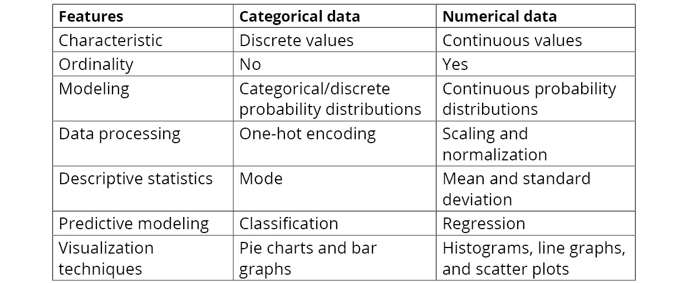

图 3.1：数据类型比较

在本节的其余部分，我们将更详细地讨论前述比较中的每一个，从下一小节开始讨论分类数据。

## 分类数据

当属性或变量是分类的时，它可以取的可能值属于一个预定的固定值集。例如，在与天气相关的数据集中，您可能有一个属性来描述每天的整体天气，这种情况下该属性可能属于一个离散值列表，如`"晴天"`、`"有风"`、`"多云"`、`"雨"`等。这个属性列中的单元格*必须*取这些可能的值之一；一个单元格不能包含，例如，一个数字或一个不相关的字符串，比如`"苹果"`。这种数据的另一个术语是*名义数据*。

由于数据的性质，在大多数情况下，分类属性的可能值之间没有顺序关系。例如，我们之前描述的天气相关数据没有可以应用的比较操作：`"晴天"`既不大于也不小于`"有风"`，依此类推。这与数值数据形成对比，尽管我们还没有讨论它，但它表达了明显的顺序性。

在讨论数据类型的差异时，让我们现在通过一些要点来了解处理分类数据时需要牢记的一些要点。

如果要使用概率分布对一个未知的分类属性进行建模，就需要一个分类分布。这种分布描述了变量是预定义的*K*个可能类别之一的概率。幸运的是，当我们从各自的库中调用它们时，大多数建模将在各种统计/机器学习模型的后端完成，所以我们现在不必担心建模的问题。

在数据处理方面，通常使用编码方案来*转换*属性中的分类值为数值，机器可解释的值。因此，在分类数据中，常见的字符串值不能被输入到只接受数值数据的模型中。

例如，有些人倾向于使用简单的编码，将每个可能的值分配一个正整数，并用其相应的数值替换它们。考虑以下样本数据集（存储在名为`weather_df`的变量中）：

```py
weather_df
```

输出将如下所示：

```py
     temp    weather
0    55      windy
1    34      cloudy
2    80      sunny
3    75      rain
4    53      sunny
```

现在，您可以在`weather`属性上调用`map()`方法，并传入字典`{'有风': 0, '多云': 1, '晴天': 2, '雨': 3}`（`map()`方法简单地将字典定义的映射应用于属性）来对分类属性进行编码，如下所示：

```py
weather_df['weather_encoded'] = weather_df['weather'].map(\
                                {'windy': 0, 'cloudy': 1, \
                                 'sunny': 2, 'rain': 3})
```

这个 DataFrame 对象现在将包含以下数据：

```py
weather_df
```

输出如下：

```py
     temp    weather    weather_encoded
0    55      windy      0
1    34      cloudy     1
2    80      sunny      2
3    75      rain       3
4    53      sunny       2
```

我们看到分类列`weather`已经成功通过一对一映射转换为了`weather_encoded`中的数值数据。然而，这种技术可能存在潜在的危险：新属性在数据上隐含地放置了一个顺序。由于*0 < 1 < 2 < 3*，我们无意中对原始分类数据施加了相同的排序；如果我们使用的模型特别将其解释为真正的数值数据，这是特别危险的。

这就是为什么当我们将分类属性转换为数值形式时必须小心。实际上，我们在上一章中已经讨论了一种能够在不施加数值关系的情况下转换分类数据的特定技术：独热编码。在这种技术中，我们为分类属性中的每个唯一值创建一个新属性。然后，对于数据集中的每一行，如果该行具有原始分类属性中的相应值，则在新创建的属性中放置`1`，在其他新属性中放置`0`。

以下代码片段重申了我们如何可以使用 pandas 实现独热编码，以及它对我们当前的样本天气数据集会产生什么影响：

```py
pd.get_dummies(weather_df['weather'])
```

这将产生以下输出：

```py
     cloudy    rain    sunny    windy
0    0         0       0        1
1    1         0       0        0
2    0         0       1        0
3    0         1       0        0
4    0         0       1        0
```

在本章后面我们将讨论的各种描述性统计中，众数——出现最多的值——通常是唯一可以用于分类数据的统计量。因此，当我们的数据集中的分类属性中有缺失值，并且我们希望用一个中心趋势统计量填充它们时，这是我们将在本章后面定义的一个概念，应该考虑的唯一统计量是众数。

在进行预测方面，如果一个分类属性是我们机器学习流水线的目标（也就是说，如果我们想要预测一个分类属性），则需要使用分类模型。与回归模型相反，回归模型对数值连续数据进行预测，分类模型或简称分类器，要记住其目标属性可能取值的可能值，并且只在这些值中进行预测。因此，在决定应该对数据集进行训练以预测分类数据的机器学习模型时，请确保只使用分类器。

分类数据和数值数据之间的最后一个重大区别在于可视化技术。在上一章中讨论了许多适用于分类数据的可视化技术，其中最常见的两种是条形图（包括堆叠和分组条形图）和饼图。

这些类型的可视化关注每个唯一值在整个数据集中所占的比例。

例如，对于前面的天气数据集，我们可以使用以下代码创建一个饼图：

```py
weather_df['weather'].value_counts().plot.pie(autopct='%1.1f%%')
plt.ylabel('')
plt.show()
```

这将创建以下可视化：

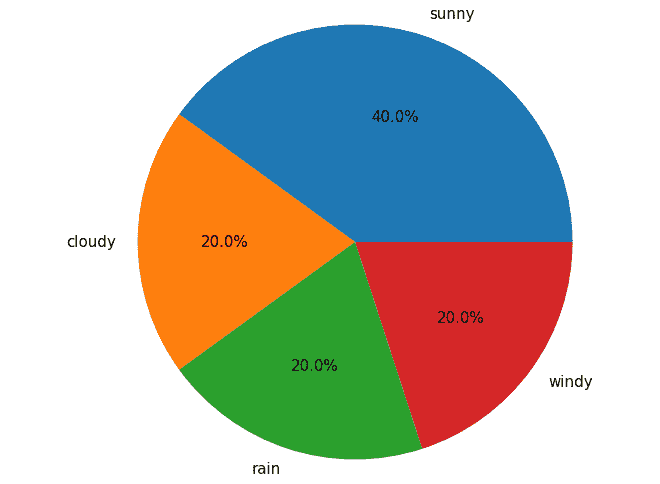

图 3.2：天气数据的饼图

我们可以看到在整个数据集中，值为'sunny'的出现了 40%的时间，而其他每个值都出现了 20%的时间。

到目前为止，我们已经涵盖了分类属性和数值属性之间最大的理论差异，我们将在下一节中讨论。然而，在继续之前，还有一个应该提到的分类数据类型的子类型：二进制数据。

二进制属性，其值只能是`True`和`False`，是一个分类属性，其可能值集合包含了上述两个布尔值。由于布尔值可以被机器学习和数学模型轻松解释，通常不需要将二进制属性转换为其他形式。

实际上，原本不是布尔形式的二进制属性应该被转换为`True`和`False`值。在上一章的示例学生数据集中，我们遇到了这样的例子：

```py
student_df
```

输出如下：

```py
     name    sex       class    gpa    num_classes
0    Alice   female    FY       90     4
1    Bob     male      SO       93    3
2    Carol   female    SR       97    4
3    Dan     male      SO       89    4
4    Eli     male      JR       95    3
5    Fran    female    SR       92    2
```

在这里，列`'sex'`是一个分类属性，其值可以是`'female'`或`'male'`。因此，为了使这些数据更适合机器处理（同时确保不会丢失或添加任何信息），我们可以对属性进行*二值化*，我们已经通过以下代码完成了这一步骤：

```py
student_df['female_flag'] = student_df['sex'] == 'female'
student_df = student_df.drop('sex', axis=1)
student_df
```

输出如下：

```py
     name    class    gpa    num_classes    female_flag
0    Alice   FY       90     4              True
1    Bob     SO       93     3              False
2    Carol   SR       97     4              True
3    Dan     SO       89     4              False
4    Eli     JR       95     3              False
5    Fran    SR       92     2              True
```

注

由于新创建的列`'female_flag'`包含了来自列`'sex'`的所有信息，而且只有这些信息，我们可以简单地从数据集中删除后者。

除此之外，二进制属性可以以任何其他方式（处理、预测和可视化）处理为分类数据。

让我们现在将我们迄今讨论的内容应用到以下练习中。

## 练习 3.01：可视化天气百分比

在这个练习中，我们得到了一个样本数据集，其中包括特定城市在五天内的天气情况。这个数据集可以从[`packt.live/2Ar29RG`](https://packt.live/2Ar29RG)下载。我们的目标是使用迄今为止讨论的分类数据可视化技术，来可视化这个数据集中的分类信息，以检查不同类型天气的百分比：

1.  在一个新的 Jupyter 笔记本中，导入 pandas、Matplotlib 和 seaborn，并使用 pandas 读取上述数据集：

```py
import pandas as pd
import matplotlib.pyplot as plt
import seaborn as sns
weather_df = pd.read_csv('weather_data.csv')
weather_df.head()
```

当打印出此数据集的前五行时，您应该看到以下输出：


图 3.3：天气数据集

正如您所看到的，此数据集的每一行告诉我们在给定城市的给定日期的天气情况。例如，在`0`号那天，`St Louis`是晴天，而`New York`是`多云`。

1.  在笔记本中的下一个代码单元中，计算数据集中所有天气类型的计数（发生次数），并使用`plot.bar()`方法可视化该信息：

```py
weather_df['weather'].value_counts().plot.bar()
plt.show()
```

此代码将产生以下输出：


图 3.4：天气类型的计数

1.  使用`plot.pie(autopct='%1.1f%%')`方法将与上一步相同的信息可视化为饼图：

```py
weather_df['weather'].value_counts().plot.pie(autopct='%1.1f%%')
plt.ylabel('')
plt.show()
```

此代码将产生以下输出：

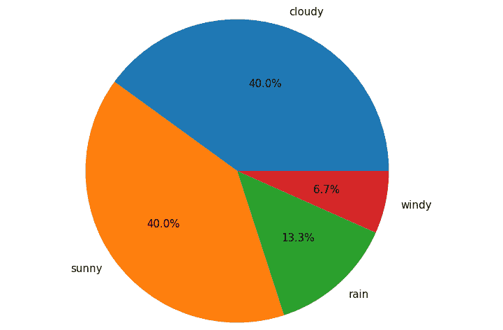

图 3.5：天气类型的计数

1.  现在，我们想要可视化这些天气类型的计数，以及每种天气类型在每个城市中所占百分比的信息。首先，可以使用`groupby()`方法计算这些信息，如下所示：

```py
weather_df.groupby(['weather', 'city'])['weather'].count()\
                                        .unstack('city')
```

输出如下：

```py
city       New York    San Francisco    St Louis
weather            
cloudy     3.0         NaN              3.0
rain       1.0         NaN              1.0
sunny      1.0         4.0              1.0
windy      NaN         1.0              NaN
```

我们看到这个对象包含了我们想要的信息。例如，看看表中`cloudy`行，我们可以看到`cloudy`天气类型在纽约出现了三次，在圣路易斯也出现了三次。我们有多个地方有`NaN`值，表示没有发生。

1.  最后，我们将上一步中的表可视化为堆叠条形图：

```py
weather_df.groupby(['weather', 'city'])\
                   ['weather'].count().unstack('city')\
                   .fillna(0).plot(kind='bar', stacked=True)
plt.show()
```

这将产生以下图表：


图 3.6：天气类型的计数与城市相关

在整个练习过程中，我们已经将关于分类数据的知识付诸实践，以可视化从样本天气数据集中计算出的各种计数类型。

注

要访问本节的源代码，请参阅[`packt.live/2ArQAtw`](https://packt.live/2ArQAtw)。

您也可以在[`packt.live/3gkIWAw`](https://packt.live/3gkIWAw)上在线运行此示例。

有了这个，让我们继续讨论第二种主要类型的数据：数值数据。

## 数值数据

这个术语在帮助我们理解这是什么类型的数据方面是直观的。数值属性应该包含数值和连续值或实数。数值属性的值可以具有特定的范围；例如，它们可以是正数、负数或在 0 和 1 之间。然而，数值属性意味着其数据可以在给定范围内取任何值。这与分类属性中的值明显不同，后者只属于给定的离散值集。

数值数据有许多例子：人口成员的身高、学校学生的体重、某些地区待售房屋的价格、田径运动员的平均速度等。只要数据可以表示为实数，它很可能是数值数据。

鉴于其性质，数值数据与分类数据有很大的不同。在接下来的文本中，我们将阐述一些在统计和机器学习方面最重要的差异，我们应该牢记。

与可以用于建模分类数据的少数概率分布相反，数值数据有许多概率分布。这些包括正态分布（也称为钟形曲线分布）、均匀分布、指数分布、学生 t 分布等。每种概率分布都设计用于建模特定类型的数据。例如，正态分布通常用于建模具有线性增长的数量，如年龄、身高或学生的考试成绩，而指数分布则用于建模给定事件发生之间的时间量。

因此，重要的是研究哪种特定的概率分布适合你试图建模的数值属性。适当的分布将允许一致的分析和准确的预测；另一方面，选择不当的概率分布可能导致不直观和不正确的结论。

另一个话题是，许多处理技术可以应用于数值数据。其中最常见的两种包括缩放和归一化。

缩放涉及将数值属性中的所有值添加和/或乘以固定数量，以将原始数据的范围缩放到另一个范围。当统计和机器学习模型只能处理给定范围内的值时（例如，正数或 0 到 1 之间的数字可以更容易地处理和分析），就会使用这种方法。

最常用的缩放技术之一是最小-最大缩放方法，其公式如下所示，其中*a*和*b*为正数：


图 3.7：最小-最大缩放的公式

*X'*和*X*分别表示变换后和变换前的数据，而*X*max 和*X*min 分别表示数据中的最大值和最小值。可以数学证明，公式的输出始终大于*a*且小于*b*，但我们不需要在这里详细讨论。我们将在下一个练习中再次回到这种缩放方法。

至于归一化，尽管有时这个术语与*缩放*可以互换使用，但它指的是将数值属性特定地缩放到其概率分布的归一化形式的过程。我们的目标是获得一个转换后的数据集，它很好地遵循我们选择的概率分布的形状。

例如，假设我们在一个数值属性中拥有的数据遵循均值为`4`，标准差为`10`的正态分布。以下代码随机生成了这些数据，并对其进行可视化：

```py
samples = np.random.normal(4, 10, size=1000)
plt.hist(samples, bins=20)
plt.show()
```

这产生了以下图表：

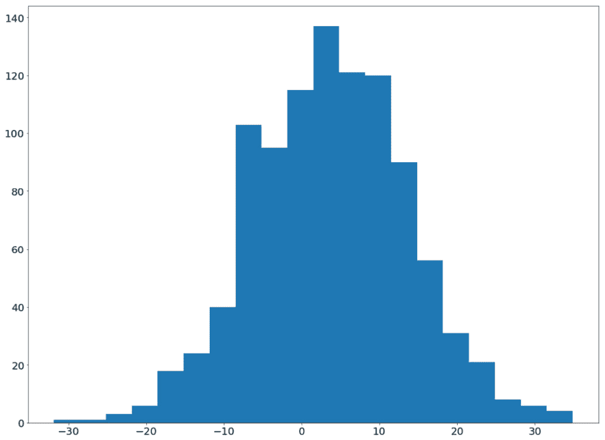

图 3.8：正态分布数据的直方图

现在，假设你有一个模型，假设这些数据符合正态分布的标准形式，其中均值为`0`，标准差为`1`，如果输入数据不符合这种形式，模型将难以学习。因此，你希望以某种方式将前述数据转换为这种标准形式，而不牺牲数据的真实模式（特别是一般形状）。

在这里，我们可以应用正态分布数据的归一化技术，其中我们从数据点中减去真实均值，并将结果除以真实标准差。这个缩放过程更普遍地被称为标准缩放器。由于前述数据已经是一个 NumPy 数组，我们可以利用矢量化并进行如下归一化：

```py
normalized_samples = (samples - 4) / 10
plt.hist(normalized_samples, bins=20)
plt.show()
```

这段代码将生成我们新转换的数据的直方图，如下所示：


图 3.9：归一化数据的直方图

我们看到，虽然数据已成功转移到我们想要的范围，现在它以`0`为中心，大部分数据位于`-3`和`3`之间，这是正态分布的标准形式，但数据的一般形状并没有改变。换句话说，数据点之间的相对差异没有改变。

另外，在实践中，当真实均值和/或真实标准差不可用时，我们可以用样本均值和标准差来近似这些统计量，如下所示：

```py
sample_mean = np.mean(samples)
sample_sd = np.std(samples)
```

对于大量样本，这两个统计量提供了一个可以进一步用于这种转换的良好近似。有了这个，我们现在可以将这些归一化的数据输入到我们的统计和机器学习模型中进行进一步分析。

说到均值和标准差，这两个统计量通常用于描述数值数据。为了填补数值属性中的缺失值，通常使用均值和中位数等集中趋势测量。在一些特殊情况下，比如时间序列数据集，可以使用更复杂的缺失值插补技术，比如插值，我们可以估计缺失值在序列中*在两者之间*的某个位置。

当我们想要训练一个预测模型来针对数值属性时，会使用回归模型。与分类器不同，回归模型不是对条目可能取的分类值进行预测，而是寻找连续数值范围内的合理预测。因此，与我们讨论过的类似，我们必须小心地只在目标值是数值属性的数据集上应用回归模型。

最后，在可视化数值数据方面，我们已经看到了一系列可用的可视化技术。就在这之前，我们看到直方图被用来描述数值属性的分布，告诉我们数据在其范围内是如何分布的。

此外，折线图和散点图通常是可视化属性与其他属性模式的良好工具。（例如，我们绘制了各种概率分布的概率密度函数作为折线图。）最后，我们还看到热图被用来可视化二维结构，可以用来表示数据集中数值属性之间的相关性。

在我们继续讨论下一个话题之前，让我们对缩放/归一化的概念进行快速练习。再次，最流行的缩放/归一化方法之一被称为*最小-最大缩放*，它允许我们将数值属性中的所有值转换为任意的范围*[a, b]*。我们将在下面探讨这种方法。

## 练习 3.02：最小-最大缩放

在这个练习中，我们将编写一个函数，以便简化将最小-最大缩放应用于数值属性的过程。该函数应该接受三个参数：`data`、`a`和`b`。`data`应该是一个 NumPy 数组或 pandas 的`Series`对象，`a`和`b`应该是实数正数，表示`data`应该转换成的数值范围的端点。

回顾*数值数据*部分中包含的公式，最小-最大缩放由以下给出：


图 3.10：最小-最大缩放的公式

让我们看看需要遵循的步骤：

1.  创建一个新的 Jupyter 笔记本，在第一个代码单元格中，导入我们将在本练习中使用的库，如下所示：

```py
import pandas as pd
import numpy as np
import matplotlib.pyplot as plt
```

在我们将要使用的数据集中，第一列名为`'Column 1'`，包含来自均值为 4，标准差为 10 的正态分布的 1,000 个样本。第二列名为`'Column 2'`，包含来自 1 到 2 的均匀分布的 1,000 个样本。第三列名为`'Column 3'`，包含参数为 2 和 5 的 Beta 分布的 1,000 个样本。在下一个代码单元格中，读取我们预先为您生成的`'data.csv'`文件（可以在[`packt.live/2YTrdKt`](https://packt.live/2YTrdKt)找到），使用 pandas 作为`DataFrame`对象，并打印出前五行：

```py
df = pd.read_csv('data.csv')
df.head()
```

您应该看到以下数字：

```py
     Column 1    Column 2    Column 3
0    -1.231356   1.305917    0.511994
1    7.874195    1.291636    0.155032
2    13.169984   1.274973    0.183988
3    13.442203   1.549126    0.391825
4    -8.032985   1.895236    0.398122
```

1.  在下一个单元格中，编写一个名为`min_max_scale()`的函数，它接受三个参数：`data`、`a`和`b`。如前所述，`data`应该是数据集属性中的值数组，而`a`和`b`指定输入数据要转换成的范围。

1.  考虑到我们对`data`的（隐含）要求（一个 NumPy 数组或 pandas 的`Series`对象——两者都可以利用矢量化），使用矢量化操作实现缩放函数：

```py
def min_max_scale(data, a, b):
    data_max = np.max(data)
    data_min = np.min(data)
    return a + (b - a) * (data - data_min) / (data_max \
                                              - data_min)
```

1.  首先我们将考虑`'Column 1'`属性中的数据。为了观察这个函数对我们数据的影响，让我们首先可视化当前数据的分布：

```py
plt.hist(df['Column 1'], bins=20)
plt.show()
```

这段代码将生成类似以下的图表：


图 3.11：未缩放数据的直方图

1.  现在，使用相同的`plt.hist()`函数来可视化调用`df['Column 1']`上的`min_max_scale()`函数返回的值，将数据缩放到范围`[-3, 3]`：

```py
plt.hist(min_max_scale(df['Column 1'], -3, 3), bins=20)
plt.show()
```

这将产生以下结果：


图 3.12：缩放数据的直方图

我们看到，虽然数据分布的一般形状保持不变，但数据的范围已经有效地改变为从`-3`到`3`。

1.  对于`'Column 2'`属性，进行相同的过程（使用直方图可视化缩放前后的数据）。首先，我们可视化原始数据：

```py
plt.hist(df['Column 2'], bins=20)
plt.show()
```

1.  现在我们可视化缩放后的数据，应该缩放到范围`[0, 1]`：

```py
plt.hist(min_max_scale(df['Column 2'], 0, 1), bins=20)
plt.show()
```

1.  第二个代码块应该生成类似以下的图表：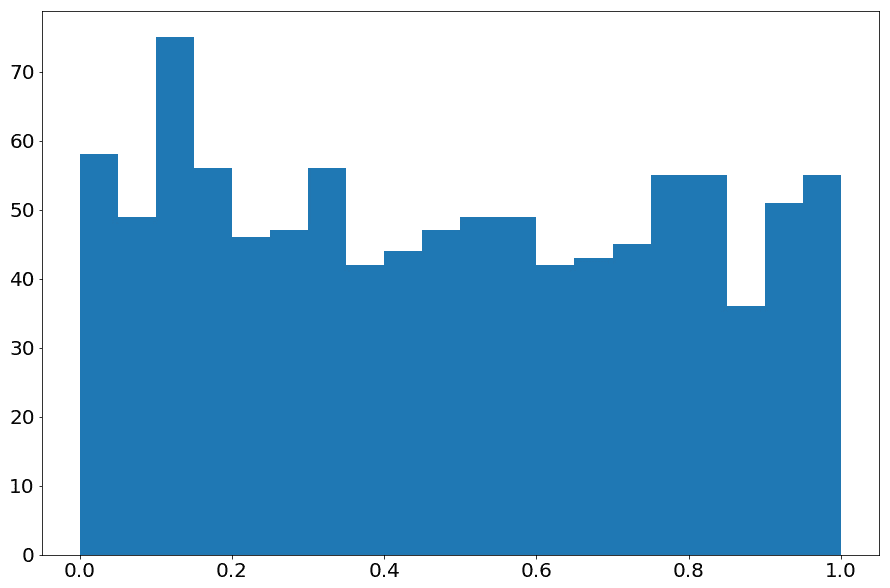

图 3.13：缩放数据的直方图

1.  对于`'Column 3'`属性，进行相同的过程（使用直方图可视化缩放前后的数据）。首先，我们可视化原始数据：

```py
plt.hist(df['Column 3'], bins=20)
plt.show()
```

1.  现在我们可视化缩放后的数据，应该缩放到范围`[10, 20]`：

```py
plt.hist(min_max_scale(df['Column 3'], 10, 20), \
                          bins=20)
plt.show()
```

1.  第二个代码块应该生成类似以下的图表：

图 3.14：缩放数据的直方图

在这个练习中，我们更详细地考虑了数值数据的缩放/归一化概念。我们还重新访问了`plt.hist()`函数作为可视化数值数据分布的方法。

注意

要访问此特定部分的源代码，请参阅[`packt.live/2VDw3JP`](https://packt.live/2VDw3JP)。

您还可以在[`packt.live/3ggiPdO`](https://packt.live/3ggiPdO)上在线运行此示例。

这个练习结束了本章关于数值数据的讨论。连同分类数据一起，它构成了您可能在给定数据集中看到的大多数数据类型。然而，实际上除了这两种数据类型之外，还有另一种数据类型，这种数据类型较少见，我们将在下一节中讨论。

## 序数数据

序数数据在某种程度上是分类数据（序数属性中的值属于特定给定集合）和数值数据（其中值为数字——这一事实意味着它们之间存在有序关系）的组合。序数数据的最常见示例是字母分数（`"A"`，`"B"`，`"C"`，`"D"`和`"E"`），整数评分（例如，在 1 到 10 的范围内），或者质量排名（例如，“优秀”，“好”，和“差”，其中“优秀”意味着比“好”更高的质量级别，而“好”本身又比“差”更好）。

由于序数属性中的条目只能取特定一组值中的一个，应该使用*分类概率分布*来对这种类型的数据进行建模。出于同样的原因，序数属性中的缺失值可以使用属性的众数来填充，分类数据的可视化技术也可以应用于序数数据。

然而，其他过程可能与我们讨论的分类数据有所不同。在数据处理方面，您可能会为每个序数值分配一个一对一的映射，以及一个数字值/范围。

在字母分数的例子中，通常情况下，等级`"A"`对应于原始分数的范围[90, 100]，其他字母等级也有它们自己的连续范围。在质量排名的例子中，“优秀”，“好”和“差”可以分别映射为 10，5 和 0，但是，除非可以量化值之间的质量差异程度，否则这种转换是不可取的。

在将机器学习模型拟合到数据并让其预测序数属性的未见值方面，应该使用分类器来执行此任务。此外，由于排名是构成许多不同学习结构的独特任务，已经付出了相当大的努力来进行*机器学习排名*，其中专门设计和训练模型以预测排名数据。

这个讨论结束了统计学和机器学习中的数据类型主题。总的来说，我们已经了解到数据集中常见的两种主要数据类型：分类和数值数据。根据您的数据属于哪种类型，您将需要使用不同的数据处理、机器学习和可视化技术。

在下一节中，我们将讨论描述统计以及如何在 Python 中进行计算。

# 描述统计

如前所述，描述统计和推断统计是统计学领域的两个主要类别。通过描述统计，我们的目标是计算特定的数量，可以传达关于我们的数据的重要信息，或者换句话说，描述我们的数据。

在描述统计中，有两个主要的子类别：中心趋势统计和离散统计。实际术语暗示了它们各自的含义：中心趋势统计负责描述给定数据的*中心*，而离散统计传达有关数据远离其中心的传播或范围的信息。

这种区别最清晰的例子之一来自熟知的正态分布，其统计数据包括均值和标准差。均值是通过计算概率分布中所有值的平均值得出的，适用于估计分布的中心。正如我们所见，标准形式的正态分布的均值为 0，表明其数据围绕着轴上的 0 点。

另一方面，标准差表示数据点与均值的变化程度。在不深入细节的情况下，在正态分布中，它被计算为与分布均值的平均距离。低值的标准差表明数据与均值的偏差不大，而高值的标准差意味着个别数据点与均值相差很大。

总的来说，这些类型的统计数据及其特性可以总结在以下表中：


图 3.15：描述性统计类型

还有其他更专业的描述性统计，比如衡度，用于衡量数据分布的不对称性，或者峰度，用于衡量分布峰值的陡峭程度。然而，这些并不像我们之前列出的那些常用，因此本章不会涉及。

在下一小节中，我们将开始更深入地讨论前述统计数据，从集中趋势测量开始。

## 集中趋势

形式上，常用的集中趋势统计数据有均值、中位数和众数。**中位数**被定义为当所有数据点沿着轴排序时的中间值。**众数**，正如我们之前提到的，是出现最多次的值。由于它们的特性，均值和中位数仅适用于数值数据，而众数通常用于分类数据。

这三个统计数据都很好地捕捉了集中趋势的概念，以不同的方式代表了数据集的中心。这也是为什么它们经常被用来替换属性中的缺失值。因此，对于缺失的数值，你可以选择均值或中位数作为潜在的替代，而如果分类属性包含缺失值，则可以使用众数。

特别地，均值经常被用来填补数值属性中的缺失值并非是任意的。如果我们要将概率分布拟合到给定的数值属性上，那么该属性的均值实际上将是样本均值，对真实总体均值的估计。总体均值的另一个术语是该总体内未知值的期望值，换句话说，就是我们应该期望来自该总体的任意值是多少。

这就是为什么均值，或者来自相应分布的值的期望，应该在某些情况下用来填补缺失值。虽然对于中位数来说情况并非如此，但对于它在替换缺失数值方面的作用可以提出类似的论点。另一方面，众数是替换缺失分类值的良好估计，因为它是属性中出现最频繁的值。

## 离散度

与集中趋势统计不同，离散度统计再次试图量化数据集中的变化程度。一些常见的离散度统计包括标准差、范围（最大值和最小值之间的差异）和四分位数。

标准差，正如我们所提到的，计算了每个数据点与数值属性的均值之间的差异，对它们进行平方，取平均值，最后取结果的平方根。个别数据点离均值越远，这个数量就越大，反之亦然。这就是为什么它是一个很好的指标，用来衡量数据集的离散程度。

范围——最大值和最小值之间的距离，或者 0%和 100%分位数之间的距离——是描述数据集离散程度的另一种更简单的方法。然而，由于其简单性，有时这个统计量并不能传达与标准差或四分位数一样多的信息。

四分位数被定义为数据集中特定部分落在其下的阈值。例如，中位数，数值数据集的中间值，是该数据集的 50%分位数，因为（大致上）一半的数据集小于该数字。同样，我们可以计算常见的四分位数数量，如 5%，25%，75%和 95%分位数。这些四分位数在量化我们的数据分散程度方面可能更具信息量，因为它们可以解释数据的不同分布。

此外，*四分位距*，另一个常见的离散统计量，被定义为数据集的 25%和 75%分位数之间的差异。

到目前为止，我们已经讨论了中心趋势统计和离散统计的概念。让我们通过一个快速练习来加强一些重要的想法。

## 练习 3.03：可视化概率密度函数

在*第二章*的*Python 统计学的主要工具*的*练习 2.04*中，我们考虑了比较概率分布的概率密度函数与其抽样数据的直方图的任务。在这里，我们将实现该程序的扩展，我们还将可视化每个分布的各种描述性统计信息：

1.  在新的 Jupyter 笔记本的第一个单元格中，导入 NumPy 和 Matplotlib：

```py
import numpy as np
import matplotlib.pyplot as plt
```

1.  在一个新的单元格中，使用`np.random.normal()`随机生成来自正态分布的 1,000 个样本。计算均值、中位数和 25%和 75%四分位数的描述性统计如下：

```py
samples = np.random.normal(size=1000)
mean = np.mean(samples)
median = np.median(samples)
q1 = np.percentile(samples, 25)
q2 = np.percentile(samples, 75)
```

1.  在下一个单元格中，使用直方图可视化样本。我们还将通过绘制垂直线来指示各种描述性统计的位置——在均值点处绘制红色垂直线，在中位数处绘制黑色垂直线，在每个四分位数处绘制蓝色线：

```py
plt.hist(samples, bins=20)
plt.axvline(x=mean, c='red', label='Mean')
plt.axvline(x=median, c='black', label='Median')
plt.axvline(x=q1, c='blue', label='Interquartile')
plt.axvline(x=q2, c='blue')
plt.legend()
plt.show()
```

请注意，我们在各种绘图函数调用中结合了`label`参数的规范和`plt.legend()`函数。这将帮助我们创建一个带有适当标签的图例，如下所示：


图 3.16：正态分布的描述性统计

这里有一件有趣的事情：均值和中位数几乎在 x 轴上重合。这是正态分布的许多数学上方便的特性之一，在许多其他分布中找不到：它的均值等于它的中位数和众数。

1.  将相同的过程应用于参数为`2`和`5`的 Beta 分布，如下所示：

```py
samples = np.random.beta(2, 5, size=1000)
mean = np.mean(samples)
median = np.median(samples)
q1 = np.percentile(samples, 25)
q2 = np.percentile(samples, 75)
plt.hist(samples, bins=20)
plt.axvline(x=mean, c='red', label='Mean')
plt.axvline(x=median, c='black', label='Median')
plt.axvline(x=q1, c='blue', label='Interquartile')
plt.axvline(x=q2, c='blue')
plt.legend()
plt.show()
```

这应该生成一个类似于以下的图表：


图 3.17：Beta 分布的描述性统计

1.  将相同的过程应用于参数为`5`的 Gamma 分布，如下所示：

```py
samples = np.random.gamma(5, size=1000)
mean = np.mean(samples)
median = np.median(samples)
q1 = np.percentile(samples, 25)
q2 = np.percentile(samples, 75)
plt.hist(samples, bins=20)
plt.axvline(x=mean, c='red', label='Mean')
plt.axvline(x=median, c='black', label='Median')
plt.axvline(x=q1, c='blue', label='Interquartile')
plt.axvline(x=q2, c='blue')
plt.legend()
plt.show()
```

这应该生成一个类似于以下的图表：


图 3.18：Gamma 分布的描述性统计

通过这个练习，我们学会了如何使用 NumPy 计算数据集的各种描述性统计，并在直方图中可视化它们。

注意

要访问此特定部分的源代码，请参阅[`packt.live/2YTobpm`](https://packt.live/2YTobpm)。

您也可以在[`packt.live/2CZf26h`](https://packt.live/2CZf26h)上在线运行此示例。

除了计算描述性统计信息，Python 还提供其他附加方法来描述数据，我们将在下一节讨论。

## 与 Python 相关的描述性统计

在这里，我们将讨论描述数据的两种中间方法。第一种是在`DataFrame`对象上调用的`describe()`方法。根据官方文档（可在[`pandas.pydata.org/pandas-docs/stable/reference/api/pandas.DataFrame.describe.html`](https://pandas.pydata.org/pandas-docs/stable/reference/api/pandas.DataFrame.describe.html)找到），该函数“生成总结数据集分布的集中趋势、离散度和形状的描述性统计，不包括`NaN`值。”

让我们看看这种方法的效果。首先，我们将创建一个包含数值属性、分类属性和顺序属性的样本数据集，如下所示：

```py
df = pd.DataFrame({'numerical': np.random.normal(size=5),\
                   'categorical': ['a', 'b', 'a', 'c', 'b'],\
                   'ordinal': [1, 2, 3, 5, 4]})
```

现在，如果我们在`df`变量上调用`describe()`方法，将生成一个表格摘要：

```py
df.describe()
```

输出如下：

```py
        numerical    ordinal
count   5.000000     5.000000
mean    -0.251261    3.000000
std     0.899420     1.581139
min     -1.027348    1.000000
25%     -0.824727    2.000000
50%     -0.462354    3.000000
75%     -0.192838    4.000000
max     1.250964     5.000000
```

正如你所看到的，打印输出中的每一行表示数据集中每个属性的不同描述统计信息：值的数量（`count`）、均值、标准差和各种四分位数。由于`numerical`和`ordinal`属性都被解释为数值数据（根据它们包含的数据），`describe()`默认只为它们生成这些报告。另一方面，`categorical`列被排除在外。为了强制报告适用于所有列，我们可以指定`include`参数如下：

```py
df.describe(include='all')
```

输出如下：

```py
        numerical     categorical    ordinal
count   5.000000      5              5.000000
unique  NaN           3              NaN
top     NaN           a              NaN
freq    NaN           2              NaN
mean    -0.251261     NaN            3.000000
std     0.899420      NaN            1.581139
min     -1.027348     NaN            1.000000
25%     -0.824727     NaN            2.000000
50%     -0.462354     NaN            3.000000
75%     -0.192838     NaN            4.000000
max     1.250964      NaN            5.000000
```

这迫使该方法计算适用于分类数据的其他统计信息，例如唯一值的数量（`unique`）、众数（`top`）和众数的计数/频率（`freq`）。正如我们讨论过的，大多数数值数据的描述统计不适用于分类数据，反之亦然，这就是为什么在前面的报告中使用`NaN`值来指示这种非适用性。

总的来说，pandas 的`describe()`方法提供了一种快速概括数据集及其属性的方法。这在探索性数据分析任务中特别方便，当我们想要广泛地探索一个我们尚不熟悉的新数据集时。

Python 支持的第二种与描述统计相关的方法是箱线图的可视化。显然，箱线图是一种可视化技术，不仅仅是语言本身的独特之处，但是 Python，特别是其 seaborn 库，提供了一个相当方便的 API，即`sns.boxplot()`函数，以便于这个过程。

理论上，箱线图是可视化数值数据集分布的另一种方法。同样，可以使用`sns.boxplot()`函数生成它：

```py
sns.boxplot(np.random.normal(2, 5, size=1000))
plt.show()
```

这段代码将产生一个与以下类似的图形：


图 3.19：使用 seaborn 的箱线图

在前面的箱线图中，中间的蓝色框表示输入数据的四分位距（从 25%到 75%的四分位数）。框中间的垂直线是中位数，而框外左右两个阈值分别表示输入数据的最小值和最大值。

重要的是要注意，最小值被计算为 25%四分位数*减去*四分位距乘以 1.5，最大值是 75%四分位数*加上*四分位距也乘以 1.5。通常做法是将最小值和最大值之间的任何数字视为异常值，在前面的图中显示为黑点。

实质上，箱线图可以在视觉上表示由 pandas 的 `describe()` 函数计算的统计数据。这个 seaborn 中的函数与其他可视化工具的不同之处在于，它可以轻松地根据 seaborn 提供的标准创建多个箱线图。

让我们在下一个示例中看到这一点，我们将扩展样本数据集到 `1000` 行，并生成随机数据：

```py
df = pd.DataFrame({'numerical': np.random.normal(size=1000),\
                   'categorical': np.random.choice\
                                  (['a', 'b', 'c'], size=1000),\
                   'ordinal': np.random.choice\
                              ([1, 2, 3, 4, 5], size=1000)})
```

在这里，`'numerical'` 属性包含来自标准正态分布的随机抽样，`'categorical'` 属性包含从列表 `['a'，'b'，'c']` 中随机选择的值，而 `'ordinal'` 也包含从列表 `[1, 2, 3, 4, 5]` 中随机选择的值。

我们的目标是使用这个数据集生成一个稍微复杂的箱线图可视化——一个表示 `'categorical'` 中不同值的 `'numerical'` 数据分布的箱线图。一般的过程是将数据集分成不同的组，每个组对应于 `'categorical'` 中的唯一值，并且对于每个组，我们希望使用 `'numerical'` 属性中的相应数据生成一个箱线图。

然而，使用 seaborn，我们可以通过为 `sns.boxplot()` 函数指定 `x` 和 `y` 参数来简化这个过程。具体来说，我们将使我们的 *x* 轴包含 `'categorical'` 中不同的唯一值，*y* 轴表示 `'numerical'` 中的数据，代码如下：

```py
sns.boxplot(y='numerical', x='categorical', data=df)
plt.show()
```

这将生成以下图表：

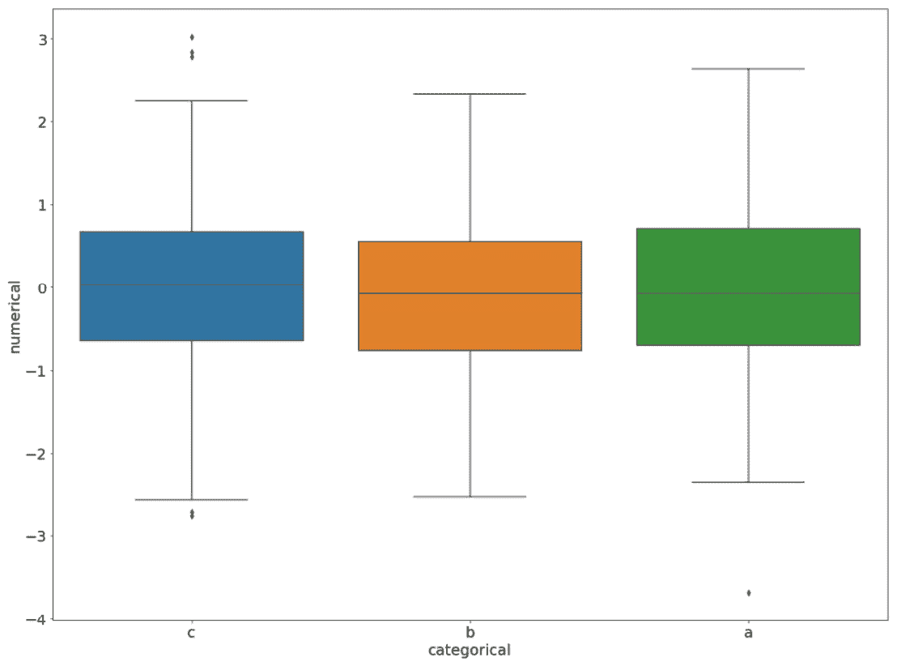

图 3.20：使用 seaborn 的多重箱线图

这个可视化包含了我们想要显示的内容：`'numerical'` 属性数据的分布，表示为箱线图，并按 `'categorical'` 属性中的唯一值进行分隔。考虑到 `'ordinal'` 中的唯一值，我们可以按照以下相同的过程进行：

```py
sns.boxplot(y='numerical', x='ordinal', data=df)
plt.show()
```

这将生成以下图表：


图 3.21：使用 seaborn 的多重箱线图

如你所想象的，当我们想要分析数值属性在分类或有序数据方面的分布差异时，这种可视化方法是理想的。

这就结束了本章关于描述性统计的话题。在下一节中，我们将讨论另一类统计学：推断统计。

# 推断统计

与描述性统计不同，我们的目标是使用特定的数量描述数据集的各种特征，而在推断统计中，我们希望对数据集执行特定的统计建模过程，以便我们可以*推断*进一步的信息，无论是关于数据集本身还是关于来自同一总体的未见数据点。

在这一部分，我们将介绍一些不同的推断统计方法。通过这些讨论，我们将看到每种方法都是针对特定数据和情况设计的，统计学家或机器学习工程师有责任适当地应用它们。

我们将讨论的第一种方法是古典统计学中最基本的方法之一：t 检验。

## T-Tests

通常，t 检验（也称为学生 t 检验）用于比较两个均值（平均）统计量，并得出它们是否足够不同的结论。t 检验的主要应用是比较事件（例如实验药物、锻炼常规等）对总体的影响与对照组。如果均值足够不同（我们称之为统计显著），那么我们有充分的理由相信给定事件的影响。

统计学中有三种主要类型的 t 检验：独立样本 t 检验（用于比较两个独立样本的均值），配对样本 t 检验（用于比较同一组在不同时间的均值），以及单样本 t 检验（用于将一组的均值与预定均值进行比较）。

t 检验的一般工作流程是首先声明这两个均值确实相等的零假设，然后考虑 t 检验的输出，即相应的 p 值。如果 p 值大于一个固定的阈值（通常选择 0.05），那么我们就不能拒绝零假设。另一方面，如果 p 值低于阈值，我们就可以拒绝零假设，这意味着这两个均值是不同的。我们看到这是一种推断统计方法，因为我们可以从中*推断*出关于我们的数据的事实；在这种情况下，我们可以推断出我们感兴趣的两个均值是否不同。

我们不会深入讨论这些测试的理论细节；相反，我们将看到如何简单地利用 Python 提供的 API，或者具体来说是 SciPy 库。我们在上一章中使用了这个库，所以如果你还不熟悉这个工具，一定要回到*第二章*，*Python 的统计主要工具*，看看它如何在你的环境中安装。

让我们设计我们的样本实验。假设我们有两个数字数组，每个数组都是从一个未知分布中抽取的，我们想要找出它们各自的均值是否相等。因此，我们有我们的零假设，即这两个数组的均值相等，如果我们的 t 检验的 p 值小于 0.05，则可以拒绝这个假设。

为了生成这个例子的合成数据，我们将从标准正态分布（均值为 0，标准差为 1）中使用`20`个样本来生成第一个数组，然后从均值为`0.2`，标准差为 1 的正态分布中使用另外`20`个样本来生成第二个数组：

```py
samples_a = np.random.normal(size=20)
samples_b = np.random.normal(0.2, 1, size=20)
```

为了快速可视化这个数据集，我们可以使用`plt.hist()`函数，如下所示：

```py
plt.hist(samples_a, alpha=0.2)
plt.hist(samples_b, alpha=0.2)
plt.show()
```

这生成了以下的图表（注意你自己的输出可能会有所不同）：

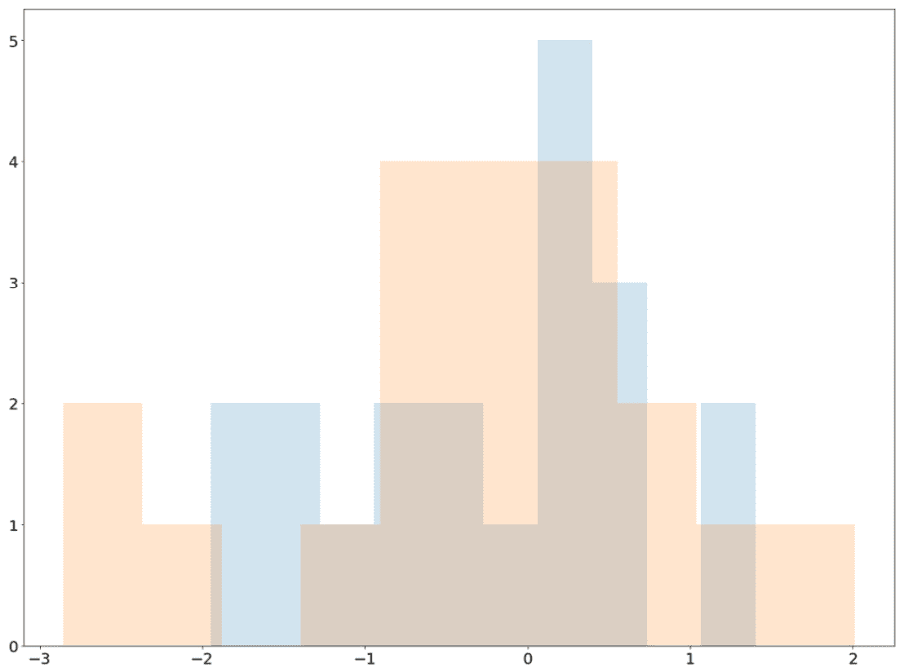

图 3.22：t 检验样本数据的直方图

现在，我们将从`scipy.stats`包中调用`ttest_ind()`函数。这个函数便利了独立样本 t 检验，并将返回一个具有名为`pvalue`的属性的对象；这个属性包含了 p 值，将帮助我们决定是否拒绝我们的零假设：

```py
scipy.stats.ttest_ind(samples_a, samples_b).pvalue
```

以下是输出结果：

```py
0.8616483548091348
```

根据这个结果，我们不拒绝我们的零假设。再次强调，你的 p 值可能与前面的输出不同，但很可能也不会低于 0.05。我们最终的结论是，我们没有足够的证据表明我们的两个数组的均值是不同的（即使它们实际上是从两个均值不同的正态分布中生成的）。

让我们重复这个实验，但这次我们有更多的数据——每个数组现在包含 1,000 个数字：

```py
samples_a = np.random.normal(size=1000)
samples_b = np.random.normal(0.2, 1, size=1000)
plt.hist(samples_a, alpha=0.2)
plt.hist(samples_b, alpha=0.2)
plt.show()
```

现在的直方图看起来像这样：


图 3.23：t 检验样本数据的直方图

再次运行 t 检验，我们看到这次我们得到了不同的结果：

```py
scipy.stats.ttest_ind(samples_a, samples_b).pvalue
```

以下是输出结果：

```py
3.1445050317071093e-06
```

这个 p 值远低于 0.05，因此拒绝了零假设，并给了我们足够的证据表明这两个数组的均值是不同的。

这两个实验展示了我们应该牢记的一个现象。在第一个实验中，我们的 p 值不够低，无法拒绝零假设，即使我们的数据确实是从两个均值不同的分布中生成的。在第二个实验中，有了更多的数据，t 检验在区分这两个均值方面更具有决定性。

实质上，每个数组中只有 20 个样本，第一个 t 检验没有足够高的置信水平来输出较低的 p 值，即使两个均值确实不同。有了 1,000 个样本，这种差异更加一致和稳健，因此第二个 t 检验能够积极地输出较低的 p 值。一般来说，许多其他统计方法在使用更多数据作为输入时也会同样证明更具有决定性。

我们已经看过独立样本 t 检验的一个例子，作为推断统计的一种方法，用于测试两个给定总体的平均值之间的差异程度。总的来说，`scipy.stats`包提供了一系列广泛的统计测试，它们处理所有的计算工作，并且只返回最终的测试输出。这符合 Python 语言的一般哲学，保持 API 在高层次，以便用户可以以灵活和便利的方式利用复杂的方法。

注意

有关`scipy.stats`包中可用内容的更多详细信息可以在其官方文档中找到[`docs.scipy.org/doc/scipy-0.15.1/reference/tutorial/stats.html`](https://docs.scipy.org/doc/scipy-0.15.1/reference/tutorial/stats.html)。

可以从该包中调用的一些最常用的测试包括：用于均值差异的 t 检验或 ANOVA；用于确定样本是否来自正态分布的正态性测试；以及计算样本总体的均值和标准差的贝叶斯可信区间。

摆脱`scipy.stats`包，我们已经看到 pandas 库也支持各种统计功能，特别是其方便的`describe()`方法。在下一节中，我们将研究第二种推断统计方法：数据集的相关矩阵。

## 相关矩阵

相关矩阵是一个二维表，包含给定数据集中每对属性之间的相关系数。两个属性之间的相关系数量化了它们的线性相关程度，或者换句话说，它们在线性方面的行为有多相似。相关系数的范围在-1 到+1 之间，其中+1 表示完美的线性相关，0 表示没有相关性，-1 表示完美的负相关。

如果两个属性具有很高的线性相关性，那么当一个属性增加时，另一个属性也倾向于以相同的常数乘以增加。换句话说，如果我们在散点图上绘制两个属性的数据，个别点倾向于沿着一个具有正斜率的直线。对于没有相关性的两个属性，最佳拟合线倾向于水平，而具有负相关性的两个属性则由具有负斜率的直线表示。

两个属性之间的相关性在某种程度上可以告诉我们属性之间共享多少信息。我们可以从两个相关的属性中推断出，无论是正相关还是负相关，它们之间都存在某种潜在的关系。这就是相关矩阵作为推断统计工具的背后思想。

在一些机器学习模型中，建议如果我们有高度相关的特征，应该在将其输入模型之前只保留一个特征。在大多数情况下，拥有另一个与模型已经训练的特征高度相关的属性并不会提高其性能；更重要的是，在某些情况下，相关特征甚至会误导我们的模型，使其预测走向错误的方向。

这意味着两个数据属性之间的相关系数，以及数据集的相关矩阵，对我们来说是一个重要的统计对象。让我们通过一个快速的例子来看看这一点。

假设我们有一个包含三个属性'x'、'y'和'z'的数据集。'x'和'z'中的数据是以独立的方式随机生成的，因此它们之间不应该有相关性。另一方面，我们将'y'生成为'x'中的数据乘以 2 再加上一些随机噪音。这可以通过以下代码实现，该代码创建了一个包含 500 个条目的数据集：

```py
x = np.random.rand(500,)
y = x * 2 + np.random.normal(0, 0.3, 500)
z = np.random.rand(500,)
df = pd.DataFrame({'x': x, 'y': y, 'z': z})
```

从这里开始，相关矩阵（其中包含数据集中每对属性的相关系数）可以很容易地通过`corr()`方法计算出来：

```py
df.corr()
```

输出如下：

```py
     x                     y                     z
x    1.000000              0.8899950.869522      0.019747 -0.017913
y    0.8899950.869522      1.000000              0.045332 -0.023455
z    0.019747 -0.017913    0.045332 -0.023455    1.000000
```

我们看到这是一个 3x3 的矩阵，因为在调用的 DataFrame 对象中有三个属性。每个数字表示行和列属性之间的相关性。这种表示的一个效果是矩阵中的对角线值都为 1，因为每个属性与自身完全相关。

对我们来说更有趣的是不同属性之间的相关性：由于'z'是独立于'x'（因此也独立于'y'）生成的，'z'行和列中的值相对接近 0。相比之下，'x'和'y'之间的相关性接近 1，因为一个属性被生成为大约是另一个属性的两倍。

此外，通常使用热力图来直观表示相关矩阵。这是因为当数据集中有大量属性时，热力图可以帮助我们更有效地识别高度相关的属性所对应的区域。可以使用 seaborn 库中的`sns.heatmap()`函数来可视化热力图：

```py
sns.heatmap(df.corr(), center=0, annot=True)
bottom, top = plt.ylim()
plt.ylim(bottom + 0.5, top - 0.5)
plt.show()
```

`annot=True`参数指定矩阵中的值应该打印在热力图的每个单元格中。

这段代码将产生以下结果：

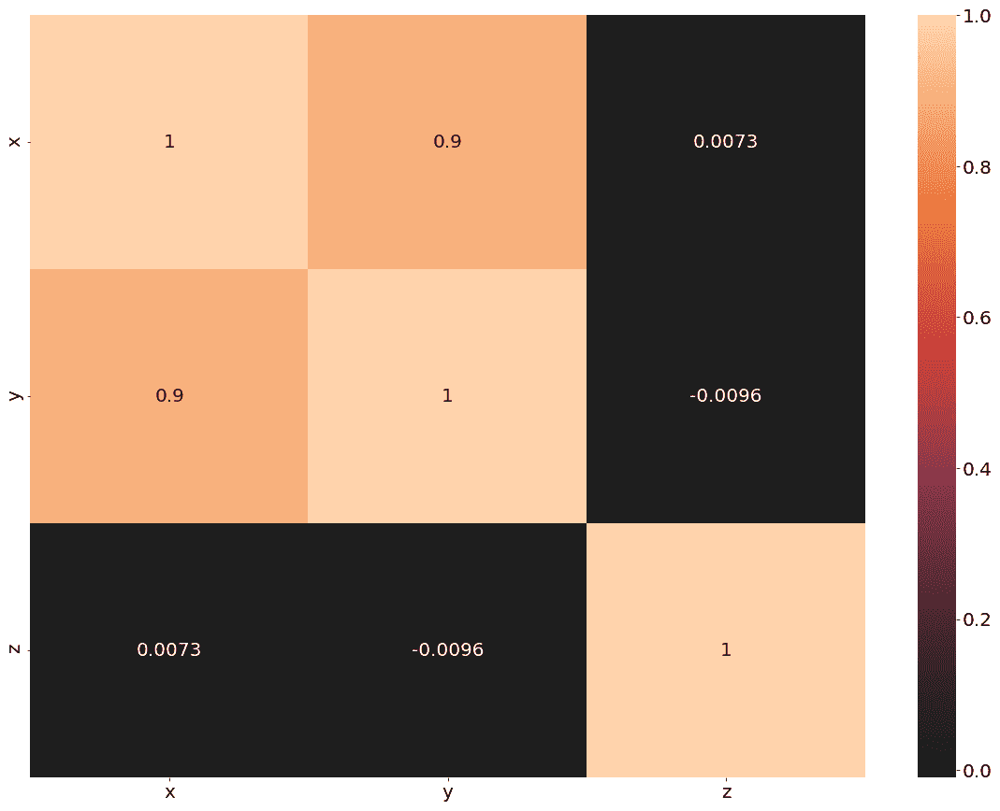

图 3.24：代表相关矩阵的热力图

在这种情况下，当通过视觉检查相关矩阵热力图时，我们可以专注于明亮的区域，除了对角线单元格，以识别高度相关的属性。如果数据集中存在负相关的属性（在我们当前的例子中没有），那么这些属性也可以通过暗区域来检测。

总的来说，给定数据集的相关矩阵可以成为我们理解数据集中不同属性之间关系的有用工具。我们将在接下来的练习中看到一个例子。

## 练习 3.04：识别和测试均值的相等性

在这个练习中，我们将练习两种推断统计方法来分析我们为您生成的一个合成数据集。可以从 GitHub 仓库[`packt.live/3ghKkDS`](https://packt.live/3ghKkDS)下载数据集。

在这里，我们的目标是首先确定数据集中哪些属性彼此相关，然后应用 t 检验来确定任何一对属性是否具有相同的均值。

有了这些说法，让我们开始吧：

1.  在一个新的 Jupyter 笔记本中，导入`pandas`、`matplotlib`、`seaborn`，以及从 SciPy 的`stats`模块中导入`ttest_ind()`方法：

```py
import pandas as pd
from scipy.stats import ttest_ind
import matplotlib.pyplot as plt
import seaborn as sns
```

1.  读取您下载的数据集。前五行应该如下所示：

图 3.25：读取数据集的前五行

1.  在下一个代码单元中，使用 seaborn 生成代表该数据集相关矩阵的热力图。从可视化中，确定哪对属性彼此相关性最高：

```py
sns.heatmap(df.corr(), center=0, annot=True)
bottom, top = plt.ylim()
plt.ylim(bottom + 0.5, top - 0.5)
plt.show()
```

这段代码应该产生以下可视化效果：

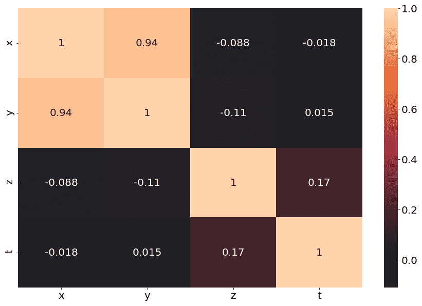

图 3.26：数据集的相关矩阵

从这个输出中，我们可以看到属性'x'和'y'的相关系数相当高：0.94。

1.  使用 seaborn 中的`jointplot()`方法，创建一个组合图，其中包括一个二维平面上的散点图，点的坐标分别对应于'x'和'y'中的个别值，以及代表这些值分布的两个直方图。观察输出并决定这两个分布是否具有相同的均值：

```py
sns.jointplot(x='x', y='y', data=df)
plt.show()
```

这将产生以下输出：

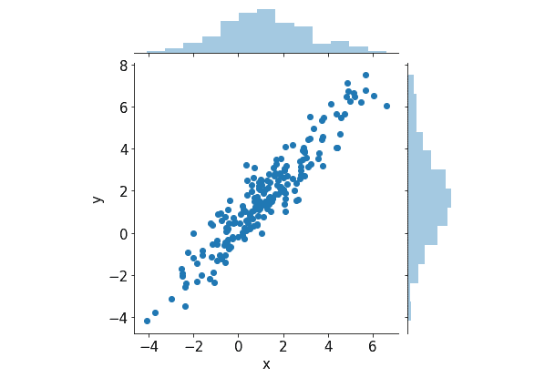

图 3.27：相关属性的组合图

从这个可视化中，不清楚这两个属性是否具有相同的均值。

1.  不使用可视化，而是使用 0.05 的显著性水平运行 t 检验，以决定这两个属性是否具有相同的均值：

```py
ttest_ind(df['x'], df['y']).pvalue
```

该命令将产生以下输出：

```py
0.011436482008949079
```

这个 p 值确实低于 0.05，使我们能够拒绝这两个分布具有相同均值的零假设，尽管它们高度相关。

在这个练习中，我们应用了本节中学到的两种推断统计方法来分析数据集中一对相关属性。

注意

要访问本特定部分的源代码，请参阅[`packt.live/31Au1hc`](https://packt.live/31Au1hc)。

您也可以在[`packt.live/2YTt7L7`](https://packt.live/2YTt7L7)上在线运行此示例。

在关于推断统计的下一个和最后一节中，我们将讨论使用统计和机器学习模型作为使用统计进行推断的方法。

## 统计和机器学习模型

使用数学或机器学习模型对给定数据集进行建模，这本身就能够将数据集中的任何潜在模式和趋势推广到未见数据点，是推断统计学的另一种形式。机器学习本身可以说是计算机科学中增长最快的领域之一。然而，大多数机器学习模型实际上利用了数学和统计理论，这就是为什么这两个领域密切相关的原因。在本节中，我们将考虑在给定数据集上训练模型的过程以及 Python 如何帮助促进该过程。

重要的是要注意，机器学习模型实际上并不像人类那样学习。大多数情况下，模型试图解决一个最小化训练误差的优化问题，这代表了它在训练数据中处理模式的能力，希望模型能够很好地推广到从相同分布中抽取的未见数据。

例如，线性回归模型生成最佳拟合线，通过给定数据集中的所有数据点。在模型定义中，这条线对应于具有最小距离和的线，通过解决最小化距离和的优化问题，线性回归模型能够输出最佳拟合线。

总的来说，每个机器学习算法以不同的方式对数据和优化问题进行建模，每种适用于特定的设置。然而，Python 语言内置的不同抽象级别使我们能够跳过这些细节，并在高层次应用不同的机器学习模型。我们需要记住的是，统计和机器学习模型是推断统计的另一种方法，我们能够根据训练数据集中的模式对未见数据进行预测。

假设我们的任务是在前一节中拥有的样本数据集上训练模型，其中学习特征是'x'和'z'，我们的预测目标是'y'。也就是说，我们的模型应该学习'x'或'z'与'y'之间的任何潜在关系，并从中知道如何从'x'和'z'的数据中预测'y'的未见值。

由于`'y'`是一个数值属性，我们将需要一个回归模型来训练我们的数据，而不是一个分类器。在这里，我们将使用统计学和机器学习中最常用的回归器之一：线性回归。为此，我们将需要 scikit-learn 库，这是 Python 中最受欢迎的预测数据分析工具之一，如果不是最受欢迎的。

要安装 scikit-learn，请运行以下`pip`命令：

```py
$ pip install scikit-learn
```

你也可以使用`conda`命令来安装它：

```py
$ conda install scikit-learn
```

现在，我们导入线性回归模型并将其拟合到我们的训练数据：

```py
from sklearn import linear_model
model = linear_model.LinearRegression()
model.fit(df[['x', 'z']], df['y'])
```

一般来说，由机器学习模型对象调用的`fit()`方法接受两个参数：独立特征（即用于进行预测的特征），在这种情况下是`'x'`和`'z'`，以及依赖特征或预测目标（即我们想要进行预测的属性），在这种情况下是`'y'`。

这个`fit()`方法将在给定数据上启动模型的训练过程。根据模型的复杂性以及训练数据的大小，这个过程可能需要相当长的时间。然而，对于线性回归，训练过程应该相对快速。

一旦我们的模型训练完成，我们可以查看它的各种统计数据。可用的统计数据取决于所使用的具体模型；对于线性回归，我们通常考虑系数。回归系数是独立特征和预测目标之间线性关系的估计值。实质上，回归系数是线性回归模型为特定预测变量（在我们的情况下是`'x'`或`'z'`）和我们想要预测的特征的最佳拟合线的斜率估计值。

这些统计数据可以按如下方式访问：

```py
model.coef_
```

这将给我们以下输出：

```py
array([1.98861194, 0.05436268])
```

你自己实验的输出可能与前面的不完全相同。然而，这些系数存在明显的趋势：第一个系数（表示`'x'`和`'y'`之间的估计线性关系）约为 2，而第二个系数（表示`'z'`和`'y'`之间的估计线性关系）接近于 0。

这个结果与我们生成这个数据集的方法非常一致：`'y'`被生成为大致等于`'x'`中的元素乘以 2，而`'z'`是独立生成的。通过观察这些回归系数，我们可以获得关于哪些特征是最佳（线性）预测器的信息。一些人认为这些类型的统计数据是可解释性统计数据，因为它们为我们提供了关于预测过程如何进行的见解。

对我们来说更有趣的是对未见数据进行预测的过程。这可以通过在模型对象上调用`predict()`方法来完成，如下所示：

```py
model.predict([[1, 2], [2, 3]])
```

输出将如下所示：

```py
array([2.10790143, 4.15087605])
```

在这里，我们将任何能表示二维表的数据结构传递给`predict()`方法（在前面的代码中，我们使用了嵌套列表，但理论上，你也可以使用二维 NumPy 数组或 pandas 的`DataFrame`对象）。这个表的列数需要等于训练数据中独立特征的数量；在这种情况下，我们有两个（`'x'`和`'z'`），所以`[[1, 2], [2, 3]]`中的每个子列表都有两个元素。

从模型产生的预测中，我们看到当`'x'`等于 1 且`'z'`等于 2（我们的第一个测试案例）时，相应的预测大约为 2。这与`'x'`的系数约为 2 和`'z'`的系数接近 0 的事实一致。第二个测试案例也是如此。

这就是机器学习模型如何用于对数据进行预测的一个例子。总的来说，scikit-learn 库为不同类型的问题提供了各种模型：分类、回归、聚类、降维等等。模型之间的 API 与我们所见到的`fit()`和`predict()`方法一致。这使得灵活性和流程化程度更高。

机器学习中的一个重要概念是模型选择。并非所有模型都是平等的；由于其设计或特性，某些模型更适合于给定的数据集。这就是为什么模型选择是整个机器学习流程中的重要阶段。在收集和准备训练数据集之后，机器学习工程师通常会将数据集馈送到多个不同的模型中，一些模型可能由于性能不佳而被排除在外。

我们将在接下来的练习中演示这一点，我们将介绍模型选择的过程。

## 练习 3.05：模型选择

在这个练习中，我们将进行一个样本模型选择过程，尝试将三种不同的模型拟合到一个合成数据集中，并考虑它们的性能：

1.  在新的 Jupyter 笔记本的第一个代码单元中，导入以下工具：

```py
import numpy as np
from sklearn.datasets import make_blobs
from sklearn.model_selection import train_test_split
from sklearn.metrics import accuracy_score
from sklearn.neighbors import KNeighborsClassifier
from sklearn.svm import SVC
from sklearn.ensemble import GradientBoostingClassifier
import matplotlib.pyplot as plt
```

注意

我们还不熟悉一些工具，但随着我们进行这个练习，它们将被解释给我们。

现在，我们想要创建一个位于二维平面上的合成数据集。这些点中的每一个都属于一个特定的组，属于同一组的点应该围绕一个共同的中心点旋转。

1.  这些合成数据可以使用我们从`sklearn.datasets`包中导入的`make_blobs`函数生成：

```py
n_samples = 10000
centers = [(-2, 2), (0, 0), (2, 2)]
X, y = make_blobs(n_samples=n_samples, centers=centers, \
                  shuffle=False, random_state=0)
```

正如我们所看到的，这个函数接受一个名为`n_samples`的参数，该参数指定应该生成的数据点的数量。另一方面，`centers`参数指定了个体点所属的总组数以及它们各自的坐标。在这种情况下，我们有三组围绕着`(-2, 2)`，`(0, 0)`和`(2, 2)`的点。

1.  最后，通过将`random_state`参数指定为`0`，我们确保每次重新运行此笔记本时生成相同的数据。正如我们在*第一章*，*Python 基础*中提到的，这在可重现性方面是一个良好的实践。

我们的目标是在这些数据上训练各种模型，以便当馈送一个新的点列表时，模型可以以高准确度决定每个点应该属于哪个组。

这个函数返回一个包含两个对象的元组，我们分别将它们分配给变量`X`和`y`。元组中的第一个元素包含数据集的独立特征；在这种情况下，它们是点的* x *和* y *坐标。第二个元组元素是我们的预测目标，即每个点所属组的索引。约定是将独立特征存储在名为`X`的矩阵中，将预测目标存储在名为`y`的向量中，就像我们正在做的那样。

1.  打印出这些变量，看看我们正在处理什么。将`X`作为输入类型：

```py
X
```

这将产生以下输出：

```py
array([[-0.23594765,  2.40015721],
       [-1.02126202,  4.2408932 ],
       [-0.13244201,  1.02272212],
       ...,
       [ 0.98700332,  2.27166174],
       [ 1.89100272,  1.94274075],
       [ 0.94106874,  1.67347156]])
```

现在，将`y`作为输入类型：

```py
y
```

这将产生以下输出：

```py
array([0, 0, 0, ..., 2, 2, 2])
```

1.  现在，在一个新的代码单元中，我们想要使用散点图来可视化这个数据集：

```py
plt.scatter(X[:, 0], X[:, 1], c=y)
plt.show()
```

我们使用数据集中的第一个属性作为* x *坐标，第二个属性作为散点图中点的* y *坐标。我们还可以通过将我们的预测目标`y`传递给参数`c`来快速指定属于同一组的点应该具有相同的颜色。

这个代码单元将产生以下散点图：

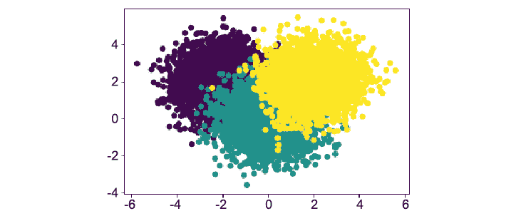

图 3.28：用于机器学习问题的散点图

模型选择过程中最常见的策略是首先将数据分成训练数据集和测试/验证数据集。训练数据集用于训练我们想要使用的机器学习模型，而测试数据集用于验证这些模型的性能。

1.  `sklearn.model_selection`包中的`train_test_split()`函数简化了将数据集拆分为训练和测试数据集的过程。在下一个代码单元中，输入以下代码：

```py
X_train, X_test, \
y_train, y_test = train_test_split(X, y, shuffle=True, \
                                   random_state=0)
```

正如我们所看到的，这个函数返回了四个对象的元组，我们将其分配给了前面的四个变量：`X_train`包含训练数据集中独立特征的数据，而`X_test`包含测试数据集中相同特征的数据，`y_train`和`y_test`也是如此。

1.  我们可以通过考虑我们的训练数据集的形状来检查拆分是如何进行的：

```py
X_train.shape
(7500, 2)
```

默认情况下，训练数据集是从输入数据的 75%中随机选择的，而测试数据集是剩余的数据，随机洗牌。这由前面的输出所示，我们的训练数据集中有 7500 条记录，原始数据中有 10000 条记录。

1.  在下一个代码单元中，我们将初始化我们导入的机器学习模型，而不指定任何超参数（稍后会详细介绍）：

```py
models = [KNeighborsClassifier(), SVC(),\
          GradientBoostingClassifier()]
```

1.  接下来，我们将循环遍历每个模型，在我们的训练数据集上对它们进行训练，并最终使用`accuracy_score`函数计算它们在测试数据集上的准确性，该函数比较`y_test`中存储的值和我们模型在`y_pred`中生成的预测值：

```py
for model in models:
    model.fit(X_train, y_train)
    y_pred = model.predict(X_test)

    print(f'{type(model).__name__}: {accuracy_score(y_pred, y_test)}')
```

同样，`fit()`方法用于在`X_train`和`y_train`上训练每个模型，而`predict()`用于让模型对`X_test`进行预测。这将产生类似以下的输出：

```py
KNeighborsClassifier: 0.8792
SVC: 0.8956
GradientBoostingClassifier: 0.8876
```

从这里，我们可以看到`SVC`模型表现最好，这在某种程度上是预期的，因为它是使用的三种模型中最复杂的模型。在实际的模型选择过程中，您可能会加入更多的任务，比如交叉验证，以确保最终选择的模型是最佳选项。

这是我们模型选择练习的结束。通过这个练习，我们熟悉了使用 scikit-learn 模型的一般流程。正如我们所看到的，fit/predict API 在库中实现的所有模型中都是一致的，这为 Python 程序员提供了高度的灵活性和便利性。

这个练习也结束了推断统计的一般主题。

注意

要访问本节的源代码，请参阅[`packt.live/2BowiBI`](https://packt.live/2BowiBI)。

您也可以在[`packt.live/3dQdZ5h`](https://packt.live/3dQdZ5h)上线运行此示例。

在本章的下一个和最后一节中，我们将迭代许多其他库，这些库可以支持各种特定的统计程序。

# Python 的其他统计工具

在上一章中，我们考虑了 Python 的三个主要库，它们构成了常见数据科学/科学计算流程的大部分内容：NumPy 用于多维矩阵计算，pandas 用于表格数据操作，Matplotlib 用于数据可视化。

在这个过程中，我们还讨论了一些支持工具，这些工具很好地补充了这三个库；它们是 seaborn 用于实现复杂可视化、SciPy 用于统计和科学计算能力、scikit-learn 用于高级数据分析需求。

不用说，还有其他工具和库，即使它们在我们的讨论中没有很好地融入，也为科学计算中的特定任务提供了独特而强大的功能。在本节中，我们将简要讨论其中一些，以便我们可以全面了解 Python 工具可用于哪些特定任务。

这些工具包括：

+   statsmodels：这个库最初是 SciPy 整体生态系统的一部分，但最终分拆成了自己的项目。该库提供了广泛的统计测试和分析技术、模型和绘图功能，全部组合成一个具有一致 API 的综合工具，包括时间序列分析能力，而其前身 SciPy 在这方面有些欠缺。

statsmodels 的主网站可以在这里找到：[`www.statsmodels.org/stable/index.html`](http://www.statsmodels.org/stable/index.html)。

+   PyMC3：在称为贝叶斯统计学的统计学子领域中，有许多独特的概念和程序，可以在建模和预测方面提供强大的能力，而这些能力在我们考虑的库中得不到很好的支持。

在 PyMC3 中，贝叶斯统计建模和概率编程技术被实现为其自己的生态系统，具有绘图、测试和诊断能力，这使得它成为可能是最受欢迎的概率编程工具，不仅适用于 Python 用户，还适用于所有科学计算工程师。

有关如何开始使用 PyMC3 的更多信息，请访问其主页[`docs.pymc.io/`](https://docs.pymc.io/)。

+   SymPy：远离统计学和机器学习，如果您正在寻找一个支持符号数学的 Python 库，SymPy 很可能是您最好的选择。该库涵盖了代数、微积分、离散数学、几何和与物理相关的应用等广泛的核心数学子领域。SymPy 也以其相对简单的 API 和可扩展的源代码而闻名，这使得它成为寻找 Python 中符号数学库的用户的热门选择。

您可以从 SymPy 的网站了解更多信息[`www.sympy.org/en/index.html`](https://www.sympy.org/en/index.html)。

+   Bokeh：我们列表中的最后一个条目是一个可视化库。与 Matplotlib 或 seaborn 不同，Bokeh 是一个专门设计用于交互和网页浏览的可视化工具。Bokeh 通常是可视化工程师的首选工具，他们需要在 Python 中处理大量数据，但希望生成交互式报告/仪表板作为 Web 应用程序。

要阅读官方文档并查看一些示例的画廊，您可以访问主网站[`docs.bokeh.org/en/latest/index.html`](https://docs.bokeh.org/en/latest/index.html)。

这些库为各自的统计学和数学子领域提供了很好的支持。同样，也总是可能找到其他符合您特定需求的工具。使用像 Python 这样受欢迎的编程语言的最大优势之一是，许多开发人员每天都在努力开发新的工具和库，以满足各种目的和需求。到目前为止，我们讨论过的库将帮助我们完成大部分统计计算和建模的基本任务，然后我们可以整合其他更高级的工具来进一步扩展我们的项目。

在我们结束本章之前，我们将通过一项活动来巩固我们迄今为止学到的一些重要概念。

## 活动 3.01：重新审视社区和犯罪数据集

在这个活动中，我们将再次考虑我们在上一章中分析过的“社区和犯罪”数据集。这一次，我们将应用本章学到的概念，从这个数据集中获得额外的见解：

1.  在存储数据集的同一目录中，创建一个新的 Jupyter 笔记本。或者，您可以再次在[`packt.live/2CWXPdD`](https://packt.live/2CWXPdD)下载数据集。

1.  在第一个代码单元格中，导入我们将使用的库：`numpy`、`pandas`、`matplotlib`和`seaborn`。

1.  与上一章一样，读取数据集并打印出它的前五行。

1.  用 NumPy 中的`nan`对象替换每个'?'字符。

1.  关注以下列：`'population'`（包括给定地区的总人口数量）、`'agePct12t21'`、`'agePct12t29'`、`'agePct16t24'`和`'agePct65up'`，每个列中包括该人口中不同年龄组的百分比。

1.  编写代码，在我们的数据集中创建包含这些年龄组实际人数的新列。这些应该是列`'population'`中的数据和每个年龄百分比列的乘积。

1.  使用 pandas 的`groupby()`方法计算每个州不同年龄组的总人数。

1.  调用我们数据集上的`describe()`方法，打印出其各种描述性统计信息。

1.  关注`'burglPerPop'`、`'larcPerPop'`、`'autoTheftPerPop'`、`'arsonsPerPop'`和`'nonViolPerPop'`列，每个列描述了各种犯罪（入室盗窃、偷窃、汽车盗窃、纵火和非暴力犯罪）每 10 万人中的数量。

1.  在一个单一的可视化中，通过箱线图来展现这些列中数据的分布。从图中识别出五种犯罪中哪一种最常见，哪一种最不常见。

1.  关注`'PctPopUnderPov'`、`'PctLess9thGrade'`、`'PctUnemployed'`、`'ViolentCrimesPerPop'`和`'nonViolPerPop'`列。前三个描述了给定地区人口中属于相应类别的百分比（生活在贫困线以下的人口比例、25 岁以上没有完成九年级教育的人口比例、劳动力中失业的人口比例）。最后两个给出了每 10 万人中的暴力和非暴力犯罪数量。

1.  计算适当的统计对象，并相应地对其进行可视化以回答这个问题。识别与彼此相关性最大的一对列。

注意

此活动的解决方案可在 659 页找到。

# 总结

本章正式阐述了统计学和机器学习中的各种入门概念，包括不同类型的数据（分类、数值和有序），以及统计学的不同子类别（描述性统计和推断统计）。在我们的讨论中，我们还介绍了相关的 Python 库和工具，可以帮助促进相应主题的程序。最后，我们简要介绍了一些其他 Python 库，如 statsmodels、PyMC3 和 Bokeh，它们可以在统计和数据分析中提供更复杂和高级的用途。

在下一章中，我们将开始书中的新部分，涉及数学密集型主题，如序列、向量、复数和矩阵。具体来说，在下一章中，我们将深入研究函数和代数方程。

PSQ66

WRC42
