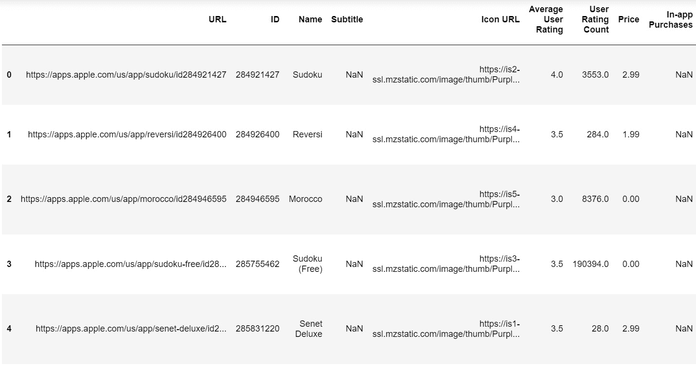
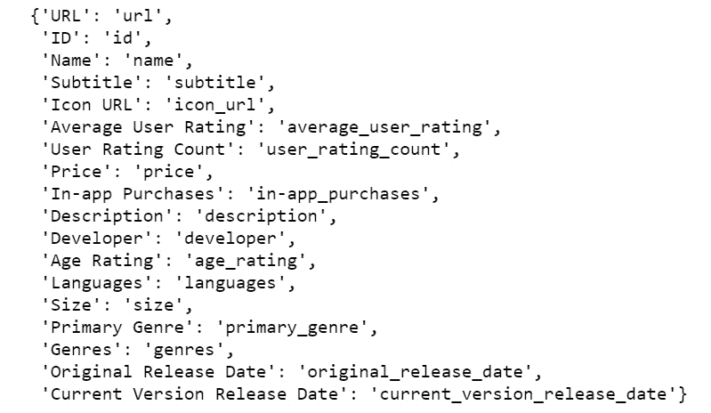
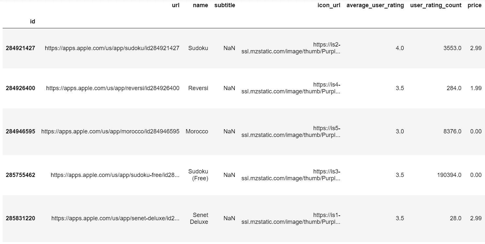
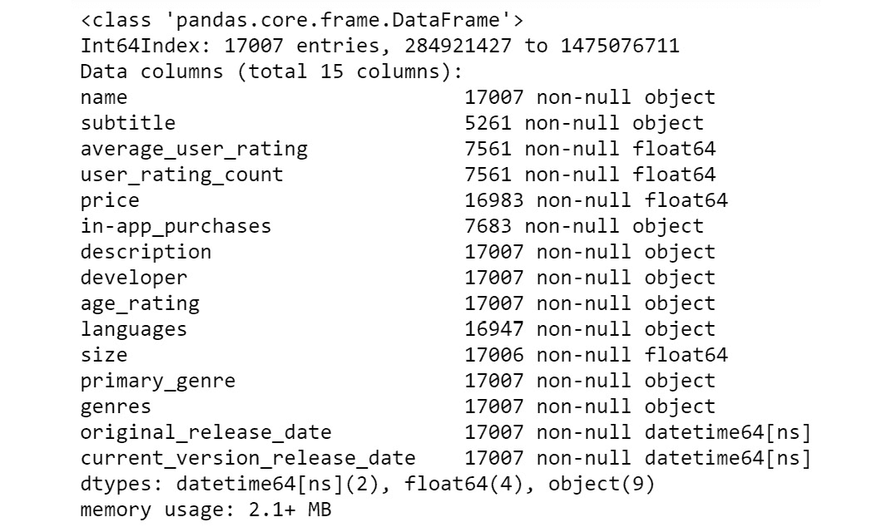
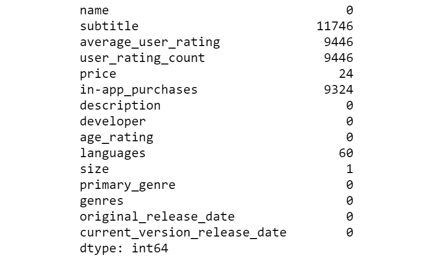
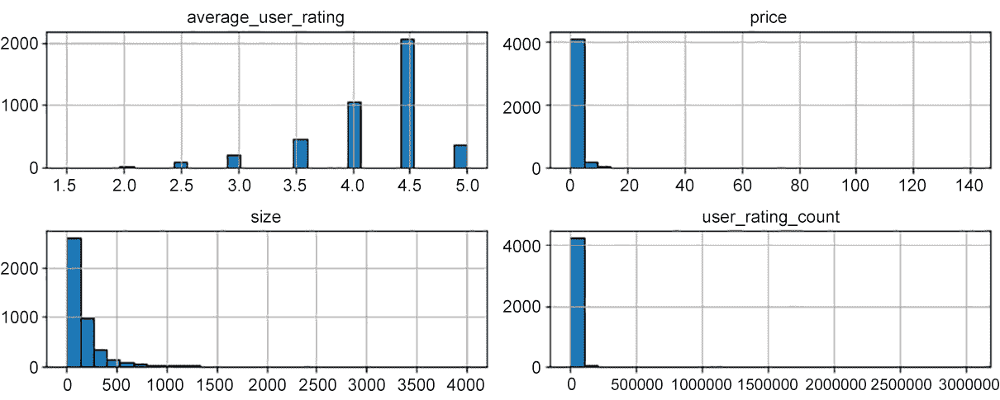
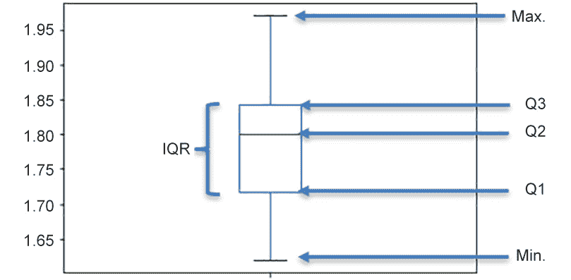
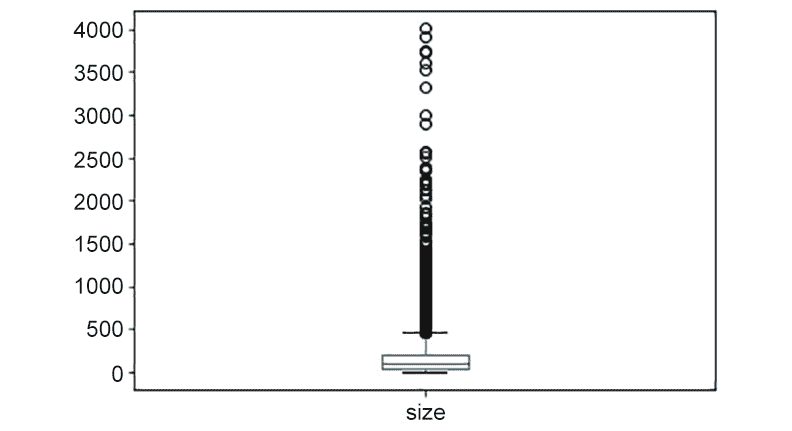
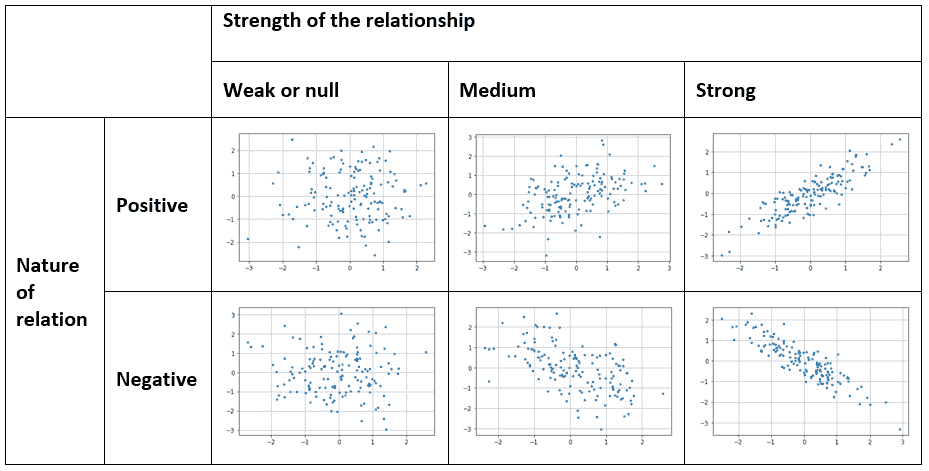
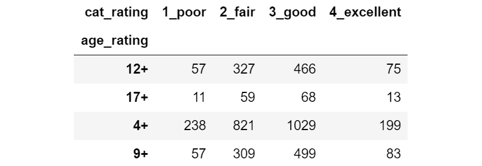

# 第七章：7\. 使用 Python 进行基本统计

概述

在本章中，我们将学习如何使用主要的描述性统计指标，并且产生和理解探索性数据分析中使用的主要可视化。

在本章结束时，你将能够加载和准备一个数据集进行基本的统计分析，计算和使用主要的描述性统计指标，使用描述性统计来理解数值和分类变量，并使用可视化来研究变量之间的关系。

# 介绍

Python 及其分析库，如 pandas 和 Matplotlib，使得在许多类型的数据集上执行简单和复杂的统计计算变得非常容易。本章介绍了任何统计分析的第一步：定义和理解问题，加载和准备数据集，之后，逐个理解变量并探索它们之间的一些关系。

本章包括三个部分：在第一部分中，我们介绍本章将使用的数据集以及一个假设的（但非常现实的）业务问题。然后我们加载数据集并执行许多常见的数据准备任务，包括更改变量类型和过滤有用的观察。有了准备好的数据集，第二部分介绍了描述性统计主要指标的简要概念介绍，然后这些知识立即应用到我们正在处理的数据集上。作为这一部分的一部分，我们将产生一个如何将描述性统计信息转化为知识的示例。第三部分介绍了学习者对**探索性数据分析**（**EDA**）的实践。从一些问题和基本计算开始，我们用一些最有用的统计可视化，如直方图、箱线图和散点图，来补充我们对基本统计的理解。

本章将采用与其他对待这个主题的传统方法不同的方法；我们不仅仅是呈现统计概念，而是更加实际地将它们作为进行数据分析的工具，这意味着将数据转化为信息，将信息转化为知识。

# 数据准备

所有应用统计都始于一个数据集和一个需要解决的问题。在现实世界中，我们从不孤立地进行统计分析；总是有一个需要解决的业务问题，一个需要定量理解的主题，或者一个需要提出科学问题。理解问题总是任何统计分析的第一步。第二步是收集和准备数据。数据收集不是本书的主题，所以我们将直接进行数据准备。因此，在进行一些统计计算之前，我们需要确保我们理解我们的业务问题，并且已经准备好我们的数据集。

## 介绍数据集

在这个小节中，我们将介绍本章将使用的数据集，并进行一些基本的数据准备任务。了解数据集将在我们定义业务问题时给你更多的背景信息。

我们将使用**策略游戏**数据集，其中包含来自苹果应用商店的策略游戏的真实世界信息（可在[`www.kaggle.com/tristan581/17k-apple-app-store-strategy-games`](https://www.kaggle.com/tristan581/17k-apple-app-store-strategy-games)获取，遵循以下许可证：署名 4.0 国际（CC BY 4.0））。它是在 2019 年 8 月收集的，包含约 17,000 个策略游戏的 18 列。文件包含的列的描述如下：

+   **网址**：游戏的网址

+   **ID**：分配的 ID

+   **名称**：游戏的名称

+   **副标题**：名称下的次要文本

+   **图标网址**：512 像素 x 512 像素的 JPG

+   **平均用户评分**：四舍五入到最接近的 0.5

+   **用户评分计数**：国际评分数量；空值表示低于 5

+   **价格**：美元价格

+   **应用内购买**：可用应用内购买的价格

+   **描述**：应用描述

+   **开发者**：应用开发者

+   **年龄评级**：4+、9+、12+或 17+

+   **语言**：ISO2A 语言代码

+   **大小**：应用的大小（以字节为单位）

+   **主要类型**：主要类型

+   **类型**：应用的类型

+   **原始发布日期**：发布日期

+   **当前版本发布日期**：最后更新日期

注意

你也可以从 GitHub 仓库下载数据集[`packt.live/2O1hv2B`](https://packt.live/2O1hv2B)。

## 介绍业务问题

我们将使用这个数据集以及一个虚构的业务问题来学习如何将数据转化为信息，将信息转化为有用的建议。想象一下，这是一个光荣的星期一早晨，你正在享受一杯优质的危地马拉咖啡。作为一个才华横溢的分析团队的一部分，你收到了以下消息：

你所在的游戏开发公司的 CEO 提出了一项计划，以加强公司在游戏市场的地位。根据他的行业知识和其他商业报告，他知道吸引新客户的一个非常有效的方法是在移动游戏领域建立良好的声誉。鉴于这一事实，他有以下计划：为 iOS 平台开发一款策略游戏，这将吸引大量积极的关注，从而将大量新客户带到公司。他确信只有游戏得到用户的好评，他的计划才会奏效。由于他是移动游戏领域的新手，他请求你帮助回答以下问题：什么类型的策略游戏得到了用户的好评？

现在，你是这个业务问题的所有者。在处理数据之前，你必须确保你理解了问题，并且至少在原则上，问题是可以通过你拥有的数据集来解决的（部分或完全）。我们将使用之前介绍的数据集来进行一些统计分析，并就在游戏行业的这个子市场中，什么因素使得策略游戏获得良好的评价提出一些建议。

## 准备数据集

让我们开始加载数据集和本章将使用的库。首先，让我们加载我们现在将使用的库，它们是 NumPy、Seaborn、pandas 和 Matplotlib：

```py
import pandas as pd
import numpy as np
import matplotlib.pyplot as plt
import seaborn as sns
# line to allow the plots to be shown in the Jupyter Notebook
%matplotlib inline
```

现在让我们读取数据集。由于 pandas 的强大功能，这可以通过一行代码完成。数据集包含 17,007 个策略游戏的 18 列。这行代码将读取 CSV 文件并创建一个准备好使用的 DataFrame：

```py
games = pd.read_csv('data/appstore_games.csv')
```

检查我们是否从文件中加载了正确/预期的行数和列数总是一个好主意：

```py
games.shape
```

这给我们以下输出：

```py
(17007, 18)
```

好的，现在我们知道我们已经从文件中读取了所有的行和列。

现在让我们快速查看我们新创建的 DataFrame 的前五行，看看它是什么样子的：

```py
games.head()
```

这给出了以下输出：



图 7.1：DataFrame 的前五行和九列

这里有几件事情需要注意：

+   列名已经被正确读取（URL、名称、ID 等）；然而，文件中的名称并不那么友好，如果我们想要轻松输入，因为它们包含大写和小写字母，有些包含单词之间的空格。

+   DataFrame 使用自动生成的整数索引加载。我们可以通过查看最左边的列和粗体打印的整数来看到这一点（`0`，`1`，`2`，…）。

让我们分别解决这两个问题。

首先，对于 DataFrame 列的名称，有一个统一的标准格式是很有用的。当然，这是个人选择，关于这个没有严格的指导方针。然而，我建议以下格式：

+   小写名称

+   没有空格-使用下划线代替空格

使用这种格式将使您能够通过实现以下目标更快地输入：

+   在输入时避免混淆（“这个字母是大写还是小写？”）。

+   利用您喜欢的 IDE 和/或 Jupyter Notebook 中的自动补全功能（在 Jupyter 中使用*Tab*键）。

为了进行更改，让我们创建一个字典（使用 Python 的字典推导功能），其中包含原始列名和转换后的版本：

```py
original_colums_dict = {x: x.lower().replace(' ','_') \
                        for x in games.columns}
original_colums_dict 
```

得到的字典如下：



图 7.2：原始和转换后的列名的字典

现在我们可以使用这个字典来使用`rename`函数更改列名：

```py
games.rename(columns = original_colums_dict,\
             inplace = True)
```

第二个问题与 DataFrame 的索引有关。始终建议使用有意义的 DataFrame 索引，因为这将使我们的数据处理更容易，特别是与其他表合并的问题。在这种情况下，我们有一列包含我们数据集每一行的唯一 ID（`id`），所以让我们使用这列作为 DataFrame 的索引：

```py
games.set_index(keys = 'id', inplace = True)
```

现在我们可以再次使用以下代码行来查看修改后 DataFrame 的前几行和列：

```py
games.head()
```

结果如下：



图 7.3：修改后 DataFrame 的前几行和列

现在看起来更好了；然而，它仍然需要一些准备工作。

我们知道这个数据集中有 18 列；然而，有一些列我们可以预料到不会提供有用的信息。我们如何知道一列是否会提供有用的信息？一切都取决于上下文：记住，在这种情况下，我们的目标是了解什么使一个策略游戏获得很高的评分。在这种情况下，可以安全地假设游戏的 URL 和游戏图标的 URL 不会提供有关这个问题的任何有用信息。因此，没有理由保留这些列。要删除这些列，运行以下代码：

```py
games.drop(columns = ['url', 'icon_url'], inplace = True)
```

另一个重要的处理步骤是确保我们的 DataFrame 中的列被正确类型化，这将使其他所有操作更容易：计算、可视化和新特征的创建。我们可以使用`info()`方法来检查我们的列的类型以及其他有用的信息：

```py
games.info()
```

这会产生以下输出：


图 7.4：info 方法的输出

如您所见，在概念上是数值和分类变量的列似乎具有正确的类型：`float64`和`object`。然而，我们有两列是日期，并且它们的类型是`object`。让我们使用以下代码将这两列转换为`datetime`类型：

```py
games['original_release_date'] = pd.to_datetime\
                                 (games['original_release_date'])
games['current_version_release_date'] =\
pd.to_datetime(games['current_version_release_date'])
```

运行前面的代码行后，我们可以再次使用`info`方法检查列类型：

```py
games.info()
```

这会产生以下输出：



图 7.5：更改两个日期列类型后 info 方法的输出

请注意，包含日期的两列（`original_release_date`和`current_version_release_date`）现在具有正确的`datetime64`类型。

我们的数据集现在似乎已经准备好开始分析一些数据了。使用术语“似乎”是因为当我们分析数据集时，我们可能会发现需要进行一些额外的准备/清理工作。

您可以再次使用`head()`方法查看处理后的 DataFrame：

```py
games.head()
```

输出如下：


图 7.6：处理后 DataFrame 的前几行和列

在处理真实世界的数据集时，几乎可以肯定会在某些列中找到缺失值，因此检查数据集的每一列中有多少缺失值是一个好主意。我们可以使用以下代码行来做到这一点：

```py
games.isnull().sum()
```

前面的代码行显示了以下输出：



图 7.7：按列计算的空值数量

我们看到`subtitle`列中有超过 11,000 个缺失值，尽管对于我们将在本章进行的分析来说，也许该列并不那么重要（也许我们应该将其删除？你觉得呢？）。另一方面，`average_user_rating`和`user_rating_count`具有相同数量的缺失值：9,446。这表明这些缺失值可能是相关的。让我们使用`np.array_equal` NumPy 函数来验证这一猜测。该函数评估两个数组是否在元素级别上相等，并在这种情况下返回`True`。我们将使用此函数来检查这些列在相应位置是否存在缺失值。通过这样做，我们将确认缺失值发生在相同的行上。以下代码行实现了我们刚刚解释的内容：

```py
np.array_equal(games['average_user_rating'].isnull(),\
               games['user_rating_count'].isnull())
```

这给出了结果`True`。

从结果中，我们可以得出结论，每当我们在其中一列中有一个缺失值时，另一列也显示出缺失值。因此，我们的猜测是正确的：如果我们没有`user_rating_count`，那么我们也没有`average_user_rating`（如果是这种情况，那么我们将不得不分别处理这两列的缺失值）。回到列的描述（*介绍数据集*部分）中，对于用户评分计数，我们发现“null 表示低于 5”，因此如果少于 5 个人对游戏进行评分，那么我们根本没有评分。

继续探索缺失值，对于应用内购买列，我们有 9,324 个相对较高的值。最后，对于价格、语言和大小，我们分别有 24、60 和 1 个缺失值，鉴于我们数据的维度，这对我们的目的来说并不是什么大问题。

现在我们知道我们的数据集中的某些列中有缺失值，有许多方法可以处理它们。*插补*基本上意味着用合理的值替换缺失值。有非常复杂的方法可以做到这一点，这超出了本书的范围。我们将使用非常简单的方法来处理一些缺失值；但是，我们将等到完成准备工作后再决定如何处理这些缺失值。插补通常是数据准备过程中的最后一步。

现在是我们决定哪些观察结果（游戏）对我们的分析相关的时候了；换句话说，我们必须回答这个问题：我们应该保留所有我们拥有的游戏吗？

从我们分析的背景来看，有一件事是清楚的：没有评分的游戏对我们的目标毫无用处，因为我们想要了解评分。因此，我们应该将它们排除在我们的分析之外。以下代码行将仅保留`average_user_rating`不为空的行：

```py
games = games.loc[games['average_user_rating'].notnull()]
```

请记住，`average_user_rating`中的空值数量为`9446`，因此最后一行代码将删除这些行。

我们应该意识到另一个事实：评分游戏的人数。从数据集描述中，我们知道至少有五个用户必须对游戏进行评分，游戏才能有评分。出于我们将在第九章《使用 Python 进行中级统计》中解释的原因，我们将只保留那些至少有 30 个用户评分的游戏（基本上，出于技术原因，大小为`30`可以保证平均评分可用于分析）。以下代码将执行我们刚刚描述的操作：

```py
games = games.loc[games['user_rating_count'] >= 30]
```

让我们使用`shape`方法来查看我们还剩下多少观察结果：

```py
games.shape
```

结果如下：

```py
(4311, 15)
```

现在，再次检查每列中有多少缺失值是一个好主意。我们将使用与此任务之前使用的相同代码：

```py
games.isnull().sum()
```

这向我们展示了以下输出：


图 7.8：按列计算空值的数量

现在我们看到，从可能相关的列中，只有两个存在缺失值：`in-app_purchases`（`1,313`）和`languages`（`14`）。

注意

关于所有练习和相关测试脚本的一个快速说明：如果您正在使用**命令行界面**（**CLI**）（如 Windows 的命令提示符或 Mac 的终端）运行测试脚本，它将抛出一个错误，即`Implement enable_gui in a subclass`，这与笔记本中使用的一些命令有关（如`%matplotlib inline`）。因此，如果您想运行测试脚本，请使用 IPython shell。最好在 Jupyter 笔记本上运行练习的代码。

## 练习 7.01：使用字符串列生成数值列

在这个练习中，我们将在我们的 DataFrame 中创建一个新的数值变量，该变量将包含游戏可用语言的数量信息。这将是如何将文本数据转换为数值信息的一个示例。

1.  创建一个我们迄今为止一直在使用的 DataFrame 的副本，并将其命名为`games2`，这样我们就有了另一个要处理的对象：

```py
games2 = games.copy()
```

1.  使用`head`方法查看`languages`列的前五个值：

```py
games2['languages'].head()
```

结果如下：


图 7.9：语言列的前五个值

1.  如您所见，它由逗号分隔的语言缩写字符串组成。使用`fillna()`方法将该列中的缺失值替换为`EN`，这是最常见的值：

```py
games2['languages'] = games2['languages'].fillna('EN')
```

1.  使用`str`访问器方法中的`split`（其工作方式与字符串的`split`方法相同）方法获取不同语言的列表，并将结果系列保存在名为`list_of_languages`的对象中：

```py
list_of_languages = games2['languages'].str.split(',')
```

1.  最后，让我们在 DataFrame 中创建一个名为`n_languages`的列，该列包含每个结果列表中的元素数量。为此，使用一个`lambda`函数和返回列表长度的`apply`方法：

```py
games2['n_languages'] = list_of_languages.apply(lambda x: len(x))
```

1.  新列的前 10 个元素应该是这样的：

```py
id
284921427    17
284926400     1
284946595     1
285755462    17
286210009     1
286313771     1
286363959     1
286566987     1
286682679     1
288096268     1
Name: n_languages, dtype: int64
```

在这个练习中，我们使用了一个文本列，并通过使用 pandas 的`str.split`方法和 lambda 函数，从基于文本的列生成了一个数值列。

注意

要访问此特定部分的源代码，请参阅[`packt.live/31xEnyy`](https://packt.live/31xEnyy)。

您也可以在[`packt.live/38lpuk2`](https://packt.live/38lpuk2)上在线运行此示例。

在这一部分，我们谈到了定义业务问题的重要性，并介绍了我们将在本章剩余部分使用的数据集。在我们所做的所有工作之后，数据集已经到了我们可以开始理解价值的地步。为此，我们将使用描述性统计，这是下一节的主题。

# 计算和使用描述性统计

描述性统计是一组我们用来总结一组测量（数据）信息的方法，这有助于我们理解它。在本节中，我们将首先解释描述性统计的必要性。之后，我们将介绍描述性统计中最常见的指标，包括均值、中位数和标准偏差。首先，我们将在概念层面上理解它们，使用一个简单的测量集，然后我们将应用我们在上一节中学到的关于它们的知识到我们准备好的数据集上。

## 描述性统计的必要性

我们为什么需要描述性统计？以下是一个示例，将向您展示为什么我们需要这些类型的分析工具：我们的大脑非常擅长各种任务，比如识别人脸表达的情感。试着注意一下，你的大脑在阅读以下面孔的情感时付出了多少努力：


图 7.10：一种面部表情

答案：几乎没有，当然你可以对图片中发生的事情说出有意义的话。

现在，相比之下，让我们的大脑做一个不同的任务：我们将使用上一节的游戏数据集，随机选择 300 个观察结果从平均用户评分列中，然后打印它们。以下代码行就是这样做的：

```py
random_ratings = games['average_user_rating'].sample(n=300)
for r in random_ratings:
    print(r, end=', ')
```

输出如下：


图 7.11：300 个平均用户评分的随机样本

看一下输出，试着分析它，并回答以下问题：

+   需要付出多少心理努力才能说出有意义的话？

+   仅凭数字，你能对平均评分说些什么呢？

你对这些问题的答案很可能是：

+   需要付出多少心理努力才能说出有意义的话？*"我花了一些时间看这些数字。"*

+   仅凭数字，你能对平均评分说些什么？*"不多，数字以.0 或.5 结尾。"*

仅仅通过观察*图 7.10*，我们就可以自动地通过说*女人笑*来总结和理解包含在成千上万像素中的信息。然而，在*图 7.11*的情况下，我们无法自动地了解有关它们的信息。这就是为什么我们需要描述性统计：它允许我们通过执行相对简单的计算来总结和理解数值信息。

## 统计概念简要回顾

如果你正在阅读这本书，很可能你已经学习或使用了一些最常见的描述性统计，对于我来说很难提供关于已经在成百上千本统计学书籍中介绍的概念的原始定义。因此，你可以将以下页面视为描述性统计测量中最重要概念的简要回顾。

在本小节中，为了使概念性解释更容易理解，我们将稍微偏离我们的策略游戏数据集，并使用一个包含 24 个观察结果的小数据集。假设我们有 24 个男性的身高（以米为单位）。这里是原始观察结果：

```py
    1.68, 1.83, 1.75, 1.80, 1.88, 1.80, 1.89, 1.84,
    1.90, 1.65, 1.67, 1.62, 1.81, 1.73, 1.84, 1.78,
    1.76, 1.97, 1.81, 1.75, 1.65, 1.87, 1.85, 1.64.
```

我们将使用这个小数据集来概念性地介绍最重要的描述性统计。为了使我们的计算更容易，让我们创建一个包含这些值的 pandas 系列：

```py
mens_heights = pd.Series\
               ([1.68, 1.83, 1.75, 1.8, 1.88, 1.8, 1.89, 1.84,\
                 1.9, 1.65, 1.67,1.62, 1.81, 1.73, 1.84, 1.78,\
                 1.76, 1.97, 1.81, 1.75, 1.65, 1.87, 1.85, 1.64])
```

现在我们准备好复习最常用的描述性统计了。

**算术平均值**：也简称为**平均值**，这是一种*分布中心*或一组数字的中心的度量。给定一组观察结果，平均值通过将观察结果相加并将该总和除以观察数量来计算。公式如下，其中*x bar* (*x̄*)是平均值，*n*是观察数量：


图 7.12：算术平均值公式

当大多数值聚集在一个*中心*周围时，平均值尤其有用且信息丰富，因为在这种情况下，平均值将接近该中心，因此将接近许多值，使其成为一组观察结果的*代表*数字。你在真实世界数据中遇到的许多（也许大多数）数值变量将具有聚集在平均值周围的值，因此平均值通常是一组测量的*典型*值的良好指标。

让我们使用内置的 pandas 方法计算男性身高的平均值：

```py
mens_heights.mean()
```

结果如下：

```py
1.7820833
```

这个数字告诉我们 1.78 米是 24 个男性身高集合的*代表*值。进行了这个计算后，我们知道一个典型男性（来自我们得到样本的总体）的身高大约为`1.78`米。

关于平均值需要注意的一点是，它会受到极端值的影响。当分析极端值可能比最常见值大几个数量级的变量时，这一点尤为棘手。

最后，值得一提的是，算术平均值通常是大多数人在说“平均值”时所指的，尽管还有其他平均值，比如中位数，我们稍后会定义。

**标准偏差**：这是数据的分散程度的一种度量。它衡量了一组测量结果中观察结果的不同或*分散*程度。数学公式基于算术平均值，供您参考，如下所示：


图 7.13：标准偏差公式

在前面的公式中，*s*代表标准偏差，*x bar* (*x̄*)代表平均值，*N*代表观测次数。由于一个技术细节（超出我们的范围），公式的分母是*N – 1*而不仅仅是*N*，但让我们假装一会儿分母是*N*：如果你仔细看公式，你会发现根号符号内的是*关于平均值的平方偏差的平均值*。因此，标准偏差是观测结果与其平均值的平均距离。公式中有平方根，所以得到的数字与原始测量结果具有相同的单位。

让我们再次使用 pandas 内置方法计算男性身高的小样本的标准偏差：

```py
mens_heights.std()
```

这给出了以下结果：

```py
0.0940850
```

我们的答案是`0.094`米，或者 9.4 厘米。这个数字的解释是，*平均而言*，一个男人的身高与平均值（在这种情况下为 1.78 米）相差 9.4 厘米。请注意我们说的是*平均而言*，这意味着我们可以预期个别男性的身高与平均值相差的距离会比 9.4 厘米更近或更远，但 9.4 是一个能够告诉我们典型观测结果与平均值相差多远的信息性数字。

为了更好地理解标准偏差的概念，将前面的计算与另一组假设的测量结果进行对比将会很有用。假设我们有另外 24 个男性的身高，平均值相似：

```py
mens_heights_2 = pd.Series\
                 ([1.77, 1.75, 1.75, 1.75, 1.73, 1.75, 1.73, 1.75,\
                   1.74, 1.76, 1.75, 1.75, 1.74, 1.76, 1.75, 1.76,\
                   1.76, 1.76, 1.75, 1.73, 1.74, 1.76, 1.76, 1.76])
```

让我们计算平均值，看看这 24 个男性与我们第一组的平均值相比如何：

```py
mens_heights_2.mean()
```

结果如下：

```py
1.750416
```

这比第一组的平均值低 3 厘米。现在让我们计算第二组的标准偏差：

```py
mens_heights_2.std()
```

结果如下：

```py
0.01082
```

这只有 1 厘米，这意味着第二组的身高更加均匀。换句话说，第二组的身高彼此更接近（也就是说，它们的分散程度更小）比第一组的身高。由于我们的观测次数很少，我们可以通过仔细观察第二组的测量结果来得知：请注意所有的测量结果都在 1.73 和 1.77 之间，因此与第一组相比，变异性较小。

在极端情况下，如果所有观察结果完全相同，也就是说它们之间没有变化，那么标准偏差将为零。观测结果越不同，标准偏差就会越大。

数据的分散程度还有其他度量方法，但标准偏差可能是最重要的。您应该确保知道如何解释它。

**四分位数**：四分位数是*位置测量*。它们表明当观察值从最小值（最小值）到最大值（最大值）排序时，该值处于某个相对位置。通常，第一、第二和第三个四分位数通常表示为**Q1**、**Q2**和**Q3**：

+   **Q1**：将数据分成这样一种方式，以便 25%的观察值低于这个值。

+   **Q2**：也称为*中位数*，这是将数字集合分成两半的数字，意味着 50%的观察值低于这个值，另外 50%的观察值高于这个值。中位数是另一种类型的平均值。

+   **Q3**：将数据分成这样一种方式，以便 75%的观察值低于这个值。

再次使用我们的前 24 个身高，我们可以对它们进行排序，并将这个小数据集分成四部分，每部分包括 6 个观察值。这在下图中有直观展示：


图 7.14：四分位数示例

在这个例子中，我们可以将数据集*完全*分成四部分。第一部分包括最小的六个观察值；第六个观察值是`1.68`，下一个（属于第二个四分位数）是`1.73`。从技术上讲，`1.68`和`1.73`之间的任何数字（`1.68` < `Q1` < `1.73`）都可以称为*第一个四分位数*，例如`1.70`，因为陈述*25%的观察值低于 1.70*是正确的。我们也可以选择`1.71`，因为陈述*25%的观察值低于 1.71*也是正确的。

中位数（`Q2`）将观察分成两半。在这种情况下，`1.80`是第 12 和第 13 个观察值，所以中位数是`1.80`。（如果有一个数字在第 12 和第 13 个观察值之间，中位数将是中间的数字。）

最后，对于第三个四分位数（`Q3`），我们从图中看到，`1.84`和`1.85`之间的任何数字（比如 1.845）都是一个值，将底部 75%的观察值与顶部 25%的观察值分开。

请注意，我没有给出任何计算四分位数的公式，那么四分位数是如何计算的呢？有一些方法我们在这本书中不会详细介绍。确切的方法并不重要，真正重要的是你理解这个概念。现在让我们看看如何计算这些值。在下面的代码行中，我们将使用 pandas 的`quantile`方法（四分位数是更一般的**分位数**概念的特例，这个概念与**百分位数**的概念接近）：

```py
mens_heights.quantile([0.25, 0.5, 0.75])
```

结果如下：

```py
0.25    1.7175
0.50    1.8000
0.75    1.8425
dtype:  float64
```

我们必须向这个方法传递一个列表，指示我们想要进行分割的观察的百分比（比例）——这些分别是 25%，50%和 75%，分别对应`Q1`，`Q2`和`Q3`。正如你所看到的，第一个四分位数（`1.7175`）是 1.68 和 1.73 之间的一个数字，中位数是`1.80`，第三个四分位数（`1.8425`）是 1.84 和 1.85 之间的一个数字。

要计算分位数，而不是四分位数，我们可以使用任何比例将观察分成两部分：例如，假设我们想要将观察分成底部 80%和顶部 20%，80th 百分位数等同于 0.8 分位数，是一个数字，下面有 80%的观察。类似地，33rd 百分位数等同于 0.33 分位数，是一个数字，下面有 33%的观察。这就解释了为什么我们必须向 pandas 的分位数函数传递一个分位数列表；例如，下面的代码计算了 0.33 和 0.8 分位数（分别对应 33rd 和 80th 百分位数）：

```py
mens_heights.quantile([0.33, 0.80])
```

结果是：

```py
0.33    1.750
0.80    1.858
dtype: float64
```

根据这个结果，我们的 80%观察值低于`1.858`。作为一个小练习，通过比较其值与*图 7.14*中所示范围，检查 33rd 百分位数是否符合你的预期。

描述性统计不仅仅是关于标准的度量指标，比如平均值、中位数等。对数据进行的任何简单的*描述性*计算也被认为是描述性统计，包括求和、比例、百分比等。例如，让我们计算身高超过 1.80 米的男性比例。有很多方法可以做到这一点，但我们将使用两步方法。首先，让我们运行以下代码行，如果观察满足条件则给出值`True`，否则给出`False`：

```py
mens_heights >= 1.8
```

结果看起来像这样：


图 7.15：布尔系列

第二步是计算我们有多少个`True`值。我们可以使用`sum`方法来做到这一点，它将`True`转换为 1，`False`转换为 0。然后我们可以简单地通过`shape`方法将观察值的数量除以。整行代码看起来像这样：

```py
(mens_heights >= 1.8).sum()/mens_heights.shape[0]
```

结果如下：

```py
0.54166
```

或者我们 24 个身高中有 54%等于或大于 1.8 米。这个比例也被认为是描述性统计，因为它也是在描述我们的数据发生了什么。

前面的计算可以更简洁地进行，如下所示：

```py
(mens_heights >= 1.8).mean()
```

作为一个小练习，您可以使用*图 7.12*中给出的平均值公式来推断为什么`mean`方法会给出布尔系列中`True`值的比例。

## 使用描述性统计

现在我们已经重新理解了描述性统计的最重要的度量标准，是时候回到我们的原始数据集，并开始在给定的业务问题背景下使用这些概念了。

我们在前一节中审查的描述性统计数据是如此重要，以至于 pandas 的`describe`方法（属于 series 和 DataFrames）会计算所有这些统计数据。此外，我们还会发现以下内容：

+   **计数**：列中非空值的数量

+   **最小值**：最小值

+   **最大值**：最大值

当在 DataFrame 上使用`describe`方法时，它会取所有数值类型的列并计算它们的描述性统计数据：

```py
games.describe()
```

这会得到以下输出：


图 7.16：DataFrame 的数值列的描述性统计

在解释结果之前，您需要知道，默认情况下，pandas 以科学计数法显示输出：例如，`4.311000e+03`表示 4.311 x 10³ = 4,311。符号`"e+k"`表示（x 10^k），而`"e-k"`表示（x 10^-k）。

为了将这些概念付诸实践，让我们读取并解释`user_rating_count`变量的统计数据：

+   `count`：输出中的计数值为 4,311。这是我们变量中非空观察值的数量。

+   `mean`：平均值的输出为 5,789.75。现在我们知道，平均而言我们的数据集中大约有 5,800 个用户对游戏进行评分。为了提取关于这个数字更多的信息（以及它是否有用或不有用），让我们读取其他统计数据。

+   `std`：标准偏差值为 5,592.43。平均而言，我们数据集中评分游戏的用户数量与平均值相差近 5,600 个用户：想想看，平均评分数量大约为 5,800，而与该数字的*典型*偏差几乎为 5,600。这告诉我们这个变量的可变性非常大（离散度很高），换句话说：我们有一些游戏只有少数用户评分，而有一些游戏有非常多的用户评分。

+   `min`，`25%`，`50%`，`75%`，`max`：这些数字告诉我们关于变量观察值分布的重要信息。我们看到最小值是 30（记住我们明确选择了至少 30 个评分的游戏），最大值超过了 300 万！第一四分位告诉我们数据集中 25%的游戏拥有少于 70 个用户评分；考虑到均值为 5,789.75，这是非常少的。中位数是 221 个用户评分，因此一半的游戏拥有少于 221 个评分！最后，第三四分位表明 75%的观察值低于 1,192。

到目前为止，我们大致上只是读取了结果，现在让我们更多地讨论一下，以便将这些数据转化为有用的信息。

知道最大值（超过 300 万），我们可以确定这个变量的*均值*受到极端值的极大影响，即极其受欢迎的游戏。也许均值对于这个变量来说并不那么有信息量。也许谈论*游戏的典型用户评分数量*并没有意义，因为数据表明没有*典型*的数量。事实上，我们知道超过 75%的观察值拥有少于 1,200 个用户评分。这意味着我们应该观察一些受欢迎的游戏。让我们测试一下这个直觉，并深入研究一下评分最多的游戏，使用系列的`sort_values`方法，以降序查看`user_rating_count`的前 10 个值：

```py
games['user_rating_count'].sort_values(ascending=False).head(10)
```

结果如下：


图 7.17：用户评分计数的前 10 个值

请注意，只有两个游戏拥有超过一百万的用户评分，这解释了我们从标准差（5,592.43）观察到的高变异性。让我们检查有多少游戏至少拥有 100,000 个用户评分。首先，我们将按条件`>= 100000`过滤我们的列，然后我们将使用`sum`方法，该方法将计算满足该条件的值的数量：

```py
(games['user_rating_count'] >= 100000).sum()
```

结果如下：

```py
40
```

因此，只有 40 个游戏拥有超过 100,000 个评分，这不到当前数据集的 1%（4,311 个游戏）和原始数据集的 0.23%（17,007 个游戏）。

总之，游戏的用户评分数量变化很大。此外，我们样本中有 25%的游戏拥有少于 70 个用户评分，一半的游戏拥有少于 221 个。此外，我们只有 40 个游戏拥有超过 100,000 个用户评分，其中排名第一和第二的最受欢迎的游戏分别拥有超过 300 万和超过 120 万个评分。

以下是我们向 CEO 呈现信息的方式：

*用户评分数量的数据，这是游戏受欢迎程度的代理，表明策略游戏要成为极其受欢迎是非常困难的。数据告诉我们，不到 1%的策略游戏可以被认为是极其受欢迎的（就用户评分数量而言），而超过 75%的游戏拥有少于 1,200 个用户评分，表明用户基数相对较低。请记住，对于这个练习，我们已经排除了那些拥有少于 30 个用户评分的游戏，因此策略游戏成为极其受欢迎的几率远低于 1%。*

上述段落是如何从描述性统计中提取有价值信息的一个例子。请注意，我们无需提及任何统计术语，如均值、中位数或标准差，也无需提及分位数、百分位数等术语。还要注意，均值为 5,789.75 这个事实并没有被使用，因为对于我们试图传达的信息来说，这个事实并不是必要的。这是像 CEO 这样的人想要听到的信息，因为它清晰、有信息量且可操作。

我们用一个非常重要的建议来结束本节：不要犯一个错误，把描述性统计计算的列表作为你的*分析*。另一个常见的错误是包括一个包含分析的段落，比如*平均值是 x*，*标准差是 y*，*最大值是 88*，基本上只是重复了统计表中包含的信息。请记住，你的工作不仅是进行计算，还要解释这些数字的含义以及它们对你试图解决的问题的影响。

## 练习 7.02：计算描述性统计

在这个练习中，我们将使用描述性统计来计算平均用户评分变量的值。为此，我们将使用我们在上一节讨论的描述性统计指标。此外，我们还将进行其他描述性计算，包括计数和比例。

1.  计算`average_user_rating`列的描述性统计：

```py
games['average_user_rating'].describe()
```

结果如下：

```py
count    4311.000000
mean        4.163535
std         0.596239
min         1.500000
25%         4.000000
50%         4.500000
75%         4.500000
max         5.000000
Name: average_user_rating, dtype: float64
```

如你所见，中位数和第三四分位数的值相同，为`4.5`，这意味着至少有 25%的游戏的平均评分为`4.5`。

1.  计算评分恰好为`4.5`的游戏的数量和比例。可以使用`mean`方法来实现这个目标：

```py
ratings_of_4_5 = (games['average_user_rating'] == 4.5).sum()
proportion_of_ratings_4_5 = (games['average_user_rating'] == 4.5)\
                            .mean()
print(f'''The number of games with an average rating of 4.5 is \{ratings_of_4_5}, \
which represents a proportion of {proportion_of_ratings_4_5:.3f} or \
{100*proportion_of_ratings_4_5:.1f}%''')
```

我们得到的输出如下：

```py
The number of games with an average rating of 4.5 is 2062, which represents a proportion of 0.478 or 47.8%
```

1.  使用`unique`方法查看该变量的唯一值。你注意到了什么？

```py
games['average_user_rating'].unique()
```

在这个练习中，我们使用描述性统计来理解我们商业问题的另一个关键变量。

注意

要访问本节的源代码，请参阅[`packt.live/2VUWhI3`](https://packt.live/2VUWhI3)。

你也可以在[`packt.live/2Zp0Z1u`](https://packt.live/2Zp0Z1u)上在线运行这个例子。

以下是一些可能会出现在脑海中的问题：

+   这个变量的平均值是你用来理解这个变量的统计量吗？你会选择它作为变量的*典型*值，还是会选择另一个值？

+   根据标准差，你认为这个变量的变异性高还是低？

+   你如何用描述性统计获得的信息来总结成一段话？

在本节中，我们了解了为什么需要和使用描述性统计。从我们介绍的第一个例子中，我们了解到我们的大脑没有自动理解数值信息的能力。因此，如果我们想要理解数值数据，就有必要拥有这些类型的分析工具。

然后我们简要回顾了（或介绍了）一些最常用的描述性统计指标，包括平均值、标准差和分位数。然后我们立即应用了这些知识，使用策略游戏数据集计算了数值变量的描述性统计。我们分析了用户评分计数变量的结果，并生成了一个包含非技术人员可以理解的相关信息的摘要。

最后，我们使用了 pandas 内置方法，如`mean`、`std`、`describe`和`quantile`等进行了所有计算。

现在我们知道了描述性统计的基础知识，我们可以扩展我们的统计工具包，并通过可视化来补充我们的分析，这将在下一节中介绍。

# 探索性数据分析

在本节中，我们将回顾我们在本章第一节对一个商业问题进行了一些初步分析，该问题如下：

*您所在的游戏开发公司的 CEO 提出了一项计划，以加强公司在游戏市场的地位。根据他的行业知识和其他商业报告，他知道吸引新客户的一种非常有效的方法是在移动游戏领域建立良好的声誉。鉴于这一事实，他制定了以下计划：为 iOS 平台开发一款策略游戏，这将吸引大量积极的关注，从而为公司带来大量新客户。他确信只有游戏得到用户的好评，他的计划才会奏效。由于他是移动游戏领域的新手，他请求您帮助回答以下问题：哪种类型的策略游戏得到了用户的好评？*

在本节中，我们将进行一些探索性数据分析。您可以将本节视为上一节的延续，因为我们将继续使用描述性统计，并且除此之外，我们还将扩展我们的分析工具包，其中包括最强大的分析工具之一：可视化。

**探索性数据分析**（**EDA**）领域（就像与数据相关的任何其他领域一样）发展迅速，本节内容仅涵盖了一些非常基本的概念和可视化。尽管如此，很可能您会在遇到的每个数据分析项目中使用本节中呈现的可视化。

## 什么是探索性数据分析？

现在我们已经复习了基本的统计定义，我们准备利用它们并用可视化来补充我们从中获得的信息。简而言之，探索性数据分析是通过将描述性统计与可视化相结合来分析数据的过程。进行探索性数据分析的原因和目标包括以下内容：

+   理解变量的分布

+   理解两个或多个变量之间的关系

+   检测无法通过数值计算找到的模式

+   发现数据中的异常或离群值

+   制定关于因果关系的假设

+   告诉我们如何构建新变量（特征工程）

+   告诉我们可能的正式推断统计检验

根据定义，在进行探索性数据分析时，我们正在探索数据，因此没有固定步骤或一套固定的步骤要遵循，需要涉及很多创造力。然而，为这个过程提供一些结构也非常重要，否则我们可能会产生没有明确结束点的图表和计算。在数据分析中（就像在生活中一样），如果没有明确的目的，很容易迷失方向，因为有无数种方法来查看任何规模适中的数据集。在开始进行探索性数据分析之前，我们需要定义我们试图找到的是什么，这就是业务问题理解的关键所在。

我建议分两步进行探索性数据分析：

1.  **单变量步骤**：了解数据集中最重要的每个变量：分布、关键特征、极端值等。

1.  **寻找关系**：在考虑业务/科学问题的情况下，*制定一系列问题*，这些问题的答案将为您提供有关您试图解决的问题的有用信息，然后让这些问题引导探索性数据分析过程。

第一步通常被称为*单变量分析*，相对来说比较简单。对于第二步，我们使用*双变量*或*多变量*技术，因为我们需要寻找变量之间的关系。在下一节中，我们将进行单变量探索性数据分析。

## 单变量探索性数据分析

正如其名称所示，单变量探索性数据分析是关于一次分析一个变量。在上一节中，我们看到使用 pandas 计算主要描述性统计有多么容易。现在我们将使用适当的可视化来补充我们从描述性统计中获得的信息。

在进行探索性数据分析之前，了解我们正在处理的变量类型是绝对必要的。作为复习，这里有我们可能遇到的主要变量类型：

1.  **数值变量**：那些可以取数值的变量：

a. **连续**：这些是可以在某个区间内取一整个范围的实值的变量，例如身高、体重和质量。

b. **离散**：这些是只取特定有限数值的变量，通常是整数。例如，家庭中的孩子数量或雇员数量。

1.  **分类变量**：只能取指定数量的类别作为值的变量：

a. **有序**：变量的类别具有一定的自然顺序。例如，变量`年龄组`可以有类别 20-29、30-39、40-49 和 50+。请注意，这些类别中有一定的顺序：20-29 小于 40-49。

b. **名义**：这些是分类变量，其中没有排序关系。例如，蓝色、绿色和红色是没有任何排序的类别。

1.  **与时间相关的变量**：与日期或日期时间相关的变量。

让我们首先识别数据集中的数值变量。就像我们在准备数据集时做的那样，我们意识到*概念上*是数值的变量具有相应的 Python 数值数据类型。让我们再次使用修改后的游戏 DataFrame 中的`info`方法来检查这一点：

```py
games.info()
```

输出如下：


图 7.18：数据集中的数值变量

正如我们所看到的，概念上是数值的列：`average_user_rating`、`user_rating_count`、`price`和`size`的数据类型为`float64`。

单个数值变量最常用的有用可视化是直方图。让我们看看它的样子，然后描述它是如何构建的。为此，我们将使用`size`变量。由于这个变量是以字节为单位的，所以在可视化之前，我们将把它转换为兆字节：

```py
games['size'] = games['size']/1e6
```

现在我们可以使用 pandas 内置的`hist`方法：

```py
games['size'].hist(bins=30, ec='black');
```

我们还包括了两个额外的参数：`bins`，它是我们看到的柱子的数量，以及`ec`（边缘颜色），它是柱子边缘的颜色。得到的图如下：


图 7.19：尺寸直方图

直方图是通过将变量的*范围*分成等大小的间隔（称为区间）来构建的。在这种情况下，最大值和最小值分别为 4,005.6 和 0.2，因此范围约为 4,005。由于我们指定了 30 作为区间的数量，每个区间的大小约为 133 ~ 4,005 / 30。因此，第一个区间大约从最小值（约为 0）到 133，第二个区间从 133 到 266 = 133 + 133，依此类推。柱子的高度对应于落入特定区间的观察数量。例如，我们看到第一个柱子略微超过 2,500 个观察，这是落入第一个区间的观察数量（从 0 到约 133）。与四分位数一样，构建直方图的确切算法因使用的软件而异。Pandas 使用 Matplotlib 实现，因此如果想了解详情，请查阅 Matplotlib 的文档。

你应该习惯看直方图并尝试阅读它们。例如，*尺寸*的直方图显示如下：

+   重要比例的游戏落在第一个区间（最高的柱子）中。

+   大多数值都在 500MB 以下。

+   观察数量（频率）随着变量增加而减少：随着尺寸的增加，我们观察到的游戏越来越少。

+   图表的*x*轴延伸到大约 4000 MB；然而，我们甚至看不到一个柱形，原因是我们的观测值很少，那个柱形非常小，几乎可以忽略不计。这意味着我们至少有一个极端值（一个非常大尺寸的游戏）。

+   在 1000 MB 以上的柱形的高度非常低，所以 1000 MB 以上的游戏非常少。

直方图是对我们从描述性统计中得到的数值信息的完美补充：

```py
games['size'].describe()
```

输出如下：

```py
count        4311.000000
mean         175.956867
std          286.627800
min          0.215840
25%          40.736256
50%          97.300480
75%          208.517632
max          4005.591040
NameL size,  dtype: float64
```

中位数告诉我们，超过一半的游戏大小小于 97.3 MB，而最大大小的游戏比中位数大 40 倍以上，我们可以认为这是一个*异常值*或者是远远超过变量大部分值的观测值。与用户评分计数一样，我们可以通过按降序对系列进行排序然后显示前 12 个值来检查最大的游戏：

```py
games['size'].sort_values(ascending=False).head(12)
```

输出如下：


图 7.20：尺寸最大的值

我们看到实际上有一些异常值，不仅仅是最大值。实际上，*异常值*没有标准定义——它取决于上下文。我们之所以称这些观测值为异常值，是因为它们可以被认为是一组游戏中的大尺寸，其中 75%的游戏尺寸小于 208 MB。

好的，回到直方图。pandas 的一个非常酷的功能是它能够使用`DataFrame`类的`hist`方法同时为许多数值变量生成直方图。当数据集中有很多数值变量并且您想快速查看它们时，这个功能将非常有用：

```py
games.hist(figsize = (10, 4), bins = 30, ec = 'black');
# This line prints the four plots without overlap
plt.tight_layout()
```

pandas 自动获取所有数值变量并生成一个网格（可调整大小）的图表。在我们的情况下，有四个数值变量，结果如下：



图 7.21：DataFrame 直方图示例

`price`、`size`和`user_rating_count`中有一些极端值（异常值），这导致我们无法真正看到这些变量的值是如何分布的。

凭借我们对分位数（和百分位数）的了解，让我们创建一个过滤器，将在这三个变量中排除最大值的 1%，这样就有望更好地理解分布：

```py
filter_price = games['price'] <= games['price'].quantile(0.99)
filter_user_rating_count = games['user_rating_count'] \
                          <= games['user_rating_count'].quantile(0.99)
filter_size = games['size'] <= games['size'].quantile(0.99)
filter_exclude_top_1_percent = filter_price \
                               & filter_user_rating_count \
                               & filter_size
games[filter_exclude_top_1_percent].hist(figsize = (10, 4),\
                                         bins = 30, ec = 'black');
# This line prints the four plots without overlap
plt.tight_layout()
```

结果如下：


图 7.22：DataFrame 直方图示例

现在直方图已经揭示了更多信息，我们可以从直方图中读取以下几点：

+   大多数游戏是免费的，而极少数不免费的游戏中，绝大多数价格低于 10 美元。

+   4.5 是最常见的平均用户评分；事实上，我们观察到很少有低于 3 的平均评分的游戏。

+   大尺寸的游戏很少见。

+   大多数游戏的用户评分很少。

作为练习，尝试从这些图表中提取更多信息，并结合这些变量的描述性统计进行补充：例如，评论大小变量的衰减模式，或者我们在用户评分计数中看到的高度集中模式：是什么导致了这些形状？

现在让我们谈谈另一个用于查看连续变量分布的有用图表：箱线图。箱线图是位置统计量`Q1`、中位数和`Q3`的图形表示，通常还显示最小值和最大值。可以使用以下代码生成包含 24 个观测值的样本数据集的箱线图：

```py
mens_heights.plot(kind='box');
```

结果如下（已在图中添加了描述性统计的注释）：



图 7.23：箱线图示例

箱线图由两个*边缘线*和一个箱子组成。第一条边缘线（通常）从最小值开始，然后延伸到**Q1**，标志着箱子的开始，因此第一条边缘线覆盖了底部 25%的观察结果。箱子从**Q1**到**Q3**，覆盖了观察结果的*中间一半*。箱子的高度称为**四分位距**（**IQR**），是离散度的度量，告诉我们观察结果的*中间 50%*有多么*集中*：较大的 IQR 意味着更多的离散度。箱子中间的线对应于中位数，最后，上边缘线（通常）结束于最大值。

请注意，我在括号中添加了一对“通常”来表示最大值和最小值。当一个观察值高于*Q3 + 1.5 x IQR*（或低于*Q1 - 1.5 x IQR*）时，通常被认为是异常值的候选，并被绘制为一个点。如果我们有这样的观察结果，那么上（下）边缘线将结束于*Q3 + 1.5 x IQR*（或*Q1 - 1.5 x IQR*）。例如，这是`size`变量的箱线图：

```py
games['size'].plot(kind='box');
```

结果如下：



图 7.24：尺寸的箱线图

在这种情况下，上边缘线并不是在最大值结束，而是延伸到*Q3 + 1.5 x IQR*。从这个图中，我们可以说这个变量有很多极端值。尽管箱线图有时对于单变量 EDA 可能有用，但直方图更可取。箱线图最好用于分析数值变量与分类变量的关系。我们将在下一小节中回到箱线图。

要完成本小节，让我们看看如何生成条形图，用于显示分类变量的计数、比例或百分比。让我们看看`age_rating`列，这是一个分类变量。以下代码将计算变量各个值的游戏数量：

```py
games['age_rating'].value_counts()
```

结果如下：

```py
4+     2287
9+     948
12+    925
17+    151
Name: age_rating,  dtype: int64
```

由于结果也是一个 pandas 系列，我们可以链接方法，并使用`plot`方法和参数`kind='bar'`来获得我们的条形图：

```py
games['age_rating'].value_counts().plot(kind = 'bar');
```

结果如下：


图 7.25：年龄评级的绝对计数的条形图

如果我们想要可视化比例，我们可以通过在`value_counts`方法中添加`normalize=True`参数来修改前面的代码行：

```py
games['age_rating'].value_counts(normalize=True).plot(kind='bar');
```

图表看起来几乎相同，唯一的变化在于*y*轴标签，现在显示比例：


图 7.26：年龄评级比例的条形图

最后，可视化比例的另一种选择是使用饼图。饼图已知存在一些问题，其中包括它们不是传达信息的好方法，这就是为什么我从不使用它们。然而，它们用于呈现业务信息，所以如果你的老板要求你做一个饼图，这里是如何生成一个：

```py
games['age_rating'].value_counts().plot(kind = 'pie');
```

这是结果：


图 7.27：年龄评级的饼图

饼图的问题在于它们只是美化文件的一种方式，而不是传达定量信息的好方法；可视化是用于在我们想要补充和超越数值计算所能传达的内容时使用的。如果我们想要传达比例（或百分比），最好的方法就是显示实际值，如下所示：

```py
percentages = 100*games['age_rating'].value_counts(normalize=True)
for k, x in percentages.items():
    print(f'{k}: {x:0.1f}%')
```

这将产生以下输出：

```py
4+: 53.1%
9+: 22.0%
12+: 21.5%
17+: 3.5%
```

## 双变量 EDA：探索变量之间的关系

探索变量之间的关系是统计分析中最有趣的方面之一。在探索变量对之间的关系时，考虑到只有数值和分类变量的最广泛的划分，我们有三种情况：

+   数值与数值

+   数值与分类

+   分类与分类

对于第一种情况，散点图是首选的可视化方式。对于第二种情况，根据我们想要找到的内容，我们有一些选择，但通常箱线图最有用。最后，对于第三种情况，最常见的选择是呈现所谓的列联表：尽管存在一些用于比较分类数据的可视化选项，但它们并不常见。

正如我们在*探索性数据分析*中所说的，当进行这种类型的分析时，通常在开始生成可视化之前制定要回答的问题列表是一个好主意。牢记我们的业务问题，我们将尝试回答以下三个问题：

+   尺寸和平均用户评分之间的关系是什么？

+   年龄评级和平均用户评分之间的关系是什么？

+   有无应用内购买和游戏评分之间的关系是什么？

我们将尝试使用散点图来回答第一个问题。在其最简单的版本中，散点图使用笛卡尔平面显示一对变量的每个点。每对点由一个点表示，点的模式表明两个绘制变量之间是否存在某种关系。以下表格显示了使用散点图可以检测到的一些模式的示例：



图 7.28：散点图中的模式示例

请记住，表中的示例仅供参考：通常，现实世界的数据集不会提供如此容易识别的模式。

虽然我们可以使用 pandas 创建图表，但我们将使用 Seaborn，这是一个非常流行的统计可视化工具，可以仅用几行代码生成美丽和复杂的图表。我们将使用`scatterplot`函数，该函数接受将放在每个轴上的变量的名称和 DataFrame 的名称：

```py
sns.scatterplot(x='size', y='average_user_rating',\
                data=games, \
                # this is for controlling the size of the points
                s=20);
```

这里是输出：


图 7.29：尺寸与平均用户评分的散点图

如果我们看一下图的右上角，似乎某种尺寸的游戏，比如超过 1,500 MB 的游戏，倾向于具有 3.5 及以上的评分。由于尺寸是图形质量和游戏复杂性的代理，这个图似乎表明提高获得体面平均评分的机会的一种方法是制作一定复杂性和视觉质量的游戏。然而，图表还显示相对较小的游戏获得了 5 的平均评分。

现在让我们探索数值和分类变量之间的关系。也许如果我们将平均评分视为分类变量，我们可以更多地了解评分。毕竟，由于数据集的一些怪癖，这个变量是离散的而不是连续的；它只取整数和半数值。以下代码使用字典中定义的映射对变量进行分类：

```py
ratings_mapping = {1.5: '1_poor', 2.: '1_poor',\
                   2.5: '1_poor', 3: '1_poor',\
                   3.5: '2_fair', 4\. : '2_fair',\
                   4.5: '3_good',5\. : '4_excellent'}
games['cat_rating'] = games['average_user_rating']\
                      .map(ratings_mapping)
```

我们创建了一个使用分类变量的新平均用户评分比例。现在我们可以使用箱线图来查看不同类型评分的尺寸值分布是否发生变化：

```py
sns.boxplot(x='cat_rating', y='size', \
            data=games[games['size'] <= 600], \
            order=['1_poor', '2_fair', '3_good', '4_excellent']);
```

结果如下：


图 7.30：尺寸与分类用户评分的箱线图

我们将数据集限制在 600 MB 以下的游戏，以查看尺寸评分的关系是否适用于不太大的游戏。我们看到分布实际上是不同的，一般来说，评分较低的游戏的尺寸要小于其他类别（箱线图低于其他）。请注意，好评和优秀评分的游戏的分布几乎相同，也许表明对于 600 MB 以下的游戏，复杂性和高质量图形在一定程度上影响评分。

最后，让我们回顾第三种情况：如何探索两个分类变量之间的关系。为此，让我们探索年龄评分与我们刚刚创建的分类评分之间的关系。我们可以生成一个表，计算我们两个变量的值组合中有多少观察结果。这通常被称为列联表。Pandas 有一个方便的`crosstab`函数来实现这个目的：

```py
pd.crosstab(games['age_rating'], games['cat_rating'])
```

结果如下：



图 7.31：年龄评分与分类用户评分的列联表

拥有计数是很好的，但是仍然有点难以理解这些数据。为了找出这两个变量是否相关，我们需要找出年龄评分的比例是否根据游戏的好坏而变化。例如，如果我们发现 4+游戏中有 90%的游戏评分较低，同时 17+游戏中只有 15%的游戏评分较低，那么可以合理地假设这些变量之间存在某种关系。为了进行这种计算，我们必须对前一个表格进行标准化。我们通过添加`normalize='index'`参数来实现这一点：

```py
100*pd.crosstab(games['age_rating'],\
                games['cat_rating'], \
                normalize='index')
```

我们已经将整个表乘以 100，这样更容易阅读为百分比：


图 7.32：行标准化的年龄评分与分类用户评分的列联表

由于行已经被标准化，每行的总和应该为 100。现在我们可以轻松比较不同用户评分在不同年龄评分中的分布。例如，我们观察到，无论年龄评分如何，优秀评分的游戏比例几乎相同，其他列也是如此（多多少少）。这表明也许游戏的年龄评分对游戏的评分并不是一个重要因素。

这就是统计分析成为一门艺术的地方。最初的探索结果产生了新的问题和假设，我们将进一步使用更多的数值和可视化分析来探索，希望经过几次迭代后，我们将产生有关手头问题的有用信息。

我将通过说明，尽管本书的范围集中在可视化两个变量之间的关系上，但也可以通过可视化探索三个或更多变量之间的关系。但是，请记住，在可视化中使用两个以上的变量通常会大幅增加分析的复杂性。

## 练习 7.03：练习 EDA

在这个练习中，我们将使用箱线图来可视化免费游戏和付费游戏的评分是否不同。

1.  首先，让我们看看数据集中有哪些不同的价格。为此，查看价格的唯一值：

```py
games['price'].unique()
```

输出如下：

```py
array([  2.99,   1.99,   0\.  ,   0.99,   5.99,   7.99,   4.99,
         3.99, 9.99,  19.99,   6.99,  11.99,   8.99, 139.99,
         14.99,  59.99])
```

1.  看起来所有的游戏都是以一定数量的美元加 99 美分出售的。我们知道在实际中 2.99 意味着 3 美元。使用内置的 round 方法将这个变量转换为整数值，这样值就是漂亮的整数：

```py
games['price'] = games['price'].round()
```

1.  由于这是一个离散数值变量，请使用条形图来可视化每个价格的游戏分布：

```py
games['price'].value_counts().sort_index().plot(kind='bar');
```

输出如下：


图 7.33：按价格观察次数的条形图

1.  看起来大多数游戏都是免费的。为了简化分析，创建一个名为`cat_price`的分类变量，指示游戏是免费还是付费：

```py
games['cat_price'] = (games['price'] == 0).astype(int)\
                      .map({0:'paid', 1:'free'})
```

1.  使用箱线图来可视化前一点中创建的变量之间的关系：

```py
sns.boxplot(x='cat_price', y='average_user_rating', \
            data=games);
```

输出如下：


图 7.34：箱线图：cat_price 与平均用户评分

从图表中，我们可以看到免费和付费游戏的平均用户评分分布几乎相同。这表明免费与付费游戏的状态不会影响游戏的评分。

在这个练习中，我们使用箱线图来探索变量价格的分布，并查看这个变量与平均用户评分之间是否存在某种关系。

注意

要访问此特定部分的源代码，请参阅[`packt.live/2VBV2gI`](https://packt.live/2VBV2gI)。

您也可以在[`packt.live/2YUGv1I`](https://packt.live/2YUGv1I)上线运行此示例。

在本节中，我们学习了 EDA，这是将描述性统计与可视化相结合的过程。我们了解了几种在几乎每种统计分析中使用的最有用的可视化类型。您已经熟悉了直方图、箱线图、条形图和散点图，这些都是强大的工具，可以补充数值分析并揭示有关数据集的有用信息。

在每个统计分析中，EDA 是一个必不可少的步骤，因为它允许我们了解数据集中的变量，识别它们之间的潜在关系，并生成可以使用形式推断方法进行正式测试的假设。现在我们已经学会了描述性统计的基础知识，我们可以继续学习推断统计学，但首先，我们必须学习一些概率论的基础知识，这是下一章的主题。

## 活动 7.01：查找评分高的策略游戏

您所在的游戏开发公司已经提出了一项计划，以加强其在游戏市场的地位。根据行业知识和其他商业报告，很明显吸引新客户的一个非常有效的方法是在移动游戏领域建立良好的声誉。鉴于这一事实，您的公司有以下计划：为 iOS 平台开发一款策略游戏，这款游戏将受到很多积极关注，从而将大量新客户带到公司。公司相信只有游戏得到用户的好评，这个计划才会奏效。由于您在移动游戏领域有丰富的经验，因此您被要求回答以下问题：哪种类型的策略游戏得到了很高的用户评分？

这项活动的目标是双重的：首先是基于两个分类变量的组合创建一个新变量。然后，使用`groupby`方法对用户评分进行描述性统计，以查看平均用户评分与新创建变量之间是否存在关系。

完成步骤：

1.  加载`numpy`和`pandas`库。

1.  加载策略游戏数据集（在本章的`data`文件夹中）。

1.  执行本章第一部分中的所有转换：

a. 更改变量的名称。

b. 将`id`列设置为`index`。

c. 删除`url`和`icon_url`列。

d. 将`original_release_date`和`current_version_release_date`更改为`datetime`。

e. 从 DataFrame 中删除`average_user_rating`为空的行。

f. 仅保留 DataFrame 中`user_rating_count`等于或大于 30 的行。

1.  打印数据集的维度。您必须有一个包含 4,311 行和 15 列的 DataFrame。

1.  用字符串`EN`填充`languages`列中的缺失值，以表示这些游戏只能用英语进行游玩。

1.  创建一个名为`free_game`的变量，如果游戏价格为零，则其值为`free`，如果价格大于零，则其值为`paid`。

1.  创建一个名为`multilingual`的变量，如果语言列只有一个语言字符串，则其值为`monolingual`，如果语言列至少有两个语言字符串，则其值为`multilingual`。

1.  创建一个变量，其中包含在上一步中创建的两个变量的四种组合（`free-monolingual`，`free-multilingual`，`paid-monolingual`和`paid-multilingual`）。

1.  计算`price_language`变量中每种类型的观察数量。

1.  在 games DataFrame 上使用`groupby`方法，按照新创建的变量进行分组，然后选择`average_user_rating`变量并计算描述统计信息。

Note

此活动的解决方案可在第 681 页找到。

在这个活动中，我们展示了创建一个新的分类变量的一种方法，该变量是由两个其他分类变量的可能组合产生的。然后，我们使用`groupby`方法来计算新创建变量的可能值的描述统计信息。

# Summary

在本章中，我们学习了进行任何统计分析的第一步：首先，我们定义了我们的业务问题并介绍了数据集。根据我们想要解决的问题，我们相应地准备了数据集：删除了一些记录，填补了缺失值，转换了一些变量的类型，并创建了新变量。然后，我们了解了描述统计的必要性；我们学会了使用 pandas 轻松计算它们以及如何使用和解释这些计算。在最后一部分，我们学习了如何将可视化与描述统计相结合，以更深入地了解数据集中变量之间的关系。在本章中学到的概念和技术，您可以在进行任何数据分析时进行实践。然而，要在分析中变得更复杂，您需要对概率论的基础有很好的掌握，这是我们下一章的主题。

QDN92

MWM57
