# 第八章：基础概率概念及其应用

概述

在本章结束时，您将熟悉概率论中的基本和基础概念。您将学习如何使用 NumPy 和 SciPy 模块进行模拟，并通过计算概率来解决问题。本章还涵盖了如何使用模拟计算事件的概率和理论概率分布。除此之外，我们还将概念化地定义和使用包含在 scipy.stats 模块中的随机变量。我们还将了解正态分布的主要特征，并通过计算概率分布曲线下的面积来计算概率。

# 介绍

在上一章中，我们学习了如何进行任何统计分析的第一步。给定一个业务或科学问题和相关数据集，我们学习了如何加载数据集并准备进行分析。然后，我们学习了如何计算和使用描述性统计来理解变量。最后，我们进行了探索性数据分析，以补充我们从描述性统计中收集到的信息，并更好地理解变量及其可能的关系。在对分析问题有了基本了解之后，您可能需要再进一步使用更复杂的定量工具，其中一些工具在以下领域中使用：

+   推断统计学

+   机器学习

+   规范分析

+   优化

所有这些领域有什么共同点？很多：例如，它们具有数学性质，它们大量使用计算工具，并且它们以某种方式使用**概率论**，这是应用数学中最有用的分支之一，为其他学科提供了基础和工具，比如前面提到的学科。

在本章中，我们将对概率论进行非常简要的介绍。与传统的统计书籍不同，在本章中，我们将大量使用模拟来将理论概念付诸实践，并使其更具体化。为此，我们将广泛使用 NumPy 和 SciPy 的随机数生成能力，并学习如何使用模拟来解决问题。在介绍了必要的基础概念之后，我们将向您展示如何使用 NumPy 生成随机数，并利用这些能力来计算概率。在这样做之后，我们将定义随机变量的概念。

在本章后期，我们将更深入地探讨两种随机变量：离散和连续，并且对于每种类型，我们将学习如何使用 SciPy 创建随机变量，以及如何使用这些分布计算确切的概率。

# 随机性、概率和随机变量

这是一个密集的部分，有许多理论概念需要学习。虽然很沉重，但你将以对概率论中一些最基本和基础概念非常好的掌握完成这一部分。我们还将介绍非常有用的方法，您可以使用 NumPy 进行模拟，以便您可以使用一些代码进行操作。通过使用模拟，我们希望向您展示理论概念如何转化为实际数字和可以用这些工具解决的问题。最后，我们将定义**随机变量**和**概率分布**，这是在使用统计学解决现实世界问题时需要了解的两个最重要的概念之一。

## 随机性和概率

我们都对随机性的概念有直观的了解，并在日常生活中使用这个术语。随机性意味着某些事件以不可预测或无规律的方式发生。

关于随机事件的一个悖论事实是，尽管个别随机事件根据定义是不可预测的，但在考虑许多这样的事件时，可以以非常高的信心预测某些结果。例如，当*一次*抛硬币时，我们无法知道我们将看到两种可能结果中的哪一个（正面或反面）。另一方面，当抛硬币*1,000*次时，我们几乎可以肯定我们会得到 450 到 550 个正面。

我们如何从个别不可预测的事件转变为能够预测一系列事件的有意义结果？关键在于概率论，这是数学的一个分支，形式化了对随机性的研究和对某些结果可能性的计算。概率可以被理解为不确定性的度量，概率论给了我们理解和分析不确定事件的数学工具。这就是为什么概率论作为决策工具如此有用：通过严谨和逻辑地分析不确定事件，我们可以做出更好的决策，尽管存在不确定性。

不确定性可能来自无知或纯粹的随机性，以至于抛硬币并不是一个真正的随机过程，如果你知道硬币的质量、手指的确切位置、投掷时施加的确切力量、确切的重力吸引力等等。有了这些信息，你原则上可以预测结果，但在实践中，我们不知道所有这些变量或者实际上做出确切预测的方程。另一个例子可能是足球比赛的结果、总统选举的结果，或者一周后是否会下雨。

鉴于我们对未来发生的事情一无所知，分配概率是我们能够做出*最佳猜测*的方法。

概率论也是一个大生意。整个行业，如彩票、赌博和保险，都是建立在概率法则和如何从中获利的基础上的。赌场不知道玩轮盘的人在下一局会赢，但由于概率法则，赌场老板完全确定轮盘是一款盈利的游戏。保险公司不知道客户明天是否会发生车祸，但他们确信有足够的汽车保险客户支付保费是一项盈利的业务。

尽管下一节会感觉有点理论性，但在我们能够用它们解决分析问题之前，有必要了解最重要的概念。

## 基础概率概念

我们将从大多数这一主题的处理中找到的基本术语开始。我们必须学习这些概念，以便能够严格解决问题，并以技术上正确的方式传达我们的结果。

我们将从**实验**的概念开始：在受控条件下发生的情况，我们从中得到一个观察。我们观察到的结果称为实验的**结果**。以下表格呈现了一些实验的示例，以及一些可能的结果：


图 8.1：示例实验和结果

实验的**样本空间**包括所有可能结果的*数学集*。最后，**事件**是样本空间的任何子集。样本空间的每个元素称为**简单事件**，因为它由单个元素组成。现在我们有了四个相互关联且对概率论至关重要的术语：实验、样本空间、事件和结果。继续使用前表中的示例，以下表格呈现了实验的样本空间和事件的示例：

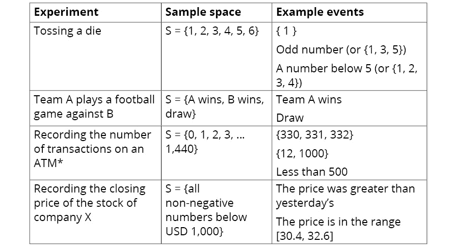

图 8.2：示例实验、样本空间和事件

注意

请注意，上表中的细节假设每分钟最多进行 1 笔交易。

值得注意的是，我们将样本空间定义为数学意义上的*集合*。因此，我们可以使用从集合论中知道的所有数学运算，包括获取子集（即事件）。由于事件是较大集合的子集，它们本身也是集合，因此我们可以使用并集、交集等。事件的常规表示法是使用大写字母，如 A、B 和 C。

当实验的结果属于事件时，我们说事件发生了。例如，在实验*掷骰子*中，如果我们对事件*得到奇数*感兴趣，并且观察到任何结果，即 1、3 或 5，那么我们可以说事件发生了。

在进行随机实验时，我们不知道会得到哪个结果。在概率理论中，我们为与实验相关的所有可能事件分配一个数字。这个数字就是我们所知道的事件的*概率*。

我们如何为事件分配概率？有几种选择。但是，无论我们使用哪种方法为事件分配概率，只要我们为事件分配概率的方式满足以下四个条件，概率理论及其结果就成立。给定事件*A*和*B*及其概率，表示为*P(A)*和*P(B)*：

1.  ：事件的概率始终是 0 到 1 之间的数字。越接近 1，事件发生的可能性就越大。极端情况下，事件无法发生为 0，事件一定会发生为 1。

1.  ：如果 A 是空集，则概率必须为 0。例如，对于实验*掷骰子*，事件*得到大于 10 的数字*不存在，因此这是空集，其概率为 0。

1.  ：这基本上表示进行实验时，一定会发生某种结果。

1.  对于不相交的事件 A 和 B：如果我们有一组不重叠的事件 A 和 B，则事件(A U B)，也称为*A 或 B*，的概率可以通过添加各自的概率来获得。这些规则也适用于两个以上的事件。

在概念和理论方面，本小节内容较多，但现在理解这些内容很重要，以避免以后出现错误。幸运的是，我们有 Python 和 NumPy 以及它们出色的数值能力，将帮助我们将这些理论付诸实践。

注意

关于所有练习和相关测试脚本的快速说明：如果您正在使用 CLI（如 Windows 的命令提示符或 Mac 的终端）运行测试脚本，它会抛出错误，比如`在子类中实现 enable_gui`。这与笔记本中使用的一些命令有关（如`％matplotlib` inline）。因此，如果您想运行测试脚本，请使用 IPython shell。本书中的练习代码最好在 Jupyter 笔记本上运行。

## 使用 NumPy 进行模拟的介绍

要开始将所有这些理论付诸实践，让我们从加载本章中将使用的库开始：

```py
import pandas as pd
import numpy as np
import matplotlib.pyplot as plt
import seaborn as sns
# line to allow the plots to be shown in the Jupyter Notebook
%matplotlib inline
```

我们将广泛使用 NumPy 的随机数生成能力。我们将使用`np.random`模块，它能够生成遵循许多最重要的概率分布的随机数（稍后详细介绍概率分布）。

让我们开始模拟一个随机实验：*掷一个普通骰子*。

让我们学习如何使用 NumPy 执行这个实验。有不同的方法可以做到这一点。我们将使用`random`模块中的`randint`函数，该函数生成`low`（包括）和`high`（不包括）参数之间的随机整数。由于我们想生成 1 到 6 之间的数字，我们的函数将如下所示：

```py
def toss_die():
    outcome = np.random.randint(1, 7)
    return outcome
```

让我们连续十次使用我们的函数来观察它的工作方式：

```py
for x in range(10):
    print(toss_die())
```

以下是一个示例输出：

```py
6, 2, 6, 5, 1, 3, 3, 6, 6, 5 
```

由于这些数字是随机生成的，你很可能会得到不同的值。

对于这个函数和几乎每个产生随机数（或其他随机结果）的函数，有时需要以任何时刻运行代码的人都能获得相同结果的方式生成随机数。为此，我们需要使用“种子”。

让我们添加一行代码来创建种子，然后连续十次使用我们的函数来观察它的工作方式：

```py
np.random.seed(123)
for x in range(10):
    print(toss_die(), end=', ')
```

结果如下：

```py
6, 3, 5, 3, 2, 4, 3, 4, 2, 2
```

只要运行包含种子函数内部的数字 123 的第一行，任何运行此代码的人（使用相同的 NumPy 版本）都将获得相同的输出数字。

`numpy.random`模块中另一个有用的函数是`np.random.choice`，它可以从向量中抽样元素。假设我们有一个由 30 名学生组成的班级，我们想随机选择其中的四个。首先，我们生成虚构的学生名单：

```py
students = ['student_' + str(i) for i in range(1,31)]
```

现在，可以使用`np.random.choice`来随机选择其中四个：

```py
sample_students = np.random.choice(a=students, size=4,\
                                   replace=False)
sample_students
```

以下是输出：

```py
array(['student_16', 'student_11', 'student_19', \
       'student_26'], dtype='<U10')
```

`replace=False`参数确保一旦选择了一个元素，就不能再次选择它。这被称为**无重复抽样**。

相反，**带替换**抽样意味着在产生每个样本时考虑向量的所有元素。想象一下，向量的所有元素都在一个袋子里。我们每次随机抽取一个元素作为样本，然后在抽取下一个样本之前将我们得到的元素放回袋子里。这样的应用可能是：假设我们将在 12 周内每周给小组中的一个学生出一次突击测验。所有学生都是可能被给予测验的对象，即使该学生在之前的周被选中过。为此，我们可以使用`replace=True`，如下所示：

```py
sample_students2 = np.random.choice(a=students, \
                                    size=12, replace=True)
for i, s in enumerate(sample_students2):
    print(f'Week {i+1}: {s}')
```

结果如下：

```py
Week 1: student_6
Week 2: student_23
Week 3: student_4
Week 4: student_26
Week 5: student_5
Week 6: student_30
Week 7: student_23
Week 8: student_30
Week 9: student_11
Week 10: student_6
Week 11: student_13
Week 12: student_5
```

正如你所看到的，可怜的学生 6 在第 1 周和第 10 周被选中，学生 30 在第 6 周和第 8 周被选中。

现在我们知道如何使用 NumPy 生成骰子结果和获取样本（带或不带替换），我们可以用它来练习概率。

## 练习 8.01：带和不带替换的抽样

在这个练习中，我们将使用`random.choice`来产生带和不带替换的随机样本。按照以下步骤完成这个练习：

1.  导入 NumPy 库：

```py
import numpy as np
```

1.  创建两个包含四种不同花色和 13 种不同等级的标准牌组的列表：

```py
suits = ['hearts', 'diamonds', 'spades', 'clubs']
ranks = ['Ace', '2', '3', '4', '5', '6', '7', '8', \
         '9', '10', 'Jack', 'Queen', 'King']
```

1.  创建一个名为`cards`的列表，其中包含标准牌组的 52 张牌：

```py
cards = [rank + '-' + suit for rank in ranks for suit in suits]
```

1.  使用`np.random.choice`函数从牌组中抽取一手（五张牌）。使用`replace=False`，以便每张牌只被选择一次：

```py
print(np.random.choice(cards, size=5, replace=False)) 
```

结果应该看起来像这样（你可能会得到不同的卡片）：

```py
['Ace-clubs' '5-clubs' '7-clubs' '9-clubs' '6-clubs']
```

1.  现在，创建一个名为`deal_hands`的函数，返回两个列表，每个列表中都有五张牌，从同一副牌中抽取。在`np.random.choice`函数中使用`replace=False`。这个函数将执行*无*替换的抽样：

```py
def deal_hands():
    drawn_cards = np.random.choice(cards, size=10, \
                                   replace=False)
    hand_1 = drawn_cards[:5].tolist()
    hand_2 = drawn_cards[5:].tolist()
    return hand_1, hand_2
```

要打印输出，请这样运行函数：

```py
deal_hands()
```

你应该得到类似这样的结果：

```py
(['9-spades', 'Ace-clubs', 'Queen-diamonds', '2-diamonds', 
  '9-diamonds'],
 ['Jack-hearts', '8-clubs', '10-clubs', '4-spades', 
  'Queen-hearts'])
```

1.  创建一个名为`deal_hands2`的第二个函数，它与上一个函数相同，但在`np.random.choice`函数中使用了`replace=True`参数。这个函数将执行*带*替换的抽样：

```py
def deal_hands2():
    drawn_cards = np.random.choice(cards, size=10, \
                                   replace=True)
    hand_1 = drawn_cards[:5].tolist()
    hand_2 = drawn_cards[5:].tolist()
    return hand_1, hand_2
```

1.  最后，运行以下代码：

```py
np.random.seed(2)
deal_hands2()
```

结果如下：

```py
(['Jack-hearts', '4-clubs', 'Queen-diamonds', '3-hearts', 
  '6-spades'],
 ['Jack-clubs', '5-spades', '3-clubs', 'Jack-hearts', '2-clubs'])
```

正如你所看到的，通过允许*带替换*抽样，`Jack-hearts`牌在两手中都被抽中，这意味着在抽取每张牌时，考虑了所有 52 张牌。

在这个练习中，我们练习了带和不带替换的抽样的概念，并学会了如何使用`np.random.choice`函数应用它。

注意

要访问此特定部分的源代码，请参考[`packt.live/2Zs7RuY`](https://packt.live/2Zs7RuY)。

你也可以在[`packt.live/2Bm7A4Y`](https://packt.live/2Bm7A4Y)上在线运行这个示例。

## 概率作为相对频率

让我们回到概念部分的问题：我们如何为事件分配概率？在*相对频率*方法下，我们所做的是重复进行实验很多次，然后将事件的概率定义为*它发生的相对频率*，也就是我们观察到事件发生的次数除以我们进行实验的次数：


图 8.3：计算概率的公式

让我们用一个实际的例子来了解这个概念。首先，我们将进行 100 万次掷骰子的实验：

```py
np.random.seed(81)
one_million_tosses = np.random.randint(low=1, \
                                       high=7, size=int(1e6))
```

我们可以从数组中获取前 10 个值：

```py
one_million_tosses[:10]
```

看起来是这样的：

```py
array([4, 2, 1, 4, 4, 4, 2, 2, 6, 3])
```

记住这个实验的样本空间是 S = {1, 2, 3, 4, 5, 6}。让我们使用相对频率方法定义一些事件并为它们分配概率。首先，让我们使用一些简单的事件：

+   `A`：观察到数字 2

+   `B`：观察到数字 6

我们可以利用 NumPy 的向量化能力，通过对比操作得到的布尔向量求和来计算发生*简单事件*的次数：

```py
N_A_occurs = (one_million_tosses == 2).sum()
Prob_A = N_A_occurs/one_million_tosses.shape[0]
print(f'P(A)={Prob_A}')
```

结果如下：

```py
P(A)=0.16595
```

按照完全相同的程序，我们可以计算事件`B`的概率：

```py
N_B_occurs = (one_million_tosses == 6).sum()
Prob_B = N_B_occurs/one_million_tosses.shape[0]
print(f'P(B)={Prob_B}')
```

结果如下：

```py
P(B)=0.166809
```

现在，我们将尝试一些复合事件（它们有多个可能的结果）：

+   `C`：观察到奇数（或{1, 3, 5}）

+   `D`：观察到小于 5 的数字（或{1, 2, 3, 4}）

因为事件*观察到奇数*将在我们得到 1 *或* 3 *或* 5 时发生，我们可以将我们在口语中使用的*或*翻译成数学中的`OR`运算符。在 Python 中，这是`|`运算符：

```py
N_odd_number = (
    (one_million_tosses == 1) | 
    (one_million_tosses == 3) | 
    (one_million_tosses == 5)).sum()
Prob_C = N_odd_number/one_million_tosses.shape[0]
print(f'P(C)={Prob_C}')
```

结果如下：

```py
P(C)=0.501162
```

最后，让我们计算`D`的概率：

```py
N_D_occurs = (one_million_tosses < 5).sum()
Prob_D = N_D_occurs/one_million_tosses.shape[0]
print(f'P(D)={Prob_D}')
```

我们得到以下值：

```py
P(D)=0.666004
```

在这里，我们使用了相对频率方法来计算以下事件的概率：

+   `A`：观察到数字 2：0.16595

+   `B`：观察到数字 6：0.166809

+   `C`：观察到奇数：0.501162

+   `D`：观察到小于 5 的数字：0.666004

总之，在相对频率方法下，当我们有一组来自重复实验的结果时，我们用来计算事件概率的方法是计算事件发生的次数，然后将该次数除以总实验次数。就是这么简单。

在其他情况下，概率的分配可能基于定义而产生。这就是我们可能称之为**理论概率**的东西。例如，*按定义*，一个*公平*硬币有相等的概率显示两种结果中的任何一种，比如正面或反面。由于这个实验只有两种结果{正面，反面}，并且概率必须加起来等于 1，每个简单事件必须有 0.5 的发生概率。

另一个例子如下：*公平*骰子是指六个数字具有相同的发生概率，因此投掷任何数字的概率必须等于*1/6 = 0.1666666*。事实上，`numpy.randint`函数的默认行为是模拟选择的整数数字，每个数字出现的概率相同。

使用理论定义，并知道我们用 NumPy 模拟了一个*公平*骰子，我们可以得出我们之前提到的事件的概率：

+   `A`：观察到数字 2，P(A) = 1/6 = 0.1666666

+   `B`：观察到数字 6，P(B) = 1/6 = 0.1666666

+   `C`：观察到奇数：P(观察到 1 *或* 观察到 3 *或* 观察到 5) = P(观察到 1) + 或 P(观察到 3) + P(观察到 5) = 1/6 + 1/6 + 1/6 = 3/6 = 0.5

+   `D`：观察到小于 5 的数字：P(观察到 1 *或* 观察到 2 *或* 观察到 3 *或* 观察到 4) = P(观察到 1) + 或 P(观察到 2) + P(观察到 3) + P(观察到 4) = 1/6 + 1/6 + 1/6 + 1/6 = 4/6 = 0.666666

注意这里有两件事：

+   这些数字令人惊讶（或者如果你已经知道这个结果，那就不足为奇了）地接近我们用相对频率方法得到的结果。

+   我们可以根据*基本概率概念*部分的规则 4 来分解`C`和`D`的和。

## 定义随机变量

通常，您会发现其值是（或似乎是）随机过程的结果的数量。以下是一些例子：

+   两个骰子的结果的和

+   掷十枚硬币时出现的正面数

+   IBM 股票一周后的价格

+   一个网站的访问者数量

+   一个人一天摄入的卡路里数量

所有这些都是可以变化的数量的例子，这意味着它们是*变量*。此外，由于它们的值部分或完全取决于随机性，我们称它们为*随机变量*：其值由随机过程确定的数量。随机变量的典型表示法是大写字母，如*X*、*Y*和*Z*。相应的小写字母用于指代它们的值。例如，如果*X*是*两个骰子的结果的和*，以下是一些如何阅读符号的示例：

+   *P(X = 10)*：*X*取值为 10 的概率

+   *P(X > 5)*：*X*取大于 5 的值的概率

+   *P(X = x)*：*X*取值为*x*的概率（当我们在做一般性陈述时）

由于*X*是两个骰子的和，*X*可以取以下值：{2, 3, 4, 5, 6, 7, 8, 9, 10, 11, 12}。根据我们在上一节学到的知识，我们可以这样模拟我们的随机变量*X*的大量值：

```py
np.random.seed(55)
number_of_tosses = int(1e5)
die_1 = np.random.randint(1,7, size=number_of_tosses)
die_2 = np.random.randint(1,7, size=number_of_tosses)
X = die_1 + die_2
```

我们已经模拟了两个骰子投掷了 100,000 次，并得到了*X*的相应值。这些是我们向量的第一个值：

```py
print(die_1[:10])
print(die_2[:10])
print(X[:10])
```

结果如下：

```py
[6 3 1 6 6 6 6 6 4 2]
[1 2 3 5 1 3 3 6 3 1]
[7  5  4 11  7  9  9 12  7  3]
```

因此，在第一次模拟的投掷中，我们在第一个骰子上得到了`6`，在第二个骰子上得到了`1`，所以*X*的第一个值是`7`。

就像实验一样，我们可以定义随机变量上的事件，并计算这些事件的相应概率。例如，我们可以使用相对频率定义来计算以下事件的概率：

+   *X = 10*：*X*取值为 10 的概率

+   *X > 5*：*X*取大于 5 的值的概率

计算这些事件的概率的计算基本上与我们之前所做的相同：

```py
Prob_X_is_10 = (X == 10).sum()/X.shape[0]
print(f'P(X = 10) = {Prob_X_is_10}')
```

结果如下：

```py
P(X = 10) = 0.08329
```

对于第二个事件，我们有以下内容：

```py
Prob_X_is_gt_5 = (X > 5).sum()/X.shape[0]
print(f'P(X > 5) = {Prob_X_is_gt_5}')
```

结果如下：

```py
P(X > 5) = 0.72197
```

我们可以使用条形图来可视化我们的模拟中每个可能值出现的次数。这将帮助我们更好地了解我们的随机变量：

```py
X = pd.Series(X)
# counts the occurrences of each value
freq_of_X_values = X.value_counts()
freq_of_X_values.sort_index().plot(kind='bar')
plt.grid();
```

生成的图表如下：

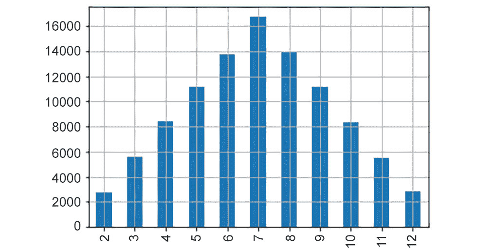

图 8.4：X 的值的频率

我们可以看到，在 100,000 次*X*中，它大约 5800 次取到了值 3，大约 14000 次取到了值 6，这也非常接近值 8 出现的次数。我们还可以观察到最常见的结果是数字 7。

根据概率的相对频率定义，如果我们将频率除以*X*的值的数量，我们可以得到观察到*X*的每个值的概率：

```py
Prob_of_X_values = freq_of_X_values/X.shape[0]
Prob_of_X_values.sort_index().plot(kind='bar')
plt.grid();
```

这给我们带来了以下的图表：

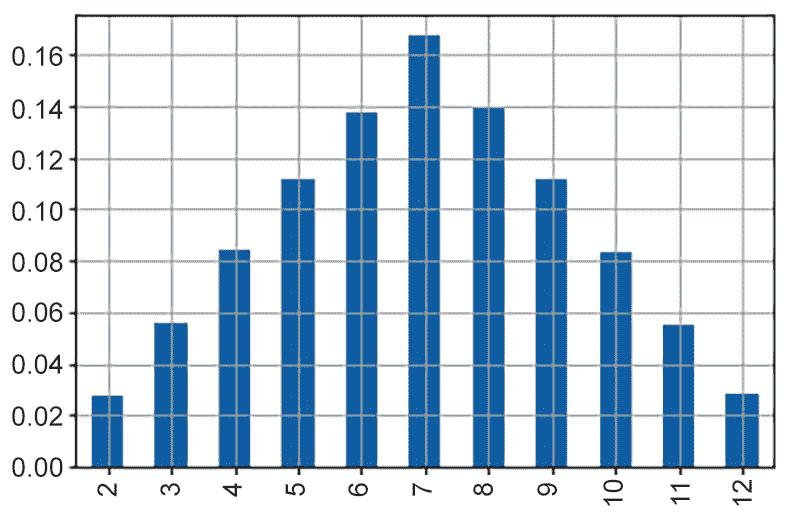

图 8.5：X 的值的概率分布

这个图看起来几乎和上一个一样，但在这种情况下，我们可以看到观察到*X*的所有可能值的概率。这就是我们所说的随机变量的*概率分布*（或简称分布）：观察到随机变量可以取的每个值的概率。

让我们用另一个例子来说明随机变量和概率分布这两个概念。首先，我们来定义随机变量：

*Y: 投掷 10 枚公平硬币时出现的正面数。*

现在，我们的任务是估计概率分布。我们知道这个随机变量可以取 11 个可能的值：{0, 1, 2, 3, 4, 5, 6, 7, 8, 9, 10}。对于这些值中的每一个，都有一个相应的概率，使得*Y*变量取得该值。直觉上，我们知道观察到变量的极端值是非常不可能的：得到 10 个正面（*Y=10*）或 10 个反面（*Y=0*）是非常不可能的。我们也期望*Y*变量大部分时间取得 4、5 和 6 这样的值。我们可以计算概率分布来验证我们的直觉。

再次，让我们模拟抛 10 枚硬币的实验。然后，我们可以观察这个随机变量的值。让我们开始模拟 1 百万次抛 10 枚公平硬币：

```py
np.random.seed(97)
ten_coins_a_million_times = np.random.randint(0, 2, \
                                              size=int(10e6))\
                                              .reshape(-1,10) 
```

前面的代码将产生一个 1,000,000 x 10 的矩阵，每一行代表抛 10 枚硬币的实验。我们可以将 0 视为反面，1 视为正面。这里是前 12 行：

```py
ten_coins_a_million_times[:12, :]
```

结果如下：

```py
array([[0, 1, 1, 1, 1, 1, 0, 1, 1, 0],
       [0, 0, 1, 1, 1, 0, 1, 0, 0, 0],
       [0, 1, 0, 1, 1, 0, 0, 0, 0, 1],
       [1, 0, 1, 1, 0, 1, 0, 0, 1, 1],
       [1, 0, 1, 0, 1, 0, 1, 0, 0, 0],
       [0, 1, 1, 1, 0, 1, 1, 1, 1, 0],
       [1, 1, 1, 1, 0, 1, 0, 1, 0, 1],
       [0, 1, 0, 0, 1, 1, 1, 0, 0, 0],
       [1, 0, 0, 1, 1, 1, 0, 0, 0, 0],
       [0, 1, 0, 1, 0, 1, 0, 1, 0, 1],
       [1, 0, 1, 1, 1, 0, 0, 0, 1, 0],
       [0, 0, 0, 0, 1, 1, 1, 0, 1, 1]])
```

为了产生不同的*Y*值，我们需要将每一行相加，如下所示：

```py
Y = ten_coins_a_million_times.sum(axis=1)
```

现在，我们可以使用之前计算的对象（`Y`）来计算某些事件的概率，例如获得零个正面的概率：

```py
Prob_Y_is_0 = (Y == 0).sum() / Y.shape[0]
print(f'P(Y = 0) = {Prob_Y_is_0}')
```

输出如下：

```py
P(Y = 0) = 0.000986
```

这是一个非常小的数字，与我们的直觉一致：得到 10 个反面的可能性非常小。实际上，在 100 万次实验中只发生了 986 次。

就像之前一样，我们可以绘制*Y*的概率分布：

```py
Y = pd.Series(Y)
# counts the occurrences of each value
freq_of_Y_values = Y.value_counts()
Prob_of_Y_values = freq_of_Y_values/Y.shape[0]
Prob_of_Y_values.sort_index().plot(kind='bar')
plt.grid();
```

这是输出：


图 8.6：Y 的概率分布

得到 5 个正面的概率约为 0.25，所以大约 25%的时间，我们可以期望得到 5 个正面。得到 4 或 6 个正面的机会也相对较高。得到 4、5 或 6 个正面的概率是多少？我们可以通过使用`Prob_of_Y_values`来轻松计算，通过添加得到 4、5 或 6 个正面的相应概率：

```py
print(Prob_of_Y_values.loc[[4,5,6]])
print(f'P(4<=Y<=6) = {Prob_of_Y_values.loc[[4,5,6]].sum()}')
```

结果如下：

```py
4    0.205283
5    0.246114
6    0.205761
dtype: float64
P(4<=Y<=6) = 0.657158
```

因此，大约有 2/3（约 66%）的时间，当抛 10 枚公平硬币时，我们会观察到 4、5 或 6 个正面。回到概率作为不确定性度量的定义，我们可以说，我们有 66%的信心，当抛 10 枚公平硬币时，我们会看到 4 到 6 个正面。

## 练习 8.02：计算轮盘赌中的平均赢数

在这个练习中，我们将学习如何使用`np.random.choice`来模拟真实世界的随机过程。然后，我们将利用这个模拟，计算如果我们玩很多次，平均会赢得/失去多少钱。

我们将模拟去赌场玩轮盘赌。欧洲轮盘赌包括一个球随机落在 0 到 36 之间的任何整数上，每个数字落球的机会均等。允许许多种投注方式，但我们将只以一种方式进行（相当于著名的押红色或黑色的方式）。规则如下：

+   在 19 到 36 的数字上押注*m*个单位（你喜欢的货币）。

+   如果轮盘赌的结果是所选数字中的任何一个，那么你赢得*m*个单位。

+   如果轮盘赌的结果是 0 到 18 之间的任何数字（包括 18），那么你就输掉*m*个单位。

为了简化，让我们假设赌注是 1 单位。让我们开始吧：

1.  导入 NumPy 库：

```py
import numpy as np
```

1.  使用`np.random.choice`函数编写一个名为`roulette`的函数，模拟欧洲轮盘赌的任意次数的游戏：

```py
def roulette(number_of_games=1):

    # generate the Roulette numbers
    roulette_numbers = np.arange(0, 37)

    outcome = np.random.choice(a = roulette_numbers, \
                               size = number_of_games,\
                               replace = True)
    return outcome
```

1.  编写一个名为`payoff`的函数，它编码了前面的赔付逻辑。它接收两个参数：`outcome`，轮盘赌的数字（0 到 36 之间的整数）；以及`units`，默认值为 1 的赌注单位：

```py
def payoff(outcome, units=1):
    # 1\. Bet m units on the numbers from 19 to 36
    # 2\. If the outcome of the roulette is any of the 
    #    selected numbers, then you win m units
    if outcome > 18:
        pay = units
    else:
    # 3\. If the outcome of the roulette is any number 
    #    between 0 and 18 (inclusive) then you lose m units
        pay = -units
    return pay
```

1.  使用`np.vectorize`对函数进行矢量化，以便它也可以接受轮盘赌结果的矢量。这将允许你传递一个结果的矢量，并获得相应的赔付：

```py
payoff = np.vectorize(payoff)
```

1.  现在，模拟玩 20 次轮盘赌（押注一单位）。使用`payoff`函数获得结果向量：

```py
outcomes = roulette(20)
payoffs = payoff(outcomes)
print(outcomes)
print(payoffs)
```

输出如下：

```py
[29 36 11  6 11  6  1 24 30 13  0 35  7 34 30  7 36 32 12 10]
[ 1  1 -1 -1 -1 -1 -1  1  1 -1 -1  1 -1  1  1 -1  1  1 -1 -1]
```

1.  模拟 100 万次轮盘赌游戏，并使用结果获得相应的赔偿。将赔偿保存在名为`payoffs`的向量中：

```py
number_of_games = int(1e6)
outcomes = roulette(number_of_games)
payoffs = payoff(outcomes)
```

1.  使用`np.mean`函数计算赔偿向量的平均值。你得到的值应该接近-0.027027：

```py
np.mean(payoffs)
```

负数意味着平均每下注一单位就会损失-0.027027。请记住，你的损失就是赌场的利润。这是他们的生意。

在这个练习中，我们学会了如何使用 NumPy 的随机数生成功能来模拟真实世界的过程。我们还模拟了大量事件以获得长期平均值。

注意

要访问本节的源代码，请参阅[`packt.live/2AoiyGp`](https://packt.live/2AoiyGp)。

你也可以在[`packt.live/3irX6Si`](https://packt.live/3irX6Si)上在线运行这个例子。

通过这样，我们学会了如何通过分配概率来量化不确定性来理解随机事件。然后，我们定义了概率论中一些最重要的概念。我们还学会了如何使用相对频率定义为事件分配概率。此外，我们介绍了随机变量的重要概念。在计算上，我们学会了如何使用 NumPy 模拟值和样本，以及如何使用模拟来回答关于某些事件概率的问题。

根据随机变量可以取的值的类型，我们可以有两种类型：

+   离散随机变量

+   连续随机变量

我们将在接下来的两节中提供一些例子。

# 离散随机变量

在本节中，我们将继续学习和处理随机变量。我们将研究一种特定类型的随机变量：离散随机变量。这些类型的变量在各种应用领域中都会出现，如医学、教育、制造等，因此了解如何处理它们非常有用。我们将学习可能是最重要的，也是最常见的离散分布之一：二项分布。

## 离散随机变量的定义

离散随机变量只能取特定数量的值（技术上来说是*可数*数量的值）。通常，它们可以取的值是特定的整数值，尽管这并非必要。例如，如果一个随机变量可以取{1.25, 3.75, 9.15}这组值，它也被认为是离散随机变量。我们在上一节介绍的两个随机变量就是离散随机变量的例子。

假设你是一家生产汽车零部件的工厂的经理。生产零件的机器平均会有 4%的次品。我们可以将这 4%解释为生产次品的概率。这些汽车零件被包装在包含 12 个单位的箱子中，因此，原则上每个箱子可以包含从 0 到 12 个次品。假设我们不知道哪个零件是次品（直到使用时），也不知道何时会生产次品。因此，我们有一个随机变量。首先，让我们正式定义它：

*Z：12 箱装中次品的数量。*

作为工厂经理，你最大的客户之一问了你以下问题：

+   有 12 个非次品零件（零次品）的箱子占百分之多少？

+   有 3 个或更多次次品的箱子占百分之多少？

如果你知道变量的概率分布，你可以回答这两个问题，所以你问自己以下问题：

*Z 的概率分布是什么样子？*

为了回答这个问题，我们可以再次使用模拟。要模拟一个单独的箱子，我们可以使用`np.random.choice`并通过`p`参数提供概率：

```py
np.random.seed(977)
np.random.choice(['defective', 'good'], \
                 size=12, p=(0.04, 0.96))
```

结果如下：

```py
array(['good', 'good', 'good', 'good', 'good', 'good', 'good', \
       'defective', 'good', 'good', 'good', 'good'], dtype='<U9')
```

我们可以看到这个特定的盒子包含一个次品。请注意，在函数中使用的概率向量必须加起来为 1：因为观察到次品的概率为 4%（0.04），观察到好品的概率为*100% – 4% = 96%*（0.96），这些值被传递给 p 参数。

现在我们知道如何模拟单个盒子，为了估计我们的随机变量的分布，让我们模拟大量的盒子；100 万个已经足够了。为了使我们的计算更简单更快，让我们使用 1 和 0 来表示次品和好品。要模拟 100 万个盒子，只需将大小参数更改为一个大小为*12 x 1,000,000*的元组即可：

```py
np.random.seed(10)
n_boxes = int(1e6)
parts_per_box = 12
one_million_boxes = np.random.choice\
                    ([1, 0], \
                     size=(n_boxes, parts_per_box), \
                     p=(0.04, 0.96))
```

前五个盒子可以使用以下公式找到：

```py
one_million_boxes[:5,:]
```

输出将如下所示：

```py
array([[0, 1, 0, 0, 0, 0, 0, 0, 0, 0, 0, 0],
       [1, 0, 0, 0, 0, 0, 0, 0, 0, 0, 0, 0],
       [0, 0, 0, 0, 0, 0, 0, 0, 0, 0, 0, 0],
       [0, 0, 0, 0, 0, 0, 0, 0, 0, 0, 0, 0],
       [0, 0, 0, 0, 0, 0, 0, 0, 0, 0, 0, 0]])
```

输出中的每个零代表一个非次品，一个代表一个次品。现在，我们计算每个盒子中有多少次品，然后我们可以计算观察到 0、1、2、...、12 个次品的次数，然后我们可以绘制 Z 的概率分布：

```py
# count defective pieces per box
defective_pieces_per_box = one_million_boxes.sum(axis=1)
# count how many times we observed 0, 1,…, 12 defective pieces
defective_pieces_per_box = pd.Series(defective_pieces_per_box)
frequencies = defective_pieces_per_box.value_counts()
# probability distribution
probs_Z = frequencies/n_boxes
```

最后，让我们将其可视化：

```py
print(probs_Z.sort_index())
probs_Z.sort_index().plot(kind='bar')
plt.grid()
```

输出将如下所示：

```py
0    0.612402
1    0.306383
2    0.070584
3    0.009630
4    0.000940
5    0.000056
6    0.000004
7    0.000001
```

概率分布将如下所示：


图 8.7：Z 的概率分布

从这个模拟中，我们可以得出结论，大约 61%的盒子将被运送到零次品，大约 30%的盒子将包含一个次品。我们还可以看到，在一个盒子中观察到三个或更多次品是非常非常不可能的。现在，你可以回答你的客户的问题了：

+   有多少百分比的盒子有 12 个非次品？ *答案：61%的盒子将包含 12 个非次品。*

+   有多少百分比的盒子有 3 个或更多次品？ *答案：只有大约 1%的盒子会包含 3 个或更多次品。*

## 二项分布

事实证明，在某些条件下，我们可以找出某些离散随机变量的确切概率分布。*二项分布*是适用于随机变量并满足以下三个特征的理论分布：

+   **条件 1**：对于单个观察，通常表示为*成功*和*失败*，只有*两种可能的结果*。如果成功的概率是*p*，那么失败的概率必须是*1 – p*。

+   **条件 2**：实验被*固定次数*执行，通常用*n*表示。

+   **条件 3**：所有实验都是*独立*的，这意味着知道一个实验的结果不会改变下一个实验的概率。因此，成功（和失败）的概率保持不变。

如果满足这些条件，那么我们说随机变量遵循二项分布，或者随机变量是*二项随机变量*。我们可以使用以下公式得到二项随机变量*X*的确切概率分布：


图 8.8：计算 X 的概率分布的公式

从技术上讲，*数学函数*，它接受离散随机变量（*x*）的可能值并返回相应的概率被称为**概率质量函数**。请注意，一旦我们从前一个方程中知道了*n*和*p*的值，概率就只取决于*x*的值，因此前一个方程为二项随机变量定义了概率质量函数。

好的，这听起来和看起来非常理论化和抽象（因为它是）。然而，我们已经介绍了两个遵循二项分布的随机变量。让我们验证以下条件是否成立：

*Y: 抛掷 10 枚公平硬币时出现的正面数量。*

+   **条件 1**：对于每个单独的硬币，只有两种可能的结果，*正面*或*反面*，每种结果的固定概率为 0.5。由于我们对*正面的数量*感兴趣，*正面*可以被认为是我们的*成功*，*反面*是我们的*失败*。

+   **条件 2**：硬币的数量固定为 10 枚。

+   **条件 3**：每次抛硬币都是独立的：我们隐含地（逻辑上）假设一枚硬币的结果不会影响任何其他硬币的结果。

所以，我们有了在前述公式中使用的数字：

+   *p = 0.5*

+   *n = 10*

如果我们想要得到得到五个正面的概率，那么我们只需要在公式中用已知的*p*和*n*替换*x = 5*：


图 8.9：在概率分布公式中替换 x、p 和 n 的值

现在，让我们用 Python 进行这些理论计算。是时候介绍另一个 Python 模块了，我们将在本章和接下来的章节中大量使用。`scipy.stats`模块包含许多统计函数。其中有许多可以用来创建遵循许多常用概率分布的随机变量的函数。让我们使用这个模块来创建一个遵循理论二项分布的随机变量。首先，我们用适当的参数实例化随机变量：

```py
import scipy.stats as stats
Y_rv = stats.binom(
    n = 10, # number of coins
    p = 0.5 # probability of heads (success)
)
```

创建后，我们可以使用该对象的`pmf`方法来计算*Y*可以取的每个可能值的精确理论概率。首先，让我们创建一个包含*Y*可以取的所有值（从 0 到 10 的整数）的向量：

```py
y_values = np.arange(0, 11)
```

现在，我们可以简单地使用`pmf`（代表**概率质量函数**）方法来获得前述值的相应概率：

```py
Y_probs = Y_rv.pmf(y_values) 
```

我们可以像这样可视化我们得到的`pmf`：

```py
fig, ax = plt.subplots()
ax.bar(y_values, Y_probs)
ax.set_xticks(y_values)
ax.grid()
```

我们得到的输出如下：

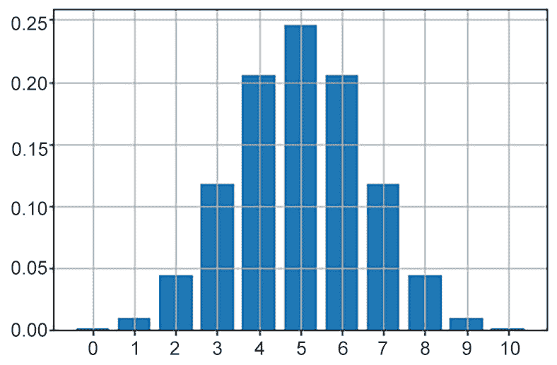

图 8.10：Y 的 pmf

这看起来与我们使用模拟得到的结果非常相似。现在，让我们比较两个图。我们将创建一个 DataFrame 来使绘图过程更容易：

```py
Y_rv_df = pd.DataFrame({'Y_simulated_pmf': Prob_of_Y_values,\
                        'Y_theoretical_pmf':  Y_probs},\
                        index=y_values)
Y_rv_df.plot(kind='bar')
plt.grid();
```

输出如下：


图 8.11：Y 的 pmf 与模拟结果

这两组柱状图几乎是相同的；我们从模拟中得到的概率非常接近理论值。这显示了模拟的力量。

## 练习 8.03：检查随机变量是否符合二项分布

在这个练习中，我们将练习如何验证随机变量是否符合二项分布。我们还将使用`scipy.stats`创建一个随机变量并绘制分布。这将是一个大部分概念性的练习。

在这里，我们将检查随机变量*Z：12 盒装中有缺陷汽车零件的数量*是否符合二项分布（记住我们认为 4%的汽车零件有缺陷）。按照以下步骤完成这个练习：

1.  按照通常的惯例导入 NumPy、Matplotlib 和`scipy.stats`：

```py
import numpy as np
import scipy.stats as stats
import matplotlib.pyplot as plt
%matplotlib inline
```

1.  就像我们在*定义离散随机变量*部分所做的那样，尝试概念性地检查*Z*是否满足二项随机变量的三个特征：

a. **条件 1**：对于每个单独的汽车零件，只有两种可能的结果，*有缺陷*或*好的*。由于我们对*有缺陷*零件感兴趣，那么这个结果可以被认为是*成功*，成功的固定概率为 0.04（4%）。

b. **条件 2**：每盒的零件数量固定为 12，因此实验在每盒中进行了固定次数。

c. **条件 3**：我们假设有缺陷的零件之间没有关系，因为机器随机产生平均 4%的有缺陷零件。

1.  确定该变量的分布的*p*和*n*参数，即*p = 0.04*和*n = 12*。

1.  使用前面的参数使用理论公式来获得每箱恰好有一个次品的精确理论概率（使用*x = 1*）：

图 8.12：用概率分布公式替换 x、p 和 n 的值

1.  使用`scipy.stats`模块生成*Z*随机变量的实例。将其命名为`Z_rv`：

```py
# number of parts per box
parts_per_box = 12
Z_rv = stats.binom\
       (n = parts_per_box,\
        p = 0.04 # probability of defective piece (success)
        )
```

1.  绘制*Z*的概率质量函数：

```py
z_possible_values = np.arange(0, parts_per_box + 1)
Z_probs = Z_rv.pmf(z_possible_values)
fig, ax = plt.subplots()
ax.bar(z_possible_values, Z_probs)
ax.set_xticks(z_possible_values)
ax.grid();
```

结果如下：

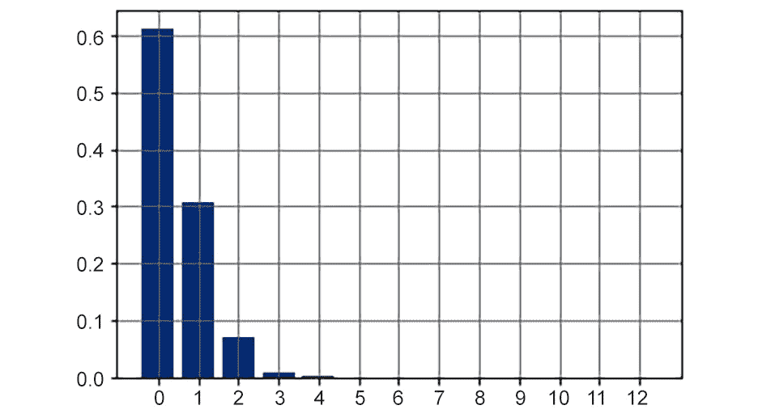

图 8.13：Z 的 pmf

在这个练习中，我们学习了如何检查离散随机变量具有二项分布所需的三个条件。我们得出结论，我们分析的变量确实具有二项分布。我们还能够计算其参数并使用它们创建一个二项随机变量，并绘制了分布。

注意

要访问此特定部分的源代码，请参阅[`packt.live/3gbTm5k`](https://packt.live/3gbTm5k)。

您也可以在[`packt.live/2Anhx1k`](https://packt.live/2Anhx1k)上在线运行此示例。

在本节中，我们专注于离散随机变量。现在，我们知道它们是可以取特定数值的随机变量的一种。通常，这些是整数值。通常，这些类型的变量与计数有关：将通过考试的学生人数，穿过桥的汽车数量等。我们还了解了离散随机变量的最重要的分布，称为二项分布，以及如何使用 Python 获得二项随机变量的精确理论概率。

在下一节中，我们将专注于连续随机变量。

# 连续随机变量

在本节中，我们将继续处理随机变量。在这里，我们将讨论连续随机变量。我们将学习连续和离散概率分布之间的关键区别。此外，我们将介绍所有分布的鼻祖：著名的**正态分布**。我们将学习如何使用`scipy.stats`处理这种分布，并回顾其最重要的特征。

## 定义连续随机变量

在原则上，有些随机量可以在一个区间内取任意实数值。一些例子如下：

+   一周后 IBM 股票的价格

+   一个人一天摄入的卡路里数量

+   英镑和欧元之间的收盘汇率

+   特定群体中随机选择的男性的身高

由于它们的性质，这些变量被称为*连续*随机变量。与离散随机变量一样，有许多理论分布可以用来模拟现实世界的现象。

为了介绍这种类型的随机变量，让我们看一个我们已经熟悉的例子。再次加载我们在*第七章*《使用 Python 进行基本统计》中介绍的游戏数据集：

```py
games = pd.read_csv('./data/appstore_games.csv')
original_colums_dict = {x: x.lower().replace(' ','_') \
                        for x in games.columns}
# renaming columns
games.rename(columns = original_colums_dict, inplace = True)
```

数据集中的一个变量是*游戏大小*（以字节为单位）。在可视化此变量的分布之前，我们将把它转换为兆字节：

```py
games['size'] = games['size']/(1e6)
# replacing the one missing value with the median
games['size'] = games['size'].fillna(games['size'].median())
games['size'].hist(bins = 50, ec='k');
```

输出如下：

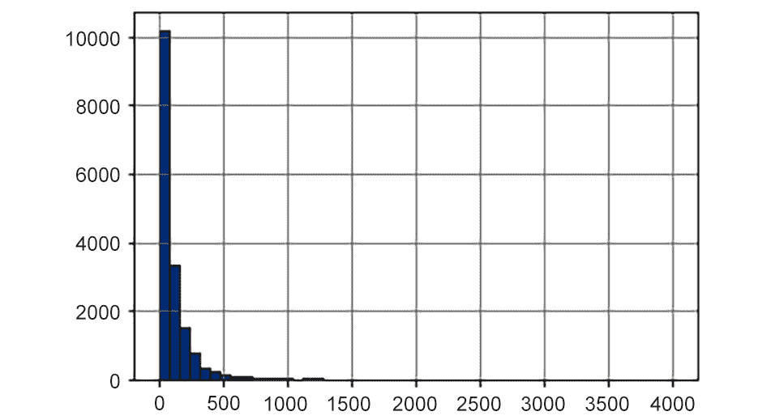

图 8.14：游戏大小的分布

让我们定义我们的随机变量*X*如下：

*X：从应用商店随机选择的策略游戏的大小。*

定义了这个随机变量后，我们可以开始询问关于某些事件的概率的问题：

+   *P(X > 100)*：*X*严格大于 100MB 的概率

+   *P(100 ≤ X ≤ 400)*：*X*在 100 和 400MB 之间的概率

+   *P(X = 152.53)*：*X*恰好为 152.53MB 的概率

到目前为止，您知道如何使用概率的相对频率定义来估计这些概率：计算事件发生的次数，然后除以总事件数（在这种情况下是游戏数）：

```py
# get the number of games to use as denominator
number_of_games = games['size'].size
# calculate probabilities
prob_X_gt_100 = (games['size'] > 100).sum()/number_of_games
prob_X_bt_100_and_400 = ((games['size'] >= 100) & \
                         (games['size'] <= 400))\
                         .sum()/number_of_games
prob_X_eq_152_53 = (games['size'] == 152.53).sum()/number_of_games
# print the results
print(f'P(X > 100) = {prob_X_gt_100:0.5f}')
print(f'P(100 <= X <= 400) = {prob_X_bt_100_and_400:0.5f}')
print(f'P(X = 152.53) = {prob_X_eq_152_53:0.5f}')
```

结果如下：

```py
P(X > 100) = 0.33098
P(100 <= X <= 400) = 0.28306
P(X = 152.53) = 0.00000
```

注意我们计算的最后一个概率，*P(X = 152.53)*。随机变量取*特定*值（如 152.53）的概率是零。对于任何连续随机变量，这总是如此。由于这些类型的变量原则上可以取无限多个值，因此取*确切*特定值的概率必须为零。

前面的例子表明，当我们有足够多关于连续随机变量的数据点时，我们可以使用数据来估计随机变量在某些区间内取值的概率。然而，关于一个变量有大量观察结果的情况可能并非总是如此。鉴于这一事实，让我们考虑以下问题：

+   如果我们根本没有数据呢？

+   如果我们没有足够的数据呢？

+   我们能否进行模拟来估计某些事件的概率（就像我们对离散随机变量所做的那样）？

这些都是合理的问题，我们可以通过更多了解**理论连续概率分布**来回答它们：

+   如果我们根本没有数据呢？*我们可以对变量做出一些合理的假设，然后使用众多理论连续概率分布之一对其进行建模。*

+   如果我们没有足够的数据呢？*我们可以对变量做出一些合理的假设，用数据支持这些假设，并使用估计技术（下一章的主题）来估计所选择的理论连续概率分布的参数。*

+   我们能否进行模拟来估计某些事件的概率（就像我们对离散随机变量所做的那样）？*可以。一旦我们选择了概率分布以及其参数，我们可以使用模拟来回答复杂的问题。*

为了澄清前面的答案，在接下来的小节中，我们将介绍最重要的连续概率分布：正态分布。

值得注意的是，对于连续随机变量，概率分布也被称为**概率密度函数**或**pdf**。

## 正态分布

让我们介绍概率论中最著名和重要的分布：正态分布。正态分布的概率密度函数由以下方程定义：


图 8.15：正态分布的概率密度函数

在这里，*π*和*e*是众所周知的数学常数。不要试图理解方程；您需要知道的只有两件事：首先，当我们有两个参数时，分布就完全确定了：

+   *µ*：分布的均值

+   *σ*：分布的标准差

其次，如果*X*是一个遵循正态分布的随机变量，那么对于可能的值*x*，前面的公式将给出一个与变量*接近 x*的概率*直接相关*的值。与二项分布的公式不同，我们通过直接将值*x*代入公式来得到概率，在连续随机变量的情况下，情况不同：公式给出的值没有直接解释。下面的例子将澄清这一点。

我们将使用`scipy.stats`模块创建一个遵循正态分布的随机变量。假设某一男性人群的身高服从均值为 170 厘米，标准差为 10 厘米的正态分布。要使用`scipy.stats`创建这个随机变量，我们需要使用以下代码：

```py
# set the mu and sigma parameters of the distribution
heights_mean = 170
heights_sd = 10
# instantiate the random variable object
heights_rv = stats.norm(
        loc = heights_mean, # mean of the distribution
        scale = heights_sd  # standard deviation
)
```

前面的代码创建了正态分布的随机变量，其概率密度函数如下所示：


图 8.16：正态分布随机变量的概率密度函数

对于每个值*x*，比如`175`，我们可以使用`pdf`方法得到 pdf 的值，就像这样：

```py
heights_rv.pdf(175)
```

结果如下：

```py
0.03520653267642
```

这个数字是如果你在前面的公式中用`175`替换*x*会得到的：


图 8.17 替换 x=175 的值

要明确，这*不是*观察到一个身高为 175 厘米的男性的概率（请记住，这个变量取特定值的概率应该是零），因为这个数字没有简单的直接解释。但是，如果我们绘制整个密度曲线，那么我们就可以开始理解我们的随机变量的分布。要绘制整个概率密度函数，我们必须创建一个包含该变量可能取的一系列可能值的向量。根据男性身高的背景，假设我们想要绘制介于 130 厘米和 210 厘米之间的值的 pdf，这些是健康成年男性的可能值。首先，我们使用`np.linspace`创建值的向量，在这种情况下，它将在 120 和 210 之间（包括这两个值）创建 200 个等间距的数字：

```py
values = np.linspace(130, 210, num=200)
```

现在，我们可以生成 pdf 并将其与创建的值绘制在一起：

```py
heights_rv_pdf = heights_rv.pdf(values)
plt.plot(values, heights_rv_pdf)
plt.grid();
```

曲线看起来是这样的：

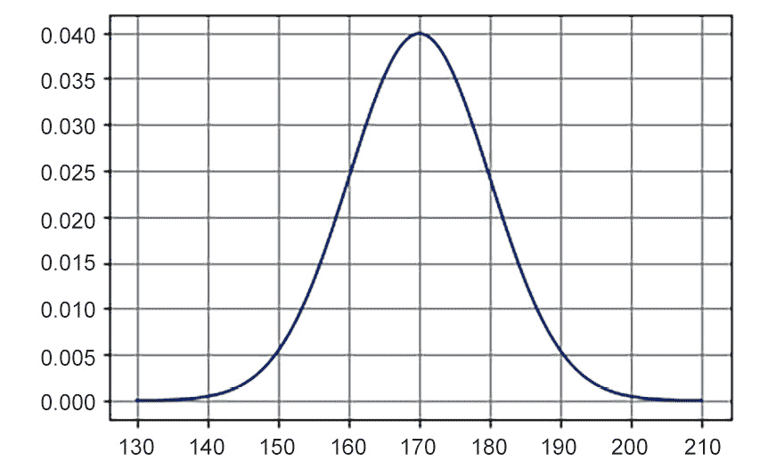

图 8.18：均值=170，标准差=10 的正态分布示例

曲线越高，观察到与相应*x*轴数值周围的值的可能性就越大。例如，我们可以看到，我们更有可能观察到男性身高在 160 厘米到 170 厘米之间，而不是在 140 厘米到 150 厘米之间。

现在我们已经定义了这个正态分布的随机变量，我们可以使用模拟来回答关于它的某些问题吗？当然可以。事实上，现在，我们将学习如何使用已定义的随机变量来模拟样本值。我们可以使用`rvs`方法来生成这些值，该方法从概率分布中生成随机样本：

```py
sample_heighs = heights_rv.rvs\
                (size = 5, \
                 random_state = 998 # similar to np.seed)
for i, h in enumerate(sample_heighs):
    print(f'Men {i + 1} height: {h:0.1f}')
```

结果如下：

```py
Men 1 height: 171.2
Men 2 height: 173.3
Men 3 height: 157.1
Men 4 height: 164.9
Men 5 height: 179.1
```

在这里，我们正在模拟从人口中随机抽取五名男性并测量他们的身高。请注意，我们使用了`random_state`参数，它起到了与`numpy.seed`类似的作用：确保运行相同代码的人会得到相同的随机值。

与之前一样，我们可以使用模拟来回答与这个随机变量相关的事件的概率问题。例如，找到一个身高超过 190 厘米的男性的概率是多少？以下代码使用我们之前定义的随机变量计算了这个模拟：

```py
# size of the simulation
sim_size = int(1e5)
# simulate the random samples
sample_heights = heights_rv.rvs\
                 (size = sim_size,\
                  random_state = 88 # similar to np.seed)
Prob_event = (sample_heights > 190).sum()/sim_size
print(f'Probability of a male > 190 cm: {Prob_event:0.5f} \
 (or {100*Prob_event:0.2f}%)')
```

结果是：

```py
Probability of a male > 190 cm: 0.02303 (or 2.30%)
```

正如我们将在下一节中看到的，有一种方法可以从`density`函数中获得精确的概率，而无需模拟值，这有时可能是计算昂贵且不必要的。

## 正态分布的一些特性

宇宙和数学的一个令人印象深刻的事实是，现实世界中许多变量都遵循正态分布：

+   人类身高

+   大多数哺乳动物物种的体重

+   标准化测试的分数

+   制造过程中与产品规格的偏差

+   诸如舒张压、胆固醇和睡眠时间等医学测量

+   诸如某些证券的回报率等金融变量

正态分布描述了许多现象，并且在概率和统计学中被广泛使用，因此了解两个关键属性是值得的：

+   正态分布完全由其两个参数确定：均值和标准差。

+   正态分布的*经验法则*告诉我们，根据标准偏差的数量，我们将找到多少比例的观察值。

让我们了解这两个关键特性。首先，我们将说明分布的参数如何决定其形状：

+   平均值决定了分布的中心。

+   标准差决定了分布的宽度（或扩散程度）。

为了说明这一特性，假设我们有以下三个男性身高的人口。每个人口对应一个不同的国家：

+   **国家 A**：平均值=170 厘米，标准差=10 厘米

+   **国家 B**：平均值=170 厘米，标准差=5 厘米

+   **国家 C**：平均值=175 厘米，标准差=10 厘米

有了这些参数，我们可以可视化和对比三个不同国家的分布。在可视化之前，让我们创建随机变量：

```py
# parameters of distributions
heights_means = [170, 170, 175]
heights_sds = [10, 5, 10]
countries = ['Country A', 'Country B', 'Country C']
heights_rvs = {}
plotting_values = {}
# creating the random variables
for i, country in enumerate(countries):
    heights_rvs[country] = stats.norm(
        loc = heights_means[i], # mean of the distribution
        scale = heights_sds[i]  # standard deviation
    )
```

有了这些创建的对象，我们可以进行可视化：

```py
# getting x and y values for plotting the distributions
for i, country in enumerate(countries):
    x_values = np.linspace(heights_means[i] - 4*heights_sds[i], \
                           heights_means[i] + 4*heights_sds[i])
    y_values = heights_rvs[country].pdf(x_values)
    plotting_values[country] = (x_values, y_values)

# plotting the three distributions
fig, ax = plt.subplots(figsize = (8, 4))
for i, country in enumerate(countries):
    ax.plot(plotting_values[country][0], \
            plotting_values[country][1], \
            label=country, lw = 2)

ax.set_xticks(np.arange(130, 220, 5))
plt.legend()
plt.grid();
```

这个情节看起来是这样的：

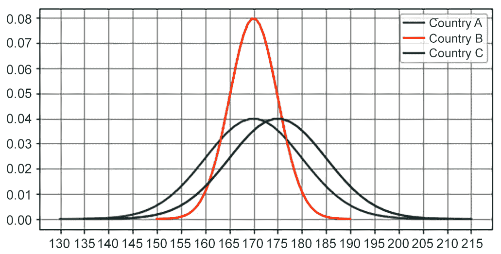

图 8.19：不同参数的正态分布比较

尽管**国家 A**和**国家 B**的人口具有相同的平均值（170 厘米），但标准差的差异意味着**国家 B**的分布更集中在 170 厘米附近。我们可以说这个国家的男性身高更加均匀。**国家 A**和**国家 C**的曲线基本上是一样的；唯一的区别是**国家 C**的曲线向右偏移了 5 厘米，这意味着在**国家 C**比在**国家 A**或**国家 B**更有可能找到身高在 190 厘米及以上的男性（在*x=190*及以上，绿色曲线的*y*轴值大于其他两个曲线）。

正态分布的第二个重要特征被称为**经验法则**。让我们拿我们的例子来说明，男性身高的人口服从正态分布，平均身高为 170 厘米，标准差为 10 厘米：

+   *约 68%的观察结果将落在区间内：平均值±1 个标准差*。对于男性的身高，我们会发现大约 68%的男性身高在 160 厘米和 180 厘米（170±10）之间。

+   *约 95%的观察结果将落在区间内：平均值±2 个标准差*。对于男性的身高，我们会发现大约 95%的男性身高在 150 厘米和 190 厘米（170±20）之间。

+   *超过 99%的观察结果将落在区间内：平均值±3 个标准差*。几乎所有的观察结果将在距离平均值不到三个标准差的距离内。对于男性的身高，我们会发现大约 99.7%的男性身高在 150 厘米和 200 厘米（170±30）之间。

经验法则可以快速地让我们了解当我们考虑到离平均值几个标准差时，我们期望看到的观察比例。

为了完成本节和本章，你应该知道关于任何连续随机变量的一个非常重要的事实，那就是**概率分布下的面积**将给出变量在某个范围内的概率。让我们用正态分布来说明这一点，并将其与经验法则联系起来。假设我们有一个正态分布的随机变量，*平均值=170*，*标准差=10*。在*x=160*和*x=180*之间（离平均值一个标准差），概率分布下的面积是多少？经验法则告诉我们 68%的观察结果将落在这个区间内，所以我们期望，这将对应于曲线下的面积在区间[160, 180]内。我们可以用 matplotlib 可视化这个图。生成图的代码有点长，所以我们将把它分成两部分。首先，我们将创建绘图函数，确定*x*轴上的限制，并定义要绘制的向量：

```py
from matplotlib.patches import Polygon
def func(x):
    return heights_rv.pdf(x)
lower_lim = 160
upper_lim = 180
x = np.linspace(130, 210)
y = func(x)
```

现在，我们将创建一个有阴影区域的图：

```py
fig, ax = plt.subplots(figsize=(8,4))
ax.plot(x, y, 'blue', linewidth=2)
ax.set_ylim(bottom=0)
# Make the shaded region
ix = np.linspace(lower_lim, upper_lim)
iy = func(ix)
verts = [(lower_lim, 0), *zip(ix, iy), (upper_lim, 0)]
poly = Polygon(verts, facecolor='0.9', edgecolor='0.5')
ax.add_patch(poly)
ax.text(0.5 * (lower_lim + upper_lim), 0.01, \
        r"$\int_{160}^{180} f(x)\mathrm{d}x$", \
        horizontalalignment='center', fontsize=15)
fig.text(0.85, 0.05, '$height$')
fig.text(0.08, 0.85, '$f(x)$')
ax.spines['right'].set_visible(False)
ax.spines['top'].set_visible(False)
ax.xaxis.set_ticks_position('bottom')
ax.set_xticks((lower_lim, upper_lim))
ax.set_xticklabels(('$160$', '$180$'))
ax.set_yticks([]);
```

输出将如下所示：

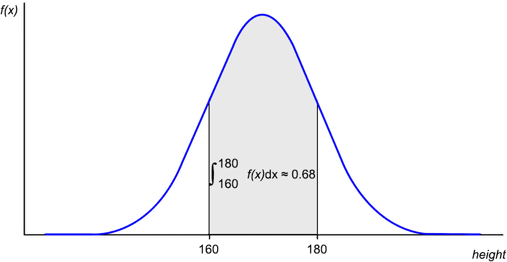

图 8.20：pdf 下的面积作为事件的概率

我们如何计算将给我们曲线下面积的积分？`scipy.stats`模块将使这变得非常容易。通过随机变量的`cdf`（**累积分布函数**）方法，本质上是 pdf 的积分，我们可以通过减去下限和上限来轻松评估积分（记住微积分的基本定理）：

```py
# limits of the integral
lower_lim = 160
upper_lim = 180
# calculating the area under the curve
Prob_X_in_160_180 = heights_rv.cdf(upper_lim) - \
                    heights_rv.cdf(lower_lim)
# print the result
print(f'Prob(160 <= X <= 180) = {Prob_X_in_160_180:0.4f}')
```

结果如下：

```py
Prob(160 <= X <= 180) = 0.6827
```

这就是我们如何从`pdf`中获得概率，而无需进行模拟。让我们看最后一个例子，通过与之前的结果联系起来，来澄清这一点。几页前，对于同一人群，我们问道，*找到一个身高超过 190 厘米的男性的概率是多少？*我们通过进行模拟得到了答案。现在，我们可以这样获得确切的概率：

```py
# limits of the integral
lower_lim = 190
upper_lim = np.Inf # since we are asking X > 190
# calculating the area under the curve
Prob_X_gt_190 = heights_rv.cdf(upper_lim) - \
                heights_rv.cdf(lower_lim)
# print the result
print(f'Probability of a male > 190 cm: {Prob_X_gt_190:0.5f} \
      (or {100*Prob_X_gt_190:0.2f}%)')
```

结果如下：

```py
Probability of a male > 190 cm: 0.02275 (or 2.28%)
```

如果您将此与我们之前得到的结果进行比较，您会发现它几乎是一样的。然而，这种方法更好，因为它是精确的，不需要我们进行任何计算密集或占用内存的模拟。

## 练习 8.04：在教育中使用正态分布

在这个练习中，我们将使用`scipy.stats`中的正态分布对象和`cdf`及其逆`ppf`来回答教育问题。

在心理测量学和教育领域，一个众所周知的事实是，许多与教育政策相关的变量都呈正态分布。例如，标准化数学测试的分数遵循正态分布。在这个练习中，我们将探讨这一现象：在某个国家，高中学生参加一项标准化数学测试，其分数遵循以下参数的正态分布：*平均值=100*，*标准差=15*。按照以下步骤完成这个练习：

1.  按照通常的惯例导入 NumPy、Matplotlib 和`scipy.stats`：

```py
import numpy as np
import scipy.stats as stats
import matplotlib.pyplot as plt
%matplotlib inline
```

1.  使用`scipy.stats`模块生成一个名为`X_rv`的正态分布随机变量实例，其*平均值=100*和*标准差=15*：

```py
# producing the normal distribution
X_mean = 100
X_sd = 15
# create the random variable
X_rv = stats.norm(loc = X_mean, scale = X_sd)
```

1.  绘制*X*的概率分布：

```py
x_values = np.linspace(X_mean - 4 * X_sd, X_mean + 4 * X_sd)
y_values = X_rv.pdf(x_values)
plt.plot(x_values, y_values, lw=2)
plt.grid();
```

输出将如下：

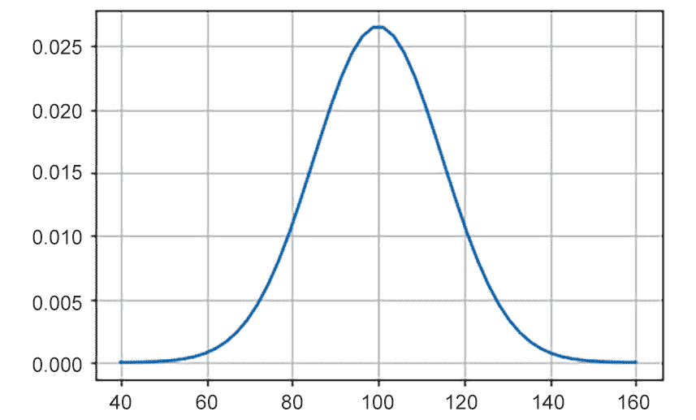

图 8.21：测试分数的概率分布

1.  教育部决定，被认为在数学上*胜任*的人的最低分数是 80。使用`cdf`方法计算将获得高于该分数的学生的比例：

```py
Prob_X_gt_80 = X_rv.cdf(np.Inf) - X_rv.cdf(80)
print(f'Prob(X >= 80): {Prob_X_gt_80:0.5f} \
(or {100*Prob_X_gt_80:0.2f}%)')
```

结果如下：

```py
Prob(X >= 80): 0.90879 (or 90.88%)
```

大约 91%的学生在数学上被认为是*胜任*的。

1.  一个非常严格的大学希望为被录取到他们的项目的高中生设定非常高的标准。该大学的政策是只录取人口中数学分数处于前 2%的学生。使用`ppf`方法（本质上是`cdf`方法的逆函数）并使用参数*1-0.02=0.98*来获得录取的分数线：

```py
proportion_of_admitted = 0.02
cut_off = X_rv.ppf(1-proportion_of_admitted)
print(f'To admit the top {100*proportion_of_admitted:0.0f}%, \
the cut-off score should be {cut_off:0.1f}')
top_percents = np.arange(0.9, 1, 0.01)
```

结果应该如下：

```py
To admit the top 2%, the cut-off score should be 130.8
```

在这个练习中，我们使用了正态分布和`cdf`和`ppf`方法来回答关于教育政策的现实问题。

注意

要访问此特定部分的源代码，请参阅[`packt.live/3eUizB4`](https://packt.live/3eUizB4)。

您也可以在[`packt.live/2VFyF9X`](https://packt.live/2VFyF9X)上在线运行此示例。

在本节中，我们学习了关于连续随机变量的知识，以及这些类型变量的最重要的分布：正态分布。本节的关键是，连续随机变量由其概率密度函数确定，而概率密度函数又由其参数确定。在正态分布的情况下，它的两个参数是平均值和标准差。我们使用一个例子来演示这些参数如何影响分布的形状。

另一个重要的收获是，你可以使用概率密度函数下方的面积来计算某些事件的概率。这对于任何连续随机变量都是成立的，当然也包括遵循正态分布的随机变量。

最后，我们还学习了正态分布的经验法则，这是一个很好的*经验法则*，如果你想快速了解分布均值附近*k*个标准差处的值的比例。

现在你已经熟悉了这个重要的分布，我们将在下一章中继续使用它，当我们再次在**中心极限定理**的背景下遇到它时。

## 活动 8.01：在金融中使用正态分布

在这个活动中，我们将探讨使用正态分布来理解股票价格的每日收益的可能性。在活动结束时，你应该对正态分布是否适合描述股票的每日收益有自己的看法。

在这个例子中，我们将使用 Yahoo! Finance 提供的有关微软股票的每日信息。按照以下步骤完成此活动：

注意

完成此活动所需的数据集可以在[`packt.live/3imSZqr`](https://packt.live/3imSZqr)找到。

1.  使用 pandas 从`data`文件夹中读取名为`MSFT.csv`的 CSV 文件。

1.  可选地，重命名列，使它们易于处理。

1.  将`date`列转换为适当的`datetime`列。

1.  将`date`列设置为 DataFrame 的索引。

1.  在金融中，股票的每日收益被定义为每日收盘价的百分比变化。通过计算`adj close`列的百分比变化，创建 MSFT DataFrame 中的`returns`列。使用`pct_change`系列 pandas 方法来实现。

1.  将分析期限限制在`2014-01-01`和`2018-12-31`（包括在内）之间的日期。

1.  使用直方图可视化`returns`列的分布，使用 40 个箱子。它看起来像正态分布吗？

输出应该如下所示：


图 8.22：微软股票收益的直方图

1.  计算`returns`列的描述统计信息：

```py
count    1258.000000
mean        0.000996
std         0.014591
min        -0.092534
25%        -0.005956
50%         0.000651
75%         0.007830
max         0.104522
Name: returns, dtype: float64
```

1.  创建一个名为`R_rv`的随机变量，它将代表*微软股票的每日收益*。使用收益列的平均值和标准差作为该分布的参数。

1.  绘制`R_rv`的分布和实际数据的直方图。然后，使用`plt.hist()`函数和`density=True`参数，使真实数据和理论分布以相同的比例出现：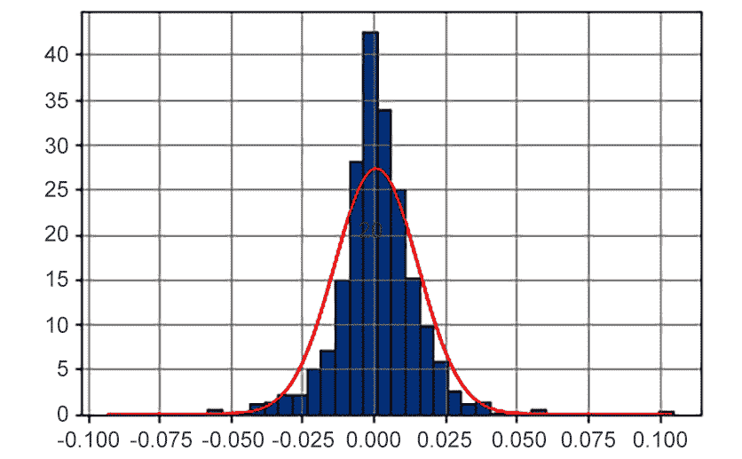

图 8.23：微软股票收益的直方图

1.  在查看前面的图后，*你会说正态分布是否为微软股票的每日收益提供了准确的模型？*

1.  额外活动：使用包含宝洁公司股票信息的`PG.csv`文件重复前面的步骤。

这个活动是关于观察现实世界的数据，并尝试使用理论分布来描述它。这很重要，因为通过拥有一个理论模型，我们可以利用其已知的特性得出现实世界的结论和影响。例如，你可以使用*经验法则*来描述公司的每日收益，或者你可以计算一天内损失一定金额的概率。

注意

此活动的解决方案可以在第 684 页找到。

# 总结

本章简要介绍了概率论的数学分支。

我们定义了概率的概念，以及一些最重要的规则和相关概念，如实验、样本空间和事件。我们还定义了随机变量这一非常重要的概念，并举例说明了两种主要的离散和连续随机变量。在本章的后面，我们学习了如何使用`scipy.stats`模块创建随机变量，我们还用它来生成概率质量函数和概率密度函数。我们还讨论了宇宙中两个最重要的随机变量：正态分布和二项分布。这些在许多应用领域被用来解决现实世界的问题。

当然，这只是对这个主题的简要介绍，目标是向您介绍并让您熟悉概率论中一些基本和基础概念，特别是那些对理解和使用推断统计学至关重要的概念，而这将是下一章的主题。

WUE84

JNP97
