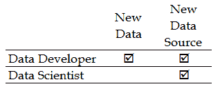
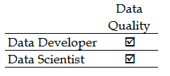
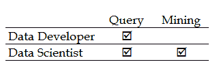
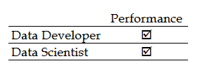
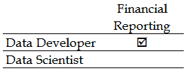
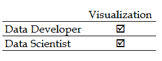
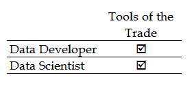

# 第一章：从数据开发者到数据科学家的过渡

在本章中（以及本书的所有章节中），我们将为你规划从像数据开发者一样思考到像数据科学家一样思考的过程。

我们将使用开发者术语和类比，讨论开发者的目标，典型的开发者思维方式，如何与数据科学家的思维方式有所不同，为什么两者之间会有重要的差异（以及相似之处），并建议如何过渡到像数据科学家一样思考。最后，我们将提出理解统计学和数据科学的某些优势，从数据的角度思考，以及简单地像数据科学家一样思考。

在本章中，我们将内容分为以下几个主题：

+   数据开发者角色的目标

+   数据开发者的思维方式

+   数据开发者与数据科学家的区别

+   像数据科学家一样思考的优势

+   向数据科学家思维方式过渡的步骤

那么，让我们开始吧！

# 数据开发者的思维方式

在担任数据开发者角色多年之后，首先从一些关于数据开发者的简短评论开始是很有道理的。

在一些领域，数据库开发者等同于数据开发者。但无论是数据还是数据库，两者通常都会被标记为**信息技术**（**IT**）专业人员。两者都花时间从事或与数据和数据库技术打交道。

我们可能会看到一些数据库（数据）开发者之间的分歧，那些更多关注支持和常规维护（如管理员）的与那些更关注改善、扩展以及开发数据访问的（如开发者）之间的差异。

典型的数据开发者主要参与的是创建和维护对数据的访问，而不是消费这些数据。他或她会参与或做出关于选择编程语言以访问或操作数据的决策。我们会确保新的数据项目符合关于数据库如何存储和处理数据的规则，并且我们将创建数据源之间的接口。

此外，一些数据开发者还会参与审查和调优他人编写的查询，因此，他们必须精通最新的调优技术、各种查询语言，如**结构化查询语言**（**SQL**），以及如何存储和结构化所访问的数据。

总结来说，至少从数据开发者的角度来看，重点在于获取有价值的数据资源，而非消费这些有价值的数据资源。

# 数据开发者的目标

每个角色、职位或工作岗位都有自己的一份目标、责任或计划。

因此，作为数据开发者，可能会承担以下一些责任：

+   维护数据库和基础设施的完整性

+   监控和优化以保持响应水平

+   确保数据资源的质量和完整性

+   为用户群体提供适当的支持

+   强制执行数据资源的安全策略

作为数据科学家，你会注意到一些略有不同的目标。这个角色通常会包括这里列出的一些目标：

+   从不同来源挖掘数据

+   识别模式或趋势

+   创建统计模型——建模

+   学习和评估

+   识别洞察并进行预测

你是否注意到这里开始有一个主题了？

注意以下关键词：

+   维护

+   监控

+   确保

+   提供

+   强制执行

这些术语表达的概念与那些更与数据科学家角色相关的术语有所不同，例如以下这些：

+   挖掘

+   趋势

+   建模

+   学习

+   预测

当然，也有一些活动看起来似乎同时与数据开发人员和数据科学家相关，并将在这里进行探讨。

# 查询或挖掘

作为数据开发人员，你几乎总是习惯于查询数据。实际上，数据科学家也会查询数据。那么，什么是数据挖掘呢？当人们查询数据时，通常会问一个具体的问题。例如，你可能会问，四月销售了多少水仙花？并期望得到一个已知的、相关的答案，例如四月水仙花总销量为 269 株。

在数据挖掘中，人们通常更专注于数据关系（或者数据点之间的潜在关系，有时称为变量）和认知分析。一个简单的例子可能是：在四月，月平均气温如何影响水仙花的总销量？

数据查询和数据挖掘之间的另一个重要区别在于，查询通常是历史性的，因为它们用于报告过去的结果（例如四月的总销售额），而数据挖掘技术则可以是前瞻性的，通过使用适当的统计方法，它们可以推测未来的结果或提供某个结果或事件发生的概率。例如，使用我们之前的例子，我们可能会预测，当销售区域的平均气温上升时，水仙花的销量会增加。

# 数据质量或数据清洗

你认为数据开发人员关心数据库中数据的质量吗？当然，数据开发人员需要关心他们支持或提供访问的数据的质量水平。对于数据开发人员而言，组织内的**数据质量保证**（**DQA**）过程更具机械性，例如确保数据是最新的、完整的，并且存储在正确的格式中。

通过数据清洗，你可以看到数据科学家更加注重统计数据质量的概念。这包括利用数据中发现的关系来提高数据质量水平。例如，一个九岁的个人不应被错误地标记为美国合法驾驶员群体的一部分。

你可能听说过**数据清洗（munging）**这个术语。数据清洗有时被定义为将未专门设计为互操作的系统和接口连接在一起的过程。数据清洗还可以定义为将原始数据处理或过滤为另一种形式，以便用于特定的需求或用途。

# 数据建模

数据开发人员通过与关键利益相关者密切合作，根据给定的需求（如能够快速输入销售交易到组织的在线订单输入系统）来为数据创建设计（或模型）。在模型设计过程中，数据开发人员必须熟悉三种数据模型——概念模型、逻辑模型和物理模型——它们彼此相对独立。

数据科学家创建模型的目的是通过训练数据样本或群体，识别先前未知的洞察或验证当前假设。

数据建模可能变得复杂，因此，通常会看到数据开发与数据建模角色之间的区别。在这些情况下，数据开发人员专注于评估数据本身，创建有意义的报告，而数据模型师则评估如何收集、维护和使用数据。

# 问题或洞察

数据开发人员可能会花费大量时间监控数据、用户和环境，寻找任何可能导致性能瓶颈或停机的潜在问题的迹象，如意外的使用量水平。其他常见的职责包括审计、应用程序集成、灾难规划与恢复、容量规划、变更管理、数据库软件版本更新、负载均衡等。

数据科学家将他们的时间用于评估和分析数据以及信息，以发现有价值的新洞察。希望一旦建立了洞察，它们可以用来做出更好的商业决策。

有一个相关的概念需要理解；通过使用分析工具，人们可以在数据中识别出模式和趋势，而洞察则是通过使用分析结果获得的价值。

# 思维过程

某人的心理过程或认知活动，基于解释、过去的经验、推理、问题解决、想象和决策等，构成了他们的思维方式或思维过程。

我们只能猜测某些人实际会怎么想，或者他们在某一特定时刻或活动中会有什么具体想法，或者他们会采用什么样的思维过程来完成目标，但一般来说，数据开发者可能更多地关注数据的便捷性（根据需求使数据可用），而数据科学家则更注重数据的消费（寻找新的方法利用数据以发现现有问题的洞察或新机会）。

为了更清晰地描绘这一点，你可以用汽车修理工和学校辅导员的类比来说明。

一位汽车修理工将利用他的技能和适当的工具，确保汽车能为车主提供使用并保持良好的运行状态，或者如果车辆出现问题，修理工会根据症状进行诊断并修复问题。这与数据开发者的工作非常相似。

对于辅导员来说，他或她可能会审查大量关于学生过去表现、个性特征以及经济统计数据的信息，以确定该学生未来可能存在的机会。此外，辅导员还可能研究多种情境，以预测基于该学生的资源，最佳的结果可能是什么。

显然，上述两类人都提供有价值的服务，但他们使用（可能是非常不同的）不同方法和个人思维过程来产生期望的结果。

尽管存在一定的重叠，当你是数据开发者时，你的思维通常围绕着如何保持对适当数据资源的便捷访问，而不是特别关注数据的本质。也就是说，你可能关心数据类型、数据量和访问路径，但不关心是否存在或存在何种认知关系，或者数据的潜在强大用途。

在下一节中，我们将通过一些简单的情况来展示数据开发者和数据科学家之间的各种对比。

# 开发者与科学家

为了更好地理解数据开发者和数据科学家之间的差异，让我们花一点时间来考虑一些假设性的（但仍然现实的）情况，这些情况可能会在你的一天中发生。

# 新数据，新来源

当新的数据或新的数据源可用或被呈现时，会发生什么？

在这里，新的数据通常意味着更多**当前的**或**最新的**数据已经可用。一个例子是，每天早上接收到最新的本月销售交易数据文件，这通常被称为**实际**更新。

在商业世界中，数据可以是真实的（实际的），例如经过认证的销售数据，或在订单处理系统中输入的销售交易数据；也可以是假设的，例如组织预测未来（尚未实际发生的）销售或交易。

你可能会定期收到来自在线交易处理系统的文件，这些文件提供从本月初到当前日期的日销售额或销售数据。你希望你的业务报告能够显示包括最新销售交易在内的总销售数字。

新数据源的概念有所不同。如果我们使用之前提到的类比，其中一个例子可能是来自一个母公司新收购的公司的销售交易文件。另一个例子可能是接收报告近期在线调查结果的数据。这些信息是为了特定目的而收集的，通常并非（但可能是）例行事件。

机器数据（以及其他数据）正在不断积累，即使在你阅读本文时，也在提供新的、有趣的数据源，创造了一个数据消费市场。一个有趣的例子可能是亚马逊网络服务（[`aws.amazon.com/datasets/`](https://aws.amazon.com/datasets/)）。在这里，你可以找到大量的公共数据资源，包括*1000 基因组计划*（旨在建立最全面的人类基因信息数据库）以及 NASA 的地球卫星影像数据库。

在前面的情境中，数据开发人员最有可能（应该）预期更新文件，并且已经实现了**提取**、**转换**和**加载**（**ETL**）过程来自动处理数据，处理任何异常，并确保所有相关报告反映最新的、正确的信息。数据开发人员还将处理从新收购公司过渡过来的销售文件，但可能不会成为处理调查结果（或*1000 基因组计划*）的主要资源。

数据科学家并不参与日常数据处理（例如销售数据），但会直接负责调查结果项目。也就是说，数据科学家几乎总是亲自参与诸如研究和获取新信息源等与调查相关的项目。数据科学家很可能会在调查设计阶段提供意见，因为他们是那些将在分析中使用数据的人。

# 质量问题

假设有关于组织正在消费或即将消费的数据质量的担忧。正如我们在本章前面提到的那样，数据质量问题有多种类型，例如我们所称的**机械问题**以及**统计问题**（还有其他问题）。

当前最常见的统计质量问题的趋势例子包括重复条目和拼写错误、误分类和汇总，以及含义的变化。

如果管理层对日常报告中列出的总销售额的有效性产生质疑，或者因为大部分客户在美国法律上不能开车而不信任该数据，或者组织的回头客数量正在下降，那么你就面临了质量问题：

质量对数据开发人员和数据科学家来说都是一个关注点。数据开发人员更关注时间和格式（数据的机制），而数据科学家更关注数据的统计质量（优先考虑可能影响特定研究可靠性的数据问题）。

# 查询和数据挖掘

历史上，信息技术组或部门经常被各种业务用户请求生成并提供报告，展示数据库和系统中存储的感兴趣的信息。

这些临时报告请求已经发展成了对按需原始数据提取的请求（而不是格式化或漂亮的打印报告），以便业务用户可以将提取的数据导入如 MS Excel（或其他工具）中，在那里他们可以进行自己的格式化和报告，或进行进一步的分析和建模。在今天的世界中，业务用户要求更多的自助服务（甚至是移动端）功能，以满足组织（或个人）的分析和报告需求，期望能够直接或通过更小、更专注的数据池访问更新的原始数据存储。

如果业务应用程序无法提供必要的报告，业务用户通常会继续他们的自助服务之旅。

-Christina Wong ([www.datainformed.com](http://www.datainformed.com))

创建临时报告和根据特定的按需需求进行提取，或者提供自助数据访问，完全由组织的数据开发人员负责。然而，请注意，数据科学家通常会定期执行自己的查询和提取——通常是他们正在进行的项目的一部分。他们可能会使用这些查询结果来确定他们需要的数据的可行性和可用性，或者作为创建特定统计项目的样本或总体过程的一部分。这种查询形式可能被认为是一种数据挖掘方式，比普通查询更深入地探讨数据。这项工作通常由数据科学家而非数据开发人员来完成。

# 性能

你可以打赌，几乎每个人都在关心，或将来会关心，绩效的话题。某些形式（的绩效）可能更容易量化，例如一个临时查询或数据提取完成的可接受响应时间是多少？或者，输入一个销售订单需要的总鼠标点击或键盘操作数是多少？而其他问题可能会更难回答或解决，例如为什么似乎回头客数量呈下降趋势？

数据开发人员的责任是创建并支持数据设计（甚至参与基础设施配置选项），以确保持续产生快速的响应时间，并且易于理解和使用。

一个可能令人困惑的绩效责任领域是网站性能。例如，如果一个组织的网站表现不佳，是因为某些页面加载缓慢，或内容不吸引人，或与目标受众或客户无关吗？在这个例子中，数据开发人员和数据科学家可能都被指派解决问题。

这些人——数据开发人员——不会参与调查项目。另一方面，数据科学家将不参与日常的交易性（或类似）绩效问题，而是负责与组织的利益相关者合作，定义并领导一个统计项目，旨在回答类似于关于回头客数量的问题。

# 财务报告

在每个组织中，都需要定期生成财务报表（如损益表、资产负债表或现金流量表）。财务报告（或财务报表）旨在回答关于业务的关键问题，诸如以下问题：

+   我们是在盈利还是亏损？

+   资产与负债相比如何？

+   我们有多少自由现金或需要多少自由现金？

创建、更新和验证定期财务报表的过程是任何规模的企业——无论是营利性还是非营利性——无论是公立还是私营企业，的强制性任务。即使今天，许多组织仍未完全使用自动化报告解决方案。这意味着，即使是更新一份报表并添加最新数据，也可能是一项艰巨的任务。

财务报告是行业内职责相对明确的一个领域。数据开发人员负责创建和支持使数据可用的处理系统，确保数据的正确性，甚至在某些情况下，创建和分发报告。

*全球超过 83%的企业使用 MS Excel 进行月末结账和报告* *                                                                                                           -[`venasolutions.com/`](https://venasolutions.com/)*

通常，数据开发人员会提供并维护数据，以支持这些工作。

数据科学家通常不会支持一个组织的常规处理和（财务）报告工作。然而，数据科学家会对所产生的财务信息（及其支持数据）进行分析，制作报告和可视化，展示管理层在盈利能力、效率和风险等方面的洞察（仅举几例）。

统计学和数据科学中一个特别有趣的领域是，当数据科学家执行纵向分析以识别变量与组织财务报表中基本数额之间的关系时。

# 可视化

今天，生产仪表板格式的可视化已成为常见做法，它可以展示更新后的个别**关键绩效指标**（**KPI**）。此外，传达特定的观点或简化大量数据的复杂性并不一定需要使用数据可视化技术，但在某些情况下，今天的世界可能要求这样做。

大多数人可能会同意，扫描大量的工作表、电子表格或报告充其量是单调乏味的，而查看图表和图形（如可视化）通常更容易让眼睛感到舒适。基于这一点，数据开发人员和数据科学家都会参与设计、创建和使用数据可视化。不同之处在于所创建的可视化类型。数据开发人员通常专注于重复数据点的可视化（例如，预测与实际数据的对比），而数据科学家则将可视化用作统计项目中的一个重要环节来表达某个观点。

再次强调，数据开发人员很可能会利用可视化来展示或突出例如销售量的变化，例如按月展示全年数据，而数据科学家则可能会使用可视化来预测明年每月的潜在销售量，考虑到季节性（及其他）统计数据。

# 行业工具

个人访问和消费数据所使用的工具和技术会因多种因素而有所不同，以下是一些因素：

+   业务类型

+   业务问题（或机会）类型

+   安全性或法律要求

+   硬件和软件兼容性及/或前提条件

+   数据类型和用途

+   用户群体的具体情况

+   企业政策

+   价格

在不断变化的技术环境中，数据开发人员和数据科学家面临着越来越多的选择，甚至可能是压倒性的选择，其中包括非常可行的开源选项。

开源软件是由用户社区为用户开发的。好消息是，开源软件目前在全球大多数（即 78%）企业中得到应用——Vaughan-Nichols，[`www.zdnet.com/`](http://www.zdnet.com/)。开源在数据科学中发挥着日益重要的作用。

当我们谈论工具和技术时，数据开发人员和数据科学家都将同等参与选择最符合他们个人喜好并满足项目或目标需求的正确工具或技术。

# 像数据科学家一样思考的优势

那么，为什么你作为一个数据开发人员，应该努力像（或更像）数据科学家一样思考呢？理解统计学的方式及其原理有什么意义？具体来说，像数据科学家一样思考可能会带来哪些优势？

以下是支持迈向数据科学努力的几个理念：

+   培养更好的数据理解方法

+   在程序或数据库设计过程中运用统计思维

+   增加个人工具箱

+   增强市场竞争力

+   持续学习

+   看见未来

# 培养更好的数据理解方法

无论你是数据开发人员、系统分析师、程序员/开发人员、数据科学家，还是其他商业或技术专业人员，你都需要能够与自己所使用或设计应用程序或数据库架构的数据建立全面的关系。

有些人可能依赖于作为整体项目计划或需求一部分提供给你的数据规范，仍然有些人（通常是那些更有经验的人）可能会通过在数据上执行一些常规查询来补充他们的理解，无论哪种方式，这通常都不足够。

事实上，在行业案例研究中，不清晰、误解或不完整的需求或规范经常位列导致项目失败或增加风险的前五名原因。

数据剖析是一个过程，数据科学的特点之一，旨在建立数据亲密关系（或更清晰、简洁地掌握数据及其内部关系）。数据剖析还建立了背景，其中有多个通用的上下文类别，可以用来增加或提升数据的价值和理解，以支持任何目的或项目。

这些类别包括以下内容：

+   **定义和解释**：这些有助于获得数据点的附加信息或属性

+   **比较**：这有助于为数据中的某个数据点增加可比性

+   **对比**：这有助于为数据点增加一个对立面，从而查看它是否可能提供不同的视角

+   **趋势**：这些是典型的数学计算、汇总或聚合

+   **离散度**：这包括描述数据集（或数据组）平均值的数学计算（或总结），如范围、方差和标准差。

将数据分析看作是你用来检查数据文件中数据的过程，并收集关于该数据的统计信息和信息。这些统计数据很可能驱动了程序中实现的逻辑，或你如何在数据库的表中关联数据。

# 在程序或数据库设计过程中使用统计思维

创建数据库设计的过程通常包括多个任务，这些任务将由数据库设计师（或数据开发人员）执行。通常，设计师会执行以下任务：

1.  确定哪些数据将保存在数据库中。

1.  确立不同数据点之间的关系。

1.  创建基于第 1 步和第 2 步的逻辑数据结构。

即使在应用程序设计过程中，彻底了解数据的工作原理也是至关重要的。如果不了解平均值或默认值、数据点之间的关系和分组等，所创建的应用程序很可能会失败。

将统计思维应用于数据设计的一个思路是在数据有限的情况下。如果无法收集足够的数据，可以通过多种抽样方法，如概率抽样，来创建样本（测试）数据。

基于概率的样本是通过构建目标人群值的列表，称为**样本框架**，然后通过随机化过程从样本框架中选择记录，这一过程称为**选择程序**。可以把它看作是基于你对实际数据的知识以及一些统计逻辑生成样本数据记录的脚本，用于测试你的设计。

最后，采用科学或统计方法来处理任何问题，成功的概率会更高。

# 添加到你的个人工具箱中

根据我的经验，大多数数据开发人员倾向于基于多种因素（其中一些在本章前面提到过）固定在某项技术或工具上，逐渐熟悉并（希望）更精通该产品、工具或技术——甚至是不断发布的新版本。人们可能会猜测（而且很可能是对的）开发人员使用工具的时间越长，他们建立的技能水平就会越高。然而，数据科学家似乎更多地专注于方法论、实践或概念，而不是他们用来实现这些方法的实际工具和技术。

这种焦点转移（从工具到技术）改变了一个人的思维方式，使其从“这个工具如何服务我的目标”转变为“哪个工具最能服务我的目标”。

你接触的工具越多，你作为开发者或数据科学家的思维就会变得更加广阔。开源社区提供了出色的工具，供你下载、学习并自由使用。我们应该培养一种“下一个或新事物”的思维方式，即使这种思维只是为了将新工具的特性与功能与自己偏好的工具进行对比。我们将在本章的终身学习部分进一步讨论这一点。

一个目前流行的数据开发者或数据启用工具的激动人心的例子是**MarkLogic**（[`www.marklogic.com/`](http://www.marklogic.com/)）。这是一款面向企业的操作性和事务性 NoSQL 数据库，旨在整合、存储、管理和搜索比以往更多的数据。MarkLogic 获得了 2017 年 DAVIES 最佳数据开发工具奖。R 和 Python 似乎是数据科学家的首选工具。

如果不提到 IBM Watson Analytics（[`www.ibm.com/watson/`](https://www.ibm.com/watson/)），这部分就不完整，因为它正在改变行业对统计或认知思维的看法。

# 增强市场竞争力

数据科学显然是一个不断发展的领域，且受欢迎程度呈指数级增长。事实上，如果你问一打专业人士，你很可能会得到一打关于数据科学家定义的不同回答（以及他们在项目或组织中的角色），但大多数人可能会同意数据科学家的重要性，并且一致认为如今行业内外存在着大量的机会。

数据科学家面临前所未有的需求，需要更多的模型和更多的洞察……只有一个办法可以做到：他们必须大幅加快从洞察到行动的速度。在未来，数据科学家必须变得更加高效。这是他们从数据中获取更多价值的唯一方式。

-Gualtieri [`www.datanami.com/2015/09/18/the-future-of-data-science/`](https://www.datanami.com/2015/09/18/the-future-of-data-science/)

今天，数据科学家是相对难以找到的。如果你做一些研究，你会发现今天的数据科学家通常具有数学、编程、软件设计、实验设计、工程、沟通以及管理技能等多元化的背景。实际上，你会发现大多数数据科学家并不专注于某一方面，而是具有多个领域或背景的不同程度的熟练度。

数据科学家的角色自 1200 多年前统计学领域诞生以来，已经明确发生了变化。尽管这个术语自本世纪初才出现，但它已经被贴上了“21 世纪最性感的职业”的标签，这也让这一职位的求职者排成了长队。

-Pearson

[ https://www.linkedin.com/pulse/evolution-data-scientist-chris-pearson](https://www.linkedin.com/pulse/evolution-data-scientist-chris-pearson)

目前，还没有正式的数据科学家职位描述（或者说，没有前提条件列表）。这给了你一个机会，去创造你自己的数据科学家类型，以新的方式为你的组织提供价值。

# 持续学习

持续评估或持续学习的理念是一个重要的统计学概念。可以将其理解为提升感知技能的常见定义。例如，在统计学中，我们可以提到交叉验证的概念。这是一种统计方法，用于衡量（评估）统计模型的表现。该方法包括确定一组验证值，并通过运行模型若干轮（持续地），使用样本数据集，并平均每轮的结果，最终查看模型（或方法）在解决特定问题或达成目标方面的表现如何。

这里的期望是，基于性能结果，可以做出调整来微调模型，以便在使用实际数据或完整数据集时提供识别洞察的能力。这个概念不仅是数据开发者在优化或微调数据设计或数据驱动的应用流程时应当采用的做法，而且这也是一种很好的生活建议，形式是：尝试、学习、调整并重复。

模型评估的概念并不是统计学独有的。数据开发者可能会认为这类似于预测 SQL 性能的行为，或者类似于应用程序演练的做法，在这种做法中，应用程序会根据其文档化需求中的意图和目的进行验证。

# 看见未来

预测建模利用数据科学的统计学来预测或预见结果（实际上是一个可能的结果）。这听起来像是在算命，但更重要的是运用认知推理来解读信息（从数据中提取的）并得出结论。就像科学家通常被描述为以系统的方法获取知识或学习一样，数据科学家也可以被视为尝试利用统计学和（机器）学习来做出预测。

当我们谈论预测结果时，实际上是在谈论看到某一结果的概率。概率是用来预测未来事件发生的可能性，而统计学则涉及分析过去事件发生的频率。

如果你是一名数据开发者，可能曾参与过为财务部门提供服务的项目，那么你可能理解为什么企业领导者会认为不仅仅是报告财务结果（即使最准确的结果也仍然是历史事件）是有价值的，还应当能够对未来的表现做出有根据的假设。

也许你可以理解，如果你有金融报告方面的背景并且负责此类工作，那么你现在可以迈出一步，开始为这些报告提供统计预测！

统计建模技术也可以应用于任何类型的未知事件，不论它发生在何时，例如在犯罪侦查和嫌疑人识别的情况下。

# 转型为数据科学家

让我们从这一部分开始，先花点时间阐明我认为的几条关于转型为数据科学家的普遍接受的事实。我们会在本书接下来的内容中不断重申这些观点：

+   学术背景：数据科学家并不全来自某一特定学术背景。他们并非全是计算机科学或统计学/数学专业毕业的，也并非所有人都拥有高级学位（事实上，你可以通过本科学位甚至更少的学历来使用统计学和数据科学）。

+   这不是基于魔法的：数据科学家可以使用机器学习和其他公认的统计方法从数据中识别洞察，而不是依赖魔法。

+   他们并不全是技术或计算机迷：你不需要多年编程经验或昂贵的统计软件就能有效工作。

+   你不需要有经验就能开始。你可以从今天、从现在就开始。（好吧，当你买了这本书的时候，其实你已经开始了！）

好的，在做了前述声明之后，让我们也保持现实。像往常一样，生活中的一切都有一个切入点，值得称赞的是，你能够开始时获取更多的证书通常会让你更有优势。不过，正如我们在本章后面看到的那样，完全没有合理的理由阻止你立即开始理解、使用并高效地应用数据科学和统计学。

像任何职业一样，证书和学位可能为你打开大门，而经验，像往常一样，可能被认为是最好的老师。然而，世界上没有伪数据科学家，只有那些当前比实际经验更渴望的人。

如果你不仅对理解统计学和数据科学感兴趣，而且最终希望成为一名全职数据科学家，你应该考虑以下常见主题（你很可能会在数据科学家的招聘信息中看到）作为关注的重点：

+   **教育**：常见的学习领域包括数学和统计学，其次是计算机科学和工程学（也包括经济学和运筹学）。再次强调，这里并没有严格要求必须拥有高级或相关学位。此外，通常，学位或等效经验的概念也适用于此。

+   **技术**：你会听到提到 SAS 和 R（实际上，你会听到很多关于 R 的内容），以及 Python、Hadoop 和 SQL，它们被认为是数据科学家应该熟悉的关键或首选工具，但工具和技术总是在不断变化，因此，正如本章中多次提到的那样，只要数据开发人员理解数据科学的目标和各种统计方法论，就可以立即开始高效工作，而无需学习新的工具或语言。

基本的商业技能，如 Omniture、Google Analytics、SPSS、Excel 或任何其他 Microsoft Office 工具，在各个地方几乎都是默认要求，并不算优势，但如果你有编程语言（如 Java、PERL 或 C++）或数据库（如 MySQL、NoSQL、Oracle 等）的经验，确实会有帮助！

+   **数据**：理解数据的能力，以及处理各种类型数据特有的挑战，如非结构化数据、机器生成数据和大数据（包括组织和结构化大型数据集）。

非结构化数据是统计学和数据科学家关注的一个关键领域。它通常被描述为没有为其定义重新定义的模型，或者没有以预定的方式进行组织。非结构化信息通常以文本为主，但也可能包含日期、数字和其他各种事实。

+   **求知欲**：我很喜欢这个。这或许可以定义为一种性格特征，对于想成为数据科学家的人来说，这是一项有用的（如果不是必要的话）品质。这意味着你持续有想要了解更多信息的需求，而不仅仅停留在基础知识上，或者想要超越某个主题的常识（你不需要在墙上挂一张学位证书！）。

+   **商业敏锐度**：要成为数据开发者或数据科学家，你需要对你所在行业有深入的理解，还需要知道你的组织需要解决哪些商业问题。在数据科学领域，除了识别新方式让企业利用数据外，能够分辨哪些问题是最重要的也至关重要。

+   **沟通技巧**：所有公司都在寻找能够清晰流利地将自己的发现传达给非技术团队（如市场或销售部门）的人。作为数据科学家，必须能够通过为企业提供量化的洞察，帮助他们做出决策，并且理解非技术同事的需求，从而增加价值并取得成功。

# 我们继续前进

那么，让我们以一些轻松的（即便不是常识性的）建议来结束本章，面向那些想学习统计学并过渡到数据科学领域的数据开发者。

以下是一些建议，你应该考虑作为熟悉统计学和数据科学主题的资源：

+   **书籍**：仍然是学习的最佳方式！你可以从书籍中获得非常实用和详细的信息（包括例子）以及建议。很高兴你从这本书开始，但实际上有大量（而且还在不断增加）等待你去阅读的资源。

+   **Google**：我非常喜欢做互联网研究。你会惊讶于可以找到的开源软件库、工具、模型、样本数据、白皮书、博客等的数量和质量。很多东西可以直接下载并用来教育自己，甚至作为实际项目或交付物的一部分。

+   **LinkedIn**：很大比例的企业和独立招聘人员使用社交媒体，其中大多数使用 LinkedIn。这是一个了解哪些职位需求较大，以及他们需要什么样的技能和经验的机会。当你看到一些你不熟悉的职位时，做一些研究来了解该主题。此外，LinkedIn 上有大量专注于统计学和数据科学的群组。加入所有群组！与成员们建立联系——甚至可以直接向他们提问。大多数情况下，社区成员都很乐意帮助你（即使只是展示他们知道多少）。

+   **志愿者工作**：一个很好的方式来提升技能，继续学习，并扩展你的统计学网络，就是做志愿者。查看 http://www.datakind.org/get-involved。如果你报名成为志愿者，他们会审查你的技能，并保持联系，介绍符合你背景或你感兴趣的项目。

+   **实习**：有经验的专业人士可以重新报名作为实习生，测试一个新职业或进入一个新行业（www.Wetfeet.com）。虽然这对除了刚毕业的大学生之外的人来说可能不太现实，但如果你能承担减少收入（甚至无薪）一段时间以获得统计学和数据科学的实际经验，实习是可以考虑的。更实际的做法是，在自己的公司内部做数据科学学徒角色的实习，时间可以短一些或针对某个特定项目。

+   **副项目**：这是我最喜欢的之一。在你的组织内寻找统计学可能正在使用的机会，并要求在空闲时间参加会议或电话。如果这不可能，寻找统计学和数据科学可能解决问题或应对挑战的场景，并将其作为一个业余项目在空闲时间进行。这类项目风险较低，因为没有截止日期，而且如果一开始没有成功，也不算世界末日。

+   **数据**：帮助你顺利过渡到统计学和数据科学的最简单方法之一，可能就是接触更多种类的数据，尤其是非结构化数据和大数据。此外，探索其他行业或应用的数据也是很有帮助的。

+   **Coursera** 和 **Kaggle**：Coursera 是一个在线网站，您可以在该网站上支付费用参加 **大规模在线开放课程**（**MOOCs**）并获得证书，而 Kaggle 举办数据科学竞赛，您不仅可以在与其他成员的竞争中评估自己的能力，还可以访问大量的、非结构化的大数据文件，这些文件可能更像您在实际统计项目中使用的文件。

+   **多元化**：为了增加您分析技能的可信度（因为许多公司每天都在采用各种新工具），例如 R、Python、SAS、Scala（当然还有）SQL 等，如果您花时间学习尽可能多的工具和技术，您将具有显著的优势。除了这些主流的数据科学工具外，您还可以研究一些新兴工具，如 Paxada、MatLab、Trifacta、Google Cloud Prediction API 或 Logical Glue。

+   **询问招聘人员**：在转型初期花时间与招聘人员建立关系将带来许多好处，信任的招聘人员可以传递目前需求技能的列表以及哪些统计实践最受欢迎。此外，随着您积累经验和信心，招聘人员可以帮助您专注或微调您的经验，向那些可能在远期出现的具体机会发展，这可能会使您在其他候选人中占据优势。

+   **在线视频**：查看 YouTube 上的网络研讨会和教程视频。无论何时您的时间允许，您都可以观看来自业余爱好者和专业人士的无数资源。

# 总结

在本章中，我们勾画了数据库（或数据）开发人员如何在日常工作中以解决问题为基础进行思考，比较了数据开发人员和数据科学家的思维方式，并通过各种实际例子进行了说明。

我们还列出了作为数据科学家的思维方式的一些优势，并最终讨论了您在理解统计学并进入数据科学领域时需要关注的常见主题。

在下一章中，我们将介绍并解释（再次从开发者的角度）数据科学统计学背后的基本目标，并向您介绍本书中使用的、带有易于理解的解释和示例的重要术语和关键概念。
