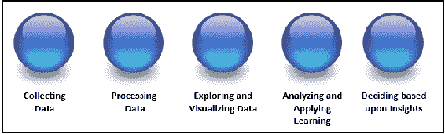
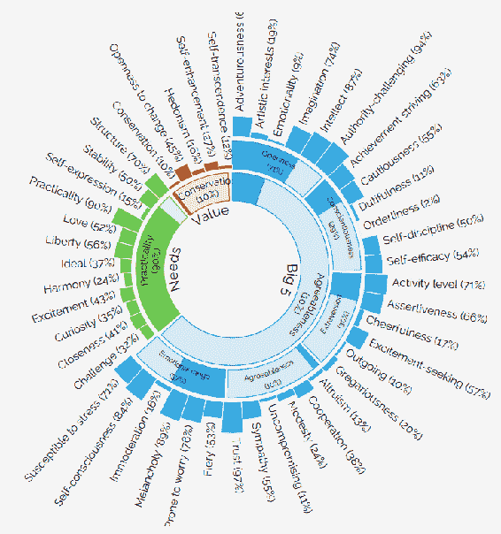

# 第二章：声明目标

本章介绍并解释了（再次从开发者的角度）数据科学统计学的基本目标，并向读者介绍了书中使用的关键术语和概念（带有解释和示例）。

在本章中，我们将内容拆解为以下几个主题：

+   数据科学的关键目标入门

+   将统计学引入数据科学

+   统计学和数据科学中常用的术语

# 数据科学的关键目标

如第一章中所提到的，*从数据开发者到数据科学家的过渡*，数据科学如何定义是一个主观问题。

我个人喜欢的解释是，数据科学是思想或步骤的进程，甚至更好的是，它是一个演变过程，如下图所示：

这种数据科学的演变（如前图所示）由一系列步骤或阶段组成，数据科学家在其中跟踪进展，包括以下内容：

+   数据收集

+   数据处理

+   探索和可视化数据

+   数据分析和/或应用机器学习（于数据）

+   基于获得的见解做决策（或规划）

尽管“进展”或“演变”暗示了一个顺序性的旅程，但在实践中，这是一个非常流动的过程；每个阶段都可能激发数据科学家反向并重复一个或多个阶段，直到他们感到满意。换句话说，过程中的所有或部分阶段可能会被重复，直到数据科学家认为已达成期望的结果。

例如，在仔细审查生成的可视化图表后（在*探索和可视化数据*阶段），可能会发现需要对数据进行额外处理，或者在进行任何合理的分析或学习之前，需要收集更多的数据。

你可以大致将数据科学过程与敏捷软件开发方法论进行比较，在这种方法中，开发者执行各种任务，分析结果，继续工作，重新审视工作，直到获得期望的结果或成果。

让我们解释数据科学演变的每一个阶段。

# 数据收集

这一点应该是显而易见的——没有（至少一些）数据，我们无法执行任何后续步骤（尽管有人可能会争论推断问题，但那是不合适的。数据科学中没有魔法。我们，作为数据科学家，不是从任何东西中创造出东西。推断（我们将在本章稍后定义）至少需要一些数据作为起点。

收集数据的一些新概念包括数据可以来自各种来源，数据源的数量和类型每天都在增长。此外，数据的收集方式可能需要数据开发者一种全新的视角；数据科学中的数据并不总是来自关系型数据库，而是来自机器生成的日志文件、在线调查、性能统计等；再次强调，这个列表仍在不断发展。

另一个值得思考的点是，收集数据也涉及补充。例如，数据科学家可能会发现需要为先前收集、处理和审核过的特定应用数据池添加额外的群体统计数据。

# 处理数据

数据的处理（或转换）是数据科学家编程技能发挥作用的地方（尽管你通常可以看到数据科学家在其他步骤中执行某种形式的处理，例如收集、可视化或学习）。

请记住，数据科学中涉及的处理方面有很多。最常见的包括格式化（和重新格式化），其涉及的活动如机械地设置数据类型、汇总值、重新排序或删除列等；数据清理（或处理数据质量），解决诸如默认值或缺失值、不完整或不合适的值等问题；以及数据分析，生成统计性的数据理解，为数据提供背景信息。

对数据进行的处理可以是简单的（例如，可能是一个非常简单且手动的事件，需要对 MS Excel 工作表中的数据进行重复更新），也可以是复杂的（如使用 R 或 Python 等编程语言），甚至更复杂（例如，当处理逻辑被编写到程序中时，这些程序可以被调度，并在新的数据群体上自动重新运行）。

# 探索与可视化数据

在整体数据科学流程的这一阶段或步骤中，数据科学家将使用各种方法深入挖掘数据。通常，会创建几个图形化的表示（再次强调，这些可能是手动完成的，也可能是通过编程脚本或工具生成的），以强调或验证数据科学家的观察、某个特定的观点或信念。这是数据科学流程中的一个重要步骤，因为数据科学家可能会意识到数据需要进一步处理，或者需要收集更多的数据，亦或是原始理论似乎得到了验证。这些发现将促使数据科学家停下来，反思接下来的步骤。数据科学家是否应该继续正式的分析过程，或许是创建一个自动化学习的预测模型？还是应该回到之前的步骤，收集更多（或不同的）数据进行处理？

**数据可视化**是一项关键技术，它使数据科学家能够快速执行分析，识别关键趋势或事件，并做出更有信心的决策。

# 分析数据和/或将机器学习应用于数据

在这一阶段，数据科学家（受到强烈的科学好奇心和经验驱动）会进行大量分析，试图基于观察或对数据理解的解释，构建一个故事。数据科学家继续切分和分析数据，使用分析或商业智能工具（如 Tableau、Pentaho，或者使用开源解决方案如 R 或 Python），创建具体的数据故事线。再次根据这些分析结果，数据科学家可能会选择返回到先前的阶段，提取新数据，进行处理和再处理，并创建额外的可视化效果。到了某个阶段，当进展适当时，数据科学家可能会决定开始数据分析。机器学习（将在本章后续详细定义）随着时间的推移，已从最初的模式识别演变为现在使用选定的统计方法深入挖掘，利用数据及本阶段分析的结果进行学习并做出预测。

数据科学家通过机器学习从数据中提取定量结果，并将其以每个人（不仅仅是其他数据科学家）能够立即理解的方式表达出来，这是一个宝贵的技能，我们将在本书中进一步探讨这一点。

# 基于获得的洞察做决策（或规划）

在此步骤中，数据科学家希望通过努力获得价值，并以洞察的形式呈现出来。通过执行之前描述的阶段，获得对特定情况或现象的理解，从而得到这个洞察。这个洞察随后可以作为输入，用于做出更好的决策。

一个有趣的例子，展示了从数据中挖掘洞察并创造性使用的过程，就是由 IBM Watson 支持的（截至本文撰写时，仍为实验性）Roztayger 人格匹配过程。使用你的 Facebook 或 Twitter 动态（或者你也可以输入简短的个人简介），Watson 会即时对你的个性进行分析。结果既有趣又非常精准，这些洞察随后被用来推荐最适合你及你个人风格的设计师品牌。

你可以在[`roztayger.com/match`](http://roztayger.com/match)找到这个功能。个性洞察服务根据一个人的写作方式提取个性特征。你可以使用该服务将个体与其他个体、机会和产品进行匹配，或通过个性化信息和推荐来定制他们的体验。特征包括大五人格特质、价值观和需求。建议使用至少 1,200 个字的输入文本。

一旦（实时）数据科学分析完成，前述网站不仅提供建议，还分享其洞察背后的数据，以易于理解、条理清晰的表格视图展示结果，同时也提供引人注目的可视化效果，如下图所示：

这展示了数据科学进展阶段的另一个关键方面，也就是，一旦数据科学家识别出某个洞察，他们必须清晰地展示和传达这些数据洞察/发现。

# 像数据科学家一样思考

正如我们之前强调的，数据科学家的定义和职责的共识仍在逐步形成。数据科学领域的整体定义至多是粗略的。转型为数据科学家的过程，也许更像是寻找一个与自己技能匹配的组织或团队，而不仅仅是理解数据科学所涉及的技能和概念，并朝着这些技能努力。

就像数据开发人员保持对数据操作和访问趋势及工具的了解一样，未来的数据科学家也应该如此。

# 将统计学引入数据科学

根据你的来源和个人信念，你可能会说以下内容：

*统计学就是数据科学，数据科学就是统计学*。

为了澄清这一点，请注意有一种流行的观点认为，统计学可以被视为一个涵盖数据收集、分析、解释、展示和组织的研究或过程。正如你所看到的，这一定义与我们在本章上一节中描述的数据科学过程非常相似。

深入探讨这个话题，我们会发现统计学总是涉及（或包含）一些技术或方法，用于帮助分析和展示数据（同样，这种理解也可以用来描述数据科学）。

在一些圈子里，人们普遍认为数据科学和统计学是同义词。当然，数据科学家之间对术语和概念的统一仍在不断演进。

# 常见术语

根据个人经验、研究以及各行各业专家的建议，深入学习数据科学的人应该抓住每一个机会，理解并积累以下常见数据科学术语的经验和熟练度：

+   统计学总体

+   概率

+   假阳性

+   统计推断

+   回归

+   拟合

+   分类数据

+   分类

+   聚类

+   统计比较

+   编码

+   分布

+   数据挖掘

+   决策树

+   机器学习

+   数据清洗和整理

+   可视化

+   D3

+   正则化

+   评估

+   交叉验证

+   神经网络

+   提升

+   提升率

+   众数

+   异常值

+   预测建模

+   大数据

+   置信区间

+   写作

# 统计总体

你或许可以将统计总体看作一个记录集（或一组记录）。这组记录将包含一些类似的项目或事件，数据科学家对此感兴趣，用于某些实验。

对于数据开发人员来说，数据总体可能是某个月份的所有销售交易记录，而关注点可能是向公司高层报告哪些产品是最快的畅销产品，以及在一年中的哪个时间段。

对于数据科学家来说，总体可能是某个月所有急诊室入院的记录，而关注点可能是确定急诊室使用的统计人口特征。

通常，**统计总体**和**统计模型**这两个术语可以互换使用。再次强调，数据科学家们在使用这些常用术语时不断发展和统一。

另一个关于统计总体的关键点是，记录集可能是一个（实际上）存在的对象组，或者是一个假设的对象组。以之前的例子为例，实际对象可以是该月记录的实际销售交易，而假设对象则是预计、预测或假定（基于观察或经验假设或其他逻辑）将在一个月内发生的销售交易。

最后，通过使用统计推断（将在本章后面解释），数据科学家可以选择记录集（或总体）的一部分或子集，目的是使其代表某一特定领域的总总体。这个子集被称为**统计样本**。

如果准确地选择了一个总体样本，可以根据样本的相应特征估算整个总体（该样本所来自的总体）的特征。

# 概率

概率关注的是支配随机事件的法则。

-www.britannica.com

在思考概率时，你会想到可能发生的事件以及它们实际上发生的可能性。这与统计思维过程相比较，后者涉及分析过去事件的频率，以试图解释或理解观察到的现象。此外，数据科学家还会关联各种个体事件，研究这些事件之间的关系。这些不同事件之间的关系决定了我们在研究它们的概率时需要遵循的方法和规则。

概率分布是一个表格，用于显示样本总体或记录集中的各种结果的概率。

# 假阳性

假阳性的概念是一个非常重要的统计学（数据科学）概念。假阳性是一个错误或失误的结果。也就是说，这是一个场景，其中过程或实验的结果表明条件已满足或为真，但实际上该条件并不成立（未满足）。这种情况也被一些数据科学家称为假警报，最容易理解的是考虑记录集或统计总体的概念（我们在本节前面讨论过），它不仅由处理的准确性决定，还由所抽取样本总体的特征决定。换句话说，数据科学家在统计过程中犯了错误，或者记录集是一个没有适当样本（或特征）的总体，无法满足正在研究的条件。

# 统计推断

哪个开发者在职业生涯中某个时刻没有创建过样本或测试数据？例如，我常常会创建一个简单的脚本来生成一个随机数（基于可能的选项或选择的数量），然后将这个数字作为选中的选项（在我的测试记录集中）。这在数据开发中可能运作得很好，但在统计学和数据科学中，这是不够的。

为了创建样本数据（或样本总体），数据科学家将使用一个叫做**统计推断**的过程，这个过程通过分析你拥有或尝试生成的数据来推断潜在分布的选项。这个过程有时也称为**推断统计分析**，包括测试各种假设并得出估计值。

当数据科学家确定记录集（或总体）应比实际更大时，假设该记录集是来自更大总体的样本，数据科学家会利用统计推断来弥补差距。

正在使用的数据或记录集被数据科学家称为观测数据。推断统计学可以与描述性统计学进行对比，后者仅关注观测数据的属性，并不假设记录集来自更大的总体。

# 回归

回归是一个过程或方法（由数据科学家根据当前实验的需要选定为最佳拟合技术），用于确定变量之间的关系。如果你是程序员，你对变量有一定的理解，但在统计学中，我们对这个术语的使用有所不同。变量被判定为依赖变量或独立变量。

独立变量（也称为**预测变量**）是数据科学家操控的变量，目的是确定它与依赖变量的关系。依赖变量是数据科学家正在测量的变量。

在数据科学的进程或实验中，出现多个自变量并不罕见。

更准确地说，回归是一个帮助数据科学家理解当一个或多个自变量变化时，而其他自变量保持固定时，因变量（或标准变量）的典型值如何变化的过程。

# 拟合

拟合是衡量统计模型或过程如何描述数据科学家关于记录集或实验的观察结果的过程。这些度量将试图指出观察值和可能值之间的差异。模型或过程的可能值称为分布或概率分布。

因此，概率分布拟合（或分布拟合）是指数据科学家将概率分布拟合到关于变量现象重复测量的一系列数据上。

数据科学家进行分布拟合的目标是预测某一现象在特定时间间隔内发生的概率或预测其发生频率。

拟合的一个常见用途是测试两个样本是否来自相同的分布。

数据科学家可以选择的概率分布有很多种。一些分布比其他分布更适合观察到的数据频率。拟合得较好的分布应该能做出好的预测；因此，数据科学家需要选择适合数据的分布。

# 分类数据

之前，我们解释了数据中的变量可以是自变量或因变量。另一种变量定义是分类变量。这种变量是指可以取有限且通常固定的可能值之一，从而将每个个体分配到特定类别。

经常情况下，收集到的数据含义不明确。分类数据是数据科学家可以用来为数据赋予含义的一种方法。

例如，如果收集了一个数值变量（假设发现的值为 4、10 和 12），如果这些值被分类，变量的含义就会变得清晰。假设根据对数据收集方式的分析，我们可以通过指明这些数据描述的是大学生，并且以下是运动员的数量：

+   4 名网球运动员

+   10 名足球运动员

+   12 名足球运动员

现在，因为我们将数据分组为类别，含义变得清晰。

其他一些分类数据的例子可能是个人宠物偏好（按宠物类型分组），或汽车拥有情况（按所拥有的汽车类型分组）等等。

因此，分类数据，顾名思义，是将数据分组到某种类别或多个类别中。一些数据科学家将类别称为数据的子人群。

分类数据也可以是收集的是“是”或“否”的答案。例如，医院接纳数据可能表明患者是否吸烟。

# 分类

数据的统计分类是识别数据点、观测值或变量应归入哪个类别（在前一部分讨论过）的过程。执行分类过程的数据科学过程被称为**分类器**。

判断一本书是小说还是非小说是一个简单的分类例子。对餐馆数据的分析可能会将它们分类为多个类型。

# 聚类

聚类是将数据出现的实例划分为组或同质子集的过程，不同于分类（如前一部分所述）中预设的组，而是通过执行数据科学过程，基于它在实例中发现的相似性来识别的组。

位于同一组中的对象（该组也称为簇）被发现比与其他组中的对象（或其他簇中的对象）相比更为相似（在某种程度上）。聚类过程在探索性数据挖掘中非常常见，也是统计数据分析中的常用技术。

# 统计比较

简而言之，当你听到统计比较这个术语时，通常指的是数据科学家执行分析过程，以查看两个或多个组或种群（或记录集）之间的相似性或差异。

作为数据开发人员，可能熟悉各种工具，如 FC Compare、UltraCompare 或 WinDiff，它们旨在为开发人员提供两个或更多文件（甚至二进制文件）内容的逐行比较。

在统计学（数据科学）中，这一比较过程是一种统计技术，用于比较种群或记录集。在这种方法中，数据科学家将执行所谓的**方差分析**（**ANOVA**），比较分类变量（在记录集内）等。

ANOVA 是一种统计方法，用于分析组均值之间的差异及其相关过程（例如组间、组内或记录集之间的变异）。该方法最终演变为六西格玛数据集比较。

# 编码

编码或统计编码是数据科学家在准备数据进行分析时使用的过程。在这个过程中，定量数据值（如收入或教育年限）和定性数据（如种族或性别）都以一致的方式进行分类或编码。

数据科学家进行编码的原因有多种，具体如下：

+   更有效地运行统计模型

+   计算机理解变量

+   责任制——使数据科学家能够盲目地运行模型，或者在不知晓变量代表什么的情况下运行，以减少编程/作者偏见。

你可以将编码过程视为将数据转化为系统或应用所需形式的手段。

# 分布

统计记录集（或人口）的分布是一个可视化，展示数据的所有可能值（或有时称为区间）及其发生频率。当数据科学家创建分类数据的分布（我们在本章前面定义过的分类数据）时，试图展示每个组或类别中的个体数量或百分比。

将之前定义的术语与此术语“概率分布”联系起来，简单来说，概率分布可以被看作是一个可视化图，展示在实验中不同可能结果发生的概率。

# 数据挖掘

在第一章《从数据开发者到数据科学家》中，我们提到，数据挖掘通常更专注于数据关系（或数据点之间的潜在关系，有时称为变量）和认知分析。

为了进一步定义这一术语，我们可以提到，数据挖掘有时更简单地被称为知识发现，甚至仅称为发现，基于从新的或不同的视角处理或分析数据，并将其总结为可用于增加收入、削减成本或两者兼得的有价值的见解。

使用专门的用于数据挖掘的软件只是数据挖掘几种分析方法之一。尽管有专门的工具（如 IBM Cognos BI 和 Planning Analytics、Tableau、SAS 等），数据挖掘的核心是通过分析过程发现数据中的字段之间的相关性或模式，这可以通过 MS Excel 或其他许多开源技术有效完成。

数据挖掘的一种常见技术是通过使用如 R 或 Python 之类的工具创建自定义脚本。通过这种方式，数据科学家能够根据项目的具体需求定制逻辑和处理过程。

# 决策树

统计决策树使用一种看起来像树的图示结构。这种结构试图表示可选的决策路径以及每个选定路径的预测结果。数据科学家将使用决策树来支持、跟踪和建模决策制定及其可能的后果，包括偶然事件结果、资源成本和效用。这是一种常见的数据科学过程逻辑展示方式。

# 机器学习

机器学习是数据科学中最具吸引力和令人兴奋的领域之一。它唤起了与人工智能相关的各种形象，包括神经网络、**支持向量机**（**SVM**）等。

从根本上说，我们可以将机器学习这一术语描述为一种训练计算机的方法，通过数据或更具体地说，数据中的关系来做出或改善预测或行为。继续来说，机器学习是一个基于在数据中识别到的模式进行预测的过程，并且它具有从数据模式中持续学习的能力，因此能够不断做出更好的预测。

有人将机器学习的过程误认为数据挖掘并不罕见，但数据挖掘更多地侧重于探索性数据分析，并被称为**无监督学习**。

机器学习可以用来学习并建立各种实体的基线行为特征，然后寻找有意义的异常情况。

这里是激动人心的部分：机器学习的过程（使用数据关系做出预测）被称为**预测分析**。

预测分析使数据科学家能够通过从历史关系和数据中的趋势中学习，做出可靠的、可重复的决策和结果，并揭示隐藏的见解。

# 数据清洗和整理

**数据清洗**和**数据整理**这两个术语是时髦词或行话，旨在描述某人在某种程度上对数据、记录集或文件格式进行调整的努力，以便为后续的处理和/或评估做准备。

在数据开发中，您很可能已经熟悉了**提取**、**转换**和**加载**（**ETL**）的概念。在某种程度上，数据开发人员可能会在 ETL 过程中的转换步骤中对数据进行清洗或整理。

常见的数据清洗和整理可能包括去除标点符号或 HTML 标签、数据解析、过滤、各种转换、映射，以及将不专门设计为互操作的系统和接口结合起来。数据清洗还可以描述将原始数据处理或过滤成另一种形式，以便在其他地方更方便地使用。

数据清洗和整理可能在数据科学过程中多次执行，或者在不断发展的过程中不同的步骤中进行。有时，数据科学家使用数据清洗来包括各种数据可视化、数据聚合、训练统计模型以及其他许多潜在的工作。至此，数据清洗和整理可能遵循一个流程，从提取原始数据开始，使用各种逻辑进行数据清洗，最后将结果内容放入结构中以供使用。

虽然有许多有效的选项可以进行数据清洗和整理、预处理和操作，但目前许多数据科学家喜爱的工具是名为**Trifecta**的产品，它声称是许多行业中排名第一的数据整理解决方案。

**Trifecta**可以从[`www.trifacta.com/`](https://www.trifacta.com/)下载进行个人评估。去看看吧！

# 可视化

使用数据可视化技术的主要目的是让复杂的内容看起来简单（尽管还有其他目标）。你可以把可视化看作是任何一种创建图形（或类似的方式）以传达信息的技术。

使用数据可视化的其他动机包括以下几点：

+   解释数据或将数据置于上下文中（即突出显示人口统计统计信息）

+   解决特定问题（例如，识别特定商业模型中的问题领域）

+   探索数据以更好地理解或增加清晰度（例如，这些数据跨越了哪些时间段？）

+   突出或说明那些无法直接看见的数据（例如，隔离数据中的异常值）

+   进行预测，例如潜在的销售量（可能基于季节性销售统计数据）

+   以及其他

统计可视化几乎应用于数据科学过程中的每一个步骤，包括显而易见的步骤如探索和可视化、分析和学习，但也可以在收集、处理以及使用识别出的洞察力的最终阶段发挥作用。

# D3

D3 或`D3.js`本质上是一个开源的 JavaScript 库，旨在使用现代网络标准可视化数据。D3 通过使用**可缩放矢量图形**（**SVG**）、Canvas 和标准 HTML 来帮助赋予数据生命。

D3 结合了强大的可视化和交互技术，并采用基于数据的 DOM 操作方法，为数据科学家提供了现代浏览器的全部功能，并且有自由设计出最佳视觉界面的能力，以最准确地展现目标或假设。

与许多其他库不同，`D3.js`允许对数据可视化进行极高的控制。D3 嵌入在 HTML 网页中，并使用预构建的 JavaScript 函数选择元素、创建 SVG 对象、设置样式、或添加过渡、动态效果等。

# 正则化

正则化是数据科学家用来改善统计模型或数据科学过程生成的结果的一种可能方法，尤其是在处理统计学和数据科学中的过拟合问题时。

我们在本章之前定义了拟合（拟合描述了统计模型或过程如何很好地描述数据科学家对观察结果的解释）。过拟合是一种情况，在这种情况下，统计模型或过程似乎拟合得过于完美，或者看起来与实际数据过于接近。

过拟合通常发生在一个过于简单的模型中。这意味着你可能只有两个变量，并且根据这两个变量得出结论。例如，使用我们之前提到的*水仙花销售*的例子，可能会生成一个以温度为自变量，以销售为因变量的模型。你可能会看到该模型失败，因为简单地得出温暖的天气总是带来更多的销售并不成立。

在这个例子中，通常会通过向过程或模型中添加更多数据来希望获得更好的结果。这个想法听起来是合理的。例如，你有一些信息，如平均降水量、花粉计数、化肥销售量等；这些数据点可以作为解释变量添加进来吗？

解释变量是一种独立变量，但有着微妙的区别。当一个变量是独立的时，它完全不受任何其他变量的影响。当一个变量不完全独立时，它就是一个解释变量。

继续向模型中添加更多数据会产生一定效果，但可能会导致过拟合，导致预测结果不准确，因为它会与数据高度相似，而这些数据大多只是背景噪声。

为了克服这种情况，数据科学家可以使用正则化，引入一个调节参数（附加因素，如数据点的均值或最小/最大限制，使你能够改变模型的复杂度或平滑度），以解决不适定问题或防止过拟合。

# 评估

当数据科学家评估一个模型或数据科学过程的性能时，这被称为评估。性能可以通过多种方式定义，包括模型学习的增长，或模型通过额外经验（例如更多轮训练以及更多数据样本）来改进学习的能力（以获得更好的分数），或结果的准确性。

评估模型或过程性能的一个流行方法被称为**自助法抽样**。这种方法通过反复生成结果，来检查在特定数据子集上的表现，这些结果可以用来计算准确度（性能）的估算值。

自助法抽样方法（bootstrap sampling）从数据中随机抽取样本，将其分成三个文件——训练文件、测试文件和验证文件。模型或过程逻辑是基于训练文件中的数据开发的，然后使用测试文件进行评估（或测试）。这个“调优然后测试”的过程会重复进行，直到数据科学家对测试结果感到满意。到那时，模型或过程会再次进行测试，这次使用的是验证文件，结果应该能真实反映其表现如何。

你可以想象使用自助法`抽样`方法通过分析测试数据来开发程序逻辑，确定逻辑流程，然后将你的逻辑与测试数据文件进行对比测试。一旦你确信你的逻辑处理了测试数据中的所有条件和异常，你可以对一个新的、未曾见过的数据文件进行最终验证测试。

# 交叉验证

交叉验证是一种评估数据科学过程性能的方法。主要用于预测建模，以估计模型在实际中的表现准确性，交叉验证通常用于检查模型如何潜在地进行泛化，换句话说，就是模型如何将从样本中推断出的信息应用到整个群体（或记录集）上。

在交叉验证中，你需要确定一个（已知的）数据集作为验证数据集，在这个数据集上进行训练，并使用一个未知数据集（或首次出现的数据）对模型进行测试（这就是你的**测试数据集**）。其目的是确保诸如过拟合（允许不完全的信息影响结果）等问题得到控制，同时提供有关模型如何在实际问题或实际数据文件上进行泛化的洞察。

交叉验证过程将包括将数据划分为相似子集的样本，对一个子集（称为**训练集**）进行分析，并在另一个子集（称为**验证集**或**测试集**）上验证分析结果。为了减少变异性，交叉验证会进行多次迭代（也称为**折叠**或**轮次**），使用不同的划分方式，验证结果会在多个轮次中求平均。通常，数据科学家会利用模型的稳定性来确定应执行多少轮交叉验证。

# 神经网络

神经网络也被称为**人工神经网络**（**ANNs**），其目标是以与人类大脑相同的方式解决问题。

Google 将在《神经网络入门：第一部分，Maureen Caudill，AI 专家，1989 年 2 月》中提供以下关于 ANN 的解释：

一个计算系统由多个简单且高度互联的处理元素组成，这些处理元素通过对外部输入的动态状态响应来处理信息。

为了简化神经网络的概念，可以回想一下软件封装的概念，考虑一个包含输入层、处理层和输出层的计算机程序。理解这一点后，你会明白，神经网络也组织成这些层的网络，通常不止一个处理层。

模式通过输入层呈现给网络，随后传递给一个或多个处理层（实际处理发生的地方）。处理层再与输出层相连接，结果在此呈现。

大多数神经网络还会包含某种形式的学习规则，通过该规则根据所呈现的输入模式修改连接的权重（换句话说，网络会学习哪些处理节点表现更好，并给予其更大的权重）。通过这种方式（从某种意义上说），神经网络像孩子通过接触猫的例子来学习识别猫一样，通过示例进行学习。

# 提升法

可以说，提升是数据科学中普遍接受的一种过程，用于提高弱学习数据科学过程的准确性。

被定义为弱学习者的数据科学过程是指那些产生的结果仅比随机猜测的结果略好。弱学习者基本上是阈值或单层决策树。

具体来说，提升的目标是在监督学习中减少偏差和方差。

我们所说的偏差和方差是什么意思？在进一步讨论提升之前，让我们先了解一下偏差和方差的含义。

数据科学家将偏差描述为在数据收集过程中存在的一种偏爱程度，导致结果不均衡、不真实，并且可能以多种不同的方式发生。如果一个`采样`方法系统地偏向某些结果而非其他结果，则称该方法为**有偏的**。

方差可以简单地定义为一个变量均值的距离（或者结果距离平均值的远近）。

提升方法可以描述为数据科学家反复执行数据科学过程（该过程已被确定为弱学习过程），每次迭代都使用从原始总体记录集随机抽取的不同数据样本。每次运行产生的所有结果（或分类器或残差）随后会被合并为一个单一的合并结果（即梯度）。

每次迭代使用原始记录集的随机子集这一概念，源自于袋装法中的自助采样，并对合并模型具有类似的方差降低效果。

此外，一些数据科学家认为提升是将弱学习者转化为强学习者的一种方式；事实上，对于某些人来说，提升过程仅仅意味着将弱学习者转化为强学习者。

# 提升

在数据科学中，"提升"（lift）一词用于比较记录集或总体中观察到的模式的频率与通过随机或偶然方式在数据中出现该模式的预期频率。

如果提升值非常低，那么通常，数据科学家会认为识别出的模式很可能只是偶然发生的。提升值越大，模式越有可能是真实的。

# 众数

在统计学和数据科学中，当数据科学家使用“众数”一词时，他或她指的是在数据样本中出现频率最高的值。众数不是通过计算得到的，而是通过手动确定或通过处理数据来确定的。

# 异常值

异常值可以定义如下：

+   与其他数据点差异极大的数据点

+   那些不符合其他数据点的异常数据

+   一个非常高的值或非常低的值

+   数据中的异常观察

+   与其他所有数据点相距较远的观察点

# 预测建模

统计模型和/或数据科学过程的发展，旨在预测未来事件，称为**预测建模**。

# 大数据

再次提到，我们对于大数据的定义有所不同。大数据通常被定义为数据量庞大或复杂，以至于传统的数据处理应用无法胜任，并且涉及我们生活的各个方面。2001 年，时任 Gartner 分析师的 Doug Laney 提出了 3V 概念。

你可以参考这个链接：[`blogs.gartner.com/doug-laney/files/2012/01/ad949-3D-Data-Management-Controlling-Data-Volume-Velocity-and-Variety.pdf`](http://blogs.gartner.com/doug-laney/files/2012/01/ad949-3D-Data-Management-Controlling-Data-Volume-Velocity-and-Variety.pdf)

根据 Laney 的定义，3V 是体积、种类和速度。3V 构成了大数据的维度：体积（或数据的可衡量数量）、种类（即数据的类型数量）和速度（指处理或处理数据的速度）。

# 置信区间

置信区间是数据科学家在估算值周围指定的一系列值，用于表示他们的误差范围，并结合一个概率，表示某个值落入该范围的可能性。换句话说，置信区间是对未知总体参数的良好估计。

# 写作

尽管在展示数据科学过程或预测模型的输出或结果时，可视化通常更为引人注目，但写作技巧仍然是数据科学家交流的重要部分，而且仍然被认为是所有数据科学家成功的关键技能。

# 总结

在这一章中，我们提到，当前数据科学的定义是一个意见问题。一个实际的解释是，数据科学是思想的一种进展，甚至更好地说，是一种演变，包括收集、处理、探索和可视化数据，分析（数据）和/或应用机器学习（到数据中），然后基于获得的洞察做出决策（或规划）。

接着，为了让你像数据科学家一样思考，我们介绍并定义了一些数据科学家应该熟悉的常见术语和概念。

在下一章中，我们将介绍并解释数据开发人员如何使用几种常见的统计方法理解和处理数据清洗的主题。
