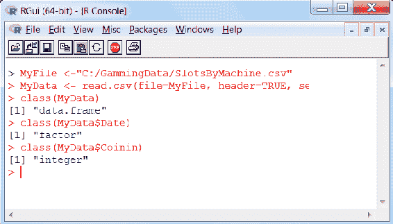

# 第三章：开发人员如何处理数据清理

本章讨论了开发人员如何运用几种常见的统计方法理解并处理**数据清理**这一话题。

本章我们将内容分为以下几个话题：

+   理解基础数据清理

+   使用 R 检测和诊断常见的数据问题，例如缺失值、特殊值、离群值、不一致性和本地化问题

+   使用 R 解决高级统计问题，例如数据转换、推导修正和确定性填补

# 理解基础数据清理

在任何统计项目中，拥有干净（因此可靠）的数据至关重要。脏数据，即使在正确的统计实践下，也可能是不可靠的，可能导致得出错误的行动建议，甚至可能造成伤害或经济损失。曾有人指出，数据科学家几乎 90%的时间都花在清理数据上，只有 10%的时间用于实际建模和从数据中得出结果。

那么，数据清理到底是什么呢？

数据清理也称为数据清洗或数据去污，涉及到检测和解决数据集中的错误、遗漏和不一致性问题。

这可以通过数据整理工具进行交互式处理，或者通过脚本批量处理。本书将使用 R 语言，因为它非常适合数据科学，能够处理非常复杂的数据集，支持通过各种建模功能对数据进行处理，甚至可以通过几行代码生成可视化数据，来证明理论和假设。

在清理过程中，首先使用逻辑来检查和评估数据池，以建立数据的质量水平。数据质量的高低可以受到数据录入、存储和管理方式的影响。清理过程可能涉及纠正、替换或直接删除数据点或整个实际记录。

清理过程不应与验证过程混淆，它们是不同的。验证过程通常在数据捕获时（即录入时）进行，是一个通过或不通过的过程，而不是在数据处理后，为某个特定目的进行的操作。

作为数据开发人员，不应对数据清理的概念或提升数据质量的重要性感到陌生。数据开发人员还会同意，数据质量的处理过程需要定期的常规评审和评估，实际上，大多数组织都有企业级工具和/或流程（或者至少有相关政策）来定期预处理和清理企业数据。

如果你感兴趣的话，市面上有许多免费的和付费的工具可以尝试，包括 iManageData、Data Manager、DataPreparator（Trifecta）Wrangler 等。从统计学的角度来看，最受欢迎的选择包括 R、Python 和 Julia。

在你处理数据中的具体问题之前，你需要先检测到它们。检测这些问题要求你根据目标的背景，确定什么可以被视为问题或错误（后面这一节会有更多的内容）。

# 常见的数据问题

我们可以将数据难题分为几个组。最普遍接受的（数据问题）分类包括：

+   **准确性**：数据不准确有很多种类型，最常见的例子包括数学错误、超出范围的值、无效值、重复等。

+   **完整性**：数据源可能会缺少某些列的值，缺少整列数据，甚至缺少完整的交易。

+   **更新状态**：作为质量保证的一部分，你需要建立数据刷新或更新的节奏，并且能够判断数据最后一次保存或更新的时间。这也被称为延迟。

+   **相关性**：这涉及识别并消除在特定目标下不需要或不相关的信息。例如，如果你的研究目标是个人护理产品，那么去除关于腌黄瓜的销售交易就是一个例子。

+   **一致性**：通常需要交叉参考或转换数据源中的信息。例如，记录的病人调查反馈可能需要转换为一个一致的指标，以便以后简化处理或可视化。

+   **可靠性**：这主要关注确保数据收集方法能产生一致的结果。常见的数据保障流程包括建立基准线和范围，然后定期验证数据结果是否符合预期。例如，通常有混合的注册民主党和共和党选民的地区，如果数据突然变为 100%的单一党派，就需要进行调查。

+   **适用性**：当数据适合预定的用途时，就被认为是合适的；这可能是主观的。例如，假设假期交通影响了购买习惯（美国国旗在阵亡将士纪念日一周的销售量增加并不表示这是一个平均或预期的每周行为）。

+   **可访问性**：有趣的数据可能会被大量无关数据所淹没，从而降低了有趣数据的质量，因为它变得难以访问。这在大数据项目中尤其常见。此外，安全性也可能影响数据的质量。例如，某些计算机可能会被排除在捕获的日志文件之外，或某些与健康相关的信息可能被隐藏，未包含在共享的病人数据中。

# 上下文数据问题

很多前面提到的数据问题可以被自动检测到，甚至可以被修正。这些问题最初可能是由用户输入错误、传输或存储过程中的损坏，或者由不同数据源中相似实体的不同定义或理解所引起的。在数据科学中，还有更多需要考虑的事项。

在数据清洗过程中，数据科学家会尝试根据对数据背景及其预期用途的假设或假定，识别数据中的模式。换句话说，任何数据科学家认为明显与数据假设或目标无关，或明显不准确的数据都会被处理。这个过程依赖于数据科学家的判断力以及他或她确定哪些数据点有效，哪些无效的能力。

依赖人类判断时，总有可能忽视或错误处理那些没有充分考虑在数据科学家假设/假定中的有效数据点。因此，保持适当标签的清洗数据版本是一种常见的做法。

# 清洗技术

通常，数据清洗过程围绕识别那些异常数据点展开，或者识别那些由于不符合数据科学家所看到或感兴趣的数据模式而显得突出的数据点。

数据科学家使用各种方法或技术来识别数据中的异常值。一种方法是绘制数据点图，然后通过视觉检查结果图，找出那些远离整体分布的数据点。另一种技术是通过编程方式删除所有不符合数据科学家数学控制限制的数据点（这些限制基于统计项目的目标或意图）。

其他数据清洗技术包括：

+   **有效性检查**：有效性检查涉及应用规则来判断数据是否有效。这些规则可以是全局性的；例如，如果数据池中包含特定唯一键（例如社会安全号码不能重复），数据科学家可以进行唯一性检查；也可以是案例级的，例如当某些字段值的组合必须是特定值时。验证可以是严格的（例如删除缺失值的记录），也可以是模糊的（例如修正与现有已知值部分匹配的值）。

+   **增强**：这是一种通过添加相关信息使数据完整的技术。额外的信息可以通过使用数据文件中的现有值计算得出，也可以从其他来源添加。这些信息可以用于参考、比较、对比或展示趋势。

+   **标准化**：在数据标准化过程中，数据值会被转换或映射到其他更为理想的值。

+   **标准化**：这涉及将参考数据集转换为新的标准。例如，使用标准代码。

+   **领域专业知识**：这涉及根据数据科学家的经验或最佳判断，删除或修改数据文件中的数据值。

我们将在本章的接下来的部分中逐一讲解这些技术的例子。

# R 与常见数据问题

让我们从一些关于 R 的背景知识开始。R 是一种易学的语言和环境，天生非常灵活，专注于统计计算，因而成为处理、清洗、汇总、生成概率统计等的绝佳选择。

此外，还有一些使用 R 进行数据清洗的其他原因：

+   它被大量数据科学家使用，所以它不会很快消失

+   R 是平台独立的，因此你所创建的内容几乎可以在任何地方运行

+   R 有非常棒的帮助资源——只需谷歌一下，你就能找到！

# 异常值

对异常值最简单的解释是，异常值就是那些与其他数据点不相符的数据点。观察时，任何特别高、特别低，或在你项目的上下文中显得特别不寻常的数据，都可以视为异常值。作为数据清洗的一部分，数据科学家通常会识别异常值，然后采用公认的方法来处理这些异常值：

+   删除异常值，甚至删除包含异常值的实际变量

+   转换值或变量本身

让我们来看一个使用 R 识别并解决数据异常值的真实世界例子。

在游戏世界中，老虎机（是一种通过将硬币插入插槽并拉动手柄来操作的赌博机器，手柄决定了支付的结果）非常受欢迎。如今大多数老虎机是电子的，因此它们被编程成可以持续追踪所有活动的方式。在我们的例子中，赌场的投资者希望利用这些数据（以及各种补充数据）来推动他们的盈利策略调整。换句话说，什么样的老虎机更能带来盈利？是机器的主题还是类型？新型机器比旧型或复古机器更有利可图吗？机器的物理位置如何？低面额的机器更有利可图吗？我们尝试通过异常值来寻找答案。

我们得到一组游戏数据（格式为逗号分隔或 CSV 文本文件），其中包括老虎机的位置、面额、月份、日期、年份、机器类型、机器年龄、促销活动、优惠券、天气和投币金额（即插入机器的总金额减去支付出的金额）。作为数据科学家的第一步，我们需要审查（有时称为**分析**）数据，查看是否存在异常值。第二步是处理这些异常值。

# 步骤 1 – 数据分析

R 使这一步变得非常简单。虽然有很多种方式可以编写解决方案，但我们尽量保持实际程序代码或脚本的行数最小。我们可以从在 R 会话中定义 CSV 文件作为一个变量（命名为 `MyFile`）开始，然后将文件读取到 R 的 `data.frame`（命名为 `MyData`）中：

```py
MyFile <-"C:/GammingData/SlotsResults.csv" 
MyData <- read.csv(file=MyFile, header=TRUE, sep=",") 
```

在统计学中，`boxplot` 是一种简单的方式，可以了解统计数据集的形状、变异性和中心（或中位数），因此我们将使用 `boxplot` 来查看我们的数据，看看能否识别出 `Coin-in` 的中位数，并确定是否存在离群值。为此，我们可以请求 R 绘制文件中每台老虎机的 `Coin-in` 值，使用 `boxplot` 函数：

```py
boxplot(MyData[11],main='Gamming Data Review', ylab = "Coin-in") 
```

`Coin-in` 是文件中的第 11 列，因此我在函数 `boxplot` 中明确将其作为参数。为了保持简洁，我还添加了可选的参数（继续简化代码），这些参数为可视化图形添加了标题。

执行之前的脚本后，我们得到了以下图形。注意中位数（通过 `boxplot` 中穿过盒子的线表示）以及四个离群值：


# 步骤 2 – 处理离群值

现在我们看到数据中确实存在离群值，我们可以处理它们，避免它们对我们的研究产生不利影响。首先，我们知道负的 `Coin-in` 值是不合逻辑的，因为机器不能发放超过已经投入的硬币。根据这一规则，我们可以简单地删除文件中所有 `Coin-in` 值为负的记录。再次地，R 使这变得很简单，我们将使用 `subset` 函数来创建一个新的 `data.frame`，该数据框只包含那些 `Coin-in` 值非负的记录（或案例）。

我们将把这个 `subset` 数据框命名为 `noNegs`：

```py
noNegs <- subset(MyData, MyData[11]>0) 
```

然后，我们将重新绘制图形，确保已经删除了负的离群值：

```py
boxplot(noNegs[11],main='Gamming Data Review', ylab = "Coin-in")
```

这生成了一个新的 `boxplot`，如下面的截图所示：


我们可以使用相同的方法来删除极端的正 `Coin-in` 值（大于 $1,500 的值），通过创建另一个 `subset`，然后重新绘制：

```py
noOutliers <-subset(noNegs, noNegs[11]<1500) 
boxplot(noOutliers[11],main='Gamming Data Review', ylab = "Coin-in") 
```

在处理数据的不同迭代过程中，建议你保存大部分（如果不是所有的话）版本的数据显示，特别是保存最重要的版本。你可以使用 R 的 `write.csv` 函数：

```py
write.csv(noOutliers, file = "C:/GammingData/MyData_lessOutliers.csv") 
```

大多数数据科学家采用统一的命名约定，贯穿整个项目（如果不是所有项目的话）。你的文件名应该尽可能明确，以便以后节省时间。此外，尤其是在处理大数据时，你还需要注意磁盘空间。

前面代码的输出结果如下：


# 领域专业知识

接下来，另一种数据清理技巧是基于领域知识进行数据清理。这并不复杂。这种技巧的关键是利用数据中没有的额外信息。例如，之前我们排除了具有负值的 `Coin-in` 数据，因为我们知道负的 `Coin-in` 数值是不可能的。另一个例子可能是当飓风桑迪袭击美国东北部时。在那段时间里，大多数机器的 `Coin-in` 数值非常低（如果不是零的话）。数据科学家可能会基于这些信息，移除特定时间段的数据。

# 有效性检查

正如我在本章之前提到的，交叉验证是指数据科学家对数据池中的数据应用规则。

有效性检查是最常见的统计数据清理形式，是数据开发人员和数据科学家最有可能（至少有些）熟悉的过程。

清理数据时可以使用任何数量的有效性规则，这些规则将依赖于数据科学家的预期目的或目标。这些规则的示例包括：数据类型（例如，一个字段必须是数值类型）、范围限制（数字或日期必须落在某个范围内）、必填（值不能为空或缺失）、唯一性（字段或字段组合必须在数据池内唯一）、集合成员（即值必须是某个离散列表的成员）、外键（某些值在某个案例中必须定义为某个规则的成员或符合该规则）、正则表达式匹配（即验证值是否符合预定的格式）、以及跨字段验证（即一个案例中的多个字段组合必须符合某个特定条件）。

让我们看一些前述的示例，首先从数据类型转换（也叫 **强制转换**）开始。R 提供了六个强制转换函数，方便使用：

+   `as.numeric`

+   `as.integer`

+   `as.character`

+   `as.logical`

+   `as.factor`

+   `as.ordered`

+   `as.Date`

这些函数，加上一点 R 知识，可以使得将数据池中的一个值转换变得相当简单。例如，使用之前的 GammingData 为例，我们可能会发现生成了一个新的游戏结果文件，且年龄值被保存为字符串（或文本值）。为了清理这些数据，我们需要将值转换为数值类型。我们可以使用以下一行 R 代码快速转换文件中的值：

```py
noOutliers["Age"]<-as.numeric(noOutliers["Age"]) 
```

一点提示：使用这种简单的方法，如果任何值无法转换，它将被设置为 **NA** 值。在类型转换中，真正的工作是理解一个值需要转换成什么类型，当然，还有哪些数据类型是有效的；R 语言有多种数据类型，包括标量、向量（数值型、字符型、逻辑型）、矩阵、数据框和列表。

我们在这里查看的另一个数据清理领域是正则表达式模式的处理。在实际操作中，特别是当处理来自多个来源的数据时，数据科学家无疑会遇到一些字段，它们的格式不符合要求（例如目标任务的格式），或者字段值格式不一致（这可能会导致错误的结果）。一些例子包括日期、社会保障号码和电话号码。对于日期，视来源而定，你可能需要重新输入（如前所述），但通常情况下，你还需要将这些值重新格式化成一个可用的格式，符合你的目标。

重新输入日期是很重要的，这样 R 才知道使用该值作为实际日期，并且你可以正确地使用各种 R 数据函数。

一个常见的例子是，当数据包含日期字段，格式可能是`YYYY/MM/DD`，你想进行时间序列分析，展示每周的总和，或者进行其他操作，这些操作需要使用日期值，但可能需要重新格式化日期，或者你仅仅需要它作为一个真正的 R 日期对象类型。假设我们有一个新的 Gamming 文件——这个文件只有两列数据：`Date` 和 `Coinin`。这个文件是一个收集的 `Coinin` 值的转储，针对一个老虎机的每一天数据。

我们新文件中的记录（或案例）看起来像以下截图：


数据科学家可以使用多种清理方法。首先，验证这些数据点的每种数据类型。我们可以使用 R 函数 `class` 来验证文件的数据类型。首先（正如我们在前面的例子中做的），我们将 CSV 文件读入一个 R 数据框对象中：

```py
MyFile <-"C:/GammingData/SlotsByMachine.csv" 
MyData <- read.csv(file=MyFile, header=TRUE, sep=",")
```

接下来，我们可以使用 `class` 函数， 如下截图所示：



在前面的截图中，你可以看到我们使用了 `class` 来显示我们的数据类型。

`MyData` 是我们的数据框，包含我们的游戏数据，`Date` 是 `factor` 类型，`Coinin` 是 `integer` 类型。所以，数据框和整数类型对你来说应该是清晰的，但请注意，R 会将日期设置为所谓的 `factor` 类型。因子（factor）是分类变量，在总结统计、绘图和回归分析中非常有用，但作为日期值并不适合。为了修正这个问题，我们可以使用 R 函数 `substr` 和 `paste`，如下面所示：

```py
MyData$Date<-paste(substr(MyData$Date,6,7), substr(MyData$Date,9,10), substr(MyData$Date,1,4),sep="/") 
```

通过这行简单的脚本，我们可以将所有记录中 `Data` 字段的值重新格式化。它将字段拆分成三个部分（即月、日和年），然后按照我们想要的顺序将这些部分重新拼接起来（使用 `/` 作为分隔符 (`sep`)），如下所示的截图：


我们发现，这行脚本将我们的 `Data` 字段转换为 `character` 类型，最后我们可以使用 `as.Date` 函数将我们的值重新转为 R 中的 `Date` 类型：


通过一些反复试验，你可以将字符串或字符数据点格式化成你想要的样子。

# 增强数据

通过增强进行数据清洗是另一种常见的技术，它通过添加相关的信息、事实和/或数据，使数据变得完整（也许更有价值）。这些附加数据的来源可以是使用数据中已有信息的计算，或者是从另一个来源添加的数据。数据科学家可能会花时间增强数据的原因有很多种。

根据手头的目的或目标，数据科学家添加的信息可能用于参考、比较、对比或展示趋势。典型的使用场景包括：

+   派生事实计算

+   指明使用日历年与财政年度

+   转换时区

+   货币转换

+   添加当前与上一时期的指标

+   计算每天运送的总单位数

+   维护缓慢变化的维度

作为数据科学家，你应始终使用脚本来增强数据，因为这种方法比直接编辑数据文件要好得多，因为它更不容易出错，并且能保持原始文件的完整性。此外，创建脚本还允许你将增强功能应用于多个文件和/或新版本的文件，而无需重新做同样的工作。

作为一个工作示例，让我们再次回到我们的`GammingData`。假设我们正在接收每台老虎机的`Coinin`金额文件，并且我们的博彩公司现在在美国本土以外的地方运营赌场。这些地点向我们发送文件，以便将其纳入我们的统计分析，并且我们现在发现这些国际文件提供的`Coinin`金额是以当地货币表示的。为了能够正确地建模数据，我们需要将这些金额转换为美元。以下是这个场景：

文件来源：英国

使用的货币：GBP 或英镑

将我们的 GBP 值转换为美元的公式很简单，就是将金额乘以汇率。因此，在 R 语言中：

```py
MyData$Coinin<-MyData$Coinin * 1.4 
```

上一行代码将完成我们想要的操作；然而，数据科学家需要决定需要转换哪种货币（GBP）以及使用的汇率是多少。虽然这不是一个大问题，但可能有人想尝试创建一个用户定义的函数来确定要使用的汇率，如下所示：

```py
getRate <- function(arg){     
    if(arg=="GPB") { 
      myRate <- 1.4 
    } 
    if(arg=="CAD") { 
      myRate <- 1.34 
    } 
    return(myRate) 
}
```

尽管前面的代码片段相当简单，但它说明了创建我们可以稍后重复使用的逻辑这一点：


最后，为了进一步改善，保存你的函数（在 R 文件中），这样它可以随时使用：

```py
source("C:/GammingData/CurerncyLogic.R") 
```

然后：

```py
MyFile <-"C:/GammingData/SlotsByMachine.csv" 
MyData <- read.csv(file=MyFile, header=TRUE, sep=",") 
MyData$Coin <- MyData$Coinin * getRate("CAD") 
```

当然，在最理想的情况下，我们可能会修改该函数，通过查找表格或文件中的汇率来获取汇率，基于国家代码，这样汇率就可以反映最新的值，并将数据与程序代码解耦。

# 协同化

在数据统一化过程中，数据科学家会根据分析目标或目的，将数据值转换、翻译或映射到其他更理想的值。最常见的例子是性别或国家代码。例如，如果你的文件中性别编码为`1`和`0`，或者`M`和`F`，你可能想将数据点统一编码为`MALE`或`FEMALE`。

使用国家代码时，数据科学家可能希望按区域绘制汇总数据：北美、南美和欧洲，而不是单独显示 USA、CA、MX、BR、CH、GB、FR 和 DE。在这种情况下，他或她会创建汇总值：

北美 = 美国 + 加拿大 + 墨西哥

南美 = 巴西 + 瑞士

欧洲 = 英国 + 法国 + 德国

举个例子，也许数据科学家将多个调查文件拼接在一起，这些文件都包含性别信息，文件名为`gender.txt`，但性别使用了不同的编码（`1`、`0`、`M`、`F`、`Male`和`Female`）。如果我们尝试使用 R 函数`table`，我们会看到以下不希望出现的结果：


如果我们带着最好的期待来可视化这个过程：

```py
lbs = c("Male", "Female") 
pie(table(MyData), main="Gambling by Gender")
```

我们看到以下截图：


再次，为了解决数据点性别编码不一致的问题，我借用了上一节中的示例概念，并创建了一个简单的函数来帮助我们重新编码：

```py
setGender <- function(arg){      
    if(substr(arg,1,1)=="0" | toupper(substr(arg,1,1))=="M") { Gender <- "MALE" } 
    if(substr(arg,1,1)=="1" | toupper(substr(arg,1,1))=="F") { Gender <- "FEMALE" } 
    return(Gender) 
} 
```

这次，我添加了`toupper`函数，以便我们不必担心字母大小写，同时使用`substr`处理长度超过一个字符的值。

我假设参数值将是`0`、`1`、`m`、`M`、`f`、`F`、`Male`或`Female`，否则将会出现错误。

由于 R 将`Gender`值归类为数据类型`factor`，我发现很难轻松使用简单的函数，因此我决定创建一个新的 R 数据框对象来存储我们的统一数据。我还决定使用循环过程，逐一读取文件中的每个记录，并将其转换为`Male`或`Female`：

```py
MyFile <-"C:/GammingData/Gender.txt" 
MyData <- read.csv(file=MyFile, header=TRUE, sep=",") 
GenderData <-data.frame(nrow(MyData)) 
for(i in 2:nrow(MyData)) 
{ 
   x<-as.character(MyData[i,1])    
   GenderData[i,1] <-setGender(x) 
} 
```

现在我们可以通过编写代码来享受更合适的可视化效果：

```py
lbls = c("Male", "Female") 
pie(table(GenderData), labels=lbls, main="Gambling by Gender") 
```

上述代码的输出如下：


# 标准化

大多数主流数据科学家已注意到，在开始统计研究或分析项目之前，标准化数据变量（将参考数据更改为标准数据）是数据清理过程中的一个重要步骤。这很重要，因为如果没有标准化，使用不同尺度测量的数据点很可能不会对分析贡献相同。

如果你考虑到一个在 0 到 100 范围内的数据点会比一个在 0 到 1 范围内的变量具有更大的权重，那么你可以理解数据标准化的重要性。没有标准化地使用这些变量，实际上会让范围更大的变量在分析中占据更大的权重。为了解决这个问题并使变量平衡，数据科学家会尝试将数据转换成一个可比的尺度。

居中（数据点）是数据标准化最常见的示例（当然，还有其他很多例子）。为了居中一个数据点，数据科学家会将所有数据点的均值从文件中的每个数据点中减去。

R 语言提供了`scale`函数，省去了手动计算的麻烦。这是一个默认方法可以在一行代码中完成列的居中和/或缩放的函数。让我们看一个简单的例子。

回到我们的老虎机！在我们的游戏文件中，你可能记得有一个名为`Coinin`的字段，其中包含一个数值，表示投放到机器中的总金额。这被视为机器盈利能力的衡量标准。这个数据点看起来是我们盈利分析中一个显而易见的选项。然而，这些金额可能具有误导性，因为存在不同面额的机器（换句话说，有些机器接受五分镍币，而有些则接受十分硬币或美元）。或许机器面额的不同造成了不平等的尺度。我们可以使用`scale`函数来解决这个问题。首先，我们可以在下图中看到`Coin.in`的值：


我们可以写出以下代码来居中我们的`Coin.in`数据点：

```py
scale(MyData[11], center = TRUE, scale = TRUE) 
```

`center`的值决定了如何执行列的居中。使用`TRUE`值时，居中是通过从相应列中减去`Coin.in`的列均值（忽略 NA 值）来完成的。`scale`的值决定了如何执行列的缩放（在居中之后）。如果`scale`为`TRUE`，则通过将（已居中的）`Coin.in`列除以它们的标准差来进行缩放，如果`center`为`TRUE`，否则除以均方根。

我们可以在下图中看到差异：


# 转换

一种引人深思的数据清理类型，可能对数据开发者来说是一个新概念，那就是**数据转换**。数据转换是一个过程，其中数据科学家通过一些数学操作实际改变你可能认为是有效数据值的内容。

数据转换的执行是将数据从原始格式映射到适当应用所期望的格式，或更适合特定假设或目的的格式。这包括值转换或翻译函数，以及将数值标准化以符合最小和最大值。

正如我们在本章前面使用 R 的示例一样，我们可以看到这个过程的一个非常简单的例子，语法也非常简单。例如，数据科学家可能决定将一个给定值转换为该值的平方根：

```py
data.dat$trans_Y <-sqrt(data.dat$Y) 
```

上面的代码示例告诉 R 创建一个新的变量（或 `data.dat` 数据集中的一列）`trans_Y`，该变量等于原始响应变量 `Y` 的平方根。

虽然 R 可以支持几乎所有你能想到或需要的数学运算，但其语法并不总是直观的。R 甚至提供了通用函数 `transform`**，**但截至本文写作时，它仅适用于数据框。`transform.default` 将其第一个参数转换为数据框，然后调用 `transform.data.frame`。

那么，为什么要这么做呢？一个原因是像这样的关系可能不太奏效。例如，如果你正在处理数量级差异很大的值，那么处理这些值会变得困难。在实际应用中，比如比较不同物种的体重或各种声音频率及其对大气的影响。这些例子中，使用对数变换使得数据科学家能够以一种方式绘制值的图表，从而能看到在较小值之间的数据点差异。

另一个例子是对测试成绩的变换（将成绩转换为距离均值的差值）。

最后，许多广泛使用的统计方法假设数据服从正态分布或呈正态分布形态。在数据科学家观察到的数据与正常分布不符的情况下，可以使用数据变换。数据变换如对数、指数或幂变换通常用于尝试使非正态形态的分布数据变得更接近正态分布。这些数据变换也有助于数据科学家将极端离群值拉近与其他数据值的距离，从而减少离群值对总结统计量（如样本均值或相关性）的影响。

# 演绎推理

在演绎推理中，人们使用已知的信息、假设或普遍接受的规则来得出结论。在统计学中，数据科学家使用这一概念（尝试）修复数据集中存在的不一致性和/或缺失值。

对于数据开发人员，推理修正的例子包括将字符串或文本值转换为数值数据类型，或将符号从负数翻转为正数（或反之）。这些情况的实际例子包括克服存储限制，例如，当调查信息总是以文本形式捕获并存储，或会计需要将数值的美元金额表示为支出。在这些情况下，可能会进行数据审查（以推断需要执行哪些修正——也称为**统计数据**编辑——），或者该过程可以自动化，以影响来自特定数据源的所有传入数据。

数据科学家常规执行的其他推理修正包括输入打字错误、四舍五入误差、符号错误和数值交换错误的修正。

有一些 R 语言包和库可用，例如`deducorrect`包，专注于修正四舍五入、打字和符号错误，并包括三种数据清洗算法（`correctRounding`、`correctTypos`和`correctSigns`）。然而，数据科学家通常希望为当前项目特别定制编写解决方案。

# 确定性填充

我们一直在讨论数据科学家推导或确定如何处理或修正脏数据问题的主题，例如数据池中的缺失、错误、不完整或不一致的值。

当数据池中的数据缺失（或错误、不完整、不一致）时，会使处理和分析变得困难，并且可能引入偏差，影响对数据进行的分析结果。这就引出了填充方法。

在数据统计中，填充是指通过数据清洗过程，数据科学家用其他值替换缺失（或以其他方式指定的）数据。

由于缺失数据可能在分析数据时产生问题，填充被视为避免仅仅丢弃或完全删除缺失值案例所带来的风险的方式。实际上，一些统计软件包默认丢弃任何具有缺失值的案例，这可能引入偏差或影响结果的代表性。填充通过基于其他可用信息估算的值来替换缺失数据，从而保留数据池中的所有案例。

确定性填充是数据科学家在为缺失、无效或不一致的数据分配替换值时使用的过程，这些数据在编辑过程中未通过。换句话说，在特定情况下，当所有其他字段的具体值已知且有效时，如果只有一个（缺失）值会使记录或案例满足或通过所有数据科学家的编辑，那么该值将被填充。确定性填充是一种保守的填充理论，它针对的是那些简单可识别的情况（如前所述），并且可能是自动化编辑和填充数据时考虑的首要情况。

目前，在数据科学领域，填补理论正在获得越来越多的关注，并且持续发展，因此需要持续关注该领域的新信息。

其他一些著名的缺失数据填补理论包括热补法和冷补法；完全删除和配对删除；均值填补；回归填补；最后观察值前移法；随机填补；以及多重填补。

# 总结

在本章中，我们概述了不同类型或种类的统计数据清洗的基本原理。然后，使用 R 编程语言，我们展示了各种实际示例，说明了每种最佳或常用的数据清洗技术。

我们还介绍了数据转换、推理修正和确定性填补的概念。

在下一章，我们将深入探讨数据挖掘是什么以及为什么它很重要，并使用 R 进行最常见的统计数据挖掘方法：降维、频繁模式和序列。
