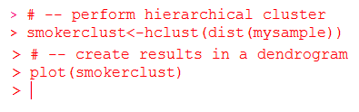

# 第四章：数据挖掘与数据库开发者

本章向数据开发者介绍数据挖掘（与查询不同），并帮助理解什么是数据挖掘以及它为何是数据科学的核心组成部分。

我们将提供工作示例，帮助读者熟悉使用 R 进行最常见的统计数据挖掘方法：维度约简、频繁模式和序列挖掘。

在本章中，我们将内容分为以下主题：

+   数据挖掘的定义与目的

+   为数据挖掘而非数据查询准备开发者

+   使用 R 进行维度约简、频繁模式和序列挖掘

# 数据挖掘

通常，在解释事物时，从高层次的定义开始是明智的。

数据挖掘可以简单地解释为将有关特定主题或信念的信息整理成一种可理解（且可进一步使用）的格式。然而，需要记住的是，整理的信息并非数据本身（如数据查询），而是来自数据的信息（本章后面会详细讨论）。

数据挖掘也不应与分析、信息提取或数据分析混淆。此外，它可以是手动的、半自动的或自动化的过程。在处理新数据时，通常是由数据科学家手动进行的过程。后来，在处理相同数据（来源）的新版本时，可能会在某种程度上实现自动化。

数据挖掘是数据科学家进行的一种探测，目的是在数据中发现以前未知的信息，例如：

+   模式，如一组数据记录，被称为**簇**

+   不寻常的记录，被称为**异常值**

+   依赖关系，如关联规则或序列模式

这些新信息（或洞察）可以看作是一种数据总结，并可用于进一步分析，或例如在机器学习和预测分析中使用。例如，通过数据挖掘，数据科学家可能会识别出不同的组群，这些组群可以在决策支持系统中用于获得更准确的预测结果。

数据开发者可以将从数据挖掘中得到的洞察类比为描述性或结构性元数据，这在行业中被理解为定义数据的数据。

一旦探测完成，数据科学家已经挖掘出信息，这些信息必须根据工作目标转化为可理解且可用的结构。

数据收集、数据准备、解释和可视化的结果以及报告不属于数据挖掘的范畴。

# 常见技术

以下小节解释了一些最常见且被广泛接受和使用的数据挖掘（统计）分析方法。

# 可视化

平均值、变异度量、计数、百分比、交叉表格和简单相关性可帮助数据科学家理解数据结构。这也被称为**数据概况分析**。

区域、时间、 多维和层次化是常见且易于理解的数据可视化格式。

# 聚类分析

聚类分析被数据科学家用来将数据变量归入定义好的集合（即聚类），作为数据总结的一种方式。聚类应该在内部是同质的（变量之间相似），而在外部是异质的（变量与其他聚类中的成员不同）。

层次聚合法、划分法和基于模型的方法是常见的聚类分析方法。

# 相关分析

相关分析是一种方法，数据科学家通过该方法衡量两个数据变量之间的关系。由此得出的结果被称为**相关系数**，它展示了一个变量（自变量）的变化是否会导致另一个变量（因变量）的变化。

常见的相关性分析方法包括正相关/负相关、线性相关和非线性相关。

# 判别分析

判别分析用于在没有明显自然排序的群体情况下，判断数据变量是否属于某一类。使用这种方法时，预先设定好一些带有特定评分或度量的群体，并将其用于数据变量分类或分组过程中。

**线性判别分析**（**LDA**）是最常见的判别分析方法之一，数据科学家尝试找到特征的线性组合，用于表征或区分数据变量（分成不同组）。

# 因子分析

因子分析有助于理解数据变量之间关联的原因。其主要目标是减少变量的数量，并在它们之间的关系中检测结构（该方法也有助于整体数据的降维）。

数据科学家使用的因子分析类型包括主成分分析、公共因子分析、图像因子分析、阿尔法因子分析和因子回归分析。

# 回归分析

回归分析通过研究两个或多个定量变量之间的关系，使得可以根据其他变量（自变量）预测某个变量（因变量）的值。

回归分析有很多种类型，包括简单线性回归、多元线性回归、曲线回归和多重曲线回归，以及逻辑回归模型。

# 逻辑回归分析

逻辑回归分析是一种用于响应变量是二元或定性的情况，旨在通过最大似然法找到一个最佳拟合方程，以最大化在已拟合回归系数的条件下得到观测结果的概率。

逻辑回归的常见类型包括简单逻辑回归、多重逻辑回归、多类别逻辑回归和泊松逻辑回归模型。

# 目的

通过数据挖掘的实践，数据科学家可以实现（前述）从大量信息或数据中提取可操作信息的目标。

有人曾说数据挖掘的目标是发现无结构数据中的结构。例如，你可以使用数据挖掘来识别客户群体，以设计针对高价值客户的促销活动，或设计一个库存控制计划，以确保短期产品保质期。

有人可能会混淆数据查询与数据挖掘。但如果我们考虑为新开设的家居改善商店生成库存控制计划的例子，仅通过查询销售交易记录来确定过去几个月（来自其他商店）的最畅销产品，可能不会成功。而挖掘人口统计信息可能会得出更好的结果，因为我们可能会识别出有效的新颖、潜在有用的可理解的关联和模式，这些模式可以用于预测当地消费者的购买行为。换句话说，数据挖掘的目标或目的不是报告，而是发现。

在接下来的章节中，我们将更深入地探讨数据挖掘与数据查询之间的区别。

# 挖掘与查询

数据查询是提出具体、结构化问题来寻找特定答案的过程，而数据挖掘则是通过统计算法筛选数据，以识别模式和关系的过程。

以下矩阵可以帮助数据开发人员理解数据查询与数据挖掘之间的区别：

| **示例** | **数据查询或挖掘** |
| --- | --- |
| 上个月全球销售的技术书籍总数是多少？ | 数据查询 |
| 上个月影响全球销售的技术书籍类型的因素有哪些？ | 数据挖掘 |
| 上个季度售出了多少种不同技术的技术书籍？ | 数据查询 |
| 哪些技术是作为一套书籍购买的？ | 数据挖掘 |
| 一项技术是倾向于购买纸质版还是电子版？ | 数据挖掘 |
| 哪些技术书籍有重复购买的客户？ | 数据挖掘 |
| 哪本技术书籍是总体销售量最高的？ | 数据查询 |

再次强调，数据查询是报告事件结果，而数据挖掘则是识别可能有助于理解哪些因素影响了这些事件结果的关系的过程，或者这些关系可以用于预测类似事件的未来结果。

# 选择 R 进行数据挖掘

虽然有很多不错的选择，R 是一种学习曲线较短、非常灵活、且专注于统计计算的语言和环境，非常适合用于数据操作、清洗、总结、生成概率统计等（以及使用数据实际创建可视化）；因此，它是进行数据挖掘练习的极佳选择。

此外，这里还有一些学习和使用 R 进行数据挖掘项目的更多理由：

+   R 被大量学术统计学家使用，所以它是一个不会消失的工具。

+   R 几乎是平台独立的；你开发的内容几乎可以在任何地方运行。

+   R 有很棒的帮助资源，只需谷歌一下，你就能看到！

为了说明，我们将在本章的其余部分探索几个使用 R 编程语言的实际数据挖掘例子。

# 可视化

首先，让我们来看一下如何使用 R 创建一个简单的数据可视化。在这个使用场景中，我们有来自理论医院的数据，患者在入院时通过在线调查收集病史信息，并在治疗过程中将信息添加到患者档案中。文件包括许多字段，其中包括：

+   患者的基本描述数据，例如性别、出生日期、身高、体重、血型等。

+   生命体征，例如血压、心率等。

+   病史，如住院次数、手术、重大疾病或病情、是否在医生治疗下等。

+   人口统计学统计数据，例如职业、家乡、教育背景等。

+   文件中还收集了一些额外的信息，用于开发患者的特点和习惯，例如患者每周饮食中牛肉、猪肉和家禽的摄入次数，是否通常使用黄油替代品等。

假设我们没有得到关于数据的更多信息（除了简要的字段名称列表以及数据是由医院人员在患者入院时采集的），接下来的步骤是进行一些数据挖掘，即识别或分组数据，并可能查找变量之间的关系。

要开始，我们可以将医院调查数据读入 R 数据框架，然后使用两个可用的 R 函数来揭示文件中的信息：


这里显示的代码将我们的文本文件（名为`Chapter4.txt`）读取到 R 数据框架中（也名为`chapter4`），然后使用`dim`和`names`函数。`dim`函数展示了文件的数据结构（此文件中有`5994`条记录或案例，以及`107`个数据点或变量，如我们刚才看到的截图所示）。`names`函数则列出了文件中所有字段或变量的名称（部分名称在我们刚才看到的截图中显示）。

R 函数属性和`str`也是一些非常有用的 R 数据挖掘函数，值得读者花时间深入研究并进行实验。

最初，数据科学家可能会通过查看字段名称来寻找一些初步的思路；例如，常见的分组项，如性别、年龄和州（如今“是否投保”也是一个非常有趣的属性！）。

# 当前吸烟者

通常，数据科学家在进行数据挖掘时会有一个目标。在这个例子中，假设我们有兴趣将吸烟患者分成不同的年龄组。使用`current_smoker`变量，我们可以使用 R 的 table 函数并运行以下代码：

```py
table(chapter4["current_smoker"]) 
```

这将生成以下信息：


从这里显示的结果来看，似乎我们有更多的非吸烟者（`5466`）而不是吸烟者（`528`），至少在这个文件或人群中是这样。

接下来，我们想看到的（即可视化）是将我们人群中的吸烟患者按年龄组进行组织。为此，数据科学家的下一步逻辑应该是了解`age`变量中的`range`值。换句话说，我们的数据挖掘工作的一部分将是查看我们人群中最年轻患者的年龄以及最年长患者的年龄。我们不需要通过切片和筛选数据来查找这些信息，可以使用 R 的 range 函数，如下所示：


从这些结果中，数据科学家现在可以看到我们有患者年龄从 1 岁到 99 岁的病例！另一个好主意是可视化我们患者年龄的频率。数据科学家可能希望再次使用 R 的 table 函数来创建一个直方图：

```py
hist(table(Chapter4["age"]))
```

上述代码的输出结果是：


这段 R 代码将生成以下可视化图表，进一步展示我们患者的年龄分布：


另一个有趣的信息是密度估计。通过不太复杂的操作，我们可以将三个 R 函数`plot`、`density`和`table`嵌套在一起，创建另一个患者年龄的可视化图表。

我们可以运行以下代码：


这将生成以下可视化图表：


鉴于所有这些新获得的知识，也许数据科学家会想继续将我们的病例分成六个不同的年龄组：

+   22 岁以下

+   22 到 34 岁

+   35 到 44 岁

+   45 到 54 岁

+   55 到 64 岁

+   65 岁及以上

为了开始使用数据科学家的术语，数据开发者应该开始使用“病例”而不是“记录”（在文件中），使用“人群”而不是“文件”。

以下 R 程序代码根据记录的年龄将我们的病例按当前吸烟者进行分组，并创建一个简单的饼图来可视化结果：

```py
# -- read our data into a data frame object 
Chapter4<-read.csv('c:/chapter4/Chapter4.txt') 

# -- initialize holders for counting cases 
a1 <-0;a2 <-0;a3 <-0;a4 <-0;a5 <-0;a6 <-0 
# -- read through the cases and count smokers by age group 
for(i in 2:nrow(Chapter4)) 
{ 
if (as.numeric(Chapter4[i,"age"]) < 22 & Chapter4[i,"current_smoker"]=="Yes") {a1 <- a1 + 1} 
if (as.numeric(Chapter4[i,"age"]) > 21 & as.numeric(Chapter4[i,"age"]) < 35 & Chapter4[i,"current_smoker"]=="Yes") {a2 <- a2 + 1} 
if (as.numeric(Chapter4[i,"age"]) > 34 & as.numeric(Chapter4[i,"age"]) < 45 & Chapter4[i,"current_smoker"]=="Yes") {a3 <- a3 + 1} 
if (as.numeric(Chapter4[i,"age"]) > 44 & as.numeric(Chapter4[i,"age"]) < 55 & Chapter4[i,"current_smoker"]=="Yes") {a4 <- a4 + 1} 
if (as.numeric(Chapter4[i,"age"]) > 54 & as.numeric(Chapter4[i,"age"]) < 65 & Chapter4[i,"current_smoker"]=="Yes") {a5 <- a5 + 1} 
if (as.numeric(Chapter4[i,"age"]) > 64) {a6 <- a6 + 1} 
} 

# -- build a pie chart 
slices <- c(a1, a2, a3, a4, a5, a6) 
lbls <- c("under 21", "22-34","35-44","45-54","55-64", "65 & over") 

# -- create the actual visualization 
pie(slices, labels = lbls, main="Smokers by Age Range") 
```

以下是我们使用 R `pie`函数生成的简单饼图：


# 缺失值

任何分析结果的关键是数据的可用性。

假设在我们的数据集中有一些案例缺少值。你可能希望在分析中忽略（或省略）这些案例。与其花时间编写代码来处理这些案例，不如使用 R 的通用函数`na`。`na.omit`函数会评估文件中的每个案例，如果某个案例在任何变量上都有缺失值，它会自动删除该案例。

以下示例展示了 R 函数`na.omit`和`nrow`在一个包含缺失值的文件上的使用：


请注意使用`na.omit`前后行（案例）数量的变化（删除了五条记录）。

我已经用更新的文件覆盖了对象`Chapter4`；实际上，养成创建新对象的好习惯是很有益的，这样在任何处理前后都能保留数据的审计记录。

# 聚类分析

在下一个示例中，数据科学家希望更仔细地查看我们的案例，但只关注那些吸烟者。所以，我们在 R 中首先创建一个原始案例的子集，只包含那些当前吸烟的案例。和之前的例子一样，在创建子集（命名为`mysub`）后，我们将使用 R 的`nrow`函数验证我们新数据集中的记录数，以便了解新数据集中的案例数量：

```py
# --- create a subset of smokers only cases 
mysub <- subset(Chapter4,Chapter4["current_smoker"]=="Yes") 

# --- confirm the row count 
nrow(mysub) 
```

上述代码的输出是：


根据我们刚刚看到的输出，我们的新数据集仍然有超过 500 个案例。因此，作为数据科学家，我们决定从我们的案例中随机抽取一部分样本（我们将对其进行聚类分析），然后再次验证我们最新数据集中的记录数。

我们可以使用 R 的`sample`命令来创建仅包含 30 个案例的样本：

```py
# --- create a random sample of 30 smokers 
mysample <- mysub[sample(1:nrow(mysub), 30, 
   replace=FALSE),] 
# --- confirm the row count in our random case sample 
nrow(mysample) 
```

上述代码的输出是：


最后，我们的数据科学家觉得现在他已经有了足够小的样本，足以进行处理，所以我们继续用这个样本进行聚类分析。如本章前面提到的，层次聚合聚类是最流行的聚类分析技术之一，因此我们将使用它来处理我们随机抽样的案例。

我们可以使用 R 的`dist`和`hclust`函数组合对我们随机抽样的案例进行层次聚合聚类分析。`dist`函数计算数据集的距离矩阵，给出任意两条观察值之间的欧几里得距离。`hclust`函数则在该距离矩阵上执行层次聚类。

总结来说，回顾和理解层次聚类分析结果的最简单方式是通过结果的可视化。这个可视化通常被称为**树状图**（一种常用于说明聚类安排的树形图），所以我们也会添加这段代码：

```py
# -- perform the hierarchical cluster analysis 
smokerclust<-hclust(dist(mysample)) 

# -- create results in a dendrogram 
plot(smokerclust)
```

上述代码的输出是：



这段代码示例创建了以下可视化：


R 提供了一个长长的选项列表，可以根据数据和统计信息创建丰富的可视化图表。对数据科学家来说，熟悉这些选项非常重要，也许更重要的是理解哪种可视化图表最适合分析的目标。

# 降维

聚类是旨在基于对属性值的观察，将相关的数据变量分组。然而，考虑到有大量属性的场景，数据科学家会发现，一些属性通常对某个特定的聚类来说没有意义。在我们之前本章中使用的示例（处理病人病例）中，可能会遇到这种情况。回想一下，我们对吸烟者进行了层次聚类分析。那些案例包括许多属性，如性别、年龄、体重、身高、就诊次数、心率、州、关系、保险、血型、血压、教育、出生日期、是否为当前饮酒者、是否正在服药、已知过敏症、是否正在接受医生照护、是否曾做过手术、职业、心脏病发作、风湿热、心脏杂音、动脉疾病等。

作为数据科学家，你可以使用 R 函数`names`，就像我们在本章前面所做的那样，查看所有属性的完整列表。

降维是一个过程，数据科学家尝试减少或限制一个案例中的属性（或维度）数量。这被称为减少考虑中的随机变量数量，但实际上就是根据科学理论，从数据文件中移除某些列。

当前接受和常用的去除维度的方法包括：

+   缺失数据：如果某个变量（列）有很多没有值的案例（记录），它不会增加太多的价值；因此，该列可以被删除。

+   记住，在本章前面，我们使用了 R 函数`na.omit`。这个函数在删除整个案例时非常有用；然而，使用降维时，我们想要为所有案例删除整个变量。

+   小方差：像变量有大量缺失值一样，方差小的变量没有增加价值，也可以被删除。

+   高度相关性：具有相似趋势的数据列也可能携带非常相似的信息。在这种情况下，只需要其中一个。

+   决策树：这是一种可能需要更多工作的方法。它是一种降维技术，数据科学家通过针对目标属性生成一组决策树，然后利用每个属性的使用统计数据，找出最有信息量的特征（或列）。使用统计数据最少的列可以被删除。

+   **主成分分析**（**PCA**）：它是一个过程，将数据集中的变量转换为一组新的变量，称为**主成分**。这些成分按变量的可能方差排序，只有那些方差最高的成分才会被保留。

+   后向消除法和前向构造法：这些技术涉及集中关注一个或多个变量，并按顺序一个一个地去除或添加额外的变量并观察其效果。后向消除法通过可接受的误差率来衡量效果，而前向构造法则通过对性能的影响来衡量效果。

# 计算统计显著性

现在让我们来看一个简单的例子，使用数据变量计算出的方差来决定它是否应该从分析中移除。

再次使用我们在本章中一直使用的患者案例例子，我们可以使用 R 函数`var`来确定我们人群中变量的统计显著性。

R 函数`var`仅适用于数值型数据。

在下面的代码中，我们使用 R 函数`var`来计算名为的变量的方差：

```py
"no_servings_per_week_skim_milk". 
```

我们可以看到，它有一个较低的方差百分比（它变化不频繁，或者在不同的案例中没有很多不同的值）：


如果我们看另一个变量的计算方差百分比，名为：`No_servings_per_week_regular_or_diet_soda`，我们会发现它的计算方差（比前一个变量）更高：


最后，如果我们看一个第三个变量，名为`No_servings_per_week_water`，我们得到第三个计算出的方差：


从这些单独的方差计算中，我们可以看到每个变量在我们案例分析中的统计显著性：

| **数据变量** | **计算出的方差** |
| --- | --- |
| `No_servings_per_week_skim_milk` | .003160316 |
| `No_servings_per_week_regular_or_diet_soda` | 8.505655 |
| `No_servings_per_week_water` | 24.10477 |

名为`No_servings_per_week_skim_milk`的数据变量可以肯定地从分析中剔除，并且根据我们的数据科学家容忍度，名为`No_servings_per_week_regular_or_diet_soda`的数据变量也可能会被从分析中剔除。

使用简单的 R 函数，我们可以可视化我们计算出的方差数据，以便更好地理解：


因此，我们生成以下可视化：


当我们去除一个变量时，它会从我们所有的案例中被移除。

# 高频模式

为了理解统计模式，让我们首先思考一下当城市地区受到严重天气和潜在危险的旅行威胁时会发生什么——所有本地商店都抢购面包、牛奶和鸡蛋！

模式挖掘（数据挖掘的一个子领域）是通过查看数据来识别以前未知但可能有用的模式的过程，这些模式通常由频繁同时发生的事件（例如暴风雨天气触发面包、牛奶和鸡蛋的销售）或对象（例如面包、牛奶和鸡蛋通常一起购买或在同一个购物车中捆绑在一起）组成。

模式挖掘是指使用或开发自定义模式挖掘逻辑的过程。该逻辑可能应用于各种类型的数据源（如交易和序列数据库、流数据、字符串、空间数据、图形等），以便查找各种类型的模式。

在更高层次上，数据科学家寻找：

+   有趣的模式

+   频繁模式

+   稀有模式

+   高置信度模式

+   顶级模式，以及其他模式

一些可能存在于数据中的更具体的模式类型包括：

+   **子图**：在图或一组图中发现一个有趣的图形

+   **直接和间接关联**：识别对象或事件之间的耦合或依赖关系；可以是隐式或显式定义的

+   **趋势**：这也有时称为趋势分析，是收集看似无关的信息并尝试找出模式的实践

+   **周期性模式**：定义为元素在一个周期或组中，特征的变化或趋势

+   **序列规则**：这是对序列模式挖掘的扩展，考虑了一个已识别模式被跟随的概率

+   **格**：一个部分有序的集合，其中每两个元素都有一个唯一的最小上界和唯一的最大下界

+   **序列模式**：出现在多个数据序列中的子序列

+   **高效模式**：高效模式是指那些已被确定为具有较高、较大或等于阈值的模式

# 频繁项集

在前一节（寻找频繁模式）的基础上，频繁项集是一个扩展概念。对于数据开发者来说，最适用的模式概念是频繁项集或查找经常作为一组或集合成员出现的项。

以我们前面章节中的暴风雨天气为例，可以设想通过查找销售交易文件或数据库中的过程，寻找那些在一次销售中（或一组产品中）一起购买牛奶、面包和鸡蛋的情形（即事件）。

频繁项集还涉及确定在分析中使用的最小支持度（minsup）阈值。这意味着数据科学家将确定构成一个集的项的最小出现次数。

再次回到我们暴风雨天气的例子，如果数据科学家设置最小支持度为 2，那么仅有两个成员商品的销售将被视为一个集合或模式。

让我们考虑以下销售交易：

| **销售 ID** | **购买商品** | **是否符合（作为频繁项集）** |
| --- | --- | --- |
| 销售 1 | 牛奶，面包，鸡蛋 | 是 |
| 销售 2 | 牛奶，土豆 | 否 |
| 销售 3 | 面包，鸡蛋，茶 | 是 |
| 销售 4 | 鸡蛋，橙汁 | 否 |

最著名的模式挖掘算法无疑是 Apriori，它旨在应用于事务数据库，用于发现客户在商店中进行交易时的模式。该算法以用户设置的最小支持度（minsup）阈值和包含一组事务的事务数据库作为输入，并输出所有频繁项集。

# 序列挖掘

序列挖掘进一步发展了前述概念。这是一个过程，数据科学家用它来发现一组在对象之间共享的模式，并且这些模式之间有特定的顺序。

在序列挖掘中，我们认识到有与已识别序列相关的序列规则。这些规则定义了模式的对象和顺序。一个序列可以有多个规则。序列规则的支持度可以通过数据科学家计算，方法是将包含该规则的序列数量除以总序列数。序列规则的置信度则是将包含该规则的序列数除以包含其前提的序列数。

总体而言，序列规则挖掘的目标是发现所有支持度和置信度都不低于用户指定的最小支持度（minsup）和最小置信度（minconf）阈值的序列规则。

# 总结

在本章中，我们提供了数据挖掘的通用定义，列出了数据科学家最常用的技术，并说明了这些工作的整体目标。数据挖掘还与数据查询进行了比较，并通过 R 语言提供了各种工作示例，以说明某些关键技术。最后，探讨了降维、频繁模式挖掘和序列挖掘的概念。

下一章将通过数据开发者的视角，手把手介绍数据的统计分析，提供描述数据特征、探索数据中呈现的关系、从数据中创建总结模型、验证数据模型有效性以及在数据开发模型上进行预测分析的指导。
