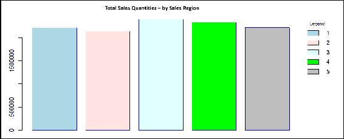

# 第五章：数据库开发者的统计分析

本章将数据开发者引入统计分析的实践。

作为数据开发者，数据分析的概念或过程可能在你脑海中已经很清晰。然而，尽管数据分析和统计分析之间存在相似之处，但也有一些重要的差异需要理解。

本章旨在指出分析类型之间的相似性和差异，帮助读者理解数据、总结和统计分析过程中的基本原则，这些过程描述了成功的统计分析工作中所涉及的关键因素或特征，并提供每个步骤的工作示例，帮助读者掌握如何成功地进行数据统计分析。

在本章中，我们将内容分为以下主题：

+   什么是数据分析、统计分析和总结？

+   成功的统计分析步骤

+   使用 R 进行数据的统计分析

+   示例--总结模型

# 数据分析

我们首先来看看所谓的**数据分析**。这被定义为通过分析和逻辑推理对数据进行评估的结构化过程。进行数据分析时，需要花时间收集所有要分析的数据，将数据（现在视为数据源）分解为可以审查的块或组件，然后根据数据中看到或发现的内容得出结论。通常，这样做的目的是确定某个数据源是否适用于完成声明的项目交付目标。

数据分析方法有很多种，其中包括数据挖掘（在第四章中讨论过，*数据挖掘与数据库开发者*）、文本分析、商业智能和数据可视化（仅举几个例子）。

对于数据开发者而言，数据分析涉及以某个目的为导向，检查数据源的各个部分。

例如，假设我们有一些来自自行车制造组织的交易数据，想要用它来生成销售绩效报告。通常这类项目，我们可以假设我们获得了从数据库中提取的 CSV 格式数据。

现在，使用 R 命令，我们可以识别数据中的字段或列，并查看数据的总结。以下 R 代码使用`read.csv`将我们的数据文件加载到 R 数据框对象中，然后使用命令`colnames`列出文件中的字段或列名；最后，我们使用 R 命令 summary 来指示 R 为我们提供一些关于数据的统计信息。

以下截图展示了运行 R 命令（`colnames`和`summary`）的输出结果：


# 更进一步的观察

一旦我们确认数据中包含了产品标识符（编号和名称）、交易数量、销售日期、退货日期、销售区域信息等内容，我们将希望对数据中的各个组成部分进行一些探索（分析）。也许我们可以通过使用 R 命令`nrow`来计算文件中的总记录数，然后使用 R 命令`list`和`unique`列出数据中出现的唯一零件或产品编号，如下所示的代码和部分输出所示：


进一步的数据分析任务包括检查数据中每个组成部分的内容，例如：

+   `sales_date`和`return_date`（字段）的日期值格式是什么？

+   这些字段中的日期范围是什么？

+   我们的数据文件中包含多少个唯一的产品和销售区域？

请记住，日期总是一个难点，因此确定日期格式和范围始终是进行包含日期或时间值的数据分析时的一个有价值的分析任务。

为了说明这一点，我们可以使用几个简单的 R 命令，创建一个包含我们数据中年份和月份的列表。

以下是用于完成此统计分析任务的 R 代码：

```py
# --- read our data file into "x" 
x <-read.table("c:/Worker/23SamplesSalesTrans.csv", sep=",", header = FALSE, skip = 1) 
# --- convert "x" into a data frame object, then set the data frame to 
# --- hold only the sales_date  
data.df <- data.frame(x) 
data.df <- data.df[,4] 
# --- use the R commands substr and regexpr to strip out just the year and # --- month from the sales date field  
YearsInData = substr(substr(data.df[],(regexpr('/',data.df[])+1),11),( regexpr('/',substr(data.df[],(regexpr('/',data.df[])+1),11))+1),11) 
MonthsInData = substr(data.df[],(regexpr('/',data.df[])-1),1) 
# --- use sort and unique functions to list our year(s) and month(s) 
sort(unique(YearsInData)) 
sort(unique(MonthsInData)) 
```

以下截图显示了运行前述命令后的输出：


我们可以看到，数据中只包含了 2013 年日历年第一季度的数据，即月份`1`、`2`和`3`。现在我们已经确定了数据的时间序列。虽然还有许多数据分析工作可以继续进行，但关键在于我们正在进行旨在建立结构的分析练习，以便实现最初的销售业绩报告目标，而不是进行机器学习。

有了这个前提，假设我们希望检查按月的交易量。为此，我们可以使用 R 计算这些每月的总额，代码如下：

```py
# --- read data 
data.df<-data.frame(x) 
# --- initialize counters 
JanuarySales <-0 
FebruarySales <-0 
MarchSales <-0 
# --- loop and count 
for(i in 1:nrow(data.df)) 
{ 
    MonthInData = substr(data.df[i,4],(regexpr('/',data.df[i,4])-1),1) 
if (MonthInData == '1') {JanuarySales <- JanuarySales + data.df[i,3]} 
if (MonthInData == '2') {FebruarySales <- FebruarySales + + data.df[i,3]} 
if (MonthInData == '3') {MarchSales <- MarchSales + + data.df[i,3]} 
}
```

一旦我们计算出每月的交易总额（使用前面的命令），我们就可以报告这些结果。这可以通过创建一个简单的条形图可视化来完成。

我们可以在以下代码中使用 R 的`barplot`函数：

```py
barplot(c(JanuarySales, FebruarySales, MarchSales), main="Sales Qty by Month", border = "dark blue", legend.text = c("Jan", "Feb", "Mar"), col = c("lightblue", "mistyrose","lightcyan"), sub = "Sales Transactions from File") 
```

上述命令生成了以下可视化结果：


这些描述的数据分析任务示例只是进行特定目标数据分析时通常完成的众多步骤中的一部分，例如生成业绩报告。

总结来说，数据分析就是回顾数据，确定其是否可以作为创建特定结果的有效来源，并且如果可以，如何使用它。

接下来，让我们继续进行下一节的统计分析。

# 统计分析

一些统计学研究者有时将统计分析描述为统计项目的一部分，涉及收集和审查数据源，以努力识别数据中的趋势。

在数据分析中，目标是验证数据是否适合某种需求，而在统计分析中，目标是理解数据并从中得出一些推论。

有许多可能的统计分析技术或方法可以考虑。

# 总结

让我们回到我们的自行车零部件制造组织示例。假设我们有一个新的交易文件，这次我们有更多的数据，我们的工作重点将是进行统计分析，目的是识别可能影响销售表现的具体因素，作为前面活动的一部分。

第一步是对数据进行总结。前一部分已经展示了一些分组：产品和时间段。利用这些组件，我们能够讲述组织销售表现的故事。

数据中可能还包含哪些其他分组或类别？

例如，如果我们假设销售表现依赖于时间段，那么首先要做的可能是将数据按时间段分组。标准的时间段当然是月份、季度和年份（我们在之前的部分已经做了这个），但从统计学角度来看，数据越多越好，因此一个更好的时间分组方式可能是十年或五年的区间。

总结过程中常用的做法是可视化，通常使用条形图，这些图表按顺序显示每个数据点，或使用直方图，它是按更广泛的类别分组的条形图。在这一部分中，我们将牢记这一点，并使用 R 创建各种可视化，以展示我们数据总结的结果。

# 比较分组

让我们继续进行（像本章前面一样）使用 R 命令`colnames`和`summary`；这次应用于我们的新数据文件：


如图所示，我们的文件中有一个额外的字段（或组件）`sale_type`，执行总结命令后，得到了以下统计数据，其中包括销售类型的细分：


下一步将取决于你的假设。例如，如果你认为销售类型（`sale_type`）对整体销售表现有影响，那么你需要为每个（销售类型）组生成`summary`数据，通常包括均值、中位数和/或标准差（之前的`summary`命令是一个很好的开始）。让我们来看一些使用 R 来创建这些`summary`信息的例子。

和往常一样，我们可以首先将数据读取到 R 中，然后明确地将其移动到 R 数据框对象中。以下代码适用于此步骤：

```py
# --- read in the data in  
sales <- read.csv("c:/Worker/SamplesSalesTrans_2.csv") 
# --- just moving our original data to a data frame object 
# --- preserving the original  
data.df<-data.frame(sales.new)
```

使用 R 语言时，有许多不同的方法或方法可以完成相同的任务，但在这个示例中，我们将使用最直接、最简单的方法——通过循环遍历数据，创建每种销售类型的汇总总量。

以下是我们使用的循环代码：

```py
# --- looping through the data and counting quantities  
# --- type 
for(i in 1:nrow(data.df)) 
{ 
if (data.df[i,2] == 'Online') 
   {Online <- Online + data.df[i,1]  
          OnlineC <- OnlineC +1}  
if (data.df[i,2] == 'Television')       
   {Television <- Television + data.df[i,1] 
   TelevisionC <- TelevisionC +1}  
if (data.df[i,2] == 'New Customer')     
   {NewCustomer <- NewCustomer + data.df[i,1] 
   NewCustomerC <- NewCustomerC +1}  
if (data.df[i,2] == 'Retailer')   
   {Retailer <- Retailer + data.df[i,1] 
   RetailerC <- RetailerC +1}  
if (data.df[i,2] == 'Club')             
   {Club <- Club + data.df[i,1] 
   ClubC <- ClubC +1}  
if (data.df[i,2] == 'Discounted')       
   {Discounted <- Discounted + data.df[i,1] 
   DiscountedC <- DiscountedC +1}  
if (data.df[i,2] == 'Repeat')           
   {Repeat <- Repeat + data.df[i,1] 
   RepeatC <- RepeatC +1}  
if (data.df[i,2] == 'Vendor') 
   {Vendor <- Vendor + data.df[i,1] 
   VendorC <- VendorC +1}  
} 
```

也许，更高效的方法是根据` sale_type`来创建数据子集。这可以通过使用以下 R 命令来实现：

```py
# --- create average or mean for all Online sales quantities 
# --- by first creating a subset of only quanities of that sale  
# --- type 
OnlineSales.new <-data.df[data.df$sale_type == "Online",] 
OnlineSalesMean <-mean(OnlineSales.new$quantity) 
# --- using the summary totals, you could do the math to calculate # --- the average or mean: 
OnlineMean <- Online/OnlineC
```

此外，我们还可以使用 R 函数 mean、median 和标准分布来计算数据的统计`summary`信息，具体如下所示的 R 命令：

```py
# --- calculate the mean for all sale types: 
MeanAll <-mean(data.df [["quantity"]]) 
# --- calculate the standard deviation for all sales types: 
StdDAll<-sd(data.df[["quantity"]]) 
# --- calculate the median for all sales types: 
MeanAll <-mean(data.df [["quantity"]]) 
```

下图展示了运行前述命令的结果：


一旦我们计算出一些`summary`信息，下一步就是利用这些信息创建一个或多个可视化图表，便于我们更轻松地观察和研究。

直方图是实现此目标的一个不错的可视化选项。在执行几个数据操作后，我们可以使用 R 函数`hist`，如下所示的 R 代码：

```py
# --- using the calculated average/mean for each sale type 
temp<-c(Online, Television, NewCustomer, Retailer, Club, Discounted, Repeat, Vendor) 

# --- create the histogram 
hist(temp, breaks=8, freq=TRUE, main="Quantity by Sales Type", border="black", col = "gray", xlab="Types: Online, Televsion, New Customer, Retailer, Club, Discounted, Repeat, Vendor") 
abline(v=ref,col="red")
```

以下图示展示了由前述 R 命令创建的直方图可视化图：


为了决定是否存在任何观察组之间的实际差异，大多数情况下，你会首先建立一个参考值或参考分布，用于衡量每个组的值（在本例中是每个`sales type`组）。

最常见的参考标准是标准分布。标准分布衡量的是数据的变异性，或者说一组数值有多么不同和/或分散；在这个示例中，我们讨论的是`sales quantities`。就像我们在本节前面所做的，我们可以使用 R 命令`sd`来建立数据源中所有产品的标准分布，使用以下 R 命令：

```py
# -- calculate standard distribution of all product quantities 
sd(data.df[["quantity"]]) 
```

接下来，我们可以快速地通过可视化，比较每个`sales type`组的`summary`数据与我们的标准分布。

以下 R 命令可用于计算每个组的标准分布总量：

```py
# --- create a subset of only online sale type quantities 
quantity.new <- data.df[data.df$sale_type == "Online",] 

# --- calculate this subsets standard distribution 
StdDOnline<-sd(quantity.new$quantity) 
# --- repeated for each sales type group!
```

然后，我们可以使用以下 R 命令绘制标准分布总量，进行可视化比较：

```py
# --- after computing each type, calculate the standard  
# --- distribution for all sales quantities: 
StdDVendor<-sd(quantity.new$quantity) 

# --- combine the totals into "Temp" 
Temp<-c(StdDOnline, StdDTelevision, StdDNewCustomer, StdDRetailer, StdDClub, StdDDiscounted, StdDRepeat, StdDVendor)  

# --- create a simple Line Chart 
plot(Temp, type="o", col="blue",    axes=FALSE, ann=FALSE) 
axis(1, at=1:8, lab=c("Online", "TV","New", "Retail","Club","Disc","Rep","Ven")) 
title(ylab="STD DIST", col.lab=rgb(0,0.5,0)) 
box() 
```

随后，使用前述命令生成的线形图可视化图，显示了每种`sales type`的标准分布：


在这个可视化图中，我们忘记绘制的是所有`sales types`的标准分布。通过之前的计算和 R 的`abline`函数，我们可以使用以下 R 命令更新我们的可视化图：

```py
abline(h=sd(data.df[["quantity"]]), col="green")
```

以下是我们更新的可视化图，增加了水平线（绿色水平线）或水印，显示了所有`sales types`的标准分布：


上图现在让我们了解了每种销售类型与标准分布总量的对比情况。

# 样本

通常，你会希望将分布与样本进行比较（而不是所有量的总和），因此我们可以使用 R 语言的样本函数从我们的数据中创建一个样本：

```py
# --- use sample to create a random sampling of data 
mysample.df <- data.df[sample(1:nrow(data.df), 100, replace=FALSE),] 
```

然后，我们可以重新创建之前的可视化图（使用`plot`，`axis`，`title`和`box`），其中横线或水印表示（随机）样本的标准分布：

```py
# --- original visualization 
plot(Temp, type="o", col="blue",    axes=FALSE, ann=FALSE) 
axis(1, at=1:8, lab=c("Online", "TV", "New", "Retail","Club","Disc","Rep","Ven")) 
title(ylab="STD DIST", col.lab=rgb(0,0.5,0)) 
box() 

# --- create a sample population 
mysample.df <- data.df[sample(1:nrow(data.df), 100, replace=FALSE),]  

# --- draw a water mark from the  
$ --- samples standard distribution 
abline(h=sd(mysample.df[["quantity"]]), col="green")
```

运行前面的 R 代码会生成以下可视化图：


其他比较群体的方法包括平均值，特别是均值、中位数和众数。

另一个关键比较是衡量数据的分散程度，即数据在整个可能测量范围内的分布广度。通常，我们通过计算方差来执行此分析。同样，R 使这一任务变得简单，只需使用`var`函数。

以下命令计算我们样本的方差，以及整个群体的方差：

```py
# --- calculate our samples variance 
var(mysample.df[["quantity"]]) 

# --- calculate total variance 
var(data.df[["quantity"]]) 
```

# 群体比较结论

在继续之前，我们需要指出的是，你在进行群体的统计分析时，需要小心得出结论。在前面的例子中，我们集中于比较分布。使用单一的比较点可能导致你做出不准确的假设，例如：

+   群体是不同的，但你得出结论它们并不不同

+   群体是相同的或非常相似，但你得出结论它们是不同的

为了避免这些错误，明智的做法是计算并观察数据中的多个总结点。为此，你可以创建一个总结模型，这也是我们下一节的主题。

# 总结建模

常见的做法是通过开发总结模型来建立多个总结点。简而言之，从数据中创建总结模型，就是创建一个表格或数据框，表格的行包含均值、标准分布、中位数、最小值、最大值，以及每个数据组件的总和（或者至少是你感兴趣的每个数据组件）。

让我们使用之前的数据示例，在其中我们根据各个`销售类型`组别检查了销售数量。幸运的是，R 提供了简单的函数来计算我们的比较点：最大值、均值、标准分布、中位数、最小值和总和。

我们可以利用它们单独计算每个群体的比较点，如下所示：

```py
# --- create subset of Online quantities 
quantity.new <- data.df[data.df$sale_type == "Online",] 
# --- calculate each comparison point 
max(quantity.new[["quantity"]]) 
mean(quantity.new[["quantity"]]) 
sd(quantity.new[["quantity"]]) 
median(quantity.new[["quantity"]]) 
min(quantity.new[["quantity"]]) 
sum(quantity.new[["quantity"]]) 
```

接下来，我们创建一个 R 的`data frame`（`df`）对象来保存我们的总结数据，然后将所有的比较点加载到数据框中。以下是相应的 R 代码：

```py
# --- create a data frame object for summarization 
df<-data.frame(8,7) 
# --- create our subset of data - this is online sales 
quantity.new <- data.df[data.df$sale_type == "Online",] 
# --- calculate comparison points based upon 
# --- our current subset dropping each in a temp 
# --- variable for now (a, b, c, d, e and f) 
a<-max(quantity.new[["quantity"]]) 
b<-mean(quantity.new[["quantity"]]) 
c<-sd(quantity.new[["quantity"]]) 
d<-median(quantity.new[["quantity"]]) 
e<-min(quantity.new[["quantity"]]) 
f<-sum(quantity.new[["quantity"]]) 
# --- load our calculations into the data frame object 
# --- just using "i" as an index to the data frame 
i<-1 
df[i,1]<-"Online" 
df[i,2]<-a 
df[i,3]<-b 
df[i,4]<-c 
df[i,5]<-d 
df[i,6]<-e 
df[i,7]<-f 
# --- add headings/column names to our data frame object 
names(df)<-c("group", "max", "mean", "sd", "median", "min", "sum") 
# --- note: repeat the section of code here that creates a  
# --- subset and calculates its points for all sale types 
# --- display out finished summation model 
df 
```

以下是我们的总结模型数据框对象示例：


一个*总结*表格，例如我们之前创建的那种，通常无法回答你所有关于数据的问题，但实际上，它会提出更多的问题和假设供你进一步探究。统计分析的核心是提出下一个要问的问题。

汇总表帮助我们确定：

+   这数据中真的有任何重要的信息吗？

+   这个数据源可靠吗？

+   如果这些数据似乎支持我的假设，那么整体证据有多强？

+   这些信息（如总结的）真的对我的当前假设有意义吗？

+   这些数字意味着什么（暗示可能需要更多的分析和汇总）？

+   接下来可以采取什么行动？

+   数据的性质是什么？（将在下一节讨论。）

有多种 R 包（例如`gridExtra`包）可供下载并安装，用于将格式化良好的数据框打印到纸上。读者值得花时间探索这些选项。

# 确定数据的性质

当谈到统计分析的目标时，人们通常会提到描述或确定数据源性质的过程。

确定某事的性质意味着对其进行理解。这个理解可以是简单的，也可以是复杂的。例如，我们能否确定数据源中每个变量或组件的类型？它们是定量的、比较性的，还是定性的？

使用本章前面提到的交易数据源，我们可以按类型识别一些变量，如下所示：

+   定量：数量

+   比较性：`sale_type`

+   定性：`sales_region`

+   分类：`product_name`

更高级的统计分析旨在识别数据中的模式；例如，是否存在变量之间的关系，或者某些群体是否比其他群体更可能表现出某些特征。

探索数据中呈现的关系可能类似于在关系数据库中识别外键的想法，但在统计学中，组件或变量之间的关系基于相关性和因果关系。

此外，确定数据源的性质实际上也是对该数据源进行建模的过程。在建模过程中，通常会涉及提问，如下所示（旨在确立数据的性质）：

+   什么？一些常见的示例（什么）包括收入、支出、运输、医院就诊、网站点击等。在本章使用的示例中，我们正在测量数量，即被移动的产品数量（销售）。

+   为什么？（为什么）通常取决于你项目的具体目标，这些目标可能会有很大差异。例如，我们可能想要追踪一个业务的增长、网站上的活动，或是某个选定产品或市场兴趣的演变。同样，在我们当前的交易数据示例中，我们可能希望识别表现过高或过低的`销售类型`，并确定新客户或回头客是否贡献更多或更少的销售？

+   怎么做？通常会在一段时间内（也许是一年、一个月、一周等）并且通过其他相关测量，如产品、州、地区、经销商等，来进行。在我们的交易数据示例中，我们专注于按销售类型观察数量。

在本章关于数据分析的讨论开始时，我们创建了一个可视化，显示了前面提到的模型，即按月份的数量。接下来是该可视化：


通常，建模过程将包括多次迭代：观察、提出新问题、操作数据、创建新的可视化，并观察这些可视化结果，每次迭代都由前一次迭代的结果驱动。

例如，在查看之前的可视化（按月销售数量）之后，可能会出现新的问题，比如销售区域的总销售数量是多少。

可以使用类似 R 命令逻辑（如`barplot`函数）来操作我们的数据并展示这些信息，如下所示：

```py
# --- load our data into a data frame object 
data.df<-data.frame(x) 
# --- initialize some counters one for each sales region ID 
R1<-0 
R2<-0 
R3<-0 
R4<-0 
R5<-0 
# --- loop through the data and accumulate sale quantities  
# --- for each sales region 
for(i in 1:nrow(data.df)) 
{ 
    MonthInData <-data.df[i,6] 
if (MonthInData == '1') {R1 <- R1 + data.df[i,3]} 
if (MonthInData == '2') {R2 <- R2 + data.df[i,3]} 
if (MonthInData == '3') {R3 <- R3 + data.df[i,3]} 
if (MonthInData == '4') {R4 <- R4 + data.df[i,3]} 
if (MonthInData == '5') {R5 <- R5 + data.df[i,3]} 
} 
# --- generate our barplot from accumulated data  
# --- in R1 through R5 
barplot(c(R1, R2, R3, R4, R5), main="Sales Qty by Region", border = "dark blue", legend.text = c("1","2","3", "4", "5"), col = c("lightblue", "mistyrose","lightcyan", "Green", "grey")) 
```

生成的可视化如下所示：



根据以前的可视化，当然可以提出更多问题并进行可视化：

+   按销售区域按月份或季度的数量分布如何？

+   按产品的总数量是多少？

+   按月、季度、产品等总返回量是多少？

+   等等！

描述数据性质的另一种方式是为其添加上下文或进行概述。无论如何，目标是通过可视化使数据使用者更好地理解数据。

另一个添加上下文或者建立数据性质的动机可能是为了从数据中获得新的视角。例如，我们可以添加比较，比如我们之前的`销售类型`示例。

# 成功的统计分析

值得一提的是，在这一部分处理确保成功（或至少是有成效的）统计分析工作的关键点。

你可能会发现这些大多数都是常识性的概念，但也许有些不是。

1.  尽快确定您的目标或目的。您需要知道胜利是什么，即驱动分析工作的问题或想法是什么。此外，您需要确保无论分析的驱动力是什么，都必须以某种方式可测量。必须早期确定这个度量或绩效指标。

1.  确定关键的杠杆。这意味着一旦确定了您的目标及衡量达到这些目标的绩效方式，您还需要找出影响每个目标达成绩效的因素。

1.  进行彻底的数据收集。通常情况下，数据越多越好，但在数量不足的情况下，始终要追求质量。

1.  清理你的数据。确保你的数据以一致的方式进行清理，这样数据问题不会影响你的结论。

1.  建模，建模和再建模你的数据。正如我们在前一节中提到的，建模推动建模。你对数据进行的建模越多，你就会提出和回答更多问题，并获得更好的结果。

1.  花时间提升你的统计分析技能。持续演进你的经验和统计分析风格总是个好主意。改进的方式就是去做。另一种方法是重新调整手头可能有的数据，以磨练你的技能。

1.  优化并重复。一如既往，你需要花时间进行标准化，遵循成熟的实践，使用模板，并测试和记录你的脚本和模型，这样你就可以一遍又一遍地重复使用你最好的努力。你会发现这段时间花得很值，即使是你更好的努力也会因使用而改善。最后，与他人分享你的工作！眼界越广，产品就会越好。

关于确保统计项目成功的一些有趣建议包括以下引用：

*建议建立一个团队，使得那些拥有统计学高级学位的人专注于数据建模和预测，而团队中的其他成员-合格的基础设施工程师、软件开发人员和 ETL 专家-构建必要的数据收集基础设施、数据管道和数据产品，使得数据通过模型流动，并以报告和仪表板的形式向业务展示结果。*                                                                                                             - G Shapira, 2017*

# R 与统计分析

关于使用 R 进行统计分析、数据概要和为数据添加视角（建立上下文）的一点说明。

R 是一种易学、非常灵活，并且非常专注于统计计算的语言和环境，使其非常适合操纵、清洗、总结和生成概率统计（以及实际上使用数据创建可视化），因此它是进行概要、建立上下文和识别额外视角所需的练习的绝佳选择。

此外，以下是使用 R 进行任何类型数据或统计分析时的几个更多原因：

+   R 被大量学术统计学家使用，因此它不会被淘汰。

+   R 几乎是平台无关的；你开发的内容几乎可以在任何地方运行。

+   R 拥有出色的帮助资源。只需 Google 一下，你就会看到！

# 总结

在本章中，我们详细探讨了统计分析的目的和过程（数据分析的差异），创建了一个总结模型，并列出了成功进行统计分析的步骤。最后，我们强调了选择 R 作为首选统计分析工具的原因。

下一章将重点解释统计回归及其在数据科学中的重要性。我们将介绍在日常数据项目中使用各种统计回归方法，并概述开发人员如何在典型的数据开发项目中使用回归进行简单的预测和预报。
