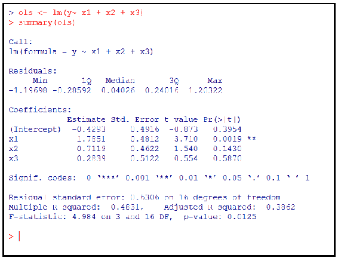
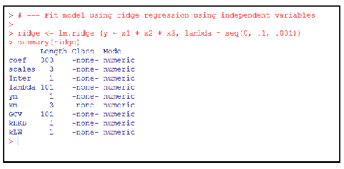
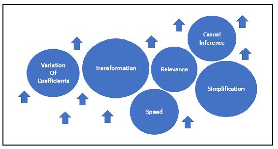
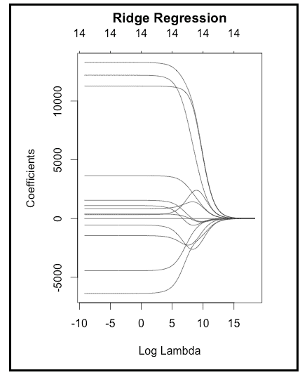
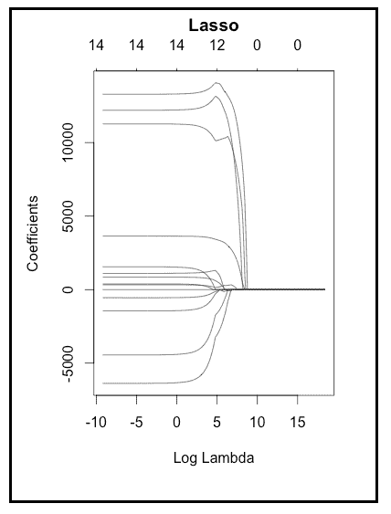

# 第七章：数据库改进的正则化

在本章中，我们将介绍统计正则化的概念，以改善数据模型，并帮助理解统计正则化是什么、为什么它很重要，并且让您对各种统计正则化方法感到熟悉。

本章中，我们将信息组织成以下几个方面：

+   统计正则化

+   使用数据理解统计正则化

+   改进数据或数据模型

+   使用 R 进行统计正则化

# 统计正则化

那么，什么是统计正则化呢？

在正则化中，无论我们讨论的是数学、统计学还是机器学习，本质上是在讨论通过添加额外信息来解决问题的过程。

**正则化**一词被描述为管理复杂系统的抽象概念（根据一套规则或公认的概念）。这些规则定义了如何添加或修改值，以满足要求或解决问题。

添加或修改值是否意味着改变数据？（本章稍后将深入研究这一问题。）

# 各种统计正则化方法

在统计学界，最流行的统计正则化方法可能包括以下几种：

+   脊

+   套索

+   最小角度

# 脊

脊回归是一种统计技术，通常用于分析回归数据或模型，这些数据或模型存在一个被称为**多重共线性**的问题。当出现多重共线性时，估计值可能是无偏的，但其方差通常很大，且远离真实值。此技术通过向回归估计添加一定的偏差来减少标准误差（以产生更可靠的估计值）。

多重共线性是统计学中的一种现象，在这种情况下，多元回归模型中的一个预测因子可以通过其他预测因子线性地预测，并且预测准确度较高。

# 套索

**最小绝对收缩和选择算子**（**Lasso**）是一种统计技术，既执行变量选择，又进行正则化，以提高模型中的预测准确性。

在统计模型中选择或挑选变量的过程显然会导致变量数量的减少，这也被称为变量收缩。

# 最小角度

**最小角度回归**（**LARS**）是一种统计技术，数据科学家在处理高维数据时会使用此技术。如果怀疑某响应变量是由特定的预测因子子集决定的，那么 LARS 技术可以帮助确定应将哪些变量纳入回归过程。

# 正则化机会

那么，作为数据科学家，您何时会考虑使用任何类型的正则化方法？

事实上，没有绝对的规则规定何时使用正则化；然而，有一些指标可以观察，当这些指标出现时，你应该考虑使用正则化。例如：

+   如果数据中包含较高的变量计数

+   如果数据中观测值的数量与变量数量的比率很低

在第六章，*从数据库发展到数据库回归*（统计回归），我们回顾了一些包含咨询项目结果的示例数据。在该示例中，我们探讨了项目的总开票小时数、项目管理的总小时数和项目假定的盈利能力之间的关系。

仔细观察相同的数据，也许我们现在会看到更多的变量，例如：

+   分配到项目的全职顾问数量

+   分配到项目的兼职顾问数量

+   分配到项目的分包商数量（全职或兼职）

+   分配到项目的全职客户资源数量

+   分配到项目的兼职客户资源数量

+   分配到项目的本地资源数量

+   在项目核心技术方面的经验年数

+   总项目管理小时数

+   总开发小时数

+   每小时账单费率

+   总开票小时数

+   项目中使用的技术数量

+   项目风格（时间和材料、不可超出预算或人员增补）

在这里，我们可以看到超过十二个可能的自变量或预测变量——这显然是一个可管理的数量——特别是考虑到文件中的观测值（记录）数量超过 100 个（变量与观测值的比例约为 12%）。

自变量（或实验变量或预测变量）是在模型中被操控的变量，目的是观察它对因变量或结果变量的影响。

当数据科学家谈到高变量计数时，实际上他们指的是过多的变量数，或者当变量数接近观测数时（在这个例子中不是如此），假设我们在只有 100 个观测值的数据中有超过 50 个可能的预测变量？这就是所谓的过于复杂的模型，并需要考虑使用常见的正则化方法。

什么构成过于复杂的模型通常是一个争议话题，且往往根据数据和统计模型的目标不同而有所不同。

经验证明，当模型过于复杂时，模型可能会拟合数据，但预测性能较差（最终目标是预测）。当这种情况发生时，数据科学家会认识到过拟合。

正则化是数据科学家用来避免或解决过拟合问题的统计技术。正则化的基本思想是，过拟合数据的模型是复杂的统计模型，这些模型例如具有过多的参数。

正则化的其他已知应用包括以下内容：

+   涉及高共线性的实例

+   当项目目标是稀疏解时

+   考虑高维数据中的变量分组

+   分类

# 共线性

**共线性**一词描述了统计学中的一种情况，即选定的预测变量可以通过其他变量线性预测，且具有相当高的准确度。

线性预测是一种程序，其中根据先前样本的线性函数估算变量的未来值。

这通常会导致数据的微小变化产生关于个别预测变量的不可靠结果。也就是说，具有共线性预测变量的多元回归模型可以指示整个预测变量组如何预测结果变量，但可能无法提供关于任何单个预测变量的有效结果，也无法指示哪些预测变量在与其他变量的关系中是冗余的。

# 稀疏解

**稀疏解**或**近似解**是一个稀疏向量，它大致解决了一组方程。寻找稀疏近似解的技术在图像处理和文档分析等应用中得到广泛应用。

你应该记得，向量是由相同基本类型的数据点组成的序列。向量的成员正式称为**分量**。

# 高维数据

**高维统计学**是研究数据维度大于经典**多元分析**（**MVA**）中考虑的维度的数据的学科。

在统计研究中，**多元随机变量**（或**随机向量**）是一个由变量组成的列表，每个变量的值都未知。多元分析（MVA）被定义为研究这一情况的学科。

高维统计学依赖于随机向量理论。在许多应用中，数据向量的维度可能大于样本大小。

# 分类

**分类**是根据已知类别成员的数据训练集，识别新观察值属于哪些类别或组的过程。

正则化是一种常见的统计技术，用于解决上述（以及其他）情境。在下一节中，我们将介绍每种情境的一些简单示例。

# 使用数据理解统计学正则化

变量选择是统计学领域中的一个重要过程，因为它旨在通过消除与输出无关的变量，使模型更易理解、更易训练，并避免误关联。

这（变量选择）是解决过拟合问题的一个可能方法。通常，我们不期望模型完全拟合我们的数据；实际上，过拟合问题通常意味着如果我们过度拟合训练或测试数据，它可能会对我们预测模型在未见数据上的准确性造成不利影响。

与其使用变量选择，不如说正则化过程是一种减少数据中变量数量的替代方法，用来解决过拟合问题，本质上是通过在模型训练过程中引入有意的偏差或约束（希望）防止我们的系数出现非常高的方差。

当参数的数量（在总体中）被认为非常大——尤其是与可用观察值的数量相比——线性回归往往允许少数观察值的微小变化导致系数发生剧烈变化（或者，如我们所说，表现出非常高的方差）。

**岭回归**是一种统计方法，通过对模型的回归估计引入受控偏差（通过或使用约束），但它在减少模型方差方面非常有效。

岭回归有时在数据科学社区中被称为一种惩罚回归技术。

有许多不同的 R 函数和包实现了岭回归，例如来自`MASS`包的`lm.ridge()`函数和来自`genridge`包的`ridge()`函数。

你可能熟悉`MASS` R 包，但可能不太了解`genridge`。`genridge`包引入了岭回归和相关方法中使用的标准单变量岭迹图的推广，并值得进一步研究。

在第六章《*从数据库进阶到数据库回归*》中，我们提出了一个例子，使用一个咨询公司项目结果的数据创建了一个线性回归模型，旨在预测项目的盈利能力。我们使用了 R 函数：`lm()`，该函数接受两个主要参数：`formula`（一个公式类的对象）和`data`（通常是一个`data.frame`），如下所示的 R 代码：

```py
# --- build linear regression model using all the
# --- project results data
alinearMod <- lm(ProjectManagement ~ Profit, data=MyData)
```

在本章中，我们将使用`lm.ridge()`函数，尝试通过岭回归来合理地拟合前述线性模型。前面的代码使用我们的 R 对象`MyData`，并通过`ProjectManagment`变量来预测`Profit`，从而生成了一个线性模型。

`lm.ridge`函数使用以下语法：

```py
lm.ridge(formula, data, subset, na.action, lambda = 0, model = FALSE,
x = FALSE, y = FALSE, contrasts = NULL, ...)
```

参数在此列出，供后续参考：

+   `formula`：这是一个回归模型的公式表达式，形式为`response ~ predictors`

+   `data`：这是一个可选的数据框，用来解释公式中出现的变量

+   `subset`：这是一个表达式，用于指定在拟合过程中应使用数据的哪些行子集。默认情况下，所有观察值都会被包含在内。

+   `na.action`：这是一个函数，用于过滤缺失数据

+   `lambda`：这是一个标量或向量，表示岭常数

+   `model`：是否返回模型框架？

+   `x`：是否返回设计矩阵？

+   `y`：是否返回响应值？

+   `contrasts`：一组对比列表，用于公式中的某些或所有因子项

`lambda` 这个术语（在此，指的是 `lm.ridge` 函数中的一个参数）通常定义为在一组依赖变量的组合上对组均值的比较。

为了设定我们下一个示例，让我们回顾一下，我们的项目数据的变量与观测值的比例为 12%。假设我们已经获得了一个新的数据文件，这个文件只有 50 个观测值。现在，我们的变量与观测值的比例上升到 24%。

那么，只有 12 个观测值的文件呢？再假设我们被告知，管理层认为这 12 个观测值基于关键的高可见性项目，因此不愿意提供更多的数据样本给数据科学家（至少目前是这样）？对这些数据建模是否还有意义？结果会有任何价值吗？

通常来说，人们会说回归模型中变量越多，模型就越灵活，或者说它会变得更加灵活。很可能，这种类型的模型会通过拟合训练数据中的随机波动来获得较低的误差，但结果或结论并不能代表数据中变量的真实潜在分布，换句话说，当该模型在从相同分布中提取的未来数据上运行时，性能会较差。（如果我们关于项目盈利能力的预测是基于错误的逻辑，管理层可不会高兴！）

在上述情境下，数据科学家应该如何处理？好吧，尽管数据点少于变量时，确实有可能拟合出好的模型，但这必须非常小心地进行。

通常情况下，当数据中的变量数量超过观测值时，结果可能看起来会表现良好，但正如我们之前提到的，解决方案可能在训练数据上取得有利结果，甚至是零误差。这样的模型肯定会在实际数据上发生过拟合，因为它对于训练数据的数量来说过于灵活。（这种情况称为**病态**或**欠定**。）

这个问题通常通过仔细设定限制或施加约束来解决，可以通过显式的方式或逻辑过程来实现。模型成为了在很好地拟合数据和满足这些设定的限制或约束之间的权衡。岭回归约束或惩罚数据参数，并通过限制模型的灵活性来提高预测性能，从而减少过拟合的倾向。

然而，简单地设定限制或施加约束并不意味着得到的解决方案会是好的或可接受的。只有当这些约束真正适合当前问题或目标时，它们才会产生好的解决方案。

回到我们在本节前面提到的 `lm.ridge` 函数。与 `lm` 函数的使用稍有不同，我们可以通过以下的使用示例看到其中的差异。

和大多数示例一样，我们可以利用`runif`和`rnom`这两个 R 函数来生成一些随机数数据集（用于插图），我们可以看到执行`lm`和`lm.ridge`之间的区别：

```py
# -- create a uniform random number series as X1, X2 and X3
# --- using runif
x1 <- runif(n=20)
x2 <- runif(n=20)
x3 <- runif(n=20)
# --- Create a new variable from x1 and x2
x3c <- 10*x1 + x3
# --- create a random number
ep <- rnorm(n=20)
y <- x1 + x2 + ep
```

既然我们知道了我们要探索的内容（例如，估计线性回归模型中的参数），我们就可以在创建测试数据时进行一些自由发挥。以下是一个使用我们三个人造变量生成线性回归模型的 R 代码示例：

```py
# --- using the R lm function to create an ordinary least squares (OLS) # -- fit of 3-variable model using x3 as an independent x3 variable
ols <- lm(y~ x1 + x2 + x3)
summary(ols)
```

以下是从前面的代码生成的输出：



现在，让我们继续。

使用我们相同的虚拟示例数据和类似的思路，我们可以使用 R 函数`lm.ridge`来尝试通过岭回归拟合线性模型：

```py
# --- Fit model using ridge regression using independent variables
ridge <- lm.ridge (y ~ x1 + x2 + x3, lambda = seq(0, .1, .001))
summary(ridge)
```

以下是生成的输出（请注意`summary`函数生成的输出差异）：



你会发现，`summary`函数在使用线性回归模型时与在使用岭回归方法的模型中生成的输出不同。然而，有多种包可以生成岭回归模型的充分输出。

# 改善数据或数据模型

有多种参数可用于改善数据或数据模型。在本节中，我们将研究其中的一些。



数据科学家可以采用许多其他可接受的或至少是广为人知的方法或策略，以期改进统计模型（除了正则化之外），值得花些时间提到其中一些最流行的方法：

+   简化

+   相关性

+   速度

+   转换

+   系数的变化

+   因果推断

+   回到正则化

+   可靠性

# 简化

第一个可能只是常识。一个简单的模型更容易解释和理解。算法在简单模型上运行得更高效，允许数据科学家有更多的迭代次数以及更多的时间来评估结果。

然而，请记住，更复杂的模型在某种程度上更具可信性，因此要小心过度简化。寻找复杂与简单之间正确平衡的方法可以双向进行；可以从简单开始并逐步增加复杂性，或者更常见的是，从复杂开始，然后逐步剔除模型中的内容，进行测试、评估并重复，直到成功理解（拟合）过程。

# 相关性

这一点也似乎显而易见。换句话说，不要浪费时间在统计噪声上。使用常见的统计回归包，你将有可视化图（如分位数-分位数图、影响图、箱形图等）来研究并理解。花时间从模型或数据中剔除无关项将带来回报。关键是能够识别什么是相关的。

# 速度

数据科学家能够更快地拟合模型，就能评估和理解更多的模型（和数据）（这就是最终目标！）。模型优化的方式和手段可能是昂贵的——无论是在时间上还是在专业技能上——并且可以集中在模型、数据或两者上。

# 变量变换

这是一种可能对模型产生重大影响的方法，但并非没有风险。变量的转换可以创建看似合理的模型（然后可以拟合并与数据进行比较），并且包括所有相关信息，但如果做得不理性，可能会引入偏差并导致错误的结果。

# 系数的变异

测试系数，以确定某个系数是否应该随组别变化，以及变化的估计规模，是改善模型的可行方法。非常小的变动系数（在不同类别之间）有可能被排除在考虑之外。

# 因果推断

你可能会想设置一个大的回归模型来回答模型或数据中存在的多个因果问题；然而，在观察性设置中（包括在某些感兴趣的条件下的实验），这种方法可能存在偏差的风险。关键是，不要对任何感知到的关系（或系数）做出假设，尤其是不要假设一个系数可以因果解释。然而，因果推断可以在适当的情况下作为一种方法，用来改善统计模型。

# 回到正则化

直接切入主题——正则化的核心主题是试图改善统计模型或方法的结果或性能。换句话说，就是通过直接和间接的观察来改进学习过程（当然是通过数据）。

试图从有限的数据集获取知识或学习（也称为**经验学习**）被认为是一个**欠定问题**，因为通常情况下，它是试图推断一个函数`x {\displaystyle x}`，仅给定一些数据观察的例子。

改进统计模型的另一种可能方法是，在模型训练过程中使用**加法平滑**（也称为**拉普拉斯平滑**）。这是一种正则化形式，通过在模型训练过程中将一个固定的数字添加到所有特征和类别组合的计数中来工作。

有一种普遍的观点认为，加法平滑在一些检索任务中（如基于语言模型的应用）比其他概率平滑方法更有效。

正则化从根本上来说是通过引入额外的信息、故意的偏差或约束来解决一个不适定的问题——防止系数取大值——这是一种试图收缩系数的方法，也称为**收缩方法**。引入的信息通常表现为对复杂度的惩罚，例如平滑性限制或向量空间范数的约束。换句话说，正则化 A 的作用正如其名称所示，它调节你可以在统计模型或其数据中如何以及多大程度上改变一个参数。没错，实际上，你可以改变数据本身！

什么时候改变数据的值是合理的？

统计学界认为，正则化的理论依据可能是它试图施加一种信念：在多个竞争假设中，假设最少的那一个将是最有效的（因此应当是被选中并使用的）。这种信念被严格称为**奥卡姆剃刀**（或称“简约法则”）。

# 可靠性

是否应该总是在统计模型中尝试实施正则化方法呢？（当然，我们指的是本章“*正则化机会*”部分中所讨论的那些情况。）它是否总能改善模型或数据集？

在考虑如何回答这个问题之前，记住正则化不会改善算法最初用来学习模型参数（特征权重）的数据集上的表现。然而，它可以改善模型的泛化性能（即在新的、未见过的数据上的表现，这正是你所追求的）。

可以把在统计模型中使用正则化看作是对过拟合的反制措施，类似于加入偏差；但另一方面，加入过多的偏差几乎总是导致欠拟合，模型表现会很差。

答：正则化并不总是有效，可能导致模型表现不佳（甚至比之前更差！）。《Python 机器学习》一书的作者 S. Raschka 提出了一个有趣的评论：

从直观角度来看，可以将正则化理解为对模型复杂度的惩罚。增加正则化强度会惩罚大权重系数。因此，你的目标是防止模型捕捉到异常或噪声，并确保模型能很好地泛化到新的、未见过的数据。

# 使用 R 进行统计正则化

有许多不同的函数和包实现了岭回归，例如来自`MASS`包的`lm.ridge()`和来自`genridge`包的`ridge()`。对于套索回归，还有`lars`包。在本章中，我们将使用 R 的`glmnet()`函数（来自`glmnet`包），因为它文档完善，接口一致且友好。

使用正则化的关键是确定一个合适的`lambda`值。`glmnet()`函数使用的方法是使用不同的`lambda`值组成的网格，为每个值训练一个回归模型。然后，可以手动选择一个值，或者使用某种技术估计出最佳的`lambda`。

你可以指定尝试的值的序列（通过`lambda`参数）；否则，将使用包含 100 个值的默认序列。

# 参数设置

`glmnet()`函数的第一个参数必须是特征矩阵（我们可以使用 R 函数`model.matrix()`创建该矩阵）。第二个参数是包含输出变量的向量。最后，`alpha`参数是用来在岭回归（0）和 lasso（1）之间切换的。以下代码为我们的示例设置了环境：

```py
# --- load the package 
library(glmnet) 
# --- create our parameter data 
cars_train_mat <- model.matrix(Price ~ .-Saturn, cars_train)[,-1] 
lambdas <- 10 ^ seq(8, -4, length = 250) 

```

`model.matrix`是一个 R 函数，通过扩展因子为一组汇总变量（取决于对比）并类似地扩展交互作用来创建矩阵。

```py

 # --- create regression model 
cars_models_ridge <-  
  glmnet(cars_train_mat, cars_train$Price, alpha = 0, lambda = lambdas) 

# --- create a lasso model 
cars_models_lasso <-  
  glmnet(cars_train_mat, cars_train$Price, alpha = 1, lambda = lambdas) 
```

我们在此示例中用于设置数据的前述代码（具体为`length = 250`）提供了一个包含 250 个值的序列。这意味着（在前述代码中）实际上训练了 250 个岭回归模型和另外 250 个 lasso 模型！

我们可以查看`glmnet()`生成的`cars_models_ridge`对象的`lambda`属性值，然后应用`coef()`函数来提取第 100^(th)模型的相应系数，方法如下：

```py
# --- print the value of the lambda object of the 100th model 
# --- generated by glmnet 
cars_models_ridge$lambda[100] 
[1] 1694.009 

# --- use coef to see 100th model's coefficient values 
coef(cars_models_ridge)[,100] 
  (Intercept)       Mileage      Cylinder         Doors  
 6217.5498831    -0.1574441  2757.9937160   371.2268405  
       Cruise         Sound       Leather         Buick  
 1694.6023651   100.2323812  1326.7744321  -358.8397493  
     Cadillac         Chevy       Pontiac          Saab  
11160.4861489 -2370.3268837 -2256.7482905  8416.9209564  
  convertible     hatchback         sedan  
10576.9050477 -3263.4869674 -2058.0627013 
```

最后，我们可以使用 R 的`plot()`函数生成一张图，显示随着对数值变化，系数值如何变化。

如以下代码所示，将岭回归和 lasso 的图表并排显示是非常有用的：

```py
# --- visualize our model data 
# --- set matrix column-widths and the row-heights 
layout(matrix(c(1, 2), 1, 2)) 

# --- create ridge regression plot 
plot(cars_models_ridge, xvar = "lambda", main = "Ridge  
   Regression\n")
```

以下是前述 R 代码生成的图形：



这是生成`lasso`图的 R 代码：

```py
# --- create lasso plot 
plot(cars_models_lasso, xvar = "lambda", main = "Lasso\n") 
```

这是相应的输出：



上述两个图的显著区别在于，`lasso`会强制许多系数精确地降到零，而在岭回归中，系数通常会平滑地下降，只有在极端值时才会完全降到零。请注意，两个图的上方水平轴上的数值，显示了随着值的变化，非零系数的数量。

除了应用正则化以最小化过拟合问题外，`lasso`函数通常用于执行特征选择，因为具有零系数的特征将不会被包含在模型中。

作为`glmnet`包的一部分，`predict()`函数可以在多种情境中使用。例如，我们可以确定模型在一个原始列表中未包含的`lambda`值下的**系数方差**（**CV**）百分比（两个变量之间线性关系的强度和方向）。

`Predict`是一个通用函数，用于从各种模型拟合函数的结果中进行预测。

让我们尝试在之前创建的`lasso`模型上使用`predict`。

我们可以在之前创建的`lasso`模型`cars_models_lasso`上编写以下 R 代码：

```py
# --- use predict function on the lasso model 
predict(cars_models_lasso, type = "coefficients", s = lambda_lasso) 

Below is the generated output, a list of the coefficient values: 

 (Intercept)  -521.3516739 
Mileage        -0.1861493 
Cylinder     3619.3006985 
Doors        1400.7484461 
Cruise        310.9153455 
Sound         340.7585158 
Leather       830.7770461 
Buick        1139.9522370 
Cadillac    13377.3244020 
Chevy        -501.7213442 
Pontiac     -1327.8094954 
Saab        12306.0915679 
convertible 11160.6987522 
hatchback   -6072.0031626 
sedan       -4179.9112364 
```

从前面的输出可以看出，`lasso`没有将任何系数强制为零，这表明在这种情况下，应该保留所有特征（即不应从数据中删除任何特征）。

# 总结

在本章中，我们提供了统计正则化的解释，并使用示例数据进行了演示，以便更好地理解统计正则化。之后，我们讨论了如何通过正则化来改进数据或数据模型的多种方法。最后，我们看到了 R 语言如何很好地支持正则化的概念和方法。

在下一章，我们将介绍数据模型评估的概念，并使用统计学进行评估。我们将比较数据评估和数据质量保证的概念，最后，应用统计评估的思想，并通过 R 语言对数据进行评估。
