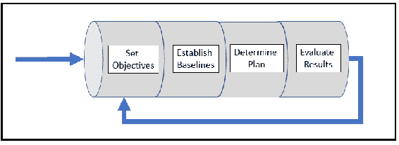
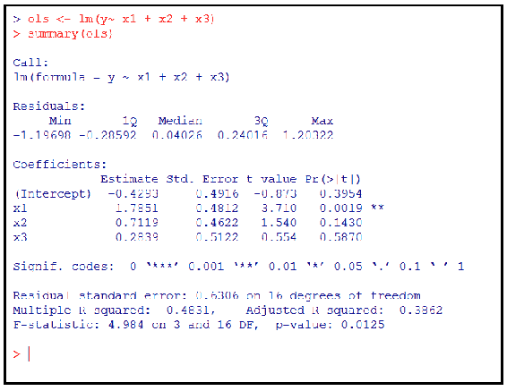
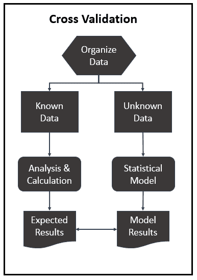
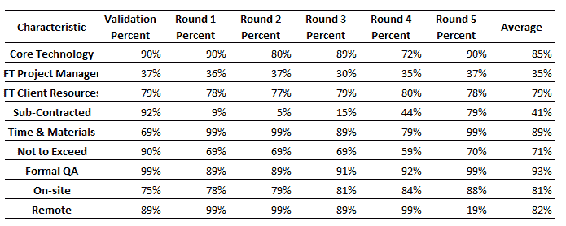
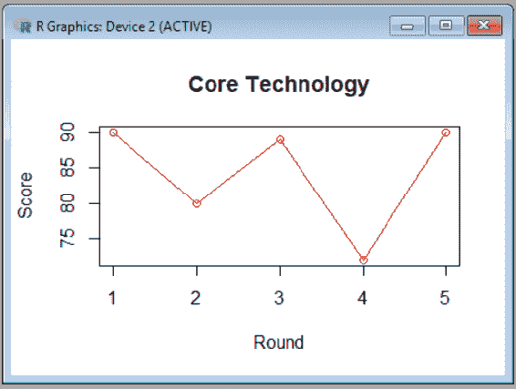
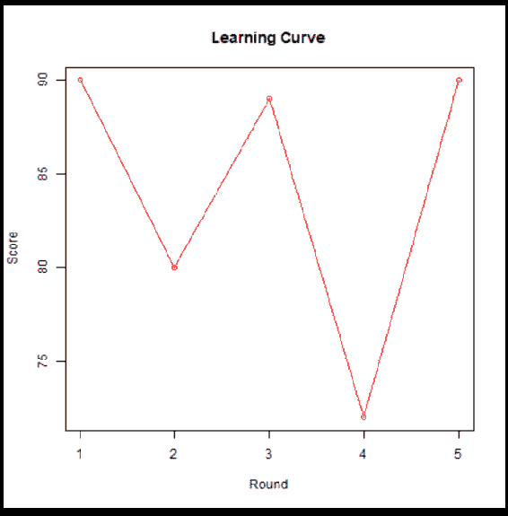

# 第八章：数据库开发与评估

本章将介绍数据（数据库）评估的实践。我们将解释什么是统计评估，为什么它对数据科学家非常重要，并通过使用 R 提供一些示范性的例子，展示如何执行各种统计评估方法。

正如我们在本书中一直努力做的那样，我们将对某些数据开发人员和数据科学家的概念进行类比，比较数据或数据库开发与数据（数据库）评估之间的区别，并对数据评估和数据（质量）保证的实践进行比较。

我们已将本章信息组织成以下几个部分：

+   评估与统计评估的比较

+   开发与评估的对比

+   数据评估是否能保证数据质量？

+   使用 R 应用统计评估方法对数据进行评估

让我们开始吧！

# 评估与统计评估

Merriam-Webster 将评估定义为：

做出判断的行为或实例。

下图展示了评估统计数据的流程：

****

我们需要记住一些统计评估的要点。它们如下所列。

# 目标

牢记这一点，要能够做出合理的评估——也就是说，做出判断——首先必须设定目标。评估目标帮助数据科学家确定如何评估数据、数据库或统计数据模型。没有明确的目标，你会浪费宝贵的时间，并且可能对一个不符合业务需求的模型产生信任，甚至可能导致错误的假设（预测）。

# 基准线

接下来，（根据你设定的目标）需要建立标准、最低可接受的性能或基准，以便对所评估的内容形成意见。换句话说，你评估的内容与所认可的可接受标准相比，表现如何？

尽管我们在这里不会花太多时间讨论数据库评估的过程（而是着重于统计数据或统计数据模型评估），但我们会提到使用特定的性能度量（性能指标或度量标准）。

数据科学家在评估统计模型的预测准确性时，通常会使用非常具体的（性能）度量标准。这些度量标准取决于所评估问题的类别或类型，并要求采用略有不同的方式来评估（模型的）性能。这一方法也同样适用于评估标准的非统计数据和数据库。例如，用于评估**在线事务处理**（**OLTP**）数据模型的性能度量标准与用于评估**企业数据仓库**（**EDW**）模型的标准将会非常不同。

更深入地看，在评估、性能测试或评估（非统计性）数据库时，需要关注不同基准的识别（即基准测试）、容量的确定与规划、执行浸泡测试或测试、峰值-休息间隔（仅举几个例子）作为努力的一部分。

# 评估规划

正如非统计性数据库（例如 OLTP、EDW 等）的类型决定了用于评估的测试类型，统计模型的类型（例如回归、分类、二分类等）也会决定数据科学家用来评估统计模型的适当评估技术或方法（稍后将在本章中详细讲解）。

一旦你设定了评估目标并建立了基准，就会制定执行计划。该计划通常概述了整个执行过程。计划中会列出要执行的测试以及测试目标、需要比较的基准，甚至包括预期结果。

# 评估

在统计学中，**性能**通常与模型的准确性互换使用。当谈到非统计性数据库或模型时，性能可能更多与速度有关——查询返回值所需时间、提交事务所需时间等——以及准确性，通常围绕质量保证的概念，而不是预测值的能力！

在评估统计模型时，数据科学家会查看模型的错误率、模型所做的错误分类数量、正确预测的数量与总预测数量的比例（由模型预测）等。此外，所有这些都取决于统计模型的类型和目标。

最后，一旦完成，数据库和统计数据模型评估的结果通常会以多种方式进行可视化，以便于评估，采用常见的方法（同样，如何呈现或可视化过程结果将取决于准备可视化的人或模型的目标）。应当理解，一旦评估结果被评估后，评估过程的各个部分（甚至整个评估过程）进行重复是很常见的。这可能是为了进一步澄清在呈现结果中识别的某些内容，或重新验证某些结果。在某些情况下，可能会制定并执行新的项目目标、基准，甚至新的计划。

总结来说，执行数据库或（统计）数据模型评估的过程，在广义上是相似的，都需要以下内容：

+   设定目标（数据库或数据模型的目标）

+   建立基准（用于比较性能）

+   确定评估计划

+   评估结果

# 开发与评估

尽管评估过程会产生输出，最终可能只是一个决策（也就是说，观察的数据、数据库或统计数据模型是否达到了基于目标的可接受性能限度？），但开发意味着构建。

开发也可以意味着通过扩展、扩大或精细化来改进。这意味着（或至少暗示）任何人所开发的东西可能永远不会完全完成。事实上，开发和评估是并行进行的。

开发任何事物的行业公认实践建议如下：

+   构建（或开发）

+   测试

+   评估

+   重复

在开发关系型数据模型时，可能会使用`create` SQL 语句，如以下代码所示：

```py
mysql> CREATE TABLE test (a INT NOT NULL AUTO_INCREMENT,
-> PRIMARY KEY (a), KEY(b))
-> ENGINE=MyISAM SELECT b,c FROM test2;
```

分析前面的代码，我们可以看到，结果是生成了一个表对象`test`。也许，保持相同的思路，评估一个（关系型）数据库或数据模型可能会使用以下代码示例的某种形式：

```py
USE AdventureWorks;
GO
SET STATISTICS IO ON
SET STATISTICS TIME ON
SELECT p.Name, pr.ProductReviewID
FROM Production.Product p
JOIN Production.ProductReview pr
ON p.ProductID = pr.ProductID
SET STATISTICS IO OFF
SET STATISTICS TIME OFF
```

像前面那样的语句执行性能工具，返回相关的统计数据，可以进行可视化和分析。

一个类似的（尽管简单的）统计开发（或创建）示例可能看起来像以下 R 代码（摘自第七章，*数据库改进的正则化*）：

```py
# --- using the R lm function to create an ordinary least squares (OLS) # -- fit of 3-variable model using x3 as an independent x3 variable
ols <- lm(y~ x1 + x2 + x3)
summary(ols)
```

同样来自第七章，*数据库改进的正则化*，我们使用 R 函数 summary 开始对生成的线性回归模型的性能进行评估：



如前所述，根据统计问题的**类别**，数据科学家将使用不同的方法或手段来评估（模型的）性能（包括 R 函数 summary）。

# 规划

在本章的上一节中，我们比较并找出了评估与统计评估之间的相似之处，并指出，作为任何评估项目的一部分（或者至少是你希望其成功的项目），你需要制定一个计划。

进入这一部分，我们将开发与评估联系起来，我们再次看到，开发过程中的第一步可能是制定一个计划。

作者认为，制定计划是生活中任何事业的基本要求，甚至是早晨起床！

当你在考虑数据库开发时所制定的计划可以在实施时作为指南（在此情况下为数据库或统计数据模型），并且在实施后作为功能规范（对于数据库）。

那么，评估一个数据库（或在统计学中，评估一个数据模型）的任务呢？嗯，同样的道理。第一步是制定一个详细的评估计划，这个计划不仅可以指导整个评估过程，评估完成后，还可以作为一个功能规范参考。

计划总是会自我付出回报。一个好的开发或评估计划可以成为详细的项目计划、验收测试计划、部署文档，并且如前所述，还可以作为功能规范的参考。

数据库设计是数据或数据库开发过程的一部分。设计一个数据库可能是一个复杂的任务。设计过程的一部分是数据建模师（或经验丰富的数据开发者）研究数据、其来源、需求等，然后生成详细的数据模型。该数据模型将包含所有必要的逻辑设计和物理设计选择，以及生成**数据定义语言**（**DDL**）所需的物理存储参数，这样就可以实际创建数据库。

一个全面的数据库开发计划应包括数据库设计阶段（从建模到创建），并在过程中指明多个测试和评估步骤。

统计建模（实际上被认为是数学建模的一种形式）涉及整合或汇集一组假设，这些假设涉及或关于生成某些样本数据和来自（希望是）更大数据集的类似数据。

生成统计模型的计划（类似于生成数据库模型的计划）应包括对（样本）数据、其来源、所有需求等的检查。同样，和前述计划一样，统计建模计划应包括提及数据科学家计划在统计模型上使用的每次评估和评估。

通常，统计模型评估计划还会包括数据科学家在每次评估测试后，计划用来阐明观点或总结结果的可视化参考。

统计建模被描述为研究一个系统或过程，以预测其未来的行为，正如 Madhuri Kulkarni 所说：

在拥有系统的观察数据的情况下，模型可以帮助推断系统的各种替代方案。

所有可用于统计建模（以及理解和操作数据）的通用工具中，R 似乎是最强大且最流行的。

从非统计建模的角度看，数据建模定义并分析支持业务流程的需求（在组织中某些信息系统的范围内）。在这里，像 Erwin Data Modeler 和 MySQL Workbench 这样的工具似乎是最常成功使用的工具。

最后，尽管开发和评估是两个独立的工作，但它们是紧密相关的，无论是统计还是非统计，一个都离不开另一个的存在。

# 数据评估和数据质量保证

为了系统地讨论，我们来看一下数据评估如何与数据质量（保证）进行比较或对比。

数据质量保证，或者通常由数据科学家称为**整理数据**，是解决（可能是感知的）数据问题或担忧的过程。这些问题会影响数据库或数据模型的使用、质量和结果（性能）——当然，数据质量相对于预期使用目的（数据、数据库或数据模型的使用）来说是相对的。

# 质量分类

通常，数据质量问题可以归类为以下几个领域之一：

+   准确性

+   完整性

+   更新状态

+   相关性

+   一致性（跨来源）

+   可靠性

+   适当性

+   可访问性

你会发现统计数据和非统计数据之间有很多数据质量分类的重叠。有时，数据质量问题可能看起来仅适用于某一特定类别——统计数据与非统计数据——但经过进一步调查或至少对数据或领域的更多经验，你可能会发现质量是质量。

数据的质量会影响结果，且数据的质量可能受到数据输入、存储和管理方式的影响，解决数据质量问题的过程（通常被称为质量保证，**数据质量保证**（**DQA**））需要定期的例行审查和评估数据，并进行名为“分析”和“清洗”的持续过程。（即使数据存储在多个不同的系统中，这些过程也至关重要，这使得这些过程变得更加困难。）

尽管数据质量保证（DQA）和整理数据的概念在许多方面相似，但 DQA 通常更侧重于可重复的过程，而整理数据通常是根据需要进行的，并且由数据科学家根据统计模型的目标自由决定（尽管有经验的数据科学家很可能会努力创建可重用的例程或脚本，以便以后在当前或其他项目中使用这些脚本来操作或整理数据）。

# 相关性

很多值得注意的重点都放在统计相关性上。统计信息的相关性反映了它满足特定项目实际需求的程度。它关心的是现有信息是否能解决项目中重要问题的相关性。评估相关性是主观的，并依赖于用户不断变化的需求。

确定和衡量数据相关性的一个关键方法是通过一个叫做**添加上下文**或**分析**的过程。

我们来看一下，这个概念是什么？

一般来说，看似相似的数据实际上可能意味着截然不同的事情。例如，平均**每分钟转速**（**RPM**）的含义，如果数据代表的是跑车与经济型汽车，甚至卡车，便会有不同的涵义。

对于数据，应该通过我们提到的分析过程来发展背景线索，这个过程被称为数据分析，以便数据使用者在使用数据时能更好地理解它。此外，了解你正在处理的数据的背景和视角，是确定应进行何种评估的关键步骤，或者对于非统计模型而言，可能需要进行哪种性能评估。

添加背景到数据的另一个动机可能是为了从数据中获得新的视角。例如，认识到并检查数据中存在的比较。例如，住宅或房价可以根据邮政编码或其他标准进行比较。

将背景添加到数据中（无论是统计的还是其他形式的），作为开发和评估过程的一部分（回想一下，我们提到过这两者是紧密结合的），确实可以使数据更加相关，但背景仍然无法替代数据的价值。

在考虑数据中的任何变量之前，例如平均转速、扭矩、最高速度、轴距、重量（或其他），最重要的是，评估测试需要使那些将要使用数据的人受益，或者换句话说，无论数据科学家希望预测什么。举例来说，如果我们扩展这个车辆数据的例子，期望的每加仑英里数（MPG）就是其中之一，因此建立适当的背景要求至关重要。

对于数据分析（或为项目中使用的数据添加背景），规则如下：

**在考虑背景之前，思考−>** **价值**

类似于我们如何分类数据质量问题的类型一样，也有几个背景类别，可以用来论证或提升数据的价值与理解，以便进行可视化：

+   定义与解释

+   比较

+   对比

+   趋势

+   离散度

评估值和数据质量，甚至数据或数据模型的价值，虽然可能有重叠的部分，但其目标是不同的。

# 交叉验证

如果一本书的章节集中在统计学（以及评估统计模型）上，而没有至少一节关于交叉验证的内容，那是不可行的。你可能听到一些数据科学家将交叉验证称为旋转估计，或者仅仅视为一种评估模型的通用技术。

交叉验证是数据科学家常用的一种方法，用来评估统计模型的准确性。交叉验证的关键概念是测试一个模型的泛化能力，或者更具体地说，测试该模型如何将从训练数据样本中推断的结果应用于整个数据集或人群。

交叉验证有两个目标——使用一个算法从可用数据中估算模型的性能，以及比较两种或更多不同算法的性能，并找出最适合可用数据的算法**。**

从高层次来看，交叉验证的过程是识别一个已知数据集，称为**验证数据集**，然后在该数据集上进行训练，接着使用第二个数据集（未知数据或首次出现的数据）进行测试（这被称为**测试数据集**）。这里的目标是尽量确保控制过拟合等问题（避免不包括信息影响结果），并且提供一些对模型如何概括实际问题或真实数据文件的理解。

# 准备数据

要执行交叉验证，数据科学家必须准备数据。这项工作将包括通过概况分析（我们在本章的前面部分提到过）来了解数据，以便将数据分为几个可比的子集。然后，确定其中一个子集为训练集并对其进行分析。接下来，一旦分析（或训练）完成，就会使用另一个子集（称为**验证集**或**测试集**）来验证结果（或性能）。

为了减少变异性，使用不同的数据分区执行多轮交叉验证（也称为**折叠**或**回合**），并在回合之间对验证结果进行平均。

通常，数据科学家会使用模型的稳定性来确定应该执行的交叉验证轮次：



如前图所示，**交叉验证**方法可以通过将数据科学家将数据群体组织成两个子集来更好地理解：**已知数据**和**未知数据**（你将在本章下一节看到如何实现这一点）。然后，数据科学家对数据进行分析并手动计算结果。一旦确定了预期的或正确的结果，就可以将其与统计模型生成的结果进行比较（使用那个独立的未知数据子集）。

上述是一次循环。将进行多次循环，比较结果后进行平均并复审，最终提供一个公平的模型预测性能估计。

让我们考虑一个实际应用场景。

在第六章《数据库改进的正则化》中，我们再次回顾了一些由咨询项目结果组成的示例数据。在这个例子中，我们探讨了项目总计费用、项目管理总小时数与项目预期盈利之间的关系。

回顾那份数据以说明一个观点，我们可以考虑不同的项目特征（而非变量）：

+   该项目是否在组织的核心技术强项范围内？

+   是否有全职项目经理被分配到该项目？

+   项目是否有全职客户资源分配？

+   项目工作是否外包了？

+   这个项目是时间和材料型的项目吗？

+   项目是否属于不超支类型的项目？

+   项目是否有正式的**质量保证** (**QA**) 部分？

+   工作是否主要在现场进行？

+   工作是否主要是远程进行（来自客户现场）？

再次，我们的预测模型旨在预测一个有利可图的咨询项目具有什么特征。

以下是使用五轮交叉验证过程预测我们模型预期准确度的结果表示：



根据前面的图示，我认为我们的预测模型预计将非常准确！

总结来说，交叉验证结合了（平均）拟合度（预测误差）度量，以得出更准确的模型预测性能估计。这个方法通常在数据不足以进行测试而不损失显著建模或测试质量的情况下使用。

现在让我们进入本章的最后一节，来看一些使用 R 编程语言进行评估的示例。

# R 和统计评估

那么，让我们开始一些统计评估工作吧！

正如我们在上一节中讨论的那样，交叉验证不是使用所有数据（整个观察集）来训练统计模型（然后使用其中一些数据进行测试），而是将数据分为训练集和测试集。

数据科学家在使用交叉验证评估统计模型性能时，首先需要做的步骤是将数据组织（或拆分）成两个独立的子集。

实际上，交叉验证有几种方法：

+   **留一法交叉验证** (**LOOCV**)

+   保留法

+   k 折交叉验证和重复 k 折交叉验证

+   重新代入（大多数人认为这是最简单的方法）

这些交叉验证方法都集中在如何拆分数据以进行训练、测试和验证。每种方法都有其优点（优缺点）。

编程问题总是有许多解决方法。以下是其中一种简单的方法。这个例子通过 70 对 30 的比例随机拆分总文件：

```py
# --- setting seed so we get same data split each time
# --- we'll use 100 for seed
set.seed(100)
# --- determine the total number of rows in the data
# --- using nrow function
nall = nrow(MyData)
# --- number of rows for train subset is 70%
# --- of the total rowsntrain = floor(0.7 * nall)
# --- number of rows for test subset is 30%
# --- of the total rows
ntest = floor(0.3* nall)
index = seq(1:nall)
# --- create the train data subsettrainIndex = sample(index, ntrain)
testIndex = index[-train]
train = mydata[trainIndex,]
test = mydata[test,]
```

一旦我们创建了所需的文件，我们就可以继续训练并验证我们的统计模型。

正如我们在本书中时不时提到的，经过验证的做法是保存前面的代码，以便在新的数据集上反复使用。

# 需要问的问题

在本章的前几节中，我们讨论了交叉验证的各种方法或途径、交叉验证的轮次（实际上，我们展示了五轮交叉验证的结果），以及如何组织和拆分数据以便对统计模型进行交叉验证。

在继续进行交叉验证过程之前，需要考虑一些要点。（一个计划已被制定！）这带出了以下问题：

1.  我应该使用哪种交叉验证方法？答案是最好的方法。然后又有一个新问题——“最好”是什么意思？每种方法都有其优缺点。最佳的交叉验证方法是最适合你的数据和目标的方法。通常，直到尝试了其他方法之后，你才会发现应该使用哪种方法。

1.  应该执行多少轮或折叠？通常，越多越好！然而，这将由你选择使用的交叉验证方法、可用数据和时间的多少等因素决定。

1.  创建每轮数据的方法是什么？这将由你选择使用的交叉验证方法、可用数据和时间的多少以及数据科学家的能力等因素决定！

# 学习曲线

评估统计模型性能的另一种方法是通过评估模型的学习增长或模型在更多经验（例如更多轮交叉验证）下改善学习的能力（获得更好的分数）。

术语**随着额外经验**在统计学中至关重要，因为我们不仅仅希望统计模型在给定数据集上表现良好，我们还希望随着模型在更多数据上进行训练和测试，其性能能不断改善。

表示模型性能、结果或分数的信息通常会与其他分数结合，显示为一条线或曲线——这就是统计模型的学习曲线。

这意味着学习曲线是学习增长（在纵轴上显示的分数）与实践（在横轴上显示的各个数据文件或轮次）之间的图形表示。

这也可以用以下方式来概念化：

+   在一系列中重复相同的任务

+   随时间积累的知识

# 学习曲线示例

举个例子，假设我们想要可视化一个统计模型在多轮表现结果中的学习增长速度，比较测试数据与训练数据在某一特征上的表现。

这在本章的前面部分已有展示：


以下是一个可视化，显示了使用前述交叉验证轮次的结果分数所表示的预测模型学习速度：



核心技术

以下是生成前述可视化的示例 R 代码：

```py
# --- load scores from 5 rounds of testing
v <-c(90,80, 89,72, 90)
# -- plot the model scores round by round
plot(v, type = "o", col = "red", xlab = "Round", ylab = "Score", main = "Core Technology")
```

再次提到，学习曲线将统计模型的表现与经验联系起来，通常在进行模型评估时使用，尤其是在进行多轮测试（或分析工作，以确定用于统计模型的正确交叉验证方法）时。

到目前为止，仅仅进行测试轮次然后查看结果还不够。一个经验丰富的数据科学家会确保正确地记录每一次测试的迭代过程，以及相应的结果和结论。

再次查看前面的示例，我们可以添加对 R 函数`png`的使用，它可以用来自动创建并保存你在评估过程中创建的任何可视化的图像文件。如果你预先定义了一个文件结构来保存你的评估结果，并使用这种或类似的方法，它将为你节省大量的时间。

R 函数`png`可以轻松地转换为许多其他位图格式，并且它们都可以在现代的网页浏览器中显示！

以下是我们的示例 R 代码语句，展示了数据的设置、图像文件的创建以及绘图可视化的生成：

```py
# --- load scores from 5 rounds of testing
v <-c(90,80, 89,72, 90)
# -- create an image file for the visualization for later use
png(file = "c:/provenpratice/learning curve.png", type = c("windows", "cairo", "cairo-png"))
# -- plot the model scores round by round
plot(v, type = "o", col = "red", xlab = "Round", ylab = "Score", main = "Learning Curve")
# -- close output
dev.off()
```

你需要注意的是，如果你期望得到交互式结果，你将不会收到！前面的代码使用了`png`，这只是将输出（来自`plot`函数的结果）写入那个文件。

好的实践建议：使用`dev.off()`确保文件已关闭。

这将创建以下图形文件：



# 总结

在本章中，我们定义了评估，并且考察了评估与统计评估之间的相似性和差异。接着，我们讨论了开发与评估之间的关系，并解释了数据评估与数据质量保证之间的部分重叠，二者是并行的，但目标不同。最后，我们应用了使用编程工具 R 进行统计评估的概念。

在下一章中，我们将定义神经网络模型，并借助开发人员对数据模型的理解来帮助理解神经网络在数据科学中的目的和应用。
