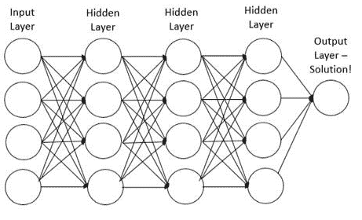
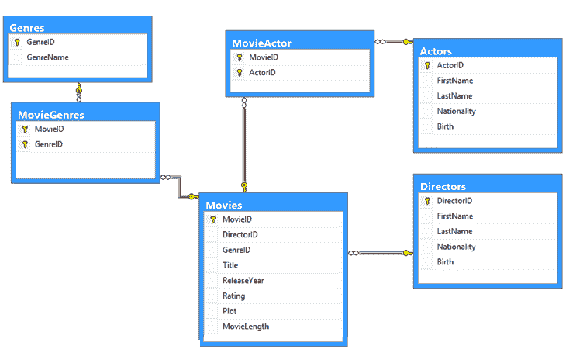
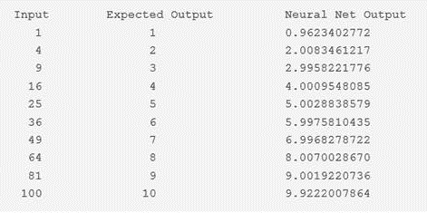
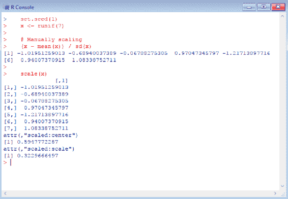

# 第九章：数据库与神经网络

在本章中，我们将定义**人工神经网络**（**ANN**），并结合数据开发人员对数据、数据库和数据模型的知识，帮助他们理解神经网络的目的和用途，以及为什么神经网络对数据科学和统计学如此重要。

我们已将本章内容整理为以下几个关键领域：

+   神经网络的定义

+   将神经网络模型与数据库模型联系起来

+   查看基于 R 的神经网络

+   用例

# 问问任何数据科学家

今天，如果你问任何数据科学家关于统计方法的问题（即便是几个问题），你很可能会发现如今在数据科学和统计行业中，最著名的两种统计方法就是用于预测建模的这两种方法。我们在第六章*数据库发展到数据库回归*中介绍了这两种方法。

这两种方法如下：

+   线性回归

+   逻辑回归

**线性回归**方法可能被认为是预测数值量时问题的*经典*或最常见的起点。**线性回归**（或**LR**）模型基于输入特征的线性组合。

**逻辑回归**方法使用对这种线性特征组合的非线性变换，以将输出的范围限制在区间[0, 1]内。这样，它预测输出属于两个类别之一的概率。因此，它是一个非常著名的分类技术。

记住，分类是根据训练数据集，识别新的或不同的观察结果属于哪一类别（或子人群）的过程。

这两种方法各有其独特的优势，但它们也有相同的缺点，即在面对大量输入特征的情况时，它们的预测效果并不好。

在本章中（作为线性回归和逻辑回归的替代方法），我们希望介绍人工神经网络（ANN）的概念，这实际上是一种非线性的方法，用于解决回归和分类问题。

当处理更高维的输入特征空间时（ANNs）具有显著更强的鲁棒性，并且在分类问题中，它们具有一种**自然**的方式来处理多于两个输出类别的问题。我们将在本章后面详细讨论 ANN 的优势。

人工神经网络是一种**生物启发式**统计方法或模型（基于生物神经网络的结构和功能），其根源可以追溯到 20 世纪 40 年代。

另一个有趣的观点：

神经网络是一种机器学习框架，试图模仿自然生物神经网络的学习模式。

- Jose Portilla，Udemy 数据科学讲师。

自那时以来，人工神经网络的兴趣变化很大——主要是因为最早的人工神经网络模型非常初步，因此与当时的预期相比，实践中发现其局限性。

神经网络并不总是受欢迎，部分原因是它们计算上昂贵，且在某些情况下仍然如此；另外，部分原因是与更简单的方法如**支持向量机**（**SVMs**）相比，它们似乎并没有带来更好的结果。然而，神经网络再次引起了关注并变得流行。

-Michy Alice, 2015 年 9 月。

此外，训练一个大型人工神经网络确实需要大量的计算资源。最近，由于分布式按需计算资源的普及，人工神经网络的兴趣重新激增，并且被称为**深度学习**的机器学习领域已经非常流行，且展现出巨大潜力。

时机恰到好处！

因此，现在是数据开发者开始学习 ANNs 模型的好时机。

深度学习（也称为**深度结构学习**、**层次学习**或**深度机器学习**）是一类使用多个非线性处理单元层级来进行特征提取和转换的机器学习算法 ([en.wikipedia.org/wiki/Deep_learning](https://en.wikipedia.org/wiki/Deep_learning))。

开始吧！

# 定义神经网络

我们的方法是始终从一个明确的定义开始。那么——什么是人工神经网络呢？或许是：

一个模拟人脑和神经系统的计算机系统。

一个常见的理解，或者如果我们在线查找定义的话：

*在机器学习和认知科学中，人工神经网络（ANNs）是一类受生物神经网络启发的模型（尤其是动物的中央神经系统，特别是大脑），用于估计或近似那些可能依赖大量输入并且通常是未知的函数。*

所以有许多不同的定义，但总体来说，你会发现所有关于 ANNs 的定义都围绕着一个共同的主题：它被定义为基于人脑工作原理的计算机数据模型。



ANN 模型表示

正如前面的截图所示，典型的人工神经网络的构建基于以下几个要素：

+   节点

+   层

+   连接

# 节点

每一层由若干互相连接的节点组成——每个节点包含所谓的**激活函数**。

输入层中将至少有一个节点用于每个数据中的预测变量。输入节点将输入值（**待解决的问题**）传递给（下一个）隐藏层中的每个节点。

每个节点的输入会被求和，得到一个单一的值，*x*。然后，这个值会被输入到节点的激活函数中，节点的输出就是其激活函数的输出，*f*(*x*)。

人工神经网络节点中可以使用多种函数，包括径向基函数或简单的线性函数，但最常见的是 Sigmoid 函数或逻辑函数。

Sigmoid 函数通常是最常见且也许最容易理解的。Sigmoid 函数是一个数学函数，具有特征的 S 形曲线或 Sigmoid 曲线。Sigmoid 函数的定义域为所有实数，返回值通常单调递增，从 0 到 1，或者根据约定，从-1 到 1。（[`en.wikipedia.org/wiki/Sigmoid_function`](https://en.wikipedia.org/wiki/Sigmoid_function)）

人工神经网络中的节点总是会产生或计算一个介于 0 和 1 之间的值，因此一个节点的输出只能在 0 到 1 之间。

# 层

**层**是一个通用术语，用来定义在人工神经网络中按特定深度协同工作的**节点**集合。

隐含层将有一个可变数量的节点（由使用的训练算法决定）。每个节点将包含多个逻辑函数，用来处理输入并计算结果。最终结果将被传递到下一层。

层的总结如下：

+   **输入层**：该层包含你的数据，每个变量对应一个节点。

+   **隐含层**：每一层通过最小化误差/成本函数，尝试学习关于数据的不同方面。

+   **输出层**：这是最简单的一层，通常由一个用于分类问题的输出组成。

# 训练

回忆上一节描述的人工神经网络节点，如果所有节点的工作方式相同，或者至少产生相同的结果（0 或 1），那么网络如何区分不同的类别呢？

它将权重分配给每个节点的输入。这是一个特征（或数据中的变量），其权重可以大也可以小，进而导致变量或特征对任何节点的*和*的贡献有所不同。

实际上，一个变量可以被赋予一个较大的权重，传递到一个节点，而传递到另一个节点的权重几乎为零，这意味着该变量对第一个节点的影响很大，对第二个节点几乎没有影响。

Sigmoid 函数（我们在上一节也提到了）表明，当节点的*x*值跨越一个阈值时，节点的输出会从 0 变为 1。这可以通过多种方式发生，例如当一个高权重的输入具有较高的值，或者一组中等权重的输入具有较高的值时。

训练人工神经网络的过程是系统地发现最优权重值，以最大化分类的准确性。

# 解决方案

隐藏层中某个节点的输出值会与进行计算的节点的权重相乘，并加到其他节点的加权值中。这一求和结果成为人工神经网络模型的输出或解决方案。（需要注意的是，这个术语在数据科学家之间有所不同，有些人称之为输出，有些人称之为解决方案、结果，甚至是结果值）。

再次强调，问题被呈现给人工神经网络（通过模型的输入层），该网络会传递到一个或（更可能）多个隐藏层，实际的处理通过加权连接的系统完成。然后，隐藏层与输出层相连接，给出解决方案。

大多数人工神经网络模型包含某种形式的算法，决定模型如何**学习**。这个算法就是我们之前讨论的，通过它根据提交给模型的（输入）问题来**调整节点连接的权重**。

这种**调整节点权重**（有些人称之为**右调节**）类似于基于经验（在这种情况下，经验可能是反复查看示例）来识别图像（或**确定解决方案**）的想法。

# 理解这些概念

要理解一个新概念，通常有助于将熟悉的内容与新知识进行对比。

为了更好地理解人工神经网络的概念，比较 ANNs 与传统数据库算法如何处理数据和信息（或它是如何工作的）将会是有帮助的。

在下一节中，我们将比较人工神经网络模型的概念与常见的数据或数据库模型。

# 神经网络模型和数据库模型

正如我们在本章前面部分所指出的那样，神经网络模型是一个**处理节点系统**，跨越不同层级互联，这些层级不会以顺序的方式处理数据。那么，这种结构与传统的数据库模型或程序有什么不同呢？



传统数据库模型表示

正如我们在本章前面部分所指出的那样，神经网络模型是一个**处理节点系统**，跨越不同层级互联，这些层级不会以顺序的方式处理数据。那么，这种结构与传统的数据库模型或程序有什么不同呢？

在技术行业中，传统的（数据库）模型有时被称为**串行处理组件**，这意味着这种类型的模型拥有一个中央处理单元或 CPU（或许你可以将其理解为一个大型的中央*处理节点*），用于访问存储在内存中的原始数据和指令。

在传统的数据库模型中，中央处理器对输入或选定的数据进行计算或逻辑处理（算法），存储计算结果（在指定的内存位置），然后继续执行下一个指令（和数据），依此类推——直到达到解决方案或结果。

这个概念有点类似于神经网络中单独处理*流*的概念：

+   一个节点接受或消耗数据

+   一个节点应用逻辑

+   一个节点输出它的结果

虽然相似，但请记住，传统数据库模型是串行的，因为它们按线性或一个接一个的方式执行每个任务（或指令），而人工神经网络模型中的多个节点流则并行执行任务。

因此，在一个串行系统中，计算步骤是确定性的、顺序的和逻辑的，并且可以从一个操作到另一个操作追踪给定变量的状态。相比之下，人工神经网络（ANNs）既不是顺序的，也不一定是确定性的。

还有其他一些关键的不同之处，包括以下在接下来的子部分中解释的概念。

# 没有单一或主要节点

不是一个复杂的中央处理器（或节点），而是许多简单的节点——它们通常只做一件事，即将它们从其他节点接收到的加权和进行计算。

# 不是串行的

人工神经网络并不按顺序或串行执行编程指令；它们并行响应（无论是模拟的还是实际的）提供给它们的输入。

# 没有内存地址来存储结果

在人工神经网络模型中，也没有单独的内存地址来存储数据。

相反，信息包含在模型的整体激活*状态*中。因此，**知识**由人工神经网络模型本身表示，它字面上是其各个组成部分的总和之外。

最后，对于数据开发者来说，人工神经网络的概念可以想象为**启动**并异步运行多个 SQL 查询。试想创建一个简单分支任务流的 SQL **DTS**（**数据转换服务**）或**SQL Server 集成服务**（**SSIS**）包，这样 DTS 将会在单独的**spids**（**服务器进程 ID**）中启动任务。每个 spid 随后将与神经网络节点流的概念相对齐，所有节点并行工作以创建结果或解决方案。

一个非常好的神经网络工作原理的解释——通过一个数据开发者类型的实际例子——可以在线找到，作者是 Sunil Ray。

理解和从头编写神经网络的 Python 和 R 代码，在撰写本文时，可以在[www.analyticsvidhya.com](http://www.analyticsvidhya.com)上找到，链接为：[/blog/2017/05/neural-network-from-scratch-in-python-and-r](https://www.analyticsvidhya.com/blog/2017/05/neural-network-from-scratch-in-python-and-r/)。

他提到以下引述：

*“如果你曾经是开发人员，或者看过开发人员的工作，你会知道在代码中搜索 bug 是什么感觉。你会通过改变输入或环境来运行不同的测试用例，查看输出。输出的变化会给你一些提示，告诉你应该查找哪个模块，阅读哪些行。找到问题后，你会进行修改，然后继续这个过程，直到你有了正确的代码/应用。”*

*神经网络的工作方式非常相似。它接受多个输入，通过多个隐藏层的多个神经元处理数据，然后通过输出层返回结果。这个结果估算过程在技术上被称为**前向传播**。*

*接下来，我们将结果与实际输出进行比较。任务是将神经网络的输出尽可能接近实际（期望的）输出。每个神经元都会对最终输出贡献一定的误差。如何减少这些误差？*

*我们试图最小化那些对误差贡献较大的神经元的值/权重，而这发生在神经网络反向传播过程中，找出误差所在的地方。这个过程被称为**反向传播**。*

好的，这确实有点多——但现在，幸运的话，我们已经对人工神经网络是什么以及它如何工作有了一个相对清晰的理解。接下来，让我们看看 ANN 和 R 编程语言的结合。

# 基于 R 的神经网络

现在我们已经了解了一些人工神经网络的工作原理，让我们回顾一些实现 ANN 的基本信息，特别是使用 R 编程语言时。


基于 R 的 ANN 包

这里的目的是不是提供一个详细的步骤指南，告诉你如何创建一个复杂且强大的 ANN，而是展示如何通过 R 语言轻松创建一个 ANN 模型——实际上只需要基本的 R 技能或经验。

# 参考文献

是的，你会发现，互联网上有大量尊重且易于理解的、关于人工神经网络的有价值信息和示例，值得一读。

一个这样的资源由 Gekko Quant 提供，([`gekkoquant.com/author/gekkoquant/`](http://gekkoquant.com/author/gekkoquant/))，值得花时间查找并阅读。

这段信息提供了一个非常好的教程，展示了如何创建一个人工神经网络，该网络接受一个输入（你想计算平方根的数字）并输出一个结果（该数字的平方根）。

这个人工神经网络示例模型的输出以易于理解的格式展示，我将在这里展示它作为一个很好的示例，说明 ANN 模型的输出应如何呈现：



人工神经网络的结果

从这里显示的输出信息可以看出（正如作者所声明的），神经网络在求平方根（每个输入数值）的任务中表现得相当不错。

在数据科学家开始拟合人工神经网络之前，必须完成一些节省时间的重要准备工作，我们将在接下来的几节中讨论这些内容。

需要明确的是，人工神经网络并不容易理解、训练和调优；因此，强烈建议先进行一些预处理。

# 数据准备和预处理

让我们从显而易见的开始——我们的数据！

数据科学家在使用 ANN 模型时经验越丰富，就越能理解正式审查和准备数据的重要性，在开始尝试训练或拟合模型之前，提前做好数据准备是至关重要的。

我们在第三章*，开发者的数据清理方法*中讨论了数据清理，因此到此为止，你应该对数据清理和净化的过程有一个较好的理解，在这里我们将重点关注一些更具体的与人工神经网络模型相关的数据准备工作。

数据科学家普遍认为，在训练人工神经网络之前，对数据进行归一化可能是一个好的做法。根据你的数据，如果不进行任何数据归一化，可能会导致不可用的结果，或者至少是非常困难的训练过程；大多数情况下，算法在达到最大迭代次数之前不会收敛——换句话说，它会用尽所有尝试！

根据行业经验，如果数据没有经过归一化，人工神经网络可能会在达到最大迭代次数之前难以收敛。

尽管有许多方法可以实现数据归一化，但最常用的一种是 R 语言内置的`scale()`函数，它可以轻松完成这一任务。

`scale()`函数是一个通用的 R 语言函数，其默认方法会为你居中和/或缩放（归一化）数值矩阵的列。

我喜欢使用简单的 R 代码语句来演示以下缩放示例，因为这可以明显看出`scale()`函数正确工作（是否如预期？），而且比手动缩放（即编写 R 代码语句来缩放值）要有效得多。

快速看一下：

```py
Setting up the sample data, in the object named "x":
# --- set up the data
Set.seed(1)
X <- runif(7)
Next, here is the manual scaling approach, using mean and sd:
#---manual scale method
(x - mean(x)) /sd(x)
And then the use of the R scale function:
# --- scale using the function
Scale(x)
```

最后，这是输出，显示了手动缩放方法和缩放函数所产生的相同结果：



太棒了！

# 数据拆分

我们预处理的下一步是*拆分数据*。我们在第八章，*数据库开发与评估*中详细讨论了数据*拆分*，所以在这里我们不会再重提这个话题。

然而，请记住，数据拆分的过程旨在从原始数据集或来源中创建训练子集和测试子集（基于适当的逻辑）。

例如，我们可以通过*随机*将数据拆分为训练集和测试集，接着拟合线性回归模型，并在测试数据集上进行测试（或者使用我们在上一章中使用的拆分方法，创建一个 70/30 的拆分）。

# 模型参数

没有最佳实践或推荐规则能够告诉数据科学家在人工神经网络模型中应该使用多少层和/或节点（尽管有几条或多或少被业界接受的规则）。

通常，如果需要的话，一个隐藏层对于大多数或大量的人工神经网络统计应用已经足够（尽管你可能注意到，我们在本章开始时的图形图像中展示了三个隐藏层）。

就节点数而言，节点数通常应介于输入层大小和输出层大小之间，通常是输入大小的 2/3。

归根结底——当数据科学家确定在其人工神经网络模型中应该有多少层和节点时，他们将不断测试、测试、再测试（一次又一次），以找到最佳或最优化的解决方案，以满足当前的需求，因为无法保证任何过去的经验或*规则*能最适合你的统计模型。

# 交叉验证

**交叉验证**是我们在第二章*中介绍的一个重要话题，目标声明*，我们再次提醒它是构建任何预测模型时的一个非常重要的步骤。

虽然有很多不同种类的交叉验证方法，但基本的思路是数据科学家重复以下过程若干次：

**训练我，测试我，拆分我**：

1.  进行训练-测试拆分。

1.  将模型拟合到训练集。

1.  在测试集上测试模型。

1.  计算并回顾预测误差。

1.  重复（*n*次）。

通过多次执行上述过程，数据科学家将能够计算出平均误差，并用其来评估统计模型的表现（性能是另一个重要话题，我们在第八章*，数据库开发与评估*中进行了讨论）。

# 用于 ANN 开发的 R 包

那么，数据科学家如何创建自己的**人工神经网络**（**ANN**）呢？

R 编程语言（截至本文编写时）提供了多种创建不同类型人工神经网络的包。这些包目前包括以下内容。

# ANN

本包提供了一个由**遗传算法**（**GA**）优化的前馈人工神经网络。

# ANN2

这提供了使用梯度下降训练一般的分类和回归神经网络。

# NNET

Ripley 创建的 NNET 包提供了用于单层隐藏层前馈神经网络和多项式对数线性模型的方法。具体来说，本书的这一章节将介绍 NNET 方法。在这里，我们简要描述了所使用的方法和参数。

请注意，我是这样拆分数据的：以随机方式将 90%的数据作为训练集，10%作为测试集，重复 10 次。

我还使用`plyr`库初始化了一个进度条，因为我希望在神经网络的拟合过程中保持对状态的关注，毕竟这一过程可能会花费一些时间。

# 黑箱

人工神经网络（ANNs）非常难以理解（即使是对于最先进或经验丰富的数据科学家）。解释它们的结果（或输出）比解释简单模型（如线性模型）的结果要复杂得多。

有时，数据科学家对人工神经网络模型的理解仅停留在非常高层次。虽然仅有这样的理解水平也能保持生产力，但如果无法完全理解人工神经网络模型的内部工作原理，可能会导致一种情况，即所谓的**BBU**模型或**黑箱理解模型**或方法。

黑箱模型、方法或系统是指仅能从其输入和输出角度来看待，而无法了解其内部工作原理的模型、方法或系统。

因此，根据你需要的应用类型，你可能需要记住，在模型结果能够有用之前，你必须能够恰当地解释模型的结果（而不仅仅是运行模型并产生结果），因此需要投入时间去深入理解所使用的模型和方法。

# 一个使用案例

有人说过（很可能不是数据科学家！）：

*神经网络模型无法学习任何一个合理聪明的人，在相同数据上经过足够时间学习后无法学到的东西。*

这一声明中的关键术语是“足够的时间”。数据科学家（以及人类通常）几乎从未拥有足够的时间——时间可能就是决定你所在组织能否超越竞争对手的关键。

支持使用人工神经网络（而非*合理聪明*的人类）的理由之一是，人工神经网络模型的一些额外优势如下：

+   发现别人甚至从未想象过的东西

+   在比一团队还短的时间内找到解决方案

+   以更低的成本产生结果

+   在经过训练的输入下，产生一致的结果，并且如果适当调整，应该能够很好地泛化

+   神经网络永远不会感到厌倦或分心。

有了这些优势后，我们来看看人工神经网络模型的一些实际应用场景。

# 流行的应用案例

人工神经网络有许多应用。通过调查行业，最成熟的人工神经网络应用案例包括以下几种。

# 字符识别

神经网络可以用于识别手写字符，将手写内容实时转换为控制计算机，或用于**自动车牌识别**（**ANPR**），自动读取车辆注册号牌。

# 图像压缩

神经网络能够一次性接收并处理巨量信息，这使它们在图像压缩中具有重要作用。随着大数据的爆炸式增长，应用人工神经网络（ANN）于数字图像，以降低存储或传输的成本，已成为一个日益增长的机会。

# 股票市场预测

股票市场的实时波动极为复杂，受到众多因素的影响。许多因素如最高价、最低价、开盘价、收盘价、交易量、其他证券的价格以及经济指标都会对其产生影响。由于神经网络能够快速分析大量信息，它们可以用于预测股价。

# 欺诈检测

近年来，新技术的发展也为犯罪分子实施欺诈提供了更多方式。神经网络可以通过从样本中学习可疑模式，识别近似的类别、聚类或可疑行为模式，并利用这些模式来进行欺诈检测。

# 神经科学

理论与计算神经科学是生物神经系统的理论分析与计算建模的研究领域。由于神经系统试图复制认知过程和行为，因此该领域与认知与行为建模密切相关。

# 总结

本章中，我们定义了神经网络，并从数据开发者对数据库和数据模型的知识出发，逐步理解了神经网络的目的和用途，以及神经网络为何对数据科学如此重要。我们还介绍了基于 R 的 ANN，并列出了几个流行的应用案例。

在下一章中，我们将介绍使用统计提升方法，更好地理解数据库中的数据。
