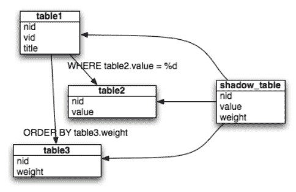

# 第十章：提升你的数据库

本章中，我们将解释什么是统计提升，它如何运作，并介绍如何利用统计提升更好地理解数据库中的数据。

我们已经将本章的主题分解为以下重要领域以便更清晰：

+   统计提升的定义与目的

+   你可以从提升（帮助）你的数据库中学到什么

+   使用 R 来说明提升方法

# 定义与目的

首先，我们可以考虑一个你可能在网上找到的常见定义：

提升是一种机器学习集成元算法，主要用于减少偏差，同时也减少监督学习中的方差，是一类将弱学习器转化为强学习器的机器学习算法。

-维基百科

[`en.wikipedia.org/wiki/Boosting_(machine_learning)`](https://en.wikipedia.org/wiki/Boosting_(machine_learning))

提醒：在统计学中，集成方法使用多个学习算法，目的是获得比任何基础学习算法更好的预测性能（尽管结果因数据和数据模型而异）。

在我们深入了解统计学提升的细节之前，首先必须花些时间理解偏差、方差、噪声，以及什么是弱学习器和强学习器。

接下来的章节将涵盖这些术语和相关概念。

# 偏差

让我们从讨论统计偏差开始。

如果统计量的计算方式使其在分析上与被估计的总体参数不相似，那么该统计量就存在偏差。

我遇到过的关于偏差的最佳解释是一个偏离零的小刻度的概念。在这种情况下，刻度会给出略微高估的结果。换句话说，当某人站上秤时，总体体重可能被高估或低估（这可能让那个人觉得他们的饮食比实际效果更好）。

在统计学中，数据科学家需要认识到，实际上有多个常用的类别来定义统计偏差。下一节将列出这些偏差类别并提供示例。

偏差的分类有些主观，因为某些类别可能会有重叠的情况。

# 偏差的分类

偏差有许多类别，包括以下具体示例：

+   **选择偏差**：指的是某些个体观察值比其他观察值更可能被选中进行研究。

+   **谱偏差**：当数据科学家在偏倚的样本上评估结果时，导致对测试的敏感性和特异性估计过高。

+   **估计器偏差**：指的是估计器的期望值与被估计参数的真实值之间的差异。

+   **遗漏变量偏差**：在回归分析中估计参数时，如果假设的模型忽略了某个自变量，就会出现这种偏差。

+   **检测偏差**：当某个特征或事件在特定研究对象组中更容易被观察到时，就会发生这种偏差。

+   **抽样偏差**：当由于抽样数据的错误而导致统计误差时，就会发生这种偏差。

+   **测量偏差**：当测试内容、测试管理和/或评分程序存在系统性问题时，就会发生这种偏差。

+   **资金偏差**：这种类型的偏差可能导致选择特定的结果、观察、测试样本或测试程序，这些都偏向于研究的资金赞助者。

+   **报告偏差**：这种类型的偏差涉及数据可用性的偏差，这导致某种类型或集合的观察结果更有可能被报告为结果，或影响表现。

+   **分析偏差**：这种偏差发生在用于评估某些观察结果或统计模型整体表现的方法或过程上。

+   **排除偏差**：这种偏差类别可能由于某个过程或程序而产生，该过程或程序有可能系统性地排除某些样本或观察结果，导致统计研究中的样本或观察缺失。

+   **脱落偏差**：当研究或统计项目中的参与者离开程序或过程时。换句话说，一个项目的某个组或类别可能会离开或被移除，并且不再被数据科学家考虑。

+   **回忆偏差**：当研究参与者的准确性或完整性由于对过去事件或研究对象特征的错误记忆而不一致时。这会导致结果的高估或低估。

+   **观察者偏差**：这种偏差发生在研究人员由于认知偏差无意识地影响数据时，判断可能会改变观察或研究的进行方式/结果的记录方式。

+   **混杂偏差**：当影响研究中相同信息的因素使研究者或数据科学家感到误导或困惑时，就会发生这种偏差。

+   **负面偏差**：当数据科学家倾向于对负面的特征、事件或结果赋予更多的权重或价值，仅仅因为它们是负面的时，就会发生这种情况。

+   **代表性偏差**：当数据科学家根据群体中识别出的某些观察特征将某些事情视为理所当然时，就会发生这种偏差。

+   **近期偏差**：这种偏差类别发生在数据科学家使用最近的经验和观察（或赋予更多的价值）来预测未来结果时。

而我最喜欢的其中一种类型是：

+   **数据窥探偏差**：当数据科学家形成错误的意见或提出假设，并随后挖掘数据以特别支持该观点时，就会发生这种情况。

# 偏差的原因

*偏差* 是一个你会在统计学领域常常听到的术语，几乎总是与负面或不良事件相关。事实上，甚至在统计学的领域之外，偏差几乎总是导致麻烦或某种形式的困扰。

将偏差视为偏袒。举例来说，在数据收集过程中存在的偏袒通常会导致误导性结果或错误的假设。

偏差可以以各种方式出现，作为数据科学家，必须熟悉这些情况。事实上，偏差可以在任何时间或阶段进入统计项目。

引入偏差最常见的时机之一就是项目一开始的数据收集或选择时。这个时候是最糟糕的，因为几乎所有后续的工作和努力都会受到怀疑，或者很可能是错误的。

# 偏差数据收集

偏差的一个主要来源是数据的收集方式。坦率地说，经验不足的研究人员，或者有某种特定结果期望的研究人员，可能会使用低劣的数据收集方法或实践，甚至以一种强调某种特定倾向或导致预期结果的方式收集数据。

数据收集方法中需要注意的事项：

+   带有特定倾向或强调的调查

+   选择一个已知的、具有特定背景的群体来回答调查

+   以误导性分类方式报告数据

+   非随机的样本选择

+   系统性测量误差

# 偏差样本选择

样本选择或抽样过程同样容易引入偏差。当样本不能准确代表总体时，就会出现样本偏差。由不具代表性的样本引发的偏差被称为**选择偏差**。

可能导致在统计样本中引入偏差的问题包括：

+   采样的时机

+   样本的长度或大小

+   问题的难度级别

+   低覆盖率（对于总体）

+   非回应错误地用于样本中

+   自愿回应错误地用于样本中

+   样本中被联系的方式（电话、邮件、上门等），或观察数据的划分方式

偏差说得够多了。让我们进入下一部分，讨论统计方差。

# 方差

在统计学理论中（[`en.wikipedia.org/wiki/Statistics`](https://en.wikipedia.org/wiki/Statistics)），方差的概念定义如下：

随机变量与其均值的平方偏差的期望值（[`en.wikipedia.org/wiki/Expected_value`](https://en.wikipedia.org/wiki/Expected_value)），换句话说，它是衡量一组随机数相对于其平均值的分散程度。

方差分析的实践（或简称方差分析）涉及数据科学家评估两个数值之间的差异。通常，这一过程应用于财务或运营数据，试图识别并确定方差的原因。在应用统计学中，方差分析有不同的形式。

方差和方差分析是统计学领域中的一个重要话题，它在以下统计实践中发挥着关键作用：

+   描述性统计 ([`en.wikipedia.org/wiki/Descriptive_statistics`](https://en.wikipedia.org/wiki/Descriptive_statistics))

+   拟合优度 ([`en.wikipedia.org/wiki/Goodness_of_fit`](https://en.wikipedia.org/wiki/Goodness_of_fit))

+   假设检验 ([`en.wikipedia.org/wiki/Statistical_hypothesis_testing`](https://en.wikipedia.org/wiki/Statistical_hypothesis_testing))

+   蒙特卡罗采样 ([`en.wikipedia.org/wiki/Monte_Carlo_method`](https://en.wikipedia.org/wiki/Monte_Carlo_method))

+   统计推断 ([`en.wikipedia.org/wiki/Statistical_inference`](https://en.wikipedia.org/wiki/Statistical_inference))

你会发现方差分析有以下规律：

+   每当需要进行数据的统计分析时，数据科学家很可能会首先进行方差分析。

+   统计方差为数据科学家提供了一个衡量数据如何分布（围绕均值或预期值）的标准。

+   与范围（仅看极端值）不同，方差会考虑所有数据点，并得出它们的分布结论。

# 方差分析（ANOVA）

作为数据科学家，当你谈论方差分析的过程或实践时，你实际上是在谈论**ANOVA**。ANOVA 可以理解为一系列方法，用于研究群体均值之间发现或潜在的差异（方差）及其相关过程。

方差分析（ANOVA）在统计学领域有三种不同的研究和应用方式。这些方式由数据科学家处理或感兴趣的独立变量的数量来决定和定义：

+   单因素方差分析（只处理一个独立变量）

+   双因素方差分析（使用或关注两个独立变量）

+   多因素方差分析（当数据科学家感兴趣的不止两个独立变量时）

当数据科学家或研究人员进行 ANOVA 时，他们的目的是判断其群体内部是否存在统计学上显著的差异。如果他们发现存在差异，他们将继续确定这些群体差异的具体位置。

# 噪声

噪声，或者对数据科学家来说，统计噪声，是指在样本、群体或数据源中公认的无法解释的变化量或变异性。

*噪声*一词的实际应用可以追溯到早期的信号处理，当时它被用来指代那些被发现会降低信号和数据质量的、不希望出现的（电磁）能量。

对于数据或数据库开发人员来说，考虑这样一个例子：运行一个简单的数据库查询，来确定某个特定销售区域的业绩。如果你的 SQL 查询返回所有销售区域的销售数据，那么在这个练习的背景下，你可能会把其他的销售区域看作噪声，这些噪声使得销售信息变得无用（再说一次，是在试图关注某个特定销售区域的背景下）。当然，为了解决这个问题，你可以重新构造查询，以过滤掉不需要的区域，或者修改查询结果，以去除不需要区域的噪声。请记住，在统计学中，重建数据源可能不现实。

# 噪声数据

在统计学之外，人们常常使用“统计噪声”这一术语来抛开他们不感兴趣的数据。一个例子是职业足球队的体育场，球迷的欢呼声干扰了客队的沟通能力。噪声成了不便。

然而，在统计学中，当数据科学家意识到样本中存在噪声时，意味着任何来自统计抽样的结果，如果重复这个过程，可能无法再现。在这种情况下，样本可能变成噪声数据，并因为过多的变异而变得毫无意义。

揭示噪声与真实信号之间的关系，几乎一直是统计学中的一个重要议题（以便研究人员能够使用有意义的数据），然而，噪声数据中有意义的数据比例通常太小，以至于难以派上用场。

随着时间的推移，*噪声数据*这个术语也被用来指代*任何机器无法读取的数据*，例如非结构化文本，甚至是任何在某种程度上被修改，导致不再与创建它的程序兼容的数据。幸运的是，分析工具的进步正在稳步克服这些统计障碍（比如 IBM Watson 分析工具，当然还有许多其他工具）。

一些最常见的统计噪声示例包括高斯噪声、散射噪声和白噪声。好了，够了，我们不再谈论（统计）噪声了！

让我们继续讨论学习者。

# 弱学习者和强学习者

一个很好的过渡（回到）提升方法的主题，是统计算法或模型在时间推移中的预测能力的提升，也就是其性能的提高。

如果你正在阅读这本书，并且已经到达了这一章节的这一部分，那么假设你已经理解了与统计预测相关的机器学习概念。学习是指计算机或模型能够学习（如何根据数据做出预测），而不需要明确的编程指令。

我们使用术语*显式地*来表示基于数据值的*硬编码*选择。

如果你基于这一概念进一步思考，你可以理解，计算机或模型的目标是基于数据做出良好预测（正确猜测结果），其表现或结果会介于不正确（差）和正确（好）之间。

也可以说，计算机或模型或许能通过更多经验（更多数据）来提高其表现，并且能以某个速率改善学习。

因此，数据科学家会根据计算机或模型的表现（或其预测或猜测结果的能力）将其标记为弱学习器或强学习器。

在统计学和数据科学领域，人们也可以将*学习器*称为分类器或预测器。

那么，如何界定一个学习器是弱还是强呢？

弱学习器是指无论数据呈现何种形式（意味着模型训练数据中的值分布），在尝试标记数据时，总能比随机猜测表现得更好。

我们将做得比随机猜测好定义为始终具有小于一半的错误率。

# 从弱到强

*比随机* *猜测* 好，基本上是弱学习器的唯一先决条件。因此，只要算法或模型能始终优于随机猜测，应用提升算法将能提高模型预测的准确性（其表现），从而将模型从弱学习器转变为强学习器。

请注意，数据科学家一致认为，将模型的预测能力或表现提高，即使只是略微优于随机猜测，也意味着成功。

当数据科学家考虑提升模型表现（或将弱学习器转变为强学习器）时，需要考虑许多因素。

这些因素包括模型偏差、处理时间和复杂性。让我们稍微解释一下每一个。

# 模型偏差

我们在本章的早期部分讨论了*统计偏差*。在统计模型中识别的偏差水平需要被考虑。通常，偏差越小越好，因为一些改善弱学习器的方法——例如提升（boosting）——可能会导致过拟合，从而产生误导性的结果。

# 训练和预测时间

无论如何，提升弱学习器表现的方法是否显著增加了模型学习、训练或在数据子集上预测的时间。通常，训练得越多，结果越好，因此如果你预期需要进行数百次训练迭代，你需要考虑如果改进使训练迭代增加 100%，这一过程或努力将需要多长时间。

# 复杂性

通常会假设弱学习者在设计上计算上比较简单（它是一个弱学习者，对吧？），但情况并不总是如此。在选择提升性能的方法之前，理解算法或模型的复杂程度对决策过程至关重要。

# 哪种方式？

数据科学家为了提升模型性能，将其从弱学习者转变为强学习者，最终选择哪种方式（方法）将取决于许多因素，但归根结底，所采取的方法依赖于具体问题。

AdaBoost（也称为**自适应提升**）是一个迭代算法，使用指定次数的迭代或回合来提升一个弱学习者。该算法从在数据上训练/测试一个弱学习者开始，为每个示例赋予相等的权重。那些被错误分类的示例，其权重将在下一轮（回合）中增加，而正确分类的示例则会减小其权重。

我们将在本章稍后了解 AdaBoost。

# 回到提升

到此为止，我们已经涵盖了与提升（boosting）最相关的所有话题，现在让我们回到重点，统计提升。

我们已经描述了统计提升是什么以及它的用途（即旨在减少偏差和方差，并将弱学习者转变为强学习者的学习算法）。

这个概念的关键在于学习者的行为方式，其中弱学习者被定义为与真实分类仅有轻微相关性的学习者（它比随机猜测更能正确标记示例）。相对地，强学习者则是与真实分类有良好相关性的学习者。

# 它是如何开始的

尝试通过提升算法来提高性能，实际上是一个假设问题。也就是说，这是每个数据科学家都应该问自己在其统计算法或模型中的问题。

这在统计学中被称为假设提升问题，核心是数据科学家寻找一种方法，即使是稍微改进学习过程（将弱学习者转变为更强的学习者）。

强学习者的概念仅仅意味着稍微改进的学习者——实际上，它仅比随机猜测略好。

在数据科学或统计学领域，假设提升问题也暗示着存在一个高效的算法，它能输出一个针对所解决问题的任意准确度的假设。这些（能够改善学习者的）算法迅速被称为**提升**。

一如既往，数据科学家交替使用不同术语来表示相同的概念，提升也不例外，一些数据科学家会将提升称为*重采样*或*组合*。

# AdaBoost

回到我们之前提到的一个名为**AdaBoost**的包，它是**自适应增强**（adaptive boosting）的缩写。AdaBoost 是一种增强方法，通常被称为*集成学习算法*。集成学习是指通过结合多个学习器来构建一个更强大的学习算法。

AdaBoost 的工作原理是选择一个基础算法，然后通过考虑训练数据集中的错误分类样本，迭代地改进它。

在线可以找到对增强和 AdaBoost 的精彩解释：*通过 AdaBoost 实现更好的生活* [`bbacon.org/Better-Living-Through-AdaBoost`](http://bbacon.org/Better-Living-Through-AdaBoost)。

上述文章描述了 AdaBoost 的工作原理：

+   AdaBoost 在数据子集上训练一个模型

+   弱学习器（基于性能）被加权

+   这个过程会重复进行

从叙述的角度来看，AdaBoost 增强逻辑可以通过以下方式来解释：

+   该过程通过在训练数据上构建模型，然后衡量结果在训练数据上的准确性，接着：

    +   在模型中那些错误的个体结果会被赋予更大的权重（或赋予更多的权重），而正确的结果则不会，然后模型会使用这些新的权重进行*再训练*。这个逻辑会重复多次，每次根据上一次迭代中是否正确分类来调整个体观察的权重！

AdaBoost 算法最初由*Freund*和*Schapire*在 1997 年发表于《计算机与系统科学杂志》上的一篇论文中提出，论文标题为*在线学习的决策理论推广及其在增强中的应用*。

# 你可以从增强（以帮助）你的数据库中学到什么

从数据库开发者的角度思考，你可能正在尝试构思增强的过程。正如我们在本书中所做的那样，在这里，我们将尝试使用一个*面向数据库的示例*来帮助我们理解增强：



我们的示例从一个关系数据库开始。在那里，有效的索引是提高数据库应用程序性能的最佳方式之一。如果没有有效的（强大的）索引，数据库引擎就像是一个读者，试图通过检查每一页来找到参考书中的某个短语。但如果读者使用参考书的索引，那么读者就能在更短的时间内完成任务（更好的性能 = 更好的结果）。

在数据库术语中，当没有可用的索引来提升数据库查询性能时，就会发生表扫描。在表扫描中，数据库引擎检查表中的每一行，以满足查询结果。

数据库开发者最重要的工作之一是找到生成执行计划时使用的最佳索引（针对查询）。大多数主要数据库都提供工具来显示查询的执行计划，并帮助优化和调优查询索引。

前述情况可以与在数据库中反复测试查询、评分每个查询结果的表现（即返回查询结果）直到确定一个高效（或强大的）索引进行比较。

这会改善数据库查询的性能，使其成为强大的响应者（或者，如果你愿意，可以说是强大的学习者）。

# 使用 R 语言展示提升方法

为了进一步说明提升方法的使用，我们应该有一个示例。

在本节中，我们将从*Mastering Predictive Analytics with R, Second Edition,* James D. Miller 和 Rui Miguel Forte，2017 年 8 月（[`www.packtpub.com/big-data-and-business-intelligence/mastering-predictive-analytics-r-second-edition`](https://www.packtpub.com/big-data-and-business-intelligence/mastering-predictive-analytics-r-second-edition)）中引入一个发人深思的预测问题，做一个高层次的回顾。

在这个原始示例中，分析了望远镜相机上辐射形成的图案，试图预测某一特定图案是来自大气中泄漏的γ射线还是来自常规的背景辐射。

γ射线会留下具有独特椭圆形状的图案，因此我们可以创建一组特征来描述这些图案。使用的数据集是*MAGIC Gamma Telescope Data Set*，由*UCI Machine Learning* *Repository* 提供，网址为[`archive.ics.uci.edu/ml/datasets/MAGIC+Gamma+Telescope`](http://archive.ics.uci.edu/ml/datasets/MAGIC+Gamma+Telescope)。

该数据集包含 19,020 个观测值，具有以下属性列表：

| **列名** | **类型** | **定义** |
| --- | --- | --- |
| `FLENGTH` | 数值型 | 椭圆的主轴（毫米） |
| `FWIDTH` | 数值型 | 椭圆的次轴（毫米） |
| `FSIZE` | 数值型 | 所有像素内容总和的十进对数 |
| `FCONC` | 数值型 | 两个最高像素之和与`FSIZE`的比率 |
| `FCONC1` | 数值型 | 最高像素与`FSIZE`的比率 |
| `FASYM` | 数值型 | 从最高像素到中心的距离，投影到主轴上（毫米） |
| `FM3LONG` | 数值型 | 沿主轴的三次矩的三次根（毫米） |
| `FM3TRANS` | 数值型 | 沿次轴的三次矩的三次根（毫米） |
| `FALPHA` | 数值型 | 主轴与指向原点的向量之间的角度（度） |
| `FDIST` | 数值型 | 从原点到椭圆中心的距离（毫米） |
| `CLASS` | 二元 | γ射线（g）或背景哈德龙辐射（b） |

# 数据准备

首先，需要对我们的示例数据执行多个步骤。

数据首先加载到一个名为`magic`的 R 数据框对象中，并将`CLASS`输出变量重新编码，分别使用`1`和`-1`表示伽马射线和背景辐射：

```py
> magic <- read.csv("magic04.data", header = FALSE) 
> names(magic) <- c("FLENGTH", "FWIDTH", "FSIZE", "FCONC", "FCONC1", 
  "FASYM", "FM3LONG", "FM3TRANS", "FALPHA", "FDIST", "CLASS") 
> magic$CLASS <- as.factor(ifelse(magic$CLASS =='g', 1, -1)) 
```

接下来，将数据分成两个文件：训练数据和测试数据框，采用 80-20 的拆分方式：

```py
> library(caret) 
> set.seed(33711209) 
> magic_sampling_vector <- createDataPartition(magic$CLASS,  
                             p = 0.80, list = FALSE) 
> magic_train <- magic[magic_sampling_vector, 1:10] 
> magic_train_output <- magic[magic_sampling_vector, 11] 
> magic_test <- magic[-magic_sampling_vector, 1:10] 
> magic_test_output <- magic[-magic_sampling_vector, 11] 
```

用于提升的模型是一个简单的多层感知机，具有一个单隐藏层，利用 R 的`nnet`包。

神经网络（在第九章，*数据库与神经网络*中讨论）通常在输入数据标准化时能产生更高的准确性，因此在本例中，在训练任何模型之前，首先执行此预处理：

```py
> magic_pp <- preProcess(magic_train, method = c("center",  
                                                 "scale")) 
> magic_train_pp <- predict(magic_pp, magic_train) 
> magic_train_df_pp <- cbind(magic_train_pp,  
                             CLASS = magic_train_output) 
> magic_test_pp <- predict(magic_pp, magic_test) 
```

# 训练

提升（Boosting）旨在与弱学习者一起最佳工作，因此在模型的隐藏层中使用非常少量的隐藏神经元。

具体来说，我们将从最简单的多层感知机开始，使用一个隐藏神经元。为了理解提升的效果，通过训练一个单一的神经网络并测量其性能来建立基准性能。

这将完成以下任务：

```py
> library(nnet) 
> n_model <- nnet(CLASS ~ ., data = magic_train_df_pp, size = 1) 
> n_test_predictions <- predict(n_model, magic_test_pp, 
                                type = "class") 
> (n_test_accuracy <- mean(n_test_predictions ==   
                           magic_test_output)) 
[1] 0.7948988 
```

这表明我们有一个大约 79.5%的基准准确率。还不错，但是否可以通过提升来改善这个得分呢？

为此，使用如下的`AdaBoostNN()`函数。该函数将接受数据框输入、输出变量的名称、要构建的单层隐藏神经网络模型数量，最后是这些神经网络将包含的隐藏单元数量。

然后，该函数将实现 AdaBoost 算法，并返回一个包含相应权重的模型列表。

这是该函数：

```py
AdaBoostNN <- function(training_data, output_column, M,   
                       hidden_units) { 
  require("nnet") 
  models <- list() 
  alphas <- list() 
  n <- nrow(training_data) 
  model_formula <- as.formula(paste(output_column, '~ .', sep = '')) 
  w <- rep((1/n), n) 
  for (m in 1:M) { 
    model <- nnet(model_formula, data = training_data,  
                size = hidden_units, weights = w) 
    models[[m]] <- model 
    predictions <- as.numeric(predict(model,  
                    training_data[, -which(names(training_data) == 
                    output_column)], type = "class")) 
    errors <- predictions != training_data[, output_column] 
    error_rate <- sum(w * as.numeric(errors)) / sum(w) 
    alpha <- 0.5 * log((1 - error_rate) / error_rate) 
    alphas[[m]] <- alpha 
    temp_w <- mapply(function(x, y) if (y) { x * exp(alpha) }  
                    else { x * exp(-alpha)}, w, errors) 
    w <- temp_w / sum(temp_w) 
  } 
  return(list(models = models, alphas = unlist(alphas))) 
} 
```

上述函数使用以下逻辑：

1.  首先，初始化空的模型和模型权重（`alphas`）列表。计算训练数据中的观测值数量，并将其存储在变量`n`中。然后，使用提供的输出列名称创建一个公式，描述将构建的神经网络。

1.  在所使用的数据集中，该公式将是`CLASS ~ .`，意味着神经网络将计算`CLASS`作为所有其他列（输入特征）的函数。

1.  接下来，初始化权重向量并定义一个循环，该循环将运行`M`次迭代，以构建`M`个模型。

1.  在每次迭代中，第一步是使用当前的权重向量设置来训练神经网络，使用输入中指定的隐藏单元数量`hidden_units`。

1.  然后，使用`predict()`函数计算模型在训练数据上生成的预测向量。通过将这些预测与训练数据的输出列进行比较，计算当前模型在训练数据上的误差。这将允许计算误差率。

1.  该错误率被设置为当前模型的权重，最后，观察权重将根据每个观察是否被正确分类，更新以便在下一次迭代中使用。

1.  然后，权重向量将被归一化，接下来我们就可以开始下一次迭代了！

1.  完成`M`次迭代后，输出模型列表及其对应的模型权重。

# 准备进行提升

现在有一个函数可以使用 AdaBoost 训练我们的集成分类器，但我们还需要一个函数来进行实际的预测。该函数将接受由我们训练函数`AdaBoostNN()`产生的输出列表，以及一个测试数据集。

该函数是`AdaBoostNN.predict()`，其表现如下所示：

```py
AdaBoostNN.predict <- function(ada_model, test_data) { 
  models <- ada_model$models 
  alphas <- ada_model$alphas 
  prediction_matrix <- sapply(models, function (x)  
             as.numeric(predict(x, test_data, type = "class"))) 
  weighted_predictions <- t(apply(prediction_matrix, 1,  
             function(x) mapply(function(y, z) y * z, x, alphas))) 
  final_predictions <- apply(weighted_predictions, 1, 
              function(x) sign(sum(x))) 
  return(final_predictions) 
} 
```

该函数首先提取模型和模型权重（来自前一个函数产生的列表）。然后创建一个预测矩阵，其中每列对应于某个特定模型所做的预测向量。因此，这个矩阵的列数将等于我们用于提升的模型数量。

然后，我们将每个模型产生的预测与其对应的模型权重相乘。例如，第一个模型的每个预测值都位于预测矩阵的第一列，并将其值乘以第一个模型的权重*α[1]*。

最后，通过对每个观察的加权预测求和，并取结果的符号，将加权观察矩阵减少为一个单一的观察向量。这个预测向量将由函数返回。

作为实验，我们将训练十个带有单个隐藏单元的神经网络模型，并观察提升是否提高了准确率：

```py
> ada_model <- AdaBoostNN(magic_train_df_pp, 'CLASS', 10, 1) 
> predictions <- AdaBoostNN.predict(ada_model, magic_test_pp,  
                                    'CLASS') 
> mean(predictions == magic_test_output) 
 [1] 0.804365 
```

在这个例子中，提升十个模型仅显示了微小的准确率提高，但或许训练更多的模型可能会带来更大的变化。

正如我们在本章中多次提到的，即使是性能上的微小提升，也足以将一个弱学习器转化为强学习器！

# 示例结果

从上面的例子中，你可能得出结论，对于具有一个隐藏单元的神经网络，随着提升模型数量的增加，我们看到准确度有所提高，但在达到 100 个模型后，这种提升开始减缓，甚至在 200 个模型时稍微下降。与单一模型的基准相比，这些网络的提升是显著的。当我们通过添加一个包含三个隐藏神经元的隐藏层来增加学习器的复杂度时，性能的提升就变得非常小。在 200 个模型时，两个集成模型表现相似，这表明此时我们的准确度受限于训练的模型类型。

# 总结

在本章中，我们发现了*统计提升*，首先提供了与提升主题相关的统计学关键概念的解释，从而有助于定义提升算法本身。

我们还考虑了使用统计提升来更好地理解几乎每个数据库中的数据的概念。

在下一章中，我们将再次努力使用开发者术语，这次旨在定义支持向量机，识别其各种应用，并通过一个简单的 SVM 示例，演示如何使用支持向量机对数据库中的数据进行分类。
