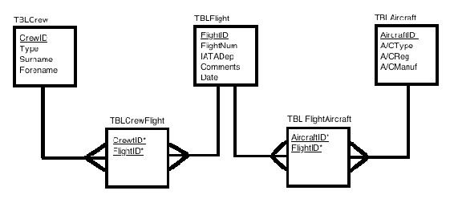
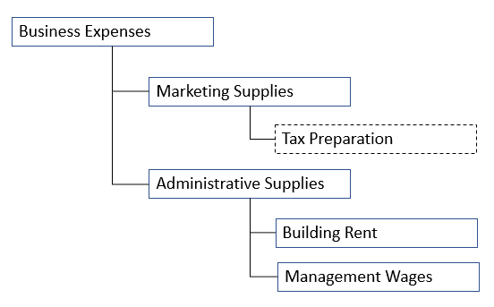
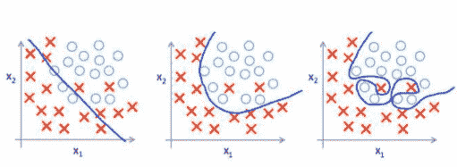
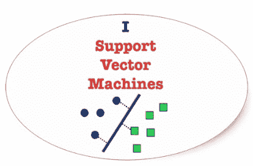
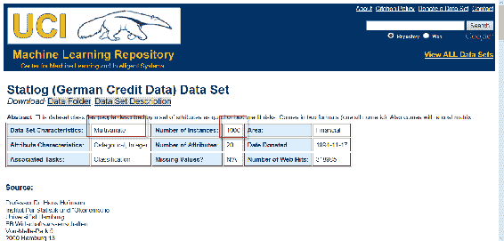
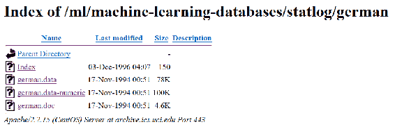
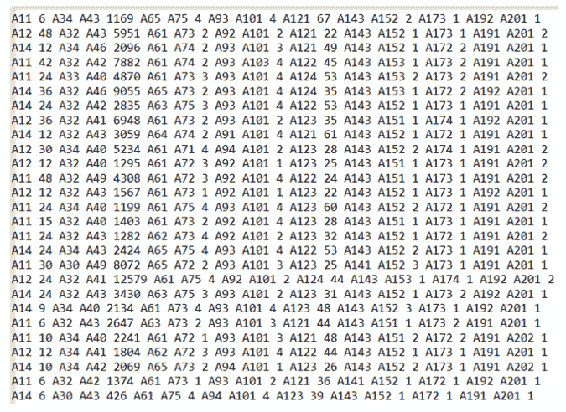

# 第十一章：使用支持向量机进行数据库分类

本章我们将探讨**支持向量机**（**SVMs**），识别它们的各种应用，并通过一个使用简单 SVM 对数据库中的数据进行分类的示例来说明。

本章中，我们将再次将主题组织成以下几个主要领域：

+   数据库分类

+   SVM 的定义和用途

+   常见的支持向量机（SVM）应用

+   使用 R 语言和支持向量机对数据库中的数据进行分类

让我们从一些关于通用数据分类的对话开始本章内容。

# 数据库分类

正如我们在本书中所提到的，如果读者是数据或数据库开发人员，或者有类似的背景，那么读者很可能听说过并且熟悉数据建模的过程。可以简单地将其描述为分析和理解某些数据的构成和细节的努力。然后，这些数据被组织或**分类**，目标是使其能够被用户社区轻松理解和使用，无论是**已命名的**（如组织中的财务分析师）还是**匿名的**（如互联网用户）。下图展示了根据需求进行的数据分类：



匿名访问是最常见的系统访问控制方法，至少在网站方面是如此。

作为几乎任何数据建模开发项目的一部分，可能会要求创建类图。这个（类）图详细说明了如何将数据（或数据库）拆分为离散的对象，这些对象之间的关系，以及它们可能拥有的任何已知接口或连接。类图中的每个类既可以包含数据，也可以包含其用途。

因此，数据分类是将数据按照不同的类型、形式或任何其他不同类别进行排序和分类的过程。

数据分类使得根据数据的既定要求，将数据进行分离和归类，以满足多个业务或其他目标，从而可以制定数据计划或数据模型：



也许一个现实世界的例子，一个数据库或数据开发人员可能会认同或有一定了解的例子，是对财务账户进行分类或重新分类的工作，以便进行报告。

例如，在财务报告项目中（或者可能是在典型的会计期间结算时），你可能会发现一个典型的、反复进行的操作是对每个账户进行详细审查，并对正在使用的账户进行合并，以报告一个组织的财务结果或表现。

对会计部门而言，术语*分类*（或重新分类）通常用于定义将金额从一个**总账**（**GL**）账户转移到另一个账户。例如，如果某项费用（例如税务准备）被错误地记入了市场营销用品账户而不是行政用品账户，那么更正分录可能是：

*从市场营销用品账户重新分类到行政用品账户*。

在这里，从会计部门的角度来看，我们讨论的是一笔实际交易，即从一个 GL 账户中扣除金额并将该金额加到另一个账户。对于数据开发者而言，虽然没有进行账户交易，但可能会运行一个编程变更或流程，移除某个账户（或将多个账户合并）并转移到另一个账户。这通常被称为更新账务科目报告层级，或**科目表**（**COA**）维护。

我们会发现这些相同的概念在统计学领域也适用吗？

在本章的以下部分，我们将回答这个问题。

# 统计学中的数据分类

一些数据科学家或统计学家将统计数据分类定义为：

*将数据划分为有意义的类别以进行分析。*

阅读此内容的数据库开发人员应该能够理解这一点：



在数据科学和统计学中，分类被定义为根据包含已验证类别成员的训练数据集，确定一个新的观察值应归入哪个类别（有时称为子群体）。

数据科学家通常会自动将统计公式应用于数据，允许在进行统计分析准备时处理大数据。

通常情况下，未组织或未分类的人群数据（通常称为原始数据），这些数据是在实际情况下收集并且无序排列的，并不会为数据科学家提供任何清晰的理解，只能得到基于不充分意见的直觉。

数据分类的过程试图在数据中找到相似性，并通过去除不必要的细节或噪音（我们在第十章中讨论过，*提升你的数据库*）来简化数据。分类有助于对不同数据集之间进行比较，清晰地显示一致与不一致的点。

数据分类还可以帮助确定数据使用的基准线。

分类使数据科学家能够研究多个特征之间的关系，并进行进一步的统计处理，如制表等。

一个非常好的统计数据分类受益的例子是年度人口普查，其中人口根据性别、年龄、婚姻状况等进行分类。

# 数据分类指南

指南（或政策）的目的是为执行某个任务建立框架。对于统计分类，存在许多不同的思维流派，关于最佳方法或最有效的方法。

在统计数据分类中，数据科学家将通过分配限制或边界来对数据进行分类。这些通常被称为**类别限制**。任何两个类别限制之间的组被称为**类别**或**类别区间**。

在你的统计学旅程中，你可能也遇到过术语*决策边界*。数据科学家经常使用不同或相似的术语来指代某个概念。在涉及两个类别的统计分类问题中，他们可能会使用**决策** **边界**或**决策** **面**来定义一个超平面（超平面是超平面概念的广义化），它将基础向量空间划分为两个集合，每个集合对应一个类别。分类器会将决策边界一侧的所有点归为一个类别，另一侧的所有点归为另一个类别。

# 常见指南

分类的指南通常会遵循以下内容：

+   对类别的定义应该毫无疑问

+   所有类别最好具有相同的宽度或长度

+   类别的限制应当选择使得原始数据中的任何项都不与限制值重合

+   类别的数量最好在 10 到 20 之间，即既不太大也不太小

+   类别应该是详尽无遗的，也就是说，每个原始数据的值都应该包含在其中。

+   类别应当是互斥且不重叠的，也就是说，原始数据中的每一项应该只适合一个类别

+   分类必须适用于研究对象

+   分类应该是灵活的，每个类别中包含的项目必须保持一致

+   类别区间的宽度由首先固定类别区间的数量，然后将总范围除以该数量来决定

指南适用于数据科学家用于分类的任何指导方针或政策。这些指导方针或政策必须适用于统计项目开始到完成期间所有被观察到的数据。

# 定义

数据科学家必须了解的几个关键术语，因为这些术语可能会影响分类方法的选择，分别是：

+   **机密数据**通常指的是任何被分类为受限的数据，且常与敏感数据互换使用

+   **数据管理员**通常是一个高级资源，负责监督一个或多个数据集的生命周期，以便进行分类

+   **超平面**子空间；一个 n 维欧几里得空间是平坦的，n 到该空间的一维子集将空间分为两个不相连的部分

+   **特征选择**是选择用于构建统计模型的相关特征（变量、预测因子）子集的行为。

+   **特征空间**简单来说是指用于描述数据的特征集合。

+   **统计分类**是识别新观察值应属于哪一类类别（子群体）的问题。

+   **软边界分类**是一种分类方法，其中数据科学家允许在定义或创建分类器时出现一些错误。

+   **机构数据**被定义为由大学维护或许可的所有数据。

+   **边界分类器**是一种能够为数据中的每个示例提供决策边界的伴随距离的分类器。

+   **非公开信息**是根据指南、政策或法律规定的私密或受限信息。

+   **敏感数据**通常指被归类为受限的数据，并且常常与机密数据交替使用。

+   **属性描述符**；有时分类系统会使用描述符来传达给定分类的原因；例如，中年或城市化是常见的描述符。

+   **互操作性**；当不同的应用程序使用不同的描述符，并且对哪些属性是必需的，哪些是可选的有不同的规则时（对于特定分类），这如何支持互操作性？

读者应该花时间研究与统计数据分类相关的许多术语——在统计学领域中，还有许多其他数据定义的术语。

# SVM 的定义和目的

我支持支持向量机，你呢？



在机器学习领域，SVM 也被称为支持向量网络，并被定义为有监督学习模型，伴随的学习算法分析用于分类的数据。

关于 SVM 的一个重要说明是，它们完全是关于成功执行模式识别的能力。换句话说，SVM 促进了在数据中扩展找到的模式的能力，这些模式是：

*通过对原始数据进行变换来映射到新空间时，不能线性分离。*

再次强调，你所了解的所有关于 SVM 的内容都会与 SVM 是一个有监督的机器学习算法这一观念相符合，这种算法最常用于统计学中的分类或回归问题。

# 这个技巧

你今天会听到大多数数据科学家提到技巧或 SVM 技巧；他们指的就是支持向量机算法使用一种称为**核心技巧**的方法。

核心技巧通过对数据进行变换，然后基于这些变换来发现可能输出或数据点之间的最优边界（记住，我们在本章前面定义了分类边界）。

在统计学中，核方法是一种用于模式分析的算法。执行模式分析的总体任务是找到并研究数据中普遍的关系类型。

基本上，SVM 执行的变换是一些极其复杂的数据变换（对你的数据进行处理），然后通过这些变换有效地找出如何根据数据科学家事先定义的标签或输出（有时被认为是数据科学家定义的特征）来分离数据。

另一个需要注意的重要（并且引人深思）点是，数据科学家在 SVM 执行变换时，并不需要担心保持数据的原始维度。

因此，核技巧将原始数据和一些事先定义的特征进行处理，执行其变换，并生成你可能无法识别的输出——有点像揭开一个巨大的迷宫！

以下内容摘自 [www.yaksis.com/posts/why-use-svm.html](http://www.yaksis.com/posts/why-use-svm.html)，*为什么使用 SVM？*：

*“你从这一个看似无害的数据向量开始，经过核技巧处理后，它被展开并且自我组合，直到它变成一个更大的数据集，单纯从电子表格中是无法理解的。”*

*“但魔法在这里，随着数据集的扩展，你的类别之间现在有了更明显的边界，SVM 算法能够计算出一个更加优化的超平面。”*

# 特征空间和低成本计算

理解 SVM 如何工作的一个重要部分，就是理解我们刚才提到的技巧。这个技巧，正如我们所说，使用核方法（即使用核函数），并且能够在高维特征空间中表现良好。

特征空间是一个 n 维空间，其中包含你的数据变量。核函数能够在这个高维空间内操作，而无需计算数据在该空间中的坐标，而只需计算特征空间中所有数据对的图像之间的内积。

这个核技巧可以比显式计算坐标更快、更高效地处理数据。这被称为**计算开销小**。

对于数据或数据库开发者来说，由于数据库视图可以隐藏复杂性；可以想象将数据库中的数据划分为多个编译视图（而不是对所有数据作为单一源运行查询）这一概念，类似于支持向量机（SVM）如何定义和使用向量。

# 画出分割线

描述支持向量机在分类数据时所执行的功能性（或实际）步骤的一种好方法是，想象 SVM 不断努力寻找 最佳分割线 ，以最优地分离两类数据点：


在这里，最佳的线是指通过最大化两个分类之间的边界来定义的直线。位于此边界上的点即为支持向量。

认识到这些（支持）向量的好处在于，我们可以将寻找最大边界超平面（即最能分离两个类别的直线）的问题，表述为一个优化问题，该问题仅考虑 SVM 所确定的支持向量。

这意味着 SVM 处理可以忽略绝大多数数据，从而使得分类过程更加高效。

更重要的是，通过将问题呈现为支持向量（即所谓的**对偶形式**），我们可以利用本章之前定义的核技巧，将支持向量机有效地转化为一个非线性分类器。

线性方法只能解决线性可分的问题（通常通过超平面）。非线性方法的特点是对输入数据集进行某种类型的转换。

# 不仅仅是分类

另一个关键点是，除了分类，SVM 还可以进行回归。

使用非线性核算法的 SVM 意味着算法计算出的边界不必是直线；这意味着 SVM 可以捕捉到数据点之间更为复杂的关系，而无需数据科学家手动进行那些复杂的转换。

# 缺点

那么，我们能否找到使用支持向量机的缺点或不足之处？

是的，有时候 SVM 所需的训练时间要长得多，而且计算开销也要大得多（我们在本章之前提到过计算成本的问题）。

# 参考资源

一本非常易懂的关于 SVM 的书籍是 NelloChristiani 和 John Shawe-Taylor 的*An Introduction to Support Vector Machines and Other Kernel-based Learning Methods*。

另一个值得参考的资料是《*Neural Networks and Learning Machines*》一书，作者为 Simon Haykin，书中提供了对支持向量机（SVM）与一种称为**径向基函数网络**的神经网络类型之间的深入关联的解析，我们也在*第五章*《神经网络》中引用了这本书。

# 预测信用评分

在本章的剩余部分，我们将尝试像数据开发者一样，通过 R 语言回顾一个 SVM 示例。

这个示例可以在线访问，并在《*Mastering Predictive Analytics with R, Second Edition*》一书的*第六章*中详细引用。

[`www.packtpub.com/big-data-and-business-intelligence/mastering-predictive-analytics-r-second-edition`](https://www.packtpub.com/big-data-and-business-intelligence/mastering-predictive-analytics-r-second-edition)

如果你是数据开发者，可能不知道以下网站提供了非常好的测试数据集资源：[`archive.ics.uci.edu/ml/index.php`](http://archive.ics.uci.edu/ml/index.php)

本示例使用的特定数据集是*Statlog（德国信用数据）数据集*，可以在以下网址找到：[`archive.ics.uci.edu/ml/datasets/statlog+(german+credit+data)`](https://archive.ics.uci.edu/ml/datasets/statlog+(german+credit+data))

网站如下所示：



该数据集来自银行和金融领域。数据集中的观察是个人在银行申请的贷款。

该数据的目标是确定贷款申请是否构成高信用风险。

数据或数据库开发人员很可能会注意到，与其下载一个数据集，不如创建查询来提取数据作为记录或交易，而不是实例（或观察）。

如果从数据库中提取这些数据，最有可能的情况是，提取不会像仅查询一个表那样简单，因为贷款申请可能以交易的形式存在，需要从多个数据库表中提取数据点。

数据开发人员应考虑的其他事项包括：

+   数据集特征——字段名称

+   属性特征——数据类型

+   捐赠日期——最后更新或添加日期

网站[ https://archive.ics.uci.edu/ml/machine-learning-databases/statlog/german/](https://archive.ics.uci.edu/ml/machine-learning-databases/statlog/german/)提供了两个关键文件：一个是实际数据，另一个是数据模式：



数据模式是 MS Word 文档格式（`german.doc`），用于创建以下矩阵：

| **列名** | **类型** | **定义** |
| --- | --- | --- |
| 支票账户 | 分类 | 现有支票账户的状态 |
| 持续时间 | 数值型 | 以月为单位的贷款期限 |
| 信用历史 | 分类 | 申请人的信用历史 |
| 目的 | 分类 | 贷款的目的 |
| 信用 | 数值型 | 信用金额 |
| 储蓄 | 分类 | 储蓄账户/债券 |
| 就业 | 分类 | 目前就业自 |
| 分期利率 | 数值型 | 分期利率（占可支配收入的百分比） |
| 个人 | 分类 | 个人状况和性别 |
| 债务人 | 分类 | 其他债务人/担保人 |
| 现居住地 | 数值型 | 目前居住地自 |
| 财产 | 分类 | 财产类型 |
| 年龄 | 数值型 | 申请人年龄（以年为单位） |
| 其他计划 | 分类 | 其他分期付款计划 |
| 住房 | 分类 | 申请人的住房状况 |
| 现有银行信贷 | 数值型 | 在此银行的现有信贷数量 |
| 职业 | 分类 | 申请人的工作状况 |
| 赡养人 | 数值型 | 赡养人数量 |
| 电话 | 分类 | 申请人电话状态 |
| 外国人 | 分类 | 外籍工人 |
| 风险 | 二进制 | 信用风险（1 = 良好，2 = 差） |

原始数据如下所示：



# 使用 R 和 SVM 在数据库中分类数据

现在我们已经理解了数据，接下来可以继续进行这个特定的统计学示例。

首先，数据科学家需要将数据加载到 R 的数据框对象中。这个示例中将其命名为 `german_raw.` 

```py
# --- load the data 
german_raw<- read.table("german.data", quote = "\"") 
```

下一步是提供与我们数据模式表格匹配的列名，如前所示：

```py
names(german_raw) <- c("checking", "duration", "creditHistory", 
 "purpose", "credit", "savings", "employment", "installmentRate", 
 "personal", "debtors", "presentResidence", "property", "age", 
 "otherPlans", "housing", "existingBankCredits", "job", 
 "dependents", "telephone", "foreign", "risk") 
```

从数据模式（描述数据特征的表格）中可以注意到，我们有许多分类特征需要处理。因此，数据科学家可以使用 R 的 `dummyVars()` 函数（用于创建一整套虚拟变量）来创建用于分析的虚拟二元变量。此外，他或她还会将输出变量 `risk` 记录为一个因子变量，使用以下方式：

+   level 0 = 良好信用

+   level 1 = 不良信用

```py
library(caret) 
dummies <- dummyVars(risk ~ ., data = german_raw) 
german<- data.frame(predict(dummies, newdata = german_raw),  
                       risk = factor((german_raw$risk - 1))) 
dim(german) 
[1] 1000   62 
```

经过之前的工作后，结果将得到一个包含 61 个特征的 R 数据框对象（因为一些分类输入特征具有多个级别）。

接下来，数据科学家会将数据分成两个子集：

+   训练数据集

+   测试数据集

这种数据划分可以通过以下 R 语句实现：

```py
set.seed(977) 
german_sampling_vector<- createDataPartition(german$risk,  
                                      p = 0.80, list = FALSE) 
german_train<- german[german_sampling_vector,] 
german_test<- german[-german_sampling_vector,] 
```

对于数据开发人员，采取类似的方法，如可能使用 `from` 子句中的 TABLESAMPLE 选项。使用 TAMPLESAMPLE 选项，你可以从表中获取数据的样本集，而无需读取整个表或为每一行数据分配临时随机值。

# 继续

在（之前提到的）网站上提到，这个数据集的一个特殊性是，数据来自于一个场景，在这个场景中，定义的两种错误类型具有不同的相关成本。

具体而言，将高风险客户误判为低风险客户的成本是银行将低风险客户误判为高风险客户的五倍。这是可以理解的，因为在第一种情况下，银行可能会因无法偿还的贷款而损失大量资金，而在第二种情况下，银行错失了一个可以带来利息收入的贷款机会。

这是一个实际的例子，其中预测分析直接影响了组织的盈利。

`svm()` R 函数具有一个 `class.weights` 参数，之后该参数用于指定误分类（每个类别的观察值）成本。这就是数据科学家如何将不对称的错误成本信息纳入模型。

首先，创建一个类别权重向量，并注意需要指定与输出因子水平对应的名称。

然后，数据科学家使用 R 的 `tune()` 函数训练多个具有径向核函数的 SVM 模型：

```py
class_weights<- c(1, 5) 
names(class_weights) <- c("0", "1") 
class_weights 
0 1  
1 5 

set.seed(2423) 
german_radial_tune<- tune(svm,risk ~ ., data = german_train,  
  kernel = "radial", ranges = list(cost = c(0.01, 0.1, 1, 10, 100),  
  gamma = c(0.01, 0.05, 0.1, 0.5, 1)), class.weights = class_weights) 
german_radial_tune$best.parameters 
   cost gamma 
9  10  0.05 

german_radial_tune$best.performance 
[1] 0.26 
```

这里推荐的最佳模型成本为 10，gamma 为 0.05，并且训练准确率达到 74%。

接下来，我们查看模型在测试数据集上的表现：

```py
german_model<- german_radial_tune$best.model 
test_predictions<- predict(german_model, german_test[,1:61]) 
 mean(test_predictions == german_test[,62]) 
[1] 0.735 

table(predicted = test_predictions, actual = german_test[,62]) 
         actual 
predicted   0   1 
        0 134  47 
        1   6  13 
```

测试集上的表现为 73.5%，与模型训练时的结果非常接近。如预期所示，该模型倾向于产生更多错误，将低风险客户误分类为高风险客户。

不出所料，这对整体分类准确度造成了影响，准确度仅仅计算正确分类的观察结果与总观察结果的比例。事实上，如果我们去除这种成本不平衡，我们实际上会为模型选择一组不同的参数，从无偏分类准确度的角度来看，性能会更好：

```py
set.seed(2423) 
german_radial_tune_unbiased<- tune(svm,risk ~ .,  
  data = german_train, kernel = "radial", ranges = list(  
cost = c(0.01, 0.1, 1, 10, 100), gamma = c(0.01, 0.05, 0.1, 0.5, 1))) 
german_radial_tune_unbiased$best.parameters 
  cost gamma 
3    1  0.01 
german_radial_tune_unbiased$best.performance 
[1] 0.23875 
```

当然，最后这个模型会倾向于将更多高风险客户误分类为低风险客户，而这种错误分类是非常不希望发生的。我们将在本节结束时提出两个最后的想法。首先，我们为`gamma`和`cost`参数使用了相对较小的范围。

最初，当这个示例呈现时，它被作为“留给读者的练习”，让读者使用更广泛的数值范围重新运行分析，以查看我们是否能获得更好的性能，这很可能会导致更长的训练时间。

其次，那个特定数据集相当具有挑战性，因为它的基准准确度实际上是 70%。这是因为数据中有 70%的客户是低风险客户（两个输出类别是不平衡的）。

呼！

# 总结

在本章中，我们通过一些数据开发者可能熟悉的示例定义了数据库和数据分类的概念。接下来，我们介绍了统计数据分类，并将这一概念与前者进行了比较。

提供了分类指南以及几个重要的相关术语。

最后，我们讨论了支持向量机、它们的工作原理以及它们为数据科学家提供的优势。

在下一章中，我们旨在解释机器学习的类型，并向开发者展示如何利用机器学习过程来理解数据库映射并识别数据中的模式。
