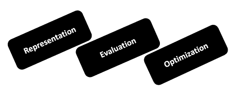

# 第十二章：数据库结构与机器学习

在本章的最后，我们将专注于机器学习的概念和类型。

根据本书的总体主题，我们将首先解释统计机器学习及相关概念，然后将继续分析统计机器学习与具有数据或数据库开发背景的读者可能相关的基本概念之间的一些相似之处。

本章分为以下几个部分：

+   数据结构就是数据模型吗？

+   机器学习概念概述

+   机器学习的类型

+   数据开发人员与机器学习

+   使用 R 将机器学习技术应用于数据库

# 数据结构与数据模型

当你拥有大量数据，却不知道该如何处理时，结构化数据、分析数据并将其有效利用是非常重要的（无论在何处需要）。在这一部分，我们将重点讲解数据结构和数据模型，并理解它们之间的差异。

# 数据结构

数据开发人员会同意，每当处理大量数据时，数据的组织结构至关重要。如果数据没有有效地组织，将很难对其进行任何操作，或者至少无法高效地完成任务。如果数据得到有效组织，那么几乎任何操作都可以轻松地在数据上执行。

数据或数据库开发人员会将数据组织成所谓的**数据结构**。下面的图像展示了一个简单的二叉树，在这种结构中数据得到了高效的组织：


*数据结构可以定义为一种更高效地组织大量数据的方法，以便对数据执行的任何操作变得容易。*

数据结构的创建方式是为了实现一个或多个特定的**抽象数据类型**（**ADT**），而这些抽象数据类型将规定可以对数据结构执行哪些操作，以及这些操作的计算复杂度。

在统计学领域，ADT 是数据类型的模型，其中数据类型是通过**用户视角**（**POV**）定义的，明确显示该数据类型的可能值、对这种类型数据可以进行的操作以及所有操作的行为。

数据库设计是使用已定义的数据结构来生成详细数据模型的过程，最终形成数据库。这个数据模型必须包含所有所需的逻辑和物理设计选择，以及生成**数据定义语言**（**DDL**）设计所需的物理存储参数，从而可以用来创建实际的数据库。

数据模型有不同的层次，例如，一个完全属性化的数据模型还会包含模型中每个实体的详细属性。

那么，数据结构就是数据模型吗？

不，数据结构是用来创建数据模型的。那么，这个数据模型是否与统计学中使用的数据模型相同呢？让我们在接下来的部分看看。

# 数据模型

你会发现统计数据模型是统计分析的核心。

简单来说，统计数据模型定义如下：

*我们希望理解并推理的状态、过程或系统的表示*

在前述定义的范围内，数据或数据库开发人员可能会同意，在理论上或概念上，可以使用相同的术语来定义财务报表数据库，因为它被设计用来包含商业交易，并且以数据结构的形式组织，使得商业分析师能够高效地审查数据，从而理解或推理他们可能对商业有特定兴趣的方面。

数据科学家开发统计数据模型，以便从中得出推论，更重要的是，做出关于关注话题的预测。数据开发人员开发数据库，以便同样从中得出推论，更重要的是，做出关于关注话题的预测（尽管在某些组织中，数据库可能更关注过去和当前的事件（交易），而非前瞻性的预测）。

统计数据模型有多种不同的格式和类型（数据库也是如此）。这些模型可以是将我们可以观察或测量的数量联系起来的方程式；它们也可以是简单的规则集合。

数据库可以设计或格式化，以简化在线交易的输入——例如，在订单输入系统中，或用于财务报表，当会计部门必须为股东生成资产负债表、利润表或损益表时。

我找到了一个简单的统计数据模型的例子：*牛顿第二定律*，它指出，作用在物体上的合力会使物体朝着力的方向加速，且加速的速率与合力的大小成正比，与物体的质量成反比。

# 有什么区别？

读者在哪里或如何能找到数据结构或数据库与统计模型之间的区别呢？从高层次来看，正如我们在前述部分推测的那样，可以得出结论：数据结构/数据库实际上与统计数据模型是相同的，如下图所示：

****

从高层次来看，正如我们在前述部分推测的那样，可以得出结论：数据结构/数据库实际上与统计数据模型是相同的。

当我们深入探讨这个话题时，应该考虑以下关键点：

+   尽管数据结构/数据库和统计模型都可以被认为代表一组假设，但统计模型通常会更加聚焦于一组关于生成某些样本数据的假设，及类似数据从更大群体中产生的假设，而数据结构/数据库通常会更加广泛。

+   统计模型通常处于一种理想化的形式，而数据结构/数据库则可能在追求特定假设的过程中显得不那么完美

+   数据结构/数据库和统计模型都是围绕变量之间的关系构建的

+   数据结构/数据库的关系可能专注于回答某些问题，例如：

    +   特定客户的总订单量是多少？

    +   某个客户从某个销售员那里购买的总订单量是多少？

    +   哪个客户下单最多？

+   统计模型的关系通常非常简单，且专注于证明特定问题：

    +   女性比男性矮一个固定的高度

    +   体重与身高成正比

+   任何给定的人参与某项运动的概率是年龄、性别和社会经济地位的函数

+   数据结构/数据库完全是基于变量之间关系对数据进行总结的过程

# 关系

统计模型中变量之间的关系可能比简单的直观认识和理解要复杂得多。一个例子是效应统计的概念。效应统计是显示或展示某个值的差异，而这个差异与一个或多个其他变量的差异相关联。

你能想象出你会使用什么 SQL 查询语句来基于一个或多个效应统计量建立两个数据库变量之间的关系吗？

在这一点上，你可能会发现，数据结构/数据库通常旨在表征变量之间的关系，而在统计模型中，数据科学家则试图通过拟合模型来证明某个观点或对模型中的群体做出陈述。也就是说，数据科学家努力对描述模型的效应统计量的估计准确性做出声明！

另一个值得注意的点是，数据结构/数据库和统计模型都可以看作是旨在对一个群体进行概括的工具或载体；数据库使用 SQL 来聚合或总结数据，而统计模型则使用效应统计来总结其数据。

好的，希望我们已经成功地表达了这样一个观点：数据结构/数据库和统计数据模型在许多方面是非常相似的。

现在，让我们继续讨论机器学习。

# 机器学习

统计机器学习有很多深奥的定义，但让我们从最简单或最基本的版本开始：

*机器学习是旨在教计算机根据某些数据流或数据源做出现实预测（或改进预测）的过程。*

读者应该注意到，数据源明确依赖于数据科学家正在解决（或尝试解决）的具体问题。例如，Netflix 这一订阅娱乐服务不会使用患者的牙科记录数据作为输入来预测订阅者的观看行为！

可以提供一个稍微深入的解释：

机器学习是计算机科学的一个子领域，起源于人工智能中的模式识别和计算学习理论的研究。1959 年，Arthur Samuel 将机器学习定义为“让计算机在没有明确编程的情况下学习的研究领域。”

; -[`scratch.mit.edu/studios/3475398/activity`](https://scratch.mit.edu/studios/3475398/activity/)

在机器学习中，数据科学家将花费时间探索、研究并构建他们可以从中学习并对数据源做出预测的过程。

这些机器学习过程或算法实际工作的方式是通过使用示例数据源输入构建统计模型。这不同于典型的计算机算法（即传统的计算机编程），后者通过遵循一组由开发团队编写的静态程序指令来工作。

你会发现在设计和编程明确程序指令不可行的地方，机器学习被广泛应用，例如图像识别和计算机视觉等应用。

在本章的后续部分，我们将花些时间列举更多今天机器学习应用的例子。

# 机器学习概念概述

在本章的前一部分，我们提到了传统编程的概念。使用传统编程时，数据和程序在计算机上运行以产生所需的输出。而在机器学习中，数据和输出在计算机上运行以创建一个程序。然后，这个程序可以在传统编程中使用。


一个稍为流行的、可能有趣的类比来描述机器学习是*农业*。

在这里，人们可能会把机器学习算法看作是*种子*，数据源看作是*肥料*，数据科学家则是*农民*，他们种植和滋养这些种子，最终收获成果！

# 机器学习的关键元素

当前数据科学家使用了大量的机器学习算法。实际上，一些研究表明，可能有成千上万种。此外，每年都有数百种新的算法被提出用于实践。

根据大众观点，今天所有的机器学习算法都由三个组成部分构成。它们如下：

+   表征

+   评估

+   优化



# 表示

这就是信息的表示方式。示例包括决策树、规则集合、实例、图形模型、神经网络、支持向量机、模型集成等。

# 评估

这就是候选程序（假设）将如何评估。示例包括准确率、预测和召回率、平方误差、似然性、后验概率、成本、边际、熵、Kullback-Leibler（KL 散度）等。

# 优化

这就是候选程序生成的方式，也叫做**搜索过程**，例如组合优化、凸优化和约束优化。

# 机器学习的类型

今天，机器学习有四种类型或类别。

这些类型如下：

+   监督学习

+   无监督学习

+   半监督学习

+   强化学习

理解每种学习类型非常重要。

# 监督学习

这种类型的学习也被称为**归纳学习**。此时，训练数据将包括期望的输出；算法从标记或分类的训练数据中推断。训练数据是一组训练示例。

# 无监督学习

与监督学习不同，在这里，训练数据不包括期望的输出。这是机器学习任务的一个范畴，即从未标记或未分类的数据中推断出一个描述隐藏结构的函数。由于提供给学习者的示例是未标记的，因此没有错误或奖励信号来评估潜在的解决方案。

# 半监督学习

在这种机器学习类型中，训练数据包含一些期望的输出样本。半监督学习实际上被认为是一种监督式机器学习，它利用未标记或未分类的数据进行训练，通常是少量标记数据与大量未标记数据结合。

# 强化学习

来自一系列动作的奖励，**人工智能**（**AI**）类型喜欢这种方式，因为它是最雄心勃勃的学习类型。**强化学习**（**RL**）是一种机器学习，允许机器和软件代理在特定环境中自动确定理想的行为，以最大化其性能。

# 最受欢迎的

监督学习是最成熟的，因为它存在的时间最长。它是研究最多的，也是大多数机器学习算法所使用的学习类型。

有监督的学习比没有监督的学习要容易得多。

在我们继续进行一个机器学习示例之前，先来回顾一下几个机器学习应用。

# 机器学习的应用

如果你还不清楚机器学习这一主题为何如此重要，或许回顾一下真实世界中的机器学习使用案例会有所帮助。

在本节中，我们将占用您一些时间列举一些真实世界的机器学习应用。

当前机器学习的示例应用程序包括以下内容（实际上几乎每天都在使用）：

| 搜索 | 你可能每天在多个设备上使用此功能。机器学习结果被用于开发网页搜索排名页面。排名页面是个人最可能感兴趣并点击的内容列表。 |
| --- | --- |
| 数字识别 | 给定手写在信封上的邮政编码，识别每个手写字符对应的数字。该问题的模型将允许计算机程序读取和理解手写的邮政编码，并按地理区域对信封进行排序。 |
| 生物学 | 基于过去的实验，理性设计计算机上的药物。 |
| 银行与金融 | 用于确定向谁发送哪些信用卡优惠。评估信用优惠的风险。如何决定将钱投资于哪里。 |
| 电子商务 | 预测客户流失、欺诈检测和机器人检测。 |
| 理解语音 | 给定用户的发声，识别用户所做的具体请求。这个问题的模型将允许程序理解并尝试满足该请求。iPhone 配有 Siri，具备此功能。 |
| 人脸识别 | 给定一个包含数百张数字照片的数字相册，识别其中包含某个特定人物的照片。该决策过程的模型允许程序按人物组织照片。一些相机和软件，如 iPhoto，具备此功能。 |
| 太空探索 | 太空探测器和射电天文学。 |
| 形状识别 | 给定用户在触摸屏上绘制形状，以及已知形状的数据库，确定用户试图绘制的形状。该决策模型将允许程序显示用户绘制的形状的柏拉图版本，从而制作清晰的图表。 |
| 机器人技术 | 如何处理新环境中的不确定性；自动驾驶汽车。 |
| 信息提取 | 能够在互联网上的数据库上提问。 |
| 社交网络 | 关于关系和偏好的数据。机器学习从数据中提取价值。 |
| 产品推荐 | 给定客户的购买历史和大量产品库存，识别客户可能感兴趣并可能购买的产品。该决策过程的模型将允许程序向客户推荐产品并激励购买。Amazon 具备此功能。还可以考虑 Facebook 和 GooglePlus，它们在用户注册后推荐与其连接的用户。 |
| 调试 | 用于计算机科学问题，例如调试。劳动密集型过程。可以提示错误可能的位置。 |

# 机器学习的实际应用

如果我们继续比较数据/数据库开发与机器学习，专注于一个典型项目，我们将看到相似之处。

在这一点上，Jason Brownlee 提供的一个相当不错的示例很好地说明了这一点。在 Jason 的文章中，他提醒我们，机器学习项目不仅仅是运行算法：

机器学习算法只是数据分析师或数据科学家在实践中使用机器学习的一小部分。

你可以在线查阅 Jason 的文章，网址是 [`machinelearningmastery.com/basic-concepts-in-machine-learning`](https://machinelearningmastery.com/basic-concepts-in-machine-learning/)。

实际上，Jason 指出，典型的涉及机器学习的统计项目中遵循的各个阶段很可能是迭代的，并且大致如下所示：


# 理解

项目的初始阶段将涉及建立对所需领域知识和项目目标的良好理解。数据科学家将与领域专家（或主题专家）交流，以明确项目目标。在项目开始时，目标模糊或不清晰是很常见的。你往往有更多的事情要测试，但无法全部实现。

项目的这一阶段与数据/数据库开发项目的第一阶段直接相关，因为数据开发人员总是需要从领域专家那里收集信息，以便在设计数据结构或数据库模型之前，详细了解项目目标。

# 准备

在此阶段，进行数据集成、选择、清洗和预处理。这通常是最耗时的部分，但也许是最重要的步骤，因为高质量的数据至关重要。数据量越大，数据就越*脏*。

再次强调，这一阶段与数据库开发项目非常相似。系统集成、查询与选择、清洗和其他数据预处理步骤（以便能够在新的数据库模型中使用）是预期的内容。这通常涉及到数据聚合、建立主外键关系、清洗等操作。

# 学习

这一阶段是最有趣的部分，机器学习算法被应用到数据中。

项目的这一阶段与数据库开发项目中的数据建模或数据模型设计阶段最为相关。请记住，在机器学习统计项目中，学习更多偏向机器方向，而在数据库开发项目中，建模则更多偏向人类方向。

# 解释

在此阶段，数据科学家和统计团队会回顾并解释之前阶段的结果。有时候，模型的工作原理并不重要，只要它能够提供好的结果。在某些项目中，要求结果易于理解。专家们会对结果提出挑战。

这一阶段与数据库开发项目的验收测试阶段相似，在数据库构建完成后，领域专家将审查和测试模型，并解释结果，以确定数据库是否提供了符合项目要求的可接受结果。

# 部署

在最后阶段，前几个阶段的结果（发现的知识）将被整合并部署。

在实验室中成功的机器学习项目，往往并未完全投入实践。通常情况下，项目会进入“另一个阶段”，通常会使用更多或更新的数据。

在这个阶段，我们看到数据库正式上线，或者被部署到生产环境中，由数据拥有者使用。

# 迭代

最后，Jason 还指出：

*这不是一次性的过程，而是一个循环。数据科学家可能需要重复执行这个循环（可能重新执行第 1 至第 5 阶段），直到得到一个可以实际应用的结果。此外，数据可能会发生变化，需要进行新的循环，等等。*

这可能是数据库开发项目与机器学习统计项目的区别所在。虽然数据库项目可能会经历多个迭代阶段（例如为了应对在验收测试中发现的某些问题），但大多数数据库项目通常会以一个实际被数据拥有者使用的数据库作为结束。

# 使用 R 将机器学习技术应用于数据库

从本书的始至终，我们几乎都使用了 R 编程语言，因为它被大多数数据科学家使用，而且对于刚刚接触统计学的人来说，非常易于理解。在本章中，我们将再次使用 R，这次是为了探讨机器学习技术如何应用于数据或数据库开发者。

我们将使用数据科学家 Will Stanton 提供的一篇文章作为起点。在他的文章中，他展示了如何使用 `caret` 包在 R 中创建一个简单的分类模型的巧妙示例。

R `caret` 包是 Will 在他的示例中使用的，非常易于使用，包含包装函数，允许你使用相同的函数进行训练和预测，适用于数十种不同的算法。除此之外，它还包括用于评估从模型中获得的预测效果的复杂内建方法。

在这个示例中（尽管有点令人不适），任务是建立一个统计模型，能够分析在泰坦尼克号上乘坐的个体的特征，然后预测他们生还的可能性。

# 理解数据

提供的数据包含关于谁幸存和谁遇难的信息：


这些数据以可下载的文本 CSV 文件形式提供，其中包含每个人的几个有用变量：

+   **Pclass**: 乘客等级（头等舱、二等舱或三等舱）

+   **性别**

+   **年龄**

+   **SibSp**: 登船的兄弟姐妹/配偶的数量

+   **Parch**: 登船的父母/子女的数量

+   **票价**: 乘客支付的金额

+   **登船地点**: 他们登船的地点（**C** = 瑟堡；**Q** = 皇后镇；**S** = 南安普敦）

所需的逐步 R 代码，用于安装和加载 R 包，以及加载前述数据集，可以在线找到，链接为[`will-stanton.com/machine-learning-with-r-an-irresponsibly-fast-tutorial`](http://will-stanton.com/machine-learning-with-r-an-irresponsibly-fast-tutorial/)。

给出的示例在概述所需的创建简单分类模型的每个步骤时做得非常出色，旨在说明一种机器学习的形式。

所使用的方法与我们在本章的*机器学习实战*部分之前提到的内容一致。

第一步是理解问题或挑战，并做好准备，以便能够进行实际的机器学习。

# 准备工作

在 R 示例中，我们了解到挑战是预测乘客幸存的可能性；然后我们进行准备，加载数据以便进行审查，识别出合适或最佳的变量（以供学习算法使用）：

这篇文章提供了读取`train.csv`文件的 R 命令，使用`,`分隔符，包括将标题行作为列名，并将其分配给 R 对象。它还读取了`testSet.csv`文件，最后使用 R 的`Head`函数显示数据集的前几行，读者可以看到每行都有一个`Survived`列，该列值为 1 表示该人幸存，为 0 表示未幸存（你可以在本节之前提供的数据文件图片中看到这部分信息）。

接下来，示例解释了比较训练集和测试集，展示了训练集和测试集之间的显著差异；训练集是带标签的，而测试集是无标签的。当前的任务是对无标签的测试集进行预测，并根据正确标记的乘客百分比进行评分。

文章还告知读者，大部分机器学习实际上是关于选择模型中最合适的特征。在机器学习中，特征实际上就是一个变量或某些变量的组合（例如两个变量的和或积）。

在统计分类模型示例中，*泰坦尼克号挑战*，通过使用交叉表和条件箱型图，选择最有用的变量来进行建模。

交叉表以一种非常易于理解的方式展示了两个变量之间的相互作用。在此示例中，为了确定哪些变量是生存的最佳预测因子，使用了 R 的 table 函数来查看生存与其他每个变量之间的交叉表。

箱形图对于识别有用的连续变量非常有用。给出的 R 示例使用条件箱形图比较数据中每个连续变量的分布，条件是乘客是否幸存。

在进行的分析中，可以看到 Pclass 对于根据指示的生存率预测某人是否生存具有强大的预测价值：

| **乘客等级** | **结果** | **生存率** |
| --- | --- | --- |
| 1 班 | 136 幸存，80 死亡 | 63% |
| 2 班 | 87 幸存，97 死亡 | 47% |
| 3 班 | 119 幸存，372 死亡 | 24% |

# 数据开发者

前述示例与数据或数据库开发者有何异同？可能有何相关示例？

从顶部开始，假设您负责一家游戏公司拥有的数据库。该公司购买并在其赌场和俱乐部的地板上放置各种类型的老虎机。

老虎机是一种赌场博彩机，具有三个或更多个卷轴，在按下按钮时旋转。机器由插入硬币操作。

数据库包含每种类型的游戏机的许多有用变量：

+   **主题**：传统的老虎机以水果和条形符号为特色，但主题正在成为老虎机游戏的主要特征

+   **面额**：五分、十分、二十五分、五十分等等

+   **支付频率**：松散、中等或紧密

+   **玩家位置**：低级或直立

+   **卷轴类型**：机械或虚拟

+   **玩家数量**：独立或社区

在这里，我们的挑战是根据机器的特征或已知变量来预测特定机器是否会成为游戏公司的热门机器。

在 R 示例中，数据科学家很幸运有提供的数据文件。但是，作为数据或数据库开发者，我们通常不会那么幸运，尽管这并不是什么大问题。

熟悉数据结构/数据库模型（正如我们在本章开始时讨论的），数据开发者可以构建适当的 SQL 查询来定位我们项目中感兴趣的数据（有些人称这一过程为挖掘数据）。

数据挖掘是发现数据模式的过程，涉及人工智能、机器学习、统计学和数据库系统的交集方法。

此外，一旦数据已经在数据库中定位，将信息写入 CSV 文本文件以供我们的统计项目消耗是常规工作：

```py
select * into outfile 'd:/report.csv' fields terminated by ',' from tableName;
```

但事实上，数据开发者可能会进行数据分析、变量审查和特征选择，而数据仍在数据库中；这样一旦确定了最强大的预测因子，其他（在我们的挑战环境中可能被视为噪声的因素）就不必提取到我们的文件中。这样可以节省时间，使数据可能更易管理。

*噪声* 在第十章中进行了讨论，*提升和你的数据库*。

# 理解挑战

在完全理解当前的挑战后，也许我们已经得知，如果一台游戏机的平均硬币投入（即老虎机上投币的总美元金额）每天超过一万美元，它就会被组织认为是受欢迎的游戏机。

有了这些信息，我们可以构建一个查询（或很可能是几个查询），用来计算并提取每个机器观察值的该变量数值。

到那时，我们将拥有每台公司运营的机器的观察数据（记录），以及每台机器的特征列表（我们想要检查的变量），以及已确定的结果（是否受欢迎）。

听起来熟悉吗？应该是的！

假设在我们的数据库示例中，我们发现面额是判断一台游戏机是否受欢迎的最强预测因子：

| **面额** | **结果/平均硬币投入值** | **流行度** |
| --- | --- | --- |
| 10 美分 | $7,500 | 否 |
| 25 美分 | $18,000 | 是 |
| 50 美分 | $9,000 | 否 |

从这些例子的比较中，我们可以看到数据开发人员有很多机会定位并利用存储在数据库中的信息，作为统计模型的输入。

# 交叉表和图表绘制

我们之前提到过，交叉表用于以非常易读的格式展示两个变量之间的交互关系。为了查看`Survived`与其他每个变量之间的交叉表，使用了 R 函数 table。

数据开发人员有类似的工具，PIVOT。PIVOT 是 SQL Server 2005 中引入的一种新的关系操作符。它为 SQL Server 提供了一个简单的机制，可以将行转换为列。

我们这里关注的 R 示例也使用了*箱线图可视化*来识别数据中的连续变量。虽然原生 SQL 并没有直接提供绘图功能，但数据开发人员可以考虑利用像**SQL** **Server 报告服务**（**SSRS**）之类的工具来绘制从数据库中提取的数据；不过，由于下一阶段将需要我们创建一个分类模型，我建议利用 R 的可视化功能来创建我们的图表和图形。

网上有一个非常好的资源，值得读者花时间阅读，内容涉及主题*使用 SQL 和 R 创建图表和绘图（操作指南）*：

[`docs.microsoft.com/en-us/sql/advanced-analytics/tutorials/walkthrough-create-graphs-and-plots-using-r`](https://docs.microsoft.com/en-us/sql/advanced-analytics/tutorials/walkthrough-create-graphs-and-plots-using-r)

此时，你可以继续进行之前讨论过的学习、评估和部署阶段。

# 总结

在本章中，我们首先回顾了数据结构、数据模型和数据库的概念，并找到了它们之间的相似性和差异。

接下来，我们概述了机器学习及相关概念，并将机器学习统计项目的实践与数据库开发项目进行了比较。

最后，我们介绍了 R 语言的概念性应用，并将机器学习技术应用于来自数据库的数据。

本书旨在帮助典型的数据或数据库开发人员过渡到统计学领域，因此我们希望读者已经对统计学和数据科学中的相关主题有了扎实的理解。

祝你好运！
