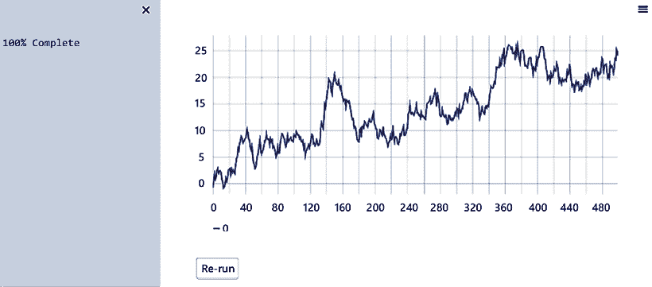
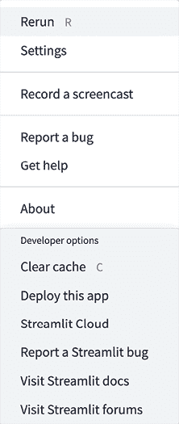
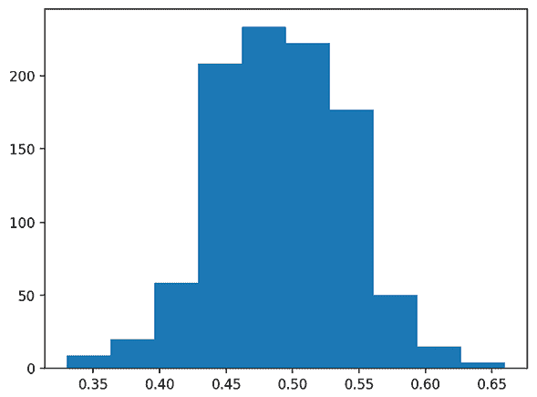
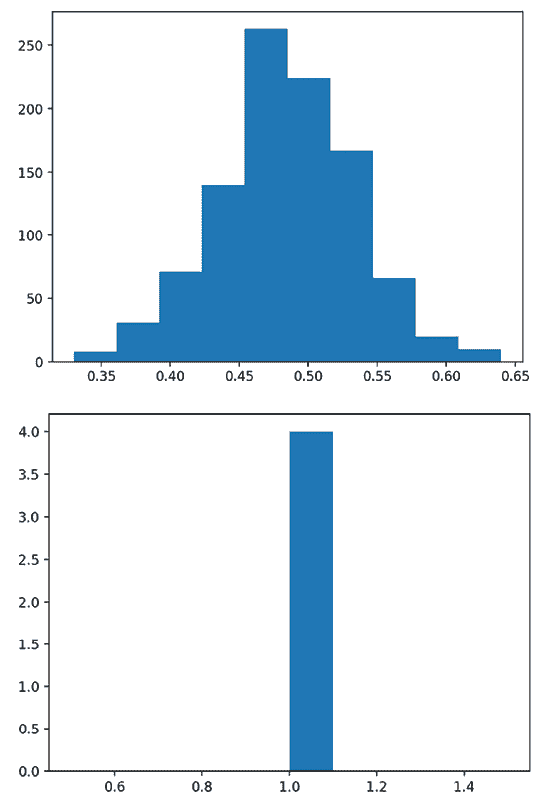
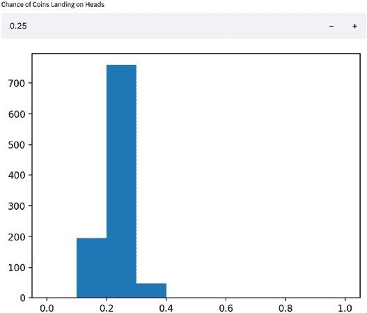
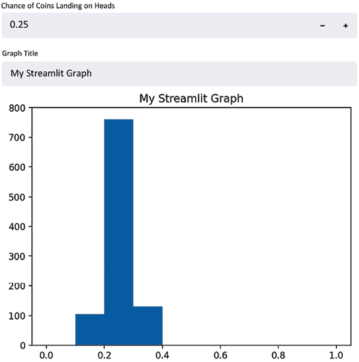
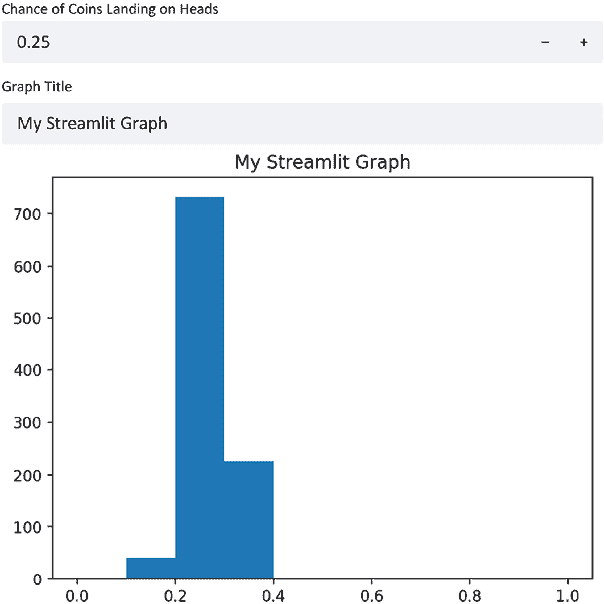
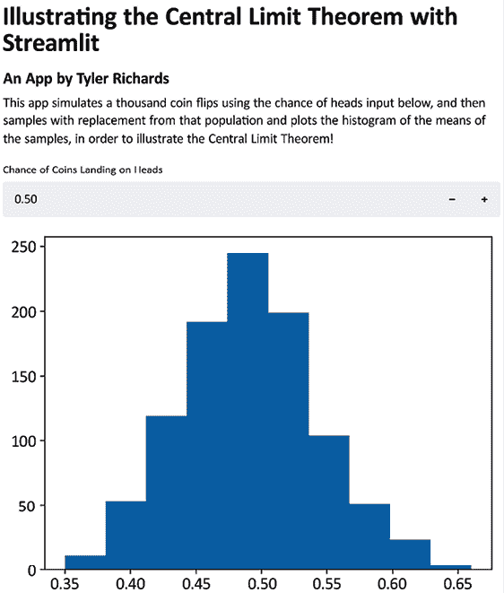

# 第一章：Streamlit 简介

Streamlit 是创建数据应用的最快方式。它是一个开源的 Python 库，帮助你构建用于共享分析结果、构建复杂的互动体验，并在新的机器学习模型上进行迭代的 Web 应用。此外，开发和部署 Streamlit 应用非常快速且灵活，通常将应用开发时间从几天缩短到几小时。

在本章中，我们将从 Streamlit 基础知识开始。我们将学习如何下载和运行示例 Streamlit 应用，如何使用我们自己的文本编辑器编辑示例应用，如何组织我们的 Streamlit 应用，最后，如何制作我们自己的应用。然后，我们将探索 Streamlit 中的数据可视化基础。我们将学习如何接受一些初始用户输入，然后通过文本为我们的应用添加一些修饰。到本章结束时，你应该能够熟练地开始制作自己的 Streamlit 应用！

特别地，我们将涵盖以下主题：

+   为什么选择 Streamlit？

+   安装 Streamlit

+   组织 Streamlit 应用

+   Streamlit 绘图示例

+   从零开始制作一个应用

在我们开始之前，我们将首先了解技术要求，确保我们具备了开始所需的一切。

# 技术要求

以下是本章所需的安装和设置：

+   本书的要求是下载 Python 3.9（或更高版本）（[`www.python.org/downloads/`](https://www.python.org/downloads/)）并拥有一个文本编辑器来编辑 Python 文件。任何文本编辑器都可以。我使用的是 VS Code（[`code.visualstudio.com/download`](https://code.visualstudio.com/download)）。

+   本书的某些部分使用 GitHub，推荐拥有一个 GitHub 账户（[`github.com/join`](https://github.com/join)）。理解如何使用 Git 对于本书并非必要，但总是很有用。如果你想入门，这个链接有一个实用的教程：[`guides.github.com/activities/hello-world/`](https://guides.github.com/activities/hello-world/)。

+   本书还需要一定的 Python 基础。如果你还不熟悉，可以通过这个教程（[`docs.python.org/3/tutorial/`](https://docs.python.org/3/tutorial/)）或其他免费、随手可得的教程花些时间深入了解 Python，准备好后再回来继续。我们还需要安装 Streamlit 库，我们将在后面的章节中进行安装，章节名为 *安装 Streamlit*。

# 为什么选择 Streamlit？

在过去十年中，数据科学家已成为公司和非营利组织越来越宝贵的资源。他们帮助做出数据驱动的决策，提升流程效率，并实现机器学习模型以大规模改善这些决策。数据科学家的一个痛点是，在他们发现新的见解或建立新的模型后，如何展示这些结果。如何展示动态结果、新模型或复杂的分析给同事看呢？他们可以发送一个静态的可视化，这在某些情况下有效，但对于那些依赖相互关联或需要用户输入的复杂分析就行不通了。他们还可以创建一个 Word 文档（或者将 Jupyter 笔记本导出为文档），该文档将文本和可视化结合起来，但它依然无法整合用户输入，并且使得结果难以复现。另一种选择是，使用 Flask 或 Django 等框架从头开始构建整个网页应用，然后再想办法将整个应用部署到 AWS 或其他云服务商上。

这些选项没有一个真正有效。许多方法都很慢，不能接受用户输入，或者在数据科学中非常关键的决策过程方面不够理想。

这就是 Streamlit 的魅力所在。Streamlit 注重速度和互动性。它是一个帮助你构建和开发 Python 网页应用的框架。它内置了方便的方法，可以处理从用户输入（如文本和日期）到显示使用最流行和强大的 Python 图形库绘制的互动图表的所有需求。

过去两年，我一直在构建各种类型的 Streamlit 应用，从个人作品集中的数据项目，到为数据科学的家庭作业任务快速构建的应用，再到为工作中可重复分析构建的迷你应用。当我开始这段旅程时，我在 Meta（当时是 Facebook）工作，但在本书的第一版发布后，我如此热爱 Streamlit 应用的开发，以至于我加入了 Streamlit 团队。不久后，数据云公司 Snowflake 收购了 Streamlit。这本书并没有得到 Snowflake 的赞助，我当然不代表 Snowflake 发言，但我真心相信，Streamlit 对你和你的工作来说，可能和对我一样有价值。

我写这本书是为了帮助你迅速掌握知识，以便你能够加快学习进程，在几分钟到几个小时内构建网页应用，而不是几天。如果这正是你所需要的，继续阅读吧！

我们将分三个部分进行学习，首先介绍 Streamlit，然后带你逐步构建自己的基础 Streamlit 应用程序。在*第二部分*，我们将扩展这些知识，涵盖更高级的主题，例如生产环境部署方法以及使用 Streamlit 社区创建的组件来构建越来越美观和可用的 Streamlit 应用程序。最后一部分，我们将重点采访那些在工作、学术界和数据科学学习中使用 Streamlit 的高级用户。在我们开始之前，我们需要先设置好 Streamlit，并讨论本书示例的结构。

# 安装 Streamlit

为了运行任何 Streamlit 应用程序，必须先安装 Streamlit。我使用了名为 `pip` 的包管理器来安装它，但你也可以使用任何你选择的包管理器进行安装（例如，`brew`）。本书使用的是 Streamlit 版本 1.13.0 和 Python 3.9，但它也应该适用于更新的版本。

在本书中，我们将结合使用终端命令和 Python 脚本中的代码。我们会明确指示在哪个位置运行代码，以便尽可能清晰。要安装 Streamlit，请在终端中运行以下代码：

```py
pip install streamlit 
```

既然我们已经下载了 Streamlit，我们可以通过命令行直接调用它，使用以下代码启动 Streamlit 的演示：

```py
streamlit hello 
```

花些时间浏览 Streamlit 的演示，并快速浏览任何你觉得有趣的代码！我们将借用并编辑绘图示例背后的代码，该示例展示了 Streamlit 中绘图和动画的结合。在深入之前，我们先花点时间讨论一下如何组织 Streamlit 应用程序。

## 组织 Streamlit 应用程序

本书中我们创建的每个 Streamlit 应用程序都应包含在它自己的文件夹中。虽然我们可能会想为每个 Streamlit 应用程序创建新的文件，但这种做法会养成不好的习惯，等到我们讨论如何部署 Streamlit 应用并处理权限和数据时，这个问题会影响我们。

我建议你为将要在本书中创建的所有应用程序准备一个独立的文件夹。我把它命名为 `streamlit_apps`。以下命令将创建一个名为 `streamlit_apps` 的新文件夹，并将其设置为当前工作目录：

```py
mkdir streamlit_apps
cd streamlit_apps 
```

本书的所有代码都可以在 [`github.com/tylerjrichards/Getting-Started-with-Streamlit-for-Data-Science`](https://github.com/tylerjrichards/Getting-Started-with-Streamlit-for-Data-Science) 上找到，但我强烈建议你通过手动编码进行练习。本书后面将介绍如何创建多页面应用程序，这实际上让我们可以在一个中央单一应用中拥有许多小型数据应用。确保我们的 Streamlit 应用程序组织良好，这将有助于我们实现这一目标！

## Streamlit 绘图示例

首先，我们将通过再现之前在 Streamlit 演示中看到的绘图演示，来开始学习如何制作 Streamlit 应用，所用的 Python 文件是我们自己创建的。为了做到这一点，我们将执行以下操作：

1.  创建一个 Python 文件，用来容纳所有的 Streamlit 代码。

1.  使用演示中给出的绘图代码。

1.  进行一些小的编辑来练习。

1.  在本地运行我们的文件。

我们的第一步是创建一个名为 `plotting_app` 的文件夹，来容纳我们的第一个示例。以下代码会在终端中运行时创建此文件夹，将工作目录切换到 `plotting_app`，并创建一个空的 Python 文件，我们将其命名为 `plot_demo.py`：

```py
mkdir plotting_app
cd plotting_app
touch plot_demo.py 
```

现在，我们已经创建了一个名为 `plot_demo.py` 的文件，使用任何文本编辑器打开它（如果你还没有编辑器，我个人推荐 VS Code（[`code.visualstudio.com/download`](https://code.visualstudio.com/download)））。当你打开它时，将以下代码复制粘贴到你的 `plot_demo.py` 文件中：

```py
import streamlit as st
import time
import numpy as np
progress_bar = st.sidebar.progress(0)
status_text = st.sidebar.empty()
last_rows = np.random.randn(1, 1)
chart = st.line_chart(last_rows)
for i in range(1, 101):
    new_rows = last_rows[-1, :] + np.random.randn(5, 1).cumsum(axis=0)
    status_text.text("%i%% Complete" % i)
    chart.add_rows(new_rows)
    progress_bar.progress(i)
    last_rows = new_rows
    time.sleep(0.05)
progress_bar.empty()
# Streamlit widgets automatically run the script from top to bottom. Since
# this button is not connected to any other logic, it just causes a plain
# rerun.
st.button("Re-run") 
```

这段代码完成了几件事。首先，它导入了所需的所有库，并在 Streamlit 的原生图形框架中创建了一个线性图表，起点为从均值为 0、方差为 1 的正态分布中随机抽取的一个数。然后，它运行一个 `for` 循环，不断从正态分布中抽取 5 个新的随机数，并将其加到之前的和中，同时等待 1/20 秒，以便我们能看到图表的变化，模拟动画效果。

到本书结束时，你将能够非常快速地制作类似的应用。但现在，让我们在本地运行它，在终端中输入以下代码：

```py
streamlit run plot_demo.py 
```

这应该会在默认的 Web 浏览器中打开一个新标签页，显示你的应用。我们应该看到应用运行，正如下图所示。你的应用不会显示完全相同的内容，因为每次运行时都会生成随机数，但除此之外，应用应该看起来是一样的！



图 1.1：绘图演示输出

这是我们运行每个 Streamlit 应用的方法：首先调用 `streamlit` `run`，然后将 Streamlit 指向包含应用代码的 Python 脚本。现在，让我们在应用中做一些小的修改，以便更好地理解 Streamlit 的工作原理。以下代码将改变我们在图表上绘制的随机数数量，但你可以根据自己的需求做任何修改。使用以下代码进行修改，在你选择的文本编辑器中保存更改，并再次运行文件：

```py
import streamlit as st
import time
import numpy as np
progress_bar = st.sidebar.progress(0)
status_text = st.sidebar.empty()
last_rows = np.random.randn(1, 1)
chart = st.line_chart(last_rows)
for i in range(1, 101):
    new_rows = last_rows[-1, :] + np.random.randn(50, 1).cumsum(axis=0)
    status_text.text("%i%% Complete" % i)
    chart.add_rows(new_rows)
    progress_bar.progress(i)
    last_rows = new_rows
    time.sleep(0.05)
progress_bar.empty()
# Streamlit widgets automatically run the script from top to bottom. Since
# this button is not connected to any other logic, it just causes a plain
# rerun.
st.button("Re-run") 
```

你应该注意到 Streamlit 检测到源文件发生了变化，并提示你是否希望重新运行文件。如果需要，可以点击 **Rerun**（或者选择 **Always rerun**，如果你希望此行为为默认设置，我几乎总是这么做），然后观察应用的变化。

随意尝试对绘图应用进行一些修改，以熟悉它！一旦准备好，我们就可以继续创建自己的应用了。

# 从零开始制作一个应用

现在我们已经尝试过别人制作的应用，让我们来制作自己的应用吧！这个应用将专注于使用中心极限定理，它是统计学的一个基本定理，说明如果我们从任何分布中进行足够多的有放回的随机抽样，那么我们样本的均值分布将近似正态分布。

我们不会通过应用来证明这个定理，而是尝试生成一些图表，帮助解释中心极限定理的威力。首先，让我们确保我们在正确的目录中（此时是我们之前创建的 `streamlit_apps` 文件夹），新建一个名为 `clt_app` 的文件夹，并放入一个新文件。

以下代码会创建一个名为 `clt_app` 的新文件夹，并再次创建一个空的 Python 文件，这次命名为 `clt_demo.py`：

```py
mkdir clt_app
cd clt_app
touch clt_demo.py 
```

每当我们启动一个新的 Streamlit 应用时，我们都需要确保导入 Streamlit（在本书中和其他地方通常别名为 `st`）。Streamlit 为每种类型的内容（文本、图表、图片以及其他媒体）提供了独特的函数，我们可以将它们作为构建所有应用的基础模块。我们首先使用的函数是 `st.write()`，它是一个接受字符串（正如我们稍后将看到的，它几乎可以接受任何 Python 对象，例如字典）的函数，并将其按调用顺序直接写入我们的网页应用中。当我们调用一个 Python 脚本时，Streamlit 会按顺序浏览文件，每当遇到某个函数时，就为该部分内容分配一个顺序插槽。这使得使用起来非常简单，因为你可以编写所有需要的 Python 代码，当你想让某个内容出现在你创建的应用上时，只需使用 `st.write()`，一切就绪。

在我们的 `clt_demo.py` 文件中，我们可以从基本的 `'Hello World'` 输出开始，使用 `st.write()`，并用以下代码：

```py
import streamlit as st
st.write('Hello World') 
```

现在，我们可以通过在终端中运行以下代码来进行测试：

```py
streamlit run clt_demo.py 
```

我们应该能在应用中看到字符串 `'Hello World'` 的输出，至此一切正常。以下截图展示了我们的应用在 Safari 中的样子：


图 1.2：Hello World 应用

在这个截图中有三点需要注意。首先，我们看到的是我们写的字符串，这很好。接下来，我们看到 URL 指向 **localhost:8501**，这只是告诉我们我们正在本地托管此应用（即，它不在互联网上），通过 **8501** 端口。我们不需要了解计算机上关于端口系统或 **传输控制协议**（**TCP**）的任何内容。这里需要注意的重点是，这个应用是本地的，运行在你的计算机上。在本书后面，我们将学习如何将本地创建的应用通过链接与任何人分享！第三个重要点是右上角的汉堡菜单图标。以下截图展示了点击该图标后的效果：



图 1.3：图标选项

这是 Streamlit 应用的默认选项面板。在本书中，我们将详细讨论这些选项，特别是一些不太直观的选项，比如**清除缓存**。现在我们只需要知道的是，如果我们想重新运行应用或查找设置或文档，我们可以使用这个图标找到几乎所有需要的内容。

当我们托管应用以便其他人使用时，他们会看到相同的图标，但会有一些不同的选项（例如，用户将无法清除缓存）。我们稍后会更详细地讨论这个问题。现在回到我们的中心极限定理应用！

下一步将是生成一个我们想要从中带放回抽样的分布。我在这里选择了二项分布。我们可以将以下代码解读为使用 Python 包`NumPy`模拟 1,000 次抛硬币，并打印出这 1,000 次抛硬币中的正面朝上的平均次数：

```py
import streamlit as st
import numpy as np
binom_dist = np.random.binomial(1, .5, 100)
st.write(np.mean(binom_dist)) 
```

现在，鉴于我们对中心极限定理的了解，我们可以预期，如果我们从`binom_dist`中多次抽样，那么这些样本的均值将近似于正态分布。

我们已经讨论过`st.write()`函数。我们接下来要向 Streamlit 应用写入内容的方式是通过图形。`st.pyplot()`是一个函数，它让我们能够使用流行的`matplotlib`库的所有功能，并将我们的`matplotlib`图形推送到 Streamlit。一旦我们在`matplotlib`中创建了一个图形，我们就可以明确地告诉 Streamlit 将其写入到我们的应用中，方法是使用`st.pyplot()`函数。所以，现在我们来总结一下！这个应用模拟了 1,000 次抛硬币，并将这些值存储在我们称之为`binom_dist`的列表中。然后，我们从这个列表中随机抽取（带放回）100 个样本，计算均值，并将这个均值存储在巧妙命名的变量`list_of_means`中。我们重复这个过程 1,000 次（这其实有些过头——我们可以只用几十个样本），然后绘制直方图。完成之后，以下代码的结果应该显示一个钟形分布：

```py
import streamlit as st
import numpy as np
import matplotlib.pyplot as plt
binom_dist = np.random.binomial(1, .5, 1000)
list_of_means = []
for i in range(0, 1000):
     list_of_means.append(np.random.choice(binom_dist, 100, replace=True).mean())
fig, ax = plt.subplots()
ax = plt.hist(list_of_means)
st.pyplot(fig) 
```

每次运行这个应用时都会生成一个新的钟形曲线。当我运行它时，我的钟形曲线如下图所示。如果你的图形不完全是接下来图中的样子（但仍然是钟形曲线！），那也没问题，因为我们的代码使用了随机抽样：



图 1.4：钟形曲线

正如你可能已经注意到的，我们首先通过调用`plt.subplots()`创建了一个空的图形和空的坐标轴，然后将我们创建的直方图赋值给`ax`变量。正因如此，我们能够明确地告诉 Streamlit 在我们的 Streamlit 应用中显示这个图形。

这是一个重要的步骤，因为在 Streamlit 的版本中，我们也可以跳过这个步骤，不将直方图赋值给任何变量，然后直接调用`st.pyplot()`。以下代码采用了这种方法：

```py
import streamlit as st
import numpy as np
import matplotlib.pyplot as plt
binom_dist = np.random.binomial(1, .5, 1000)
list_of_means = []
for i in range(0, 1000):
     list_of_means.append(np.random.choice(binom_dist, 100, replace=True).mean())
plt.hist(list_of_means)
st.pyplot() 
```

我不推荐这种方法，因为它可能会给你一些意想不到的结果。举个例子，我们首先想制作一个均值的直方图，然后再制作一个只包含数字 1 的新列表的直方图。

请花点时间猜测以下代码会做什么。我们会得到几个图形？输出是什么？

```py
import streamlit as st
import numpy as np
import matplotlib.pyplot as plt
binom_dist = np.random.binomial(1, .5, 1000)
list_of_means = []
for i in range(0, 1000):
     list_of_means.append(np.random.choice(binom_dist, 100, replace=True).mean())
plt.hist(list_of_means)
st.pyplot()
plt.hist([1,1,1,1])
st.pyplot() 
```

我预计这会显示两个直方图，第一个是 `list_of_means` 的直方图，第二个是 `1s` 列表的直方图：



图 1.5：两张直方图的故事

然而，实际结果有所不同！第二个直方图的数据包含了第一个和第二个列表的数据！当我们调用 `plt.hist()` 而不将输出赋值给任何变量时，`matplotlib` 会将新的直方图追加到旧的图形上，而这个图形是全局存储的，Streamlit 会将这个新的图形推送到我们的应用中。如果你的 matplotlib 版本较新，你也可能会收到 `PyplotGlobalUseWarning` 警告。别担心，我们将在下一节解决这个问题！

这是解决此问题的一种方法。如果我们显式创建两个图形，我们可以在生成图形后随时调用 `st.pyplot()` 函数，这样可以更好地控制图形的放置位置。以下代码显式地分开了两个图形：

```py
import streamlit as st
import numpy as np
import matplotlib.pyplot as plt
binom_dist = np.random.binomial(1, .5, 1000)
list_of_means = []
for i in range(0, 1000):
     list_of_means.append(np.random.choice(binom_dist, 100, replace=True).mean())
fig1, ax1 = plt.subplots()
ax1 = plt.hist(list_of_means)
st.pyplot(fig1)
fig2, ax2 = plt.subplots()
ax2 = plt.hist([1,1,1,1])
st.pyplot(fig2) 
```

上述代码通过首先使用 `plt.subplots()` 定义每个图形和坐标轴的单独变量，然后将直方图分配给相应的坐标轴，分别绘制两个直方图。之后，我们可以使用创建的图形调用 `st.pyplot()`，它会生成以下应用：



图 1.6：固定的直方图

从上面的图中我们可以清楚地看到，两个直方图现在已经分开了，这是我们期望的行为。在 Streamlit 中，我们经常会绘制多个可视化图表，并且在本书剩余部分我们将使用这种方法。

Matplotlib 是一个非常流行的数据可视化库，但在数据应用中使用时存在一些严重缺陷。它默认不支持交互，外观也不算特别漂亮，并且在非常大的应用中可能会导致性能下降。稍后在本书中，我们将切换到性能更高且支持交互的库。

现在，开始接收用户输入吧！

## 在 Streamlit 应用中使用用户输入

到目前为止，我们的应用只是展示可视化的一种花哨方式。但大多数网页应用都需要接收用户输入或是动态的，而不是静态的可视化。幸运的是，Streamlit 提供了许多用于接收用户输入的函数，它们根据我们希望输入的对象而有所不同。有自由文本输入 `st.text_input()`；单选按钮 `st.radio()`；数字输入 `st.number_input()`；以及更多对构建 Streamlit 应用非常有帮助的函数。本书中我们将详细探索其中的大多数，但我们从数字输入开始。

在前面的例子中，我们假设我们抛的硬币是公平的，正反面各有 50/50 的机会。现在让我们让用户决定正面朝上的概率，将其赋值给一个变量，并将这个值作为输入用于我们的二项分布。数字输入函数需要一个标签、最小值、最大值和默认值，我已经在以下代码中填写了这些内容：

```py
import streamlit as st
import numpy as np
import matplotlib.pyplot as plt
perc_heads = st.number_input(label = 'Chance of Coins Landing on Heads', min_value = 0.0, max_value = 1.0, value = .5)
binom_dist = np.random.binomial(1, perc_heads, 1000)
list_of_means = []
for i in range(0, 1000):
     list_of_means.append(np.random.choice(binom_dist, 100, replace=True).mean())
fig, ax = plt.subplots()
ax = plt.hist(list_of_means, range=[0,1])
st.pyplot(fig) 
```

上述代码使用`st.number_input()`函数来收集我们的百分比，将用户输入赋值给一个变量（`perc_heads`），然后使用该变量更改我们之前使用的二项分布函数的输入。它还将我们的直方图的*X*轴设置为始终在 0 到 1 之间，以便我们更好地观察到随着输入变化而产生的变化。试着稍微玩一下这个应用；改变数字输入，注意每次用户输入变化时，应用是如何响应的。例如，当我们将数字输入设置为`.25`时，这里是一个结果：



图 1.7：当我们将数字输入设置为.25 时的结果示例

正如你可能注意到的，每次我们改变脚本的输入时，Streamlit 都会重新运行整个应用程序。这是默认行为，并且对于理解 Streamlit 的性能非常重要；在本书后面的部分，我们将探讨几种方法，允许我们更改这个默认行为，比如添加缓存或表单！我们还可以使用`st.text_input()`函数接受文本输入，就像我们之前处理数字输入一样。接下来的代码段接收文本输入并将其赋值给我们图表的标题：

```py
import streamlit as st  
import numpy as np  
import matplotlib.pyplot as plt
perc_heads = st.number_input(label='Chance of Coins Landing on Heads', min_value=0.0,  max_value=1.0, value=.5)
graph_title = st.text_input(label='Graph Title')
binom_dist = np.random.binomial(1, perc_heads, 1000)
list_of_means = []
for i in range(0, 1000):
list_of_means.append(np.random.choice(binom_dist, 100, replace=True).mean())
fig, ax = plt.subplots()
plt.hist(list_of_means, range=[0,1])
plt.title(graph_title)
st.pyplot(fig) 
```

这段代码创建了一个 Streamlit 应用，包含两个输入框，一个是数字输入框，另一个是文本输入框，并使用这两个输入框来改变我们的 Streamlit 应用。最后，这会生成一个 Streamlit 应用，呈现出下图所示，带有动态标题和概率：



图 1.8：一个带有动态标题和概率的 Streamlit 应用

现在我们已经稍微处理了一些用户输入，接下来让我们更深入地讨论文本和 Streamlit 应用。

# 精致的修饰 – 向 Streamlit 添加文本

我们的应用程序是功能齐全的，但缺少一些精致的细节。我们之前讨论过`st.write()`函数，Streamlit 文档称它是 Streamlit 命令的瑞士军刀。几乎我们将`st.write()`包裹的任何内容默认都会起作用，它应该是我们在不确定最佳路径时的首选函数。

除了`st.write()`，我们还可以利用其他内置函数来格式化文本，如`st.title()`、`st.header()`、`st.markdown()`和`st.subheader()`。使用这五个函数可以轻松地在我们的 Streamlit 应用中格式化文本，并保持较大应用的一致性。

更具体地说，`st.title()`会在我们的应用中放置一大块文本，`st.header()`使用比`st.title()`稍小的字体，`st.subheader()`使用更小的字体。除此之外，`st.markdown()`允许任何熟悉 Markdown 的人在我们的 Streamlit 应用中使用这种流行的标记语言。让我们在接下来的代码中尝试其中的一些：

```py
import streamlit as st
import numpy as np
import matplotlib.pyplot as plt
st.title('Illustrating the Central Limit Theorem with Streamlit')
st.subheader('An App by Tyler Richards')
st.write(('This app simulates a thousand coin flips using the chance of heads input below,'
     'and then samples with replacement from that population and plots the histogram of the'
     ' means of the samples in order to illustrate the central limit theorem!'))
perc_heads = st.number_input(
    label='Chance of Coins Landing on Heads', min_value=0.0, max_value=1.0, value=.5)
binom_dist = np.random.binomial(1, perc_heads, 1000)
list_of_means = []
for i in range(0, 1000):
    list_of_means.append(np.random.choice(
        binom_dist, 100, replace=True).mean())
fig, ax = plt.subplots()
ax = plt.hist(list_of_means)
st.pyplot(fig) 
```

上述代码添加了一个大标题（`st.title()`），并在其下方添加了一个较小的副标题（`st.subheader()`），接着在副标题下方添加了更小的文本（`st.write()`）。我们还将前面的长文本字符串拆分成了三个更小的字符串，以提高可读性，并便于在文本编辑器中进行编辑。它应当呈现如下截图。请注意，由于我们使用的是随机生成的数据，因此，如果你的直方图看起来略有不同，这是完全可以接受的（并且是预期中的）！



图 1.9：中心极限定理应用

这就是我们关于中心极限定理的说明。你可以尝试 Streamlit 提供的其他文本书写选项（比如 `st.markdown()`，它可以解释并书写 Markdown 样式的文本）来进一步探索应用程序的创建。

# 总结

在本章中，我们首先学习了如何组织文件和文件夹，为本书的剩余部分做准备，并快速介绍了如何下载 Streamlit。接着，我们构建了第一个 Streamlit 应用程序 "Hello World"，并学习了如何在本地运行 Streamlit 应用程序。然后，我们开始构建一个更复杂的应用程序，从零开始展示中心极限定理的含义，从一个简单的直方图开始，到接受用户输入，再到在应用程序中格式化不同类型的文本，以增强可读性和美观性。

到现在为止，你应该已经对一些基本的内容感到熟悉，比如数据可视化、在文本编辑器中编辑 Streamlit 应用程序以及本地运行 Streamlit 应用程序。在下一章中，我们将深入探讨数据处理。

# 在 Discord 上了解更多

要加入本书的 Discord 社区——你可以在这里分享反馈、向作者提问、了解新版本的发布——请扫描以下二维码：

[`packt.link/sl`](https://packt.link/sl)


