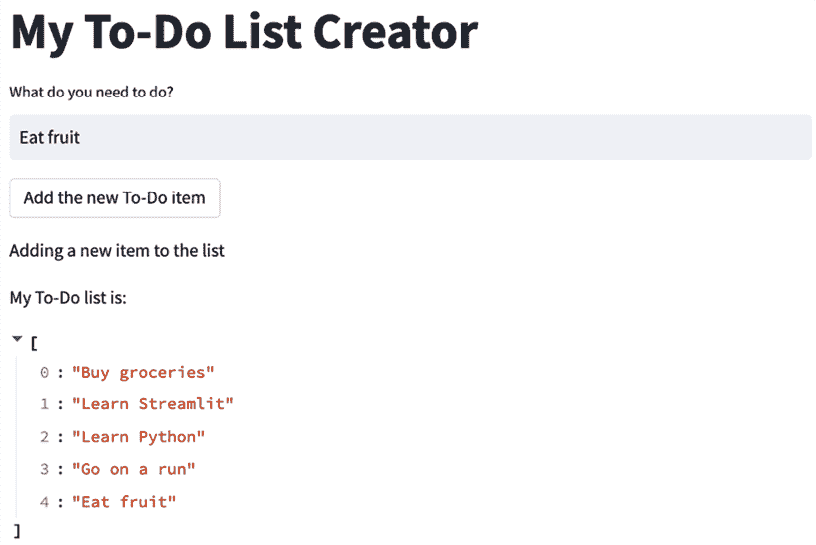

# 第二章：上传、下载和操作数据

到目前为止，本书中我们在 Streamlit 应用中使用的都是模拟数据。这对于掌握 Streamlit 的一些基本概念非常有用，但大多数数据科学工作不是基于模拟数据，而是基于数据科学家已经拥有的真实数据集，或者是用户提供的数据集。

本章将重点介绍 Streamlit 应用中的数据世界，涵盖您需要了解的所有内容，教您如何通过 Streamlit 让数据集“活起来”。我们将讨论数据操作、使用用户导入的数据、流程控制、调试 Streamlit 应用，以及如何通过缓存加速我们的数据应用，示例数据集为 Palmer’s Penguins。

特别地，我们将覆盖以下主题：

+   设置 - Palmer’s Penguins

+   调试 Streamlit 应用

+   Streamlit 中的数据操作

+   使用会话状态保持数据持久性

# 技术要求

对于本章，我们需要下载 Palmer’s Penguins 数据集，您可以在[`github.com/tylerjrichards/streamlit_apps/blob/main/penguin_app/penguins.csv`](https://github.com/tylerjrichards/streamlit_apps/blob/main/penguin_app/penguins.csv)找到该数据集。本章的设置以及数据集的解释可以在以下章节中找到。

# 设置 - Palmer’s Penguins

对于本章，我们将使用一个关于北极企鹅的有趣数据集，该数据集来自 Kristen Gorman 博士([`www.uaf.edu/cfos/people/faculty/detail/kristen-gorman.php`](https://www.uaf.edu/cfos/people/faculty/detail/kristen-gorman.php))及 Palmer 站点，南极 LTER ([`pallter.marine.rutgers.edu/`](https://pallter.marine.rutgers.edu/))的工作。

数据集致谢

来自 Palmer LTER 数据存储库的数据得到了极地项目办公室（Office of Polar Programs）的支持，NSF 资助编号包括 OPP-9011927、OPP-9632763 和 OPP-0217282。

该数据集是著名的 Iris 数据集的常见替代方案，包含 344 只企鹅的个体数据，涵盖了 3 种企鹅物种。数据可以在本书的 GitHub 代码库中找到([`github.com/tylerjrichards/Streamlit-for-Data-Science`](https://github.com/tylerjrichards/Streamlit-for-Data-Science))，在`penguin_app`文件夹中，名为`penguins.csv`。

正如我们之前讨论的，Streamlit 应用程序是在我们的 Python 脚本内部运行的。这会将基础目录设置为 Python 文件所在的位置，意味着我们可以访问放置在应用程序目录中的任何其他文件。

首先，让我们使用以下代码块，在现有的`streamlit_apps`文件夹中为我们的新应用程序创建一个文件夹：

```py
mkdir penguin_app
cd penguin_app
touch penguins.py 
```

接下来，下载数据并将生成的 CSV 文件（示例中名为 `penguins.csv`）放入 `penguin_app` 文件夹中。现在，我们的文件夹应包含 `penguins.py` 文件和 `penguins.csv` 文件。首次运行时，我们将仅通过在 `penguins.py` 文件中写入以下代码，使用 `st.write()` 函数打印出 DataFrame 的前五行：

```py
import streamlit as st
import pandas as pd
st.title("Palmer's Penguins")
#import our data
penguins_df = pd.read_csv('penguins.csv')
st.write(penguins_df.head()) 
```

运行`streamlit run penguins.py`命令后，前述代码将生成以下的 Streamlit 应用：


图 2.1：前五只企鹅

现在我们对数据的样貌有了基本了解，我们将进一步探索数据集，并开始向应用程序中添加内容。

# 探索 Palmer’s Penguins 数据集

在开始处理这个数据集之前，我们应该先制作一些可视化，以便更好地理解数据。如前所述，这些数据中有很多列，无论是喙长、鳍长、企鹅栖息的岛屿，还是企鹅的物种。我已经在 Altair 中为我们做了第一个可视化，Altair 是一个流行的可视化库，我们将在本书中广泛使用它，因为它默认是交互式的，并且通常看起来很美观：


图 2.2：喙长与喙深

从中我们可以看出，阿德利企鹅的喙较短，但一般拥有相对较深的喙。现在，如果我们将体重与鳍长作图，结果会是什么样呢？


图 2.3：喙长与体重

现在我们看到，金图企鹅似乎比其他两种企鹅更重，而且喙长和体重是正相关的。这些发现并不令人感到意外，但达到这些简单结论的过程有点繁琐。我们可以绘制的变量组合还有很多，那么我们能否创建一个数据探索者 Streamlit 应用来为我们完成这些工作呢？

这个小型应用的最终目标是通过让用户定义他们想查看的企鹅物种，以及要在散点图上绘制的 *x* 和 *y* 变量，从而减少探索性数据分析的摩擦。我们将从学习如何获取这些输入、如何将数据加载到 Streamlit 中，接着学习如何创建动态可视化开始。

在上一章中，我们了解了一个 Streamlit 输入组件 `st.number_input()`。这个组件在这里不适用，但 Streamlit 还有一个非常相似的输入组件 `st.selectbox()`，它允许我们让用户从多个选项中选择一个，函数返回用户选择的内容。我们将使用这个来获取散点图的三个输入：

```py
import streamlit as st
import pandas as pd
import altair as alt
import seaborn as sns
st.title("Palmer's Penguins")
st.markdown('Use this Streamlit app to make your own scatterplot about penguins!')
selected_species = st.selectbox('What species would you like to visualize?',
     ['Adelie', 'Gentoo', 'Chinstrap'])
selected_x_var = st.selectbox('What do you want the x variable to be?',
     ['bill_length_mm', 'bill_depth_mm', 'flipper_length_mm', 'body_mass_g'])
selected_y_var = st.selectbox('What about the y?',
     ['bill_length_mm', 'bill_depth_mm', 'flipper_length_mm', 'body_mass_g']) 
```

这段代码创建了三个新变量，这些变量来自于我们 Streamlit 应用中的三个新选择框，用户可以在其中提供输入。以下截图展示了前面代码生成的 Streamlit 应用：


图 2.4：用户对企鹅的输入

现在我们有了 `selected_species` 变量，可以通过它过滤 DataFrame，并使用选定的 *x* 和 *y* 变量快速生成散点图，如下面这段代码所示：

```py
import streamlit as st
import pandas as pd
import altair as alt
import seaborn as sns
st.title("Palmer's Penguins")
st.markdown('Use this Streamlit app to make your own scatterplot about penguins!')
selected_species = st.selectbox('What species would you like to visualize?',
     ['Adelie', 'Gentoo', 'Chinstrap'])
selected_x_var = st.selectbox('What do you want the x variable to be?',
     ['bill_length_mm', 'bill_depth_mm', 'flipper_length_mm', 'body_mass_g'])
selected_y_var = st.selectbox('What about the y?',
     ['bill_depth_mm', 'bill_length_mm', 'flipper_length_mm', 'body_mass_g'])
penguins_df = pd.read_csv('penguins.csv')
penguins_df = penguins_df[penguins_df['species'] == selected_species] 
alt_chart = (
    alt.Chart(penguins_df)
    .mark_circle()
    .encode(
        x=selected_x_var,
        y=selected_y_var,
    )
)
st.altair_chart(alt_chart) 
```

这段前面的代码通过加载我们的 DataFrame、按物种过滤数据，然后使用上一章的方法进行绘图，进一步完善了之前的例子。最终结果是，与之前相同的应用程序，但这次附带了一个散点图，截图如下所示：


图 2.5：第一个企鹅散点图

尝试操作这个应用程序，并确保所有输入和输出都能正常工作。注意，当我们将鼠标悬停在任何一个单独的点上时，可以看到该点的底层数据；如果我们更改 Streamlit 输入，整个图表也会随之变化。

我们的图表没有明确显示正在绘制的是哪个物种，所以让我们练习一下动态文本的创建。以下内容使用了 Python 原生的 f-strings，将动态文本添加到我们 Streamlit 应用程序的图表标题中：

```py
import altair as alt
import pandas as pd
import seaborn as sns
import streamlit as st

st.title("Palmer's Penguins")
st.markdown("Use this Streamlit app to make your own scatterplot about penguins!")

selected_species = st.selectbox(
    "What species would you like to visualize?", ["Adelie", "Gentoo", "Chinstrap"]
)

selected_x_var = st.selectbox(
    "What do you want the x variable to be?",
    ["bill_length_mm", "bill_depth_mm", "flipper_length_mm", "body_mass_g"],
)

selected_y_var = st.selectbox(
    "What about the y?",
    ["bill_length_mm", "bill_depth_mm", "flipper_length_mm", "body_mass_g"],
)
penguins_df = pd.read_csv("penguins.csv")
penguins_df = penguins_df[penguins_df["species"] == selected_species]

alt_chart = (
    alt.Chart(penguins_df, title=f"Scatterplot of {selected_species} Penguins")
    .mark_circle()
    .encode(
        x=selected_x_var,
        y=selected_y_var,
    )
)
st.altair_chart(alt_chart) 
```

上述代码将物种添加到我们的散点图中，并生成了以下 Streamlit 应用程序：


图 2.6：动态图表标题

这个看起来很棒，但我们还能做一些改进。现在我们无法放大图表，所以大部分图表都是空白的。我们可以通过使用 Altair 编辑坐标轴，或者使 Altair 图表可交互，以便用户可以在图表上任意放大来改进这一点。以下代码使 Altair 图表可以缩放，并通过 `use_container_width` 参数将图表扩展以适应整个屏幕：

```py
import altair as alt
import pandas as pd
import seaborn as sns
import streamlit as st
st.title("Palmer's Penguins")
st.markdown("Use this Streamlit app to make your own scatterplot about penguins!")
selected_species = st.selectbox(
    "What species would you like to visualize?", ["Adelie", "Gentoo", "Chinstrap"]
)
selected_x_var = st.selectbox(
    "What do you want the x variable to be?",
    ["bill_length_mm", "bill_depth_mm", "flipper_length_mm", "body_mass_g"],
)
selected_y_var = st.selectbox(
    "What about the y?",
    ["bill_length_mm", "bill_depth_mm", "flipper_length_mm", "body_mass_g"],
)
penguins_df = pd.read_csv("penguins.csv")
penguins_df = penguins_df[penguins_df["species"] == selected_species]
alt_chart = (
    alt.Chart(penguins_df, title=f"Scatterplot of {selected_species} Penguins")
    .mark_circle()
    .encode(
        x=selected_x_var,
        y=selected_y_var,
    )
    .interactive()
)
st.altair_chart(alt_chart, use_container_width=True) 
```

以下截图展示了我们改进后的 Palmer's Penguins 应用程序，它具有适当大小的图表和交互性（我对图表的一些地方进行了放大，以展示新的交互特性）。我还将鼠标放在了某个点上，这时显示了该点的底层数据：


图 2.7：带有交互的截图

本章开始时，我们觉得允许用户选择物种来过滤 DataFrame 是一个不错的主意。但现在，在制作了这个应用程序之后，似乎让用户只修改 *x* 和 *y* 输入，而始终以不同颜色绘制物种，可能会更好。以下代码正是做到了这一点，它移除了我们添加的过滤机制，并在 `altair` 部分的代码中添加了一个颜色参数：

```py
import altair as alt
import pandas as pd
import seaborn as sns
import streamlit as st
st.title("Palmer's Penguins")
st.markdown("Use this Streamlit app to make your own scatterplot about penguins!")
selected_x_var = st.selectbox(
    "What do you want the x variable to be?",
    ["bill_length_mm", "bill_depth_mm", "flipper_length_mm", "body_mass_g"],
)
selected_y_var = st.selectbox(
    "What about the y?",
    ["bill_length_mm", "bill_depth_mm", "flipper_length_mm", "body_mass_g"],
)
penguins_df = pd.read_csv("penguins.csv")
alt_chart = (
    alt.Chart(penguins_df, title="Scatterplot of Palmer's Penguins")
    .mark_circle()
    .encode(
        x=selected_x_var,
        y=selected_y_var,
        color="species",
    )
    .interactive()
)
st.altair_chart(alt_chart, use_container_width=True) 
```

现在，我们的应用程序为每个物种赋予了不同的颜色（在这张截图中，可能看起来是黑白的，但在你自己的应用程序中应该能看到不同的颜色！），并且具有交互性，允许用户输入，所有这些都只用了 26 行代码和 3 条 Streamlit 命令：


图 2.8：彩色企鹅图

这个应用程序的最后一步是允许用户上传自己的数据。如果我们希望研究团队能够随时向应用程序上传他们自己的数据并查看结果，该怎么办？或者如果有三个研究小组，每个小组都有自己独特的、不同列名的数据，且希望使用我们创建的方法，应该如何处理？我们将逐步解决这个问题。首先，我们如何接受应用程序用户的数据？

Streamlit 有一个名为`file_uploader()`的函数，允许应用程序的用户上传最大为 200 MB 的数据（默认情况下）。它的工作原理与我们之前使用过的其他交互式小部件一样，有一个例外。交互式小部件（如选择框）的默认值通常是列表中的第一个值，但在用户实际上与应用程序交互之前，设置默认上传文件是没有意义的！上传文件的默认值为`None`。

这开始涉及到 Streamlit 开发中的一个非常重要的概念——流控制。流控制可以理解为在构建应用程序时仔细考虑每一个步骤，因为如果我们没有明确指定，Streamlit 会尝试一次性运行整个应用程序。例如，如果我们希望等用户上传文件之后再尝试创建图形或操作数据框，Streamlit 就会立即执行所有步骤。

# Streamlit 中的流控制

如我们刚刚所讨论的，这种数据上传默认情况有两种解决方案。我们可以提供一个默认文件，直到用户与应用程序互动，或者我们可以在文件上传之前停止应用程序。我们先从第一个选项开始。以下代码在`if`语句中使用了`st.file_uploader()`函数。如果用户上传了文件，应用程序则使用该文件；如果没有上传，应用程序则使用我们之前的默认文件：

```py
import altair as alt
import pandas as pd
import seaborn as sns
import streamlit as st

st.title("Palmer's Penguins")
st.markdown("Use this Streamlit app to make your own scatterplot about penguins!")

penguin_file = st.file_uploader("Select Your Local Penguins CSV (default provided)")
if penguin_file is not None:
    penguins_df = pd.read_csv(penguin_file)
else:
    penguins_df = pd.read_csv("penguins.csv")

selected_x_var = st.selectbox(
    "What do you want the x variable to be?",
    ["bill_length_mm", "bill_depth_mm", "flipper_length_mm", "body_mass_g"],
)

selected_y_var = st.selectbox(
    "What about the y?",
    ["bill_depth_mm", "bill_length_mm", "flipper_length_mm", "body_mass_g"],
)

alt_chart = (
    alt.Chart(penguins_df, title="Scatterplot of Palmer's Penguins")
    .mark_circle()
    .encode(
        x=selected_x_var,
        y=selected_y_var,
        color="species",
    )
    .interactive()
)
st.altair_chart(alt_chart, use_container_width=True) 
```

当我们在终端运行前面的代码时，我们会看到我们的三个用户输入（*x*轴、*y*轴和数据集），以及图形，尽管我们还没有上传文件。以下截图展示了这个应用程序：


图 2.9：文件输入

这种方法的明显优势是，应用程序中总是会有结果显示，但这些结果可能对用户来说并不有用！对于更大型的应用程序来说，这也是一种不理想的解决方案，因为应用程序中存储的任何数据，无论是否使用，都会导致应用程序变慢。稍后，在*第七章*，*探索 Streamlit 组件*中，我们将讨论所有的部署选项，包括一个内置的部署选项——Streamlit 社区云。

第二种选择是完全停止应用程序，除非用户上传了文件。对于这种选择，我们将使用一个名为 `stop()` 的新 Streamlit 函数，当调用时它（可以预见）会停止流程。最好使用此方法查找应用程序中的错误，并鼓励用户做出一些更改或描述发生的错误。虽然我们目前不需要这样做，但了解它对未来的应用程序是很有帮助的。以下代码使用 `if-else` 语句，并在 `else` 语句中使用 `st.stop()`，以防止在 `st.file_uploader()` 未被使用时整个应用程序运行：

```py
import streamlit as st
import pandas as pd
import altair as alt 
import seaborn as sns
st.title("Palmer's Penguins")
st.markdown('Use this Streamlit app to make your own scatterplot about penguins!')
selected_x_var = st.selectbox('What do you want the x variable to be?',
     ['bill_length_mm', 'bill_depth_mm', 'flipper_length_mm', 'body_mass_g'])
selected_y_var = st.selectbox('What about the y?',
     ['bill_depth_mm', 'bill_length_mm', 'flipper_length_mm', 'body_mass_g'])
penguin_file = st.file_uploader('Select Your Local Penguins CSV')
if penguin_file is not None:
     penguins_df = pd.read_csv(penguin_file)
else:
     st.stop()
sns.set_style('darkgrid')
markers = {"Adelie": "X", "Gentoo": "s", "Chinstrap":'o'}
alt_chart = (
    alt.Chart(penguins_df, title="Scatterplot of Palmer's Penguins")
    .mark_circle()
    .encode(
        x=selected_x_var,
        y=selected_y_var,
        color="species",
    )
    .interactive()
)
st.altair_chart(alt_chart, use_container_width=True) 
```

正如我们在下面的截图中所看到的，直到我们上传自己的数据，我们才会看到散点图，并且应用程序会停止。Streamlit 应用程序会在用户上传文件之前等待完全运行，而不是抛出错误：


图 2.10：Streamlit stop()

在我们继续进行数据处理并创建更复杂的 Streamlit 应用程序之前，我们应该先讨论一些调试 Streamlit 应用程序的最佳实践。

# 调试 Streamlit 应用程序

我们大致有两种选择来进行 Streamlit 开发：

+   在 Streamlit 中开发并使用 `st.write()` 作为调试器。

+   在 Jupyter 中进行探索，然后复制到 Streamlit 中。

# 在 Streamlit 中开发

在第一种选择中，我们直接在 Streamlit 中编写代码，进行实验并探索应用程序将做什么。我们基本上已经在采用这种方式，它非常适合当我们有较少的探索工作和更多的实现工作时。

优点：

+   所见即所得 – 无需同时维护同一个应用程序的 IPython 和 Python 版本。

+   提供更好的体验，帮助学习如何编写生产级代码。

缺点：

+   较慢的反馈循环（整个应用程序必须运行完才能获得反馈）。

+   可能不熟悉的开发环境。

# 在 Jupyter 中进行探索，然后复制到 Streamlit 中

另一种选择是利用广受欢迎的 Jupyter 数据科学工具，在将代码放入必要的脚本并正确格式化之前，编写并测试 Streamlit 应用程序的代码。这对于探索将要在 Streamlit 应用中使用的新功能非常有用，但也有一些严重的缺点。

优点：

+   快速的反馈循环使得实验非常大的应用程序变得更容易。

+   用户可能更熟悉 Jupyter。

+   结果无需运行整个应用程序，因为 Jupyter 可以在单个单元格中运行。

缺点：

+   如果 Jupyter 按顺序运行，可能会提供误导性结果。

+   将代码从 Jupyter “复制”过来非常耗时。

+   Python 版本可能在 Jupyter 和 Streamlit 之间不同。

我的建议是在应用将要运行的环境中开发 Streamlit 应用（即 Python 文件）。对于调试，建议大量使用 `st.write()` 函数，它可以打印出几乎所有 Python 对象（字典、DataFrame、列表、字符串、数字、图表等）。尽量将 Jupyter 等其他开发环境作为最后的手段！接下来是数据处理部分。

# Streamlit 中的数据处理

Streamlit 会像脚本一样从上到下运行我们的 Python 文件，因此我们可以像在 Jupyter Notebook 或常规 Python 脚本中一样，使用强大的库如 `pandas` 进行数据处理。如前所述，我们可以照常进行常规的数据操作。在我们的 Palmer’s Penguins 应用中，如果我们希望用户能够根据性别筛选企鹅呢？以下代码使用 `pandas` 过滤我们的 DataFrame：

```py
import streamlit as st
import pandas as pd
import altair as alt 
import seaborn as sns
st.title("Palmer's Penguins")
st.markdown('Use this Streamlit app to make your own scatterplot about penguins!')
penguin_file = st.file_uploader(
    'Select Your Local Penguins CSV (default provided)')
if penguin_file is not None:
    penguins_df = pd.read_csv(penguin_file)
else:
    penguins_df = pd.read_csv('penguins.csv')
selected_x_var = st.selectbox('What do you want the x variable to be?',
                              ['bill_length_mm', 'bill_depth_mm', 'flipper_length_mm', 'body_mass_g'])
selected_y_var = st.selectbox('What about the y?',
                              ['bill_depth_mm', 'bill_length_mm', 'flipper_length_mm', 'body_mass_g'])
selected_gender = st.selectbox('What gender do you want to filter for?',
                               ['all penguins', 'male penguins', 'female penguins'])
if selected_gender == 'male penguins':
    penguins_df = penguins_df[penguins_df['sex'] == 'male']
elif selected_gender == 'female penguins':
    penguins_df = penguins_df[penguins_df['sex'] == 'female']
else:
    pass
alt_chart = (
    alt.Chart(penguins_df, title="Scatterplot of Palmer's Penguins")
    .mark_circle()
    .encode(
        x=selected_x_var,
        y=selected_y_var,
        color="species",
    )
    .interactive()
)
st.altair_chart(alt_chart, use_container_width=True) 
```

这里有几点需要注意。首先，我们添加了另一个 `selectbox` 小部件，包含男性、女性和所有选项。我们本可以通过文本输入来实现，但为了数据操作，我们希望尽量限制用户的操作。同时，我们确保动态更改了标题，这是为了清晰起见，因为我们希望直接在图表中向用户展示数据已根据他们的输入进行过滤。

# 缓存简介

随着我们创建越来越多计算密集型的 Streamlit 应用，并开始使用和上传更大的数据集，我们应该开始思考这些应用的运行时间，并在可能的情况下提高效率。使 Streamlit 应用更高效的最简单方法是通过缓存，即将一些结果存储在内存中，以便应用在可能的情况下避免重复执行相同的工作。

应用缓存的一个很好的类比是人类的短期记忆，我们将可能有用的信息保存在身边。当某些信息存在于我们的短期记忆中时，我们不需要费力地去思考就能快速访问该信息。同样，当我们在 Streamlit 中缓存某些信息时，我们是在下注，认为我们会经常使用这些信息。

Streamlit 缓存工作方式的具体实现是将一个函数的结果存储在我们的应用中，如果其他用户（或我们重新运行应用时）使用相同的参数调用该函数，Streamlit 不会再次运行相同的函数，而是从内存中加载该函数的结果。

让我们来验证这个方法是否有效！首先，我们将为 Penguins 应用的数据上传部分创建一个函数，然后使用 `time` 库人为地让该函数的执行时间比正常情况长，并查看是否能够通过 `st.cache_data` 使我们的应用更快。Streamlit 有两个缓存函数，一个用于数据（`st.cache_data`），另一个用于像数据库连接或机器学习模型这样的资源（`st.cache_resource`）。

不用担心，我们将在*第四章*《使用 Streamlit 的机器学习与人工智能》中详细了解 `st.cache_resource`，但现在我们不需要它，因此我们先专注于缓存数据。

正如你在下面的代码中看到的，我们首先创建了一个名为 `load_file()` 的新函数，它等待 3 秒，然后加载我们需要的文件。通常情况下，我们不会故意拖慢应用程序的速度，但我们想知道缓存是否有效：

```py
import streamlit as st
import pandas as pd
import altair as alt 
import seaborn as sns
import time
st.title("Palmer's Penguins")
st.markdown('Use this Streamlit app to make your own scatterplot about penguins!')
penguin_file = st.file_uploader(
    'Select Your Local Penguins CSV (default provided)')
def load_file(penguin_file):
    time.sleep(3)
    if penguin_file is not None:
        df = pd.read_csv(penguin_file)
    else:
        df = pd.read_csv('penguins.csv')
    return(df)
penguins_df = load_file(penguin_file)
selected_x_var = st.selectbox('What do you want the x variable to be?',
                              ['bill_length_mm', 'bill_depth_mm', 'flipper_length_mm', 'body_mass_g'])
selected_y_var = st.selectbox('What about the y?',
                              ['bill_depth_mm', 'bill_length_mm', 'flipper_length_mm', 'body_mass_g'])
selected_gender = st.selectbox('What gender do you want to filter for?',
                               ['all penguins', 'male penguins', 'female penguins'])
if selected_gender == 'male penguins':
    penguins_df = penguins_df[penguins_df['sex'] == 'male']
elif selected_gender == 'female penguins':
    penguins_df = penguins_df[penguins_df['sex'] == 'female']
else:
    pass 
alt_chart = (
    alt.Chart(penguins_df, title="Scatterplot of Palmer's Penguins")
    .mark_circle()
    .encode(
        x=selected_x_var,
        y=selected_y_var,
        color="species",
    )
    .interactive()
)
st.altair_chart(alt_chart, use_container_width=True) 
```

现在，让我们运行这个应用程序，然后选择右上角的汉堡菜单图标，按下重新运行按钮（我们也可以直接按*R*键来重新运行）。

我们注意到每次重新运行应用程序时，都会至少需要 3 秒钟。现在，让我们在 `load_file()` 函数上方添加缓存装饰器，然后再次运行应用程序：

```py
import streamlit as st
import pandas as pd
import altair as alt
import seaborn as sns
import time
st.title("Palmer's Penguins")
st.markdown('Use this Streamlit app to make your own scatterplot about penguins!')
penguin_file = st.file_uploader(
    'Select Your Local Penguins CSV (default provided)')
@st.cache_data()
def load_file(penguin_file):
    time.sleep(3)
    if penguin_file is not None:
        df = pd.read_csv(penguin_file)
    else:
        df = pd.read_csv('penguins.csv')
    return(df)
penguins_df = load_file(penguin_file)
selected_x_var = st.selectbox('What do you want the x variable to be?',
                              ['bill_length_mm', 'bill_depth_mm', 'flipper_length_mm', 'body_mass_g'])
selected_y_var = st.selectbox('What about the y?',
                              ['bill_depth_mm', 'bill_length_mm', 'flipper_length_mm', 'body_mass_g'])
selected_gender = st.selectbox('What gender do you want to filter for?',
                               ['all penguins', 'male penguins', 'female penguins'])
if selected_gender == 'male penguins':
    penguins_df = penguins_df[penguins_df['sex'] == 'male']
elif selected_gender == 'female penguins':
    penguins_df = penguins_df[penguins_df['sex'] == 'female']
else:
    pass
alt_chart = (
    alt.Chart(penguins_df, title="Scatterplot of Palmer's Penguins")
    .mark_circle()
    .encode(
        x=selected_x_var,
        y=selected_y_var,
        color="species",
    )
    .interactive()
)
st.altair_chart(alt_chart, use_container_width=True) 
```

当我们运行几次应用程序时，我们可以注意到它变得更快了！当我们重新运行应用程序时，会发生两件事。首先，Streamlit 会检查缓存，确定是否之前已经运行过相同输入的相同函数，并从内存中返回 Palmer’s Penguins 数据；其次，它根本不会运行 `load_file()` 函数，这意味着我们从未运行过 `time.sleep(3)` 命令，也没有浪费时间将数据加载到 Streamlit 中。我们将更详细地探讨这个缓存功能，但这种方法为我们带来了大部分的效率提升。我们在这里要讲的最后一个与流相关的主题是 Streamlit 的 `st.session_state`，它用于在会话之间保存信息！

# 使用 Session State 保持持久性

对于刚开始的开发者来说，Streamlit 操作模型中最令人沮丧的部分是两个事实的结合：

1.  默认情况下，信息不会在应用程序的重新运行之间保存。

1.  在用户输入时，Streamlit 会从上到下重新运行。

这两个事实使得某些类型的应用程序变得难以制作！最好的方式是通过一个示例来展示。假设我们想做一个待办事项应用程序，便于你将项目添加到待办事项列表中。在 Streamlit 中添加用户输入非常简单，因此我们可以在名为 `session_state_example.py` 的新文件中快速创建一个，代码如下：

```py
import streamlit as st
st.title('My To-Do List Creator')
my_todo_list = ["Buy groceries", "Learn Streamlit", "Learn Python"]
st.write('My current To-Do list is:', my_todo_list)
new_todo = st.text_input("What do you need to do?")
if st.button('Add the new To-Do item'):
    st.write('Adding a new item to the list')
    my_todo_list.append(new_todo)
st.write('My new To-Do list is:', my_todo_list) 
```

这个应用程序在第一次使用时似乎运行得很好。你可以从文本框中添加项目，见下图：


图 2.11：待办事项列表

那么，如果我们尝试添加第二个项目，你认为会发生什么呢？让我们现在尝试通过向列表中添加另一个项目来验证一下：


图 2.12：第二次添加

一旦你尝试将多个项目添加到列表中，你会注意到它会重置原始列表，并且忘记了你最初输入的第一个项目！现在我们的待办事项列表中没有之前添加的“吃水果”项目。

输入`st.session_state`。Session State 是 Streamlit 的一个特性，它是一个全局字典，在用户的会话中保持持久化。这使我们能够绕过本节中提到的两个烦恼，将用户的输入存放到这个全局字典中！我们可以通过首先检查是否将待办事项列表存放在`session_state`字典中来添加 Session State 功能，如果没有，就设置默认值。每次点击新按钮时，我们都可以更新我们放入`session_state`字典中的列表：

```py
import streamlit as st
st.title('My To-Do List Creator')
if 'my_todo_list' not in st.session_state:
    st.session_state.my_todo_list = ["Buy groceries", "Learn Streamlit", "Learn Python"]
new_todo = st.text_input("What do you need to do?")
if st.button('Add the new To-Do item'):
    st.write('Adding a new item to the list')
    st.session_state.my_todo_list.append(new_todo)
st.write('My To-Do list is:', st.session_state.my_todo_list) 
```

现在，我们的应用程序将正常工作，并且会在离开应用或刷新页面之前保持我们的待办事项列表。我们还可以添加多个待办事项！



图 2.13：多个添加

这有许多应用场景，从保持 Streamlit 输入的状态到在多页应用程序中应用过滤器（别担心，我们会在后面的书中讨论这些）。但每当你想在不同运行之间保持用户信息时，`st.session_state`都可以帮助你。

# 总结

本章充满了我们将在本书其余部分中频繁使用的基本构建模块，这些模块也将帮助你开发自己的 Streamlit 应用程序。

在数据方面，我们介绍了如何将自己的 DataFrame 导入 Streamlit，以及如何以数据文件的形式接受用户输入，这使得我们超越了仅能模拟数据的限制。在其他技能方面，我们学会了如何使用缓存加速数据应用程序，如何控制 Streamlit 应用的流程，以及如何使用`st.write()`调试 Streamlit 应用。这就是本章的内容，接下来我们将进入数据可视化部分！

# 了解更多信息请访问 Discord

要加入本书的 Discord 社区——在这里你可以分享反馈、向作者提问、并了解新版本的发布——请扫描下方的二维码：

[`packt.link/sl`](https://packt.link/sl)


