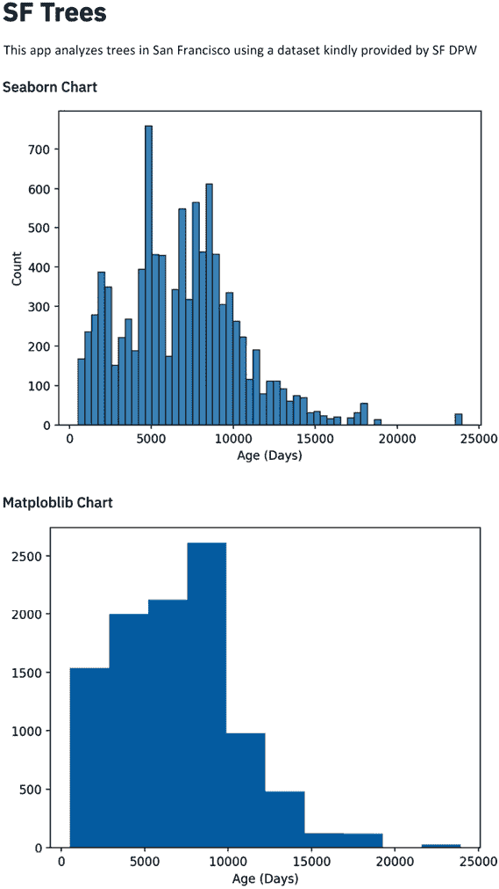

# 第三章：数据可视化

可视化是现代数据科学家的一项基本工具。它通常是理解诸如统计模型（例如，通过 AUC 图表）、关键变量的分布（通过直方图）或甚至重要商业指标的核心方式。

在前两章中，我们在示例中使用了两个流行的 Python 绘图库（**Matplotlib** 和 **Altair**）。本章将重点介绍如何将这一能力扩展到更多种类的 Python 绘图库，包括 Streamlit 原生的一些绘图函数。

本章结束时，你应该能够自如地使用 Streamlit 的原生绘图函数和可视化函数，将主要 Python 可视化库制作的图表嵌入到你自己的 Streamlit 应用中。

在本章中，我们将介绍以下主题：

+   **旧金山**（**SF**）树木 —— 一个新的数据集

+   Streamlit 内置的绘图函数

+   Streamlit 内置的可视化选项

+   在 Streamlit 中使用 Python 可视化库。在本节中，我们将介绍以下库：

    +   **Plotly**（用于互动可视化）

    +   **Seaborn** 和 **Matplotlib**（用于经典统计可视化）

    +   **Bokeh**（用于在 Web 浏览器中进行互动可视化）

    +   **Altair**（用于声明式互动可视化）

    +   **PyDeck**（用于基于地图的互动可视化）

# 技术要求

在本章中，我们将使用一个新的数据集，数据集可以在 [`github.com/tylerjrichards/streamlit_apps/blob/main/trees_app/trees.csv`](https://github.com/tylerjrichards/streamlit_apps/blob/main/trees_app/trees.csv) 找到。数据集的进一步说明将在以下部分中介绍。

# 旧金山树木 —— 一个新的数据集

在本章中，我们将处理各种类型的图表，因此需要一个包含更多信息、特别是日期和位置的新数据集。引入 **SF Trees** 数据集。旧金山市公共工程部有一个数据集（由 R 社区中的优秀成员清理，这些成员运营着 Tidy Tuesday 这一每周活动，发布有趣的数据可视化），包含了旧金山市所有种植和维护的树木的信息。该数据集巧妙地命名为 **EveryTreeSF – 城市森林地图**，并每天更新。我已随机选择了 10,000 棵树的完整信息，并将此数据存放在主 GitHub 仓库中的 **trees** 文件夹下（我并不像旧金山市公共工程部的数据工程师那么聪明，我知道）。GitHub 仓库链接为 [`github.com/tylerjrichards/streamlit_apps`](https://github.com/tylerjrichards/streamlit_apps)。如果你想下载完整数据集，可以通过此链接： [`data.sfgov.org/City-Infrastructure/Street-Tree-List/tkzw-k3nq`](https://data.sfgov.org/City-Infrastructure/Street-Tree-List/tkzw-k3nq)。

从我们在本书中一直使用的 `streamlit_apps` 主文件夹开始，创建一个新文件夹，创建一个新的 Python 文件，然后将数据下载到该文件夹中，这与我们在*第二章*《上传、下载和操作数据》中所做的相同，不过这次用的是一些新数据！你可以在终端中运行以下代码来设置：

```py
mkdir trees_app
cd trees_app
touch trees.py
curl https://raw.githubusercontent.com/tylerjrichards/streamlit_apps/main/trees_app/trees.csv > trees.csv 
```

我在这里要指出的是，如果这种方法不起作用，或者你使用的是没有这些命令的操作系统（例如 Windows），你总是可以直接通过访问前面段落中提到的 GitHub 仓库 ([`github.com/tylerjrichards/streamlit_apps`](https://github.com/tylerjrichards/streamlit_apps)) 来下载 CSV 文件。

现在我们已经完成了设置，接下来的步骤是打开我们最喜欢的编辑器中的 `trees.py` 文件，开始制作我们的 Streamlit 应用。

我们将在本书接下来的章节一开始时遵循完全相同的步骤，因此未来我们将不会明确地涵盖这些内容。

让我们先为应用设置标题，并使用以下代码打印一些示例行：

```py
import streamlit as st
import pandas as pd
st.title('SF Trees')
st.write(
    """This app analyzes trees in San Francisco using
    a dataset kindly provided by SF DPW"""
)
trees_df = pd.read_csv('trees.csv')
st.write(trees_df.head()) 
```

然后我们可以在终端中运行以下命令，并在浏览器中查看生成的 Streamlit 应用：

```py
streamlit run trees.py 
```

请注意，这既不是查看数据集前几行的最简单方法，也不是最好的方法，但我们之所以这样做，是因为我们已经知道将使用这些数据构建一个 Streamlit 应用。一般的工作流程通常始于在 Streamlit 之外对数据的探索（比如在 Jupyter Notebook 中，或通过 SQL 查询，或者任何你作为数据科学家或分析师所偏好的工作流程）。话虽如此，让我们继续通过在浏览器中的新 Streamlit 应用查看前面代码的输出，来进一步探索数据集：


图 3.1：树木数据集的前几行

这个数据集包含了关于旧金山树木的大量信息，从树木的宽度（**dbh**）到经纬度、物种、地址，甚至是它们的种植日期。在我们开始绘图之前，先谈谈我们面前的可视化选项。

# Streamlit 可视化使用案例

一些 Streamlit 用户是相对经验丰富的 Python 开发者，他们在自己选择的可视化库中有着经过充分测试的工作流程。对于这些用户，最好的前进路径就是我们目前所采用的方式，那就是在我们选择的库（如 Seaborn、Matplotlib、Bokeh 等）中创建图表，然后使用适当的 Streamlit 函数将其写入应用程序。

其他 Streamlit 用户在 Python 图形绘制方面经验较少，尤其是对于这些用户，Streamlit 提供了一些内建函数。我们将从内建库开始，接着学习如何为我们的 Streamlit 应用导入最流行和最强大的库。

# Streamlit 的内建图形功能

有四个内置的图表函数——`st.line_chart()`、`st.bar_chart()`、`st.area_chart()` 和 `st.map()`。它们的工作原理相似，都是尝试识别你已经在尝试绘制的变量，然后将它们分别放入折线图、条形图、地图图或区域图。在我们的数据集中，有一个叫做 `dbh` 的变量，表示树木胸高的直径。首先，我们可以根据 `dbh` 对 DataFrame 进行分组，然后将其直接推送到折线图、条形图和区域图。以下代码将根据宽度对数据集进行分组，统计每个宽度的独特树木数量，然后绘制每个图表：

```py
import streamlit as st
import pandas as pd
st.title('SF Trees')
st.write(
    """This app analyzes trees in San Francisco using
    a dataset kindly provided by SF DPW"""
)
trees_df = pd.read_csv('trees.csv')
df_dbh_grouped = pd.DataFrame(trees_df.groupby(['dbh']).count()['tree_id'])
df_dbh_grouped.columns = ['tree_count']
st.line_chart(df_dbh_grouped)
st.bar_chart(df_dbh_grouped)
st.area_chart(df_dbh_grouped) 
```

上述代码应按顺序显示我们的三个图表，如下截图所示：


图 3.2：折线、条形图、区域图和树木高度

我们给这个函数提供的唯一参数就是 DataFrame，而它能够正确地猜测出应该放在 *x* 轴和 *y* 轴上的项目，并将它们绘制到我们的 Streamlit 图表上。每个图表默认都是交互式的！我们可以放大或缩小，鼠标悬停在点/条形/线条上查看每个数据点，甚至可以直接查看全屏。这些 Streamlit 函数调用了一个流行的图表库叫做 **Altair**（就是我们之前在 *第二章* 中使用的那个！）。

现在我们看到了内置函数的基础知识（显然，“内置”一词在这里的定义比较宽泛，因为 Streamlit 是为了成为一个很棒且便捷的 Web 应用程序库，而不是一个专门的可视化库），让我们把这些函数用到更多数据上，看看它们如何处理。首先，我们将在 `df_dbh_grouped` DataFrame 中生成一个介于 -500 和 500 之间的随机数新列，使用 `numpy` 库，并使用之前相同的绘图代码。以下代码绘制了两个折线图，一个是添加新列之前的，另一个是添加之后的：

```py
import streamlit as st
import pandas as pd
import numpy as np
st.title('SF Trees')
st.write(
    """This app analyzes trees in San Francisco using
    a dataset kindly provided by SF DPW"""
)
trees_df = pd.read_csv('trees.csv')
df_dbh_grouped = pd.DataFrame(trees_df.groupby(['dbh']).count()['tree_id'])
df_dbh_grouped.columns = ['tree_count']
st.line_chart(df_dbh_grouped)
df_dbh_grouped['new_col'] = np.random.randn(len(df_dbh_grouped)) * 500
st.line_chart(df_dbh_grouped) 
```

这段代码应该生成一个看起来像下面截图的应用，两个单独的折线图垂直排列在一起。


图 3.3：两个连续的折线图

再次提醒，这些函数将索引上的内容放在 *x* 轴上，并将它们能找到的所有列作为 *y* 轴上的变量。如果我们遇到一个非常简单的绘图问题（如示例中所示），这些内置函数非常有用。如果我们愿意，还可以显式地告诉 Streamlit 我们想要在 *x* 和 *y* 轴上绘制的变量；以下代码段将索引转换为单独的列，然后绘制一个折线图：

```py
import numpy as np
import pandas as pd
import streamlit as st

st.title("SF Trees")
st.write(
    """This app analyzes trees in San Francisco using
    a dataset kindly provided by SF DPW"""
)
trees_df = pd.read_csv("trees.csv")
df_dbh_grouped = pd.DataFrame(
    trees_df.groupby(["dbh"]).count()["tree_id"]
).reset_index()
df_dbh_grouped.columns = ["dbh", "tree_count"]
st.line_chart(df_dbh_grouped, x="dbh", y="tree_count") 
```

当你运行这段代码时，你会看到之前创建的相同折线图！这些内置函数非常棒，但与专注于可视化的库相比，它们的灵活性较差，而且可能很难调试这些函数背后的行为。

这里的建议是，如果你只需要一个相对基础的可视化，这些函数可能完全适合你。但如果你想要更复杂的东西，应该使用其他图形库（我个人最喜欢的是 Altair）。

还有一个内置的 Streamlit 图形函数我们需要讨论，`st.map()`。就像前面的函数一样，这个函数封装了另一个 Python 图形库，这次使用的是 PyDeck，而不是 Altair，它通过搜索 DataFrame 中标题为 **longitude**、**long**、**latitude** 或 **lat** 等的列来识别认为是经度和纬度的列。然后，它将每一行作为一个点绘制在地图上，自动缩放并聚焦地图，最后将其写入我们的 Streamlit 应用。我们需要注意的是，与我们迄今使用的其他可视化形式相比，详细地图的可视化计算量要大得多，因此我们将从 DataFrame 中随机抽取 1,000 行，移除 `null` 值，并使用以下代码尝试 `st.map()`：

```py
import streamlit as st
import pandas as pd
import numpy as np
st.title('SF Trees')
st.write(
    """This app analyzes trees in San Francisco using
    a dataset kindly provided by SF DPW"""
)
trees_df = pd.read_csv('trees.csv')
trees_df = trees_df.dropna(subset=['longitude', 'latitude'])
trees_df = trees_df.sample(n = 1000)
st.map(trees_df) 
```

这非常完美，开箱即用！我们得到了一个漂亮的交互式旧金山树木地图，如下图所示：


图 3.4：默认的旧金山树木地图

和其他函数一样，我们在这里的定制选项并不多，除了一个可选的缩放参数，但这个功能非常适合快速可视化。

正如我们所见，这些内置函数对于快速创建 Streamlit 应用非常有用，但我们在速度和可定制性之间做了权衡。在实际应用中，我很少在制作 Streamlit 应用时使用这些函数，但在进行快速可视化时，我经常使用这些函数。在生产环境中，更强大的库，如 Matplotlib、Seaborn 和 PyDeck，将能够提供我们所需的灵活性和可定制性。本章的剩余部分将提供六种不同流行 Python 可视化库的详细介绍。

# Streamlit 内置的可视化选项

在本章的其余部分，我们将介绍 Streamlit 的其他可视化选项，包括 Plotly、Matplotlib、Seaborn、Bokeh、Altair 和 PyDeck。

## Plotly

Plotly 是一个交互式可视化库，许多数据科学家用它在 Jupyter notebook 中可视化数据，无论是在本地浏览器中，还是托管在像 **Dash**（Plotly 的创建者）这样的 Web 平台上。这个库与 Streamlit 在目标上非常相似，主要用于内部或外部的仪表板（因此，才有了 Dash 这个名字）。

Streamlit 允许我们通过 `st.plotly_chart()` 函数在 Streamlit 应用中调用 Plotly 图表，这使得移植任何 Plotly 或 Dash 仪表板变得非常轻松。我们将通过绘制旧金山树木的身高直方图来测试这一点，这基本上是我们之前制作的图表。以下代码生成我们的 Plotly 直方图：

```py
import streamlit as st
import pandas as pd
import plotly.express as px
st.title('SF Trees')
st.write(
    """This app analyzes trees in San Francisco using
    a dataset kindly provided by SF DPW"""
)
st.subheader('Plotly Chart')
trees_df = pd.read_csv('trees.csv')
fig = px.histogram(trees_df['dbh'])
st.plotly_chart(fig) 
```

正如我们所注意到的，所有 Plotly 的原生交互性在 Streamlit 中默认可以使用。特别是，用户可以滚动直方图的条形图，并获取每个条形图的确切信息。Plotly 中还有一些其他有用的内置功能，可以直接移植到 Streamlit 中，例如放大缩小、下载图表为 .**png** 文件，以及选择一组数据点/条形图/线条。以下截图显示了完整功能：


图 3.5：我们的第一个 Plotly 图表

现在我们已经熟悉了 Plotly，我们可以继续学习其他流行的可视化库，Matplotlib 和 Seaborn。

## Matplotlib 和 Seaborn

在本书的前面部分，我们学习了如何在 Streamlit 中使用 Matplotlib 和 Seaborn 可视化库，因此我们在这里将简单地回顾它们。树木数据集中有一个名为**date**的列，表示树木种植的日期。我们可以使用 `datetime` 库来计算每棵树的年龄（以天为单位），并分别使用 Seaborn 和 Matplotlib 绘制该直方图。以下代码创建了一个名为 `age` 的新列，表示树木种植日期和今天日期之间的天数差异，然后使用 Seaborn 和 Matplotlib 绘制该年龄的直方图：

```py
import streamlit as st
import pandas as pd
import matplotlib.pyplot as plt
import seaborn as sns
import datetime as dt
st.title('SF Trees')
st.write(
    """This app analyzes trees in San Francisco using
    a dataset kindly provided by SF DPW"""
)
trees_df = pd.read_csv('trees.csv')
trees_df['age'] = (pd.to_datetime('today') -
                   pd.to_datetime(trees_df['date'])).dt.days
st.subheader('Seaborn Chart')
fig_sb, ax_sb = plt.subplots()
ax_sb = sns.histplot(trees_df['age'])
plt.xlabel('Age (Days)')
st.pyplot(fig_sb)
st.subheader('Matploblib Chart')
fig_mpl, ax_mpl = plt.subplots()
ax_mpl = plt.hist(trees_df['age'])
plt.xlabel('Age (Days)')
st.pyplot(fig_mpl) 
```

在前面的代码中，我们为每个图表定义了独立的子图，为每个图表创建了一个 Seaborn 或 Matplotlib 图表，然后使用 `st.pyplot()` 函数按顺序将每个图表插入到我们的 Streamlit 应用中。前面的代码应该会显示一个类似于以下截图的应用（我说“类似”是因为，根据你运行的时间，树木的年龄会有所不同，因为 `pd.to_datetime`（`'today'`）会返回你当前的日期）：



图 3.6：Seaborn 和 Matplotlib 直方图

无论是使用 Seaborn 还是 Matplotlib，你都会以相同的方式使用 `st.pyplot()` 函数。现在我们已经更加熟悉这些库，我们可以学习另一种交互式可视化库 —— **Bokeh**。

## Bokeh

Bokeh 是另一个基于 Web 的交互式可视化库，也有基于其构建的仪表板产品。它是 Plotly 的直接竞争对手，坦白说，在使用上非常相似，但在样式上有所不同。不管怎样，Bokeh 是一个非常流行的 Python 可视化包，Python 用户可能非常熟悉使用它。

我们可以像使用 Plotly 一样调用 Bokeh 图表。首先，我们创建 Bokeh 图表，然后使用`st.bokeh_chart()`函数将应用写入 Streamlit。在 Bokeh 中，我们必须首先实例化一个 Bokeh 图形对象，然后在绘制之前修改该图形的各个方面。这里的重要教训是，如果我们在调用`st.bokeh_chart()`函数之后修改 Bokeh 图形对象的某个方面，我们将不会改变 Streamlit 应用中显示的图表。例如，当我们运行以下代码时，完全看不到新的**x**轴标题：

```py
import streamlit as st
import pandas as pd
from bokeh.plotting import figure
st.title('SF Trees')
st.write(
    """This app analyzes trees in San Francisco using
    a dataset kindly provided by SF DPW"""
)
st.subheader('Bokeh Chart')
trees_df = pd.read_csv('trees.csv')
scatterplot = figure(title = 'Bokeh Scatterplot')
scatterplot.scatter(trees_df['dbh'], trees_df['site_order'])
st.bokeh_chart(scatterplot)
scatterplot.xaxis.axis_label = "dbh" 
```

相反，我们需要交换最后两行的顺序，这样它们就会出现在我们的应用中。我们还将添加一个**y**轴作为补充：

```py
import streamlit as st
import pandas as pd
from bokeh.plotting import figure
st.title('SF Trees')
st.write('This app analyzes trees in San Francisco using'
        ' a dataset kindly provided by SF DPW')
st.subheader('Bokeh Chart')
trees_df = pd.read_csv('trees.csv')
scatterplot = figure(title = 'Bokeh Scatterplot')
scatterplot.scatter(trees_df['dbh'], trees_df['site_order'])
scatterplot.yaxis.axis_label = "site_order"
scatterplot.xaxis.axis_label = "dbh"
st.bokeh_chart(scatterplot) 
```

上述代码将创建一个`dbh`与`site_order`的 Bokeh 图表，如下图所示：


图 3.7：Bokeh 散点图

现在我们已经有了基本的`dbh`按地点顺序绘制的 Bokeh 图表，接下来是我们要使用的下一个可视化库——Altair！

## Altair

我们在本章中已经通过 Streamlit 函数如`st.line_chart()`和`st.map()`，以及直接通过`st.altair_chart()`使用了 Altair，所以为了完整性，我们将简要覆盖这个部分。

由于我们已经使用这个数据集做了不少图表，为什么不探索一个新列——`caretaker`列呢？这一列数据定义了谁负责这棵树（公共或私人），如果是公共的，负责养护的政府机构是哪个。真是令人兴奋！

以下代码将我们的 DataFrame 按 caretaker 分组，然后在 Altair 中使用该分组的 DataFrame：

```py
import streamlit as st
import pandas as pd
import altair as alt
st.title('SF Trees')
st.write(
    """This app analyzes trees in San Francisco using
    a dataset kindly provided by SF DPW"""
)
trees_df = pd.read_csv('trees.csv')
df_caretaker = trees_df.groupby(['caretaker']).count()['tree_id'].reset_index()
df_caretaker.columns = ['caretaker', 'tree_count']
fig = alt.Chart(df_caretaker).mark_bar().encode(x = 'caretaker', y = 'tree_count')
st.altair_chart(fig) 
```

Altair 也允许我们直接在`mark_bar()`的**y**值中总结数据，因此我们可以通过使用以下代码简化此过程：

```py
import streamlit as st
import pandas as pd
import altair as alt
st.title('SF Trees') 
st.write(
    """This app analyzes trees in San Francisco using
    a dataset kindly provided by SF DPW"""
)
trees_df = pd.read_csv('trees.csv')
fig = alt.Chart(trees_df).mark_bar().encode(x = 'caretaker', y = 'count(*):Q')
st.altair_chart(fig) 
```

上述代码将创建一个 Streamlit 应用，显示 SF 地区按照 caretaker 分类的树木数量，如下图所示：


图 3.8：Altair 条形图

这应该就是传统的可视化库，但 Streamlit 还允许我们使用更复杂的可视化库，比如 PyDeck 进行地理映射。事实上，我们已经通过原生的`st.map()`函数使用了 PyDeck，并将在接下来的章节中更深入地探讨它。

## PyDeck

PyDeck 是一个可视化库，它将可视化作为图层绘制在**Mapbox**（一家提供卓越免费服务的地图公司）地图上。Streamlit 和 PyDeck 都有一套基本的功能，可以在没有注册 Mapbox 账户的情况下使用，但如果我们获得了**Mapbox**令牌，它们的免费功能将大大扩展，我们将在下一节中获取该令牌。

## 配置选项

为了设置你自己的 **Mapbox** 令牌（这是可选的），首先前往 [www.Mapbox.com](http://www.Mapbox.com) 并注册一个账户。一旦验证了账户，你可以在 [`www.Mapbox.com/install/`](https://www.Mapbox.com/install/) 找到你的令牌。我们不会将令牌直接传递给 Streamlit，因为否则我们可能会不小心将其推送到公共的 GitHub 仓库中。相反，Streamlit 有一个全局配置文件，名为 `config.toml`。要查看我们当前的设置，我们可以在终端中运行以下命令：

```py
streamlit config show 
```

Streamlit 提供了四种方法来更改我们的默认配置设置；我将展示我推荐的选项和另外一个选项，它们应该能够满足大部分使用场景。如果你觉得这些选项不够，Streamlit 文档（[`docs.streamlit.io/library/advanced-features/configuration`](https://docs.streamlit.io/library/advanced-features/configuration)）会详细讲解所有四种选项。

第一种选择是通过直接编辑 `config.toml` 文件来设置全局配置选项。我们可以通过在文本编辑器中打开该文件直接进行编辑。以下命令将在 VSCode 中打开该文件。对于其他文本编辑器（如 Vim 和 Atom），将 `code` 替换为相应的命令，或者直接从文本编辑器中打开文件：

```py
code ~/.streamlit/config.toml 
```

如果失败了，可能意味着我们还没有生成该文件。为了创建自己的文件，我们可以运行以下命令：

```py
touch ~/.streamlit/config.toml 
```

在这个文件中，你可以选择复制并粘贴 `'streamlit config show'` 的内容，或者从头开始。两种方法都可以！现在，在 VSCode 中打开文件，以便我们可以直接查看和编辑任何配置选项。确保在你的配置文件中有一部分包含你的 Mapbox 令牌，格式如下：

```py
[mapbox] 
token = "123my_large_mapbox_token456" 
```

当然，你的令牌会与我明显编造的那个不同！这个选项对于像 Mapbox 令牌这样的配置选项非常好，因为我不可能有多个 Mapbox 账户和多个令牌。

然而，一些 Streamlit 应用可能想要使用与默认的 **8501 serverPort** 不同的端口。例如，改变一个项目特定的设置就不适合修改全局选项，这也是我们需要第二种配置更改选项的原因。

第二种选择是创建并编辑一个项目特定的 `config.toml` 文件。我们之前的配置设置了默认的配置选项，而这个选项是针对每个 Streamlit 应用的。这里就是我们在 `streamlit_apps` 文件夹中的各个项目文件夹派上用场的时候！

从大致的角度来看，我们将进行以下操作：

1.  检查当前工作目录。

1.  为我们的项目创建一个配置文件。

1.  在 PyDeck 中使用配置文件。

我们的第一步是确保当前工作目录是`trees_app`文件夹，可以在终端中运行`pwd`命令，它将显示当前工作目录，并且应该以`trees_app`结尾（例如，我的目录是`Users/tyler/Documents/streamlit_apps/trees_app`）。

现在，我们需要为我们的项目创建一个配置文件。首先，我们将创建一个名为`.streamlit`的文件夹，然后重复我们之前在 Mac/Linux 上使用的快捷操作：

```py
mkdir .streamlit
touch .streamlit/config.toml 
```

然后，我们可以像之前一样编辑我们的配置选项，但这仅适用于当我们从目录运行 Streamlit 时的 Streamlit 应用程序。

现在，最后我们可以回到 PyDeck 图表绘制。我们的第一个任务是获取 SF 的基础地图，城市中心坐标为`37.77, -122.4`。我们可以使用如下代码来完成，首先定义初始状态（我们希望开始查看地图的位置），然后使用该初始状态调用`st.pydeck_chart()`：

```py
import streamlit as st
import pandas as pd
import pydeck as pdk 
st.title('SF Trees')
st.write(
    """This app analyzes trees in San Francisco using
    a dataset kindly provided by SF DPW"""
)
trees_df = pd.read_csv('trees.csv')
sf_initial_view = pdk.ViewState(
     latitude=37.77,
     longitude=-122.4
     )
st.pydeck_chart(pdk.Deck(
     initial_view_state=sf_initial_view
     )) 
```

这段代码将生成一个 SF 的地图，我们可以用它来叠加数据点。这里有几点需要注意。首先，黑色的默认地图可能不容易看清，其次，我们需要花时间缩放到 SF 的区域，以便获得我们需要的视图。我们可以通过使用 Streamlit 文档中建议的默认值来解决这两个问题（[`docs.streamlit.io/`](https://docs.streamlit.io/)），如下代码所示：

```py
import streamlit as st
import pandas as pd
import pydeck as pdk
st.title('SF Trees')
st.write(
    """This app analyzes trees in San Francisco using
    a dataset kindly provided by SF DPW"""
)
trees_df = pd.read_csv('trees.csv')
sf_initial_view = pdk.ViewState(
     latitude=37.77,
     longitude=-122.4,
     zoom=9
     )
st.pydeck_chart(pdk.Deck(
     map_style='mapbox://styles/mapbox/light-v9',
     initial_view_state=sf_initial_view,
     )) 
```

前面的代码应该生成一张如下截图所示的地图：


图 3.9：PyDeck 映射：SF 基础地图

这正是我们想要的！我们可以看到整个**SF 湾区**，接下来我们需要添加树木的层。PyDeck 库有交互功能的工具提示，但这些工具对于数据集中的`null`值处理不太好，因此我们将在接下来的代码中，在映射这些点之前移除`null`值。我们还会将`zoom`值增加到`11`，这样可以更清楚地看到每个点：

```py
import streamlit as st
import pandas as pd
import pydeck as pdk
st.title('SF Trees') 
st.write(
    """This app analyzes trees in San Francisco using
    a dataset kindly provided by SF DPW"""
)
trees_df = pd.read_csv('trees.csv')
trees_df.dropna(how='any', inplace=True)
sf_initial_view = pdk.ViewState(
     latitude=37.77,
     longitude=-122.4,
     zoom=11
     )
sp_layer = pdk.Layer(
     'ScatterplotLayer',
     data = trees_df,
     get_position = ['longitude', 'latitude'],
     get_radius=30)
st.pydeck_chart(pdk.Deck(
     map_style='mapbox://styles/mapbox/light-v9',
     initial_view_state=sf_initial_view,
     layers = [sp_layer]
     )) 
```

`zoom`和`radius`参数的最佳值取决于你的可视化偏好。尝试几种选项，看看哪个效果最好。前面的代码将生成以下地图：


图 3.10：SF 树木映射

与之前的地图一样，默认情况下这是交互式的，因此我们可以缩放到 SF 的不同区域，查看树木密度最高的地方。接下来，我们将对这张地图进行修改，添加另一个层，这次是六边形层，根据 SF 中树木的密度进行着色。我们可以使用上面的相同代码，但将散点图层改为六边形层。我们还将包含将六边形沿垂直方向挤压的选项，使图表更具三维效果，虽然这不是必须的，但绝对是一个有趣的可视化风格。

我们最后的修改是改变我们查看地图的视角或角度。正如我们所看到的，默认的视角几乎是直接俯视城市，如果我们尝试在地图上查看垂直的六边形，这样的视角就无法使用。以下代码实现了这些更改：

```py
import streamlit as st
import pandas as pd
import pydeck as pdk
st.title('SF Trees')
st.write(
    """This app analyzes trees in San Francisco using
    a dataset kindly provided by SF DPW"""
)
trees_df = pd.read_csv('trees.csv')
trees_df.dropna(how='any', inplace=True)
sf_initial_view = pdk.ViewState(
     latitude=37.77,
     longitude=-122.4,
     zoom=11,
     pitch=30
     )
hx_layer = pdk.Layer(
     'HexagonLayer',
     data = trees_df,
     get_position = ['longitude', 'latitude'],
     radius=100,
     extruded=True)
st.pydeck_chart(pdk.Deck(
     map_style='mapbox://styles/mapbox/light-v9',
     initial_view_state=sf_initial_view,
     layers = [hx_layer]
     )) 
```

与前一张地图一样，最佳的半径和视角参数将根据你的可视化效果有所不同。尝试改变这些参数几次，看看你是否能掌握它！前面的代码将生成以下应用：


图 3.11：最终的 SF 树木地图

从这张截图中，我们可以看到 PyDeck 在树木密度较高的地方创建了较深的圆圈。从中我们可以观察到很多有趣的细节，比如数据集中似乎缺少了位于城市西侧的著名金门公园的树木，而且金门大桥周围的区域似乎在数据集中也缺少树木。

# 总结

在这一章之后，希望你能对如何在 Streamlit 中利用几个令人惊叹的开源 Python 可视化库有一个扎实的理解。

让我们回顾一下。首先，我们学习了如何使用默认的可视化选项，例如 `st.line_chart()` 和 `st.map()`，然后我们深入了解了交互式库，如 Plotly，地图库，如 PyDeck，以及其中的一切。

在下一章中，我们将继续介绍如何使用机器学习和 AI 与 Streamlit 配合使用。

# 在 Discord 上了解更多

要加入本书的 Discord 社区——你可以在这里分享反馈、向作者提问并了解新版本——请扫描下面的二维码：

[`packt.link/sl`](https://packt.link/sl)


