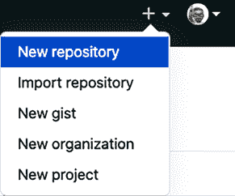
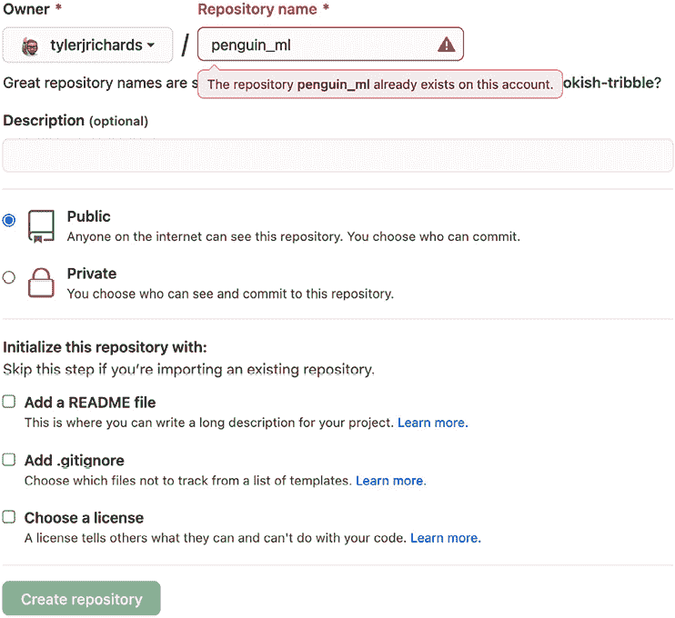
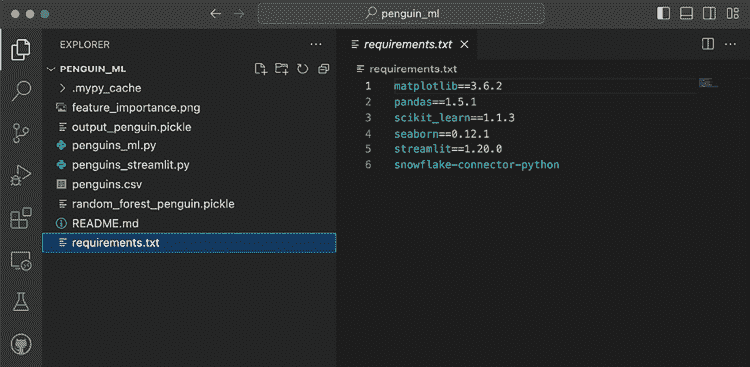
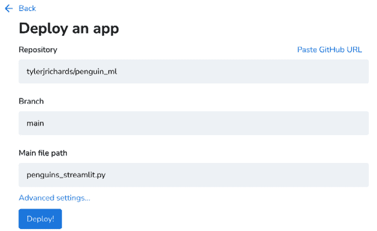
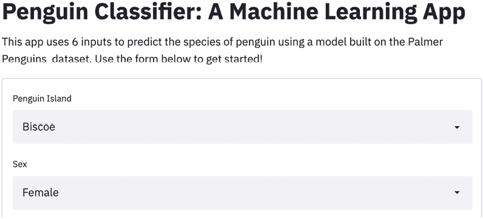
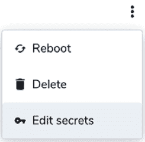
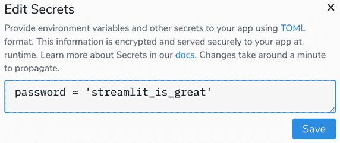
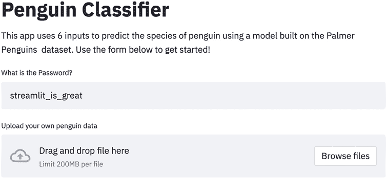

# 第五章：使用 Streamlit 社区云部署 Streamlit

迄今为止，本书的重点是 Streamlit 应用程序开发，从创建复杂的可视化到部署和创建**机器学习**（**ML**）模型。在本章中，我们将学习如何部署这些应用程序，以便让任何有互联网访问的人都能共享。这是 Streamlit 应用程序的关键部分，因为如果无法部署 Streamlit 应用，用户或消费者仍然会遇到障碍。如果我们相信 Streamlit 消除了创建数据科学分析/产品/模型与与他人共享之间的障碍，那么我们也必须相信，广泛共享应用程序的能力与开发的便捷性同样重要。

部署 Streamlit 应用程序有三种主要方式：通过 Streamlit 创建的产品 *Streamlit Community Cloud*，通过云服务提供商如 *Amazon Web Services* 或 *Heroku*，或者通过 *Hugging Face* 的 *Hugging Face Spaces*。在 AWS 和 Heroku 上部署是付费的，但 *Streamlit Community Cloud* 和 *Hugging Face Spaces* 是免费的！对于大多数 Streamlit 用户来说，最简单和首选的方法是 *Streamlit Community Cloud*，因此我们将在这里直接介绍这个方法，AWS 和 Hugging Face Spaces 会在本书后面的 *第八章*，《通过 Hugging Face 和 Heroku 部署 Streamlit 应用》以及 *第十一章*，《数据项目 - 在 Streamlit 中原型设计项目》进行介绍。

在本章中，我们将涵盖以下主题：

+   开始使用 Streamlit 社区云

+   GitHub 快速入门

+   在 Streamlit 社区云上部署

# 技术要求

本章需要访问 Streamlit 社区云，您可以通过免费注册一个账户来获得访问权限，网址是 [`share.streamlit.io/signup`](https://share.streamlit.io/signup)。

本章还需要一个免费的 GitHub 账户，您可以在 [`www.github.com`](https://www.github.com) 获得。有关 GitHub 的完整入门和详细的设置说明，可以在本章后面 *GitHub 快速入门* 部分找到。

本章的代码可以在以下 GitHub 仓库中找到：[`github.com/tylerjrichards/Streamlit-for-Data-Science`](https://github.com/tylerjrichards/Streamlit-for-Data-Science)。

# 开始使用 Streamlit 社区云

Streamlit Community Cloud 是 Streamlit 对快速部署流程的回应，绝对是我推荐的第一个部署 Streamlit 应用的方式。2020 年夏天我第一次接触到 Streamlit 时，记得是在本地部署一个应用并喜欢上了这个库，但很快我就对需要使用 AWS 来部署我的应用感到失望。随后，Streamlit 团队联系了我，问我是否愿意尝试他们正在开发的一款产品，那就是现在的 Streamlit Community Cloud。我当时觉得它不可能这么简单。我们只需要将代码推送到 GitHub 仓库，并指向该仓库，Streamlit 会处理剩下的部分。

有时候我们关心的是“其余的部分”，例如当我们想要配置可用的存储空间或内存时，但通常情况下，让 Streamlit Community Cloud 处理部署、资源配置和共享可以大大简化我们的开发工作。

这里的目标是将我们已经创建的 Palmer Penguins ML 应用部署到 Streamlit Community Cloud 上。在开始之前，Streamlit Community Cloud 是通过 GitHub 运行的。如果你已经熟悉 Git 和 GitHub，可以跳过此部分，直接创建一个包含我们 `penguins_ml` 文件夹的 GitHub 仓库，并前往 *使用 Streamlit Community Cloud 部署* 部分。

# GitHub 简介

GitHub 和 Git 语言是软件工程师和数据科学家用来协作的工具，提供了版本控制框架。我们不需要知道它们如何运作的所有细节来使用 Streamlit Community Cloud，但我们需要能够创建自己的仓库（它们像共享文件夹一样）并在更新应用程序时更新它们。处理 Git 和 GitHub 有两种方式：通过命令行和通过名为 GitHub Desktop 的产品。

目前为止，这本书大部分内容还是停留在命令行中，本教程也会继续保持这一点。然而，如果你更愿意使用 GitHub Desktop，可以访问 [`desktop.github.com`](https://desktop.github.com)，并按照那里的指示操作。

现在，使用以下步骤在命令行中开始使用 Git 和 GitHub：

1.  首先，访问 [`www.github.com`](https://www.github.com) 并在那里创建一个免费账户。

1.  接着，我们需要将 Git 语言下载到自己的计算机上，并使用 Git 连接到我们的 GitHub 账户。我们可以在 Mac 上通过终端使用 `brew` 来完成此操作：

    ```py
    brew install git 
    ```

1.  我们还需要在 Git 中设置全局用户名和电子邮件（如果尚未设置），这是 GitHub 推荐的做法。以下代码会全局设置这些信息：

    ```py
    git config --global user.name "My Name"
    git config --global user.email myemail@email.com 
    ```

现在我们已经有了 GitHub 帐户，并且本地安装了 Git，我们需要创建我们的第一个仓库！我们已经有一个名为`penguin_ml`的文件夹，里面包含所需的文件，因此我们应该确保正在使用该文件夹作为工作目录（如果不确定，可以使用`pwd`命令查看当前工作目录）。我们将使用`penguins_streamlit.py`应用的最终版本，下面的代码中简要解释了其中的一些内容：

```py
import streamlit as st
import seaborn as sns
import matplotlib.pyplot as plt
import pandas as pd
import pickle
st.title('Penguin Classifier')
st.write("This app uses 6 inputs to predict the species of penguin using "
         "a model built on the Palmer Penguins dataset. Use the form below"
         " to get started!")
penguin_df = pd.read_csv('penguins.csv')
rf_pickle = open('random_forest_penguin.pickle', 'rb')
map_pickle = open('output_penguin.pickle', 'rb')
rfc = pickle.load(rf_pickle)
unique_penguin_mapping = pickle.load(map_pickle)
rf_pickle.close()
map_pickle.close() 
```

第一部分导入了我们的库，为应用设置了标题，并加载了我们使用`penguins_ml.py`文件创建的模型。如果没有`random_forest_penguin.pickle`和`output_penguin.pickle`文件，这一部分将无法执行。你可以前往*第四章*，*《Streamlit 与机器学习和人工智能》*来创建这些文件，或者直接访问[`github.com/tylerjrichards/Streamlit-for-Data-Science/tree/main/penguin_ml`](https://github.com/tylerjrichards/Streamlit-for-Data-Science/tree/main/penguin_ml)来直接获取它们：

```py
with st.form("user_inputs"):
    island = st.selectbox(
        "Penguin Island", 
        options=["Biscoe", "Dream", "Torgerson"])
    sex = st.selectbox(
        "Sex", options=["Female", "Male"])
    bill_length = st.number_input(
        "Bill Length (mm)", min_value=0)
    bill_depth = st.number_input(
        "Bill Depth (mm)", min_value=0)
    flipper_length = st.number_input(
        "Flipper Length (mm)", min_value=0)
    body_mass = st.number_input(
        "Body Mass (g)", min_value=0)
    st.form_submit_button()
island_biscoe, island_dream, island_torgerson = 0, 0, 0
if island == 'Biscoe':
    island_biscoe = 1
elif island == 'Dream':
    island_dream = 1
elif island == 'Torgerson':
    island_torgerson = 1
sex_female, sex_male = 0, 0
if sex == 'Female':
    sex_female = 1
elif sex == 'Male':
    sex_male = 1
new_prediction = rfc.predict(
    [
        [
            bill_length,
            bill_depth,
            flipper_length,
            body_mass,
            island_biscoe,
            island_dream,
            island_torgerson,
            sex_female,
            sex_male,
        ]
    ]
)
prediction_species = unique_penguin_mapping[new_prediction][0]
st.write(f"We predict your penguin is of the {prediction_species} species") 
```

接下来的这一部分获取我们进行预测所需的所有用户输入，从研究人员所在的岛屿到企鹅的性别，以及企鹅的鸟嘴和鳍肢测量值，这些准备工作为以下代码中企鹅物种的预测做准备：

```py
st.subheader("Predicting Your Penguin's Species:")
st.write(f"We predict your penguin is of the {prediction_species} species")
st.write(
    """We used a machine learning 
    (Random Forest) model to predict the 
    species, the features used in this 
    prediction are ranked by relative 
    importance below."""
)
st.image("feature_importance.png") 
```

现在，最后这一部分创建了多个直方图，用来解释模型所做的预测。特别地，这些图表展示了按物种的色调分开的鸟嘴长度/鸟嘴深度/鳍肢长度。我们使用这三个变量，因为我们的特征重要性图表告诉我们，这些是*第四章*中物种的最佳预测因子，*《Streamlit 与机器学习和人工智能》*：

```py
st.write(
    """Below are the histograms for each
continuous variable separated by penguin species.
The vertical line represents the inputted value."""
)

fig, ax = plt.subplots()
ax = sns.displot(
    x=penguin_df["bill_length_mm"], 
    hue=penguin_df["species"])
plt.axvline(bill_length)
plt.title("Bill Length by Species")
st.pyplot(ax)

fig, ax = plt.subplots()
ax = sns.displot(
    x=penguin_df["bill_depth_mm"],
    hue=penguin_df["species"])
plt.axvline(bill_depth)
plt.title("Bill Depth by Species")
st.pyplot(ax)

fig, ax = plt.subplots()
ax = sns.displot(
    x=penguin_df["flipper_length_mm"], 
    hue=penguin_df["species"])
plt.axvline(flipper_length)
plt.title("Flipper Length by Species")
st.pyplot(ax) 
```

现在我们已经进入了正确的文件夹，并且里面有所需的文件，我们将使用以下代码来初始化第一个仓库，并将所有文件添加到仓库中然后提交：

```py
git init
git add .
git commit -m 'our first repo commit' 
```

我们的下一步是将本地设备上的 Git 仓库与 GitHub 帐户连接起来：

1.  首先，我们需要通过返回 GitHub 网站并点击**新建仓库**按钮来设置新仓库，如以下截图所示：



图 5.1：设置新仓库

1.  然后我们可以填写仓库名称（`penguin_ml`），并点击**创建仓库**。在我的例子中，我已经有一个同名的仓库，因此 GitHub 会提示错误，但你的示例应该可以正常创建。



图 5.2：创建仓库

1.  既然我们在 GitHub 上有了新仓库，并且本地也有一个仓库，我们需要将这两个仓库连接起来。以下代码将这两个仓库连接，并将我们的代码推送到 GitHub 仓库；GitHub 还会在点击**创建仓库**后建议如何连接这两个仓库：

    ```py
    git branch -M main
    git remote add origin https://github.com/{insert_username}/penguin_ml.git
    git push -u origin main 
    ```

1.  现在我们应该能在 GitHub 仓库中看到我们的 `penguin_ml` 文件！如果我们有新的代码需要推送到仓库，我们可以按照常规格式使用 `git add` 添加文件更改，`git commit -m "commit message"` 提交更改，最后使用 `git push` 推送更改到仓库。

我们现在可以继续 Streamlit 端的部署过程了。

# 使用 Streamlit Community Cloud 部署

现在我们所有的必要文件都已经在 GitHub 仓库中，我们几乎拥有了部署应用程序所需的一切。你可以按照以下步骤部署我们的应用程序：

1.  当我们部署到 Streamlit Community Cloud 时，Streamlit 会使用其自己的服务器来托管应用程序。因此，我们需要明确告诉 Streamlit 我们的应用程序运行所需的 Python 库。以下代码安装了一个非常有用的库 `pipreqs`，并创建了一个符合 Streamlit 格式的 `requirements.txt` 文件：

    ```py
    pip install pipreqs
    pipreqs . 
    ```

1.  当我们查看 `requirements.txt` 文件时，可以看到 `pipreqs` 检查了我们所有的 Python 文件，检查了我们导入和使用的内容，并创建了一个文件，Streamlit 可以使用它来安装相同版本的库，以避免错误：



图 5.3：Requirements.txt

1.  我们有了一个新文件，因此也需要将其添加到我们的 GitHub 仓库中。以下代码将 `requirements.txt` 添加到我们的仓库：

    ```py
    git add requirements.txt
    git commit -m 'add requirements file'
    git push 
    ```

1.  现在，我们的最后一步是注册 Streamlit Community Cloud ([share.streamlit.io](http://share.streamlit.io))，登录后，点击 **New App** 按钮。之后，我们可以直接将 Streamlit Community Cloud 指向承载我们应用程序代码的 Python 文件，在我们的例子中该文件名为 `penguins_streamlit.py`。你还需要将用户名从我个人的 GitHub 用户名 (**tylerjrichards**) 更改为你自己的：



图 5.4：从 GitHub 部署

1.  在应用构建完成后，我们就有了一个完全部署的 Streamlit 应用。每当我们对 GitHub 仓库进行更改时，应用中将反映这些更改。例如，以下代码对我们的应用标题进行更改（为了简便起见，我们将仅展示足够的代码来说明更改）：

    ```py
    import streamlit as st
    import seaborn as sns
    import matplotlib.pyplot as plt
    import pandas as pd
    import pickle
    st.title('Penguin Classifier: A Machine Learning App')
    st.write("This app uses 6 inputs to predict the species of penguin using "
             "a model built on the Palmer Penguins dataset. Use the form below"
             " to get started!")
    penguin_df = pd.read_csv('penguins.csv')
    rf_pickle = open('random_forest_penguin.pickle', 'rb')
    map_pickle = open('output_penguin.pickle', 'rb')
    rfc = pickle.load(rf_pickle)
    unique_penguin_mapping = pickle.load(map_pickle)
    rf_pickle.close()
    map_pickle.close() 
    ```

    现在，为了推送更改，我们需要更新我们的 GitHub 仓库。我们将通过以下代码来实现：

    ```py
    git add .
    git commit -m 'changed our title'
    git push 
    ```

当我们返回到应用程序时，它将有一个独特的 URL。如果你无法找到你的 Streamlit 应用，可以随时通过 [share.streamlit.io](http://share.streamlit.io) 查找它们。现在，我们应用程序的顶部应该像下面的截图一样：



图 5.5：我们部署的 Streamlit 应用

应用程序重新加载可能需要几分钟时间！

现在我们已经成功部署了一个完整的 Streamlit 应用程序！我们可以将这个链接分享给朋友、同事或在社交媒体网站上，比如 Twitter/X（如果你在本书的帮助下制作了一个有趣的 Streamlit 应用，请在推特上 @我`@tylerjrichards`，我很想看看！）。现在，让我们学习如何调试我们的 Streamlit 应用程序。本章的应用程序可以在 [`penguins.streamlit.app/`](https://penguins.streamlit.app/) 找到，如果你想进行对比！创建和部署 Streamlit 应用程序，和一般的软件创建与部署一样，总是会遇到一些障碍或错误。我们接下来的部分将专注于学习如何调试我们在应用开发和部署过程中的问题！

## 调试 Streamlit Community Cloud

Streamlit Community Cloud 还允许我们访问应用程序的日志，这些日志如果我们在本地部署应用程序，将会显示在终端上。在右下角，每当我们查看自己的应用程序时，都会有一个**管理应用程序**按钮，允许我们访问日志。从这个选项菜单中，我们可以重新启动、删除或下载应用程序的日志，并查看其他可用的应用程序，或者从 Streamlit 登出。

## Streamlit 秘密

在创建和部署 Streamlit 应用程序时，您可能希望使用一些用户无法查看的信息，比如密码或 API 密钥。然而，Streamlit Community Cloud 默认使用的是完全公开的 GitHub 仓库，其中包含完全公开的代码、数据和模型。但如果，比如说，你想使用一个私密的 API 密钥（许多 API，比如 Twitter 的抓取 API 或 Google Maps API，都需要），或者想编程访问存储在受密码保护的数据库中的数据，甚至想给 Streamlit 应用程序设置密码保护，你就需要一种方法来公开一些私密的数据给 Streamlit。Streamlit 的解决方案就是 Streamlit 秘密，它让我们在每个应用程序中设置隐藏和私密的“秘密”。让我们从为我们的 Streamlit 应用程序创建一个密码开始，特别是我们现有的企鹅应用程序。

一开始，我们可以编辑应用程序顶部，要求用户在加载其余部分之前输入密码。我们可以使用 `st.stop()` 函数，通过以下代码，如果密码不正确，停止应用程序的运行：

```py
import streamlit as st
import seaborn as sns
import matplotlib.pyplot as plt
import pandas as pd
import pickle
from sklearn.metrics import accuracy_score
from sklearn.ensemble import RandomForestClassifier
from sklearn.model_selection import train_test_split
st.title('Penguin Classifier')
st.write(
    """This app uses 6 inputs to predict
     the species of penguin using a model
     built on the Palmer Penguins dataset.
     Use the form below to get started!"""
)
password_guess = st.text_input('What is the Password?')
if password_guess != 'streamlit_password':
  st.stop()
penguin_file = st.file_uploader('Upload your own penguin data') 
```

这段代码将生成下一个截图，只有用户在文本输入框中输入`streamlit_password`字符串时，其余部分才会加载：


图 5.6：密码检查器

要创建一个 Streamlit 秘密，我们只需前往 Streamlit Community Cloud 的主页 [`share.streamlit.io/`](https://share.streamlit.io/)，然后点击**编辑秘密**选项，如下图所示：



图 5.7：秘密

一旦我们点击**编辑秘密**按钮，就可以将新的 Streamlit 秘密添加到应用程序中：



图 5.8：我们的第一个 Streamlit 秘密

我们的最后一步是从已部署的应用中读取 Streamlit Secrets，我们可以通过调用`st.secrets`和在 Secrets 中创建的变量来实现。以下代码将硬编码的密码替换为 Streamlit Secret：

```py
st.title('Penguin Classifier') 
st.write(
    """This app uses 6 inputs to predict
     the species of penguin using a model
     built on the Palmer Penguins dataset.
     Use the form below to get started!"""
)
password_guess = st.text_input('What is the Password?') 
if password_guess != st.secrets["password"]: 
    st.stop()
penguin_file = st.file_uploader('Upload your own penguin data') 
```

这段代码将创建一个以下的 Streamlit 应用，并用我们设置的 Streamlit Secret 进行密码保护：



图 5.9：部署的密码

当我们将这段代码推送到 GitHub 仓库并重启 Streamlit 应用时，我们就会在 Streamlit Community Cloud 上部署一个受密码保护的 Streamlit 应用！我们可以使用相同的方法来保护私密 API 密钥，或任何其他需要隐藏数据的使用场景。

# 总结

在本章中，我们学习了如何在命令行上开始使用 Git 和 GitHub，如何在 Streamlit Community Cloud 上调试应用，如何使用 Streamlit Secrets 在公共应用中使用私密数据，以及如何快速部署我们的应用到 Streamlit Community Cloud。这完成了本书的第一部分！恭喜你走到了这一阶段。接下来的部分将以第一部分为基础，深入探讨更复杂的主题，比如如何美化和格式化我们的 Streamlit 应用，以及如何使用名为 Streamlit Components 的开源社区插件。

在下一章中，我们将讲解如何通过主题、列等多种功能美化 Streamlit 应用。

# 在 Discord 上了解更多

要加入本书的 Discord 社区——在这里你可以分享反馈、向作者提问并了解新版本——请扫描下面的二维码：

[`packt.link/sl`](https://packt.link/sl)


