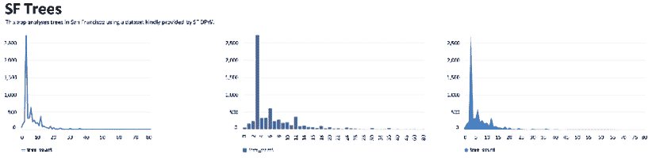

# 第六章：美化 Streamlit 应用程序

欢迎来到本书的*第二部分*！在*第一部分*，*创建基础 Streamlit 应用程序*中，我们专注于基础内容——可视化、部署和数据处理——这些都是入门 Streamlit 时至关重要的主题。在本部分中，目的是通过更复杂的应用程序和用例来探索 Streamlit，旨在将你培养成一个 Streamlit 专家。

在本章中，我们将使用元素（包括侧边栏、标签、列和颜色）来扩展我们美化 Streamlit 应用程序的能力。同时，我们将探索如何创建多页面应用程序来管理用户流动，创造一个更清晰、更结构化的用户体验。

在本章结束时，你应该会更加自信地创建比普通**最小可行产品**（**MVP**）更好的应用程序。我们将从学习列（columns）开始，然后继续讨论本章中的其他元素，并将每个元素融入到主 Streamlit 应用程序中。

具体来说，在本章中，我们将涵盖以下主题：

+   设置**旧金山**（**SF**）树木数据集

+   使用列（columns）

+   使用标签

+   探索页面配置

+   使用 Streamlit 侧边栏

+   使用颜色选择器选择颜色

+   多页面应用程序

+   可编辑的 DataFrame

# 技术要求

本章需要一个免费的 GitHub 账户，可以通过[`www.github.com`](https://www.github.com)获得。关于 GitHub 的完整简介以及详细的设置说明，可以在上一章*第五章*，*在 Streamlit 社区云上部署 Streamlit*中的*GitHub 简要介绍*部分找到。

# 设置 SF Trees 数据集

在本章中，我们将再次使用 SF Trees 数据集，这是我们在*第三章*，*数据可视化*中使用的数据集。和之前的章节一样，我们需要按照以下步骤进行设置：

1.  为章节创建一个新文件夹。

1.  将我们的数据添加到文件夹中。

1.  为我们的应用程序创建一个 Python 文件。

让我们详细了解每一个步骤。

在我们的主`streamlit_apps`文件夹中，在终端运行以下代码，创建一个巧妙命名为`pretty_trees`的新文件夹。你也可以在终端外手动创建一个新文件夹：

```py
mkdir pretty_trees 
```

现在，我们需要将*第三章*，*数据可视化*中的数据移动到本章的文件夹中。以下代码将数据复制到正确的文件夹：

```py
cp trees_app/trees.csv pretty_trees 
```

如果你没有`trees_app`文件夹，并且还没有完成*第三章*，*数据可视化*，你也可以从[`github.com/tylerjrichards/Streamlit-for-Data-Science`](https://github.com/tylerjrichards/Streamlit-for-Data-Science)下载所需的数据，文件夹名称为`trees_app`。

现在我们已经准备好了数据，我们需要创建一个 Python 文件来托管我们的 Streamlit 应用程序代码；以下代码正是完成这一任务：

```py
touch pretty_trees.py 
```

`pretty_trees` 文件将包含我们的 Python 代码，所以打开你喜欢的文本编辑器，接下来我们就可以正式开始学习如何在 Streamlit 中使用列！

## 在 Streamlit 中使用列

在此之前的所有应用中，我们都将每个 Streamlit 任务视为自上而下的体验。我们将文本作为标题输出，收集一些用户输入，然后将我们的可视化内容放在下方。然而，Streamlit 允许我们使用 `st.columns()` 功能将应用格式化为动态列。

我们可以将 Streamlit 应用划分为多个不同长度的列，然后将每个列视为应用中独立的空间（称为容器），以便放置文本、图表、图片或任何其他内容。

在 Streamlit 中，列的语法使用 `with` 语法，这可能你已经熟悉，用于资源管理以及在 Python 中处理文件的打开和写入。理解 Streamlit 列中的 `with` 语法的最简单方式是将它看作是自包含的代码块，这些代码块告诉 Streamlit 我们希望在应用中将元素放置在哪里。让我们看看一个例子，看看它是如何工作的。以下代码导入了我们的 SF Trees 数据集，并在其中创建了三个等长的列，在每个列中写入文本：

```py
import streamlit as st
st.title("SF Trees")
st.write(
    """
    This app analyses trees in San Francisco using
    a dataset kindly provided by SF DPW.
    """
)
col1, col2, col3 = st.columns(3)
with col1:
    st.write("Column 1")
with col2:
    st.write("Column 2")
with col3:
    st.write("Column 3") 
```

上述代码将创建如下截图所示的应用：


图 6.1：前三列

如我们所见，`st.columns()` 定义了三个等长的列，我们可以使用 `with` 语法在每个列中打印一些文本。我们还可以直接在我们预定义的列上调用 `st.write()` 函数（或任何其他将内容写入 Streamlit 应用的函数），以获得相同的结果，如下代码所示。以下代码将产生与前一个代码块完全相同的输出：

```py
import streamlit as st
st.title("SF Trees")
st.write(
    """
    This app analyses trees in San Francisco using
    a dataset kindly provided by SF DPW.
    """
)
col1, col2, col3 = st.columns(3)
col1.write("Column 1")
col2.write("Column 2")
col3.write("Column 3") 
```

当我们编写更复杂的 Streamlit 应用并在每个列中加入更多内容时，`with` 语句有助于使应用更加简洁，易于理解和调试。本书的大部分内容将尽可能使用 `with` 语句。

在 Streamlit 中，列的宽度是相对于其他已定义列的大小的。因此，如果我们将每列的宽度从 `1` 增大到 `10`，我们的应用将不会发生任何变化。此外，我们还可以向 `st.beta_columns()` 传递一个数字，这将返回该数字个相等宽度的列。以下代码块展示了三种列宽选项，所有选项的列宽都相同：

```py
#option 1
col1, col2, col3 = st.columns((1,1,1))
#option 2
col1, col2, col3 = st.columns((10,10,10))
#option 3
col1, col2, col3 = st.columns(3) 
```

作为最后一个示例，以下代码块允许用户输入来决定每个列的宽度。你可以玩一玩生成的应用，更好地理解如何使用列来改变 Streamlit 应用的格式：

```py
import streamlit as st
st.title('SF Trees')
st.write(
    """
    This app analyses trees in San Francisco using
    a dataset kindly provided by SF DPW.
    """
)
first_width = st.number_input('First Width', min_value=1, value=1)
second_width = st.number_input('Second Width', min_value=1, value=1)
third_width = st.number_input('Third Width', min_value=1, value=1)
col1, col2, col3 = st.columns(
      (first_width,second_width,third_width))
with col1:
     st.write('First column')
with col2:
     st.write('Second column')
with col3:
     st.write('Third column') 
```

在 *第三章*，*数据可视化* 中，我们使用以下代码展示了 Streamlit 内置函数 `st.line_chart()`、`st.bar_chart()` 和 `st.area_chart()` 之间的差异：

```py
import streamlit as st
import pandas as pd
st.title('SF Trees')
st.write(
    """
    This app analyses trees in San Francisco using
    a dataset kindly provided by SF DPW.
    """
)
trees_df = pd.read_csv('trees.csv')
df_dbh_grouped = pd.DataFrame(trees_df.groupby(['dbh']).count()['tree_id'])
df_dbh_grouped.columns = ['tree_count']
st.line_chart(df_dbh_grouped)
st.bar_chart(df_dbh_grouped)
st.area_chart(df_dbh_grouped) 
```

上面的代码块创建了以下 Streamlit 应用，三个按宽度分组的 SF 树图表一个接一个地排列（为了简洁起见，这里只显示两个图表）：


图 6.2：SF 线图和柱状图

这次练习的目的是更好地理解 Streamlit 的三个函数，但如果我们需要滚动才能看到所有内容，我们怎么做呢？让我们通过使用三个列将三个图表并排放置来改进这一点。以下代码预定义了三个等宽的列，并将一个图表放入每个列中：

```py
import streamlit as st
import pandas as pd
st.title('SF Trees')
st.write(
    """
    This app analyses trees in San Francisco using
    a dataset kindly provided by SF DPW.
    """
)
trees_df = pd.read_csv('trees.csv')
df_dbh_grouped = pd.DataFrame(trees_df.groupby(['dbh']).count()['tree_id'])
df_dbh_grouped.columns = ['tree_count']
col1, col2, col3 = st.columns(3)
with col1:
     st.line_chart(df_dbh_grouped)
with col2:
     st.bar_chart(df_dbh_grouped)
with col3:
     st.area_chart(df_dbh_grouped) 
```

当我们运行前面的代码时，得到如下所示的奇怪结果：


图 6.3：细长图表

这显然不是我们想要的！每个图表都太窄了。幸运的是，这引出了我们下一个小主题：Streamlit 中的页面配置。

## 探索页面配置

Streamlit 允许我们在每个 Streamlit 应用的顶部配置一些必要的页面特性。到目前为止，我们一直在使用 Streamlit 的默认设置，但在 Streamlit 应用的顶部，我们可以手动配置一切，从浏览器中显示的页面标题（用于打开 Streamlit 应用），到页面布局，再到侧边栏的默认状态（我们将在*使用 Streamlit 侧边栏*部分讲解！）。

Streamlit 应用的默认设置是页面布局居中，因此我们的应用边缘有大量的空白区域。以下代码将我们的 Streamlit 应用设置为宽格式，而不是默认的居中格式：

```py
import streamlit as st
import pandas as pd
st.set_page_config(layout='wide')
st.title('SF Trees')
st.write(
    """
    This app analyses trees in San Francisco using
    a dataset kindly provided by SF DPW.
    """
)
trees_df = pd.read_csv('trees.csv')
df_dbh_grouped = pd.DataFrame(trees_df.groupby(['dbh']).count()['tree_id'])
df_dbh_grouped.columns = ['tree_count']
col1, col2, col3 = st.columns(3)
with col1:
     st.line_chart(df_dbh_grouped)
with col2:
     st.bar_chart(df_dbh_grouped)
with col3:
     st.area_chart(df_dbh_grouped) 
```

当我们运行前面的代码时，现在可以看到三个图表之间有了良好的间隔，我们可以轻松地对比这三个图表。以下截图显示了 Streamlit 应用的宽格式：


图 6.4：宽格式图表

我们还需要了解关于 Streamlit 列的两个信息。第一个是我们可以编辑我们创建的列容器之间的间距，第二个是我们可以确保图表保持在其列内，而不会溢出到其他列。至于间距部分，默认情况下列之间会有一个小间隙，但我们可以将其改为中等或大间隙。以下代码为每三个列之间添加了一个大间隙：

```py
import pandas as pd
import streamlit as st
st.set_page_config(layout="wide")
st.title("SF Trees")
st.write(
    """
    This app analyses trees in San Francisco using
    a dataset kindly provided by SF DPW.
    """
)
trees_df = pd.read_csv("trees.csv")
df_dbh_grouped = pd.DataFrame(trees_df.groupby(["dbh"]).count()["tree_id"])
df_dbh_grouped.columns = ["tree_count"]
col1, col2, col3 = st.columns(3, gap="large")
with col1:
    st.line_chart(df_dbh_grouped)
with col2:
    st.bar_chart(df_dbh_grouped)
with col3:
    st.area_chart(df_dbh_grouped) 
```

现在，如果我们观察图表之间的空隙，我们会注意到有一个间隙！


图 6.5：图表间隙

正如您所注意到的，我们正在使用的 Streamlit 内置图表已经确保了图表保持在列内，并且与列的末端对齐。这是因为每个图表的默认设置是将参数`use_container_width`设置为`True`，那么如果我们将其设置为`False`，会发生什么呢？请看以下代码：

```py
with col1:
    st.line_chart(df_dbh_grouped, 
   use_container_width=False) 
```

如我们在下一张截图中看到的那样，图表不再与列对齐，从而让我们的应用看起来更糟（这也是为什么默认设置为`True`的原因！）：



图 6.6：容器宽度

这就结束了我们对在 Streamlit 中使用列的探索，同时也结束了我们第一次了解页面配置默认设置。我们将在本书的其余部分越来越多地使用这两项技能。我们的下一个主题是介绍 Streamlit 侧边栏。

# 使用 Streamlit 标签页

还有一种组织 Streamlit 应用布局的方式，非常类似于 Streamlit 列，叫做标签页。标签页在内容太宽，无法分割为列的情况下非常有用，即使在宽模式下也是如此；当你希望只显示一个内容时，标签页也很有用。例如，如果我们有三个非常不同的图表，在宽模式下才能显示得很好，但我们又不想将它们垂直堆叠在一起，我们可以使用标签页选择性地显示它们。让我们来探索一下这到底是如何工作的！

`st.tabs` 的功能与 `st.columns` 非常相似，不过我们不再告诉 Streamlit 我们想要多少个标签页，而是传递标签页的名称，然后使用现在熟悉的 `with` 语句将内容放入标签页中。接下来的代码将我们最近的 Streamlit 应用中的列转换为标签页：

```py
import pandas as pd
import streamlit as st

st.set_page_config(layout="wide")
st.title("SF Trees")
st.write(
    """
    This app analyses trees in San Francisco using
    a dataset kindly provided by SF DPW.
    """
)
trees_df = pd.read_csv("trees.csv")
df_dbh_grouped = pd.DataFrame(trees_df.groupby(["dbh"]).count()["tree_id"])
df_dbh_grouped.columns = ["tree_count"]
tab1, tab2, tab3 = st.tabs(["Line Chart", "Bar Chart", "Area Chart"])
with tab1:
    st.line_chart(df_dbh_grouped)
with tab2:
    st.bar_chart(df_dbh_grouped)
with tab3:
    st.area_chart(df_dbh_grouped) 
```

从这里，我们将得到以下应用：


图 6.7：第一个标签页

就是这么简单！标签页没有像列那样的间距参数（因为，嗯，标签页有什么用间距呢？），但除了这一点，我们可以将所有关于列的知识映射到标签页的使用上。现在，接下来是 Streamlit 侧边栏。

# 使用 Streamlit 侧边栏

正如我们在 Streamlit 中已经看到的，当我们开始接收大量用户输入并且开发更长的 Streamlit 应用时，我们常常会失去让用户在同一屏幕上看到输入和输出的能力。在其他情况下，我们可能希望将所有用户输入放在一个单独的区域中，以便清晰地分隔输入和输出。在这两种使用场景下，我们可以使用 Streamlit 侧边栏，它允许我们在 Streamlit 应用的左侧放置一个可最小化的侧边栏，并将任何 Streamlit 组件添加到其中。

首先，我们可以创建一个基本示例，将之前应用中的一个图表提取出来，并根据用户输入对其背后的数据进行过滤。在这种情况下，我们可以要求用户指定树木所有者的类型（例如，私人所有者或公共工程部），并使用 `st.multiselect()` 函数按这些条件进行过滤，该函数允许用户从列表中选择多个选项：

```py
import pandas as pd
import streamlit as st
st.title("SF Trees")
st.write(
    """
    This app analyses trees in San Francisco using
    a dataset kindly provided by SF DPW.
    """
)
trees_df = pd.read_csv("trees.csv")
owners = st.sidebar.multiselect(
    "Tree Owner Filter", 
    trees_df["caretaker"].unique())
if owners:
    trees_df = trees_df[
trees_df["caretaker"].isin(owners)]
df_dbh_grouped = pd.DataFrame(
trees_df.groupby(["dbh"]).count()["tree_id"])
df_dbh_grouped.columns = ["tree_count"]
st.line_chart(df_dbh_grouped) 
```

前面的代码将创建以下的 Streamlit 应用。和之前一样，我们将 `owners` 变量隐藏在 `if` 语句中，因为我们希望在用户尚未从选项中选择时，应用能够使用整个数据集。侧边栏让用户可以轻松查看他们选择的选项以及应用的输出：


图 6.8：第一个侧边栏

这个应用的下一步是添加更多的可视化，从我们在*第三章*，*数据可视化*中创建的树木地图开始，然后将侧边栏与我们在本章学到的列知识相结合。

以下代码将树木地图放置在 SF 的直方图下方，并通过我们的多选框进行过滤：

```py
import pandas as pd
import streamlit as st

st.title("SF Trees")
st.write(
    """
    This app analyses trees in San Francisco using
    a dataset kindly provided by SF DPW. The dataset
    is filtered by the owner of the tree as selected 
    in the sidebar!
    """
)
trees_df = pd.read_csv("trees.csv")
owners = st.sidebar.multiselect(
    "Tree Owner Filter", 
    trees_df["caretaker"].unique())
if owners:
    trees_df = trees_df[
        trees_df["caretaker"].isin(owners)]
df_dbh_grouped = pd.DataFrame(trees_df.groupby(["dbh"]).count()["tree_id"])
df_dbh_grouped.columns = ["tree_count"]
st.line_chart(df_dbh_grouped)

trees_df = trees_df.dropna(subset=['longitude', 'latitude'])
trees_df = trees_df.sample(n = 1000, replace=True) 
st.map(trees_df) 
```

以下截图展示了前面代码中的 Streamlit 应用，线图位于新地图上方，地图显示的是 SF 的树木，已根据树木拥有者进行过滤：


图 6.9：带侧边栏的过滤地图

这个应用的下一步将是通过在地图上方添加另一个图表，将我们学到的关于列的知识与侧边栏相结合。在*第三章*，*数据可视化*中，我们创建了树木年龄的直方图。我们可以使用它作为这个 Streamlit 应用中的第三个图表，借助 Plotly 库：

```py
import pandas as pd
import plotly.express as px
import streamlit as st
st.page_config(layout='wide')
st.title("SF Trees")
st.write(
    """
    This app analyses trees in San Francisco using
    a dataset kindly provided by SF DPW. The dataset
    is filtered by the owner of the tree as selected
    in the sidebar!
    """
)
trees_df = pd.read_csv("trees.csv")
today = pd.to_datetime("today")
trees_df["date"] = pd.to_datetime(trees_df["date"])
trees_df["age"] = (today - trees_df["date"]).dt.days
unique_caretakers = trees_df["caretaker"].unique()
owners = st.sidebar.multiselect(
    "Tree Owner Filter", 
    unique_caretakers)
if owners:
    trees_df = trees_df[trees_df["caretaker"].isin(owners)]
df_dbh_grouped = pd.DataFrame(trees_df.groupby(["dbh"]).count()["tree_id"])
df_dbh_grouped.columns = ["tree_count"] 
```

第一部分：

1.  加载树木数据集。

1.  基于我们数据集中的日期列，添加一个年龄列。

1.  在侧边栏创建一个多选控件。

1.  基于侧边栏的过滤器。

我们的下一步是创建三个图表：

```py
col1, col2 = st.columns(2)
with col1:
    fig = px.histogram(trees_df, x=trees_df["dbh"], title="Tree Width")
    st.plotly_chart(fig)

with col2:
    fig = px.histogram(
        trees_df, x=trees_df["age"], 
        title="Tree Age")
    st.plotly_chart(fig)

st.write("Trees by Location")
trees_df = trees_df.dropna(
    subset=["longitude", "latitude"])
trees_df = trees_df.sample(
    n=1000, replace=True)
st.map(trees_df) 
```

正如我们在*第三章*，*数据可视化*中已经讨论过的那样，Streamlit 内置的函数，如`st.map()`和`st.line_chart()`，对于快速可视化非常有用，但缺乏一些配置选项，比如合适的标题或轴重命名。我们可以通过 Plotly 做得更多！下图显示了我们的 Streamlit 应用，预设了一些树木拥有者过滤器：


图 6.10：三个过滤后的图表

本章接下来的功能是如何通过颜色选择器将颜色输入添加到 Streamlit 应用中！

# 使用颜色选择器选择颜色

颜色作为用户输入在应用中非常难以处理。如果用户想要红色，他们是想要浅红色还是深红色？是栗色还是偏粉红的红色？Streamlit 解决这个问题的方法是`st.color_picker()`，它允许用户选择一种颜色作为输入，并以十六进制字符串的形式返回该颜色（这是一个独特的字符串，用于定义大多数图表库用于输入的非常特定的颜色阴影）。以下代码将此颜色选择器添加到我们之前的应用中，并根据用户选择的颜色更改 Seaborn 图表的颜色：

```py
import pandas as pd
import plotly.express as px
import streamlit as st
st.set_page_config(layout="wide")
st.title("SF Trees")
st.write(
    """
    This app analyses trees in San Francisco using
    a dataset kindly provided by SF DPW. The dataset
    is filtered by the owner of the tree as selected
    in the sidebar!
    """
)
trees_df = pd.read_csv("trees.csv")
today = pd.to_datetime("today")
trees_df["date"] = pd.to_datetime(trees_df["date"])
trees_df["age"] = (today - trees_df["date"]).dt.days
unique_caretakers = trees_df["caretaker"].unique()
owners = st.sidebar.multiselect("Tree Owner Filter", unique_caretakers)
graph_color = st.sidebar.color_picker("Graph Colors")
if owners:
    trees_df = trees_df[trees_df["caretaker"].isin(owners)] 
```

与我们之前的应用相比，变化在于添加了`graph_color`变量，它是`st.color_picker()`函数的结果。我们为这个颜色选择器添加了名称，并将其放在侧边栏中，位于拥有者的多选控件下方。现在，我们从用户那里获取了颜色输入，就可以使用它来更改图表中的颜色，如以下代码所示：

```py
col1, col2 = st.columns(2)
with col1:
    fig = px.histogram(
        trees_df,
        x=trees_df["dbh"],
        title="Tree Width",
        color_discrete_sequence=[graph_color],
    )
    fig.update_xaxes(title_text="Width")
    st.plotly_chart(fig, use_container_width=True)

with col2:
    fig = px.histogram(
        trees_df,
        x=trees_df["age"],
        title="Tree Age",
        color_discrete_sequence=[graph_color],
    )
    st.plotly_chart(fig, use_container_width=True)
st.write('Trees by Location')
trees_df = trees_df.dropna(subset=['longitude', 'latitude'])
trees_df = trees_df.sample(n = 1000, replace=True)
st.map(trees_df) 
```

当你运行这个 Streamlit 应用时，你可以看到颜色选择器是如何工作的（这本书是黑白印刷的，所以在纸质版中不可见）。它有一个默认颜色（在我们的案例中是黑色），你可以通过选择该组件然后点击你选择的颜色来更改它。以下截图展示了点击时的组件和我们 SF Trees 应用中的结果：


图 6.11：颜色选择器

现在我们已经知道如何更改 Streamlit 中可视化的颜色，让我们进入本章的最后一部分：创建多页应用。

# 多页应用

到目前为止，我们的 Streamlit 应用都是单页应用，在这些应用中，所有或几乎所有的信息都能通过简单滚动看到。然而，Streamlit 也有多页功能。多页应用是一个强大的工具，可以用来创建不仅限于一页内容的应用，并扩展 Streamlit 带来的用户体验。例如，Streamlit 数据团队目前主要构建多页应用，为每个项目或团队创建一个新的应用。

对于我们的第一个多页应用，我们将专注于将树木应用中的地图部分与其他图表分开，创建两个独立的应用。Streamlit 创建多页应用的方式是，它会在与我们的 Streamlit 应用相同的目录中查找一个名为 `pages` 的文件夹，然后将 `pages` 文件夹中的每个 Python 文件作为独立的 Streamlit 应用运行。为此，在 `pretty_trees` 文件夹中创建一个名为 `pages` 的新文件夹，然后在 `pages` 文件夹中创建一个名为 `map.py` 的文件。在你的终端中，从仓库的基础文件夹运行以下命令：

```py
mkdir pages
touch pages/map.py 
```

现在，当我们运行 Streamlit 应用时，我们应该在侧边栏看到 **地图** 应用作为独立应用：


图 6.12：我们的第一个多页应用

当我们点击左上角的**地图**时，它将完全为空白。现在，我们需要将地图代码移到 `map.py` 文件中！在 `map.py` 文件中，我们可以包含以下代码（这只是从我们原始应用中复制粘贴过来的）：

```py
import pandas as pd
import streamlit as st
st.title("SF Trees Map")
trees_df = pd.read_csv("trees.csv")
trees_df = trees_df.dropna(subset=["longitude", "latitude"])
trees_df = trees_df.sample(n=1000, replace=True)
st.map(trees_df) 
```

当我们点击**地图**应用时，它不再是空白的，而应该像这样：


图 6.13：地图 MPA

我们需要为这个应用做的最后一件事是将地图代码从主文件中移除。现在我们主文件的代码应该大大减少，应该看起来像这样。以下是代码片段：

```py
col1, col2 = st.columns(2)
with col1:
    fig = px.histogram(
        trees_df,
        x=trees_df["dbh"],
        title="Tree Width",
        color_discrete_sequence=[graph_color],
    )
    fig.update_xaxes(title_text="Width")
    st.plotly_chart(fig, use_container_width=True)

with col2:
    fig = px.histogram(
        trees_df,
        x=trees_df["age"],
        title="Tree Age",
        color_discrete_sequence=[graph_color],
    )
    st.plotly_chart(fig, use_container_width=True) 
```

如果我们想添加一个新应用，我们只需在 `pages` 文件夹中添加另一个文件，Streamlit 会处理其余的部分。

如你所见，多页面应用可以非常强大。随着我们的应用变得越来越复杂，用户体验也变得更加复杂，我们可以依赖多页面应用来提升用户体验的清晰度。通过这些，你可以轻松想象创建一个大型的多页面应用，为不同的业务用户（如市场团队、销售团队等）提供单独的应用，甚至只是一个优雅的方式来拆分你更大的应用。如果你想创建一个新的应用，只需在 `pages` 文件夹中添加一个新的 Python 文件，新应用就会出现在侧边栏！

Streamlit 数据科学团队的一员（Zachary Blackwood，[`github.com/blackary`](https://github.com/blackary)）创建了一个名为 `st-pages` 的 Python 库，该库为多页面应用提供了一系列新特性，如为页面链接添加表情符号或为文件创建分区。这个库还很年轻，但如果你有兴趣创建比本章中更大的应用，它是一个非常好的附加资源。Streamlit 拥有一个庞大且充满活力的社区，像这样的库只是我们初次接触开源 Streamlit 的一个开始：


图 6.14：st-pages

这就是多页面应用的内容！现在我们来讨论可编辑的 DataFrame。

# 可编辑的 DataFrame

到目前为止，在本书中，我们假设希望在这些应用中使用的数据是静态的。我们大多使用的是 CSV 文件或由程序生成的数据集，这些数据集在用户使用应用时不会发生变化。

这种情况非常常见，但我们可能希望让用户能够以非常用户友好的方式更改或编辑底层数据。为了解决这个问题，Streamlit 发布了 `st.experimental_data_editor`，它允许用户在 `st.dataframe-style` 界面上进行编辑。

有大量潜在的应用可以编辑 DataFrame，从使用 Streamlit 作为质量控制系统，到直接编辑配置参数，再到做更多类似于本书中“假设分析”的操作。作为一个在工作环境中创建许多不同应用的人，我注意到人们通常对随时可见的电子表格非常熟悉，并且更喜欢这种类型的用户界面。

在这个示例中，我们将在 `pages` 文件夹中创建一个名为 `data_quality.py` 的新应用，并尝试使用新的可编辑 DataFrame 功能。假设我们是 SF 的数据部门的一员，私有树木中的缺失数据正在给我们带来一些问题。我们希望让几个人来查看我们的数据并编辑他们认为有问题的内容，然后我们还希望将这些数据写回到我们的可靠数据源——CSV 文件中。

首先，我们可以通过在新文件的顶部写一条简短的信息，像之前一样过滤数据，并将 DataFrame 显示给用户，代码如下：

```py
import pandas as pd
import streamlit as st
st.title("SF Trees Data Quality App")
st.write(
    """This app is a data quality tool for the SF trees dataset. Edit the data and save to a new file!"""
)
trees_df = pd.read_csv("trees.csv")
trees_df = trees_df.dropna(subset=["longitude", "latitude"])
trees_df_filtered = trees_df[trees_df["legal_status"] == "Private"]
st.dataframe(trees_df) 
```

为了使数据可编辑，我们只需将`st.dataframe`更改为`st.experimental_data_editor`，然后将结果返回到一个新的数据框：

```py
import pandas as pd
import streamlit as st
st.title("SF Trees Data Quality App")
st.write(
    """This app is a data quality tool for the SF trees dataset. Edit the data and save to a new file!"""
)
trees_df = pd.read_csv("trees.csv")
trees_df = trees_df.dropna(subset=["longitude", "latitude"])
trees_df_filtered = trees_df[trees_df["legal_status"] == "Private"]
edited_df = st.experimental_data_editor(trees_df_filtered) 
```

运行这个应用时，界面如下所示。我点击了一个单元格并编辑它，以显示这个功能是有效的！


图 6.15：st-experimental_data_editor

数据编辑器会返回整个数据框，因此我们的最后一步是编辑原始的、未经过滤的数据框，然后覆盖 CSV 文件。我们希望确保用户确认他们的修改，因此我们可以添加一个按钮，将结果写回原始的 CSV 文件：

```py
import pandas as pd
import streamlit as st
st.title("SF Trees Data Quality App")
st.write(
    """This app is a data quality tool for the SF trees dataset. Edit the data and save to a new file!"""
)
trees_df = pd.read_csv("trees.csv")
trees_df = trees_df.dropna(subset=["longitude", "latitude"])
trees_df_filtered = trees_df[trees_df["legal_status"] == "Private"]
edited_df = st.experimental_data_editor(trees_df_filtered) 
trees_df.loc[edited_df.index] = edited_df
if st.button("Save data and overwrite:"):
    trees_df.to_csv("trees.csv", index=False)
    st.write("Saved!") 
```

现在，这个应用的界面如下所示。我们可以注意到，这个数据集中的许多行缺少绘图大小的测量数据！


图 6.16：SF 树木数据质量应用中缺失的绘图大小测量

我们可以添加它们，然后点击保存数据按钮进行覆盖。也许我们还注意到第一行存在数据质量问题，其中的 x 字母是大写的（与其余部分不同！）。我们来编辑一下：


图 6.17：编辑 SF 树木数据质量应用

现在，如果我们重新加载应用或将数据托管在 Streamlit Community Cloud 上，其他人访问应用时，所有数据都会被修正。

截至本书编写时，数据编辑器是一个非常新的功能（它是在 Streamlit 1.19 版本中发布的，而本书使用的是 Streamlit 1.20 版本）。我相信在你阅读这本书时，基于数据编辑器和数据框（DataFrame）会有更多酷炫的新功能！请查看文档([`docs.streamlit.io/`](https://docs.streamlit.io/))以获取更多数据编辑器的相关知识。现在，让我们进入总结部分！

# 总结

这段历程结束了，我们探索了 SF 树木数据集，并了解了使 Streamlit 应用更具美感的各种方式。我们涵盖了如何将应用拆分成列和页面配置，如何在侧边栏收集用户输入，如何通过`st.color_picker()`功能获取用户输入的特定颜色，最后学习了如何使用 Streamlit 的多页面应用和新的数据编辑器。

在下一章中，我们将通过了解如何下载和使用用户构建的 Streamlit 组件，来学习关于 Streamlit 的开源社区。

# 在 Discord 上了解更多

要加入本书的 Discord 社区——在这里你可以分享反馈、向作者提问并了解新版本——请扫描下面的二维码：

[`packt.link/sl`](https://packt.link/sl)


