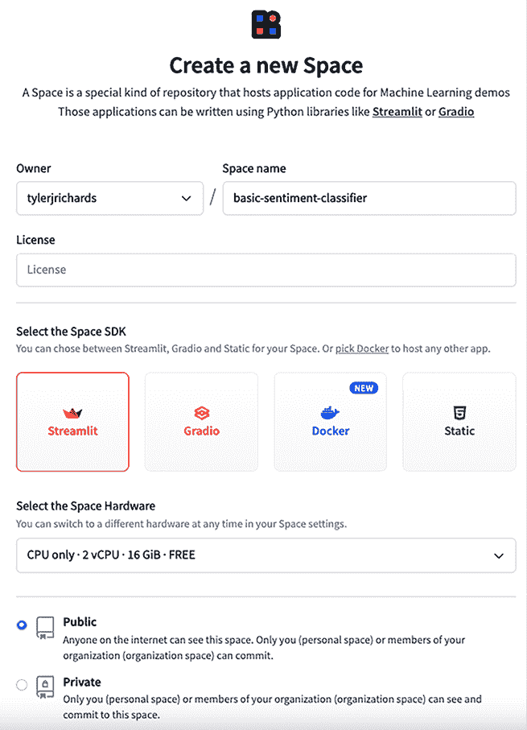
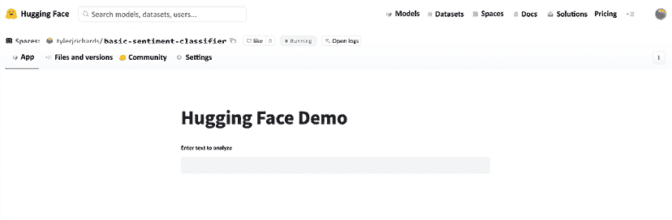
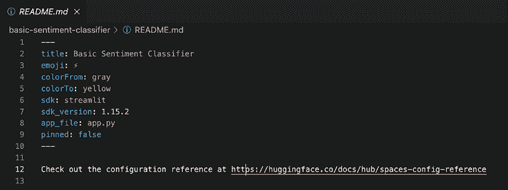
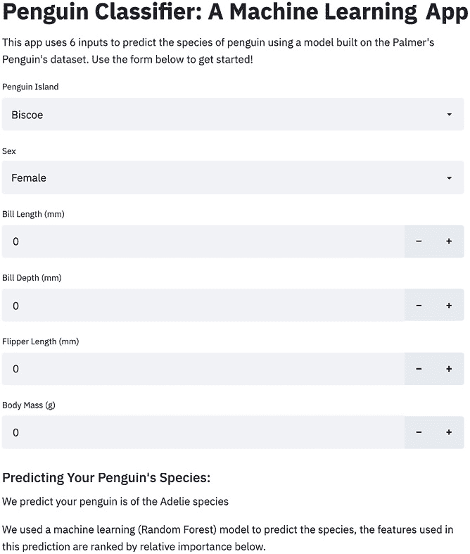

# 第八章：使用 Hugging Face 和 Heroku 部署 Streamlit 应用

在*第五章*，*通过 Streamlit Community Cloud 部署 Streamlit*中，我们学习了如何通过 Streamlit Community Cloud 部署我们的 Streamlit 应用。Streamlit Community Cloud 对大多数应用来说快速、简单且非常有效。然而，它并没有无限制的免费计算资源，每个部署的应用程序限制为 1GB 内存。如果我们想要一个使用更多资源的应用程序，那就没有这个选项了。

这让我考虑到另一个需要考虑的方面——Streamlit 与 Snowflake 的集成。付费的 Streamlit 版本现在已经包含在 Snowflake 生态系统中。尽管这看起来像是一种限制，但请注意，Snowflake 因其庞大的受欢迎程度而值得信赖。如果您的公司已经在使用 Snowflake，这可能对你来说是一个巨大的优势。然而，如果你尚未使用 Snowflake，本章还为你提供了其他几个优秀的选项，以部署资源密集型或有安全限制的应用程序。

当 Streamlit 首次发布时，以及本书在 2021 年秋季首次发布时，可用的部署选项非常有限。通常，最佳选择是租用 Amazon Web Services 或 Azure 的服务器空间并自行设置所有配置。幸运的是，随着该库的巨大成功，部署选项已经有了很大的改进。本章将重点介绍三个主要部分：

+   在 Streamlit Community Cloud、Hugging Face 和 Heroku 之间进行选择

+   在 Hugging Face 上部署 Streamlit 应用

+   在 Heroku 上部署 Streamlit 应用

# 技术要求

以下是本章所需安装的软件：

+   **Heroku 账户**：Heroku 是一个受欢迎的平台，数据科学家和软件工程师使用它来托管他们的应用、模型和**应用编程接口（API）**，它归 Salesforce 所有。要获取 Heroku 账户，请前往 [`signup.heroku.com`](https://signup.heroku.com) 创建免费账户。

+   **Heroku 命令行界面**（**CLI**）：要有效使用 Heroku，我们需要下载 Heroku CLI，它将允许我们运行 Heroku 命令。要下载该工具，请按照这里列出的说明进行操作：[`devcenter.heroku.com/articles/heroku-cli`](https://devcenter.heroku.com/articles/heroku-cli)。

+   **Hugging Face 账户**：Hugging Face 是一个以机器学习为重点的优秀平台，我们在*第四章*，*通过 Streamlit 进行机器学习和 AI*中使用过它；要创建账户，请访问 [`huggingface.co/join`](https://huggingface.co/join)。

现在我们已经有了需求，让我们开始吧！

# 在 Streamlit Community Cloud、Hugging Face 和 Heroku 之间进行选择

从高层次来看， whenever 我们尝试部署我们的 Streamlit 应用程序，让互联网用户能够看到我们的应用时，实际上我们是在租用一个由他人拥有的计算机，并给这台计算机一组指令来启动我们的应用。选择使用哪个平台，若没有系统部署背景或者没有先尝试过每个选项，往往很难确定，但有一些启发式方法应该能帮助你做出决定。

决定选择哪个平台的两个最重要因素是系统的灵活性和启动所需的时间。需要注意的是，这两个因素通常是相互权衡的。如果你使用的是 Streamlit Community Cloud，你无法指定“我想让这个在 30 GiB 内存的 GPU 上运行”，但你可以得到一个极其简单的流程，只需将 Streamlit Community Cloud 指向你的 GitHub 仓库，它会处理掉所有其他需要做的小决策。另一方面，Hugging Face 和 Heroku 通过付费选项提供更多灵活性，但设置起来需要更多时间（正如你将会发现的！）。

简而言之，如果你已经在使用某个平台（如 Snowflake、Hugging Face 或 Heroku），你应该继续使用你正在使用的平台。如果你还没有使用这些平台，或者是一个业余程序员，Streamlit Community Cloud 是最好的选择。

如果你需要更多的计算资源，并且正在从事机器学习或自然语言处理工作，你应该使用 Hugging Face。如果你需要更多计算资源，并且希望拥有一个更通用的平台，具有广泛的集成选项，Heroku 是一个很好的选择。

让我们开始使用 Hugging Face 吧！

# 在 Hugging Face 上部署 Streamlit

Hugging Face 提供了一整套专注于机器学习的产品，特别受到机器学习工程师和自然语言处理领域专家的青睐。它通过其 transformers 库（我们已经使用过了！）使开发者能够轻松使用预训练模型，还可以创建产品让开发者托管自己的模型、数据集，甚至通过名为 Hugging Face Spaces 的产品托管他们自己的数据应用。你可以将 Space 看作是一个在 Hugging Face 基础设施上部署应用的地方，而且开始使用非常简单。

对于本章内容，我们将部署在 *第四章* 中创建的同一个 Hugging Face 应用。我们可以在 Hugging Face 上部署任何一个 Streamlit 应用，但我觉得部署这个会更合适！

首先，我们需要访问 [`huggingface.co/spaces`](https://huggingface.co/spaces)，然后点击“**Create new Space**”按钮。


图 8.1：Hugging Face 登录

登录后，我们将看到一些选项。我们可以为我们的 Space 命名，选择一个许可证，选择我们想要的 Space 类型（Gradio 是 Hugging Face 另一个受欢迎的数据应用选择），选择 Space 硬件（注意付费和免费选项），并将 Space 设置为公开或私有。下面的截图展示了我选择的选项（你可以根据需要为 Space 命名，但其余的应该保持一致）。



图 8.2：Hugging Face 选项

现在，你应该点击页面底部的 **Create Space** 按钮。一旦创建了 Space，你需要使用以下 Git 命令在个人计算机上克隆该 Space，我在这本书所在的主 Streamlit for Data Science GitHub 仓库中进行了克隆：

```py
git clone https://huggingface.co/spaces/{your username}/{your_huggingface_space_name} 
```

现在你的仓库已经被克隆，我们需要为我们的 Streamlit 应用创建一个文件，并创建另一个 `requirements.txt` 文件，使用以下命令告诉 Hugging Face Spaces 我们需要哪些库来运行我们的应用：

```py
cd {your_huggingface_space_name}
touch app.py 
touch requirements.txt 
```

在 `app.py` 文件中，我们可以直接复制并粘贴我们已经创建的应用；代码如下所示：

```py
import streamlit as st
from transformers import pipeline
st.title("Hugging Face Demo")
text = st.text_input("Enter text to analyze")
st.cache_resource
def get_model():
    return pipeline("sentiment-analysis")
model = get_model()
if text:
    result = model(text)
    st.write("Sentiment:", result[0]["label"])
    st.write("Confidence:", result[0]["score"]) 
```

对于我们的 `requirements.txt` 文件，我们只需使用三个库，可以像这样将它们添加到文件中：

```py
streamlit
transformers
torch 
```

现在我们已经把文件放到正确的状态，只需使用 Git 添加、提交并推送更改：

```py
git add .
git commit –m 'added req, streamlit app'
git push 
```

当我们从命令行推送更改时，系统会要求我们输入 Hugging Face 的用户名和密码，然后如果我们回到 **Hugging Face** 标签页，我们的应用就会被托管！



图 8.3：Hugging Face 部署的应用

如果我们回到代码中并查看 `README.md` 文件，我们会注意到有很多有用的配置选项，比如更改表情符号或标题。Hugging Face 还允许我们指定其他参数，比如 Python 版本。完整的文档可以在你的 `README.md` 中的链接中找到：



图 8.4：Hugging Face 部署的应用代码

这就是在 Hugging Face 上部署 Streamlit 应用的全部内容！

你可能已经注意到在 Hugging Face Spaces 上部署的一些缺点，包括比 Streamlit Community Cloud 多一些步骤，并且 Hugging Face 占用了应用程序的很多显示空间。可以理解的是，Hugging Face 希望确保每个看到你应用的人都知道它是使用他们的产品创建的。他们将大量自己的品牌和产品放在你部署的应用程序顶部，这无疑会对应用的观看体验产生负面影响。对于已经在使用 Hugging Face 的其他人来说，这种品牌展示可能是一个很大的优势，因为他们可以克隆你的 Space，查看流行的 Spaces 和模型，但对于将应用发送给非 ML 同事甚至朋友来说，这种品牌展示则是 Spaces 的一个缺点。

Hugging Face Spaces 的另一个主要缺点是，它们支持的 Streamlit 版本通常稍微滞后。截至本书写作时，他们正在使用 Streamlit 版本 1.10.0，而最新的 Streamlit 版本是 1.16.0。如果你希望使用最新的 Streamlit 特性，Hugging Face Spaces 可能无法支持！不过，对于大多数 Streamlit 应用来说，这通常不会造成太大问题，但在选择平台时，还是需要考虑这一因素。

希望你已经清楚使用 Hugging Face Spaces 的明显优势和轻微劣势。现在让我们转向 Heroku！

# 使用 Heroku 部署 Streamlit

Heroku 是由 Salesforce 所拥有的一个平台即服务（PaaS），它作为一个通用的计算平台优化，可以用于从网站到 API 到 Streamlit 应用等各种用途。因此，与 Streamlit Community Cloud 或 Hugging Face Spaces 相比，Heroku 提供了更多选择，但上手难度更高。

请注意，Heroku 没有免费套餐，所以如果你不想跟着操作（或者你已经对 Streamlit Community Cloud 或 Hugging Face Spaces 感到满意），可以直接跳到下一章！之所以在本书中提到 Heroku，是因为我希望提供一个具有更高容量、支持最新版本 Streamlit 且没有太多品牌标识，并且易于使用的选项。Heroku 在这些标准下表现最好，因此我将在下面详细介绍！

为了将我们的 Streamlit 应用部署到 Heroku，我们需要执行以下操作：

1.  设置并登录到 Heroku。

1.  克隆并配置我们的本地仓库。

1.  部署到 Heroku。

让我们详细看看这些步骤！

## 设置并登录到 Heroku

在本章的 *技术要求* 部分，我们介绍了如何下载 Heroku 并创建账户。现在，我们需要通过命令行登录 Heroku，运行以下命令并根据提示进行登录：

```py
heroku login 
```

这将带我们到 Heroku 页面，登录后我们就可以开始了。该命令会让你在机器上保持登录状态，直到你更改密码或主动退出 Heroku。

## 克隆并配置我们的本地仓库

接下来，我们需要切换到存放企鹅机器学习应用程序的目录。我的应用程序文件夹在我的 `Documents` 文件夹内，所以以下命令将我带到该目录，但你的文件夹路径可能不同：

```py
cd ~/Documents/penguin_ml 
```

如果你还没有下载本地仓库，并且没有对应的 GitHub 仓库，可以前往 *第五章*，*使用 Streamlit Community Cloud 部署 Streamlit*，了解如何开始使用 GitHub。你也可以运行以下命令，从我的个人 GitHub 仓库将代码下载到本地：

```py
git clone https://github.com/tylerjrichards/penguin_ml.git 
```

强烈建议你使用自己的 GitHub 仓库进行实践，因为这比从我这里克隆应用程序来部署到 Heroku 更具实践意义。

现在，我们需要使用以下命令创建一个 Heroku 应用，并为我们的应用选择一个独特的名称（该应用将以此名称加上 `.heroku.com` 后缀进行部署）。我的应用名是 `penguin-machine-learning`，但你可以选择自己的名称！

```py
heroku create penguin-machine-learning 
```

一旦完成此操作，我们需要明确地将我们的 Git 仓库与刚刚创建的 Heroku 应用连接起来，可以通过以下命令完成：

```py
heroku git:remote -a penguin-machine-learning 
```

最后，我们将向我们的代码库中添加两个文件，这两个文件是启动 Heroku 所必需的，即 `Procfile` 文件和 `streamlit_setup.sh` 文件。Heroku 使用名为 `Procfile` 的文件来声明应用在启动时应该执行的命令，并告知 Heroku 这是什么类型的应用。对于我们的 Heroku 应用，我们还需要这个 `Procfile` 来配置一些特定于 Streamlit 应用的设置（比如端口配置），并且还要运行 `streamlit run` 命令来启动我们的应用。让我们从以下命令开始创建 `streamlit_setup.sh` 文件：

```py
touch streamlit_setup.sh 
```

我们可以使用文本编辑器打开这个文件，并将以下内容添加进去，这样就会在基础目录中创建我们熟悉的`config.toml`文件：

```py
mkdir -p ~/.streamlit
echo "[server]
headless = true
port = $PORT
enableCORS = false
" > ~/.streamlit/config.toml 
```

一旦保存了这个文件，我们需要创建一个 `Procfile`，该文件会运行 `streamlit_setup.sh` 文件，并且还会运行我们的 Streamlit 应用：

```py
touch Procfile 
```

在我们刚创建的 `Procfile` 文件中，接下来需要添加以下内容：

```py
web: sh streamlit_setup.sh && streamlit run penguins_streamlit.py 
```

现在我们已经设置好了我们的 Streamlit 应用，最后一步就是将它部署到 Heroku！

## 部署到 Heroku

在我们部署之前，应用中有几个新文件，我们需要使用以下命令将它们添加到 Git 仓库中：

```py
git add .
git commit -m 'added heroku files'
git push 
```

现在，我们本章的最后一步是将代码推送到 Heroku，接下来可以通过以下命令来完成：

```py
git push heroku main 
```

这将启动 Heroku 构建，过一会儿，我们将看到我们的 Penguin 应用成功部署到 Heroku，任何人都可以访问查看。我们刚刚部署并正在进行开发的应用可以通过以下链接访问（附带截图！），[`penguin-machine-learning.herokuapp.com/`](https://penguin-machine-learning.herokuapp.com/)，GitHub 仓库可以通过 [`github.com/tylerjrichards/penguin_ml`](https://github.com/tylerjrichards/penguin_ml) 访问。你可以在以下截图中看到该应用：



图 8.5：Heroku 应用部署

如你所见，Heroku 的部署比 Hugging Face Spaces 或 Streamlit Community Cloud 更复杂，但它允许你为应用添加更多计算资源而不带有 Heroku 品牌。而且，Heroku 始终支持最新的 Streamlit 特性，而 Hugging Face Spaces 不一定会及时更新。

Heroku 的一个大缺点（除了增加的复杂性）是，从 2022 年 11 月 28 日起，Heroku 不再提供免费层，而 Streamlit Community Cloud 和 Hugging Face Spaces 都提供免费层。如果你想要使用这些功能，就必须为它们付费！

这就涵盖了如何通过 Heroku 部署 Streamlit！如你所见，Streamlit Community Cloud 开箱即用，处理了大部分这些困难，因此，我建议在可能的情况下尽量使用 Streamlit Community Cloud。然而，本节内容应该让你意识到，当我们使用 Hugging Face Spaces 和 Heroku 时，面前有多种选项和配置控制，这在未来可能会派上用场。

# 总结

到目前为止，这一章是最具技术性的，恭喜你成功完成！部署应用程序通常是非常困难且耗时的，需要软件工程和 DevOps 技能，还通常需要掌握版本控制软件（如 Git）和 UNIX 风格的命令及系统。这也是为什么 Streamlit Community Cloud 是如此关键的创新之一，而在本章中，我们学习了通过租用自己的虚拟机并在 Hugging Face Spaces 和 Heroku 上部署应用来推动 Streamlit 部署的极限。我们还学会了在开始之前确定正确的部署策略，这将节省数小时或数天的工作（没有什么比完成应用部署后发现需要使用其他平台更糟糕的事情了！）。

接下来，我们将学习如何在我们的 Streamlit 应用中从数据库查询数据。

# 在 Discord 上了解更多

加入本书的 Discord 社区——在这里你可以分享反馈、向作者提问，并了解新版本的发布——请扫描下方二维码：

[`packt.link/sl`](https://packt.link/sl)


