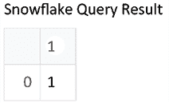
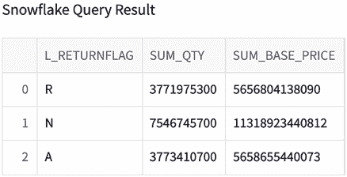
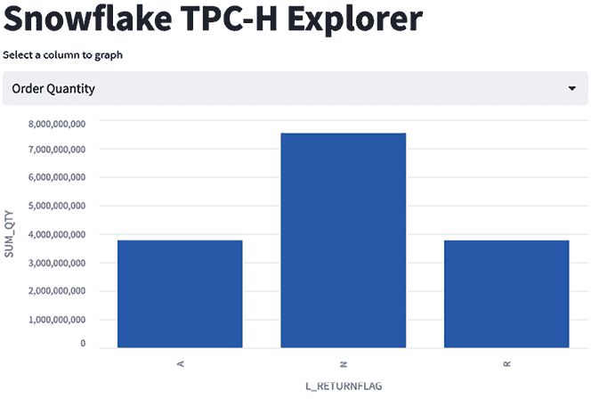
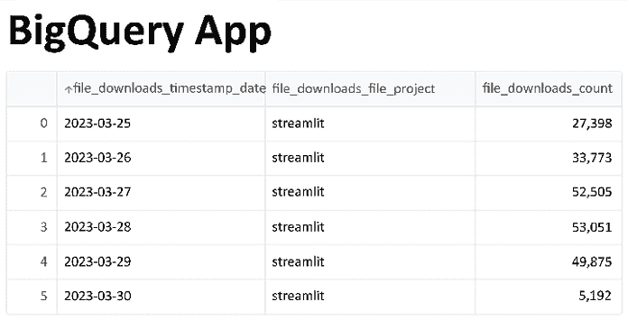
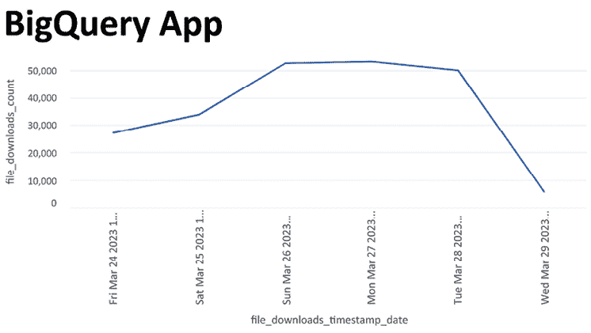
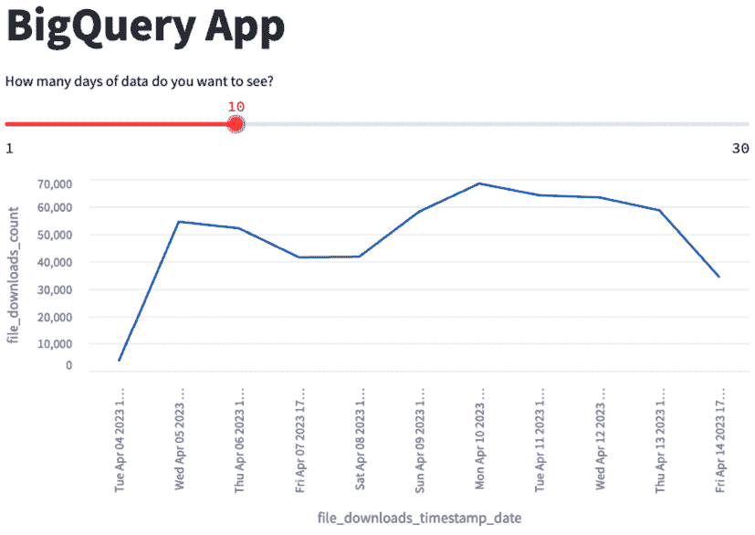

# 第九章：连接到数据库

在前几章中，我们完全专注于存储在单个文件中的数据，但大多数真实世界的基于工作的应用程序集中在存储在数据库中的数据上。公司倾向于将其数据存储在云中，因此能够对这些数据进行分析是一项关键技能。在本章中，我们将探讨如何访问和使用存储在流行数据库（如 Snowflake 和 BigQuery）中的数据。对于每个数据库，我们将连接到数据库，编写 SQL 查询，然后创建一个示例应用程序。

无论您是希望对大型数据集执行即席分析，还是构建数据驱动的应用程序，高效地从数据库中检索和操作数据的能力都是必不可少的。通过本章结束时，您将对如何使用 Streamlit 连接到数据库并与之交互有深入理解，从而使您能够自信地提取见解并做出数据驱动的决策。

在本章中，我们将涵盖以下主题：

+   使用 Streamlit 连接到 Snowflake

+   使用 Streamlit 连接到 BigQuery

+   添加用户输入到查询中

+   组织查询

# 技术要求

以下是本章所需的软件和硬件安装列表：

+   **Snowflake 账户**：要获得 Snowflake 账户，请访问（[`signup.snowflake.com/`](https://signup.snowflake.com/)），并开始免费试用。

+   **Snowflake Python 连接器**：Snowflake Python 连接器允许您从 Python 运行查询。如果您已安装了本书的要求，则已经拥有该库。如果没有，请运行`pip install snowflake-connector-python`开始安装。

+   **BigQuery 账户**：要获取 BigQuery 账户，请访问（[`console.cloud.google.com/bigquery`](https://console.cloud.google.com/bigquery)），并开始免费试用。

+   **BigQuery Python 连接器**：BigQuery 也有一个 Python 连接器，其工作方式与 Snowflake Python 连接器相同！它也包含在您在本书开始时安装的要求文件中，但如果您尚未安装该库，您也可以运行`pip install google-cloud-bigquery`来安装。

现在我们已经准备好了一切，让我们开始吧！

# 使用 Streamlit 连接到 Snowflake

要在 Streamlit 中连接到任何数据库，我们主要需要考虑如何在 Python 中连接到该服务，然后添加一些特定于 Streamlit 的功能（如缓存！）来提高用户体验。幸运的是，Snowflake 花费了大量时间使从 Python 连接到 Snowflake 变得非常简单；您只需指定您的账户信息，Snowflake Python 连接器会完成其余操作。

在本章中，我们将创建并在一个名为`database_examples`的新文件夹中工作，并添加一个名为`streamlit_app.py`的文件，以及一个 Streamlit `secrets`文件来开始：

```py
mkdir database_examples
cd database_examples
touch streamlit_app.py
mkdir .streamlit
touch .streamlit/secrets.toml 
```

在 `secrets.toml` 文件中，我们需要添加用户名、密码、账户和仓库信息。我们的用户名和密码是在注册 Snowflake 账户时添加的，仓库是 Snowflake 用来执行查询的虚拟计算机（默认的仓库叫做 `COMPUTE_WH`），而账户标识符是最后一个需要填写的！要查找你的账户标识符，最简单的办法是通过这个链接查看最新信息（[`docs.snowflake.com/en/user-guide/admin-account-identifier`](https://docs.snowflake.com/en/user-guide/admin-account-identifier)）。现在我们有了所有需要的信息，可以将它们添加到我们的 secrets 文件中！我们的文件应该如下所示，内容是你的信息而不是我的。

现在我们从上面的 SQL 查询结果中获取了账户信息，我们有了所有需要的信息，可以将它们添加到 `secrets` 文件中！我们的文件应该如下所示，内容是你的信息而不是我的：

```py
[snowflake]
user = "streamlitfordatascience"
password = "my_password"
account = "gfa95012"
warehouse = "COMPUTE_WH" 
```

现在我们可以开始创建我们的 Streamlit 应用了。我们的第一步是创建 Snowflake 连接，运行一个基本的 SQL 查询，然后将结果输出到 Streamlit 应用中：

```py
import snowflake.connector
import streamlit as st
session = snowflake.connector.connect(
    **st.secrets["snowflake"], client_session_keep_alive=True
)

sql_query = "select 1"
st.write("Snowflake Query Result")
df = session.cursor().execute(sql_query).fetch_pandas_all()
st.write(df) 
```

这段代码做了几件事：首先，它使用 Snowflake Python 连接器，通过 `secrets` 文件中的秘密信息编程连接到我们的 Snowflake 账户，然后它运行 SQL 查询，仅返回 `1`，最后它将在我们的应用中显示该输出。

现在我们的应用应该如下所示：



图 9.1：Snowflake 查询结果

每次运行这个应用时，它都会重新连接到 Snowflake。这不是一个理想的用户体验，因为它会使应用变得更慢。过去我们会通过将其包装在函数中并使用 `st.cache_data` 来缓存，但在这里这样做不起作用，因为连接不是数据。相反，我们应该使用 `st.cache_resource` 来缓存它，类似于我们在本书前面处理 HuggingFace 模型的方式。我们的会话初始化代码现在应该像这样：

```py
@st.cache_resource
def initialize_snowflake_connection():
    session = snowflake.connector.connect(
        **st.secrets["snowflake"], client_session_keep_alive=True
    )
    return session

session = initialize_snowflake_connection()
sql_query = "select 1" 
personal project or for your company! A sample query for us to use looks like this:
```

```py
sql_query = """
    SELECT
    l_returnflag,
    sum(l_quantity) as sum_qty,
    sum(l_extendedprice) as sum_base_price
    FROM
    snowflake_sample_data.tpch_sf1.lineitem
    WHERE
    l_shipdate <= dateadd(day, -90, to_date('1998-12-01'))
    GROUP BY 1
""" 
```

现在，我们的应用应该是这样的：



图 9.2：SQL GROUPBY

现在，我们还想缓存数据结果，以加快应用速度并降低成本。这是我们之前做过的事情；我们可以将查询调用包装在一个函数中，并使用 `st.cache_data` 来缓存它！它应该像这样：

```py
@st.cache_data
def run_query(session, sql_query):
    df = session.cursor().execute(sql_query).fetch_pandas_all()
    return df
df = run_query(session, sql_query) 
```

我们为这个应用的最后一步是稍微打扮一下外观。现在它比较基础，因此我们可以添加一个图表、一个标题，并且让用户选择用于作图的列。另外，我们还会确保结果是 `float` 类型（大致是非整数的数字），这是一个好的通用实践：

```py
df = run_query(session, sql_query)

st.title("Snowflake TPC-H Explorer")
col_to_graph = st.selectbox(
    "Select a column to graph", ["Order Quantity", "Base Price"]
)
df["SUM_QTY"] = df["SUM_QTY"].astype(float)
df["SUM_BASE_PRICE"] = df["SUM_BASE_PRICE"].astype(float)

if col_to_graph == "Order Quantity":
    st.bar_chart(data=df, 
                 x="L_RETURNFLAG", 
                 y="SUM_QTY")
else:
    st.bar_chart(data=df,
                 x="L_RETURNFLAG", 
                 y="SUM_BASE_PRICE") 
```

现在我们的应用程序是互动式的，并且显示了一个很棒的图表！它将如下所示：



图 9.3：TCP-H 最终应用

以上就是我们关于使用 Streamlit 连接 Snowflake 的章节内容！目前，Snowflake 有一些预览版产品可以让你直接在 Snowflake 内创建 Streamlit 应用。如果你想使用这些产品，可以联系你的 Snowflake 管理员，他们应该能帮你获取访问权限！

现在，开始使用 BigQuery！

# 使用 Streamlit 连接 BigQuery

将 BigQuery 连接到 Streamlit 应用的第一步是获取从 BigQuery 所需的认证信息。Google 提供了一份非常棒的快速入门文档，你应该按照文档操作，文档链接如下：[`cloud.google.com/bigquery/docs/quickstarts/quickstart-client-libraries`](https://cloud.google.com/bigquery/docs/quickstarts/quickstart-client-libraries)。这个链接将帮助你注册免费账户，并创建一个项目。创建项目后，你需要创建一个服务账号（[`console.cloud.google.com/apis/credentials`](https://console.cloud.google.com/apis/credentials)），并将凭证下载为 JSON 文件。一旦你获得了这个文件，你就拥有了所有需要的数据，可以回到本章继续操作。

在这一部分中，我们将在 `database_example` 文件夹内创建一个新的文件，命名为 `bigquery_app.py`，并且我们将向已创建的 `secrets.toml` 文件中添加一个新部分。首先，我们可以编辑 `secrets.toml` 文件，最后，你可以通过这个链接创建和查看你的服务账号凭证（[`console.cloud.google.com/apis/credentials`](https://console.cloud.google.com/apis/credentials)）。请将你的服务账号凭证粘贴到 `secrets.toml` 文件的新部分，格式如下：

```py
[bigquery_service_account]
type = "service_account"
project_id = "xxx"
private_key_id = "xxx"
private_key = "xxx"
client_email = "xxx"
client_id = "xxx"
auth_uri = "https://accounts.google.com/o/oauth2/auth"
token_uri = "https://oauth2.googleapis.com/token"
auth_provider_x509_cert_url = "https://www.googleapis.com/oauth2/v1/certs"
client_x509_cert_url = "xxx" 
```

现在我们需要创建并打开一个新的应用文件，命名为 `bigquery_app.py`，并从那里连接到 BigQuery：

```py
import streamlit as st
from google.oauth2 import service_account 
from google.cloud import bigquery 

credentials = service_account.Credentials.from_service_account_info( 
    st.secrets["bigquery_service_account"] 
) 
client = bigquery.Client(credentials=credentials) 
```

现在，当我们想要运行查询时，可以使用我们通过认证创建的客户端变量来执行它！为了展示一个例子，Google 慷慨地提供了一个免费数据集，记录了人们下载 Python 库的频率。我们可以编写一个查询，计算我们应用中过去 5 天的 Streamlit 下载量，查询代码如下：

```py
import streamlit as st
from google.cloud import bigquery
from google.oauth2 import service_account

credentials = service_account.Credentials.from_service_account_info(
    st.secrets["bigquery_service_account"]
)
client = bigquery.Client(credentials=credentials)

st.title("BigQuery App")
my_first_query = """
    SELECT
    CAST(file_downloads.timestamp  AS DATE) AS file_downloads_timestamp_date,
    file_downloads.file.project AS file_downloads_file__project,
    COUNT(*) AS file_downloads_count
    FROM 'bigquery-public-data.pypi.file_downloads'
    	    AS file_downloads
    WHERE (file_downloads.file.project = 'streamlit')
AND (file_downloads.timestamp >= timestamp_add(current_timestamp(), INTERVAL -(5) DAY))
    GROUP BY 1,2
    """

downloads_df = client.query(my_first_query).to_dataframe()
st.write(downloads_df) 
```

当我们运行这个应用时，得到的结果如下：



图 9.4：BigQuery 查询结果

在这种情况下，我大约在 3 月 29 日的太平洋标准时间 8 点运行了查询，这意味着世界某些地方已经进入了 3 月 30 日，并开始下载库。这就是 30 日下载量大幅下降的原因！接下来，作为改进，我们可以通过 `st.line_chart()` 来绘制下载量随时间变化的图表，就像我们在本书中做过的几次一样：



图 9.5：BigQuery 图表

如你所见，运行这些查询需要一些时间。这是因为我们既没有缓存结果，也没有缓存连接。让我们向应用中添加一些功能来实现这个目的：

```py
from google.oauth2 import service_account 
@st.cache_resource 
def get_bigquery_client(): 
credentials = service_account.Credentials.from_service_account_info(st.secrets["bigquery_service_account"])
return bigquery.Client(credentials=credentials) 
client = get_bigquery_client() 
@st.cache_data  
def get_dataframe_from_sql(query):  
df = client.query(query).to_dataframe() 
    return df 
```

我们应用的底部将使用我们刚刚创建的 `get_dataframe_from_sql`：

```py
Downloads_df = get_dataframe_from_sql(my_first_query)
st.line_chart(downloads_df,
x="file_downloads_timestamp_date",
y="file_downloads_count) 
```

就是这样！现在你知道如何从 BigQuery 获取数据并缓存结果以及认证过程了。随着你开始在工作环境中使用 Streamlit，这将非常有用，因为数据很少完全存储在`.csv`文件中，而是存在于云数据库中。接下来的部分将介绍更多的策略，以便在 Streamlit 中处理查询和数据库。

## 向查询添加用户输入

使用 Streamlit 的一个主要好处是使用户交互变得极为简单，我们希望在编写连接数据库的应用程序时启用这一功能。到目前为止，我们编写了将查询转换为 DataFrame 的代码，并且在这些 DataFrame 上，我们可以添加典型的 Streamlit 小部件来进一步过滤、分组和绘制数据。然而，这种方法仅适用于相对较小的数据集，通常我们必须更改底层查询，以便在应用程序中获得更好的性能。让我们通过一个例子来证明这一点。

让我们回到`bigquery_app.py`中的 Streamlit 应用程序。我们为应用程序设置了一个相对任意的回溯期，在查询中仅提取了过去 5 天的数据。如果我们想让用户定义回溯期怎么办？如果我们坚持不改变查询，而是在查询执行后进行过滤，那么我们就不得不从`bigquery-public-data.pypi.file_downloads`表中提取所有数据，这将非常慢并且花费大量的金钱。相反，我们可以通过以下方法添加一个滑块来更改底层查询：

```py
st.title("BigQuery App")
days_lookback = st.slider('How many days of data do you want to see?', min_value=1, max_value=30, value=5)
my_first_query = f"""
    SELECT
    CAST(file_downloads.timestamp  AS DATE) AS file_downloads_timestamp_date,
    file_downloads.file.project AS file_downloads_file__project,
    COUNT(*) AS file_downloads_count
    FROM 'bigquery-public-data.pypi.file_downloads'
    AS file_downloads
    WHERE (file_downloads.file.project = 'streamlit')
        AND (file_downloads.timestamp >=
        timestamp_add(current_timestamp(), 
INTERVAL -({days_lookback}) DAY))
    GROUP BY 1,2
    """ 
```

在这种情况下，我们添加了一个滑块，设定了适当的最小值和最大值，并将滑块的结果输入到查询中。每当滑块移动时，查询都会重新执行，但这比提取整个数据集要高效得多。现在我们的应用程序应该是这样的：



图 9.6：动态 SQL

我们也可以通过同样的方法，轻松地在 Snowflake 查询中添加动态 SQL，但这展示了在 BigQuery 中使用它的一个很好的例子。

这里有一点警告，**绝对不要**将文本输入用作数据库查询的输入。如果你允许用户输入自由格式的文本并将其放入查询中，你实际上就赋予了用户与你一样的数据库访问权限。你可以使用 Streamlit 的其他小部件，而不必担心同样的后果，因为像`st.slider`这样的部件的输出是有保证的，它始终返回数字而非恶意查询。

现在我们已经学习了如何将用户输入添加到查询中，我们可以进入最后一部分，组织 Streamlit 应用程序中的查询。

## 组织查询

随着你创建越来越多依赖数据库查询的 Streamlit 应用，你的应用往往会变得非常长，并且会包含作为字符串存储的长查询。这会使应用变得更难阅读，并且在与他人协作时也会更加难以理解。对于 Streamlit 数据团队来说，常常会有半打 30 行的查询来支撑一个我们创建的 Streamlit 应用！有两种策略可以改善这种设置：

+   使用像 `dbt` 这样的工具创建下游表格

+   将查询存储在独立的文件中

我们将简要地只介绍其中的第一个，创建下游表格。如我们在上一个例子中所注意到的，每当用户更改滑块时，查询都会在应用中重新运行。这可能会变得相当低效！我们可以使用像 dbt 这样的工具，它是一个非常流行的工具，可以让我们安排 SQL 查询，来创建一个较小的表格，这个表格已经把较大的表格筛选到只包含 `bigquery-public-data.pypi.file_downloads` 中最后 30 天的 Streamlit 数据。这样，我们的查询行数会减少，也不会让应用变得拥挤，同时也更加经济高效！我们在 Streamlit 数据团队中非常常用这个技巧，我们经常在 dbt 中创建较小的下游表格来支持我们的 Streamlit 应用。

第二个选项是将我们的查询存储在完全独立的文件中，然后将它们导入到我们的应用中。为此，在与我们的 Streamlit 应用相同的目录中创建一个名为 `queries.py` 的新文件。在这个文件中，我们需要创建一个函数，返回我们已经创建的 `pypi` 数据查询，函数的输入是我们应用所需的日期筛选。它应该是这样的：

```py
def get_streamlit_pypi_data(day_filter):
    streamlit_pypy_query = f"""
    SELECT
    CAST(file_downloads.timestamp  AS DATE) 
        AS file_downloads_timestamp_date,
    file_downloads.file.project AS
   file_downloads_file__project,
    COUNT(*) AS file_downloads_count
    FROM 'bigquery-public-data.pypi.file_downloads'
    AS file_downloads
    WHERE (file_downloads.file.project = 'streamlit')
        AND (file_downloads.timestamp >=
        timestamp_add(current_timestamp(), 
        INTERVAL -({day_filter}) DAY))
    GROUP BY 1,2
    """
    return streamlit_pypy_query 
```

现在，在我们的 Streamlit 应用文件中，我们可以从文件中导入这个函数，并像这样使用它（为了简便，我省略了两个缓存函数）：

```py
import streamlit as st
from google.cloud import bigquery
from google.oauth2 import service_account
from queries import get_streamlit_pypi_data
...
st.title("BigQuery App")
days_lookback = st.slider('How many days of data do you want to see?', min_value=1, max_value=30, value=5)
pypi_query = get_streamlit_pypi_data(days_lookback)

downloads_df = get_dataframe_from_sql(pypi_query)
st.line_chart(downloads_df, x="file_downloads_timestamp_date", y="file_downloads_count") 
```

完美！现在我们的应用变得更小了，Streamlit 部分与查询部分在应用中逻辑分离。我们在 Streamlit 数据团队中始终使用这样的策略，并且我们向开发生产环境中 Streamlit 应用的人推荐这样的策略。

# 总结

本章结束了*第九章*，*连接数据库*。在本章中，我们学习了很多内容，从在 Streamlit 中连接 Snowflake 和 BigQuery 数据，到如何缓存我们的查询和数据库连接，帮助我们节省成本并改善用户体验。在下一章中，我们将重点讨论如何在 Streamlit 中优化工作应用程序。

# 在 Discord 上了解更多

要加入这本书的 Discord 社区——你可以在这里分享反馈、向作者提问，并了解新版本的发布——请扫描下面的二维码：

[`packt.link/sl`](https://packt.link/sl)


