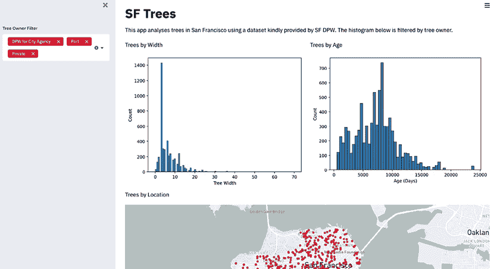
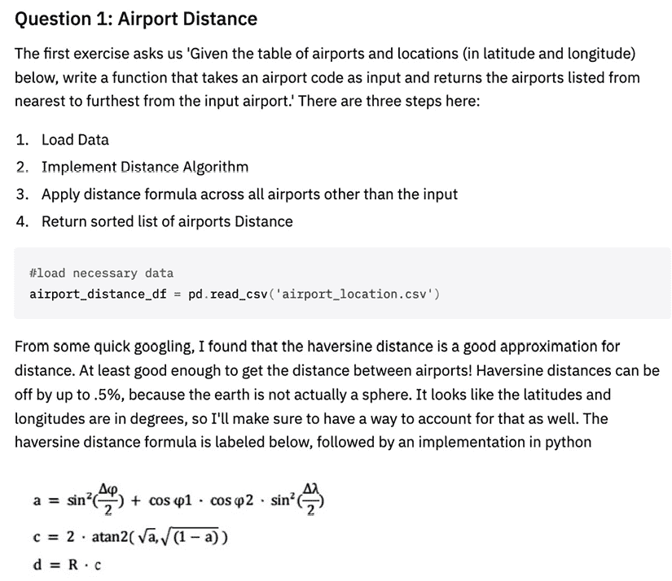
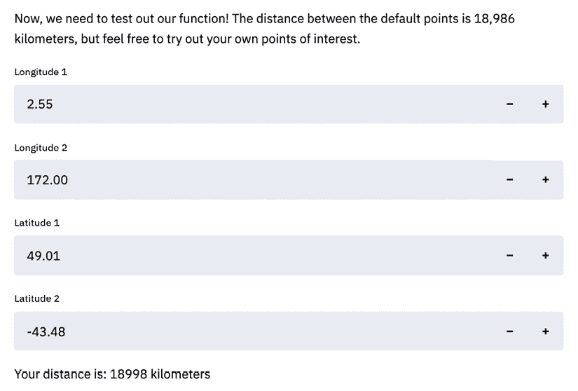
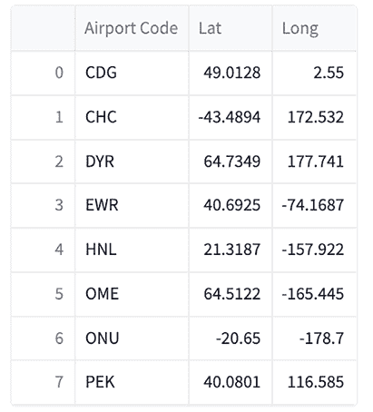
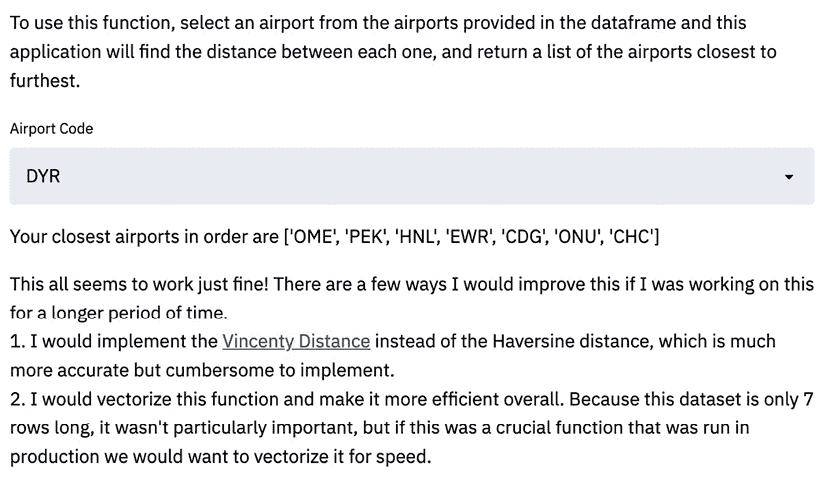
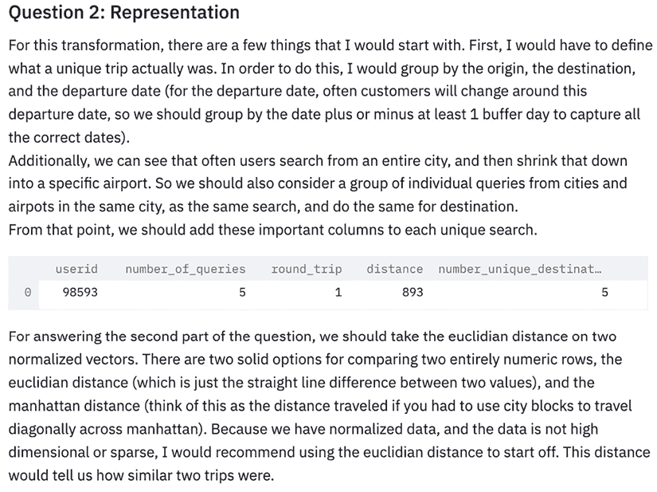
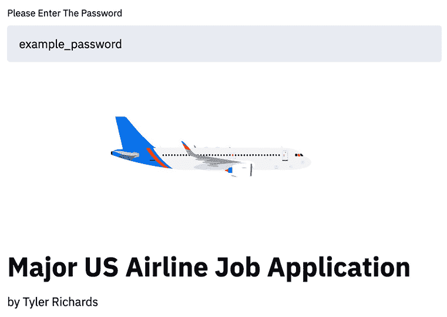

# 第十章：使用 Streamlit 改进求职申请

到本书这一章时，您应该已经是一个经验丰富的 Streamlit 用户。您已经对一切有了充分的掌握——从 Streamlit 设计到部署，再到数据可视化，以及其中的所有内容。本章重点关注应用，它将向您展示一些 Streamlit 应用的优秀用例，激发您创造自己的应用！我们将从演示如何使用 Streamlit 进行**技能证明数据项目**开始。然后，我们将讨论如何在求职申请的**自述部分**使用 Streamlit。

在本章中，我们将涵盖以下主题：

+   使用 Streamlit 进行技能证明数据项目

+   在 Streamlit 中改进求职申请

# 技术要求

以下是本章所需的软件和硬件安装列表：

+   `streamlit-lottie`：我们已经在组件章节中安装了这个库，但如果您还没有安装，现在是个好时机！要下载这个库，请在终端中运行以下代码：

    ```py
    pip install streamlit-lottie 
    ```

    有趣的是，`streamlit-lottie` 使用了 `lottie` 开源库，允许我们将 Web 原生动画（例如 GIF）添加到我们的 Streamlit 应用程序中。坦率地说，这是一个极好的库，您可以用它来美化 Streamlit 应用程序，它是由富有创造力的 Streamlit 应用程序开发者 Fanilo Andrianasolo 创建的。

+   求职申请示例文件夹：本书的中央仓库可以在 [`github.com/tylerjrichards/Streamlit-for-Data-Science`](https://github.com/tylerjrichards/Streamlit-for-Data-Science) 找到。在这个仓库中，`job_application_example` 文件夹将包含您在本章第二部分关于求职申请所需的一些文件。如果您还没有下载这个主仓库，请在终端中运行以下代码以克隆它：

    ```py
    https://github.com/tylerjrichards/Streamlit-for-Data-Science 
    ```

现在我们已经完成了所有的设置，开始吧！

# 使用 Streamlit 进行技能证明数据项目

向他人证明自己是一个熟练的数据科学家是出了名的困难。任何人都可以在简历上写上 Python 或机器学习，甚至可以在一个可能涉及一些机器学习的大学研究小组工作。但通常，招聘人员、你想合作的教授以及数据科学经理们依赖于简历中的一些替代品来衡量你的能力，例如是否毕业于“名校”，或者是否已经有了一个体面的数据科学实习或工作。

在 Streamlit 出现之前，并没有很多有效的方法可以快速且轻松地展示你的作品。如果你将一个 Python 文件或 Jupyter notebook 放在你的 GitHub 个人资料上，那么让别人理解这项工作是否令人印象深刻的时间就变得太长，风险太大。如果招聘者必须点击你 GitHub 个人资料中的正确仓库，然后再点击多个文件，直到他们找到一个没有注释的、无法读取的 Jupyter notebook 代码，你就已经失去了他们。如果招聘者在你的简历上看到“机器学习”，但需要点击五次才能看到你编写的任何机器学习产品或代码，你也已经失去了他们。大多数感兴趣的人员在简历上的停留时间非常短；例如，访问我个人作品集网站的访客（[www.tylerjrichards.com](http://www.tylerjrichards.com)）平均在该站点停留约 2 分钟后就会离开。如果这个人是招聘者，我需要确保他们能快速理解我是谁，以及为什么我可能是一个合适的候选人！

解决这个问题的一种方法是尝试创建并分享 Streamlit 应用，这些应用专门展示你最想展示的技能。例如，如果你在基础统计学方面有很多经验，你可以创建一个 Streamlit 应用，证明或阐明一个基础统计定理，例如中心极限定理——就像我们在本书中早些时候所做的那样。

如果你有自然语言处理方面的经验，你可以创建一个展示你所开发的文本生成神经网络的应用。这里的重点是尽量减少用户需要点击的次数，直到他们能够看到你在某一领域的能力。

我们已经创建的许多 Streamlit 应用程序确实达到了这个目的。让我们看几个例子。

## 机器学习 - Penguins 应用

在*第四章*，*使用 Streamlit 进行机器学习与人工智能*中，我们创建了一个随机森林模型，该模型在我们的 Palmer Penguins 数据集上进行训练，根据诸如体重、栖息岛屿和喙长等特征预测企鹅的物种。然后，我们保存了该模型，以便在我们的 Streamlit 应用中使用。

在开始创建 Streamlit 应用之前，我们需要（在第一次迭代中）运行以下代码，这将创建部署的模型：

```py
import pandas as pd
from sklearn.metrics import accuracy_score
from sklearn.ensemble import RandomForestClassifier
from sklearn.model_selection import train_test_split
import pickle
penguin_df = pd.read_csv('penguins.csv')
penguin_df.dropna(inplace=True)
output = penguin_df['species']
features = penguin_df[['island', 'bill_length_mm', 'bill_depth_mm',
                       'flipper_length_mm', 'body_mass_g', 'sex']]
features = pd.get_dummies(features)
output, uniques = pd.factorize(output)
x_train, x_test, y_train, y_test = train_test_split(
    features, output, test_size=.8)
rfc = RandomForestClassifier(random_state=15)
rfc.fit(x_train, y_train)
y_pred = rfc.predict(x_test)
score = accuracy_score(y_pred, y_test)
print('Our accuracy score for this model is {}'.format(score)) 
```

在这一部分，我们导入库，加载数据，并训练/评估我们的模型，同时打印出评估结果。然后，我们使用以下代码将模型结果保存为`pickle`文件：

```py
rf_pickle = open('random_forest_penguin.pickle', 'wb')
pickle.dump(rfc, rf_pickle)
rf_pickle.close()
output_pickle = open('output_penguin.pickle', 'wb')
pickle.dump(uniques, output_pickle)
output_pickle.close() 
```

回想一下，在本章结束时，我们增加了一个新功能，以便如果用户上传自己的数据集，他们可以使用我们的模型训练脚本在他们的数据上完全训练一个模型（前提是数据格式相同；这带有一些先决条件）。

这个应用的最终形式展示了我们至少对数据清洗有所了解，知道如何对变量进行独热编码，如何评估模型在测试数据上的表现，最后，如何将我们训练好的模型部署到应用中。单单这一点，相较于在简历上仅仅写上“机器学习”，它看起来要好得多，并且能证明我们具备一些实际技能。如果没有这一技能的证明，招聘人员或招聘经理在查看我们的申请时，要么只能完全信任我们简历上的内容（而从多年阅读数百份简历的经验来看，这是一个很差的假设），要么只能依赖如大学学位这样的替代指标（这也是一个评估能力的糟糕替代标准）。

除此之外，当我们将这个应用部署到 Streamlit Community Cloud 并使用公共 GitHub 仓库（即像我们在*第五章*，*通过 Streamlit Community Cloud 部署 Streamlit* 中所做的那样），我们将自动获得一个免费的功能，那就是 GitHub 仓库按钮。如以下截图所示，当我们将应用部署到 Streamlit Community Cloud 时，应用右上方会添加一个按钮，允许用户查看背后的源代码。如果你是该应用的所有者，你还会看到一个**分享**按钮，可以让你与他人分享应用！


图 10.1：查看应用源选项

通过这种方式，用户可以随时检查，确保没有恶意代码（例如，研究人员的企鹅数据是否被应用存储）被 Streamlit Community Cloud 部署。作为一个附加功能，用户还可以查看你为构建应用所写的代码，这提高了我们将 Streamlit 作为**技能证明**工具的能力。

## 可视化 – 美丽的树应用

在*第六章*，*美化 Streamlit 应用*中，我们曾经开发了一个 Streamlit 应用，它能够创建关于旧金山树木的美丽动态可视化，最终产生了以下这个应用：



图 10.2：映射一个网页应用

在这个应用中，我们需要创建多个不同的可视化（即两个直方图和一张地图），这些可视化会根据右侧的用户输入动态更新。通过这样的应用，我们展示了数据处理能力，熟悉 `pandas`、`matplotlib` 和 `seaborn` 库的能力，甚至证明了我们理解如何在 Python 中处理日期时间。让我们来看看专注于可视化的应用代码部分：

```py
#define multiple columns, add two graphs
col1, col2 = st.columns(2)
with col1:
     st.write('Trees by Width')
     fig_1, ax_1 = plt.subplots()
     ax_1 = sns.histplot(trees_df['dbh'],
          color=graph_color)
     plt.xlabel('Tree Width')
     st.pyplot(fig_1)
with col2:
     st.write('Trees by Age')
     fig_2, ax_2 = plt.subplots()
     ax_2 = sns.histplot(trees_df['age'],
          color=graph_color)
     plt.xlabel('Age (Days)')
     st.pyplot(fig_2)
st.write('Trees by Location')
trees_df = trees_df.dropna(subset=['longitude', 'latitude'])
trees_df = trees_df.sample(n = 1000, replace=True)
st.map(trees_df) 
```

这段代码对于任何熟悉 Python 或其他脚本语言的人来说都相当容易阅读，而且它比简单地在简历上写“数据可视化”或“pandas”要好得多。

到目前为止，我希望你已经信服了。Streamlit 应用是向招聘人员、潜在的招聘经理或任何需要证明你技能的人展示你工作的绝佳方式。在接下来的部分，我们将更详细地介绍这个过程，并演示如何使用 Streamlit 增强你向心仪公司提交的申请。

# 在 Streamlit 中改进职位申请

数据科学和机器学习职位申请通常依赖于带回家的数据科学挑战来评估候选人。坦率地说，这是一个残酷且令人烦恼的过程，因为在申请人与雇主之间存在动态关系。例如，候选人可能需要花费 5 到 10 个小时来完成一个数据科学挑战，但雇主可能只需要 10 分钟就能评估完成情况。此外，个人的虚拟或电话面试可能需要雇主 30 到 45 分钟的时间，再加上额外的 15 分钟来写反馈，而候选人同样需要花费 30 到 45 分钟。因为获得 5 到 10 小时的工作为雇主提供了每分钟非常高的员工时间信号，雇主倾向于在职位申请中加入这些挑战。

你可以利用这个机会通过创建一个完全功能的应用来脱颖而出，而不是发送公司一个 Jupyter 笔记本、Word 文档或 PowerPoint 演示文稿。

## 问题

让我们通过一个虚构的例子来讲解一个正在申请美国主要航空公司职位的求职者。他们被给出了两个主要问题来解决——其中一个包含数据集：

+   问题 1：机场距离

    第一个练习问道：“*鉴于包含的机场和位置数据集（纬度和经度），编写一个函数，该函数接受一个机场代码作为输入，并返回从输入机场最近到最远的机场列表。*”

+   问题 2：表示法

    第二个问题问道：“*你会如何将一组搜索转换为表示一次旅行的数值向量？假设我们有数十万用户，我们希望以这种方式表示他们的所有旅行。理想情况下，我们希望这是一个通用表示，可以在多个不同的建模项目中使用，但我们显然关心的是找到相似的旅行。你具体会如何比较两次旅行，看它们有多相似？你认为前述数据中缺少什么信息会帮助改进你的表示方式？*”

既然我们已经有了所需的问题，我们就可以启动一个新的 Streamlit 应用。为此，我按照每一章到目前为止我们使用的相同流程操作。我们在我们的中央文件夹（`streamlit_apps`）中创建一个新的文件夹，命名为`job_application_example`。

在这个文件夹中，我们可以创建一个 Python 文件，命名为`job_streamlit.py`，并在终端中使用以下命令：

```py
touch job_streamlit.py 
```

## 回答问题 1

对您来说，理解如何解答当前问题（计算机场距离）并不至关重要，但创建 Streamlit 应用程序的整体框架非常重要。我们创建的 Streamlit 应用程序应该像一份极具动态性的文档，以独特的方式回答问题，取决于 Streamlit 能够创建一个无法轻易通过 Word 文档复制的应用程序。

首先，我们可以创建一个标题来介绍我们自己，并启动整个应用程序的格式。这里有一个改进，可以使用我们在*第七章*《探索 Streamlit 组件》中学习到的`streamlit-lottie`库，在应用程序的顶部添加一个可选动画，如以下代码所示：

```py
import streamlit as st
from streamlit_lottie import st_lottie
import pandas as pd
import requests
def load_lottieurl(url: str):
    r = requests.get(url)
    if r.status_code != 200:
        return None
    return r.json()
lottie_airplane = load_lottieurl('https://assets4.lottiefiles.com/packages/lf20_jhu1lqdz.json')
st_lottie(lottie_airplane, speed=1, height=200, key="initial")
st.title('Major US Airline Job Application')
st.write('by Tyler Richards')
st.subheader('Question 1: Airport Distance') 
```

上述代码将创建一个包含美丽飞机动画的应用程序，如以下截图所示：


图 10.3：飞机动画

接下来，我们需要将问题复制并粘贴到子标题下方。Streamlit 提供了许多将文本插入应用程序的选项。我们还没有使用的一个选项是将文本包裹在三个撇号符号内，这告诉 Streamlit 使用 Markdown 语言来写入这些文本。对于大段的文本，这是非常有用的，比如下面的这个，它开始回答第一个问题：

```py
"""
The first exercise asks us 'Given the table of airports and
locations (in latitude and longitude) below,
write a function that takes an airport code as input and
returns the airports listed from nearest to furthest from
the input airport.' There are three steps here:
1\. Load the data
2\. Implement a distance algorithm
3\. Apply the distance formula across all airports other than the input
4\. Return a sorted list of the airports' distances
""" 
```

如本章的*技术要求*部分所述，完成此应用程序需要两个文件。第一个是机场位置的数据集（名为`airport_location.csv`），第二个是展示哈弗辛距离的图片（即球面上两点之间的距离；该文件恰当地命名为`haversine.png`）。请将这些文件复制到与 Streamlit 应用程序 Python 文件相同的文件夹中。

现在，我们需要完成第一步：加载数据。我们既需要在 Streamlit 中完成此步骤，还需要将代码展示给用户。这与其他 Streamlit 应用程序不同，后者通常将代码隐藏在后台。然而，因为用户肯定希望看到我们的代码，毕竟他们会基于此进行评估，我们需要同时完成这两个任务。我们可以使用之前使用过的`st.echo()`函数，将代码块打印到我们的应用程序中。我们可以使用以下代码来实现：

```py
airport_distance_df = pd.read_csv('airport_location.csv')
with st.echo():
     #load necessary data
     airport_distance_df = pd.read_csv('airport_location.csv') 
```

在这里，我想指出，我们在此代码的顶部添加了一个注释。这不是为了注解代码以便您理解，而是为了应用程序的读者。偶尔在代码块前后加上关于代码目的的注释是一种好习惯，这样读者就能理解我们所采用的方法。这在求职申请中尤为重要，但对于协作开发的 Streamlit 应用程序同样也是一种好做法。

下一步是解释 Haversine 公式，并在我们的 Streamlit 应用中展示该图片，这在以下代码块中已完成。你完全可以用叙述性的方式编写文本块。只需想象自己是招聘经理，想看到什么样的内容，然后尽量模拟出来：

```py
"""
From some quick googling, I found that the Haversine distance is
a good approximation for distance. At least good enough to get the
distance between airports! Haversine distances can be off by up to .5%
because the Earth is not actually a sphere. It looks like the latitudes
and longitudes are in degrees, so I'll make sure to have a way to account
for that as well. The Haversine distance formula is labeled below,
followed by an implementation in Python
"""
st.image('haversine.png') 
```

现在，我们的应用应该类似于以下截图：



图 10.4：加载问题 1 的数据

我们已经列出了要处理的项目，包括动画、Haversine 距离公式，以及读取数据的基础代码。此时，我们需要在 Python 中实现 Haversine 距离公式，并展示我们的实现：

```py
with st.echo():
    from math import atan2, cos, radians, sin, sqrt
    def haversine_distance(long1, lat1, 
  long2, lat2,    degrees=False):
        # degrees vs radians
        if degrees == True:
            long1 = radians(long1)
            lat1 = radians(lat1)
            long2 = radians(long2)
            lat2 = radians(lat2)
        # implementing haversine
        a = (
            sin((lat2 - lat1) / 2) ** 2
            + cos(lat1) * cos(lat2) * sin((long2 - long1) / 2) ** 2
        )
        c = 2 * atan2(sqrt(a), sqrt(1 - a))
        distance = 6371 * c  # radius of earth in kilometers
        return distance 
```

我们代码的第一部分并没有创建函数，而是打印出我们将在 Streamlit 应用中创建的函数。这样做是为了让应用的读者能够查看我们编写的两段重要代码并与代码本身进行互动。如果我们只是创建了一个实现 Haversine 距离的函数，应用的读者就无法真正了解我们是如何解决当前问题的！以下代码块创建了这个函数：

```py
#execute haversine function definition
from math import radians, sin, cos, atan2, sqrt
def haversine_distance(long1, lat1, 
                       long2, lat2, 
                       degrees=False):
    # degrees vs radians
    if degrees == True:
        long1 = radians(long1)
        lat1 = radians(lat1)
        long2 = radians(long2)
        lat2 = radians(lat2)

    # implementing haversine
    a = (
        sin((lat2 - lat1) / 2) ** 2
        + cos(lat1) * cos(lat2) * sin((long2 - long1) / 2) ** 2
    )
    c = 2 * atan2(sqrt(a), sqrt(1 - a))
    distance = 6371 * c  
# radius of earth in kilometers
    return distance 
```

我们已经完成了 Haversine 实现！每当我们想要计算两地之间的距离时，只需调用我们的公式，输入经度和纬度，即可得到以公里为单位的距离。这个应用很有用，但目前它与 Word 文档差别不大。我们的下一步是允许用户输入自己的坐标，检查 Haversine 距离是否正常工作。几乎没有人知道地球上两点之间的具体公里数，因此我提供了默认的坐标并验证了它们之间的实际距离：

```py
"""
Now, we need to test out our function! The
distance between the default points is
18,986 kilometers, but feel free to try out
your own points of interest.
"""
long1 = st.number_input('Longitude 1', value = 2.55)
long2 = st.number_input('Longitude 2', value = 172.00)
lat1 = st.number_input('Latitude 1', value = 49.01)
lat2 = st.number_input('Latitude 2', value = -43.48)
test_distance = haversine_distance(long1 = long1, long2 = long2,
          lat1 = lat1, lat2 = lat2, degrees=True)
st.write('Your distance is: {} kilometers'.format(int(test_distance))) 
```

当我们输入默认值时，应用返回的距离大约偏差 2 公里，如下截图所示：



图 10.5：实现 Haversine 距离

在这一点上，我们的下一步是通过使用已实现的 Haversine 距离计算器，结合给定的数据集。以下截图简要展示了这一过程：



图 10.6：已给出的机场距离

这个数据集包含了机场代码及其对应的 `lat` 和 `long` 值。以下代码块提供了解决方案，结合了两种距离并省略了完整的 `get_distance_list` 函数，因为它只是我们已经实现过的函数的副本：

```py
"""
We have the Haversine distance implemented, and we also have
proven to ourselves that it works reasonably well.
Our next step is to implement this in a function!
""" 
def get_distance_list(airport_dataframe,
                      airport_code):
    df = airport_dataframe.copy()
    row = df[df.loc[:, "Airport Code"] == airport_code]
    lat = row["Lat"]
    long = row["Long"]
    df = df[df["Airport Code"] != airport_code]
    df["Distance"] = df.apply(
        lambda x: haversine_distance(
            lat1=lat, long1=long, lat2=x.Lat, long2=x.Long, degrees=True
        ),
        axis=1,
    )
    df_to_return = df.sort_values(by="Distance").reset_index()
    return df_to_return
with st.echo():
     def get_distance_list(airport_dataframe, airport_code):
          *copy of function above with comments* 
```

最后，我们可以在我们获得的 DataFrame 上实现这个距离公式。我们可以允许用户从我们提供数据的机场代码选项中输入自己的代码，并返回正确的值：

```py
"""
To use this function, select an airport from the airports provided in the dataframe
and this application will find the distance between each one, and
return a list of the airports ordered from closest to furthest.
"""
selected_airport = st.selectbox('Airport Code', airport_distance_df['Airport Code'])
distance_airports = get_distance_list(
     airport_dataframe=airport_distance_df, airport_code=selected_airport)
st.write('Your closest airports in order are {}'.format(list(distance_airports))) 
```

这是第一个问题的结尾。我们可以在最后添加一个可选部分，讲述如果我们有更多时间来解决这个问题，我们会如何改变我们的实现。如果你知道自己总共只打算在应用程序上花费几个小时，但又希望展示如果有更多时间，你知道如何改进它，这通常是个不错的主意。

下面的代码块展示了一个示例，应该紧接着前面的代码块放置：

```py
"""
This all seems to work just fine! There are a few ways I would improve this if I was working on
this for a longer period of time.  
1\. I would implement the [Vincenty Distance](https://en.wikipedia.org/wiki/Vincenty%27s_formulae)
instead of the Haversine distance, which is much more accurate but cumbersome to implement.  
2\. I would vectorize this function and make it more efficient overall.
Because this dataset is only 7 rows long, it wasn't particularly important,
but if this was a crucial function that was run in production, we would want to vectorize it for speed.
""" 
```

另外，你也可以选择直接结束前面的代码说明，转而继续处理第二个问题。在这一点上，我们对*问题 1*的回答已经完成，并且应该类似于以下截图：



图 10.7：获取用户输入

我们现在成功地回答了*问题 1*！我们总是可以手动检查这些机场之间的距离，得到相同的结果。但让我们继续处理应用程序中的第二个问题。

## 回答问题 2

第二个问题要简单得多，仅要求文本回答。这里的技巧是尽量加入一些列表或 Python 对象，以便将大段的文本分隔开。首先，我们将解释我们尝试回答这个问题的方法，然后展示它在 DataFrame 中的样子：

```py
"""
For this transformation, there are a few things
that I would start with. First, I would have to define
what a unique trip actually was. In order to do this, I would
group by the origin, the destination, and the departure date
(for the departure date, often customers will change around
this departure date, so we should group by the date plus or
minus at least 1 buffer day to capture all the correct dates).
Additionally, we can see that often users search from an entire city,
and then shrink the results down to a specific airport. So we should also
consider a group of individual queries from cities and airports in the
same city, as the same search, and do the same for the destination.
From that point, we should add these important columns to each unique search.
""" 
```

现在，我们可以考虑一些在用户搜索航班时会用到的列。我们可以将它们放入一个示例 DataFrame，如下所示：

```py
example_df = pd.DataFrame(columns=['userid', 'number_of_queries', 'round_trip', 'distance', 'number_unique_destinations',
                     'number_unique_origins', 'datetime_first_searched','average_length_of_stay',
                     'length_of_search'])
example_row = {'userid':98593, 'number_of_queries':5, 'round_trip':1,
                   'distance':893, 'number_unique_destinations':5,
                     'number_unique_origins':1, 'datetime_first_searched':'2015-01-09',
                   'average_length_of_stay':5, 'length_of_search':4}
st.write(example_df.append(example_row, ignore_index=True)) 
```

对于剩下的问题，我们可以加入一些关于如何使用不同方法找到两点之间距离的知识，然后就可以结束了：

```py
"""
To answer the second part of the question, we should take the Euclidian distance
on two normalized vectors. There are two solid options for comparing two
entirely numeric rows, the euclidian distance (which is just the straight line
difference between two values), and the Manhattan distance (think of this as the
distance traveled if you had to use city blocks to travel diagonally across Manhattan).
Because we have normalized data, and the data is not high-dimensional or sparse, I
would recommend using the Euclidian distance to start off. This distance would tell
us how similar two trips were.
""" 
```

第二个问题的答案应类似于以下截图：



图 10.8：回答问题 2

如你所见，这个示例展示了如何借助 Streamlit 库处理家庭作业数据任务，以便制作更具吸引力的应用程序。这项工作的最终步骤是部署这个 Streamlit 应用，并将链接分享给招聘人员。我强烈建议你将它部署到 Heroku，以确保其他人无法查看公司提供的问题或数据。你还可以采取进一步的预防措施，比如在应用程序的开头放置一个文本框，作为密码保护（尽管显然这不是一个好的密码保护措施），如下所示的代码块：

```py
password_attempt = st.text_input('Please Enter The Password')
if password_attempt != 'example_password':
     st.write('Incorrect Password!')
     st.stop() 
```

现在，除非用户在文本框中输入 `example_password`，否则整个应用程序不会运行。这显然不安全，但对于相对不重要（至少在保密方面）的应用程序，比如家庭作业类应用程序，它是有用的：



图 10.9：输入密码

如你所见，只有输入正确的密码，应用程序才能加载。否则，用户将看到一个空白页面。

# 总结

本章是我们迄今为止创作的最侧重于实际应用的一章。我们主要关注求职申请以及数据科学和机器学习面试中的申请流程。此外，我们还学习了如何为我们的申请设置密码保护，如何创建能够向招聘人员和数据科学招聘经理证明我们是熟练的数据科学家的申请，以及如何通过创建 Streamlit 应用程序在数据科学的家庭作业面试中脱颖而出。下一章将重点介绍 Streamlit 作为一个玩具，你将学习如何为社区创建面向公众的 Streamlit 项目。

# 在 Discord 上了解更多

若要加入本书的 Discord 社区——在这里你可以分享反馈、向作者提问并了解新版本——请扫描下面的二维码：

[`packt.link/sl`](https://packt.link/sl)


