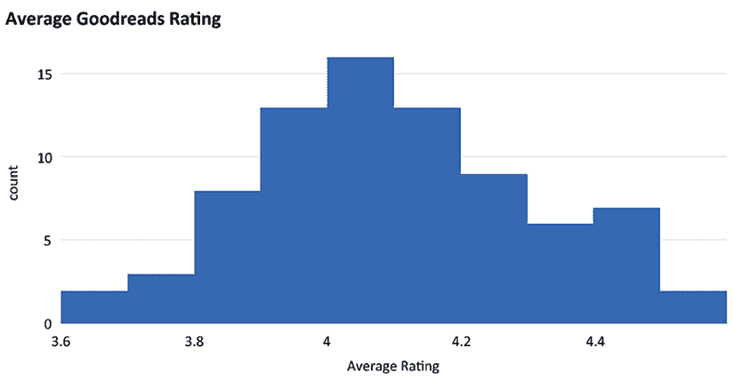
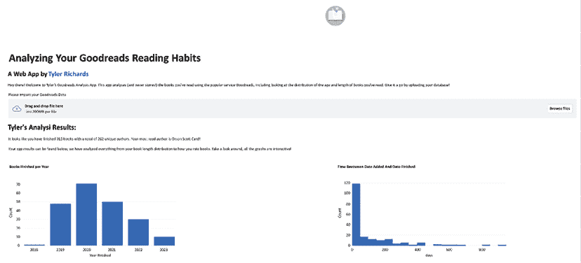

# 第十一章：数据项目——在 Streamlit 中制作原型项目

在上一章中，我们讨论了如何创建特定于工作申请的 Streamlit 应用程序。另一个有趣的 Streamlit 应用是尝试新的、有趣的数据科学想法，并为他人创建互动应用。一些示例包括将新的机器学习模型应用到现有数据集、分析用户上传的数据，或创建一个基于私有数据集的互动分析。制作这样的项目有很多原因，比如个人教育或社区贡献。

就个人教育而言，通常学习新主题的最佳方式是通过将其应用于你周围的世界或你熟悉的数据集来观察它是如何实际工作的。例如，如果你尝试了解**主成分分析**是如何工作的，你总是可以通过教科书学习，或者观看别人将其应用到数据集上。然而，我发现，当我自己亲自实践时，我对一个主题的理解会迅速提高。Streamlit 非常适合这种方式。它允许你在一个响应式、充满乐趣的环境中尝试新想法，并且可以轻松地与他人分享。学习数据科学是可以协作的，这也引出了我在 Streamlit 中创建数据项目的下一个原因。

就社区贡献而言，Streamlit 的一个最佳特点——坦白说，数据科学的一个最佳特点——是围绕我们日常使用的工具和玩具形成的日益壮大的社区。通过与他人共同学习，并在 Twitter（[`twitter.com/tylerjrichards`](https://twitter.com/tylerjrichards)）、LinkedIn 以及 Streamlit 论坛（[`discuss.streamlit.io/`](https://discuss.streamlit.io/)）分享 Streamlit 应用程序，我们可以摆脱大多数学校和大学教授的零和博弈的经验（在这种情况下，如果你的同学得了好成绩，通常会相对伤害到你），转而迎接一种正和博弈的体验（在这种情况下，你能直接从他人学到的经验中受益）。

以之前的示例为例，如果你创建了一个帮助你理解主成分分析背后统计学的应用，分享给他人可能也会让他们学到一些东西。

在本章中，我们将从头到尾完整地进行一个数据项目，开始于一个想法，最终以最终产品结束。具体来说，我们将涵盖以下主题：

+   数据科学创意

+   数据收集与清洗

+   创建**最小可行产品**（**MVP**）

+   迭代改进

+   托管与推广

# 技术要求

在本节中，我们将使用*Goodreads.com*，这是一个由亚马逊拥有的流行网站，用于跟踪用户的阅读习惯，从开始和结束的时间到他们下一本想读的书。建议你首先访问[`www.goodreads.com/`](https://www.goodreads.com/)，注册一个账户，并稍作探索（也许你可以添加自己的书单！）。

# 数据科学创意

经常，想出一个新的数据科学项目的创意是最令人生畏的部分。你可能会有许多疑虑。假如我开始一个没人喜欢的项目怎么办？假如我的数据根本不好用怎么办？假如我想不出任何点子怎么办？好消息是，如果你创建的是你真正关心且愿意使用的项目，那么最糟的情况就是你的观众只有一个！如果你把项目发给我（`tylerjrichards@gmail.com`），我保证会阅读。所以最少的观众人数是两个。

我自己创建或观察到的一些示例包括：

+   记录一个学期的乒乓球比赛，以通过 Elo 模型确定最佳选手（[`www.tylerjrichards.com/Ping_pong.html`](http://www.tylerjrichards.com/Ping_pong.html) 或 [`www.youtube.com/watch?v=uPg7PEdx7WA`](https://www.youtube.com/watch?v=uPg7PEdx7WA)）

+   使用大型语言模型与您组织的 Snowflake 数据进行对话（[`snowchat.streamlit.app/`](https://snowchat.streamlit.app/)）

+   分析成千上万的披萨评论，找到你附近的最佳纽约披萨（[`towardsdatascience.com/adventures-in-barstools-pizza-data-9b8ae6bb6cd1`](https://towardsdatascience.com/adventures-in-barstools-pizza-data-9b8ae6bb6cd1)）

+   使用 Goodreads 数据分析你的阅读习惯（[`goodreads.streamlit.app/`](https://goodreads.streamlit.app/)）

+   使用你的 Spotify 数据来深入挖掘你的听歌历史（[`spotify-history.streamlit.app/`](https://spotify-history.streamlit.app/)）

尽管只有这两个数据项目使用了 Streamlit，因为其余的项目是在该库发布之前完成的，但所有这些项目都可以通过将它们部署到 Streamlit 上来改进，而不仅仅是上传到 Jupyter 笔记本（列表中的第一个项目）或 Word 文档/HTML 文件（*第二个和第三个项目*）。

有许多不同的方法可以帮助你想出自己的数据项目创意，但最流行的方法通常可以归为三类：

+   寻找只有你能够收集到的数据（例如，你朋友的乒乓球比赛）

+   寻找你关心的数据（例如，Spotify 的阅读数据）

+   想到一个你希望存在的分析/应用程序来解决你的问题，并付诸实践（例如，宿舍 Wi-Fi 分析或在纽约市找到最佳披萨）

你可以尝试这些方法，或从你已有的其他想法开始。最好的方法是最适合你的方法！在本章中，我们将深入演示并重建 Goodreads Streamlit 应用，作为数据项目的示例。你可以通过 [`goodreads.streamlit.app/`](https://goodreads.streamlit.app/) 再次访问该应用。

这个应用程序旨在抓取用户的 Goodreads 历史记录，并生成一组图表，向用户展示自开始使用 Goodreads 以来的阅读习惯。生成的图表应与以下截图相似：


图 11.1：Goodreads 图表示例

我是通过对我的书籍历史进行个人分析得出了这个想法，然后我想，其他人可能也会对这种分析感兴趣！通过这个项目，我意识到我想阅读更老的书籍（或者说有更长“书龄”的书籍）。其实没有比这个更好的理由了，而且，往往最有趣的项目就是这样开始的。首先，我们将收集并清洗存在于 Goodreads 上的用户数据。

# 数据收集与清洗

获取 Goodreads 数据有两种方式：通过 **应用程序编程接口** (**API**)，该接口允许开发者以编程方式访问书籍数据，和通过其手动导出功能。遗憾的是，Goodreads 即将弃用其 API，并且从 2020 年 12 月起，不再向新开发者提供访问权限。

原版的 Goodreads 应用使用了 API，但我们的版本将依赖于 Goodreads 网站提供的手动导出功能来获取数据。要获取你的数据，请前往 [`www.goodreads.com/review/import`](https://www.goodreads.com/review/import) 并下载你的数据。如果你没有 Goodreads 账户，可以随意使用我的个人数据，数据可以在 [`github.com/tylerjrichards/goodreads_book_demo`](https://github.com/tylerjrichards/goodreads_book_demo) 找到。我已经将我的 Goodreads 数据保存为一个名为 `goodreads_history.csv` 的文件，放在一个新文件夹 `streamlit_goodreads_book` 中。要创建你自己的文件夹并进行相应设置，请在终端中运行以下命令：

```py
mkdir streamlit_goodreads_book
cd streamlit_goodreads_book
touch goodreads_app.py 
```

现在我们已经准备好开始了。我们实际上不知道这些数据是什么样子，也不知道数据集中包含了什么，所以我们的第一步是做以下几件事：

1.  在应用程序顶部添加标题和说明。

1.  允许用户上传自己的数据，或者如果他们没有自己的数据，则使用我们的默认数据。

1.  将数据的前几行写入应用程序，以便我们查看。

以下代码块完成了所有这些功能。你可以随意更改文本，使应用显示你的名字，还可以添加人们可以查看的个人资料链接！在撰写本文时，大约 10% 的访问流量来自我制作的 Streamlit 应用：

```py
import streamlit as st
import pandas as pd
st.title('Analyzing Your Goodreads Reading Habits')
st.subheader('A Web App by [Tyler Richards](http://www.tylerjrichards.com)')
"""
Hey there! Welcome to Tyler's Goodreads Analysis App. This app analyzes (and never stores!)
the books you've read using the popular service Goodreads, including looking at the distribution
of the age and length of books you've read. Give it a go by uploading your data below!
"""
goodreads_file = st.file_uploader('Please Import Your Goodreads Data')
if goodreads_file is None:
     books_df = pd.read_csv('goodreads_history.csv')
     st.write("Analyzing Tyler's Goodreads history")
else:
     books_df = pd.read_csv(goodreads_file)
     st.write('Analyzing your Goodreads history')
st.write(books_df.head()) 
```

现在，当我们运行这个 Streamlit 应用时，应该得到一个类似于以下截图的界面：


图 11.2：前五行

如你所见，我们得到了一个数据集，每本书都是一个独立的行。此外，我们还获得了关于每本书的大量数据，包括书名和作者、书籍的平均评分、你给这本书的评分、页数，甚至是你是否读过这本书、是否计划阅读这本书，或是正在阅读这本书。数据看起来大部分是干净的，但也有一些奇怪的地方——例如，数据中既有出版年份，又有原出版年份；以及**ISBN**（**国际标准书号**）以*="1400067820"*的格式出现，这真是有点奇怪。现在我们了解了手头的数据，接下来可以尝试为用户构建一些有趣的图表。

# 制作 MVP

观察我们的数据，我们可以从一个基本问题开始：我可以用这些数据回答哪些最有趣的问题？在查看数据并思考我想从我的 Goodreads 阅读历史中获得哪些信息后，以下是我想到的一些问题：

+   我每年读多少本书？

+   我开始读一本书后，需要多长时间才能完成它？

+   我读过的书有多长？

+   我读过的书有多老？

+   我是如何给书评分的，与其他 Goodreads 用户相比如何？

我们可以提出这些问题，弄清楚如何修改数据以便更好地可视化它们，然后尝试通过打印出所有图表来创建我们的第一个产品。

## 我每年读多少本书？

关于每年读书数量的第一个问题，我们有**阅读日期**列，数据格式为*yyyy/mm/dd*。以下代码块将执行以下操作：

1.  将我们的列转换为日期时间格式。

1.  从**阅读日期**列中提取年份。

1.  按此列分组并计算每年书籍的数量。

1.  使用 Plotly 绘制图形。

以下代码块执行此操作，从日期时间转换开始。这里需要特别注意的是，和所有事情一样，我并没有在第一次尝试时就做对。事实上，我花了一些时间才弄清楚如何管理和转换这些数据。当你自己做项目时，如果发现数据清理和转换需要很长时间，不要感到沮丧！这通常是最难的一步：

```py
 goodreads_file = st.file_uploader('Please Import Your Goodreads Data')
if goodreads_file is None:
     books_df = pd.read_csv('goodreads_history.csv')
     st.write("Analyzing Tyler's Goodreads history")
else:
     books_df = pd.read_csv(goodreads_file)
     st.write('Analyzing your Goodreads history')
books_df['Year Finished'] = pd.to_datetime(books_df['Date Read']).dt.year
books_per_year = books_df.groupby('Year Finished')['Book Id'].count().reset_index()
books_per_year.columns = ['Year Finished', 'Count']
fig_year_finished = px.bar(books_per_year, x='Year Finished', y='Count', title='Books Finished per Year')
st.plotly_chart(fig_year_finished) 
```

上述代码块将创建以下图表：


图 11.3：完成年份的条形图

事实上，我们在这里做出了一个假设——也就是，我们假设**阅读日期**列中的年份代表我们阅读这本书的年份。但如果我们在 12 月中旬开始一本书，并在 1 月 2 日完成它呢？或者，如果我们在 2019 年开始读一本书，但只读了几页，然后在 2021 年重新拿起来继续读呢？我们知道这不会完美地估算每年读的书籍数量，但将其表示为每年完成的书籍数量会更好。

## 我需要多长时间才能读完一本已经开始的书？

我们下一个问题是关于一旦开始读书后，我们需要多长时间才能读完它。为了回答这个问题，我们需要找出两列的差异：**读书日期**列和**添加日期**列。再次提醒，这将是一个近似值，因为我们没有用户开始读书的日期，只知道他们将书添加到 Goodreads 上的日期。考虑到这一点，我们的下一步包括以下内容：

1.  将这两列转换为日期时间格式。

1.  找出两列之间的天数差异。

1.  将这个差异绘制为直方图。

以下代码块首先进行转换，就像我们之前做的那样，然后继续进行我们的一系列任务：

```py
books_df['days_to_finish'] = (pd.to_datetime(
            books_df['Date Read']) - pd.to_datetime(books_df['Date Added'])).dt.days
fig_days_finished = px.histogram(books_df, x='days_to_finish')
st.plotly_chart(fig_days_finished) 
```

上面的代码块可以添加到你当前 Streamlit 应用的底部，运行后应该会显示一个新的图表：


图 11.4：完成天数图

这张图表对我的数据帮助不大。看起来，在某个时候，我把以前读过的书添加到了 Goodreads 上，这些书在这个图表中显示了出来。我们还有一组未读完或在待读书架上的书，它们在这个数据集中显示为`null`值。我们可以做一些调整，例如过滤数据集，只包含那些天数为正的书，或者仅过滤出已读完的书，这段代码块就是这样做的：

```py
books_df['days_to_finish'] = (pd.to_datetime(
            books_df['Date Read']) - pd.to_datetime(books_df['Date Added'])).dt.days
books_finished_filtered = books_df[(books_df['Exclusive Shelf'] == 'read') & (books_df['days_to_finish'] >= 0)]
fig_days_finished = px.histogram(books_finished_filtered,
x='days_to_finish', title='Time Between Date Added And Date Finished',
     labels={'days_to_finish':'days'})
st.plotly_chart(fig_days_finished) 
```

我们代码中的这个改动使得图表大大改善。它做了一些假设，但也提供了更准确的分析。完成的图表可以在以下截图中查看：


图 11.5：改进后的完成天数图

这样好多了！现在，让我们继续下一个问题。

## 我读过的书有多长？

这个问题的数据已经处于相当不错的状态。我们有一列叫做**页面数**，顾名思义，它记录了每本书的页数。我们只需要将这一列传递给另一个直方图，就能搞定：

```py
fig_num_pages = px.histogram(books_df, x='Number of Pages', title='Book Length Histogram')
st.plotly_chart(fig_num_pages) 
```

这段代码将生成类似于以下屏幕截图的结果，显示按页面数衡量的书籍长度直方图：


图 11.6：页面数直方图

这对我来说有道理；很多书的页数在 300 到 400 页之间，还有一些巨型书籍有 1,000 页以上。现在，让我们继续看这些书的出版年限吧！

## 我读过的书有多老？

我们接下来的图表应该是直接的。我们怎么知道我们读的书有多旧？我们是倾向于选择最近出版的书籍，还是更喜欢阅读经典书籍？我们可以从两个列中获取这些信息：出版年份和原始出版年份。这个数据集的文档非常少，但我认为我们可以放心假设原始出版年份是我们需要的，而出版年份则显示的是出版商重新出版书籍的时间。

以下代码块通过打印出所有原始出版年份晚于出版年份的书籍来验证这一假设：

```py
st.write('Assumption check')
st.write(len(books_df[books_df['Original Publication Year'] > books_df['Year Published']])) 
```

当我们运行此代码时，应用程序应该返回没有原始出版年份大于出版年份的书籍。现在我们已经验证了这一假设，我们可以执行以下操作：

1.  按原始出版年份对书籍进行分组。

1.  在柱状图上绘制这个数据。

以下代码块执行了两个步骤：

```py
books_publication_year = books_df.groupby('Original Publication Year')['Book Id'].count().reset_index()
books_publication_year.columns = ['Year Published', 'Count']
fig_year_published = px.bar(books_publication_year, x='Year Published', y='Count', title='Book Age Plot')
st.plotly_chart(fig_year_published) 
```

当我们运行这个应用程序时，我们应该得到以下图表：


图 11.7：书籍年龄图

初看这个图表，它似乎不太有用，因为有很多书籍的写作时间距离现在非常久远（例如，柏拉图的著作是在公元前 375 年），导致整个图表难以阅读。然而，Plotly 默认是交互式的，它允许我们缩放到我们关心的历史时期。例如，以下截图展示了当我们缩放到 1850 年至今的时期时的情况，而我读过的大多数书籍正好位于这个时间段：


图 11.8：缩放出版年份

这是一个更好的图表！接下来有几个选项可以选择。我们可以从不太有用的图表开始，并告诉用户可以放大，也可以只筛选出较新的书籍数据集（这会违背图表的主要目的），或者我们可以为图表设置默认的缩放状态，并在底部提醒用户可以根据需要放大。我认为第三个选项是最好的。以下代码实现了这个选项：

```py
Books_publication_year = books_df.groupby('Original Publication Year')['Book Id'].count().reset_index()
books_publication_year.columns = ['Year Published', 'Count']
st.write(books_df.sort_values(by='Original Publication Year').head())
fig_year_published = px.bar(books_publication_year, x='Year Published', y='Count', title='Book Age Plot')
fig_year_published.update_xaxes(range=[1850, 2021])
st.plotly_chart(fig_year_published)
st.write('This chart is zoomed into the period of 1850-2021, but is interactive so try zooming in/out on interesting periods!') 
```

当我们运行这段代码时，我们应该得到最终的图表：


图 11.9：带有帮助文本的默认缩放

四个问题已经完成——剩下一个！

## 我如何与其他 Goodreads 用户相比对书籍评分？

对于这个最后一个问题，我们实际上需要两个独立的图表。首先，我们需要绘制我们给书籍打的分。其次，我们需要绘制其他用户给我们也评分的书籍打的分。这并不是一个完美的分析，因为 Goodreads 只给我们显示了书籍的平均评分——我们没有读取分布情况。例如，如果我们读过《雪球》，沃伦·巴菲特的传记，并给它打了 3 星，而一半的 Goodreads 读者给它打了 1 星，另一半给了 5 星，那么我们打的分就和平均评分完全一样，但我们并没有和任何单个评分者的评分一致！不过，我们只能基于现有数据做我们能做的事。因此，我们可以这样做：

1.  根据我们评分过的书籍（即我们已阅读的书籍）来过滤图书。

1.  为我们的第一个图表创建一本书的平均评分的直方图。

1.  为你自己的评分创建另一个直方图。

接下来的代码块正是做到了这一点：

```py
books_rated = books_df[books_df['My Rating'] != 0]
fig_my_rating = px.histogram(books_rated, x='My Rating', title='User Rating')
st.plotly_chart(fig_my_rating)
fig_avg_rating = px.histogram(books_rated, x='Average Rating', title='Average Goodreads Rating')
st.plotly_chart(fig_avg_rating) 
```

正如你在下面的截图中看到的，带有用户评分分布的第一个图表看起来非常好。看起来我主要给书籍打了 4 星或 5 星，这总体来说是相对宽松的评分：


图 11.10：用户评分分布

当我们查看第二个图表时，看到的分布相当干净。然而，我们遇到了之前提到的问题——所有的评分平均值比用户评分的分布要集中得多：



图 11.11：Goodreads 平均评分

我们可以始终将两个图表的 *x* 轴范围设置为 1 到 5，但这并不能解决我们真正的问题。相反，我们可以保留这两个图表，但还要计算出我们平均评分是否高于或低于 Goodreads 的平均评分。以下代码块将计算此差异，并将其添加到 Goodreads 平均评分图表下方：

```py
Fig_avg_rating = px.histogram(books_rated, x='Average Rating', title='Average Goodreads Rating')
st.plotly_chart(fig_avg_rating)
import numpy as np
avg_difference = np.round(np.mean(books_rated['My Rating'] – books_rated['Average Rating']), 2)
if avg_difference >= 0:
     sign = 'higher'
else:
     sign = 'lower'
st.write(f"You rate books {sign} than the average Goodreads user by {abs(avg_difference)}!") 
```

这个代码块计算了我们的平均值，并创建了一个动态字符串，显示 Goodreads 用户给书籍的评分高于或低于 Goodreads 的平均用户评分。以下是我的数据结果：


图 11.12：添加平均差异

这样更好，完成了我们的 MVP。我们的应用已经处于一个不错的状态，难度较大的操作和可视化步骤基本完成。然而，我们的应用看起来并不出色，只是一堆排成一行的图表。这可能适合 MVP，但我们需要添加一些样式来真正改善状态。这就引出了我们下一部分内容：对这个想法进行迭代，使其更好。

# 迭代改进

到目前为止，我们几乎完全处于生产模式中。迭代改进就是在我们已经完成的工作基础上进行编辑和组织，以使应用更加易用，坦率地说，也更美观。这里有一些我们可以努力改进的地方：

+   通过动画美化

+   使用列和宽度组织

+   通过文本和额外统计数据构建叙事

让我们通过使用动画让应用变得更加美观吧！

## 通过动画进行美化

在*第七章*，*探索 Streamlit 组件* 中，我们探讨了各种 Streamlit 组件的使用；其中有一个组件叫做`streamlit-lottie`，它使我们能够在 Streamlit 应用中添加动画。我们可以通过以下代码，在当前 Streamlit 应用的顶部添加一个动画来改进我们的应用。如果你想了解更多关于 Streamlit 组件的信息，请回到*第七章*，*探索 Streamlit 组件*：

```py
import streamlit as st
import pandas as pd
import plotly.express as px
import numpy as np
from streamlit_lottie import st_lottie
import requests
def load_lottieurl(url: str):
    r = requests.get(url)
    if r.status_code != 200:
        return None
    return r.json()
file_url = 'https://assets4.lottiefiles.com/temp/lf20_aKAfIn.json'
lottie_book = load_lottieurl(file_url)
st_lottie(lottie_book, speed=1, height=200, key="initial") 
```

这个 Lottie 文件是一本书翻页的动画，如下图所示。这些动画总是能为较长的 Streamlit 应用程序增添一丝生动感：


图 11.13：Goodreads 动画

现在我们添加了动画，可以继续改进应用的布局。

## 使用列和宽度进行组织

正如我们之前讨论的，我们的应用看起来并不太好，每个图表都是依次显示的。另一个改进是，我们可以让应用以宽格式而不是窄格式显示，然后将应用并排放置在每一列中。

首先，在应用程序顶部，我们需要第一个 Streamlit 调用来将 Streamlit 应用的配置设置为宽格式，而不是窄格式，代码块如下所示：

```py
import requests
st.set_page_config(layout="wide")
def load_lottieurl(url: str):
    r = requests.get(url)
    if r.status_code != 200:
        return None
    return r.json() 
```

这将把我们的 Streamlit 应用设置为宽格式。到目前为止，我们在应用中为每个图表都命名了一个独特的名称（例如`fig_year_finished`），以便让接下来的步骤更加轻松。现在我们可以删除所有的`st.plotly_chart()`调用，并创建一个由两列三行组成的布局，在哪里可以放置我们的六个图表。以下代码创建了这些布局。我们首先为每个位置命名，然后用一个图表填充它们：

```py
row1_col1, row1_col2 = st.columns(2)
row2_col1, row2_col2 = st.columns(2)
row3_col1, row3_col2 = st.columns(2)
with row1_col1:
     st.plotly_chart(fig_year_finished)
with row1_col2:
     st.plotly_chart(fig_days_finished)
with row2_col1:
     st.plotly_chart(fig_num_pages)
with row2_col2:
     st.plotly_chart(fig_year_published)
     st.write('This chart is zoomed into the period of 1850-2021, but is interactive so try zooming in/out on interesting periods!')
with row3_col1:
     st.plotly_chart(fig_my_rating)
with row3_col2:
     st.plotly_chart(fig_avg_rating)
     st.write(f"You rate books {sign} than the average Goodreads user by {abs(avg_difference)}!") 
```

这段代码将创建如下截图中的应用，为简洁起见，已经裁剪为前两个图表：



图 11.14：宽格式示例

这使我们的图表更加易于阅读，并且可以轻松地进行比较。我们特意根据评分将两个图表配对，其余的图表也都能很好地并排显示。我们的最后一步是添加一些文字，使整个应用程序更加易读。

## 通过文本和附加统计数据进行叙事构建

这些图表已经很有帮助，可以理解用户的阅读方式，但我们可以通过在每个图表下方以及应用的开头添加一些有用的统计数据和文字来提高应用的可读性。

在我们开始定义列的位置上方，我们可以添加一个初步的部分，展示我们读过的独特书籍数量、独特作者数量和最喜欢的作者，将这些基本统计数据集中展示。我们可以利用这些基本数据来启动应用，并告知用户每个图表都是交互式的：

```py
if goodreads_file is None:
     st.subheader("Tyler's Analysis Results:")
else:
     st.subheader('Your Analysis Results:')
books_finished = books_df[books_df['Exclusive Shelf'] == 'read']
u_books = len(books_finished['Book Id'].unique())
u_authors = len(books_finished['Author'].unique())
mode_author = books_finished['Author'].mode()[0]
st.write(f'It looks like you have finished {u_books} books with a total of {u_authors} unique authors. Your most read author is {mode_author}!')
st.write(f'Your app results can be found below, we have analyzed everything from your book length distribution to how you rate books. Take a look around, all the graphs are interactive!')
row1_col1, row1_col2 = st.columns(2) 
```

现在我们需要在四个图表下方添加四个新的文本部分，这些图表目前没有任何注释文本。对于前面三个图表，以下代码将为每个图表添加一些统计数据和文本：

```py
row1_col1, row1_col2 = st.columns(2)
row2_col1, row2_col2 = st.columns(2)
row3_col1, row3_col2 = st.columns(2)
with row1_col1:
     mode_year_finished = int(books_df['Year Finished'].mode()[0])
     st.plotly_chart(fig_year_finished)
     st.write(f'You finished the most books in {mode_year_finished}. Awesome job!')
with row1_col2:
     st.plotly_chart(fig_days_finished)
     mean_days_to_finish = int(books_finished_filtered['days_to_finish'].mean())
     st.write(f'It took you an average of {mean_days_to_finish} days between when the book was added to Goodreads and when you finished the book. This is not a perfect metric, as you may have added this book to a to-read list!')
with row2_col1:
     st.plotly_chart(fig_num_pages)
     avg_pages = int(books_df['Number of Pages'].mean())
     st.write(f'Your books are an average of {avg_pages} pages long, check out the distribution above!') 
```

这里有一个示例图表是关于书籍长度的直方图。前面的代码为图表下方添加了平均长度和一些文本，具体如下面的截图所示：


图 11.15：平均页数文本

对于最后一组图表，我们可以为那些没有上下文的图表添加文本：

```py
with row2_col2:
     st.plotly_chart(fig_year_published)
     st.write('This chart is zoomed into the period of 1850-2021, but is interactive so try zooming in/out on interesting periods!')
with row3_col1:
     st.plotly_chart(fig_my_rating)
     avg_my_rating = round(books_rated['My Rating'].mean(), 2)
     st.write(f'You rate books an average of {avg_my_rating} stars on Goodreads.')
with row3_col2:
     st.plotly_chart(fig_avg_rating)
     st.write(f"You rate books {sign} than the average Goodreads user by {abs(avg_difference)}!") 
```

这完成了我们关于添加文本和额外统计数据的部分！

# 托管与推广

我们的最后一步是将这个应用托管到 Streamlit Community Cloud 上。为此，我们需要执行以下步骤：

1.  为这项工作创建一个 GitHub 仓库。

1.  添加一个`requirements.txt`文件。

1.  使用 Streamlit Community Cloud 上的一键部署功能来部署应用。

我们在*第五章*《使用 Streamlit 部署到 Streamlit Community Cloud》中已经详细讲解过了这个内容，现在可以没有指引地尝试一下。

# 总结

这一章真是太有趣了！我们在这里学到了很多内容——从如何提出我们自己的数据科学项目，到如何创建初步的 MVP，再到我们应用程序的迭代改进。我们通过我们自己的 Goodreads 数据集来实现这一切，并且把这个应用从一个想法发展成了一个在 Streamlit Community Cloud 上托管的完全功能应用。我期待看到你们创造的各种不同类型的 Streamlit 应用。请创造一些有趣的应用，并在 Twitter 上发送给我，用户名是`@tylerjrichards`。在下一章中，我们将重点采访 Streamlit 的重度用户和创作者，了解他们的技巧与窍门，为什么他们如此广泛使用 Streamlit，并且他们认为这个库的未来将会怎样发展。到时见！

# 在 Discord 上了解更多信息

要加入这本书的 Discord 社区——你可以在这里分享反馈、向作者提问、了解新版本的发布——请扫描下面的二维码：

[`packt.link/sl`](https://packt.link/sl)


