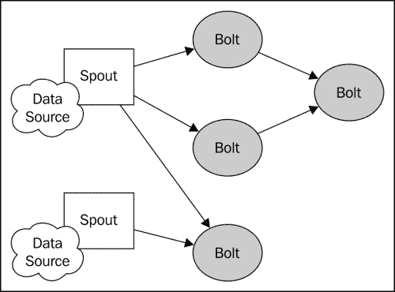
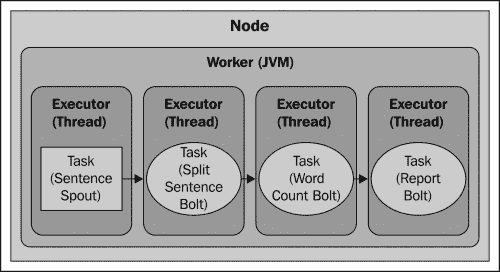
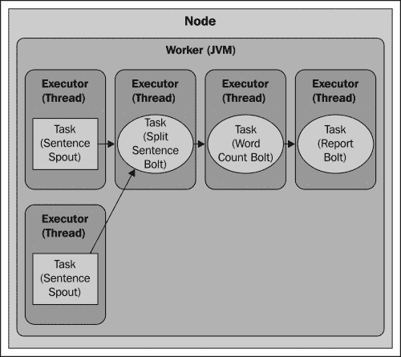
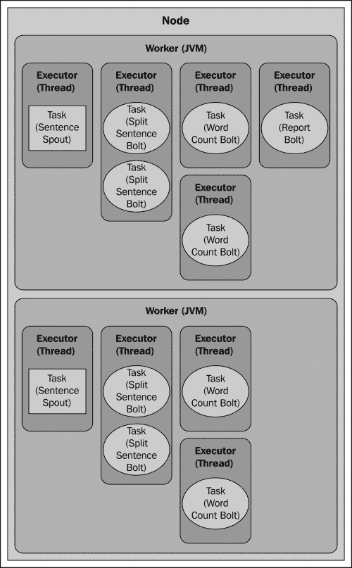
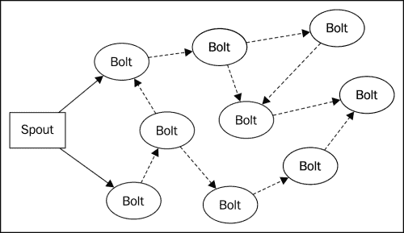

# 第一章：分布式单词计数

在本章中，我们将介绍使用 Storm 创建分布式流处理应用程序涉及的核心概念。我们通过构建一个简单的应用程序来计算连续句子流的运行单词计数来实现这一点。单词计数示例涉及许多用于更复杂计算所需的结构、技术和模式，但它简单且易于理解。

我们将从 Storm 的数据结构概述开始，然后实现组成完整 Storm 应用程序的组件。在本章结束时，您将对 Storm 计算的结构、设置开发环境以及开发和调试 Storm 应用程序的技术有了基本的了解。

本章涵盖以下主题：

+   Storm 的基本构造 - 拓扑、流、喷口和螺栓

+   设置 Storm 开发环境

+   实现基本的单词计数应用程序

+   并行化和容错

+   通过并行化计算任务进行扩展

# 介绍 Storm 拓扑的元素 - 流、喷口和螺栓

在 Storm 中，分布式计算的结构被称为**拓扑**，由数据流、喷口（流生产者）和螺栓（操作）组成。Storm 拓扑大致类似于 Hadoop 等批处理系统中的作业。然而，批处理作业具有明确定义的起点和终点，而 Storm 拓扑会永远运行，直到明确终止或取消部署。



Storm 拓扑

## 流

Storm 中的核心数据结构是*元组*。元组只是具有命名值（键值对）的列表，而流是元组的无界序列。如果您熟悉**复杂事件处理**（**CEP**），您可以将 Storm 元组视为*事件*。

## 喷口

喷口代表数据进入 Storm 拓扑的主要入口点。喷口充当连接到数据源的适配器，将数据转换为元组，并将元组作为流发出。

正如您将看到的，Storm 提供了一个简单的 API 来实现喷口。开发喷口主要是编写代码以从原始来源或 API 中获取数据。潜在的数据来源包括：

+   来自基于 Web 或移动应用程序的点击流

+   Twitter 或其他社交网络的信息源

+   传感器输出

+   应用程序日志事件

由于喷口通常不实现任何特定的业务逻辑，它们通常可以在多个拓扑中重复使用。

## 螺栓

螺栓可以被视为您计算的*运算符*或*函数*。它们接受任意数量的流作为输入，处理数据，并可选择发出一个或多个流。螺栓可以订阅喷口或其他螺栓发出的流，从而可以创建一个复杂的流转换网络。

螺栓可以执行任何想象得到的处理，就像喷口 API 一样，螺栓接口简单而直接。螺栓通常执行的典型功能包括：

+   过滤元组

+   连接和聚合

+   计算

+   数据库读取/写入

# 介绍单词计数拓扑的数据流

我们的单词计数拓扑（如下图所示）将由一个连接到三个下游螺栓的喷口组成。


单词计数拓扑

## 句子喷口

`SentenceSpout`类将简单地发出一个单值元组流，键名为`"sentence"`，值为字符串（句子），如下面的代码所示：

```scala
{ "sentence":"my dog has fleas" }
```

为了保持简单，我们的数据源将是一个静态的句子列表，我们将循环遍历，为每个句子发出一个元组。在现实世界的应用程序中，喷口通常会连接到动态来源，例如从 Twitter API 检索的推文。

### 介绍拆分句子螺栓

拆分句子螺栓将订阅句子 spout 的元组流。对于接收到的每个元组，它将查找`"sentence"`对象的值，将该值拆分为单词，并为每个单词发出一个元组：

```scala
{ "word" : "my" }
{ "word" : "dog" }
{ "word" : "has" }
{ "word" : "fleas" }
```

### 介绍单词计数螺栓

单词计数螺栓订阅`SplitSentenceBolt`类的输出，持续计算它见过特定单词的次数。每当它接收到一个元组时，它将增加与单词关联的计数器并发出一个包含单词和当前计数的元组：

```scala
{ "word" : "dog", "count" : 5 }
```

### 介绍报告螺栓

报告螺栓订阅`WordCountBolt`类的输出，并维护所有单词及其对应计数的表，就像`WordCountBolt`一样。当它接收到一个元组时，它会更新表并将内容打印到控制台。

# 实现单词计数拓扑

现在我们已经介绍了基本的 Storm 概念，我们准备开始开发一个简单的应用程序。目前，我们将在本地模式下开发和运行 Storm 拓扑。Storm 的本地模式在单个 JVM 实例中模拟了一个 Storm 集群，使得在本地开发环境或 IDE 中开发和调试 Storm 拓扑变得容易。在后面的章节中，我们将向您展示如何将在本地模式下开发的 Storm 拓扑部署到完全集群化的环境中。

## 设置开发环境

创建一个新的 Storm 项目只是将 Storm 库及其依赖项添加到 Java 类路径的问题。然而，正如您将在第二章中了解到的那样，*配置 Storm 集群*，将 Storm 拓扑部署到集群环境中需要对编译类和依赖项进行特殊打包。因此，强烈建议您使用构建管理工具，如 Apache Maven、Gradle 或 Leinengen。对于分布式单词计数示例，我们将使用 Maven。

让我们开始创建一个新的 Maven 项目：

```scala
$ mvn archetype:create -DgroupId=storm.blueprints 
-DartifactId=Chapter1 -DpackageName=storm.blueprints.chapter1.v1

```

接下来，编辑`pom.xml`文件并添加 Storm 依赖项：

```scala
<dependency>
    <groupId>org.apache.storm</groupId>
    <artifactId>storm-core</artifactId>
    <version>0.9.1-incubating</version>
</dependency>
```

然后，使用以下命令构建项目来测试 Maven 配置：

```scala
$ mvn install

```

### 注意

**下载示例代码**

您可以从[`www.packtpub.com`](http://www.packtpub.com)的帐户中下载您购买的所有 Packt 图书的示例代码文件。如果您在其他地方购买了本书，您可以访问[`www.packtpub.com/support`](http://www.packtpub.com/support)并注册，以便直接通过电子邮件接收文件。

Maven 将下载 Storm 库及其所有依赖项。有了项目设置好了，我们现在准备开始编写我们的 Storm 应用程序。

## 实现句子 spout

为了简化问题，我们的`SentenceSpout`实现将通过创建一个静态的句子列表来模拟数据源。每个句子都作为一个单字段元组发出。完整的 spout 实现在*示例 1.1*中列出。

**示例 1.1：SentenceSpout.java**

```scala
public class SentenceSpout extends BaseRichSpout {

    private SpoutOutputCollector collector;
    private String[] sentences = {
        "my dog has fleas",
        "i like cold beverages",
        "the dog ate my homework",
        "don't have a cow man",
        "i don't think i like fleas"
    };
    private int index = 0;

    public void declareOutputFields(OutputFieldsDeclarer declarer) {
        declarer.declare(new Fields("sentence"));
    }

    public void open(Map config, TopologyContext context, 
            SpoutOutputCollector collector) {
        this.collector = collector;
    }

    public void nextTuple() {
        this.collector.emit(new Values(sentences[index]));
        index++;
        if (index >= sentences.length) {
            index = 0;
        }
        Utils.waitForMillis(1);
    }
}
```

`BaseRichSpout`类是`ISpout`和`IComponent`接口的方便实现，并为我们在这个例子中不需要的方法提供了默认实现。使用这个类可以让我们只关注我们需要的方法。

`declareOutputFields()`方法在所有 Storm 组件（spouts 和 bolts）必须实现的`IComponent`接口中定义，并用于告诉 Storm 组件将发出哪些流以及每个流的元组将包含哪些字段。在这种情况下，我们声明我们的 spout 将发出一个包含单个字段（`"sentence"`）的元组的单个（默认）流。

`open（）`方法在`ISpout`接口中定义，并在初始化 spout 组件时调用。`open（）`方法接受三个参数：包含 Storm 配置的映射，提供有关拓扑中放置的组件的信息的`TopologyContext`对象，以及提供发出元组方法的`SpoutOutputCollector`对象。在这个例子中，我们在初始化方面不需要做太多，所以`open（）`实现只是将对`SpoutOutputCollector`对象的引用存储在一个实例变量中。

`nextTuple（）`方法代表任何 spout 实现的核心。Storm 调用此方法请求 spout 向输出收集器发出元组。在这里，我们只发出当前索引处的句子，并增加索引。

## 实现拆分句子螺栓

`SplitSentenceBolt`的实现在*示例 1.2*中列出。

**示例 1.2 - SplitSentenceBolt.java**

```scala
public class SplitSentenceBolt extends BaseRichBolt{
    private OutputCollector collector;

    public void prepare(Map config, TopologyContext context,
 OutputCollector collector) {
        this.collector = collector;
    }

    public void execute(Tuple tuple) {
        String sentence = tuple.getStringByField("sentence");
        String[] words = sentence.split(" ");
        for(String word : words){
            this.collector.emit(new Values(word));
        }
    }

    public void declareOutputFields(OutputFieldsDeclarer declarer) {
        declarer.declare(new Fields("word"));
    }
}
```

`BaseRichBolt`类是另一个方便的类，它实现了`IComponent`和`IBolt`接口。扩展此类使我们不必实现我们不关心的方法，并让我们专注于我们需要的功能。

`IBolt`接口定义的`prepare（）`方法类似于`ISpout`的`open（）`方法。这是您在螺栓初始化期间准备资源（例如数据库连接）的地方。与`SentenceSpout`类一样，`SplitSentenceBolt`类在初始化方面不需要太多，因此`prepare（）`方法只是保存对`OutputCollector`对象的引用。

在`declareOutputFields（）`方法中，`SplitSentenceBolt`类声明了一个包含一个字段（`"word"`）的元组流。

`SplitSentenceBolt`类的核心功能包含在`IBolt`定义的`execute（）`方法中。每次螺栓从其订阅的流接收元组时，都会调用此方法。在这种情况下，它查找传入元组的“句子”字段的值作为字符串，将该值拆分为单词，并为每个单词发出一个新元组。

## 实现单词计数螺栓

`WordCountBolt`类（示例 1.3）实际上是维护单词计数的拓扑组件。在螺栓的`prepare（）`方法中，我们实例化了一个`HashMap<String，Long>`的实例，该实例将存储所有单词及其相应的计数。在`prepare（）`方法中实例化大多数实例变量是常见做法。这种模式背后的原因在于拓扑部署时，其组件 spouts 和 bolts 会被序列化并通过网络发送。如果一个 spout 或 bolt 在序列化之前实例化了任何不可序列化的实例变量（例如在构造函数中创建），将抛出`NotSerializableException`，拓扑将无法部署。在这种情况下，由于`HashMap<String，Long>`是可序列化的，我们可以安全地在构造函数中实例化它。然而，一般来说，最好将构造函数参数限制为基本类型和可序列化对象，并在`prepare（）`方法中实例化不可序列化的对象。

在`declareOutputFields（）`方法中，`WordCountBolt`类声明了一个元组流，其中包含接收到的单词和相应的计数。在`execute（）`方法中，我们查找接收到的单词的计数（必要时将其初始化为`0`），增加并存储计数，然后发出由单词和当前计数组成的新元组。将计数作为流发出允许拓扑中的其他螺栓订阅该流并执行其他处理。

**示例 1.3 - WordCountBolt.java**

```scala
public class WordCountBolt extends BaseRichBolt{
    private OutputCollector collector;
    private HashMap<String, Long> counts = null;

    public void prepare(Map config, TopologyContext context, 
            OutputCollector collector) {
        this.collector = collector;
        this.counts = new HashMap<String, Long>();
    }

    public void execute(Tuple tuple) {
        String word = tuple.getStringByField("word");
        Long count = this.counts.get(word);
        if(count == null){
            count = 0L;
        }
        count++;
        this.counts.put(word, count);
        this.collector.emit(new Values(word, count));
    }

    public void declareOutputFields(OutputFieldsDeclarer declarer) {
        declarer.declare(new Fields("word", "count"));
    }
}
```

## 实现报告螺栓

`ReportBolt`类的目的是生成每个单词的计数报告。与`WordCountBolt`类一样，它使用`HashMap<String，Long>`对象记录计数，但在这种情况下，它只存储从计数螺栓接收到的计数。

到目前为止，我们编写的报告 bolt 与其他 bolt 之间的一个区别是它是一个终端 bolt - 它只接收元组。因为它不发出任何流，所以`declareOutputFields()`方法为空。

报告 bolt 还引入了`IBolt`接口中定义的`cleanup()`方法。当 bolt 即将关闭时，Storm 会调用此方法。我们在这里利用`cleanup()`方法作为在拓扑关闭时输出最终计数的便捷方式，但通常，`cleanup()`方法用于释放 bolt 使用的资源，如打开的文件或数据库连接。

在编写 bolt 时，要牢记`IBolt.cleanup()`方法的一点是，当拓扑在集群上运行时，Storm 不保证会调用它。我们将在下一章讨论 Storm 的容错机制时讨论这背后的原因。但是在这个示例中，我们将在开发模式下运行 Storm，其中保证会调用`cleanup()`方法。

`ReportBolt`类的完整源代码在示例 1.4 中列出。

**示例 1.4 - ReportBolt.java**

```scala
public class ReportBolt extends BaseRichBolt {

    private HashMap<String, Long> counts = null;

    public void prepare(Map config, TopologyContext context, OutputCollector collector) {
        this.counts = new HashMap<String, Long>();
    }

    public void execute(Tuple tuple) {
        String word = tuple.getStringByField("word");
        Long count = tuple.getLongByField("count");
        this.counts.put(word, count);
    }

    public void declareOutputFields(OutputFieldsDeclarer declarer) {
        // this bolt does not emit anything
    }

    public void cleanup() {
        System.out.println("--- FINAL COUNTS ---");
        List<String> keys = new ArrayList<String>();
        keys.addAll(this.counts.keySet());
        Collections.sort(keys);
        for (String key : keys) {
            System.out.println(key + " : " + this.counts.get(key));
        }
        System.out.println("--------------");
    }
}
```

## 实现单词计数拓扑

现在我们已经定义了组成我们计算的 spout 和 bolts，我们准备将它们连接到一个可运行的拓扑中（参考*示例 1.5*）。

**示例 1.5 - WordCountTopology.java**

```scala
public class WordCountTopology {

    private static final String SENTENCE_SPOUT_ID = "sentence-spout";
    private static final String SPLIT_BOLT_ID = "split-bolt";
    private static final String COUNT_BOLT_ID = "count-bolt";
    private static final String REPORT_BOLT_ID = "report-bolt";
    private static final String TOPOLOGY_NAME = "word-count-topology";

    public static void main(String[] args) throws Exception {

        SentenceSpout spout = new SentenceSpout();
        SplitSentenceBolt splitBolt = new SplitSentenceBolt();
        WordCountBolt countBolt = new WordCountBolt();
        ReportBolt reportBolt = new ReportBolt();

        TopologyBuilder builder = new TopologyBuilder();

        builder.setSpout(SENTENCE_SPOUT_ID, spout);
        // SentenceSpout --> SplitSentenceBolt
        builder.setBolt(SPLIT_BOLT_ID, splitBolt)
                .shuffleGrouping(SENTENCE_SPOUT_ID);
        // SplitSentenceBolt --> WordCountBolt
        builder.setBolt(COUNT_BOLT_ID, countBolt)
                .fieldsGrouping(SPLIT_BOLT_ID, new Fields("word"));
        // WordCountBolt --> ReportBolt
        builder.setBolt(REPORT_BOLT_ID, reportBolt)
                .globalGrouping(COUNT_BOLT_ID);

        Config config = new Config();

        LocalCluster cluster = new LocalCluster();

        cluster.submitTopology(TOPOLOGY_NAME, config, builder.createTopology());
        waitForSeconds(10);
        cluster.killTopology(TOPOLOGY_NAME);
        cluster.shutdown();
    }
}
```

Storm 拓扑通常在 Java 的`main()`方法中定义和运行（或者如果拓扑正在部署到集群，则提交）。在这个示例中，我们首先定义了字符串常量，它们将作为我们 Storm 组件的唯一标识符。我们通过实例化我们的 spout 和 bolts 并创建`TopologyBuilder`的实例来开始`main()`方法。`TopologyBuilder`类提供了一种流畅的 API，用于定义拓扑中组件之间的数据流。我们首先注册了句子 spout 并为其分配了一个唯一的 ID：

```scala
builder.setSpout(SENTENCE_SPOUT_ID, spout);
```

下一步是注册`SplitSentenceBolt`并订阅`SentenceSpout`类发出的流：

```scala
builder.setBolt(SPLIT_BOLT_ID, splitBolt)
                .shuffleGrouping(SENTENCE_SPOUT_ID);
```

`setBolt()`方法使用`TopologyBuilder`类注册一个 bolt，并返回一个`BoltDeclarer`的实例，该实例公开了定义 bolt 的输入源的方法。在这里，我们将为`SentenceSpout`对象定义的唯一 ID 传递给`shuffleGrouping()`方法来建立关系。`shuffleGrouping()`方法告诉 Storm 对`SentenceSpout`类发出的元组进行洗牌，并将它们均匀分布在`SplitSentenceBolt`对象的实例之间。我们将在 Storm 的并行性讨论中很快详细解释流分组。

下一行建立了`SplitSentenceBolt`类和`WordCountBolt`类之间的连接：

```scala
builder.setBolt(COUNT_BOLT_ID, countBolt)
                .fieldsGrouping(SPLIT_BOLT_ID, new Fields("word"));
```

正如您将了解的那样，有时候有必要将包含特定数据的元组路由到特定的 bolt 实例。在这里，我们使用`BoltDeclarer`类的`fieldsGrouping()`方法，以确保所有包含相同`"word"`值的元组都被路由到同一个`WordCountBolt`实例。

定义我们数据流的最后一步是将`WordCountBolt`实例发出的元组流路由到`ReportBolt`类。在这种情况下，我们希望`WordCountBolt`发出的所有元组都路由到单个`ReportBolt`任务。这种行为由`globalGrouping()`方法提供，如下所示：

```scala
builder.setBolt(REPORT_BOLT_ID, reportBolt)
                .globalGrouping(COUNT_BOLT_ID);
```

随着我们定义的数据流，运行单词计数计算的最后一步是构建拓扑并将其提交到集群：

```scala
Config config = new Config();

LocalCluster cluster = new LocalCluster();

        cluster.submitTopology(TOPOLOGY_NAME, config, builder.createTopology());
        waitForSeconds(10);
        cluster.killTopology(TOPOLOGY_NAME);
        cluster.shutdown();
```

在这里，我们使用 Storm 的`LocalCluster`类在本地模式下运行 Storm，以模拟在本地开发环境中完整的 Storm 集群。本地模式是一种方便的方式来开发和测试 Storm 应用程序，而不需要部署到分布式集群中的开销。本地模式还允许您在 IDE 中运行 Storm 拓扑，设置断点，停止执行，检查变量并以更加耗时或几乎不可能的方式对应用程序进行分析，而不需要部署到 Storm 集群。

在这个例子中，我们创建了一个`LocalCluster`实例，并使用拓扑名称、`backtype.storm.Config`的实例以及`TopologyBuilder`类的`createTopology()`方法返回的`Topology`对象调用了`submitTopology()`方法。正如你将在下一章中看到的，用于在本地模式部署拓扑的`submitTopology()`方法与用于在远程（分布式）模式部署拓扑的方法具有相同的签名。

Storm 的`Config`类只是`HashMap<String, Object>`的扩展，它定义了一些 Storm 特定的常量和方便的方法，用于配置拓扑的运行时行为。当一个拓扑被提交时，Storm 将其预定义的默认配置值与传递给`submitTopology()`方法的`Config`实例的内容合并，结果将传递给拓扑 spouts 和 bolts 的`open()`和`prepare()`方法。在这个意义上，`Config`对象代表了一组对拓扑中所有组件都是全局的配置参数。

现在我们准备运行`WordCountTopology`类。`main()`方法将提交拓扑，在其运行时等待十秒，终止（取消部署）拓扑，最后关闭本地集群。当程序运行完成时，您应该看到类似以下的控制台输出：

```scala
--- FINAL COUNTS ---
a : 1426
ate : 1426
beverages : 1426
cold : 1426
cow : 1426
dog : 2852
don't : 2851
fleas : 2851
has : 1426
have : 1426
homework : 1426
i : 4276
like : 2851
man : 1426
my : 2852
the : 1426
think : 1425
-------------- 
```

# 在 Storm 中引入并行性

回顾一下介绍中提到的，Storm 允许计算通过将计算分成多个独立的*任务*并行执行在集群中的多台机器上进行水平扩展。在 Storm 中，任务简单地是在集群中某处运行的 spout 或 bolt 的实例。

要理解并行性是如何工作的，我们必须首先解释在 Storm 集群中执行拓扑涉及的四个主要组件：

+   **节点（机器）**：这些只是配置为参与 Storm 集群并执行拓扑部分的机器。Storm 集群包含执行工作的一个或多个节点。

+   **工作者（JVMs）**：这些是在节点上运行的独立 JVM 进程。每个节点配置为运行一个或多个工作者。一个拓扑可以请求分配给它一个或多个工作者。

+   **执行器（线程）**：这些是在工作者 JVM 进程中运行的 Java 线程。可以将多个任务分配给单个执行器。除非明确覆盖，否则 Storm 将为每个执行器分配一个任务。

+   **任务（bolt/spout 实例）**：任务是 spout 和 bolt 的实例，其`nextTuple()`和`execute()`方法由执行器线程调用。

## WordCountTopology 并行性

到目前为止，在我们的单词计数示例中，我们并没有显式地使用 Storm 的并行性 API；相反，我们允许 Storm 使用其默认设置。在大多数情况下，除非被覆盖，否则 Storm 将默认大多数并行性设置为一个因子。

在更改我们拓扑的并行性设置之前，让我们考虑一下我们的拓扑将如何在默认设置下执行。假设我们有一台机器（节点），已经为拓扑分配了一个 worker，并允许 Storm 为每个执行器分配一个任务，我们的拓扑执行将如下所示：



拓扑执行

正如您所看到的，我们唯一的并行性是在线程级别。每个任务在单个 JVM 内的不同线程上运行。我们如何增加并行性以更有效地利用我们手头的硬件呢？让我们从增加分配给运行我们拓扑的工作进程和执行器的数量开始。

### 向拓扑添加工作进程

分配额外的工作进程是增加拓扑的计算能力的一种简单方法，Storm 提供了通过 API 和纯配置来实现这一点的方法。无论我们选择哪种方法，我们的组件 spouts 和 bolts 都不需要改变，可以原样重用。

在之前的单词计数拓扑的版本中，我们介绍了`Config`对象，在部署时传递给`submitTopology()`方法，但基本上没有使用。要增加分配给拓扑的工作进程数量，我们只需调用`Config`对象的`setNumWorkers()`方法：

```scala
    Config config = new Config();
    config.setNumWorkers(2);
```

这将为我们的拓扑分配两个工作进程，而不是默认的一个。虽然这将为我们的拓扑增加计算资源，但为了有效利用这些资源，我们还需要调整拓扑中执行器的数量以及每个执行器的任务数量。

### 配置执行器和任务

正如我们所见，Storm 默认为拓扑中定义的每个组件创建一个任务，并为每个任务分配一个执行器。Storm 的并行性 API 通过允许你设置每个任务的执行器数量以及每个执行器的任务数量来控制这种行为。

在定义流分组时，通过设置并行性提示来配置给定组件分配的执行器数量。为了说明这个特性，让我们修改我们的拓扑定义，使`SentenceSpout`并行化，分配两个任务，并且每个任务分配自己的执行器线程：

```scala
builder.setSpout(SENTENCE_SPOUT_ID, spout, 2);
```

如果我们使用一个工作进程，我们拓扑的执行现在看起来像下面这样：



两个 spout 任务

接下来，我们将设置拆分句子的 bolt 以四个任务执行，每个任务有两个执行器。每个执行器线程将被分配两个任务来执行（4/2=2）。我们还将配置单词计数 bolt 以四个任务运行，每个任务都有自己的执行器线程：

```scala
builder.setBolt(SPLIT_BOLT_ID, splitBolt, 2)
              .setNumTasks(4)
                .shuffleGrouping(SENTENCE_SPOUT_ID);

builder.setBolt(COUNT_BOLT_ID, countBolt, 4)
                .fieldsGrouping(SPLIT_BOLT_ID, new Fields("word"));
```

有了两个工作进程，拓扑的执行现在看起来像下面的图表：



使用多个工作进程的并行性

随着拓扑并行性的增加，运行更新的`WordCountTopology`类应该会产生每个单词的更高总计数：

```scala
--- FINAL COUNTS ---
a : 2726
ate : 2722
beverages : 2723
cold : 2723
cow : 2726
dog : 5445
don't : 5444
fleas : 5451
has : 2723
have : 2722
homework : 2722
i : 8175
like : 5449
man : 2722
my : 5445
the : 2727
think : 2722
--------------
```

由于 spout 会无限发出数据，并且只有在拓扑被终止时才会停止，实际的计数会根据您的计算机速度和其他正在运行的进程而变化，但您应该会看到发出和处理的单词数量总体上增加。

重要的是要指出，增加工作进程的数量在本地模式下运行拓扑时没有任何效果。在本地模式下运行的拓扑始终在单个 JVM 进程中运行，因此只有任务和执行器并行性设置才会产生任何效果。Storm 的本地模式提供了对集群行为的一个不错的近似，并且对开发非常有用，但在移动到生产环境之前，您应该始终在真正的集群环境中测试您的应用程序。

# 理解流分组

根据之前的例子，你可能会想知道为什么我们没有费心增加`ReportBolt`的并行性。答案是这样做没有任何意义。要理解原因，你需要理解 Storm 中流分组的概念。

流分组定义了流的元组在拓扑中的 bolt 任务之间如何分布。例如，在单词计数拓扑的并行化版本中，`SplitSentenceBolt`类在拓扑中被分配了四个任务。流分组确定了哪个任务会接收给定的元组。

风暴定义了七种内置的流分组：

+   **随机分组**：这会随机分发元组到目标 bolt 任务的任务，以便每个 bolt 都会收到相同数量的元组。

+   **字段分组**：根据分组中指定字段的值将元组路由到 bolt 任务。例如，如果流根据`"word"`字段分组，具有相同`"word"`字段值的元组将始终路由到同一个 bolt 任务。

+   **全部分组**：这会将元组流复制到所有 bolt 任务中，以便每个任务都会收到元组的副本。

+   **全局分组**：这会将流中的所有元组路由到单个任务，选择具有最低任务 ID 值的任务。请注意，当使用全局分组时，在 bolt 上设置并行性提示或任务数量是没有意义的，因为所有元组都将路由到同一个 bolt 任务。全局分组应谨慎使用，因为它会将所有元组路由到单个 JVM 实例，可能会在集群中创建瓶颈或压倒特定的 JVM/机器。

+   **无分组**：无分组在功能上等同于随机分组。它已被保留以供将来使用。

+   **直接分组**：使用直接分组，源流通过调用`emitDirect()`方法决定哪个组件将接收给定的元组。它只能用于已声明为直接流的流。

+   **本地或随机分组**：本地或随机分组类似于随机分组，但会在同一工作进程中运行的 bolt 任务之间随机传输元组，如果有的话。否则，它将回退到随机分组的行为。根据拓扑的并行性，本地或随机分组可以通过限制网络传输来提高拓扑性能。

除了预定义的分组，您还可以通过实现`CustomStreamGrouping`接口来定义自己的流分组：

```scala
public interface CustomStreamGrouping extends Serializable {

void prepare(WorkerTopologyContext context, 
GlobalStreamId stream, List<Integer> targetTasks);

List<Integer> chooseTasks(int taskId, List<Object> values); 
}
```

`prepare()`方法在运行时调用，以使用分组实现可以用来决定如何将元组分组到接收任务的信息。`WorkerTopologyContext`对象提供有关拓扑的上下文信息，`GlobalStreamId`对象提供有关正在分组的流的元数据。最有用的参数是`targetTasks`，它是需要考虑的所有任务标识符的列表。通常，您会希望将`targetTasks`参数存储为一个实例变量，以便在`chooseTasks()`方法的实现中进行参考。

`chooseTasks()`方法返回应将元组发送到的任务标识符列表。它的参数是发出元组的组件的任务标识符和元组的值。

为了说明流分组的重要性，让我们在拓扑中引入一个 bug。首先修改`SentenceSpout`的`nextTuple()`方法，使其只发出每个句子一次：

```scala
public void nextTuple() {
        if(index < sentences.length){
            this.collector.emit(new Values(sentences[index]));
            index++;
        }
        Utils.waitForMillis(1);
    }
```

现在运行拓扑以获得以下输出：

```scala
--- FINAL COUNTS ---
a : 2
ate : 2
beverages : 2
cold : 2
cow : 2
dog : 4
don't : 4
fleas : 4
has : 2
have : 2
homework : 2
i : 6
like : 4
man : 2
my : 4
the : 2
think : 2
--------------
```

现在将`CountBolt`参数上的字段分组更改为随机分组，并重新运行拓扑：

```scala
builder.setBolt(COUNT_BOLT_ID, countBolt, 4)
                .shuffleGrouping(SPLIT_BOLT_ID);
```

输出应该如下所示：

```scala
--- FINAL COUNTS ---
a : 1
ate : 2
beverages : 1
cold : 1
cow : 1
dog : 2
don't : 2
fleas : 1
has : 1
have : 1
homework : 1
i : 3
like : 1
man : 1
my : 1
the : 1
think : 1
--------------
```

我们的计数不准确，因为`CountBolt`参数是有状态的：它会维护每个单词的计数。在这种情况下，我们的计算准确性取决于在组件被并行化时基于元组内容进行分组的能力。我们引入的 bug 只有在`CountBolt`参数的并行性大于一时才会显现。这凸显了使用不同并行性配置测试拓扑的重要性。

### 提示

一般来说，您应该避免在 bolt 中存储状态信息，因为每当一个 worker 失败和/或其任务被重新分配时，该信息将丢失。一种解决方案是定期将状态信息快照到持久存储中，例如数据库，以便在任务重新分配时可以恢复。

# 保证处理

Storm 提供了一个 API，允许您保证喷嘴发出的元组被完全处理。到目前为止，在我们的示例中，我们并不担心失败。我们已经看到，喷嘴流可以被分割，并且可以根据下游螺栓的行为在拓扑中生成任意数量的流。在发生故障时会发生什么？例如，考虑一个将信息持久化到基于数据库的元组数据的螺栓。我们如何处理数据库更新失败的情况？

## 喷嘴的可靠性

在 Storm 中，可靠的消息处理始于喷嘴。支持可靠处理的喷嘴需要一种方式来跟踪它发出的元组，并准备好在下游处理该元组或任何子元组失败时重新发出元组。子元组可以被认为是源自喷嘴的元组的任何派生元组。另一种看待它的方式是将喷嘴的流视为元组树的主干（如下图所示）：



元组树

在前面的图中，实线代表喷嘴发出的原始主干元组，虚线代表从原始元组派生的元组。结果图表示元组**树**。通过可靠处理，树中的每个螺栓都可以确认（`ack`）或失败一个元组。如果树中的所有螺栓都确认从主干元组派生的元组，喷嘴的`ack`方法将被调用以指示消息处理已完成。如果树中的任何螺栓明确失败一个元组，或者如果元组树的处理超过了超时期限，喷嘴的`fail`方法将被调用。

Storm 的`ISpout`接口定义了可靠性 API 中涉及的三种方法：`nextTuple`，`ack`和`fail`。

```scala
public interface ISpout extends Serializable {
    void open(Map conf, TopologyContext context, SpoutOutputCollector collector);
    void close();
    void nextTuple();
    void ack(Object msgId);
    void fail(Object msgId);
}
```

正如我们之前所看到的，当 Storm 请求喷嘴发出一个元组时，它会调用`nextTuple()`方法。实现可靠处理的第一步是为出站元组分配一个唯一的 ID，并将该值传递给`SpoutOutputCollector`的`emit()`方法：

```scala
collector.emit(new Values("value1", "value2") , msgId);
```

分配元组的消息 ID 告诉 Storm，喷嘴希望在元组树完成或在任何时候失败时接收通知。如果处理成功，喷嘴的`ack()`方法将使用分配给元组的消息 ID 进行调用。如果处理失败或超时，喷嘴的`fail`方法将被调用。

## 螺栓的可靠性

参与可靠处理的螺栓的实现涉及两个步骤：

1.  在发出派生元组时锚定到传入的元组。

1.  确认或失败已成功或不成功处理的元组。

锚定到元组意味着我们正在创建一个链接，使传入的元组和派生的元组之间建立联系，以便任何下游的螺栓都应该参与元组树，确认元组，失败元组，或允许其超时。

您可以通过调用`OutputCollector`的重载的`emit`方法将锚定到元组（或元组列表）：

```scala
collector.emit(tuple, new Values(word));
```

在这里，我们将锚定到传入的元组，并发出一个新的元组，下游的螺栓应该承认或失败。`emit`方法的另一种形式将发出未锚定的元组：

```scala
collector.emit(new Values(word));));
```

未锚定的元组不参与流的可靠性。如果未锚定的元组在下游失败，它不会导致原始根元组的重播。

成功处理一个元组并可选地发出新的或派生的元组后，处理可靠流的螺栓应该确认传入的元组：

```scala
this.collector.ack(tuple);
```

如果元组处理失败，以至于喷嘴必须重播（重新发出）元组，螺栓应该显式失败元组：

```scala
this.collector.fail(tuple)
```

如果元组处理因超时或显式调用`OutputCollector.fail()`方法而失败，将通知发出原始元组的喷嘴，从而允许它重新发出元组，您很快就会看到。

## 可靠的字数统计

为了进一步说明可靠性，让我们从增强`SentenceSpout`类开始，使其支持保证交付。它将需要跟踪所有发出的元组，并为每个元组分配一个唯一的 ID。我们将使用`HashMap<UUID, Values>`对象来存储待处理的元组。对于我们发出的每个元组，我们将分配一个唯一的标识符，并将其存储在我们的待处理元组映射中。当我们收到确认时，我们将从待处理列表中删除元组。在失败时，我们将重放元组：

```scala
public class SentenceSpout extends BaseRichSpout {

    private ConcurrentHashMap<UUID, Values> pending;
    private SpoutOutputCollector collector;
    private String[] sentences = {
        "my dog has fleas",
        "i like cold beverages",
        "the dog ate my homework",
        "don't have a cow man",
        "i don't think i like fleas"
    };
    private int index = 0;

    public void declareOutputFields(OutputFieldsDeclarer declarer) {
        declarer.declare(new Fields("sentence"));
    }

    public void open(Map config, TopologyContext context, 
            SpoutOutputCollector collector) {
        this.collector = collector;
        this.pending = new ConcurrentHashMap<UUID, Values>();
    }

    public void nextTuple() {
        Values values = new Values(sentences[index]);
        UUID msgId = UUID.randomUUID();
        this.pending.put(msgId, values);
        this.collector.emit(values, msgId);
        index++;
        if (index >= sentences.length) {
            index = 0;
        }
        Utils.waitForMillis(1);
    }

    public void ack(Object msgId) {
        this.pending.remove(msgId);
    }

    public void fail(Object msgId) {
        this.collector.emit(this.pending.get(msgId), msgId);
    }    
}
```

修改螺栓以提供保证的处理只是简单地将出站元组锚定到传入的元组，然后确认传入的元组：

```scala
public class SplitSentenceBolt extends BaseRichBolt{
    private OutputCollector collector;

    public void prepare(Map config, TopologyContext context, OutputCollector collector) {
        this.collector = collector;
    }

    public void execute(Tuple tuple) {
        String sentence = tuple.getStringByField("sentence");
        String[] words = sentence.split(" ");
        for(String word : words){
            this.collector.emit(tuple, new Values(word));
        }
        this.collector.ack(tuple);
    }

    public void declareOutputFields(OutputFieldsDeclarer declarer) {
        declarer.declare(new Fields("word"));
    }
}
```

# 总结

在本章中，我们使用 Storm 的核心 API 构建了一个简单的分布式计算应用程序，并涵盖了 Storm 的大部分功能集，甚至没有安装 Storm 或设置集群。Storm 的本地模式在生产力和开发便利性方面非常强大，但要看到 Storm 的真正力量和水平可伸缩性，您需要将应用程序部署到一个真正的集群中。

在下一章中，我们将步入安装和设置集群 Storm 环境以及在分布式环境中部署拓扑的过程。
