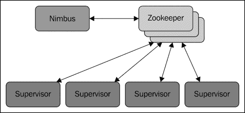
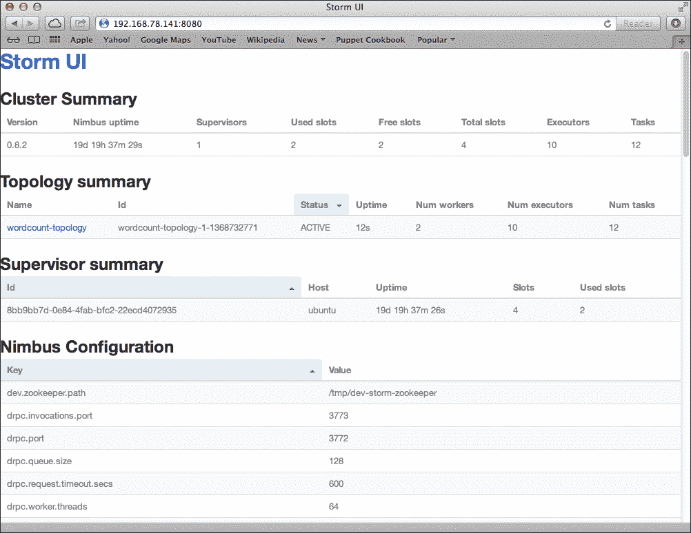
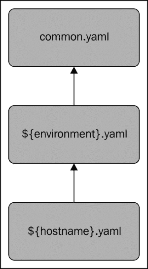

# 第二章：配置 Storm 集群

在这一章中，您将深入了解 Storm 技术栈、其软件依赖关系以及设置和部署到 Storm 集群的过程。

我们将从在伪分布模式下安装 Storm 开始，其中所有组件都位于同一台机器上，而不是分布在多台机器上。一旦您了解了安装和配置 Storm 所涉及的基本步骤，我们将继续使用 Puppet 配置工具自动化这些过程，这将大大减少设置多节点集群所需的时间和精力。

具体来说，我们将涵盖：

+   组成集群的各种组件和服务

+   Storm 技术栈

+   在 Linux 上安装和配置 Storm

+   Storm 的配置参数

+   Storm 的命令行界面

+   使用 Puppet 配置工具自动化安装

# 介绍 Storm 集群的解剖

Storm 集群遵循类似于 Hadoop 等分布式计算技术的主/从架构，但语义略有不同。在主/从架构中，通常有一个主节点，可以通过配置静态分配或在运行时动态选举。Storm 使用前一种方法。虽然主/从架构可能会被批评为引入单点故障的设置，但我们将展示 Storm 对主节点故障具有一定的容错性。

Storm 集群由一个主节点（称为**nimbus**）和一个或多个工作节点（称为**supervisors**）组成。除了 nimbus 和 supervisor 节点外，Storm 还需要一个 Apache ZooKeeper 的实例，它本身可能由一个或多个节点组成，如下图所示：



nimbus 和 supervisor 进程都是 Storm 提供的守护进程，不需要从单独的机器中隔离出来。事实上，可以在同一台机器上运行 nimbus、supervisor 和 ZooKeeper 进程，从而创建一个单节点伪集群。

## 了解 nimbus 守护程序

nimbus 守护程序的主要责任是管理、协调和监视在集群上运行的拓扑，包括拓扑部署、任务分配以及在失败时重新分配任务。

将拓扑部署到 Storm 集群涉及*提交*预打包的拓扑 JAR 文件到 nimbus 服务器以及拓扑配置信息。一旦 nimbus 收到拓扑归档，它会将 JAR 文件分发给必要数量的 supervisor 节点。当 supervisor 节点收到拓扑归档时，nimbus 会为每个 supervisor 分配任务（spout 和 bolt 实例）并向它们发出信号，以生成执行分配任务所需的工作节点。

Nimbus 跟踪所有 supervisor 节点的状态以及分配给每个节点的任务。如果 nimbus 检测到特定的 supervisor 节点未能心跳或变得不可用，它将重新分配该 supervisor 的任务到集群中的其他 supervisor 节点。

如前所述，nimbus 在严格意义上并不是单点故障。这一特性是因为 nimbus 并不参与拓扑数据处理，而仅仅管理拓扑的初始部署、任务分配和监视。事实上，如果 nimbus 守护程序在拓扑运行时死机，只要分配任务的 supervisors 和 workers 保持健康，拓扑将继续处理数据。主要的警告是，如果 nimbus 宕机时 supervisor 失败，数据处理将失败，因为没有 nimbus 守护程序将失败的 supervisor 任务重新分配到另一个节点。

## 与监督守护程序一起工作

supervisor 守护程序等待来自 nimbus 的任务分配，并生成和监视工作进程（JVM 进程）来执行任务。supervisor 守护程序和它生成的工作进程都是单独的 JVM 进程。如果由 supervisor 生成的工作进程由于错误意外退出（甚至如果进程被强制使用 UNIX 的`kill -9`或 Windows 的`taskkill`命令终止），supervisor 守护程序将尝试重新生成工作进程。

此时，您可能想知道 Storm 的可靠交付功能如何适应其容错模型。如果一个 worker 甚至整个 supervisor 节点失败，Storm 如何保证在故障发生时正在处理的元组的交付？

答案在于 Storm 的元组锚定和确认机制。启用可靠交付后，路由到失败节点上的任务的元组将不会被确认，并且原始元组最终将在超时后由 spout 重新播放。这个过程将重复，直到拓扑已经恢复并且正常处理已经恢复。

## 介绍 Apache ZooKeeper

ZooKeeper 提供了在分布式环境中维护集中信息的服务，使用一小组基本原语和组服务。它具有简单而强大的分布式同步机制，允许客户端应用程序监视或订阅单个数据或数据集，并在创建、更新或修改数据时接收通知。使用常见的 ZooKeeper 模式或配方，开发人员可以实现分布式应用程序所需的许多不同构造，如领导者选举、分布式锁和队列。

Storm 主要使用 ZooKeeper 来协调任务分配、worker 状态和集群中 nimbus 和 supervisor 之间的拓扑指标等状态信息。Nimbus 和 supervisor 节点之间的通信主要通过 ZooKeeper 的状态修改和监视通知来处理。

Storm 对 ZooKeeper 的使用设计上相对轻量，并不会产生沉重的资源负担。对于较重的数据传输操作，例如拓扑 JAR 文件的一次性（在部署时）传输，Storm 依赖于 Thrift 进行通信。正如我们将看到的，拓扑中组件之间的数据传输操作——在性能最重要的地方——是在低级别处理并针对性能进行了优化。

## 使用 Storm 的 DRPC 服务器

Storm 应用程序中常见的模式涉及利用 Storm 的并行化和分布式计算能力，其中客户端进程或应用程序在请求-响应范式中提交请求并同步等待响应。虽然这样的范式似乎与典型 Storm 拓扑的高度异步、长寿命的特性相悖，但 Storm 包括了一种事务能力，可以实现这样的用例。

使用 Storm 的 DRPC 服务器

为了启用这个功能，Storm 使用了额外的服务（Storm DRPC）和一个专门的 spout 和 bolt，它们共同提供了高度可扩展的分布式 RPC 功能。

Storm 的 DRPC 功能的使用是完全可选的。只有当 Storm 应用程序利用此功能时，才需要 DRPC 服务器节点。

## 介绍 Storm UI

Storm UI 是一个可选的，但非常有用的服务，它提供了一个基于 Web 的 GUI，用于监视 Storm 集群并在一定程度上管理运行中的拓扑。Storm UI 为给定的 Storm 集群及其部署的拓扑提供统计信息，在监视和调整集群和拓扑性能时非常有用。

介绍 Storm UI

Storm UI 只报告从 nimbus thrift API 获取的信息，并不向 Storm 集群提供任何其他功能。Storm UI 服务可以随时启动和停止，而不会影响任何拓扑或集群功能，在这方面它是完全无状态的。它还可以配置为启动、停止、暂停和重新平衡拓扑，以便进行简单的管理。

# 介绍 Storm 技术栈

在我们开始安装 Storm 之前，让我们先看看 Storm 和拓扑构建的技术。

## Java 和 Clojure

Storm 在 Java 虚拟机上运行，并且大致上由 Java 和 Clojure 的组合编写。Storm 的主要接口是用 Java 定义的，核心逻辑大部分是用 Clojure 实现的。除了 JVM 语言，Storm 还使用 Python 来实现 Storm 可执行文件。除了这些语言，Storm 还是一种高度多语言友好的技术，部分原因是它的一些接口使用了 Apache Thrift。

Storm 拓扑的组件（spouts 和 bolts）可以用安装它的操作系统支持的几乎任何编程语言编写。JVM 语言实现可以本地运行，其他实现可以通过 JNI 和 Storm 的多语言协议实现。

## Python

所有 Storm 守护程序和管理命令都是从一个用 Python 编写的单个可执行文件运行的。这包括 nimbus 和 supervisor 守护程序，以及我们将看到的所有部署和管理拓扑的命令。因此，在参与 Storm 集群的所有机器上以及用于管理目的的任何工作站上都需要安装一个正确配置的 Python 解释器。

# 在 Linux 上安装 Storm

Storm 最初设计为在类 Unix 操作系统上运行，但从版本 0.9.1 开始，它也支持在 Windows 上部署。

为了我们的目的，我们将使用 Ubuntu 12.04 LTS，因为它相对容易使用。我们将使用服务器版本，默认情况下不包括图形用户界面，因为我们不需要也不会使用它。Ubuntu 12.04 LTS 服务器可以从[`releases.ubuntu.com/precise/ubuntu-12.04.2-server-i386.iso`](http://releases.ubuntu.com/precise/ubuntu-12.04.2-server-i386.iso)下载。

接下来的指令在实际硬件和虚拟机上同样有效。为了学习和开发的目的，如果你没有准备好的网络计算机，使用虚拟机会更加方便。

虚拟化软件可以在 OSX，Linux 和 Windows 上轻松获得。我们推荐以下任何一种软件选项：

+   VMWare（OSX，Linux 和 Windows）

这个软件需要购买。它可以在[`www.vmware.com`](http://www.vmware.com)上获得。

+   VirtualBox（OSX，Linux 和 Windows）

这个软件是免费提供的。它可以在[`www.virtualbox.org`](https://www.virtualbox.org)上获得。

+   Parallels Desktop（OSX）

这个软件需要购买。它可以在[`www.parallels.com`](http://www.parallels.com)上获得。

## 安装基本操作系统

你可以从 Ubuntu 安装光盘（或光盘镜像）启动，并按照屏幕上的指示进行基本安装。当**Package Selection**屏幕出现时，选择安装 OpenSSH Server 选项。这个软件包将允许你使用`ssh`远程登录服务器。在其他情况下，除非你选择对硬件进行特定修改，否则可以接受默认选项。

在 Ubuntu 下，默认情况下，主要用户将具有管理（sudo）权限。如果你使用不同的用户账户或 Linux 发行版，请确保你的账户具有管理权限。

## 安装 Java

首先，安装 JVM。已知 Storm 可以与来自开源 OpenJDK 和 Oracle 的 Java 1.6 和 1.7 JVM 一起工作。在这个例子中，我们将更新 apt 存储库信息并安装 Java 1.6 的 OpenJDK 发行版：

```scala
sudo apt-get update
sudo apt-get --yes install openjdk-6-jdk

```

## ZooKeeper 安装

对于我们的单节点伪集群，我们将在所有其他 Storm 组件旁边安装 ZooKeeper。Storm 目前需要版本 3.3.x，因此我们将安装该版本而不是最新版本，使用以下命令：

```scala
sudo apt-get --yes install zookeeper=3.3.5* zookeeperd=3.3.5*

```

这个命令将安装 ZooKeeper 二进制文件以及启动和停止 ZooKeeper 的服务脚本。它还将创建一个定期清除旧的 ZooKeeper 事务日志和快照文件的 cron 作业，如果不定期清除，这些文件将迅速占用大量磁盘空间，因为这是 ZooKeeper 的默认行为。

## 风暴安装

Storm 的二进制发行版可以从 Storm 网站([`storm.incubator.apache.org`](http://storm.incubator.apache.org))下载。二进制存档的布局更适合开发活动，而不是运行生产系统，因此我们将对其进行一些修改，以更紧密地遵循 UNIX 约定（例如将日志记录到`/var/log`而不是 Storm 的主目录）。

我们首先创建一个 Storm 用户和组。这将允许我们以特定用户而不是默认或根用户运行 Storm 守护进程：

```scala
sudo groupadd storm
sudo useradd --gid storm --home-dir /home/storm --create-home --shell /bin/bash storm

```

接下来，下载并解压 Storm 分发版。我们将在`/usr/share`中安装 Storm，并将特定版本的目录链接到`/usr/share/storm`。这种方法可以让我们轻松安装其他版本，并通过更改单个符号链接来激活（或恢复）新版本。我们还将 Storm 可执行文件链接到`/usr/bin/storm`：

```scala
sudo wget [storm download URL]
sudo unzip -o apache-storm-0.9.1-incubating.zip -d /usr/share/
sudo ln -s /usr/share/apache-storm-0.9.1-incubating /usr/share/storm
sudo ln -s /usr/share/storm/bin/storm /usr/bin/storm

```

默认情况下，Storm 将日志信息记录到`$STORM_HOME/logs`而不是大多数 UNIX 服务使用的`/var/log`目录。要更改这一点，执行以下命令在`/var/log/`下创建`storm`目录，并配置 Storm 将其日志数据写入那里：

```scala
sudo mkdir /var/log/storm
sudo chown storm:storm /var/log/storm

sudo sed -i 's/${storm.home}\/logs/\/var\/log\/storm/g' /usr/share/storm/log4j/storm.log.properties

```

最后，我们将 Storm 的配置文件移动到`/etc/storm`并创建一个符号链接，以便 Storm 可以找到它：

```scala
sudo mkdir /etc/storm
sudo chown storm:storm /etc/storm
sudo mv /usr/share/storm/conf/storm.yaml /etc/storm/
sudo ln -s /etc/storm/storm.yaml /usr/share/storm/conf/storm.yaml

```

安装了 Storm 后，我们现在可以配置 Storm 并设置 Storm 守护进程，使它们可以自动启动。

## 运行 Storm 守护进程

所有 Storm 守护进程都是设计为失败快速的，这意味着每当发生意外错误时，进程将停止。这允许各个组件安全失败并成功恢复，而不影响系统的其他部分。

这意味着 Storm 守护进程需要在它们意外死机时立即重新启动。这种技术称为在*监督*下运行进程，幸运的是有许多可用的实用程序来执行这个功能。事实上，ZooKeeper 也是一个失败快速的系统，而 ZooKeeper Debian 发行版（Ubuntu 是基于 Debian 的发行版）中包含的基于 upstart 的`init`脚本提供了这个功能——如果 ZooKeeper 进程在任何时候异常退出，upstart 将确保它重新启动，以便集群可以恢复。

虽然 Debian 的 upstart 系统非常适合这种情况，但其他 Linux 发行版上也有更简单的选择。为了简化事情，我们将使用大多数发行版上都可以找到的 supervisor 软件包。不幸的是，supervisor 名称与 Storm 的 supervisor 守护进程的名称冲突。为了澄清这一区别，我们将在文本中将非 Storm 进程监督守护进程称为*supervisord*（注意末尾添加的*d*），即使示例代码和命令将使用正确的名称而不添加*d*。

在基于 Debian 的 Linux 发行版中，`supervisord`软件包被命名为 supervisor，而其他发行版如 Red Hat 使用 supervisord 这个名字。要在 Ubuntu 上安装它，请使用以下命令：

```scala
sudo apt-get --yes install supervisor

```

这将安装并启动 supervisord 服务。主配置文件将位于`/etc/supervisor/supervisord.conf`。Supervisord 的配置文件将自动包括`/etc/supervisord/conf.d/`目录中与模式`*.conf`匹配的任何文件，并且这就是我们将放置`config`文件以便在 supervision 下运行 Storm 守护进程的地方。

对于我们想要在监督下运行的每个 Storm 守护进程命令，我们将创建一个包含以下内容的配置文件：

+   用于监督服务的唯一（在 supervisord 配置中）名称。

+   运行的命令。

+   运行命令的工作目录。

+   命令/服务是否应在退出时自动重新启动。对于失败快速的服务，这应该始终为 true。

+   将拥有该进程的用户。在这种情况下，我们将使用 Storm 用户运行所有 Storm 守护进程作为进程所有者。

创建以下三个文件以设置 Storm 守护进程自动启动（并在意外故障时重新启动）：

+   `/etc/supervisord/conf.d/storm-nimbus.conf`

使用以下代码创建文件：

```scala
[program:storm-nimbus]
command=storm nimbus
directory=/home/storm
autorestart=true
user=storm
```

+   `/etc/supervisord/conf.d/storm-supervisor.conf`

使用以下代码创建文件：

```scala
[program:storm-supervisor]
command=storm supervisor
directory=/home/storm
autorestart=true
user=storm
```

+   `/etc/supervisord/conf.d/storm-ui.conf`

使用以下代码创建文件：

```scala
[program:storm-ui]
command=storm ui
directory=/home/storm
autorestart=true
user=storm
```

创建了这些文件后，使用以下命令停止并启动 supervisord 服务：

```scala
sudo /etc/init.d/supervisor stop
sudo /etc/init.d/supervisor start

```

supervisord 服务将加载新的配置并启动 Storm 守护进程。等待一两分钟，然后通过在 Web 浏览器中访问以下 URL（用实际机器的主机名或 IP 地址替换`localhost`）来验证 Storm 伪集群是否已启动并运行：

`http://localhost:8080`

这将启动 Storm UI 图形界面。它应指示集群已经启动，有一个监督节点正在运行，有四个可用的工作槽，并且没有拓扑正在运行（我们稍后将向集群部署拓扑）。

如果由于某种原因 Storm UI 没有启动或未显示集群中的活动监督员，请检查以下日志文件以查找错误：

+   **Storm UI**：检查`/var/log/storm`下的`ui.log`文件以查找错误

+   **Nimbus**：检查`/var/log/storm`下的`nimbus.log`文件以查找错误

+   **Supervisor**：检查`/var/log/storm`下的`supervisor.log`文件以查找错误

到目前为止，我们一直依赖默认的 Storm 配置，该配置默认使用`localhost`作为许多集群主机名参数的值，例如 ZooKeeper 主机以及 nimbus 主节点的位置。这对于单节点伪集群是可以的，其中所有内容都在同一台机器上运行，但是设置真正的多节点集群需要覆盖默认值。接下来，我们将探讨 Storm 提供的各种配置选项以及它们对集群及其拓扑行为的影响。

## 配置 Storm

Storm 的配置由一系列 YAML 属性组成。当 Storm 守护进程启动时，它会加载默认值，然后加载`storm.yaml`（我们已经将其符号链接到`/etc/storm/storm.yaml`）文件在`$STORM_HOME/conf/`下，用默认值替换找到的任何值。

以下列表提供了一个最小的`storm.yaml`文件，其中包含您必须覆盖的条目：

```scala
# List of hosts in the zookeeper cluster
storm.zookeeper.servers:
 - "localhost"

# hostname of the nimbus node
nimbus.host: "localhost"

# supervisor worker ports
supervisor.slots.ports:
 - 6700
 - 6701
 - 6702
 - 6703

# where nimbus and supervisors should store state data
storm.local.dir: "/home/storm"

# List of hosts that are Storm DRPC servers (optional)
# drpc.servers:
#    - "localhost"

```

## 强制设置

以下设置是配置工作的多主机 Storm 集群的强制设置。

+   `storm.zookeeper.servers`：此设置是 ZooKeeper 集群中主机名的列表。由于我们在与其他 Storm 守护进程相同的机器上运行单节点 ZooKeeper，因此`localhost`的默认值是可以接受的。

+   `nimbus.host`：这是集群 nimbus 节点的主机名。工作节点需要知道哪个节点是主节点，以便下载拓扑 JAR 文件和配置。

+   `supervisor.slots.ports`: 此设置控制在 supervisor 节点上运行多少个工作进程。它被定义为工作进程将监听的端口号列表，列出的端口号数量将控制 supervisor 节点上可用的工作槽位数量。例如，如果我们有一个配置了三个端口的三个 supervisor 节点的集群，那么集群将有总共九个（3 * 3 = 9）工作槽位。默认情况下，Storm 将使用端口 6700-6703，每个 supervisor 节点有四个槽位。

+   `storm.local.dir`: nimbus 和 supervisor 守护程序都存储少量临时状态信息以及工作进程所需的 JAR 和配置文件。此设置确定 nimbus 和 supervisor 进程将存储该信息的位置。此处指定的目录必须存在，并具有适当的权限，以便进程所有者（在我们的情况下是 Storm 用户）可以读取和写入该目录。该目录的内容必须在集群运行期间持久存在，因此最好避免使用`/tmp`，因为其中的内容可能会被操作系统删除。

## 可选设置

除了对操作集群必需的设置之外，还有一些其他设置可能需要覆盖。Storm 配置设置遵循点分命名约定，其中前缀标识了设置的类别；这在下表中有所体现：

| 前缀 | 类别 |
| --- | --- |
| `storm.*` | 通用配置 |
| `nimbus.*` | Nimbus 配置 |
| `ui.*` | Storm UI 配置 |
| `drpc.*` | DRPC 服务器配置 |
| `supervisor.*` | Supervisor 配置 |
| `worker.*` | Worker 配置 |
| `zmq.*` | ZeroMQ 配置 |
| `topology.*` | 拓扑配置 |

要查看可用的默认配置设置的完整列表，请查看 Storm 源代码中的`defaults.yaml`文件（[`github.com/nathanmarz/storm/blob/master/conf/defaults.yaml`](https://github.com/nathanmarz/storm/blob/master/conf/defaults.yaml)）。以下是一些经常被覆盖的设置：

+   `nimbus.childopts` (默认值: "-Xmx1024m"): 这是在启动 nimbus 守护程序时将添加到 Java 命令行的 JVM 选项列表。

+   `ui.port` (默认值: 8080): 这指定了 Storm UI web 服务器的监听端口。

+   `ui.childopts` (默认值: "-Xmx1024m"): 这指定了在启动 Storm UI 服务时将添加到 Java 命令行的 JVM 选项。

+   `supervisor.childopts` (默认值: "-Xmx1024m"): 这指定了在启动 supervisor 守护程序时将添加到 Java 命令行的 JVM 选项。

+   `worker.childopts` (默认值: "-Xmx768m"): 这指定了在启动 worker 进程时将添加到 Java 命令行的 JVM 选项。

+   `topology.message.timeout.secs` (默认值: 30): 这配置了元组在被确认（完全处理）之前的最长时间（以秒为单位），在此时间内未确认的元组将被视为失败（超时）。将此值设置得太低可能会导致元组被重复重放。要使此设置生效，必须配置 spout 以发出锚定元组。

+   `topology.max.spout.pending` (默认值: null): 默认值为 null 时，Storm 将从 spout 尽可能快地流出元组。根据下游 bolt 的执行延迟，默认行为可能会使拓扑不堪重负，导致消息超时。将此值设置为大于 0 的非 null 数字将导致 Storm 暂停从 spout 流出元组，直到未完成的元组数量下降到该数字以下，从而限制了 spout 的流量。在调整拓扑性能时，此设置与`topology.message.timeout.secs`一起是最重要的两个参数之一。

+   `topology.enable.message.timeouts`（默认值：true）：这设置了锚定元组的超时行为。如果为 false，则锚定元组不会超时。谨慎使用此设置。在将其设置为 false 之前，请考虑修改`topology.message.timeout.secs`。要使此设置生效，必须配置一个 spout 以发射锚定元组。

## Storm 可执行文件

Storm 可执行文件是一个多用途命令，用于从启动 Storm 守护程序到执行拓扑管理功能，例如将新的拓扑部署到集群中，或者在开发和测试阶段以本地模式运行拓扑。

Storm 命令的基本语法如下：

```scala
storm [command] [arguments...]
```

## 在工作站上设置 Storm 可执行文件

对于运行连接到远程集群的 Storm 命令，您需要在本地安装 Storm 分发版。在工作站上安装分发版很简单；只需解压 Storm 分发版存档，并将 Storm bin 目录（`$STORM_HOME/bin`）添加到您的`PATH`环境变量中。接下来，在`~/.storm/`下创建`storm.yaml`文件，其中包含一行告诉 Storm 在哪里找到要与之交互的集群的 nimbus 服务器：

```scala
Sample: ~/.storm/storm.yaml file.
nimbus.host: "nimbus01."

```

### 提示

为了使 Storm 集群正常运行，必须正确设置 IP 地址名称解析，可以通过 DNS 系统或`/etc`下的`hosts`文件进行设置。

虽然在 Storm 的配置中可以使用 IP 地址代替主机名，但最好使用 DNS 系统。

## 守护程序命令

Storm 的守护程序命令用于启动 Storm 服务，并且应该在监督下运行，以便在发生意外故障时重新启动。启动时，Storm 守护程序从`$STORM_HOME/conf/storm.yaml`读取配置。此文件中的任何配置参数都将覆盖 Storm 的内置默认值。

### Nimbus

用法：`storm nimbus`

这将启动 nimbus 守护程序。

### Supervisor

用法：`storm supervisor`

这将启动监督守护程序。

### UI

用法：`storm ui`

这将启动提供用于监视 Storm 集群的基于 Web 的 UI 的 Storm UI 守护程序。

### DRPC

用法：`storm drpc`

这将启动 DRPC 守护程序。

## 管理命令

Storm 的管理命令用于部署和管理在集群中运行的拓扑。管理命令通常从 Storm 集群外的工作站运行。它们与 nimbus Thrift API 通信，因此需要知道 nimbus 节点的主机名。管理命令从`~/.storm/storm.yaml`文件中查找配置，并将 Storm 的 jar 附加到类路径上。唯一必需的配置参数是 nimbus 节点的主机名：

```scala
nimbus.host: "nimbus01"

```

### Jar

用法：`storm jar topology_jar topology_class [arguments...]`

`jar`命令用于将拓扑提交到集群。它运行`topology_class`的`main()`方法，并使用指定的参数上传`topology_jar`文件到 nimbus 以分发到集群。一旦提交，Storm 将激活拓扑并开始处理。

拓扑类中的`main()`方法负责调用`StormSubmitter.submitTopology()`方法，并为拓扑提供一个在集群中唯一的名称。如果集群中已经存在具有该名称的拓扑，则`jar`命令将失败。通常的做法是在命令行参数中指定拓扑名称，以便在提交时为拓扑命名。

### Kill

用法：`storm kill topology_name [-w wait_time]`

`kill`命令用于取消部署。它会杀死名为`topology_name`的拓扑。Storm 将首先停用拓扑的喷口，持续时间为拓扑配置的`topology.message.timeout.secs`，以允许所有正在处理的元组完成。然后，Storm 将停止工作进程，并尝试清理任何保存的状态。使用`-w`开关指定等待时间将覆盖`topology.message.timeout.secs`为指定的间隔。

`kill`命令的功能也可以在 Storm UI 中使用。

### 停用

用法：`storm deactivate topology_name`

`deactivate`命令告诉 Storm 停止从指定拓扑的喷口流元组。

也可以从 Storm UI 停用拓扑。

### 激活

用法：`storm activate topology_name`

`activate`命令告诉 Storm 从指定拓扑的喷口恢复流元组。

也可以从 Storm UI 重新激活拓扑。

### 重新平衡

用法：`storm rebalance topology_name [-w wait_time] [-n worker_count] [-e component_name=executer_count]`...

`rebalance`命令指示 Storm 在集群中重新分配任务，而无需杀死和重新提交拓扑。例如，当向集群添加新的监督节点时，可能需要这样做——因为它是一个新节点，现有拓扑的任何任务都不会分配给该节点上的工作进程。

`rebalance`命令还允许您使用`-n`和`-e`开关更改分配给拓扑的工作进程数量，并分别更改分配给给定任务的执行器数量。

运行`rebalance`命令时，Storm 将首先停用拓扑，等待配置的时间以完成未完成的元组处理，然后在监督节点之间均匀重新分配工作进程。重新平衡后，Storm 将拓扑返回到其先前的激活状态（也就是说，如果它被激活了，Storm 将重新激活它，反之亦然）。

以下示例将使用等待时间为 15 秒重新平衡名为`wordcount-topology`的拓扑，为该拓扑分配五个工作进程，并分别设置`sentence-spout`和`split-bolt`使用 4 和 8 个执行线程：

```scala
storm rebalance wordcount-topology -w 15 -n 5 -e sentence-spout=4 -e split-bolt=8
```

### Remoteconfvalue

用法：`storm remoteconfvalue conf-name`

`remoteconfvalue`命令用于查找远程集群上的配置参数。请注意，这适用于全局集群配置，并不考虑在拓扑级别进行的个别覆盖。

## 本地调试/开发命令

Storm 的本地命令是用于调试和测试的实用程序。与管理命令一样，Storm 的调试命令读取`~/.storm/storm.yaml`并使用这些值来覆盖 Storm 的内置默认值。

### REPL

用法：`storm repl`

`repl`命令打开一个配置了 Storm 本地类路径的 Clojure REPL 会话。

### 类路径

用法：`storm classpath`

`classpath`命令打印 Storm 客户端使用的类路径。

### 本地配置值

用法：`storm localconfvalue conf-name`

`localconfvalue`命令从合并配置中查找配置键，即从`~/.storm/storm.yaml`和 Storm 的内置默认值中查找。

# 向 Storm 集群提交拓扑

现在我们有了一个运行中的集群，让我们重新审视之前的单词计数示例，并修改它，以便我们可以将其部署到集群，并在本地模式下运行。之前的示例使用了 Storm 的`LocalCluster`类在本地模式下运行：

```scala
LocalCluster cluster = new LocalCluster();
            cluster.submitTopology(TOPOLOGY_NAME, config, builder.createTopology());
```

向远程集群提交拓扑只是使用 Storm 的`StormSubmitter`类的方法，该方法具有相同的名称和签名：

```scala
StormSubmitter.submitTopology(TOPOLOGY_NAME, config, builder.createTopology());
```

在开发 Storm 拓扑时，通常不希望更改代码并重新编译它们以在本地模式和部署到集群之间切换。处理这种情况的标准方法是添加一个 if/else 块，根据命令行参数来确定。在我们更新的示例中，如果没有命令行参数，我们在本地模式下运行拓扑；否则，我们使用第一个参数作为拓扑名称并将其提交到集群，如下面的代码所示：

```scala
public class WordCountTopology {

    private static final String SENTENCE_SPOUT_ID = "sentence-spout";
    private static final String SPLIT_BOLT_ID = "split-bolt";
    private static final String COUNT_BOLT_ID = "count-bolt";
    private static final String REPORT_BOLT_ID = "report-bolt";
    private static final String TOPOLOGY_NAME = "word-count-topology";

    public static void main(String[] args) throws Exception {

        SentenceSpout spout = new SentenceSpout();
        SplitSentenceBolt splitBolt = new SplitSentenceBolt();
        WordCountBolt countBolt = new WordCountBolt();
        ReportBolt reportBolt = new ReportBolt();

        TopologyBuilder builder = new TopologyBuilder();

        builder.setSpout(SENTENCE_SPOUT_ID, spout, 2);
        // SentenceSpout --> SplitSentenceBolt
        builder.setBolt(SPLIT_BOLT_ID, splitBolt, 2)
                .setNumTasks(4)
                .shuffleGrouping(SENTENCE_SPOUT_ID);
        // SplitSentenceBolt --> WordCountBolt
        builder.setBolt(COUNT_BOLT_ID, countBolt, 4)
                .fieldsGrouping(SPLIT_BOLT_ID, new Fields("word"));
        // WordCountBolt --> ReportBolt
        builder.setBolt(REPORT_BOLT_ID, reportBolt)
                .globalGrouping(COUNT_BOLT_ID);

        Config config = new Config();
        config.setNumWorkers(2);

        if(args.length == 0){
            LocalCluster cluster = new LocalCluster();
            cluster.submitTopology(TOPOLOGY_NAME, config, builder.createTopology());
            waitForSeconds(10);
            cluster.killTopology(TOPOLOGY_NAME);
            cluster.shutdown();
        } else{
            StormSubmitter.submitTopology(args[0], config, builder.createTopology());
        }
    }
}
```

要将更新的单词计数拓扑部署到运行的集群中，首先在`第二章`源代码目录中执行 Maven 构建：

```scala
mvn clean install

```

接下来，运行`storm jar`命令来部署拓扑：

```scala
storm jar ./target/Chapter1-1.0-SNAPSHOT.jar storm.blueprints.chapter1.WordCountTopology wordcount-topology

```

当命令完成时，您应该在 Storm UI 中看到拓扑变为活动状态，并能够点击拓扑名称进行详细查看和查看拓扑统计信息。



# 自动化集群配置

到目前为止，我们已经从命令行手动配置了单节点伪集群。虽然这种方法在小集群中当然有效，但随着集群规模的增加，它将很快变得不可行。考虑需要配置由数十、数百甚至数千个节点组成的集群的情况。配置任务可以使用 shell 脚本自动化，但即使是基于 shell 脚本的自动化解决方案在可扩展性方面也是值得怀疑的。

幸运的是，有许多技术可用于解决大量受管服务器的配置和配置问题。Chef 和 Puppet 都提供了一种声明性的配置方法，允许您定义**状态**（即安装了哪些软件包以及它们如何配置）以及机器的**类**（例如，*Apache web 服务器*类机器需要安装 Apache `httpd`守护程序）。

自动化服务器的配置和配置过程是一个非常广泛的主题，远远超出了本书的范围。为了我们的目的，我们将使用 Puppet 并利用其功能的一个子集，希望它能够提供对该主题的基本介绍，并鼓励进一步探索。

# Puppet 的快速介绍

Puppet ([`puppetlabs.com`](https://puppetlabs.com))是一个 IT 自动化框架，它帮助系统管理员使用灵活的声明性方法管理大型网络基础设施资源。

Puppet 的核心是描述基础设施资源期望状态的*清单*概念。在 Puppet 术语中，状态可以包括以下内容：

+   安装了哪些软件包

+   哪些服务正在运行，哪些没有

+   软件配置细节

## Puppet 清单

Puppet 使用声明性基于 Ruby 的 DSL 来描述文件集合中的系统配置，这些文件集合称为清单。ZooKeeper 的一个示例 Puppet 清单如下所示：

```scala
    package { 'zookeeper':
        ensure => "3.3.5*",
    }
    package { 'zookeeperd':
        ensure => "3.3.5*",
        require => Package["zookeeper"],
    }

    service { 'zookeeperd':
        ensure => 'running',
        require => Package["zookeeperd"],
    }
```

这个简单的清单可以用来确保 ZooKeeper 作为服务安装并且服务正在运行。第一个软件包块告诉 Puppet 使用操作系统的软件包管理器（例如，Ubuntu/Debian 的 apt-get，Red Hat 的 yum 等）来确保安装 zookeeper 软件包的 3.3.5 版本。第二个软件包块确保安装了 zookeeperd 软件包；它要求 zookeeper 软件包已经安装。最后，`service`块告诉 Puppet 应该确保 zookeeperd 系统服务正在运行，并且该服务需要 zookeeperd 软件包已安装。

为了说明 Puppet 清单如何转换为已安装的软件和系统状态，让我们安装 Puppet 并使用前面的示例来安装和启动 zookeeperd 服务。

要获取 Puppet 的最新版本，我们需要配置 apt-get 以使用 Puppet 实验室存储库。执行以下命令来这样做并安装最新版本的 puppet：

```scala
wget http://apt.puppetlabs.com/puppetlabs-release-precise.deb
sudo dpkg -i puppetlabs-release-precise.deb
sudo apt-get update
```

接下来，将前面的示例清单保存到名为`init.pp`的文件中，并使用 Puppet 应用该清单：

```scala
sudo puppet apply init.pp

```

命令完成后，检查 zookeeper 服务是否实际在运行：

```scala
service zookeeper status

```

如果我们手动停止 zookeeper 服务并重新运行`puppet apply`命令，Puppet 不会再次安装包（因为它们已经存在）；然而，它会重新启动 zookeeper 服务，因为清单中定义的状态将服务定义为*运行*。

## Puppet 类和模块

虽然独立的 Puppet 清单使得定义单个资源的状态变得容易，但当您管理的资源数量增加时，这种方法很快就会变得难以控制。

幸运的是，Puppet 有类和模块的概念，可以更好地组织和隔离特定的配置细节。

考虑一种 Storm 的情况，我们有多个节点类。例如，Storm 集群中的一个节点可能是 nimbus 节点、supervisor 节点或两者兼有。Puppet 类和模块提供了一种区分多个配置角色的方法，您可以混合和匹配以轻松定义执行多个角色的网络资源。

为了说明这种能力，让我们重新审视一下我们用来安装 zookeeper 包的清单，并重新定义它为一个可以被重复使用并包含在多个类类型和清单中的类：

```scala
class zookeeper {

    include 'jdk'

    package { 'zookeeper':
        ensure => "3.3.5*",
    }
    package { 'zookeeperd':
        ensure => "3.3.5*",
        require => Package["zookeeper"],
    }

    service { 'zookeeperd':
        ensure => 'running',
        require => Package["zookeeperd"],
    }
}
```

在前面的示例中，我们重新定义了 zookeeper 清单为一个`puppet`类，可以在其他类和清单中使用。在第二行，`zookeeper`类包含另一个类`jdk`，它将包含一个资源的类定义，该资源将包含需要 Java JDK 的机器的状态。

## Puppet 模板

Puppet 还利用了 Ruby ERB 模板系统，允许您为将在 Puppet 应用清单文件时填充的各种文件定义模板。Puppet ERB 模板中的占位符是将在 Puppet 运行时评估和替换的 Ruby 表达式和结构。ERB 模板中的 Ruby 代码可以完全访问清单文件中定义的 Puppet 变量。

考虑以下 Puppet 文件声明，用于生成`storm.yaml`配置文件：

```scala
    file { "storm-etc-config":
        path => "/etc/storm/storm.yaml",
        ensure => file,
        content => template("storm/storm.yaml.erb"),
        require => [File['storm-etc-config-dir'], File['storm-share-symlink']],
    }
```

此声明告诉 Puppet 从`storm.yaml.erb`模板创建文件`storm.yaml`，放在`/etc/storm/`下：

```scala
storm.zookeeper.servers:
<% @zookeeper_hosts.each do |host| -%>
     - <%= host %>
<% end -%>

nimbus.host: <%= @nimbus_host %>

storm.local.dir: <%= @storm_local_dir %>

<% if @supervisor_ports != 'none' %>
supervisor.slots.ports:
<% @supervisor_ports.each do |port| -%>
    - <%= port %>
<% end -%>
<% end %>

<% if @drpc_servers != 'none' %>
<% @drpc_servers.each do |drpc| -%>
    - <%= drpc %>
<% end -%>
<% end %>
```

模板中的条件逻辑和变量扩展允许我们定义一个可以用于许多环境的单个文件。例如，如果我们正在配置的环境没有任何 Storm DRPC 服务器，那么生成的`storm.yaml`文件的`drpc.servers`部分将被省略。

## 使用 Puppet Hiera 管理环境

我们简要介绍了 Puppet 清单、类和模板的概念。此时，您可能想知道如何在 puppet 类或清单中定义变量。在`puppet`类或清单中定义变量非常简单；只需在清单或类定义的开头定义如下：

```scala
$java_version = "1.6.0"

```

一旦定义，`java_version`变量将在整个类或清单定义以及任何 ERB 模板中可用；然而，这里存在一个可重用性的缺点。如果我们硬编码诸如版本号之类的信息，实际上就限制了我们的类的重用，使其固定在一个硬编码的值上。如果我们能够将所有可能频繁更改的变量外部化，使配置管理更易于维护，那将更好。这就是 Hiera 发挥作用的地方。

## 介绍 Hiera

Hiera 是一个键值查找工具，已集成到 Puppet 框架的最新版本中。Hiera 允许您定义键值层次结构（因此得名），使得父定义源中的键可以被子定义源覆盖。

例如，考虑这样一种情况，我们正在为将参与 Storm 集群的多台机器定义配置参数。所有机器将共享一组常见的键值，例如我们想要使用的 Java 版本。因此，我们将在一个名为“`common.yaml`”的文件中定义这些值。

从那里开始，事情开始分歧。我们可能有单节点伪集群的环境，也可能有多节点的环境。因此，我们希望将特定于环境的配置值存储在诸如“`single-node.yaml`”和“`cluster.yaml`”之类的单独文件中。

最后，我们希望将真实的特定于主机的信息存储在遵循命名约定“**[hostname].yaml**”的文件中。



Puppet 的 Hiera 集成允许您这样做，并使用内置的 Puppet 变量来适当地解析文件名。

`第二章`源代码目录中的示例演示了如何实现这种组织形式。

一个典型的`common.yaml`文件可能定义了所有主机共有的全局属性，如下所示：

```scala
storm.version: apache-storm-0.9.1-incubating

# options are oracle-jdk, openjdk
jdk.vendor: openjdk
# options are 6, 7, 8
jdk.version: 7
```

在环境级别，我们可能希望区分*独立*和*集群*配置，这种情况下，`cluster.yaml`文件可能如下所示：

```scala
# hosts entries for name resolution (template params for /etc/hosts)
hosts:
   nimbus01: 192.168.1.10
   zookeeper01: 192.168.1.11
   supervisor01: 192.168.1.12
   supervisor02: 192.168.1.13
   supervisor04: 192.168.1.14

storm.nimbus.host: nimbus01

storm.zookeeper.servers:
     - zookeeper01

storm.supervisor.slots.ports:
     - 6700
     - 6701
     - 6702
     - 6703
     - 6705
```

最后，我们可能希望在使用命名约定[hostname].yaml 的文件中定义特定于主机的参数，并定义应该应用于该节点的 Puppet 类。

对于`nimbus01.yaml`，请使用以下代码：

```scala
# this node only acts as a nimus node
classes:
    - nimbus
```

对于`zookeeper01.yaml`，请使用以下代码：

```scala
# this node is strictly a zookeeper node
classes:
    - zookeeper
```

我们只是触及了 Puppet 和 Hiera 可能性的表面。`第二章`源代码目录包含了有关如何使用 Puppet 自动化部署和配置任务的其他示例和文档。

# 总结

在这一章中，我们已经介绍了在单节点（伪分布式）配置以及完全分布式多节点配置中安装和配置 Storm 所需的步骤。我们还向您介绍了用于部署和管理运行拓扑的 Storm 守护程序和命令行实用程序。

最后，我们简要介绍了 Puppet 框架，并展示了如何使用它来管理多个环境配置。

我们鼓励您探索附带下载中包含的附加代码和文档。

在下一章中，我们将介绍 Trident，这是一个在 Storm 之上用于事务和状态管理的高级抽象层。
