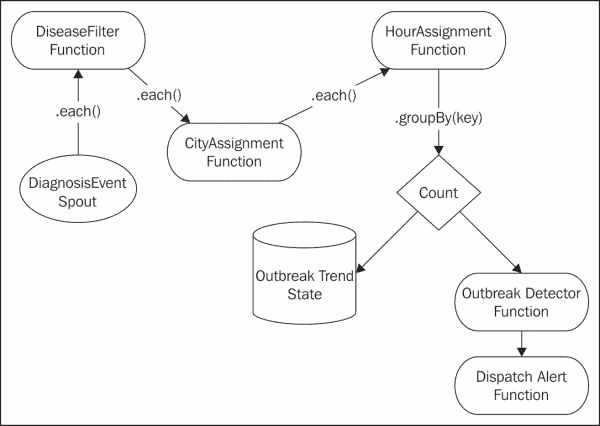
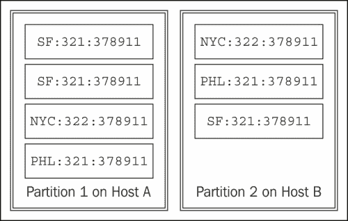
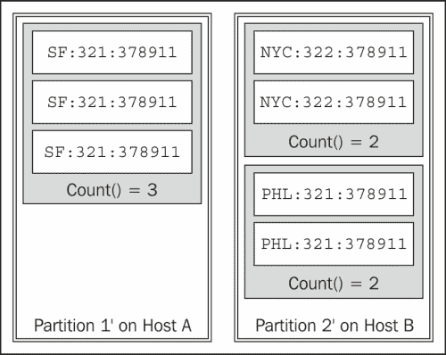

# 第三章：Trident 拓扑结构和传感器数据

在本章中，我们将探讨 Trident 拓扑结构。Trident 在 Storm 之上提供了一个更高级的抽象。Trident 抽象了事务处理和状态管理的细节。具体来说，Trident 将元组批处理成一组离散的事务。此外，Trident 提供了允许拓扑对数据执行操作的抽象，如函数、过滤器和聚合。

我们将使用传感器数据作为示例，以更好地理解 Trident。通常，传感器数据形成从许多不同位置读取的流。一些传统的例子包括天气或交通信息，但这种模式延伸到各种来源。例如，运行在手机上的应用程序会生成大量的事件信息。处理来自手机的事件流是传感器数据处理的另一个实例。

传感器数据包含许多设备发出的事件，通常形成一个永无止境的流。这是 Storm 的一个完美用例。

在本章中，我们将涵盖：

+   Trident 拓扑结构

+   Trident 喷泉

+   Trident 操作-过滤器和函数

+   Trident 聚合器-组合器和减少器

+   Trident 状态

# 审查我们的用例

为了更好地理解 Trident 拓扑结构以及使用传感器数据的 Storm，我们将实现一个 Trident 拓扑结构，用于收集医疗报告以识别疾病的爆发。

拓扑结构将处理包含以下信息的诊断事件：

| 纬度 | 经度 | 时间戳 | 诊断代码（ICD9-CM） |
| --- | --- | --- | --- |
| 39.9522 | -75.1642 | 2013 年 3 月 13 日下午 3:30 | 320.0（血友病性脑膜炎） |
| 40.3588 | -75.6269 | 2013 年 3 月 13 日下午 3:50 | 324.0（颅内脓肿） |

每个事件将包括发生地点的全球定位系统（GPS）坐标。纬度和经度以十进制格式指定。事件还包含 ICD9-CM 代码，表示诊断和事件的时间戳。完整的 ICD-9-CM 代码列表可在以下网址找到：

[`www.icd9data.com/`](http://www.icd9data.com/.) .

为了检测疫情爆发，系统将计算在指定时间段内特定疾病代码在地理位置内的发生次数。为了简化这个例子，我们将每个诊断事件映射到最近的城市。在一个真实的系统中，你很可能会对事件进行更复杂的地理空间聚类。

同样，对于这个例子，我们将按小时自纪元以来对发生次数进行分组。在一个真实的系统中，你很可能会使用滑动窗口，并计算相对移动平均值的趋势。

最后，我们将使用一个简单的阈值来确定是否有疫情爆发。如果某个小时的发生次数大于某个阈值，系统将发送警报并派遣国民警卫队。

为了保持历史记录，我们还将持久化每个城市、小时和疾病的发生次数。

# 介绍 Trident 拓扑结构

为了满足这些要求，我们需要在我们的拓扑中计算发生的次数。在使用标准 Storm 拓扑时，这可能会有挑战，因为元组可能会被重放，导致重复计数。正如我们将在接下来的几节中看到的那样，Trident 提供了解决这个问题的基本方法。

我们将使用以下拓扑：



前述拓扑的代码如下：

```scala
public class OutbreakDetectionTopology {

    public static StormTopology buildTopology() {
    TridentTopology topology = new TridentTopology();
    DiagnosisEventSpout spout = new DiagnosisEventSpout();
    Stream inputStream = topology.newStream("event", spout);
    inputStream
    // Filter for critical events.
.each(new Fields("event"), new DiseaseFilter()))

            // Locate the closest city
         .each(new Fields("event"),
               new CityAssignment(), new Fields("city"))

         // Derive the hour segment
         .each(new Fields("event", "city"),
               new HourAssignment(), new Fields("hour",
               "cityDiseaseHour"))

         // Group occurrences in same city and hour
         .groupBy(new Fields("cityDiseaseHour"))

         // Count occurrences and persist the results.
         .persistentAggregate(new OutbreakTrendFactory(),
                              new Count(),
                              new Fields("count"))

         .newValuesStream()

         // Detect an outbreak
         .each(new Fields("cityDiseaseHour", "count"),
               new OutbreakDetector(), new Fields("alert"))

         // Dispatch the alert
         .each(new Fields("alert"),
               new DispatchAlert(), new Fields());

}
}
```

前面的代码显示了不同 Trident 函数之间的连接。首先，`DiagnosisEventSpout`函数发出事件。然后，`DiseaseFilter`函数对事件进行过滤，过滤掉我们不关心的疾病发生。之后，事件与`CityAssignment`函数中的城市相关联。然后，`HourAssignment`函数为事件分配一个小时，并向元组添加一个键，该键包括城市、小时和疾病代码。然后，我们按照这个键进行分组，这使得在拓扑中的`persistAggregate`函数步骤中对这些计数进行计数和持久化。然后，这些计数传递给`OutbreakDetector`函数，该函数对计数进行阈值处理，当超过阈值时发出警报。最后，`DispatchAlert`函数接收警报，记录一条消息，并终止程序。在接下来的部分中，我们将更深入地研究每个步骤。

# 介绍 Trident spout

让我们首先看一下拓扑中的 spout。与 Storm 相比，Trident 引入了**批次**的概念。与 Storm 的 spout 不同，Trident 的 spout 必须以批次形式发出元组。

每个批次都有自己独特的事务标识符。spout 根据其合同的约束确定批次的组成。spout 有三种类型的合同：**非事务性**，**事务性**和**不透明**。

非事务性 spout 对批次的组成不提供任何保证，并且可能重叠。两个不同的批次可能包含相同的元组。事务性 spout 保证批次不重叠，并且相同的批次始终包含相同的元组。不透明 spout 保证批次不重叠，但批次的内容可能会改变。

这在以下表中表示出来：

| Spout 类型 | 批次可能重叠 | 批次内容可能改变 |
| --- | --- | --- |
| 非事务性 | X | X |
| 不透明 |   | X |
| 事务性 |   |   |

spout 的接口如下代码片段所示：

```scala
public interface ITridentSpout<T> extends Serializable {

   BatchCoordinator<T> getCoordinator(String txStateId,
                              Map conf, TopologyContext context);
   Emitter<T> getEmitter(String txStateId, Map conf,
                         TopologyContext context);

   Map getComponentConfiguration();

   Fields getOutputFields();
}
```

在 Trident 中，spout 实际上并不发出元组。相反，工作在`BatchCoordinator`和`Emitter`函数之间进行分解。`Emitter`函数负责发出元组，而`BatchCoordinator`函数负责批处理管理和元数据，以便`Emitter`函数可以正确重播批次。

`TridentSpout`函数只是提供了对`BatchCoordinator`和`Emitter`函数的访问器方法，并声明了 spout 将发出的字段。以下是我们示例中的`DiagnosisEventSpout`函数的列表：

```scala
public class DiagnosisEventSpout implements ITridentSpout<Long> {
 private static final long serialVersionUID = 1L;
 SpoutOutputCollector collector;
 BatchCoordinator<Long> coordinator = new DefaultCoordinator();
 Emitter<Long> emitter = new DiagnosisEventEmitter();

 @Override
 public BatchCoordinator<Long> getCoordinator(
         String txStateId, Map conf, TopologyContext context) {
     return coordinator;
 }

 @Override
 public Emitter<Long> getEmitter(String txStateId, Map conf,
                                TopologyContext context) {
     return emitter;
 }

 @Override
 public Map getComponentConfiguration() {
     return null;
 }

 @Override
 public Fields getOutputFields() {
     return new Fields("event");
 }
}
```

如前面代码中的`getOutputFields()`方法所示，在我们的示例拓扑中，spout 发出一个名为`event`的单个字段，其中包含`DiagnosisEvent`类。

`BatchCoordinator`类实现了以下接口：

```scala
public interface BatchCoordinator<X> {
   X initializeTransaction(long txid, X prevMetadata);
   void success(long txid);
   boolean isReady(long txid);
   void close();
}
```

`BatchCoordinator`类是一个通用类。通用类是重播批次所需的元数据。在我们的示例中，spout 发出随机事件，因此元数据被忽略。然而，在现实世界的系统中，元数据可能包含组成批次的消息或对象的标识符。有了这些信息，不透明和事务性的 spout 可以遵守它们的合同，并确保批次的内容不重叠，并且在事务性 spout 的情况下，批次内容不会改变。

`BatchCoordinator`类被实现为一个在单个线程中运行的 Storm Bolt。Storm 将元数据持久化在 Zookeeper 中。它在每个事务完成时通知协调器。

对于我们的示例，如果我们不进行协调，那么在`DiagnosisEventSpout`类中使用的协调如下：

```scala
public class DefaultCoordinator implements BatchCoordinator<Long>,
                                              Serializable {
   private static final long serialVersionUID = 1L;
private static final Logger LOG = 
             LoggerFactory.getLogger(DefaultCoordinator.class);

@Override
public boolean isReady(long txid) {
   return true;
}

@Override
public void close() {
}

@Override
public Long initializeTransaction(long txid,
                                  Long prevMetadata) {
   LOG.info("Initializing Transaction [" + txid + "]");
   return null;
   }

@Override
public void success(long txid) {
   LOG.info("Successful Transaction [" + txid + "]");
}
}
```

Trident spout 的第二个组件是`Emitter`函数。`Emitter`函数使用收集器发出元组，执行 Storm spout 的功能。唯一的区别是它使用`TridentCollector`类，并且元组必须包含在由`BatchCoordinator`类初始化的批次中。

`Emitter`函数的接口如下代码片段所示：

```scala
public interface Emitter<X> {
void emitBatch(TransactionAttempt tx, X coordinatorMeta,
               TridentCollector collector);
void close();
}
```

如前面的代码所示，`Emitter`函数只有一个任务-为给定的批次发出元组。为此，函数被传递了由协调器构建的批次的元数据，事务的信息以及收集器，`Emitter`函数使用它来发出元组。`DiagnosisEventEmitter`类的列表如下：

```scala
public class DiagnosisEventEmitter implements Emitter<Long>, Serializable {

private static final long serialVersionUID = 1L;
AtomicInteger successfulTransactions = new AtomicInteger(0);

@Override
public void emitBatch(TransactionAttempt tx, Long
                coordinatorMeta, TridentCollector collector) {
   for (int i = 0; i < 10000; i++) {
       List<Object> events = new ArrayList<Object>();
       double lat = 
             new Double(-30 + (int) (Math.random() * 75));
       double lng = 
             new Double(-120 + (int) (Math.random() * 70));
       long time = System.currentTimeMillis();
       String diag = new Integer(320 + 
                       (int) (Math.random() * 7)).toString();
       DiagnosisEvent event = 
                    new DiagnosisEvent(lat, lng, time, diag);
       events.add(event);
       collector.emit(events);
   }
}

@Override
public void success(TransactionAttempt tx) {
   successfulTransactions.incrementAndGet();
}

@Override
public void close() {
}
}
```

工作是在`emitBatch()`方法中执行的。在这个示例中，我们将随机分配一个纬度和经度，大致保持在美国境内，并且我们将使用`System.currentTimeMillis()`方法来为诊断的时间戳。

在现实生活中，ICD-9-CM 代码在 000 到 999 之间稀疏地填充了一个范围。在这个示例中，我们将只使用 320 到 327 之间的诊断代码。这些代码如下所示：

| 代码 | 描述 |
| --- | --- |
| 320 | 细菌性脑膜炎 |
| 321 | 由其他生物引起的脑膜炎 |
| 322 | 未指明原因的脑膜炎 |
| 323 | 脑炎、脊髓炎和脑脊髓炎 |
| 324 | 颅内和脊髓脓肿 |
| 325 | 静脉窦血栓性静脉炎和静脉炎 |
| 326 | 颅内脓肿或化脓感染的后遗症 |
| 327 | 有机性睡眠障碍 |

其中一个诊断代码被随机分配给了事件。

在这个示例中，我们将使用一个对象来封装诊断事件。同样地，我们可以将每个组件作为元组中的单独字段发出。对象封装和元组字段的使用之间存在一种平衡。通常，将字段数量保持在可管理的范围内是一个好主意，但也有道理将用于控制流和/或分组的数据作为元组中的字段包含进来。

在我们的示例中，`DiagnosisEvent`类是拓扑操作的关键数据。该对象如下代码片段所示：

```scala
public class DiagnosisEvent implements Serializable {
    private static final long serialVersionUID = 1L;
    public double lat;
    public double lng;
    public long time;
    public String diagnosisCode;

    public DiagnosisEvent(double lat, double lng,
                       long time, String diagnosisCode) {
   super();
   this.time = time;
   this.lat = lat;
   this.lng = lng;
   this.diagnosisCode = diagnosisCode;
    }
}
```

该对象是一个简单的 JavaBean。时间以长变量的形式存储，这是自纪元以来的时间。纬度和经度分别以双精度存储。`diagnosisCode`类以字符串形式存储，以防系统需要能够处理不基于 ICD-9 的其他类型的代码，比如字母数字代码。

此时，拓扑能够发出事件。在实际实现中，我们可能会将拓扑集成到医疗索赔处理引擎或电子健康记录系统中。

# 引入 Trident 操作-过滤器和函数

现在我们已经生成了事件，下一步是添加实现业务流程的逻辑组件。在 Trident 中，这些被称为**操作**。在我们的拓扑中，我们使用了两种不同类型的操作：过滤器和函数。

通过`Stream`对象上的方法将操作应用于流。在这个示例中，我们在`Stream`对象上使用以下方法：

```scala
public class Stream implements IAggregatableStream {
public Stream each(Fields inputFields, Filter filter) {
...
}

public IAggregatableStream each(Fields inputFields,
Function function,
Fields functionFields){
   ...
}

public GroupedStream groupBy(Fields fields) {
   ...
   }

public TridentState persistentAggregate(
StateFactory stateFactory,
CombinerAggregator agg, 
Fields functionFields) {
        ...
}
}
```

请注意，前面代码中的方法返回`Stream`对象或`TridentState`的形式，可以用来创建额外的流。通过这种方式，操作可以使用流畅的 Java 链接在一起。

让我们再来看一下我们示例拓扑中的关键线路：

```scala
   inputStream.each(new Fields("event"), new DiseaseFilter())
      .each(new Fields("event"), new CityAssignment(),
               new Fields("city"))

      .each(new Fields("event", "city"),
               new HourAssignment(),
             new Fields("hour", "cityDiseaseHour"))

      .groupBy(new Fields("cityDiseaseHour"))

      .persistentAggregate(new OutbreakTrendFactory(),
              new Count(), new Fields("count")).newValuesStream()

      .each(new Fields("cityDiseaseHour", "count"),
               new OutbreakDetector(), new Fields("alert"))

      .each(new Fields("alert"), new DispatchAlert(),
               new Fields());
```

通常，通过声明一组输入字段和一组输出字段，也称为**函数字段**，来应用操作。在前面代码的拓扑的第二行声明，我们希望`CityAssignment`在流中的每个元组上执行。从该元组中，`CityAssignment`将操作`event`字段并发出一个标记为`city`的函数字段，该字段将附加到元组中。

每个操作都有略有不同的流畅式语法，这取决于操作需要的信息。在接下来的部分中，我们将介绍不同操作的语法和语义的细节。

## 引入 Trident 过滤器

我们拓扑中的第一条逻辑是一个**过滤器**，它会忽略那些不相关的疾病事件。在这个例子中，系统将专注于脑膜炎。从之前的表中，脑膜炎的唯一代码是 320、321 和 322。

为了根据代码过滤事件，我们将利用 Trident 过滤器。Trident 通过提供`BaseFilter`类来使这变得容易，我们可以对不关心的元组进行子类化以过滤元组。`BaseFilter`类实现了`Filter`接口，如下代码片段所示：

```scala
public interface Filter extends EachOperation {
    boolean isKeep(TridentTuple tuple);
}
```

要过滤流中的元组，应用程序只需通过扩展`BaseFilter`类来实现这个接口。在这个例子中，我们将使用以下过滤器来过滤事件：

```scala
public class DiseaseFilter extends BaseFilter {
private static final long serialVersionUID = 1L;
private static final Logger LOG = 
LoggerFactory.getLogger(DiseaseFilter.class);

@Override
public boolean isKeep(TridentTuple tuple) {
   DiagnosisEvent diagnosis = (DiagnosisEvent) tuple.getValue(0);
   Integer code = Integer.parseInt(diagnosis.diagnosisCode);
   if (code.intValue() <= 322) {
       LOG.debug("Emitting disease [" + 
diagnosis.diagnosisCode + "]");
       return true;
   } else {
       LOG.debug("Filtering disease [" + 
diagnosis.diagnosisCode + "]");
       return false;
   }
}
}
```

在前面的代码中，我们将从元组中提取`DiagnosisEvent`类并检查疾病代码。由于所有的脑膜炎代码都小于或等于 322，并且我们不发出任何其他代码，我们只需检查代码是否小于 322 来确定事件是否与脑膜炎有关。

从`Filter`操作中返回`True`将导致元组流向下游操作。如果方法返回`False`，元组将不会流向下游操作。

在我们的拓扑中，我们使用`each(inputFields, filter)`方法将过滤器应用于流中的每个元组。我们的拓扑中的以下一行将过滤器应用于流：

```scala
   inputStream.each(new Fields("event"), new DiseaseFilter())
```

## 引入 Trident 函数

除了过滤器，Storm 还提供了一个通用函数的接口。函数类似于 Storm 的 bolt，它们消耗元组并可选择发出新的元组。一个区别是 Trident 函数是增量的。函数发出的值是添加到元组中的字段。它们不会删除或改变现有字段。

函数的接口如下代码片段所示：

```scala
public interface Function extends EachOperation {
void execute(TridentTuple tuple, TridentCollector collector);
}
```

与 Storm 的 bolt 类似，函数实现了一个包含该函数逻辑的单个方法。函数实现可以选择使用`TridentCollector`来发出传入函数的元组。这样，函数也可以用来过滤元组。

我们拓扑中的第一个函数是`CityAssignment`函数，代码如下：

```scala
public class CityAssignment extends BaseFunction {
private static final long serialVersionUID = 1L;
private static final Logger LOG = LoggerFactory.getLogger(CityAssignment.class);

private static Map<String, double[]> CITIES = 
                        new HashMap<String, double[]>();

    { // Initialize the cities we care about.
        double[] phl = { 39.875365, -75.249524 };
        CITIES.put("PHL", phl);
        double[] nyc = { 40.71448, -74.00598 };
        CITIES.put("NYC", nyc);
        double[] sf = { -31.4250142, -62.0841809   };
        CITIES.put("SF", sf);
        double[] la = { -34.05374, -118.24307 };
        CITIES.put("LA", la);
    }

    @Override
    public void execute(TridentTuple tuple, 
TridentCollector collector) {
       DiagnosisEvent diagnosis = 
                           (DiagnosisEvent) tuple.getValue(0);
       double leastDistance = Double.MAX_VALUE;
       String closestCity = "NONE";

       // Find the closest city.
       for (Entry<String, double[]> city : CITIES.entrySet()) {
          double R = 6371; // km
          double x = (city.getValue()[0] - diagnosis.lng) * 
             Math.cos((city.getValue()[0] + diagnosis.lng) / 2);
          double y = (city.getValue()[1] - diagnosis.lat);
          double d = Math.sqrt(x * x + y * y) * R;
          if (d < leastDistance) {
          leastDistance = d;
          closestCity = city.getKey();
          }
      }

      // Emit the value.
      List<Object> values = new ArrayList<Object>();
      Values.add(closestCity);
      LOG.debug("Closest city to lat=[" + diagnosis.lat + 
                "], lng=[" + diagnosis.lng + "] == ["
                + closestCity + "], d=[" + leastDistance + "]");
      collector.emit(values);
    }
}
```

在这个函数中，我们使用静态初始化器来创建我们关心的城市的地图。对于示例数据，该函数有一个包含费城（PHL）、纽约市（NYC）、旧金山（SF）和洛杉矶（LA）坐标的地图。

在`execute()`方法中，函数循环遍历城市并计算事件与城市之间的距离。在真实系统中，地理空间索引可能更有效。

一旦函数确定了最近的城市，它会在方法的最后几行发出该城市的代码。请记住，在 Trident 中，函数不是声明它将发出哪些字段，而是在操作附加到流时作为函数调用中的第三个参数声明字段。

声明的函数字段数量必须与函数发出的值的数量对齐。如果它们不对齐，Storm 将抛出`IndexOutOfBoundsException`。

我们拓扑中的下一个函数`HourAssignment`用于将时间戳转换为自纪元以来的小时，然后可以用于在时间上对事件进行分组。`HourAssignment`的代码如下：

```scala
public class HourAssignment extends BaseFunction {
private static final long serialVersionUID = 1L;
private static final Logger LOG =    
               LoggerFactory.getLogger(HourAssignment.class);

@Override
public void execute(TridentTuple tuple,
                   TridentCollector collector) {
   DiagnosisEvent diagnosis = (DiagnosisEvent) tuple.getValue(0);
   String city = (String) tuple.getValue(1);

   long timestamp = diagnosis.time;
   long hourSinceEpoch = timestamp / 1000 / 60 / 60;

   LOG.debug("Key =  [" + city + ":" + hourSinceEpoch + "]");
   String key = city + ":" + diagnosis.diagnosisCode + ":" + 

                hourSinceEpoch;

   List<Object> values = new ArrayList<Object>();
   values.add(hourSinceEpoch);
   values.add(key);
   collector.emit(values);
}
}
```

我们通过发出*小时*以及由城市、诊断代码和小时组成的复合键来略微重载此函数。实际上，这充当了每个聚合计数的唯一标识符，我们将在详细讨论。

我们拓扑中的最后两个函数检测爆发并通知我们。`OutbreakDetector`类的代码如下：

```scala
public class OutbreakDetector extends BaseFunction {
    private static final long serialVersionUID = 1L;
    public static final int THRESHOLD = 10000;

    @Override
    public void execute(TridentTuple tuple,
                         TridentCollector collector) {
   String key = (String) tuple.getValue(0);
   Long count = (Long) tuple.getValue(1);

   if (count > THRESHOLD) {
       List<Object> values = new ArrayList<Object>();
       values.add("Outbreak detected for [" + key + "]!");
       collector.emit(values);
   }
}
}
```

此函数提取特定城市、疾病和小时的计数，并查看是否超过了阈值。如果是，它会发出一个包含警报的新字段。在上述代码中，请注意，这个函数实际上充当了一个过滤器，但由于我们想要向包含警报的元组添加一个额外的字段，因此实现为函数。由于过滤器不会改变元组，我们必须使用一个允许我们不仅过滤而且添加新字段的函数。

我们拓扑中的最后一个函数只是分发警报（并终止程序）。此拓扑的清单如下：

```scala
public class DispatchAlert extends BaseFunction {
    private static final long serialVersionUID = 1L;

    @Override
    public void execute(TridentTuple tuple, 
                     TridentCollector collector) {
   String alert = (String) tuple.getValue(0);
   Log.error("ALERT RECEIVED [" + alert + "]");
   Log.error("Dispatch the national guard!");
   System.exit(0);
   }
}
```

这个函数很简单。它只是提取警报，记录消息，并终止程序。

# 介绍 Trident 聚合器-组合器和减少器

与函数类似，**聚合器**允许拓扑结构组合元组。与函数不同，它们替换元组字段和值。有三种不同类型的聚合器：`CombinerAggregator`，`ReducerAggregator`和`Aggregator`。

## CombinerAggregator

`CombinerAggregator`用于将一组元组组合成一个单一字段。它具有以下签名：

```scala
public interface CombinerAggregator {
   T init (TridentTuple tuple);
   T combine(T val1, T val2);
   T zero();
}
```

Storm 对每个元组调用`init()`方法，然后重复调用`combine()`方法，直到分区被处理。传递到`combine()`方法的值是部分聚合，是通过调用`init()`返回的值的组合结果。分区将在后续会话中更详细地讨论，但分区实际上是流元组的子集，驻留在同一主机上。在处理元组的值后，Storm 将组合这些值的结果作为单个新字段发出。如果分区为空，则 Storm 会发出`zero()`方法返回的值。

## ReducerAggregator

`ReducerAggregator`具有稍微不同的签名：

```scala
public interface ReducerAggregator<T> extends Serializable {
    T init();
    T reduce(T curr, TridentTuple tuple);
}
```

Storm 调用`init()`方法来检索初始值。然后，对每个元组调用`reduce()`，直到分区完全处理。传递到`reduce()`方法的第一个参数是累积的部分聚合。实现应返回将元组合并到该部分聚合中的结果。

## Aggregator

最一般的聚合操作是`Aggregator`。`Aggregator`的签名如下：

```scala
public interface Aggregator<T> extends Operation {
    T init(Object batchId, TridentCollector collector);
    void aggregate(T val, TridentTuple tuple,
TridentCollector collector);
 void complete(T val, TridentCollector collector);
}
```

`Aggregator`接口的`aggregate()`方法类似于`Function`接口的`execute()`方法，但它还包括一个值的参数。这允许`Aggregator`在处理元组时累积一个值。请注意，使用`Aggregator`，由于收集器被传递到`aggregate()`方法和`complete()`方法中，您可以发出任意数量的元组。

在我们的示例拓扑中，我们利用了一个名为`Count`的内置聚合器。`Count`的实现如下代码片段所示：

```scala
public class Count implements CombinerAggregator<Long> {
    @Override
    public Long init(TridentTuple tuple) {
        return 1L;
    }

    @Override
    public Long combine(Long val1, Long val2) {
        return val1 + val2;
    }

    @Override
    public Long zero() {
        return 0L;
    }
}
```

在我们的示例拓扑中，我们应用了分组和计数来计算特定城市附近特定小时内疾病发生的次数。实现这一目标的具体行为如下：

```scala
.groupBy(new Fields("cityDiseaseHour"))
.persistentAggregate(new OutbreakTrendFactory(), 
   new Count(), new Fields("count")).newValuesStream()
```

回想一下，Storm 将流分区到可用的主机上。这在下图中显示：



`groupBy()`方法强制对数据进行重新分区。它将所有具有相同命名字段值的元组分组到同一分区中。为此，Storm 必须将相似的元组发送到同一主机。以下图表显示了根据我们的`groupBy()`方法对前述数据进行的重新分区：



重新分区后，在每个分区内的每个组上运行`aggregate`函数。在我们的示例中，我们按城市、小时和疾病代码（使用键）进行分组。然后，在每个组上执行`Count`聚合器，进而为下游消费者发出发生次数。

# 引入 Trident 状态

现在我们已经得到了每个聚合的计数，我们希望将该信息持久化以供进一步分析。在 Trident 中，持久化首先从状态管理开始。Trident 具有一级状态的原始形式，但与 Storm API 一样，它对存储为状态或状态如何持久化做出了一些假设。在最高级别，Trident 公开了一个`State`接口，如下所示：

```scala
public interface State {
   void beginCommit(Long transactionId); 
   void commit(Long transactionId);
}
```

如前所述，Trident 将元组分组为批处理。每个批处理都有自己的事务标识符。在前面的接口中，Trident 在状态被提交时通知`State`对象，以及何时应完成提交。

与函数一样，在`Stream`对象上有一些方法将基于状态的操作引入拓扑。更具体地说，Trident 中有两种类型的流：`Stream`和`GroupedStream`。`GroupedStream`是执行`groupBy`操作的结果。在我们的拓扑中，我们通过`HourAssignment`函数生成的键进行分组。

在`Stream`对象上，以下方法允许拓扑读取和写入状态信息：

```scala
public class Stream implements IAggregatableStream {
    ...
    public Stream stateQuery(TridentState state, Fields inputFields,
            QueryFunction function, Fields functionFields) {
   ...
 }

public TridentState partitionPersist(StateFactory stateFactory,
Fields inputFields, StateUpdater updater,
Fields functionFields) {
   ...
}

public TridentState partitionPersist(StateSpec stateSpec,
Fields inputFields, StateUpdater updater,
Fields functionFields) {
   ...
}

public TridentState partitionPersist(StateFactory stateFactory,
Fields inputFields, StateUpdater updater) {
   ...
   }

public TridentState partitionPersist(StateSpec stateSpec,
Fields inputFields, StateUpdater updater) {
    ...
}
...
}
```

`stateQuery()`方法从状态创建输入流，`partitionPersist()`方法的各种变种允许拓扑从流中的元组更新状态信息。`partitionPersist()`方法在每个分区上操作。

除了`Stream`对象上的方法之外，`GroupedStream`对象允许拓扑从一组元组中聚合统计信息，并同时将收集到的信息持久化到状态。以下是`GroupedStream`类上与状态相关的方法：

```scala
public class GroupedStream implements IAggregatableStream,
GlobalAggregationScheme<GroupedStream> {
...
   public TridentState persistentAggregate(
StateFactory stateFactory, CombinerAggregator agg,
Fields functionFields) {
...
}

public TridentState persistentAggregate(StateSpec spec,
CombinerAggregator agg, Fields functionFields) {
...
}

public TridentState persistentAggregate(
StateFactory stateFactory, Fields inputFields,
CombinerAggregator agg, Fields functionFields) {
...
}

public TridentState persistentAggregate(StateSpec spec,
Fields inputFields, CombinerAggregator agg,
Fields functionFields) {
...
}

public TridentState persistentAggregate(
StateFactory stateFactory, Fields inputFields,
ReducerAggregator agg, Fields functionFields) {
...
}

public TridentState persistentAggregate(StateSpec spec, Fields inputFields, ReducerAggregator agg, Fields functionFields) {
...
}

public Stream stateQuery(TridentState state, Fields inputFields,
QueryFunction function, Fields functionFields) {
...
}    

public TridentState persistentAggregate(
StateFactory stateFactory, ReducerAggregator agg,
Fields functionFields) {
...
}

public TridentState persistentAggregate(StateSpec spec,
ReducerAggregator agg, Fields functionFields) {
...
}    

public Stream stateQuery(TridentState state,
   QueryFunction function, Fields functionFields) {
...
}
}
```

像基本的`Stream`对象一样，`stateQuery()`方法从状态创建输入流。各种`persistAggregate()`的变种允许拓扑从流中的元组更新状态信息。请注意，`GroupedStream`方法采用`Aggregator`，它首先应用然后将信息写入`State`对象。

现在让我们考虑将这些函数应用到我们的示例中。在我们的系统中，我们希望按城市、疾病代码和小时持久化发生次数。这将使报告类似于以下表格：

| 疾病 | 城市 | 日期 | 时间 | 发生次数 |
| --- | --- | --- | --- | --- |
| 细菌性脑膜炎 | 旧金山 | 2013 年 3 月 12 日 | 下午 3:00 | 12 |
| 细菌性脑膜炎 | 旧金山 | 2013 年 3 月 12 日 | 下午 4:00 | 50 |
| 细菌性脑膜炎 | 旧金山 | 2013 年 3 月 12 日 | 下午 5:00 | 100 |
| 天花 | 纽约 | 2013 年 3 月 13 日 | 下午 5:00 | 6 |

为了实现这一点，我们希望持久化我们在聚合中生成的计数。我们可以使用`groupBy`函数返回的`GroupedStream`接口（如前所示），并调用`persistAggregate`方法。具体来说，以下是我们在示例拓扑中进行的调用：

```scala
 persistentAggregate(new OutbreakTrendFactory(), 
   new Count(), new Fields("count")).newValuesStream()
```

要理解持久化，我们首先将关注此方法的第一个参数。Trident 使用工厂模式生成`State`的实例。`OutbreakTrendFactory`是我们的拓扑提供给 Storm 的工厂。`OutbreakTrendFactory`的清单如下：

```scala
public class OutbreakTrendFactory implements StateFactory {
private static final long serialVersionUID = 1L;

@Override
public State makeState(Map conf, IMetricsContext metrics,
int partitionIndex, int numPartitions) {
   return new OutbreakTrendState(new OutbreakTrendBackingMap());
}
}
```

工厂返回 Storm 用于持久化信息的`State`对象。在 Storm 中，有三种类型的状态。每种类型在下表中描述：

| **状态类型** | 描述 |
| --- | --- |
| **非事务性** | 对于没有回滚能力的持久性机制，更新是永久的，提交被忽略。 |
| **重复事务** | 对于幂等性的持久性，只要批次包含相同的元组。 |
| **不透明事务** | 更新基于先前的值，这使得持久性对批次组成的更改具有弹性。 |

为了支持在分布式环境中对批次进行重播的计数和状态更新，Trident 对状态更新进行排序，并使用不同的状态更新模式来容忍重播和故障。这些在以下部分中描述。

## 重复事务状态

对于重复事务状态，最后提交的批处理标识符与数据一起存储。只有在应用的批处理标识符是下一个顺序时，状态才会更新。如果它等于或低于持久标识符，则更新将被忽略，因为它已经被应用过了。

为了说明这种方法，考虑以下批次序列，其中状态更新是该键出现次数的聚合计数，如我们的示例中所示：

| 批次 # | 状态更新 |
| --- | --- |
| 1 | {SF:320:378911 = 4} |
| 2 | {SF:320:378911 = 10} |
| 3 | {SF:320:378911 = 8} |

然后批次按以下顺序完成处理：

1 à 2 à 3 à 3 (重播)

这将导致以下状态修改，其中中间列是批次标识符的持久性，指示状态中最近合并的批次：

| 完成的批次 # | 状态 |
| --- | --- |
| 1 | { 批次 = 1 } | { SF:320:378911 = 4 } |
| 2 | { 批次 = 2 } | { SF:320:378911 = 14 } |
| 3 | { 批次 = 3 } | { SF:320:378911 = 22 } |
| 3 (重播) | { 批次 = 3 } | { SF:320:378911 = 22 } |

请注意，当批次 #3 完成重播时，它对状态没有影响，因为 Trident 已经在状态中合并了它的更新。为了使重复事务状态正常工作，批次内容在重播之间不能改变。

## 不透明状态

重复事务状态所使用的方法依赖于批次组成保持不变，如果系统遇到故障，则可能不可能。如果喷口从可能存在部分故障的源发出，那么初始批次中发出的一些元组可能无法重新发出。不透明状态允许通过存储当前状态和先前状态来改变批次组成。

假设我们有与前面示例中相同的批次，但是这次当批次 3 重播时，聚合计数将不同，因为它包含了不同的元组集，如下表所示：

| 批次 # | 状态更新 |
| --- | --- |
| 1 | {SF:320:378911 = 4} |
| 2 | {SF:320:378911 = 10} |
| 3 | {SF:320:378911 = 8} |
| 3 (重播) | {SF:320:378911 = 6} |

对于不透明状态，状态将如下更新：

| 完成的批次 # | 批次已提交 | 先前状态 | 当前状态 |
| --- | --- | --- | --- |
| 1 | 1 | {} | { SF:320:378911 = 4 } |
| 2 | 2 | { SF:320:378911 = 4 } | { SF:320:378911 = 14 } |
| 3 (应用) | 3 | { SF:320:378911 = 14 } | { SF:320:378911 = 22 } |
| 3 (重播) | 3 | { SF:320:378911 = 14 } | { SF:320:378911 = 20 } |

请注意，不透明状态存储了先前的状态信息。因此，当批次 #3 被重播时，它可以使用新的聚合计数重新转换状态。

也许你会想为什么我们会重新应用已经提交的批次。我们关心的情景是，状态更新成功，但下游处理失败。在我们的示例拓扑中，也许警报发送失败了。在这种情况下，Trident 会重试批次。现在，在最坏的情况下，当喷口被要求重新发出批次时，一个或多个数据源可能不可用。

在 Transactional spout 的情况下，它需要等待直到所有的源再次可用。不透明的 Transactional spout 将能够发出可用的批次部分，处理可以继续进行。由于 Trident 依赖于对状态的批次的顺序应用，因此至关重要的是不要延迟任何一个批次，因为这会延迟系统中的所有处理。

鉴于这种方法，状态的选择应该基于 spout，以保证幂等行为，不会过度计数或损坏状态。以下表格显示了保证幂等行为的可能配对：

| Spout 类型 | 非事务状态 | 不透明状态 | 重复事务状态 |
| --- | --- | --- | --- |
| 非事务 spout |   |   |   |
| 不透明 spout |   | X |   |
| 事务 spout |   | X | X |

幸运的是，Storm 提供了地图实现，可以将持久性层屏蔽在状态管理的复杂性之外。具体来说，Trident 提供了`State`实现，可以维护额外的信息，以遵守先前概述的保证。这些对象的命名很合适：`NonTransactionalMap`，`TransactionalMap`和`OpaqueMap`。

回到我们的示例，由于我们没有事务保证，我们选择使用`NonTransactionalMap`作为我们的`State`对象。

`OutbreakTrendState`对象如下代码片段所示：

```scala
public class OutbreakTrendState extends NonTransactionalMap<Long> {
protected OutbreakTrendState(
OutbreakTrendBackingMap outbreakBackingMap) {
   super(outbreakBackingMap);
}
}
```

如前面的代码所示，要利用`MapState`对象，我们只需传递一个支持映射。在我们的示例中，这是`OutbreakTrendBackingMap`。该对象的代码如下：

```scala
public class OutbreakTrendBackingMap implements IBackingMap<Long> {
    private static final Logger LOG = 
LoggerFactory.getLogger(OutbreakTrendBackingMap.class);
 Map<String, Long> storage = 
new ConcurrentHashMap<String, Long>();

 @Override
 public List<Long> multiGet(List<List<Object>> keys) {
    List<Long> values = new ArrayList<Long>();
    for (List<Object> key : keys) {
        Long value = storage.get(key.get(0));
        if (value==null){
            values.add(new Long(0));
        } else {
            values.add(value);
        }
    }
    return values;
}

@Override
public void multiPut(List<List<Object>> keys, List<Long> vals) {
    for (int i=0; i < keys.size(); i++) {
        LOG.info("Persisting [" + keys.get(i).get(0) + "] ==> [" 
+ vals.get(i) + "]");
        storage.put((String) keys.get(i).get(0), vals.get(i));
    }
}
}
```

在我们的示例拓扑中，我们实际上并不持久化值。我们只是把它们放在`ConcurrentHashMap`中。显然，这在多个主机上是行不通的。然而，`BackingMap`是一个巧妙的抽象。只需改变我们传递给`MapState`对象构造函数的支持映射实例，就可以改变持久性层。我们将在后面的章节中看到这一点。

# 执行拓扑

`OutbreakDetectionTopology`类有以下主要方法：

```scala
public static void main(String[] args) throws Exception {
    Config conf = new Config();
    LocalCluster cluster = new LocalCluster();
    cluster.submitTopology("cdc", conf, buildTopology());
    Thread.sleep(200000);
    cluster.shutdown();
}
```

执行此方法将拓扑提交到本地集群。spout 将立即开始发出诊断事件，`Count`聚合器将收集。`OutbreakDetector`类中的阈值设置得很快就会超过阈值，此时程序将终止，并显示以下一系列命令：

```scala
INFO [Thread-18] DefaultCoordinator.success(31) | Successful Transaction [8]
INFO [Thread-18] DefaultCoordinator.initializeTransaction(25) | Initializing Transaction [9]
...
INFO [Thread-24] OutbreakTrendBackingMap.multiPut(34) | Persisting [SF:320:378951] ==> [10306]
INFO [Thread-24] OutbreakTrendBackingMap.multiPut(34) | Persisting [PHL:320:378951] ==> [893]
INFO [Thread-24] OutbreakTrendBackingMap.multiPut(34) | Persisting [NYC:322:378951] ==> [1639]
INFO [Thread-24] OutbreakTrendBackingMap.multiPut(34) | Persisting [SF:322:378951] ==> [10254]
INFO [Thread-24] OutbreakTrendBackingMap.multiPut(34) | Persisting [SF:321:378951] ==> [10386]
...
00:04 ERROR: ALERT RECEIVED [Outbreak detected for [SF:320:378951]!]
00:04 ERROR: Dispatch the National Guard!

```

请注意，协调器在批次成功完成时会收到通知，几个批次后，阈值被超过，系统会用错误消息`Dispatch the National Guard!`指示我们。

# 摘要

在本章中，我们创建了一个拓扑，处理诊断信息以识别异常情况，这可能表明有疫情爆发。这些相同的数据流可以应用于任何类型的数据，包括天气、地震信息或交通数据。我们运用了 Trident 中的基本原语来构建一个系统，即使批次被重放，也能够计数事件。在本书的后面，我们将利用这些相同的结构和模式来执行类似的功能。
