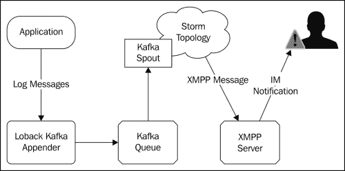
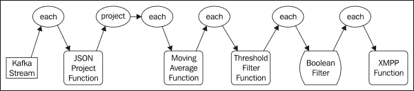
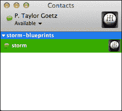
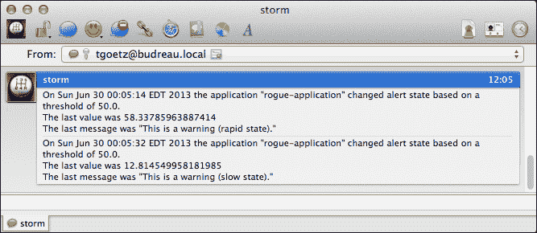

# 第四章：实时趋势分析

在本章中，我们将介绍使用 Storm 和 Trident 的趋势分析技术。实时趋势分析涉及识别数据流中的模式，例如识别特定事件的发生率或计数达到一定阈值时。常见的例子包括社交媒体中的热门话题，例如特定标签在 Twitter 上变得流行，或者识别搜索引擎中的热门搜索词。Storm 最初是一个在 Twitter 数据上执行实时分析的项目，并且提供了许多用于分析计算所需的核心原语。

在前几章中，spout 实现主要是使用静态样本数据或随机生成的数据的模拟。在本章中，我们将介绍一个开源的 spout，它从队列（Apache Kafka）发出数据，并支持 Trident spout 事务的所有三种类型（非事务、重复事务和不透明事务）。我们还将实现一种简单的通用方法，用于使用流行的日志框架填充 Kafka 队列，从而使您能够快速开始对现有应用程序和数据进行实时分析，几乎不需要进行任何源代码修改。

在本章中，我们将涵盖以下主题：

+   将日志数据记录到 Apache Kafka 并将其流式传输到 Storm

+   将现有应用程序的日志数据流式传输到 Storm 进行分析

+   实施指数加权移动平均 Trident 函数

+   使用 XMPP 协议与 Storm 发送警报和通知

# 使用案例

在我们的用例中，我们有一个应用程序或一组应用程序（网站，企业应用程序等），它们使用流行的 logback 框架（[`logback.qos.ch`](http://logback.qos.ch)）将结构化消息记录到磁盘（访问日志，错误等）。目前，对该数据进行分析的唯一方法是使用类似 Hadoop 的东西批处理处理文件。该过程引入的延迟大大减慢了我们的反应时间；从日志数据中获取的模式通常要在特定事件发生后数小时，有时甚至数天后才出现，错失了采取响应行动的机会。更希望在模式出现后立即被主动通知，而不是事后才得知。

这个用例代表了一个常见的主题，并在许多业务场景中有广泛的应用，包括以下应用：

+   应用程序监控：例如，在某些网络错误达到一定频率时通知系统管理员

+   入侵检测：例如，检测到失败的登录尝试增加等可疑活动

+   供应链管理：例如，识别特定产品销售量的激增，并相应调整及时交付

+   在线广告：例如，识别热门趋势和动态更改广告投放

# 架构

我们的应用程序的架构如下图所示，并将包括以下组件：



## 源应用程序

源应用程序组件是使用 logback 框架记录任意日志消息的任何应用程序。对于我们的目的，我们将创建一个简单的应用程序，以在特定间隔记录结构化消息。但是，正如您将看到的，任何现有应用程序使用 logback 或 slf4j 框架都可以通过简单的配置更改来替换。

## logback Kafka appender

logback 框架具有扩展机制，允许您向其配置添加附加器。logback 附加器只是一个接收日志事件并对其进行处理的 Java 类。最常用的附加器是几个`FileAppender`子类之一，它们只是将日志消息格式化并写入磁盘上的文件。其他附加器实现将日志数据写入网络套接字、关系数据库和 SMTP 以进行电子邮件通知。为了我们的目的，我们将实现一个将日志消息写入 Apache Kafka 队列的附加器。

## Apache Kafka

Apache Kafka ([`kafka.apache.org`](http://kafka.apache.org)) 是一个开源的分布式发布-订阅消息系统。Kafka 专门设计和优化用于高吞吐量、持久的实时流。与 Storm 一样，Kafka 被设计为在通用软件上水平扩展，以支持每秒数十万条消息。

## Kafka spout

Kafka spout 从 Kafka 队列中读取数据并将其发射到 Storm 或 Trident 拓扑。Kafka spout 最初由 Nathan Marz 编写，并且仍然是 GitHub 上 storm-contrib 项目的一部分 ([`github.com/nathanmarz/storm-contrib`](https://github.com/nathanmarz/storm-contrib))。Kafka spout 的预构建二进制文件可从`clojars.org` Maven 存储库 ([`clojars.org/storm/storm-kafka`](https://clojars.org/storm/storm-kafka)) 获取。我们将使用 Kafka spout 从 Kafka 队列中读取消息并将其流入我们的拓扑。

我们的拓扑将由一系列内置和自定义的 Trident 组件（函数、过滤器、状态等）组成，用于检测源数据流中的模式。当检测到模式时，拓扑将向一个函数发出元组，该函数将向 XMPP 服务器发送 XMPP 消息，以通过**即时消息** (**IM**) 通知最终用户。

## XMPP 服务器

**可扩展消息和出席协议** (**XMPP**) ([`xmpp.org`](http://xmpp.org)) 是一种基于 XML 的即时消息、出席信息和联系人列表维护的标准。许多即时消息客户端，如 Adium（用于 OSX）([`adium.im`](http://adium.im))和 Pidgin（用于 OSX、Linus 和 Windows）([`www.pidgin.im`](http://www.pidgin.im))支持 XMPP 协议，如果您曾经使用过 Google Talk 进行即时消息传递，那么您已经使用过 XMPP。

我们将使用开源的 OpenFire XMPP 服务器 ([`www.igniterealtime.org/projects/openfire/`](http://www.igniterealtime.org/projects/openfire/))，因为它易于设置并且与 OSX、Linux 和 Windows 兼容。

# 安装所需软件

我们将首先安装必要的软件：Apache Kafka 和 OpenFire。虽然 Kafka 是一个分布式消息系统，但作为单节点安装，甚至作为开发环境的一部分本地安装都可以正常工作。在生产环境中，您需要根据扩展需求设置一个或多个机器的集群。OpenFire 服务器不是一个集群系统，可以安装在单个节点或本地。

## 安装 Kafka

Kafka 依赖于 ZooKeeper 来存储某些状态信息，就像 Storm 一样。由于 Storm 对 ZooKeeper 的负载相对较轻，在许多情况下可以接受在 Kafka 和 Storm 之间共享相同的 ZooKeeper 集群。由于我们已经在第二章中介绍了 ZooKeeper 的安装，*配置 Storm 集群*，这里我们只介绍与 Kafka 一起提供的本地 ZooKeeper 服务器的运行，适用于开发环境。

首先从以下网站下载 Apache Kafka 的 0.7.x 版本：

[`kafka.apache.org/downloads.html`](http://kafka.apache.org/downloads.html)

接下来，解压源分发并将现有目录更改为以下目录：

```scala
tar -zxf kafka-0.7.2-incubating-src.tgz
cd kafka-0.7.2-incubating-src
```

Kafka 是用 Scala JVM 语言（[`www.scala-lang.org`](http://www.scala-lang.org)）编写的，并使用`sbt`（**Scala Build Tool**）（[`www.scala-sbt.org`](http://www.scala-sbt.org)）进行编译和打包。幸运的是，Kafka 源代码分发包括`sbt`，可以使用以下命令构建：

```scala
./sbt update package
```

在启动 Kafka 之前，除非您已经运行了 ZooKeeper 服务，否则您需要使用以下命令启动与 Kafka 捆绑的 ZooKeeper 服务：

```scala
./bin/zookeeper-server-start.sh ./config/zookeeper.properties
```

最后，在一个单独的终端窗口中，使用以下命令启动 Kafka 服务：

```scala
./bin/kafka-server-start.sh ./config/server.properties
```

Kafka 服务现在可以使用了。

## 安装 OpenFire

OpenFire 可作为 OSX 和 Windows 的安装程序以及各种 Linux 发行版的软件包提供，并且可以从以下网站下载：

[`www.igniterealtime.org/downloads/index.jsp`](http://www.igniterealtime.org/downloads/index.jsp)

要安装 OpenFire，请下载适用于您操作系统的安装程序，并按照以下网站上找到的适当安装说明进行操作：

[`www.igniterealtime.org/builds/openfire/docs/latest/documentation/index.html`](http://www.igniterealtime.org/builds/openfire/docs/latest/documentation/index.html)

# 介绍示例应用程序

应用组件是一个简单的 Java 类，使用**Simple Logging Facade for Java**（**SLF4J**）（[`www.slf4j.org`](http://www.slf4j.org)）记录消息。我们将模拟一个应用程序，开始以相对较慢的速率生成警告消息，然后切换到以更快的速率生成警告消息的状态，最后返回到慢速状态，如下所示：

+   每 5 秒记录一次警告消息，持续 30 秒（慢速状态）

+   每秒记录一次警告消息，持续 15 秒（快速状态）

+   每 5 秒记录一次警告消息，持续 30 秒（慢速状态）

该应用程序的目标是生成一个简单的模式，我们的风暴拓扑可以识别并在出现特定模式和状态变化时发送通知，如下面的代码片段所示：

```scala
public class RogueApplication {
    private static final Logger LOG = LoggerFactory.getLogger(RogueApplication.class);

    public static void main(String[] args) throws Exception {
        int slowCount = 6;
        int fastCount = 15;
        // slow state
        for(int i = 0; i < slowCount; i++){
            LOG.warn("This is a warning (slow state).");
            Thread.sleep(5000);
        }
        // enter rapid state
        for(int i = 0; i < fastCount; i++){
            LOG.warn("This is a warning (rapid state).");
            Thread.sleep(1000);
        }
        // return to slow state
        for(int i = 0; i < slowCount; i++){
            LOG.warn("This is a warning (slow state).");
            Thread.sleep(5000);
        }
    }
}
```

## 将日志消息发送到 Kafka

logback 框架提供了一个简单的扩展机制，允许您插入附加的附加器。在我们的情况下，我们想要实现一个可以将日志消息数据写入 Kafka 的附加器。

Logback 包括`ch.qos.logback.core.AppenderBase`抽象类，使得实现`Appender`接口变得容易。`AppenderBase`类定义了一个抽象方法如下：

```scala
  abstract protected void append(E eventObject);
```

`eventObject`参数表示日志事件，并包括事件日期、日志级别（`DEBUG`、`INFO`、`WARN`等）以及日志消息本身等属性。我们将重写`append()`方法，将`eventObject`数据写入 Kafka。

除了`append()`方法之外，`AppenderBase`类还定义了两个我们需要重写的附加生命周期方法：

```scala
 public void start();
 public void stop();
```

`start()`方法在 logback 框架初始化期间调用，`stop()`方法在去初始化时调用。我们将重写这些方法来建立和拆除与 Kafka 服务的连接。

`KafkaAppender`类的源代码如下所示：

```scala
public class KafkaAppender extends AppenderBase<ILoggingEvent> {

    private String topic;
    private String zookeeperHost;
    private Producer<String, String> producer;
    private Formatter formatter;

    // java bean definitions used to inject
    // configuration values from logback.xml
    public String getTopic() {
        return topic;
    }

    public void setTopic(String topic) {
        this.topic = topic;
    }

    public String getZookeeperHost() {
        return zookeeperHost;
    }

    public void setZookeeperHost(String zookeeperHost) {
        this.zookeeperHost = zookeeperHost;
    }

    public Formatter getFormatter() {
        return formatter;
    }

    public void setFormatter(Formatter formatter) {
        this.formatter = formatter;
    }

    // overrides
    @Override
    public void start() {
        if (this.formatter == null) {
            this.formatter = new MessageFormatter();
        }
        super.start();
        Properties props = new Properties();
        props.put("zk.connect", this.zookeeperHost);
        props.put("serializer.class", "kafka.serializer.StringEncoder");
        ProducerConfig config = new ProducerConfig(props);
        this.producer = new Producer<String, String>(config);
    }

    @Override
    public void stop() {
        super.stop();
        this.producer.close();
    }

    @Override
    protected void append(ILoggingEvent event) {
        String payload = this.formatter.format(event);
        ProducerData<String, String> data = new ProducerData<String, String>(this.topic, payload);
        this.producer.send(data);
    }

}
```

正如您将看到的，这个类中的 JavaBean 风格的访问器允许我们在 logback 框架初始化时通过依赖注入配置相关值。`zookeeperHosts`属性的 setter 和 getter 用于初始化`KafkaProducer`客户端，配置它以发现已在 ZooKeeper 注册的 Kafka 主机。另一种方法是提供一个静态的 Kafka 主机列表，但为了简单起见，使用自动发现机制更容易。`topic`属性用于告诉`KafkaConsumer`客户端应该从哪个 Kafka 主题读取。

`Formatter`属性有些特殊。这是一个我们定义的接口，提供了处理结构化（即可解析的）日志消息的扩展点，如下面的代码片段所示：

```scala
public interface Formatter {
    String format(ILoggingEvent event);
}
```

`Formatter`实现的工作是将`ILoggingEvent`对象转换为可被消费者处理的机器可读字符串。下面的简单实现只是返回日志消息，丢弃任何额外的元数据：

```scala
public class MessageFormatter implements Formatter {

    public String format(ILoggingEvent event) {
        return event.getFormattedMessage();
    }
}
```

以下的 logback 配置文件展示了 appender 的使用。这个例子没有定义自定义的`Formatter`实现，所以`KafkaAppender`类将默认使用`MessageFormatter`类，只会将日志消息数据写入 Kafka 并丢弃日志事件中包含的任何额外信息，如下面的代码片段所示：

```scala
<?xml version="1.0" encoding="UTF-8" ?>
<configuration>
    <appender name="KAFKA"
        class="com.github.ptgoetz.logback.kafka.KafkaAppender">
        <topic>mytopic</topic>
        <zookeeperHost>localhost:2181</zookeeperHost>
    </appender>
    <root level="debug">
        <appender-ref ref="KAFKA" />
    </root>
</configuration>
```

我们正在构建的 Storm 应用程序是时间敏感的：如果我们正在跟踪每个事件发生的速率，我们需要准确知道事件发生的时间。一个天真的方法是当数据进入我们的拓扑时，简单地使用`System.currentTimeMillis()`方法为事件分配一个时间。然而，Trident 的批处理机制不能保证元组以与接收到的速率相同的速率传递到拓扑。

为了应对这种情况，我们需要在事件发生时捕获事件的时间并在写入 Kafka 队列时包含在数据中。幸运的是，`ILoggingEvent`类包括一个时间戳，表示事件发生时距离纪元的毫秒数。

为了包含`ILoggingEvent`中包含的元数据，我们将创建一个自定义的`Formatter`实现，将日志事件数据编码为 JSON 格式，如下所示：

```scala
public class JsonFormatter implements Formatter {
    private static final String QUOTE = "\"";
    private static final String COLON = ":";
    private static final String COMMA = ",";

    private boolean expectJson = false;

    public String format(ILoggingEvent event) {
        StringBuilder sb = new StringBuilder();
        sb.append("{");
        fieldName("level", sb);
        quote(event.getLevel().levelStr, sb);
        sb.append(COMMA);
        fieldName("logger", sb);
        quote(event.getLoggerName(), sb);
        sb.append(COMMA);
        fieldName("timestamp", sb);
        sb.append(event.getTimeStamp());
        sb.append(COMMA);
        fieldName("message", sb);
        if (this.expectJson) {
            sb.append(event.getFormattedMessage());
        } else {
            quote(event.getFormattedMessage(), sb);
        }

        sb.append("}");
        return sb.toString();
    }

    private static void fieldName(String name, StringBuilder sb) {
        quote(name, sb);
        sb.append(COLON);
    }

    private static void quote(String value, StringBuilder sb) {
        sb.append(QUOTE);
        sb.append(value);
        sb.append(QUOTE);
    }

    public boolean isExpectJson() {
        return expectJson;
    }

    public void setExpectJson(boolean expectJson) {
        this.expectJson = expectJson;
    }
}
```

`JsonMessageFormatter`类的大部分代码使用`java.lang.StringBuilder`类从`ILoggingEvent`对象创建 JSON。虽然我们可以使用 JSON 库来完成工作，但我们生成的 JSON 数据很简单，添加额外的依赖只是为了生成 JSON 会显得过度。

`JsonMessageFormatter`公开的一个 JavaBean 属性是`expectJson`布尔值，用于指定传递给`Formatter`实现的日志消息是否应被视为 JSON。如果设置为`False`，日志消息将被视为字符串并用双引号括起来，否则消息将被视为 JSON 对象（`{...}`）或数组（`[...]`）。

以下是一个示例的 logback 配置文件，展示了`KafkaAppender`和`JsonFormatter`类的使用：

```scala
<?xml version="1.0" encoding="UTF-8" ?>
<configuration>
    <appender name="KAFKA"
        class="com.github.ptgoetz.logback.kafka.KafkaAppender">
        <topic>foo</topic>
        <zookeeperHost>localhost:2181</zookeeperHost>
        <!-- specify a custom formatter -->
        <formatter class="com.github.ptgoetz.logback.kafka.formatter.JsonFormatter">
            <!-- 
            Whether we expect the log message to be JSON encoded or not.
            If set to "false", the log message will be treated as a string, and wrapped in quotes. Otherwise it will be treated as a parseable JSON object.
            -->
            <expectJson>false</expectJson>
        </formatter>
    </appender>
	<root level="debug">
		<appender-ref ref="KAFKA" />
	</root>
</configuration>
```

由于我们正在构建的分析拓扑更关注事件时间而不是消息内容，我们生成的日志消息将是字符串，因此我们将`expectJson`属性设置为`False`。

# 介绍日志分析拓扑

有了将日志数据写入 Kafka 的手段，我们准备将注意力转向实现一个 Trident 拓扑来执行分析计算。拓扑将执行以下操作：

1.  接收并解析原始 JSON 日志事件数据。

1.  提取并发出必要的字段。

1.  更新指数加权移动平均函数。

1.  确定移动平均是否越过了指定的阈值。

1.  过滤掉不代表状态改变的事件（例如，速率移动超过/低于阈值）。

1.  发送即时消息（XMPP）通知。

拓扑结构如下图所示，三叉戟流操作位于顶部，流处理组件位于底部：



## Kafka spout

创建日志分析拓扑的第一步是配置 Kafka spout，将从 Kafka 接收的数据流入我们的拓扑，如下所示：

```scala
        TridentTopology topology = new TridentTopology();

        StaticHosts kafkaHosts = KafkaConfig.StaticHosts.fromHostString(Arrays.asList(new String[] { "localhost" }), 1);
        TridentKafkaConfig spoutConf = new TridentKafkaConfig(kafkaHosts, "log-analysis");
        spoutConf.scheme = new StringScheme();
        spoutConf.forceStartOffsetTime(-1);
        OpaqueTridentKafkaSpout spout = new OpaqueTridentKafkaSpout(spoutConf);

        Stream spoutStream = topology.newStream("kafka-stream", spout);
```

这段代码首先创建了一个新的`TridentTopology`实例，然后使用 Kafka Java API 创建了一个 Kafka 主机列表，用于连接（因为我们在本地运行单个、非集群的 Kafka 服务，所以我们指定了一个主机：`localhost`）。接下来，我们创建了`TridentKafkaConfig`对象，将主机列表和唯一标识符传递给它。

我们的应用程序写入 Kafka 的数据是一个简单的 Java 字符串，因此我们使用 Storm-Kafka 内置的`StringScheme`类。`StringScheme`类将从 Kafka 读取数据作为字符串，并将其输出到名为`str`的元组字段中。

默认情况下，在部署时，Kafka spout 将尝试从 Kafka 队列中上次离开的地方读取状态信息。这种行为可以通过调用`TridentKafkaConfig`类的`forceOffsetTime(long time)`方法来覆盖。时间参数可以是以下三个值之一：

+   **-2（最早的偏移）**：spout 将*倒带*并从队列的开头开始读取

+   **-1（最新的偏移）**：spout 将*快进*并从队列的末尾读取

+   **以毫秒为单位的时间**：给定特定日期的毫秒数（例如，`java.util.Date.getTime()`），spout 将尝试从那个时间点开始读取

在设置好 spout 配置之后，我们创建了一个*Opaque Transactional* Kafka spout 的实例，并设置了相应的 Trident 流。

## JSON 项目函数

来自 Kafka spout 的数据流将包含一个字段（`str`），其中包含来自日志事件的 JSON 数据。我们将创建一个 Trident 函数来解析传入的数据，并输出或投影请求的字段作为元组值，如下面的代码片段所示：

```scala
public class JsonProjectFunction extends BaseFunction {

    private Fields fields;

    public JsonProjectFunction(Fields fields) {
        this.fields = fields;
    }

    public void execute(TridentTuple tuple, TridentCollector collector) {
        String json = tuple.getString(0);
        Map<String, Object> map = (Map<String, Object>)  
            JSONValue.parse(json);
        Values values = new Values();
        for (int i = 0; i < this.fields.size(); i++) {
            values.add(map.get(this.fields.get(i)));
        }
        collector.emit(values);
    }

}
```

`JsonProjectFunction`构造函数接受一个`Fields`对象参数，该参数将确定要作为要查找的键名称列表从 JSON 中发出的值。当函数接收到一个元组时，它将解析元组的`str`字段中的 JSON，迭代`Fields`对象的值，并从输入 JSON 中发出相应的值。

以下代码创建了一个`Fields`对象，其中包含要从 JSON 中提取的字段名称列表。然后，它从 spout 流创建了一个新的`Stream`对象，选择`str`元组字段作为`JsonProjectFunction`构造函数的输入，构造了`JsonProjectFunction`构造函数，并指定从 JSON 中选择的字段也将从函数中输出：

```scala
        Fields jsonFields = new Fields("level", "timestamp", "message", "logger");
        Stream parsedStream = spoutStream.each(new Fields("str"), new JsonProjectFunction(jsonFields), jsonFields);
```

考虑到以下 JSON 消息是从 Kafka spout 接收到的：

```scala
{
  "message" : "foo",
  "timestamp" : 1370918376296,
  "level" : "INFO",
  "logger" : "test"
}
```

这意味着该函数将输出以下元组值：

```scala
[INFO, 1370918376296, test, foo]
```

## 计算移动平均

为了计算日志事件发生的速率，而无需存储过多的状态，我们将实现一个函数，执行统计学中所谓的**指数加权移动平均**。

移动平均计算经常用于平滑短期波动，并暴露时间序列数据中的长期趋势。移动平均的最常见的例子之一是在股票市场价格波动的图表中使用，如下面的屏幕截图所示：


移动平均的平滑效果是通过在计算中考虑历史值来实现的。移动平均计算可以以非常少量的状态执行。对于时间序列，我们只需要保留上一个事件的时间和上一个计算的平均值。

在伪代码中，计算看起来像以下代码片段：

```scala
diff = currentTime - lastEventTime
currentAverage = (1.0 - alpha) * diff + alpha * lastAverage
```

上述计算中的`alpha`值是介于`0`和`1`之间的常量值。`alpha`值确定随时间发生的平滑程度。`alpha`值越接近`1`，历史值对当前平均值的影响就越大。换句话说，`alpha`值越接近`0`，平滑效果就越小，移动平均值就越接近当前值。`alpha`值越接近`1`，效果就相反。当前平均值受到的波动影响就越小，历史值在确定当前平均值时的权重就越大。

## 添加一个滑动窗口

在某些情况下，我们可能希望打折历史值以减少它们对移动平均值的影响，例如，如果在接收事件之间经过了很长时间，我们可能希望重置平滑效果。在低 alpha 值的情况下，这可能是不必要的，因为平滑效果很小。然而，在高 alpha 值的情况下，抵消平滑效果可能是可取的。

考虑以下示例。

我们有一个（例如网络错误等）偶尔发生的事件。偶尔会出现小的频率波动，但通常没关系。因此，我们希望消除小的波动。我们希望被通知的是如果发生了*持续*的波动。

如果事件平均每周发生一次（远低于我们的通知阈值），但有一天在一个小时内发生了多次（超过我们的通知阈值），高 alpha 的平滑效果可能会抵消波动，以至于永远不会触发通知。

为了抵消这种影响，我们可以在移动平均值计算中引入**滑动窗口**的概念。由于我们已经在跟踪上一个事件的时间和当前平均值，因此实现滑动窗口就像在以下伪代码中所示的那样简单：

```scala
if (currentTime - lastEventTime) > slidingWindowInterval
    currentAverage = 0
end if
```

指数加权移动平均的实现如下所示：

```scala
public class EWMA implements Serializable {

    public static enum Time {
        MILLISECONDS(1), SECONDS(1000), MINUTES(SECONDS.getTime() * 60), HOURS(MINUTES.getTime() * 60), DAYS(HOURS
                .getTime() * 24), WEEKS(DAYS.getTime() * 7);

        private long millis;

        private Time(long millis) {
            this.millis = millis;
        }

        public long getTime() {
            return this.millis;
        }
    }

    // Unix load average-style alpha constants
    public static final double ONE_MINUTE_ALPHA = 1 - Math.exp(-5d / 60d / 1d);
    public static final double FIVE_MINUTE_ALPHA = 1 - Math.exp(-5d / 60d / 5d);
    public static final double FIFTEEN_MINUTE_ALPHA = 1 - Math.exp(-5d / 60d / 15d);

    private long window;
    private long alphaWindow;
    private long last;
    private double average;
    private double alpha = -1D;
    private boolean sliding = false;

    public EWMA() {
    }

    public EWMA sliding(double count, Time time) {
        return this.sliding((long) (time.getTime() * count));
    }

    public EWMA sliding(long window) {
        this.sliding = true;
        this.window = window;
        return this;
    }

    public EWMA withAlpha(double alpha) {
        if (!(alpha > 0.0D && alpha <= 1.0D)) {
            throw new IllegalArgumentException("Alpha must be between 0.0 and 1.0");
        }
        this.alpha = alpha;
        return this;
    }

    public EWMA withAlphaWindow(long alphaWindow) {
        this.alpha = -1;
        this.alphaWindow = alphaWindow;
        return this;
    }

    public EWMA withAlphaWindow(double count, Time time) {
        return this.withAlphaWindow((long) (time.getTime() * count));
    }

    public void mark() {
        mark(System.currentTimeMillis());
    }

    public synchronized void mark(long time) {
        if (this.sliding) {
            if (time - this.last > this.window) {
                // reset the sliding window
                this.last = 0;
            }
        }
        if (this.last == 0) {
            this.average = 0;
            this.last = time;
        }
        long diff = time - this.last;
        double alpha = this.alpha != -1.0 ? this.alpha : Math.exp(-1.0 * ((double) diff / this.alphaWindow));
        this.average = (1.0 - alpha) * diff + alpha * this.average;
        this.last = time;
    }

    public double getAverage() {
        return this.average;
    }

    public double getAverageIn(Time time) {
        return this.average == 0.0 ? this.average : this.average / time.getTime();
    }

    public double getAverageRatePer(Time time) {
        return this.average == 0.0 ? this.average : time.getTime() / this.average;
    }

}
```

`EWMA`实现定义了三个有用的常量`alpha`值：`ONE_MINUTE_ALPHA`，`FIVE_MINUTE_ALPHA`和`FIFTEEN_MINUTE_ALPHA`。这些对应于 UNIX 中用于计算负载平均值的标准`alpha`值。`alpha`值也可以手动指定，或者作为*alpha*窗口的函数。

该实现使用流畅的*构建器*API。例如，您可以创建一个具有一分钟滑动窗口和等效于 UNIX 一分钟间隔的`alpha`值的`EWMA`实例，如下面的代码片段所示：

```scala
EWMA ewma = new EWMA().sliding(1.0, Time.MINUTES).withAlpha(EWMA.ONE_MINUTE_ALPHA);
```

`mark（）`方法用于更新移动平均值。如果没有参数，`mark（）`方法将使用当前时间来计算平均值。因为我们想要使用日志事件的原始时间戳，我们重载`mark（）`方法以允许指定特定时间。

`getAverage（）`方法以毫秒为单位返回`mark（）`调用之间的平均时间。我们还添加了方便的`getAverageIn（）`方法，它将返回指定时间单位（秒，分钟，小时等）的平均值。`getAverageRatePer（）`方法返回特定时间测量中`mark（）`调用的速率。

正如您可能注意到的那样，使用指数加权移动平均值可能有些棘手。找到合适的 alpha 值以及可选滑动窗口的正确值在很大程度上取决于特定用例，并且找到正确的值在很大程度上是一个反复试验的问题。

## 实现移动平均函数

要在 Trident 拓扑中使用我们的`EWMA`类，我们将创建 Trident 的`BaseFunction`抽象类的子类，命名为`MovingAverageFunction`，它包装了一个`EWMA`实例，如下面的代码片段所示：

```scala
public class MovingAverageFunction extends BaseFunction {
    private static final Logger LOG = LoggerFactory.getLogger(BaseFunction.class);

    private EWMA ewma;
    private Time emitRatePer;

    public MovingAverageFunction(EWMA ewma, Time emitRatePer){
        this.ewma = ewma;
        this.emitRatePer = emitRatePer;
    }

    public void execute(TridentTuple tuple, TridentCollector collector) {
        this.ewma.mark(tuple.getLong(0));
        LOG.debug("Rate: {}", this.ewma.getAverageRatePer(this.emitRatePer));
        collector.emit(new Values(this.ewma.getAverageRatePer(this.emitRatePer)));
    }
}
```

`MovingAverage.execute()`方法获取传入元组的第一个字段的`Long`值，使用该值调用`mark()`方法来更新当前平均值，并发出当前平均速率。Trident 中的函数是累加的，这意味着它们将值添加到流中的元组中。因此，例如，考虑传入我们函数的元组如下代码片段所示：

```scala
[INFO, 1370918376296, test, foo]
```

这意味着在处理后，元组可能看起来像下面的代码片段：

```scala
[INFO, 1370918376296, test, foo, 3.72234]
```

在这里，新值代表了新的平均速率。

为了使用该函数，我们创建了一个`EWMA`类的实例，并将其传递给`MovingAverageFunction`构造函数。我们使用`each()`方法将该函数应用于流，选择`timestamp`字段作为输入，如下面的代码片段所示：

```scala
        EWMA ewma = new EWMA().sliding(1.0, Time.MINUTES).withAlpha(EWMA.ONE_MINUTE_ALPHA);
        Stream averageStream = parsedStream.each(new Fields("timestamp"),
                new MovingAverageFunction(ewma, Time.MINUTES), new Fields("average"));
```

## 阈值过滤

对于我们的用例，我们希望能够定义一个触发通知的速率阈值。当超过阈值时，我们还希望在平均速率再次低于该阈值时收到通知（即恢复正常）。我们可以使用额外的函数和简单的 Trident 过滤器的组合来实现这个功能。

函数的作用是确定平均速率字段的新值是否越过了阈值，并且它是否代表了与先前值的变化（即它是否从*低于阈值*变为*高于阈值*或反之）。如果新的平均值代表了状态变化，函数将发出布尔值`True`，否则它将发出`False`。我们将利用该值来过滤掉不代表状态变化的事件。我们将在`ThresholdFilterFunction`类中实现阈值跟踪功能，如下面的代码片段所示：

```scala
public class ThresholdFilterFunction extends BaseFunction {
    private static final Logger LOG = LoggerFactory.getLogger(ThresholdFilterFunction.class);

    private static enum State {
        BELOW, ABOVE;
    }

    private State last = State.BELOW;
    private double threshold;

    public ThresholdFilterFunction(double threshold){
        this.threshold = threshold;
    }

    public void execute(TridentTuple tuple, TridentCollector collector) {
        double val = tuple.getDouble(0);
        State newState = val < this.threshold ? State.BELOW : State.ABOVE;
        boolean stateChange = this.last != newState;
        collector.emit(new Values(stateChange, threshold));
        this.last = newState;
        LOG.debug("State change? --> {}", stateChange);
    }
}
```

`ThresholdFilterFunction`类定义了一个内部枚举来表示状态（高于阈值或低于阈值）。构造函数接受一个双精度参数，用于建立我们要比较的阈值。在`execute()`方法中，我们获取当前速率值，并确定它是低于还是高于阈值。然后，我们将其与上一个状态进行比较，看它是否已经改变，并将该值作为布尔值发出。最后，我们将内部的高于/低于状态更新为新计算的值。

通过`ThresholdFilterFunction`类后，输入流中的元组将包含一个新的布尔值，我们可以使用它来轻松过滤掉不触发状态变化的事件。为了过滤掉非状态变化的事件，我们将使用一个简单的`BooleanFilter`类，如下面的代码片段所示：

```scala
public class BooleanFilter extends BaseFilter {

    public boolean isKeep(TridentTuple tuple) {
        return tuple.getBoolean(0);
    }
}
```

`BooleanFilter.isKeep()`方法只是从元组中读取一个字段作为布尔值并返回该值。任何包含输入值为`False`的元组将被过滤出结果流。

以下代码片段说明了`ThresholdFilterFuncation`类和`BooleanFilter`类的用法：

```scala
        ThresholdFilterFunction tff = new ThresholdFilterFunction(50D);
        Stream thresholdStream = averageStream.each(new Fields("average"), tff, new Fields("change", "threshold"));

        Stream filteredStream = thresholdStream.each(new Fields("change"), new BooleanFilter());
```

第一行创建了一个具有阈值`50.0`的`ThresholdFilterFunction`实例。然后，我们使用`averageStream`作为输入创建了一个新的流，并选择`average`元组字段作为输入。我们还为函数添加的字段分配了名称（`change`和`threshold`）。最后，我们应用`BooleanFilter`类创建一个新的流，该流将只包含代表阈值比较变化的元组。

此时，我们已经有了实现通知所需的一切。我们创建的`filteredStream`将只包含代表阈值状态变化的元组。

## 使用 XMPP 发送通知

XMPP 协议提供了即时消息标准中所期望的所有典型功能：

+   花名册（联系人列表）

+   在线状态（知道其他人何时在线以及他们的可用状态）

+   用户之间的即时消息

+   群聊

XMPP 协议使用 XML 格式进行通信，但有许多高级客户端库可以处理大部分低级细节，并提供简单的 API。我们将使用 Smack API（[`www.igniterealtime.org/projects/smack/`](http://www.igniterealtime.org/projects/smack/)），因为它是最直接的 XMPP 客户端实现之一。

以下代码片段演示了使用 Smack API 向另一个用户发送简单即时消息的用法：

```scala
        // connect to XMPP server and login
        ConnectionConfiguration config = new
            ConnectionConfiguration("jabber.org");
        XMPPConnection client = new XMPPConnection(config);
        client.connect();
        client.login("username", "password");

        // send a message to another user
        Message message =
           new Message("myfriend@jabber.org", Type.normal);
        message.setBody("How are you today?");
        client.sendPacket(message);
```

该代码连接到[jabber.org](http://jabber.org)的 XMPP 服务器，并使用用户名和密码登录。在幕后，Smack 库处理与服务器的低级通信。当客户端连接并进行身份验证时，它还向服务器发送了一个出席消息。这允许用户的联系人（在其 XMPP 花名册中列出的其他用户）收到通知，表明该用户现在已连接。最后，我们创建并发送一个简单的消息，地址为`"myfriend@jabber.org"`。

基于这个简单的例子，我们将创建一个名为`XMPPFunction`的类，当它接收到 Trident 元组时，会发送 XMPP 通知。该类将在`prepare()`方法中建立与 XMPP 服务器的长连接。此外，在`execute()`方法中，它将根据接收到的元组创建一个 XMPP 消息。

为了使`XMPPFunction`类更具可重用性，我们将引入`MessageMapper`接口，该接口定义了一种方法，用于将 Trident 元组的数据格式化为适合即时消息通知的字符串，如下所示的代码片段所示：

```scala
public interface MessageMapper extends Serializable {
    public String toMessageBody(TridentTuple tuple);
}
```

我们将在`XMPPFunction`类中委托消息格式化给一个`MessageMapper`实例，如下所示的代码片段所示：

```scala
public class XMPPFunction extends BaseFunction {
    private static final Logger LOG = LoggerFactory.getLogger(XMPPFunction.class);

    public static final String XMPP_TO = "storm.xmpp.to";
    public static final String XMPP_USER = "storm.xmpp.user";
    public static final String XMPP_PASSWORD = "storm.xmpp.password";
    public static final String XMPP_SERVER = "storm.xmpp.server";

    private XMPPConnection xmppConnection;
    private String to;
    private MessageMapper mapper;

    public XMPPFunction(MessageMapper mapper) {
        this.mapper = mapper;
    }

    @Override
    public void prepare(Map conf, TridentOperationContext context) {
        LOG.debug("Prepare: {}", conf);
        super.prepare(conf, context);
        this.to = (String) conf.get(XMPP_TO);
        ConnectionConfiguration config = new ConnectionConfiguration((String) conf.get(XMPP_SERVER));
        this.xmppConnection = new XMPPConnection(config);
        try {
            this.xmppConnection.connect();
            this.xmppConnection.login((String) conf.get(XMPP_USER), (String) conf.get(XMPP_PASSWORD));
        } catch (XMPPException e) {
            LOG.warn("Error initializing XMPP Channel", e);
        }
    }

    public void execute(TridentTuple tuple, TridentCollector collector) {
        Message msg = new Message(this.to, Type.normal);
        msg.setBody(this.mapper.toMessageBody(tuple));
        this.xmppConnection.sendPacket(msg);

    }

}
```

`XMPPFunction`类首先定义了几个字符串常量，用于从传递给`prepare()`方法的 Storm 配置中查找值，然后声明了实例变量，当函数激活时我们将填充这些变量。该类的构造函数接受一个`MessageMapper`实例作为参数，该实例将在`execute()`方法中用于格式化通知消息的正文。

在`prepare()`方法中，我们查找`XMPPConnection`类的配置参数（`server`、`username`、`to address`等），并打开连接。当部署使用此函数的拓扑时，`XMPP`客户端将发送出席数据包，其他用户如果在其花名册（好友列表）中有配置的用户，则会收到通知，指示该用户现在在线。

我们通知机制的最后一个必要部分是实现一个`MessageMapper`实例，将元组的内容格式化为人类可读的消息正文，如下所示的代码片段所示：

```scala
public class NotifyMessageMapper implements MessageMapper {

    public String toMessageBody(TridentTuple tuple) {
        StringBuilder sb = new StringBuilder();
        sb.append("On " + new Date(tuple.getLongByField("timestamp")) + " ");
        sb.append("the application \"" + tuple.getStringByField("logger") + "\" ");
        sb.append("changed alert state based on a threshold of " + tuple.getDoubleByField("threshold") + ".\n");
        sb.append("The last value was " + tuple.getDoubleByField("average") + "\n");
        sb.append("The last message was \"" + tuple.getStringByField("message") + "\"");
        return sb.toString();
    }
}
```

# 最终的拓扑结构

现在我们已经拥有构建日志分析拓扑所需的所有组件，如下所示：

```scala
public class LogAnalysisTopology {

    public static StormTopology buildTopology() {
        TridentTopology topology = new TridentTopology();

        StaticHosts kafkaHosts = KafkaConfig.StaticHosts.fromHostString(Arrays.asList(new String[] { "localhost" }), 1);
        TridentKafkaConfig spoutConf = new TridentKafkaConfig(kafkaHosts, "log-analysis");
        spoutConf.scheme = new StringScheme();
        spoutConf.forceStartOffsetTime(-1);
        OpaqueTridentKafkaSpout spout = new OpaqueTridentKafkaSpout(spoutConf);

        Stream spoutStream = topology.newStream("kafka-stream", spout);

        Fields jsonFields = new Fields("level", "timestamp", "message", "logger");
        Stream parsedStream = spoutStream.each(new Fields("str"), new JsonProjectFunction(jsonFields), jsonFields);

        // drop the unparsed JSON to reduce tuple size
        parsedStream = parsedStream.project(jsonFields);

        EWMA ewma = new EWMA().sliding(1.0, Time.MINUTES).withAlpha(EWMA.ONE_MINUTE_ALPHA);
        Stream averageStream = parsedStream.each(new Fields("timestamp"),
                new MovingAverageFunction(ewma, Time.MINUTES), new Fields("average"));

        ThresholdFilterFunction tff = new ThresholdFilterFunction(50D);
        Stream thresholdStream = averageStream.each(new Fields("average"), tff, new Fields("change", "threshold"));

        Stream filteredStream = thresholdStream.each(new Fields("change"), new BooleanFilter());

        filteredStream.each(filteredStream.getOutputFields(), new XMPPFunction(new NotifyMessageMapper()), new Fields());

        return topology.build();
    }

    public static void main(String[] args) throws Exception {
        Config conf = new Config();
        conf.put(XMPPFunction.XMPP_USER, "storm@budreau.local");
        conf.put(XMPPFunction.XMPP_PASSWORD, "storm");
        conf.put(XMPPFunction.XMPP_SERVER, "budreau.local");
        conf.put(XMPPFunction.XMPP_TO, "tgoetz@budreau.local");

        conf.setMaxSpoutPending(5);
        if (args.length == 0) {
            LocalCluster cluster = new LocalCluster();
            cluster.submitTopology("log-analysis", conf, buildTopology());

        } else {
            conf.setNumWorkers(3);
            StormSubmitter.submitTopology(args[0], conf, buildTopology());
        }
    }
}
```

然后，`buildTopology()`方法创建 Kafka spout 和我们的 Trident 函数和过滤器之间的所有流连接。然后，`main()`方法将拓扑提交到集群：如果拓扑在本地模式下运行，则提交到本地集群，如果在分布式模式下运行，则提交到远程集群。

我们首先配置 Kafka spout 以从我们的应用程序配置为写入日志事件的相同主题中读取。因为 Kafka 会持久化它接收到的所有消息，并且因为我们的应用程序可能已经运行了一段时间（因此记录了许多事件），我们告诉 spout 通过调用`forceStartOffsetTime()`方法并使用值`-1`来快进到 Kafka 队列的末尾。这将避免重放我们可能不感兴趣的所有旧消息。使用值`-2`将强制 spout 倒带到队列的开头，并使用毫秒级的特定日期将强制它倒带到特定时间点。如果没有调用`forceFromStartTime()`方法，spout 将尝试通过在 ZooKeeper 中查找偏移量来恢复上次离开的位置。

接下来，我们设置`JsonProjectFunction`类来解析从 Kafka 接收到的原始 JSON，并发出我们感兴趣的值。请记住，Trident 函数是可加的。这意味着我们的元组流，除了从 JSON 中提取的所有值之外，还将包含原始未解析的 JSON 字符串。由于我们不再需要这些数据，我们调用`Stream.project()`方法，提供我们想要保留的字段列表。`project()`方法对于将元组流减少到只包含基本字段非常有用，尤其是在重新分区具有大量数据的流时非常重要。

现在生成的流只包含我们需要的数据。我们使用一个滑动窗口为一分钟的`EWMA`实例，并配置`MovingAverageFunction`类以发出每分钟的当前速率。我们使用值`50.0`创建`ThresholdFunction`类，因此每当平均速率超过或低于每分钟 50 个事件时，我们都会收到通知。

最后，我们应用`BooleanFilter`类，并将生成的流连接到`XMPPFunction`类。

拓扑的`main()`方法只是用所需的属性填充一个`Config`对象，并提交拓扑。

# 运行日志分析拓扑

要运行分析拓扑，首先确保 ZooKeeper、Kafka 和 OpenFire 都已经按照本章前面概述的步骤启动并运行。然后，运行拓扑的`main()`方法。

当拓扑激活时，*storm* XMPP 用户将连接到 XMPP 服务器并触发存在事件。如果您使用 XMPP 客户端登录到同一服务器，并且在好友列表中有*storm*用户，您将看到它变为可用。如下面的屏幕截图所示：



接下来，运行`RogueApplication`类并等待一分钟。您应该收到即时消息通知，指示已超过阈值，随后将收到一条指示返回正常（低于阈值）的消息，如下面的屏幕截图所示：



# 摘要

在本章中，我们通过创建一个简单但功能强大的拓扑介绍了实时分析，该拓扑可以适应各种应用程序。我们构建的组件是通用的，可以轻松地在其他项目中重用和扩展。最后，我们介绍了一个真实世界的 spout 实现，可以用于多种目的。

虽然实时分析的主题非常广泛，而且诚然，我们在本章中只能触及表面，但我们鼓励您探索本书其他章节中提出的技术，并考虑如何将它们纳入您的分析工具箱中。

在下一章中，我们将通过构建一个应用程序，将 Storm 处理的数据持续写入图形数据库，向您介绍 Trident 的分布式状态机制。 
