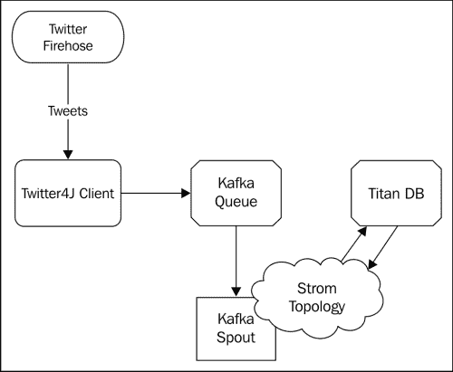
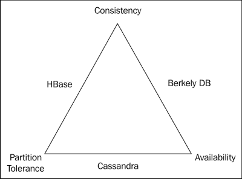
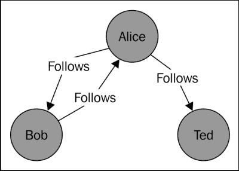
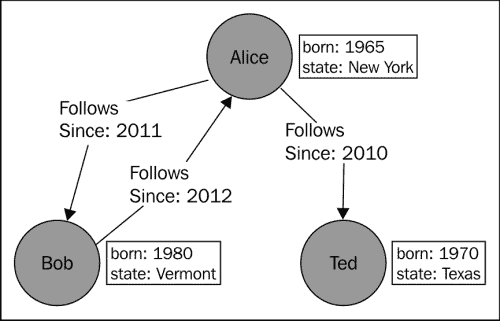
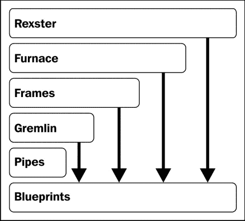
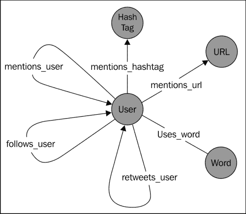
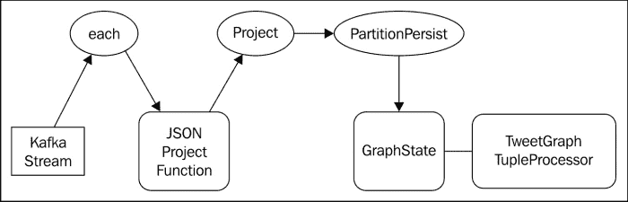

# 第五章：实时图分析

在本章中，我们将介绍使用 Storm 进行图分析，将数据持久化到图数据库并查询数据以发现关系。图数据库是将数据存储为顶点、边和属性的图结构的数据库，主要关注实体之间的关系。

随着 Twitter、Facebook 和 LinkedIn 等社交媒体网站的出现，社交图已经变得无处不在。分析人与人之间的关系、他们购买的产品、他们做出的推荐，甚至他们使用的词语，都可以被分析以揭示传统数据模型难以发现的模式。例如，当 LinkedIn 显示你与另一个人相隔四步时，基于你的网络，当 Twitter 提供关注的人的建议时，或者当亚马逊建议你可能感兴趣的产品时，它们都在利用他们对你的关系图的了解。图数据库就是为这种关系分析而设计的。

在本章中，我们将构建一个应用程序，摄取 Twitter firehose 的一个子集（Twitter 用户发布的所有推文的实时源），并根据每条消息的内容，在图数据库中创建节点（顶点）和关系（边），然后进行分析。在 Twitter 中最明显的图结构是基于用户之间的关注/被关注关系，但是我们可以通过超越这些显式关系来推断出额外的关系。通过查看消息的内容，我们可以使用消息元数据（标签、用户提及等）来识别例如提到相同主题或发布相关标签的用户。在本章中，我们将涵盖以下主题：

+   基本图数据库概念

+   TinkerPop 图形 API

+   图数据建模

+   与 Titan 分布式图数据库交互

+   编写由图数据库支持的 Trident 状态实现

# 用例

今天的社交媒体网站捕获了大量的信息。许多社交媒体服务，如 Twitter、Facebook 和 LinkedIn，主要基于人际关系：你关注谁，与谁交友，或者与谁有业务联系。除了明显和显式的关系之外，社交媒体互动还会产生一组持久的隐式连接，这些连接很容易被忽视。例如，对于 Twitter 来说，明显的关系包括关注的人和被关注的人。不太明显的关系是通过使用服务而可能无意中创建的连接。你在 Twitter 上直接给某人发过私信吗？如果是，那么你们之间就建立了连接。发过 URL 的推文吗？如果是，也是一种连接。在 Facebook 上点赞产品、服务或评论吗？连接。甚至在推文或帖子中使用特定词语或短语也可以被视为创建连接。通过使用那个词，你正在与它建立连接，并且通过反复使用它，你正在加强那个连接。

如果我们将数据视为“一切都是连接”，那么我们可以构建一个结构化的数据集并对其进行分析，以揭示更广泛的模式。如果 Bob 不认识 Alice，但 Bob 和 Alice 都发推文相同的 URL，我们可以从这个事实推断出一个连接。随着我们的数据集增长，其价值也将随着网络中连接的数量增加而增长（类似于梅特卡夫定律：[`en.wikipedia.org/wiki/Metcalfe's_law`](http://en.wikipedia.org/wiki/Metcalfe's_law)）。

当我们开始查询我们的数据集时，将很快意识到将数据存储在图数据库中的价值，因为我们可以从不断增长的连接网络中获取模式。我们进行的图分析适用于许多现实世界的用例，包括以下内容：

+   定向广告

+   推荐引擎

+   情感分析

# 架构

我们应用程序的架构相对简单。我们将创建一个 Twitter 客户端应用程序，读取 Twitter firehose 的子集，并将每条消息作为 JSON 数据结构写入 Kafka 队列。然后，我们将使用 Kafka spout 将数据输入到我们的 storm 拓扑中。最后，我们的 storm 拓扑将分析传入的消息并填充图数据库。



## Twitter 客户端

Twitter 提供了一个全面的 RESTful API，除了典型的请求-响应接口外，还提供支持长连接的流 API。Twitter4J Java 库 ([`twitter4j.org/`](http://twitter4j.org/)) 完全兼容最新版本的 Twitter API，并通过清晰的 Java API 处理所有底层细节（连接管理、OAuth 认证和 JSON 解析）。我们将使用 Twitter4J 连接到 Twitter 流 API。

## Kafka spout

在前一章中，我们开发了一个 Logback Appender 扩展，使我们能够轻松地将数据发布到 Kafka 队列，并且我们使用了 Nathan Marz 的 Kafka spout ([`github.com/nathanmarz/storm-contrib`](https://github.com/nathanmarz/storm-contrib)) 来消费 Storm 拓扑中的数据。虽然使用 Twitter4J 和 Twitter 流 API 编写 Storm spout 会很容易，但使用 Kafka 和 Kafka Spout 可以给我们提供事务性、精确一次语义和内置的容错性，否则我们将不得不自己实现。有关安装和运行 Kafka 的更多信息，请参阅第四章 *实时趋势分析*。

## Titan 分布式图数据库

Titan 是一个优化用于存储和查询图结构的分布式图数据库。像 Storm 和 Kafka 一样，Titan 数据库可以作为集群运行，并且可以水平扩展以容纳不断增加的数据量和用户负载。Titan 将其数据存储在三种可配置的存储后端之一：Apache Cassandra、Apache HBase 和 Oracle Berkely 数据库。存储后端的选择取决于 CAP 定理的哪两个属性是期望的。就数据库而言，CAP 定理规定分布式系统不能同时满足以下所有保证：

+   **一致性**：所有客户端看到当前数据，无论修改如何

+   **可用性**：系统在节点故障时仍然按预期运行

+   **分区容错性**：系统在网络或消息故障时仍然按预期运行



对于我们的用例，一致性对我们的应用程序并不重要。我们更关心的是可伸缩性和容错性。如果我们看一下 CAP 定理三角形，在前面的图中显示，就会清楚地看到 Cassandra 是首选的存储后端。

# 图数据库简介

图是一个对象（顶点）的网络，它们之间有定向连接（边）。下图说明了一个简单的社交图，类似于在 Twitter 上找到的图：



在这个例子中，用户由顶点（节点）表示，关系表示为边（连接）。请注意，图中的边是有向的，允许额外的表达度。例如，这允许表达 Bob 和 Alice 互相关注，Alice 关注 Ted 但 Ted 不关注 Alice。如果没有有向边，这种关系将更难建模。

许多图数据库遵循属性图模型。属性图通过允许一组属性（键值对）分配给顶点和边来扩展基本图模型，如下图所示：



在图模型中将属性元数据与对象和关系关联起来，为图算法和查询提供了强大的支持元数据。例如，将**Follows**边缘添加**since**属性将使我们能够有效地查询在特定年份开始关注特定用户的所有用户。

与关系数据库相比，图数据库中的关系是显式的，而不是隐式的。图数据库中的关系是完整的数据结构，而不是暗示的连接（即外键）。在底层，图数据库的基础数据结构经过了大量优化，用于图遍历。虽然在关系数据库中完全可以对图进行建模，但通常比图中心模型效率低。在关系数据模型中，遍历图结构可能会涉及连接许多表，因此计算成本高昂。在图数据库中，遍历节点之间的链接是一个更自然的过程。

## 访问图 - TinkerPop 堆栈

TinkerPop 是一组专注于图技术的开源项目，如数据库访问、数据流和图遍历。Blueprints 是 TinkerPop 堆栈的基础，是一个通用的 Java API，用于与属性图进行交互，方式与 JDBC 提供关系数据库的通用接口类似。堆栈中的其他项目在该基础上添加了额外的功能，以便它们可以与实现 Blueprints API 的任何图数据库一起使用。



TinkerPop 堆栈的组件包括以下内容：

+   **Blueprints**：图 API Blueprints 是一组接口，提供对属性图数据模型的访问。可用于包括 Titan、Neo4J、MongoDB 等图数据库的实现。

+   **Pipes**：数据流处理管道是一个用于定义和连接各种数据操作的数据流框架。使用 Pipes 的基本操作与 Storm 中的数据处理非常相似。Pipes 数据流是**有向无环图**（**DAG**），就像 Storm 拓扑结构一样。

+   **Gremlin**：Gremlin 是一种图遍历语言。它是用于图遍历、查询、分析和操作的基于 Java 的**领域特定语言**（**DSL**）。Gremlin 分发版附带了一个基于 Groovy 的 shell，允许对 Blueprints 图进行交互式分析和修改。

+   **Frames**：Frames 是一个对象到图映射框架，类似于 ORM，但专为图设计。

+   **Furnace**：Furnace 项目旨在为 Blueprints 属性图提供许多常见图算法的实现。

+   **Rexster**：Rexster 是一个通过 REST API 和二进制协议公开 Blueprints 图的图服务器。

对于我们的目的，我们将专注于使用 Blueprints API 从 Storm 拓扑中填充图以及使用 Gremlin 进行图查询和分析。

## 使用 Blueprints API 操作图

Blueprints API 非常简单。以下代码清单使用 Blueprints API 创建了前面图表中所示的图：

```scala
    Graph graph = new TinkerGraph();

    Vertex bob = graph.addVertex(null);
    bob.setProperty("name", "Bob");
    bob.setProperty("born", 1980);
    bob.setProperty("state", "Vermont");

    Vertex alice = graph.addVertex(null);
    alice.setProperty("name", "Alice");
    alice.setProperty("born", 1965);
    alice.setProperty("state", "New York");

    Vertex ted = graph.addVertex(null);
    ted.setProperty("name", "Ted");
    ted.setProperty("born", 1970);
    ted.setProperty("state", "Texas");

    Edge bobToAlice = graph.addEdge(null, bob, alice, "Follows");
    bobToAlice.setProperty("since", 2012);

    Edge aliceToBob = graph.addEdge(null, alice, bob, "Follows");
    aliceToBob.setProperty("since", 2011);

    Edge aliceToTed = graph.addEdge(null, alice, ted, "Follows");
    aliceToTed.setProperty("since", 2010);

    graph.shutdown();
```

代码的第一行实例化了`com.tinkerpop.blueprints.Graph`接口的实现。在这种情况下，我们创建了一个内存中的玩具图（`com.tinkerpop.blueprints.impls.tg.TinkerGraph`）进行探索。稍后，我们将演示如何连接到分布式图数据库。

### 提示

您可能想知道为什么我们将`null`作为参数传递给`addVertex()`和`addEdge()`方法的第一个参数。这个参数实质上是对底层 Blueprints 实现提供对象的唯一 ID 的建议。将`null`作为 ID 传递只是让底层实现为新对象分配一个 ID。

## 使用 Gremlin shell 操作图

Gremlin 是建立在 Pipes 和 Blueprints API 之上的高级 Java API。除了 Java API 外，Gremlin 还包括基于 Groovy 的 API，并附带一个交互式 shell（或 REPL），允许您直接与 Blueprints 图交互。Gremlin shell 允许您创建和/或连接到 shell，并查询几乎任何 Blueprints 图。以下代码清单说明了执行 Gremlin shell 的过程：

```scala
./bin/gremlin.sh

         \,,,/
         (o o)
-----oOOo-(_)-oOOo-----
gremlin>
gremlin> g.V('name', 'Alice').outE('Follows').count()
==>2
```

除了查询图之外，使用 Gremlin 还可以轻松创建和操作图。以下代码清单包括将创建与前面图示相同的图的 Gremlin Groovy 代码，是 Java 代码的 Groovy 等价物：

```scala
g = new TinkerGraph()
bob = g.addVertex()
bob.name = "Bob"
bob.born = 1980
bob.state = "Vermont"
alice = g.addVertex()
alice.name = "Alice"
alice.born=1965
alice.state = "New York"
ted = g.addVertex()
ted.name = "Ted"
ted.born = 1970
ted.state = "Texas"
bobToAlice = g.addEdge(bob, alice, "Follows")
bobToAlice.since = 2012
aliceToBob = g.addEdge(alice, bob, "Follows")
aliceToBob.since = 2011
aliceToTed = g.addEdge(alice, ted, "Follows")
aliceToTed.since = 2010
```

一旦我们构建了一个拓扑图来填充图并准备好分析图数据，您将在本章后面学习如何使用 Gremlin API 和 DSL。

# 软件安装

我们正在构建的应用程序将利用 Apache Kafka 及其依赖项（Apache ZooKeeper）。如果您还没有这样做，请根据第二章中“ZooKeeper 安装”部分的说明设置 ZooKeeper 和 Kafka，以及第四章中“安装 Kafka”部分的说明，进行配置风暴集群和实时趋势分析。

## Titan 安装

要安装 Titan，请从 Titan 的下载页面（[`github.com/thinkaurelius/titan/wiki/Downloads`](https://github.com/thinkaurelius/titan/wiki/Downloads)）下载 Titan 0.3.x 完整包，并使用以下命令将其提取到方便的位置：

```scala
wget http://s3.thinkaurelius.com/downloads/titan/titan-all-0.3.2.zip
unzip titan-all-0.3.2.zip

```

Titan 的完整分发包包括运行 Titan 所需的一切支持的存储后端：Cassandra、HBase 和 BerkelyDB。如果您只对使用特定存储后端感兴趣，还有特定于后端的分发。

### 注意

Storm 和 Titan 都使用 Kryo（[`code.google.com/p/kryo/`](https://code.google.com/p/kryo/)）库进行 Java 对象序列化。在撰写本文时，Storm 和 Titan 使用不同版本的 Kryo 库，这将在两者同时使用时引起问题。

为了正确启用 Storm 和 Titan 之间的序列化，需要对 Titan 进行补丁，将 Titan 分发中的`kryo.jar`文件替换为 Storm 提供的`kryo.jar`文件：

```scala
cd titan-all-0.3.2/lib
rm kryo*.jar
cp $STORM_HOME/lib/kryo*.jar ./

```

此时，您可以通过运行 Gremlin shell 来测试安装：

```scala
$ cd titan
$ ./bin/gremlin.sh
 \,,,/
 (o o)
-----oOOo-(_)-oOOo-----
gremlin> g = GraphOfTheGodsFactory.create('/tmp/storm-blueprints')
==>titangraph[local:/tmp/storm-blueprints]
gremlin> g.V.map
==>{name=saturn, age=10000, type=titan}
==>{name=sky, type=location}
==>{name=sea, type=location}
==>{name=jupiter, age=5000, type=god}
==>{name=neptune, age=4500, type=god}
==>{name=hercules, age=30, type=demigod}
==>{name=alcmene, age=45, type=human}
==>{name=pluto, age=4000, type=god}
==>{name=nemean, type=monster}
==>{name=hydra, type=monster}
==>{name=cerberus, type=monster}
==>{name=tartarus, type=location}
gremlin>

```

`GraphOfTheGodsFactory`是 Titan 中包含的一个类，它将使用样本图创建和填充一个 Titan 数据库，该图表示罗马万神殿中角色和地点之间的关系。将目录路径传递给`create()`方法将返回一个 Blueprints 图实现，具体来说是一个使用 BerkelyDB 和 Elasticsearch 组合作为存储后端的`com.thinkaurelius.titan.graphdb.database.StandardTitanGraph`实例。由于 Gremlin shell 是一个 Groovy REPL，我们可以通过查看`g`变量的类轻松验证这一点：

```scala
gremlin> g.class.name
==>com.thinkaurelius.titan.graphdb.database.StandardTitanGraph

```

# 设置 Titan 以使用 Cassandra 存储后端

我们已经看到 Titan 支持不同的存储后端。探索所有三个选项超出了本章的范围（您可以在[`thinkaurelius.github.io/titan/`](http://thinkaurelius.github.io/titan/)了解有关 Titan 及其配置选项的更多信息），因此我们将专注于使用 Cassandra（[`cassandra.apache.org`](http://cassandra.apache.org)）存储后端。

## 安装 Cassandra

为了下载和运行 Cassandra，我们需要执行以下命令：

```scala
wget http://www.apache.org/dyn/closer.cgi?path=/cassandra/1.2.9/apache-cassandra-1.2.9-bin.tar.gz
tar -zxf ./cassandra-1.2.9.bin.tar.gz
cd cassandra-1.2.9
./bin/cassandra -f

```

Cassandra 分发的默认文件将创建一个在本地运行的单节点 Cassandra 数据库。如果在启动过程中出现错误，您可能需要通过编辑`${CASSANDRA_HOME}/conf/cassandra.yaml`和/或`${CASSANDRA_HOME}/conf/log4j-server.properties`文件来配置 Cassandra。最常见的问题通常与在`/var/lib/cassandra`（默认情况下，Cassandra 存储其数据的位置）和`/var/log/cassandra`（默认 Cassandra 日志位置）上缺乏文件写入权限有关。

## 使用 Cassandra 后端启动 Titan

要使用 Cassandra 运行 Titan，我们需要配置它连接到我们的 Cassandra 服务器。创建一个名为`storm-blueprints-cassandra.yaml`的新文件，内容如下：

```scala
storage.backend=cassandra
storage.hostname=localhost

```

正如你可能推测的那样，这配置 Titan 连接到本地运行的 Cassandra 实例。

### 注意

对于这个项目，我们可能不需要实际运行 Titan 服务器。由于我们使用的是 Cassandra，Storm 和 Gremlin 应该能够在没有任何问题的情况下共享后端。

有了 Titan 后端配置，我们准备创建我们的数据模型。

# 图数据模型

我们数据模型中的主要实体是 Twitter 用户。当发布一条推文时，Twitter 用户可以执行以下关系形成的操作：

+   使用一个单词

+   提及一个标签

+   提及另一个用户

+   提及 URL

+   转推另一个用户



这个概念非常自然地映射到图模型中。在模型中，我们将有四种不同的实体类型（顶点）：

+   用户：这代表了一个 Twitter 用户账户

+   **单词**：这代表推文中包含的任何单词

+   **URL**：这代表推文中包含的任何 URL

+   **标签**：这代表推文中包含的任何标签

关系（边）将包括以下操作：

+   **提及用户**：使用此操作，用户提及另一个用户

+   **转推用户**：使用此操作，用户转推另一个用户的帖子

+   **关注用户**：使用此操作，用户关注另一个用户

+   **提及标签**：使用此操作，用户提及一个标签

+   **使用单词**：使用此操作，用户在推文中使用特定的单词

+   **提及 URL**：使用此操作，用户推文特定的 URL

用户顶点模拟了用户的 Twitter 账户信息，如下表所示：

| 用户 [顶点] |
| --- |
| 类型 | 字符串 | `"用户"` |
| 用户 | 字符串 | Twitter 用户名 |
| 名称 | 字符串 | Twitter 名称 |
| 位置 | 字符串 | Twitter 位置 |

URL 顶点提供了唯一 URL 的参考点：

| URL [顶点] |
| --- |
| 类型 | 字符串 | `"url"` |
| 值 | 字符串 | URL |

标签顶点允许我们存储唯一的标签：

| 标签 [顶点] |
| --- |
| 类型 | 字符串 | `"标签"` |
| 值 | 字符串 |   |

我们在单词顶点中存储单个单词：

| 单词 [顶点] |
| --- |
| 类型 | 字符串 | `"单词"` |
| 值 | 字符串 |   |

`提及用户`边用于用户对象之间的关系：

| 提及用户 [边] |
| --- |
| 用户 | 字符串 | 被提及用户的 ID |

`提及 URL`边表示用户和 URL 对象之间的关系：

| 提及 URL [边] |
| --- |
| 用户 | 字符串 | 被提及用户的 ID |

# 连接到 Twitter 流

为了连接到 Twitter API，我们必须首先生成一组 OAuth 令牌，这将使我们的应用程序能够与 Twitter 进行身份验证。这是通过创建一个与您的账户关联的 Twitter 应用程序，然后授权该应用程序访问您的账户来完成的。如果您还没有 Twitter 账户，请立即创建一个并登录。登录到 Twitter 后，按照以下步骤生成 OAuth 令牌：

1.  前往[`dev.twitter.com/apps/new`](https://dev.twitter.com/apps/new)，如果需要，请登录。

1.  为你的应用程序输入一个名称和描述。

1.  在我们的情况下，输入一个应用程序的 URL 是不重要的，因为我们不是在创建一个像移动应用程序那样会被分发的应用程序。在这里输入一个占位符 URL 是可以的。

1.  提交表单。下一页将显示您的应用程序的 OAuth 设置的详细信息。请注意**消费者密钥**和**消费者密钥**的值，因为我们需要这些值用于我们的应用程序。

1.  在页面底部，点击**创建我的访问令牌**按钮。这将生成一个 OAuth 访问令牌和一个密钥，允许应用程序代表您访问您的帐户。我们也需要这些值用于我们的应用程序。不要分享这些值，因为它们会允许其他人以您的身份进行认证。

## 设置 Twitter4J 客户端

Twitter4J 客户端被分解为许多不同的模块，可以根据我们的需求组合在一起。对于我们的目的，我们需要`core`模块，它提供了基本功能，如 HTTP 传输、OAuth 和对基本 Twitter API 的访问。我们还将使用`stream`模块来访问流 API。这些模块可以通过添加以下 Maven 依赖项包含在项目中：

```scala
    <dependency>
      <groupId>org.twitter4j</groupId>
      <artifactId>twitter4j-core</artifactId>
      <version>3.0.3</version>
    </dependency>
    <dependency>
      <groupId>org.twitter4j</groupId>
      <artifactId>twitter4j-stream</artifactId>
      <version>3.0.3</version>
    </dependency>
```

## OAuth 配置

默认情况下，Twitter4J 将在类路径中搜索`twitter4j.properties`文件，并从该文件加载 OAuth 令牌。这样做的最简单方法是在 Maven 项目的`resources`文件夹中创建该文件。将之前生成的令牌添加到这个文件中：

```scala
oauth.consumerKey=[your consumer key]
oauth.consumerSecret=[your consumer secret]
oauth.accessToken=[your access token]
oauth.accessTokenSecret=[your access token secret]
```

我们现在准备使用 Twitter4J 客户端连接到 Twitter 的流 API，实时消费推文。

### TwitterStreamConsumer 类

我们的 Twitter 客户端的目的很简单；它将执行以下功能：

+   连接到 Twitter 流 API

+   请求通过一组关键字过滤的推文流

+   根据状态消息创建一个 JSON 数据结构

+   将 JSON 数据写入 Kafka 以供 Kafka spout 消费

`TwitterStreamConsumer`类的`main()`方法创建一个`TwitterStream`对象，并注册`StatusListener`的一个实例作为监听器。`StatusListener`接口用作异步事件处理程序，每当发生与流相关的事件时就会通知它：

```scala
    public static void main(String[] args) throws TwitterException, IOException {

        StatusListener listener = new TwitterStatusListener();
        TwitterStream twitterStream = new TwitterStreamFactory().getInstance();
        twitterStream.addListener(listener);

        FilterQuery query = new FilterQuery().track(args);
        twitterStream.filter(query);

    }
```

注册监听器后，我们创建一个`FilterQuery`对象来根据一组关键字过滤流。为了方便起见，我们使用程序参数作为关键字列表，因此过滤条件可以很容易地从命令行更改。

### TwitterStatusListener 类

`TwitterStatusListener`类在我们的应用程序中承担了大部分的重活。`StatusListener`类定义了几个回调方法，用于在流的生命周期中可能发生的事件。我们主要关注`onStatus()`方法，因为这是每当有新推文到达时调用的方法。以下是`TwitterStatusListener`类的代码：

```scala
    public static class TwitterStatusListener implements StatusListener {
        public void onStatus(Status status) {

            JSONObject tweet = new JSONObject();
            tweet.put("user", status.getUser().getScreenName());
            tweet.put("name", status.getUser().getName());
            tweet.put("location", status.getUser().getLocation());
            tweet.put("text", status.getText());

            HashtagEntity[] hashTags = status.getHashtagEntities();
            System.out.println("# HASH TAGS #");
            JSONArray jsonHashTags = new JSONArray();
            for (HashtagEntity hashTag : hashTags) {
                System.out.println(hashTag.getText());
                jsonHashTags.add(hashTag.getText());
            }
            tweet.put("hashtags", jsonHashTags);

            System.out.println("@ USER MENTIONS @");
            UserMentionEntity[] mentions = status.getUserMentionEntities();
            JSONArray jsonMentions = new JSONArray();
            for (UserMentionEntity mention : mentions) {
                System.out.println(mention.getScreenName());
                jsonMentions.add(mention.getScreenName());
            }
            tweet.put("mentions", jsonMentions);

            URLEntity[] urls = status.getURLEntities();
            System.out.println("$ URLS $");
            JSONArray jsonUrls = new JSONArray();
            for (URLEntity url : urls) {
                System.out.println(url.getExpandedURL());
                jsonUrls.add(url.getExpandedURL());
            }
            tweet.put("urls", jsonUrls);

            if (status.isRetweet()) {
                JSONObject retweetUser = new JSONObject();
                retweetUser.put("user", status.getUser().getScreenName());
                retweetUser.put("name", status.getUser().getName());
                retweetUser.put("location", status.getUser().getLocation());
                tweet.put("retweetuser", retweetUser);
            }
            KAFKA_LOG.info(tweet.toJSONString());
        }

        public void onDeletionNotice(StatusDeletionNotice statusDeletionNotice) {
        }

        public void onTrackLimitationNotice(int numberOfLimitedStatuses) {

            System.out.println("Track Limitation Notice: " + numberOfLimitedStatuses);
        }

        public void onException(Exception ex) {
            ex.printStackTrace();
        }

        public void onScrubGeo(long arg0, long arg1) {
        }

        public void onStallWarning(StallWarning arg0) {

        }
    }
```

除了状态消息的原始文本之外，`Status`对象还包括方便的方法，用于访问所有相关的元数据，例如包含在推文中的用户信息、标签、URL 和用户提及。我们的`onStatus()`方法的大部分内容在最终通过 Logback Kafka Appender 将其记录到 Kafka 队列之前构建 JSON 结构。

# Twitter 图拓扑

Twitter 图拓扑将从 Kafka 队列中读取原始推文数据，解析出相关信息，然后在 Titan 图数据库中创建节点和关系。我们将使用 Trident 的事务机制实现一个 trident 状态实现，以便批量执行持久性操作，而不是为每个接收到的元组单独写入图数据库。

这种方法提供了几个好处。首先，对于支持事务的图数据库，比如 Titan，我们可以利用这个能力提供额外的一次性处理保证。其次，它允许我们执行批量写入，然后进行批量提交（如果支持）来处理整个批处理的元组，而不是对每个单独的元组进行写入提交操作。最后，通过使用通用的 Blueprints API，我们的 Trident 状态实现将在很大程度上对基础图数据库实现保持不可知，从而可以轻松地替换任何 Blueprints 图数据库后端。



拓扑的第一个组件包括我们在第七章中开发的`JSONProjectFunction`，*集成 Druid 进行金融分析*，它简单地解析原始 JSON 数据，提取我们感兴趣的信息。在这种情况下，我们主要关注消息的时间戳和 Twitter 状态消息的 JSON 表示。

## JSONProjectFunction 类

以下是一个解释`JSONProjectFunction`类的代码片段：

```scala
public class JsonProjectFunction extends BaseFunction {

    private Fields fields;

    public JsonProjectFunction(Fields fields) {
        this.fields = fields;
    }

    public void execute(TridentTuple tuple, TridentCollector collector) {
        String json = tuple.getString(0);
        Map<String, Object> map = (Map<String, Object>) JSONValue.parse(json);
        Values values = new Values();
        for (int i = 0; i < this.fields.size(); i++) {
            values.add(map.get(this.fields.get(i)));
        }
        collector.emit(values);
    }

}
```

# 实现 GraphState

拓扑的核心将是一个 Trident 状态实现，负责将 Trident 元组转换为图结构并将其持久化。回想一下，Trident 状态实现由三个组件组成：

+   `StateFactory`：`StateFactory`接口定义了 Trident 用来创建持久`State`对象的方法。

+   `State`：Trident `State`接口定义了在 Trident 批处理分区写入到后端存储之前和之后调用的`beginCommit()`和`commit()`方法。如果写入成功（即，所有元组都被处理而没有错误），Trident 将调用`commit()`方法。

+   `StateUpdater`：`StateUpdater`接口定义了`updateState()`方法，用于更新状态，假设有一批元组。Trident 将三个参数传递给这个方法：要更新的`State`对象，代表批处理的`TridentTuple`对象列表，以及可以用来可选地发出额外元组的`TridentCollector`实例作为状态更新的结果。

除了 Trident 提供的这些抽象，我们还将介绍两个额外的接口，支持任何 Blueprints 图数据库的使用（`GraphFactory`），并隔离任何特定用例的业务逻辑（`GraphTupleProcessor`）。在深入研究 Trident 状态实现之前，让我们快速看一下这些接口。

## GraphFactory

`GraphFactory`接口的合同很简单：给定一个代表风暴和拓扑配置的`Map`对象，返回一个`com.tinkerpop.blueprints.Graph`实现。

```scala
GraphFactory.java
public interface GraphFactory {
    public Graph makeGraph(Map conf);
}
```

这个接口允许我们通过提供`makeGraph()`方法的实现来简单地插入任何兼容 Blueprints 的图实现。稍后，我们将实现这个接口，返回到 Titan 图数据库的连接。

## GraphTupleProcessor

`GraphTupleProcessor`接口在 Trident 状态实现和任何特定用例的业务逻辑之间提供了一个抽象。

```scala
public interface GraphTupleProcessor {

    public void process(Graph g, TridentTuple tuple, TridentCollector collector);

}
```

给定一个图对象、`TridentTuple`和`TridentCollector`，操作图并可选择发出额外的元组是`GraphTupleProcessor`的工作。在本章后面，我们将实现这个接口，根据 Twitter 状态消息的内容填充图。

## GraphStateFactory

Trident 的`StateFactory`接口代表了状态实现的入口点。当使用状态组件的 Trident 拓扑（通过`Stream.partitionPersist()`和`Stream.persistentAggregate()`方法）初始化时，Storm 调用`StateFactory.makeState()`方法为每个批处理分区创建一个状态实例。批处理分区的数量由流的并行性确定。Storm 通过`numPartitions`和`partitionIndex`参数将这些信息传递给`makeState()`方法，允许状态实现在必要时执行特定于分区的逻辑。

在我们的用例中，我们不关心分区，所以`makeState()`方法只是使用`GraphFactory`实例来实例化一个用于构建`GraphState`实例的`Graph`实例。

```scala
GraphStateFactory.java
public class GraphStateFactory implements StateFactory {

    private GraphFactory factory;

    public GraphStateFactory(GraphFactory factory){
        this.factory = factory;
    }

    public State makeState(Map conf, IMetricsContext metrics, int partitionIndex, int numPartitions) {
        Graph graph = this.factory.makeGraph(conf);
        State state = new GraphState(graph);
        return state;
    }

}
```

## GraphState

我们的`GraphState`类提供了`State.beginCommit()`和`State.commit()`方法的实现，当批处理分区即将发生和成功完成时将被调用。在我们的情况下，我们重写`commit()`方法来检查内部的`Graph`对象是否支持事务，如果是，就调用`TransactionalGraph.commit()`方法来完成事务。

### 注意

如果在 Trident 批处理中出现故障并且批处理被重播，`State.beginCommit()`方法可能会被多次调用，而`State.commit()`方法只会在所有分区状态更新成功完成时被调用一次。

`GraphState`类的代码片段如下：

```scala
GraphState.java
public class GraphState implements State {

    private Graph graph;

    public GraphState(Graph graph){
        this.graph = graph;
    }

    @Override
    public void beginCommit(Long txid) {}

    @Override
    public void commit(Long txid) {
        if(this.graph instanceof TransactionalGraph){
            ((TransactionalGraph)this.graph).commit();
        }
    }

    public void update(List<TridentTuple> tuples, TridentCollector collector, GraphTupleProcessor processor){
        for(TridentTuple tuple : tuples){
            processor.process(this.graph, tuple, collector);
        }
    }

}
```

`GraphState.update()`方法在调用`State.beginCommit()`和`State.commit()`方法之间进行事务的核心处理。如果`update()`方法对所有批处理分区都成功，Trident 事务将完成，并且将调用`State.commit()`方法。

请注意，实际更新图状态的`update()`方法只是`GraphState`类的一个公共方法，而不是被覆盖。正如您将看到的，我们将有机会在我们的`StateUpdater`实现中直接调用这个方法。

## GraphUpdater

`GraphUpdater`类实现了 Storm 将调用的`updateState()`方法（在批处理失败/重播的情况下可能会重复调用）。`StateUpdater.updateState()`方法的第一个参数是我们用来调用`GraphState.update()`方法的 Java 泛型类型实例。

```scala
GraphUpdater.java
public class GraphUpdater extends BaseStateUpdater<GraphState> {

    private GraphTupleProcessor processor;

    public GraphUpdater(GraphTupleProcessor processor){
        this.processor = processor;
    }

    public void updateState(GraphState state, List<TridentTuple> tuples, TridentCollector collector) {
        state.update(tuples, collector, this.processor);
    }

}
```

# 实现 GraphFactory

我们之前定义的`GraphFactory`接口创建了一个 TinkerPop 图实现，其中`Map`对象表示了一个 Storm 配置。以下代码说明了如何创建由 Cassandra 支持的`TitanGraph`：

```scala
TitanGraphFactory.java
public class TitanGraphFactory implements GraphFactory {

    public static final String STORAGE_BACKEND = "titan.storage.backend";
    public static final String STORAGE_HOSTNAME = "titan.storage.hostname";

    public Graph makeGraph(Map conf) {
        Configuration graphConf = new BaseConfiguration();
        graphConf.setProperty("storage.backend", conf.get(STORAGE_BACKEND));
        graphConf.setProperty("storage.hostname", conf.get(STORAGE_HOSTNAME));

        return TitanFactory.open(graphConf);
    }
}
```

# 实现 GraphTupleProcessor

为了用从 Twitter 状态消息中获取的关系填充图数据库，我们需要实现`GraphTupleProcessor`接口。以下代码说明了解析 Twitter 状态消息的 JSON 对象并创建带有`"mentions"`关系的`"user"`和`"hashtag"`顶点。

```scala
TweetGraphTupleProcessor.java
public class TweetGraphTupleProcessor implements GraphTupleProcessor {
    @Override
    public void process(Graph g, TridentTuple tuple, TridentCollector collector) {
        Long timestamp = tuple.getLong(0);
        JSONObject json = (JSONObject)tuple.get(1);

        Vertex user = findOrCreateUser(g, (String)json.get("user"), (String)json.get("name"));

        JSONArray hashtags = (JSONArray)json.get("hashtags");
        for(int i = 0; i < hashtags.size(); i++){
            Vertex v = findOrCreateVertex(g, "hashtag", ((String)hashtags.get(i)).toLowerCase());
            createEdgeAtTime(g, user, v, "mentions", timestamp);
        }

    }
}
```

# 将所有内容放在一起 - TwitterGraphTopology 类

创建我们的最终拓扑包括以下步骤：

+   从 Kafka 喷嘴中消耗原始 JSON

+   提取和投影我们感兴趣的数据

+   构建并连接 Trident 的`GraphState`实现到我们的流

## TwitterGraphTopology 类

让我们详细看一下 TwitterGraphTopology 类。

```scala
public class TwitterGraphTopology {
    public static StormTopology buildTopology() {
        TridentTopology topology = new TridentTopology();

        StaticHosts kafkaHosts = StaticHosts.fromHostString(Arrays.asList(new String[] { "localhost" }), 1);
        TridentKafkaConfig spoutConf = new TridentKafkaConfig(kafkaHosts, "twitter-feed");
        spoutConf.scheme = new StringScheme();
        spoutConf.forceStartOffsetTime(-2);
        OpaqueTridentKafkaSpout spout = new OpaqueTridentKafkaSpout(spoutConf);

        Stream spoutStream = topology.newStream("kafka-stream", spout);

        Fields jsonFields = new Fields("timestamp", "message");
        Stream parsedStream = spoutStream.each(spoutStream.getOutputFields(), new JsonProjectFunction(jsonFields), jsonFields);
        parsedStream = parsedStream.project(jsonFields);
        // Trident State
        GraphFactory graphFactory = new TitanGraphFactory();
        GraphUpdater graphUpdater = new GraphUpdater(new TweetGraphTupleProcessor());

        StateFactory stateFactory = new GraphStateFactory(graphFactory);
        parsedStream.partitionPersist(stateFactory, parsedStream.getOutputFields(), graphUpdater, new Fields());

        return topology.build();
    }

    public static void main(String[] args) throws Exception {
        Config conf = new Config();
        conf.put(TitanGraphFactory.STORAGE_BACKEND, "cassandra");
        conf.put(TitanGraphFactory.STORAGE_HOSTNAME, "localhost");

        conf.setMaxSpoutPending(5);
        if (args.length == 0) {
            LocalCluster cluster = new LocalCluster();
            cluster.submitTopology("twitter-analysis", conf, buildTopology());

        } else {
            conf.setNumWorkers(3);
            StormSubmitter.submitTopology(args[0], conf, buildTopology());
        }
    }
}
```

要运行应用程序，首先执行`TwitterStreamConsumer`类，传入您想要用来查询 Twitter firehose 的关键字列表。例如，如果我们想要构建一个讨论大数据的用户图，我们可以使用`bigdata`和`hadoop`作为查询参数：

```scala
java TwitterStreamConsumer bigdata hadoop
```

`TwitterStreamConsumer`类将连接到 Twitter Streaming API 并开始将数据排队到 Kafka。运行`TwitterStreamConsumer`应用程序后，我们可以部署`TwitterGraphTopology`来开始填充 Titan 数据库。

让`TwitterStreamConsumer`和`TwitterGraphTopology`运行一段时间。根据查询使用的关键词的流行程度，数据集可能需要一些时间才能增长到一个有意义的水平。然后我们可以使用 Gremlin shell 连接到 Titan 来分析图查询中的数据。

# 使用 Gremlin 查询图形

要查询图形，我们需要启动 Gremlin shell 并创建连接到本地 Cassandra 后端的`TitanGraph`实例：

```scala
$ cd titan
$ ./bin/gremlin.sh
          \,,,/
         (o o)
-----oOOo-(_)-oOOo-----
gremlin> conf = new BaseConfiguration()
gremlin> conf.setProperty('storage.backend', 'cassandra')
gremlin> conf.setProperty('storage.hostname', 'localhost')
gremlin> g = TitanFactory.open(conf)
```

`g`变量现在包含一个我们可以使用来发出图遍历查询的`Graph`对象。以下是一些示例查询，您可以使用它们来开始：

+   要查找所有发推`#hadoop 标签`的用户，并显示他们这样做的次数，请使用以下代码：

```scala
gremlin> g.V('type', 'hashtag').has('value', 'hadoop').in.userid.groupCount.cap

```

+   要计算`#hadoop 标签`被发推文的次数，请使用以下代码：

```scala
gremlin> g.V.has('type', 'hashtag').has('value', 'java').inE.count()

```

Gremlin DSL 非常强大；覆盖完整 API 可能需要填满整整一章（甚至一本整书）。要进一步探索 Gremlin 语言，我们鼓励您探索以下在线文档：

+   官方 Gremlin Wiki 在[`github.com/tinkerpop/gremlin/wiki`](https://github.com/tinkerpop/gremlin/wiki)

+   GremlinDocs 参考指南在[`gremlindocs.com`](http://gremlindocs.com)

+   SQL2Gremlin（示例 SQL 查询及其 Gremlin 等效查询）在[`sql2gremlin.com`](http://sql2gremlin.com)

# 总结

在本章中，我们通过创建一个监视 Twitter firehose 子集并将信息持久化到 Titan 图数据库以供进一步分析的拓扑图，向您介绍了图数据库。我们还演示了通过使用早期章节的通用构建块（如 Logback Kafka appender）来重复使用通用组件。

虽然图数据库并非适用于每种用例，但它们代表了您多语言持久性工具库中的强大武器。多语言持久性是一个经常用来描述涉及多种数据存储类型（如关系型、键值、图形、文档等）的软件架构的术语。多语言持久性是关于为正确的工作选择正确的数据库。在本章中，我们向您介绍了图形数据模型，并希望激发您探索图形可能是支持特定用例的最佳数据模型的情况。在本书的后面，我们将创建一个 Storm 应用程序，将数据持久化到多个数据存储中，每个存储都有特定的目的。
