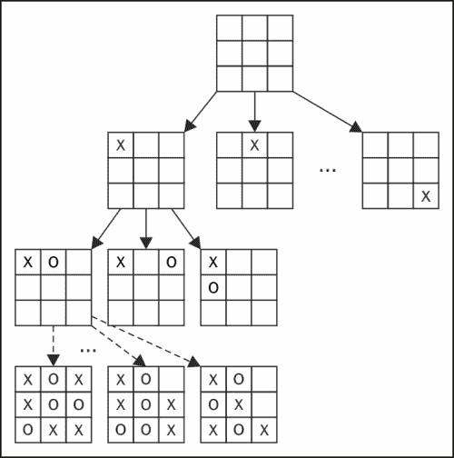
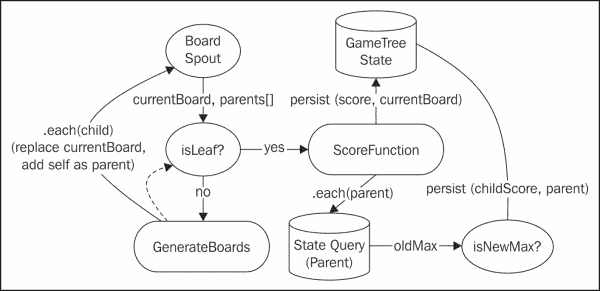
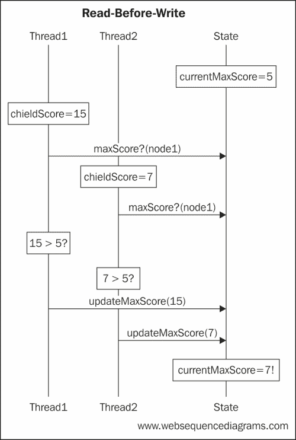
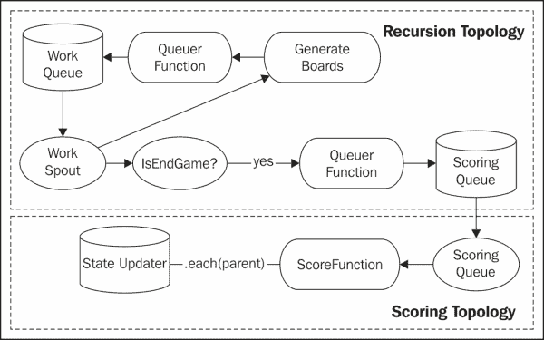
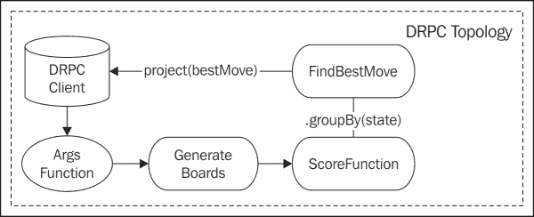

# 第六章：人工智能

在之前的章节中，我们看到了一种模式，它将使用 Storm 进行实时分析与使用 Hadoop 进行批处理相结合。在本章中，我们将朝着另一个方向前进。我们将把 Storm 纳入一个操作系统中，这个系统必须实时响应最终用户的查询。

Storm 的典型应用集中在永无止境的数据流上。数据通常被排队，并由持久拓扑尽可能快地处理。系统包括一个队列，以容纳不同数量的负载。在轻负载时，队列为空。在重负载时，队列将保留数据以供以后处理。

即使是未经训练的眼睛也会认识到这样的系统并不能提供真正的实时数据处理。Storm 监视元组超时，但它专注于 spout 发出数据后元组的处理时间。

为了更完全地支持实时场景，必须从接收数据到响应交付的时间监控超时和服务级别协议（SLA）。如今，请求通常通过基于 HTTP 的 API 接收，并且响应时间 SLA 必须在亚秒级别。

HTTP 是一种同步协议。它经常引入一个像队列这样的异步机制，使系统变得复杂，并引入额外的延迟。因此，当通过 HTTP 公开功能和函数时，我们通常更喜欢与涉及的组件进行同步集成。

在本章中，我们将探讨 Storm 在暴露 Web 服务 API 的架构中的位置。具体来说，我们将构建世界上最好的井字游戏人工智能（AI）系统。我们的系统将包括同步和异步子系统。系统的异步部分将不断工作，探索游戏状态的最佳选项。同步组件公开了一个 Web 服务接口，根据游戏状态返回可能的最佳移动。

本章涵盖以下主题：

+   Storm 中的递归

+   分布式远程过程调用（DRPC）

+   分布式读写前范式

# 为我们的用例设计

人工智能世界的“hello world”是井字游戏。遵循传统，我们也将以此作为我们的主题游戏，尽管架构和方法远远超出了这个简单的例子（例如，全球热核战争；对于其他用例，请参考约翰·巴德姆的《战争游戏》）。

井字游戏是一个 X 和 O 的两人游戏。棋盘是一个 3 x 3 的网格。一个玩家有符号 O，另一个有符号 X，并且轮流进行。在一个回合中，玩家将他们的符号放在网格中的任何空单元格中。如果通过放置他们的符号，完成了三个连续符号的水平、垂直或对角线，那个玩家就赢了。如果所有单元格都填满了而没有形成三个连线，那么游戏就是平局。

为交替轮次的游戏开发人工智能程序的常见方法是递归地探索游戏树，寻找对当前玩家评估最佳的游戏状态（或对对手更糟糕的状态）。游戏树是一个节点为游戏状态的树结构。节点的直接子节点是通过从该节点的游戏状态进行合法移动而可以达到的游戏状态。

井字游戏的一个示例游戏树如下图所示：



遍历游戏树寻找最佳移动的最简单算法是极小化极大化（Minimax）算法。该算法对每个棋盘进行递归评分，并返回找到的最佳分数。对于这个算法，我们假设对手的好分数对于当前玩家来说是坏分数。因此，该算法实际上在最大化和最小化当前棋盘的分数之间交替。极小化极大化算法可以用以下伪代码总结：

```scala
miniMax (board, depth, maximizing)
   if (depth <= 0) 
      return score (board)
   else
      children = move(board)
      if (maximizing)
         bestValue = -∞
      for (child : children)
         value = miniMax (child, depth-1, false)
         if (value > bestValue)
            bestValue = value
         end
end
return bestValue
      else // minimizing
         bestValue = ∞
      for (child : children)
         value = miniMax (child, depth-1, false)
         if (value < bestValue)
            bestValue = value
         end
end
return bestValue
end
end
```

客户端使用游戏状态、深度和布尔变量调用算法，该变量指示算法是否应该寻求最大化或最小化得分。在我们的用例中，游戏状态由棋盘完全封装，棋盘是一个部分填充有 X 和 O 的 3 x 3 网格。

该算法是递归的。代码的前几行是基本情况。这确保了算法不会无休止地递归。这取决于深度变量。在交替轮次的游戏中，深度表示算法应该探索多少轮。

在我们的用例中，风暴拓扑结构不需要跟踪深度。我们将让风暴拓扑结构无休止地探索（或直到从“移动”方法返回没有新棋盘为止）。

通常，每个玩家都会被分配一定的时间，并且必须在规定的时间内进行移动。由于我们更可能有焦躁不安的人类玩家与人工智能竞争，让我们假设系统需要在 200 毫秒内做出响应。

在算法检查基本情况之后，它调用“move（）”方法，该方法返回所有可能移动的棋盘。然后算法循环遍历所有可能的子棋盘。如果最大化，算法找到导致最高得分的子棋盘。如果最小化，算法找到导致最低得分的棋盘。

### 提示

Negamax 算法通过交替得分的符号更简洁地实现了相同的目标。此外，在现实场景中，我们可能会应用 Alpha-Beta 剪枝，该剪枝试图修剪探索的树的分支。算法只考虑落在阈值内的分支。在我们的用例中，这是不必要的，因为搜索空间小到足以完全探索。

在我们简单的用例中，可以枚举整个游戏树。在更复杂的游戏中，比如国际象棋，游戏树是无法枚举的。在极端情况下，比如围棋，专家们已经计算出合法棋盘的数量超过 2 x 10170。

Minimax 算法的目标是遍历游戏树并为每个节点分配得分。在我们的风暴拓扑结构中，对于任何非叶节点的得分只是其后代的最大值（或最小值）。对于叶节点，我们必须将游戏状态解释为相应的得分。在我们简单的用例中，有三种可能的结果：我们赢了，对手赢了，或者游戏是平局。

然而，在我们的同步系统中，我们很可能在到达叶节点之前就用完了时间。在这种情况下，我们需要根据当前棋盘状态计算得分。评分启发式通常是开发 AI 应用程序最困难的部分。

对于我们简单的用例，我们将通过考虑网格中的线来计算任何棋盘的得分。有八条线需要考虑：三条水平线，三条垂直线和两条对角线。每条线根据以下表格对得分有贡献：

| 状态 | 得分 |
| --- | --- |
| --- | --- |
| 当前玩家三排一个 | +1000 |
| 当前玩家两排一个 | +10 |
| 当前玩家一排一个 | +1 |
| 对手三排一个 | -1000 |
| 对手两排一个 | -10 |
| 对手一排一个 | -1 |

前面的表格仅在线中剩余的单元格为空时适用。虽然有改进前面的启发式，但对于这个例子来说已经足够了。而且，由于我们希望风暴能够持续处理我们的游戏树，我们希望不要太依赖启发式。相反，我们将直接依赖叶子得分的最小值（或最大值），这将始终是赢（+1000），输（-1000）或平局（0）。

最后，有了方法、算法和评分函数，我们就能继续进行架构和设计了。

# 建立架构

审查前面的算法，有许多有趣的设计和架构考虑，特别是考虑到 Storm 当前的状态。该算法需要递归。我们还需要一种同步处理请求的方法。Storm 中的递归是一个不断发展的话题，虽然 Storm 提供了一种与拓扑同步交互的方法，但结合对递归的需求，这带来了一些独特和有趣的挑战。

## 审查设计挑战

最初，原生 Storm 提供了一种服务异步过程调用的机制。这个功能就是**分布式远程过程调用**（**DRPC**）。DRPC 允许客户端通过直接向拓扑提交数据来向拓扑发出请求。使用 DRPC，一个简单的 RPC 客户端充当 spout。

随着 Trident 的出现，DRPC 在原生 Storm 中已经被弃用，现在只在 Trident 中得到官方支持。

尽管已经进行了一些探索性工作，探讨了递归/非线性 DRPC，这正是我们在这里需要的，但这并不是一个主流功能（[`groups.google.com/forum/#!topic/storm-user/hk3opTiv3Kc`](https://groups.google.com/forum/#!topic/storm-user/hk3opTiv3Kc)）。

此外，这项工作将依赖于 Storm 中已弃用的类。因此，我们需要找到替代手段来创建一个递归结构，而不依赖于 Storm。

一旦我们找到一种构造来实现递归，我们需要能够同步调用相同的功能。寻求利用 Storm 提供的功能意味着将 DRPC 调用纳入我们的架构中。

## 实现递归

如果我们将我们的算法直接映射到 Storm 构造中，我们会期望一种允许流将数据反馈到自身的方法。我们可以想象一个类似以下逻辑数据流的拓扑：



`BoardSpout`函数在`currentBoard`字段中发出一个棋盘（例如，3 x 3 数组），并使用名为`parents`的第二个字段来存储所有父节点。`parents`字段最初将为空。

`isLeaf`过滤器决定这是否是一个结束状态（例如，胜利、失败或平局）。如果`currentBoard`字段不是一个结束状态，`GenerateBoards`函数会发出所有新的棋盘，用子棋盘替换`currentBoard`字段的值，并将`currentBoard`字段添加到`parents`字段中的节点列表中。`GenerateBoards`函数可以通过 spout 将元组发回，也可以直接进入`isLeaf`过滤器，绕过 spout。

如果`isLeaf`过滤器确定这是一个结束状态，我们需要对`currentBoard`字段进行评分，然后更新所有父节点以反映新的分数。`ScoreFunction`计算棋盘的得分，并将其持久化到`GameTree State`中。

为了更新父节点，我们遍历每个父节点，并查询该节点的当前最大值（或最小值）。如果子节点的得分是新的最大值（或最小值），那么我们将持久化新值。

### 提示

这只是一个逻辑数据流。构建这样的拓扑不仅是不可能的，而且基于以下部分描述的原因也不建议这样做。

您已经可以看到，这个数据流并不像我们的伪代码那样直接。在 Trident 和 Storm 中有一些约束，这些约束迫使我们引入额外的复杂性，而且并非所有在数据流中表达的操作都在 Storm/Trident 中可用。让我们更仔细地检查这个数据流。

### 访问函数的返回值

首先，注意到我们被迫维护自己的调用堆栈，以父节点列表的形式，因为 Storm 和 Trident 没有任何机制可以访问拓扑中下游函数的结果。在经典递归中，递归方法调用的结果立即在函数内部可用，并且可以并入该方法的结果。因此，前面的数据流类似于对问题的更迭方法。

### 不可变元组字段值

其次，在前面的数据流中，我们调用了一个神奇的能力来替换字段的值。我们在`GenerateBoards`函数中进行了递归发出。用新的棋盘替换`currentBoard`字段是不可能的。此外，将`currentBoard`字段添加到父节点列表中将需要更新`parents`字段的值。在 Trident 中，元组是不可变的。

### 前期字段声明

为了解决元组的不可变性，我们可以始终向元组添加额外的字段——每个递归层都要添加一个字段——但 Trident 要求在部署之前声明所有字段。

### 递归中的元组确认

在考虑这个数据流中的元组确认时，我们还有其他问题。在什么时候确认触发处理的初始元组？从逻辑数据流的角度来看，直到该节点的所有子节点都被考虑并且游戏树状态反映了这些分数之前，初始元组都不应该被确认。然而，计算任何非平凡游戏的大部分游戏树子部分的处理时间很可能会超过任何元组超时。

### 输出到多个流

拓扑的另一个问题是从`isLeaf`过滤器发出的多条路径。目前，在 Trident 中没有办法在多个流中输出。增强功能可以在[`issues.apache.org/jira/browse/STORM-68`](https://issues.apache.org/jira/browse/STORM-68)找到。

正如我们将看到的，您可以通过在两个流上分叉并将决策作为过滤器影响这一点。

### 写入前读取

最后，因为我们无法访问返回值，更新父节点分数需要一个读取前写入的范式。这在任何分布式系统中都是一种反模式。以下序列图演示了在缺乏锁定机制的情况下读取前写入构造中出现的问题：



在上图中，有两个独立操作的线程。在我们的用例中，当多个子节点同时完成并尝试同时解析父节点的最大分数时，就会发生这种情况。

第一个线程正在解析子节点的分数为**7**。第二个线程正在解析子节点的分数为**15**。它们都在解析同一个节点。在过程结束时，新的最大值应该是**15**，但由于线程之间没有协调，最大分数变成了**7**。

第一个线程读取节点的当前最大分数，返回**5**。然后，第二个线程从状态中读取，也收到**5**。两个线程将当前最大值与它们各自的子节点分数进行比较，并用新值更新最大值。由于第二个线程的更新发生在第一个之后，结果是父节点的最大值不正确。

在下一节中，我们将看到如何正确解决前面的约束，以产生一个功能性的系统。

## 解决挑战

为了适应前面部分概述的约束，我们将拓扑分成两部分。第一个拓扑将执行实际的递归。第二个拓扑将解析分数。这在下图中显示：



系统分为两个拓扑：“递归拓扑”和“评分拓扑”。递归拓扑尝试枚举系统中的所有棋盘。评分拓扑尝试对递归拓扑枚举的所有棋盘进行评分。

为了影响递归，我们在系统中引入了两个队列。第一个队列，“工作队列”，包含我们需要访问的节点列表。递归拓扑通过“工作喷口”从该队列中获取。如果节点不是叶子节点，拓扑将排队子节点的棋盘。工作队列上的消息格式如下：

```scala
(board, parents[])
```

每个`board`都是一个 3x3 的数组。`parents`数组包含所有父棋盘。

如果节点是叶子节点，棋盘将使用相同的消息格式排队到“评分队列”上。评分拓扑通过“评分喷口”从评分队列中读取。评分函数对节点进行评分。棋盘必然是叶子节点，因为这是排队进行评分的唯一类型的节点。然后，评分函数对当前节点和每个父节点发出一个元组。

然后我们需要更新状态。由于我们之前概述的竞争条件，查询和写入范式被封装在一个函数中。在接下来的设计中，我们将演示如何适应读写之前引入的竞争条件。

然而，在我们继续设计之前，请注意，因为我们引入了队列，我们清楚地划定了可以确认元组的线路。在第一个拓扑中，当以下情况之一为真时，元组被确认：

+   拓扑已经枚举并排队了节点的后代

+   拓扑已经将节点排队进行评分

在第二个拓扑中，当当前棋盘及其所有父节点都已更新以反映叶子节点中的值时，元组被确认。

还要注意的是，在处理过程中我们不需要引入新的字段或改变现有字段。第一个拓扑中使用的唯一字段是`board`和`parents`。第二个拓扑相同，但添加了一个额外的字段来捕获分数。

还要注意，我们分叉了从工作喷口出来的流。这是为了适应我们不能从单个函数中发出多个流的事实。相反，`GenerateBoards`和`IsEndGame`都必须确定游戏是否已经结束并做出相应反应。在`GenerateBoards`中，元组被过滤以避免无限递归。在`IsEndGame`中，元组被传递以进行评分。当函数能够发出到不同的流时，我们将能够将此函数合并为一个单一的“决策”过滤器，选择元组应该继续的流。

# 实施架构

现在让我们深入了解实现的细节。为了举例说明，以下代码假设拓扑在本地运行。我们使用内存队列而不是持久队列，并使用哈希映射作为我们的存储机制。在真正的生产实现中，我们很可能会使用诸如 Kafka 之类的持久队列系统和诸如 Cassandra 之类的分布式存储机制。

## 数据模型

我们将深入研究每个拓扑，但首先，让我们看看数据模型。为了简化，我们将游戏逻辑和数据模型封装到两个类中：`Board`和`GameState`。

以下是`Board`类的列表：

```scala
public class Board implements Serializable {
public static final String EMPTY = ' ';
   public String[][] board = { { EMPTY, EMPTY, EMPTY },
{ EMPTY, EMPTY, EMPTY }, { EMPTY, EMPTY, EMPTY } };

public List<Board> nextBoards(String player) {
        List<Board> boards = new ArrayList<Board>();
        for (int i = 0; i < 3; i++) {
            for (int j = 0; j < 3; j++) {
                if (board[i][j].equals(EMPTY)) {
                    Board newBoard = this.clone();
                    newBoard.board[i][j] = player;
                    boards.add(newBoard);
                }
            }
        }
        return boards;
    }

    public boolean isEndState() {
        return (nextBoards('X').size() == 0 
|| Math.abs(score('X')) > 1000);
    }

    public int score(String player){
        return scoreLines(player) – 
            scoreLines(Player.next(player));
    }

    public int scoreLines(String player) {
        int score = 0;
        // Columns
        score += scoreLine(board[0][0], board[1][0], board[2][0], player);
        score += scoreLine(board[0][1], board[1][1], board[2][1], player);
        score += scoreLine(board[0][2], board[1][2], board[2][2], player);

        // Rows
        score += scoreLine(board[0][0], board[0][1], board[0][2], player);
        score += scoreLine(board[1][0], board[1][1], board[1][2], player);
        score += scoreLine(board[2][0], board[2][1], board[2][2], player);

       // Diagonals
        score += scoreLine(board[0][0], board[1][1], board[2][2], player);
        score += scoreLine(board[2][0], board[1][1], board[0][2], player);
        return score;
    }

    public int scoreLine(String pos1, String pos2, String pos3, String player) {
        int score = 0;
        if (pos1.equals(player) && pos2.equals(player) && pos3.equals(player)) {
            score = 10000;
        } else if ((pos1.equals(player) && pos2.equals(player) && pos3.equals(EMPTY)) ||
                (pos1.equals(EMPTY) && pos2.equals(player) && pos3.equals(player)) ||
                (pos1.equals(player) && pos2.equals(EMPTY) && pos3.equals(player))) {
            score = 100;
        } else {
            if (pos1.equals(player) && pos2.equals(EMPTY) && pos3.equals(EMPTY) ||
                    pos1.equals(EMPTY) && pos2.equals(player) && pos3.equals(EMPTY) ||
                    pos1.equals(EMPTY) && pos2.equals(EMPTY) && pos3.equals(player)){
                score = 10;
            }
        }
        return score;
    }
...
    public String toKey() {
        StringBuilder sb = new StringBuilder();
        for (int i = 0; i < 3; i++) {
            for (int j = 0; j < 3; j++) {
                sb.append(board[i][j]);
            }
        }
        return sb.toString();
    }
}
```

`Board`类提供了三个主要函数。`Board`类封装了棋盘本身，作为成员变量以多维字符串数组的形式存在。然后它提供将生成子棋盘的函数（例如，`nextBoards()`），确定游戏是否已经结束（例如，`isEndState()`），最后，提供一个计算棋盘得分的方法，当提供了一个玩家时（例如，`nextBoards(player)`及其支持方法）。

还要注意`Board`类提供了一个`toKey()`方法。这个键唯一地表示了棋盘，这是我们在访问我们的持久性机制时将使用的唯一标识符。在这种情况下，唯一标识符只是棋盘网格中的值的串联。

为了完全表示游戏状态，我们还需要知道当前轮到哪个玩家。因此，我们有一个封装了棋盘和当前玩家的高级对象。这是`GameState`对象，其清单如下所示：

```scala
public class GameState implements Serializable {
private Board board;
    private List<Board> history;
    private String player;

...

    public String toString(){
        StringBuilder sb = new StringBuilder('GAME [');
        sb.append(board.toKey()).append(']');
        sb.append(': player(').append(player).append(')\n');
        sb.append('   history [');
        for (Board b : history){
            sb.append(b.toKey()).append(',');
        }
        sb.append(']');
        return sb.toString();
    }
}
```

在这个类中没有什么特别令人惊讶的，除了`history`变量。这个成员变量跟踪了这条游戏树路径上的所有先前的棋盘状态。这是更新游戏树以获得叶节点得分所需的面包屑路径。

最后，我们用`Player`类表示游戏中的玩家，如下所示：

```scala
public class Player {
    public static String next(String current){
        if (current.equals('X')) return 'O';
        else return 'X';
    }
}
```

## 检查递归拓扑

有了之前概述的数据模型，我们可以创建一个递归下棋树的拓扑结构。在我们的实现中，这是`RecursiveTopology`类。拓扑的代码如下所示：

```scala
public class RecursiveTopology {

    public static StormTopology buildTopology() {
        LOG.info('Building topology.');
        TridentTopology topology = new TridentTopology();

        // Work Queue / Spout
        LocalQueueEmitter<GameState> workSpoutEmitter = 
new LocalQueueEmitter<GameState>('WorkQueue');
        LocalQueueSpout<GameState> workSpout = 
new LocalQueueSpout<GameState>(workSpoutEmitter);
        GameState initialState = 
new GameState(new Board(),
new ArrayList<Board>(), 'X');
        workSpoutEmitter.enqueue(initialState);

        // Scoring Queue / Spout
        LocalQueueEmitter<GameState> scoringSpoutEmitter = 
new LocalQueueEmitter<GameState>('ScoringQueue');

        Stream inputStream = 
topology.newStream('gamestate', workSpout);

        inputStream.each(new Fields('gamestate'),
new isEndGame())
                .each(new Fields('gamestate'),
                    new LocalQueuerFunction<GameState>(scoringSpoutEmitter),
 new Fields(''));

        inputStream.each(new Fields('gamestate'),
new GenerateBoards(),
new Fields('children'))
            .each(new Fields('children'),
                    new LocalQueuerFunction<GameState>(workSpoutEmitter),
                    new Fields());

        return topology.build();
    }
...
}
```

第一部分配置了工作和评分的内存队列。输入流是从一个单个 spout 配置的，该 spout 从工作队列中工作。这个队列被初始化为初始游戏状态。

然后将流分叉。叉的第一个叉齿仅用于终局棋盘，然后将其传递到评分队列。叉的第二个叉齿生成新的棋盘并将后代排队。

## 队列交互

对于这个示例实现，我们使用了内存队列。在真实的生产系统中，我们会依赖 Kafka spout。`LocalQueueEmitter`类的清单如下所示。请注意，队列是`BlockingQueue`实例的实例，位于一个映射内，将队列名称链接到`BlockingQueue`实例。这是一个方便的类，用于测试使用单个队列作为输入和输出的拓扑（即递归拓扑）：

```scala
public class LocalQueueEmitter<T> implements Emitter<Long>, Serializable {
public static final int MAX_BATCH_SIZE=1000;
public static AtomicInteger successfulTransactions = 
new AtomicInteger(0);
    private static Map<String, BlockingQueue<Object>> queues =
 new HashMap<String, BlockingQueue<Object>>();
private static final Logger LOG = 
LoggerFactory.getLogger(LocalQueueEmitter.class);
    private String queueName;

    public LocalQueueEmitter(String queueName) {
        queues.put(queueName, new LinkedBlockingQueue<Object>());
        this.queueName = queueName;
    }

    @Override
    public void emitBatch(TransactionAttempt tx,
 Long coordinatorMeta, TridentCollector collector) {
        int size=0;
        LOG.debug('Getting batch for [' +
 tx.getTransactionId() + ']');
        while (getQueue().peek() != null && 
size <= MAX_BATCH_SIZE) {
            List<Object> values = new ArrayList<Object>();
            try {
                LOG.debug('Waiting on work from [' +
 this.queueName + ']:[' + 
getQueue().size() + ']');
                values.add(getQueue().take());
                LOG.debug('Got work from [' + 
this.queueName + ']:[' + 
getQueue().size() + ']');
            } catch (InterruptedException ex) {
                // do something smart
            }
            collector.emit(values);
            size++;
        }
        LOG.info('Emitted [' + size + '] elements in [' + 
            tx.getTransactionId() + '], [' + getQueue().size()
+ '] remain in queue.');
    }
...
    public void enqueue(T work) {
        LOG.debug('Adding work to [' + this.queueName +
 ']:[' + getQueue().size() + ']');
        if (getQueue().size() % 1000 == 0)
            LOG.info('[' + this.queueName + '] size = [' + 
			getQueue().size() + '].');
        this.getQueue().add(work);
    }

    public BlockingQueue<Object> getQueue() {
        return LocalQueueEmitter.queues.get(this.queueName);
    }
...
}
```

该类中的主要方法是`Emitter`接口的`emitBatch`实现。这只是在队列中有数据且未达到最大批量大小时读取。

还要注意，该类提供了一个`enqueue()`方法。`enqueue()`方法由我们的`LocalQueueFunction`类用于完成递归。`LocalQueueFunction`类的清单如下所示：

```scala
public class LocalQueuerFunction<T>  extends BaseFunction {
    private static final long serialVersionUID = 1L;
    LocalQueueEmitter<T> emitter;

    public LocalQueuerFunction(LocalQueueEmitter<T> emitter){
        this.emitter = emitter;
    }

    @SuppressWarnings('unchecked')
    @Override
    public void execute(TridentTuple tuple, TridentCollector collector) {
        T object = (T) tuple.get(0);
        Log.debug('Queueing [' + object + ']');
        this.emitter.enqueue(object);
    }
}
```

请注意，函数实际上是使用 spout 使用的`emitter`函数实例化的。这允许函数直接将数据排入 spout。同样，这种构造在开发递归拓扑时很有用，但是真实的生产拓扑很可能会使用持久存储。没有持久存储，存在数据丢失的可能性，因为元组在处理（递归）完成之前就被确认。

## 函数和过滤器

现在，我们将注意力转向与此拓扑特定的函数和过滤器。首先是一个简单的过滤器，用于过滤出终局棋盘。`IsEndGame`过滤器的代码如下所示：

```scala
public class IsEndGame extends BaseFilter {
...
    @Override
    public boolean isKeep(TridentTuple tuple) {
        GameState gameState = (GameState) tuple.get(0);
        boolean keep = (gameState.getBoard().isEndState());
        if (keep){
            LOG.debug('END GAME [' + gameState + ']');
        }
        return keep;
    }
}
```

请注意，如果 Trident 支持从单个函数向不同流发出元组，则此类是不必要的。在以下`IsEndGame`函数的清单中，它执行相同的检查/过滤功能：

```scala
public class GenerateBoards extends BaseFunction {

    @Override
    public void execute(TridentTuple tuple,
TridentCollector collector) {
        GameState gameState = (GameState) tuple.get(0);
        Board currentBoard = gameState.getBoard();
        List<Board> history = new ArrayList<Board>();
        history.addAll(gameState.getHistory());
        history.add(currentBoard);

        if (!currentBoard.isEndState()) {
            String nextPlayer = 
			Player.next(gameState.getPlayer());
            List<Board> boards = 
			gameState.getBoard().nextBoards(nextPlayer);
            Log.debug('Generated [' + boards.size() + 
'] children boards for [' + gameState.toString() +
']');
            for (Board b : boards) {
                GameState newGameState = 
new GameState(b, history, nextPlayer);
                List<Object> values = new ArrayList<Object>();
                values.add(newGameState);
                collector.emit(values);
            }
        } else {
            Log.debug('End game found! [' + currentBoard + ']');
        }
    }
}
```

该函数将当前棋盘添加到历史列表中，然后排队一个新的`GameState`对象，带有子棋盘位置。

### 提示

或者，我们可以将`IsEndGame`实现为一个函数，添加另一个字段来捕获结果；然而，使用这个作为一个例子来激励函数内部具有多个流能力更有建设性。

以下是递归拓扑的示例输出：

```scala
2013-12-30 21:53:40,940-0500 | INFO [Thread-28] IsEndGame.isKeep(20) | END GAME [GAME [XXO X OOO]: player(O)
   history [         ,      O  ,    X O  ,    X OO ,X   X OO ,X O X OO ,XXO X OO ,]]
2013-12-30 21:53:40,940-0500 | INFO [Thread-28] IsEndGame.isKeep(20) | END GAME [GAME [X OXX OOO]: player(O)
   history [         ,      O  ,    X O  ,    X OO ,X   X OO ,X O X OO ,X OXX OO ,]]
2013-12-30 21:53:40,940-0500 | INFO [Thread-28] LocalQueueEmitter.enqueue(61) | [ScoringQueue] size = [42000]
```

## 检查评分拓扑

评分拓扑结构更直接，因为它是线性的。复杂的方面是状态的更新，以避免读写竞争条件。

拓扑结构的代码如下：

```scala
public static StormTopology buildTopology() {
TridentTopology topology = new TridentTopology();

GameState exampleRecursiveState =
 GameState.playAtRandom(new Board(), 'X');
LOG.info('SIMULATED STATE : [' + exampleRecursiveState + ']');

// Scoring Queue / Spout
LocalQueueEmitter<GameState> scoringSpoutEmitter = 
new LocalQueueEmitter<GameState>('ScoringQueue');
scoringSpoutEmitter.enqueue(exampleRecursiveState);
LocalQueueSpout<GameState> scoringSpout = 
new LocalQueueSpout<GameState>(scoringSpoutEmitter);

Stream inputStream = 
topology.newStream('gamestate', scoringSpout);

inputStream.each(new Fields('gamestate'), new IsEndGame())
                .each(new Fields('gamestate'),
                        new ScoreFunction(),
                        new Fields('board', 'score', 'player'))
                .each(new Fields('board', 'score', 'player'), 
new ScoreUpdater(), new Fields());
return topology.build();
}
```

只有两个函数：`ScoreFunction` 和 `ScoreUpdater`。`ScoreFunction` 为历史上的每个棋盘评分并发出该得分。

`ScoreFunction` 的列表如下代码片段所示：

```scala
public class ScoreFunction extends BaseFunction {

@Override
public void execute(TridentTuple tuple, 
TridentCollector collector) {
        GameState gameState = (GameState) tuple.get(0);
        String player = gameState.getPlayer();
        int score = gameState.score();

        List<Object> values = new ArrayList<Object>();
        values.add(gameState.getBoard());
        values.add(score);
        values.add(player);
        collector.emit(values);

        for (Board b : gameState.getHistory()) {
            player = Player.next(player);
            values = new ArrayList<Object>();
            values.add(b);
            values.add(score);
            values.add(player);
            collector.emit(values);
        }
    }
}
```

该函数简单地为当前棋盘评分并为当前棋盘发出一个元组。然后，该函数循环遍历玩家，为每个棋盘发出元组，并在每轮中交换玩家。

最后，我们有`ScoreUpdater` 函数。同样，我们为示例保持简单。以下是该类的代码：

```scala
public class ScoreUpdater extends BaseFunction {
...
private static final Map<String, Integer> scores =
 new HashMap<String, Integer>();
private static final String MUTEX = 'MUTEX';

@Override
public void execute(TridentTuple tuple,
TridentCollector collector) {
    Board board = (Board) tuple.get(0);
    int score = tuple.getInteger(1);
    String player = tuple.getString(2);
    String key = board.toKey();
    LOG.debug('Got (' + board.toKey() + ') => [' + score +
 '] for [' + player + ']');

    // Always compute things from X's perspective
    // We'll flip things when we interpret it if it is O's turn.
    synchronized(MUTEX){
         Integer currentScore = scores.get(key);
         if (currentScore == null ||
(player.equals('X') && score > currentScore)){
                updateScore(board, score);
            } else if (player.equals('O') &&
score > currentScore){
                updateScore(board, score);
            }
        }
    }

    public void updateScore(Board board, Integer score){
        scores.put(board.toKey(), score);
        LOG.debug('Updating [' + board.toString() + 
']=>[' + score + ']');
    }
}
```

### 解决读写问题

请注意，在前面的代码中，我们使用互斥锁来对得分的更新进行排序，从而消除了之前提到的竞争条件。这仅在我们在单个/本地 JVM 中运行时才有效。当此拓扑结构部署到真实集群时，这将不起作用；但是，我们有一些选项来解决这个问题。

#### 分布式锁定

正如我们在其他章节中看到的，可以利用分布式锁定机制，例如 ZooKeeper。在这种方法中，ZooKeeper 提供了一种在多个主机之间维护互斥锁的机制。这当然是一种可行的方法，但分布式锁定会带来性能成本。每个操作都会产生开销，以适应现实中可能是不经常发生的情况。

#### 过时时重试

可能有用的另一种模式是*过时时重试*方法。在这种情况下，除了数据之外，我们还会拉回一个版本号、时间戳或校验和。然后，我们执行条件更新，包括版本/时间戳/校验和信息在一个子句中，如果元数据发生了变化（例如，在 SQL/CQL 范式中将`WHERE`子句添加到`UPDATE`语句中），则更新将失败。如果元数据发生了变化，表示我们基于的值现在已经过时，我们应该重新选择数据。

显然，这些方法之间存在权衡。在重试中，如果存在大量争用，一个线程可能需要重试多次才能提交更新。然而，使用分布式锁定时，如果单个线程被卡住、与服务器失去通信或完全失败，可能会遇到超时问题。

### 提示

最近，在这个领域已经有了一些进展。我建议您查看 Paxos 和 Cassandra 在以下 URL 中使用该算法来影响条件更新：

+   [`research.microsoft.com/en-us/um/people/lamport/pubs/paxos-simple.pdf`](http://research.microsoft.com/en-us/um/people/lamport/pubs/paxos-simple.pdf)

+   [`www.datastax.com/dev/blog/lightweight-transactions-in-cassandra-2-0`](http://www.datastax.com/dev/blog/lightweight-transactions-in-cassandra-2-0)

在我们的简单情况中，我们非常幸运，实际上可以直接将逻辑合并到更新中。考虑以下 SQL 语句：

```scala
UPDATE gametree SET score=7 WHERE
boardkey = '000XX OXX' AND score <=7;
```

由于我们已经解决了读写问题，拓扑结构适合对递归拓扑结构排队的所有棋盘进行评分。该拓扑结构为终局状态分配一个值，并将该值传播到游戏树上，将适当的得分与相应的游戏状态持久化。在真实的生产系统中，我们将从 DRPC 拓扑结构访问该状态，以便能够提前多回合。

#### 执行拓扑结构

以下是评分拓扑结构的示例输出：

```scala
2013-12-31 13:19:14,535-0500 | INFO [main] ScoringTopology.buildTopology(29) | SIMULATED LEAF NODE : [
---------
|X||O||X|
---------
|O||O||X|
---------
|X||X||O|
---------
] w/ state [GAME [XOXOOXXXO]: player(O)
 history [         ,  X      , OX      , OX  X   , OX  X  O, OX  XX O, OXO XX O, OXO XXXO, OXOOXXXO,]]
2013-12-31 13:19:14,536-0500 | INFO [main] LocalQueueEmitter.enqueue(61) | [ScoringQueue] size = [0].
2013-12-31 13:19:14,806-0500 | INFO [main] ScoringTopology.main(52) | Topology submitted.
2013-12-31 13:19:25,566-0500 | INFO [Thread-24] DefaultCoordinator.initializeTransaction(25) | Initializing Transaction [1]
2013-12-31 13:19:25,570-0500 | DEBUG [Thread-30] LocalQueueEmitter.emitBatch(37) | Getting batch for [1]
2013-12-31 13:19:25,570-0500 | DEBUG [Thread-30] LocalQueueEmitter.emitBatch(41) | Waiting on work from [ScoringQueue]:[1]
2013-12-31 13:19:25,570-0500 | DEBUG [Thread-30] LocalQueueEmitter.emitBatch(43) | Got work from [ScoringQueue]:[0]
2013-12-31 13:19:25,571-0500 | DEBUG [Thread-30] LocalQueueEmitter.emitBatch(41) | Waiting on work from [ScoringQueue]:[0]
2013-12-31 13:19:25,571-0500 | INFO [Thread-28] IsEndGame.isKeep(20) | END GAME [GAME [XOXOOXXXO]: player(O)
 history [         ,  X      , OX      , OX  X   , OX  X  O, OX  XX O, OXO XX O, OXO XXXO, OXOOXXXO,]]
...
 ScoreUpdater.updateScore(43) | Updating [
---------
| ||O||X|
---------
|O|| ||X|
---------
|X||X||O|
---------
]=>[0]
2013-12-31 13:19:25,574-0500 | DEBUG [Thread-28] ScoreUpdater.execute(27) | Got ( OXOOXXXO) => [0] for [X]
2013-12-31 13:19:25,574-0500 | DEBUG [Thread-28] ScoreUpdater.updateScore(43) | Updating [
---------
| ||O||X|
---------
|O||O||X|
---------
|X||X||O|
---------
]=>[0]

```

它正在解决列表开头显示的平局叶节点。之后，您可以看到该值在那之后通过父节点传播，更新这些节点的当前得分。

### 枚举游戏树

将递归拓扑与评分拓扑相结合的最终结果是一组拓扑不断协作，以尽可能多地枚举问题空间。很可能，这个过程将与启发式算法相结合，只存储关键节点。此外，我们将使用启发式算法修剪搜索空间，以减少我们需要评估的板的数量。然而，无论如何，我们都需要通过接口与系统进行交互，以确定在当前游戏状态下的最佳移动。这将是我们下一节要解决的问题。

## 分布式远程过程调用（DRPC）

现在我们有一个功能正常的递归拓扑，它将不断寻求计算整个游戏树，让我们来看看同步调用。Storm 提供的 DRPC 功能已被移植到 Trident，并在 Storm 中已被弃用。这是在本例中使用 Trident 的主要动机。

使用 DRPC，您构建拓扑的方式与异步情况下的方式非常相似。以下图表显示了我们的 DRPC 拓扑：



DRPC 客户端充当一个喷口。客户端的输出经过`ArgsFunction`，它规范化输入，以便我们可以重用现有的函数：`GenerateBoards`和`ScoreFunction`。然后，我们使用`.groupBy(state)`并使用`Aggregator`类的`FindBestMove`来聚合结果。然后，我们执行一个简单的投影，只将最佳移动返回给客户端。

### 提示

您可能还想看一下 Spring Breeze，它允许您将 POJO 连接到 Storm 拓扑中。这是另一种获得重用的方法，因为这些相同的 POJO 可以通过 Web 服务公开而不引入 DRPC。

[`github.com/internet-research-network/breeze`](https://github.com/internet-research-network/breeze)

首先，我们将看一下拓扑的代码：

```scala
public static void main(String[] args) throws Exception {
final LocalCluster cluster = new LocalCluster();
final Config conf = new Config();

LocalDRPC client = new LocalDRPC();
TridentTopology drpcTopology = new TridentTopology();

drpcTopology.newDRPCStream('drpc', client)
                .each(new Fields('args'),
new ArgsFunction(),
new Fields('gamestate'))
                .each(new Fields('gamestate'),
new GenerateBoards(),
new Fields('children'))
                .each(new Fields('children'),
new ScoreFunction(),
new Fields('board', 'score', 'player'))
                .groupBy(new Fields('gamestate'))
                .aggregate(new Fields('board', 'score'),
new FindBestMove(), new Fields('bestMove'))
                .project(new Fields('bestMove'));

cluster.submitTopology('drpcTopology', conf,
         drpcTopology.build());

Board board = new Board();
board.board[1][1] = 'O';
board.board[2][2] = 'X';
board.board[0][1] = 'O';
board.board[0][0] = 'X';
LOG.info('Determining best move for O on:' + 
               board.toString());
LOG.info('RECEIVED RESPONSE [' + 
client.execute('drpc', board.toKey()) + ']');
}
```

对于这个例子，我们使用了一个`LocalDRPC`客户端。这作为`newDRPCStream`调用的参数传入，这是 DRPC 拓扑的关键。从那里开始，拓扑函数就像一个普通的拓扑一样运行。

通过`client.execute()`方法，您可以看到实际的远程过程调用发生。目前，该方法的签名仅接受和返回字符串。有一个未解决的增强请求来更改这个签名。您可以在[`issues.apache.org/jira/browse/STORM-42`](https://issues.apache.org/jira/browse/STORM-42)找到该增强请求。

由于当前签名只接受字符串，我们需要对输入进行编组。这发生在`ArgsFunction`中，如下面的代码片段所示：

```scala
    @Override
    public void execute(TridentTuple tuple, 
TridentCollector collector) {
        String args = tuple.getString(0);
        Log.info('Executing DRPC w/ args = [' + args + ']');
        Board board = new Board(args);
        GameState gameState = 
new GameState(board, new ArrayList<Board>(), 'X');
        Log.info('Emitting [' + gameState + ']');

        List<Object> values = new ArrayList<Object>();
        values.add(gameState);
        collector.emit(values);
    }
```

我们对`client.execute()`的调用的第二个参数是一个包含我们输入的字符串。在这种情况下，您可以在拓扑代码中看到我们传入了板的键。这是一个 3x3 的网格，其中单元格被串联为一个字符串。为了将该字符串编组为一个板，我们向`Board`类添加了一个解析字符串为板的构造函数，如下面的代码片段所示：

```scala
    public Board(String key) {
        for (int i = 0; i < 3; i++) {
            for (int j = 0; j < 3; j++) {
                this.board[i][j] = '' + key.charAt(i*3+j);
            }
        }
    }
```

在 DRPC 拓扑中应用的下两个函数演示了通过利用 DRPC 作为同步接口可以实现的重用。在这种情况下，我们是独立利用这些函数，但您可以想象您也可以重用更复杂的数据流。

使用`GenerateBoard`函数，我们发出当前板的所有子板。然后，`ScoreFunction`对每个板进行评分。

与评分拓扑一样，`ScoreFunction`的输出是`board`、`score`和`player`的三元组。这些是每个子板的分数。为了确定我们的下一个最佳移动，我们只需要最大化（或最小化）这个值。这可以通过一个简单的`Aggregator`来实现。我们创建了一个名为`FindBestMove`的聚合函数，如下面的代码片段所示：

```scala
public class FindBestMove extends BaseAggregator<BestMove> {
    private static final long serialVersionUID = 1L;

    @Override
    public BestMove init(Object batchId, 
TridentCollector collector) {
        Log.info('Batch Id = [' + batchId + ']');
        return new BestMove();
    }

    @Override
    public void aggregate(BestMove currentBestMove, 
TridentTuple tuple, TridentCollector collector) {  
        Board board = (Board) tuple.get(0);
        Integer score = tuple.getInteger(1);
        if (score > currentBestMove.score){
            currentBestMove.score = score;
            currentBestMove.bestMove = board;
        }
    }

    @Override
    public void complete(BestMove bestMove, 
TridentCollector collector) {
        collector.emit(new Values(bestMove));        
    }

}
```

这个聚合扩展了`BaseAggregator`，它是一个 Java 泛型。在这种情况下，我们希望发出最佳的移动，结合它的得分。因此，我们使用`BestMove`类参数化`BaseAggregator`类，它的简单定义如下：

```scala
public class BestMove {
    public Board bestMove;
    public Integer score = Integer.MIN_VALUE;

    public String toString(){
        return bestMove.toString() + '[' + score + ']';
    }
}
```

如果你回忆一下，对于聚合，Trident 最初调用`init()`方法，该方法返回初始的聚合值。在我们的情况下，我们只是用最差的移动来初始化`BestMove`类。注意`BestMove`类的得分变量被初始化为绝对最小值。然后，Trident 调用`aggregate()`方法，允许函数将元组合并到聚合值中。聚合也可以在这里发出值，但由于我们只关心最终的最佳移动，所以我们不从`aggregate()`方法中发出任何东西。最后，Trident 在所有元组的值都被聚合后调用`complete()`方法。在这个方法中，我们发出最终的最佳移动。

以下是拓扑结构的输出：

```scala
2013-12-31 13:53:42,979-0500 | INFO [main] DrpcTopology.main(43) | Determining best move for O on:
---------
|X||O|| |
---------
| ||O|| |
---------
| || ||X|
---------

00:00  INFO: Executing DRPC w/ args = [XO  O   X]
00:00  INFO: Emitting [GAME [XO  O   X]: player(X)
 history []]
00:00  INFO: Batch Id = [storm.trident.spout.RichSpoutBatchId@1e8466d2]
2013-12-31 13:53:44,092-0500 | INFO [main] DrpcTopology.main(44) | RECEIVED RESPONSE [[[
---------
|X||O|| |
---------
| ||O|| |
---------
| ||O||X|
---------
[10000]]]]

```

在这个例子中，轮到 O 方了，他或她有一个得分机会。你可以看到拓扑正确地识别了得分机会，并将其作为最佳移动返回（带有适当的得分值）。

### 远程部署

我们展示的是 DRPC 拓扑的本地调用。要调用远程拓扑，你需要启动 DRPC 服务器。你可以通过执行带有`drpc`参数的 Storm 脚本来实现这一点，如下面的代码片段所示：

```scala
bin/storm drpc
```

Storm 集群将连接到 DRPC 服务器接收调用。为了做到这一点，它需要知道 DRPC 服务器的位置。这些位置在`storm.yaml`文件中指定如下：

```scala
drpc.servers: 
- 'drpchost1 ' 
- 'drpchost2'

```

配置好服务器并启动 DRPC 服务器后，拓扑就像任何其他拓扑一样被提交，DRPC 客户端可以从任何需要大规模同步分布式处理的 Java 应用程序中使用。要从本地 DRPC 客户端切换到远程客户端，唯一需要更改的是 DRPC 客户端的实例化。你需要使用以下行：

```scala
DRPCClient client = new DRPCClient('drpchost1', 3772);
```

这些参数指定了 DRPC 服务器的主机和端口，并应与 YAML 文件中的配置匹配。

# 总结

在本章中，我们处理了一个人工智能用例。在这个领域中有许多问题利用了树和图数据结构，而对于这些数据结构最合适的算法通常是递归的。为了演示这些算法如何转化为 Storm，我们使用了 Minimax 算法，并使用 Storm 的构造实现了它。

在这个过程中，我们注意到了 Storm 中的一些约束条件，使得它比预期的更加复杂，我们也看到了能够绕过这些约束条件并产生可工作/可扩展系统的模式和方法。

此外，我们介绍了 DRPC。DRPC 可以用于向客户端公开同步接口。DRPC 还允许设计在同步和异步接口之间重用代码和数据流。

将同步和异步拓扑与共享状态结合起来，不仅对于人工智能应用而言是一个强大的模式，对于分析也是如此。通常，新数据持续在后台到达，但用户通过同步接口查询这些数据。当你将 DRPC 与其他章节介绍的 Trident 状态能力结合起来时，你应该能够构建一个能够满足实时分析用例的系统。

在下一章中，我们将 Storm 与非事务实时分析系统 Druid 集成。我们还将更深入地研究 Trident 和 ZooKeeper 的分布式状态管理。
