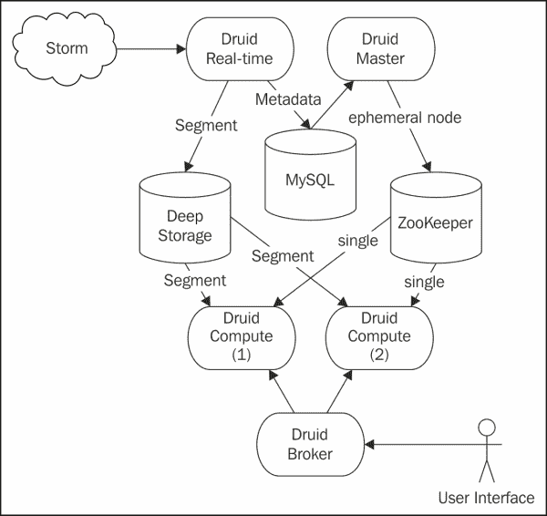
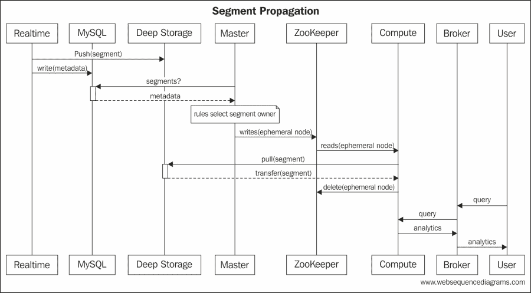
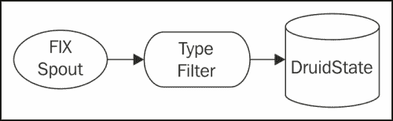
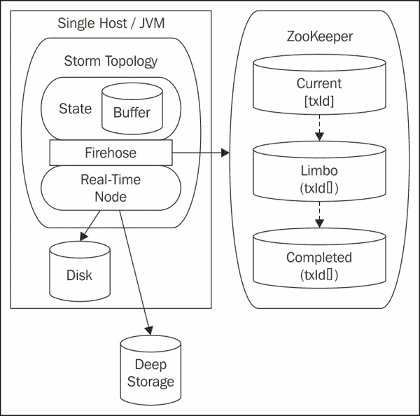
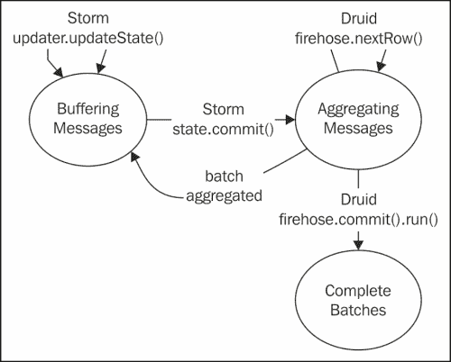
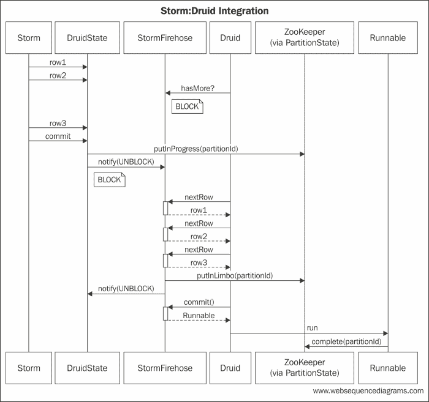
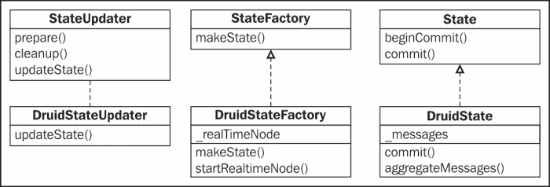

# 第七章：集成 Druid 进行金融分析

在本章中，我们将扩展 Trident 的使用，创建一个实时金融分析仪表板。该系统将处理金融消息，以在不同粒度上随时间提供股票定价信息。该系统将展示与非事务性系统的集成，使用自定义状态实现。

在前面的例子中，我们使用 Trident 来统计随时间变化的事件总数。对于分析数据的简单用例来说已经足够了，但是架构设计并不灵活。要引入新的维度需要 Java 开发和部署新代码。

传统上，数据仓库技术和商业智能平台用于计算和存储维度分析。数据仓库作为**On-line Analytics Processing** (**OLAP**)系统的一部分部署，与**On-line Transaction Processing** (**OLTP**)分开。数据传播到 OLAP 系统，但通常有一定的滞后。这对于回顾性分析是足够的，但在需要实时分析的情况下不够。

同样，其他方法使用批处理技术来赋予数据科学家能力。数据科学家使用诸如 PIG 之类的语言来表达他们的查询。然后，这些查询编译成在大量数据集上运行的作业。幸运的是，它们在分布式处理的平台上运行，如 Hadoop，但这仍然引入了相当大的延迟。

这两种方法对于金融系统来说都不够，金融系统无法承受分析数据的可用性出现滞后。仅仅启动批处理作业的开销可能对金融系统实时需求造成太大延迟。

在本章中，我们将扩展我们对 Storm 的使用，以提供一个灵活的系统，只需要很少的工作就可以引入新的维度，同时提供实时分析。这意味着数据摄入和维度分析的可用性之间只有很短的延迟。

在本章中，我们将涵盖以下主题：

+   自定义状态实现

+   与非事务性存储的集成

+   使用 ZooKeeper 进行分布式状态

+   Druid 和实时聚合分析

# 用例

在我们的用例中，我们将利用金融系统中股票订单的信息。利用这些信息，我们将随时间提供定价信息，这些信息可以通过**REpresentational State Transfer** (**REST**)接口获得。

金融行业中的规范消息格式是**Financial Information eXchange** (**FIX**)格式。该格式的规范可以在[`www.fixprotocol.org/`](http://www.fixprotocol.org/)找到。

一个 FIX 消息的示例如下：

```scala
23:25:1256=BANZAI6=011=135215791235714=017=520=031=032=037=538=1000039=054=155=SPY150=2151=010=2528=FIX.4.19=10435=F34=649=BANZAI52=20121105-
```

FIX 消息本质上是键值对流。ASCII 字符 01，即**Start of Header** (**SOH**)，分隔这些键值对。FIX 将键称为标签。如前面的消息所示，标签由整数标识。每个标签都有一个关联的字段名和数据类型。要查看标签类型的完整参考，请转到[`www.fixprotocol.org/FIXimate3.0/en/FIX.4.2/fields_sorted_by_tagnum.html`](http://www.fixprotocol.org/FIXimate3.0/en/FIX.4.2/fields_sorted_by_tagnum.html)。

我们用例中的重要字段显示在以下表格中：

| 标签 ID | 字段名 | 描述 | 数据类型 |
| --- | --- | --- | --- |
| `11` | `CIOrdID` | 这是消息的唯一标识符。 | 字符串 |
| `35` | `MsgType` | 这是 FIX 消息的类型。 | 字符串 |
| `44` | `价格` | 这是每股股票的股价。 | 价格 |
| `55` | `符号` | 这是股票符号。 | 字符串 |

FIX 是 TCP/IP 协议的一层。因此，在实际系统中，这些消息是通过 TCP/IP 接收的。为了与 Storm 轻松集成，系统可以将这些消息排队在 Kafka 中。然而，在我们的示例中，我们将简单地摄取一个填满 FIX 消息的文件。FIX 支持多种消息类型。有些用于控制消息（例如，登录，心跳等）。我们将过滤掉这些消息，只传递包含价格信息的类型到分析引擎。

# 集成非事务系统

为了扩展我们之前的示例，我们可以开发一个配置框架，允许用户指定他们想要对事件进行聚合的维度。然后，我们可以在我们的拓扑中使用该配置来维护一组内存数据集来累积聚合，但任何内存存储都容易出现故障。为了解决容错性，我们可以将这些聚合持久存储在数据库中。

我们需要预期并支持用户想要执行的所有不同类型的聚合（例如，总和，平均，地理空间等）。这似乎是一项重大的努力。

幸运的是，有实时分析引擎的选项。一个流行的开源选项是 Druid。以下文章摘自他们在[`static.druid.io/docs/druid.pdf`](http://static.druid.io/docs/druid.pdf)找到的白皮书：

> Druid 是一个开源的、实时的分析数据存储，支持对大规模数据集进行快速的自由查询。该系统结合了列导向的数据布局、共享无内容架构和先进的索引结构，允许对十亿行表进行任意探索，延迟在亚秒级。Druid 可以水平扩展，是 Metamarkets 数据分析平台的核心引擎。

从上述摘录中，Druid 正好符合我们的要求。现在，挑战是将其与 Storm 集成。

Druid 的技术堆栈自然地适应了基于 Storm 的生态系统。与 Storm 一样，它使用 ZooKeeper 在其节点之间进行协调。Druid 还支持与 Kafka 的直接集成。对于某些情况，这可能是合适的。在我们的示例中，为了演示非事务系统的集成，我们将直接将 Druid 与 Storm 集成。

我们将在这里简要介绍 Druid。但是，有关 Druid 的更详细信息，请参阅以下网站：

[`github.com/metamx/druid/wiki`](https://github.com/metamx/druid/wiki)

Druid 通过其**实时**节点收集信息。根据可配置的粒度，**实时**节点将事件信息收集到永久存储在深度存储机制中的段中。Druid 持久地将这些段的元数据存储在 MySQL 中。**主**节点识别新段，根据规则为该段识别**计算**节点，并通知**计算**节点拉取新段。**代理**节点坐在**计算**节点前面，接收来自消费者的`REST`查询，并将这些查询分发给适当的**计算**节点。

因此，将 Storm 与 Druid 集成的架构看起来与以下图表所示的类似：



如前图所示，涉及三种数据存储机制。**MySQL**数据库是一个简单的元数据存储库。它包含所有段的所有元数据信息。**深度存储**机制包含实际的段信息。每个段包含根据配置文件中定义的维度和聚合而基于特定时间段的事件的合并索引。因此，段可以很大（例如，2GB 的 blob）。在我们的示例中，我们将使用 Cassandra 作为我们的深度存储机制。

最后，第三种数据存储机制是 ZooKeeper。ZooKeeper 中的存储是瞬态的，仅用于控制信息。当一个新的段可用时，Master 节点会在 ZooKeeper 中写入一个临时节点。Compute 节点订阅相同的路径，临时节点触发 Compute 节点拉取新的段。在成功检索段后，Compute 节点会从 ZooKeeper 中删除临时节点。

对于我们的示例，事件的整个序列如下：



前面的图表展示了从 Storm 下游的事件处理。在许多实时分析引擎中，重要的是要认识到无法撤销事务。分析系统被高度优化以处理速度和聚合。牺牲的是事务完整性。

如果重新审视 Trident 的状态分类，有三种不同的状态：事务性、不透明和非事务性。事务状态要求每个批次的内容随时间保持不变。不透明事务状态可以容忍随时间变化的批次组合。最后，非事务状态无法保证确切的一次语义。

总结`storm.trident.state.State`对象的 Javadoc，有三种不同类型的状态：

| **非事务状态** | 在这种状态下，提交被忽略。无法回滚。更新是永久的。 |
| --- | --- |
| **重复事务状态** | 只要所有批次都是相同的，系统就是幂等的。 |
| **不透明事务状态** | 状态转换是增量的。在重播事件中，先前的状态与批次标识符一起存储以容忍批次组合的变化。 |

重要的是要意识到，将状态引入拓扑实际上会将任何写入存储的顺序化。这可能会对性能产生重大影响。在可能的情况下，最好的方法是确保整个系统是幂等的。如果所有写入都是幂等的，那么你根本不需要引入事务性存储（或状态），因为架构自然容忍元组重播。

通常，如果状态持久性由你控制架构的数据库支持，你可以调整架构以添加额外的信息来参与事务：重复事务的最后提交批次标识符和不透明事务的上一个状态。然后，在状态实现中，你可以利用这些信息来确保你的状态对象与你正在使用的 spout 类型相匹配。

然而，这并不总是适用，特别是在执行计数、求和、平均值等聚合的系统中。Cassandra 中的计数器机制正是具有这种约束。无法撤销对计数器的增加，也无法使增加幂等。如果元组被重播，计数器将再次递增，你很可能在系统中过度计数元素。因此，任何由 Cassandra 计数器支持的状态实现都被视为非事务性的。

同样，Druid 是非事务性的。一旦 Druid 消费了一个事件，该事件就无法撤销。因此，如果 Storm 中的一个批次被 Druid 部分消费，然后重新播放批次，或者组合发生变化，聚合维度分析就无法恢复。因此，考虑 Druid 和 Storm 之间的集成，以及我们可以采取的步骤来解决重播的问题，以及这种耦合的力量，这是很有趣的。

简而言之，要将 Storm 连接到 Druid，我们将利用事务 spout 的特性，以最小化连接到非事务状态机制（如 Druid）时的过度计数的风险。

# 拓扑结构

有了架构概念，让我们回到用例。为了将重点放在集成上，我们将保持拓扑的简单。以下图表描述了拓扑结构：



**FIX 喷口**发出包含简单 FIX 消息的元组。然后过滤器检查消息的类型，过滤包含定价信息的股票订单。然后，这些经过过滤的元组流向`DruidState`对象，它是与 Druid 连接的桥梁。

这个简单拓扑的代码如下所示：

```scala
public class FinancialAnalyticsTopology {

    public static StormTopology buildTopology() {
    TridentTopology topology = new TridentTopology();
    FixEventSpout spout = new FixEventSpout();
    Stream inputStream = 
topology.newStream("message", spout);
    inputStream.each(new Fields("message"),
new MessageTypeFilter())
        .partitionPersist(new DruidStateFactory(),
new Fields("message"), new DruidStateUpdater());
    return topology.build();
    }

}
```

## 喷口

FIX 消息格式有许多解析器。在喷口中，我们将使用 FIX 解析器，这是一个 Google 项目。关于这个项目的更多信息，您可以参考[`code.google.com/p/fixparser/`](https://code.google.com/p/fixparser/)。

就像前一章一样，喷口本身很简单。它只是返回一个协调器和一个发射器的引用，如下面的代码所示：

```scala
package com.packtpub.storm.trident.spout;

@SuppressWarnings("rawtypes")
public class FixEventSpout implements ITridentSpout<Long> {
    private static final long serialVersionUID = 1L;
    SpoutOutputCollector collector;
    BatchCoordinator<Long> coordinator = new DefaultCoordinator();
    Emitter<Long> emitter = new FixEventEmitter();
    ...
    @Override
    public Fields getOutputFields() {
        return new Fields("message");
    }
}
```

如前面的代码所示，`Spout`声明了一个单一的输出字段：`message`。这将包含`Emitter`生成的`FixMessageDto`对象，如下面的代码所示：

```scala
package com.packtpub.storm.trident.spout;

public class FixEventEmitter implements Emitter<Long>,
Serializable {
    private static final long serialVersionUID = 1L;
    public static AtomicInteger successfulTransactions = 
new AtomicInteger(0);
    public static AtomicInteger uids = new AtomicInteger(0);

    @SuppressWarnings("rawtypes")
    @Override
    public void emitBatch(TransactionAttempt tx,
    Long coordinatorMeta, TridentCollector collector) {
    InputStream inputStream = null;
    File file = new File("fix_data.txt");
    try {
        inputStream = 
new BufferedInputStream(new FileInputStream(file));
        SimpleFixParser parser = new SimpleFixParser(inputStream);
        SimpleFixMessage msg = null;
        do {
        msg = parser.readFixMessage();
        if (null != msg) {
            FixMessageDto dto = new FixMessageDto();
            for (TagValue tagValue : msg.fields()) {
                if (tagValue.tag().equals("6")) { // AvgPx
                    // dto.price = 
//Double.valueOf((String) tagValue.value());
                    dto.price = new Double((int) (Math.random() * 100));
                } else if (tagValue.tag().equals("35")) {
                    dto.msgType = (String)tagValue.value();
                } else if (tagValue.tag().equals("55")) {
                   dto.symbol = (String) tagValue.value();
                } else if (tagValue.tag().equals("11")){
                   // dto.uid = (String) tagValue.value();
                   dto.uid = Integer.toString(uids.incrementAndGet());
                }
            }
            new ObjectOutputStream(
            new ByteArrayOutputStream()).writeObject(dto);
                List<Object> message = new ArrayList<Object>();
                message.add(dto);
                collector.emit(message);
        }
    } while (msg != null);
    } catch (Exception e) {
        throw new RuntimeException(e);
    } finally {
        IoUtils.closeSilently(inputStream);
    }
    }

    @Override
    public void success(TransactionAttempt tx) {
        successfulTransactions.incrementAndGet();
    }

    @Override
    public void close() {
    }
}
```

从前面的代码中，您可以看到我们为每个批次重新解析文件。正如我们之前所述，在实时系统中，我们可能会通过 TCP/IP 接收消息，并将它们排队在 Kafka 中。然后，我们将使用 Kafka 喷口发出这些消息。这是一个偏好问题；但是，为了完全封装 Storm 中的数据处理，系统很可能会排队原始消息文本。在这种设计中，我们将在一个函数中解析文本，而不是在喷口中。

尽管这个“喷口”只适用于这个例子，但请注意每个批次的组成是相同的。具体来说，每个批次包含文件中的所有消息。由于我们的状态设计依赖于这一特性，在一个真实的系统中，我们需要使用`TransactionalKafkaSpout`。

## 过滤器

与喷口一样，过滤器也很简单。它检查`msgType`对象并过滤掉不是填单的消息。填单实际上是股票购买收据。它们包含了该交易执行的平均价格和所购买股票的符号。以下代码是这种消息类型的过滤器：

```scala
package com.packtpub.storm.trident.operator;

public class MessageTypeFilter extends BaseFilter {
    private static final long serialVersionUID = 1L;

    @Override
    public boolean isKeep(TridentTuple tuple) {
        FixMessageDto message = (FixMessageDto) tuple.getValue(0);
    if (message.msgType.equals("8")) {
        return true;
    }
    return false;
    }
}
```

这为我们提供了一个很好的机会来指出 Storm 中可序列化性的重要性。请注意，在前面的代码中，过滤器操作的是一个`FixMessageDto`对象。使用`SimpleFixMessage`对象可能更容易，但`SimpleFixMessage`不可序列化。这在本地集群上运行时不会造成任何问题。然而，在 Storm 中进行数据处理时，元组在主机之间交换，元组中的所有元素都必须是可序列化的。

### 提示

开发人员经常对不可序列化的元组中的数据对象进行更改。这会导致下游部署问题。为了确保元组中的所有对象保持可序列化，添加一个验证对象可序列化的单元测试。这个测试很简单，使用以下代码：

```scala
new ObjectOutputStream(
new ByteArrayOutputStream()).
writeObject(YOUR_OBJECT);
```

## 状态设计

现在，让我们继续讨论这个例子最有趣的方面。为了将 Druid 与 Storm 集成，我们将在我们的拓扑中嵌入一个实时的 Druid 服务器，并实现必要的接口将元组流连接到它。为了减轻连接到非事务性系统的固有风险，我们利用 ZooKeeper 来持久化状态信息。这种持久化不会防止由于故障而导致的异常，但它将有助于确定故障发生时哪些数据处于风险之中。

高级设计如下所示：



在高层次上，Storm 通过使用工厂在 worker JVM 进程中创建状态对象。为批次中的每个分区创建一个状态对象。状态工厂对象确保在返回任何状态对象之前，实时服务器正在运行，并在服务器未运行时启动服务器。然后状态对象缓冲这些消息，直到 Storm 调用 commit。当 Storm 调用 commit 时，状态对象解除 Druid **Firehose**的阻塞。这向 Druid 发送信号，表明数据已准备好进行聚合。然后，在 commit 方法中阻塞 Storm，而实时服务器通过**Firehose**开始拉取数据。

为了确保每个分区最多被处理一次，我们将分区标识符与每个分区关联起来。分区标识符是批次标识符和分区索引的组合，可以唯一标识一组数据，因为我们使用了事务性 spout。

**Firehose**将标识符持久化在**ZooKeeper**中以维护分区的状态。

**ZooKeeper**中有三种状态：

| 状态 | 描述 |
| --- | --- |
| inProgress | 这个`Zookeeper`路径包含了 Druid 正在处理的分区标识符。 |
| Limbo | 这个`Zookeeper`路径包含了 Druid 完全消耗但可能尚未提交的分区标识符。 |
| 完成 | 这个`Zookeeper`路径包含了 Druid 成功提交的分区标识符。 |

在处理批次时，**Firehose**将分区标识符写入 inProgress 路径。当 Druid 完全拉取了 Storm 分区的全部数据时，分区标识符被移动到**Limbo**，我们释放 Storm 继续处理，同时等待 Druid 的提交消息。

收到 Druid 的提交消息后，**Firehose**将分区标识符移动到**Completed**路径。此时，我们假设数据已写入磁盘。然而，在磁盘故障的情况下，我们仍然容易丢失数据。但是，如果我们假设可以使用批处理重建聚合，那么这很可能是可以接受的风险。

以下状态机捕捉了处理的不同阶段：



如图所示，在**缓冲消息**和**聚合消息**之间存在一个循环。主控制循环在这两种状态之间快速切换，将其时间分配给 Storm 处理循环和 Druid 聚合循环。这些状态是互斥的：系统要么在聚合一个批次，要么在缓冲下一个批次。

第三种状态是当 Druid 将信息写入磁盘时触发的。当发生这种情况（稍后我们将看到），**Firehose**会收到通知，我们可以更新我们的持久化机制，以指示批次已安全处理。在调用 commit 之前，Druid 消耗的批次必须保持在**Limbo**中。

在**Limbo**中，不能对数据做任何假设。Druid 可能已经聚合了记录，也可能没有。

在发生故障时，Storm 可能利用其他`TridentState`实例来完成处理。因此，对于每个分区，**Firehose**必须执行以下步骤：

1.  **Firehose**必须检查分区是否已经完成。如果是，那么分区是一个重播，可能是由于下游故障。由于批次保证与之前相同，可以安全地忽略，因为 Druid 已经聚合了其内容。系统可能会记录警告消息。

1.  **Firehose**必须检查分区是否处于悬空状态。如果是这种情况，那么 Druid 完全消耗了分区，但从未调用 commit，或者在调用 commit 之后但在**Firehose**更新**ZooKeeper**之前系统失败了。系统应该发出警报。它不应该尝试完成批处理，因为它已被 Druid 完全消耗，我们不知道聚合的状态。它只是返回，使 Storm 可以继续进行下一批处理。

1.  **Firehose**必须检查分区是否正在进行中。如果是这种情况，那么由于某种原因，在网络的某个地方，分区正在被另一个实例处理。这在普通处理过程中不应该发生。在这种情况下，系统应该为该分区发出警报。在我们简单的系统中，我们将简单地继续进行，留待离线批处理来纠正聚合。

在许多大规模实时系统中，用户愿意容忍实时分析中的轻微差异，只要偏差不经常发生并且可以很快得到纠正。

重要的是要注意，这种方法成功的原因是我们使用了事务性 spout。事务性 spout 保证每个批次具有相同的组成。此外，为了使这种方法有效，批处理中的每个分区必须具有相同的组成。只有在拓扑中的分区是确定性的情况下才成立。有了确定性的分区和事务性 spout，即使在重放的情况下，每个分区也将包含相同的数据。如果我们使用了洗牌分组，这种方法就不起作用。我们的示例拓扑是确定性的。这保证了批处理标识符与分区索引结合表示了随时间一致的数据集。

# 实施架构

有了设计之后，我们可以将注意力转向实施。实施的序列图如下所示：



前面的图实现了设计中显示的状态机。一旦实时服务器启动，Druid 使用`hasMore()`方法轮询`StormFirehose`对象。与 Druid 的合同规定，`Firehose`对象的实现应该在数据可用之前阻塞。当 Druid 在轮询而`Firehose`对象在阻塞时，Storm 将元组传递到`DruidState`对象的消息缓冲区中。当批处理完成时，Storm 调用`DruidState`对象的`commit()`方法。在那时，PartitionStatus 被更新。分区被放置在进行中，并且实现解除`StormFirehose`对象的阻塞。

Druid 开始通过`nextRow()`方法从`StormFirehose`对象中拉取数据。当`StormFirehose`对象耗尽分区的内容时，它将分区置于悬空状态，并将控制权释放给 Storm。

最后，当在 StormFirehose 上调用 commit 方法时，实现会返回一个`Runnable`，这是 Druid 用来通知 Firehose 分区已持久化的方式。当 Druid 调用`run()`时，实现会将分区移动到完成状态。

## DruidState

首先，我们将看一下风暴方面的情况。在上一章中，我们扩展了`NonTransactionalMap`类以持久化状态。这种抽象使我们免受顺序批处理细节的影响。我们只需实现`IBackingMap`接口来支持`multiGet`和`multiPut`调用，超类就会处理其余部分。

在这种情况下，我们需要比默认实现提供的更多对持久化过程的控制。相反，我们需要自己实现基本的`State`接口。以下类图描述了类层次结构：



正如图中所示，`DruidStateFactory`类管理嵌入式实时节点。可以提出一个论点，认为更新程序管理嵌入式服务器。然而，由于每个 JVM 应该只有一个实时服务器实例，并且该实例需要在任何状态对象之前存在，因此嵌入式服务器的生命周期管理似乎更自然地适合工厂。

以下代码片段包含了`DruidStateFactory`类的相关部分：

```scala
public class DruidStateFactory implements StateFactory {
    private static final long serialVersionUID = 1L;
    private static final Logger LOG = 
LoggerFactory.getLogger(DruidStateFactory.class);
    private static RealtimeNode rn = null;

    private static synchronized void startRealtime() {
    if (rn == null) {
        final Lifecycle lifecycle = new Lifecycle();
        rn = RealtimeNode.builder().build();
        lifecycle.addManagedInstance(rn);
        rn.registerJacksonSubtype(
        new NamedType(StormFirehoseFactory.class, "storm"));

        try {
            lifecycle.start();
        } catch (Throwable t) {

        }
    }
    }

    @Override
    public State makeState(Map conf, IMetricsContext metrics,
        int partitionIndex, int numPartitions) {
            DruidStateFactory.startRealtime();
            return new DruidState(partitionIndex);
    }
}
```

不详细介绍，前面的代码如果尚未启动实时节点，则启动一个实时节点。此外，它将`StormFirehoseFactory`类注册到该实时节点。

工厂还实现了来自 Storm 的`StateFactory`接口，允许 Storm 使用此工厂创建新的`State`对象。`State`对象本身非常简单：

```scala
public class DruidState implements State {
private static final Logger LOG = 
LoggerFactory.getLogger(DruidState.class);
private Vector<FixMessageDto> messages = 
new Vector<FixMessageDto>();
    private int partitionIndex;

public DruidState(int partitionIndex){
    this.partitionIndex = partitionIndex;
}

@Override
    public void beginCommit(Long batchId) {
}

@Override
public void commit(Long batchId) {
    String partitionId = batchId.toString() + "-" + partitionIndex;
    LOG.info("Committing partition [" + 
        partitionIndex + "] of batch [" + batchId + "]");
    try {
        if (StormFirehose.STATUS.isCompleted(partitionId)) {
        LOG.warn("Encountered completed partition [" 
            + partitionIndex + "] of batch [" + batchId 
                + "]");
        return;
    } else if (StormFirehose.STATUS.isInLimbo(partitionId)) {
        LOG.warn("Encountered limbo partition [" + partitionIndex 
                 + "] of batch [" + batchId + 
                 "] : NOTIFY THE AUTHORITIES!");
        return;
    } else if (StormFirehose.STATUS.isInProgress(partitionId)) {
              LOG.warn("Encountered in-progress partition [\" + 
              partitionIndex + \"] of batch [" + batchId + 
              "] : NOTIFY THE AUTHORITIES!");
        return;
    }
    StormFirehose.STATUS.putInProgress(partitionId);
    StormFirehoseFactory.getFirehose()
        .sendMessages(partitionId, messages);
    } catch (Exception e) {
            LOG.error("Could not start firehose for [" + 
                      partitionIndex + "] of batch [" + 
                      batchId + "]", e);
    }
    }

public void aggregateMessage(FixMessageDto message) {
    messages.add(message);
}
}
```

如前面的代码所示，`State`对象是一个消息缓冲区。它将实际的提交逻辑委托给`Firehose`对象，我们将很快进行检查。然而，在这个类中有一些关键的行，实现了我们之前概述的故障检测。

`State`对象上`commit()`方法中的条件逻辑检查 ZooKeeper 状态，以确定此分区是否已成功处理（`inCompleted`），未能提交（`inLimbo`）或在处理过程中失败（`inProgress`）。当我们检查`DruidPartitionStatus`对象时，我们将更深入地了解状态存储。

还要注意的是，`commit()`方法由 Storm 直接调用，但`aggregateMessage()`方法由更新程序调用。即使 Storm 不应该同时调用这些方法，我们还是选择使用线程安全的向量。

DruidStateUpdater 代码如下：

```scala
public class DruidStateUpdater implements StateUpdater<DruidState> {
...
@Override
public void updateState(DruidState state, 
List<TridentTuple> tuples, TridentCollector collector) {
for (TridentTuple tuple : tuples) {
   	   FixMessageDto message = (FixMessageDto) tuple.getValue(0);
      state.aggregateMessage(message);
   }
}
}
```

如前面的代码所示，更新程序只是简单地循环遍历元组，并将它们传递给状态对象进行缓冲。

## 实现 StormFirehose 对象

在我们转向 Druid 实现的一侧之前，我们可能应该退一步，更详细地讨论一下 Druid。Druid 的数据源是通过一个规范文件进行配置的。在我们的示例中，这是`realtime.spec`，如下面的代码所示：

```scala
[{
    "schema": {
        "dataSource": "stockinfo",
        "aggregators": [
            { "type": "count", "name": "orders"},
            { "type": "doubleSum", "fieldName": "price", "name":"totalPrice" }
        ],
        "indexGranularity": "minute",
        "shardSpec": {"type": "none"}
    },

    "config": {
        "maxRowsInMemory": 50000,
        "intermediatePersistPeriod": "PT30s"
    },

    "firehose": {
        "type": "storm",
        "sleepUsec": 100000,
        "maxGeneratedRows": 5000000,
        "seed": 0,
        "nTokens": 255,
        "nPerSleep": 3
    },

    "plumber": {
        "type": "realtime",
        "windowPeriod": "PT30s",
        "segmentGranularity": "minute",
        "basePersistDirectory": "/tmp/example/rand_realtime/basePersist"
    }
}]
```

对于我们的示例，在前面的规范文件中，重要的元素是`schema`和`firehose`。`schema`元素定义了数据和 Druid 应该对该数据执行的聚合。在我们的示例中，Druid 将计算我们在`orders`字段中看到股票符号的次数，并跟踪`totalPrice`字段中支付的总价格。`totalPrice`字段将用于计算随时间变化的股票价格平均值。此外，您需要指定一个`indexGranularity`对象，该对象指定索引的时间粒度。

`firehose`元素包含`Firehose`对象的配置。正如我们在`StateFactory`接口中看到的，实现在实时服务器启动时向 Druid 注册了一个`FirehoseFactory`类。该工厂被注册为`Jackson`子类型。当解析实时规范文件时，JSON 中`firehose`元素中的类型用于链接回适用于数据流的适当`FirehoseFactory`。

有关 JSON 多态性的更多信息，请参考以下网站：

[`wiki.fasterxml.com/JacksonPolymorphicDeserialization`](http://wiki.fasterxml.com/JacksonPolymorphicDeserialization)

有关规范文件的更多信息，请参考以下网站：

[`github.com/metamx/druid/wiki/Realtime`](https://github.com/metamx/druid/wiki/Realtime)

现在，我们可以把注意力转向 Druid 实现的一侧。`Firehose`是必须实现的主要接口，以将数据贡献到 Druid 实时服务器中。

我们的`StormFirehoseFactory`类的代码如下：

```scala
@JsonTypeName("storm")
public class StormFirehoseFactory implements FirehoseFactory {
    private static final StormFirehose FIREHOSE = 
    new StormFirehose();
    @JsonCreator
    public StormFirehoseFactory() {
    }

    @Override
    public Firehose connect() throws IOException {
        return FIREHOSE;
    }

    public static StormFirehose getFirehose(){
        return FIREHOSE;
    }
}
```

工厂实现很简单。在这种情况下，我们只返回一个静态的单例对象。请注意，该对象带有`@JsonTypeName`和`@JsonCreator`注解。如前面的代码所述，`Jackson`是`FirehoseFactory`对象注册的手段。因此，`@JsonTypeName`指定的名称必须与规范文件中指定的类型一致。

实现的核心在`StormFirehose`类中。在这个类中，有四个关键方法，我们将逐一检查：`hasMore()`，`nextRow()`，`commit()`和`sendMessages()`。

`sendMessages()`方法是进入`StormFirehose`类的入口点。这实际上是 Storm 和 Druid 之间的交接点。该方法的代码如下：

```scala
public synchronized void sendMessages(String partitionId, 
                     List<FixMessageDto> messages) {
    BLOCKING_QUEUE = 
    new ArrayBlockingQueue<FixMessageDto>(messages.size(), 
    false, messages);
    TRANSACTION_ID = partitionId;
    LOG.info("Beginning commit to Druid. [" + messages.size() + 
    "] messages, unlocking [START]");
    synchronized (START) {
        START.notify();
    }
    try {
        synchronized (FINISHED) {
        FINISHED.wait();
        }
    } catch (InterruptedException e) {
        LOG.error("Commit to Druid interrupted.");
    }
    LOG.info("Returning control to Storm.");
}
```

该方法是同步的，以防止并发问题。请注意，它除了将消息缓冲区复制到队列中并通知`hasMore()`方法释放批处理外，不做任何其他操作。然后，它会阻塞等待 Druid 完全消耗批处理。

然后，流程继续到`nextRow()`方法，如下所示：

```scala
    @Override
    public InputRow nextRow() {
        final Map<String, Object> theMap = 
        Maps.newTreeMap(String.CASE_INSENSITIVE_ORDER);
        try {
        FixMessageDto message = null;
        message = BLOCKING_QUEUE.poll();

        if (message != null) {
        LOG.info("[" + message.symbol + "] @ [" +
         message.price + "]");
        theMap.put("symbol", message.symbol);
        theMap.put("price", message.price);
        }

        if (BLOCKING_QUEUE.isEmpty()) {
        STATUS.putInLimbo(TRANSACTION_ID);
        LIMBO_TRANSACTIONS.add(TRANSACTION_ID);
        LOG.info("Batch is fully consumed by Druid. " 
        + "Unlocking [FINISH]");
        synchronized (FINISHED) {
            FINISHED.notify();

        }
        }
    } catch (Exception e) {
        LOG.error("Error occurred in nextRow.", e);
        System.exit(-1);
    }
    final LinkedList<String> dimensions = 
    new LinkedList<String>();
    dimensions.add("symbol");
    dimensions.add("price");
    return new MapBasedInputRow(System.currentTimeMillis(), 
                                dimensions, theMap);
    }
```

该方法从队列中取出一条消息。如果不为空，则将数据添加到一个映射中，并作为`MapBasedInputRow`方法传递给 Druid。如果队列中没有剩余消息，则释放前面代码中检查的`sendMessages()`方法。从 Storm 的角度来看，批处理已完成。Druid 现在拥有数据。但是，从系统的角度来看，数据处于悬而未决状态，因为 Druid 可能尚未将数据持久化到磁盘。在硬件故障的情况下，我们有丢失数据的风险。

然后 Druid 将轮询`hasMore()`方法，如下所示：

```scala
@Override
public boolean hasMore() {
    if (BLOCKING_QUEUE != null && !BLOCKING_QUEUE.isEmpty())
        return true;
    try {
        synchronized (START) {
        START.wait();
        }
    } catch (InterruptedException e) {
        LOG.error("hasMore() blocking interrupted!");
    }
    return true;
}
```

由于队列为空，该方法将阻塞，直到再次调用`sendMessage()`。

现在只剩下一个谜题的部分，`commit()`方法。它在以下代码中显示：

```scala
    @Override
    public Runnable commit() {
	List<String> limboTransactions = new ArrayList<String>();
	LIMBO_TRANSACTIONS.drainTo(limboTransactions);
	return new StormCommitRunnable(limboTransactions);
    }
```

这个方法返回`Runnable`，在 Druid 完成持久化消息后被调用。尽管`Firehose`对象中的所有其他方法都是从单个线程调用的，但`Runnable`是从不同的线程调用的，因此必须是线程安全的。因此，我们将悬而未决的事务复制到一个单独的列表中，并将其传递给`Runnable`对象的构造函数。如下代码所示，`Runnable`除了将事务移动到`Zookeeper`中的已完成状态外，什么也不做。

```scala
public class StormCommitRunnable implements Runnable {
    private List<String> partitionIds = null;

    public StormCommitRunnable(List<String> partitionIds){
        this.partitionIds = partitionIds;
    }

    @Override
    public void run() {
    try {
        StormFirehose.STATUS.complete(partitionIds);
    } catch (Exception e) {
        Log.error("Could not complete transactions.", e);
    }
}
}
```

## 在 ZooKeeper 中实现分区状态

现在我们已经检查了所有的代码，我们可以看一下状态如何在 ZooKeeper 中持久化。这使得系统能够协调分布式处理，特别是在发生故障时。

该实现利用 ZooKeeper 来持久化分区处理状态。ZooKeeper 是另一个开源项目。更多信息，请参考[`zookeeper.apache.org/`](http://zookeeper.apache.org/)。

ZooKeeper 维护一个节点树。每个节点都有一个关联的路径，就像文件系统一样。实现使用 ZooKeeper 通过一个叫做 Curator 的框架。更多信息，请参考[`curator.incubator.apache.org/`](http://curator.incubator.apache.org/)。

通过 Curator 连接到 ZooKeeper 时，您提供一个命名空间。实际上，这是应用数据存储在其中的顶级节点。在我们的实现中，命名空间是`stormdruid`。然后应用在其中维护三个路径，用于存储批处理状态信息。

路径对应于设计中描述的状态，如下所示：

+   `/stormdruid/current`：这对应于当前状态

+   `/stormdruid/limbo`：这对应于悬而未决的状态

+   `/stormdruid/completed`：这对应于已完成的状态

在我们的实现中，所有关于分区状态的 ZooKeeper 交互都通过`DruidPartitionStatus`类运行。

该类的代码如下：

```scala
public class DruidBatchStatus {
    private static final Logger LOG = 
LoggerFactory.getLogger(DruidBatchStatus.class);
    final String COMPLETED_PATH = "completed";
    final String LIMBO_PATH = "limbo";
    final String CURRENT_PATH = "current";
    private CuratorFramework curatorFramework;

    public DruidBatchStatus() {
    try {
curatorFramework = 
    CuratorFrameworkFactory.builder()
    .namespace("stormdruid")
    .connectString("localhost:2181")
    .retryPolicy(new RetryNTimes(1, 1000))
    .connectionTimeoutMs(5000)
            .build();
        curatorFramework.start();

        if (curatorFramework.checkExists()
    .forPath(COMPLETED_PATH) == null) {
        curatorFramework.create().forPath(COMPLETED_PATH);
        }

    }catch (Exception e) {
        LOG.error("Could not establish connection to Zookeeper", 
                  e);
    }
    }

    public boolean isInLimbo(String paritionId) throws Exception {
        return (curatorFramework.checkExists().forPath(LIMBO_PATH + "/" + paritionId) != null);
    }

    public void putInLimbo(Long paritionId) throws Exception {
    curatorFramework.inTransaction().
        delete().forPath(CURRENT_PATH + "/" + paritionId)
        .and().create().forPath(LIMBO_PATH + "/" + 
                                paritionId).and().commit();
    }
}
```

出于空间考虑，我们只显示了构造函数和与 limbo 状态相关的方法。在构造函数中，客户端连接到 ZooKeeper 并创建了前面代码中描述的三个基本路径。然后，它提供了查询方法来测试事务是否正在进行中、处于 limbo 状态或已完成。它还提供了将事务在这些状态之间移动的方法。

# 执行实现

够了，不要再看代码了，让我们进行演示吧！我们使用`FinancialAnalyticsTopology`类的主方法启动拓扑。为了更好的演示，我们引入了零到一百之间的随机价格。（参考`Emitter`代码。）

一旦拓扑启动，您将看到以下输出：

```scala
2014-02-16 09:47:15,479-0500 | INFO [Thread-18] DefaultCoordinator.initializeTransaction(24) | Initializing Transaction [1615]
2014-02-16 09:47:15,482-0500 | INFO [Thread-22] DruidState.commit(28) | Committing partition [0] of batch [1615]
2014-02-16 09:47:15,484-0500 | INFO [Thread-22] StormFirehose.sendMessages(82) | Beginning commit to Druid. [7996] messages, unlocking [START]
2014-02-16 09:47:15,511-0500 | INFO [chief-stockinfo] StormFirehose.nextRow(58) | Batch is fully consumed by Druid. Unlocking [FINISH]
2014-02-16 09:47:15,511-0500 | INFO [Thread-22] StormFirehose.sendMessages(93) | Returning control to Storm.
2014-02-16 09:47:15,513-0500 | INFO [Thread-18] DefaultCoordinator.success(30) | Successful Transaction [1615] 
```

您可以从多个维度对处理进行审查。

使用 ZooKeeper 客户端，您可以检查事务的状态。看一下下面的列表；它显示了事务/批处理标识符及其状态：

```scala
[zk: localhost:2181(CONNECTED) 50] ls /stormdruid/current
[501-0]
[zk: localhost:2181(CONNECTED) 51] ls /stormdruid/limbo
[486-0, 417-0, 421-0, 418-0, 487-0, 485-0, 484-0, 452-0, ...
[zk: localhost:2181(CONNECTED) 82] ls /stormdruid/completed
[zk: localhost:2181(CONNECTED) 52] ls /stormdruid/completed
[59-0, 321-0, 296-0, 357-0, 358-0, 220-0, 355-0,
```

对于警报和监控，请注意以下内容：

+   如果`current`路径中有多个批处理，那么应该发出警报

+   如果`limbo`中有不连续的批处理标识符，或者明显落后于当前标识符，应该发出警报

要清理 ZooKeeper 中的状态，您可以执行以下代码：

```scala
zk: localhost:2181(CONNECTED) 83] rmr /stormdruid
```

要监控段的传播，您可以使用 MySQL 客户端。使用默认模式，您可以通过以下代码从`prod_segments`表中选择出段：

```scala
mysql> select * from prod_segments;
```

# 审查分析

现在，我们一直在等待的时刻到了；我们可以通过 Druid 提供的 REST API 看到随时间变化的平均股价。要使用 REST API，不需要运行一个完整的 Druid 集群。您只能查询单个嵌入式实时节点看到的数据，但每个节点都能够处理请求，这使得测试更容易。使用 curl，您可以使用以下命令查询实时节点：

```scala
curl -sX POST "http://localhost:7070/druid/v2/?pretty=true" -H 'content-type: application/json'  -d @storm_query

```

`curl`语句的最后一个参数引用一个文件，该文件的内容将作为`POST`请求的正文包含在其中。该文件包含以下细节：

```scala
{
    "queryType": "groupBy",
    "dataSource": "stockinfo",
    "granularity": "minute",
    "dimensions": ["symbol"],
    "aggregations":[
        { "type": "longSum", "fieldName": "orders",
         "name": "cumulativeCount"},
        { "type": "doubleSum", "fieldName": "totalPrice",
         "name": "cumulativePrice" }
    ],
    "postAggregations":[
    {  "type":"arithmetic",
        "name":"avg_price",
        "fn":"/",
        "fields":[ {"type":"fieldAccess","name":"avgprice",
        "fieldName":"cumulativePrice"},
                   {"type":"fieldAccess","name":"numrows",
        "fieldName":"cumulativeCount"}]}
    ],
    "intervals":["2012-10-01T00:00/2020-01-01T00"]
}
```

Druid 中有两种聚合类型。索引过程中发生的聚合和查询时发生的聚合。索引期间发生的聚合在规范文件中定义。如果你还记得，我们在规范文件中有两种聚合：

```scala
"aggregators": [
{ "type": "count", "name": "orders"},
   { "type": "doubleSum", "fieldName": "price",
"name": "totalPrice" }
],
```

我们正在聚合的事件有两个字段：`symbol`和`price`。前面的聚合是在索引时间应用的，并引入了两个额外的字段：`totalPrice`和`orders`。请记住，`totalPrice`是该时间段内每个事件的价格总和。`orders`字段包含了该时间段内事件的总数。

然后，在执行查询时，Druid 根据`groupBy`语句应用了第二组聚合。在我们的查询中，我们按分钟对`symbol`进行分组。然后聚合引入了两个新字段：`cumulativeCount`和`cumulativePrice`。这些字段包含了前面聚合的总和。

最后，我们引入了一个`postaggregation`方法来计算该时间段的平均值。该`postaggregation`方法将两个累积字段进行除法（“fn”：“/”），得到一个新的`avg_price`字段。

向运行中的服务器发出`curl`语句会得到以下响应：

```scala
[ {
  "version" : "v1",
  "timestamp" : "2013-05-15T22:31:00.000Z",
  "event" : {
    "cumulativePrice" : 3464069.0,
    "symbol" : "MSFT",
    "cumulativeCount" : 69114,
    "avg_price" : 50.12108979367422
  }
}, {
  "version" : "v1",
  "timestamp" : "2013-05-15T22:31:00.000Z",
  "event" : {
    "cumulativePrice" : 3515855.0,
    "symbol" : "ORCL",
    "cumulativeCount" : 68961,
    "avg_price" : 50.98323690201708
  }
...
 {
  "version" : "v1",
  "timestamp" : "2013-05-15T22:32:00.000Z",
  "event" : {
    "cumulativePrice" : 1347494.0,
    "symbol" : "ORCL",
    "cumulativeCount" : 26696,
    "avg_price" : 50.47550194785736
  }
}, {
  "version" : "v1",
  "timestamp" : "2013-05-15T22:32:00.000Z",
  "event" : {
    "cumulativePrice" : 707317.0,
    "symbol" : "SPY",
    "cumulativeCount" : 13453,
    "avg_price" : 52.576897346316805
  }
} ]
```

自从我们更新了代码以生成零到一百之间的随机价格，平均价格大约是五十。（哇呼！）

# 总结

在本章中，我们更加深入地了解了 Trident State API。我们创建了`State`和`StateUpdater`接口的直接实现，而不是依赖于默认实现。具体来说，我们实现了这些接口来弥合事务型 spout 和非事务型系统（即 Druid）之间的差距。虽然在非事务型存储中无法确保精确一次语义，但我们已经采取了机制来在系统遇到问题时发出警报。显然，一旦失败，我们可以使用批处理机制来重建任何可疑的聚合段。

为了未来的调查，建立 Storm 和 Druid 之间的幂等接口将是有益的。为了做到这一点，我们可以在 Storm 中为每个批次发布一个单独的段。由于在 Druid 中段的传播是原子的，这将为我们提供一种机制，将每个批次原子地提交到 Druid 中。此外，批次可以并行处理，从而提高吞吐量。Druid 支持日益扩大的查询类型和聚合机制。它非常强大，Storm 和 Druid 的结合是非常强大的。
