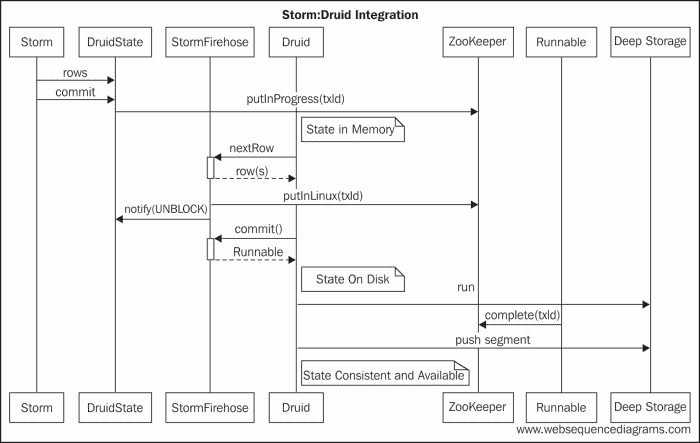
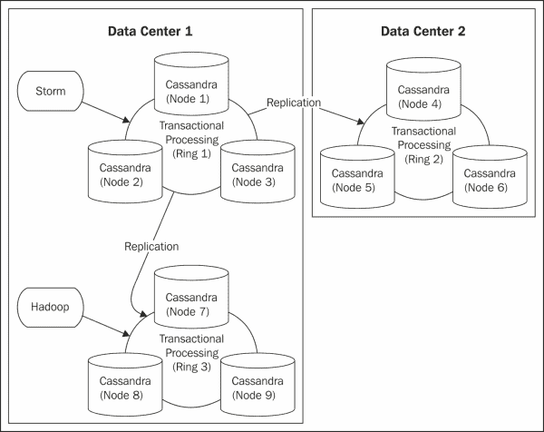
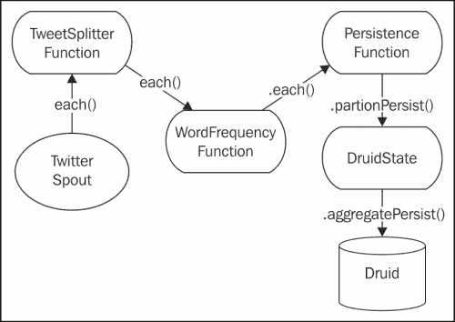

# 第八章：自然语言处理

有些人认为随着对实时分析和数据处理的需求增加，Storm 最终会取代 Hadoop。在本章中，我们将看到 Storm 和 Hadoop 实际上是如何互补的。

尽管 Storm 模糊了传统 OLTP 和 OLAP 之间的界限，但它可以处理大量交易，同时执行通常与数据仓库相关的聚合和维度分析。通常情况下，您仍然需要额外的基础设施来执行历史分析，并支持整个数据集的临时查询。此外，批处理通常用于纠正 OLTP 系统无法在故障发生时确保一致性的异常情况。这正是我们在 Storm-Druid 集成中遇到的情况。

出于这些原因，批处理基础设施通常与实时基础设施配对使用。Hadoop 为我们提供了这样一个批处理框架。在本章中，我们将实现一个支持历史和临时分析的架构，通过批处理。

本章涵盖以下主题：

+   CAP 定理

+   Lambda 架构

+   OLTP 和 OLAP 集成

+   Hadoop 简介

# 激发 Lambda 架构

首先，从逻辑角度来看，让我们看一下 Storm-Druid 集成。Storm，特别是 Trident，能够执行分布式分析，因为它隔离了状态转换。为了做到这一点，Storm 对状态的基础持久性机制做出了一些假设。Storm 假设持久性机制既是*一致的*又是*可用的*。具体来说，Storm 假设一旦进行了状态转换，新状态就会被共享，在所有节点上保持一致，并立即可用。

根据 CAP 定理，我们知道任何分布式系统要同时提供以下三个保证是困难的：

+   一致性：所有节点上的状态相同

+   可用性：系统可以对查询做出成功或失败的响应

+   分区容错性：系统在通信丢失或部分系统故障的情况下仍能做出响应

越来越多的 Web 规模架构集成了对一致性采取宽松态度的持久性机制，以满足可用性和分区容错性的要求。通常，这些系统这样做是因为在大型分布式系统中提供整个系统的事务一致性所需的协调变得不可行。性能和吞吐量更重要。

Druid 也做出了同样的权衡。如果我们看一下 Druid 的持久性模型，我们会看到几个不同的阶段：



首先，Druid 通过`Firehose`接口消耗数据并将数据放入内存。其次，数据被持久化到磁盘，并通过`Runnable`接口通知`Firehose`实现。最后，这些数据被推送到**深度存储**，使数据对系统的其他部分可用。

现在，如果我们考虑不一致数据对容错性的影响，我们会发现数据在持久存储之前是有风险的。如果我们丢失了某个节点，我们就会失去该节点上所有数据的分析，因为我们已经确认了元组。

解决这个问题的一个明显的方法是在承认 Storm 中的元组之前将段推送到深度存储。这是可以接受的，但它会在 Storm 和 Druid 之间创建一个脆弱的关系。具体来说，批处理大小和超时需要与段大小和 Druid 的段推送到深度存储的时间保持一致。换句话说，我们的事务处理系统的吞吐量将受到限制，并与我们用于分析处理的系统密切相关。最终，这很可能是我们不想要的依赖关系。

然而，我们仍然希望进行实时分析，并愿意容忍在部分系统故障的情况下，这些分析可能会缺少一部分数据。从这个角度来看，这种集成是令人满意的。但理想情况下，我们希望有一种机制来纠正和恢复任何故障。为此，我们将引入离线批处理机制，以在发生故障时恢复和纠正数据。

为了使这项工作，我们将首先在将数据发送到 Druid 之前持久化数据。我们的批处理系统将离线从持久性机制中读取数据。批处理系统将能够纠正/更新系统在实时处理期间可能丢失的任何数据。通过结合这些方法，我们可以在实时处理中实现所需的吞吐量，并且分析结果准确，直到系统发生故障，并且有一种机制可以在发生故障时纠正这些分析。

分布式批处理的事实标准是 Hadoop。因此，我们将在这里使用 Hadoop 进行历史（即非实时）分析。以下图表描述了我们将在这里使用的模式：

激励 Lambda 架构

前面的模式显示了我们如何成功地集成 OLTP 和 OLAP 系统，同时在大部分情况下提供一致和完整的实时高吞吐量、可用性和分区分析。它同时提供了解决部分系统故障的机制。

这种方法填补的另一个空白是能够将新的分析引入系统。由于 Storm-Druid 集成侧重于实时问题，因此没有简单的方法将新的分析引入系统。 Hadoop 填补了这个空白，因为它可以在历史数据上运行以填充新的维度或执行额外的聚合。

Storm 的原始作者 Nathan Marz 将这种方法称为**Lambda 架构**。

# 检查我们的用例

现在，让我们将这种模式应用到**自然语言处理**（**NLP**）领域。在这个用例中，我们将搜索 Twitter 上与短语（例如“Apple Jobs”）相关的推文。然后系统将处理这些推文，试图找到最相关的单词。使用 Druid 来聚合这些术语，我们将能够随时间趋势最相关的单词。

让我们更详细地定义问题。给定搜索短语*p*，使用 Twitter API，我们将找到最相关的一组推文*T*。对于*T*中的每条推文*t*，我们将计算每个单词*w*的出现次数。我们将比较推文中该单词的频率与英文文本样本*E*中该单词的频率。然后系统将对这些单词进行排名，并显示前 20 个结果。

从数学上讲，这相当于以下形式：

查看我们的用例

在这里，语料库*C*中单词*w*的频率如下：

检查我们的用例

由于我们只关心相对频率，并且*T*中的单词总数和*E*中的单词总数在所有单词中都是恒定的，我们可以在方程中忽略它们，从而降低问题的复杂性，简化为以下形式：

检查我们的用例

对于分母，我们将使用以下链接中的免费可用单词频率列表：

[`invokeit.wordpress.com/frequency-word-lists/`](http://invokeit.wordpress.com/frequency-word-lists/)

我们将使用 Storm 来处理 Twitter 搜索的结果，并使用计数信息为分母来丰富元组。然后 Druid 将对分子进行计数，并使用后聚合函数来执行实际的相关性计算。

# 实现 Lambda 架构

对于这个用例，我们专注于一个分布式计算模式，它将实时处理平台（即 Storm）与分析引擎（即 Druid）集成起来；然后将其与离线批处理机制（即 Hadoop）配对，以确保我们拥有准确的历史指标。

虽然这仍然是重点，但我们试图实现的另一个关键目标是持续可用性和容错。更具体地说，系统应该能够容忍节点或者甚至数据中心的永久丢失。为了实现这种可用性和容错，我们需要更多地关注持久性。

在一个实时系统中，我们会使用分布式存储机制进行持久化，理想情况下是支持跨数据中心复制的存储机制。因此，即使在灾难情况下，一个数据中心完全丢失，系统也能够在不丢失数据的情况下恢复。在与持久存储交互时，客户端将要求一个一致性级别，该级别在事务中复制数据到多个数据中心。

在这次讨论中，假设我们使用 Cassandra 作为我们的持久化机制。对于 Cassandra，具有可调一致性的写入将使用`EACH_QUORUM`一致性级别。这确保了数据的副本一致地写入到所有数据中心。当然，这会在每次写入时引入数据中心间通信的开销。对于不太关键的应用程序，`LOCAL_QUORUM`可能是可以接受的，它避免了数据中心间通信的延迟。

使用 Cassandra 等分布式存储引擎的另一个好处是，可以为离线/批处理设置一个单独的环/集群。然后 Hadoop 可以使用该环作为输入，使系统能够重新摄入历史数据而不影响事务处理。考虑以下架构图：



在上图中，我们有两个物理数据中心，每个数据中心都有一个为 Storm 提供事务处理的 Cassandra 集群。这确保了拓扑中的任何写入都会实时复制到数据中心，无论是在元组被确认之前（如果我们使用`EACH_QUORUM`一致性）还是在懒惰地（如果我们使用`LOCAL_QUORUM`）。

此外，我们有第三个*虚拟*数据中心支持离线批处理。**Ring 3**是一个 Cassandra 集群，物理上与**Ring 1**相邻，但在 Cassandra 中配置为第二个数据中心。当我们运行 Hadoop 作业处理历史指标时，我们可以使用`LOCAL_QUORUM`。由于本地四分位数试图在本地数据中心内获得共识，来自 Hadoop 的读取流量不会跨越到我们的事务处理集群。

总的来说，如果你的组织有数据科学家/数据管理者在对数据进行分析，部署这种模式是一个很好的选择。通常，这些工作对数据要求很高。将这种工作负载与事务系统隔离开是很重要的。

此外，和我们在系统中容忍故障的能力一样重要的是，这种架构使我们能够在数据摄入时没有的情况下引入新的分析。Hadoop 可以使用新的分析配置运行所有相关的历史数据，以填充新的维度或执行额外的聚合。

# 为我们的用例设计拓扑

在这个例子中，我们将再次使用 Trident，并在前一章中构建的拓扑的基础上进行扩展。Trident 拓扑如下所示：



`TwitterSpout` 定期针对 Twitter API 进行搜索，将返回的 tweets 发射到 Trident 流中。`TweetSplitterFunction` 然后解析 tweets，并为每个单词发射一个元组。`WordFrequencyFunction` 为每个单词的元组添加来自英语语言的随机样本的计数。最后，我们让 Druid 消费这些信息，以执行随时间的聚合。Druid 将数据分区为时间切片，并像之前描述的那样持久化数据。

在这种情况下，因为持久化机制是我们解决容错/系统故障的手段，所以持久化机制应该分发存储，并提供一致性和高可用性。此外，Hadoop 应该能够使用持久化机制作为 map/reduce 作业的输入。

由于其可调整的一致性和对 Hadoop 的支持，Cassandra 是这种模式的理想持久化机制。由于 Cassandra 和多语言持久化已在其他地方进行了介绍，我们将保持这个例子简单，并使用本地文件存储。

# 实施设计

让我们首先从 spout 开始，逐步分析实时部分，直到 Druid 持久化。拓扑很简单，模仿了我们在前几章中编写的拓扑。

以下是拓扑的关键行：

```scala
TwitterSpout spout = new TwitterSpout();
Stream inputStream = topology.newStream("nlp", spout);
try {
inputStream.each(new Fields("tweet"), new TweetSplitterFunction(), new Fields("word"))
          .each(new Fields("searchphrase", "tweet", "word"), new WordFrequencyFunction(), new Fields("baseline"))
          .each(new Fields("searchphrase", "tweet", "word", "baseline"), new PersistenceFunction(), new Fields())	
          .partitionPersist(new DruidStateFactory(), new Fields("searchphrase", "tweet", "word", "baseline"), new DruidStateUpdater());
} catch (IOException e) {
throw new RuntimeException(e);
}
return topology.build();
```

最后，在解析和丰富之后，元组有四个字段，如下表所示：

| 字段名称 | 用途 |
| --- | --- |
| `searchphrase` | 这个字段包含正在被摄取的搜索短语。这是发送到 Twitter API 的短语。在现实中，系统很可能会同时监视多个搜索短语。在这个系统中，这个值是硬编码的。 |
| `tweet` | 这个字段包含在搜索 Twitter API 时返回的 tweets。`searchphrase` 和 `tweet` 之间是一对多的关系。 |
| `word` | 解析后，这个字段包含在 tweets 中找到的单词。`tweet` 和 `word` 之间是一对多的关系。 |
| `baseline` | 这个字段包含普通抽样文本中与单词相关的计数。`word` 和 `baseline` 之间是一对一的关系。 |

## TwitterSpout/TweetEmitter

现在，让我们来看看 spout/emitter。在这个例子中，我们将使用 Twitter4J API，`Emitter` 函数不过是该 API 和 Storm API 之间的薄胶层。如前所示，它只是使用 Twitter4J 调用 Twitter API，并将所有结果作为一个批次在 Storm 中发射。

在更复杂的情况下，一个可能还会接入 `Twitter Firehose` 并使用队列来缓冲实时更新，然后将其发射到 Storm 中。以下是 spout 的 `Emitter` 部分的关键行：

```scala
   query = new Query(SEARCH_PHRASE);
   query.setLang("en");
   result = twitter.search(query);
   ...
   for (Status status : result.getTweets()) {
       List<Object> tweets = new ArrayList<Object>();
       tweets.add(SEARCH_PHRASE);
       tweets.add(status.getText());
       collector.emit(tweets);
   }
```

## 函数

本节涵盖了拓扑中使用的函数。在这个例子中，所有的函数都可以有副作用（例如持久化），或者它们可以为元组添加字段和值。

### TweetSplitterFunction

tweet 经过的第一个函数是 `TweetSplitterFunction`。这个函数简单地解析 tweet，并为 tweet 中的每个单词发射一个元组。该函数的代码如下：

```scala
@Override
public void execute(TridentTuple tuple, TridentCollector collector) {
String tweet = (String) tuple.getValue(0);
LOG.debug("SPLITTING TWEET [" + tweet + "]");
Pattern p = Pattern.compile("[a-zA-Z]+");
Matcher m = p.matcher(tweet);
List<String> result = new ArrayList<String>();
   while (m.find()) {
       String word = m.group();
       if (word.length() > 0) {
         List<Object> newTuple = new ArrayList<Object>();
         newTuple.add(word);
         collector.emit(newTuple);
       }
   }
}
```

在一个更复杂的 NLP 系统中，这个函数将不仅仅是通过空格分割推文。NLP 系统很可能会尝试解析推文，为单词分配词性并将它们与彼此关联起来。尽管即时消息和推文通常缺乏解析器训练的传统语法结构，系统仍可能使用诸如单词之间距离之类的基本关联。在这种系统中，系统使用 n-gram 频率而不是单词频率，其中每个 n-gram 包括多个单词。

要了解 n-gram 的使用，请访问[`books.google.com/ngrams`](http://books.google.com/ngrams)。

### WordFrequencyFunction

现在我们转向`WordFrequencyFunction`。这个函数用`baseline`计数丰富了元组。这是单词在随机抽样文本中遇到的次数。

该函数的关键代码如下所示：

```scala
public static final long DEFAULT_BASELINE = 10000;
private Map<String, Long> wordLikelihoods = 
new HashMap<String, Long>();

public WordFrequencyFunction() throws IOException {
File file = new File("src/main/resources/en.txt");
BufferedReader br = new BufferedReader(new FileReader(file));
String line;
while ((line = br.readLine()) != null) {
String[] pair = line.split(" ");
   long baseline = Long.parseLong(pair[1]);
   LOG.debug("[" + pair[0] + "]=>[" + baseline + "]");
   wordLikelihoods.put(pair[0].toLowerCase(), baseline);
   i++;
}
br.close();
}

@Override
public void execute(TridentTuple tuple,
TridentCollector collector) {
String word = (String) tuple.getValue(2);
Long baseline = this.getLikelihood(word);
List<Object> newTuple = new ArrayList<Object>();
newTuple.add(baseline);
collector.emit(newTuple);
}

public long getLikelihood(String word){
Long baseline = this.wordLikelihoods.get(word);
if (baseline == null)
return DEFAULT_BASELINE;
else
   return baseline;
}
```

代码中的构造函数将单词计数加载到内存中。 `en.txt`的文件格式如下：

```scala
you 4621939
the 3957465
i 3476773
to 2873389
...
of 1531878
that 1323823
in 1295198
is 1242191
me 1208959
what 1071825
```

每行包含单词和该单词的频率计数。同样，由于我们只关心相对计数，因此无需考虑语料库中的总计数。但是，如果我们正在计算真实的可能性，我们还需要考虑总体单词计数。

函数的`execute`方法很简单，只是将基线计数添加到元组中。但是，如果我们检查从`HashMap`类中检索计数的方法，注意它包括一个`DEFAULT_BASELINE`。这是系统遇到原始语料库中没有的单词时使用的值。

由于 Twitter 动态包含许多缩写词、首字母缩写词和其他通常在标准文本中找不到的术语，`DEFAULT_BASELINE`成为一个重要的配置参数。在某些情况下，独特的单词很重要，因为它们涉及到`searchphrase`字段。其他单词是异常的，因为样本语料库与目标语料库不同。

理想情况下，原始基线计数应该来自分析的目标相同来源。在这种情况下，最好使用整个`Twitter Firehose`计算单词和 n-gram 计数。

### PersistenceFunction

我们不会在这里详细介绍完整的多数据中心 Cassandra 部署。相反，对于这个例子，我们将保持简单并使用本地文件存储。 `PersistenceFunction`的代码如下：

```scala
@Override
public void execute(TridentTuple tuple, 
   TridentCollector collector) {
writeToLog(tuple);
collector.emit(tuple);
}

synchronized public void writeToLog(TridentTuple tuple) {
DateTime dt = new DateTime();
DateTimeFormatter fmt = ISODateTimeFormat.dateTime();
StringBuffer sb = new StringBuffer("{ ");
sb.append(String.format("\"utcdt\":\"%s\",", fmt.print(dt)));
sb.append(String.format("\"searchphrase\":\"%s\",", tuple.getValue(0)));
sb.append(String.format("\"word\":\"%s\",", tuple.getValue(2)));
sb.append(String.format("\"baseline\":%s", tuple.getValue(3)));
sb.append("}");
BufferedWriter bw;
try {
bw = new BufferedWriter(new FileWriter("nlp.json", true));
bw.write(sb.toString());
   bw.newLine();
   bw.close();
} catch (IOException e) {
   throw new RuntimeException(e);
}
}
```

在上述代码中，该函数只是以 Druid 期望在 Hadoop 索引作业中使用的本机格式保存元组。这段代码效率低下，因为我们每次都要打开文件进行写入。或者，我们可以实现额外的`StateFactory`和`State`对象来持久化元组；然而，由于这只是一个例子，我们可以容忍低效的文件访问。

另外，请注意我们在这里生成了一个时间戳，但没有与元组一起重新发出。理想情况下，我们会生成一个时间戳并将其添加到元组中，然后由 Druid 在下游使用以对齐时间分区。在这个例子中，我们将接受这种差异。

### 提示

即使这个函数根本不丰富元组，它仍然必须重新发出元组。由于函数也可以充当过滤器，函数有义务声明哪些元组被传递到下游。

该函数将以下行写入`nlp.json`文件：

```scala
{ "utcdt":"2013-08-25T14:47:38.883-04:00","searchphrase":"apple jobs","word":"his","baseline":279134}
{ "utcdt":"2013-08-25T14:47:38.884-04:00","searchphrase":"apple jobs","word":"annual","baseline":839}
{ "utcdt":"2013-08-25T14:47:38.885-04:00","searchphrase":"apple jobs","word":"salary","baseline":1603}
{ "utcdt":"2013-08-25T14:47:38.886-04:00","searchphrase":"apple jobs","word":"from","baseline":285711}
{ "utcdt":"2013-08-25T14:47:38.886-04:00","searchphrase":"apple jobs","word":"Apple","baseline":10000}
```

# 检查分析

Druid 集成与上一章中使用的相同。简而言之，此集成包括`StateFactory`、`StateUpdater`和`State`实现。然后，`State`实现与`StormFirehoseFactory`实现和 Druid 的`StormFirehose`实现进行通信。在此实现的核心是`StormFirehose`实现，它将元组映射到 Druid 的输入行。此方法的清单如下所示：

```scala
@Override
public InputRow nextRow() {
   final Map<String, Object> theMap =
Maps.newTreeMap(String.CASE_INSENSITIVE_ORDER);
try {
TridentTuple tuple = null;
   tuple = BLOCKING_QUEUE.poll();
   if (tuple != null) {
String phrase = (String) tuple.getValue(0);
      String word = (String) tuple.getValue(2);
      Long baseline = (Long) tuple.getValue(3);
      theMap.put("searchphrase", phrase);
      theMap.put("word", word);
      theMap.put("baseline", baseline);
}

   if (BLOCKING_QUEUE.isEmpty()) {
      STATUS.putInLimbo(TRANSACTION_ID);
      LIMBO_TRANSACTIONS.add(TRANSACTION_ID);
      LOG.info("Batch is fully consumed by Druid. Unlocking [FINISH]");
      synchronized (FINISHED) {
          FINISHED.notify();
      }
   }
} catch (Exception e) {
LOG.error("Error occurred in nextRow.", e);
}
final LinkedList<String> dimensions = new LinkedList<String>();
dimensions.add("searchphrase");
dimensions.add("word");
return new MapBasedInputRow(System.currentTimeMillis(), 
dimensions, theMap); 
}
```

查看此方法时，有两个关键数据结构：`theMap`和`dimensions`。第一个包含行的数据值。第二个包含该行的维度，这是 Druid 用来执行聚合的，也决定了您可以针对数据运行哪些查询。在这种情况下，我们将使用`searchphrase`和`word`字段作为维度。这将允许我们在查询中执行计数和分组，我们马上就会看到。

首先，让我们看一下用于摄取数据的 Druid 配置。我们将主要使用与上一章中使用的嵌入式实时服务器相同的配置。段将被推送到 Cassandra 进行深度存储，而 MySQL 用于编写段元数据。

以下是`runtime.properties`中的关键配置参数：

```scala
druid.pusher.cassandra=true
druid.pusher.cassandra.host=localhost:9160 
druid.pusher.cassandra.keyspace=druid
druid.zk.service.host=localhost
druid.zk.paths.base=/druid
druid.host=127.0.0.1
druid.database.segmentTable=prod_segments
druid.database.user=druid
druid.database.password=druid
druid.database.connectURI=jdbc:mysql://localhost:3306/druid
druid.zk.paths.discoveryPath=/druid/discoveryPath
druid.realtime.specFile=./src/main/resources/realtime.spec
druid.port=7272
druid.request.logging.dir=/tmp/druid/realtime/log
```

此配置指向`realtime.spec`文件，该文件指定了实时服务器执行的分析的详细信息。以下是此用例的`realtime.spec`文件：

```scala
[{
    "schema": {
        "dataSource": "nlp",
        "aggregators": [
            { "type": "count", "name": "wordcount" },
            { "type": "max", "fieldName": "baseline", 
name" : "maxbaseline" }
        ],
        "indexGranularity": "minute",
        "shardSpec": {"type": "none"}
    },

    "config": {
        "maxRowsInMemory": 50000,
        "intermediatePersistPeriod": "PT30s"
    },

    "firehose": {
        "type": "storm",
        "sleepUsec": 100000,
        "maxGeneratedRows": 5000000,
        "seed": 0,
        "nTokens": 255,
        "nPerSleep": 3
    },

    "plumber": {
        "type": "realtime",
        "windowPeriod": "PT10s",
        "segmentGranularity": "minute",
        "basePersistDirectory": "/tmp/nlp/basePersist"
    }
}]
```

除了时间粒度，我们还在此文件中指定了聚合器。这告诉 Druid 如何在行之间聚合指标。没有聚合器，Druid 无法合并数据。在此用例中，有两个聚合器：`wordcount`和`maxbaseline`。

`wordcount`字段计算具有相同维度值的行的实例。回顾`StormFirehose`实现，两个维度是`searchphrase`和`word`。因此，Druid 可以合并行，添加一个名为`wordcount`的字段，其中将包含该单词在该`searchphrase`和时间片段中找到的实例总数。

`maxbaseline`字段包含该单词的基线。实际上，每行的值都是相同的。我们只是使用`max`作为一个方便的函数，将该值传播到我们在查询系统时可以使用的聚合中。

现在，让我们来看看查询。以下是我们用来检索最相关单词的查询：

```scala
{
     "queryType": "groupBy",
     "dataSource": "nlp",
     "granularity": "minute",
     "dimensions": ["searchphrase", "word"],
     "aggregations":[
        { "type": "longSum", "fieldName":"wordcount", 
"name": "totalcount"},
        { "type": "max", "fieldName":"maxbaseline", 
"name": "totalbaseline"}
     ],
     "postAggregations": [{
       "type": "arithmetic",
       "name": "relevance",
       "fn": "/",
       "fields": [
            { "type": "fieldAccess", "fieldName": "totalcount" },
            { "type": "fieldAccess", "fieldName": "totalbaseline" }
       ]
     }],
     "intervals":["2012-10-01T00:00/2020-01-01T00"]
 }
```

查询需要与`realtime.spec`文件对齐。在查询的底部，我们指定我们感兴趣的时间间隔。在文件的顶部，我们指定我们感兴趣的维度，然后是允许 Druid 将行折叠以匹配所请求的粒度的聚合。在此用例中，聚合与我们实时索引数据时执行的聚合完全匹配。

具体来说，我们引入了`totalcount`字段，其中包含`wordcount`的总和。因此，它将包含观察到的该`word`和`searchphrase`组合的实例总数。此外，我们使用`baseline`进行相同的技巧来传递该值。

最后，在此查询中，我们包括一个后聚合，它将聚合结果组合成相关分数。后聚合将观察到的推文总数除以基线频率。

以下是一个简单的 Ruby 文件，用于处理查询结果并返回前 20 个单词：

```scala
...
url="http://localhost:7272/druid/v2/?pretty=true"
response = RestClient.post url, File.read("realtime_query"), :accept => :json, :content_type => 'appplication/json'
#puts(response)
result = JSON.parse(response.to_s)

word_relevance = {}
result.each do |slice|
  event = slice['event']
  word_relevance[event['word']]=event['relevance']
end

count = 0
word_relevance.sort_by {|k,v| v}.reverse.each do |word, relevance|
  puts("#{word}->#{relevance}")
  count=count+1
  if(count == 20) then
    break
  end
end
```

请注意，我们用于访问服务器的 URL 是嵌入式实时服务器的端口。在生产中，查询会通过代理节点进行。

执行此脚本将产生以下代码片段：

```scala
claiming->31.789579158316634
apple->27.325982081323225
purchase->20.985449735449734
Jobs->20.618
Steve->17.446
shares->14.802238805970148
random->13.480033984706882
creation->12.7524115755627
Apple->12.688
acts->8.82582081246522
prevent->8.702687877125618
farmer->8.640522875816993
developed->8.62642740619902
jobs->8.524986566362172
bottles->8.30523560209424
technology->7.535137701804368
current->7.21418826739427
empire->6.924050632911392
```

### 提示

如果更改您正在捕获的维度或指标，请务必删除实时服务器用于缓存数据的本地目录。否则，实时服务器可能会重新读取旧数据，这些数据没有需要满足查询的维度和/或指标；此外，查询将失败，因为 Druid 无法找到必需的指标或维度。

# 批处理/历史分析

现在，让我们把注意力转向批处理机制。为此，我们将使用 Hadoop。虽然完整描述 Hadoop 远远超出了本节的范围，但我们将在 Druid 特定设置的同时对 Hadoop 进行简要概述。

Hadoop 提供了两个主要组件：分布式文件系统和分布式处理框架。分布式文件系统的名称是**Hadoop 分布式文件系统**（**HDFS**）。分布式处理框架称为 MapReduce。由于我们选择在假设的系统架构中利用 Cassandra 作为存储机制，我们将不需要 HDFS。但是，我们将使用 Hadoop 的 MapReduce 部分来将处理分布到所有历史数据中。

在我们的简单示例中，我们将运行一个读取我们`PersistenceFunction`中编写的本地文件的本地 Hadoop 作业。Druid 附带了一个我们将在本示例中使用的 Hadoop 作业。

# Hadoop

在我们开始加载数据之前，有必要简要介绍一下 MapReduce。尽管 Druid 预先打包了一个方便的 MapReduce 作业来适应历史数据，但一般来说，大型分布式系统将需要自定义作业来对整个数据集执行分析。

## MapReduce 概述

MapReduce 是一个将处理分为两个阶段的框架：map 阶段和 reduce 阶段。在 map 阶段，一个函数被应用于整个输入数据集，每次处理一个元素。每次应用`map`函数都会产生一组元组，每个元组包含一个键和一个值。具有相似键的元组然后通过`reduce`函数组合。`reduce`函数通常会发出另一组元组，通过组合与键相关联的值。

MapReduce 的经典“Hello World”示例是单词计数。给定一组包含单词的文档，计算每个单词的出现次数。（讽刺的是，这与我们的 NLP 示例非常相似。）

以下是 Ruby 函数，用于表达单词计数示例的`map`和`reduce`函数。`map`函数如下代码片段所示：

```scala
def map(doc)
   result = []
doc.split(' ').each do |word|
result << [word, 1]
   end
   return result
end
```

给定以下输入，`map`函数产生以下输出：

```scala
map("the quick fox jumped over the dog over and over again")
 => [["the", 1], ["quick", 1], ["fox", 1], ["jumped", 1], ["over", 1], ["the", 1], ["dog", 1], ["over", 1], ["and", 1], ["over", 1], ["again", 1]]
```

相应的`reduce`函数如下代码片段所示：

```scala
def reduce(key, values)
   sum = values.inject { |sum, x| sum + x }
   return [key, sum]
end
```

然后，MapReduce 函数将为每个键分组值，并将它们传递给前面的`reduce`函数，如下所示，从而得到总的单词计数：

```scala
reduce("over", [1,1,1])
 => ["over", 3]

```

## Druid 设置

有了 Hadoop 作为背景，让我们来看看我们为 Druid 设置的情况。为了让 Druid 从 Hadoop 作业中获取数据，我们需要启动**Master**和**Compute**节点（也称为**Historical**节点）。为此，我们将创建一个目录结构，该目录结构的根目录包含 Druid 自包含作业，子目录包含 Master 和 Compute 服务器的配置文件。

此目录结构如下代码片段所示：

```scala
druid/druid-indexing-hadoop-0.5.39-SNAPSHOT.jar
druid/druid-services-0.5.39-SNAPSHOT-selfcontained.jar
druid/config/compute/runtime.properties
druid/config/master/runtime.properties
druid/batchConfig.json
```

Master 和 Compute 节点的运行时属性与实时节点基本相同，但有一些显著的区别。它们都包括用于缓存段的设置，如下所示的代码片段：

```scala
# Path on local FS for storage of segments; 
# dir will be created if needed
druid.paths.indexCache=/tmp/druid/indexCache
# Path on local FS for storage of segment metadata; 
# dir will be created if needed
druid.paths.segmentInfoCache=/tmp/druid/segmentInfoCache
```

另外，请注意，如果您在同一台机器上运行 Master 和 Compute 服务器，您需要更改端口，以避免冲突，如下所示：

```scala
druid.port=8082
```

Druid 将所有服务器组件及其依赖项打包到一个单独的自包含 JAR 文件中。使用这个 JAR 文件，您可以使用以下命令启动 Master 和 Compute 服务器。

对于 Compute 节点，我们使用以下代码片段：

```scala
java -Xmx256m -Duser.timezone=UTC -Dfile.encoding=UTF-8 \
-classpath ./druid-services-0.5.39-SNAPSHOT-selfcontained.jar:config/compute \
com.metamx.druid.http.ComputeMain
```

对于 Master 节点，我们使用以下代码片段：

```scala
java -Xmx256m -Duser.timezone=UTC -Dfile.encoding=UTF-8 \
-classpath ./druid-services-0.5.39-SNAPSHOT-selfcontained.jar:config/compute \
com.metamx.druid.http.ComputeMain
```

一旦两个节点都运行起来，我们就可以使用 Hadoop 作业加载数据。

### HadoopDruidIndexer

在我们的服务器正常运行后，我们可以检查 Druid MapReduce 作业的内部。`HadoopDruidIndexer`函数使用一个类似`realtime.spec`文件的 JSON 配置文件。

文件在启动 Hadoop 作业时通过命令行指定，如下面的代码片段所示：

```scala
java -Xmx256m -Duser.timezone=UTC -Dfile.encoding=UTF-8 \
-Ddruid.realtime.specFile=realtime.spec -classpath druid-services-0.5.39-SNAPSHOT-selfcontained.jar:druid-indexing-hadoop-0.5.39-SNAPSHOT.jar \
com.metamx.druid.indexer.HadoopDruidIndexerMain batchConfig.json
```

以下是我们在这个例子中使用的`batchConfig.json`文件：

```scala
{
  "dataSource": "historical",
  "timestampColumn": "utcdt",
  "timestampFormat": "iso",
  "dataSpec": {
    "format": "json",
    "dimensions": ["searchphrase", "word"]
  },
  "granularitySpec": {
    "type":"uniform",
    "intervals":["2013-08-21T19/PT1H"],
    "gran":"hour"
  },
  "pathSpec": { "type": "static",
                "paths": "/tmp/nlp.json" },
  "rollupSpec": {
            "aggs": [ { "type": "count", "name": "wordcount" },
                         { "type": "max", "fieldName": "baseline", 
                                       "name" : "maxbaseline" } ],
      "rollupGranularity": "minute"},
      "workingPath": "/tmp/working_path",
  "segmentOutputPath": "/tmp/segments",
  "leaveIntermediate": "false",
  "partitionsSpec": {
    "targetPartitionSize": 5000000
  },
  "updaterJobSpec": {
    "type":"db",
    "connectURI":"jdbc:mysql://localhost:3306/druid",
    "user":"druid",
    "password":"druid",
    "segmentTable":"prod_segments"
  }
}
```

许多配置看起来很熟悉。特别感兴趣的两个字段是`pathSpec`和`rollupSpec`字段。`pathSpec`字段包含了由`PersistenceFunction`编写的文件的位置。`rollupSpec`字段包含了我们在事务处理期间在`realtime.spec`文件中包含的相同聚合函数。

另外，请注意指定了时间戳列和格式，这与我们在持久化文件中输出的字段相一致：

```scala
{ "utcdt":"2013-08-25T14:47:38.883-04:00","searchphrase":"apple jobs","word":"his","baseline":279134}
{ "utcdt":"2013-08-25T14:47:38.884-04:00","searchphrase":"apple jobs","word":"annual","baseline":839}
{ "utcdt":"2013-08-25T14:47:38.885-04:00","searchphrase":"apple jobs","word":"salary","baseline":1603}
{ "utcdt":"2013-08-25T14:47:38.886-04:00","searchphrase":"apple jobs","word":"from","baseline":285711}
{ "utcdt":"2013-08-25T14:47:38.886-04:00","searchphrase":"apple jobs","word":"Apple","baseline":10000}
```

`HadoopDruidIndexer`函数加载前述配置文件，并执行`map`/`reduce`函数来构建索引。如果我们更仔细地查看该作业，我们可以看到它正在运行的具体函数。

Hadoop 作业是使用 Hadoop 作业类启动的。Druid 运行了一些作业来索引数据，但我们将专注于`IndexGeneratorJob`。在`IndexGeneratorJob`中，Druid 使用以下行配置作业：

```scala
job.setInputFormatClass(TextInputFormat.class);
job.setMapperClass(IndexGeneratorMapper.class);
job.setMapOutputValueClass(Text.class);
...
job.setReducerClass(IndexGeneratorReducer.class);
job.setOutputKeyClass(BytesWritable.class);
job.setOutputValueClass(Text.class);
job.setOutputFormatClass(IndexGeneratorOutputFormat.class);
FileOutputFormat.setOutputPath(job,config.makeIntermediatePath());
config.addInputPaths(job);
config.intoConfiguration(job);
...
job.setJarByClass(IndexGeneratorJob.class);
job.submit();
```

几乎所有 Hadoop 作业都设置了上述属性。它们为处理的每个阶段设置了输入和输出类以及实现`Mapper`和`Reducer`接口的类。

有关 Hadoop 作业配置的完整描述，请访问以下网址：[`hadoop.apache.org/docs/r0.18.3/mapred_tutorial.html#Job+Configuration`](http://hadoop.apache.org/docs/r0.18.3/mapred_tutorial.html#Job+Configuration)

作业配置还指定了输入路径，指定了要处理的文件或其他数据源。在对`config.addInputPaths`的调用中，Druid 将`pathSpec`字段中的文件添加到 Hadoop 配置中进行处理，如下面的代码片段所示：

```scala
  @Override
  public Job addInputPaths(HadoopDruidIndexerConfig config, 
Job job) throws IOException {
    log.info("Adding paths[%s]", paths);
    FileInputFormat.addInputPaths(job, paths);
    return job;
  }
```

您可以看到，Druid 只支持`FileInputFormat`的实例。作为读者的练习，可以尝试增强`DruidHadoopIndexer`函数，以支持直接从 Cassandra 读取，就像在假设的架构中设想的那样。

回顾作业配置，Druid 使用的`Mapper`类是`IndexGeneratorMapper`类，而`Reducer`类是`IndexGeneratorReducer`类。

让我们首先看一下`IndexGeneratorMapper`类中的`map`函数。`IndexGeneratorMapper`类实际上是从`HadoopDruidIndexerMapper`继承的，其中包含了`map`方法的实现，将其委托给`IndexGeneratorMapper`类来发出实际的值，就像我们在下面的代码中看到的那样。

在`HadoopDruidIndexerMapper`中，我们看到`map`方法的实现如下：

```scala
@Override
protected void map(LongWritable key, Text value, Context context
  ) throws IOException, InterruptedException
  {
    try {
      final InputRow inputRow;
      try {
        inputRow = parser.parse(value.toString());
      }
      catch (IllegalArgumentException e) {
        if (config.isIgnoreInvalidRows()) {
          context.getCounter(HadoopDruidIndexerConfig.IndexJobCounters.INVALID_ROW_COUNTER).increment(1);
          return; // we're ignoring this invalid row
        } else {
          throw e;
        }
      }
      if(config.getGranularitySpec().bucketInterval(new DateTime(inputRow.getTimestampFromEpoch())).isPresent()) {
        innerMap(inputRow, value, context);
      }
    }
    catch (RuntimeException e) {
      throw new RE(e, "Failure on row[%s]", value);
    }
  }
```

我们可以看到超类`map`方法处理无法解析的行，将它们标记为无效，并检查行是否包含执行`map`所需的必要数据。具体来说，超类确保行包含时间戳。`map`需要时间戳，因为它将数据分区为时间片（即桶），就像我们在对`innerMap`的`abstract`方法调用中看到的那样，如下所示：

```scala
@Override
protected void innerMap(InputRow inputRow,
        Text text,
        Context context
    ) throws IOException, InterruptedException{

 // Group by bucket, sort by timestamp
final Optional<Bucket> bucket = getConfig().getBucket(inputRow);

if (!bucket.isPresent()) {
throw new ISE("WTF?! No bucket found for row: %s", inputRow);
}

context.write(new SortableBytes(
              bucket.get().toGroupKey(),
              Longs.toByteArray(inputRow.getTimestampFromEpoch())
          ).toBytesWritable(),text);
}
```

该方法中的关键行以及任何基于 Hadoop 的`map`函数中的关键行是对`context.write`的调用，它从`map`函数中发出元组。在这种情况下，`map`函数发出的是`SortableBytes`类型的键，它表示度量的桶和从输入源读取的实际文本作为值。

在此时，映射阶段完成后，我们已解析了文件，构建了我们的存储桶，并将数据分区到这些存储桶中，按时间戳排序。然后，通过调用`reduce`方法处理每个存储桶，如下所示：

```scala
@Override
protected void reduce(BytesWritable key, Iterable<Text> values,
final Context context
    ) throws IOException, InterruptedException{
SortableBytes keyBytes = SortableBytes.fromBytesWritable(key);
Bucket bucket = Bucket.fromGroupKey(keyBytes.getGroupKey()).lhs;

final Interval interval =
config.getGranularitySpec().bucketInterval(bucket.time).get();
final DataRollupSpec rollupSpec = config.getRollupSpec();
final AggregatorFactory[] aggs = rollupSpec.getAggs().toArray(
          new AggregatorFactory[rollupSpec.getAggs().size()]);

IncrementalIndex index = makeIncrementalIndex(bucket, aggs);
...
for (final Text value : values) {
context.progress();
   final InputRow inputRow =
index.getSpatialDimensionRowFormatter()
.formatRow(parser.parse(value.toString()));
        allDimensionNames.addAll(inputRow.getDimensions());
      ...
IndexMerger.persist(index, interval, file, 
index = makeIncrementalIndex(bucket, aggs);
      ...
   }
   ...
);
...
serializeOutIndex(context, bucket, mergedBase,
 Lists.newArrayList(allDimensionNames));
...
}
```

正如您所看到的，`reduce`方法包含了分析的核心内容。它根据汇总规范中的聚合和批处理配置文件中指定的维度构建索引。该方法的最后几行将段写入磁盘。

最后，当您运行`DruidHadoopIndexer`类时，您将看到类似以下代码片段的内容：

```scala
2013-08-28 04:07:46,405 INFO [main] org.apache.hadoop.mapred.JobClient -   Map-Reduce Framework
2013-08-28 04:07:46,405 INFO [main] org.apache.hadoop.mapred.JobClient -     Reduce input groups=1
2013-08-28 04:07:46,405 INFO [main] org.apache.hadoop.mapred.JobClient -     Combine output records=0
2013-08-28 04:07:46,405 INFO [main] org.apache.hadoop.mapred.JobClient -     Map input records=201363
2013-08-28 04:07:46,405 INFO [main] org.apache.hadoop.mapred.JobClient -     Reduce shuffle bytes=0
2013-08-28 04:07:46,406 INFO [main] org.apache.hadoop.mapred.JobClient -     Reduce output records=0
2013-08-28 04:07:46,406 INFO [main] org.apache.hadoop.mapred.JobClient -     Spilled Records=402726
2013-08-28 04:07:46,406 INFO [main] org.apache.hadoop.mapred.JobClient -     Map output bytes=27064165
2013-08-28 04:07:46,406 INFO [main] org.apache.hadoop.mapred.JobClient -     Combine input records=0
2013-08-28 04:07:46,406 INFO [main] org.apache.hadoop.mapred.JobClient -     Map output records=201363
2013-08-28 04:07:46,406 INFO [main] org.apache.hadoop.mapred.JobClient -     Reduce input records=201363
2013-08-28 04:07:46,433 INFO [main] com.metamx.druid.indexer.IndexGeneratorJob - Adding segment historical_2013-08-28T04:00:00.000Z_2013-08-28T05:00:00.000Z_2013-08-28T04:07:32.243Z to the list of published segments
2013-08-28 04:07:46,708 INFO [main] com.metamx.druid.indexer.DbUpdaterJob - Published historical_2013-08-28T04:00:00.000Z_2013-08-28T05:00:00.000Z_2013-08-28T04:07:32.243Z
2013-08-28 04:07:46,754 INFO [main] com.metamx.druid.indexer.IndexGeneratorJob - Adding segment historical_2013-08-28T04:00:00.000Z_2013-08-28T05:00:00.000Z_2013-08-28T04:07:32.243Z to the list of published segments
2013-08-28 04:07:46,755 INFO [main] com.metamx.druid.indexer.HadoopDruidIndexerJob - Deleting path[/tmp/working_path/historical/2013-08-28T040732.243Z]
```

请注意，添加的段名为`historical`。要查询由`historical` /批处理机制加载的数据，请更新查询以指定历史数据源，并使用计算节点的端口。如果一切加载正确，您将收到我们最初在实时服务器上看到的聚合结果；示例如下：

```scala
{
  "version" : "v1",
  "timestamp" : "2013-08-28T04:06:00.000Z",
  "event" : {
    "totalcount" : 171,
    "totalbaseline" : 28719.0,
    "searchphrase" : "apple jobs",
    "relevance" : 0.005954246317768724,
    "word" : "working"
  }
}
```

现在，如果我们定期安排 Hadoop 作业运行，历史索引将滞后于实时索引，但将持续更新索引，纠正错误并解决任何系统故障。

# 总结

在本章中，我们看到将批处理机制与 Storm 等实时处理引擎配对，提供了更完整和强大的整体解决方案。

我们研究了实施 Lambda 架构的方法。这种方法提供了由批处理系统支持的实时分析，可以对分析进行追溯性修正。此外，我们还看到了如何配置多数据中心系统架构，以将离线处理与事务系统隔离开来，并通过分布式存储提供持续可用性和容错性。

本章还介绍了 Hadoop，并以 Druid 的实现为例。

在下一章中，我们将采用现有的利用 Pig 和 Hadoop 的批处理过程，并演示将其转换为实时系统所需的步骤。同时，我们还将演示如何使用 Storm-YARN 将 Storm 部署到 Hadoop 基础架构上。
