# 第九章：在 Hadoop 上部署风暴进行广告分析

在前两章中，我们看到了如何将 Storm 与实时分析系统集成。然后我们扩展了该实现，支持批处理的实时系统。在本章中，我们将探讨相反的情况。

我们将研究一个批处理系统，计算广告活动的有效性。我们将把建立在 Hadoop 上的系统转换成实时处理系统。

为此，我们将利用雅虎的 Storm-YARN 项目。Storm-YARN 项目允许用户利用 YARN 来部署和运行 Storm 集群。在 Hadoop 上运行 Storm 允许企业 consoli 操作并利用相同的基础设施进行实时和批处理。

本章涵盖以下主题：

+   Pig 简介

+   YARN（Hadoop v2 的资源管理）

+   使用 Storm-YARN 部署 Storm

# 审查用例

在我们的用例中，我们将处理广告活动的日志，以确定最有效的广告活动。批处理机制将使用 Pig 脚本处理单个大型平面文件。Pig 是一种高级语言，允许用户执行数据转换和分析。Pig 类似于 SQL，并编译成通常部署和运行在 Hadoop 基础设施上的 map/reduce 作业。

在本章中，我们将把 Pig 脚本转换成拓扑，并使用 Storm-YARN 部署该拓扑。这使我们能够从批处理方法过渡到能够摄取和响应实时事件的方法（例如，点击横幅广告）。

在广告中，印象是代表广告显示在用户面前的广告事件，无论是否被点击。对于我们的分析，我们将跟踪每个印象，并使用一个字段来指示用户是否点击了广告。

每一行的平面文件包含四个字段，描述如下：

| 字段 | 描述 |
| --- | --- |
| cookie | 这是来自浏览器的唯一标识符。我们将使用它来表示系统中的用户。 |
| campaign | 这是代表特定广告内容集的唯一标识符。 |
| 产品 | 这是正在广告的产品的名称。 |
| 点击 | 这是布尔字段，表示用户是否点击了广告：如果用户点击了广告，则为 true；否则为 false。 |

通常，广告商会为产品运行广告活动。一个广告活动可能有一组特定的内容与之相关联。我们想计算每个产品的最有效广告活动。

在这种情况下，我们将通过计算不同点击次数占总体印象的百分比来计算广告活动的有效性。我们将以以下格式提供报告：

| 产品 | 广告活动 | 不同点击次数 | 印象 |
| --- | --- | --- | --- |
| X | Y | 107 | 252 |

印象的数量只是产品和广告活动的印象总数。我们不区分印象，因为我们可能多次向同一用户展示相同的广告以获得单次点击。由于我们很可能按印象付费，我们希望使用印象的总数来计算驱动兴趣所需的成本。兴趣表示为点击。

# 建立架构

我们在上一章中提到了 Hadoop，但主要关注了 Hadoop 中的 map/reduce 机制。在本章中，我们将做相反的事情，关注**Hadoop 文件系统**（**HDFS**）和**Yet Another Resource Negotiator**（**YARN**）。我们将利用 HDFS 来分阶段数据，并利用 YARN 来部署将托管拓扑的 Storm 框架。

Hadoop 内的最新组件化允许任何分布式系统使用它进行资源管理。在 Hadoop 1.0 中，资源管理嵌入到 MapReduce 框架中，如下图所示：

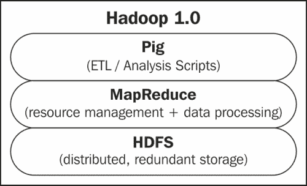

Hadoop 2.0 将资源管理分离为 YARN，允许其他分布式处理框架在 Hadoop 伞下管理的资源上运行。在我们的情况下，这允许我们在 YARN 上运行 Storm，如下图所示：

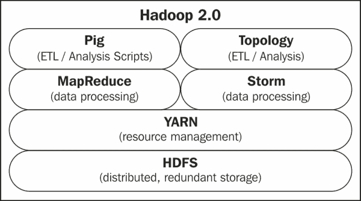

如前图所示，Storm 实现了与 MapReduce 相同的功能。它提供了分布式计算的框架。在这个特定的用例中，我们使用 Pig 脚本来表达我们想要对数据执行的 ETL/分析。我们将将该脚本转换为执行相同功能的 Storm 拓扑，然后我们将检查执行该转换涉及的一些复杂性。

为了更好地理解这一点，值得检查 Hadoop 集群中的节点以及在这些节点上运行的进程的目的。假设我们有一个如下图所示的集群：

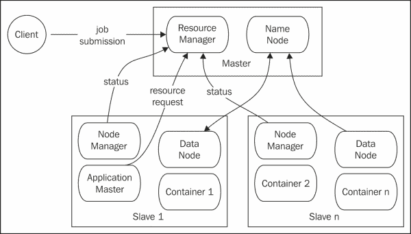

图中显示了两个不同的组件/子系统。第一个是 YARN，这是 Hadoop 2.0 引入的新资源管理层。第二个是 HDFS。让我们首先深入研究 HDFS，因为自 Hadoop 1.0 以来它并没有发生太大变化。

## 检查 HDFS

HDFS 是一个分布式文件系统。它在一组从节点上分发数据块。NameNode 是目录。它维护目录结构和指示哪些节点具有什么信息的元数据。NameNode 本身不存储任何数据，它只协调分布式文件系统上的 **创建、读取、更新和删除**（CRUD）操作。存储发生在运行 DataNode 进程的每个从节点上。DataNode 进程是系统中的工作马。它们彼此通信以重新平衡、复制、移动和复制数据。它们对客户端的 CRUD 操作做出反应和响应。

## 检查 YARN

YARN 是资源管理系统。它监视每个节点的负载，并协调将新作业分配给集群中的从节点。 **ResourceManager** 收集来自 **NodeManagers** 的状态信息。ResourceManager 还为客户端的作业提交提供服务。

YARN 中的另一个抽象概念是 **ApplicationMaster**。ApplicationMaster 管理特定应用程序的资源和容器分配。ApplicationMaster 与 ResourceManager 协商分配资源。一旦分配了资源，ApplicationMaster 就会与 NodeManagers 协调实例化 **容器**。容器是实际执行工作的进程的逻辑持有者。

ApplicationMaster 是一个特定于处理框架的库。Storm-YARN 提供了在 YARN 上运行 Storm 进程的 ApplicationMaster。HDFS 分发 ApplicationMaster 以及 Storm 框架本身。目前，Storm-YARN 需要外部 ZooKeeper。当应用程序部署时，Nimbus 启动并连接到 ZooKeeper。

以下图表描述了通过 Storm-YARN 在 Hadoop 基础设施上运行 Storm：

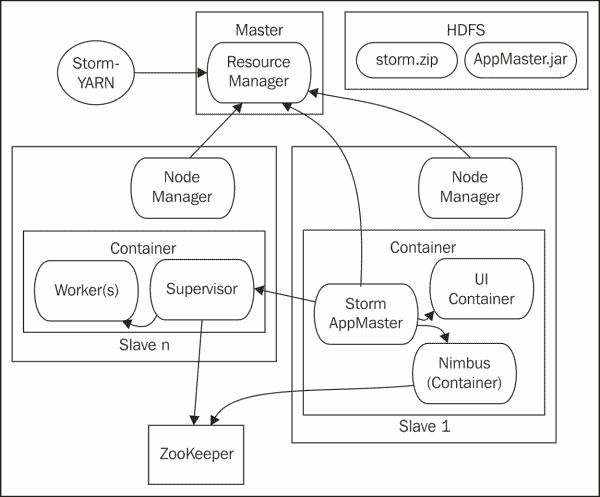

如前图所示，YARN 用于部署 Storm 应用程序框架。在启动时，Storm Application Master 在 YARN 容器内启动。然后，它创建了一个 Storm Nimbus 和 Storm UI 的实例。

之后，Storm-YARN 在单独的 YARN 容器中启动监督员。这些监督员进程中的每一个都可以在其容器内生成工作人员。

应用程序主节点和 Storm 框架都是通过 HDFS 分发的。Storm-YARN 提供了命令行实用程序来启动 Storm 集群，启动监督者，并配置 Storm 以进行拓扑部署。我们将在本章后面看到这些设施。

为了完成建筑图，我们需要分层处理批处理和实时处理机制：分别是 Pig 和 Storm 拓扑。我们还需要描述实际数据。

通常会使用诸如 Kafka 之类的排队机制来为 Storm 集群排队工作。为了简化，我们将使用存储在 HDFS 中的数据。以下描述了我们在使用案例中使用 Pig、Storm、YARN 和 HDFS，为了清晰起见省略了基础设施的元素。为了充分实现从 Pig 转换到 Storm 的价值，我们将转换拓扑以从 Kafka 而不是 HDFS 中获取数据，如下图所示：

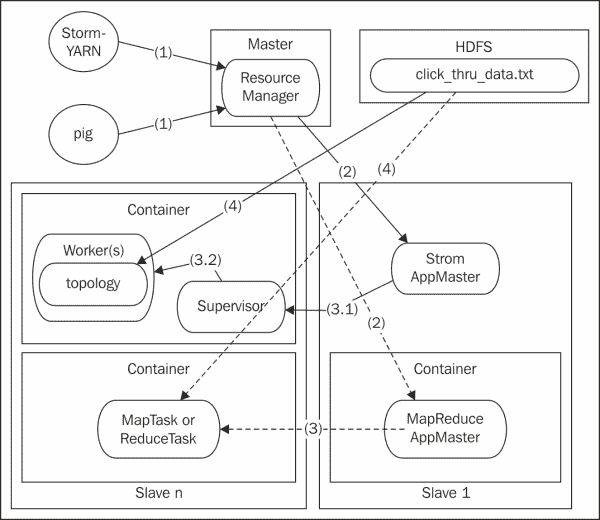

如前图所示，我们的数据将存储在 HDFS 中。虚线表示用于分析的批处理过程，实线表示实时系统。在每个系统中，以下步骤都会发生：

| 步骤 | 目的 | Pig 等效 | Storm-Yarn 等效 |
| --- | --- | --- | --- |
| 1 | 处理框架已部署 | MapReduce 应用程序主节点已部署并启动 | Storm-YARN 启动应用程序主节点并分发 Storm 框架 |
| 2 | 特定的分析已启动 | Pig 脚本被编译为 MapReduce 作业并提交为一个作业 | 拓扑被部署到集群 |
| 3 | 资源已保留 | 在 YARN 容器中创建 Map 和 reduce 任务 | 监督者与工作人员一起实例化 |
| 4 | 分析从存储中读取数据并执行分析 | Pig 从 HDFS 中读取数据 | Storm 通常从 Kafka 中读取工作，但在这种情况下，拓扑从一个平面文件中读取它 |

Pig 和 Trident 之间也可以进行类比。Pig 脚本编译成 MapReduce 作业，而 Trident 拓扑编译成 Storm 拓扑。

有关 Storm-YARN 项目的更多信息，请访问以下网址：

[`github.com/yahoo/storm-yarn`](https://github.com/yahoo/storm-yarn)

# 配置基础设施

首先，我们需要配置基础设施。由于 Storm 将在 YARN 基础设施上运行，我们将首先配置 YARN，然后展示如何配置 Storm-YARN 以部署在该集群上。

## Hadoop 基础设施

要配置一组机器，您需要在它们中的每一台上都有一个 Hadoop 的副本或者可以访问到的副本。首先，下载最新的 Hadoop 副本并解压缩存档。在本例中，我们将使用版本 2.1.0-beta。

假设您已将存档解压缩到`/home/user/hadoop`，在集群中的每个节点上添加以下环境变量：

```scala
export HADOOP_PREFIX=/home/user/hadoop
export HADOOP_YARN_HOME=/home/user/hadoop
export HADOOP_CONF_DIR=/home/user/hadoop/etc/Hadoop
```

将 YARN 添加到执行路径中，如下所示：

```scala
export PATH=$PATH:$HADOOP_YARN_HOME/bin
```

所有 Hadoop 配置文件都位于`$HADOOP_CONF_DIR`中。本例中的三个关键配置文件是：`core-site.xml`、`yarn-site.xml`和`hdfs-site.xml`。

在本例中，我们假设有一个名为`master`的主节点和四个名为`slave01-04`的从节点。

通过执行以下命令行来测试 YARN 配置：

```scala
$ yarn version
You should see output similar to the following:
Hadoop 2.1.0-beta
Subversion https://svn.apache.org/repos/asf/hadoop/common -r 1514472
Compiled by hortonmu on 2013-08-15T20:48Z
Compiled with protoc 2.5.0
From source with checksum 8d753df8229fd48437b976c5c77e80a
This command was run using /Users/bone/tools/hadoop-2.1.0-beta/share/hadoop/common/hadoop-common-2.1.0-beta.jar

```

## 配置 HDFS

根据架构图，要配置 HDFS，您需要启动 NameNode，然后连接一个或多个 DataNode。

### 配置 NameNode

要启动 NameNode，您需要指定主机和端口。通过使用以下元素在`core-site.xml`文件中配置主机和端口：

```scala
<configuration>
    <property>
        <name>fs.default.name</name>
        <value>hdfs://master:8020</value>
    </property>
</configuration>
```

另外，配置 NameNode 存储其元数据的位置。此配置存储在`hdfs-site.xml`文件中的`dfs.name.dir`变量中。

为了使示例简单，我们还将在分布式文件系统上禁用安全性。为此，我们将`dfs.permissions`设置为`False`。在进行这些编辑之后，HDFS 配置文件看起来像以下代码片段：

```scala
<configuration>
   <property>
       <name>dfs.name.dir</name>
       <value>/home/user/hadoop/name/data</value>
   </property>
   <property>
       <name>dfs.permissions</name>
       <value>false</value>
   </property>
</configuration>
```

在启动 NameNode 之前的最后一步是格式化分布式文件系统。使用以下命令进行此操作：

```scala
hdfs namenode -format <cluster_name>

```

最后，我们准备启动 NameNode。使用以下命令：

```scala
$HADOOP_PREFIX/sbin/hadoop-daemon.sh --config $HADOOP_CONF_DIR --script hdfs start namenode

```

启动的最后一行将指示日志的位置：

```scala
starting namenode, logging to /home/user/hadoop/logs/hadoop-master.hmsonline.com.out

```

### 提示

尽管消息如此，但日志实际上将位于另一个具有相同名称但后缀为`log`而不是`out`的文件中。

还要确保您在配置中声明的名称目录存在；否则，您将在日志文件中收到以下错误：

```scala
org.apache.hadoop.hdfs.server.common.InconsistentFSStateException: Directory /home/user/hadoop-2.1.0-beta/name/data is in an inconsistent state: storage directory does not exist or is not accessible.
```

使用以下代码片段验证 NameNode 是否已启动：

```scala
boneill@master:~-> jps
30080 NameNode
```

此外，您应该能够在 Web 浏览器中导航到 UI。默认情况下，服务器在端口 50070 上启动。在浏览器中导航到`http://master:50070`。您应该看到以下截图：

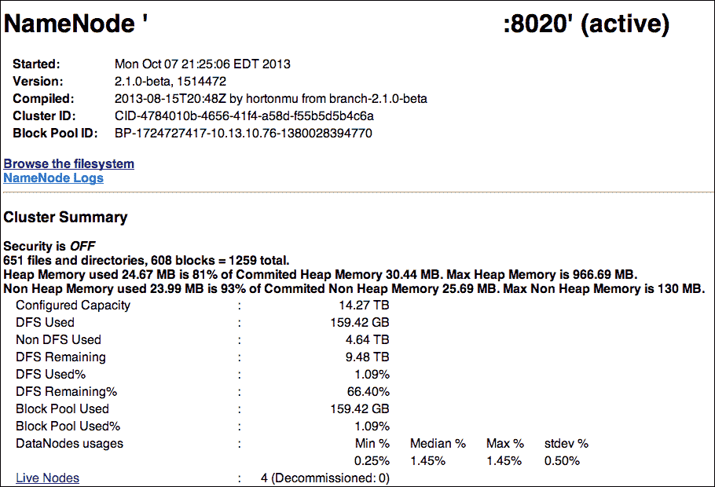

点击**Live Nodes**链接将显示可用的节点以及每个节点的空间分配，如下截图所示：

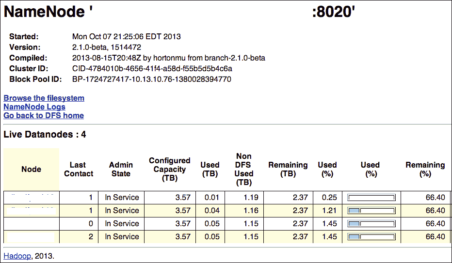

最后，从主页，您还可以通过点击**浏览文件系统**来浏览文件系统。

### 配置 DataNode

一般来说，最容易在集群中的节点之间共享核心配置文件。数据节点将使用`core-site.xml`文件中定义的主机和端口来定位 NameNode 并连接到它。

此外，每个 DataNode 需要配置本地存储的位置。这在`hdfs-site.xml`文件中的以下元素中定义：

```scala
<configuration>
   <property>
       <name>dfs.datanode.data.dir</name>
       <value>/vol/local/storage/</value>
   </property>
</configuration>
```

如果这个位置在从节点上是一致的，那么这个配置文件也可以共享。设置好后，您可以使用以下命令启动 DataNode：

```scala
$HADOOP_PREFIX/sbin/hadoop-daemon.sh --config $HADOOP_CONF_DIR --script hdfs start datanode

```

再次使用`jps`验证 DataNode 是否正在运行，并监视任何错误日志。在几分钟内，DataNode 应该会出现在 NameNode 的**Live Nodes**屏幕上，就像之前显示的那样。

### 配置 YARN

HDFS 已经运行起来了，现在是时候把注意力转向 YARN 了。与我们在 HDFS 中所做的类似，我们将首先运行 ResourceManager，然后通过运行 NodeManager 来连接从节点。

#### 配置 ResourceManager

ResourceManager 有各种子组件，每个子组件都充当需要在其上运行的主机和端口的服务器。所有服务器都在`yarn-site.xml`文件中配置。

对于这个例子，我们将使用以下 YARN 配置：

```scala
<configuration>
   <property>
       <name>yarn.resourcemanager.address</name>
       <value>master:8022</value>
   </property>
   <property>
       <name>yarn.resourcemanager.admin.address</name>
       <value>master:8033</value>
   </property>
   <property>
       <name>yarn.resourcemanager.resource-tracker.address</name>
        <value>master:8025</value>
   </property>
   <property>
       <name>yarn.resourcemanager.scheduler.address</name>
       <value>master:8030</value>
   </property>
   <property>
       <name>yarn.acl.enable</name>
       <value>false</value>
   </property>
   <property>
       <name>yarn.nodemanager.local-dirs</name>
       <value>/home/user/hadoop_work/mapred/nodemanager</value>
       <final>true</final>
   </property>
   <property>
     <name>yarn.nodemanager.aux-services</name>
     <value>mapreduce.shuffle</value>
   </property>
</configuration>
```

在前面的配置文件中，前四个变量分配了子组件的主机和端口。将`yarn.acl.enable`变量设置为`False`会禁用 YARN 集群上的安全性。`yarn.nodemanager.local-dirs`变量指定了 YARN 将数据放置在本地文件系统的位置。

最后，`yarn.nodemanager.aux-services`变量在 NodeManager 的运行时内启动一个辅助服务，以支持 MapReduce 作业。由于我们的 Pig 脚本编译成 MapReduce 作业，它们依赖于这个变量。

像 NameNode 一样，使用以下命令启动 ResourceManager：

```scala
$HADOOP_YARN_HOME/sbin/yarn-daemon.sh --config $HADOOP_CONF_DIR start resourcemanager

```

再次使用`jps`检查进程是否存在，监视异常日志，然后您应该能够导航到默认运行在端口 8088 上的 UI。

UI 显示在以下截图中：

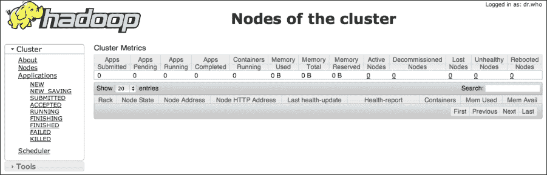

### 配置 NodeManager

NodeManager 使用相同的配置文件（`yarn-site.xml`）来定位相应的服务器。因此，在集群中的节点之间可以安全地复制或共享该文件。

使用以下命令启动 NodeManager：

```scala
$HADOOP_YARN_HOME/sbin/yarn-daemon.sh --config $HADOOP_CONF_DIR start nodemanager

```

在所有 NodeManagers 向 ResourceManager 注册之后，您将能够在 ResourceManager UI 中点击**Nodes**后看到它们，如下截图所示：

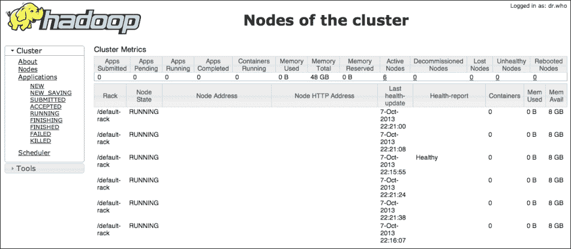

# 部署分析

有了 Hadoop，我们现在可以专注于我们将用于分析的分布式处理框架。

## 使用 Pig 基础设施执行批量分析

我们将要检查的第一个分布式处理框架是 Pig。Pig 是一个用于数据分析的框架。它允许用户用简单的高级语言表达分析。然后这些脚本编译成 MapReduce 作业。

尽管 Pig 可以从几个不同的系统（例如 S3）中读取数据，但在本例中，我们将使用 HDFS 作为我们的数据存储机制。因此，我们分析的第一步是将数据复制到 HDFS 中。

为此，我们发出以下 Hadoop 命令：

```scala
hadoop fs -mkdir /user/bone/temp
hadoop fs -copyFromLocal click_thru_data.txt /user/bone/temp/

```

上述命令创建了一个数据文件目录，并将点击数据文件复制到该目录中。

要执行 Pig 脚本对该数据，我们需要安装 Pig。为此，我们只需下载 Pig 并在配置了 Hadoop 的机器上展开存档。在这个例子中，我们将使用版本 0.11.1。

就像我们在 Hadoop 中所做的那样，我们将向我们的环境添加以下环境变量：

```scala
export PIG_CLASSPATH=/home/user/hadoop/etc/hadoop
export PIG_HOME=/home/user/pig
export PATH=PATH:$HOME/bin:$PIG_HOME/bin:$HADOOP_YARN_HOME/bin
```

`PIG_CLASSPATH`变量告诉 Pig 在哪里找到 Hadoop。

在您的环境中有了这些变量之后，您应该能够使用以下命令测试您的 Pig 安装：

```scala
boneill@master:~-> pig
2013-10-07 23:35:41,179 [main] INFO  org.apache.pig.Main - Apache Pig version 0.11.1 (r1459641) compiled Mar 22 2013, 02:13:53
...
2013-10-07 23:35:42,639 [main] INFO  org.apache.pig.backend.hadoop.executionengine.HExecutionEngine - Connecting to hadoop file system at: hdfs://master:8020
grunt>

```

默认情况下，Pig 将读取 Hadoop 配置并连接到分布式文件系统。您可以在先前的输出中看到。它连接到我们的分布式文件系统`hdfs://master:8020`。

通过 Pig，您可以与 HDFS 进行交互，方式与常规文件系统相同。例如，`ls`和`cat`都可以像以下代码片段中所示那样工作：

```scala
grunt> ls /user/bone/temp/
hdfs://master:8020/user/bone/temp/click_thru_data.txt<r 3>	157

grunt> cat /user/bone/temp/click_thru_data.txt
boneill campaign7 productX true
lisalis campaign10 productX false
boneill campaign6 productX true
owen campaign6 productX false
collin campaign7 productY true
maya campaign8 productY true
boneill campaign7 productX true
owen campaign6 productX true
olive campaign6 productX false
maryanne campaign7 productY true
dennis campaign7 productY true
patrick campaign7 productX false
charity campaign10 productY false
drago campaign7 productY false
```

## 使用 Storm-YARN 基础设施执行实时分析

现在我们已经为批处理工作建立了基础设施，让我们利用完全相同的基础设施进行实时处理。Storm-YARN 使得重用 Hadoop 基础设施进行 Storm 变得容易。

由于 Storm-YARN 是一个新项目，最好是根据源代码构建并使用`README`文件中的说明创建分发，该文件位于以下 URL：

[`github.com/yahoo/storm-yarn`](https://github.com/yahoo/storm-yarn)

构建分发后，您需要将 Storm 框架复制到 HDFS。这允许 Storm-YARN 将框架部署到集群中的每个节点。默认情况下，Storm-YARN 将在 HDFS 上启动用户目录中的 Storm 库作为 ZIP 文件。Storm-YARN 在其分发的`lib`目录中提供了一个兼容的 Storm 的副本。

假设您在 Storm-YARN 目录中，您可以使用以下命令将 ZIP 文件复制到正确的 HDFS 目录中：

```scala
hadoop fs -mkdir /user/bone/lib/
hadoop fs -copyFromLocal ./lib/storm-0.9.0-wip21.zip /user/bone/lib/

```

然后，您可以通过 Hadoop 管理界面浏览文件系统来验证 Storm 框架是否在 HDFS 中。您应该看到以下截图：

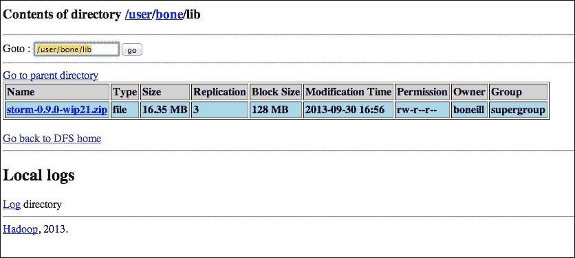

在 HDFS 上暂存了 Storm 框架后，下一步是为 Storm-YARN 配置本地 YAML 文件。与 Storm-YAML 一起使用的 YAML 文件是 Storm-YAML 和 Storm 的配置。YAML 文件中的 Storm 特定参数将传递给 Storm。

以下代码片段显示了 YAML 文件的示例：

```scala
master.host: "master"
master.thrift.port: 9000
master.initial-num-supervisors: 2
master.container.priority: 0
master.container.size-mb: 5120
master.heartbeat.interval.millis: 1000
master.timeout.secs: 1000
yarn.report.wait.millis: 10000
nimbusui.startup.ms: 10000

ui.port: 7070

storm.messaging.transport: "backtype.storm.messaging.netty.Context"
storm.messaging.netty.buffer_size: 1048576
storm.messaging.netty.max_retries: 100
storm.messaging.netty.min_wait_ms: 1000
storm.messaging.netty.max_wait_ms: 5000

storm.zookeeper.servers:
     - "zkhost"
```

许多参数都是自描述的。但特别注意最后一个变量。这是 ZooKeeper 主机的位置。尽管现在可能并非总是如此，但目前 Storm-YARN 假设您有一个预先存在的 ZooKeeper。

### 提示

要监视 Storm-YARN 是否仍然需要预先存在的 ZooKeeper 实例，请查看以下链接中提供的信息：

[`github.com/yahoo/storm-yarn/issues/22`](https://github.com/yahoo/storm-yarn/issues/22)

使用 HDFS 中的 Storm 框架和配置的 YAML 文件，启动 YARN 上的 Storm 的命令行如下：

```scala
storm-yarn launch ../your.yaml --queue default -appname storm-yarn-2.1.0-deta-demo --stormZip lib/storm-0.9.0-wip21.zip

```

您指定 YAML 文件的位置，YARN 队列，应用程序的名称以及 ZIP 文件的位置，相对于用户目录，除非指定了完整路径。

### 提示

YARN 中的队列超出了本讨论的范围，但默认情况下，YARN 配置了一个默认队列，该队列在上述命令行中使用。如果您在现有集群上运行 Storm，请检查 YARN 配置中的`capacity-scheduler.xml`以查找潜在的队列名称。

执行上述命令行后，您应该会在 YARN 管理屏幕上看到应用程序部署，如下截图所示：

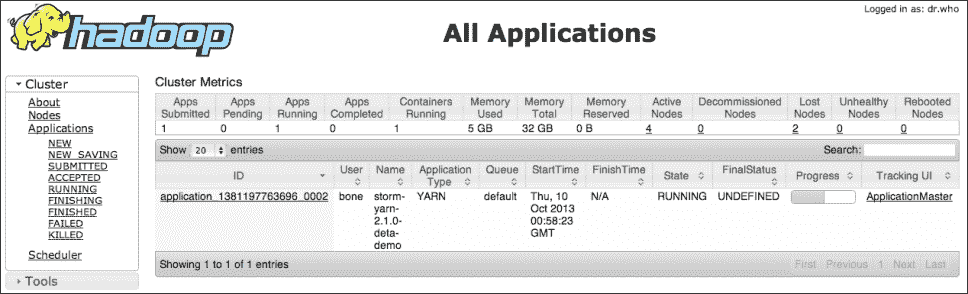

单击应用程序显示应用程序主管部署的位置。检查 Application Master 的节点值。这就是您将找到 Storm UI 的地方，如下截图所示：

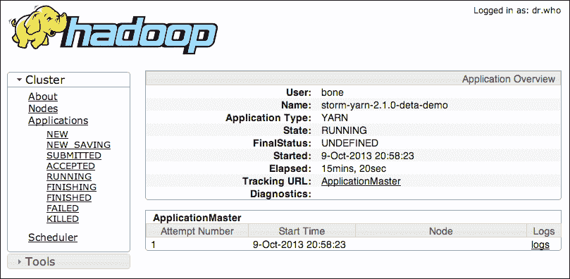

再深入一级，您将能够看到 Storm 的日志文件，如下截图所示：

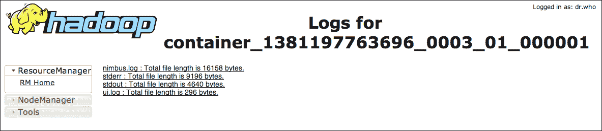

幸运的话，日志将显示 Nimbus 和 UI 成功启动。检查标准输出流，您将看到 Storm-YARN 启动监督者：

```scala
13/10/09 21:40:10 INFO yarn.StormAMRMClient: Use NMClient to launch supervisors in container.  
13/10/09 21:40:10 INFO impl.ContainerManagementProtocolProxy: Opening proxy : slave05:35847 
13/10/09 21:40:12 INFO yarn.StormAMRMClient: Supervisor log: http://slave05:8042/node/containerlogs/container_1381197763696_0004_01_000002/boneill/supervisor.log 
13/10/09 21:40:14 INFO yarn.MasterServer: HB: Received allocated containers (1) 13/10/09 21:40:14 INFO yarn.MasterServer: HB: Supervisors are to run, so queueing (1) containers... 
13/10/09 21:40:14 INFO yarn.MasterServer: LAUNCHER: Taking container with id (container_1381197763696_0004_01_000004) from the queue. 
13/10/09 21:40:14 INFO yarn.MasterServer: LAUNCHER: Supervisors are to run, so launching container id (container_1381197763696_0004_01_000004) 
13/10/09 21:40:16 INFO yarn.StormAMRMClient: Use NMClient to launch supervisors in container.  13/10/09 21:40:16 INFO impl.ContainerManagementProtocolProxy: Opening proxy : dlwolfpack02.hmsonline.com:35125 
13/10/09 21:40:16 INFO yarn.StormAMRMClient: Supervisor log: http://slave02:8042/node/containerlogs/container_1381197763696_0004_01_000004/boneill/supervisor.log

```

上述输出中的关键行已经突出显示。如果导航到这些 URL，您将看到各自实例的监督者日志。回顾我们用于启动 Storm-YARN 的 YAML 文件，注意我们指定了以下内容：

```scala
 master.initial-num-supervisors: 2

```

使用托管 ApplicationMaster 的节点导航到 UI，然后导航到用于启动的 YAML 文件中指定的 UI 端口（`ui.port: 7070`）。

在浏览器中打开`http://node:7070/`，其中 node 是 Application Master 的主机。您应该会看到熟悉的 Storm UI，如下截图所示：

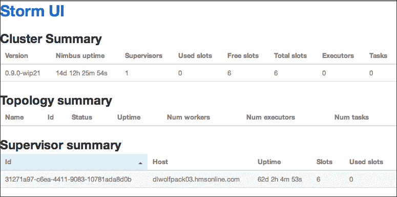

基础设施现在已经准备就绪。要在 YARN 上终止 Storm 部署，可以使用以下命令：

```scala
./storm-yarn shutdown -appId application_1381197763696_0002

```

在上述语句中，`appId`参数对应于分配给 Storm-YARN 的`appId`参数，并且在 Hadoop 管理屏幕上可见。

### 提示

Storm-YARN 将使用本地 Hadoop 配置来定位主 Hadoop 节点。如果您是从不属于 Hadoop 集群的机器启动的，您将需要使用 Hadoop 环境变量和配置文件配置该机器。具体来说，它通过 ResourceManager 启动。因此，您需要在`yarn-site.xml`中配置以下变量：

`yarn.resourcemanager.address`

# 执行分析

有了批处理和实时基础设施，我们可以专注于分析。首先，我们将看一下 Pig 中的处理，然后将 Pig 脚本转换为 Storm 拓扑。

## 执行批量分析

对于批量分析，我们使用 Pig。Pig 脚本通过计算点击次数和总曝光次数之间的不同客户数量的比率来计算活动的有效性。

Pig 脚本如下所示：

```scala
click_thru_data = LOAD '../click_thru_data.txt' using PigStorage(' ')
  AS (cookie_id:chararray,
      campaign_id:chararray,
      product_id:chararray,
      click:chararray);

click_thrus = FILTER click_thru_data BY click == 'true';
distinct_click_thrus = DISTINCT click_thrus;
distinct_click_thrus_by_campaign = GROUP distinct_click_thrus BY campaign_id;
count_of_click_thrus_by_campaign = FOREACH distinct_click_thrus_by_campaign GENERATE group, COUNT($1);
-- dump count_of_click_thrus_by_campaign;

impressions_by_campaign = GROUP click_thru_data BY campaign_id;
count_of_impressions_by_campaign = FOREACH impressions_by_campaign GENERATE group, COUNT($1);
-- dump count_of_impressions_by_campaign;

joined_data = JOIN count_of_impressions_by_campaign BY $0 LEFT OUTER, count_of_click_thrus_by_campaign BY $0 USING 'replicated';
-- dump joined_data;

result = FOREACH joined_data GENERATE $0 as campaign, ($3 is null ? 0 : $3) as clicks, $1 as impressions, (double)$3/(double)$1 as effectiveness:double;
dump result;
```

让我们更仔细地看一下上述代码。

第一个`LOAD`语句指定了数据的位置和用于加载数据的模式。通常，Pig 加载非规范化数据。数据的位置是一个 URL。在本地模式下操作时，如前所示，这是一个相对路径。在 MapReduce 模式下运行时，URL 很可能是 HDFS 中的位置。在针对**亚马逊网络服务**（**AWS**）运行 Pig 脚本时，这很可能是一个 S3 URL。

在`Load`语句之后的后续行中，脚本计算了所有不同的点击次数。在第一行中，它过滤了仅在该列中为`True`的行的数据集，这表示印象导致了点击次数。过滤后，行被过滤为仅包含不同条目。然后，按广告系列对行进行分组，并计算每个广告系列的不同点击次数。这项分析的结果存储在别名`count_of_click_thrus_by_campaign`中。

然后，在后续行中计算了问题的第二个维度。不需要过滤，因为我们只想要按广告系列计算印象的计数。这些结果存储在别名`count_of_impressions_by_campaign`中。

执行 Pig 脚本会产生以下输出：

```scala
(campaign6,2,4,0.5)
(campaign7,4,7,0.5714285714285714)
(campaign8,1,1,1.0)
(campaign10,0,2,)
```

输出中的第一个元素是广告系列标识符。接着是所有不同的点击次数和总印象次数。最后一个元素是效果，即所有不同的点击次数与总印象次数的比率。

## 执行实时分析

现在，让我们将批处理分析转化为实时分析。对 Pig 脚本的严格解释可能会导致以下拓扑：

```scala
Stream inputStream = topology.newStream("clickthru", spout);
Stream click_thru_stream = inputStream.each(
new Fields("cookie", "campaign", "product", "click"), 
new Filter("click", "true"))
.each(new Fields("cookie", "campaign", "product", "click"), 
new Distinct())
                .groupBy(new Fields("campaign"))              
                .persistentAggregate(
new MemoryMapState.Factory(), new Count(), 
new Fields("click_thru_count"))
                .newValuesStream();

Stream impressions_stream = inputStream.groupBy(
new Fields("campaign"))
                .persistentAggregate(
new MemoryMapState.Factory(), new Count(), 
new Fields("impression_count"))
                .newValuesStream();

topology.join(click_thru_stream, new Fields("campaign"),
impressions_stream, new Fields("campaign"), 
  new Fields("campaign", "click_thru_count", "impression_count"))
                .each(new Fields("campaign", 
"click_thru_count", "impression_count"), 
new CampaignEffectiveness(), new Fields(""));
```

在前述拓扑中，我们将流分成两个独立的流：`click_thru_stream`和`impressions_stream`。`click_thru_stream`包含不同印象的计数。`impressions_stream`包含印象的总计数。然后使用`topology.join`方法将这两个流连接起来。

前述拓扑的问题在于连接。在 Pig 中，由于集合是静态的，它们可以很容易地连接。Storm 中的连接是基于每个批次进行的。这不一定是个问题。然而，连接也是内连接，这意味着只有在流之间存在对应元组时才会发出记录。在这种情况下，我们正在从`click_thru_stream`中过滤记录，因为我们只想要不同的记录。因此，该流的基数小于`impressions_stream`的基数，这意味着在连接过程中会丢失元组。

### 提示

对于离散集合，诸如连接之类的操作是明确定义的，但不清楚如何将它们的定义转化为无限事件流的实时世界。有关更多信息，请访问以下 URL：

+   [`cwiki.apache.org/confluence/display/PIG/Pig+on+Storm+Proposal`](https://cwiki.apache.org/confluence/display/PIG/Pig+on+Storm+Proposal)

+   [`issues.apache.org/jira/browse/PIG-3453`](https://issues.apache.org/jira/browse/PIG-3453)

相反，我们将使用 Trident 的状态构造来在流之间共享计数。

这在以下图表中显示了更正后的拓扑：

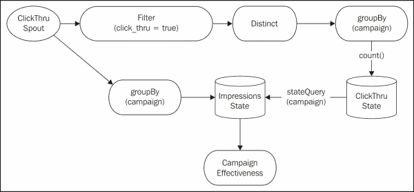

此拓扑的代码如下：

```scala
StateFactory clickThruMemory = new MemoryMapState.Factory();
ClickThruSpout spout = new ClickThruSpout();
Stream inputStream = topology.newStream("clithru", spout);
TridentState clickThruState = inputStream.each(
new Fields("cookie", "campaign", "product", "click"),
new Filter("click", "true"))
   .each(new Fields("cookie", "campaign", "product", "click"),
new Distinct())
   .groupBy(new Fields("campaign"))
   .persistentAggregate(clickThruMemory, new Count(),
new Fields("click_thru_count"));

inputStream.groupBy(new Fields("campaign"))
.persistentAggregate(new MemoryMapState.Factory(),
new Count(), new Fields("impression_count"))
.newValuesStream()
.stateQuery(clickThruState, new Fields("campaign"),
new MapGet(), new Fields("click_thru_count"))
.each(new Fields("campaign", "impression_count",
      "click_thru_count"),
new CampaignEffectiveness(), new Fields(""));
```

让我们先看看 spout。它简单地读取文件，解析行，并发出元组，如下面的代码片段所示：

```scala
public class ClickThruEmitter
implements Emitter<Long>, Serializable {
...
@Override
public void emitBatch(TransactionAttempt tx,
Long coordinatorMeta, TridentCollector collector) {
     File file = new File("click_thru_data.txt");
     try {
         BufferedReader br = 
new BufferedReader(new FileReader(file));
         String line = null;
         while ((line = br.readLine()) != null) {
          String[] data = line.split(" ");
          List<Object> tuple = new ArrayList<Object>();
          tuple.add(data[0]); // cookie
          tuple.add(data[1]); // campaign
          tuple.add(data[2]); // product
          tuple.add(data[3]); // click
          collector.emit(tuple);
         }
         br.close();
     } catch (Exception e) {
         throw new RuntimeException(e);
     }
}
     ...
}
```

在真实系统中，前述 spout 很可能会从 Kafka 队列中读取。或者，如果我们想要重新创建批处理机制正在执行的操作，spout 可以直接从 HDFS 中读取。

### 提示

有一些关于可以从 HDFS 读取的 spout 的初步工作；请查看以下 URL 以获取更多信息：

[`github.com/jerrylam/storm-hdfs`](https://github.com/jerrylam/storm-hdfs)

为了计算所有点击次数的不同计数，拓扑首先过滤流，仅保留导致点击次数的印象。

此过滤器的代码如下：

```scala
public class Filter extends BaseFilter {
    private static final long serialVersionUID = 1L;
    private String fieldName = null;
    private String value = null;

    public Filter(String fieldName, String value){
        this.fieldName = fieldName;
        this.value = value;        
    }

    @Override
    public boolean isKeep(TridentTuple tuple) {
        String tupleValue = tuple.getStringByField(fieldName); 
        if (tupleValue.equals(this.value)) {
          return true;
        }
        return false;
    }
}
```

然后，流仅过滤出不同的点击次数。在这个例子中，它使用内存缓存来过滤不同的元组。实际上，这应该使用分布式状态和/或分组操作来将相似的元组定向到同一主机。没有持久存储，该示例最终会在 JVM 中耗尽内存。

### 提示

正在积极研究算法来近似数据流中的不同集合。有关**Streaming Quotient Filter**（**SQF**）的更多信息，请查看以下网址：

[`www.vldb.org/pvldb/vol6/p589-dutta.pdf`](http://www.vldb.org/pvldb/vol6/p589-dutta.pdf)

对于我们的示例，`Distinct`函数显示在以下代码片段中：

```scala
public class Distinct extends BaseFilter {
    private static final long serialVersionUID = 1L;
    private Set<String> distincter = Collections.synchronizedSet(new HashSet<String>());

    @Override
    public boolean isKeep(TridentTuple tuple) {        
        String id = this.getId(tuple);
   return distincter.add(id);
    }

    public String getId(TridentTuple t){
        StringBuilder sb = new StringBuilder();
        for (int i = 0; i < t.size(); i++){
           sb.append(t.getString(i));
        }
        return sb.toString();
    }
}
```

一旦获得所有不同的点击量，Storm 会使用`persistAggregate`调用将该信息持久化到 Trident 状态中。这通过使用`Count`运算符来折叠流。在示例中，我们使用了 MemoryMap。然而，在实际系统中，我们很可能会应用分布式存储机制，如 Memcache 或 Cassandra。

处理初始流的结果是一个包含按广告系列标识符分组的所有不同点击量的`TridentState`对象。*连接*两个流的关键行如下所示：

```scala
.stateQuery(clickThruState, new Fields("campaign"),
new MapGet(), new Fields("click_thru_count"))
```

这将将初始流中开发的状态合并到第二个流中开发的分析中。实际上，第二个流查询状态机制以获取该广告系列的所有不同点击量，并将其作为字段添加到在此流程中处理的元组中。然后可以利用该字段进行效果计算，该计算封装在以下类中：

```scala
public class CampaignEffectiveness extends BaseFunction {
    private static final long serialVersionUID = 1L;

    @Override
    public void execute(TridentTuple tuple, TridentCollector collector) {
   String campaign = (String) tuple.getValue(0);
        Long impressions_count = (Long) tuple.getValue(1);
        Long click_thru_count = (Long) tuple.getValue(2);
        if (click_thru_count == null) 
            click_thru_count = new Long(0);
        double effectiveness = (double) click_thru_count / (double) impressions_count;
   Log.error("[" + campaign + "," + String.valueOf(click_thru_count) + "," + impressions_count + ", " + effectiveness + "]");
   List<Object> values = new ArrayList<Object>();
   values.add(campaign);
   collector.emit(values);
    }
}
```

如前面的代码所示，该类通过计算包含总计数的字段与状态查询引入的字段之间的比率来计算效果。

# 部署拓扑

要部署前面的拓扑，必须首先使用以下命令检索 Storm-YAML 配置：

```scala
storm-yarn getStormConfig ../your.yaml --appId application_1381197763696_0004 --output output.yaml

```

前面的命令与指定的 Storm-YARN 应用程序实例交互，以检索可以使用标准机制部署拓扑的`storm.yaml`文件。只需将`output.yaml`文件复制到适当的位置（通常为`~/.storm/storm.yaml`），然后使用标准的`storm jar`命令进行部署，如下所示：

```scala
storm jar <appJar>
```

# 执行拓扑

执行前面的拓扑将产生以下输出：

```scala
00:00 ERROR: [campaign10,0,2, 0.0]
00:00 ERROR: [campaign6,2,4, 0.5]
00:00 ERROR: [campaign7,4,7, 0.5714285714285714]
00:00 ERROR: [campaign8,1,1, 1.0]
```

请注意，这些值与 Pig 发出的值相同。如果让拓扑运行，最终会看到效果得分逐渐降低，如下面的输出所示：

```scala
00:03 ERROR: [campaign10,0,112, 0.0]
00:03 ERROR: [campaign6,2,224, 0.008928571428571428]
00:03 ERROR: [campaign7,4,392, 0.01020408163265306]
00:03 ERROR: [campaign8,1,56, 0.017857142857142856]
```

这是有道理的，因为我们现在有了一个实时系统，它不断地消耗相同的印象事件。由于我们只计算所有不同的点击量，并且整个点击量集已经在计算中被考虑，效果将继续下降。

# 总结

在本章中，我们看到了一些不同的东西。首先，我们看到了将利用 Pig 的批处理机制转换为在 Storm 中实现的实时系统的蓝图。我们看到了直接翻译该脚本将不起作用的原因，因为实时系统中联接的限制，传统的联接操作需要有限的数据集。为了解决这个问题，我们使用了带有分叉流的共享状态模式。

其次，也许最重要的是，我们研究了 Storm-YARN；它允许用户重用 Hadoop 基础设施来部署 Storm。这不仅为现有的 Hadoop 用户提供了快速过渡到 Storm 的途径，还允许用户利用 Hadoop 的云机制，如亚马逊的**弹性 Map Reduce**（**EMR**）。使用 EMR，Storm 可以快速部署到云基础设施，并根据需求进行扩展。

最后，作为未来的工作，社区正在探索直接在 Storm 上运行 Pig 脚本的方法。这将允许用户直接将其现有的分析移植到 Storm 上。

要监视这项工作，请访问[`cwiki.apache.org/confluence/display/PIG/Pig+on+Storm+Proposal.`](https://cwiki.apache.org/confluence/display/PIG/Pig+on+Storm+Proposal.)

在下一章中，我们将探讨使用 Apache Whirr 在云中自动部署 Storm。虽然没有明确提到，但下一章中的技术可以用于云部署。
