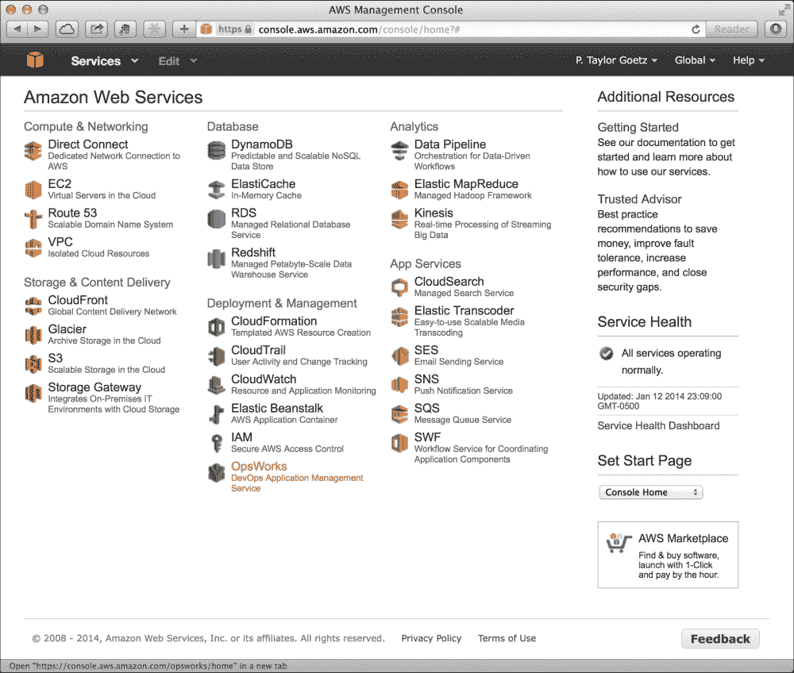
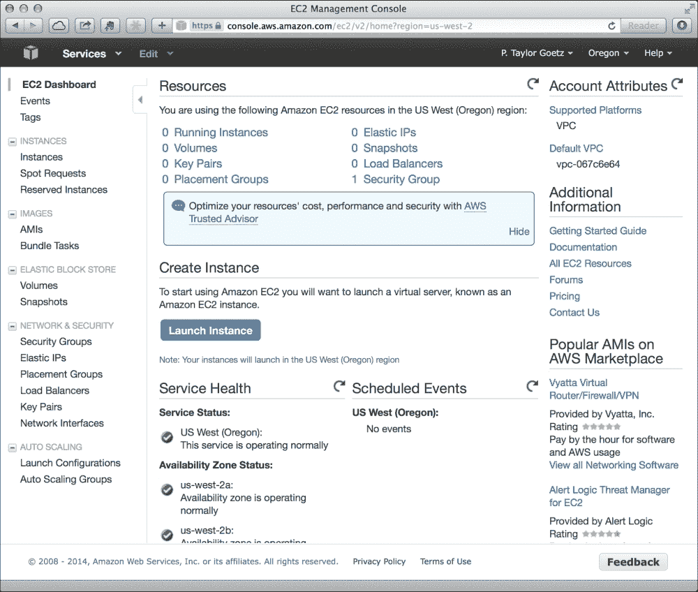
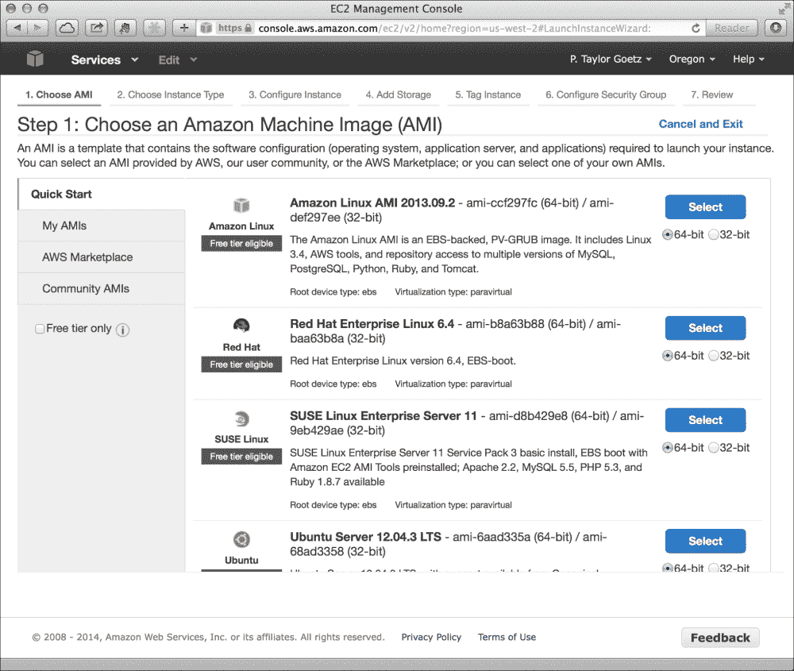
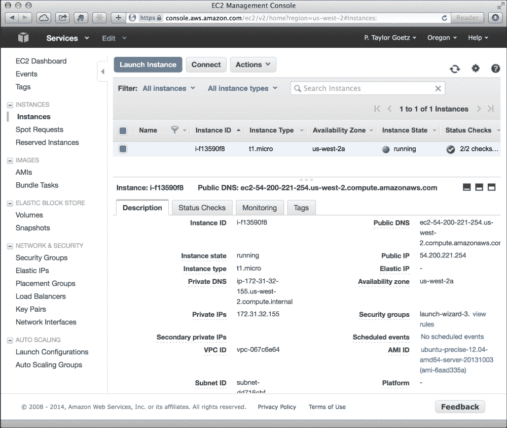
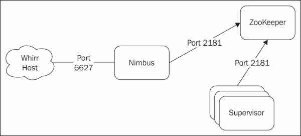
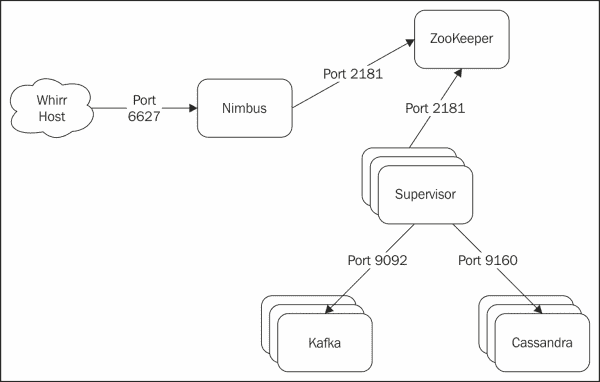

# 第十章：云中的 Storm

在本章中，我们将向您介绍在云提供商的托管环境中部署和运行 Storm。

在第二章 *配置 Storm 集群*中，您已经了解了在集群环境中设置 Storm 所需的步骤，随后的章节涵盖了 Kafka、Hadoop 和 Cassandra 等辅助技术的安装和配置。虽然大多数安装都相对简单，但即使是维护规模适中的集群的成本——无论是物理资产要求还是配置和维护环境所需的时间——都很容易成为一个负担，甚至是对分布式计算技术采用的直接阻碍。

幸运的是，今天有许多云托管提供商提供按需动态配置多机计算环境的服务。大多数云托管提供商提供各种服务和选项，以满足大多数用户的需求，从单个小型服务器到由数百甚至数千台机器组成的大规模基础设施。事实上，高知名度的互联网内容提供商之间的一个常见趋势是选择云托管提供商而不是内部数据中心。

使用云提供商的一个关键好处是能够根据需要和按需部署和取消部署计算资源。例如，网上零售商可能会在节假日季节前提供额外的服务器和资源，以满足需求，在高峰期后缩减。此外，正如我们将看到的，云提供商提供了一种成本效益的方法来测试和原型化分布式应用程序。

我们将从使用云提供商为 Storm 集群进行配置开始。本章后面，我们将向您展示如何在工作站上的完全集群环境中为测试 Storm 应用程序进行本地虚拟化 Storm 实例的配置和管理。

在本章中，我们将涵盖以下主题：

+   使用**Amazon Web Services**（**AWS**）**弹性计算云**（**EC2**）配置虚拟机

+   使用 Apache Whirr 自动配置和部署 Storm 集群到 EC2

+   使用 Vagrant 在本地环境中启动和配置虚拟化 Storm 集群

# 介绍 Amazon 弹性计算云（EC2）

Amazon EC2 是亚马逊提供的许多远程计算服务的核心部分。EC2 允许用户按需租用托管在亚马逊网络基础设施上的虚拟计算资源。

我们将从设置 EC2 账户并在亚马逊的 EC2 基础设施上手动启动虚拟机开始。

## 设置 AWS 账户

建立 AWS 账户很容易，但需要一个 Amazon 账户。如果您还没有 Amazon 账户，请在[`www.amazon.com/`](http://www.amazon.com/)上注册一个。

建立了您的 Amazon 账户后，您可以在[`aws.amazon.com/`](http://aws.amazon.com/)上设置 AWS 账户。

## AWS 管理控制台

**AWS 管理控制台**充当了亚马逊提供的所有云服务的主要管理界面。我们主要关注 EC2 服务，因此让我们从登录到 EC2 管理控制台开始，如下面的屏幕截图所示：



### 创建 SSH 密钥对

在启动任何 EC2 实例之前，您将需要一个密钥对。要创建新的密钥对，请单击**密钥对**链接以打开密钥对管理器，如下面的屏幕截图所示：



您将被提示为密钥对命名。输入名称，然后单击**是**按钮。此时，根据您使用的浏览器，您将被提示下载您的私人证书文件，或者文件将自动下载。

非常重要的是，您要确保保管好这个文件，因为该密钥将给您对使用该密钥启动的任何 EC2 映像的完全管理员访问权限。在下载私钥后立即更改其文件权限，以确保它不是公开可读的；例如，使用 UNIX，使用以下命令：

```scala
chmod 400 my-keyfile.pem

```

许多 SSH 客户端将查看密钥文件的权限并发出警告，或拒绝使用公开可读的密钥文件。

## 手动启动 EC2 实例

创建了密钥对后，您就可以启动 EC2 实例了。

启动 EC2 机器的第一步是选择**Amazon Machine Image**（**AMI**）。AMI 是一个虚拟设备模板，可以在 Amazon EC2 上作为虚拟机运行。

亚马逊提供了许多流行操作系统发行版的 AMI，例如 Red Hat、Ubuntu 和 SUSE。对于我们的目的，我们将使用 Ubuntu Server 实例，如下截图所示：



选择了 AMI 后，您将被提示选择一个**实例类型**。实例类型代表具有不同内存（RAM）、CPU 核心、存储和 I/O 性能的虚拟硬件配置文件。亚马逊按小时收取运行实例的费用，价格从最弱实例类型（**t1.micro**）的几美分每小时到最强实例类型（**hs1.8xlarge**）的几美元每小时不等。您选择的类型将取决于您的用例和预算。例如，**t1.micro**实例（一个 CPU，0.6 GB RAM 和低 I/O 性能）可用于测试目的，但显然不适用于大规模生产负载。

选择实例类型后，您可以通过单击**审阅并启动**按钮，审阅实例详细信息，然后单击**启动**来启动虚拟机。然后，您将被提示选择一个用于远程登录和管理实例的密钥对。几分钟后，您的实例将如下截图所示启动并运行：



### 登录到 EC2 实例

当您启动一个实例时，EC2 将使用您在设置过程中选择的密钥对预配置 SSH，从而允许您远程登录到该机器。要远程登录到实例，您将需要之前下载的私钥文件以及分配给实例的公共 DNS 名称（或公共 IP 地址）。您可以在 EC2 管理控制台中找到这些信息，方法是单击实例并查看详细信息。

现在您可以使用以下命令连接到实例：

```scala
ssh -i [keypair] [username]@[public DNS or IP]

```

例如，以“ubuntu”用户身份使用`my-keypair.pem`私钥文件进行连接：

```scala
ssh -i my-keypair.pem ubuntu@ec2-54-200-221-254.us-west-2.compute.amazonaws.com

```

Ubuntu 用户在远程主机上具有管理员权限，使您能够按照自己的喜好配置机器。

在这一点上，您可以安装 Storm 或任何其他您喜欢的服务。然而，手动配置大于微小规模集群的实例将很快变得耗时且难以管理。在下一节中，我们将介绍一种自动化此过程的方法，作为更可扩展工作流程的一部分。

# 介绍 Apache Whirr

Apache Whirr 项目（[`whirr.apache.org`](http://whirr.apache.org)）提供了一个 Java API 和一组 shell 脚本，用于在云提供商（如 Amazon EC2 和 Rackspace）上安装和运行各种服务。Whirr 允许您根据节点数量定义集群的布局，以及控制每个节点上运行哪些服务。Whirr 还配备了一组用于执行管理操作的脚本，例如启动新集群、启动和停止集群以及终止集群。

Whirr 最初是一组用于在 Amazon EC2 上运行 Hadoop 的 shell 脚本，后来发展成包含基于 Apache jclouds ([`jclouds.apache.org`](http://jclouds.apache.org))项目的 Java API，这使其能够支持多个云提供商。Whirr 还扩展到支持许多其他分布式计算服务，如 Cassandra、Elastic Search、HBase、Pig 等。

## 安装 Whirr

首先下载最新版本并在您用于启动和管理集群的计算机上解压缩：

```scala
wget http://www.apache.org/dist/whirr/whirr-0.8.2/whirr-0.8.2.tar.gz
tar -zxf whirr-0.8.2.tar.gz

```

为了方便起见，将 Whirr 的`bin`目录添加到系统的`PATH`环境变量中，这样您就可以从任何目录运行 Whirr 命令，如下所示：

```scala
WHIRR_HOME=/Users/tgoetz/whirr-0.8.2
export PATH=$PATH:$WHIRR_HOME/bin

```

Whirr 使用 SSH 与云实例通信，因此我们将为其创建一个专用密钥对。Whirr 要求密钥没有空密码，如下命令所示：

```scala
ssh-keygen -t rsa -P '' -f ~/.ssh/id_rsa_whirr

```

为了让 Whirr 与您的云提供商账户进行交互，它需要知道您的凭据。对于 EC2，这包括您的 EC2 访问密钥 ID 和您的 EC2 秘密访问密钥。如果您的 AWS 账户是新的，您需要生成新的凭据；否则，您应该已经将您的凭据下载到一个安全的位置。要生成一组新的 EC2 凭据，请执行以下步骤：

1.  登录到**AWS 管理控制台**。

1.  点击导航栏右上部的名称，然后选择**安全凭据**。

1.  展开标题为**访问密钥（访问密钥 ID 和秘密访问密钥）**的部分，然后点击**创建新的访问密钥**按钮。

1.  点击**下载密钥文件**将您的凭据下载到安全的位置。

您下载的密钥文件将以以下格式包含您的访问密钥 ID 和秘密访问密钥：

```scala
AWSAccessKeyId=QRIXIUUTWRXXXXTPW4UA
AWSSecretKey=/oA7m/XW+x1eGQiyxxxTsU+rxRSIxxxx3EbM1yg6
```

Whirr 为指定云凭据提供了三种选项：命令行参数、集群配置文件或本地凭据文件（`~/.whirr/credentials`）。我们将使用最后一个选项，因为它是最方便的，如下所示：

```scala
mkdir ~/.whirr
echo "PROVIDER=aws-ec2" > ~/.whirr/credentials
echo "IDENTITY=[your EC2 Access Key ID]" >> ~/.whirr/credentials
echo "CREDENTIAL=[your EC2 Secret Access Key]" >> ~/.whirr/credentials

```

# 使用 Whirr 配置 Storm 集群

既然我们已经安装了 Whirr，让我们把注意力转向集群配置。Whirr 的配置文件或配方只是包含 Whirr 属性的 Java 属性文件，这些属性定义了集群中节点和服务的布局。

让我们首先看一下启动 3 节点 ZooKeeper 集群所需的最小配置：

```scala
whirr.cluster-name=zookeeper
whirr.instance-templates=3 zookeeper
```

`whirr.cluster-name`属性只是为集群分配一个唯一标识符，并且在运行管理命令时使用，比如列出集群中的主机或销毁集群。

`whirr.instance-template`属性定义了集群中节点的数量以及每个节点上运行的服务。在上面的示例中，我们定义了一个由三个节点组成的集群，每个节点分配了 ZooKeeper 角色。

只需定义这两个属性，我们就有足够的信息告诉 Whirr 如何启动和管理 ZooKeeper 集群。Whirr 将对其他所有内容使用默认值。但是，通常有一些选项您可能想要覆盖。例如，我们希望 Whirr 使用我们之前创建的专用密钥对，如下面的代码片段所示：

```scala
whirr.private-key-file=${sys:user.home}/.ssh/id_rsa_whirr
whirr.public-key-file=${whirr.private-key-file}.pub
```

接下来，我们将使用以下代码片段配置 Whirr 所需的硬件规格和我们的集群应该托管的区域：

```scala
whirr.image-id=us-east-1/ami-55dc0b3c
whirr.hardware-id=t1.micro
whirr.location=us-east-1
```

`whirr.image-id`属性是特定于提供商的，指定要使用的机器映像。在这里，我们指定了一个 Ubuntu 10.04 64 位 AMI。

由于我们只是在测试 Whirr，我们选择了最小（也是最便宜）的实例类型：`t1.micro`。最后，我们指定我们希望我们的集群部署在`us-east-1`区域。

要获取公共 AMI 的完整列表，请执行以下步骤：

1.  从 EC2 管理控制台，从右上角的下拉菜单中选择一个区域。

1.  在左侧导航窗格中，点击**AMIs**。

1.  从页面顶部的**筛选**下拉菜单中，选择**公共镜像**。

Whirr 最彻底地测试了 Ubuntu Linux 映像。虽然其他操作系统可能有效，但如果遇到问题，请尝试使用 Ubuntu 映像再次尝试。

## 启动集群

我们的 ZooKeeper 集群的配置文件现在如下所示的代码片段：

```scala
whirr.cluster-name=zookeeper
whirr.instance-templates=3 zookeeper
whirr.private-key-file=${sys:user.home}/.ssh/id_rsa_whirr
whirr.public-key-file=${whirr.private-key-file}.pub
whirr.image-id=us-east-1/ami-55dc0b3c
whirr.hardware-id=t1.micro
whirr.location=us-east-1
```

如果我们将这些属性保存到名为`zookeeper.properties`的文件中，然后可以使用以下命令启动集群：

```scala
whirr launch-cluster --config zookeeper.properties

```

当命令完成时，Whirr 将输出创建的实例列表，以及可用于连接到每个实例的 SSH 命令。

您可以使用以下 SSH 命令登录实例：

```scala
[zookeeper]: ssh -i /Users/tgoetz/.ssh/id_rsa_whirr -o "UserKnownHostsFile /dev/null" -o StrictHostKeyChecking=no storm@54.208.197.231 
[zookeeper]: ssh -i /Users/tgoetz/.ssh/id_rsa_whirr -o "UserKnownHostsFile /dev/null" -o StrictHostKeyChecking=no storm@54.209.143.46
[zookeeper]: ssh -i /Users/tgoetz/.ssh/id_rsa_whirr -o "UserKnownHostsFile /dev/null" -o StrictHostKeyChecking=no storm@54.209.22.63

```

要销毁集群，请使用与启动相同的选项运行`whirr destroy-cluster`。

当您完成集群后，可以使用以下命令终止所有实例：

```scala
whirr destroy-cluster --config zookeeper.properties

```

# 介绍 Whirr Storm

Whirr Storm 项目（[`github.com/ptgoetz/whirr-storm`](https://github.com/ptgoetz/whirr-storm)）是用于配置 Storm 集群的 Whirr 服务实现。Whirr Storm 支持所有 Storm 守护程序的配置，以及对 Storm 的`storm.yaml`配置文件的完全控制。

## 设置 Whirr Storm

要安装 Whirr Storm 服务，只需将 JAR 文件放在`$WHIRR_HOME/lib`目录中，如下所示：

```scala
wget http://repo1.maven.org/maven2/com/github/ptgoetz/whirr-storm/1.0.0/whirr-storm-1.0.0.jar -P $WHIRR_HOME/lib
```

接下来，通过运行`Whirr`命令而不带参数来验证安装，以打印 Whirr 可用的实例角色列表。现在列表应该包括 Whirr Storm 提供的角色，如下面的代码片段所示：

```scala
$ whirr
…
 storm-drpc
 storm-logviewer
 storm-nimbus
 storm-supervisor
 storm-ui

```

### 集群配置

在我们之前的 Whirr 示例中，我们创建了一个由三个节点组成的集群，每个节点只具有 ZooKeeper 角色。Whirr 允许您为节点分配多个角色，这是我们需要为 Storm 集群做的。在我们深入配置 Whirr 为 Storm 做准备之前，让我们看一下 Whirr Storm 定义的不同角色，如下表所示：

| 角色 | 描述 |
| --- | --- |
| `storm-nimbus` | 这是运行 Nimbus 守护程序的角色。每个集群只应分配一个节点给此角色。 |
| `storm-supervisor` | 这是运行监督者守护程序的角色。 |
| `storm-ui` | 这是运行 Storm UI Web 服务的角色。 |
| `storm-logviewer` | 这是运行 Storm 日志查看器服务的角色。此角色只应分配给同时具有`storm-supervisor`角色的节点。 |
| `storm-drpc` | 这是运行 Storm DRPC 服务的角色。 |
| `zookeeper` | 这个角色由 Whirr 提供。具有此角色的节点将成为 ZooKeeper 集群的一部分。在 Storm 集群中，您必须至少有一个 ZooKeeper 节点，对于多节点 ZooKeeper 集群，节点的数量应该是奇数。 |

要在 Whirr 配置中使用这些角色，我们以以下格式在`whirr.instance-template`属性中指定它们：

```scala
whirr.instance-templates=[# of nodes] [role 1]+[role 2],[# of nodes] [role 3]+[role n]
```

例如，要创建一个单节点伪集群，其中所有 Storm 的守护程序都在一台机器上运行，我们将使用以下值作为`whirr.instance-template`：

```scala
whirr.instance-template=1 storm-nimbus+storm-ui+storm-logviewer+storm-supervisor+zookeeper
```

如果我们想要创建一个多节点集群，其中一个节点运行 Nimbus 和 Storm UI，三个节点运行监督者和日志查看器守护程序，以及一个 3 节点的 ZooKeeper 集群，我们将使用以下配置：

```scala
whirr.instance-templates=1 storm-nimbus+storm-ui,3 storm-supervisor+storm-logviewer, 3 zookeeper
```

### 自定义 Storm 的配置

Whirr Storm 将生成一个`storm.yaml`配置文件，其中包含`nimbus.host`、`storm.zookeeper.servers`和`drpc.servers`的值，这些值是根据集群中节点的主机名自动计算的，以及它们被分配的角色。除非特别覆盖，所有其他 Storm 配置参数将继承默认值。请注意，如果尝试覆盖`nimbus.host`、`storm.zookeeper.servers`或`drpc.servers`的值，Whirr Storm 将忽略它并记录警告消息。

### 提示

尽管 Whirr Storm 将自动计算和配置集群的`nimbus.host`值，但在本地运行命令时，您仍需要告诉 Storm 可执行文件 Nimbus 主机的主机名。最简单的方法是，如果您有多个集群，可以使用`-c`标志指定 nimbus 的主机名，如下所示：

```scala
Storm <command> [arguments] –c nimbus.host=<nimbus hostname>
```

其他 Storm 配置参数可以通过在 Whirr 配置文件中添加以`whirr-storm`为前缀的键的属性来指定。例如，要为`topology.message.timeout.secs`参数设置一个值，我们将其添加到 Whirr 配置文件中，如下所示：

```scala
whirr-storm.topology.message.timeout.secs=30
```

上述代码将导致`storm.yaml`中的以下行：

```scala
topology.message.timeout.secs: 30
```

接受值列表的配置参数可以在 Whirr 配置文件中表示为逗号分隔的列表，例如`supervisor.slots.ports`的以下配置：

```scala
whirr-storm.supervisor.slots.ports=6700,6701,6702,6703
```

上述代码将产生以下 YAML：

```scala
supervisor.slots.ports:
    - 6700
    - 6701
    - 6702
    - 6703
```

### 自定义防火墙规则

在 EC2 上启动新的机器实例时，默认情况下，大多数网络端口都会被防火墙阻止。要在实例之间启用网络通信，必须显式配置防火墙规则，以允许特定端口之间的主机之间的入站和出站。

默认情况下，Whirr Storm 将自动创建安全组和防火墙规则，以便 Storm 组件进行通信，例如打开 Nimbus Thrift 端口进行拓扑提交，并在**Nimbus**和**Supervisor**节点之间打开端口 2181，以及 ZooKeeper 节点如下图所示：



然而，在许多情况下，Storm 的 worker 进程将需要与任意端口上的其他服务进行通信。例如，如果您有一个从外部队列消耗数据的 spout，或者一个写入数据库的 bolt，您将需要额外的防火墙规则来启用该交互。

考虑这样一个情景，我们有一个 spout 从 Kafka 队列中读取数据，并将数据流式传输到一个写入 Cassandra 数据库的 bolt。在这种情况下，我们将使用以下`whirr.instance-template`值设置我们的集群：

```scala
whirr.instance-templates=3 kafka,3 cassandra,1 storm-nimbus,3 storm-supervisor, 3 zookeeper
```

有了这个设置，我们需要一个防火墙配置，允许每个 Supervisor/worker 节点连接到每个 Kafka 节点的 9092 端口，以及每个 Cassandra 节点的 9126 端口，如下图所示：



对于这种情况，Whirr Storm 具有配置属性`whirr.storm.supervisor.firewall-rules`，允许您在集群中的其他节点上打开任意端口。属性值是一个逗号分隔的角色-端口对的列表，如下面的代码片段所示：

```scala
whirr.storm.supervisor.firewall-rules=[role1]:[port1],[role2]:[port2]
```

例如，要为我们的场景设置规则，我们将使用以下设置：

```scala
whirr.storm.supervisor.firewall-rules=cassandra:9160,kafka:9092
```

此配置将指示 Whirr Storm 创建防火墙规则，允许每个 Supervisor 节点连接到每个 Cassandra 节点的 9160 端口，以及每个 Supervisor 节点连接到每个 Kafka 节点的 9092 端口。

# 介绍 Vagrant

Vagrant ([`www.vagrantup.com`](http://www.vagrantup.com))是一个类似于 Apache Whirr 的工具，它旨在帮助以一种简单和可重复的方式提供虚拟机实例。但是，Whirr 和 Vagrant 在一个关键方面有所不同。Whirr 的主要目的是实现基于云的提供，而 Vagrant 更专注于使用诸如 VirtualBox 和 VMWare 等虚拟化软件的本地虚拟化。

Vagrant 支持多个虚拟机提供程序，包括 VirtualBox ([`www.virtualbox.org`](https://www.virtualbox.org))和 VMWare ([`www.vmware.com`](http://www.vmware.com))。在本章中，我们将介绍如何使用 Vagrant 与 VirtualBox，因为它是免费的，并且得到了 Vagrant 的良好支持。

在使用 Vagrant 之前，您必须安装 VirtualBox 的 4.x 版本（Vagrant 尚不支持 5.x 版本）。我们在第二章*配置 Storm 集群*中介绍了 VirtualBox 的安装，并且不会在此重复这些说明。安装 VirtualBox 主要只是运行安装程序，但如果遇到问题，请参考第二章*配置 Storm 集群*中的说明。

## 安装 Vagrant

Linux 软件包和 OS X 和 Windows 的 Vagrant 安装程序可在 Vagrant 网站上找到（[`www.vagrantup.com/downloads.html`](http://www.vagrantup.com/downloads.html)）。请确保安装最新版本的 Vagrant，因为它将包括最新的更新和错误修复。安装过程将更新系统的`PATH`变量以包括 Vagrant 可执行文件。您可以通过打开终端并输入`vagrant --version`来验证安装：

```scala
$ vagrant --version
Vagrant 1.3.5

```

如果命令因任何原因失败，请查阅 Vagrant 网站以获取常见问题的解决方案。

## 启动您的第一个虚拟机

使用 Vagrant 启动虚拟机涉及两个步骤。首先，您可以使用以下命令初始化一个新的 Vagrant 项目：

```scala
$ vagrant init precise64 http://files.vagrantup.com/precise64.box

A `Vagrantfile` has been placed in this directory. You are now
ready to `vagrant up` your first virtual environment! Please read
the comments in the Vagrantfile as well as documentation on
`vagrantup.com` for more information on using Vagrant.

```

`vagrant init`命令的两个参数是 Vagrant *box*的`name`和`URL`。Vagrant box 是专门为 Vagrant 打包的虚拟机映像。由于 Vagrant box 可能相当大（超过 300 MB），Vagrant 将其存储在本地磁盘上，而不是每次都下载。 `name`参数只是为 box 提供标识符，以便在其他 Vagrant 配置中重复使用，而`URL`参数告诉 Vagrant 有关 box 的下载位置。

下一步是启动虚拟机，如下所示：

```scala
$ vagrant up

```

如果在本地磁盘上找不到`vagrant init`命令中指定的 Vagrant box，Vagrant 将会下载它。然后，Vagrant 将克隆虚拟机，启动它，并配置网络，以便从主机机器轻松访问。当命令完成时，将在后台运行一个运行 Ubuntu 12.04 LTS 64 位的 VirtualBox 虚拟机。

然后，您可以使用 SSH 命令登录到机器：

```scala
$ vagrant ssh
Welcome to Ubuntu 12.04 LTS (GNU/Linux 3.2.0-23-generic x86_64)

 * Documentation:  https://help.ubuntu.com/
Welcome to your Vagrant-built virtual machine.
Last login: Fri Sep 14 06:23:18 2012 from 10.0.2.2
vagrant@precise64:~$

```

Vagrant 用户具有管理权限，因此您可以自由地对虚拟机进行任何操作，例如安装软件包和修改文件。完成虚拟机后，您可以使用`vagrant destroy`命令关闭它并删除所有痕迹：

```scala
$ vagrant destroy
Are you sure you want to destroy the 'default' VM? [y/N] y
[default] Forcing shutdown of VM...
[default] Destroying VM and associated drives...

```

Vagrant 提供了用于操作的其他管理命令，例如暂停、恢复和关闭虚拟机。要了解 Vagrant 提供的命令的概述，请运行`vagrant --help`命令。

### Vagrantfile 和共享文件系统

当我们运行`vagrant init`命令时，Vagrant 会在我们运行命令的目录中创建一个名为`Vagrantfile`的文件。该文件描述了项目所需的机器类型以及如何配置和设置这些机器。Vagrantfiles 使用 Ruby 语法编写，即使您不是 Ruby 开发人员，也很容易学习。Vagrant 文件的初始内容将是最小的，并且主要由文档注释组成。删除注释后，我们的 Vagrant 文件看起来像以下代码片段：

```scala
VAGRANTFILE_API_VERSION = "2"

Vagrant.configure(VAGRANTFILE_API_VERSION) do |config|
  config.vm.box = "precise64"
  config.vm.box_url = "http://files.vagrantup.com/precise64.box"
end
```

如您所见，该文件只包含我们传递给`vagrant init`命令的 box 名称和 URL。随后，我们将在构建 Vagrant 项目以配置虚拟化 Storm 集群时进行扩展。

当您使用`vagrant up`启动机器时，默认情况下 Vagrant 将在虚拟机上创建一个共享文件夹（`/vagrant`），该文件夹将与项目目录（包含`Vagrantfile`的目录）的内容同步。您可以通过登录虚拟机并列出该目录的内容来验证此功能

```scala
$ vagrant ssh
vagrant@precise64:~$ ls /vagrant/
Vagrantfile

```

这是我们将存储所有配置脚本和数据文件的地方。虚拟机的`vagrant destroy`命令会删除所有痕迹，但不会影响项目目录的内容。这使我们能够存储持久的项目数据，这些数据将始终可用于我们的虚拟机。

### Vagrant 配置

Vagrant 支持使用 shell 脚本、Puppet 和 Chef 进行配置。我们将使用 shell provisioner，因为它是最容易开始的，除了基本的 shell 脚本之外不需要任何额外的知识。

为了说明 Vagrant shell provisioning 的工作原理，我们将修改我们的 Vagrant 项目，以在 Vagrant 虚拟机中安装 Apache web 服务器。我们将首先创建一个简单的 shell 脚本，使用 Ubuntu 的 APT 软件包管理器安装 Apache2。将以下脚本保存为`install_apache.sh`，放在与`Vagrantfile`相同的目录中：

```scala
#!/bin/bash
apt-get update
apt-get install -y apache2

```

接下来，我们将修改我们的`Vagrantfile`，在 Vagrant 配置虚拟机时执行我们的脚本，添加以下行： 

```scala
config.vm.provision "shell", path: "install_apache.sh"
```

最后，配置端口转发，使主机上端口 8080 的请求转发到客户（虚拟）机上的端口 8080：

```scala
config.vm.network "forwarded_port", guest: 80, host: 8080
```

我们完整的 Vagrantfile 现在应该如下所示：

```scala
VAGRANTFILE_API_VERSION = "2"

Vagrant.configure(VAGRANTFILE_API_VERSION) do |config|
  config.vm.box = "precise64"
  config.vm.box_url = "http://files.vagrantup.com/precise64.box"
  config.vm.provision "shell", path: "install_apache.sh"
  config.vm.network "forwarded_port", guest: 80, host: 8080
end
```

如果您的虚拟机仍在运行，请立即通过运行`vagrant destroy`来关闭它，然后执行`vagrant up`来启动一个新的虚拟机。当 Vagrant 完成时，您应该能够通过将浏览器指向主机机器上的`http://localhost:8080`来查看默认的 Apache 页面。

### 使用 Vagrant 配置多机集群

为了使用 Vagrant 模拟虚拟化的 Storm 集群，我们需要一种方法来在单个 Vagrant 项目中配置多台机器。幸运的是，Vagrant 支持多台机器的语法，这使得将现有的单机项目转换为多机配置变得容易。

对于我们的多机设置，我们将定义两台名为`www1`和`www2`的虚拟机。为了避免主机机器上的端口冲突，我们将主机端口 8080 转发到`www1`上的端口 80，将主机端口 7070 转发到`www2`上的端口 80，如下面的代码片段所示：

```scala
VAGRANTFILE_API_VERSION = "2"

Vagrant.configure(VAGRANTFILE_API_VERSION) do |config|

  config.vm.define "www1" do |www1|
    www1.vm.box = "precise64"
    www1.vm.box_url = "http://files.vagrantup.com/precise64.box"
    www1.vm.provision "shell", path: "apache.sh"
    www1.vm.network "forwarded_port", guest: 80, host: 8080
  end

  config.vm.define "www2" do |www2|
    www2.vm.box = "precise64"
    www2.vm.box_url = "http://files.vagrantup.com/precise64.box"
    www2.vm.provision "shell", path: "apache.sh"
    www2.vm.network "forwarded_port", guest: 80, host: 7070
  end

end
```

使用多机设置，运行`vagrant up`而不带参数将启动`Vagrantfile`中定义的每台机器。这种行为也适用于 Vagrant 的其他管理命令。要控制单个机器，将该机器的名称添加到命令中。例如，如果我们只想启动`www1`机器，我们将使用以下命令：

```scala
vagrant up www1

```

同样，要销毁虚拟机，我们将使用以下命令：

```scala
vagrant destroy www1

```

# 创建 Storm 配置脚本

在第二章*配置风暴集群*中，我们介绍了在 Ubuntu Linux 上手动安装 Storm 及其依赖项。我们可以利用我们在第二章*配置风暴集群*中使用的命令，将它们用于创建 Vagrant 配置脚本，以自动化本来需要手动进行的过程。如果您不理解配置脚本中使用的某些命令，请参考第二章*配置风暴集群*，以获得更深入的解释。

## ZooKeeper

ZooKeeper 已经预打包在大多数 Linux 平台上，这使得我们的安装脚本变得简单，让软件包管理器完成大部分工作。以下是安装 ZooKeeper 的命令行：

```scala
install-zookeeper.sh

```

安装 ZooKeeper 的命令如下：

```scala
apt-get update
apt-get --yes install zookeeper=3.3.5* zookeeperd=3.3.5*
```

## 风暴

Storm 安装脚本稍微复杂，因为它没有预打包，必须手动安装。我们将采用第二章中使用的命令，*配置 Storm 集群*，将它们组装成一个脚本，并将它们参数化，以便脚本期望一个 Storm 版本字符串作为参数。这将允许我们在不修改安装脚本的情况下轻松切换不同的 Storm 版本，如下面的代码片段所示：

```scala
install-storm.sh

```

```scala
apt-get update
apt-get install -y unzip supervisor openjdk-6-jdk

/etc/init.d/supervisor stop

groupadd storm
useradd --gid storm --home-dir /home/storm --create-home --shell /bin/bash storm

unzip -o /vagrant/$1.zip -d /usr/share/
chown -R storm:storm /usr/share/$1
ln -s /usr/share/$1 /usr/share/storm
ln -s /usr/share/storm/bin/storm /usr/bin/storm

mkdir /etc/storm
chown storm:storm /etc/storm

rm /usr/share/storm/conf/storm.yaml
cp /vagrant/storm.yaml /usr/share/storm/conf/
cp /vagrant/cluster.xml /usr/share/storm/logback/
ln -s /usr/share/storm/conf/storm.yaml /etc/storm/storm.yaml 

mkdir /var/log/storm
chown storm:storm /var/log/storm
```

`install-storm.sh`脚本利用了 Vagrant 共享目录(`/vagrant`)的存在。这使我们可以将`storm.yaml`和`logback.xml`文件放在`Vagrantfile`旁边的一个便利位置。

在`storm.yaml`文件中，我们将使用主机名而不是 IP 地址，并让 Vagrant 配置名称解析，如下面的代码片段所示：

```scala
storm.yaml

```

```scala
storm.zookeeper.servers:
    - "zookeeper"

nimbus.host: "nimbus"

# netty transport
storm.messaging.transport: "backtype.storm.messaging.netty.Context"
storm.messaging.netty.buffer_size: 16384
storm.messaging.netty.max_retries: 10
storm.messaging.netty.min_wait_ms: 1000
storm.messaging.netty.max_wait_ms: 5000

drpc.servers:
  - "nimbus"
```

## Supervisord

`install-storm.sh`脚本安装了 supervisord 服务，但我们仍然需要配置它来管理 Storm 守护程序。我们将编写一个脚本，用一个服务名称作为参数生成 supervisord 配置，而不是为每个服务创建单独的配置文件，如下面的代码片段所示：

```scala
configure-supervisord.sh

```

```scala
echo [program:storm-$1] | sudo tee -a /etc/supervisor/conf.d/storm-$1.conf
echo command=storm $1 | sudo tee -a /etc/supervisor/conf.d/storm-$1.conf
echo directory=/home/storm | sudo tee -a /etc/supervisor/conf.d/storm-$1.conf
echo autorestart=true | sudo tee -a /etc/supervisor/conf.d/storm-$1.conf
echo user=storm | sudo tee -a /etc/supervisor/conf.d/storm-$1.conf
```

`configure-supervisord.sh`脚本期望一个表示要管理的 Storm 服务的参数。例如，要为 Nimbus 守护程序生成 supervisord 配置，您可以使用以下命令调用脚本：

```scala
sh configure-supervisord.sh nimbus

```

### Storm Vagrantfile

对于我们的 Storm 集群，我们将创建一个具有一个 ZooKeeper 节点、一个 Nimbus 节点和一个或多个 Supervisor 节点的集群。由于`Vagrantfile`是用 Ruby 编写的，我们可以访问许多 Ruby 语言特性，这将允许我们使配置文件更加健壮。例如，我们将使 Supervisor 节点的数量易于配置。

在`storm.yaml`文件中，我们使用了主机名而不是 IP 地址，这意味着我们的机器必须能够将名称解析为 IP 地址。Vagrant 没有管理`/etc/hosts`文件中条目的功能，但幸运的是，有一个 Vagrant 插件可以做到这一点。在深入研究 Storm 集群的`Vagrantfile`之前，使用以下命令安装`vagrant-hostmanager`插件([`github.com/smdahlen/vagrant-hostmanager`](https://github.com/smdahlen/vagrant-hostmanager))：

```scala
vagrant plugin install vagrant-hostmanager

```

`vagrant-hostmanager`插件将为我们集群中的所有机器设置主机名解析。它还有一个选项，可以在主机和虚拟机之间添加名称解析。

接下来，让我们看一下完整的`Vagrantfile`，并逐行讲解它：

```scala
require 'uri'
# Configuration
STORM_DIST_URL = "https://dl.dropboxusercontent.com/s/dj86w8ojecgsam7/storm-0.9.0.1.zip"
STORM_SUPERVISOR_COUNT = 2
STORM_BOX_TYPE = "precise64"
# end Configuration

STORM_ARCHIVE = File.basename(URI.parse(STORM_DIST_URL).path)
STORM_VERSION = File.basename(STORM_ARCHIVE, '.*')

# Vagrantfile API/syntax version. Don't touch unless you know what you're doing!
VAGRANTFILE_API_VERSION = "2"
Vagrant.configure(VAGRANTFILE_API_VERSION) do |config|

  config.hostmanager.manage_host = true
  config.hostmanager.enabled = true
  config.vm.box = STORM_BOX_TYPE

  if(!File.exist?(STORM_ARCHIVE))
    `wget -N #{STORM_DIST_URL}`
  end

  config.vm.define "zookeeper" do |zookeeper|
    zookeeper.vm.network "private_network", ip: "192.168.50.3"
    zookeeper.vm.hostname = "zookeeper"
    zookeeper.vm.provision "shell", path: "install-zookeeper.sh"
  end

  config.vm.define "nimbus" do |nimbus|
    nimbus.vm.network "private_network", ip: "192.168.50.4"
    nimbus.vm.hostname = "nimbus"
    nimbus.vm.provision "shell", path: "install-storm.sh", args: STORM_VERSION
    nimbus.vm.provision "shell", path: "config-supervisord.sh", args: "nimbus"
    nimbus.vm.provision "shell", path: "config-supervisord.sh", args: "ui"
    nimbus.vm.provision "shell", path: "config-supervisord.sh", args: "drpc"
    nimbus.vm.provision "shell", path: "start-supervisord.sh"
  end

  (1..STORM_SUPERVISOR_COUNT).each do |n|
    config.vm.define "supervisor#{n}" do |supervisor|
      supervisor.vm.network "private_network", ip: "192.168.50.#{4 + n}"
      supervisor.vm.hostname = "supervisor#{n}"
      supervisor.vm.provision "shell", path: "install-storm.sh", args: STORM_VERSION
      supervisor.vm.provision "shell", path: "config-supervisord.sh", args: "supervisor"
      supervisor.vm.provision "shell", path: "config-supervisord.sh", args: "logviewer"
      supervisor.vm.provision "shell", path: "start-supervisord.sh"
    end
  end
end
```

文件的第一行告诉 Ruby 解释器要求`uri`模块，我们将用它来进行 URL 解析。

接下来，我们设置一些变量，表示 Storm 分发存档的 URL、我们想要的 Supervisor 节点数量，以及我们虚拟机的 Vagrant 盒子类型的名称。这些变量预期由用户更改。

通过使用 Ruby 的`File`和`URI`类解析分发 URL，将`STORM_ARCHIVE`和`STORM_VERSION`的值设置为 Storm 分发的文件名和版本名称。这些值将作为参数传递给配置脚本。

接下来，我们进入主要的 Vagrant 配置部分。我们首先配置`vagrant-hostmanager`插件如下：

```scala
  config.hostmanager.manage_host = true
  config.hostmanager.enabled = true
```

在这里，我们告诉`vagrant-hostmanager`插件管理主机和虚拟机之间的主机名解析，并且它也应该管理虚拟机上的`/etc/hosts`文件。

接下来的块检查 Storm 分发存档是否已经被下载；如果没有，它将使用`wget`命令进行下载，如下面的代码片段所示：

```scala
  if(!File.exist?(STORM_ARCHIVE))
    `wget -N #{STORM_DIST_URL}`
  end
```

上述代码将把 Storm 存档下载到与`Vagrantfile`相同的目录中，因此可以被`/vagrant`共享目录中的配置脚本访问。

接下来的两个代码块配置了 ZooKeeper 和 Nimbus，相对简单。它们包含了我们之前没有见过的两个新指令：

```scala
    zookeeper.vm.network "private_network", ip: "192.168.50.3"
    zookeeper.vm.hostname = "zookeeper"
```

`zookeeper.vm.network`指令告诉 Vagrant 使用 VirtualBox 主机网络适配器为虚拟机分配特定的 IP 地址。接下来的一行告诉 Vagrant 将虚拟机的主机名设置为特定值。最后，我们调用适用于每个节点的配置脚本。

最后一个代码块配置了监督节点。Ruby 代码创建了一个循环，从`1`到`STORM_SUPERVISOR_COUNT`的值进行迭代，并允许您设置集群中监督节点的数量。它将根据`STORM_SUPERVISOR_COUNT`变量指定的监督节点数量动态设置虚拟机名称、主机名和 IP 地址。

### 启动 Storm 集群

在`Vagrantfile`中定义了我们的集群，并且我们的配置脚本已经就位，我们准备使用`vagrant up`启动 Vagrant 集群。由于有四台机器，每台上需要安装大量软件，这将需要一些时间。

一旦 Vagrant 完成启动集群，您应该能够从主机机器上查看 Storm UI，网址为`http://nimbus:8080`。要向集群提交拓扑，可以使用以下命令：

```scala
storm jar myTopology.jar com.example.MyTopology my-topology -c nimbus.host=nimbus

```

# 总结

在本章中，我们只是初步介绍了在云环境中部署 Storm 的方法，但希望为您介绍了许多可能性，从将其部署到托管的云环境（如 Amazon EC2）到将其部署到您的工作站上的本地云提供商，甚至是内部的虚拟化服务器。

我们鼓励您更深入地探索云托管提供商（如 AWS）以及虚拟化选项（如 Vagrant），以更好地为您的 Storm 部署选择做准备。在第二章介绍的手动安装程序和本章介绍的技术之间，您应该已经具备了找到最适合您需求的开发、测试和部署解决方案的能力。
