# 第二章：使用工作表

现在我们已经连接到我们的数据源，我们可以开始获取洞察。您将使用工作表标签来发现这些洞察。工作表是您将使用连接到的数据构建图表和表格的地方。如果您以前使用过 Microsoft Excel，Tableau 的工作表结构应该很熟悉。工作簿是您打开的 Tableau 文件。在工作簿内，您将处理工作表。有三种不同类型的工作表：

| **工作表图标** | **工作表描述** |
| --- | --- |
|  | **工作表** – 这是您将在此处处理数据的初级工作空间。 |
|  | **仪表板** – 这是一个包含筛选器的单页工作表集合，用于个性化视图。 |
|  | **故事** – 这是一个按演示格式排列的工作表和/或仪表板的集合。 |

本章将解释如何使用 Tableau 的工作表进行您的分析。本章将涵盖以下主题：

+   工作表简介

+   探索数据和数据分析面板

+   柜架和卡片

# 工作表简介

连接到数据源后，您将在下方的菜单栏中看到一个名为 Sheet1 的工作表标签。点击它：

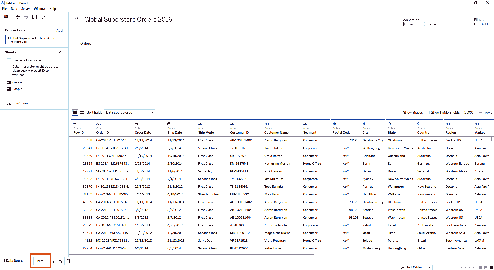

工作表页面包含许多项目（菜单、工具栏、面板、卡片、柜架等）。您可以将工作表视为您将绘制故事或展示您希望呈现的数据视图的画布：

我们将在这里介绍工作表的各个组成部分：

| **部分** | **描述** |
| --- | --- |
| A | **工作簿菜单**：这包含工作簿名称、主菜单和 Tableau 工作簿的选项。 |
| B | **数据源页面**：点击此图标可进入数据源页面。 |
| C | **数据和数据分析面板**：这包含数据源的字段以及操作和组织选项。 |
| D | **卡片**：将字段从数据面板拖到卡片上，以编辑和格式化可视化。 |
| E | **柜架**：将字段从数据面板拖到柜架上，以将数据添加到您的视图中。 |
| F | **工具栏**：这提供了工作表的面板和数据分析选项。 |
| G | **视图**：这是您创建可视化的画布。 |
| H | **工作表**：这些是创建附加工作表、仪表板和故事的标签。 |
| I | **状态栏**：显示视图中的字段摘要。 |

现在你已经熟悉了工作表的主要项目，我们将更深入地探讨每个单独的组件。我们将从查看工作簿菜单开始。

# 工作簿菜单

工作簿菜单包含与工作簿相关的选项。点击工作表按钮后，将显示选项面板。您可以使用此菜单创建新的工作表、格式化工作表以及其他选项。工作簿的名称显示在菜单上方（例如`('Book2')`）：

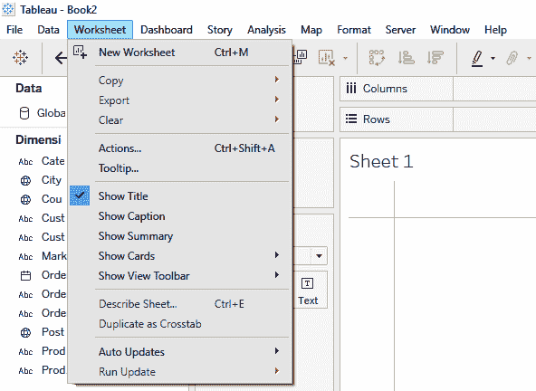

灰色的选项不可用。当您在工作表上处理数据时，当满足条件后，选项将变为可用。例如，清除按钮变灰是因为工作表为空。一旦数据出现在视图中，清除选项将变为可用。

# 工具栏

在工作表上处理数据时，您可以执行常用的操作。我们将介绍位于工作簿菜单下方的工作表工具栏的各个组件。您可以通过点击**窗口** > **显示工具栏**来显示或隐藏工具栏：

| **按钮** | **描述** |
| --- | --- |
|  | **表格**au 图标：点击此图标可进入数据源页面。 |
|  | **撤销**：此操作将撤销最后执行的操作。在同一个会话中，您可以无限次地撤销操作。操作不会在会话之间保存。 |
|  | **重做**：此操作将重做最后执行的操作。在同一个会话中，您可以无限次地重做操作。操作不会在会话之间保存。 |
|  | **保存**：此操作将工作簿保存（默认使用`.twb`扩展名）。 |
|  | **新建数据源**：点击此图标可进入连接面板页面。 |
|  | **暂停自动更新**：当您对工作表中的数据进行更改时，当前视图可能会发生变化。工作表刷新的速度取决于许多因素，其中之一是与它连接的数据的大小。当处理大型数据集时，暂停视图直到所有更改都已完成通常是有益的。这可以提高性能，因为您不需要在每次操作后等待视图刷新。点击暂停自动更新图标右侧的下箭头，可以自定义视图刷新的方式。 |
|  | **运行更新**：如果您已启用暂停自动更新，则可以使用运行更新按钮手动刷新视图。 |
| 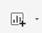 | **新建工作表**：此操作将创建一个新的工作表。点击下箭头可以选择创建新的工作表、仪表板或故事。 |
|  | **复制工作表**：创建当前工作表的副本。 |
|  | **清除工作表**：清除当前工作表。点击清除工作表图标右侧的下箭头，可以自定义清除视图的方式。 |
|  | **交换行和列**：此功能用于在列和行架中交换字段。 |
|  | **按字段升序排序**：此功能按所选字段升序排序数据。 |
|  | **按字段降序排序**：此功能按所选字段降序排序数据。 |
|  | **高亮操作**：此功能用于启用/禁用当前工作表的突出显示功能。启用突出显示后，您可以选择一个字段作为突出显示器。向下箭头将显示可用于突出显示操作的可用字段列表。当字段用作突出显示器时，它将告诉可视化哪些标记需要突出显示。 |
|  | **分组成员**：使用此功能快速分组字段的成员。您必须选择多个字段标题才能使此选项可用。 |
|  | **显示标记标签**：此功能用于启用/禁用可视化中的标记标签。 |
|  | **固定轴**：当从数据面板添加连续字段到架时，在可视化中生成一个轴。使用此按钮选择锁定或动态轴。 |

| 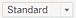 | **固定大小**：选择如何调整视图的大小。从以下选项中选择：

+   **标准**：视图会根据窗口的大小自动调整大小。

+   **适应宽度**：视图的宽度包括窗口的整个宽度。

+   **适应高度**：视图的高度包括窗口的整个高度。

+   **整个视图**：视图设置为窗口的整个大小。

|

| 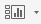 | **显示/隐藏卡片**：选择要在工作表上显示的卡片。单击显示/隐藏图标右侧的向下箭头以自定义卡片选项。 |
| --- | --- |
|  | **演示模式**：此功能激活全屏视图。 |
|  | **与他人共享工作簿**：点击以将当前工作簿发布到 Tableau Server。 |
|  | **显示我**：在此处选择您将创建的视觉类型。 |

在 Tableau 中通常有几种执行相同操作的方法，利用工具栏可以节省时间。理解这些常见操作是开发可视化的重要部分。花时间玩一下工具栏上的按钮。记住，您始终可以使用撤销按钮来撤销更改。

# 探索数据和分析面板

数据和分析面板是两个不同的面板。数据面板是您将处理数据源中的字段的地方。分析面板是您将应用各种分析工具和技术到您视图中的数据的地方。分析面板中的选项在您在数据面板中处理数据之前将不可用（灰色显示）。

# 数据面板

数据面板显示您数据源中所有可用的字段。连接到数据源后，字段被分类为两种角色之一——维度或度量。维度在设置在架子上时表示为蓝色药丸，而度量是绿色的。数据面板中图标的颜色也对应于角色。

在数据源页面（数据网格）中的字段操作选项在右键单击字段后也可用。以下截图显示了数据面板及其可用字段：

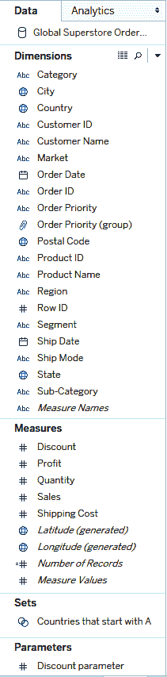

您可以使用数据面板中的选项创建额外的字段类型，我们将在以下章节中描述。

# 数据面板字段

在设置数据源页面后，Tableau 将导入的数据分类为类型。共有六种数据类型：

| **数据图标** | **数据类型** | **描述** |
| --- | --- | --- |
|  | 布尔 | 值为两个值之一（例如，`true` 或 `false`） |
|  | 日期 | 日期值（例如，`2009-01-20`） |
|  | 日期和时间 | 日期和时间值（例如，`2009-01-20 12:00:00`） |
|  | 地理 | 地理值，例如国家或邮政编码（例如，`USA` 或 `74104`） |
|  | 数字 | 数字值（例如，`4`） |
|  | 文本 | 字符串值（例如，`Washington`） |

您可以随时更改字段的 数据类型。Tableau 在导入阶段会分配数据类型。您可以使用数据源页面或数据面板手动编辑数据类型。

这六种数据类型属于两种数据角色之一：

+   **维度（蓝色字段）**：这些字段是布尔型、日期、日期和时间、地理和文本值数据类型（即定性数据）。维度是您分析中显示的详细程度。

+   **度量（绿色字段）**：这些字段是数字数据类型（即定量数据）。度量是数字。它们也可以根据您定义的条件进行汇总和聚合。默认情况下，Tableau 会汇总度量。

以下示例展示了使用一个维度（国家）和一个度量（利润）的可视化。注意维度字段在列架上为蓝色，而度量字段在行架上为绿色。蓝色药丸是离散的，而绿色药丸是连续的：

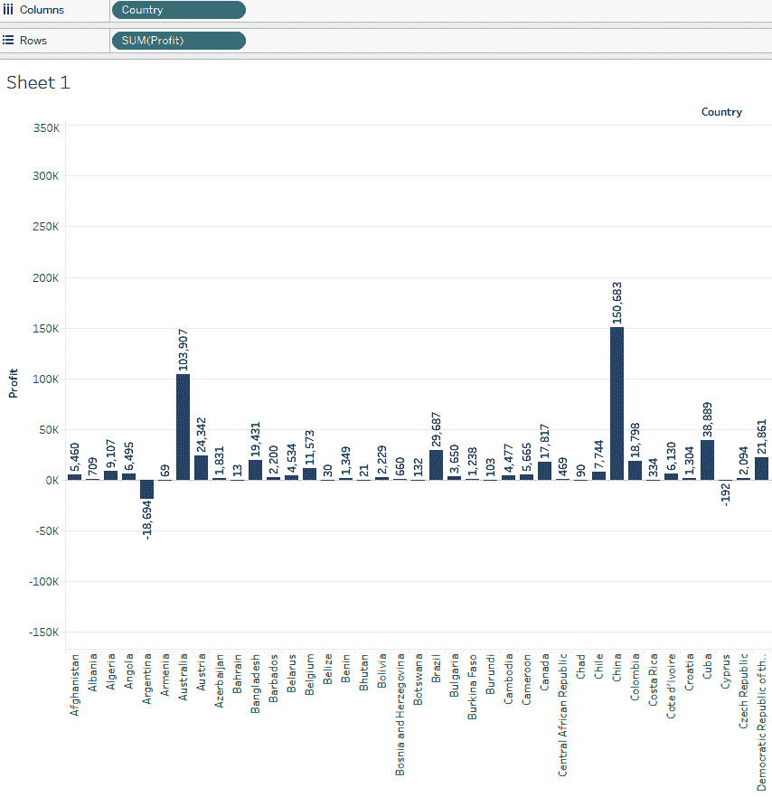

维度和度量也可以是连续或离散类型。再次使用字段的颜色来帮助你识别这两个类别。你可以通过右键单击字段并在菜单中选择离散或连续来更改字段的类型：

了解连续和离散字段之间的区别是一项重要的技能。你应该花些时间研究这些区别。以下部分提供了一个总结。

# 连续数据

连续数据可以是范围内的任何数字（范围可以是无限的）。数字的可能性是无限的。例如，身高是连续的。根据吉尼斯世界记录验证的最矮的人身高为 21 ½英寸。最高的人身高为 99 英寸（8'3"）。将 21 ½英寸视为数轴的开始，将 99 英寸视为数轴的结束。一个正常人的身高可以取数轴上的任何值：

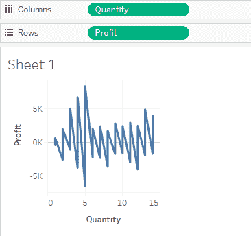

# 离散数据

离散数据是可数的且是不同的——它只能取某些值。例如，你拥有的父母数量是离散的——你不能有一半的父母。在以下示例中，数量被定义为（1，2，3,...，14）：

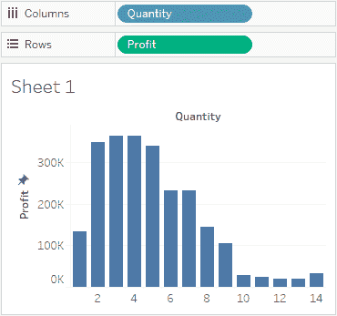

在前面的部分中，我们讨论了数据在数据面板中可用时的不同数据类型和角色。在以下部分中，我们将讨论如何通过创建集合来根据字段值对数据进行分组。

# 集合

集合可以是静态的或动态的（基于底层数据变化）。集合是通过数据面板中的字段或可视化中的标记定义的（非动态）。你可以将集合视为数据的分组或过滤结果。创建集合的一种方法是在数据面板中的字段上右键单击，然后选择**创建** - **集合**选项。在下面的屏幕截图中，我们将基于**国家**字段中的值创建一个集合：

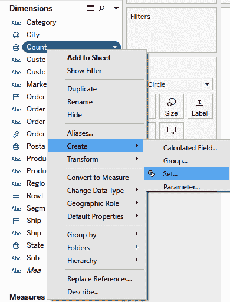

将出现编辑集合菜单。通过单击每个值旁边的复选框选择您所需集合的所有字段值。在以下示例中，所有以字母*A*开头的国家都被选中。这个集合的名称是`以 A 开头的国家`。创建的集合显示在度量部分下面的数据面板中：

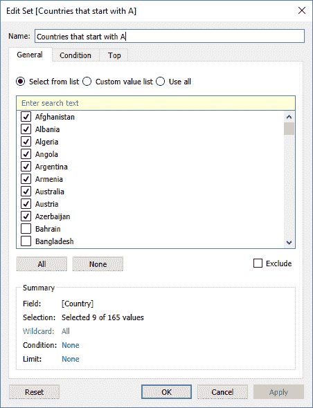

下一个部分将解释如何使用户能够编辑用于过滤和计算中的值。

# 参数

参数是用户可以更改的动态值。这些值用于计算，以便结果取决于用户的输入。参数是一个极其强大的工具，允许在计算中动态设置值。要创建参数，可以点击数据面板中的向下箭头，或者在数据面板的任何位置右键单击并从菜单中选择创建参数。以下屏幕截图说明了此过程：

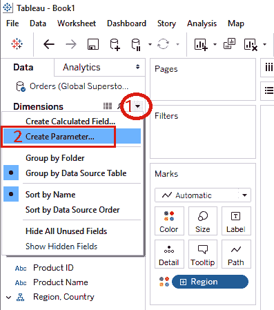

编辑参数菜单需要一些信息。在此示例中，我们将参数命名为 `Multiplier`。数据类型是整数，这意味着它将只接受用户输入的整数。当前值是默认值（设置为 `1`），显示格式是值的格式。允许的值部分说明用户是否可以从预定义值列表（列表）中选择任何值（全部），或在一个预定义的值范围内选择（范围）。以下屏幕截图显示了编辑参数菜单：

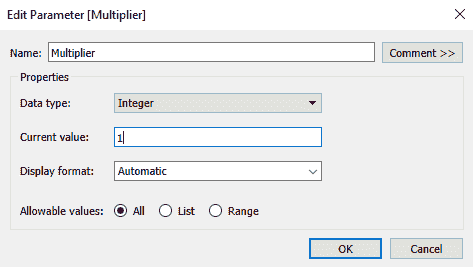

在以下屏幕截图中，使用 `Multiplier` 参数创建了一个计算字段。该计算字段命名为 `p. Profit * Multiplier`。`p.` 前缀将作为视觉提示，让我们知道该字段使用了一个参数。此计算的結果将是 `Profit` 乘以 `Multiplier` 参数（用户选择的整数）：

使用 `p.` 前缀是作者偏好的最佳实践，以便更容易识别字段。在创建字段时，请随意遵循自己的命名偏好。

以下可视化展示了 Marks 卡片中的两个度量（绿色区域）：SUM(Profit) 和 SUM(p.Profit * Multiplier)。利润的值为 1,426,457。p.Profit * Multiplier 的值为 2,934,915。这是利润翻倍，因为 `Multiplier` 被设置为 2（参见 `Multiplier` 参数控制中的值）。如果设置为 3，则利润会乘以 3，依此类推：

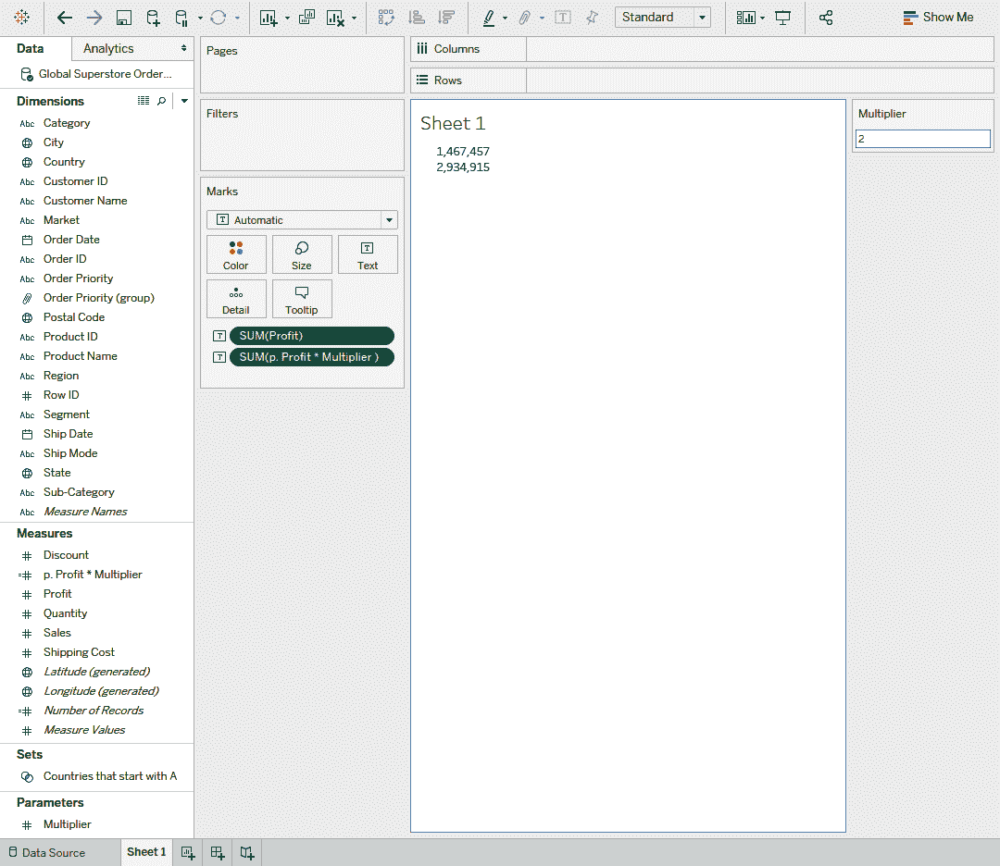

我们将在下一节中更详细地解释计算字段。

# 计算字段

在前面的示例中，我们创建了一个计算字段——一个原始数据源中不存在的字段。要创建计算字段，可以点击数据面板中的向下箭头，或者在数据面板的任何位置右键单击并从菜单中选择创建计算字段。如果我们想计算利润率，我们可以使用计算字段。利润率是利润总和除以销售总和，请参考以下屏幕截图进行计算：

Tableau 提供了一个带有示例的计算字段参考指南（位于计算编辑器右侧）。

计算字段与其他字段一样被处理。根据计算字段的结果是定量还是定性，它们被分类为维度或度量。创建用于分析的字段的能力非常强大，并且是您会反复使用的功能。计算字段有许多用途。它们易于使用，并在您开始分析数据时帮助解决许多问题。我们将在后面的章节中了解更多关于计算字段的信息（参见第五章，*理解 Tableau 中的简单计算*，以及第六章，*Tableau 表计算*)。

在接下来的几节中，我们将描述如何保持您的数据面板井然有序。

# 层次结构

层次结构有助于在数据面板中组织数据。它们还使用户在可视化中钻取时更加方便。在以下示例中，我们正在创建一个地理层次结构。首先，右键单击国家字段并选择层次结构：

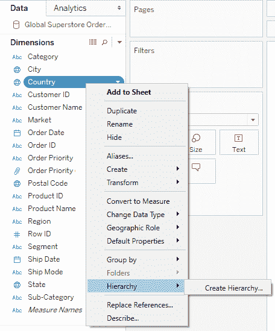

一旦国家位于地理层次结构文件夹下，就将有三个额外的字段被拖放到地理层次结构文件夹下——州、城市和邮政编码。以下截图显示，当国家放置在行架上时，会出现一个+/展开图标。当用户点击此图标时，层次结构中的下一个项目将填充（州），依此类推。层次结构应该直观易懂：

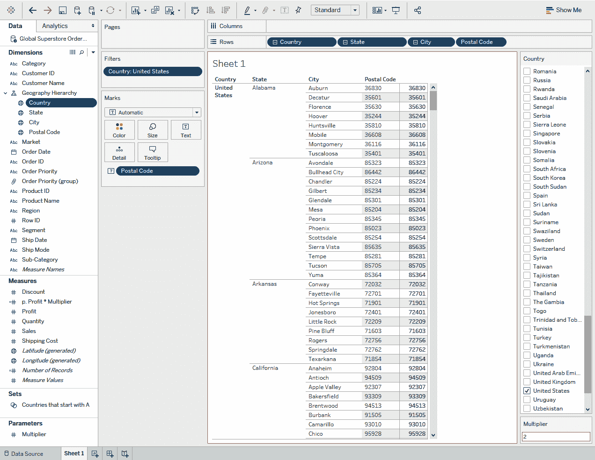

只有维度可以添加到层次结构中。要将度量添加到层次结构中，必须首先将其转换为维度。

您应该使用层次结构来创建更有序和高效的可视化。在下一节中，我们将讨论另一种在数据面板中组织数据的方法。

# 数据字段分组

当在数据面板中处理字段时，有一些方法可以帮助您保持有序。其中之一是将类似的字段放在文件夹中。要创建文件夹，右键单击数据字段并选择创建文件夹按钮。一旦创建了一个文件夹，就可以将字段拖放到文件夹下，就像我们对层次结构所做的那样：

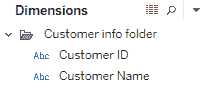

默认的组织方法是将字段按数据源表分组。

# 替换引用

之前，我们创建了一个计算字段，该字段将利润乘以`Multiplier`参数。如果我们想用另一个字段替换利润，我们可以手动完成。然而，如果需要在许多计算中替换相同的字段，这会变得很麻烦。Tableau 提供了一个解决方案。右键单击要替换的字段并选择替换引用：

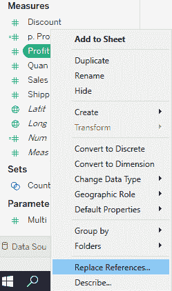

将出现一个菜单，您可以选择用哪个字段替换旧字段。在以下示例中，我们希望将所有**利润**的引用替换为**折扣**：

点击确定后，计算字段将使用替换的参考值更新。

如果您想了解特定字段的更多详细信息，请在数据面板中右键单击该字段并选择描述字段按钮。将出现类似于以下窗口：

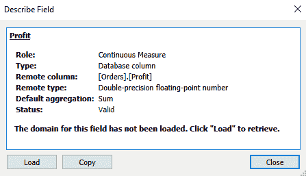

我们已经讨论了数据面板中可用的许多功能和选项。在下一节中，我们将突出显示 Tableau 分析面板中的一些工具和功能。

# 分析面板

要访问分析面板，请单击左侧侧边栏顶部的选项卡。分析面板允许用户总结并将各种分析技术应用于视图。可以通过从分析面板拖放到视图中来添加分析对象。如果分析面板中的对象变灰，这意味着根据当前视图中的数据类型，该对象不可用。在以下示例中，**平均线**对象（在摘要部分下）被引入到视图中：

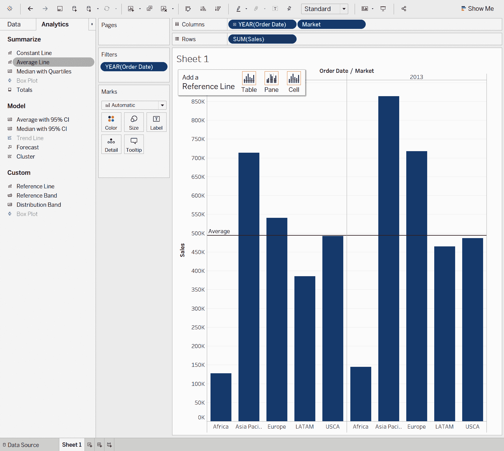

根据您希望使用的分析对象，有多种选项可供选择。对于普通行对象，可以选择设置平均值的范围——表级别、面板级别和单元格级别。分析对象辅助菜单（例如，**添加参考线**）应有助于您根据需求做出正确的选择。您可以将多个分析对象添加到一个视图中。要删除对象，右键单击视图中的项目并选择删除。

# 分析对象

分析对象位于**分析**面板中。对象分为三个类别——**摘要**、**模型**和**自定义**：

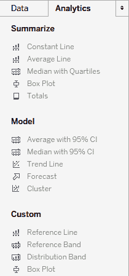

在以下各节中提供了每个对象的简要描述。

# 摘要

摘要部分允许您将计算应用于可视化中的数据。以下摘要计算可用：

+   **常量线**：一条由用户设置的值的线。

+   **平均线**：一条值为指定度量或度量的平均值的线。

+   **中位数与四分位数线**：一条值为指定度量或度量的中位数，并带有分布带的线。

+   **箱线图**：向视图中添加箱线图。

+   **总计**：为字段中的值添加总计（子总计、列总计或行总计）。

# 模型

模型部分允许您将统计模型应用于可视化中的数据。以下模型可用：

+   **平均带 95%置信区间**：这是值为指定度量或度量的平均值，并带有分布带的线。带设置为 95%置信区间。

+   **中位数带 95%置信区间**：这是值为指定度量或度量的中位数，并带有分布带的线。带设置为 95%置信区间。

+   **趋势线**：这是使用所选的趋势类型（线性、对数、指数和多项式）配置的线。

+   **预测**：这是使用所选的预测模型类型（自动、自动带季节性或自定义）配置的预测。Tableau 预测基于指数平滑技术。指数平滑是一种赋予最近观察结果更多权重的技术。

+   **聚类**：这根据用户选择的聚类数量应用聚类分析。

# 自定义

除了前几节中提供的汇总和模型对象之外，Tableau 还提供自定义对象：

+   **参考线**：这是其值为指定字段常数或计算值的线。

+   **参考带**：这是一个阴影带，其值是两个常数或指定字段的计算值之间的距离。

+   **分布带**：这是一个阴影带，其值是指定字段值的分布。

+   **箱线图**：这将在视图中添加一个箱线图。

在一个可视化中，您可以使用的分析对象数量没有限制。在下一节中，我们将讨论书架和卡片。书架是您放置字段以构建可视化的地方。卡片允许您添加细节并自定义可视化。

# 书架和卡片

字段放置的位置将影响可视化的布局。随着您更多地使用此工具，您将更好地理解如何最佳地构建可视化。您应该始终花时间尝试多种方法。

您可以通过拖放将字段添加到书架和卡片。您还可以在数据面板中双击字段，Tableau 将尝试使用最佳实践显示数据；然而，这并不总是产生期望的结果。

# 书架 - 列和行

将字段放置在列或行书架上将在视图中创建标题。重要的是要记住，可视化是通过标记构建的，这些标记只是数据源中的记录。您可以将多个字段添加到列和行书架。在以下示例中，市场和地区是按销售显示的行（条形图）：

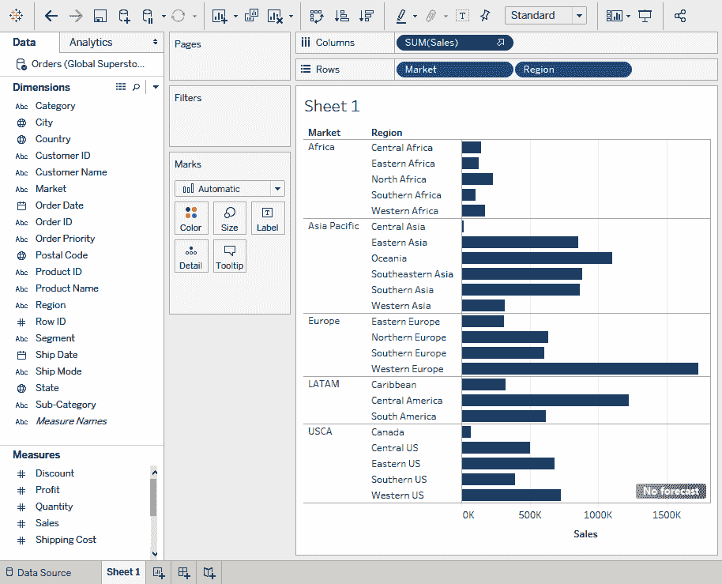

在行和列书架上的药丸上右键单击以查看其他字段选项。

当字段放置在书架上时，Tableau 将尝试选择最佳图表类型。在前面的示例中，选择了条形图来显示市场和地区的销售。要更改图表类型，请使用应用右上角的“Show Me”图表指南。

# “Show Me”图表指南

在以下示例中，两个字段（市场和销售）在数据面板中被突出显示。Show Me 图表指南表明，您可以使用这些字段创建 10 种可能的图表类型（请参阅着色的图表）。水平条形图类型以橙色边框显示，表示这是基于最佳实践的 Tableau 推荐图表类型：

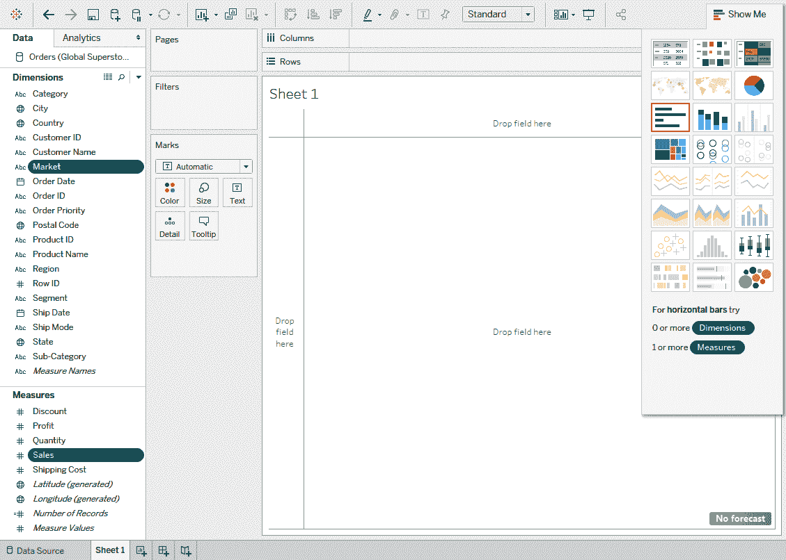

Tableau 的推荐图表类型通过分析特定字段来工作。然后，它根据数据的属性生成最有效的可视化类型的推荐。

知道使用哪种类型的图表是您在创建可视化时将做出的最重要的决定之一。有关此主题的更多信息，我们建议搜索有关如何为您的数据选择最佳图表类型的指南。

# 标记卡

标记卡是您将使用详细信息完善可视化的地方。在以下示例中，市场字段已添加到颜色标记，而销售总额已添加到标签标记。将这两个字段添加到标记卡中，按市场着色条形，并在条形右侧显示销售总额作为标签：

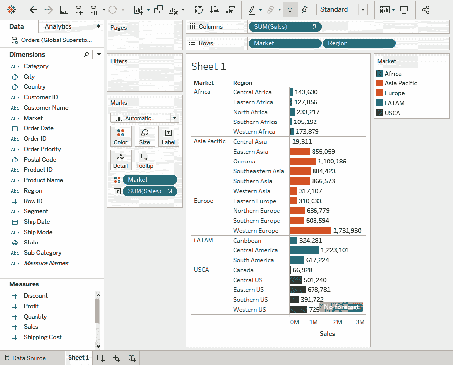

标记卡有七个组成部分：

+   **形状**：标记下拉菜单会更改视图中的可视化：

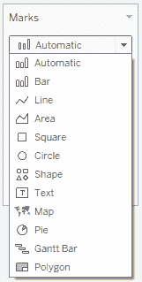

+   **颜色**：将字段拖放到颜色标记上，以更改可视化中标记的颜色。

+   **大小**：将字段拖放到大小标记上，以更改可视化中标记的大小。

+   **标签**：将字段拖放到标签标记上，在可视化中显示文本标签。

+   **细节**：选择可视化中显示的数据的粒度级别。

+   **工具提示**：当您将鼠标悬停在标记上时，会显示一个信息菜单，即工具提示。它们在传达关于标记的额外信息方面非常有用。

+   **形状**：这会改变可视化中标记的形状。

虽然这些组件可能看起来微不足道，但它们对于可视化整体的外观和感觉至关重要。良好的设计应该是直观的。学习如何使用这些组件将帮助您的用户有效地消化信息。与知道为您的数据选择哪种图表类型一样，选择标记也是一种科学。

了解如何正确使用颜色、大小和形状将提高您可视化的质量。适当的标记使用使用户更容易理解和使用仪表板。我们建议您阅读有关仪表板设计原则的更多信息，以充分利用 Tableau 的标记选项。如果您正在寻找书籍推荐，我们强烈建议阅读 Stephen Few 的《信息仪表板设计：一目了然的数据监控》。这是一本学习如何构建有意义的仪表板的优秀指南。

在以下部分，我们将讨论如何使用过滤器添加交互性到可视化中。

# 过滤器面板

将字段拖放到过滤器架上，您可以对视图进行筛选。它还允许您让用户能够在工作表中筛选数据。在以下示例中，我们希望允许用户能够根据市场筛选视图。在将市场字段拖放到过滤器架后，会出现一个过滤器菜单：

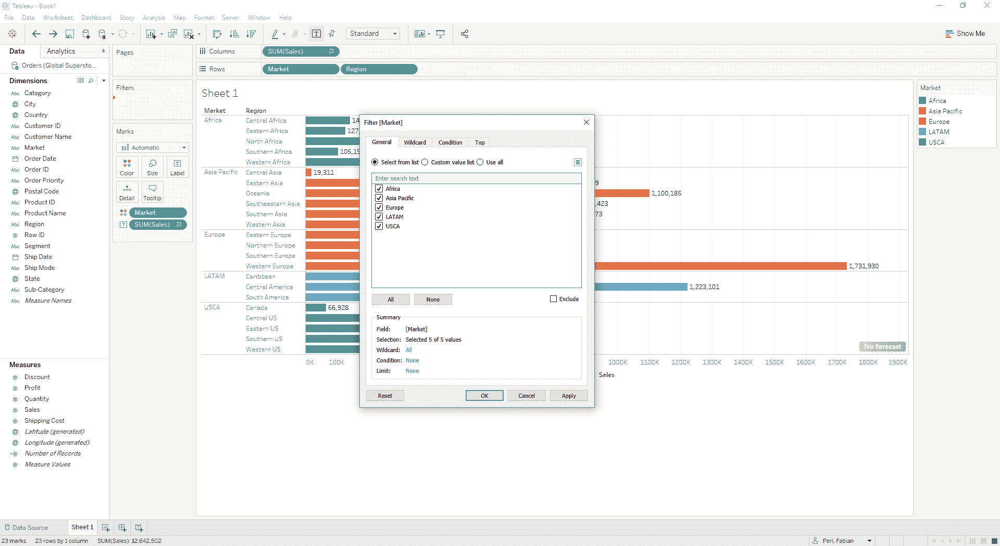

点击**确定**后，在**过滤器**架中的**市场**字段上右键单击，然后点击**显示过滤器**。

您现在可以在屏幕的右侧看到**市场**过滤器。根据以下截图所示，添加或删除字段值旁边的复选标记以筛选视图：

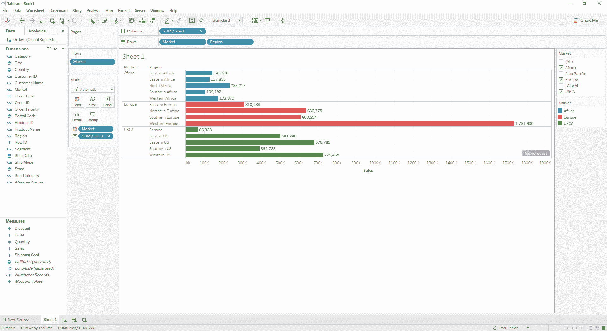

您可以通过点击**市场**过滤器中的向下箭头来编辑过滤器设置：

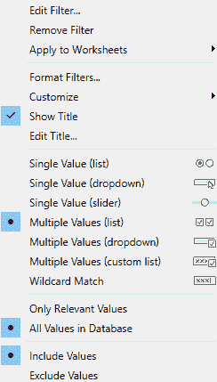

有许多方法可以自定义工作表上的过滤器。尝试不同的设置以发现最适合您分析的方法。

# 页面架

页面架允许您根据字段的特定值创建不同的视图。在页面卡中最常用的字段是日期字段。在将日期字段放入页面卡后，您可以使用菜单查看数据在不同时间点的样子。在以下示例中，订单日期字段被添加到页面架上。订单日期页面菜单显示在屏幕的右侧。您可以向前或向后移动以查看按年汇总的销售总额。您还可以使用页面架中的字段创建动画可视化：

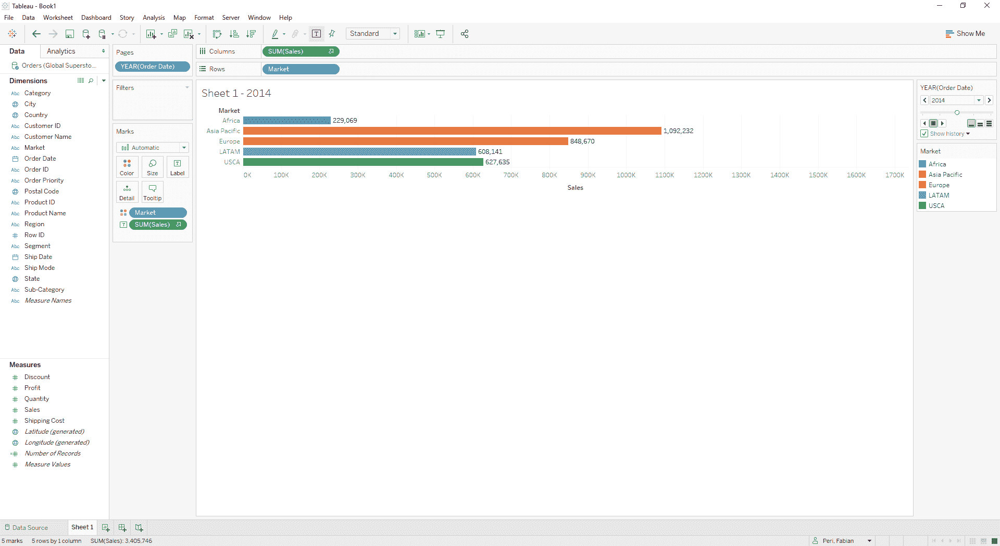

在上一节中，我们学习了如何构建和改进可视化。构建一个好的可视化取决于许多因素。了解工作表页上的功能将帮助您构建易于使用和理解的、对最终用户友好的有效可视化。

# 摘要

在本章中，我们学习了工作表页的组件和功能。您应该熟悉导航工作表页、在数据面板中处理字段、应用分析函数以及创建可视化的操作。正如本章开头所述，工作表是您绘制故事的画布。熟悉工作表将使您能够讲述最佳故事。

在下一章中，我们将学习 Tableau 中可用的各种图表类型。我们还将讨论如何使用过滤器、集合和组以及进行快速分析。最后，我们将讨论格式化如何帮助创建更有效的可视化。
