# 第三章：使用图表分析数据

现在您已经可以连接到数据并理解工作表的各种元素，是时候开始分析数据了。在 Tableau 中，数据分析与可视化是相辅相成的。数据可视化使我们能够快速理解和解释数据中的各种趋势。Tableau 提供了广泛的数据切片和切块选项，以及使用可视化、集合、过滤器、层次结构等以不同格式查看数据。本章将详细介绍这些格式。

本章将涵盖以下主题：

+   Tableau 中的关键图表

+   对你的数据进行排序

+   创建过滤器、集合、分组和层次结构

+   格式化你的视觉元素

# 技术要求

本章使用的是全球超级商店数据集，可以在[`www.tableau.com/sites/default/files/training/global_superstore.zip`](http://www.tableau.com/sites/default/files/training/global_superstore.zip)找到。

# Tableau 中的关键图表

Tableau 提供各种图表，创建起来超级快速且简单。Tableau 中的所有图表都是基于标记创建的，其中标记是您数据集中任何给定维度和度量组合的行。要创建图表，您有两个主要选项：

+   选择您想要绘制的维度和度量，然后点击**显示我**窗口。**显示我**窗口是一个特殊窗口，其中可以找到 Tableau 中的所有默认图表及其详细信息。例如，从维度中选择类别，从度量中选择销售额。使用*Ctrl*键（在 macOS 上为*Command*键）选择多个元素。

以下截图显示了**显示我**窗口：

如您所见，**显示我**窗口目前包含 24 个图表。然而，只有一个被一个红色的方框突出显示，七个其他的是激活的，其余的是灰色的。突出显示的图表是基于您的数据由 Tableau 推荐的图表。灰色显示的图表是无法通过所选字段的组合创建的。要发现生成图表所需的内容，只需将其悬停即可。例如，在这个条形图的例子中，我们可以看到，对于水平条形，我们需要 0 个或更多的维度和 1 个或更多的度量。同样，如果您将鼠标悬停在其他图表上，它将列出它们的要求。一旦您的数据满足要求，您可以选择图表类型，它将显示在屏幕上。

+   将维度和度量直接拖放到工作表的**行**、**列**和**标记**架中。

以下截图显示了物品的组合，使用这些物品可以直接创建图表，而无需使用**显示我**窗口：

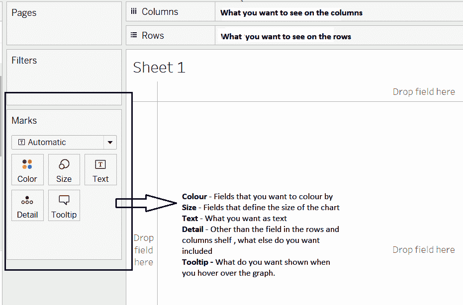

这些选项在增强显示我窗口的标准图表类型以创建更高级的图表时也将非常有用。

使用`Category`和`Sales`，如果您想查看类别及其销售总额作为值列出，可以将`Category`拖到行上，然后将`Sales`拖到标记板上的文本标签上。这将创建如图(a)所示的图，如下所示。同样，如果您从文本板上移除`SUM(Sales)`并将其拖到列板上，您将得到如图(b)所示的水平条形图：

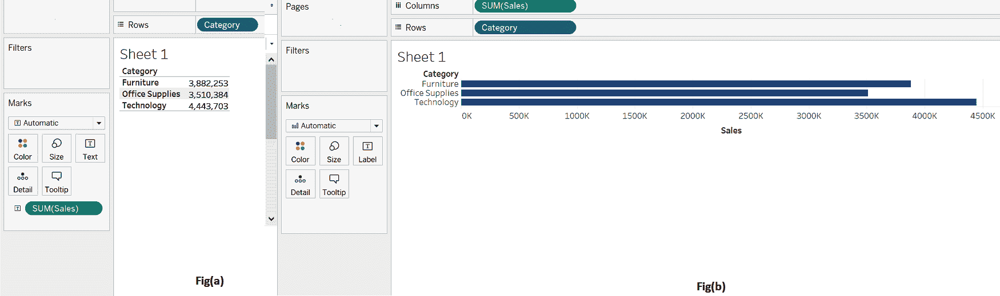

重要的是要注意，无论何时您选择一个度量值将其带入工作表，它都会根据该数据的最佳聚合类型自动聚合。最常见的聚合类型是**总和**和**平均值**。您可以选择更改度量的聚合类型。如果您不想将度量值作为聚合显示，您也可以取消选择聚合度量，并以无聚合的原始数据形式查看。

现在您已经了解了如何创建图表，我们将进入下一部分，其中我们将讨论重要的图表类型及其使用时机。

# 文本表格（交叉表）

文本表格类似于 Excel 网格，即它们在一个网格中包含行、列和值。当数据有限且您想快速查看确切数字，或者需要找到类别之间的交点（相当于 Excel 中的单元格）时，这些表格非常有用。

例如，消费者细分市场中办公用品的总运输成本是多少？

要创建此表格，请按照以下步骤操作：

1.  选择`Segment`、`Category`和`Shipping Cost`，然后从**显示我**窗口中选择文本表格图标（第一个图形）。

1.  或者，将`Segment`和`Category`分别放在列和行上，然后在标记文本板上放置`SUM(Shipping Cost)`，如图下所示：

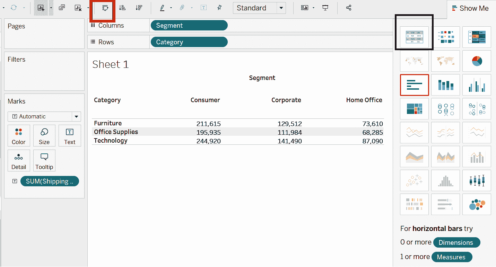

我们可以快速看到，在消费者细分市场中的办公用品的运输成本为 195,935。在这个例子中，我使用了列中的`Segment`和行中的`Category`，但您可以根据需要反转这些设置。

要快速交换任何图形的行和列，您可以点击图中的**交换**按钮，如红色所示，或者直接使用*Ctrl* + *W*快捷键。

# 突出显示表格

突出显示表是前一小节中讨论的文本表（或交叉表）的扩展。通过将字段添加到标记颜色架中，可以获得突出显示表。它们对于快速查看数据趋势非常有用。例如，如果有人问您哪个产品和细分市场的销售额比消费者办公用品多，但利润较少，一种解决方法就是查看所有销售额比消费者办公用品多的细分市场，然后查看这些细分市场的利润，看它们是否比消费者办公用品的利润多或少。另一种查看方法是快速将`SUM(Profit)`拖到标记颜色架上，并将标记类型更改为正方形。这将创建本截图所示的图表：

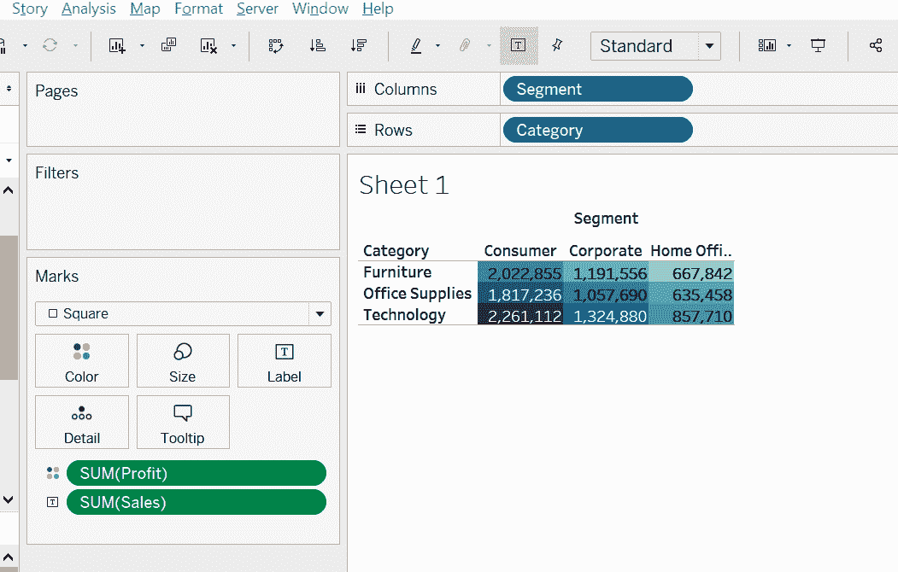

您可以迅速看出，仅从销售额来看，消费者细分市场中的家具和科技产品的销售额超过了办公用品。现在，看看利润的颜色，您会迅速知道家具的颜色比消费者浅，因此其利润较少。

默认情况下，Tableau 中用于“度量”的自动颜色渐变是从最低到最高。此外，默认情况下，任何低于 0 的值都是橙色，而**大于**0 的值是蓝色。

# 地图（符号和填充）

地图是 Tableau 中最重要的视觉元素之一，它能快速有效地帮助可视化任何类型的地理数据。要识别地理字段，请查找字段旁边的地球图标。根据地理字段，Tableau 会生成两个字段，纬度和经度。这些字段用于在地图上精确定位位置。不需要使用自动生成的纬度和经度字段；您也可以上传自己的地理编码，我们将在第四章可视化地理数据中更详细地介绍。

目前，我们的重点是**“显示我”**菜单中可用的两种地图类型：符号地图和填充地图。符号地图可以显示多达两个度量值，而填充地图只能显示一个。符号地图适用于显示非常细粒度的数据或需要在图表上表示多个度量值时。另一方面，填充地图对于显示单个度量值非常有效。它们也适用于低级别数据，例如城市或邮编级别的数据。

例如，要查看每个国家按“细分”划分的“销售额”分布，您将使用符号图表，如下面的截图所示：

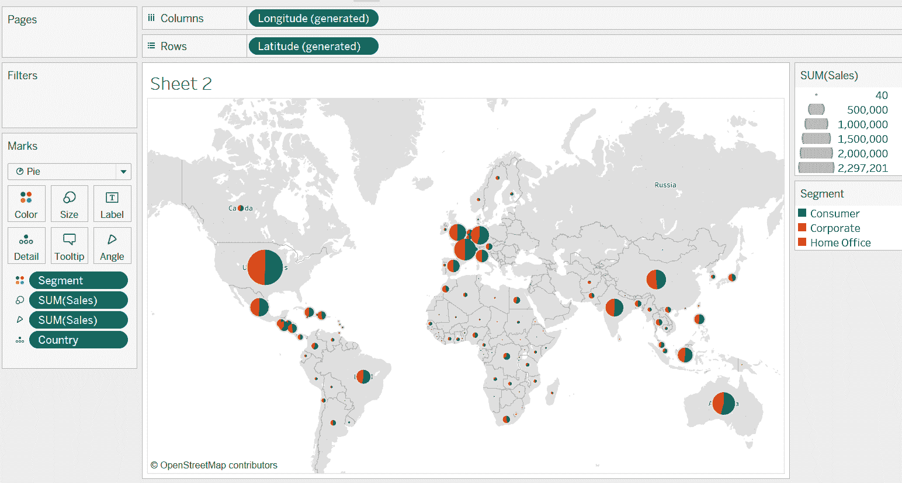

另一方面，要查看美国西海岸哪个州销售额最高，您可以使用填充地图，如下面的截图所示：

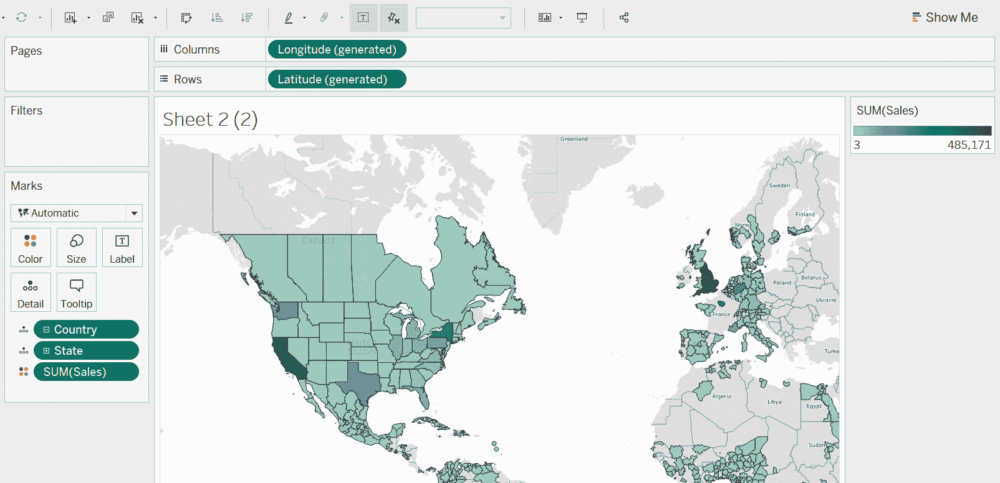

仅仅一眼地图，我们就可以看出加利福尼亚州在西部海岸的销售额最高。

# 柱状图

柱状图是制作跨类别数据快速比较的最简单工具之一。柱状图在线性尺度上比较数据，并快速使数据点在不同维度上的比较变得容易。Tableau 在“显示我”菜单中提供了三种类型的柱状图变体：

+   水平柱状图

+   堆积柱状图

+   并排柱状图

简单柱状图是在询问最大或最小值、哪些维度的值位于前五名或后五名等问题时使用的最佳图表类型。由于这些值都显示在线性尺度上，它们也适用于数据的快速近似。例如，哪个产品的销售额大约是销售额第二高的产品的一半？

阅读前面的问题，它看起来有点复杂，但可以使用“产品名称”和`SUM(Sales)`的柱状图快速解决。一旦图表根据销售额的降序值排序，我们得到以下柱状图：

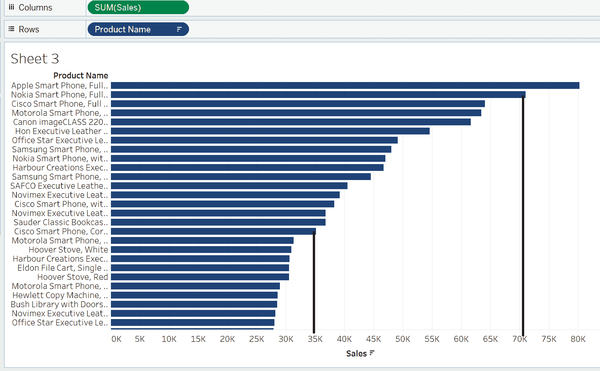

快速浏览图表显示，第二高的产品是诺基亚智能手机，销售额约为 70k。其中一半是 35k，再次快速浏览图表显示，所涉及的产品是思科智能手机。由于在此示例中使用的销售额值不是精确的，这为我们节省了计算时间，使我们能够快速得出结果。

你想要比较的维度的复杂性越高，你就可以越深入地嵌套你的柱状图以轻松获取结果。以下示例比较了类别、细分市场和市场的值：

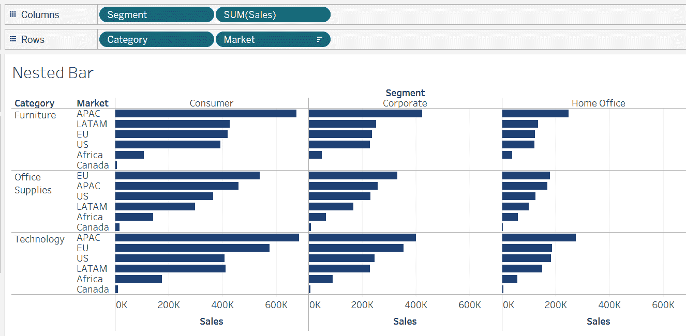

迅速出现一种模式，与消费者细分市场相比，在地区和类别中，消费者细分市场的销售额最高，而与企业和家庭办公室相比。我们还可以快速看到，虽然亚太地区在家庭办公室细分市场的技术类别中领先，但欧洲在家庭办公室细分市场的办公用品类别中是领导者。加拿大在所有细分市场和类别中的销售额最低。

柱状图是对比同一值与多个维度比较的最佳工具。

现在，让我们从简单的柱状图转到堆积柱状图。后者有助于理解比例。以下截图展示了使用堆积柱状图查看使用不同运输方式和细分市场的发货量的比例的示例：

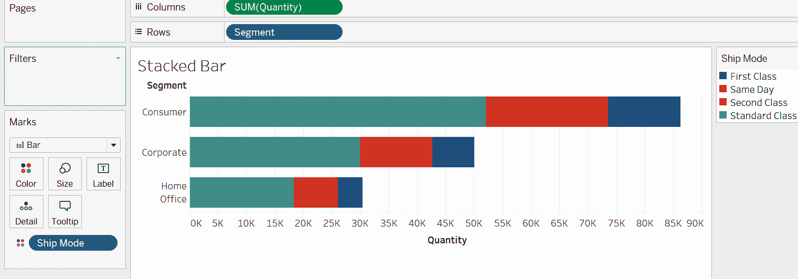

消费者类别在标准类运输方式下发货量占比最高。

如果要比较的维度太多，不要使用堆积柱状图，因为它可能会变得非常混乱。相反，使用并排柱或嵌套柱。

并列条形图提供另一种比较度量的方法。与堆叠条形图的主要区别在于，并列条形图中的轴保持不变。例如，如果我们将前面的堆叠条形图更改为并列条形图，我们得到以下结果：

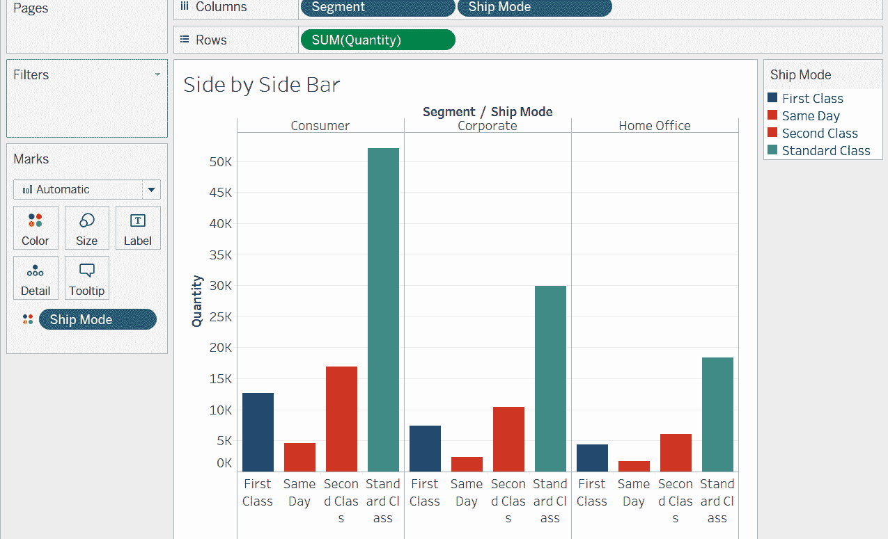

这是以不同格式呈现的相同信息。如果您想进行比较并需要绝对值比较，并列图是您要使用的。然而，如果您更感兴趣的是比较时的比例以及它们的变化，堆叠图则是您应该选择的。

堆叠条形图也通常用于表示总人口的比例。

例如，要查看按区域分布的销售百分比，您需要执行以下操作：

1.  使用 `Region`、`SUM(Sales)` 和 `Ship Mode` 创建一个简单的堆叠图表。

1.  右键点击 `Sum(Sales)`。选择快速表格计算 | 总计百分比。

1.  您会注意到图表上没有变化。这是因为表格计算没有作为“表”进行计算。要更改此设置，再次右键点击 `Sum(Sales)`。选择计算方式 | 表向下。

这应该会给出以下图表：

# 热图和树状图

热图和树状图在寻找高度粒化和详细数据中的模式时非常有用。热图通过大小和颜色的组合来显示趋势。例如，在销售数量最高的区域中，哪个子类别的利润最低？为了回答这个问题，我们创建了一个类似于以下屏幕截图的热图：

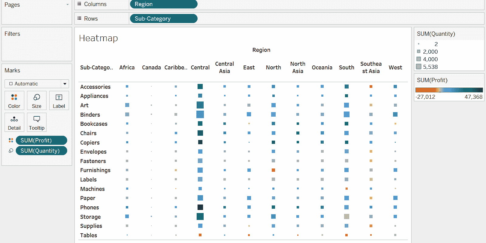

使用热图，我们可以快速根据方块的大小看到，中部地区销售数量最高，而其中的表格子类别利润最低。

树状图是另一种有用的图表类型，用于观察广泛趋势。它们允许您显示多达四个度量。例如，在以下屏幕截图所示的示例中，我们可以查看区域和市场的 `SUM(Profit)`（颜色）、`SUM(Quantity)`（大小）和 `SUM(Discount)`（文本值）：

我们可以一眼看出，中欧地区拥有最高的利润和销售额，总折扣为 531.8。另一方面，尽管销售额相当高，亚太地区东南亚的利润却相当低。该市场对所有市场的折扣值也最高，为 851.3。

# 圆形图、并列圆图和散点图

到目前为止，我们讨论的所有图表都用于分析聚合度量。然而，下一类图表在分析原始或未聚合的度量时更有益，尽管这不是它们使用的先决条件。这些图表对于检测数据中的异常值或查看两个度量之间的关系非常有用。异常值检测有助于理解异常值对统计度量（如总和和平均值）的影响程度。异常值检测在检测欺诈或错误方面也非常强大。例如，哪三位客户负责最高的个人销售？

为了查看这个，我们创建了一个销售和客户名称的圆形图。一旦我们创建了圆形图，你就会发现列板仍然显示`SUM(Sales)`在度量中。要移除它，你必须转到**分析菜单**并取消选择**聚合度量**。

完成这些后，你会看到一个如下所示的图形：

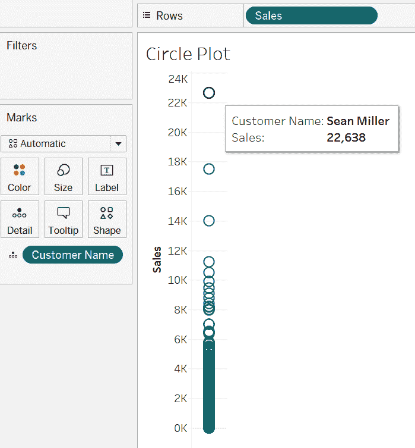

将鼠标悬停在三个候选人的圆圈上，我们发现 Sean Miller、Tamara Chand 和 Raymond Buch 拥有最高的个人销售值。考虑到 Sean Miller 的销售值是多么的异常，这也可能是数据中的潜在错误。

侧边圆形视图类似于侧边条形图，在查看未聚合数据时更有用，尽管它们也可以用于聚合数据。例如，为了找出一个物品在不同地区的价格方面的优先级如何变化，我们可以使用如下截图所示的侧边圆形图：

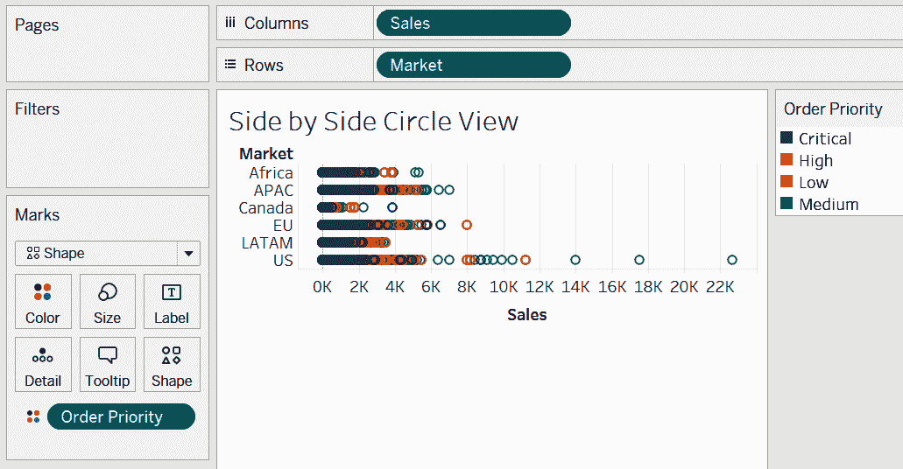

在前面的屏幕截图中，我们可以看到，在所有市场普遍情况下，低值销售比高值销售具有更高的优先级。

散点图有助于理解度量之间的相互关系。例如，运输成本和不同产品类别销售之间的关系是什么？查看以下截图，很容易看出家具的运输成本和销售价值的变化比技术的变化要小。对于类似的销售值，技术类别的最高和最低运输成本是显而易见的：

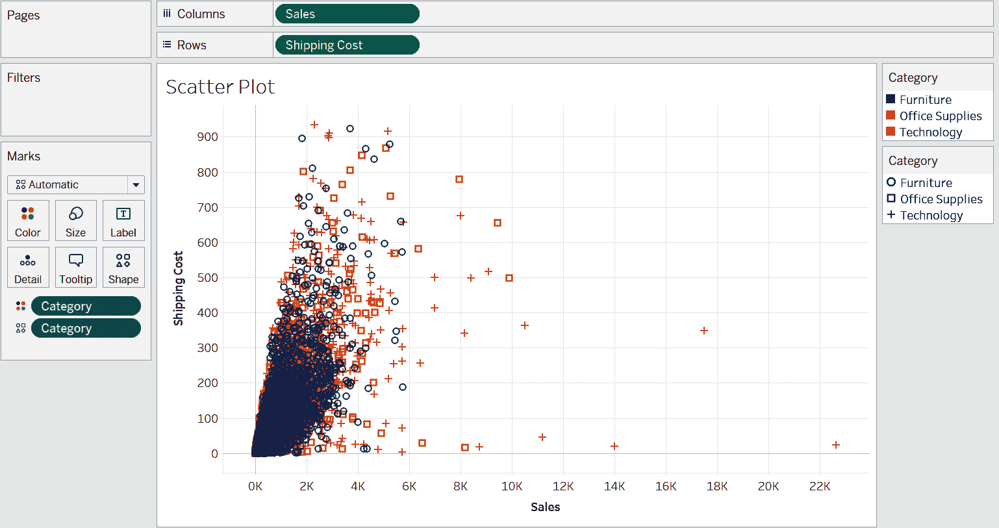

# 线形图

折线图是展示与时间相关的数据的最佳方式。它们将不同的数据点连接起来，以连续的方式展示，并且可以显示时间作为离散或连续实体。离散时间序列对于比较一次维度在另一个维度上的比较很有用，例如，找出哪两个季度在所有四年中的销售差异最小。快速查看离散折线图图表就能告诉我们答案是第二季度和第三季度。另一方面，连续折线图对于理解时间跨度的整体趋势很有用。例如，在下面的图表中，我们可以快速看到，无论季节变化如何，销售在四年中总体上有所增加：

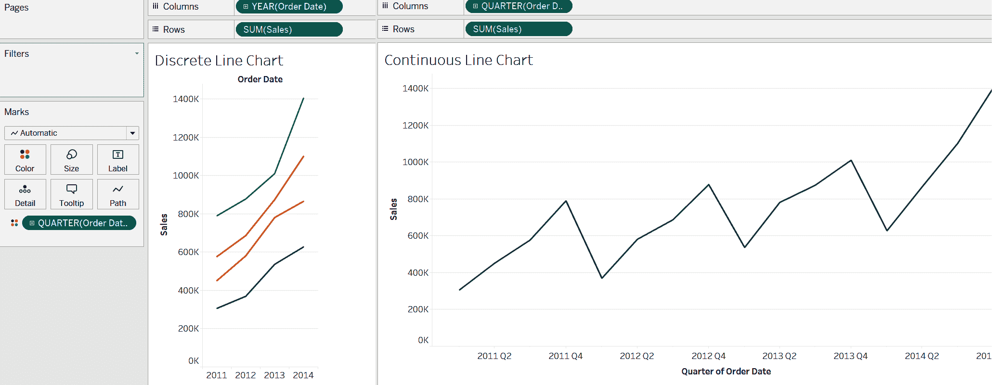

如果您右键单击日期，可以更改日期显示的详细程度。日期菜单将日期分为两个日期部分。第一组默认提供离散日期部分，第二组提供连续日期值，如下面的截图所示：

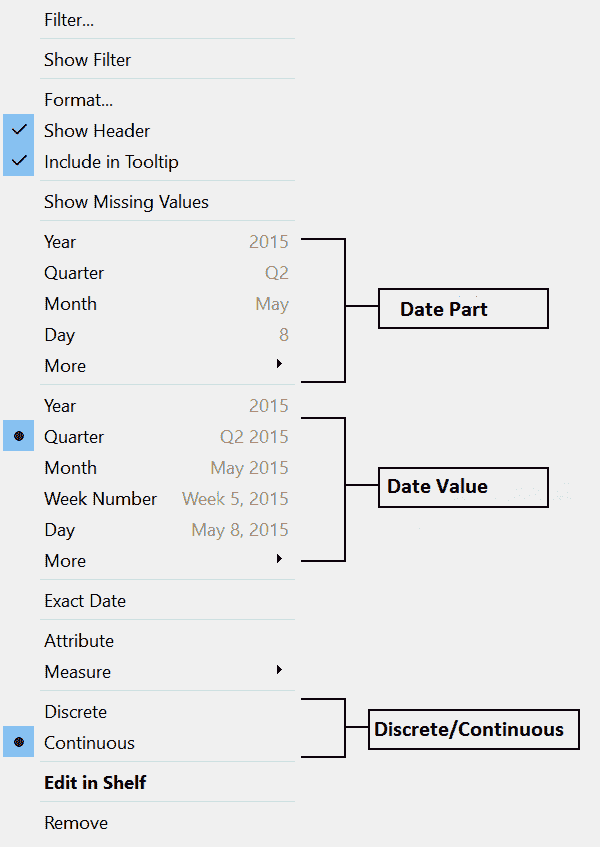

**日期部分**值表示日期的各个部分，例如，如果日期是 2018 年 12 月 10 日，那么各种日期部分如下：

+   日期：10

+   月份：十二月

+   年份：2018

前面的例子中的离散折线图使用了年和季度日期部分。

相反，日期值是截断到您所选级别的日期。例如，如果您有 2018 年 12 月 10 日的日期，不同级别的日期值如下：

+   日期：2018 年 12 月 10 日

+   月份：2018 年十二月

+   年份：2018

前面的连续折线图使用了季度日期值，这将截断日期到季度级别。

尽管默认情况下日期部分是离散的，日期值是连续的，但我们可以使用离散和连续选项来改变这一点。关键区别在于，离散值将显示标题，而连续值在显示可视化时将显示坐标轴。

# 直方图

直方图用于查看连续数据的分布情况，将其分为区间或区间。它们用于确定一个度量是否为左偏斜、右偏斜或正态分布，并且在描述人口年龄分布或特定人群中财富分布等人口统计时被广泛使用。

直方图的工作方式是将整个数据集划分为区间（数据范围）。例如，如果我们想了解数量分布情况，我们会得到以下结果：

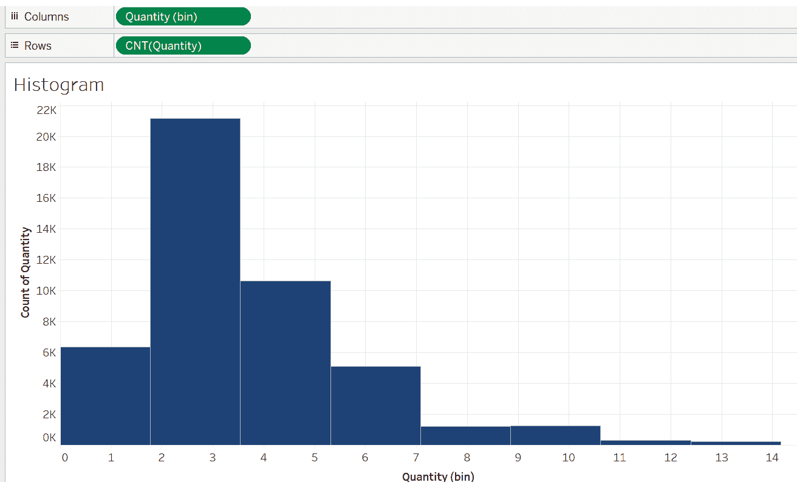

2 或 3 的计数似乎是最常见的销售数量，而像 12 和 13 这样的大数则很少见。您还可以在分布中注意到，数据的平均值（3.66）位于中位数（3.18）的右侧。这种分布被称为右偏分布。这种分布的相反是左偏分布。如果左右两侧平衡，则称为正态分布。

每次创建直方图时，您都会注意到在维度面板中会出现一个新的维度，称为`Quantity (Bin)`。您可以通过在数据面板中右键单击它并选择**编辑**来编辑此 bin，如图所示：

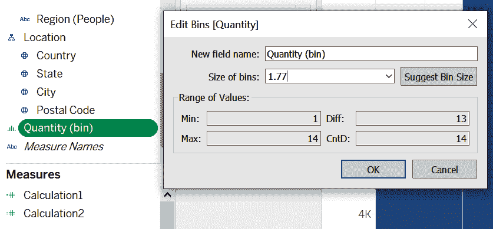

在这里，您可以设置**bins 的大小**、**要包含的值范围**、名称等。

如果任何问题询问数据的偏斜或左/右尾分布，那么您需要使用直方图。

# 箱线和须线图（箱线图）

当圆图表对于检测连续测量的异常值很有用时，箱线和须线图（通常简称为箱线图）对于理解连续测量的统计分布很有用，这涉及到中位数和四分位距。箱线和须线图由五个关键组成部分组成：中位数、上四分位数点、下四分位数点、上须线和下须线。中位数是数据的中点或 50^(th) 百分位数。上四分位数点和下四分位数点分别显示第一和第三四分位数。须线从四分位数点延伸到 1.5 倍的**四分位距**（**IQR**），其中 IQR 是上四分位数和下四分位数的差。我们还可以将须线限制更改为延伸到图表中的最小值和最大值。

例如，APAC 中数量的四分位距是多少？

为了回答，我们使用市场和数量创建箱线和须线图。像圆图和散点图一样，您需要转到分析并取消选择聚合度量。我们得到以下图表：

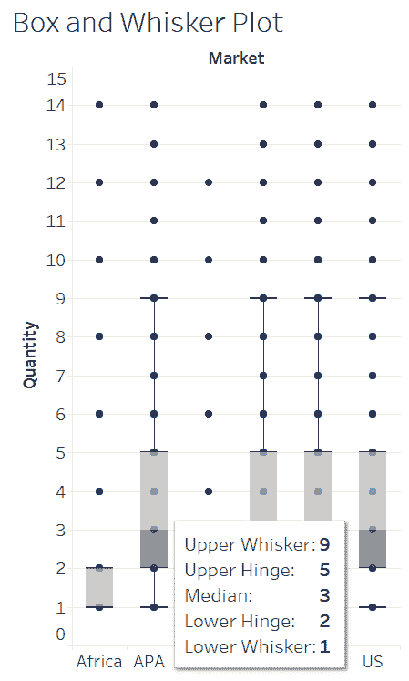

对于 APAC，我们可以看到下四分位数点是 2，上四分位数点是 5，所以*IQR = 5-2 = 3*。

上四分位数范围可以延伸到上四分位数点 1.5 倍，因此*5+ (1.5*3) = 9.5*。在数据集中低于这个值的最近的数据点是 9，因此上四分位数得到值 9。同样，下四分位数可以延伸到下四分位数点 1.5 倍，所以*2-1.5*3 = -2.5*。数据集中最接近这个值的最低数据点是 1。因此，下四分位数在 1。

记住，*四分位距 (IQR) = 上四分位数点 - 下四分位数点*。

下须线和上须线延伸到 1.5 倍的四分位距。

# 甘特图

甘特图是一种流行的项目管理工具，用于跟踪活动之间的时间。图表由垂直轴上的任务或事件和水平轴上的时间间隔组成。甘特图的一个流行用途是了解项目管理计划和各种事件之间的依赖关系。另一个常见用途是了解事件之间的时间差异。

例如，一种流行的方法是查看不同运输方式以及任何其他维度（如`订单类别/子类别/市场`）的平均订单到发货时间。我们将以市场为例。要创建甘特图，我们需要对`订单到发货时间`进行计算。我们可以创建一个如下（分析 | 创建计算字段）：

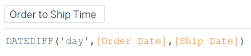

现在，要创建甘特图，我们按以下方式设置图表：

+   **列**：`订单日期(订单日期)`

+   **行**：`市场`和`运输方式`

+   **标记颜色**：`运输方式（可选）`

+   **大小**：`Avg(订单到发货时间)`

我们将其转换为平均值，因为这更有助于理解平均订单到发货时间：

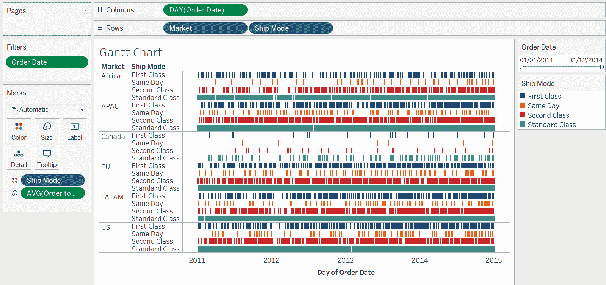

我们可以快速查看不同运输方式的时间。如果我们对较小的范围进行筛选，甘特图将更加有效。

# 组合图表

组合图表允许我们在同一视觉中查看值的组合，例如，使用折线图显示销售额总和，使用柱状图显示利润。一个著名的组合图表示例是帕累托图。

组合图表允许我们在同一轴或使用两个不同的独立轴上比较数据。创建组合图至少需要两个度量。要创建组合图，选择`利润`、`销售额`和`订单日期`，从**Show Me**菜单中选择**双重组合**。默认情况下，图表将在`订单日期(年)`级别创建。右键单击它，并将其更改为季度级别。您将获得以下图形，其中您将看到`SUM(利润)`以柱状图显示，`SUM(销售额)`以折线图显示：

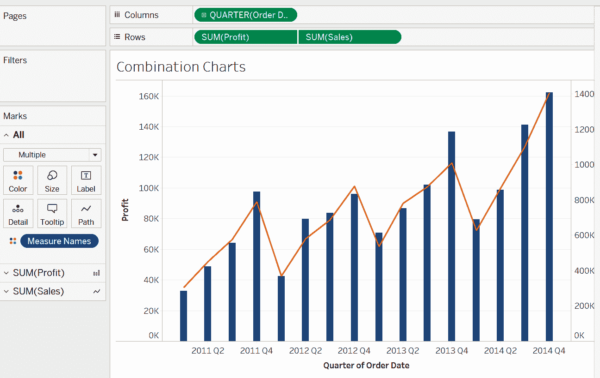

从图中，如果您不仔细关注轴，看起来`SUM(利润)`和`SUM(销售额)`的刻度是相同的。然而，我们可以从轴上看出，**20K**的利润对应于**200K**的销售价值。

要同步轴，右键单击轴之一并选择**同步轴**。这将改变图形，如下面的截图所示：

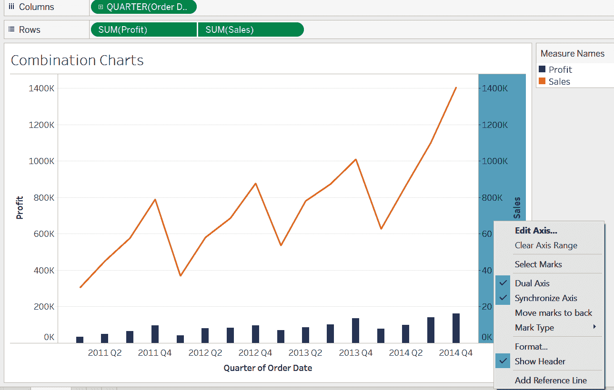

现在我们已经了解了**“Show Me”**菜单中可用的各种图表类型，以及如何创建它们以及它们在何时最有用，让我们来看看一些关键的属性，这些属性可以用来增强这些视觉效果。

# 排序您的数据

排序数据可以使模式快速可见。Tableau 允许我们进行简单的升序和降序排序、手动排序、嵌套排序以及基于某些计算的排序。我们可以对图表上显示的字段进行排序，也可以对任何其他字段进行排序。要排序数据，我们可以使用以下截图所示的任何快速排序图标：

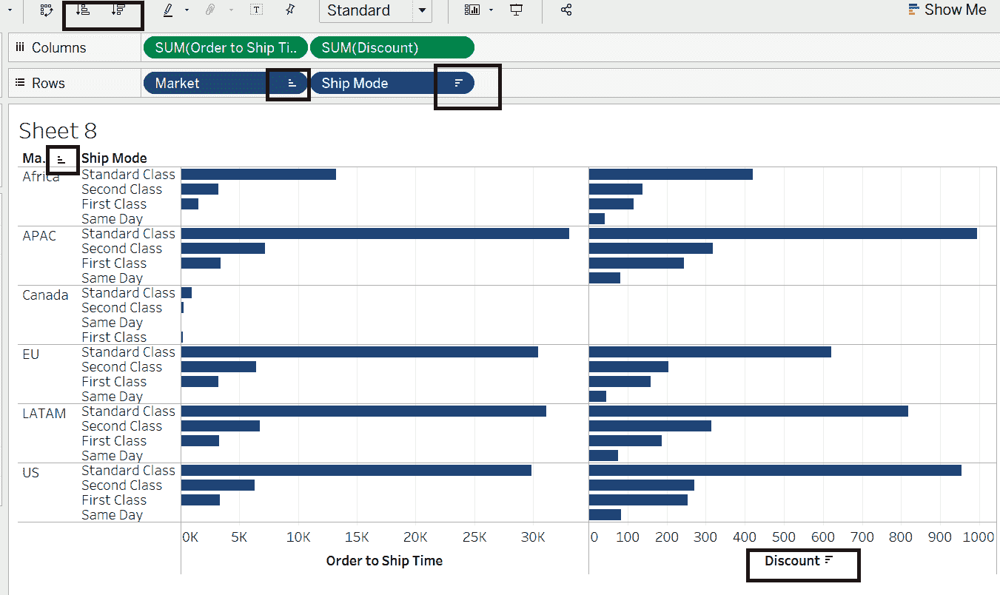

要查看每个维度的排序，请右键单击每个维度药丸。一旦点击它，您将看到按多个类别排序的选项；在这里，您可以从数据源顺序、字母顺序、手动排序、字段或嵌套中进行选择。例如，在上面的例子中，`Market`是使用数据源顺序：升序排序的，而`Ship Mode`是基于`SUM(Discount)`字段的嵌套排序。您可以选择任何字段和聚合，它们不必一定在图表中使用。另一种排序方法是手动将字段拖动到图中。

对于堆叠图表，可以通过移动图例来排序堆叠。在以下示例中，由于美国在颜色图例的底部，它在图表中显示为底部类别。将美国移到颜色图例的顶部也改变了它在图表中的位置：

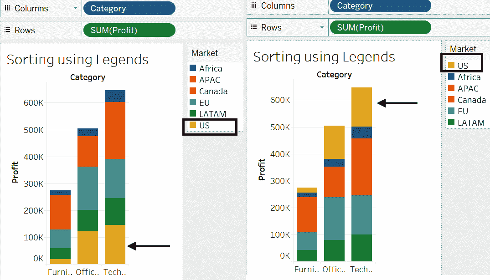

现在您已经可以创建各种图表并了解如何排序数据，让我们看看其他哪些功能可以用来增强您的数据和视觉元素。

# 创建过滤器、集合、组和层次结构

除了排序数据外，Tableau 还提供了许多其他方法来增强视觉元素。过滤器、集合、组和层次结构是一些重要的方法。我们将在此部分详细探讨每个方法，从过滤器开始。

# 过滤器

**过滤**是数据分析的重要组成部分。Tableau 允许我们使用维度或度量进行过滤。Tableau 中的过滤遵循以下操作顺序：

1.  提取过滤器

1.  数据源过滤器

1.  上下文过滤器

1.  维度过滤器

1.  度量过滤器

要将过滤器应用于任何视觉元素，请将字段拖动到过滤器面板，或在图中选择要包含/排除的内容。例如，要查找标准运输模式的`Market`下的`Profit`，请将`Ship Mode`拖动到过滤器面板。一旦将其拖到面板上，系统会询问您如何过滤数据。这种模式因维度和度量而异。对于维度，有通用、通配符、条件和顶部等选项：

+   **通用**：允许我们从列表中包含/排除，使用自定义列表或使用所有值

+   **通配符**：用于模式匹配

+   **条件**：基于其他字段或自定义计算进行过滤

+   **顶部**：创建顶部/底部字段的子集并使用这些字段进行过滤

过滤器从左到右的选项卡进行评估，因此通用选项卡过滤器首先评估，顶部选项卡最后评估。

**常规**过滤器选项卡是最常用的，在这个例子中，我们将简单地从**常规**选项卡中选择**标准类别**，如以下截图所示，然后点击**确定**：

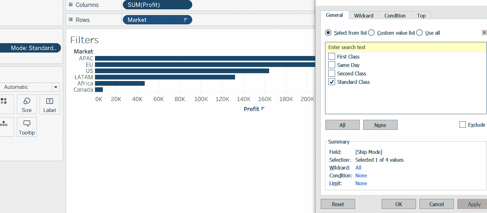

一旦点击确定，过滤器就会显示在屏幕上，并成为快速过滤器以便于访问。如果默认情况下没有显示在屏幕上，那么请右键单击**维度**并选择**显示过滤器**选项。

快速过滤器有许多选项，可以通过点击过滤器右上角的选项按钮访问，如下面的截图所示。探索各种选项以满足您的需求：

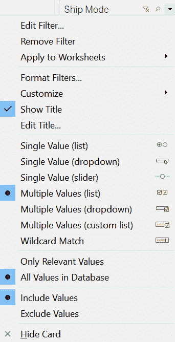

另一种为任何视觉数据过滤数据的方法是选择您想在视觉中看到的数据，然后在出现的选项框中选择仅保留或排除，如下面的截图所示：

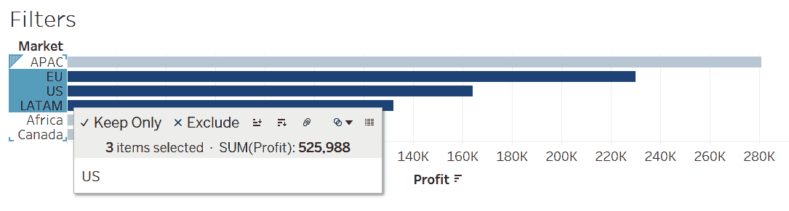

# 集合

集合是用于定义数据子集的自定义字段。定义的子集可以是动态的或静态的，并且可以用来创建不同的视觉元素。我们还可以组合多个集合。集合的优势在于可以在所有工作表中重复使用，并且它们也会添加到数据集的元数据中。

**动态集合**：这些是基于某些条件而形成的集合，随着数据的变化可能会导致不同的结果。**Top n**或**Bottom n**集合是这种集合的常见用例。例如，总销售额中有多少百分比来自前 10 个国家？

为了解决这个问题，我们首先将创建一个销售前 10 个国家的集合。右键单击“国家”，选择创建，然后选择集合。然后在创建 | 集合下，将集合重命名为`Top 10`，并转到顶部选项卡。在顶部选项卡中，我们将定义集合的条件。选择按字段，并将字段更改为销售。聚合自动更改为求和。点击**确定**。请参考以下截图以获取步骤：

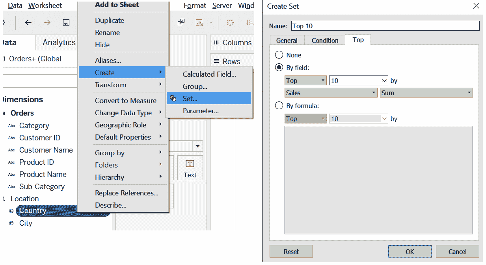

您会注意到，在“集合”类别下，已创建了一个新集合：

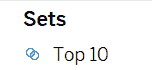

一旦将此内容放置在书架上，它将显示两个值：输入/输出——输入包括集合内所有成员的值，输出则是集合外的所有数字。要查看前 10 个国家的销售额百分比，我们现在将`SUM(Sales)`添加到图表中，并通过右键单击`SUM(Sales)`| **创建表计算** | **总百分比**来创建一个快速表计算。你应该得到以下结果：

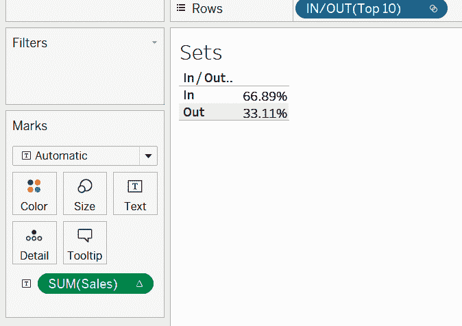

这显示了 66.89%的总销售额来自仅前 10 个国家。而不是以**输入/输出**的形式查看值，要查看实际的集合成员，请右键单击集合并选择显示集合成员。

**静态集合**：这些集合具有固定的成员。例如，在前面的例子中，如果我们不是使用条件来设置前 10 个国家，而是在常规选项卡中选择美国和英国，它就会变成一个静态集合：

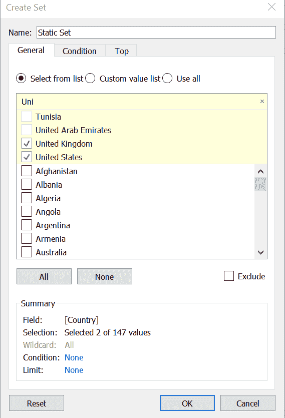

另一种创建此类集合的方法是从视觉直接进行。选择您想要分组的值，然后选择创建 | 集合。一旦选择此选项，它将为您提供额外的选项来排除这些值或将它们添加到过滤器架中，等等。这种用法的一个例子是识别数据中的异常值，然后使用集合将它们从其他视觉中排除：

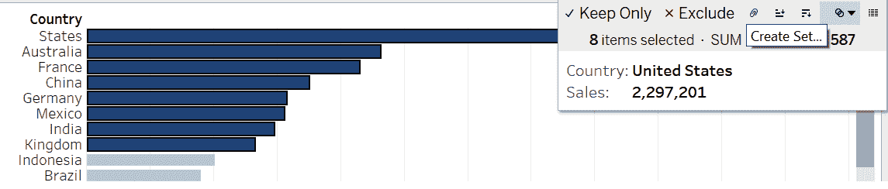

# 分组

分组对于在常见标签下对数据进行分类非常有用。分组只是为现有数据添加了另一层标签/标题，并且只能与维度一起使用。分组的例子包括正确分类数据，例如，将纽约和纽约都归类在纽约的通用标题下，或者根据经理的领土创建区域分组。

创建分组与创建集合类似。您可以直接从视觉中创建一个分组，通过选择图表然后点击分组图标：

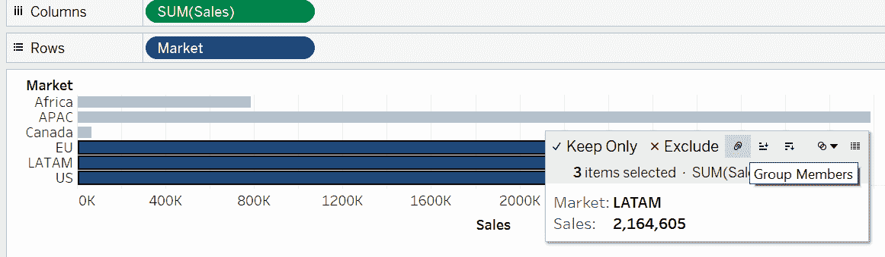

一旦您分组了项目，您将在维度架中看到`市场（分组）`出现。右键点击并选择**编辑分组**。您将看到以下菜单：

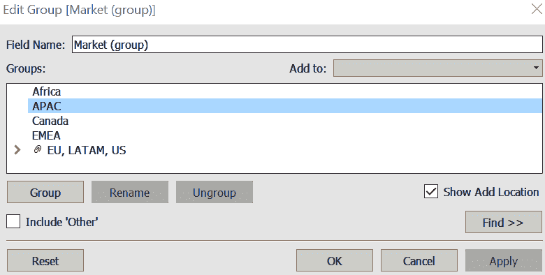

在这里，您可以一起分组其他成员，取消分组当前成员，以及重命名组，还可以选择包含一个**其他**组。作为一个例子，让我们通过选择**非洲**和**EMEA**，点击**分组**，并将其命名为`EMEA++`来合并它们。同时，检查**包含'其他'**按钮并点击**确定**。现在，在`市场(group)`之后将`市场`拖到行架上。您将看到这里显示的图表：

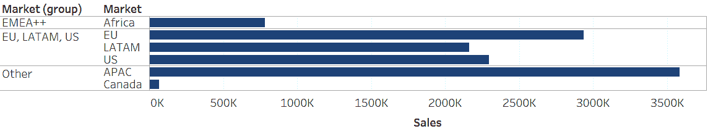

如您所见，各种`市场`类型已经根据我们在`市场(group)`中选择的标签分组在一起。

另一种进行分组的方法是选择我们想要分组的维度元素，右键点击并选择**创建** | **分组**。这将打开您在之前点击**编辑分组**时看到的相同菜单。

# 层次结构

层次结构提供了一种很好的方法来可视化高层次的复杂数据，并在需要时深入到更详细的层次。常见的层次结构例子包括日期层次结构（`年`、`季度`、`月`和`日`），位置层次结构（`国家`、`州`和`城市`），或者`产品类别`和`产品子类别`层次结构。要创建一个层次结构，请点击您想要添加到层次结构中的维度，例如，`类别`和`子类别`，然后右键点击**层次结构**并选择**创建层次结构**。要向现有的**层次结构**中添加内容，请选择**添加到层次结构**：

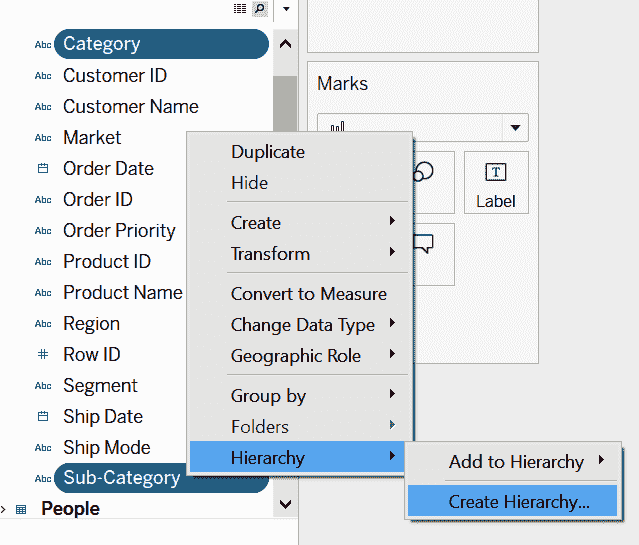

一旦创建了层次结构，它就可以轻松地在图表中使用。通过使用层次结构，我们消除了使用多个视觉来表示相同数据的需要。而不是为`类别`和`子类别`级别的销售数据分别创建单独的图表，层次结构允许我们在同一张表上切换两种视图。+ 图标用于展开层次结构，而- 图标用于收缩它。以下示例显示了创建的层次结构是如何展开的：

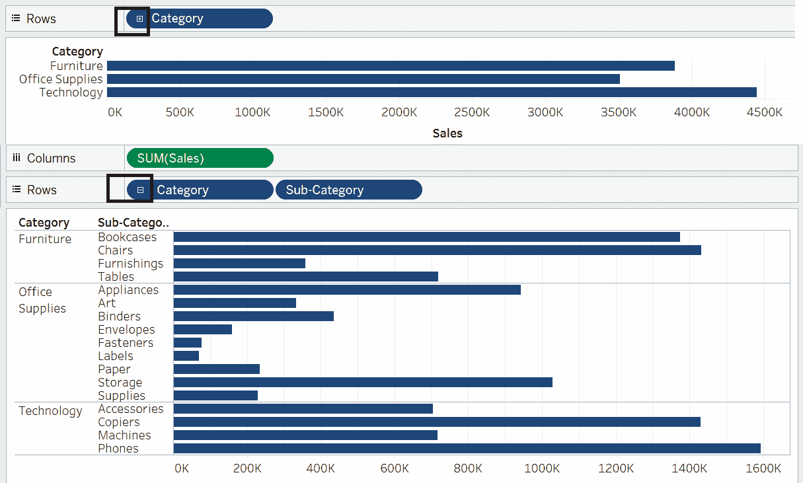

现在我们已经熟悉了使用分组、集合和层次结构等功能增强视觉的各种方式，让我们将注意力转向我们快速应用以增强视觉的更多视觉格式。

# 格式化您的视觉

在 Tableau 中，无论是在工作表级别还是在单个图表级别，都提供了各种视觉格式化选项。

在工作表级别，可以显示三个重要的卡片：

+   **标题**：显示工作表的标题。

+   **字幕**：对工作表显示内容的描述，包括应用的所有筛选器细节。

+   **摘要**：提供视觉的描述性统计的快速摘要，例如总和、平均值和中位数。

您可以选择显示这些中的任何一个，通过从菜单栏中选择工作表，然后选择显示标题/字幕/摘要。

在视觉级别，您可以显示/编辑以下内容：

+   **标签**：显示在视觉点文本中的值。

+   **注释**：带有数据突出显示点、标记或标签的注释——这些可以包含您想要显示的内容。

+   **坐标轴**：坐标轴的标签名称、显示的值范围、正常或对数坐标轴——要查看坐标轴的选项，请选择并右键单击坐标轴，然后选择编辑坐标轴。

以下截图显示了标签和坐标轴：

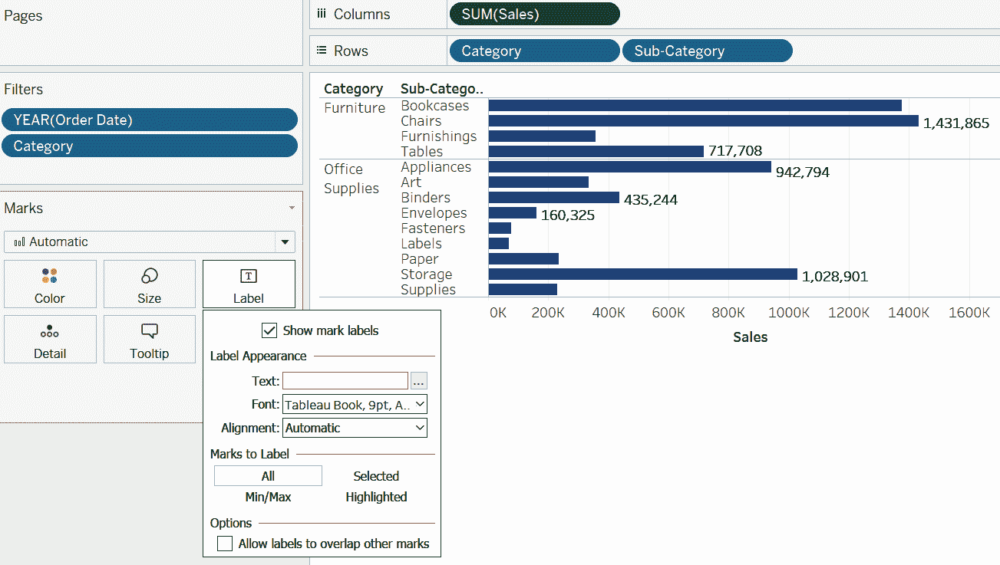

以下截图显示了注释（点和区域）：

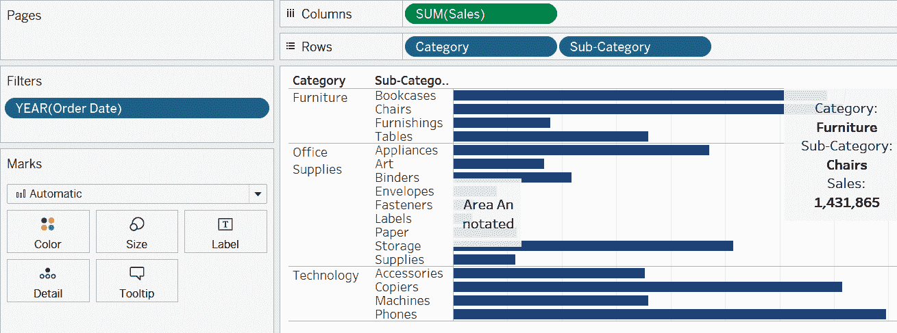

要添加任何这些，我们只需在视觉上右键单击并查看可用的选项。

# 摘要

在本章中，我们学习了在 Tableau 中可以创建的最常见的图表类型以及何时使用哪种图表。本章还详细介绍了如何使用筛选器、集合、分组等来增强视觉并快速分析。正如本章开头提到的，Tableau 是一个视觉工具，这些理解的基本元素将大大节省时间，并有助于在考试中更快地进行分析，以及在未来创建有效且有意义的分析。

在下一章中，我们将更深入地探讨地图视觉，并了解 Tableau 中映射功能的相关内容。
