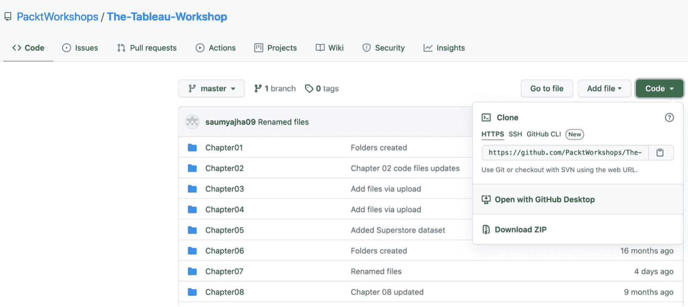
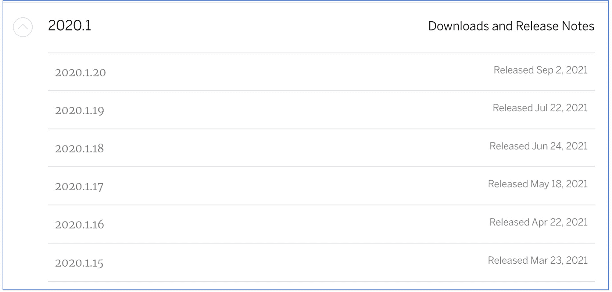
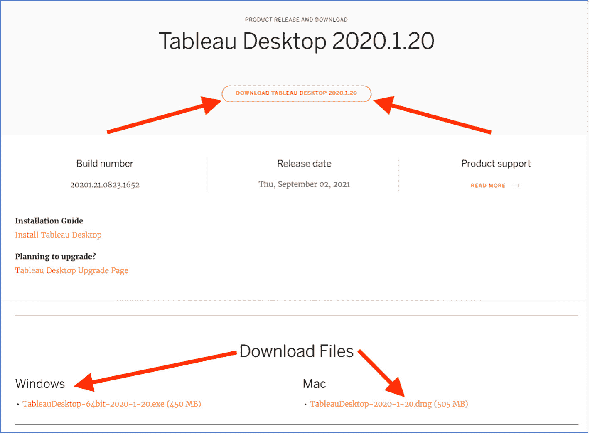
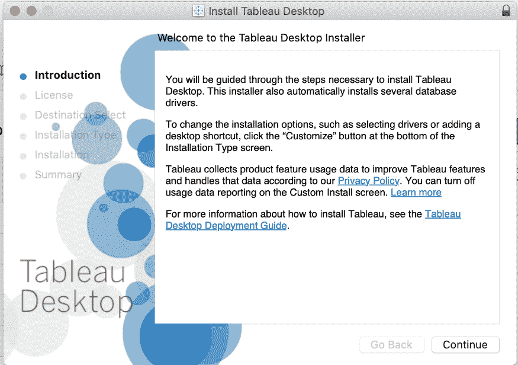
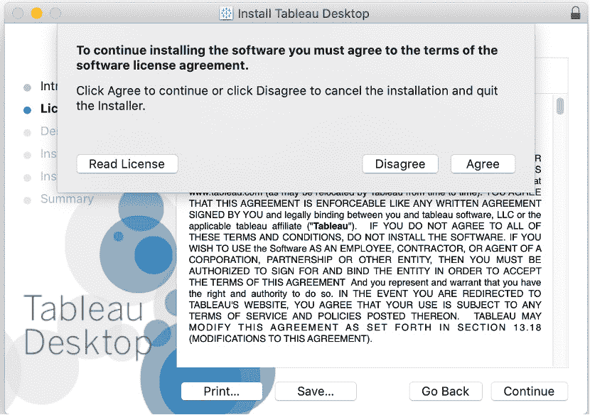
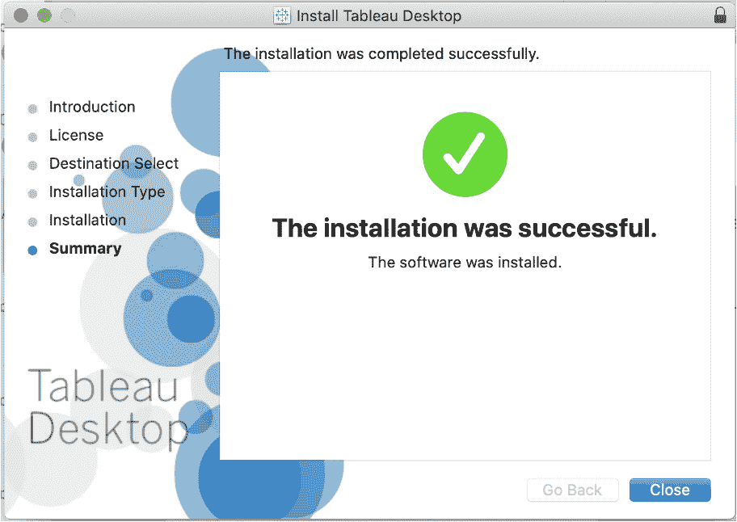
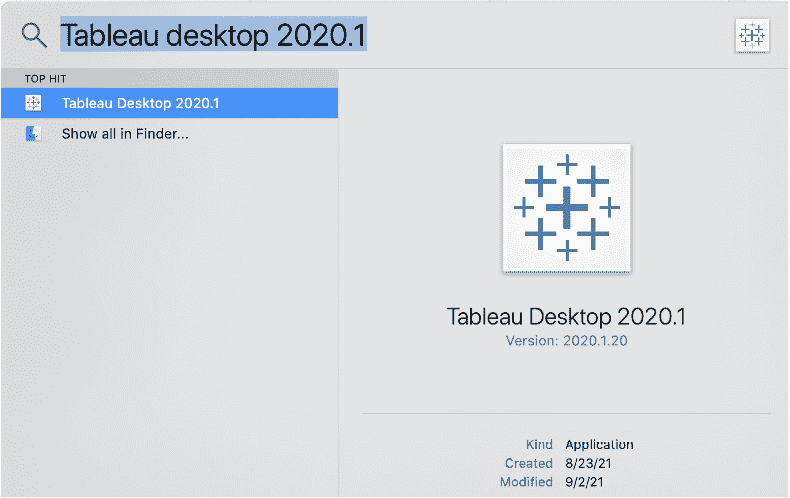

# 前言

# 关于本书

由于这本关于用数据讲述故事的实际介绍，学习 Tableau 从未如此简单。*《Tableau 实战工作坊》将分析过程分解为五个步骤：数据准备、数据探索、数据分析、交互性和仪表板的分发。每个阶段都通过清晰的步骤说明所需的关键工具和技术，以及引人入胜的真实世界案例、有意义的数据和实用的练习，为你提供宝贵的动手经验。

随着你逐步阅读本书，你将学习 Tableau 的使用方法，研究如何清洗、塑形和合并数据，以及如何为任何特定场景选择最合适的图表。你将从各种来源和格式加载数据，执行数据工程以创建提供更深入洞察的新数据，并创建能够吸引最终用户的交互式仪表板。

所有概念都通过清晰、简单的解释介绍，并通过现实世界的示例场景进行演示。你将模拟真实世界的数据科学项目，例如交通违规、城市人口、咖啡店销售和航空旅行延误等用例。

在阅读完这本 Tableau 书籍之后，你将拥有自信地展示分析结果和做出数据驱动决策的技能和知识。

## 关于作者

*苏米特·古普塔* 是一位拥有超过 7 年经验的 Analytics 专业人士，其经验涵盖市场营销、销售和产品分析。作为一名顾问和培训师，他利用 Tableau 为他的组织构建了更好的数据驱动团队。苏米特擅长将大量数据转化为易于理解的仪表板，提供可操作的智能。他是 Tableau 认证协会会员，喜欢培训数据爱好者成为更好的 Tableau 开发者和认证的 Tableau 协会会员。本书是向大众推广此类知识的一次努力。

*我想感谢我的家人，在本书的写作过程中给予了我极大的支持，尤其是我的超级妈妈。没有她，我今天不可能达到这样的成就。我还要感谢我的朋友们（比如皮尤什和谢什纳特，仅举几个例子）以及我的导师/领导者/经理们，他们也在推动我每天变得更好。继续前进，不断进步！*

*西尔维斯特·平托* 现在已经使用 Tableau 几年了，目的是为了提高不同行业的业务绩效。西尔维斯特为不同的组织设计了各种业务解决方案，使用 Tableau 帮助他们大幅提升业务。他拥有 Tableau 认证，并作为顾问为各种组织设计解决方案。

*舒韦塔·桑克-萨瓦莱* 是 Syvylyze Analytics（发音为 "civilize"）的联合创始人兼客户合作负责人，这是一家专注于视觉分析的特色商业分析公司。舒韦塔是 Tableau Desktop 合格的合作伙伴和 Tableau 认证培训师。作为印度 Tableau 领域的领先专家之一，舒韦塔将她的经验和专业知识转化为为数以百计来自各行各业客户的成功分析和服务。她在 BFSI、FMCG、零售、电子商务、咨询和专业服务、制造业、医疗保健和制药、ITeS 等多个行业领域承担了众多培训和咨询任务。她甚至有幸与知名政府和联合国机构合作。结合她分解复杂概念的能力和她在 Tableau 视觉分析平台上的专业知识，舒韦塔已成功培训了来自 85 多家公司的 1300 多名参与者。

*让-查尔斯（JC）吉莱特* 是一名经验丰富的商业分析师，在英国一家大型跨国公司和美国一家较小公司拥有超过 7 年的 SQL 经验，以及 5 年的 Tableau 经验。多年来，他一直在使用 Tableau 和 SQL 与同事分享他的专业知识，并教授 SQL 培训。作为一名法国公民，JC 拥有 Mines ParisTech 的执行工程硕士学位，并获得了 Tableau Desktop 认证合作伙伴资格。

在他的空闲时间，他喜欢和妻子及女儿（他为这本书的工作献给了她）一起度过时光，并参加团队手球比赛，曾参加过全国锦标赛。

*我想首先将这部作品献给我的妻子和两个孩子，他们每天陪伴在我身边，无论顺境还是逆境。同时，也献给我的父母，他们教会了我核心价值观，以及我的管理者，特别是我的导师和朋友罗伯特和米格尔，他们对我意义非凡。*

*肯尼斯·迈克尔·切文* 是美国密歇根州底特律的一名数据分析师和可视化专家。他使用 Tableau 已超过 15 年，专注于通过交互式仪表板和创意展示使复杂数据易于理解。除了在汽车行业的相关工作外，肯尼斯还使用来自棒球、政府、音乐和手工啤酒领域的开源数据进行分析和创建可视化。肯恩此前为 Packt 出版了两本书籍 – *使用 Gephi 进行网络图分析和可视化* 和 *精通 Gephi 网络可视化*。

## 本书面向对象

这本书适合任何想要开始使用 Tableau 进行视觉分析的读者。如果你是 Tableau 的初学者，这个研讨会将帮助你入门。如果你已经有一些 Tableau 的经验，这本书将帮助你填补任何空白，巩固你的理解，并让你在关键工具上获得额外的实践。

## 关于章节

*第一章*，*介绍：使用 Tableau 进行可视化分析*，教你理解数据及其可视化元素的基本技能，用于报告和创建仪表板。

*第二章*，*数据准备：使用 Tableau Desktop*，涵盖了你在 Tableau 中创建报告所需的必要技能，如加载数据、连接、转换、混合和操作数据。

*第三章*，*数据准备：使用 Tableau Prep*，涵盖了 Tableau Prep 以及 Prep 如何帮助清理和连接不同的数据源。你将学习如何执行数据操作方法，如数据透视、分组和聚合，最后，如何将转换后的数据导出到 Tableau。

*第四章*，*数据探索：比较和组合*，扩展了你的 Tableau 知识。你将开始在 Tableau 中创建图表，包括线图、条形图和堆叠面积图。你还将学习如何创建趋势报告。

*第五章*，*数据探索：分布和关系*，涵盖了参考线和高级图表类型，如双轴图和象限图。

*第六章*，*数据探索：探索地理数据*，教你如何在 Tableau 中探索地理数据以执行基于位置的分析。

*第七章*，*数据分析：创建和使用计算*，涵盖了计算，包括数值、字符串和日期计算。你还将学习如何在计算字段中编写逻辑语句。

*第八章*，*数据分析：创建和使用表计算*，涉及表计算以及它们与计算字段的区别，以及何时使用表计算而不是计算字段。

*第九章*，*数据分析：创建和使用级别细节（LOD）计算*，涵盖了 LOD 计算，通过这些计算你将学习如何控制视图中的聚合级别。

*第十章*，*仪表板和故事板*，涵盖了使用空白画布构建交互式仪表板的基础，包括添加品牌元素、过滤器网页。最后，我们还将介绍故事板以及它们与仪表板的区别。

*第十一章，Tableau 交互性：第一部分*，深入探讨了 Tableau 操作顺序、过滤器、集合和参数，同时强化了其他图表和仪表板技能。

这是两篇主题的第一部分，后半部分可在网上找到。

注意

此外，还有三个附加章节（*第十二章*，*Tableau 交互性：第二部分*；*第十三章*，*仪表板分布*；和*第十四章*，*案例研究*），你可以在[`packt.link/SHQ4H`](https://packt.link/SHQ4H)找到。 

你也可以在网上找到这个研讨会中所有活动的解决方案，链接为[`packt.link/CTCxk`](https://packt.link/CTCxk)。

## 习惯用法

文本中的代码单词、数据库和集合名称、文件和文件夹名称、shell 命令和用户输入使用以下格式："在顶部还有其他 `文件`、`编辑`、`流程` 和 `服务器` 菜单选项。`文件` 和 `编辑` 选项的目的不言而喻。`流程` 菜单可以用来运行流程，而 `服务器` 菜单有选项可以登录并发布流程到 Tableau Server。"

通常在章节的开头，会介绍一些关键的新术语。在这些情况下，将使用以下格式："理解 **聚合** 是在使用 Tableau 时需要牢记的最基本概念。"

## 最小硬件要求

为了获得最佳体验，我们建议以下硬件配置：

+   处理器：双核或更好

+   内存：4 GB RAM

+   存储：10 GB 可用空间

## 最小软件要求

与硬件要求不同，软件要求可能难以列出，因为 Tableau 每 3-6 个月就会发布新的软件更新，并且这些新版本中会添加新功能。但考虑到本书中计划的练习/活动，我们预计至少需要以下软件：

+   Tableau Desktop 2020.1 或更高版本

+   Tableau Prep 2020.1 或更高版本

本书编写和审阅使用了 Tableau 版本 2020.1.x。尽管 Tableau 经常发布新版本，但本书中练习和活动的步骤不太可能因版本变化而改变。任何在出版时已知的差异将在文本中相应地注明。

## 下载本书/数据源包

GitHub 链接：[`packt.link/jqzD0`](https://packt.link/jqzD0)

从 GitHub（如图所示）下载所有文件夹和数据文件，或根据需要单独下载各个章节文件。

图 0.1：GitHub 文件

## 设置您的环境

在开始本书之前，您需要设置 Tableau Desktop 和 Tableau Prep。在本节中，您将了解如何安装 Tableau Desktop。一旦您按照以下步骤安装了 Tableau Desktop，您还需要遵循相同的步骤下载 Tableau Prep。下载链接如下：

Tableau Desktop 2020.1: [`www.tableau.com/support/releases`](https://www.tableau.com/support/releases)

Tableau Prep 2020.1: [`www.tableau.com/support/releases/prep`](https://www.tableau.com/support/releases/prep)

### 在您的系统上安装 Tableau

1.  从 [`www.tableau.com/support/releases/`](https://www.tableau.com/support/releases/)，点击 `2020.1` 以展开列表。点击以下任意的 2020.1.XX 链接：

图 0.2：Tableau 下载/发布说明页面

1.  点击 2020.1.20，然后点击加载的新页面。接下来，要么点击“下载 Tableau Desktop 2020.1.20”，Tableau 将自动检测您的操作系统，或者向下滚动到“下载文件”部分，并点击适用于您的操作系统（Windows 或 Mac）的相应下载链接。

图 0.3：Tableau 下载 2020.1.20 页面

1.  下载文件后，打开您的下载文件夹，双击下载的文件。如果您使用的是 Mac（Windows 将有类似的流程），您将看到以下屏幕：

图 0.4：Tableau 桌面安装程序：简介

1.  通过点击“继续”并同意软件许可协议的条款和条件来遵循提示：

图 0.5：Tableau 软件协议提示

安装软件可能需要一分钟左右的时间，并且根据您的计算机配置，您可能需要重新启动系统。

1.  文件写入后，您应该看到以下成功消息。点击“关闭”以完成安装：

图 0.6：Tableau 安装完成

1.  为了验证软件是否已安装，如果您使用的是 Mac，请按*cmd* + *Space*打开 spotlight 搜索并输入`Tableau`。您应该在屏幕上看到以下内容。同样，如果您使用的是 Windows，请点击 Windows 按钮并输入`Tableau`以打开应用程序。

图 0.7：在 spotlight 搜索中搜索 Tableau

您可以通过从上面的下载链接下载软件来遵循相同的步骤安装 Tableau Prep。当您第一次加载 Tableau Desktop 或 Tableau Prep 时，您可能需要注册软件并输入许可证密钥。根据您的具体情况，您的组织可能能够提供许可证密钥，或者您可以从 14 天试用期开始探索软件。最后，如果您是学生或教师，Tableau 提供免费的 1 年许可证；了解更多信息，请访问[`www.tableau.com/academic/students`](https://www.tableau.com/academic/students)。

## 联系我们

我们始终欢迎读者的反馈。

**一般反馈**：如果您对这本书有任何疑问，请在邮件主题中提及书名，并通过 customercare@packtpub.com 给我们发邮件。

**勘误表**：尽管我们已经尽最大努力确保内容的准确性，但错误仍然可能发生。如果您在这本书中发现了错误，如果您能向我们报告，我们将不胜感激。请访问[www.packtpub.com/support/errata](http://www.packtpub.com/support/errata)并填写表格。

**盗版**: 如果你在互联网上以任何形式遇到我们作品的非法副本，如果你能提供位置地址或网站名称，我们将不胜感激。请通过版权@packt.com 与我们联系，并提供材料的链接。

**如果你有兴趣成为作者**：如果你在某个领域有专业知识，并且你对撰写或参与一本书籍感兴趣，请访问[authors.packtpub.com](http://authors.packtpub.com)。

## 请留下评论

通过在亚马逊上留下详细、公正的评论来告诉我们你的想法。我们感激所有反馈——它帮助我们继续制作优质产品并帮助有抱负的开发者提升技能。请抽出几分钟时间留下你的想法——这对我们来说意义重大。你可以通过点击以下链接来留下评论：[`packt.link/r/1800207654`](https://packt.link/r/1800207654)。
