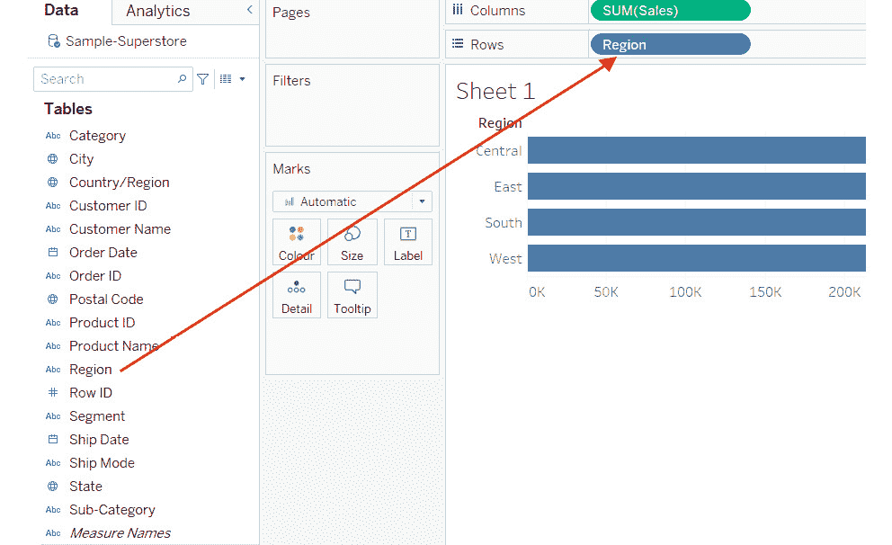

# 第一章：1. 简介：使用 Tableau 进行视觉分析

概述

在本章中，你将了解**视觉分析**以及为什么可视化你的数据很重要。你将使用 Tableau Desktop 连接到数据，并熟悉 Tableau 工作区。到本章结束时，你将非常熟悉 Tableau 界面以及一些基本的重要概念，这些概念将帮助你开始使用 Tableau。本章涵盖的主题将标志着你 Tableau 之旅的开始。

# 简介

在一个非常广泛的层面上，整个数据分析过程可以分解为以下步骤：数据准备、数据探索、数据分析以及分发。这个过程通常从一个问题或目标开始，然后是寻找和获取相关数据。一旦有了相关数据，你接下来需要为你的探索和分析阶段准备这些数据。你可能需要清洗和重构数据以使其处于正确的形式，也许需要将其与一些额外的数据集合并，或者通过创建一些计算来增强数据。这个阶段被称为数据准备阶段。之后是数据探索阶段。在这个阶段，你试图了解数据的组成和分布，比较数据，并确定是否存在任何关系。这一步骤给出了使用给定数据集可以进行何种分析的想法。

通常，人们喜欢通过查看数据的原始形式（即在数据准备阶段）来探索数据；然而，探索数据的一个快速且简单的方法是将其可视化。数据可视化可以揭示在原始数据中难以识别的模式。

数据探索阶段之后是数据分析阶段，在这个阶段，你分析你的数据，并发展出可以与他人分享的见解。这些见解在可视化后将使数据更容易解释，进而导致更好的决策。用非常简单的话来说，通过将数据可视化为图表和图形来探索和分析数据的过程被称为“视觉分析”。如前所述，数据可视化的想法是使决策更快。最后，数据分析周期的最后一步是分发阶段，在这个阶段，你将与可以消费这些信息并采取行动的其他利益相关者分享你的工作。

在本章中，我们将详细讨论所有这些主题，从对标题过程价值的进一步探索开始。

# 视觉分析的重要性

如前所述，“视觉分析”可以被定义为通过将数据可视化为图表和图形来探索和分析数据的过程。这使得最终用户能够快速消费信息，进而使他们能够做出更快、更好的决策。

在本节中，你将了解为什么数据可视化是比查看大量数据数值格式更好的评估工具。

我们中的每个人都曾在某个时候听说过这样的表达：“一图胜千言。”确实，研究发现，当数据以视觉形式呈现时，人类在识别和识别数据中的模式和趋势方面非常出色，而不是以大量数据的形式呈现在表格或电子表格格式中。

为了理解数据可视化/视觉分析的重要性和力量，让我们看看一个经典的例子：**Anscombe 四重奏**。Anscombe 四重奏由四个具有几乎相同统计特性的独立数据集组成，但分布和可视化却完全不同。

注意

这是由 1973 年的一位名叫弗朗西斯·约翰（Frank）·安索普的英国统计学家开发的，该数据集以他的名字命名。

让我们更深入地研究这些数据集。

图 1.1：显示 Anscombe 四重奏中使用的数据集的屏幕截图

正如你在前一张图中可以看到的，每个数据集由 11 个 X 和 Y 点组成。现在，如果你使用典型的描述性统计方法，如均值、标准差和 X 与 Y 之间的相关性来分析这些数据集，你会发现输出结果完全相同。

图 1.2：显示 Anscombe 四重奏数据描述性统计的屏幕截图

观察前一张图，你可以看到以下内容：

+   每个数据集 X 的均值为 9（精确度）。

+   每个数据集 X 的标准差为 3.32（精确度）。

+   每个数据集 Y 的均值为 7.50（精确到小数点后两位）。

+   每个数据集 Y 的标准差为 2.03（精确到小数点后两位）。

+   每个数据集 X 和 Y 之间的相关系数为 0.816（精确到小数点后三位）。

因此，通过查看上述统计推断，你会认为这些数据集是相同的，直到你决定可视化每个数据集，其结果如下所示。

这些图像显示了这些数据集作为图形可视化时的外观。现在，让我们将这些可视化并排比较，以便你可以看到这些数据集实际上有多么不同。

图 1.3：显示 Anscombe 四重奏所有四个数据集的图形表示的屏幕截图

前面的例子突出了数据可视化如何帮助揭示数据中的模式，而这些模式仅通过查看数字和/或仅进行统计分析是无法看到的。这正是弗朗西斯·安索普创建他的“四重奏”的原因。他想要反驳“数值计算是精确的，但图表是粗糙的”这种观点，这在当时在统计学家中相当普遍。

接下来，再看看一个数据可视化如何帮助我们快速发现洞察力的例子。参见图下：

![Figure 1.4: A screenshot of a grid view showing the marketing expense]

以及不同市场中的产品盈利能力

![img/B16342_01_04.jpg]

图 1.4：显示不同市场产品营销费用和盈利能力的网格视图截图

在前面的图中，你可以看到`产品类型`、`产品`、`市场`、`营销`和`利润`等字段的网格视图。在你所使用的数据中，`营销`是指为推广产品而投入的任何营销努力所花费的金额，而`利润`是在这些营销努力之后产生的利润。此外，这些值按`产品类型`、`产品`和`市场`等维度进行细分。目的是评估每个产品在不同市场中的`营销`和`利润`表现。

现在，以如上图所示的网格格式显示这些信息，会在视图中显示 84 个数字，而在这 84 个数字之间进行任何比较都将非常困难。所以，想象一下，你想要找出在哪些特定市场中，即使在投入大量营销努力之后，仍然有产品在亏损。那么你将不得不在水平和垂直方向上比较这些数字，这实际上有点繁琐。然而，让我们看看可视化这些数据是否会有所不同。参见图下：

![Figure 1.5: A bar chart comparing the marketing expense and profitability for products]

![img/B16342_01_05.jpg]

图 1.5：比较不同市场产品营销费用和盈利能力的条形图

在前面的图中，你可以看到条形的长度代表的是在`营销`上花费的金额，而条形的颜色则代表的是`利润`值。所以基本上，条形越长，在营销上的花费就越多；蓝色越深，产品的利润就越高；橙色越深，累积的损失就越大。

回顾那个图，注意在`东部`市场的最长条形是`卡布奇诺`。这意味着`卡布奇诺`在营销上的花费最高，但由于那个条形的颜色是橙色，你也知道它在累积损失。

这又是另一个展示数据可视化强大功能的例子。

现在你已经了解了什么是视觉分析以及为什么它很重要，让我们在下一节看看一些数据可视化工具。

# Tableau 产品套件

市面上有很多工具提供各种功能和特性，您可以使用它们来可视化您的数据。在商业分析和数据可视化的领域，Tableau 由于其易用性和拖放功能，是这一领域的领先工具之一，这使得即使是商业用户也能更容易地理解他们的数据。Tableau 提供了针对不同目的的不同工具，这些工具都包含在 Tableau 产品套件中，我们将在本节中探讨这些工具。

整个套件可以分为三个部分：数据准备、数据可视化和消费或分发。参考以下图示：

![Figure 1.6：显示 Tableau 产品套件的截图

![img/B16342_01_06.jpg]

图 1.6：显示 Tableau 产品套件的截图

如前图所示，您在 *数据准备层* 中有 *Tableau Prep*，它用于清理、合并、重塑和增强您的数据。这个工具帮助您为分析和可视化准备数据。

现在，一旦您的数据准备就绪，并且处于正确的形式和结构，您将开始分析和可视化它。为此，您将使用 *Tableau Desktop* 或 *Tableau Public*。

Tableau Desktop 是您创建可视化、分析和仪表板的地方。这通常是您会花费大量时间使用的工具，因为大部分开发工作都是在 Tableau Desktop 上完成的。Tableau Public 也可以用来创建您的分析和可视化。然而，这里的问题是您无法将作品保存在本地或离线，它将必然保存在 Tableau Public 服务器上，任何人都可以查看。Tableau Public 是一个类似于 Tableau Desktop 的免费版本，通常由博客作者、记者、研究人员等处理公共或开放数据的人使用。

Tableau Public 是一个非常适合想要创建公共可视化的任何人使用的工具，但不建议处理机密数据的人使用。处理机密数据时，最好使用 Tableau Desktop。

一旦您完成了可视化构建，您可以使用 *Tableau Server* 或 *Tableau Online* 的在线方法与他人分享您的作品，或者分享您作品的离线副本，然后可以使用 *Tableau Reader* 打开。

Tableau Server 是一个基于本地托管浏览器和移动端的协作平台，用于发布在 Tableau Desktop 中创建的仪表板，并与您的最终用户共享。它允许您共享和在一定程度上编辑、发布仪表板，同时管理访问权限，并确保您的可视化可以通过网络安全访问。它允许您按计划频率刷新仪表板，并保持与后端数据源的实时数据连接，从而使用户能够从任何地方在线访问最新的仪表板。Tableau Server 还允许您通过 iOS 和 Android 上的应用程序查看移动平板电脑上的仪表板。另一方面，Tableau Online 是 Tableau Server 的云托管版本（或 SaaS 版本）。它带来了云服务器的功能，而没有基础设施成本。

然而，如果您想离线查看仪表板，您可以使用 Tableau Reader。这是一个免费的桌面应用程序，可以用来打开、查看和与在 Tableau Desktop 中构建的仪表板和可视化进行交互。因此，它基本上允许您进行筛选、钻取、查看数据细节，并与仪表板进行充分交互，达到作者所期望的程度。但作为读者，您不能对仪表板进行任何更改或编辑，除非作者已经构建在内。

接下来的章节以及以下章节将专注于 Tableau Desktop。您将熟悉 Tableau Desktop 的界面，了解其工作空间，并了解您如何创建可视化并构建仪表板。

这里需要注意的是，Tableau Desktop 是一个授权产品，如果您没有必要的许可证，甚至可以使用 Tableau Public 来尝试书中涵盖的示例。如前所述，Tableau Desktop 和 Tableau Public 是 Tableau 提供的两个主要开发产品，这两者之间的唯一区别是提供的数据源连接范围、本地保存文件的能力以及您工作的安全性。虽然 Tableau Desktop 提供所有这些功能，但 Tableau Public 有局限性。

然而，这两个工具的其他功能和外观感觉是相同的。下一节将探讨如何使用 Tableau 连接、分析和可视化您的数据。

请注意，本书中使用的是 Tableau Desktop 的授权版本。

# Tableau Desktop 简介

现在，您已经确定并选择了 Tableau Desktop 来创建您的视觉和仪表板，让我们更深入地了解该产品、其界面和其功能。因此，一旦您下载并安装了该产品，您将能够使用产品连接到您的数据并开始构建您的可视化。

下面的截图显示了 Tableau Desktop 的登录页面：

图 1.7：Tableau Desktop 着陆页的截图

查阅以下列表以了解截图中突出显示部分的说明：

1.  `搜索数据`选项；到平面文件，如 Excel 和 CSV（`到文件`选项）；或到数据库（`到服务器`选项）。Tableau 对许多数据源具有本机内置的连接器，这使得与这些数据源的数据交互变得无缝。列表相当广泛，并且还在不断增长。但请注意，虽然 Tableau Desktop 提供了广泛的数据连接器列表，但 Tableau Public 只允许您连接到平面文件（`到文件`选项）。请参考以下截图查看 Tableau Desktop 2020.1 版本的`更多...`选项：

图 1.8：显示 Tableau Desktop 可以连接到的广泛数据源的截图

1.  `已保存的数据源`选项允许您连接到之前已处理和/或修改并保存以供以后使用的源。

1.  **打开**：本节显示了最近访问的 Tableau 文件的缩略图。开始时本节是空的，但随着您创建和保存新的工作簿，它将不断更新并显示最近打开的工作簿的缩略图。本节还可以用来固定您最喜欢的 工作簿。

1.  **样本工作簿**：本节展示了在 Tableau 中已完成的一些样本工作。选择此处任何缩略图都将打开相关的 Tableau 工作簿。在此需要注意的是，在 Tableau 中，“工作簿”是一个包含多个工作表和/或仪表板和/或故事板的文件。

1.  **探索**：本节包含一些快捷链接到 Tableau 网站上的培训视频和资源。

1.  现在您已经熟悉了 Tableau 的着陆页，让我们继续进行以下练习，看看如何连接到数据。 

## 练习 1.01：连接到数据源

在这个练习中，您将第一次连接到数据源，这是在 Tableau 中分析数据的第一个步骤。

您可以连接到许多类型的数据源，但为了本练习的目的，您将使用 Excel 文件——在这种情况下，*Sample-Superstore.xls*，它是 Tableau 内置的，包含一家公司的销售和利润数据。

执行以下步骤以完成练习：

1.  从左侧着陆页的`连接`下的`到文件`选项中选择`Microsoft Excel`选项。您应该会看到以下 屏幕：

图 1.9：显示连接到 Microsoft Excel 选项的截图

1.  一旦您选择此选项，它将要求您浏览要连接的 Excel 文件。为此，连接到 `Sample-Superstore.xls`，它可以在 *Documents>My Tableau Repository>Datasources* 中找到，或者也可以从本章的 GitHub 仓库下载，网址为 [`packt.link/7hnNH`](https://packt.link/7hnNH)。请参考以下截图：

图 1.10：显示 My Tableau Repository 下的样本 - 超市.xls 数据的截图

这些数据是随产品一起提供的样本数据集。一旦您下载并安装 Tableau Desktop，您将在您的 `Documents` 文件夹下注意到创建了一个 `My Tableau Repository` 文件夹。这就是您将找到这个样本数据集的地方。

1.  一旦您连接到这个数据源，您将看到 Tableau Desktop 的数据连接页面，如下截图所示。请查阅以下说明，以更好地理解您所看到的内容：

图 1.11：显示 Tableau Desktop 中数据连接页面的截图

+   `Sample - Superstore.xls` 文件，您刚刚已建立连接。这里需要注意的是，仅仅因为您已连接到这个 Excel 文件，并不意味着您已经连接到数据。

+   `Sample - Superstore.xls` 文件，这是实际数据所在的位置。`Orders` 表包含来自这个零售超市的所有交易的列表，并包含订单级别的数据。这个订单级别包含日、产品和客户级别的详细信息。请参考以下图表来快速查看 `Orders` 表：

图 1.12：显示样本 - 超市.xls 订单工作表的截图

+   `People` 表只包含两列：`Region` 和 `Person`。`Person` 列是每个 `Region` 的经理列表。请参考以下截图来快速查看 `People` 表：

图 1.13：显示样本 - 超市.xls 的人事工作表的截图

`Returns` 表包含所有已退货的交易/订单列表。所以，再次强调，只有两列：`Returned` 和 `Order ID`。请参考以下截图来快速查看 `Returns` 表：

图 1.14：显示样本 - 超市.xls 返回工作表的截图

+   `订单`、`人员`和`退货`) 来自 `示例 - 超级商店.xls` 数据源。*命名范围*是 *Microsoft Excel* 中的一个功能，Tableau 允许您从这些预定义的 *命名范围* 中读取数据。要了解更多关于 Excel 中的 *命名范围*，请参阅以下链接：[`support.microsoft.com/en-us/office/define-and-use-names-in-formulas-4d0f13ac-53b7-422e-afd2-abd7ff379c64?ui=en-us&rs=en-us&ad=us`](https://support.microsoft.com/en-us/office/define-and-use-names-in-formulas-4d0f13ac-53b7-422e-afd2-abd7ff379c64?ui=en-us&rs=en-us&ad=us)。

1.  因此，到目前为止，您已经连接到了 `示例 - 超级商店.xls` 文件；然而，您尚未建立连接到数据，以便能够在 Tableau 中进行分析。要做到这一点，从左侧列表中拖动 `订单` 工作表并将其拖放到顶部空白区域，该区域显示为 `拖放工作表于此`。 （如果您使用的是 2020.1 版本之后的版本，这可能会改为显示为 `拖放表于此`。）请注意，您需要使用 `订单` 工作表而不是 `订单` 命名范围，因为命名范围中的数据可能比 `订单` 工作表中的数据有限。请参考以下截图：

图 1.15：显示如何从 Sample - Superstore.xls 的订单工作表中读取数据的截图

1.  一旦您将 `订单` 工作表拖放到 `拖放工作表于此` 区域，您将看到视图为您更新，如下面的截图所示：

图 1.16：拖放订单工作表后的视图截图

上述图示显示了将 `订单` 工作表拖放到 `拖放工作表于此` 区域后的视图。查看截图中的突出部分和下面的相应说明，以了解更多信息。

+   `订单` 数据。这是您可以快速盘点数据并确保您有所有必要列来工作的地方。

+   `连接` 选项。它有两个选项可供选择，`Live` 和 `Extract`。`Live` 连接是当您想实时连接到数据时使用的选项。这意味着基本上任何在数据端的变化都会反映在 Tableau 中。然而，这里需要快速指出的是，`Live` 连接选项依赖于数据源来处理所有查询，如果后端数据源是性能较慢的数据源，这可能会导致 Tableau 中的性能问题。另一方面，`Extract` 连接是存储在 Tableau 自有格式中的数据快照，称为 `Tableau Data Extract`，它使用文件扩展名 `.hyper`。由于 `.hyper` 文件只包含数据的快照，因此如果您需要查看和使用更新后的数据，它将需要刷新。

+   `过滤器` 选项，用于限制读取和使用在 Tableau 中的数据量。这适用于之前提到的 `Live` 和 `Extract` 选项。

现在您已经了解了 Tableau 的 *数据连接页面*，您最终可以开始使用 Tableau 来分析和可视化您的数据。

1.  将 `Live` 连接到来自 `Sample - Superstore.xls` 的 `Orders` 数据。请参考以下截图：

图 1.17：显示“转到工作表”选项的截图

1.  现在，获取用于分析的数据的最终步骤是点击 `Sheet1`，然后从中选择 `转到工作表`。这样，您就将数据读入 Tableau Desktop，并可以开始使用它了。请参考以下截图：

图 1.18：显示 Tableau 工作区的截图

上述截图显示了 *Tableau 工作区*。这是您将在此空间中创建可视化内容的区域。让我们快速浏览截图中的突出部分，以更详细地了解工作区。

+   `Book1`（如图所示）。然而，当您保存工作簿时，您可以分配任何您喜欢的新的名称。

+   **第二部分**：这是 *工具栏部分*，它包含各种选项，可以帮助您探索 Tableau 中可用的各种功能和功能。

+   `数据` 面板和 `分析` 面板。`数据` 面板显示了来自数据的字段的详细信息，这些字段被分类为 `维度` 或 `度量`。另一方面，`分析` 面板显示了可以在您创建的视图中执行的多种分析，例如常数线、平均值线、中位数与四分位数、总计、趋势线、预测线和聚类。最初，`分析` 面板是禁用或灰色的，并且只有在您创建视图或可视化时才会开始出现。

+   `维度`和`度量`部分，这在技术上属于`数据`面板的一部分（如果您使用的是 2020.1 之后的 Tableau 版本，它可能不会显示在视图中）。`维度`是从数据中所有分类的、描述性的或定性的字段，例如`客户名称`、`产品名称`、`订单 ID`和`地区`。当在视图中检索时，这些字段的每个数据成员都会在视图中显示。另一方面，`度量`是从数据中性质为定量的字段，可以聚合为总和、平均值、最小值、最大值、标准差、方差等。当在视图中检索时，将显示聚合值。`度量`的例子包括`销售`、`利润`和`数量`等字段，这些字段将用于您的分析目的。参考以下截图以获得更多清晰度：

图 1.19：一个截图，显示了维度和度量之间的差异

+   `工作表`标签。在这里，您可以选择创建新的工作表、仪表板或故事板。

+   `列`面板、`行`面板、`页面`面板和`过滤器`面板，以及包含`颜色`面板、`大小`面板、`文本`面板、`细节`面板和`工具提示`面板的`标记`卡。这些面板用于更改视图的外观和细节。

+   `视图`部分。这是您创建可视化图表的地方。它可以被称作创建视图和可视化图表的画布。

现在您已经熟悉了 Tableau 的工作空间，您可以创建您的第一个可视化。要创建您的视图或可视化，您可以选择尝试`Show Me`按钮。让我们探索这两种选项。

在接下来的练习中，您将开始使用*手动拖放*方法，然后探索使用`Show Me`按钮的*自动化方法*。

## 练习 1.02：使用手动拖放创建比较图表

本练习的目的是通过手动拖放方法创建一个图表，以确定哪种船运方式在`销售`方面根据`地区`表现更好。在这种情况下，您将使用来自`Sample - Superstore.xlsx`的`Orders`数据中的`Ship Mode`、`Region`和`Sales`字段创建一个堆叠柱状图，另一个则是通过手动从`数据`面板拖动字段并将它们拖放到必要的面板中创建。

执行以下步骤以完成此练习：

1.  从`数据`面板的`度量`部分拖动`Sales`字段并将其拖放到`列`面板上。这将创建一个水平柱状图。

1.  从`数据`面板的`维度`部分拖动`Region`字段并将其拖放到`行`面板上。这将创建一个带有地区标签的水平柱状图，柱子显示`销售`的总和。

1.  最后，为了包含船舶模式，请从“数据”面板中的“维度”部分拖动“船舶模式”字段，并将其放置在“标记”卡下的“颜色”架上。这将更新您的视图以显示带有船舶模式的堆叠条形图，如下面的截图所示：

手动拖放方法

图 1.21：使用手动拖放方法创建的堆叠条形图的截图

在这个练习中，您使用**手动拖放**方法创建了一个堆叠条形图，以显示在“区域”方面哪种船舶模式在“销售额”方面表现更好。正如您在前面的截图中所见，与其它模式相比，“标准等级”船舶模式似乎表现最佳。

在以下练习中，您将创建另一个销售额比较图表——但这次使用“显示我”按钮。

## 练习 1.03：使用自动“显示我”按钮方法创建比较图

本练习的目的是通过“显示我”按钮的自动化方法创建一个图表，以确定哪种“船舶模式”在“区域”方面的“销售额”表现更好。就像上一个练习一样，您将使用`Sample-Superstore.xlsx`的“订单”数据中的“船舶模式”、“区域”和“销售额”字段创建一个堆叠条形图，并使用“显示我”按钮创建另一个。然后，您将比较生成的图表以确定哪种模式有助于产生最高的销售额。

在新的工作表中，执行以下步骤以完成练习：

1.  按住并保持“维度”部分的“区域”和“船舶模式”字段以及“度量”面板中的“销售额”字段。

    注意

    在进行**多选**时，需要按住**CRTL**键。此外，如果您使用的是苹果设备，请使用**Command**键代替。有关 Windows 和 macOS 的等效命令和键盘快捷方式的列表，请参阅以下链接：[`help.tableau.com/current/pro/desktop/en-us/shortcut.htm`](https://help.tableau.com/current/pro/desktop/en-us/shortcut.htm)。

1.  一旦您选择了必要的字段，请点击位于您 Tableau 工作簿**右上角**的“显示我”按钮。请参阅以下截图：

图 1.22：显示“显示我”按钮的截图

一旦你点击了“显示我”按钮，你将看到当前字段选择可能产生的可视化列表，即*两个维度*（“区域”和“船模式”）和*一个度量*（“销售额”）。此外，你还会看到水平柱状图被突出显示。突出显示的图表（在以下截图中，Tableau 2020.1 版本使用橙褐色矩形边框突出显示）是基于数据可视化最佳实践的内置推荐引擎的结果。

![图 1.23：显示可能的图表和“显示我”按钮的截图]

图 1.23：显示可能的图表和“显示我”按钮的截图

你现在有两个选择：你可以继续使用 Tableau 推荐的图表，这将创建一个水平柱状图（这并不是目标），或者选择“显示我”按钮中可用并启用的其他图表（理想情况下是一个像你在上一个练习中创建的堆叠柱状图）。因此，选择紧挨着推荐图表的图表（在先前的截图中使用黑色虚线圆形边框突出显示）。这是堆叠柱状图选项，这正是你想要的。

然而，当你继续使用此选项时，你会看到两个与之前练习中创建的输出不同的地方。首先，它是一个垂直堆叠的柱状图，而不是水平柱状图，其次，你在“颜色”架中有“区域”而不是“船模式”。请参考以下截图：

![图 1.24：显示从“显示我”按钮中堆叠柱状图选项输出的截图]

从“显示我”按钮

图 1.24：显示从“显示我”按钮中堆叠柱状图选项输出的截图

现在，这些操作在技术上并没有错误，但它们并不是你在这个情况下想要的，因此你需要进行更改。

1.  首先，通过在工具栏中点击交换按钮将你的堆叠柱状图的方向从垂直更改为水平，如图以下截图所示：

![图 1.25：显示交换行和列按钮的截图]

图 1.25：显示交换行和列按钮的截图

1.  接下来，交换/交换你的“区域”和“船模式”字段，以便你在“颜色”架中拥有“船模式”而不是“区域”。

要这样做，请从“颜色”架中按下“区域”，以及从“行”架中按下“船模式”。确保这些选定字段的药丸颜色现在更深，因为深色表示这些字段的选取已被保留。

1.  现在，点击“区域”字段或“船模式”字段的下拉菜单，并选择“交换”选项，如图以下截图所示：

![图 1.26：显示 CTRL 多选的交换选项的截图]

以及下拉方法

图 1.26：显示 CTRL 多选和下拉方法交换选项的屏幕截图

这会产生以下输出：

图 1.27：使用交换选项创建的堆叠柱状图的屏幕截图

在这个练习中，您创建了一个堆叠柱状图，使用*手动拖放*方法显示了哪种`Ship Mode`在`Sales`方面在`Regions`中表现更好。正如您在前面的屏幕截图中看到的，`Standard Class`的运输方式似乎比其他运输方式产生了更多的销售额。

# 使用 Tableau Desktop 进行数据可视化

在前面的章节中，您熟悉了 Tableau 的工作空间，并学习了如何使用*手动拖放方法*以及*自动的*“显示我”*按钮*创建可视化。在本书的各个章节中，您将深入了解这个工作空间，并了解工具栏和其他架子上的一些更多选项。

现在您已经对如何使用上述方法创建可视化有了基本的了解，您将现在探索数据可视化的概念以及如何在 Tableau Desktop 中使用这些概念。

理想情况下，当您展示您的分析和洞察时，您希望您的最终用户能够快速消费您所提供的信息，并更快地做出更好的决策。实现这一目标的一种方法是将信息以正确的格式呈现。每个图表、图形或可视化都有其特定的目的，选择合适的图表来回答特定的目标或商业问题尤为重要。

现在，为了能够选择合适的图表，您首先需要查看数据并回答“您需要用数据做什么？”的问题。

为了帮助您做出决定，请考虑以下因素：

+   您是否希望**比较**值？

+   您是否希望查看您数据的**组成**？

+   您是否希望了解您数据的**分布**？

+   您是否希望找到并理解您数据集中各个变量之间的**关系**？

一旦您解决了这些问题并确定了您想对数据进行什么操作，您还需要决定以下事项：

+   在任何给定时间点，您需要查看多少个变量？

+   您是否希望跟踪数据趋势？

通过这个列表，您将能够确定哪种图表最适合回答您的商业问题。为了详细说明这一点，首先将您的图表分为四个部分——即那些帮助您比较、确定组成、显示数据分布，或者帮助您在数据中找到关系的图表。

比较、组成、分布和关系通常被称为数据可视化的四大支柱，在这里有更详细的描述：

1.  **比较**：在分析你的数据时，一个常见（如果不是最常见的）用例是比较你的数据。比较通常是在两个或多个值之间进行的。比较的一些例子包括不同地区的销售收入，特定销售代表的表现与同事相比，不同产品的盈利能力，等等。

通常，你会看到比较是在*分类数据*之间进行的，即*维度的数据成员*（例如，在“地区”是维度的情况下，而“东”、“西”、“北”和“南”是该维度的数据成员，进行跨地区的比较），但它也可以在*定量数据*之间进行，即*跨度量*（例如，销售额与利润或实际销售额与预算销售额的比较）。

另一种非常常见的比较类型是跨一段时间进行比较（例如，评估你的月度销售业绩或哪些月份对你的业务更有利，以及是否有任何需要关注的季节性趋势）。

因此，基于前面的信息，你将进一步将*比较*细分为*跨维度项或分类数据（例如，按地区销售）*，*随时间比较*，以及*跨度量*或可量化数据（例如，销售额与配额的比较）。

以下列表概述了每种类型的*比较*应使用的典型图表：

**跨维度项比较：**

+   柱状图

+   堆积气泡图

+   单词云

**随时间比较：**

+   柱状图

+   折线图

**跨度量比较：**

+   枪图

+   柱状图

1.  **组成**：在分析你的数据时，另一个常见的用例是找出每个数据成员对整体的贡献率或比例。所以基本上，在总价值中，每个数据成员的贡献是多少？这通常被称为部分与整体组成，它帮助我们了解每个单独的部分是如何构成整体的。例如，在总销售额中，哪个类别贡献最大？或者你的总销售额按地区如何分解？等等。

通常，你会展示你数据的静态快照组成（例如，在特定时间点，你的市场份额以及竞争对手的市场份额），或者你可能还希望在一定时间内跟踪这些信息（例如，你的和你的竞争对手的市场份额随时间的变化）。这两种视角都很重要，可以提供一些非常有价值的关于你表现的见解。

因此，基于这些信息，你将进一步将*组成*细分为*组成（快照/静态）*和*随时间变化的组成*。

以下列表概述了每种类型*组合*应使用的典型图表：

**组合（快照/静态）：**

+   饼图

+   堆积条形图

+   树状图

**随时间组合：**

+   堆积条形图

+   面积图

1.  **分布**：当你想要在数据中找到**模式、趋势、聚类、异常值或异常**时，找到数据的**分布**是很重要的——例如，如果你想了解员工在年度评估周期中的表现（即哪些员工或多少员工表现不佳，哪些或多少员工达到预期，以及哪些或多少员工超出预期）。分布的另一个例子是对考试中学生的表现进行评估或确定制造过程中的缺陷频率。

因此，根据这些信息，你将进一步将分布细分为**单一度量的分布**和**两个度量之间的分布**。

以下列表概述了每种类型*分布*应使用的典型图表：

**单一度量的分布：**

+   箱线图

+   直方图

**两个度量之间的分布：**

+   散点图

1.  **关系**：寻找和理解数据不同变量之间的关系、依赖性、相关性或因果关系是数据分析的另一种方法。在分析数据时，重要的是确定数据变量之间是否存在任何依赖性（一个变量是否对另一个变量有影响，以及这种影响是正面还是负面，例如营销支出对销售利润的影响或根据温度变化而增加或减少的保暖服装销售）。因此，根据这些信息，你将进一步将**关系**细分为**两个度量之间的关系**和**多个度量之间的关系**。

以下列表概述了每种类型*关系*应使用的典型图表：

+   两个度量之间的关系：散点图

+   多个度量之间的关系：大小和颜色的散点图

现在你已经理解了**比较**、**组合**、**分布**和**关系**的概念，以及每种情况应选择哪些图表，你将尝试了解如何在 Tableau 中创建这些图表。上述所有场景和图表将在接下来的章节中更详细地解释。

除了上述用例或场景之外，您还可能想探索您数据的地域性方面（即，如果您数据中包含任何地理信息）。这可能意味着数据在国家级、州级、市级，甚至邮政编码级别。创建地理地图来展示这些地理数据是探索和可视化数据的另一种方式，因为地图上可视化地理数据可以帮助我们突出显示地理范围内的事件或发生情况，并可能揭示一些隐藏的空间模式或执行邻近度分析。

注意

关于选择正确图表的更多信息，请参阅以下文章：[`www.tableau.com/learn/whitepapers/which-chart-or-graph-is-right-for-you`](https://www.tableau.com/learn/whitepapers/which-chart-or-graph-is-right-for-you)。

# 保存和共享您的作品

在使用 Tableau 时的另一个重要讨论点是如何保存您的文件并与他人共享。如您所知，Tableau 是一个交互式工具，它允许用户使用工具内提供的功能过滤、钻取和切片数据。现在，当涉及到与他人共享您的工作时，有些人可能希望最终用户能够灵活地操作报告并使用提供的交互性，而其他人可能只想让最终用户拥有一个静态的信息快照，不提供任何交互性。此外，有些人可能希望与最终用户共享整个仪表板，而其他人可能只想共享单个可视化。

所有这些场景都可以在 Tableau 中处理。以下列表将详细说明这些选项，将它们分为两部分：静态快照和交互式版本：

*静态快照*：以下是在您想要保存和共享工作的静态快照时可以选择的选项列表：

1.  从工具栏或`Worksheet > Copy > Image`选项或`Worksheet > Export > Image`选项。请参阅以下截图：

从工具栏菜单

图 1.28：显示工具栏菜单中“Worksheet > Copy > Image”选项的截图

从工具栏菜单

图 1.29：显示工具栏菜单中“Worksheet > Export > Image”选项的截图

`Copy > Image`选项允许您将单个视图作为图像复制，然后根据需要将其粘贴到另一个应用程序中，而`Export > Image`选项则允许您直接将视图导出为图像，而不是进行复制和粘贴操作。

上述截图显示了仅复制或导出单个工作表（即单个可视化）的选项。然而，如果您希望将整个仪表板保存为图像，那么您将使用工具栏中的“仪表板 > 复制图像”或“仪表板 > 导出图像”选项。请参考以下截图：

图 1.30：显示将整个仪表板保存为图像的选项

1.  通过复制粘贴数据到`.csv`文件或将数据作为 Microsoft Access 文件导出，使用工具栏菜单中的“工作表 > 复制 > 数据”选项或“工作表 > 导出 > 数据”选项。请参考以下截图：

图 1.31：显示“工作表 > 复制 > 数据”选项的截图

图 1.32：显示“工作表 > 导出 > 数据”选项的截图

1.  `.csv`或`.mdb`文件，这是 Microsoft Access 格式。然而，当你想要将数据存储为 Excel 输出时，你将不得不使用工具栏菜单中的“工作表 > 复制 > 交叉表”选项或“工作表 > 导出 > 交叉表到 Excel”选项。请参考以下截图：

图 1.33：显示“工作表 > 复制 > 交叉表”选项的截图

图 1.34：显示“工作表 > 导出 > 交叉表到 Excel”选项的截图

1.  以`PNG`格式导出为单独的幻灯片。要导出为 PowerPoint，请从工具栏菜单中选择“文件 > 导出为 PowerPoint”选项。请参考以下截图：

图 1.35：显示“文件 > 导出为 PowerPoint”选项的截图

1.  从工具栏菜单中选择“文件 > 打印到 PDF”选项。请参考以下截图：

图 1.36：显示“文件 > 打印到 PDF”选项的截图

## 练习 1.04：将您的作品保存为静态快照-PowerPoint 导出

在上一节中，您探索了选择您作品静态输出的不同选项。在本练习中，您将导出或保存您的作品为 PowerPoint 导出。为此，您将继续使用上一练习中创建的“船运方式”、“地区”和“销售额”堆叠柱状图。这个练习将帮助您了解如何将您的分析保存为交互式版本并将这些作品发布到不同的平台——作为 Tableau 开发者，您将需要经常这样做。

您将继续使用 Sample Superstore 数据集来完成此练习。

完成此步骤的方法如下：

1.  确保您有之前创建的堆叠柱状图。如果没有，请首先根据前面练习中提到的步骤重新创建堆叠柱状图，即*练习 1.03*，*使用自动“显示我”按钮方法创建比较图表*。

1.  一旦准备好堆叠柱状图，请点击工具栏中的“文件”选项并选择“导出为 PowerPoint”选项。请参考以下截图：

图 1.37：显示“文件 > 导出为 PowerPoint”选项的截图

1.  在弹出窗口中保留默认选项，然后点击“导出”按钮并将文件保存到您希望的位置。最后，将文件命名为“我的 PowerPoint 导出.pptx”。请参考以下截图：

图 1.38：显示 PowerPoint 导出的截图

这将把您的输出保存为`.pptx`文件，稍后可以在 Microsoft PowerPoint 应用程序中打开。

*交互式版本*：以下是在您想要保存和分享您的工作的交互式版本时可以选择的选项列表：

1.  `.twb` `.twbx`：为了将您的视图保存为交互式视图，您需要将您的 Tableau 文件保存为以下格式。

`.TWB`：这是将文件保存为*Tableau 工作簿*时使用的文件扩展名，它是一种专有文件格式。`.twb`是在尝试保存任何 Tableau 工作簿时的默认文件扩展名。这些`.twb`文件是某种工作进度文件，需要不断访问数据，由于这些文件需要持续连接到数据，除非您有 Tableau Desktop 和访问创建此`.twb`文件所需的数据，否则无法打开文件。因此，如果您希望与他人共享此`.twb`文件，请确保他们有权访问数据；如果没有，则必须将数据源文件提供给它们。要将文件保存为`.twb`，请从工具栏菜单中选择“文件 > 保存为”选项。

这将打开一个新窗口，允许您保存文件。请确保选择“Tableau 工作簿 (.twb)”选项。请参考以下截图：

图 1.39：显示“文件 > 保存为 > Tableau 工作簿 (.twb)”选项的截图

`TWBX`：这是保存文件为*Tableau 打包工作簿*时使用的文件扩展名，其中包含创建这些视图所使用的视图和数据副本。由于数据副本与已创建的视图捆绑在一起，它允许最终用户在即使他们没有直接访问用于分析的基础数据时也能访问和交互文件。

此外，由于数据副本与视图捆绑在一起，文件中看到的数据不是实际实时数据，而是在某个时间点的数据静态快照，可以根据需要随时刷新。

要将文件保存为`.twbx`，请从工具栏菜单中选择`File > Save As`选项。这将打开一个新窗口，允许您保存文件。请确保选择`Tableau Packaged Workbook (.twbx)`选项。请参考以下截图：

![图 1.40：显示“文件 > 保存为 > Tableau Packaged Workbook (.twbx)”选项的截图]

Tableau Packaged Workbook (.twbx)选项

![图 1.40：显示“文件 > 保存为 > Tableau Packaged Workbook (.twbx)”选项的截图]

要将文件保存为`Tableau Packaged Workbook (.twbx)`，您甚至可以从工具栏菜单中选择`File > Export As Packaged Workbook`选项。请参考以下截图：

![图 1.41：显示“文件 > 导出打包工作簿”选项的截图]

图 1.41：显示“文件 > 导出打包工作簿”选项的截图

1.  从工具栏菜单中选择`Server > Publish Workbook`选项。请参考以下截图：

![图 1.42：显示“Server > Publish Workbook”选项的截图]

![图 1.42：显示“Server > Publish Workbook”选项的截图]

1.  从工具栏菜单中选择`Server > Tableau Public`选项。请参考以下截图：

![图 1.43：显示“Server > Tableau Public”选项的截图]

![图 1.43：显示“Server > Tableau Public”选项的截图]

在以下练习中，您将学习如何将工作保存为打包的 Tableau 工作簿。

## 练习 1.05：将您的作品保存为 Tableau 交互文件–Tableau 打包工作簿

在上一节中，您看到了选择您工作交互版本的不同选项。本练习的目的是将您的工作导出或保存为 Tableau Packaged Workbook (`.twbx`)。为此，您将继续使用上一练习中创建的`Ship Mode`、`Region`和`Sales`的堆叠条形图。

完成以下步骤：

1.  确保您手头有之前创建的堆叠条形图。如果您没有手头上的，那么首先根据*练习 1.03*中提到的步骤重新创建堆叠条形图，即使用自动“显示我”按钮方法创建比较图。

1.  一旦准备好堆叠条形图，请点击工具栏中的`File`选项，并选择`Export Packaged Workbook`选项。请参考以下截图：

图 1.44：显示 File > Export Packaged Workbook 选项的截图

1.  将文件保存到您希望的位置，并将其命名为 `My Tableau Packaged Workbook.twbx`。请参考以下截图：

图 1.45：显示 PowerPoint 导出的截图

这将把您的输出保存为 `.twbx` 文件，稍后可以在 Tableau Reader 或 Tableau Desktop 中打开。

在下一节中，您将通过完成一个活动来练习您在本章中学到的新技能。

## 活动一.01：识别和创建查找数据中异常值的适当图表

在此活动中，您将识别并创建适当的图表来查找数据中的异常值。所使用的数据集包含两个度量——即 `Profit`（利润）和 `Marketing`（营销）。`Marketing` 指的是在营销活动中花费的金钱，而 `Profit` 是您所获得的利润。您需要比较不同产品和不同市场中的 `Marketing` 和 `Profit`（即两个维度和两个度量）。

需要识别的异常值如下：

1.  高营销和低利润

1.  低营销和高利润

您将使用来自 `Sample-Coffee Chain.mdb` 数据集的 `CoffeeChain 查询` 表。数据可以从本书的 GitHub 仓库下载，链接为 [`packt.link/MOpmr`](https://packt.link/MOpmr)。

正如其名所示，该数据集包含有关虚构咖啡连锁店的信息。

执行以下步骤来完成此活动：

1.  使用 Tableau 数据连接窗口中的 *Microsoft Access* 选项选择 *Sample-Coffee Chain.mdb* 数据。

1.  使用来自 *Sample-Coffee Chain.mdb* 数据的 *CoffeeChain 查询表*。

1.  当查看 *两个度量*（即 `Profit` 和 `Marketing`）和 *两个维度*（即 `Product` 和 `Market`）时，识别出最合适的图表来查找您的 *异常值*。您要查找的异常值是 *高营销和低利润* 和 *低营销和高利润*。（提示：参考讨论数据可视化四个支柱的章节，并选择有助于您查找异常值的图表。）

1.  在确定哪个图表最合适后，使用 *自动* 的 `Show Me` *按钮方法* 创建该图表。

1.  *导出* 您创建的视图为 *PowerPoint* 图片。

1.  最后，将工作簿作为 *Tableau Packaged Workbook* (*`.twbx`*) 保存在您的桌面上，并将文件命名为 `My first Tableau view`。

    注意

    此活动的解决方案可在以下链接找到：[`packt.link/CTCxk`](https://packt.link/CTCxk)。

# 摘要

在本章中，您学习了可视分析和数据可视化的定义及其重要性。当选择数据可视化工具时，您被提供了几个评估点，并探索了 Tableau 的产品套件。在确定 Tableau Desktop 是分析并可视化您数据的最佳平台选择后，您了解了如何利用它来连接数据，并熟悉了 Tableau Desktop 的工作空间。您还考虑了各种数据可视化的场景，确定了针对特定任务应使用哪些图表，并学习了如何保存和与他人共享您的作品。

在下一章中，您将了解如何构建您之前识别出的各种图表。您还将学习如何使用 Tableau Prep 和 Tableau Desktop 准备您的数据以进行分析。
