# 第二章：2. 数据准备：使用 Tableau Desktop

概述

在本章中，你将学习如何使用 Tableau Desktop 中的各种数据准备工具，并使用各种选项连接不同的数据源。这将使你具备执行数据操作活动、数据转换和数据混合以及管理各种数据源所需的知识。到本章结束时，你将能够提取和过滤数据，并为数据的整洁展示使用别名。

# 简介

通常，用于 Tableau 可视化的数据源存储在单独的表或文件中。一个非常常见的例子是在电子商务网站上在线订购。订单信息和客户信息在网站数据库中分别存储。然而，当基于之前的购买提供建议时，网站可能会合并信息以显示统一视图。这是一个数据连接的简单示例，这是可以使用数据准备技术实现的最常见场景之一。除了数据连接外，通常还需要执行数据操作活动，如对使用的数据进行分组和添加计算。在本章中，你将学习如何使用所有这些技术将数据拉入 Tableau 以进行有效的分析和可视化。

# 连接到数据源

对于任何可视化，你需要有一个包含你希望显示的所有信息的底层数据源。这是任何数据可视化任务的第一步。

当你打开 Tableau Desktop 时，首先看到的是 `连接` 面板。在这里，你可以连接到各种数据源并执行与数据处理相关的各种任务，这些内容你将在本章学习。以下图显示了启动 Tableau Desktop 时出现的屏幕：

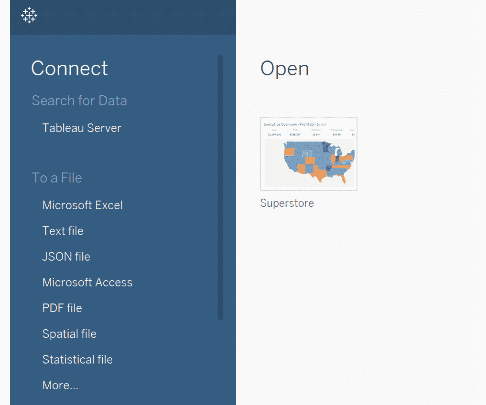

图 2.1：启动 Tableau Desktop 的起始屏幕

根据版本的不同，这个屏幕可能看起来略有不同，但大部分应该保持这种方式：你可以观察到你可以连接到多种文件选项，如 Excel、文本和 JSON 文件。你还可以连接到基于服务器的数据源，如 MySQL 和 Oracle。`已保存的数据源` 提供了与 Tableau Desktop 一起可用的示例数据源。

在接下来的练习中，你将连接到一个名为 `Sample - Superstore` 的 Excel 文件，该文件与 Tableau Desktop 一起提供。该文件包含一个 `Orders` 工作表，其中包含基于订单 ID、订单类别、运输方式和客户详情等属性的订单信息。它还有一个 `Returns` 工作表，其中包含已退回的订单。你将使用所有这些数据在本章中进行各种操作，并在 Tableau Desktop 中可视化数据。

## 练习 2.01：连接到 Excel 文件

在这个练习中，你将在 Tableau 中连接到你的第一个数据源，即`Sample - Superstore` Excel 文件。如果你已经按照*第一章*，*Tableau 简介*中提到的安装了 Tableau，那么这个文件将自动对你可用。它包含三个工作表，包括存储在`Orders`工作表中的订单级别信息，存储在`People`工作表中的客户信息，以及存储在`Returns`工作表中的订单退货信息，并且可以从本章的 GitHub 存储库中快速下载[`packt.link/14u86`](https://packt.link/14u86)。在继续练习之前，请确保在你的系统上下载此文件。

执行以下步骤以完成此练习：

1.  在`Connect`面板下，选择`Microsoft Excel`选项。

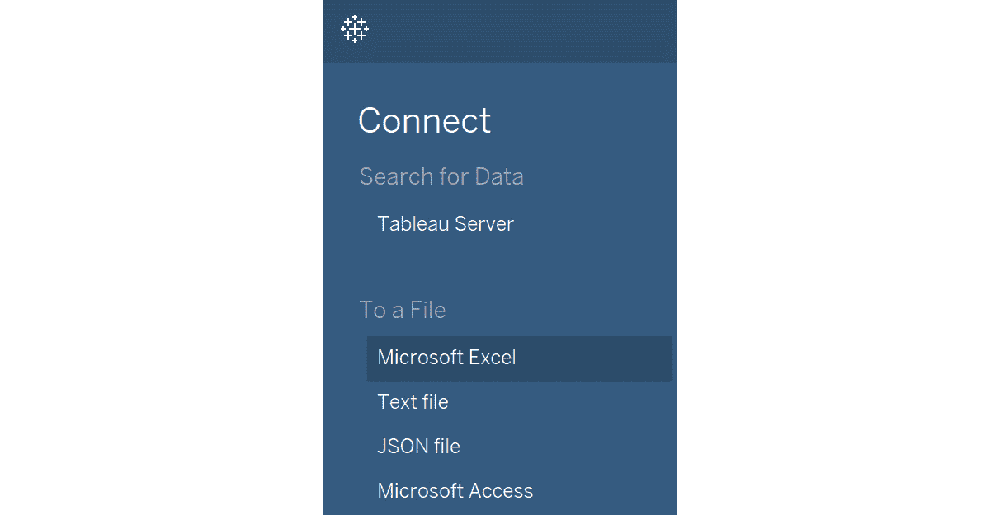

图 2.2：连接到 Microsoft Excel

1.  这将打开文件菜单，你可以从文件资源管理器中选择 Excel 文件。导航到你本地保存此文件的位置，然后选择打开`Sample-Superstore.xls`文件。文件加载后，你会看到以下屏幕：

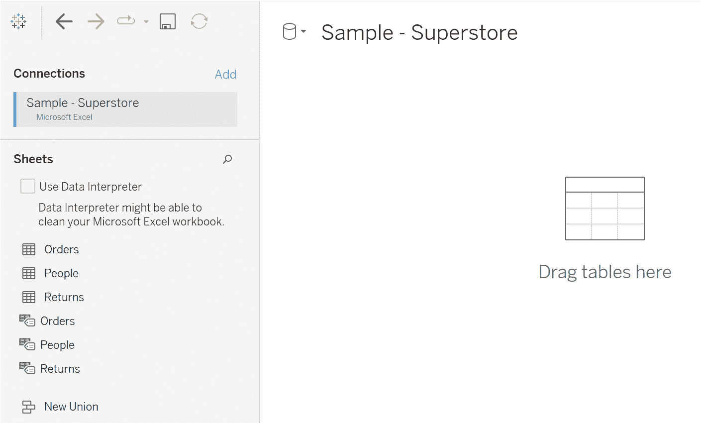

图 2.3：文件导入屏幕

1.  将鼠标悬停在表格上以获取`View data`选项（如图所示）并预览数据：

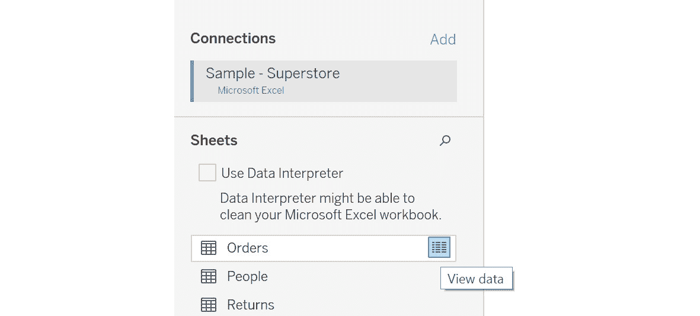

图 2.4：查看底层工作表的数据

以下图显示了数据预览：

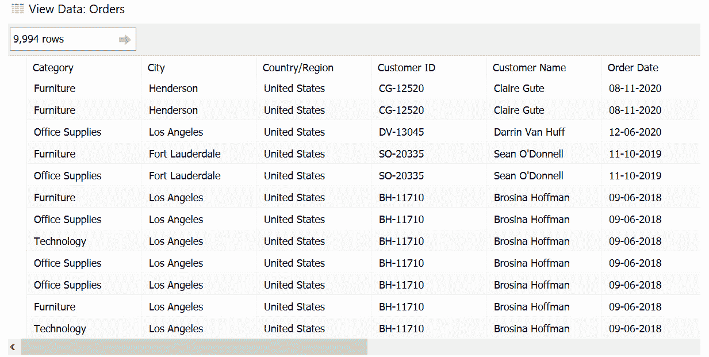

图 2.5：显示数据预览的查看数据窗口

1.  现在，将`Orders`工作表拖放到`Drag sheets here`区域。这也被称为画布。

1.  现在，工作表应该已经导入到 Tableau 中。预览数据，如图所示：

![图 2.6：导入工作表的数据预览

![img/B16342_02_06.jpg]

图 2.6：导入工作表的数据预览

因此，你已经连接并导入了 Tableau 中的数据。

1.  将鼠标悬停在`Sheet 1`上，你可以看到激活的`Go to Worksheet`选项，这意味着你可以导航到`Sheet 1`并开始创建可视化。

图 2.7：转到工作表弹出窗口

数据导入后，你可以通过点击该选项开始可视化开发，正如你将在课程中看到的。

在这个练习中，你看到了如何连接到 Excel 文件。Tableau 还允许你连接到存储在服务器上的数据。在下一节中，你将学习如何做到这一点。

## 连接到服务器数据源

这里，你将与服务器数据源中的 Microsoft SQL Server 连接。请注意，安装和维护基于服务器的数据源的概念超出了本章的范围。然而，理想情况下，在一个商业项目中，数据大多存储在服务器上。因此，了解如何连接到这些数据源非常重要。

以下步骤将帮助你连接到基于服务器的数据源：

1.  在“连接”面板下，选择`Microsoft SQL Server`选项，如图所示：

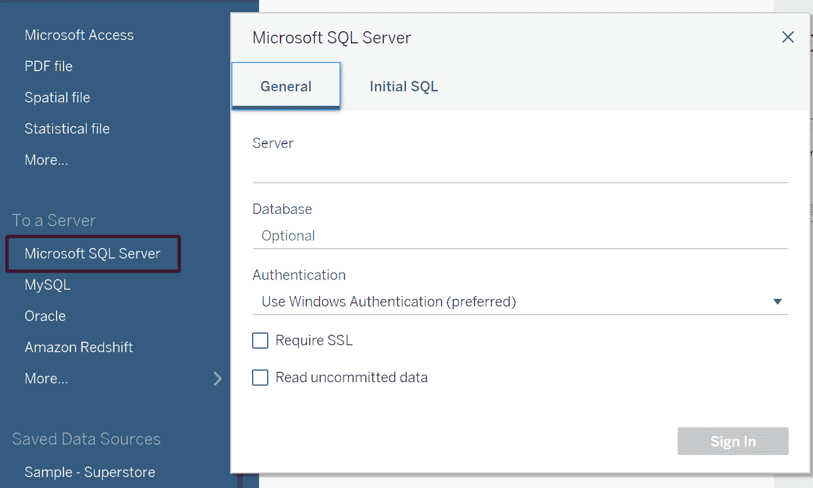

图 2.8：服务器连接输入屏幕

这里，你需要输入所需的信息，例如服务器名称和认证方法。这些详细信息可以从你的数据库管理员那里获得。

1.  点击“登录”。你将获得与*图 2.5*中看到的类似预览屏幕。之后的步骤与 Excel 连接时的步骤相同。

    注意

    这里最常见的问题之一是，有时连接到数据源的驱动程序没有安装。这可以通过从[`www.tableau.com/support/drivers`](https://www.tableau.com/support/drivers)下载和安装驱动程序来轻松解决。

在本节中，你连接到了基于服务器的数据源。下一节将介绍 Tableau 中不同类型的连接，以结合来自多个数据源的数据。

# Tableau 中的各种连接

很常见的情况是，你使用的数据将作为单独的表存储以提高效率。可能有一些字段在表中是共同的，可以用来连接数据源。

例如，假设你是一名银行贷款经理，想要评估最适合贷款的客户档案。在这里，基于客户提供的资料，例如薪资详情和工作经验，你还需要获取他们的财务历史信息，如之前的贷款、未偿还贷款或任何违约情况。这类信息可以通过使用客户 PAN 作为不同数据源之间的共同信息，从他们的 Experian 评分中获取。这就是在许多日常场景中通常如何使用连接。你将在 Tableau 中学习这些连接及其不同类型。

## 连接类型

Tableau 提供四种类型的连接，如下所示：

+   **内部**：在两个表之间的内部连接中，你只能将两个表中匹配的值组合到结果表中。例如，考虑以下表。当你使用内部连接将表 A 和表 B 连接起来时，只有公共值将作为结果表的一部分：

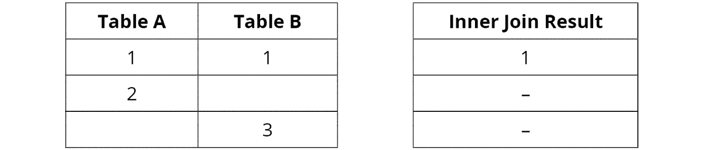

图 2.9：表 A 和表 B 之间的内部连接

+   **左连接**：左连接将左表的所有值与右表匹配的值结合起来。如果没有匹配的值，这些行将在结果表中包含空值。在以下示例中，当你使用左连接将表 A 和表 B 连接起来时，表 A 的所有值和表 B 的公共值将包含在结果表中：

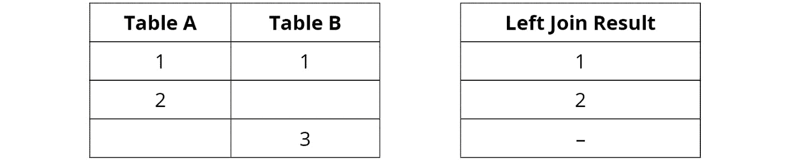

图 2.10：表 A 和表 B 的左连接

+   **右连接**：这是左连接的相反。右连接将右表的所有值与左表匹配的值结合起来。如果没有匹配的值，这些行将在结果表中包含空值。考虑以下表格。当你使用右连接将表 A 和表 B 连接起来时，表 B 的所有值和表 A 的公共值将包含在结果表中：

图 2.11：表 A 和表 B 的右连接

+   **全外连接**：在两个表的全外连接中，你可以将左表和右表的所有值合并到一个结果表中。如果任何表中的值不匹配，这些行将在结果表中包含空值。

考虑以下表格。在这里，当你使用内连接将表 A 和表 B 连接起来时，只有公共值将包含在结果表中：

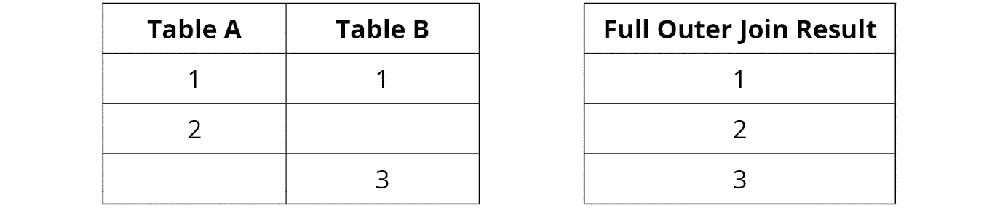

图 2.12：表 A 和表 B 的全外连接

+   **并集**：在并集中，你将具有相似列结构的两个或多个表合并成一个单一的结果表。并集是在你只想将数据追加到具有相似列的其他数据下方而不是进行连接时执行的。并集的一个非常常见的例子是当你有两个包含相似列但分别在不同年份维护的表时，例如，将多年订单信息合并到一个综合数据集中。

+   考虑以下表格，例如。在这里，当你创建表 A 和 A1 的并集时，你会得到一个包含 A 和 A1 两个表值的单一表：

图 2.13：表 A 和表 B 的并集

你将在以下练习中详细了解这些连接类型。

## 练习 2.02：创建内连接数据集

作为一名分析师，你可能会遇到需要显示两个表之间公共记录的场景。本练习旨在展示如何在 Tableau 中将两个不同的工作表合并成一个单一的数据源。

你将使用内连接将`Orders`表与`People`表连接起来。通过这样做，你将能够识别出`People`表中的客户记录以及`Orders`表中的订单信息，这将帮助你了解客户的购买偏好。

执行以下步骤以完成此练习：

1.  按照与 *练习 2.01* 中相同的方式将 `Sample – Superstore` 数据集加载到您的 Tableau 实例中。

1.  首先将 `Orders` 表从 `Sheets` 区域拖到 `Drag Sheets here` 区域，然后是 `People` 表。或者，要添加这些表，您可以双击它们，它们将自动添加到画布区域。Tableau 将使用内连接自动连接这两个表，如图所示：

![图 2.14：使用内连接进行数据连接

![图片 B16342_02_14.jpg]

图 2.14：使用内连接进行数据连接

1.  点击 `Join` 符号打开 `Join` 菜单：

![图 2.15：内连接属性

![图片 B16342_02_15.jpg]

图 2.15：内连接属性

注意连接数据的不同方式。默认情况下，Tableau 在公共字段名称上执行内连接：

![图 2.16：各种连接选项

![图片 B16342_02_16.jpg]

图 2.16：各种连接选项

注意

这些说明和图像基于 Tableau 版本 2020.1。如果您使用的是 Tableau 的后续版本，例如 2021.4，此过程可能看起来相当不同，甚至可能需要额外步骤。您可以在以下 URL 找到有关此内容的额外指导：[`help.tableau.com/v2021.4/pro/desktop/en-gb/datasource_relationships_learnmorepage.htm`](https://help.tableau.com/v2021.4/pro/desktop/en-gb/datasource_relationships_learnmorepage.htm)

1.  如果没有公共名称，请手动选择列以启用连接。由于您正在连接 `Orders` 和 `People` 表，请在 `Orders` 中选择 `Customer Name` 列，在 `People` 中选择 `Person` 列进行连接。首先，取消选择 Tableau 自动选择的 `Region`，为此，请点击 `Region` 并从下拉菜单中选择 `Customer Name`，如图所示：

![图 2.17：更改连接列

![图片 B16342_02_17.jpg]

图 2.17：更改连接列

![图 2.18：内连接的最终结果

![图片 B16342_02_18.jpg]

图 2.18：内连接的最终结果

1.  对 `People` 表重复相同的操作，并选择 `Person` 作为连接列。您的连接列应如下所示：

![图 2.19：订单和人员表的预览数据

![图片 B16342_02_19.jpg]

图 2.19：订单和人员表的预览数据

现在是验证结果的时候了。这可以在底部区域的网格屏幕中观察到。

您可以看到连接数据集中只有 `58` 行。在这里，只有与 `People` 表的 `Person` 列匹配的 `Orders` 表的 `Customer Name` 列的值将返回到最终数据集中。由于 `Person` 表只有四个值，因此只有与这四个值匹配的 `Customer Name` 列的值将从 `Orders` 表中返回。

在此练习中，您使用了内连接并分析了使用此连接类型返回的结果。接下来，您将了解左连接类型。

## 练习 2.03：创建左连接数据集

在这个练习中，你将使用左连接将`Orders`表与`People`表连接起来。左连接的目标是验证`People`表中存在多少客户信息。这将帮助你识别和更新`People`表，以便你可以扩展客户数据库，从而推动更好的销售：

![图 2.20：订单和人员表的连接界面

![图片 B16342_02_20.jpg]

图 2.20：订单和人员表的连接界面

1.  重复上一个练习中的步骤，将`Orders`和`People`表拖到画布上。完成后，你应该会看到以下连接选项：

1.  将连接类型更改为`Left`：

![图 2.21：选择左连接

![图片 B16342_02_21.jpg]

图 2.21：选择左连接

1.  现在，在数据预览（如图所示），向右滚动。你会看到来自`People`表的两个列，`Person`和`Region`。使用`排序`图标对值进行排序，如图所示：

![图 2.22：分析左连接结果

![图片 B16342_02_22.jpg]

图 2.22：分析左连接结果

1.  滚动以查看如果`Customer`名称与`Person`列中的任何值不匹配会发生什么。

![图 2.23：连接结果中的空值

![图片 B16342_02_23.jpg]

图 2.23：连接结果中的空值

你会观察到没有找到匹配的行会被替换为一个`null`值，这意味着`Person`表不包含这些客户的信息。这意味着你可以将此客户信息添加到`People`表中以提高数据质量。

在这个练习中，你学习了如何执行左连接以及两个表之间如何匹配数据。接下来，你将了解右连接类型。

## 练习 2.04：创建右连接数据集

在这个练习中，你将使用右连接将`Orders`表与`People`表连接起来。考虑一个场景，其中`People`表包含所有之前购买过你公司产品的客户，你希望通过`Orders`表中的信息获取客户购买产品的完整列表。这将帮助你根据客户的过去购买了解他们的购买习惯。

完成此练习的步骤如下：

1.  将`Orders`和`People`表拖动到画布上，与上一个练习中的方法类似，以便你可以在屏幕上看到以下内容：

![图 2.24：订单和人员表的连接界面

![图片 B16342_02_24.jpg]

图 2.24：订单和人员表的连接界面

1.  选择如图所示的`Right`连接：

![图 2.25：选择右连接

![图片 B16342_02_25.jpg]

图 2.25：选择右连接

1.  现在，在数据预览中，向右滚动。你会看到来自`People`表的`Person`和`Region`列。使用`排序`图标对值进行排序，如图所示：

1.  ![图 2.26：分析右连接结果

    ![img/B16342_02_26.jpg]

图 2.26：分析右连接结果

你会观察到`People`表中的行包含有关有历史订单的顾客的信息。这现在可以帮助你分析一个人倾向于经常购买哪些产品，相应地，你可以向他们推荐类似的产品，以实现更精准的销售策略。

在这个练习中，你在两个表上执行了右连接，并看到了如何使用右连接的结果来分析数据。接下来，你将了解全外连接。

全外连接将合并两个连接表的查询结果到一个单一的数据集中。在 Tableau 中，你可以使用连接属性并将连接类型更改为`Full Outer`。

![Figure 2.27: Selecting the Full Outer join

![img/B16342_02_27.jpg]

图 2.27：选择全外连接

接下来要介绍的是联合操作。在联合操作中，新表将在最终数据集中追加到前一个表的下方。通常，联合用于当你想要结合具有共同列结构的数据集时。例如，可以使用联合将 2021 年的订单信息与 2020 年的订单信息结合起来，以获得统一的数据集。

在下一个练习中，你将学习如何在 Tableau 中实现联合。

## 练习 2.05：使用联合创建组合数据集

考虑一个与沃尔玛或亚马逊等在多个地区运营的大型零售商相关的场景。在这种情况下，在地区级别存储数据更有意义，以便它可以包含针对该特定地区的定制产品。如果你要比较不同地区之间的表现，你需要将这些不同的数据源合并到一个数据集中。这就是联合概念发挥作用的地方。

在这个练习中，你将使用按地区划分的`Orders`表。不同地区的文件与`Orders`表具有相似的列结构，但根据地区被分到不同的工作表中，如下图所示：

![Figure 2.28: Input data for the Orders table preview stored as different tabs

![img/B16342_02_28.jpg]

图 2.28：以不同标签存储的`Orders`表输入数据预览

你有两个地区的相关数据：`Central`和`West`。你可以通过以下步骤实现联合，将这两个地区合并成一个单一的数据集：

1.  在你的本地机器上保存文件。使用保存文件的路径中的`Connect`选项加载`Union` Excel 文件，就像之前的练习一样。文件导入后，你应该会看到以下屏幕：

![Figure 2.29: Orders table for the Central and West regions

![img/B16342_02_29.jpg]

图 2.29：中央和西部地区的`Orders`表

1.  双击`New Union`选项以打开`Union`弹出窗口，如下图所示：

![Figure 2.30: New Union popup

![img/B16342_02_30.jpg]

图 2.30：新联合弹出窗口

1.  将两个订单表拖动到`联合`弹出窗口中，如下所示：

![图 2.31：在联合中添加表]

![img/B16342_02_31.jpg]

图 2.31：在联合中添加表

1.  点击`确定`将联合添加到数据网格中。

你现在可以预览底部部分的数据。Tableau 会将两个表中的数据合并为一个单一的数据源。

![图 2.32：联合数据预览]

![img/B16342_02_32.jpg]

图 2.32：联合数据预览

1.  将数据预览向右滚动。你会看到两个额外的列——即`Sheet`和`Table Name`。`Sheet`表示这些数据属于哪个 Excel 文件的工作表，而`Table Name`指的是 Tableau 中的表名。这可以用来快速识别哪些列来自哪些工作表和表。

![图 2.33：联合结果中的表识别列]

![img/B16342_02_33.jpg]

图 2.33：联合结果中的表识别列

在这个练习中，你学习了如何执行多个数据源的联合。

在所有前面的练习中，你只连接了两个数据源。你可以添加超过两个数据源。你只需在连接连接中指定表如何相互连接即可。

![图 2.34：使用两个以上表进行连接]

![img/B16342_02_34.jpg]

图 2.34：使用两个以上表进行连接

前面的图示显示了在`Orders`表上与`People`和`Returns`表进行联合的示例。如果`Returns`和`People`表之间存在公共字段，你也可以根据你的要求将这两个表联合起来。

这就完成了在 Tableau 中连接多个表的各种方法，并结束了关于将多个来源的数据组合在一起的各种方法的讨论。以下各节将处理准备你的数据以进行你所需任务的工作。

# 数据面板中的数据转换

一旦你完成数据的合并，你可能还需要进行一些数据调整，例如重命名某些列或限制用于你的可视化的数据。这些都是一些常见的数据转换示例。

数据转换是准备数据以进行有效可视化的关键步骤。在本节中，你将了解一些常用的数据转换方法。特别是，你将了解以下内容：

+   数据解释器

+   重命名数据源

+   实时和提取连接

+   过滤器

+   数据网格选项

+   自定义 SQL

以下各节将逐一定义这些内容。

## 数据解释器

数据解释器是 Tableau 中可用的一项选项，通过删除标题、表头和额外的空行，仅提取 Excel 数据源的实际行和列。

你有时可以添加额外的行来描述工作表包含的数据类型，或者添加一些空列以提高工作表的可读性。考虑以下示例。假设你在`Sample - Superstore`文件中添加了某些注释，如下所示：

![图 2.35：理解数据解释器]

![img/B16342_02_35.jpg]

图 2.35：理解数据解释器

从数据可视化的角度来看，第 1 到 3 行是无意义的，因为它们不属于实际数据，仅仅是标题。Tableau 可以通过使用数据解释器自动删除这些行。

可以通过选择`使用数据解释器`选项来启用数据解释器：

![图 2.36：启用数据解释器]

![图片 B16342_02_36.jpg]

![图 2.36：启用数据解释器]

启用后，数据解释器将为您提供`查看结果`选项。单击`查看结果`将打开一个 Excel 表格，显示数据解释器所做的所有更改，如图所示：

![图 2.37：查看数据解释器的结果]

![图片 B16342_02_37.jpg]

![图 2.37：查看数据解释器的结果]

## 重命名数据源

您可以在`连接`屏幕上通过单击它并输入您选择的名字来重命名数据源。

![图 2.38：重命名数据源]

![图片 B16342_02_38.jpg]

![图 2.38：重命名数据源]

当处理数据源时，您希望快速识别您正在处理哪些表。重命名表允许您为它们提供自定义名称，这样就可以更容易地与它们一起工作。

## 实时和提取连接

这是 Tableau 数据可视化中的一个非常重要的概念。此选项决定了数据如何连接到可视化中。

实时连接允许 Tableau 工作表根据底层数据源中进行的任何更改实时更新。当数据必须实时更新时，例如股市数据，这可能是一个很好的解决方案。

然而，当在实时连接中开发可视化时，数据库将查询与数据相关的任何更改。这可能会消耗更多时间。

**Tableau 数据提取**（**TDEs**）或**提取**，是一种压缩和优化的方式，将所有源数据带入 Tableau 的内存中。TDEs 提高了数据查询的效率，这往往增加了在可视化中处理数据以及执行用户交互活动（如对数据进行过滤和排序）时的执行速度。

当在提取连接中开发可视化时，数据库也会提取到 Tableau 的本地内存中。因此，任何可视化开发都将比实时连接快得多。

## 练习 2.06：创建数据提取

在前面的练习中，您使用实时连接连接到数据。现在，您将为其创建一个提取。以下步骤应执行以创建`Orders`表的数据库提取：

1.  将`Sample – Superstore`数据集加载到您的 Tableau 实例中，就像之前的练习中所做的那样。

1.  将`Orders`表拖到画布上。

1.  选择以下图所示的`提取`选项：

![图 2.39：创建提取]

![图片 B16342_02_39.jpg]

![图 2.39：创建提取]

1.  完成后，点击页面底部的`Sheet 1`导航到该工作表。

图 2.40：导航到工作表

1.  这将打开一个弹出窗口以在本地保存提取。选择您选择的任何位置以保存提取。

图 2.41：提取创建和保存

点击“保存”将创建提取并将其保存在指定的位置。还有一个“编辑”选项，可以用来编辑提取的属性。您将在下一节学习这些内容。

1.  如果您的数据发生变化，请使用“编辑”或“刷新”选项刷新您的提取，如图所示：

图 2.42：提取编辑和刷新选项

在这个练习中，您使用 Tableau Desktop 创建了一个提取。

## 提取属性

要访问提取属性，您可以点击“提取”旁边的“编辑”选项，如图 2.42 所示，以打开以下窗口：

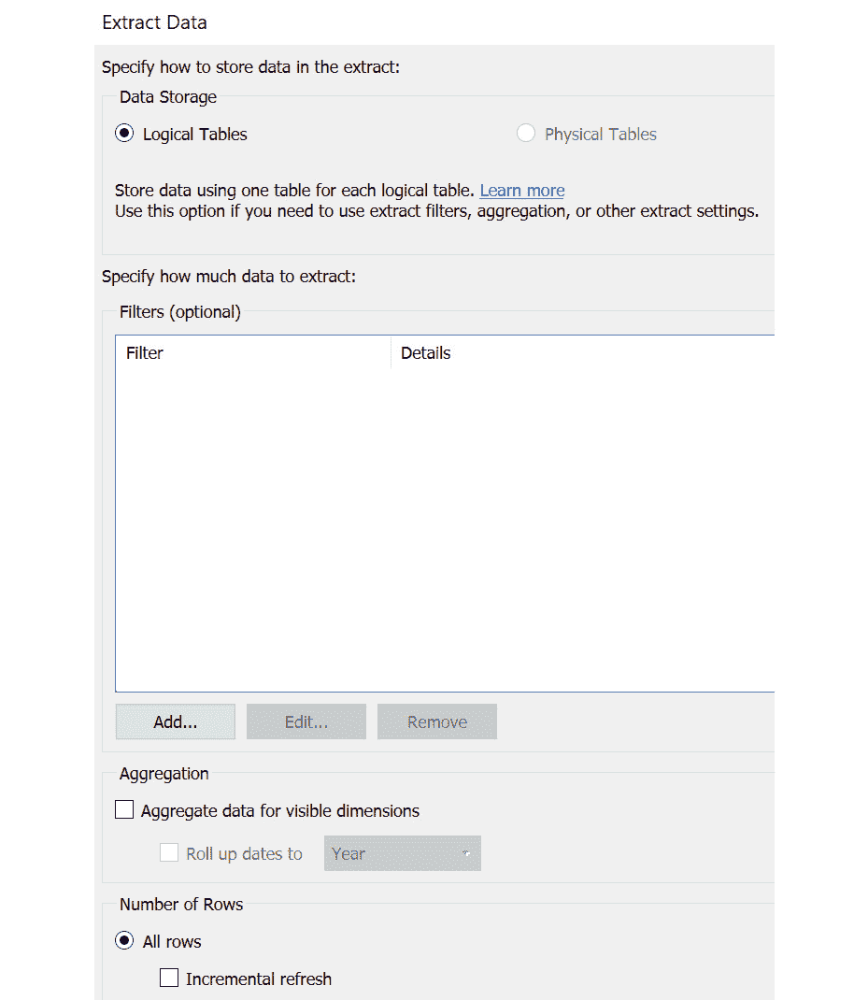

图 2.43：提取编辑属性

以下章节将详细描述此窗口及其字段。

### 数据存储字段

如果您有多个表，将启用“多个表”选项。目前，由于您只有一个表，所以“单个表”选项被启用。

### 筛选器字段

您可以使用筛选器限制提取中的数据。例如，假设您只想为“中央”和“东部”地区的数据；您可以使用“添加...”选项轻松做到这一点。选择“区域”作为筛选的列，并选择“中央”和“东部”值以将它们添加为筛选条件。

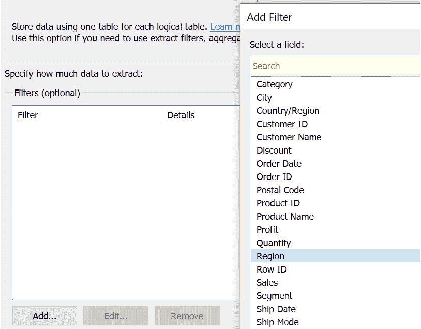

图 2.44：添加筛选条件

如以下图所示，应选择“中央”和“东部”地区：

图 2.45：选择中央和东部地区

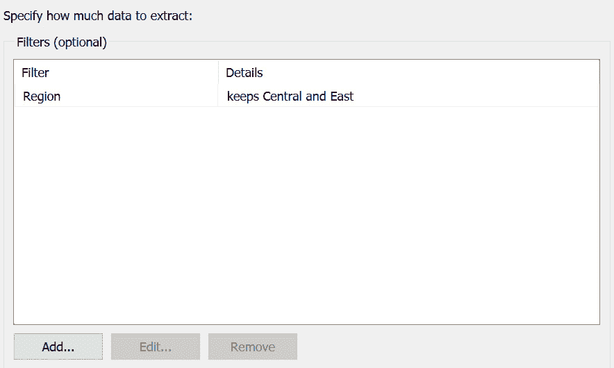

图 2.46：使用区域列创建提取筛选器

随着您在本章的进展，您将了解更多关于这些筛选器的信息。

### 聚合字段

您也可以使用此选项更改数据的粒度。如果您数据集中的日期在“日”级别，您可以使用不同的选项，如“月”或“年”，将它们汇总或聚合到更高的级别。您将在本书后面的章节中了解更多关于聚合的内容。

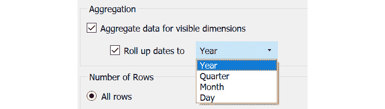

图 2.47：转换数据聚合级别

### 行数字段

使用此选项，你可以选择提取应包含的行数。`所有行`将包括所有行，`顶部`将仅包括指定的行数，而`样本`将包含指定行数的样本。当你处理一个非常大的数据集时，这很有用，但在开发目的上，你只需要数据的样本。

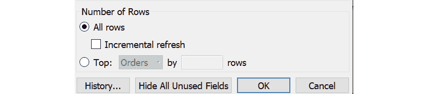

图 2.48：使用行数进行样本选择

在选择`所有行`时，你还将获得一个名为`增量刷新`的选项。你不必每天刷新数据，可以使用此选项指定哪个字段可以用来识别新行，这样只有指定的数据部分会被刷新。当你的数据集非常大且定期更新，而旧数据不发生变化时，此选项非常有用。

考虑银行交易的情况。银行永远不会修改旧数据，但会持续添加新数据以保持历史数据。在这种情况下，在提取刷新期间进行增量刷新将非常有帮助。

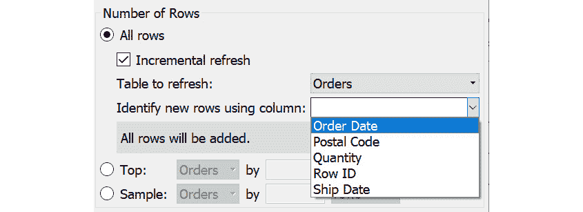

图 2.49：识别用于刷新的列

现在你已经了解了在这些字段中应添加哪些值，接下来你将回顾选择连接类型时应考虑的因素。

### 哪种连接更好——实时还是提取？

理想情况下，在大多数项目中，提取数据是最佳方法，但可能需要展示实时数据，就像你之前看到的例子一样。在选择提取或实时连接之前，应考虑以下要点：

+   **更新或延迟的数据**：如果你需要在查看仪表板时始终需要最新的信息，你需要一个实时连接。否则，如果你对最新数据的延迟感到满意，提取是一个更好的选择。

+   **数据量**：如果你的数据量非常大，使用数据提取而不是实时连接是理想的，因为可能需要花费很多时间在实时连接上开发仪表板。

考虑到这些要点，你可以为你的项目选择正确的连接类型。

## 过滤器

此选项类似于你之前了解到的`提取过滤器`属性。这些过滤器也被称为数据源过滤器，因为它们在数据源处过滤数据。你将在本书的后面进一步学习各种过滤器。

考虑像亚马逊这样的大型零售商的例子，其数据量很大。假设你想分析特定区域的数据。在这种情况下，将整个数据集拉入 Tableau 是不明智的，因为这会使仪表板变慢，而且除了你的目标区域之外，你不会对数据有任何用途。

对于此类情况，您可以使用`数据源过滤`选项。这将限制数据源本身的数据，并根据指定的过滤标准仅引入所需的数据。

## 练习 2.07：在订单表上添加区域过滤

考虑到您想在`Orders`表上添加一个`Region`过滤条件，仅显示`Central`和`East`区域的数据。您可以通过以下步骤实现：

1.  在您的 Tableau 实例中加载`Sample - Superstore`数据集。

1.  将`Orders`表拖动到画布上。

1.  要添加过滤条件，请点击`过滤` | `添加`选项打开弹出窗口：

![图 2.50：数据源过滤属性]

![图片 B16342_02_50.jpg]

图 2.50：数据源过滤属性

1.  点击`添加...`打开列列表。选择`Region`作为列：

![图 2.51：列过滤选择]

![图片 B16342_02_51.jpg]

图 2.51：列过滤选择

1.  选择`Central`和`East`作为要保留在数据中的区域。点击`确定`添加过滤条件，如下所示：

![图 2.52：选择过滤值]

![图片 B16342_02_52.jpg]

图 2.52：选择过滤值

您可以通过点击`添加...`选项并重复前面的步骤来添加更多过滤条件。

1.  您还可以编辑和删除现有的过滤条件。要这样做，选择您想要编辑或删除的过滤条件，然后选择所需的选项，如图所示：

![图 2.53：过滤预览]

![图片 B16342_02_53.jpg]

图 2.53：过滤预览

1.  一旦您添加了过滤条件，请在数据网格中预览数据。您将观察到您只有`Central`和`East`区域的数据，正如预期的那样。

![图 2.54：数据预览后过滤应用]

![图片 B16342_02_54.jpg]

图 2.54：数据预览后过滤应用

在这个练习中，您学习了如何应用过滤条件以及与数据源过滤条件相关的各种属性。在下一节中，您将学习如何使用数据网格进行数据转换。

## 数据网格选项

数据网格允许您预览数据。到目前为止，您只是用它来检查数据包含的行数，但它还包含在开始可视化开发之前转换数据的其他选项。在本节中，您将了解这些选项以及如何使用它们来更好地理解数据转换。

**数据预览**：您可以使用此功能预览数据。您还可以通过在右侧的框中指定数字来选择要显示的行数，如图所示：

![图 2.55：数据预览切换]

![图片 B16342_02_55.jpg]

图 2.55：数据预览切换

**元数据**：元数据提供了有关源的信息，例如表名。切换到元数据视图，您可以看到有关数据的所有元数据。您可以查看不同的列、它们来自的表以及远程字段名称。

如果您在此处重命名字段，远程字段名称将显示从数据中提取的原始字段名称。

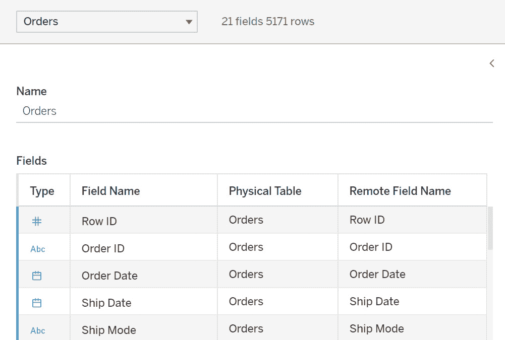

图 2.56：更改为列表视图表示以显示输入数据源元数据属性

备注

在 Tableau 版本 2021.4 中，元数据将自动显示在预览旁边，您无需在这些选项之间进行选择。

“排序字段”选项将根据您选择的选项对数据进行排序。您可以尝试更改这些选项，并观察数据预览如何变化。

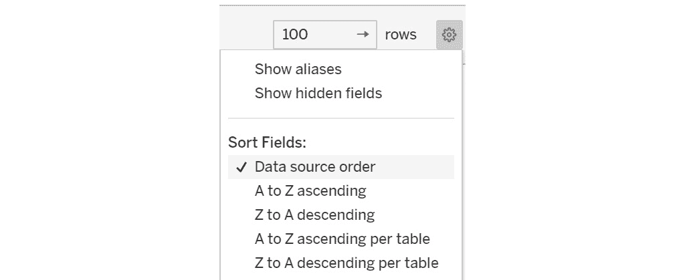

图 2.57：排序数据网格列值

现在，考虑以下数据转换选项。

`Abc` 图标（见下图），您可以从下拉框中选择列所需的数据类型。一个常见的例子是将“客户 ID”字段存储为数字，而您可能希望它是一个字符串：

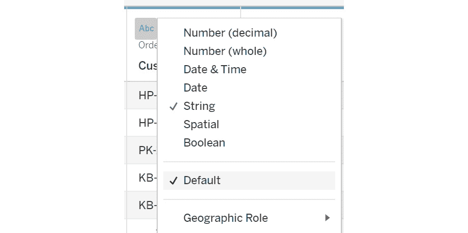

图 2.58：数据类型更改选项

**数据转换**：当您点击下图中所示的下拉图标时，您可以看到转换数据的选项，例如在现有列上创建计算字段和创建组。所有这些选项在加载数据后也都可用。这些内容将在本书的后续章节中详细说明：

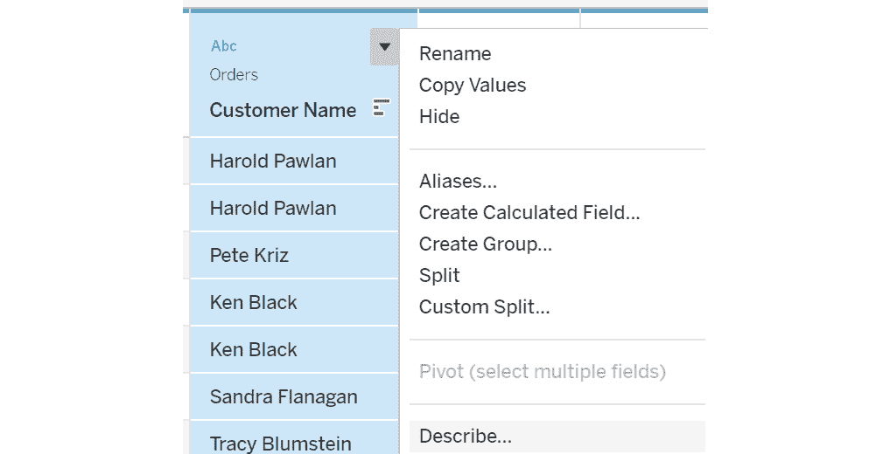

图 2.59：数据转换菜单选项

“重命名”选项允许您重命名列。如果该列在数据可视化中不需要，您也可以隐藏它。您可以通过选择“显示隐藏字段”复选框来查看任何隐藏的列。隐藏的列在视图中将以灰色显示，如下图所示：

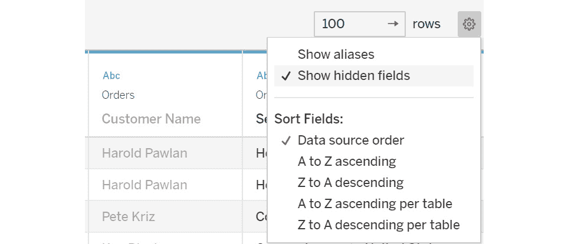

图 2.60：显示隐藏字段

隐藏的列不能用于可视化。如果您想隐藏列后使用该列，您需要首先取消隐藏列，以便在可视化中使用它。这可以通过点击下拉菜单并选择“取消隐藏”选项来完成。

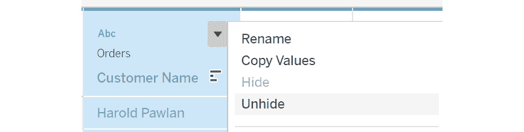

图 2.61：从输入数据源隐藏/取消隐藏列

**别名**：别名是呈现数据的一种非常有效的方法，可以在可视化中使用不同的名称。

观察数据预览中的“运输方式”列。您可以看到“类别”一词在不同的“运输方式”值中重复出现，并且它没有增加任何价值；因此，您可以从所有值中排除这个词。这可以通过使用“别名”选项来完成，这将帮助您以不同的名称显示值。要在列上添加别名，请点击下拉菜单并选择“别名...”，如下图所示：

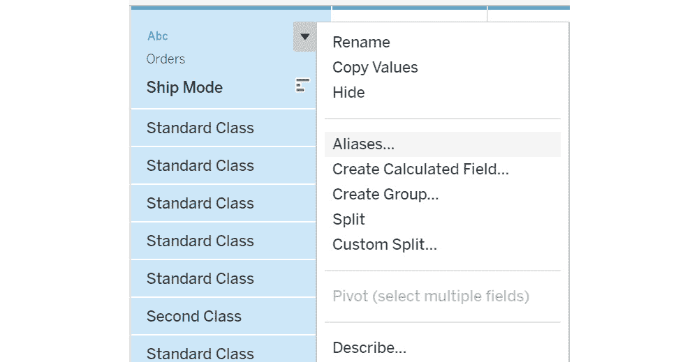

图 2.62：设置列值别名

这将打开弹出窗口以重命名值。删除单词`Class`。点击“确定”将其添加到数据中。您还可以使用“清除别名”选项清除别名。

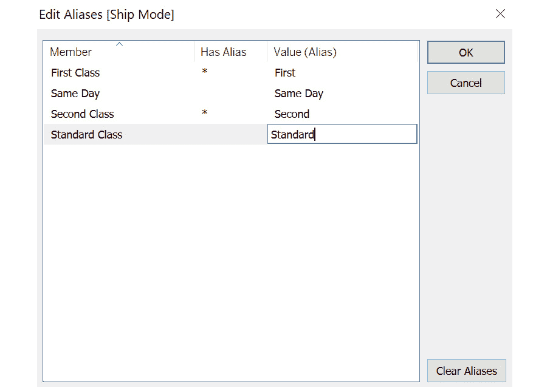

图 2.63：编辑别名属性

您可以使用“显示别名”切换按钮在原始名称和别名之间切换。别名通常用于将空记录重命名为空白或包含长值名称的列。

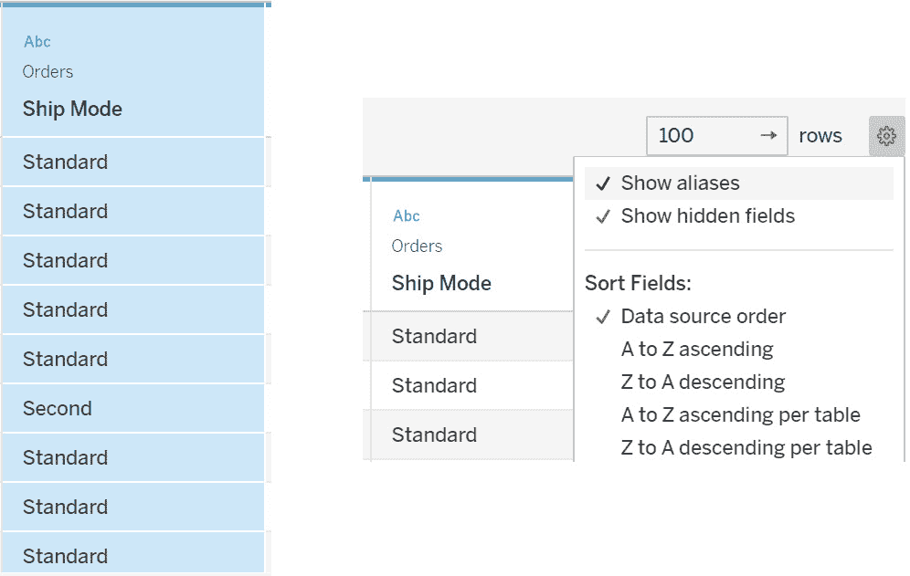

图 2.64：使用“显示别名”选项在数据预览中启用别名

所有这些选项在您将数据加载到工作表中后也可用。

在此视图中，您学习了如何在工作表中提取数据之前执行数据转换。

在之前的所有练习中，您只是连接了两个数据源。但也可以添加超过两个数据源。您只需在连接连接中指定表如何相互连接。

这就完成了您可以在 Tableau 中连接多个表的各种方式。接下来，您将学习有关自定义 SQL 选项的内容。

## 自定义 SQL

如其名所示，自定义 SQL 用于编写自定义 SQL 查询，根据应用的条件仅提取所选列，而不是提取整个数据库。此选项在 Excel 和文本文件中不可用，因此您可能看不到此选项。

一旦连接到数据库，此选项将出现在“连接”面板中。当您连接数据库时，您将在所有列下面看到“新自定义 SQL”选项。

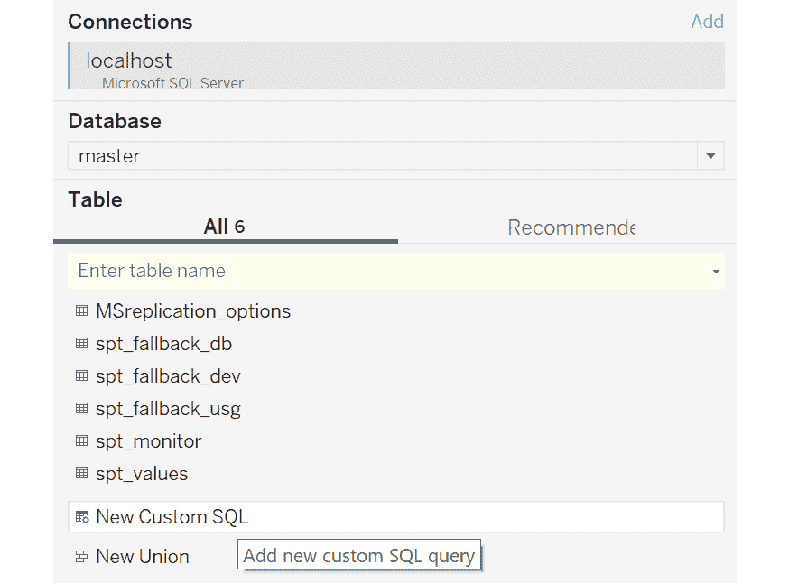

图 2.65：新的自定义 SQL 选项

您可以将此选项拖到画布上，输入您的查询，然后点击“确定”。完成后，Tableau 将根据指定的查询提取所需数据。

自定义 SQL 可以通过仅添加数据源中的所需列、在表中添加联合以及将字段重新铸造成连接多个数据源在一起来减少数据大小。

到目前为止，您已经学习了在将数据拉入工作表之前可以执行的各种数据转换步骤。在下一节中，您将学习有关数据混合的内容，这是另一种连接数据的方式，但有所不同。

# 数据混合

有时候，链接字段在不同工作表中可能不同。此外，如果数据源太大，使用传统连接可能会非常耗时。在这种情况下，您可以选择数据混合而不是连接数据。

在数据混合中，您将在两个数据源之间查询数据，然后在主数据源工作表中定义的聚合级别上组合结果。主数据源将是第一个维度或度量值添加到视图中的数据源。此外，结果将与左连接相似，因为主数据源的所有记录都将出现在工作表中。

## 练习 2.08：使用 Orders 和 People 表创建数据混合

在这个练习中，您将学习如何使用`People`表创建`Orders`表的数据混合。以下步骤将帮助您完成此练习：

1.  在您的 Tableau 实例中加载`Sample – Superstore`数据集。

1.  连接到`Orders`表并转到`Sheet 1`。

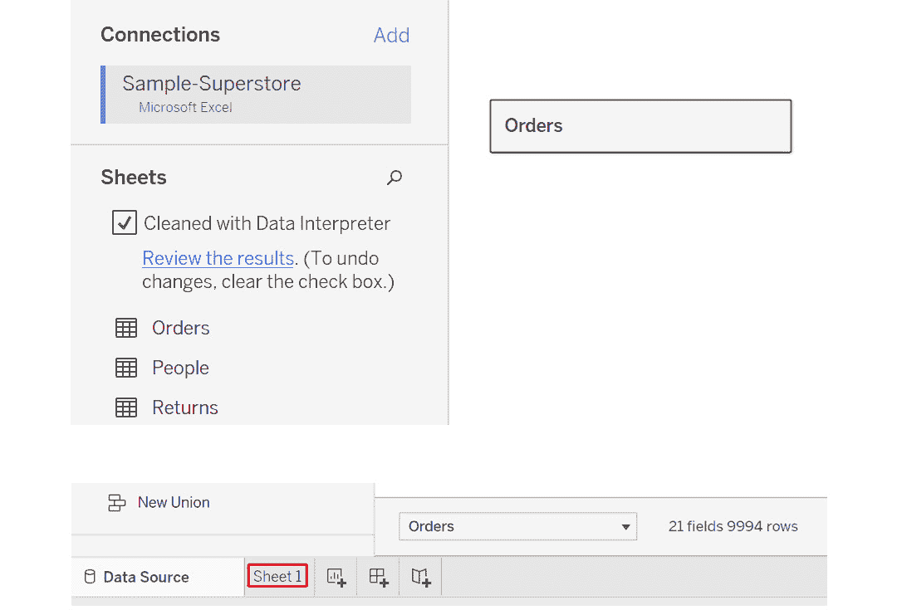

图 2.66：在 Tableau 中添加 Orders 表

1.  在数据混合中，在工作表级别创建链接，而不是在数据源级别。在工作表中，您将能够看到`Orders`表及其列。添加一个新的数据源，如下（见突出显示的选项）：

图 2.67：在工作表中添加数据选项

1.  这应该会引导到与连接数据源相同的菜单。点击`Microsoft Excel`，导航到`Sample – Superstore.xls` Excel 文件的位置，然后点击`打开`以打开`连接`面板。

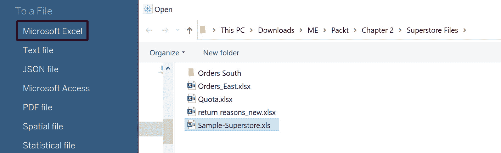

图 2.68：在 Tableau 中添加另一个数据源

1.  现在，将`People`表拖到画布上，并像之前一样转到`Sheet 1`：

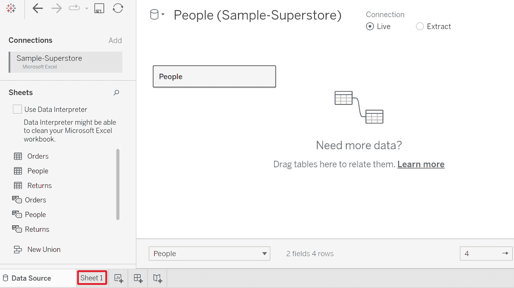

图 2.69：将 People 数据添加到 Tableau

现在，您将能够看到两个数据源，如下所示：

图 2.70：工作表中列出的数据源

1.  在使用这些数据源之前，添加它们之间的关系。为此，请点击`数据` | `编辑关系…`以打开弹出窗口。

    注意

    如果您使用的是 2020.1 之后的 Tableau 版本，这可能被称为`编辑混合关系...`以区分在`数据源`选项卡中直接创建的关系。

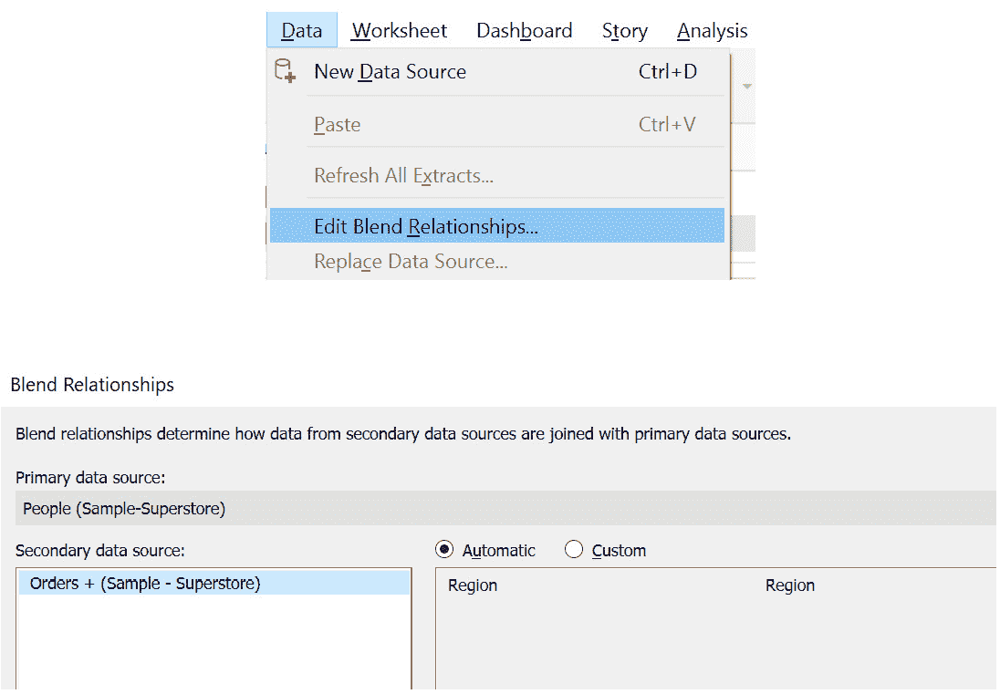

图 2.71：编辑数据属性窗口

1.  根据字段名称，默认可以将关系设置为`自动`。要更改它，请点击`自定义`并添加关系。将关系编辑为`Customer Name`和`Person`，如图所示。选择`Region`然后点击`编辑…`在弹出窗口中进行选择。点击`确定`以添加关系：

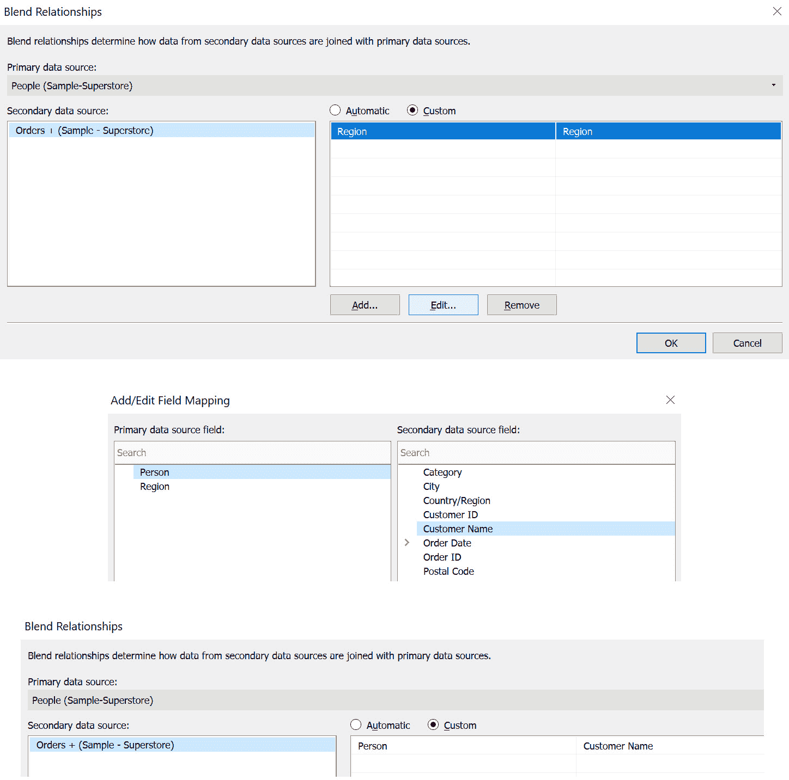

图 2.72：选择两个数据源之间的匹配列

因此，你已经成功混合了两个数据源，可以在下一个练习中可视化你的数据。

## 练习 2.09：可视化数据混合创建的数据

在上一个练习中，你学习了如何在两个数据源之间执行数据混合。在这个练习中，你将在混合数据上创建一个可视化，以了解数据混合的应用——同样，你将继续使用`Orders`表和`People`表来完成此目的。请注意，只有当你使用这两个数据源的字段时，混合才会激活；否则，它将保持不活动状态。

执行以下步骤以完成此练习：

1.  在`Orders`数据上，点击并拖动`Customer Name`到`行`。

    注意

    2020.1 版本之后的 Tableau 可能会在此步骤给出警告，表示字段可能包含超过 1000 行。如果是这种情况，请选择`添加所有成员`以继续。

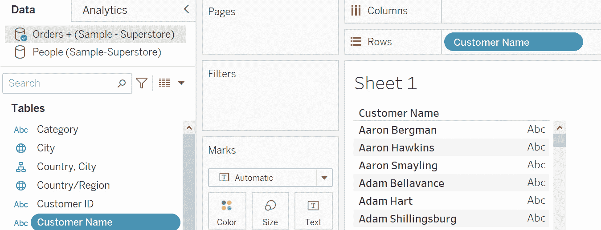

图 2.73：添加主要数据源

这现在将成为你的主要数据源，数据源上的蓝色勾选标记表示。

1.  为`People`数据源重复此步骤。

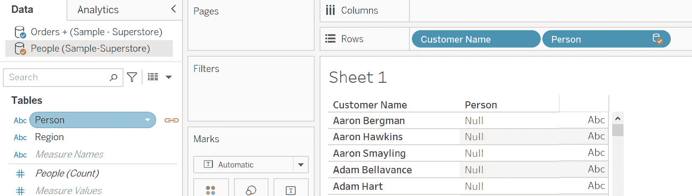

图 2.74：添加次要数据源

这将成为你的次要数据源，数据源上的橙色勾选标记表示。同时，请注意用于链接两个数据源的红色链接图标。

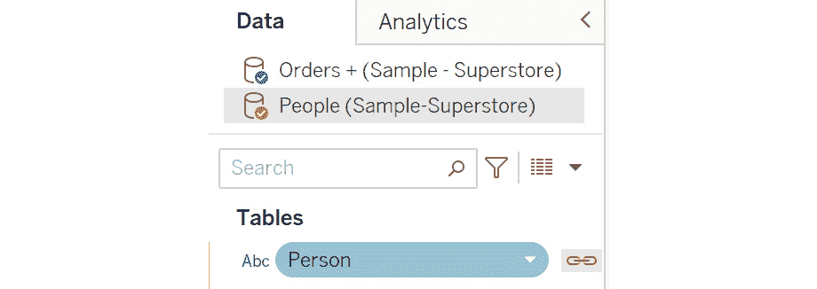

图 2.75：主要和次要数据源图标

1.  当你为`People`数据中的四个人的`Person`进行过滤时，你会看到你已经在这些数据源之间链接了这些值。点击`Person`列的下拉菜单，然后点击`过滤…`，取消选择`空值`，然后点击`确定`以添加过滤器。

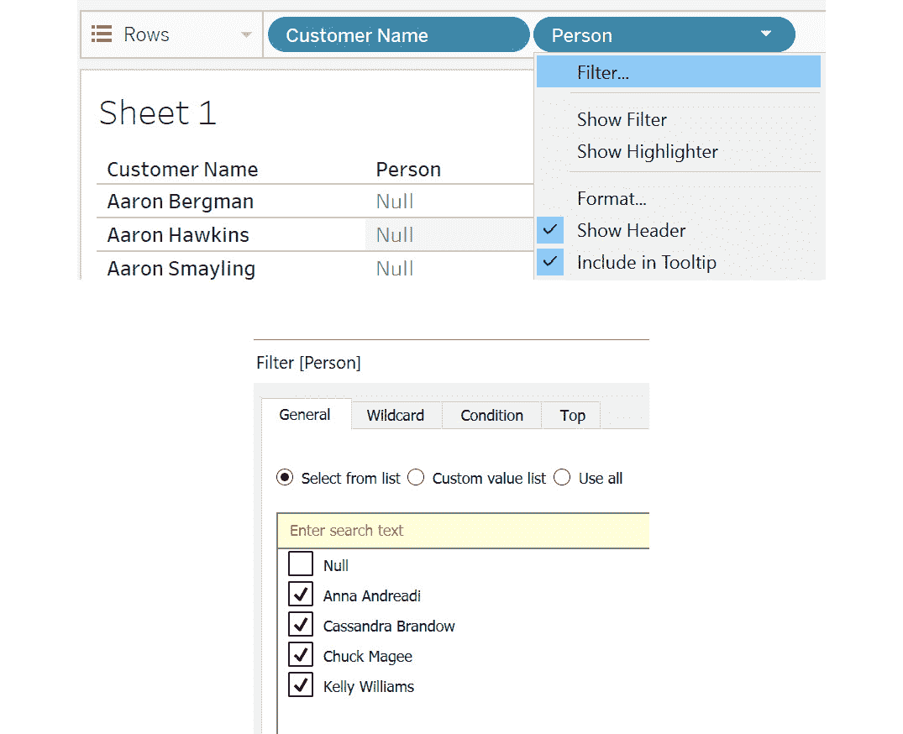

图 2.76：过滤以移除不匹配的值

你将得到以下输出，它显示了与`Person`匹配的客户名称：

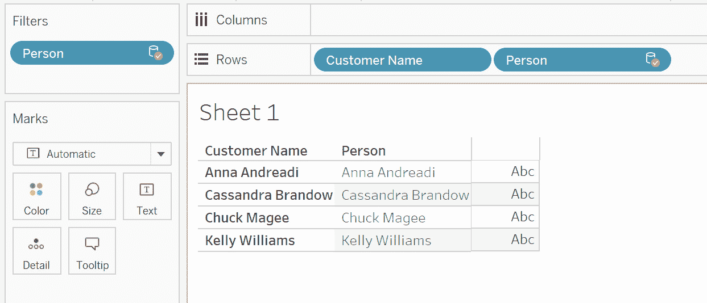

图 2.77：数据混合输出

使用数据混合，你可以在不同的工作表中以不同的聚合级别显示来自多个数据源的数据。例如，在一个工作表中，你可以在`Year`聚合级别混合数据，而在另一个工作表中，你可以在`Month`级别混合。

这之所以可能，是因为在数据混合中，数据源在输入源处并未连接。这提供了灵活性，可以拥有大型数据源，并在需要时仅在某些工作表中混合。这有助于使仪表板渲染更快。

## 数据混合的限制

数据混合不适用于某些聚合级别，例如`MEDIAN`和`COUNTD`（计数不同）。

您不能直接在 Tableau Server 上发布混合数据源。首先，您需要将数据源单独发布到服务器上，然后在您的 Tableau Desktop 实例中混合已发布的数据源。发布数据源意味着上传您的数据并将其直接存储在 Tableau Server 上。

另一个限制是，从二级数据源使用的数据必须在聚合级别上高于主数据源。如果聚合级别不正确，可视化中会出现星号 (`*`)，表示一对一连接的聚合级别。您可以通过交换数据源来解决这个问题。

这结束了本课的理论部分。接下来，您将在以下活动中将您所学的一切付诸实践。

## 活动二.01：识别退货订单

作为分析师，您可能会遇到需要通过销售额来评估业务绩效的情况。因此，了解有多少订单已履行以及有多少订单已退货非常重要。如果某些产品被频繁退货，这是一个需要调查的点，因为它可能对业务产生严重影响。

通常，订单信息与退货信息分开保存。因此，为了将此信息合并在一起，您需要连接这两个数据源。

对于这个活动，您将使用来自 `Sample - Superstore` Excel 文件的 `Orders` 和 `Returns` 表。您已经熟悉了 `Orders` 表。

`Returns` 表包含 `Order ID` 和 `Returned` 列。`Order ID` 是与 `Orders` 表匹配的 ID。`Returned` 列表示订单 ID 的返回状态。

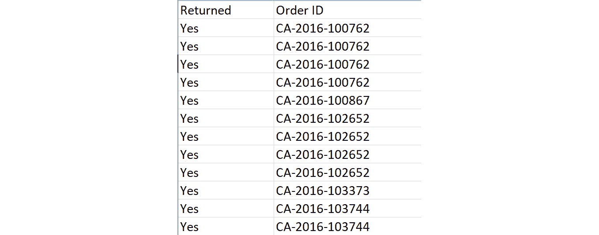

图 2.78：退货单列

目标是在将它们与主 `Orders` 表结合后识别退货订单，以便您可以确定哪些订单既已履行又已退货。

步骤如下：

1.  在您的 Tableau 实例中打开 `Sample - Superstore` 数据集。

1.  将数据源重命名为 `Activity 1`。

1.  将 `Orders` 表拖放到画布上。

1.  对 `Returns` 表重复相同的步骤。

1.  您需要将所有 `Orders` 和 `Returns` 表的值合并到合并数据集中。您能根据要求识别正确的连接吗？请记住，为了退货，订单应该始终先完成。如果您在这种情况下更改连接类型为左连接、右连接或全外连接，可以解释什么？

1.  识别数据网格中退回了多少产品。（一个订单可以包含多个组合的产品。）

**预期最终输出：**

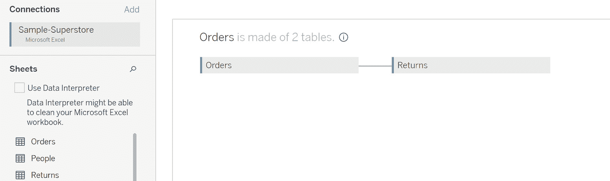

图 2.79：选择正确的连接

在这个活动中，您加强了关于各种连接及其输出的知识。您还学习了如何通过更改连接类型来解释结果。

备注

该活动的解决方案可以在此找到：[`packt.link/CTCxk`](https://packt.link/CTCxk)。

## 活动摘要 2.02：准备数据以进行可视化

现在你已经连接了数据，下一步是确保数据为可视化做好准备。这涉及到执行数据转换活动，例如通过删除空值来清理数据。你可能还需要重命名某些列或添加别名，拆分列等。

在本活动中，你将根据前一个活动的左连接输出执行一些数据转换步骤。

本活动将帮助你加强 Tableau 中数据转换的概念。这是任何 Tableau 项目中非常重要的一个过程。因此，你熟练掌握这些操作在 Tableau 中变得至关重要。

本活动的目标是将数据转换成适合可视化的清洁形式。首先，你需要为此数据源创建一个提取。然后，你需要仅显示`家具`和`办公用品`类别中的数据。是否可以使用提取属性来完成此操作？你还将通过将任何空值更改为空格来清理最终数据。让我们也从`Ship Mode`列中删除重复的术语，如`Class`。

完成后，你的数据应该为可视化做好准备。

从活动 2.01 继续，以下步骤将帮助你完成此活动：

1.  在你的 Tableau 实例中打开`Sample - Superstore`数据集。

1.  为此数据创建一个数据提取。

1.  在数据上添加一个过滤器以提取`家具`和`办公用品`类别。检查行数。

1.  通过别命名几个列来转换数据。

1.  将`Returns`表中的列的空值别名为空格。

1.  从`Ship Mode`列中删除单词`Class`。

完成后，你应该得到以下输出：

**预期最终输出**：

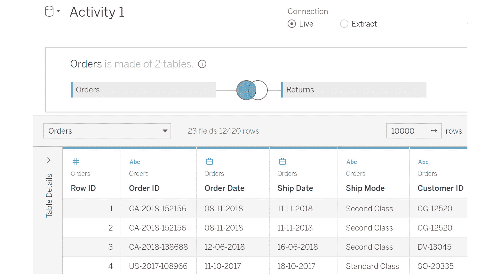

图 2.80：活动的最终输出

在本活动中，你学习了如何提取数据。你还为`类别`列添加了过滤器，仅提取所选类别。很多时候，你将在需要从一开始就将数据分离的项目上工作，例如区域数据。这些过滤器帮助你实现这一点。你还通过别名转换了数据，通过删除重复的单词和空值使其变得更加干净。

注意

该活动的解决方案可以在以下链接找到：[`packt.link/CTCxk`](https://packt.link/CTCxk)。

# 摘要

在本章中，你学习了如何连接各种数据源，这是在 Tableau 中进行数据分析的首要步骤。接下来，你了解了 Tableau 提供的各种连接选项和数据转换选项，以优化最终的可视化数据。在实践数据分析中，连接表是最常见的需求之一。例如，如果你有两个包含员工详情和部门详情的表，为了找到每个部门的员工数量，你会使用一个连接键来获取所需信息。

你还学习了关于数据融合和自定义 SQL 的一些高级数据连接选项。本章的关键收获是如何根据需求最有效地连接数据，以及如何转换数据使其更适合可视化活动。下一章将继续在 Tableau Prep 中探讨数据准备的话题。
