# 第三章：3. 数据准备：使用 Tableau Prep

概述

在本章中，您将学习 Tableau Prep 中的某些高级数据准备方法。您将学习如何使用各种 Tableau Prep 选项来清理数据集，使用不同的选项连接不同的数据源，并执行数据操作活动，如转置、分组和聚合。到本章结束时，您将能够将清理后的数据源导出到 Tableau 中进行可视化开发。

# 简介

在上一章中，您使用 Tableau Desktop 执行了一些基本的数据转换，例如连接、过滤和分组。然而，Tableau Desktop 只能执行基本的数据操作。它可能无法处理原始的未经处理/未清洗的数据，例如包含多个条目、缺失条目或不一致格式的数据。现在，您将学习更多适合这些更复杂场景的高级方法。

Tableau Prep 是一个专门设计用于执行数据转换的工具，以便我们可以使用这些数据来进行可视化。它包含高级算法，可以帮助检测数据不一致并修复它们。这可以自动完成，也可以根据需求手动完成。

在本章中，您将学习 Prep 界面以及数据操作，如添加数据源、数据概要分析以及应用诸如清理、拆分、添加转置、连接数据源和应用联合等转换。最后，您将学习如何将转换后的数据集导出到 Excel 中进行数据可视化。

# Prep 界面

在本节中，您将查看 Tableau Prep 中用于数据转换的选项。Tableau Prep 可以从 Tableau 网站下载（[`www.tableau.com/products/prep`](https://www.tableau.com/products/prep)）并像其他任何程序一样安装。您可以在*前言*中找到详细的安装步骤。安装完成后，导航到您的桌面并点击 Tableau Prep 图标以打开它。

当您第一次打开 Prep 时，它看起来会是这样：

![图 3.1：Prep 启动屏幕

![img/B16342_03_01.jpg]

图 3.1：Prep 启动屏幕

`连接`选项卡（左上角），显示可以在 Prep 中连接的所有数据源。这与 Tableau Desktop 中的`连接`面板类似。（*第二章，使用 Tableau Desktop 进行数据准备*。）

![图 3.2：Prep 中的数据连接

![img/B16342_03_02.jpg]

图 3.2：Prep 中的数据连接

在本章中，您将使用基于文件的连接进行操作，例如 Excel 电子表格和 CSV 文件。首先，让我们简要地看看启动屏幕上可用的其他选项（如图 3.1 所示）：

![图 3.3：启动屏幕上的选项

![img/B16342_03_03.jpg]

图 3.3：启动屏幕上的选项

在前面的图中，您可以查看以下元素：

+   `打开工作流程`：此选项打开已创建的工作流程。工作流程或流程是一系列你在 Prep 上的输入数据转换活动。你将在接下来的章节中了解如何创建不同的工作流程。

+   `连接到数据`：此选项打开 `连接` 菜单，你可以在这里连接到数据，如之前所示。

+   `最近的工作流程`：所有之前的工作流程都可以在这里查看。你可以使用右侧的控件在卡片视图或列表视图之间切换。

除了这些选项之外，Tableau 还提供了 `示例工作流程`，以及 `发现` 菜单，你可以在这里查看 Tableau 网站上 Prep 相关的内容更新。

顶部还有其他 `文件`、`编辑`、`流程` 和 `服务器` 菜单选项。`文件` 和 `编辑` 选项应该是显而易见的。`流程` 菜单可以用来运行流程，而 `服务器` 菜单提供了在 Tableau Server 上登录和发布流程的选项。

现在你已经了解了各种选项，是时候在流程中添加一些数据了。

# 在流程中添加数据

如 *第二章* 中所述，*使用 Tableau Desktop 进行数据准备*，任何数据准备活动的第一步是将数据添加到你的工作流程中。要在 Prep 中这样做，请点击 `连接` 并选择数据源。在接下来的练习中，你将连接到基于文件的源，但对于基于服务器的数据源，过程是相似的。

## 练习 3.01：连接到 Excel 文件

在这个练习中，你将在 Prep 中连接到你的第一个数据源。按照以下步骤完成练习：

1.  在你的计算机上安装 Tableau Prep Builder 后，找到以下位置的文件：

    +   Windows

        ```py
        C:\Program Files\Tableau\Tableau Prep Builder <version>\help\Samples\en_US\Superstore Files
        ```

    +   Mac

        ```py
        /Applications/Tableau Prep Builder <version>.app/Contents/help/Samples/en_US/Superstore Files
        ```

1.  点击 `连接` 并选择 `Microsoft Excel` 选项。

1.  这将打开一个菜单，你可以从中选择 Excel 文件。导航到上述位置并打开 `Orders_East.xlsx` 文件。

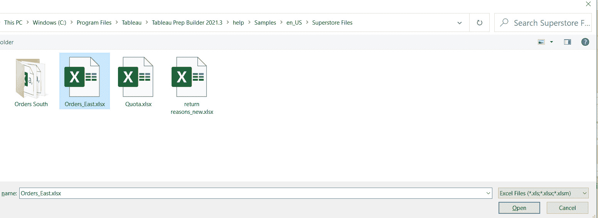

](img/B16342_03_06.jpg)

图 3.4：使用 Prep 连接到 Excel 文件

当 Excel 文件加载完成后，你会看到以下屏幕：

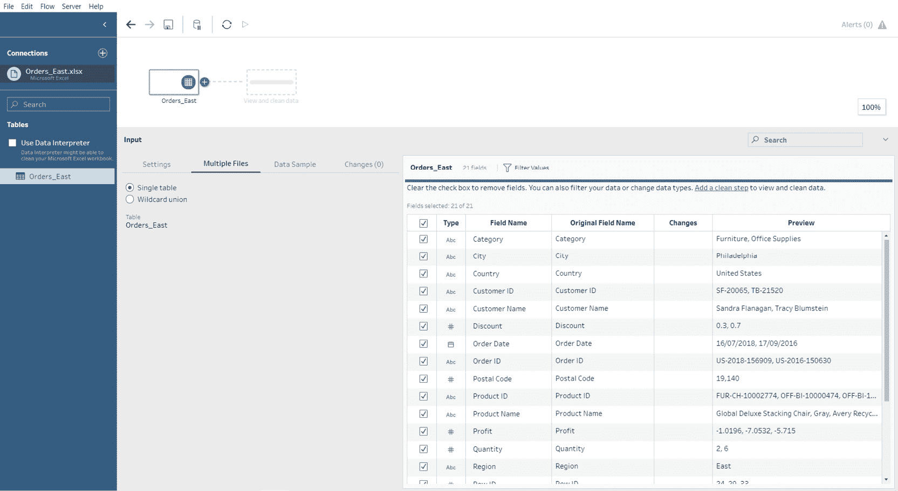

](img/B16342_03_05.jpg)

图 3.5：数据输入属性

在这个屏幕上有很多标签和选项。这些将在接下来的章节中介绍。

1.  点击 `+` 图标 (*图 3.6*) 查看可以应用于此输入数据步骤的步骤：

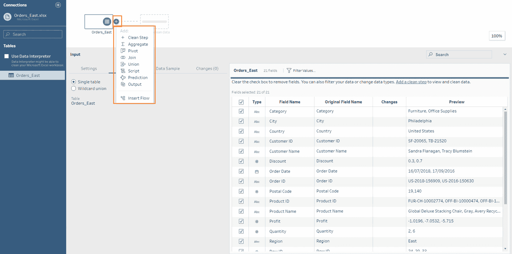

](img/B16342_03_06.jpg)

图 3.6：向工作流程中添加步骤

现在是时候添加一个输出步骤了。要这样做，请点击 `+` 并选择 `输出`。将打开一个输出选项卡，你可以预览数据。


](img/B16342_03_07.jpg)

图 3.7：工作流程中的输出步骤属性

在这里，你学习了如何连接到 Excel 文件。接下来，你将了解如何将多个输入带入流程中。

## 练习 3.02：连接多个数据源

在商业项目中，理想情况下，数据应存储在不同的来源中。因此，了解如何连接到多个数据源非常重要。在这个练习中，你将尝试向现有的流程中添加另一个数据源。

你将连接`Orders_South`数据，如下所示：

1.  从上一个练习的最后一步继续，点击`+`并选择“文本文件”选项。这是因为所需数据存储为 CSV 文件，这是一种文本文件类型。

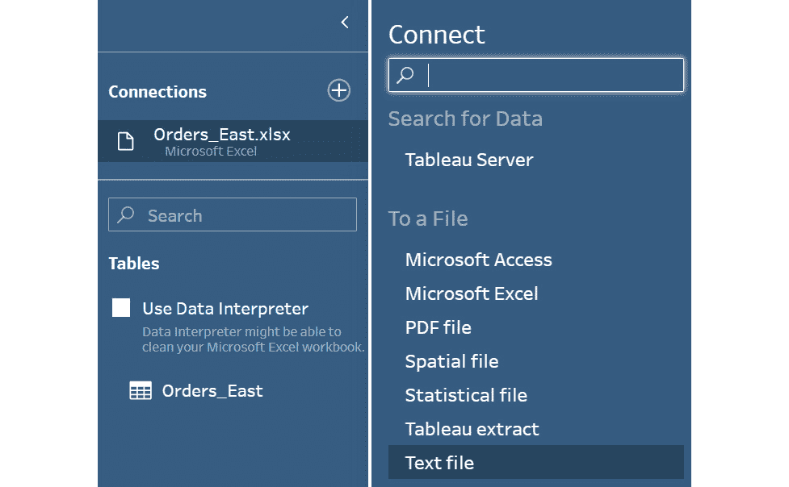

图 3.8：连接到 CSV 文件

1.  现在，导航到`Superstore Files`下的`Order_South`文件夹。选择`orders_south_2018.csv`并点击“打开”将文件导入 Prep。

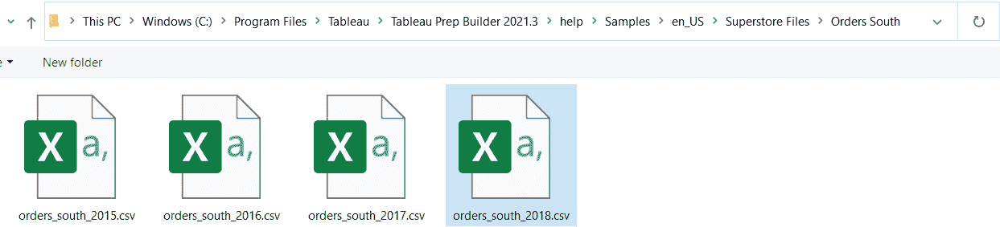

图 3.9：数据探索窗口查看输入文件

你应该会看到以下屏幕：

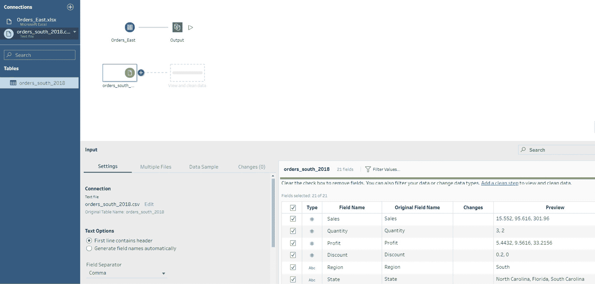

图 3.10：将多个文件添加到工作流程中

以下步骤将指导您通过*图 3.10*中显示的“输入”面板中的各个选项卡：

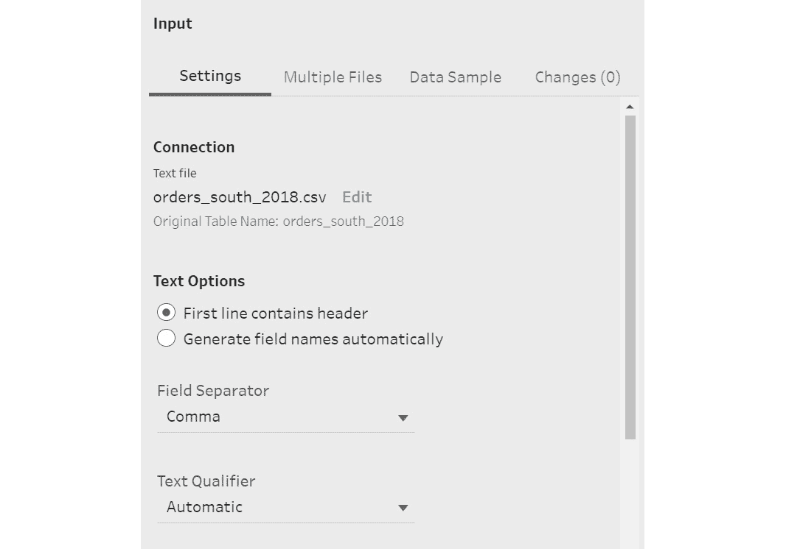

图 3.11：CSV 输入属性

1.  “设置”选项卡主要与数据源的连接细节相关，可能因数据源连接而异。您在这里可以找到编辑连接细节、选择文本选项、决定使用哪种字段分隔符等选项。

1.  您还有其他选项，如“文本限定符”、“字符集”和“区域设置”。Prep 足够智能，可以识别这些配置，但如果需要，可以根据要求进行更改。最后，有一个“增量刷新”选项。这与 Tableau Desktop 类似，可以用来根据某些列加载新数据，而不是每次流程运行时都拉取所有数据。

1.  选择“多个文件”选项卡以获取添加多个文件一起的选项。

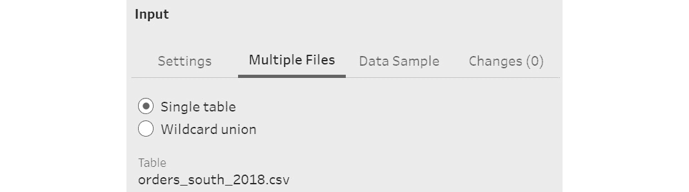

图 3.12：输入多个文件的选项

1.  现在，将选择更改为“通配符合并”。假设您想从文件夹中获取所有`orders_south`文件。您可以通过模式（`*south*`）简单地搜索它，并找到您想要的所有文件（*图 3.13*）。

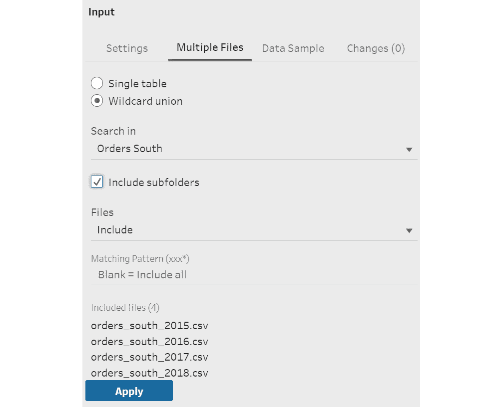

图 3.13：对多个文件输入进行通配符搜索

您也可以在文件夹（或子文件夹）中搜索此类文件。您还可以包含或排除符合特定模式的文件。通过包含一个星号（`*`），您可以有选择地忽略关键字前后所有字符。

1.  点击“应用”，所有这些工作表都将包含在流程中。Prep 还包含一个新列，“文件路径”，它指示数据来源的位置。

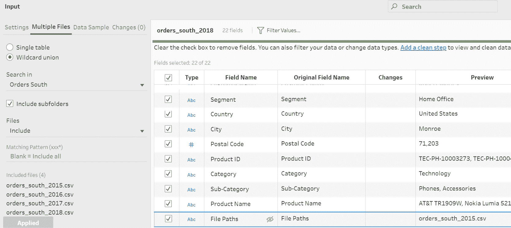

图 3.14：使用文件路径识别输入文件源

1.  接下来，选择“数据样本”选项卡。在这里，您可以采样输入数据，这在数据量很大时特别有用。理想情况下，当处理非常大的数据集时，最好使用样本来节省开发工作流程的时间，因为工作流程运行得更快，如果有更少的记录。

![图 3.15：采样输入数据

![img/B16342_03_15.jpg]

图 3.15：采样输入数据

通过悬停在信息图标上，您可以检查 Prep 如何采样数据。

1.  选择“更改”选项卡。对数据进行的所有更改都将在此跟踪。一个简单的例子是在数据中取消选中某些列名。例如，如果您取消选中“销售”和“数量”列，这些列将立即添加到“更改”选项卡中。更改也由“更改”列中的注释（小图标）以及数据输入图标上的注释表示。（图 3.16。）

![图 3.16：跟踪工作流程中的更改

![img/B16342_03_16.jpg]

图 3.16：跟踪工作流程中的更改

在本节中，您学习了如何在工作流程中连接多个数据源及其配置属性。接下来，您将学习如何在 Prep 中分析数据。

# 数据源配置文件

到目前为止，您只连接了不同的数据源。但您的主要目标是更好地理解数据。这可以通过观察数据分布、各种列的数据类型、列包含的值等来实现。

数据源配置文件通过允许您观察数据分布和频率以及字段的多种数据类型，使您能够了解底层数据。这有助于您对数据进行适当的更改以满足流程中的要求。一些常见选项包括检查数据分布频率、唯一记录数以及各列之间的关联。您将首先了解一些常用的分析步骤，然后将在练习中应用它们。

可以使用清洁步骤执行数据源分析。可以通过悬停在数据源旁边的`+`图标上并选择“清洁步骤”来添加清洁步骤，如下所示：

![图 3.17：在工作流程中添加一个清洁步骤

![img/B16342_03_17.jpg]

图 3.17：在工作流程中添加一个清洁步骤

现在，已将清洁步骤添加到工作流程中，这将打开一个新窗口以显示其连接的输入数据集。在这个窗口中，您可以分析您的数据。

![图 3.18：清洁步骤属性

![img/B16342_03_18.jpg]

图 3.18：清洁步骤属性

上一张截图显示了数据配置文件窗格。每个列将根据数据类型给出略有不同的表示。

例如，字符串数据类型将给出其发生的频率分布。如果您观察`Customer Name`列（如下截图所示），您将观察到客户下订单的数量。这是因为视图基于客户订单频率。

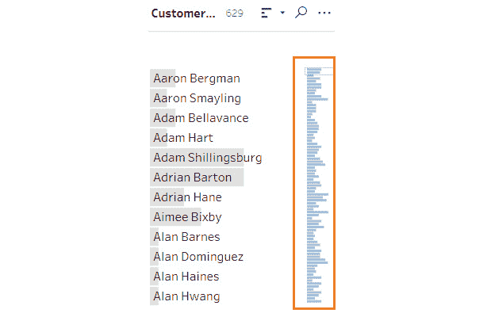

图 3.19：观察客户名称值频率

对于数值列类型，概览将仅显示一个表示值分布的直方图。观察`Quantity`列，它是一个数字。数据概览提供了一个直方图，可以帮助您了解销售数量的范围。


图 3.20：数值列的数据概览

现在您已经了解了数据概览的概念，是时候进行练习，以练习使用`Orders`数据集的数据概览。

## 练习 3.03：Orders_South 数据集的数据概览

在这个练习中，您将学习如何通过使用“准备”中的数据概览选项来更好地理解数据。在前一个工作流程中，您连接到了`Order_South`数据集。这是该练习的延续。

1.  执行以下步骤：

1.  一旦在“准备”阶段连接了数据，点击`+`图标，然后选择`Clean Step`：

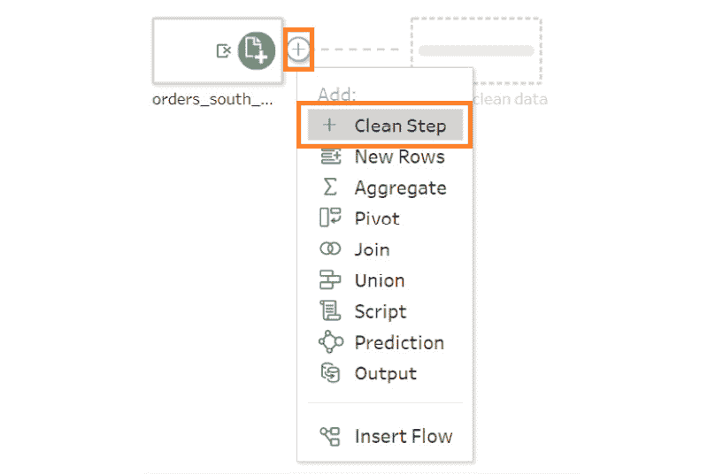

图 3.21：添加清理步骤

1.  点击清理步骤以打开详细信息，如下所示：

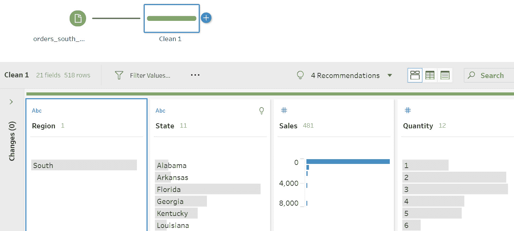

图 3.22：Orders_South 数据源的数据概览

1.  将鼠标悬停在`Product ID`列上，查看它包含的唯一值。您还可以选择更改数据类型，并对它进行排序、搜索和清理操作。此外，您还可以通过以下截图查看数据的组成：

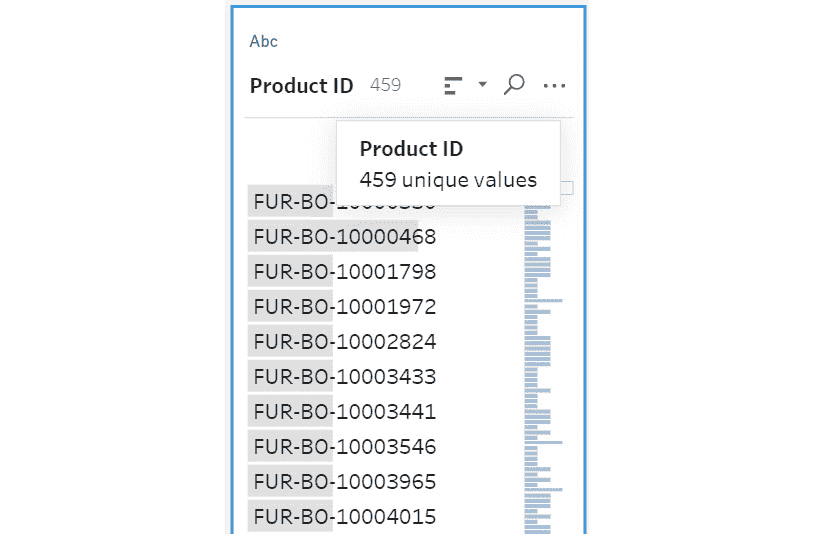

图 3.23：观察 Product ID 列中值的频率

1.  选择任何值。请注意，所有相关的行现在都被突出显示。例如，如果您选择佛罗里达州，您将看到数据如何与其他列连接。您还会观察到其利润趋势处于较低水平，这表明佛罗里达是一个销售量较低的状态。

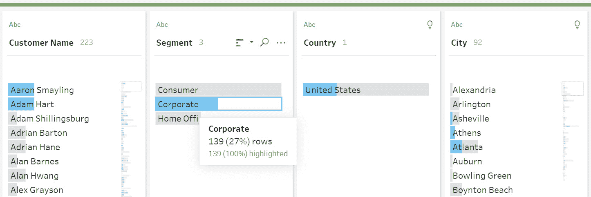

图 3.24：数据概览中多列之间的关联

使用这种数据概览，您可以通过数据分布快速查看数据趋势，这使我们能够快速发现并删除异常，如负销售数量。这些选项将在下一节中详细介绍。

# 使用清理、分组和拆分进行数据准备

清洗是数据准备的一个重要部分，因为拥有正确的数据可以导致正确和高效的数据分析。

例如，想象一下数据集中一个订单的销售金额为空白，但订单仍然被处理。这是不正确的，需要采取一些行动。相关的订单应该不被包括，或者销售金额应该被替换为平均值。

另一个例子是同一个客户有多个名字，或者多个客户 ID。您可能需要将名字合并为一个，以便正确分析信息。所有这些任务都可以使用数据清洗来完成。Prep 提供了多种数据清洗选项。在本节中，您将了解它们。

参考之前创建的`Orders_South`数据集工作流程：

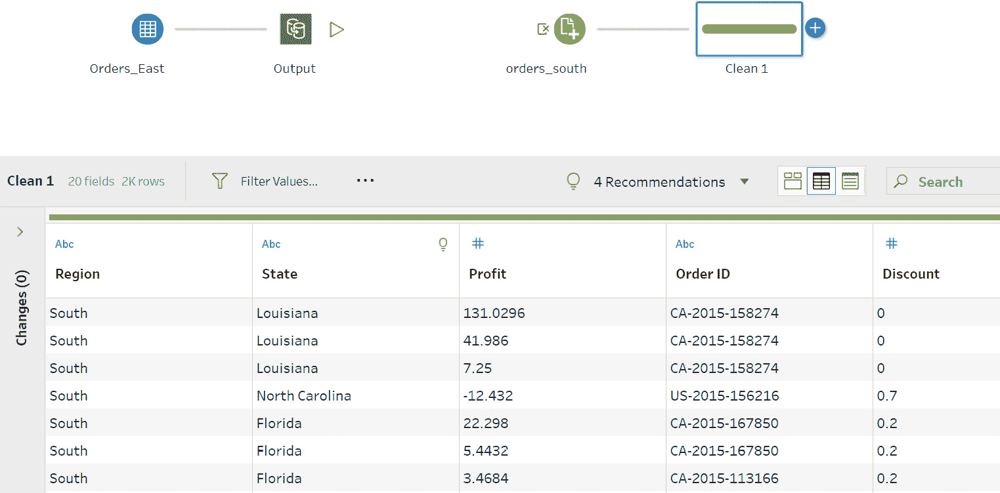

图 3.25：Orders_South 工作流程

右键单击`Clean 1`步骤以打开附加属性，如下面的截图所示：

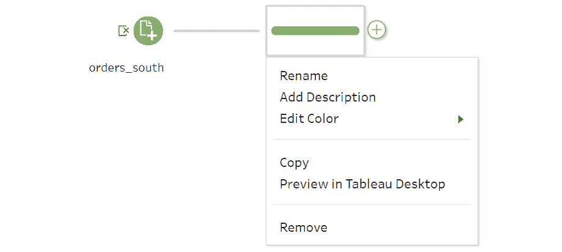

图 3.26：步骤自定义选项属性

在这里，您可以执行诸如重命名、添加描述和编辑步骤颜色等操作，如下文所述：

+   `重命名`：双击字段名称或（如果您使用的是 Mac）*Ctrl* + *点击*。这会打开一个文本输入框。在这里，您可以为此步骤添加一个您选择的名称。


图 3.27：在工作流程中重命名清洁步骤

+   `添加描述`：描述可以阐明步骤的目的。如果工作流程被多个人使用，这尤其有用。要添加描述，右键单击步骤并选择`添加描述`选项。

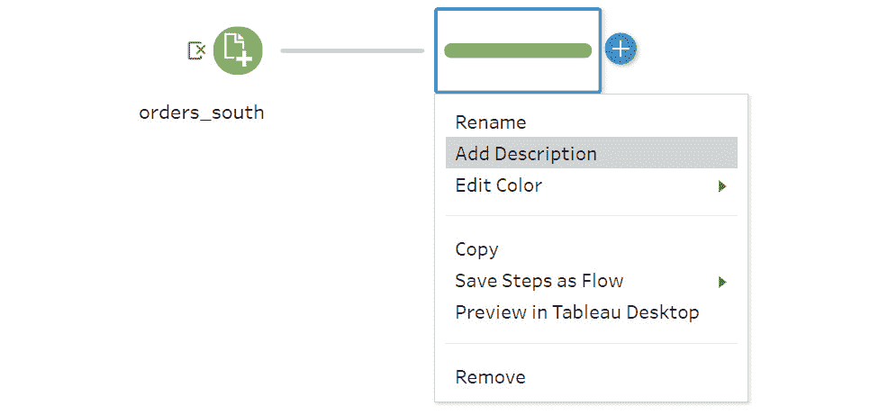

图 3.28：在工作流程中为清洁步骤添加描述

在您添加描述后，文本将如下显示在步骤下方：


图 3.29：在工作流程中切换清洁步骤的描述

您可以通过单击前一个图中的突出图标来选择显示或隐藏描述。在您添加了描述之后，您还可以编辑或删除它。要这样做，再次右键单击步骤，您将看到`编辑描述`和`删除描述`选项（*图 3.30*）：


图 3.30：工作流程中清洁步骤的描述编辑和删除选项

+   `编辑颜色`将改变步骤的颜色。这在流程的各个步骤中进行视觉识别时很有用。

现在，您将关注底部面板。这同样也被称为配置文件面板，您之前已经见过。在这里，您将找到`过滤值`和`创建计算字段`选项。您会注意到 Prep 还提供了与数据相关的建议。您可以使用视图选项在三个视图之间切换。

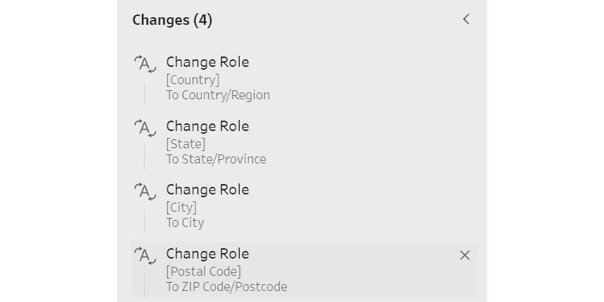

](img/B16342_03_31.jpg)

图 3.31：工作流程中数据清洗的建议

+   `更改数据类型`将列的类型更改为另一种数据类型。以下图像显示了 Prep 中的不同数据类型：

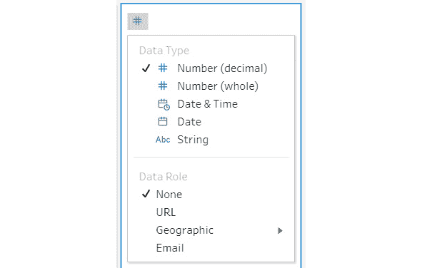

图 3.32：更改列的数据类型

目前，列已选择`数字（小数）`数据类型。如有需要，您可以选择`字符串`以相应地更改列的数据类型。

`数字（小数）`和`数字（整数）`是数值数据类型。`日期和时间`用于包含日期或时间值的列。`字符串`数据类型用于包含字符值的列。您还有`数据角色`。这适用于字符串数据类型，并进一步定义了列包含的字符串值的类型。

通常，您需要更改列数据类型以正确表示。例如，如果邮政编码以数值数据类型保存，则这不是正确的表示。尽管邮政编码是数字，但它们的真实表示形式是`字符串`，具有`地理`角色。您现在将学习如何在 Prep 中根据以下示例更改数据类型。请参考提供的建议：


图 3.33：使用建议更改列数据类型

如您所见，`状态`被保存为`字符串`，但没有分配数据角色。要将数据角色分配给`状态`，请单击`状态`列，然后将`数据角色`更改为`地理` – `州/省`，如下面的屏幕截图所示：

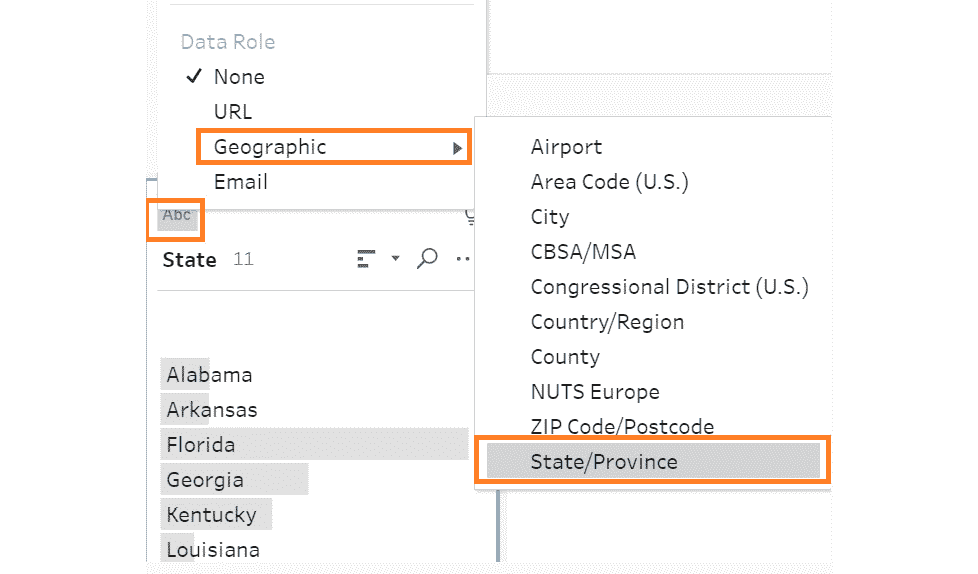

图 3.34：更改列的数据角色

您也可以对其他列执行相同的操作，即对`城市`、`邮政编码`和`国家`。我们进行的所有更改都将记录在`更改`选项卡上。

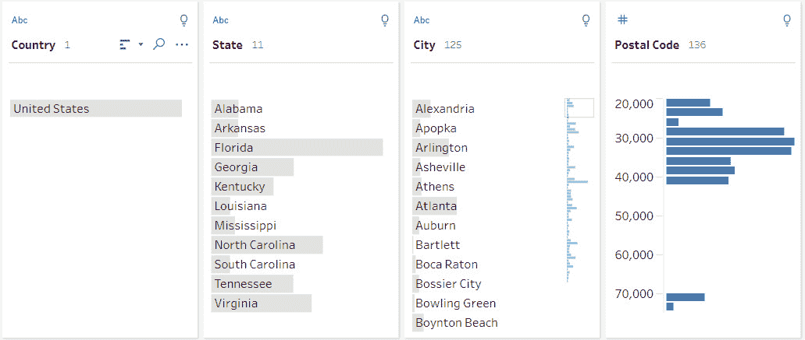

图 3.35：将建议应用于其他列

在任何时候，如果您想撤销更改，可以通过悬停在更改上并选择`删除`选项来实现，如下所示：

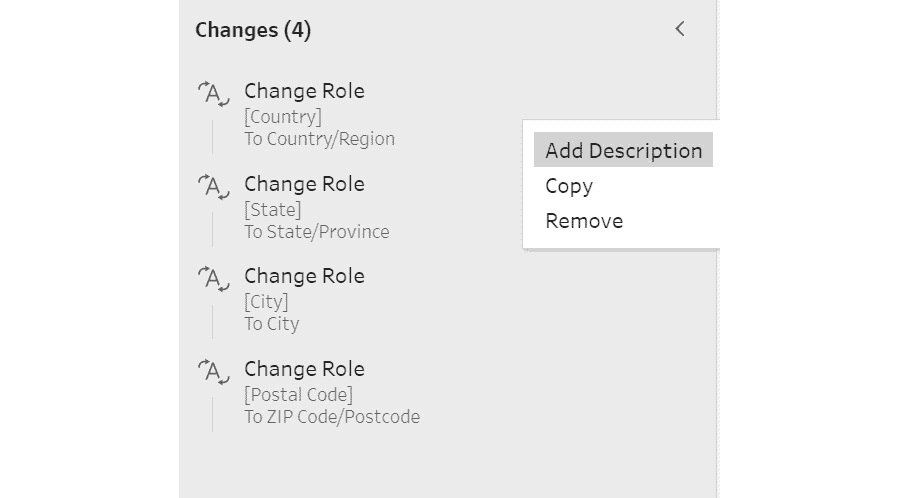

图 3.36：在工作流程中撤销更改

更改这些列的数据类型和角色后的结果如下：


图 3.37：更改之前列的显示方式

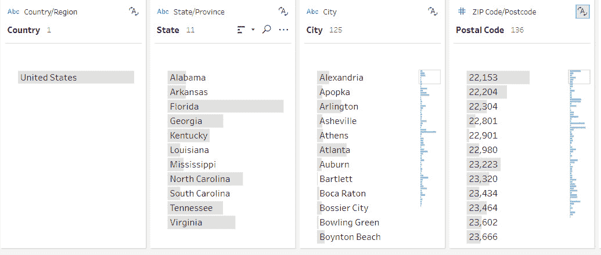

图 3.38：更改后的列

这些更改有助于创建正确类型的可视化，以提取有用的见解 - 例如，如果这些是简单的字符串类型，您将无法创建如地图之类的地理可视化。这将限制您的可视化能力，以绘制某些见解，例如哪些城市或哪些邮政编码订购了最多的产品，或者它们与其他城市如何比较。

## 附加清洁步骤

在上一节中，您学习了如何添加清洁步骤，以及如何使用与清洁步骤相关的各种选项来跟踪更改。您还看到了如何更改数据类型和数据角色。在本节中，您将了解一些在单个列级别可用的附加清洁步骤。您将继续在相同的数据配置文件窗格中工作。

要访问附加的清洁步骤，将鼠标悬停在单个列上，然后单击`…`图标以查看附加选项，如下所示：


图 3.39：更多清洁选项

在继续之前，重要的是要注意，由于数据类型的不同，某些列可能有一些不可用的选项。例如，对于`国家`，`视图状态 - 摘要`被禁用。然而，对于`利润`列，它可用，如下面的截图所示：

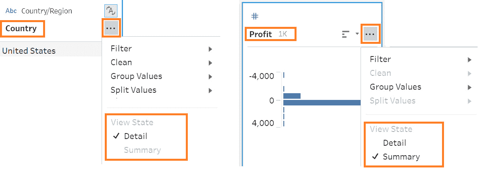

图 3.40：基于列数据类型的可用选项

考虑到这一点，现在是时候学习更多关于您可以用来清洁数据的附加选项了。

## 列级别的清洁步骤

在本节中，您将学习如何在输入数据源上添加筛选和计算选项。您将继续从更改数据角色后留下的地方开始。

筛选：筛选选项允许您从数据集中选择数据子集。此选项限制了被拉入工作流程的数据。通常，将分析限制在数据的特定子集上以进一步分析是有用的。我们可以使用筛选选项来实现这一点。例如，您可能希望识别订单量最高的`州`。这可以通过以下方式轻松完成对`州`列的排序：

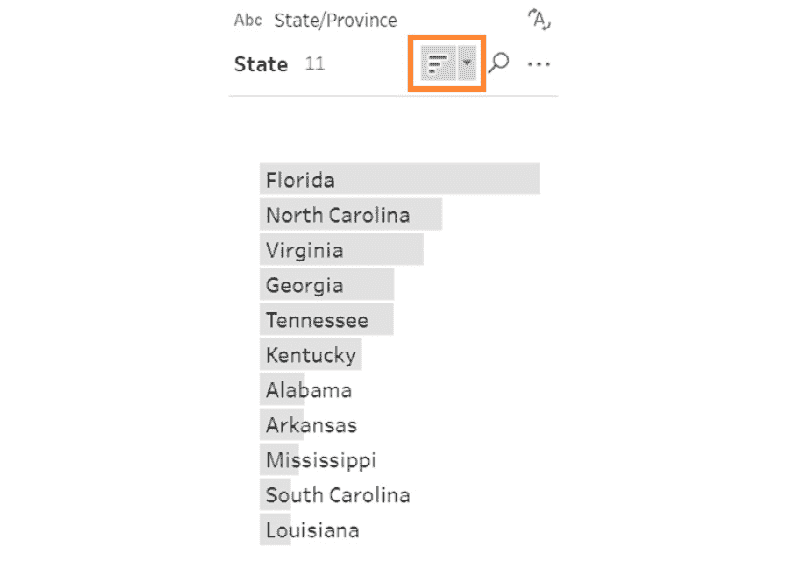

图 3.41：对州列进行排序

## 练习 3.04：在清洁步骤中应用筛选

在这个练习中，您将学习如何在清洁步骤中应用筛选。您可以在*图 3.41*中看到，佛罗里达州有最多的订单。现在您可以筛选数据，只显示`佛罗里达州`的订单。

按照以下步骤完成此练习：

1.  单击`…`并选择`筛选` - `选择值`。

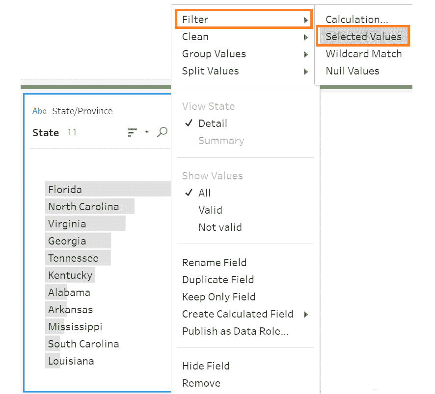

图 3.42：不同的筛选类型

1.  从列表中选择`佛罗里达州`并单击`完成`以筛选数据：

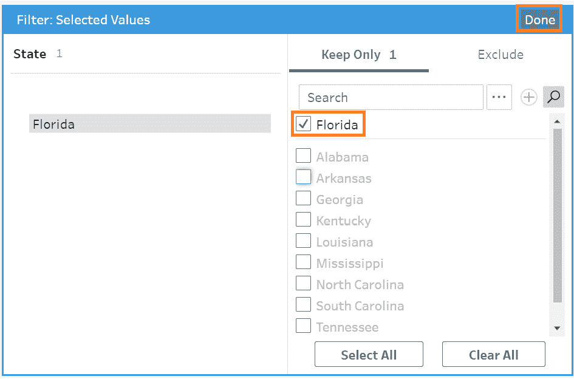

图 3.43：选择值过滤器属性

使用“计算...”、“空值”和“通配符匹配”也可以有其他方法来过滤数据：

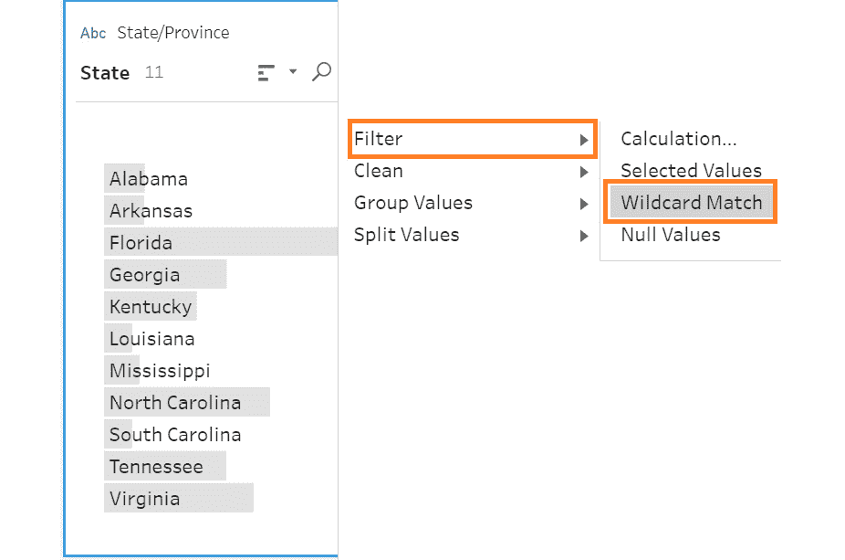

图 3.44：更多过滤数据的方法

1.  “空值”过滤器过滤数据中的空值，而“通配符匹配”基于关键字进行过滤。

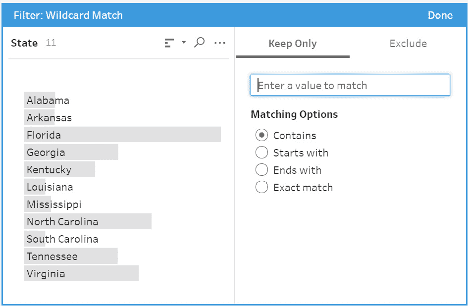

图 3.45：计算过滤器属性

如其名称所示，“计算...”过滤器根据某些计算条件过滤数据。

1.  现在，创建一个计算来检查哪个月份订单量最高。为此，单击“订单日期”列上的`…`图标，然后找到“创建计算字段”和“自定义计算”：

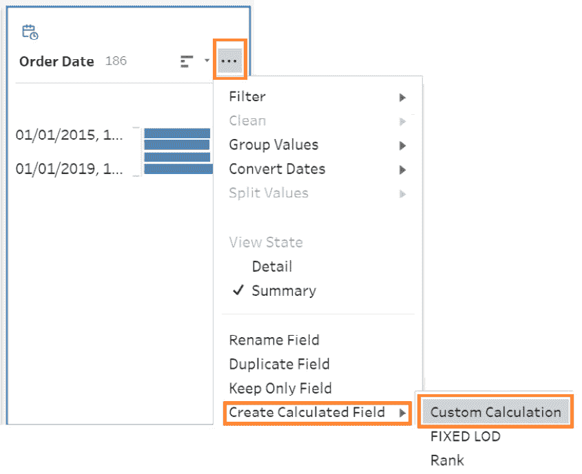

图 3.46：在工作流程中创建计算

1.  这将打开计算编辑器。在编辑器中输入以下表达式，并将计算重命名为`Order_Date_Month`：

    ```py
    Month([Order Date])
    ```

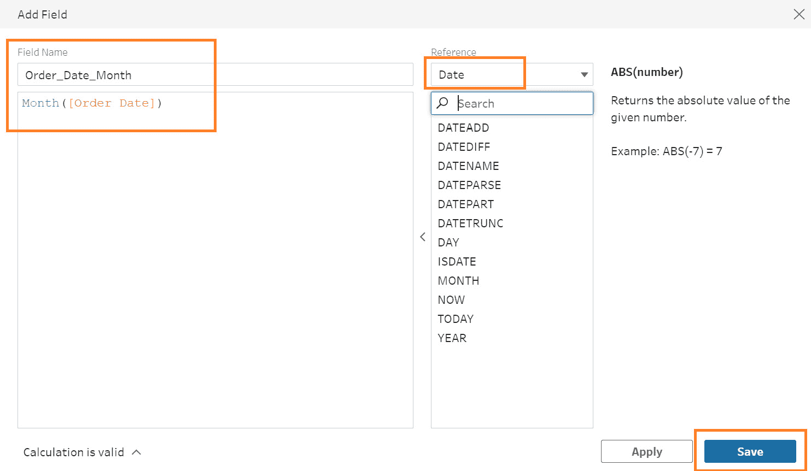

图 3.47：计算编辑器属性

1.  对月份进行排序，观察最高销售额在十一月，其次是六月：

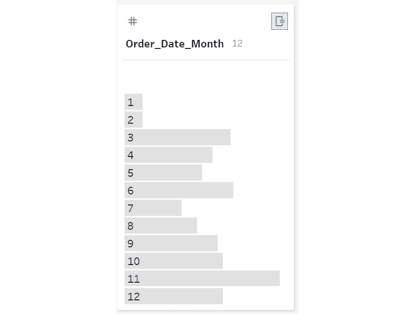

图 3.48：使用计算添加的新列

注意

由于时间和版本差异，您的计算可能会导致最高销售额的月份不同。排序步骤的指令将保持不变。

根据您指定的条件，您可以以类似的方式为过滤器创建计算。您将在阅读本书的过程中详细了解计算。

## 练习 3.05：在工作流程中清理列

在上一节中，您学习了如何使用各种条件过滤数据。您还学习了如何向此数据源添加计算。在本练习中，您将了解“清洁”选项。

“清洁”选项提供了可以用于清理列的字符串操作。例如，包括移除标点符号或杂乱字符，将字符转换为大写或小写，从字符串中移除数字等。清理列必须执行以下步骤：

1.  继续使用上一节相同的流程。观察“产品名称”列。它包含许多杂乱字符，如`#`和`'`。您可以移除这些字符，因为它们对分析不太有用。

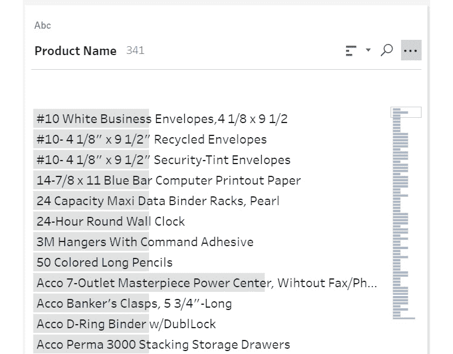

图 3.49：带有杂乱字符的产品名称预览

1.  要访问“清洁”选项，请单击`…`图标。您将看到“清洁”选项提供各种用于清理数据的函数，如下一截图所示：

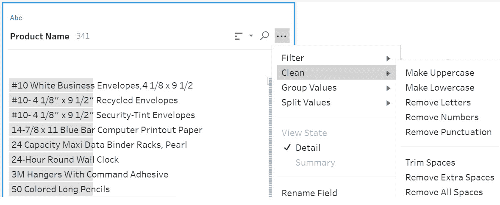

图 3.50：各种清洁方法

1.  现在，使用“产品名称”的“移除标点”选项，如下所示：

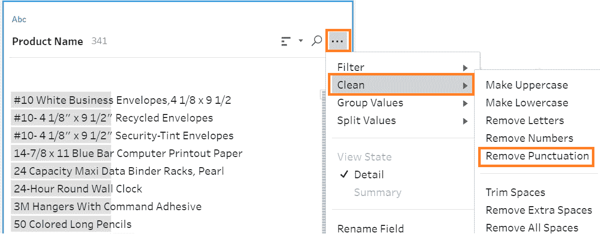

图 3.51：使用“移除标点符号”选项清理产品名称列

您将获得一个没有垃圾字符的干净列：

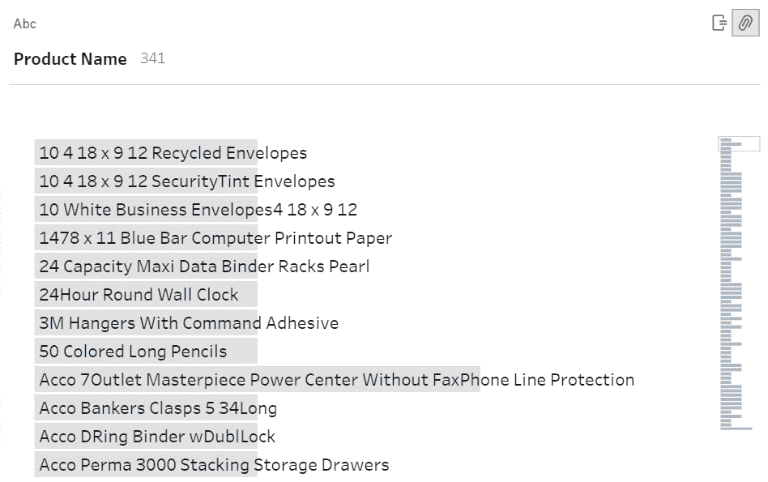

图 3.52：清理后的产品名称列

还有其他一些选项，例如删除数字或字符、更改大小写和删除值中的空格。这些选项是自我解释的，可以根据项目需求随时使用。

## 分组值

将值分组意味着将两个或多个值组合成一个单一的组合值，以便它们作为一个值或组来表示。这通常用于数据中包含拼写错误，导致相同的值以不同的形式出现的情况。

想想我们那位具有多个名称但被不同客户 ID 表示的客户。这个问题可以使用分组值来解决。我们可以使用分组值将多个客户名称合并为一个客户。

与“清理”选项类似，“分组值”选项可以通过将鼠标悬停在列上并单击“…”图标来访问，如下所示：

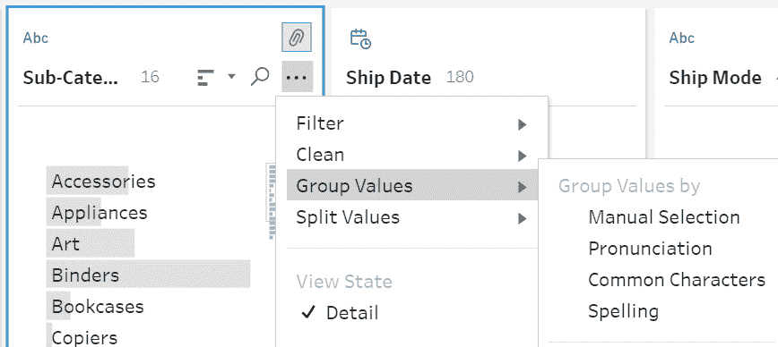

图 3.53：各种分组值方法

您将在下一个练习中学习如何在工作流程中使用此选项。

## 练习 3.06：将值分组到组中

在这个练习中，您将使用“手动选择”选项将“子类别”值“椅子”和“桌子”组合成一个组。按照以下步骤完成此练习：

1.  点击“子类别”列的下拉菜单，然后选择“分组值”和“手动选择”：

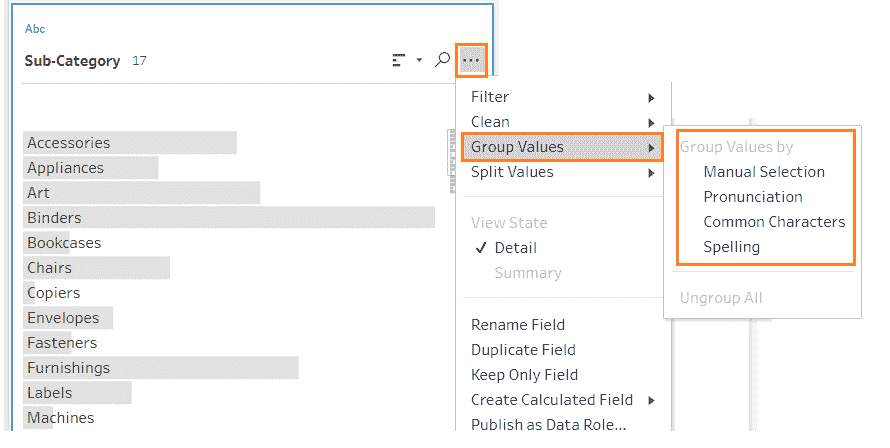

图 3.54：使用手动选择方法分组值

1.  在窗口的左侧，选择“椅子”值，这将向右侧添加一个成员组，也称为“椅子”。默认情况下，组将具有与第一个成员相同的名称，在这种情况下是“椅子”。

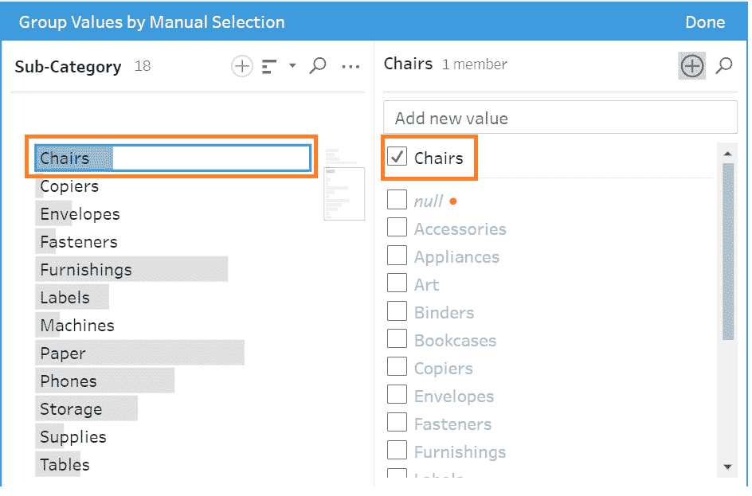

图 3.55：向组中添加成员

1.  要将组重命名为“办公家具”，请双击“椅子”并输入新名称，如图下所示：

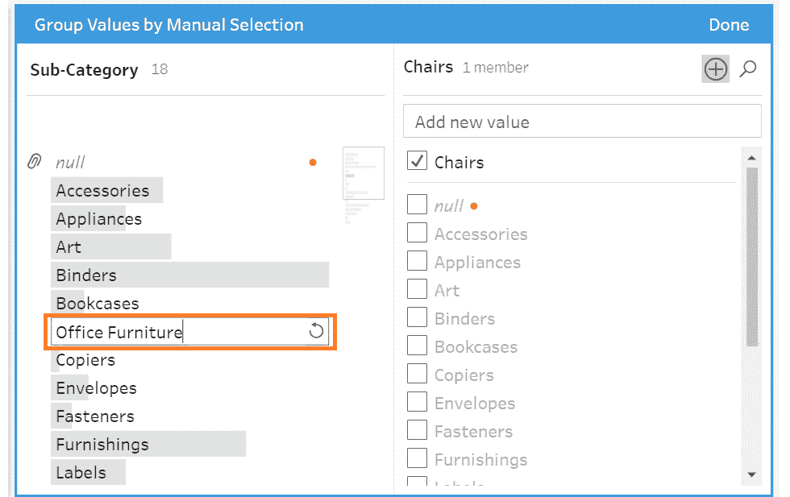

图 3.56：重命名一个组

现在新的组名应该如下所示：

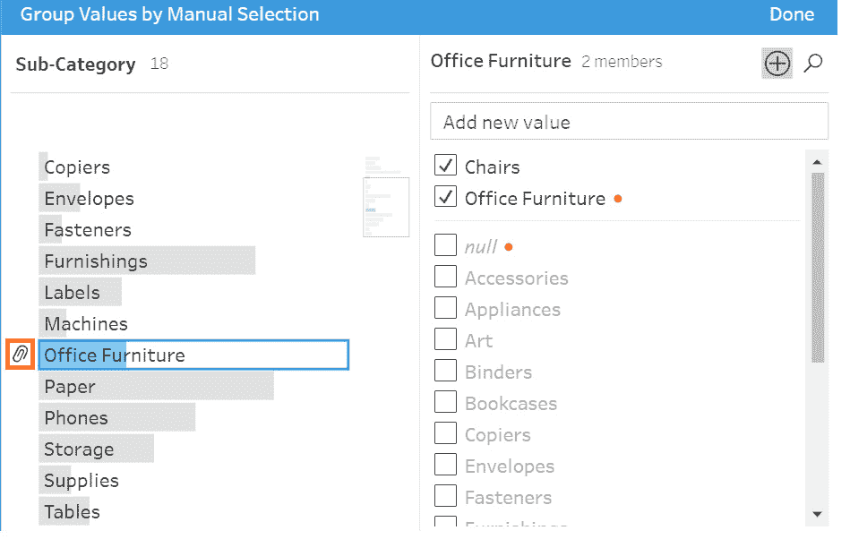

图 3.57：更新后的组名

1.  现在您可以使用右侧列添加更多成员到组中。通过选择该值将“桌子”添加到这个组：

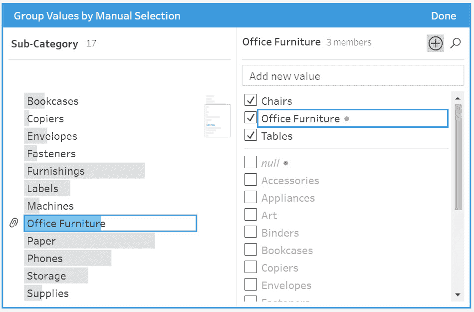

图 3.58：向组中添加额外成员

1.  你还可以添加目前不在数据中但将来会添加的值。为此，请点击`+`图标并在文本框中添加值。你将在值旁边看到一个红色圆点，表示该值目前不存在于数据中。请注意，此值应与未来预期的值匹配，否则它可能不会自动添加到组中。

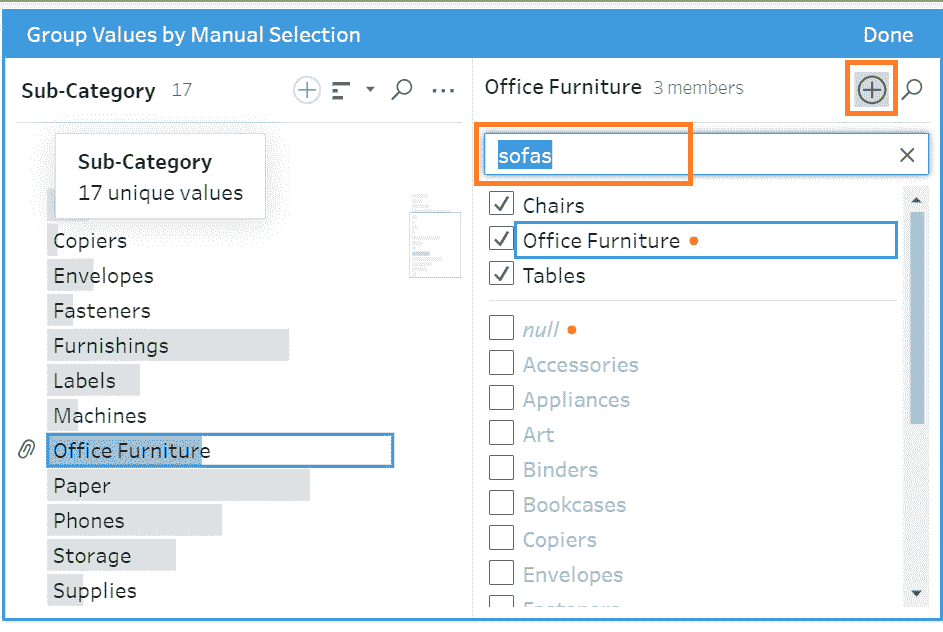

图 3.59：将未来值添加到组中

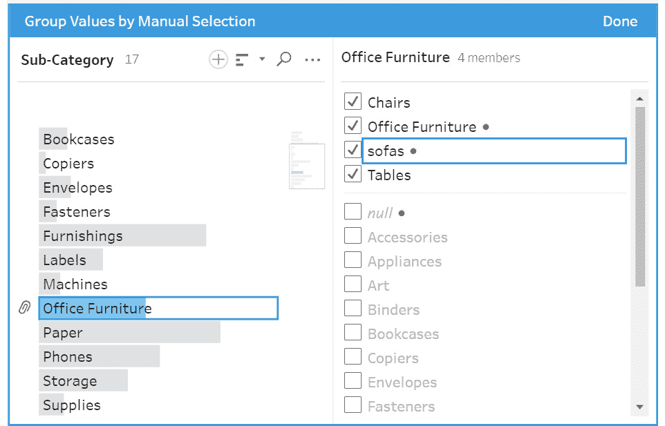

图 3.60：将未来可用的成员添加到组中

1.  然后，点击`完成`以添加组。新组将被添加，由一个回形针图标表示（*图 3.61*）。

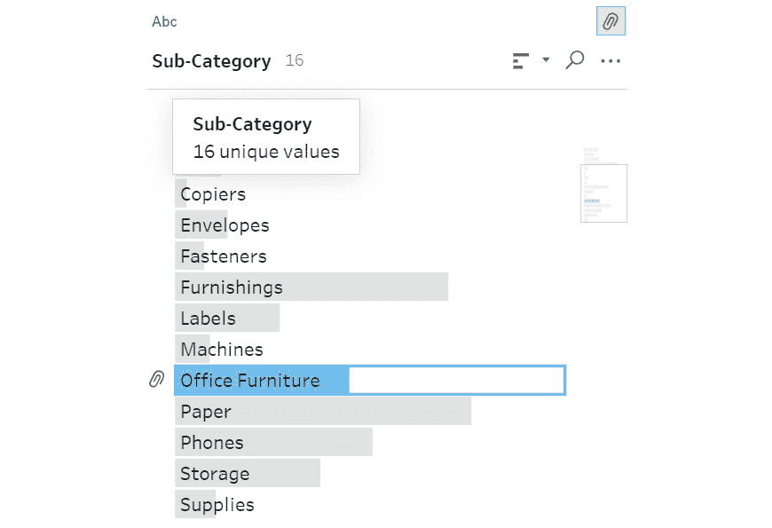

图 3.61：分组值替换子类别列中的单个值

这是一个手动分组的例子。另一种分组数据的方法是使用内置算法，这些算法使我们能够自动使用发音、常用字符或拼写来完成这项工作。一个常见的例子是将相同的短语以不同的方式书写，例如“Tableau Prep”和“Prep Tableau”。这些本质上意味着相同的事情，但书写方式不同。Prep 提供了内置算法，可以识别此类值并将它们自动分组。

## 拆分值

此选项允许我们将列值拆分为多个子值。在基于分隔符（如逗号或竖线）将多个值存储为单个值的场景中，这可能很有用。有时，为了优化数据存储，多个值可能被存储为组合列。

考虑下一个例子，`产品 ID`，它包含`类别`、`子类别`和实际`产品 ID`字段组合：

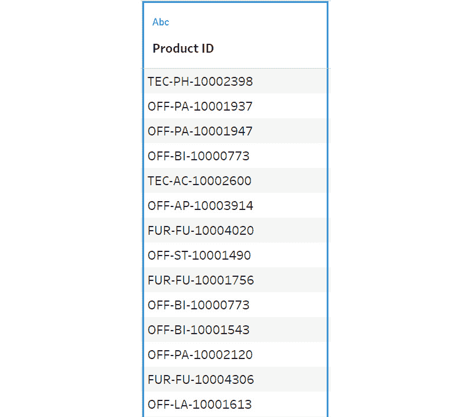

图 3.62：组合列值示例

## 练习 3.07：拆分列

假设由于存储大小限制，你维护了一个高度优化的数据库，并确保它不包含重复数据。你只有`产品 ID`列可用。要获取`类别`和`子类别`列，你可能需要使用`拆分值`选项来拆分`产品 ID`列。以下步骤将帮助你完成这个练习：

1.  可以通过点击`…`图标并选择`拆分值`来访问`拆分值`选项。有两个选项可用：`自动拆分`和`自定义拆分`。

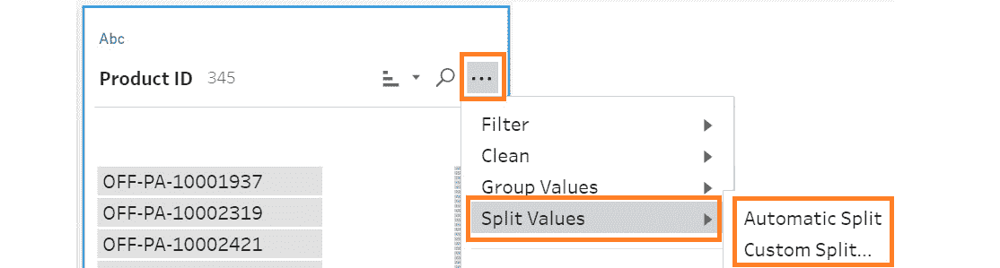

图 3.63：各种拆分值方法

1.  当你需要使用分隔符将整个列拆分为多个部分时，可以应用`自动拆分`。如果你需要将`产品 ID`拆分为三个部分，可以使用此选项。选择此列上的`自动拆分`并查看结果：

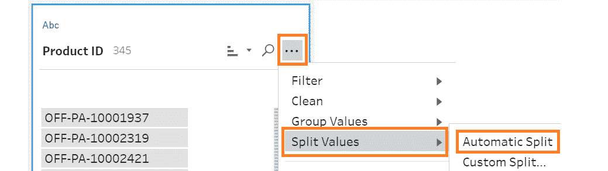

图 3.64：在产品 ID 列应用自动拆分

您可以在下一张截图看到，`产品 ID`现在使用连字符（`-`）分隔符被分为三个部分：

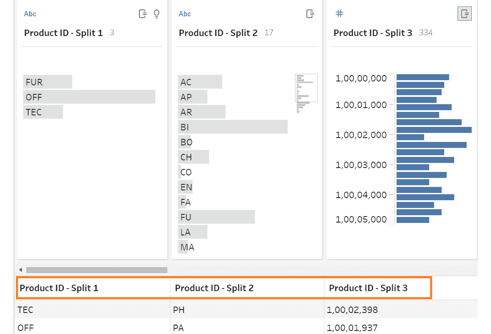

图 3.65：产品 ID 列自动拆分的结果

1.  现在，假设您想有一个只包含`产品类别`的另一个列。这是`产品 ID`列的第一部分。对`产品 ID`应用`自定义拆分`以获取第一部分，即类别。如果您使用 PC，请使用*Ctrl* + *Z*（在 Mac 上为*Cmd* + Z）恢复到原始列，然后应用`自定义拆分`，如下所示：

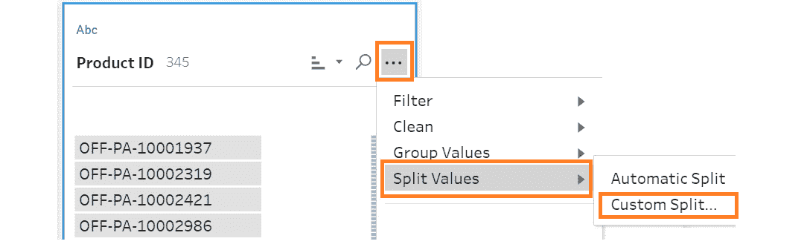

图 3.66：在产品 ID 列应用自定义拆分

1.  输入分隔符（`-`）以及所需的拆分数，如下所示：

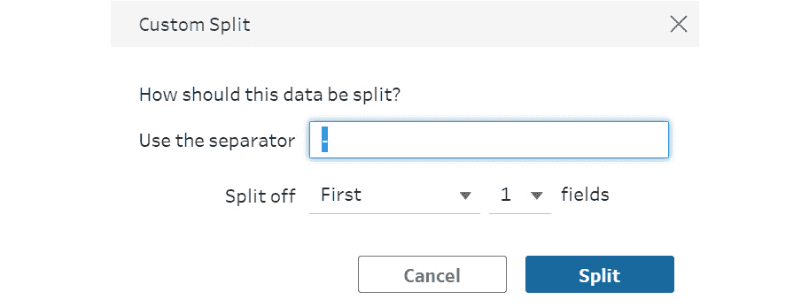

图 3.67：自定义拆分属性

您现在将看到一个新列，它包含产品类别，如下所示：

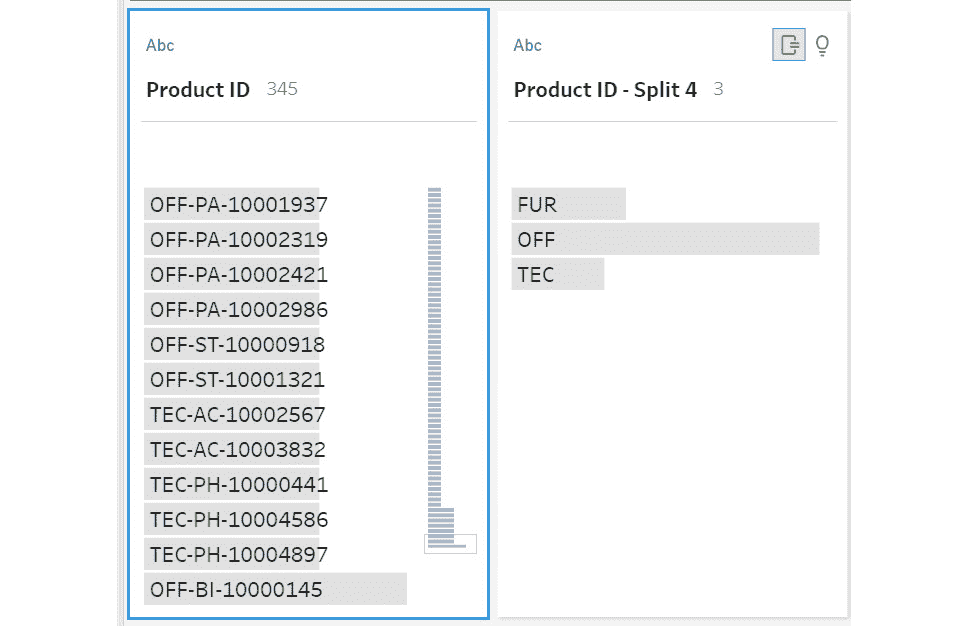

图 3.68：产品 ID 列的自定义拆分结果

这就结束了关于您可以在数据上执行的所有清洁操作的讨论。您学习了使用分组、清洁和拆分来清洁数据的各种方法。接下来，您将学习关于数据转换步骤，如聚合、交叉、连接和并集。

# 聚合、交叉、连接和并集

您经常会遇到某些场景，其中数据可能需要调整以适应可视化需求。例如，如果您正在分析公司的月度销售额，您不需要每一天的数据。在这种情况下，您需要将数据聚合到月度级别。这也减少了用于分析的数据量。

另一个例子是，当过去几年的数据存储为独立的文件，而当前年份存储为单独的文件时。所有文件具有类似的列结构。如果您要一起分析所有数据，您可能需要执行并集转换来将这些单独的文件合并为一个文件。

这种数据转换可以在 Prep 中完成。您现在将学习如何进行这些操作。

## 聚合

聚合有助于改变数据的粒度。在这个上下文中，粒度意味着数据可用的级别。例如，考虑两个文件。一个文件包含客户信息，如客户 ID、客户姓名、地址和加入日期。另一个表包含客户所做的交易信息，如特定产品的订单数量。练习将详细探讨这个选项。

## 练习 3.08：根据购买情况识别高价值客户

假设你的任务是根据客户的购买情况识别高价值客户。为此，你需要首先将交易文件汇总以计算每个客户 ID 的所有购买价值，然后将其与客户信息表连接。在这个练习中，你将连接到`Orders_South`数据，并在`类别`和`船运方式`列中聚合`利润`值：

1.  你将继续使用相同的流程。点击`+`图标并选择`聚合`：

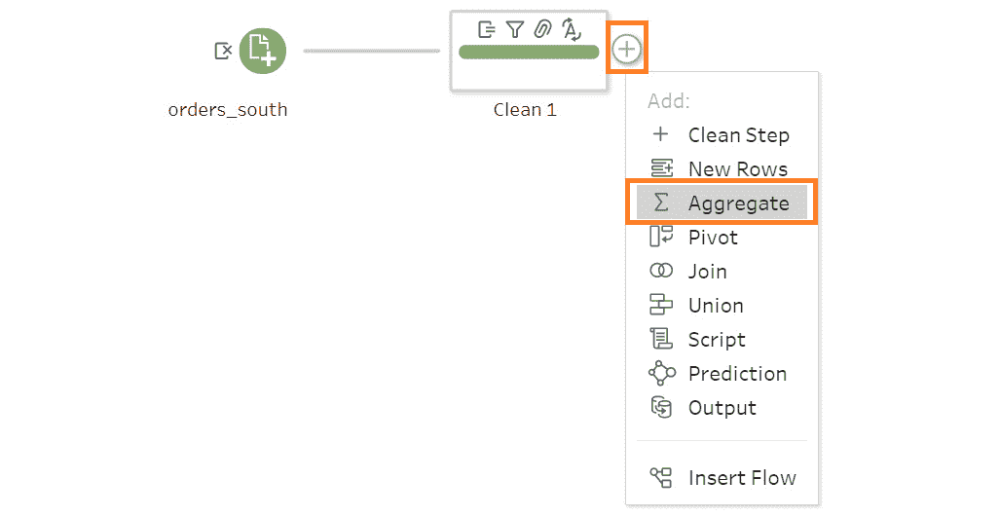

图 3.69：将聚合步骤添加到工作流程中

1.  这将在工作流程中添加一个`聚合`步骤。点击它，并选择分组字段和聚合字段。你将在屏幕上看到以下内容：


图 3.70：已添加到工作流程中的聚合步骤

由`Abc`图标或日期列表示的维度或文本列将作为`分组字段`，而由`#`表示的度量或数值列将作为`聚合字段`。你只能将文本或日期列与数值列分组以形成聚合。

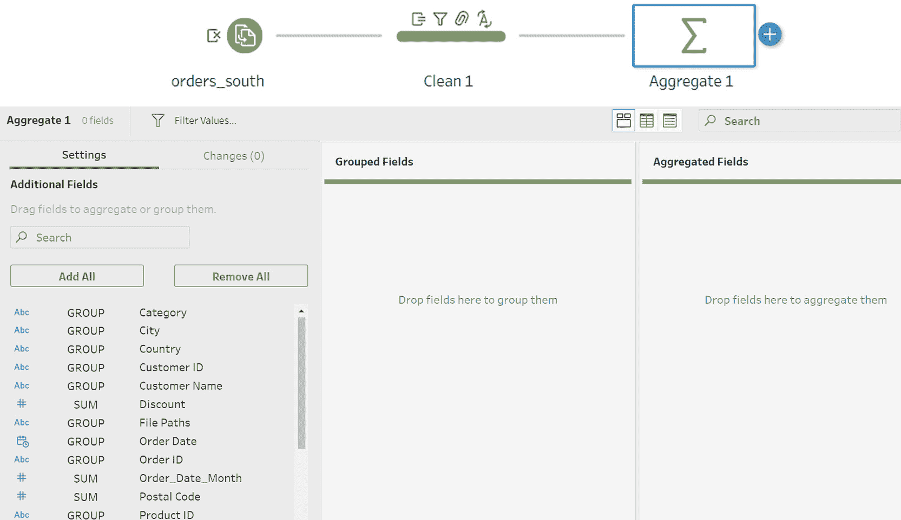

图 3.71：聚合步骤属性

1.  通过以下方式单击字段来更改聚合类型：

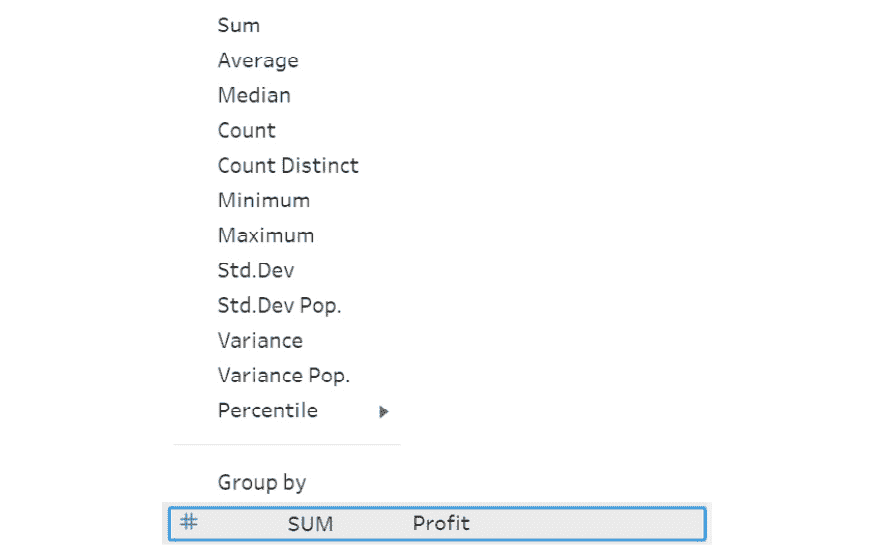

图 3.72：各种聚合方法

1.  基于销售数据聚合，按`类别`分组。由于`类别`是一个维度，它将在`分组字段`下，而`利润`将在聚合字段下（因为它是一个度量）。双击`类别`将其添加到`分组字段`下，同样，双击`利润`将其添加到`聚合字段`下：

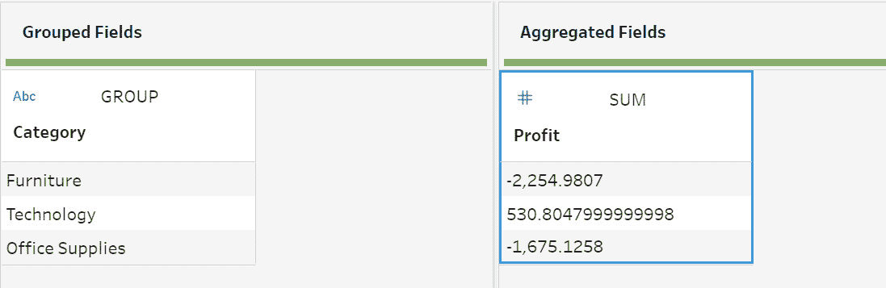

图 3.73：添加分组和聚合字段

1.  现在数据已按各种`类别`值和`利润`分组。要向组添加另一个维度，你可以双击并添加到分组字段部分。现在，将`船运方式`添加到`分组字段`：

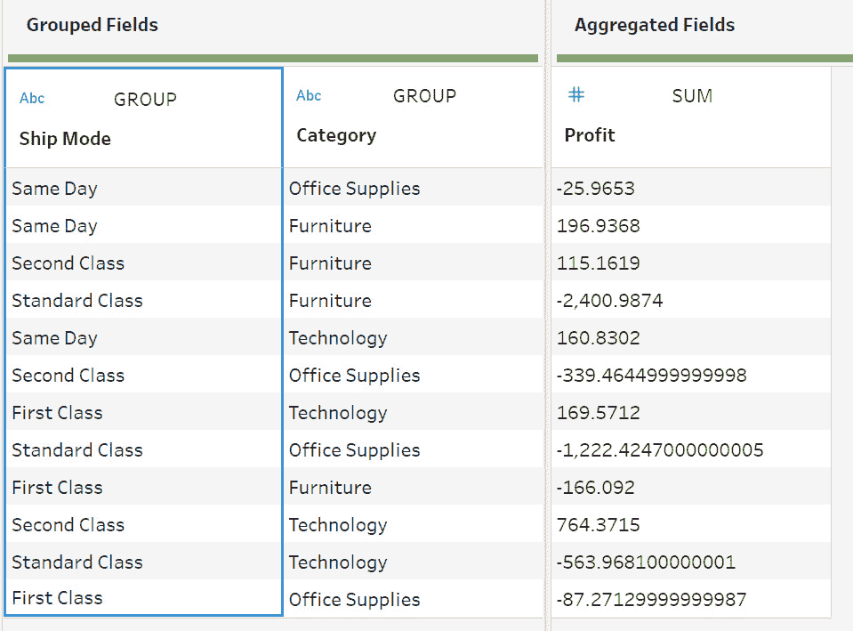

图 3.74：多个分组字段聚合结果

1.  除了清理，清理步骤还允许你预览我们的数据。现在向这个聚合添加一个清理步骤并预览数据。切换到使用此截图突出显示的选项显示数据网格：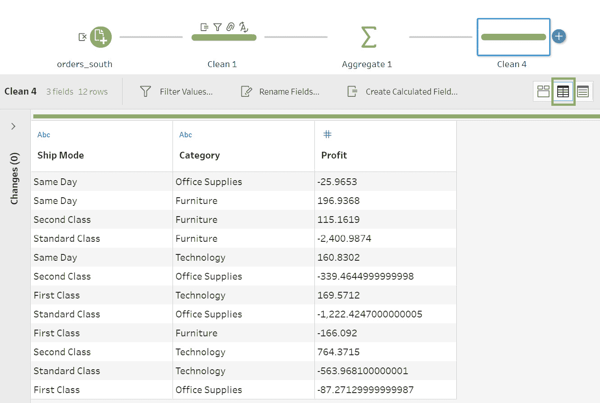

图 3.75：基于聚合步骤结果的完整数据预览

你已经根据`利润`值在`类别`和`船运方式`级别聚合了数据。在本节中，你学习了如何根据不同粒度级别聚合数据。接下来，你将学习如何旋转数据。

## 数据旋转

有时，数据以宽格式存储，而不是 Tableau 所需的长格式。更宽的格式表示数据以水平格式存储。图 3.76 中的项目类别和不同年份的已售单位就是一个例子。在这里，一个类别的数据存储在多个年份列中，表示宽格式。


图 3.76：宽格式

长格式中的数据表示垂直分布。这意味着一个项目类别的不同值将存储在同一个 `Category` 列中。如图 3.77 所示，所有年份都在一个 `Year` 列中，所有已售单位值都在一个 `Units Sold` 列中：


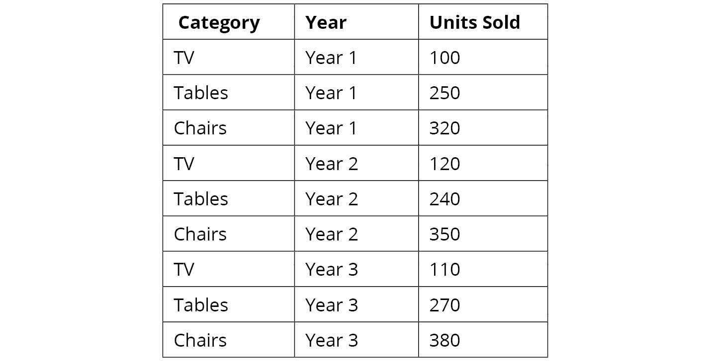

图 3.77：长格式

要使用数据用于可视化，Tableau 需要长格式。在这种情况下，您可能需要使用 Prep 中的数据透视步骤来转换数据以用于 Tableau。下一个练习将展示如何做到这一点。

## 练习 3.09：使用数据透视

在这个练习中，您将连接到 `ConsumerPriceIndices_E_All_Data.csv` 并在此数据上添加一个数据透视。按照以下步骤完成此练习：

注意

在进行练习之前，请确保从本章的 GitHub 仓库下载 CSV 文件。您可以在 [`packt.link/LUsoU`](https://packt.link/LUsoU) 找到数据文件。

1.  连接到 `ConsumerPriceIndices_E_All_Data.csv` 数据源：


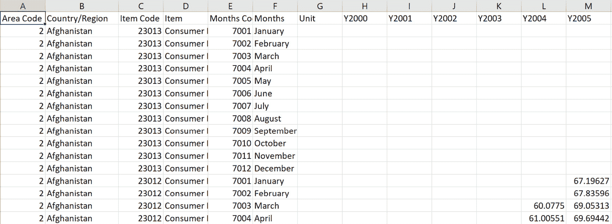

图 3.78：CustomerPriceIndices_E_All_Data 中的数据

正如您所看到的，国家数据按不同的年份存储在不同的列中（从列 `H` 到列 `X`）。这是一个宽格式的例子。为了将此数据用于可视化分析，您需要将其转换为长格式。

1.  点击 `添加连接` – `文本文件`。导航到 `WorldIndicators Files` 文件夹，您可以在此找到该文件。点击 `打开` 将其添加到流程中。

这将把数据添加到流程中。您可以通过添加一个清理步骤来预览数据。一旦添加，点击 `Clean 4` 打开数据网格。


图 3.79：添加清理步骤

您将观察到各种年份值存储在不同的列中，而不是不同的行中，正如您在图 3.78 的 Excel 数据预览中所看到的。此外，空值是没有数据存在的空白记录：


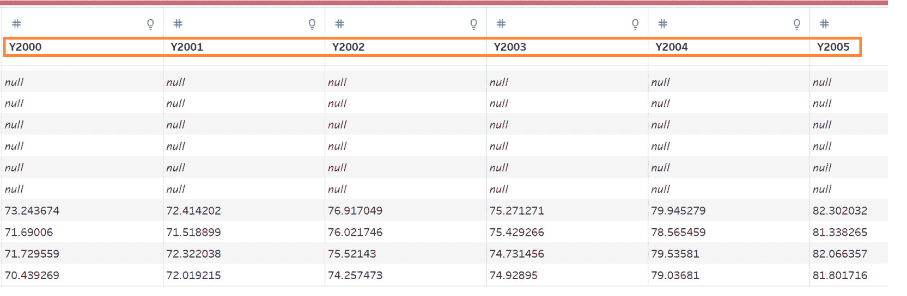

图 3.80：水平存储的年值数据预览

1.  确保它与 `Months` 列的值相似（即在一个单独的列中）：


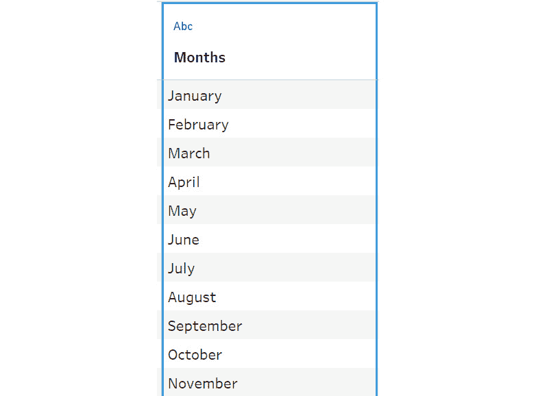

图 3.81：通过月份列表示的长格式

1.  通过点击 `+` 并添加一个 `Pivot` 步骤来完成：


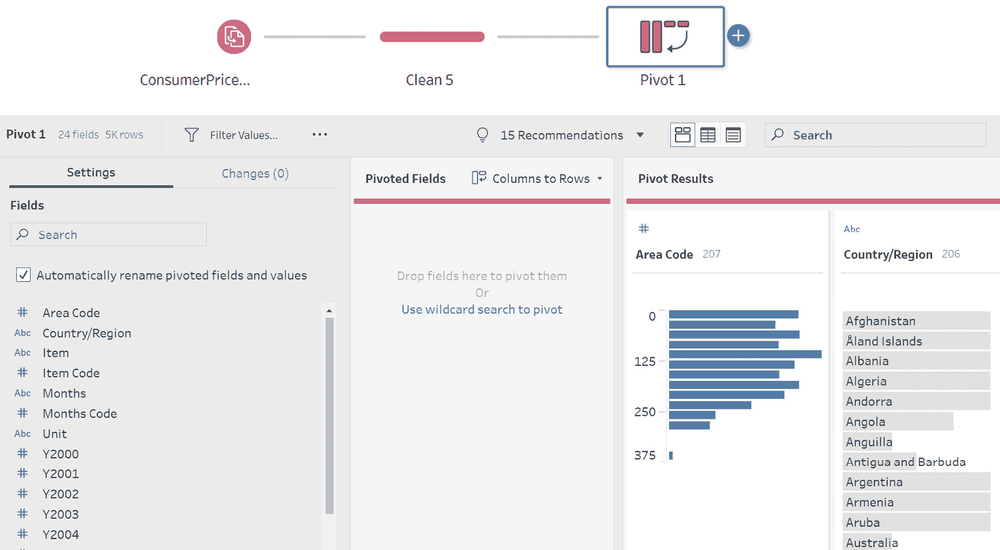

图 3.82：数据透视步骤属性

1.  接下来，拖动您想要数据透视的字段，即所有年份字段。通过选择所有年份列来完成此操作。使用*Ctrl* + 点击进行多选并拖动它们到`Pivoted Fields`区域：

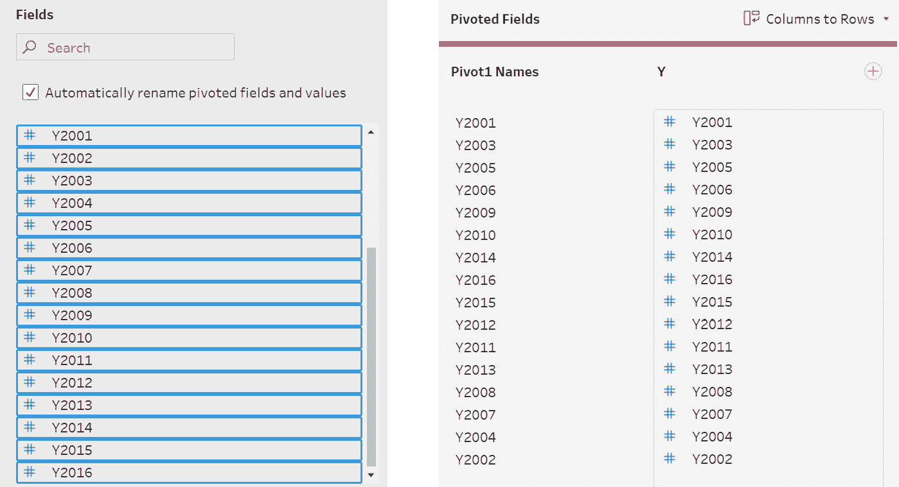

图 3.83：向数据透视添加列

1.  重命名这些新列。如果您想添加一个额外的数据透视字段，可以通过点击`+`图标并添加另一个数据透视到您的数据中来实现。

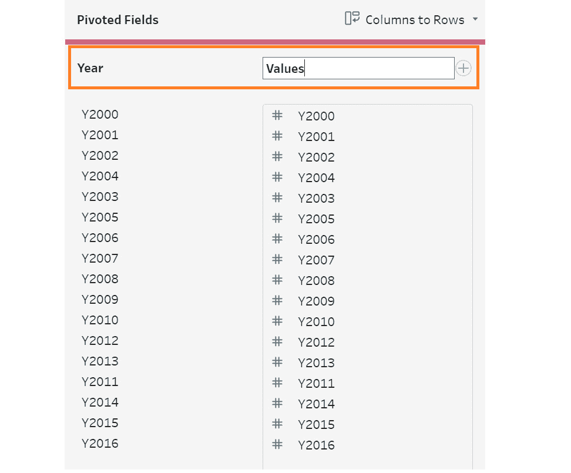

图 3.84：向数据透视表添加额外列

1.  现在，向这个数据透视表添加一个清洁步骤，并预览数据。向下滚动数据预览窗口，观察不同的值：

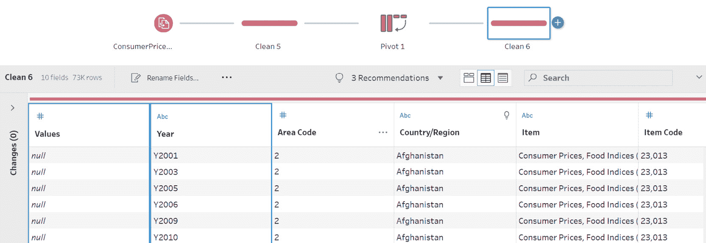

图 3.85：完成数据透视转换后的数据预览

您已将存储为不同列中的年份数据透视为单个列中的年份。现在，您可以比较不同年份的值以了解模式 - 您将在下一章中详细了解这一点。接下来，您将学习如何连接和合并数据。

### 数据的连接和合并

数据的连接和合并与 Tableau Desktop 类似，有一些额外的功能可以帮助分析连接结果。

连接是将两个或多个表基于某些公共字段合并成单个表的一种方式。这种组合的结果比原始表包含更多的列，因此它在水平方向上扩展。Tableau Prep 支持以下连接类型：

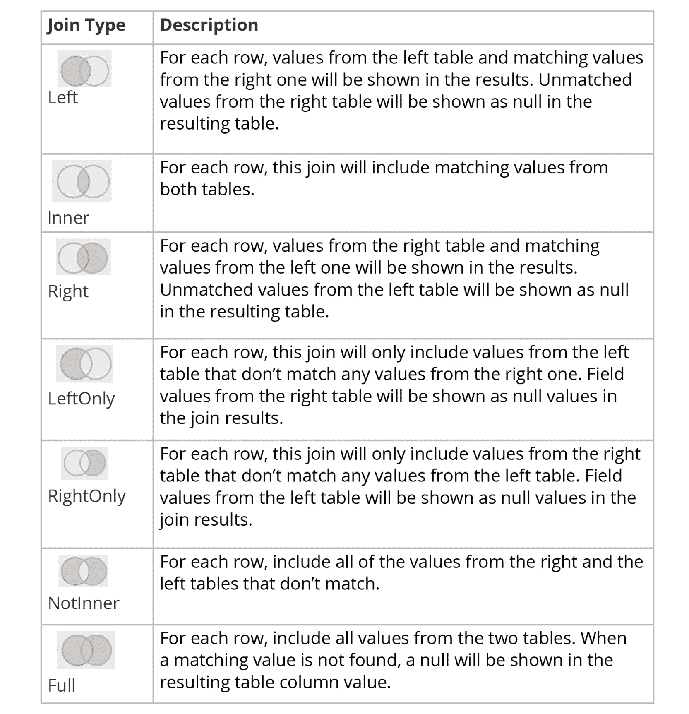

图 3.86：连接类型

您现在将更仔细地查看以下示例中的连接。

## 练习 3.10：连接两个数据源

在这个练习中，您将使用`Orders_Central`表与`Return_reason_new`表进行连接，以分析订单退货。这两个数据源都位于`Superstore Files`文件夹中：

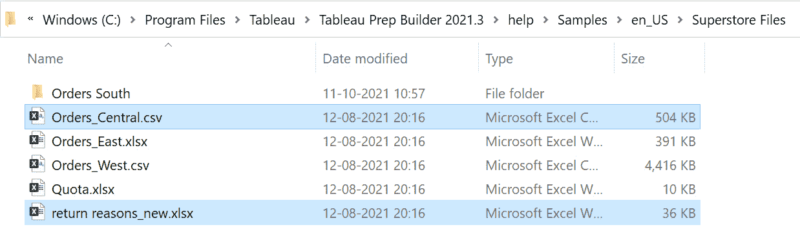

图 3.87：输入文件位置

按照以下步骤完成此练习：

1.  使用`Connect` – `Text File`添加`Orders_Central.csv`数据源并选择此文件。对`Returns`数据重复相同的操作。使用`Connect` – `Microsoft Excel`选择`return reasons_new`文件。

1.  在为两个数据源都添加清洁步骤之后，您可以观察到`Order ID`列可以用作连接这两个数据源的公共字段。

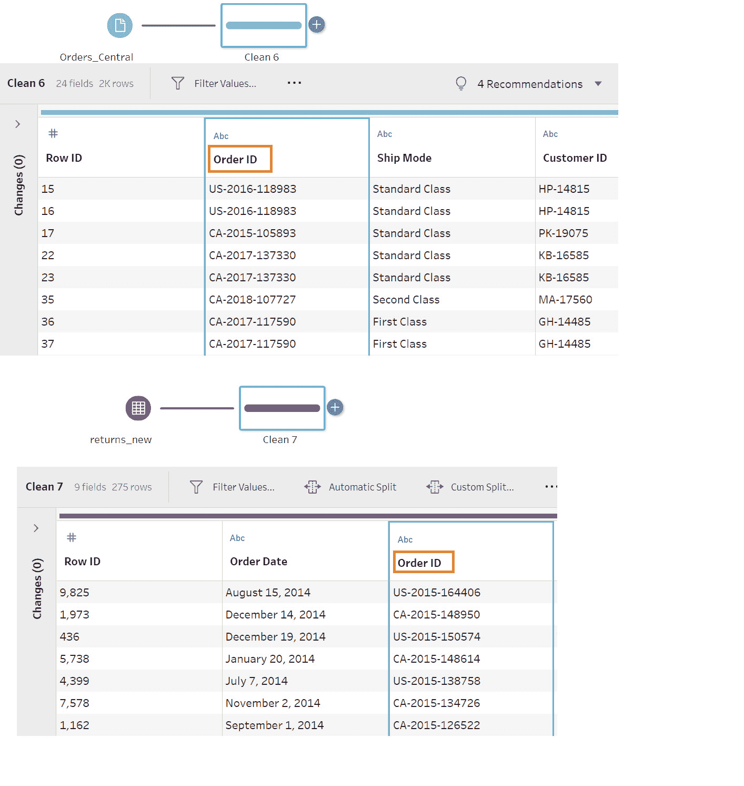

图 3.88：查找连接列

1.  在`Order_Central`的清洁步骤之后添加一个连接步骤，如下所示：

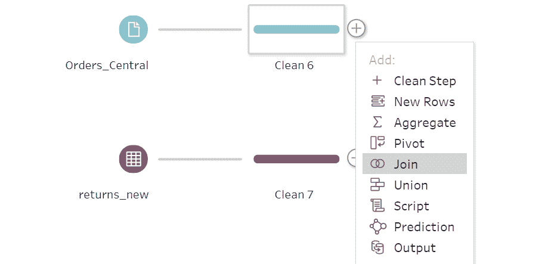

图 3.89：在工作流程中添加连接步骤

1.  要进行连接，请通过点击并拖放到“连接”图标来选择步骤。选择“清洁 7”步骤并将其拖放到“连接”步骤。当它被拖放到“连接”图标旁边时，将弹出三个选项：“添加”、“并集”和“连接”。将“清洁 7”步骤拖放到“添加”选项。将其拖放到连接处将在流程中添加另一个连接步骤。您将在下一节学习“并集”选项。

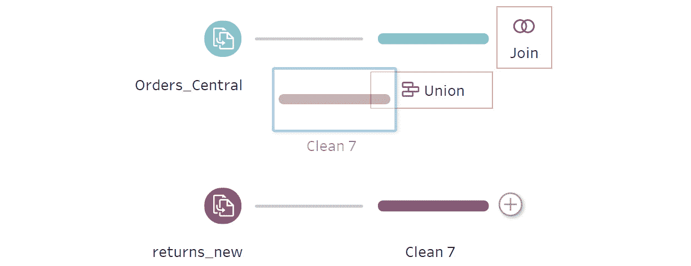

图 3.90：连接选项预览

1.  在添加连接后，点击“连接 1”窗口以打开属性：

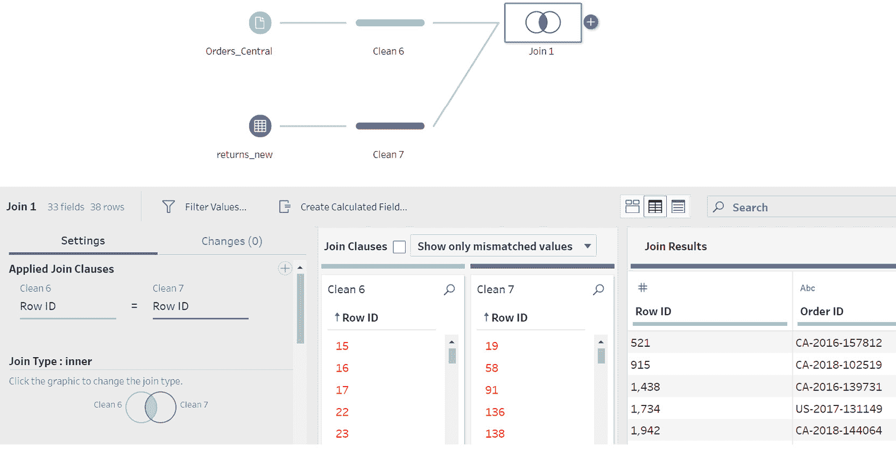

图 3.91：分析连接结果

1.  如您在设置中看到的，默认连接基于“行 ID”列。这需要更改为“订单 ID”。要更改连接子句，请点击“行 ID”列以打开包含不同列的弹出窗口，并选择“订单 ID”：

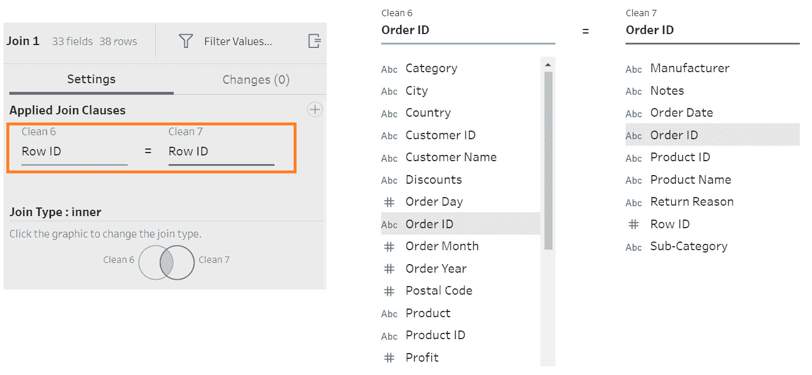

图 3.92：更改连接子句

完成此操作后，工作流将根据“订单 ID”列在“清洁 6”和“清洁 7”步骤之间反映连接：

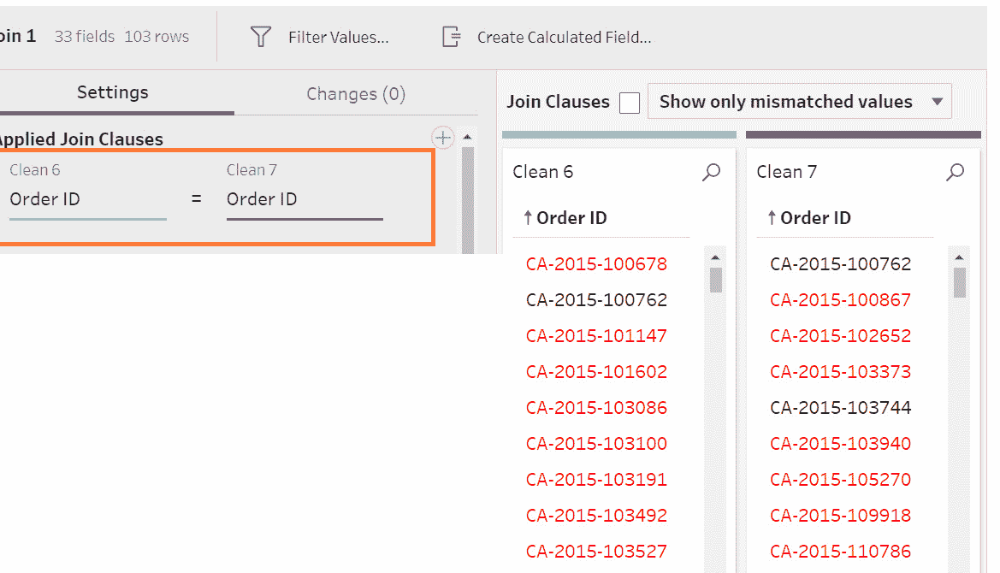

图 3.93：根据更改连接子句的连接值预览

在您的屏幕上，您将看到一些值在右侧以红色显示。红色值是未连接的值，黑色值是已连接的值。

1.  默认连接是内部连接，但点击连接图标的各个阴影区域可以更改连接类型。有多种连接类型，将在本例之后详细讨论。选择“清洁 6”的空白区域，将连接类型更改为左连接，如下所示：


图 3.94：更改连接类型

在“连接结果摘要”中，您可以查看附加信息，例如包含和排除的记录数，以及匹配/不匹配的记录。根据连接条件，这些值将发生变化。您可以看到有`2,341`个订单已被返回，如“连接结果”所示：

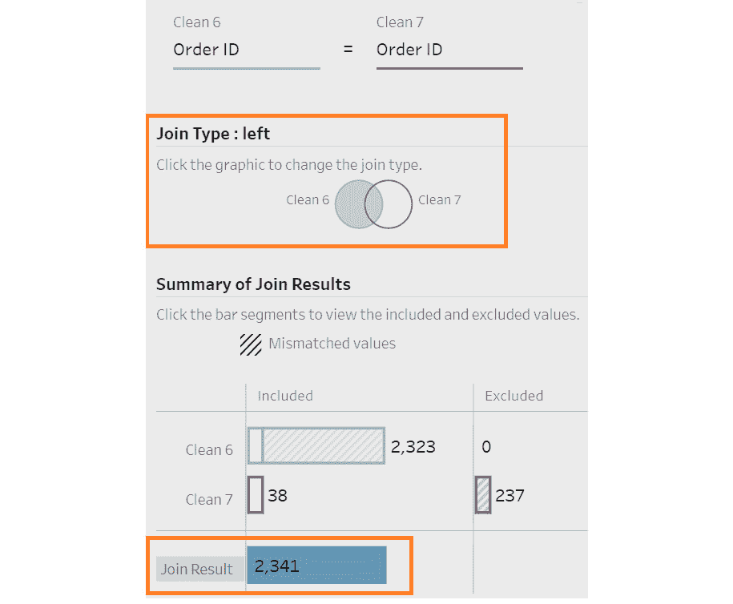

图 3.95：分析连接结果

1.  将鼠标悬停在条上以在工具提示中获取更多信息：

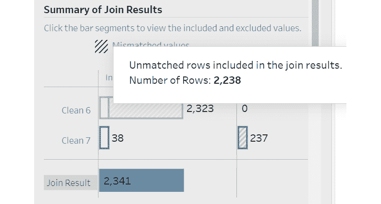

图 3.96：在结果条上悬停以获取更多详细信息

最后，您有“连接子句建议”，这是一个可以用作潜在连接子句的匹配列名列表。

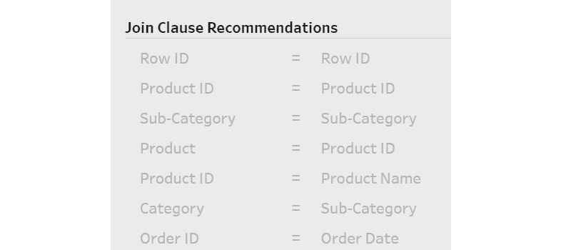

图 3.97：连接子句建议

1.  如往常一样，添加一个清洁步骤以预览连接的数据：


图 3.98：连接结果的预览

您现在已将 `Returns` 表与 `Orders_Central` 表连接。您已引入 `Orders_Central` 中的记录以及 `return reasons_new` 中的匹配记录。此连接显示了已退回的订单数量。您可以根据客户名称、产品类别和产品进一步分析退货情况，并调查退货原因。

## 并集

并集是将具有类似列结构的多个表合并为单个表的一种方式。与连接不同，在并集中，您需要垂直添加数据行。当您只想将数据附加到具有类似列的其他数据下方而不是连接时，就会执行并集。并集的一个非常常见的例子是，当您有两个包含类似列但分别维护以表示不同年份的表格时。例如，您可能希望将多年订单信息合并到一个综合数据集中。

考虑以下表格。在这里，A 和 B 的并集生成一个包含两个表格中值的单个表格：


图 3.99：两个表的并集

## 练习 3.11：表的并集

在这个练习中，您将连接 `Orders_Central` 数据与 `Orders_East`，将这些表格合并为一个单一表格。这两个表格都包含类似列，包括订单级别的信息，如下面的截图所示：

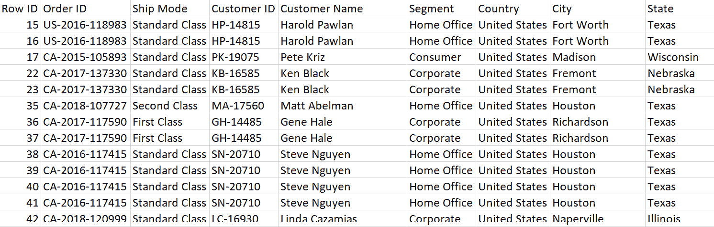

图 3.100：Orders_Central 的数据预览

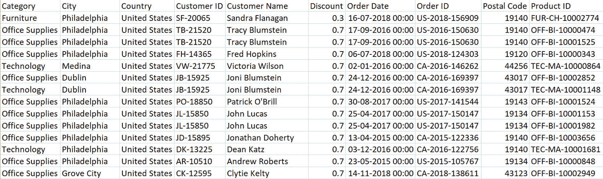

图 3.101：Orders_East 的数据预览

您可以看到这两个文件具有相似的列。这里的目的是将这些表格合并为一个单一统一的数据文件。按照以下步骤合并这些数据源：

1.  从 `Superstore Files` 文件夹访问两个数据文件：

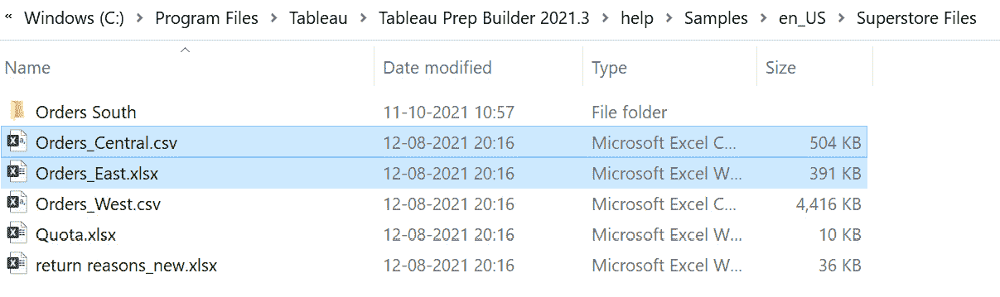

图 3.102：输入文件的文件位置

您已经在前面示例的工作流程中有了数据源 `Orders_Central.csv`。

1.  添加 `Orders_East` 数据。使用 `连接` – `Microsoft Excel` 并选择此文件。添加此步骤后，流程应如下所示：

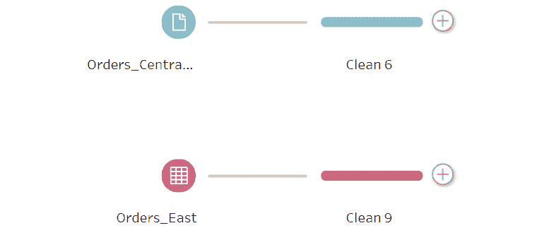

图 3.103：文件输入步骤后的工作流程

1.  观察到大多数列名都是相同的，这意味着您可以联合这些数据源。不匹配的列在两个表格中都被突出显示，如下面的截图所示：

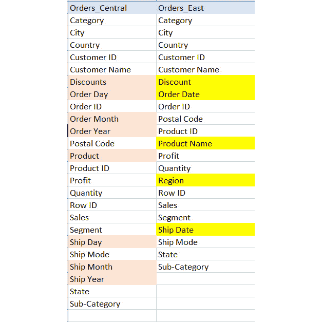

图 3.104：两个数据集中列不匹配

1.  将 `Orders_East` 中的清洁步骤拖动到 `Orders_Central` 的清洁步骤上，然后拖动到并集步骤上：

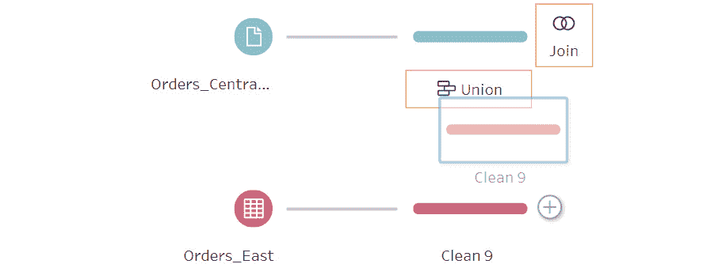

图 3.105：在工作流程中添加并集

1.  将添加一个新的联合步骤，其中用彩色列指示两个数据源：

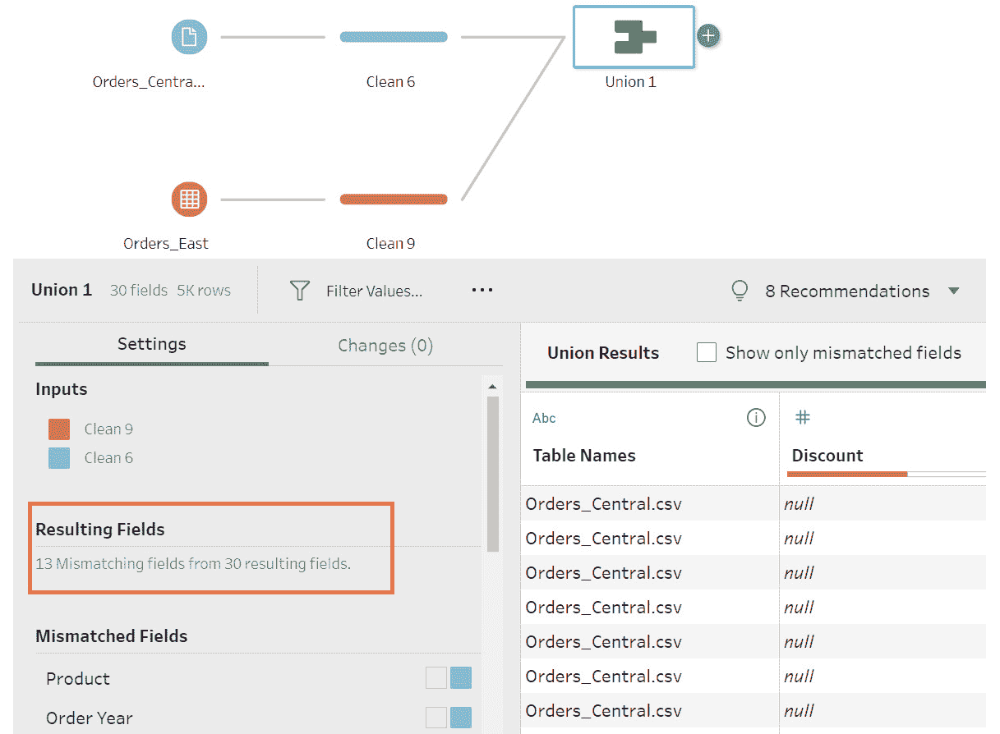

图 3.106：分析联合结果

您可以看到有 13 个不匹配的字段。

1.  某些列，例如`Discounts`（`Orders_Central`）和`Discount`（`Orders_East`），指的是同一个列。同样，`Product`（`Orders_Central`）和`Product Name`（`Orders_East`）也是相同的列。将它们合并为一个单独的列，如下所示。

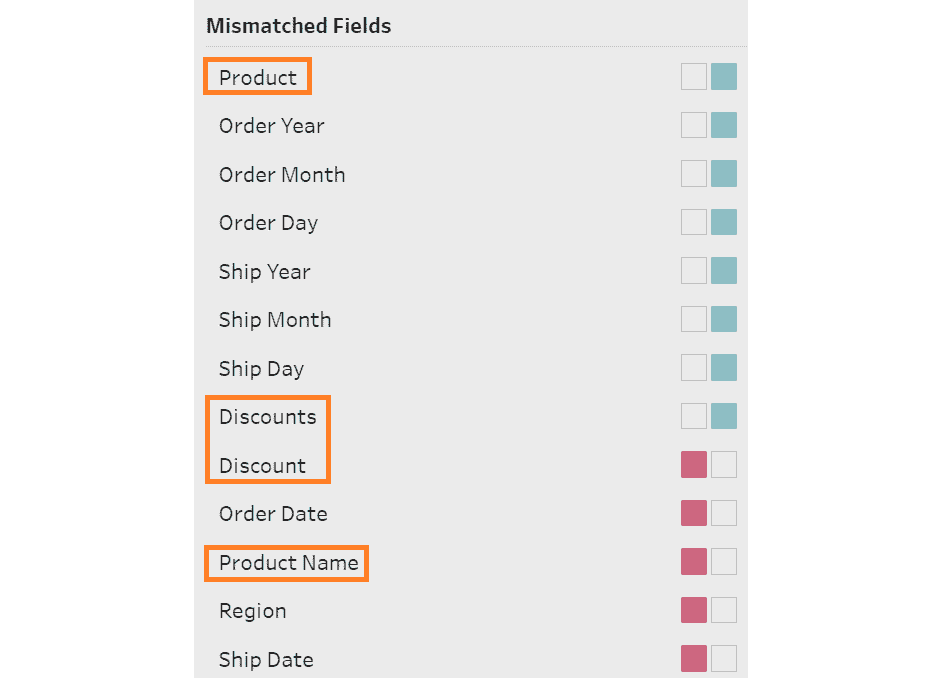

图 3.107：识别相似的列

1.  首先选择`Discount`，然后悬停在`Discounts`列上并点击`+`图标。这将合并两个列为一个：


图 3.108：将不同的折扣列合并为一个单独的列

1.  选择`Product Name`。Prep 会突出显示具有匹配单词的其他列，建议可能的匹配。现在，也为`Product`重复相同的步骤。

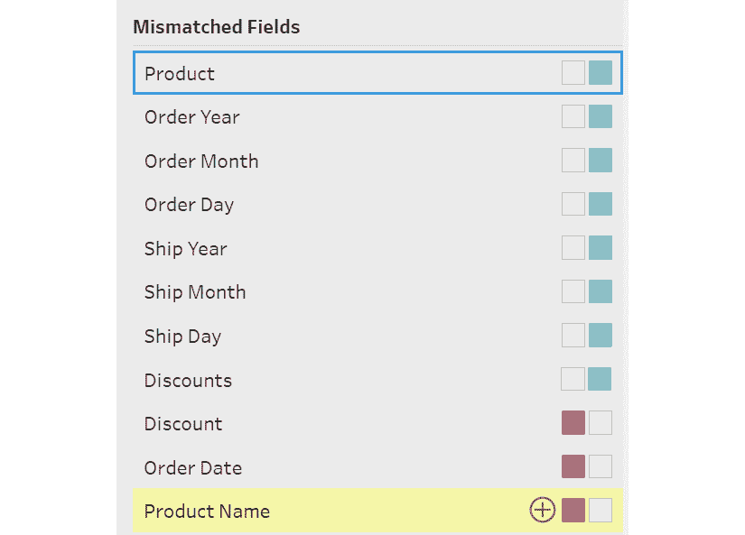

图 3.109：将不同的产品名称列合并为一个单独的列

1.  `Region`列在`Orders_East`中未找到，因此可以从联合结果中排除。为此，悬停在`Union Results`部分上并移除`Region`列，如下面的截图所示：

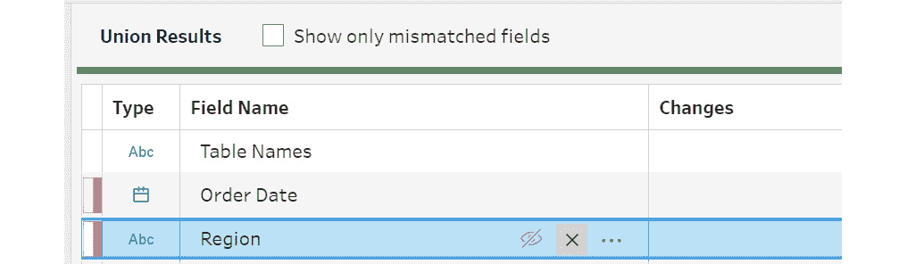

图 3.110：从联合结果中排除一个列

可以通过使用清洁步骤结合`Order Date`、`Order Year`、`Order Month`、`Order Day`和`Ship Date`来进行进一步的清洁。

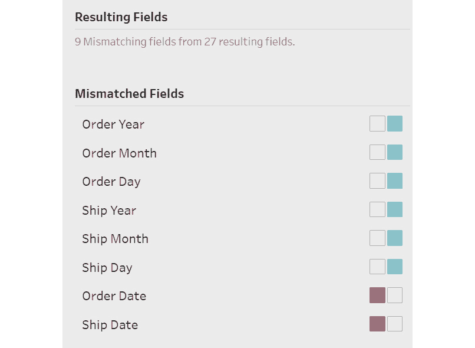

图 3.111：可以使用清洁操作合并的列不匹配

1.  完成后，将一个清洁步骤添加到联合操作中预览数据。您可以看到，Prep 已添加一个名为`Table Names`的列，以指示数据来自哪个表：

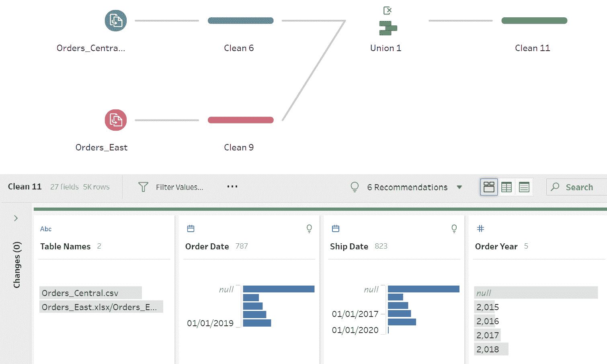

图 3.112：联合工作流程结果

在本节中，您学习了如何使用联合步骤将来自两个源的数据合并。一旦合并，结果数据源可以用于通过可视化进行对比分析。您还看到了如何合并不匹配的列名。接下来，您将了解脚本步骤。请注意，这并不常用，因为它是一个非常高级的步骤，需要使用 R 或 Python 脚本运行复杂的统计程序。因此，这将是一个纯粹的理论讨论。

## 脚本步骤

一个脚本允许您运行用 R 或 Python 编写的外部程序。有时，可能需要进行一些复杂的统计计算，这些计算无法使用 Prep 完成。因此，Prep 允许您通过脚本步骤将这些程序集成到工作流程中。

在添加脚本之前，您需要使用 Rserve 或 TabPy 为 R 或 Python 程序建立连接。您可以通过访问`Help`菜单并选择`Settings and Performance`选项来实现，具体操作为：`Help` – `Settings and Performance` – `Manage Analytics Extension Connection`：

![图 3.113：脚本窗口属性

![图片 B16342_03_113.jpg]

图 3.113：脚本窗口属性

现在，您可以添加 R 或 Python 的服务器详情。完成此操作后，您可以在流程中添加脚本步骤。这将打开以下窗口：

![图 3.114：脚本连接设置

![图片 B16342_03_114.jpg]

图 3.114：脚本连接设置

在这里，您可以添加程序文件并指定需要在数据上运行哪个函数。有关更多详细信息，您可以点击`Learn more`链接。

# 流程和数据导出

创建完工作流后，您需要导出数据或共享工作流，以便在 Tableau Desktop 中进行数据分析与可视化。在本节中，您将了解以下导出选项：

+   流程保存选项

+   数据导出选项

流程保存选项：工作流可以保存为两种格式：`.tflx`和`.tfl`。如果您单独工作并且所有数据都在您的系统中，您可以将流程保存为 Tableau Prep Builder 流程（`.tfl`）文件格式。如果您想与使用的数据共享流程，请使用`.tflx`格式，它将所有在流程中使用的底层本地文件（如 Excel、文本或 Tableau 提取文件）组合或打包成一个共享的单个流程文件。请注意，只有本地文件可以打包到流程中。数据库连接的数据不包括在内。

要保存流程，请点击`File`菜单，选择`Save As`，并选择所需的格式。

![图 3.115：保存工作流

![图片 B16342_03_115.jpg]

图 3.115：保存工作流

下一个练习将详细探讨数据导出选项。

## 练习 3.12：导出数据

在 Prep 中完成数据转换步骤后，最后一步是导出这些数据，以便可以用于开发可视化。`Output`步骤允许您以多种格式导出数据。在本练习中，您将使用`Output`步骤导出数据。

1.  从上一个示例继续，通过点击`+`并选择`Output`来在`Union`步骤中添加一个`Output`步骤：

![图 3.116：添加输出步骤

![图片 B16342_03_116.jpg]

图 3.116：添加输出步骤

完成此操作后，您将看到以下窗口：

![图 3.117：输出步骤属性

![图片 B16342_03_117.jpg]

图 3.117：输出步骤属性

1.  按照以下截图所示保存输出：

![图 3.118：保存流程输出的格式

![图片 B16342_03_118.jpg]

图 3.118：保存流程输出的格式

在这里，您将保存为`File`格式，但了解其他格式也很重要。

1.  将其保存为 Tableau Server 上的`已发布数据源`、数据库中的 SQL Server 等数据库表或其他地方，如下所示：

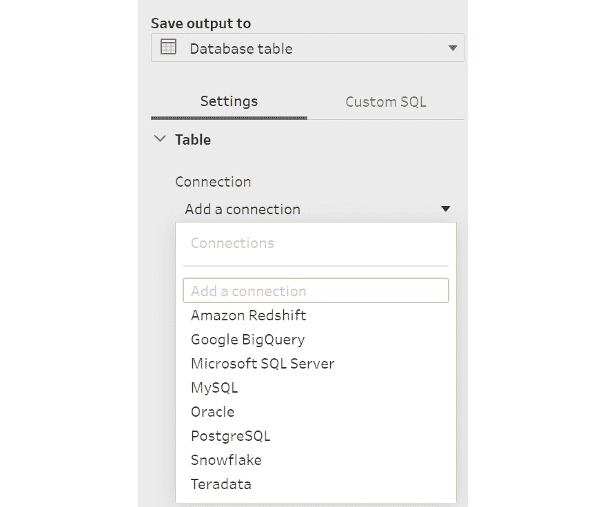

图 3.119：在 Tableau Server 上保存输出的文件格式

1.  选择`文件`，然后选择要保存到的文件夹。输入输出名称，并将输出类型设置为 CSV。你还会看到另一个选项，`.hyper`格式，它可以在 Tableau Desktop 中用作提取。

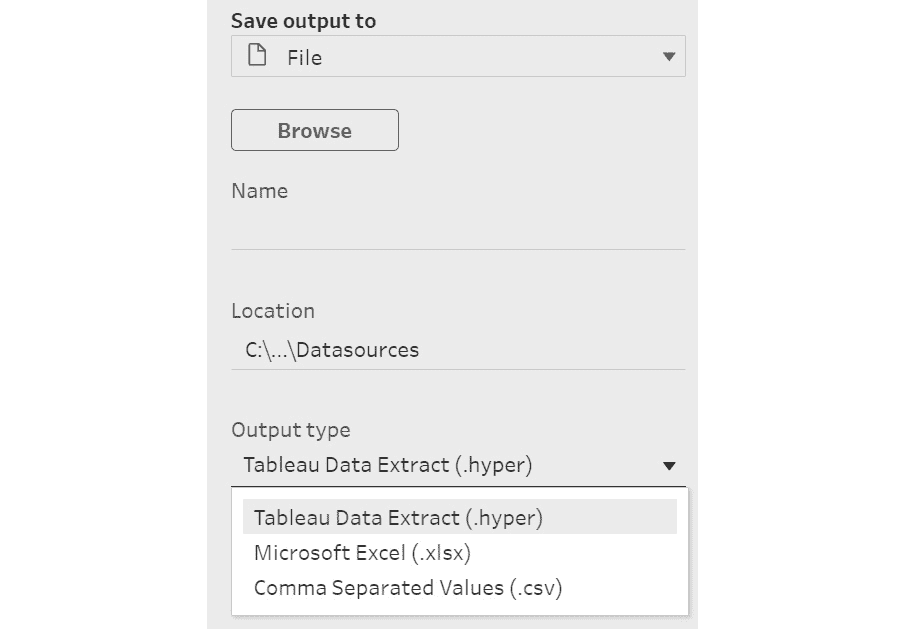

图 3.120：保存输出的 CSV 文件格式

1.  点击`运行流程`并保存输出。


图 3.121：运行流程

1.  完成后，导航到文件夹位置并检查文件：

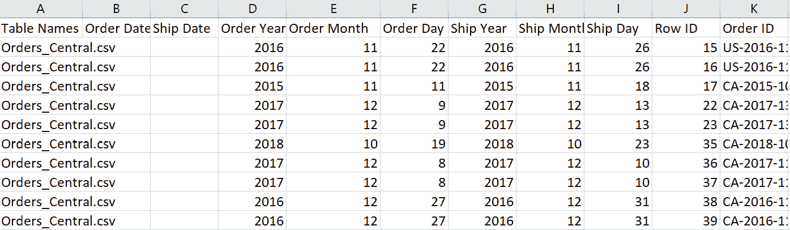

图 3.122：工作流程输出预览

1.  当输出类型为 CSV 时，你在*图 3.122*中看到的`完整刷新`选项将在流程再次运行时覆盖输出文件。如果选择`.hyper`输出格式，你也可以选择将新数据追加到现有的提取中。

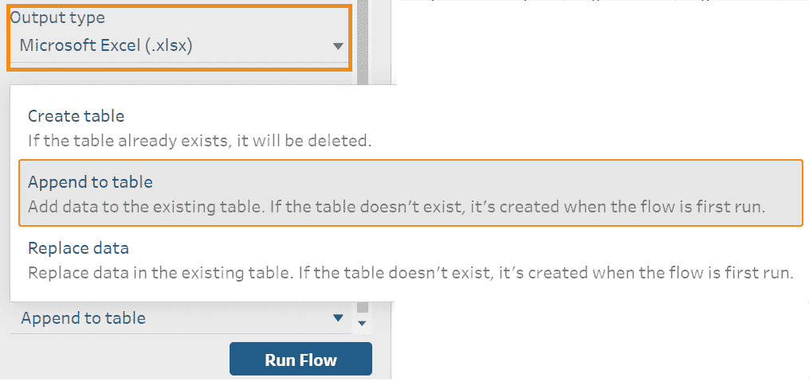

图 3.123：向现有已保存输出添加新输出

现在你已经了解了不同的数据转换方法，是时候在一些基于项目的场景中进行一些实际操作练习了。

## 活动 3.01：寻找订单量最高的月份

作为一家店铺的经理，你可能遇到过想要通过销售额来评估店铺绩效的情况。因此，分析产品的销售模式非常重要。此外，你还可以识别出与其它产品相比销售更多的产品，这种分析有助于进一步增加它们的销售额。此外，你还想了解产品在不同月份的销售是否存在模式。如果存在模式，则可以进行分析并用于设计强大的营销策略，以提升店铺的销售和收入。

通常，订单信息与产品信息分开存储，这是为了保持数据优化。

注意

在本活动中，你将使用的数据存储在`Activity File.xlsx`中。`Orders`工作表包含`订单 ID`和`产品类别`。你可以从本章的 GitHub 仓库下载 Excel 文件，链接为[`packt.link/iWtp4`](https://packt.link/iWtp4)。

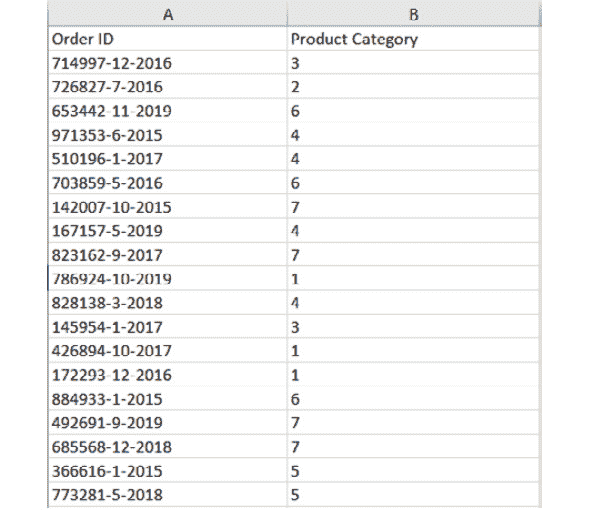

图 3.124：订单工作表预览

如你所见，`订单 ID`列是每个订单的 ID、月份和年份的组合。`产品类别`是一个 ID 列。更多详细信息可以在`产品类别`工作表中找到：

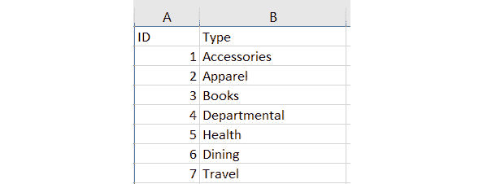

图 3.125：产品类别工作表预览

要成功完成这个活动，你需要应用你对拆分、连接和清理的知识来识别重要的销售趋势。具体来说，你需要回答以下问题：

哪个月份和年份组合的订单量最高？

哪个产品类别的订单量最高？

注意

本活动的解决方案可在此处找到：[`packt.link/CTCxk`](https://packt.link/CTCxk)。

## 活动三.02：数据转换

现在你已经了解了各种产品的趋势，分析客户信息以更好地理解客户对每种产品的行为将非常有用。通过这次分析的结果，你可以设计定制的优惠和优惠券，以增强客户的购物体验。这也有助于建立与客户的品牌亲和力，最终可能导致销售额的增加。在这个活动中，你将结合客户信息与之前的工作流程，以获得订单、产品和客户的统一视图。你将继续使用之前活动中的同一 Excel 工作表来完成这个活动。

客户订单信息存储在`CustomerOrders`工作表中，如下截图所示：

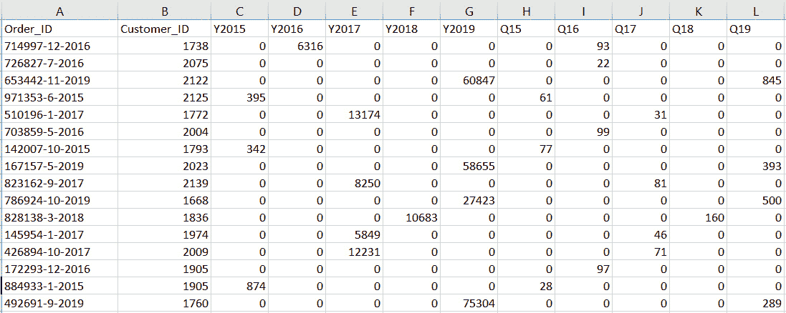

图 3.126：CustomerOrders 工作表预览

你可以看到数据以宽格式存储，即它以横向方式分布在每个客户的各个年份中。你需要对这些数据进行转置才能在工作流程中使用。

接下来，你必须将此信息与`CustomerNames`工作表连接起来，该工作表如下所示：

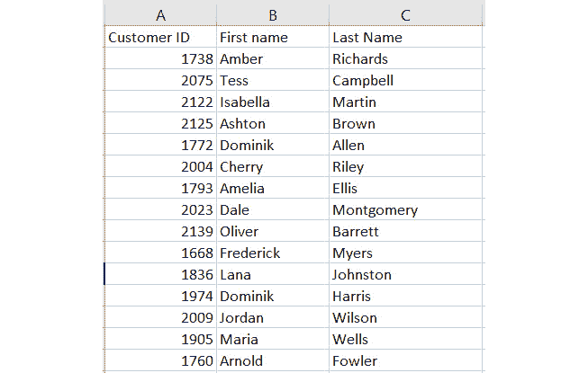

图 3.127：CustomerNames 工作表预览

在这个活动中，你的目标是根据订单数量识别前五名高价值客户。

你还需要导出这些数据，以便你可以在 Tableau Desktop 中使用可视化更好地分析它们。

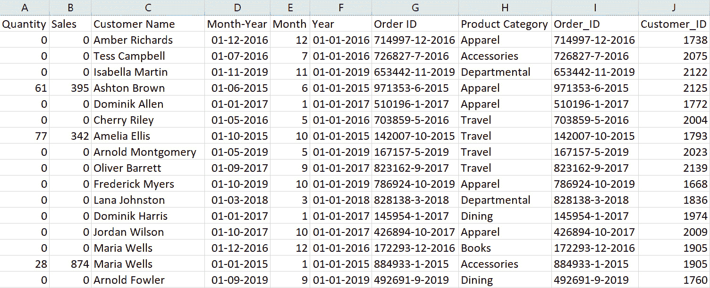

图 3.128：活动 2 输出工作表预览

注意

本活动的解决方案可在此处找到：[`packt.link/CTCxk`](https://packt.link/CTCxk)。

# 摘要

在本章中，你学习了如何连接到各种数据源。连接到数据后，你学习了如何使用数据概览来分析它。然后，你学习了使用各种方法来清理数据，例如过滤、创建计算、分组和拆分。数据清理是有效数据分析的前提，你将在本书的剩余部分使用这些方法。

一旦你清理了数据，你研究了使用聚合来分组数据的方法，然后学习了如何使用转置来转换数据。你还使用了连接和合并选项来结合多个数据源。最后，你学习了如何保存、共享和导出你的工作流程和数据。

本章的关键收获是如何根据项目需求高效地转换数据，使其适合可视化。在下一章中，你将使用在本章中学到的技能，例如聚合、连接和分组，在 Tableau 中创建图表。
