# 第六章：6. 数据探索：探索地理数据

概述

本章回顾了在 Tableau 中可用的地理功能。Tableau 提供了一套广泛的选项，用于处理基于位置的源数据，这可以帮助您使用点或多边形位置数据设计解决方案。到本章结束时，您将能够有效地在 Tableau 中使用地理数据来执行复杂的位置分析。您将更深入地了解如何导入多种数据格式，并使用您的数据创建精致、交互式的地图。这些技能将通过一系列练习和活动来培养，在活动中您将从头到尾创建自己的地理工作簿。

# 简介

在上一章中，您探索了数据集中的分布和关系，并学习了如何识别给定数据集中的模式。本章将专注于数据的地理方面以及位置如何影响这些分布和关系。

理解地理模式对于许多数据集至关重要，无论是全球公司的全球收入模式，还是小企业的本地购买模式。这类数据特别适用于使用地图向内部或外部客户解释模式，在地图上您可以展示从地区或国家级别到邮政编码甚至更小的地理级别，具体取决于数据的收集方式。这可以非常有助于可视化购买、投票或人口统计模式，仅举几个例子。

使用地理数据和地图最强大的方面之一是许多用户可能对位置数据具有直观的理解。这有助于使模式更加清晰，让您能够更快地得出关于客户、客户、捐赠者或其他组织利益相关者位置和互动的关键见解。

地理数据可以像基本的街道地址信息那样简单，也可以像由组织创建的基于位置的复杂层次结构那样复杂，其中基于一组自定义边界定义了多个地理级别。理想情况下，您的工作从已经地理编码的数据开始，这使得将数据读入 Tableau 而无需进一步步骤变得相当简单。在某些情况下，您可能需要做一些额外的工作，以确保您的位置数据被准确定义。了解您在数据中处理的地域粒度级别以及数据中捕获的位置信息类型非常重要：您的源数据中是否有经纬度坐标，还是您将使用 Tableau 自动执行此过程？

在本章中，您将学习如何导入地理数据并在您的 Tableau 工作表和仪表板中使用它。本章还将强调何时应该将位置数据映射以及何时最好在图表中使用它来讲述最有效的故事，以及哪种地理粒度级别（邮政编码、城市、州等）适合分析。到本章结束时，您将熟练使用地理数据作为您 Tableau 工具包的关键部分。

在本章中，您将使用 Madrid Airbnb 数据集作为您的点数据，以及一个包含纽约市边界的 shapefile 作为您的多边形数据。

# 导入空间数据

在您可以使用 Tableau 为地理数据集提供的众多功能之前，了解 Tableau 可以使用的地理数据类型非常重要。Tableau 可以从许多流行的格式中获取地理空间数据，包括**shapefile**、**GeoJSON**和**MapInfo**源。下一节将介绍一些最常用的空间格式以及如何将它们添加到您的电子表格中。

空间数据在定义地理属性方面具有独特性。虽然典型的电子表格或数据库数据可能包含地理元素（城市、州、国家、邮政编码等），但它不会包含有关这些实体的附加信息。通常，您将有一对地理坐标来处理：纬度和经度。对于像国家、州或省这样的常见实体，地图软件将识别代码并允许使用颜色渐变（填充）地图。

颜色渐变地图是包含简单纬度/经度值的数据源，这些值对应于邮政编码中心点、商店位置，甚至城市，同时还包括形状细节以及其他地理空间细节。您可以根据数据源中的多边形创建颜色渐变地图。对于更复杂或定制化的内容，您通常会依赖于某种类型的空间文件，该文件提供非常详细的边界信息。颜色渐变地图与填充地图同义——通常在显示国家、州或县级别的政治或其他偏好数据时看到。它们与基于点的地图不同，后者通常由一组单一的纬度和经度坐标定义。在某些情况下，您可以在颜色渐变地图上叠加点，向观众传达第二层信息。现在您已经对空间以及颜色渐变地图有了基本的了解，您现在可以继续学习这些地图类型的数据文件类型。

## 数据文件类型

本节将简要讨论几种在 Tableau 中易于使用的空间文件类型。这些数据类型代表特定的空间（地理）数据格式，可能包含特定地理级别的附加值。如前所述，这些类型与典型的数据库或电子表格数据不同，后者也可能包含诸如城市、州或邮政编码之类的地理字段。这些数据源将在下一小节中讨论；你当前的关注点是几个非常具体的空间来源。让我们简要地浏览每种类型。

### ESRI Shapefiles

Shapefiles 常在用户寻找定义特定地理级别的边界文件时遇到。这类数据通常以多边形（或对应特定地理定义的区域）的形式查看，但也可能包含点或线数据。Shapefile 数据包含多个文件类型，至少必须包含 `.shp`、`.shx` 和 `.dbf` 文件类型扩展名。还有许多其他可选扩展名，提供了关于底层地理数据的额外信息。

Shapefiles 非常流行，特别用于显示特定地理区域的属性，如行政区划图，例如城市政府的官方分区地图，这些内容你将在本章后面进行探索。

### GeoJSON 文件

GeoJSON 是一种始于 2008 年的格式，可以在点、线字符串和多边形级别包含地理细节，以及这些三种类型的组合。这种格式的文件比 shapefiles 更灵活，因为它们使用 JSON 结构来包含多个级别的细节。并非所有几何形状都可以在 GeoJSON 中表示，但现在它被推荐作为 shapefiles 在许多情况下的首选替代品。

GeoJSON 还允许表示地理移动；例如，可以通过一系列按顺序排列的地理坐标来跟踪驾驶路线或飞行路径，形成一个 `LineString`。其他地理类型包括 `Point`、`Polygon`、`MultiPoint`、`MultiLineString` 和 `MultiPolygon`。这些类型可以单独使用或组合使用，使 GeoJSON 成为一个灵活、强大的地理空间来源。

### KML 文件

**KML** 是 **Keyhole Markup Language** 的缩写，它是一种 XML 类型的格式，总是包含纬度和经度属性以及命名的地理点（如伦敦、纽约市等）。这传统上一直是 Google Earth 用于在地图上绘制坐标的格式。

### MapInfo 交换格式

**MapInfo 交换格式**（**MIF**）文件包含来自 MapInfo 软件程序的数据库和地图信息，MapInfo 是最古老和最受欢迎的专用 **地理信息系统**（**GIS**）平台之一。

### MapInfo 表格

MapInfo 表（`.tab`文件扩展名）包含用于 GIS 软件的矢量数据格式。与 shapefiles 一样，有多个文件用于包含属性数据、位置数据和其他相关信息。

### TopoJSON 文件

TopoJSON 是 GeoJSON 的扩展，还包括拓扑信息，可以用于根据区域内拓扑特征对地图进行着色。

## 从 GitHub 下载数据源

如前所述，为了完成本书的此章节或任何其他章节，强烈建议您使用官方 GitHub 仓库上传的数据源。这样做的原因是，到您阅读这本书的时候，官方数据源或该数据源的链接可能已经更改。此外，大多数时候，作为本书 GitHub 仓库一部分的数据源已经被清理，以帮助理解概念。因此，在可能的情况下，请利用官方 GitHub 链接的数据，而不是从官方数据源下载数据。

*第六章：数据探索：地理数据探索* GitHub 数据源文件夹可以在以下 URL 找到：[`packt.link/6fzj9`](http://packt.link/6fzj9)。

+   **纽约市分区数据**：ESRI 代表环境系统研究学院，自 1969 年以来一直支持基于地理的信息管理系统的设计、开发和实施。在我们的数据文件夹“纽约市分区”文件夹中，包含 ESRI 格式的空间文件，这是.shp、.shx、.dbf 和.prj 文件格式的组合。要连接到这些空间文件，所有上述文件以及.zip 文件都应该包含在同一个文件夹中。

纽约市数据源链接：[`data.cityofnewyork.us/City-Government/Zoning-GIS-Data-Shapefile/kdig-pewd`](https://data.cityofnewyork.us/City-Government/Zoning-GIS-Data-Shapefile/kdig-pewd)。

+   **马德里 Airbnb 数据源**：InsideAirBnB.com 由 Murray Cox 为其 Airbnb 项目创建，数据集包含多个文件，包括列表详情、评论以及社区详情。

InsideAirBnB 数据源链接：[`insideairbnb.com/get-the-data.html`](http://insideairbnb.com/get-the-data.html)。

+   **SF 买出数据**：此文件来自旧金山市的公共数据仓库，其中包含 2015 年以来旧金山市所有买出协议的 shapefile (.shp)文件。您将在活动部分使用此数据源。

SFGov.org 数据源链接：[`data.sfgov.org/Housing-and-Buildings/Buyout-Agreements/wmam-7g8d/data`](https://data.sfgov.org/Housing-and-Buildings/Buyout-Agreements/wmam-7g8d/data)。

## 练习 6.01：下载源数据

在这个练习中，您将下载并导入一个可用于填充（渐变）地图的地理数据源。

执行以下步骤以完成此练习：

1.  打开浏览器并导航到 `Chapter06` GitHub 仓库：[`packt.link/6fzj9`](http://packt.link/6fzj9)。

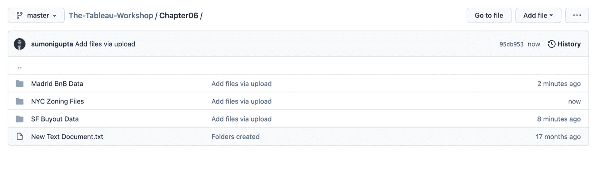

图 6.1：纽约市分区 shapefile

1.  点击 `NYC Zoning Data` 文件夹并下载 ZIP 文件。将 ZIP 文件解压到您选择的位置：

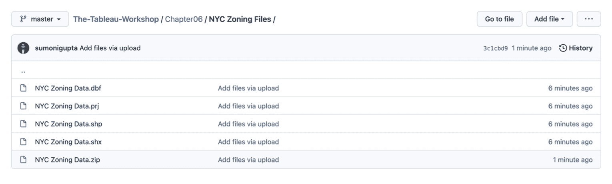

图 6.2：纽约市数据下载格式

1.  定位并提取您刚刚下载的 shapefile。

1.  打开一个新的 Tableau 工作簿。

1.  通过选择 `数据` | `新建数据源` 添加一个新的数据源：

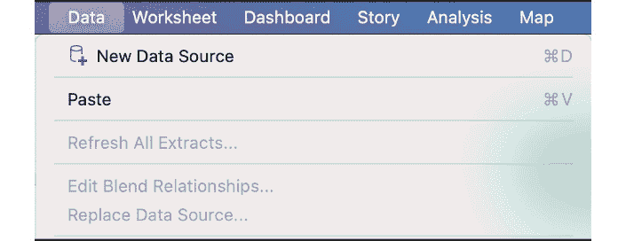

图 6.3：添加新数据

1.  从“连接”菜单中选择 `空间文件`：

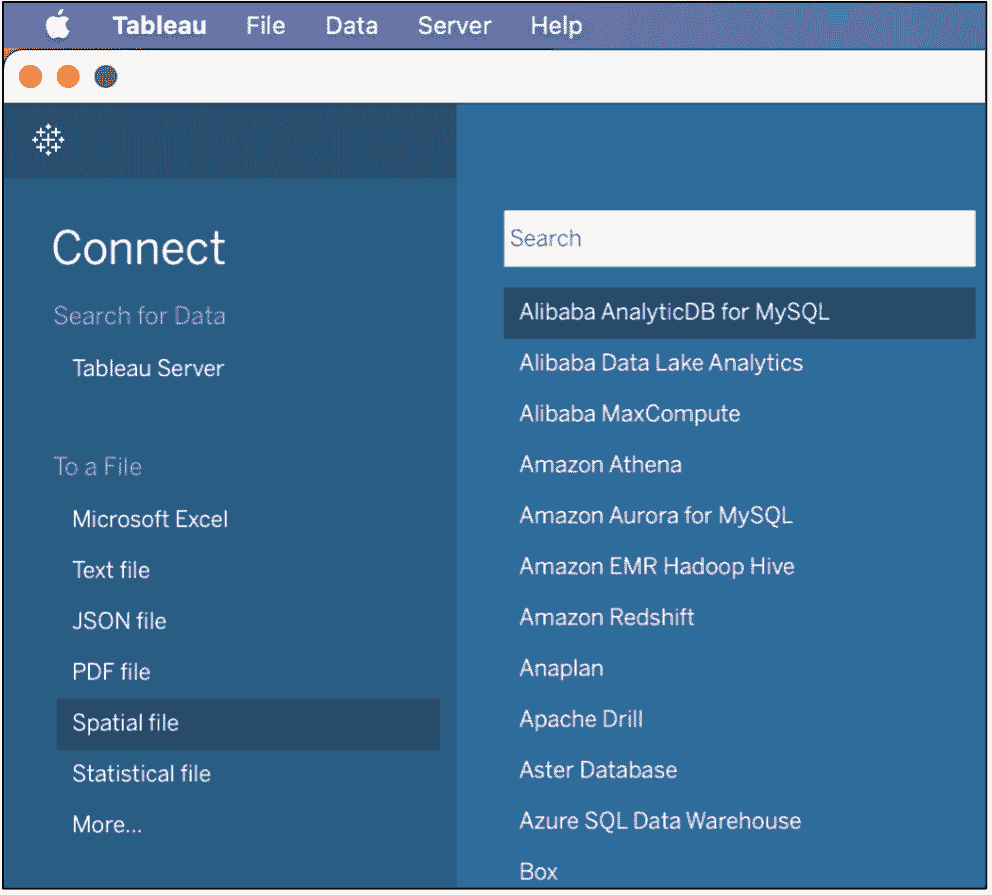

图 6.4：选择空间文件选项

1.  打开下载的文件并将 `.shp` 文件导入到 Tableau。当您从 `NYC Zoning Data` 文件夹添加 .shp（空间）文件时，Tableau 会处理该文件夹中的所有文件，包括其余四种文件格式，并创建数据的多边形地图。当所有文件合并成一个 shapefile 并加载到 Tableau 中时，Tableau 会处理 ESRI 文件：

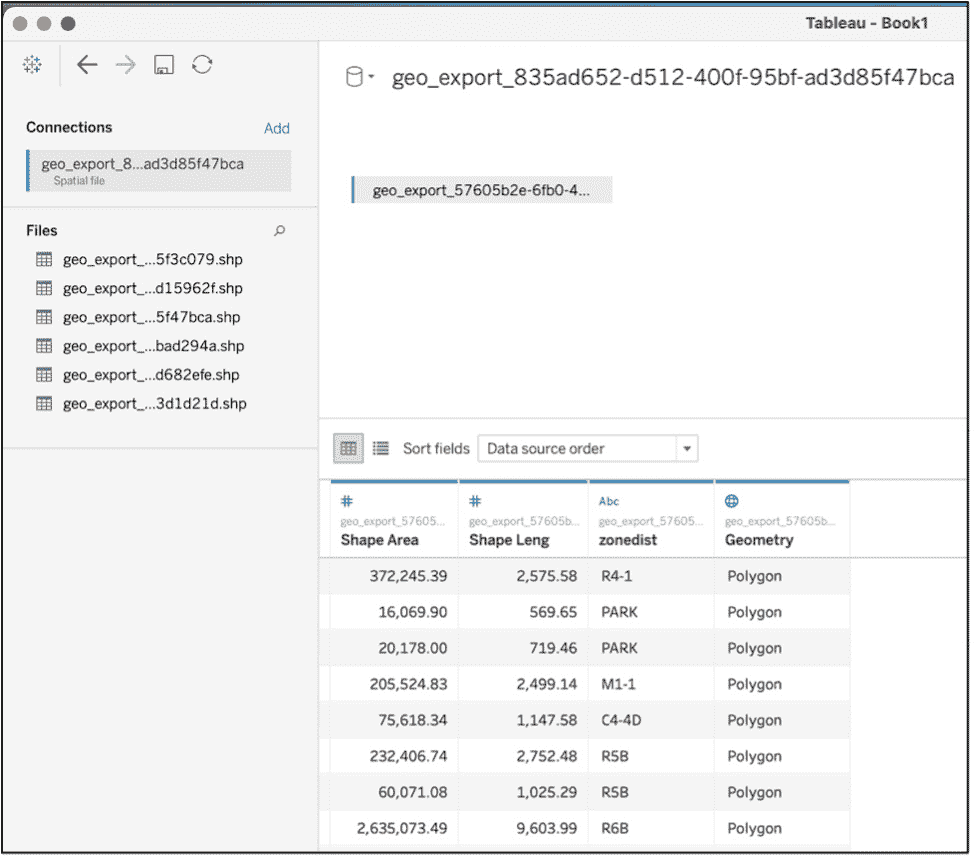

图 6.5：导入数据源

1.  点击 `Sheet 1` 创建您的第一个工作表。

1.  找到 `几何` 度量并将其拖到 `详细` 卡片：

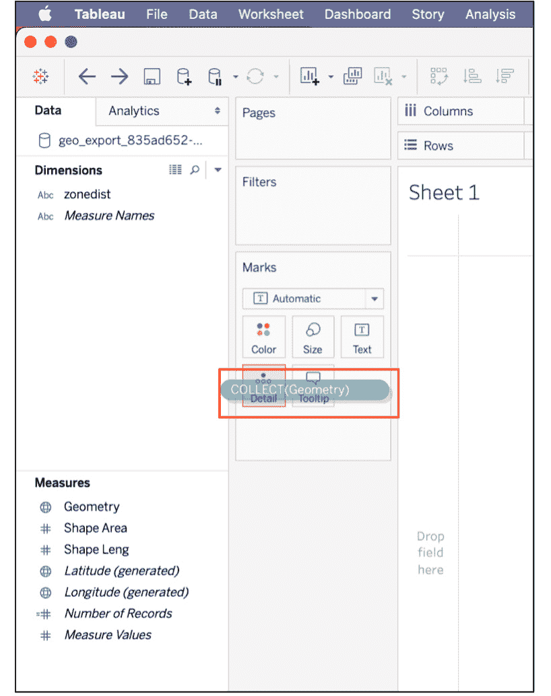

图 6.6：将几何度量添加到详细卡片

Tableau 将自动使用 shapefile 信息创建地图，如下所示：

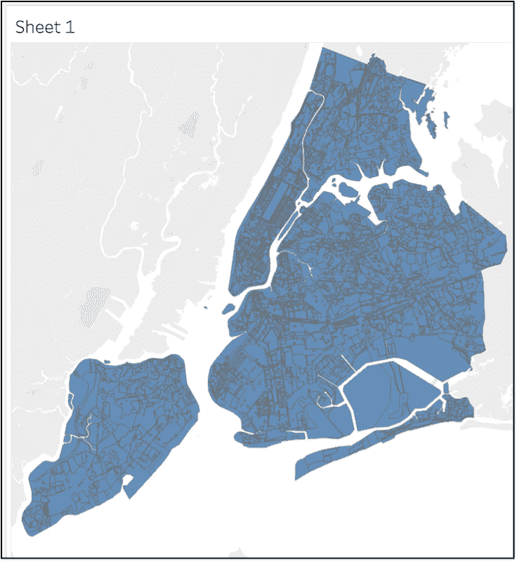

图 6.7：默认的 Tableau 地图输出

上述截图显示了纽约市的 shapefile 版本，并完成了将空间数据文件加载到 Tableau 中的目标。

在这个练习中，您从 [`www1.nyc.gov/`](https://www1.nyc.gov/) 下载了数据源，并导入了一个 shapefile 来显示纽约市的分区区域。现在您可以查看文件中每个多边形形状的相关信息。在下一节中，您将学习如何导入非空间地理数据源并将它们在章节的后续部分进行联合分析。

# 导入非空间地理数据源

许多地理数据源并非专门的空间数据源，而是作为更大数据集的一部分以电子表格或数据库格式存在。这些数据集通常包含非地理数据，例如客户信息、时间段细节和各类指标。国家、州和城市等地理特征也常常包含在内，这使得创建显示许多数据属性的地图成为可能。

Tableau 使从这些源创建地图变得容易，尽管您可能需要在此过程中提供帮助，正如您很快将看到的。由于许多 Tableau 数据源不会位于空间格式中，确保您可以使用通用数据源以适当的详细程度显示地理信息至关重要。

导入这些源与导入任何一般类型的 Tableau 数据的过程没有不同。这里唯一的区别是您需要一个或多个地理字段来帮助您将数据放入地图格式。在下一节中，您将进行一个快速练习，您将导入一个非空间源。

您的第一个数据源将是一个详细的 Airbnb 在马德里的房源列表。此文件将包含关于房东、房源位置、评分、评论和其他房源详细信息。

## 练习 6.02：导入非空间数据源

在本练习中，您将导入已下载的详细列表文本文件。在本练习结束时，您将拥有一个 Tableau 数据源，其中包含多个属性，可用于在 Tableau 工作表中映射属性。如果您尚未下载 `listings_detailed.csv` 文件，您可以在以下位置找到它：[`packt.link/Hh7ZL`](http://packt.link/Hh7ZL)。

实现这一目标的步骤如下：

1.  从顶部菜单选择 `数据` | `新建数据源`：

![图 6.8：创建新的数据源]

![图片 B16342_06_08.jpg]

![图 6.8：创建新的数据源]

1.  选择 `文本文件` 选项：

![图 6.9：选择文本文件选项]

![图片 B16342_06_09.jpg]

![图 6.9：选择文本文件选项]

1.  定位您的下载文件。它可能是一个 `.zip` 文件，因此请在一个文件夹中提取文件，并且该文件夹应包含多个文件。要导入文件（`listings_detailed.csv`），定位 `listings_detailed.csv` 并点击 `打开` 按钮：

![图 6.10：添加文本文件数据源]

![图片 B16342_06_10.jpg]

![图 6.10：添加文本文件数据源]

1.  为了提高数据性能的效率，创建数据的提取而不是实时数据，这样当您开发可视化时，您的数据操作将会快速。在数据面板右上方的 `连接` 下选择 `提取` 单选按钮，然后点击 `立即更新`。这将使您的窗口填充数据的一个子集：

![图 6.11：选择提取选项]

![图片 B16342_06_11.jpg]

![图 6.11：选择提取选项]

1.  重命名数据源 `bnb listings` 并在提示时保存您的提取：

![图 6.12：重命名数据源]

![图片 B16342_06_12.jpg]

![图 6.12：重命名数据源]

1.  选择一个工作表并运行提取。现在您将看到所有数据维度和度量，以及一个空白的工作区：

![图 6.13：创建提取后查看工作区]

![图片 B16342_06_13.jpg]

![图 6.13：创建提取后查看工作区]

在上一个练习中，你导入了空间数据，在这个练习中，你导入了包含几个地理字段的非空间数据源，这将帮助你使用成千上万的 Airbnb 属性的位置创建信息丰富的地图。接下来是空间数据和非空间数据之间的关系。

## 数据关系

你可以使用的一个 Tableau 功能是连接（joins），它允许你在数据源级别创建关系。Tableau 始终允许在分别添加的多个数据源之间进行连接，但这通常仅对较小的数据集有用，其中简单的连接就足够了。在数据源级别使用数据关系采取了一种更稳健的方法，允许使用多种类型的连接以及源数据集的并集。这种方法还导致性能大幅提升，尤其是在创建数据提取时。

在数据源级别创建连接允许连接来自多个源（文本、Excel、数据库等）的数据，使得使用连接中的单个键字段合并数据变得简单。这在组织内部的不同部分（即营销与财务）使用不同的信息系统时，或者当你需要一个简单的查找表来提供源数据库信息中未包含的直观定义时，特别有用。

## 练习 6.03：连接两个数据源

在接下来的练习中，你将连接两个数据源以创建分析的新可能性。第一个（主要）源是`listings_detailed.csv`文件，你的次要文件是一个简单的邻里文件，它将提供邻里名称，并且是你在上一个练习中下载的数据源的一部分。请记住，这个练习只是为了说明目的。如果你的次要文件有额外的字段，你可以用数据连接做更多的事情。这个主题将在随后的章节中介绍。

创建你的数据连接包括几个简单的步骤：

1.  如果已经创建，请添加新的数据源或编辑现有源以使用`listings_detailed.csv`文件：

![图 6.14：将列表文件添加到数据窗口]

![图片 B16342_06_14.jpg]

![图 6.14：将列表文件添加到数据窗口]

1.  通过从`连接`选项卡拖动，将主数据源添加到窗口中（如果它还没有在那里）。

1.  从`连接`选项卡将次要源（邻里文件）拖动到数据源窗口中。

1.  使用每个数据源下拉菜单中的`Neighbourhood`字段在两个数据源之间创建连接。然后，选择`内部连接`选项。你的窗口应该看起来像这样：

![图 6.15：在两个数据源之间创建表连接]

![图片 B16342_06_15.jpg]

![图 6.15：在两个数据源之间创建表连接]

1.  通过选择`立即更新`按钮来更新提取。

你的最终输出应该是以下内容：

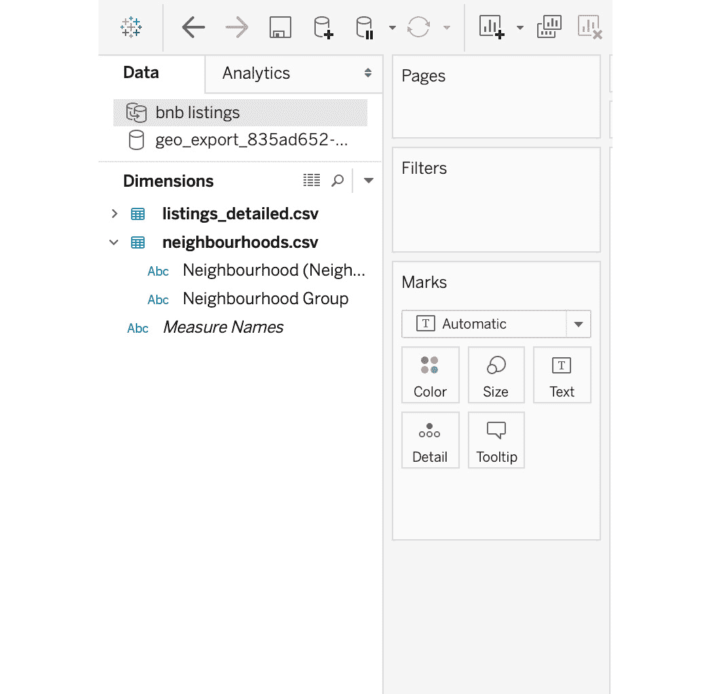

图 6.16：在两个数据源之间创建表连接

您现在将可以从次要源中获得新的字段。如前所述，这是一个非常简单的例子，但您也可以使用次要源作为参考表，提供有关社区的其他信息，例如酒吧、餐厅或旅游景点的数量。有许多其他可能性；所需的一切只是一个公共字段来创建连接。在下一节中，您将了解如何编辑位置及其别名，以及创建自定义地理。

# 管理位置数据

制作地图和其他有意义的地理分析的关键是拥有必要的地理位置元素（国家、州、城市等），并确保它们在 Tableau 中被正确分类。在许多情况下，Tableau 将正确识别这些角色，使您的工作变得简单。在其他情况下，您需要告诉 Tableau 正确的角色。这通常发生在您的源字段名称与 Tableau 使用的标准命名约定不对应时。也可能存在 Tableau 根据维度字段名称错误地假设非地理字段表示位置数据的情况，或者无法自动识别值。

本节将探讨在 Tableau 中使用三种主要方法创建和维护地理数据的方式——分配角色、编辑位置和构建自定义地理级别。

## 分配地理角色

Tableau 在根据源数据命名约定解释地理级别方面非常擅长。例如，如果您有一个名为 `city` 的源字段，那么 Tableau 将假设您想使用此字段在地图上标识城市。这并不总是这种情况——名为 `city neighborhood` 的字段可能标识不同的地理级别。在这些情况下，Tableau 将需要您的指导来将源字段匹配到正确的地理级别。熟悉您的数据源将使这项任务变得简单。

查看以下导入的列表数据，以了解 Tableau 如何处理数据，以及您是否需要做出任何修改。您可以通过寻找地球图标轻松找到 Tableau 确定的地理字段。在此数据集中，您可以看到城市、国家、国家代码、州和 ZIP 码维度——每个都有地球图标。请检查每个字段是否具有正确的地理角色，从 `city` 开始：

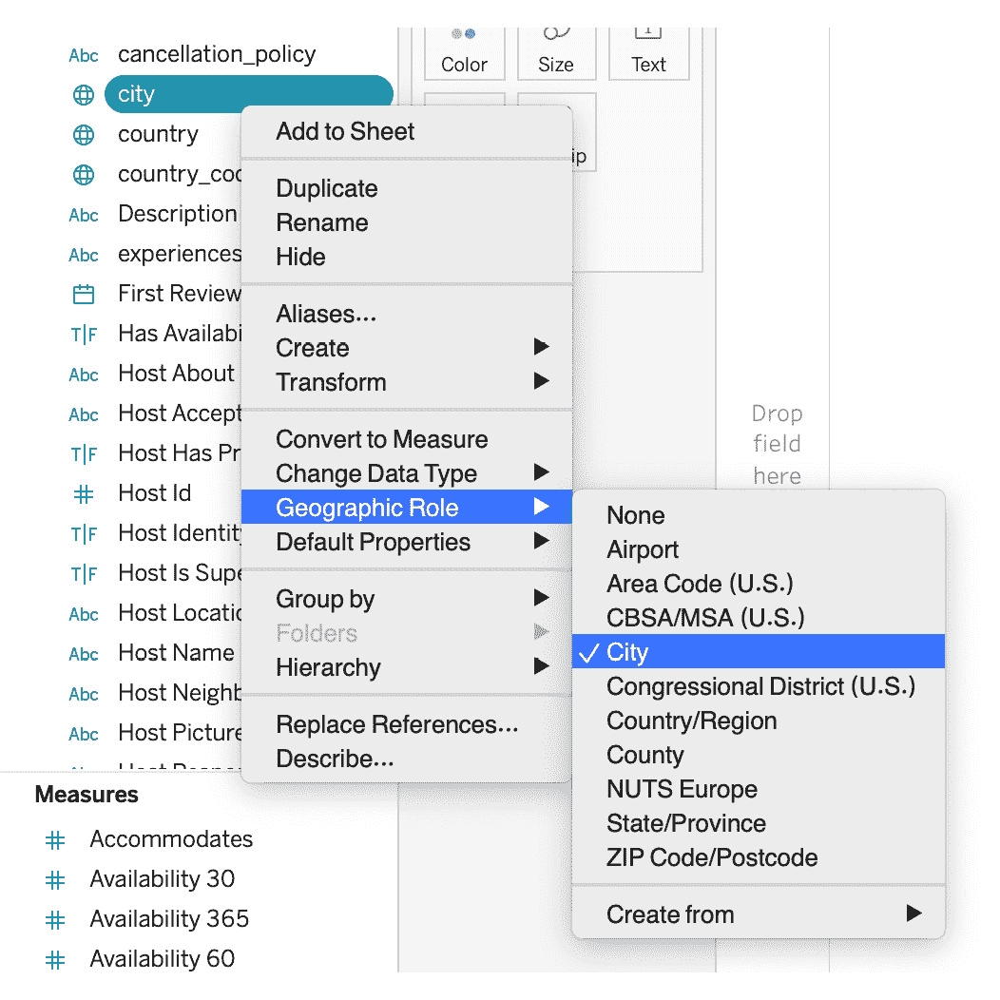

图 6.17：将地理角色关联到数据源字段

`城市` 维度已正确关联到城市地理级别。根据命名约定，这是预期的；如果维度被命名为 `host city` 或其他变体，可能需要手动链接。然后你可以通过相同的流程，并注意每个维度都已正确识别其地理角色。此外，请注意，国家和国家代码都与 `国家/地区` 角色相关联；任一字段都可以用来在地图上识别国家级别。

在地理关联尚未建立或关联错误的情况下，你需要通知 Tableau 正确的分类。这通常发生在字段名称不明确的情况下——例如，如果你的源数据中将 `country` 命名为 `CTRY`，那么你很可能需要告诉 Tableau 这个字段实际上指的是一个或多个国家。为了进行这项修正，你只需为这个维度选择 `地理角色` | `国家/地区` 选项，并分配正确的值。

注意

*图 6.18* 显示了下方有 13 个未知值。请注意，然而，随着数据的不断更新，你可能会得到不同的未知值。

## 编辑位置

有时会遇到 Tableau 无法识别地理数据的情况，这通常是由于源数据中的拼写错误造成的。当你尝试将数据映射到地图上时，这会导致出现空值，使用户无法获得完整的信息视图。幸运的是，你可以提供更多关于这些值的信息，以帮助它们正确映射。看看当你尝试映射州维度时会发生什么：

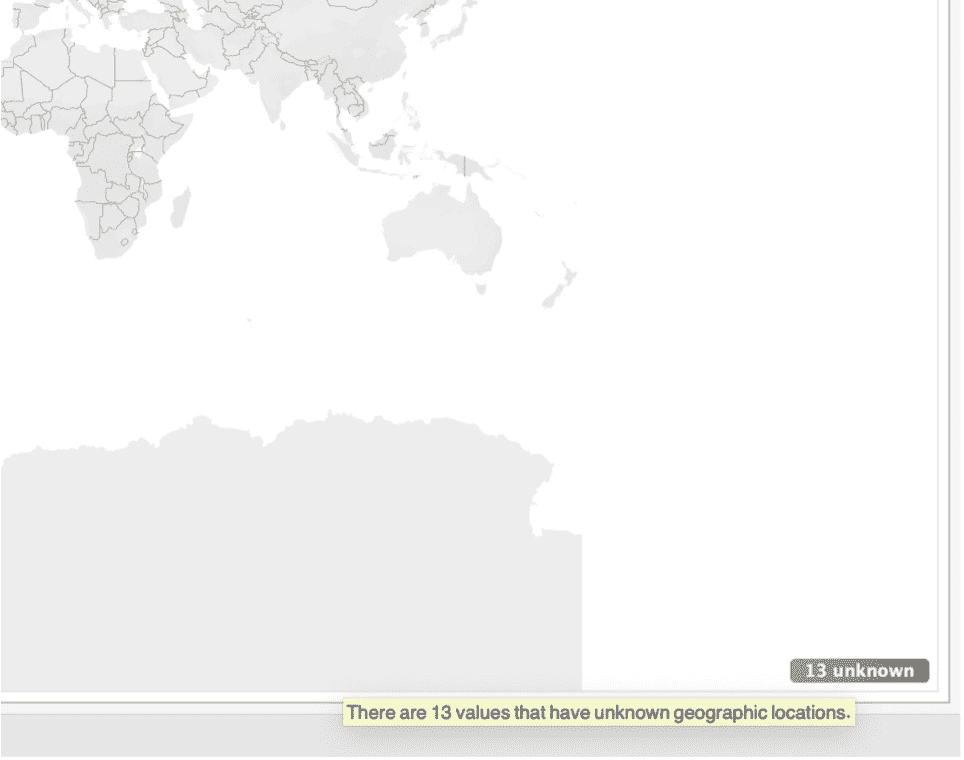

图 6.18：映射州维度

注意到在前一个屏幕截图的右下角，有一条消息告诉你你有 13 个未知值。Tableau 没有识别出你数据集中提供的州。要找出发生了什么，点击 `13 个未知` 按钮，这将打开一个 `特殊值` 窗口：

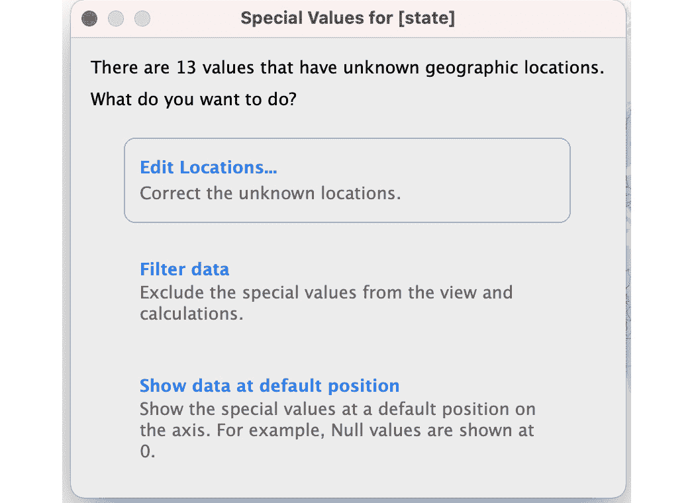

图 6.19：编辑位置以更新未知值

然后你选择 `编辑位置...` 选项来打开一个窗口，你可以在其中开始匹配过程。当这个窗口打开时，你很快就会看到问题：你的默认 `国家/地区` 是根据你的位置设置的（在这个例子中是 `美国`），而不是 `西班牙`。

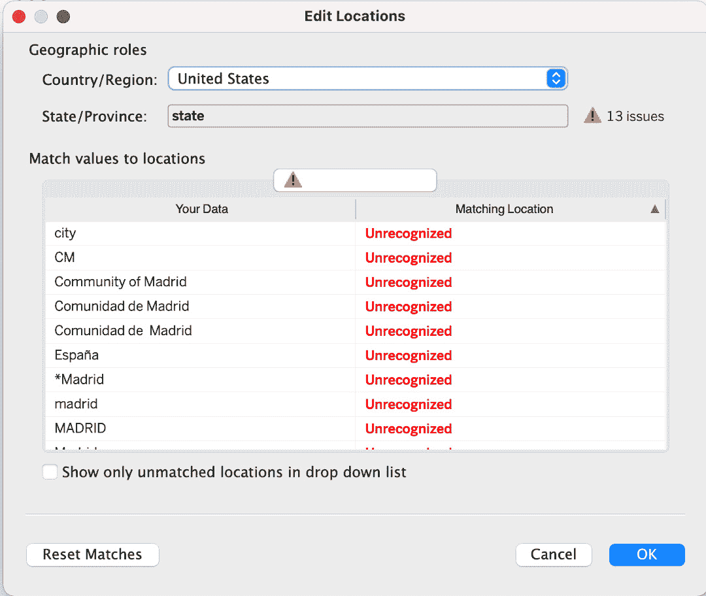

图 6.20：识别未识别的地理值

这可以通过在下拉列表中找到 `西班牙` 并将其设置为默认值来轻松解决。当你应用这个更改时，你会看到许多条目已经自动更新，特别是任何包含马德里在内的名称的条目

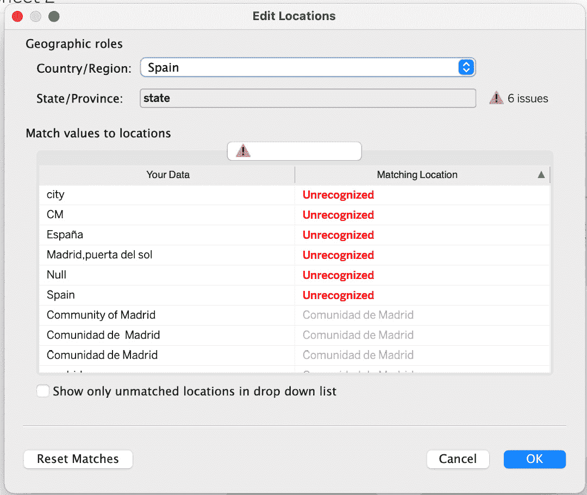

图 6.21：使用“编辑位置”窗口更新未识别的值

有些其他条目尚未自动更新，这可能是由于数据不干净造成的。你现在可以调查这些条目以确定问题的范围。由于你知道你的数据集完全由马德里地区的房产组成，因此更新剩余条目到相同的`Comunidad de Madrid`条目可能是安全的。在`编辑位置`窗口中，对于每个`未识别`状态，只需双击`未识别`，然后从下拉列表中选择`Comunidad de Madrid`条目以进行手动更新。

## 构建自定义地理

在许多情况下，你可能想要创建在数据源中尚未定义的自定义地理级别。在 Tableau 中，通过指定如何创建新级别以及使用现有的地理属性，可以非常容易地做到这一点。你还可以使用计算字段创建自定义地理。让我们分别看看每种方法的单个示例。

### 使用现有角色创建新地理

在某些情况下，你将基于源数据中已经存在的级别创建新的地理级别。这可能与销售区域、邻里或其他没有正式定义地理级别的聚合有关。让我们通过使用马德里数据集的 ZIP 代码和邻里作为例子来看一下。

你已经在数据源文件中有了 ZIP 代码（邮政编码）数据，同时也有邻里数据，尽管只是以文本形式。你的目标是创建可以在地图上显示的地理邻里定义。为此，右键单击`邻里`维度，选择`地理角色` | `从...创建` | `zipcode`。这告诉 Tableau 使用现有的 ZIP 代码数据在邻里级别构建地理。以下是菜单选择的一个视图：

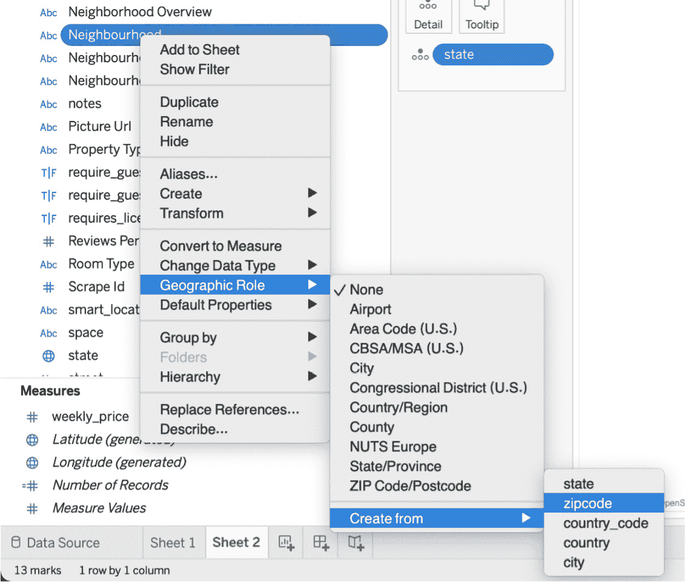

图 6.22：创建地理角色

你可以从`数据`面板中看到，Tableau 通过创建一个层次结构来完成这项工作，其中`邻里`是顶级，`zipcode`是次级：

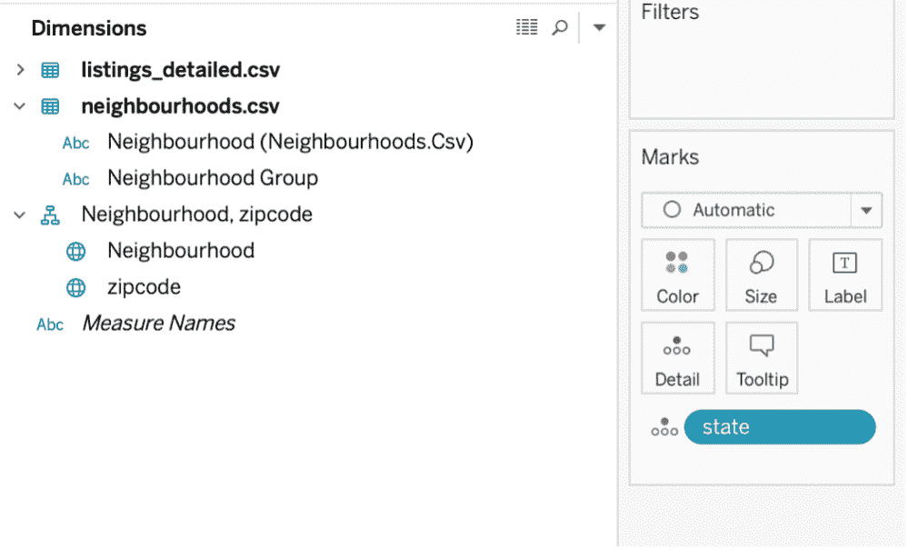

图 6.23：构建自定义地理级别

这在地图上会是什么样子？要显示你的新级别，将`邻里`字段从层次结构拖到`详细`标记，将`邻里`拖到`标签`标记卡，并将`SUM(记录数)`添加到`颜色`标记，然后从`显示我`菜单中选择`地图`选项，得到以下显示：

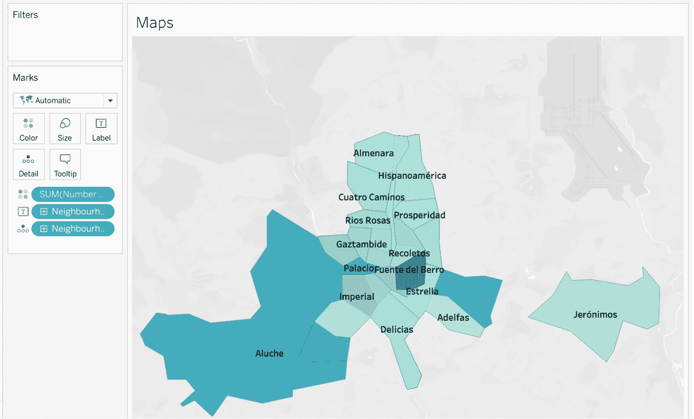

图 6.24：映射新创建的邻里多边形

从地图上可以看出，你再次遇到了一个未知问题，有 66 个值你无法将其与邻里关联起来。这很可能是由于源数据中的某些问题——可能是 `Neighbourhood` 维度中的缺失值或脏 ZIP 码数据。当数据录入没有严格的规范时，这类问题经常发生；Tableau 设计师需要确定问题的重要性，并相应地采取行动。

### 使用组创建新的地理

创建新的地理级别的第二种方法是创建一个计算字段，再次使用现有的地理级别作为基础。你可以再次使用基于 ZIP 码的计算（可能是前三位或四位数字），得到类似于邻里示例的聚合级别。这假设 ZIP 码是以这种方式分配的，这种方法是有意义的。

另一种可能性是创建一个组，在这个组中，你可以为你的每个聚合簇分配一个名称，然后相应地进行映射。以下示例中，使用 `Group` 函数创建了一组基于邻里名称的聚类：

![图 6.25：基于邻里名称创建组]

![img/B16342_06_25.jpg]

图 6.25：基于邻里名称创建组

要创建组，请按照以下简单步骤操作：

1.  突出显示一个或多个单个邻里值。

1.  点击 `Group` 按钮。

1.  通过编辑默认的 Tableau 组名称来命名组。

1.  对每个额外的组重复 *步骤 1* 到 *步骤 3*。

1.  点击 `OK` 按钮保存所有组。

现在，你可以通过将 `Neighbourhood Clusters` 维度拖到 `Detail` 标记来将这些聚类添加到地图上；你可以继续使用 `SUM(Number of Records)` 度量来用于着色。以下是结果：

![图 6.26：映射邻里聚类]

![img/B16342_06_26.jpg]

图 6.26：映射邻里聚类

注意，有 12 个未知条目；可以通过点击消息并使用 `Edit Locations` 屏幕来更新条目，如前所述来解决这些问题。

以这种方式对地理区域进行分组可以帮助将你的数据聚合到有意义的分析水平，特别是如果你熟悉源数据中的地理属性。在下一个练习中，你将使用你一直在使用的 Airbnb 数据集来练习这些概念。

## 练习 6.04：构建自定义地理

在这个练习中，你将使用现有的角色和组方法来创建自定义地理。这将提供使用这些聚合维度进行映射的额外选项，从角色方法开始。

执行以下步骤以完成此练习：

1.  打开一个新的或现有的 Tableau 工作簿。

1.  如果你还没有这样做，请导入 `listings` 和 `neighbourhood` 文件。

1.  确保你有包含 `listings_detailed` 和 `neighbourhoods` 文件的 `listings_detailed` 数据源。如果没有，通过在 `Neighbourhood` 字段上连接它们来创建这种关系。

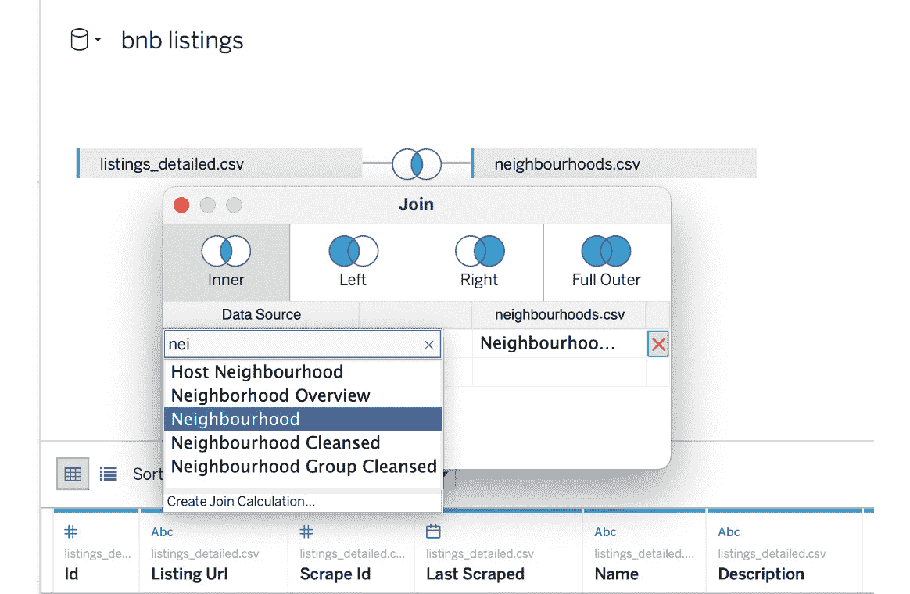

图 6.27：将两个文件作为一个单一数据源连接

1.  通过选择`提取`单选按钮创建一个提取。保存提取并打开工作表。

1.  通过选择维度并基于`zipcode`创建角色来为`邻里`创建一个地理角色。

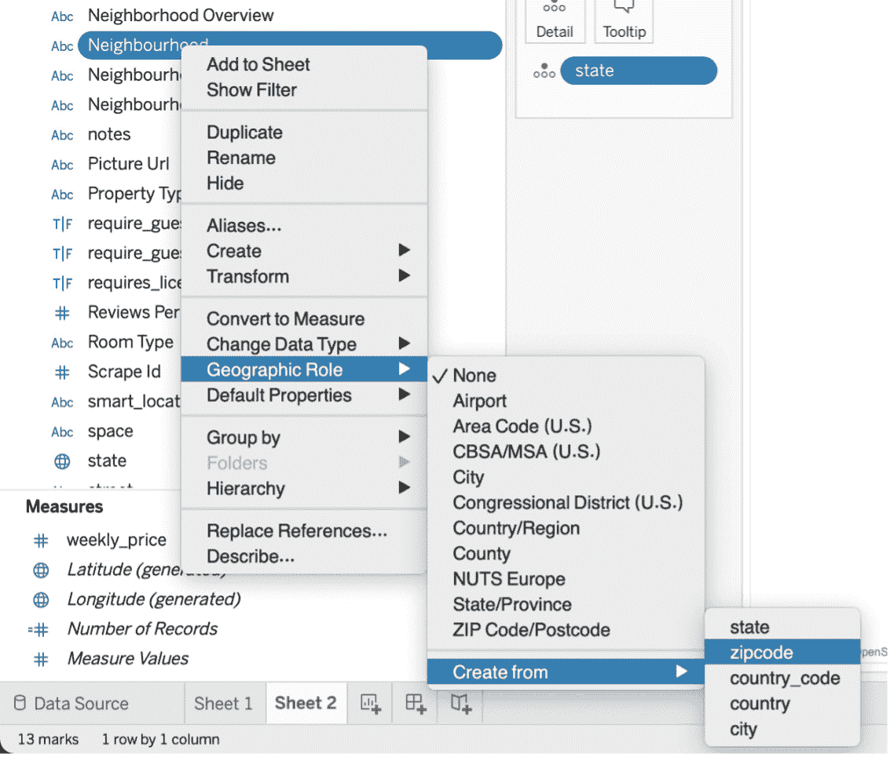

图 6.28：分配自定义地理角色

1.  右键点击`邻里`维度并选择`创建` | `分组...`菜单项：

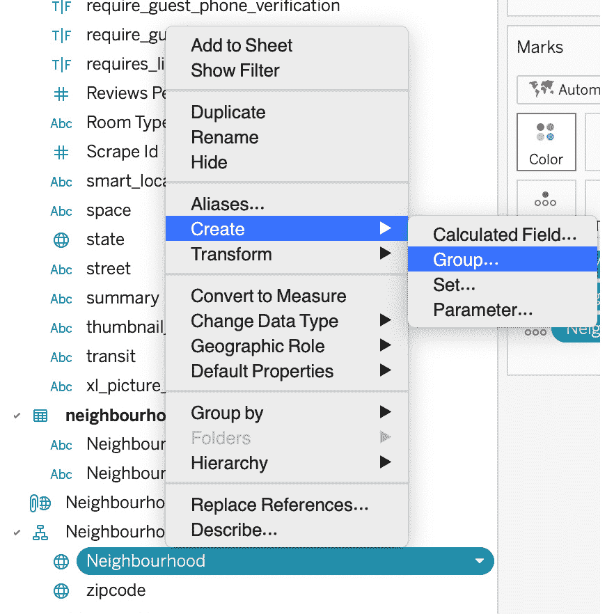

图 6.29：从现有字段创建一个组

1.  从`Acacias`到`Atocha`选择条目并点击`分组`按钮。将此命名为`集群 1`。然后，通过`Gaztambide`选择更多条目并点击`分组`按钮。勾选`包含'其他'`复选框：

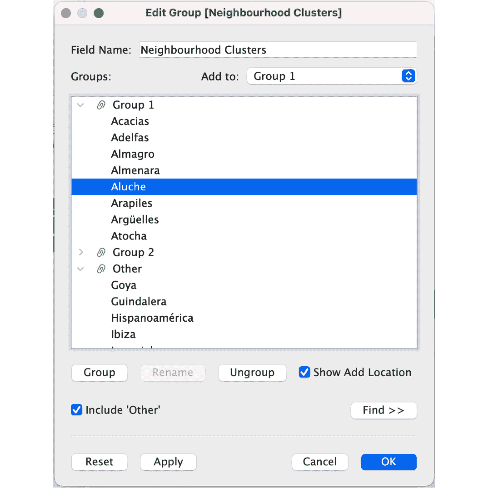

图 6.30：从邻里维度创建分组后的结果

1.  点击`确定`按钮。你现在将看到一个`[邻里集群]组`维度。

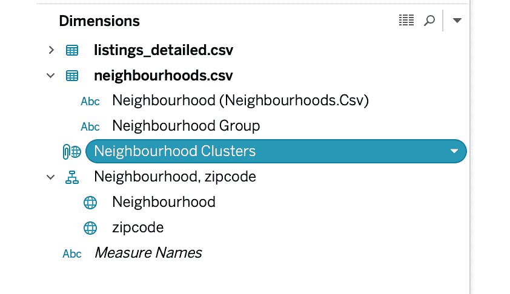

图 6.31：邻里集群组作为一个新维度

在这个练习中，您使用两种方法创建了两新的地理字段。现在您可以使用这些维度来创建填充地图，您将在下一节中探讨，使用`Show Me`菜单中显示的几个选项。 

# 在 Tableau 中创建地图

Tableau 在`Show Me`菜单中提供两种不同的地图选项——一个用于符号地图，另一个用于渐变地图。如果您的数据有简单的经纬度值对应于邮政编码中心点，例如商店位置（甚至是一个城市），那么您的映射将集中在符号地图选项上。然而，如果您的数据基于 shapefile 或 GeoJSON 数据源具有更详细的数据，那么您可以使用渐变选项来创建基于数据源中多边形的填充地图。在某些情况下，您将能够访问这两种类型的数据源，并能够创建一个双轴地图，这将在本节的后面部分进行探讨。以下是对这两种类型的简单比较，渐变（填充）地图在左侧，符号地图在右侧：

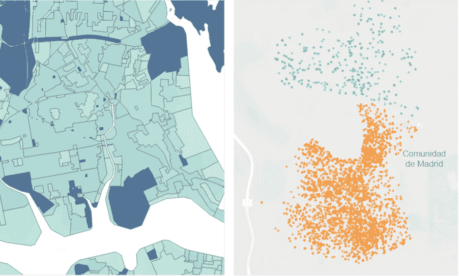

图 6.32：一种渐变（填充）地图和一种符号地图

## 地理编码

地理编码是将地理属性分配给可能不会自动识别为传统地理空间字段的字段的过程。在这些情况下，您需要分配与这些维度相对应的值，以便创建地图。本节将探讨如何在 Tableau 中处理这种情况。

在许多情况下，你将遇到 Tableau 在没有一些指导的情况下无法识别的地理属性。街道地址是这种情况的常见例子；与国家、州或甚至城市不同，街道地址在多个地理区域内经常重复，这使得它们在地图上正确定位变得非常困难。幸运的是，Tableau 允许自定义地理编码，你可以使用两种不同的方法来提供更精确的信息。在两种情况下，你都是从 `.csv` 文件开始的。

第一种情况是，你希望使用现有的地理定义，并简单地扩展它们以包括新成员。例如，如果你需要向你的地图中添加一个 Tableau 无法识别的新国家、州或县，你可以使用 `.csv` 文件提供此信息。你只需选择 `地图` | `地理编码` | `导入自定义地理编码` 菜单选项，并将 Tableau 指向你的目录，其中已创建 `.csv` 文件。数据字段名称必须与现有的 Tableau 字段名称（如 `国家`、`州` 等）匹配，并且应包括纬度和经度信息，以便 Tableau 知道在地图上定位新条目。

第二种自定义地理编码类型涉及可能特定于组织（如区域销售层次结构）的信息，或者可能引用非传统点数据，如闪电或火山爆发。在这些情况下，你为新项目创建特定的名称，然后添加一个可以在 Tableau 中使用的新的字段名称。例如，如果尝试绘制这些事件，字段名称可能被称为 `闪电打击`。同样，必须包括纬度和经度数据，以及其他适当的地理级别，如 `国家` 和 `州`。

添加此自定义地理编码信息扩展了 Tableau 的地图功能，超越了传统的边界和定义。

注意

创建图 6.33 所示地图的步骤在练习 6.05 中解释。

## 符号地图

符号地图表示所有以基于点的纬度和经度格式提供位置数据的地图。纬度表示数据点的南北位置，而经度提供东西位置。在 Tableau 中使用这两个度量标准可以帮助你精确地定位商店、办公室、公园、博物馆和其他具有特定位置的实体。这些点可能代表大型地理实体（如公园）内的中心位置，或者可能具有更高的精度水平，具体取决于你的源数据有多详细。例如，纬度值 `45.37187` 将比四舍五入到 `45.37` 的相同值更精确。

符号图非常简单，但在基于地理位置数据讲故事的能力上却非常强大。让我们在 Tableau 中探索构建有效符号图的过程。一切从纬度和经度度量开始，这些度量可能包含在您的源数据中，或者可以由 Tableau 为已识别的属性（如国家、州和县）进行计算。例如，使用您的马德里位置数据，这里是基于源文件中纬度和经度数据的一个简单视图。您可以选择任何点来查看支持的地理坐标：

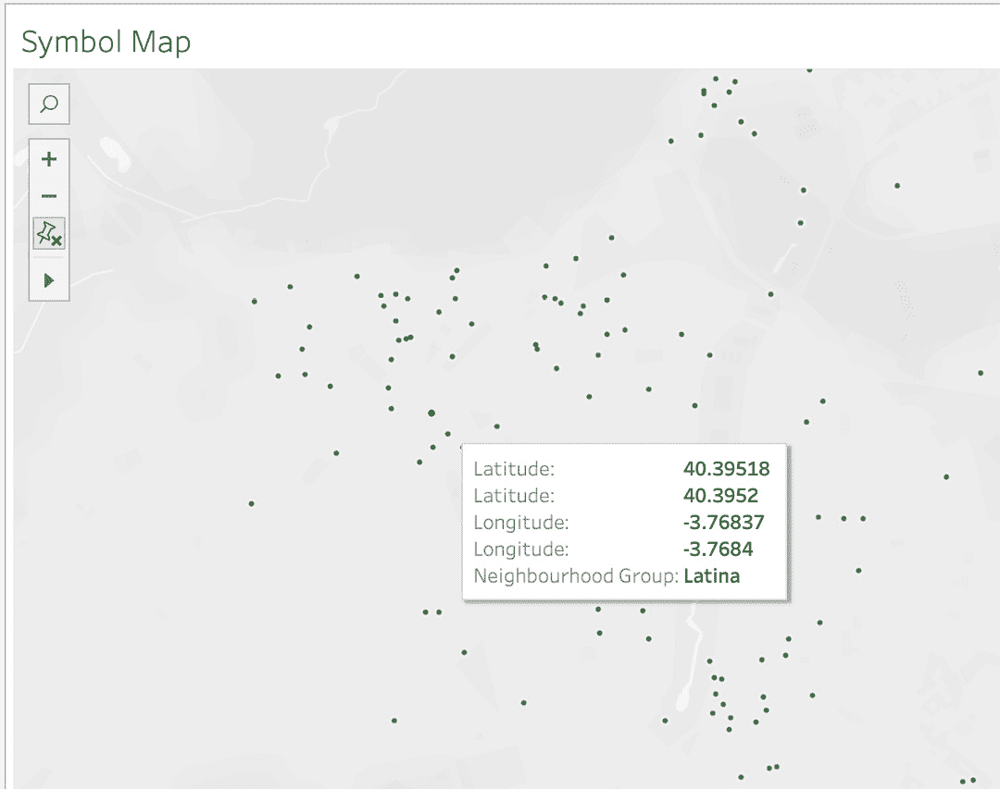

图 6.33：符号图中数据点的详细信息

地图中的每个点都是基于纬度和经度定位的，如地图的提示所示。您可以使用额外的地图层提供更多上下文，但就目前而言，这是一个良好的起点。

### 向符号图添加数据

虽然在地图上放置位置点可以提供信息，但更常见的情况是您还希望向这些点添加数据度量——例如，商店位置的收益或旅游景点游客数量的两个简单例子。在 Tableau 中，使用颜色、大小或形状来识别地理点的特征，这可以轻松完成。首先，您需要确定哪些数据字段将最有意义地显示；这将允许您根据用户交互构建显示特定信息的逻辑。

当您向符号图添加度量时，有两种常用的方法来显示这些数据；第一种是使用颜色或形状，第二种是使用符号的大小。如果您正在向显示添加维度信息，您通常会选择颜色或形状来表示这些类别。在某些情况下，形状和颜色都可以用来向地图查看者提供更多细节。如果您正在向符号显示添加度量，大小通常将是首选的方法，因为它有助于识别不同地点之间的数值差异。使用颜色或形状与度量结合并不那么有效，尽管两者可以与大小一起使用。在接下来的部分中，您将看到每个选项的示例。

### 为符号图着色

颜色可以用来深入了解分类维度和数值度量。这将使用户获得一个良好的视觉提示，帮助他们看到信息中的地理相关模式。在使用颜色时，重要的是要记住，人类视觉系统在观察颜色方面有一个有限的范围；你通常希望将其保持在 10 种不同的颜色或色调以下。位于[`colorbrewer2.org`](https://colorbrewer2.org)的 Color Brewer 网站提供了从 3 到 12 种不同色调的调色板，用于地图绘制。一些用户可能能够区分更多的不同颜色，但最好还是保守一些，尽量减少地图颜色的数量。你也可以根据你的数据分布来决定颜色，可能会发现你需要 3 种或多达 9 种或 10 种颜色来正确地讲述故事。

在这里，你可以看到一个使用邻域组着色的例子，其中你有九种颜色：

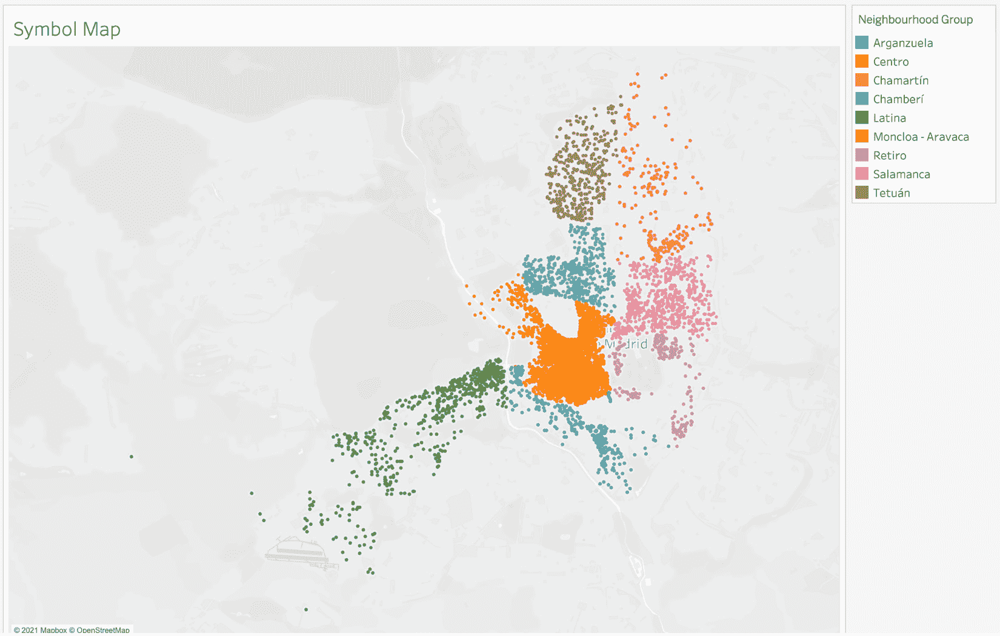

图 6.34：使用邻域组维度着色符号地图

注意，当你使用不同的颜色时，每个邻域组是如何容易地被看到的。在这种情况下，使用具有明显不同颜色的调色板非常有帮助，而使用单一颜色和渐变阴影则更难以解释。当你有如政治区域或邮政编码这样的不同类别时，可以应用相同的方法。另一方面，如果你想要看到为政治党派或候选人投票的选民百分比，最佳方法是使用单一颜色的阴影来反映从最小到最大水平的百分比（例如，可能是 10%到 70%）。

要给地图上色，请执行以下步骤：

1.  将着色字段（在这种情况下为`邻域组`）拖动到`颜色`卡片上。

1.  如果需要，选择`颜色`卡片来编辑颜色。

1.  选择一个最佳显示的透明度级别；建议使用小于 100%的透明度，尤其是在地图上有重叠符号时。这将提高数据可见性。

### 调整符号地图的大小

单个点也可以根据数据中的值来调整大小，通常基于单一度量。例如，你可能选择根据每个门店位置的销售额来显示点的大小。收入较高的门店将有一个较大的点（或其他符号），与其相对较低值的地点的收入相对应。这种方法是有效的，因为大小差异是更容易检测到的视觉线索之一。

在马德里示例中，点的大小是根据每个住宿的卧室数量来确定的。你可以保留已经创建的颜色，这样你的地图对观众来说将变得更加信息丰富。

要这样做，请遵循以下步骤：

1.  将`卧室`维度拖动到工作表中的`标记`区域的`大小`卡片上。

1.  点击`大小`卡片，并使用滑块工具调整符号大小。

缩放以更清楚地看到效果：

![图 6.35：使用卧室维度来调整地图符号的大小

![img/B16342_06_35.jpg]

图 6.35：使用卧室维度来调整地图符号的大小

你现在有从`0`到`8`个卧室的点，在这个缩放级别上差异相当明显。区分`6`和`7`或`3`和`4`可能需要一点工作；这就是提示信息可以提供更多清晰度的地方。你可以通过选择`Size`卡片并拖动条到左边或右边来轻松调整标记的大小。

### 在符号地图中使用形状

让我们继续使用马德里数据来探索。你已经使用了颜色和大小来使你的地图更具信息量；现在你可以添加形状，为地图提供更多一层细节。在这个阶段，你可能希望小心不要在显示中添加太多形状，因此一个简单的类别就足够了。使用`Instant Bookable`字段，因为它只包含两个值。

要创建此地图，请按照以下步骤操作：

1.  简单地将`Instant Bookable`维度拖到`Shape`卡片上。

1.  通过点击`Shape`卡片并为每个数据类别分配一个形状值来选择你希望显示的形状。

这是结果：

![图 6.36：使用形状来展示即时可预订的价值

![img/B16342_06_36.jpg]

图 6.36：使用形状来展示即时可预订的价值

现在，你有一个为用户提供丰富信息的地图，包括社区群体、卧室数量以及物业是否可以即时预订。为了提供更多见解，你可以自定义提示信息，以便用户在悬停于某个点时了解更多关于该物业的信息。

### 添加地图提示信息

提供信息提示是一个很好的收尾，有助于用户导航地图及其包含的底层信息。虽然地图标签可能很有帮助，但它们最终会变成视觉噪音，掩盖地图中包含的有意义信息。这就是提示信息变得特别有用的地方，因为它们可以包含大量信息，而不会妨碍地图显示。

让我们快速浏览一个在地图中构建简单但信息丰富的提示示例。你已经看到了提示的最简单版本，但它们的功能远不止于此，正如你即将看到的。

要向工具提示添加更多字段，只需将维度或度量拖到“标记”面板中的“工具提示”卡片上。这将使这些字段即使在你的文本中没有被使用时也能被访问。默认情况下，Tableau 将提供一个包含与地图相关的信息的功能工具提示，如图 6.37 所示。只需一点努力和对比字体颜色的使用，工具提示就可以变得更有力。你可以将“主机名”、“主机响应率”、“邮编”和“摘要”维度拖到“工具提示”卡片上，并继续使用现有的“邻里组”和“卧室”维度来讲述关于该物业的小故事，如图*图 6.38*所示。

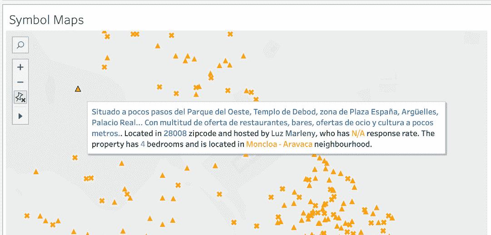

图 6.37：自定义工具提示以讲述详细的故事

如你所见，工具提示是一个很好的方式来包含有用的信息，而无需在地图上添加太多细节。

### 导航符号地图

Tableau 提供了一些简单的工具来导航地图。在“地图”窗口的左上角有一个小工具栏，具有以下功能：

+   搜索功能可以定位地图中的元素。

+   放大对于导航人口密集的地图非常有用。

+   缩小可以用来显示整个地图并提供周围的环境。

+   重置地图将地图设置为固定的显示大小。

+   区域放大是放大的一种扩展，允许你选择地图的特定部分进行放大。

+   平移功能允许你上下或左右移动地图。

+   三个选择工具（矩形、半径和套索）允许在选定的地图部分中突出显示元素。

这些工具使得在地图窗口内移动地图、放大或缩小数据点、固定显示大小（使用重置地图）以及使用三个选择工具创建自定义选择变得容易。地图数据也可以通过使用地图图例进行过滤，正如你将在下一节中看到的。

### 过滤符号地图

在前面的部分，你学习了如何区分带有三四个卧室的地方的挑战，因为符号的大小几乎相同。这对可能需要四个卧室但无法通过符号大小轻松区分的用户来说是一个问题。为了解决这个问题，用户可以简单地点击“卧室”图例中的`4`，并选择“仅保留”选项。Tableau 将自动在“过滤器”面板中添加一个过滤器，反映这个选择。

同样，你可以使用为“邻里组”提供的“颜色”图例来做这件事。使用颜色，你可以点击一个或多个选项，数据将被突出显示。在这种情况下，已经选择了`Centro`和`Chamberi`两个邻里组，得到以下结果：

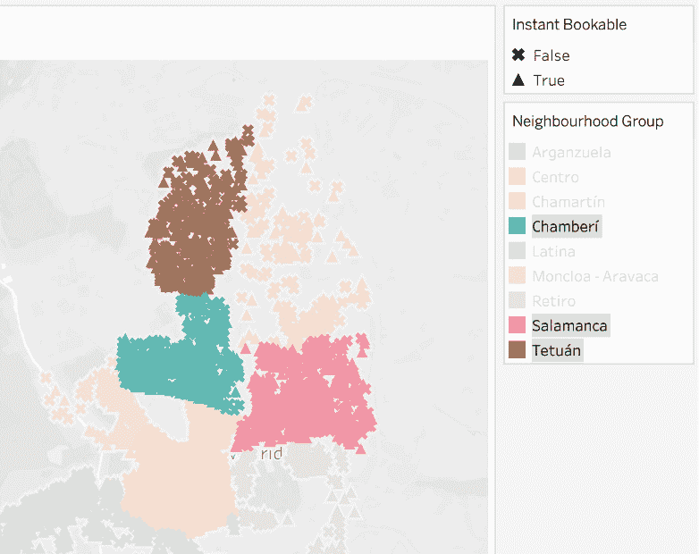

图 6.38：通过选择图例值过滤地图

您也可以选择“仅保留”选项，Tableau 将添加一个反映您选择的过滤器。

形状过滤器的工作方式与大小过滤器类似，允许用户选择“仅保留”选项来设置过滤器。或者，如果用户希望从地图中删除某些位置，可以选择“排除”选项。

虽然这些选项非常有用，但用户可以更进一步，使用地图数据构建新的组和集合。我们将在下一节中访问这些选项。

### 从符号图数据创建组和集合

Tableau 地图中的一个有用功能是能够根据地图上点的选择创建组和集合。这很重要，因为您可能不会总是意识到模式，直到在地图上看到它们。然后，您可以使用矩形、环形或套索选择来选择一组数据点，并立即创建一个组或集合。这是一个强大的功能，允许用户利用地图上揭示的模式来创建有意义的聚合数据。

考虑以下使用您之前创建的符号图的示例。使用地图工具栏，选择矩形选择工具，并用它突出显示点的一个区域。（注意您选择区域中所有点的不同颜色。）

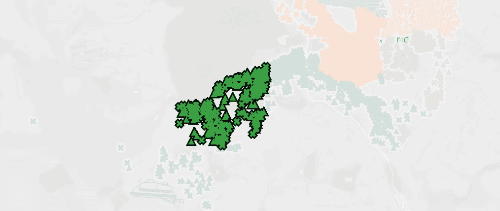

图 6.39：选中的点以不同的颜色显示

然后您通过使用“组成员”图标为选定的点创建一个组：

图 6.40：使用“组成员”图标创建组维度

Tableau 现在在“维度”面板中创建了一个组，可以在分析中使用。这是一种比手动使用组功能创建组更直观、更快捷的方法。

执行以下步骤来完成此操作：

1.  从地图工具栏中选择矩形选择工具。

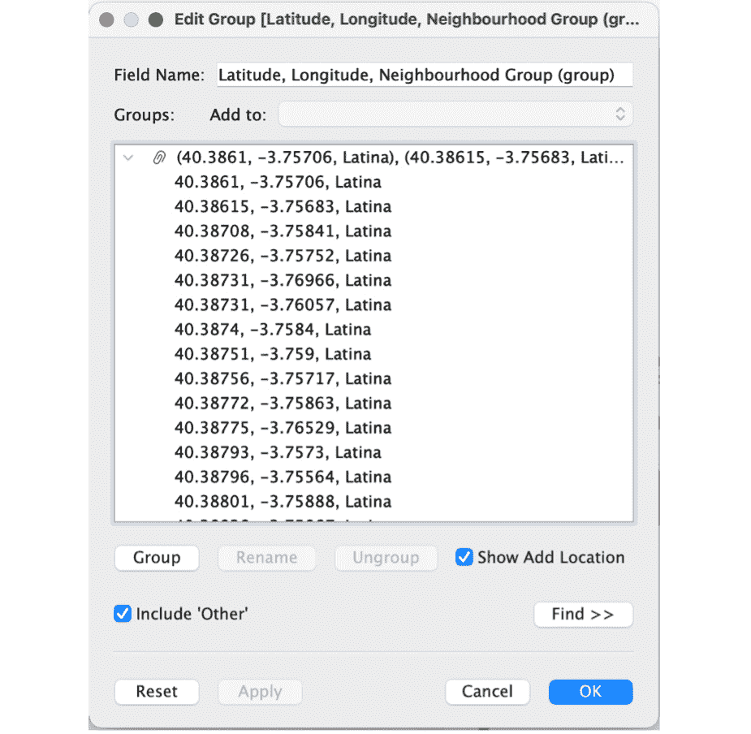

](img/B16342_06_41.jpg)

图 6.41：选择矩形选择工具

1.  在地图中突出显示您希望选择的区域。

1.  将鼠标悬停在所选的任何数据符号上。

1.  选择之前显示的“组成员”图标。

1.  您可以检查您的结果以验证组已创建：

图 6.42：查看新创建的组中的值

这个例子说明了另一种您可以使用地理数据和地图来扩展分析能力的方法。您现在将围绕符号图练习这些概念，包括对位置进行分组并按其组进行着色。

## 练习 6.05：构建符号图

在这个练习中，您将使用马德里列表数据创建一个符号图。这将有助于了解整个城市的列表模式。

执行以下步骤来完成此练习：

1.  如果你还没有这样做，请导入`Madrid listings`数据集。

1.  通过像前几节/练习中所示的方式将多个文件连接起来创建数据源。

1.  添加一个新的 Tableau 工作表。

1.  将`经度`度量拖到`行`架上，将`纬度`度量拖到`列`架上。（使用这些度量而不是 Tableau 提供的生成值。）将`经度`和`纬度`都改为`维度`：

![图 6.43：将纬度值设置为维度

![图片 B16342_06_43.jpg]

图 6.43：将纬度值设置为维度

1.  将`城市`维度拖到`详细`卡上，将`SUM(记录数)`度量拖到`大小`卡上，并调整符号大小以更好地显示所有点。如果由于某种原因你没有得到地图，请点击“显示我”卡，并手动选择“符号地图”。

![图 6.44：调整大小卡以在地图上显示符号

![图片 B16342_06_44.jpg]

图 6.44：调整大小卡以在地图上显示符号

1.  将`SUM(记录数)`替换为`Size`卡上的`Accommodates`度量：

![图 6.45：使用“容纳”维度来调整地图上的点的大小

![图片 B16342_06_45.jpg]

图 6.45：使用“容纳”维度来调整地图上的点的大小

1.  将`邻域组`维度拖到`颜色`卡上，并将此工作表命名为`Madrid Accommodates Map`。你将在本章后面的*练习 6.07：创建双轴地图*中使用相同的工作表：

![图 6.46：使用邻域组维度着色地图

![图片 B16342_06_46.jpg]

图 6.46：使用邻域组维度着色地图

现在很容易识别 Centro 邻域（在截图下半部分显示为橙色簇）的列表密度。由于它们距离 Centro 的主要旅游景点较远，周围的每个邻域在地图上都有较少的列表分散。

在这个练习中，你创建了一个符号地图，详细展示了马德里市内的列表模式。这张地图可以作为使用多个度量、参数和筛选器进行额外洞察的基础。在接下来的部分中，你将回顾 Tableau 支持的地图的第二种类型，即颜色渐变地图，这是你在本章开头简要了解的。

## 颜色渐变（填充）地图

颜色渐变地图与符号地图在一点上有所不同：现在位置基于形状（多边形、线条或点）而不是基于经纬度坐标的单一点。这些地图通常使用官方定义的地理名称（国家、州、城市）作为分析的基础，颜色是显示度量的主要方法，因为大小和形状已经定义。填充地图也可以与符号地图一起使用，以提供多层次的地理分析。

注意

对于下面主题中提到的`平均面积`度量创建，如果你使用的是 Tableau 2020.1 之后的任何版本，则字段`记录数`不存在。为了创建`平均面积`度量，你可以明确地自己创建`记录数`。请参阅此链接获取更多信息：[`tarsolutions.co.uk/blog/number-of-records-missing-in-tableau/`](https://tarsolutions.co.uk/blog/number-of-records-missing-in-tableau/)。

### 为 choropleth 地图着色

如前所述，颜色通常用于在填充地图中显示度量差异。在比较维度（分类）值时使用不同的颜色集，而阴影调色板是显示度量的最佳方法。

让我们来看这两个案例，首先是一个维度示例，然后是一个度量示例。这两个示例都将使用之前下载的`纽约市分区数据`。对于维度示例，不需要新的字段；你只需将`几何`度量拖到`详细`卡片上，让 Tableau 使用 shapefile 多边形数据，然后将`zonedist`维度拖到`颜色`卡片上。结果看起来像这样：

![Figure 6.47: New York City zoning map colored by detailed zonedist values

![img/B16342_06_47.jpg]

图 6.47：根据详细分区距离值着色的纽约市分区地图

注意，你有许多详细的分区类型。这些可能需要聚合以呈现类似地图，而不需要不必要的细节。为此，你将创建一个简单的从`zonedist`值中分组的字段，其中非常高级的组包括以`C`开头的商业区域，`M`是制造区域，`R`是住宅区域；其他的是不言而喻的。让我们重新查看地图并将`zonedist (group)`维度拖到`颜色`卡片上。这是你的新地图：

![Figure 6.48: New York City zoning map colored by grouped zonedist values

![img/B16342_06_48.jpg]

![Figure 6.48: New York City zoning map colored by grouped zonedist values

现在，你可以看到住宅、商业和制造区域之间更明显的模式，这些模式之前被每个指定内的许多子类型所掩盖。

你可以使用相同的数据创建基于度量的填充地图，尽管你需要做一些工作来创建一些新的度量。某些数据集可能包含有用的度量（如收入、人口密度等），但这里不是这种情况。你将创建两个可以在地图上使用的度量（`平均面积`和`区域计数`），使用以下公式。

可以使用以下步骤创建`平均面积`度量：

1.  在`数据`面板中右键单击并选择`创建计算字段`。

1.  输入`SUM([Shape Area])/SUM([Number of Records])`公式。

1.  将计算命名为`平均面积`并点击`确定`按钮关闭窗口。

可以以类似的方式创建`区域计数`：

1.  在`数据`面板中右键单击并选择`创建计算字段`。

1.  输入`COUNT([Zonedist])`公式。

1.  将计算命名为“区域计数”并点击“确定”按钮关闭窗口。

您现在可以使用这两个度量之一作为颜色创建填充地图。将`zonedist`拖到“详细”卡上，将`Zone Counts`拖到“颜色”卡上以更新地图，如下所示：

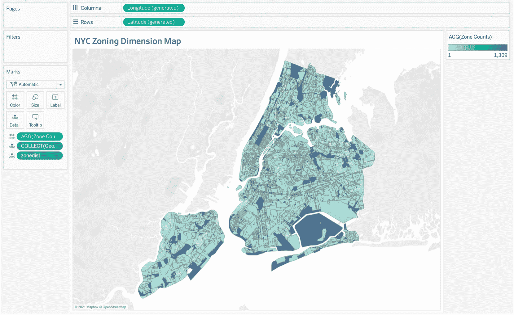

图 6.49：按区域计数着色的纽约市分区地图

您现在看到每个区域都按出现频率着色（注意最高计数用最深的颜色表示）。当您在地图上显示连续度量时，这种类型的颜色方案很有用，而不是您在维度地图上使用的不同颜色。当数字低于零或平均值时，双色方案很有用，可以显示低值与高值（例如，红色到蓝色）。Tableau 有许多原生的颜色调色板可供选择，这使得创建引人入胜的地图变得容易。

### 在等值线地图中导航

在导航地图时，您可以使用在符号图部分讨论的相同地图工具：

+   搜索创建在地图中定位元素的能力。

+   使用缩入对于在人口密集的地图中导航非常有用。

+   使用缩出可以显示整个地图并提供周围环境。

+   重置地图将地图设置为固定的显示大小。

+   缩放区域是缩放的一种扩展，允许您选择地图的特定部分进行缩放。

+   平移提供移动地图上下或左右的能力。

+   三个选择工具（矩形、半径和套索）允许在选定的地图部分突出显示元素。

### 过滤等值线地图

您还可以使用在符号图过滤部分讨论的相同过滤工具，包括使用选择工具创建组和集合的能力。请注意，在选择填充地图上的区域时，您不需要选择整个区域才能将其包含在您的组或集合中。如果您需要更高的精度，请点击每个所需的区域以构建新的组或集合。现在，您将执行以下步骤来构建自己的等值线地图。

## 练习 6.06：构建等值线地图

在这个练习中，您将使用在*练习 6.01*中下载的纽约市分区 shapefile 创建并填充一个填充地图：

1.  打开您现有的 Tableau 工作簿或创建一个新的工作簿。

1.  如果您还没有这样做，请从[`data.cityofnewyork.us/City-Government/Zoning-GIS-Data-Shapefile/kdig-pewd`](https://data.cityofnewyork.us/City-Government/Zoning-GIS-Data-Shapefile/kdig-pewd)导入数据源。

1.  通过导航到“数据”|“新建数据源”菜单添加数据源：

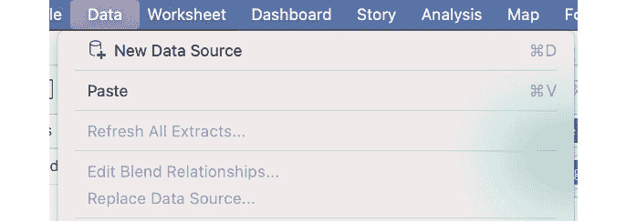

图 6.50：添加新的数据源

1.  选择“空间文件”选项：

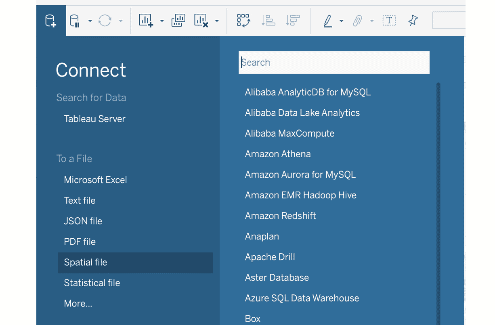

图 6.51：连接到空间文件

1.  定位您的下载文件并选择它。数据样本将出现在导入窗口中：

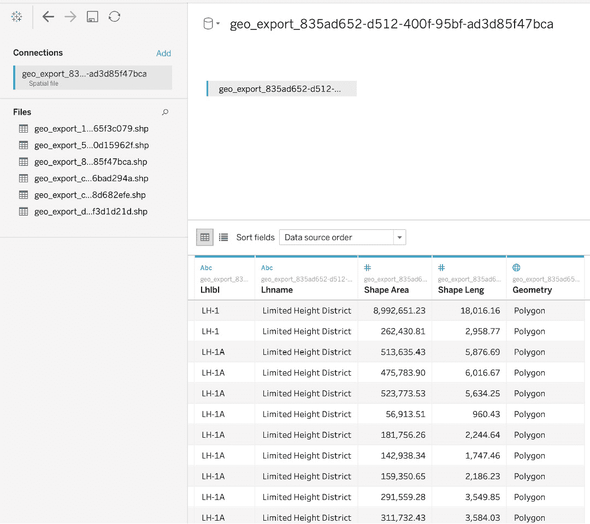

图 6.52：查看空间文件属性

1.  添加一个新的工作表，并确保它使用空间数据源：

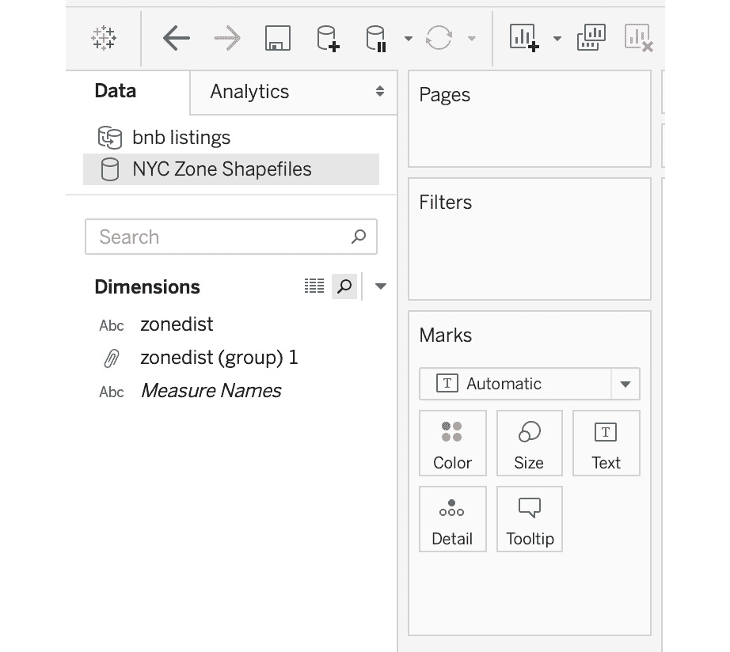

图 6.53：包含来自空间文件维度和度量的工作表

1.  将 `Geometry` 度量拖到 `Detail` 卡片。Tableau 将添加 `Latitude` 和 `Longitude` 字段并创建一个地图：

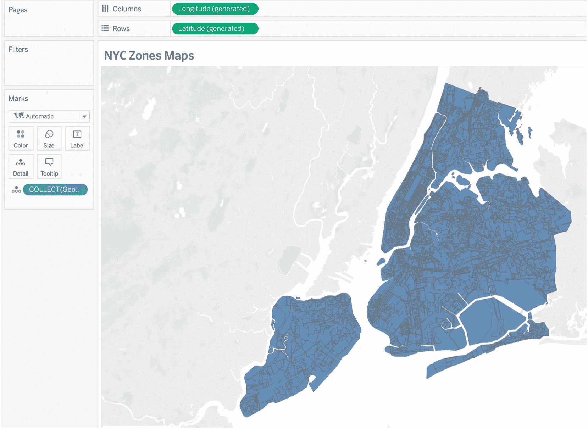

图 6.54：将几何度量添加到 Detail 卡片

1.  将 `zonedist` 维度拖到 `Color` 卡片：

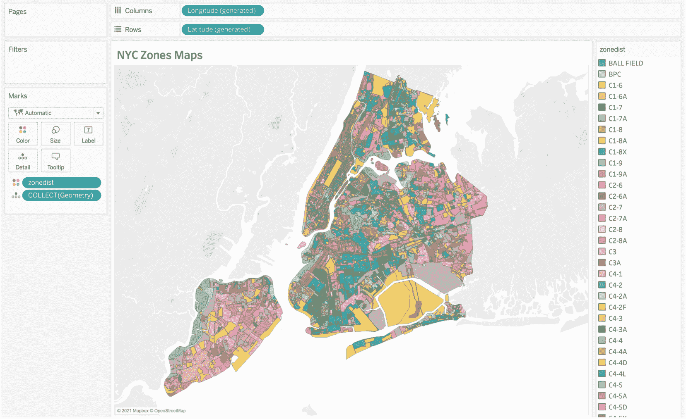

图 6.55：使用区域距离维度着色地图

1.  通过将所有 R、C 和 M 区域汇总到 `RESIDENTIAL`、`COMMERCIAL` 和 `MANUFACTURING` 组中创建一个 `zonedist (group)` 维度。点击 `OK` 保存该组为维度。

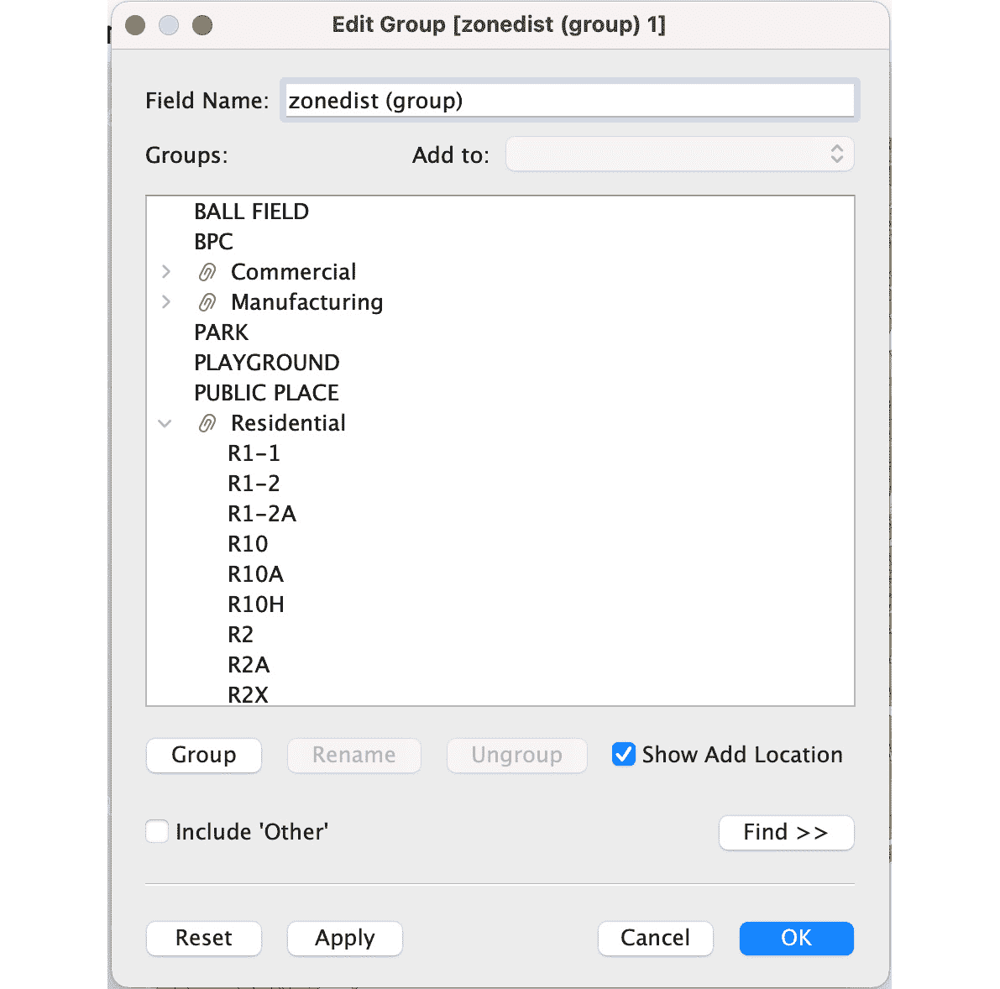

图 6.56：创建区域距离（组）维度

1.  将 `zonedist (group)` 维度拖到 `Color` 卡片：

图 6.57：使用区域距离（组）着色地图

在这个练习中，你添加了一个空间数据源，并使用 `Geometry` 字段填充地图。你还学习了如何使用现有和新建的维度来着色地图。在接下来的小节中，你将了解如何使用双轴地图以及它们何时被使用。

## 双轴地图

Tableau 允许你创建双轴地图，这样你就可以在多边形地图上叠加点数据，或者简单地使用第二个轴以新的方式显示数据。这种类型的地图可以在你希望叠加两个具有不同目的的数据变量，或者甚至来自不同数据源时使用。例如，你可以叠加基于地理边界（州）的数据集与使用符号数据（纬度/经度地址）的数据集，或者你可以简单地从一组数据点创建附加信息，如下面的示例所示。在这个示例中，你将使用第二个轴创建一个密度地图，以显示马德里地区 Airbnb 属性的最高浓度区域。

要做到这一点，你从一个现有的符号地图开始，就像本章前面构建的那样。创建双轴地图，你只需要将 `Latitude` 度量拖到 `Columns` 面板，将其放置在现有的 `Latitude` 度量右侧。

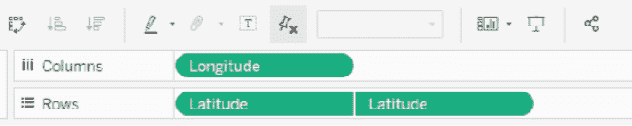

图 6.58：添加第二个纬度维度

Tableau 默认创建第二个地图；您需要从新的 `纬度` 度量下拉菜单中选择 `双轴` 选项。您还需要告诉 Tableau 将您的新度量视为一个维度，通过从同一菜单中选择 `维度` 选项。

![图 6.59：设置双轴地图

![图片 B16342_06_59.jpg]

图 6.59：设置双轴地图

一旦指定了第二个轴，您就可以移动到 `标记` 区域，其中已添加了一个 `纬度 (2)` 条目。在这种情况下，您会选择显示类型为 `密度` 的选项，并调整强度和透明度级别到您喜欢的程度。这将使地图保留地图的原始元素，同时添加密度标记。

`密度` 选项现在将以模糊的颜色显示属性浓度较高的区域。地图中间的 Centro 社区在此缩放级别将特别密集。当您放大时，单个属性将逐渐显示出来。在本节中，您回顾了双轴图表，但以地图的形式。现在，通过执行下一个练习，您将更好地掌握这些概念。

## 练习 6.07：创建双轴地图

在此练习中，您将创建一个双轴地图，使用符号作为基础地图，然后添加一个使用密度标记的第二轴。您将使用与之前练习中相同的马德里 Airbnb 数据源。

执行以下步骤以完成此练习：

1.  打开您在 *练习 6.05* 中创建的 `马德里住宿地图` 工作表。

![图 6.60：按邻里组着色的符号地图

![图片 B16342_06_60.jpg]

图 6.60：按邻里组着色的符号地图

1.  将 `纬度` 度量拖到 `行` 档案旁边现有的 `纬度` 度量旁边：

![图 6.61：使用两个纬度度量添加双轴

![图片 B16342_06_61.jpg]

图 6.61：使用两个纬度度量添加双轴

1.  将新的 `纬度` 度量设置为连续维度，并检查 `双轴` 项以将元素组合成单个地图：

![图 6.62：选择双轴选项

![图片 B16342_06_62.jpg]

图 6.62：选择双轴选项

1.  在 `纬度 (2)` `标记` 区域，选择 `密度` 选项：

![图 6.63：选择密度符号

![图片 B16342_06_63.jpg]

图 6.63：选择密度符号

1.  通过单击 `颜色` 卡片调整 `密度` 设置：

![图 6.64：调整密度着色

![图片 B16342_06_64.jpg]

图 6.64：调整密度着色

1.  查看地图以查看 `密度` 符号的影响：

![图 6.65：带有符号和密度的完成双轴地图

![图片 B16342_06_65.jpg]

图 6.65：带有符号和密度的完成双轴地图

在这个练习中，您创建了一个使用第一轴上的圆形符号和第二轴上的密度符号的双轴地图。您学习了如何将它们结合起来创建一个更完整的地图。您添加的第二个密度细节级别现在将以模糊的颜色显示属性浓度较高的区域。在地图中间的 Centro 社区在这个缩放级别上将会特别密集。这些额外的地图细节有助于最终用户/利益相关者在一个视图中观察地图时获得额外的上下文，而不是多次切换视图。在下一节中，您将回顾 Tableau 提供的地图增强选项，以及如何在您的地图中最佳地添加/使用它们。

## 地图增强

Tableau 提供了多个功能，您可以使用这些功能来升级您的地图，使其对用户更有效。其中一些是内置的，而其他则可以非常容易地添加。在本节中，您将了解一些简单的方法来改进 Tableau 中使用的基线地图。

### 设置地图选项

地图选项是一些简单的选择，可以用来确定用户如何与地图交互。要设置这些选项，请选择“地图”|“地图选项”菜单项，这将打开一个小窗口：

![图 6.66：地图选项菜单项]

![图片 B16342_06_66.jpg]

图 6.66：地图选项菜单项

这些选项允许用户使用平移（在地图的左右或上下移动）和缩放来导航地图，允许用户执行搜索，并允许工具栏提供的功能（径向选择等）。如果您希望地图保持固定大小和位置，请禁用这些功能。

### 使用现有层

Tableau 的默认背景地图提供了许多地图层，用户可以根据自己的喜好轻松选择和取消选择。地图层可以帮助您添加额外的细节，例如高速公路、边界、地形、海岸线和县边界，在这些层中添加的细节会使地图更加丰富。要更改默认地图层，请从菜单中选择“地图”|“地图层”。Tableau 提供以下层选项：

![图 6.67：地图层菜单选项]

![图片 B16342_06_67.jpg]

图 6.67：地图层菜单选项

这些层可以用来自定义地图的外观。例如，在 Madrid 列表示例中，如果您选择“街道、高速公路、路线”以及“邮编标签”，您将注意到地图上添加了额外的细节，如下面的截图所示：

![图 6.68：带有添加层的地图层菜单选项]

![图片 B16342_06_68.jpg]

图 6.68：带有添加层的地图层菜单选项

虽然与数据可视化最佳实践保持一致，但您通常会尽量减少这些层的数量和可见性，以免分散用户对地图数据的注意力。只使用足够的层来提供上下文是一种明智的方法。

此外，还有 20 多个人口统计层作为基于美国数据的叠加层，这实际上允许您根据下拉菜单中选择的人口添加数据掩码层。但如前所述，在您的地图中很少需要使用这些额外层，因为这些层往往会让利益相关者感到困惑，而不是帮助他们。

在 Tableau 中添加或删除图层非常容易，因此明智的做法是在您的地图视觉上令人满意之前花些时间探索众多选项。与大多数图表一样，地图上通常“少即是多”；确保焦点在数据上，而不是地图层上。

### 添加 Mapbox 背景地图

您确实有超越标准 Tableau 背景地图的选项。其中之一是将 Mapbox 背景地图嵌入到 Tableau 中——这种方法能够创建独特风格的地图。Mapbox 是一个流行的地图创建平台，使用户能够为许多应用定制地图。Tableau 在 Tableau 9.2 中添加了 Mapbox 集成，因此使用 Mapbox 背景地图的能力并不是新的，但如果您希望展示超越原生 Tableau 版本的地图，则仍然应该探索。您需要创建一个免费的 Mapbox 账户，网址为[`www.mapbox.com/`](https://www.mapbox.com/)，以构建这些地图。

要导出 Mapbox 地图以在 Tableau 中使用，请导航到 Mapbox Studio，[`studio.mapbox.com/`](https://studio.mapbox.com/)，然后只需点击`新建样式`并从`选择模板`以及从弹出菜单中选择`选择变体`来简单地创建自己的样式： 

图 6.69：选择 Mapbox 的模板和变体

然后，在地图右上角选择`Share…`图标，查看`第三方`选项以找到`Tableau`对话框：

图 6.70：将 Mapbox 背景地图导出到 Tableau

这为您提供了一个链接，可以在 Tableau 中用作背景地图样式，以提供定制的背景，使您的地图与标准的 Tableau 选项区分开来。该链接可以复制到剪贴板，然后添加为背景地图。在 Tableau Desktop 中，创建一个新的工作表，选择`地图` | `背景地图` | `管理地图`菜单项，这将打开`地图服务`窗口。点击`添加`按钮，您将有两个选项：`WMS 服务器…`（Web 地图服务器，类似于 Mapbox）和`Mapbox 地图…`。点击`Mapbox`选项，您将看到一个对话框屏幕：

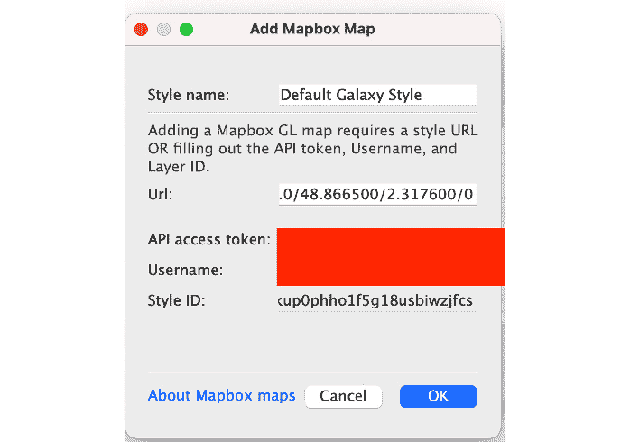

图 6.71：使用 Mapbox URL 添加 Mapbox 地图

在这里，你可以添加一个你喜欢的样式名称，然后将你的 Mapbox 链接复制到 URL 文本框中。其余信息将根据 URL 链接自动更新，你的背景地图将准备就绪。可以使用相同的过程添加多个地图，这将为你提供超出 Tableau 原生地图背景的许多选项。现在，使用这个 Mapbox 地图风格为你的马德里工作表。点击 `地图` | `背景地图` | `默认银河风格（或你的样式名称）`。以下是使用新背景地图查看你的数据：

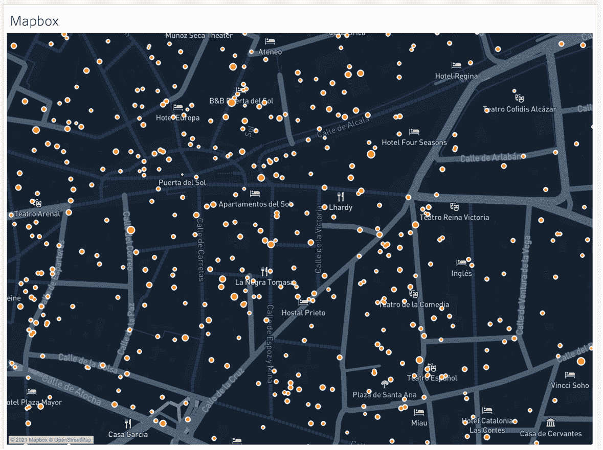

图 6.72：马德里定制的 Mapbox 地图

如果你打开 `地图` | `地图层` 卡，你将看到从所选 Mapbox 地图中可用的图层。请注意，每种地图风格都将有其自己的选项集。以下是你的样式所拥有的选项：

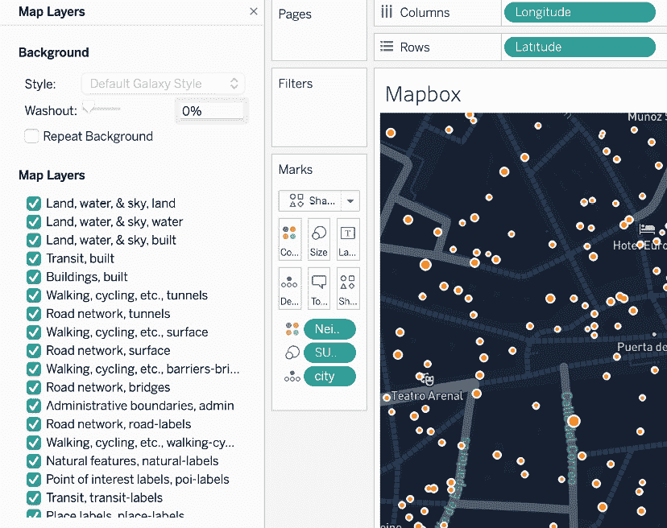

图 6.73：为 Mapbox 地图选择地图层

使用这些复选框可以轻松地自定义地图，使其与现有的点数据配合得最好。你还可以使用“淡化”滑块为显示添加一定程度的透明度。

正如你所见，Mapbox 背景地图可以用来为你的工作表和仪表板增添视觉兴趣，并且可以在 Mapbox 中使用几乎无限的色彩和样式组合进行自定义。为了吸收本节所读内容，你现在将进行一个练习，添加 Mapbox 并了解如何在 Tableau 中使用它。

## 练习 6.08：添加 Mapbox 背景地图

在这个练习中，你将练习将 Mapbox 数据添加到纽约分区数据中，并应用一个新 Mapbox 风格到之前使用的 GIS 数据。

执行以下步骤以完成此练习：

1.  如果你还没有将数据加载到 Tableau Desktop 中，请加载 `纽约市分区形状文件`。

1.  将 `几何` 拖动到 `详细` 标记卡中，将创建一个 `纽约市地图`，你之前也见过。

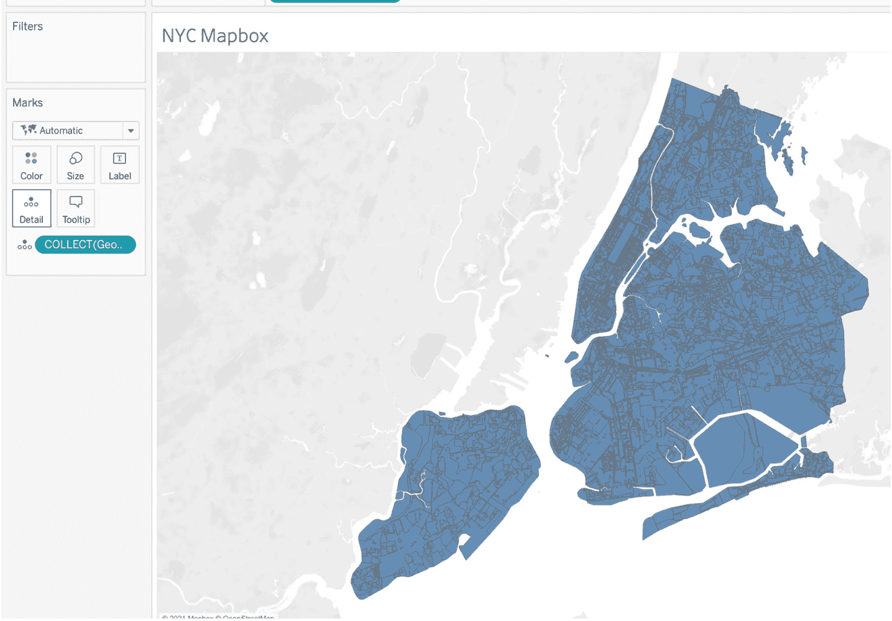

图 6.74：纽约市分区数据地图

注意

你可以在 [`studio.mapbox.com/`](https://studio.mapbox.com/) 上创建一个账户，并且可以免费继续练习。请确保你填写了必要的凭据。

1.  现在，前往 [`studio.mapbox.com/`](https://studio.mapbox.com/) 并登录/注册，如果你之前还没有这样做。

1.  点击 [`studio.mapbox.com/`](https://studio.mapbox.com/) 上的 `新建样式` 按钮。

图 6.75：在 Mapbox 中创建新风格

1.  接下来，选择你想要使用的样式。为了本练习的目的，选择 `街道` 模板作为样式。点击 `自定义街道` 按钮来创建你自己的 Mapbox 风格。

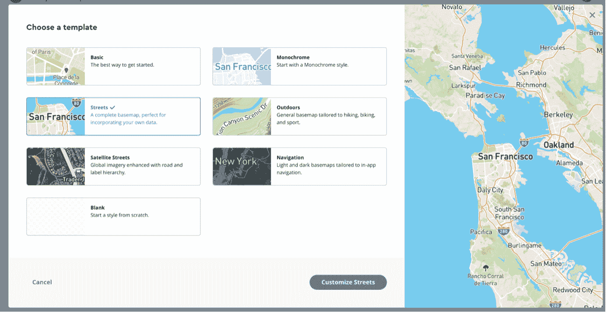

图 6.76：在 Mapbox 中选择风格

1.  在加载的新页面上，点击右上角的`分享`按钮，向下滚动弹出窗口并点击`第三方`，然后从下拉菜单中选择`Tableau`，如图所示，并复制集成 URL：

图 6.77：在 Mapbox 中选择 Tableau 作为第三方服务

1.  在你的 Tableau Desktop 实例中，点击`地图` | `背景地图` | `管理地图`，在弹出窗口中点击`添加…`并选择`Mapbox Maps…`，如图所示：

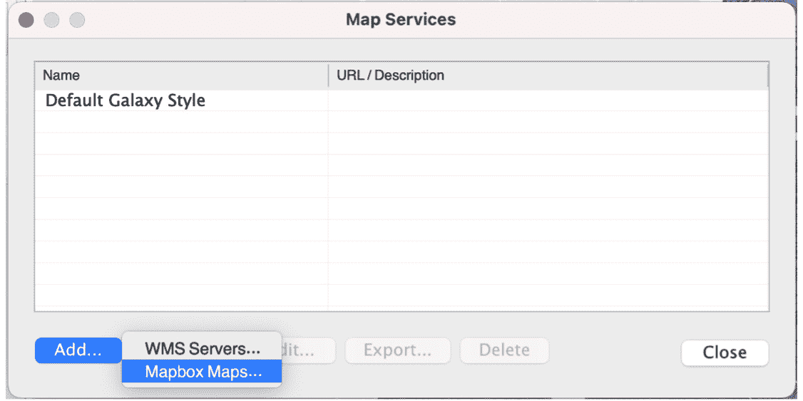

图 6.78：将新的 Mapbox 地图添加到 Tableau

1.  适当地命名你的地图样式，并将集成 URL 粘贴到`Url`字段中。其他字段应自动加载，如图所示。点击 OK：

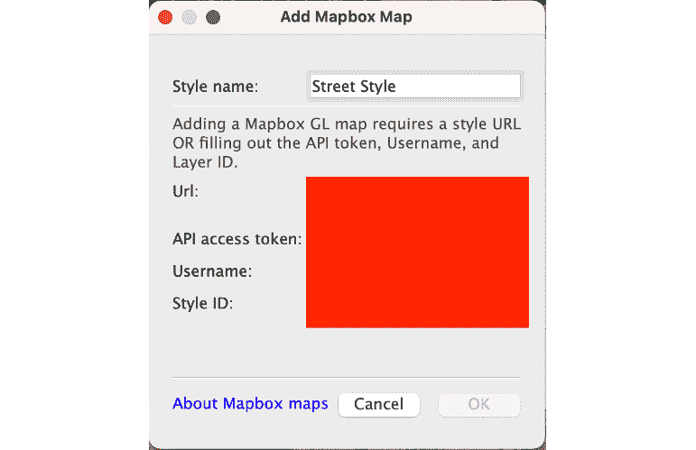

图 6.79：添加新的 Mapbox 样式

纽约市分区地图应该自动加载新的 Mapbox 样式，比 Tableau 默认地图选项提供更多的细节，如图所示输出：

图 6.80：在新的 Mapbox 样式中加载的纽约市地图

如您所见，当放大时，Mapbox 背景地图提供了更多的额外细节，包括城市线和街道名称。

在这个练习中，你练习了使用 shapefile 将 Mapbox 添加到你的 Tableau 地图中，并应用了新的样式，而在练习之前，你只处理 ZIP 代码数据。有了 Mapbox，你能够为地图添加更多细节，例如街道、社区、重要景点、海岸线和高速公路。这些新增的细节增强了地图对最终用户的功能。

这总结了本章的理论部分。接下来，你将通过一组新的数据和最终活动来测试你在本课程和之前练习中学到的知识，尝试创建有用且强大的地图。

## 活动六.01：使用双轴和背景地图创建位置分析

作为旧金山城市部门的 数据开发者，你被要求创建一份报告/可视化，从高层次展示城市房屋收购协议的热点，并收集有关房屋、其社区、其实际地址、其收购日期、其承租人总数以及房屋收购金额的背景信息。利益相关者还希望能够通过收购日期过滤地图数据点。你将使用 GitHub 链接中提供的 SF Buyout Agreement 数据或通过以下链接下载`.shp`文件：[`packt.link/ojAf3`](https://packt.link/ojAf3)。

执行以下步骤来完成此活动：

1.  定位你从 GitHub 下载的`SF Buyout Data.shp`文件，并将其作为数据源添加到 Tableau 中。

1.  创建一个新的工作表，命名为`SF Buyout Map`。

1.  添加`买断日期`作为过滤器。通过选择相对日期只包含非空值。显示`买断日期`过滤器。

1.  在进行下一步之前，将标题编辑为`SF 买断地图`，并重命名一些列名以便更容易理解。映射如下：

    +   `案例编号` – `案例编号`

    +   `买断前日期` – `买断前披露日期`

    +   `买断日期` – `买断日期`

    +   `买断金额` – `买断金额`

    +   `Number of` – `租户数量`

    +   `分析 N` – `邻里`

1.  将`几何形状`拖动到`详情`卡片上。

1.  复制`纬度(生成)`列并创建一个双轴。

1.  在第一个`纬度(生成)`标记卡下，将`标记类型`更改为`密度`。

1.  将`SUM(Tenants)`添加到`颜色标记卡`，并将`案例编号`添加到`详情标记卡`。

1.  对于第二个`纬度`，将`标记类型`更改为`圆形`符号。

1.  将`邻里`添加到`颜色标记卡`，并将`案例编号`添加到`详情标记卡`。

1.  当您或利益相关者悬停在地图上或点击地图时，为了为地图添加上下文，您将添加`地址`、`买断日期`、`买断金额`和`租户`到工具提示中，并编辑工具提示以看起来如下所示。

预期输出如下：

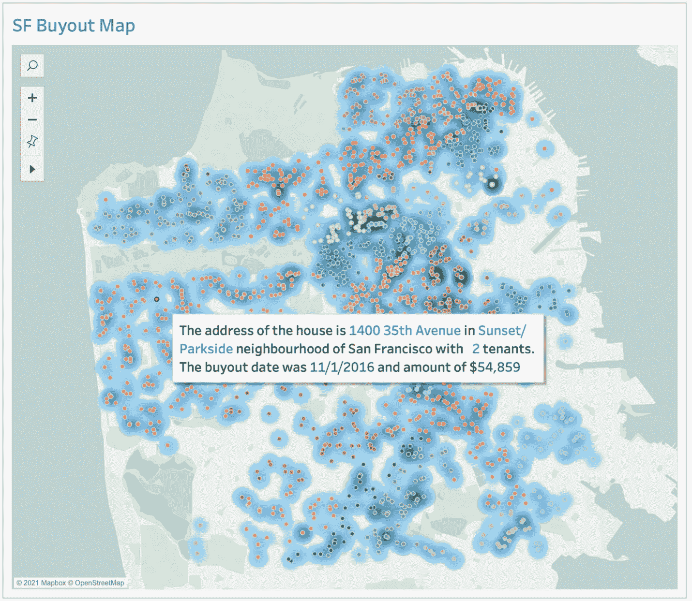

图 6.81：活动 6.01 预期输出

注意

本活动的解决方案可在此处找到：[`packt.link/CTCxk`](https://packt.link/CTCxk)。

# 摘要

本章向您介绍了许多地理功能和方法，设计师和用户可以在 Tableau 中使用这些功能和方法。能够将地理数据转化为强大、吸引人的地图，并与其他显示集成，是构建视觉洞察力的一项关键技能。您学习了如何将大小、颜色、形状和筛选功能整合到 Tableau 地图中，以便用户可以更深入地探索和理解地理信息。

您还了解到，虽然 Tableau 不是一个专门的地图平台，但它可以用来复制许多传统地图和 GIS 软件的功能。能够绘制地理数据是开发针对用户完整的 Tableau 解决方案的一项基本技能，并且可以融入任何有地理空间数据可用且与外部地图文件交互的分析中，这可以为地图添加额外的细节层。

在下一章中，您将进入课程的分析部分，即*第七章：分析：创建和使用计算*。下一章将扩展您创建多种类型计算的能力，这些计算超越了创建地图时使用的几个简单计算。
