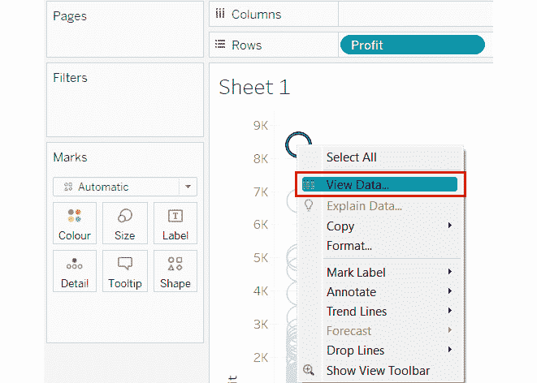
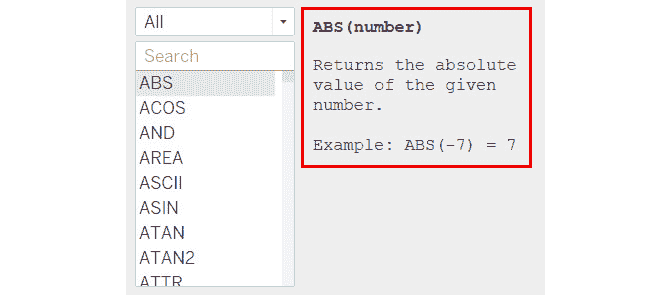
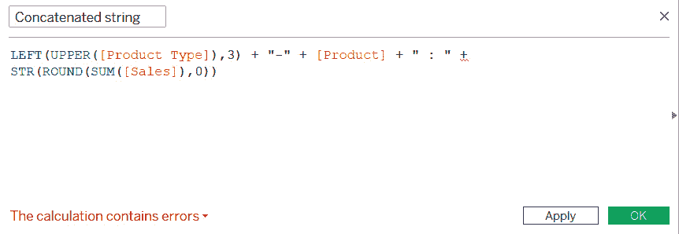
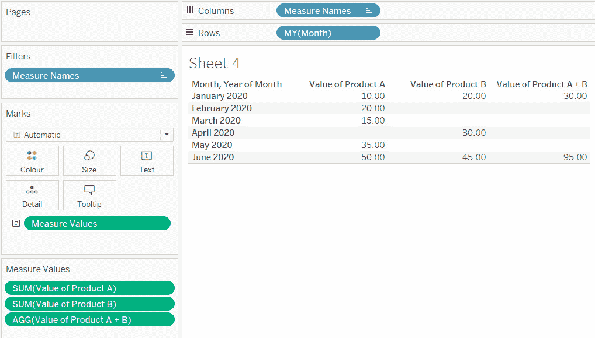

# 第七章：7. 数据分析：创建和使用计算

概述

在本章中，你将学习如何创建和使用各种类型的计算，不仅限于现有数据源内，还可以跨数据源。本章首先描述了聚合和非聚合值的定义及其区别。然后，你将了解各种类型的计算，如数值计算、字符串计算和日期计算，以及如何在 Tableau 中编写逻辑语句。

到本章结束时，你将能够创建和使用 Tableau 中的各种类型的计算。

# 简介

通常，分析数据的第一步是提出一些问题或目标。这可能是确定你最有利可图的客户，或者更复杂，比如调查尽管销售量高但导致亏损的产品。在确定问题或目标后，你会审计你的数据。这意味着确定数据所在的位置——所需字段是否存储在单个或多个数据源中，以及所有字段是否都易于使用。然后，你会检查数据的完整性和有效性。这意味着检查数据是否需要在清洁、合并或重构方面进行任何修改。

一旦数据经过审计，Tableau Desktop 中的工具允许你以视觉方式探索它，以便进行更流畅的分析。这可能意味着构建图表、添加交互性、将数据分组或创建计算以获得更有意义的见解。一旦分析完成，你收集的见解就可以与他人分享了。本章旨在涵盖数据分析周期的所有方面。

在本章中，你将学习如何创建和使用 Tableau 的各种计算类型，这是数据分析中的一项基本技能。区分聚合和非聚合

为了有效地使用 Tableau，你深刻理解聚合至关重要。当你添加任何数据时，Tableau 会迅速将`数据`面板中的数据分类为`维度`和`度量`。当一个`度量`进入视图时，Tableau 会对其进行聚合（通常使用`SUM`聚合）。

这可以通过使用来自*Sample-Superstore.xlsx*的`Orders`数据来演示，该文件可以在`Documents\My Tableau Repository\Datasources\`中找到，或者可以从本书的 GitHub 仓库下载，链接如下：[`packt.link/T9PeZ`](https://packt.link/T9PeZ)。

一旦你获得了数据访问权限，将`Profit`字段从`数据`面板拖动到`行`架上。注意，该字段的属性已更改为`SUM(Profit)`，并生成一个垂直条。参见图下：


图 7.1：显示 SUM(Profit)的屏幕截图

查看工作表底部的状态栏。注意只有`1 个标记`，而`SUM(利润)`为`286,397`。这是数据的*总聚合利润*：


图 7.2：显示状态栏中 SUM(利润)的截图

现在，观察当你分解它时会发生什么。为了分解`度量`，取消选中`聚合度量`选项，该选项位于`分析`下的`工具栏`中：


图 7.3：显示聚合度量选项的截图

原来位于`行`架中的`SUM(利润)`字段现在已更改，只显示`利润`。此外，条形图现在被分解成多个气泡；一些气泡位于负轴上，状态栏现在显示`9994 个标记`：


图 7.4：显示分解利润的截图

当你取消选中`聚合度量`选项时，`利润`值变为非聚合，这反过来又打破了显示在代表数据中每个交易利润值的气泡中的`利润总和`的聚合利润条。在任何给定的时间点，你都可以右键单击一个气泡来查看数据并看到交易的完整细节：



图 7.5：显示查看数据选项的截图

默认情况下，`聚合度量`选项是开启的，所有`度量`都将默认聚合（除非你选择像上面解释的那样分解它们）。此外，`度量`的默认聚合是`求和`，这可以通过在`数据`面板中右键单击一个`度量`并从`默认属性`下的`求和`更改为`平均值`或`最小值`到`最大值`等来更改：


图 7.6：显示如何更改聚合的截图

从前面的例子中，你可以得出结论，当你看到视图中`SUM(利润)`时，这意味着 Tableau 正在聚合所有交易值。当你只看到`利润`时，这意味着 Tableau 正在关注交易值而没有对它们进行聚合。这种特定的区别很重要，尤其是在创建计算字段时。你将在深入研究创建和使用计算时进一步探讨这一点。

在前面的例子中，你看了如何聚合和分解`度量`。然而，当处理包括所有分类数据的`维度`时，还有额外的考虑。具体来说，你应该问自己：*哪个/谁？* 和 *有多少个？*。

以`Sample-Superstore.xlsx`文件为例，当分析`子类别`时，您可能会提出以下问题：*哪些子类别是盈利的？* 或 *有多少子类别是盈利的？* 第一个问题很容易回答，因为您只关心`子类别`字段中的盈利数据成员。当您将维度拖入视图时，您将默认获得该字段所有唯一数据成员的列表。因此，将`子类别`字段拖入`行`面板将导致以下视图：


图 7.7：显示某一维度的唯一数据成员列表的屏幕截图

然而，对于第二个问题，您需要找到具有正利润的子类别数量。这意味着找到该维度的数据成员数量。这可以通过点击`子类别`字段的下拉菜单，并选择在`度量`下可用的“计数”或“计数（不同）”选项来实现：


图 7.8：显示视图中某一维度计数和计数（不同）选项的屏幕截图

当选择“计数”或“计数（不同）”选项时，请注意，子类别列表将变为一个条形图，显示数据中总共有 17 个子类别。此方法将仅在创建子类别的电子表格中提供子类别的计数。然而，如果您需要在工作簿中的其他可视化中显示相同的信息，那么在您的“数据”面板中显示计数是有意义的，这样您就可以根据需要将其拖入视图。这可以通过两种方式实现：

+   第一种方法是将`子类别`维度转换为`度量`，这将把原始的`维度`字段从显示数据成员列表转换为显示子类别唯一计数的`度量`：


图 7.9：显示通过将其转换为度量来聚合维度的屏幕截图

+   第二种方式是在`子类别`维度上创建一个计算字段。这不仅将保持原始维度，我们还将拥有另一个可以用来获取所需输出的字段。您将在接下来的主题中了解更多关于创建计算字段的信息。

# 创建和使用临时/在架计算

“行”、“列”和“度量值”面板，以及“标记卡”。

您只需双击您选择的架子上现有的字段，或者，作为替代，您可以使用该字段的下拉列表中的“在架上编辑”选项，如图下所示：


这些临时的计算在创建快速、即兴的计算时很有用，你可能希望保存并重复使用，也可能不希望。你将在下面的练习中探索这一点。

## 练习 7.01：创建一个临时的计算来突出亏损的子类别

本练习的目的是找出哪些子类别有负利润，哪些子类别有正利润。那些有负利润的将是你亏损的子类别，并将用橙色标记。你将使用`Sample-Superstore.xlsx`中的`Orders`数据来完成这个练习。

执行以下步骤：

1.  首先，创建一个条形图，显示按`Sub-Category`的`SUM(Sales)`，并在`Color`面板中显示`SUM(Profit)`，如图所示。


条形图的颜色调色板为橙色和蓝色，其中橙色的阴影表示负利润，蓝色的阴影表示正利润。阴影表示利润的强度。然而，当前的任务是突出亏损的条形图，这意味着那些利润小于零的条形图。对于这个任务，利润的强度是不相关的。

为了解决这个问题，要么双击，要么在`Color`面板中`SUM(Profit)`字段的下拉菜单中使用`Edit in Shelf`选项，并输入以下公式：

```py
SUM(Profit) < 0
```

1.  按*Enter*键查看新的临时计算。现在它显示了两种颜色，而不是之前看到的差异颜色。在这种情况下，橙色条形图表示亏损的子类别，蓝色条形图表示盈利的子类别。请参考以下截图：


此外，如前所述，这种临时的计算是一种即兴计算，可能只能用于特定的可视化中，在这种情况下，没有必要保存这个计算。

1.  为了在其他可视化中重复使用这个计算，只需通过拖放将其保存在`Data`面板中，如图所示。


# 创建和使用不同类型的计算

Tableau 是一个简单而通用的工具，创建计算的能力使用户能够执行强大的分析，这有助于决策。大多数时候，在 Tableau 中创建计算是一个有趣的过程，但有时也可能有点令人沮丧，尤其是如果你来自不同的平台并试图复制某些功能。这些工具的结构和设计不同，试图在另一个工具中复制功能可能会让人感到沮丧。在 Tableau 中创建计算的最佳方式是从小处着手，熟悉 Tableau 提供的函数。虽然编写 Tableau 中的计算很简单，但如果可能的话，建议首先尝试使用内置的原生功能，而不是创建一个新的计算字段。以下是一些这些功能的例子：

+   在“数据”面板中右键单击任何“字符串维度”时，可用的“拆分”或“自定义拆分”功能。这个功能用于将字符串拆分为更小的子字符串。例如，将客户姓名拆分为，例如，名和姓。

+   在“数据”面板中右键单击任何维度时，可用的“分组”功能。这个功能用于将那个维度的数据成员分组到更高的类别中，例如，将地理州字段的数据成员分组到，例如，地区。

+   在“数据”面板中右键单击“日期维度”时，可用的“自定义日期”功能。这个功能用于将日期截断到不同的粒度，例如月份、月份-年份等。

+   在“数据”面板中右键单击“度量”时，可用的“分组”功能。这个功能用于将度量值分组到不同的范围桶中，例如，年龄分组从，例如 <10 岁，11-20 岁，21-30 岁，等等。

+   在“数据”面板中选择多个“字符串维度”，然后右键单击任何选定的字符串维度时，可用的“组合字段”功能。当需要将多个字符串维度组合到一个字段中时，这个功能很有用。

+   在“数据”面板中右键单击任何维度时，可用的“别名”功能。这个功能在重命名任何维度的成员时很有用。

需要注意的一点是，这里提到的所有目标都可以通过从头创建一个计算字段来实现，但由于这些原生函数易于获取和使用，最好避免麻烦并利用它们。在本章以及本书中的其他章节中，你将更详细地探索这些函数。

要了解创建计算的过程，您首先将创建一个基本计算来查找订单 ID 的唯一计数。您可以通过多种方式做到这一点。您可以将`订单 ID`维度更改为`度量`，或者点击您视图中显示的`订单 ID`字段的下拉菜单，然后点击`度量`|`计数（唯一）`选项。或者，您甚至可以创建一个临时计算。

在前面的主题中，您看到了如何在“数据”面板中保存一个临时计算。然而，令人费解的是，在执行基本聚合操作，如求和、平均值或计数之后尝试这样做时，您会发现临时计算无法保存。从测试来看，拖放方法似乎可以解决这个问题。尝试使用下面的计算进行测试：

```py
COUNTD([Order ID])*1 
```

您现在将从头开始在 Tableau 中创建一个计算。为此，您将继续以获取订单 ID 的唯一计数为目标。

在“数据”面板中右键单击“订单 ID”维度，并选择“创建”|“计算字段”选项。这将打开一个新类型在框中，如下面的截图所示：


图 7.14：显示计算框组件的截图

*图 7.14*显示了计算框的组件。这些如下：

+   **1 – 计算名称**：这是您可以定义计算名称的地方。始终建议为计算字段赋予有意义的名称。

+   `数字`、`字符串`、`日期`、`类型转换`、`聚合`、`逻辑`等。当点击这些函数中的任何一个时，Tableau 会显示该函数的语法、该函数的作用以及一个示例。请参考以下截图：



图 7.15：显示所选函数详细信息的截图

+   **3 – 计算编辑器**：这是您将输入公式的位置。

+   计算中存在错误`以红色字体显示，计算编辑器框将在有错误的文本附近显示一条红色波浪线。

自从您右键单击`订单 ID`字段以创建计算以来，Tableau 已经假设您将为该字段创建计算，因此它已经将字段提取到计算编辑器中。

在“订单 ID”之前输入单词`CountD`。当您输入时，Tableau 开始推荐函数以及与您输入的字符共享字符的数据字段。现在，将计算命名为"`订单计数'`"。您的计算框应如下截图所示：


图 7.16：显示计算订单 ID 唯一计数的公式的截图

一旦你有了有效的计算，你可以点击“确定”并继续使用它。点击“确定”将在“数据”面板中保存你的计算，如下面的截图所示：

![图 7.17：显示新创建的计算字段的截图]


![图 7.17：显示新创建的计算字段的截图]

现在，你已经在“数据”面板中有了可用的计算字段，你可以在整个工作簿中使用它。然而，还有一些重要的事项需要注意：

+   在前面的例子中，你右键单击“订单 ID”，并选择“创建 | 计算字段”选项，这打开了计算编辑器框。这也可以通过在工具栏中选择“分析 | 创建计算字段...”选项或通过在“数据”面板中单击下拉菜单并选择“创建计算字段...”来实现：

![图 7.18：显示创建计算字段的其它方法的截图]


![图 7.18：显示创建计算字段的其它方法的截图]

+   在 Tableau 中计算或计算的任何字段都将有`=`作为前缀，这表示该字段是在 Tableau 中创建的，而不是从数据本身派生的。等号后面将跟随`Abc`或`#`（或类似的内容），这表示该字段的数据类型。例如，`=Abc`表示具有字符串输出的计算字段。

+   要对计算添加注释，你需要使用两个连续的前斜杠，即`//`。Tableau 将忽略`//`之后的所有内容。请参考以下截图：

![图 7.19：显示如何在计算字段中添加注释的截图]


![图 7.19：显示如何在计算字段中添加注释的截图]

+   函数（*图 7.19*中的表格蓝文字符）在 Tableau 中不区分大小写，但数据字段（*图 7.19*中的橙色文字）是区分大小写的，因此，你需要特别注意大小写以及数据字段的拼写。如果有任何问题，语法验证器将给出错误，你将无法使用计算字段进行进一步分析。为了克服这个问题，你可以将所需的字段从“数据”面板拖放到计算编辑器框中，而不是键入文本，如下面的截图所示：

![图 7.20：显示将字段拖放到计算编辑器的截图]


![图 7.20：显示将字段拖放到计算编辑器的截图]

+   Tableau 支持所有标准运算符，例如乘法（*）、除法（/）、取模（%）、加法（+）、减法（-），以及所有比较运算符，例如等于（==或=）、大于（>）、大于等于（>=）、小于（<）、小于等于（<=）和不等（!=或<>）。这些运算符必须键入，并且不是计算框中函数列表的一部分。

+   由于 Tableau 是一个只读工具，你正在计算的计算字段不会被写回数据，从而保持数据的完整性。

+   你可以创建一个计算字段，并在其他计算字段中使用它。

现在，你将学习如何创建和使用这些计算的一些示例。

## 创建和使用不同类型的计算：数值计算

数值计算是在对数值数据执行数学/算术函数时使用的，以便返回数值输出。Tableau 在当前时间点（即 2020.1 版本）支持的`Number`函数如下：

+   `ABS`函数，用于返回数字的绝对值；`ROUND`函数，用于将数字四舍五入到指定的十进制位数；`SQRT`，用于返回数字的平方根；以及`ZN`函数，如果存在空值则返回零，否则返回其本身的值。

+   `ASIN`、`ACOS`、`ATAN`、`SIN`、`COS`、`TAN`以及其他函数。

+   `DEGREES`和`RADIANS`。

+   `HEXBINX`和`HEXBINY`。

+   `LN`和`LOG`。

+   `EXP`和`POWER`以及其他函数。

如前所述，在选择这些函数中的任何一个时，你将看到该函数的语法、该函数目的的解释以及一个示例。此外，使用这些数值函数以及上面的算术运算符，你可以创建一些非常强大和有用的计算。

在前面的主题中，你创建了一个名为`订单数量`的新计算字段，它给出了你订单 ID 的唯一计数。现在，你将使用这个计算字段来创建另一个计算字段，以找到你子类别的平均订单价值。

## 练习 7.02：创建数值计算

本练习的目标是创建一个数值计算，以找到每个子类别的平均订单价值。你将继续使用来自*Sample-Superstore.xlsx*文件的`订单数据`，并使用`销售额`字段和之前创建的`订单数量`字段，为每个`子类别`创建一个名为`平均订单价值（AOV）`的新计算字段，并在条形图中显示它。

1.  首先，将你的`子类别`字段拖动到`行`架中。接下来，将销售额和`订单数量`字段拖动到`列`架中。现在，通过在工具栏中点击`显示标记标签`来启用你的条形图的标签。请参见以下截图：

![图 7.21：显示包含销售额和订单数量的子类别条形图的截图]

子类别间的订单数量

![img/B16342_07_21.jpg]

图 7.21：显示包含销售额和订单数量的子类别条形图的截图

1.  创建一个名为`平均订单价值（AOV）`的计算字段，其公式如下：

    ```py
    SUM([Sales])/[Count of Orders]
    ```

你应该在屏幕上看到以下内容：

![图 7.22：显示平均订单价值（AOV）计算公式的截图]

平均订单价值（AOV）计算

![img/B16342_07_22.jpg]

图 7.22：显示平均订单价值 (AOV) 计算公式的屏幕截图

1.  将 `平均订单价值 (AOV)` 拖放到 `列` 面板中的 `订单数量` 字段旁边。参考以下屏幕截图：

![图 7.23：显示平均订单价值 (AOV) 计算的柱状图的屏幕截图]

平均订单价值 (AOV) 计算

![img/B16342_07_23.jpg]

图 7.23：显示平均订单价值 (AOV) 计算的柱状图的屏幕截图

正如你在 *图 7.23* 中所看到的，`复印机` 子类别包含 `机器`。

注意，`平均订单价值 (AOV)` 的前缀是 `AGG`，它代表 `SUM()` 用于销售额，而订单数量的字段使用的是 `COUNTD()` 函数。

本练习展示了创建和使用数值计算的一个示例。你使用 `Sales` 字段和 `订单数量` 字段创建了一个名为 `平均订单价值 (AOV)` 的新计算。由于这个 `平均订单价值 (AOV)` 字段具有数值输出，因此该计算被称为数值计算。

## 创建和使用不同类型的计算：逻辑语句

逻辑语句通常用于基于标准或条件评估。Tableau 中可用的某些逻辑函数如下：

+   如 `AND`、`OR` 和 `NOT` 等运算符。

+   如 `IF`、`ELSE`、`ELSEIF`、`CASE`、`IIF`、`IFNULL`、`ISNULL`、`ISDATE` 等函数。

`IF…ELSE`、`IF…ELSEIF…ELSE` 和 `CASE` 是最常用的逻辑函数，通常，当使用这些逻辑函数时，使用 `THEN` 函数来指定当表达式为真时需要显示的值。

在这里需要记住的一个重要点是，当使用 `IF` 语句或 `CASE` 语句进行逻辑评估时，你需要使用 `END` 函数来结束你的逻辑语句。

你已经看到了一个逻辑语句的示例，即 `SUM(Profit)` 大于或小于零。这个计算的输出是一个布尔输出，结果为 `True` 或 `False`。布尔计算是一种快速且简单的逻辑语句。它们执行速度快，与其他类型的逻辑语句相比性能良好。

尽管布尔计算有许多优点，但如果最终用户不了解 `True` 和 `False` 的含义，它们可能会造成混淆。布尔的意义取决于你计算中的标准。在早期示例中，结果 `True` 表示正利润或负利润，具体取决于你计算中指定的内容。如果最终用户不熟悉这些标准，布尔结果将无助于解决问题。

为了避免混淆，最好使用更详细的逻辑语句，并包含用户友好的标签。你将通过遵循以下练习中的步骤来探索这一点。

备注

如果你使用的是 2020.1 版本之后的 Tableau，你可能需要创建“记录数”以匹配 *练习 7.03* 的输出。

## 练习 7.03：创建逻辑计算

在这个练习中，你将创建一个逻辑计算来查找不盈利的产品，以及找出每个产品中有多少交易是不盈利的。你将使用`Sample-Coffee Chain.mdb`数据集的`CoffeeChain Query`表。这是一个*Microsoft Access 数据库*。数据集可以从以下链接下载：[`1drv.ms/u/s!Av5QCoyLTBpnmkPL8Yx_0_2KtrG4?e=rWpksB`](https://1drv.ms/u/s!Av5QCoyLTBpnmkPL8Yx_0_2KtrG4?e=rWpksB)。

点击`OK`并将这个新字段拖动到`Color`轴上。你的视图将更新，如以下屏幕截图所示：

1.  有产品的整体盈利能力，以及每个产品的交易中有多少是盈利的。这两个要求都是很有用的。你将首先找到你产品的整体盈利能力。


![图 7.24：显示按产品记录数量的条形图的屏幕截图

![图 7.25：显示整体盈利能力公式的屏幕截图

现在，你想要找到你产品的盈利能力。然而，盈利能力（尤其是在这种情况下）可以在两个层面上进行计算。

首先，你将连接到`Sample-Coffee Chain.mdb`数据集的`CoffeeChain Query`表，并使用`Product`字段和`Number of records`字段创建一个条形图。然后，你将创建新的计算字段，这将帮助你找到并突出显示*不盈利的产品*，并找出每个产品中*有多少交易是不盈利的*。

注意

请在以下步骤 2 中粘贴代码后，替换`Profitable Product`和`Unprofitable Product`周围的引号。这将确保输出无错误。

1.  图 7.26：显示使用颜色的整体盈利能力的屏幕截图

    ```py
    IF SUM([Profit])>0 THEN "Profitable Product" 
    ELSE "Unprofitable Product"
    END 
    ```

参考以下屏幕截图：

![图 7.25：显示整体盈利能力公式的屏幕截图![图 7.26：显示使用颜色的整体盈利能力的屏幕截图图 7.24：显示按产品记录数量的条形图的屏幕截图 1.  使用`IF…THEN…ELSE…END`函数创建一个名为`Overall Profitability`的新计算字段。公式如下：![图 7.26：显示使用颜色的整体盈利能力的屏幕截图从`Sample-Coffee Chain.mdb`数据库连接到`CoffeeChain Query`表。通过将`Product Name`字段拖动到`Rows`轴上创建一个条形图。然后，将`Number of Records`拖动到`Columns`轴上，并启用这些条形的标签。参考以下屏幕截图：如您从颜色图例中看到的，*蓝色条形*是*盈利产品*，而*橙色条形*是*不盈利产品*。在先前的屏幕截图中，您可以清楚地看到绿茶是唯一一个不盈利的产品。图 7.25：显示整体盈利能力公式的屏幕截图在临时计算示例（*练习 7.01，创建临时计算以突出亏损子类别*）中，当你将计算保存在`数据`面板中时，你有一个带有前缀=T|F 的布尔输出，而当你通过点击`确定`保存此`整体盈利`计算时，你会看到输出是一个带有前缀`=Abc`的字符串。请参考以下屏幕截图：

图 7.27：显示临时计算前缀和整体盈利计算的屏幕截图

现在你已经找到了哪些产品是盈利的，现在是时候找出每个产品有多少盈利交易了。

1.  修改`整体盈利`计算和代码。

1.  使用`IF…THEN…ELSE…END`函数。公式和语法应类似于`整体盈利`计算，但`Profit`字段的聚合和显示的输出字符串有所变化。将此计算字段命名为`交易盈利`。公式如下：

    ```py
    IF [Profit]>0 THEN "Profitable transaction" 
    ELSE "Unprofitable transaction"
    END 
    ```

请参考以下屏幕截图：


图 7.28：显示交易盈利公式的屏幕截图

1.  点击`确定`并将这个新字段拖入`颜色`面板。你的视图将更新，如以下屏幕截图所示：


图 7.29：显示交易盈利的彩色屏幕截图

如颜色图例所示，*蓝色条形*代表盈利交易，*橙色条形*代表亏损交易。从这些信息中，你可以发现一些有趣的结论。例如，它显示所有`Decaf Espresso`交易都是盈利的。

你现在已经成功创建并使用逻辑语句来查找每个产品的盈利情况和盈利交易。

## 创建和使用不同类型的计算：字符串计算

在 Tableau 中，可以在任何数据类型上执行字符串计算。Tableau 将转换并处理所有这些数据类型，并生成字符串输出。你可以在`整数`字段上创建字符串计算，以及通过首先将它们转换为字符串来在`日期`字段上创建字符串计算。你可以在 Tableau 中使用类型转换函数`STR()`来实现这一点。Tableau（在 2020.1 版本中）支持的字符串函数如下：

+   `ASCII`和`CHAR`等函数分别查找字符的 ASCII 码和基于 ASCII 码的字符。

+   `LOWER`和`UPPER`等大小写函数分别将字符串转换为小写和大写。

+   函数如`CONTAINS`、`STARTSWITH`、`ENDSWITH`和`ISDATE`检查字符串或子字符串条件。

+   `TRIM`、`LTRIM`和`RTRIM`等函数可以删除空白空间。

+   `FIND`和`FINDNTH`等函数可以找到子字符串的位置。

+   `LEFT`、`RIGHT`和`MID`等函数返回字符串中的指定字符数。

+   正则表达式，如`REGEXP_EXTRACT`、`REGEXP_EXTRACT_NTH`、`REGEXP_MATCH`和`REGEXP_REPLACE`，允许您指定要匹配、定位和管理文本的模式。

+   Tableau 中可用的其他一些字符串函数包括`LEN`，它返回字符串的长度；`REPLACE`，它搜索指定的子字符串并将其替换为替换子字符串；`SPLIT`，它根据指定的分隔符从字符串中返回子字符串；以及`MIN`和`MAX`，它们返回字符串的字母顺序最小或最大值。

在本节中，您将进一步探索这些函数中的一些。

您现在将继续使用来自*Sample-Superstore.xlsx*的`订单`数据，并处理`客户姓名`字段。目前，此字段是客户名和姓的组合。名和姓由*空格*分隔。对于此示例，您将分隔每个客户的姓和名，然后找到客户的姓的首字母。

之后，您为以字母*A 到 I*、*J 到 R*和*S 到 Z*开头的名字创建组，以找出每个组中有多少客户。

您首先将`客户姓名`字段拖放到`行`架上。应该有 793 个唯一的客户。

要找到姓氏，您必须在`客户姓名`字段上创建计算。在`数据`面板中右键单击`客户姓名`字段，并选择`转换`下可用的`拆分`或`自定义拆分`选项。请参考以下屏幕截图：


图 7.30：显示拆分和自定义拆分选项的屏幕截图

当使用`拆分`函数时，Tableau 会自动创建两个名为`客户姓名 – 拆分 1`和`客户姓名 – 拆分 2`的计算字段。当您编辑这些计算字段时，您将看到`拆分 1`和`拆分 2`的以下语法：

```py
TRIM( SPLIT( [Customer Name], " ", 1 ) )
TRIM( SPLIT( [Customer Name], " ", 2 ) )
```

此自动拆分目标*分隔符*，在本例中是*空格*，基于此，已将字段拆分为*空格前的第一列*，这是客户*名*，*空格后的第二列*，在本例中是客户*姓*。

`自定义拆分`选项比自动拆分选项提供了更多的控制。例如，这里只需要姓氏。名在此点没有用处。因此，您可以使用`自定义拆分`而不是自动拆分选项，它将显示以下屏幕截图：


图 7.31：显示自定义拆分选项的屏幕截图

在这里，你可以指定分隔符/定界符。你可以决定你想要第一列还是第二列，以及是否想要分割列。要只获取姓氏，请选择*空格*作为分隔符，然后`Split off`最后一个`1`列。你将得到一个名为`Customer Name - Split 2`的新计算字段。该字段的语法如下：

```py
TRIM(SPLIT([Customer Name], " ", -1 ))
```

`Split`和`Custom Split`是 Tableau 提供的用于分割字符串的快捷选项。然而，你也可以通过从头开始创建一些之前提到的字符串函数的新计算字段来得到相同的结果。你现在将进一步探索这一点。

首先，解析字符串以找到空格的位置。然后，要求 Tableau 给出空格后的字符串。为了找到空格的位置，使用 Tableau 中的`FIND`函数。计算字段的语法应如下所示：

```py
FIND([Customer Name]," ")
```

这给出了空格位置的数值。然而，你需要空格后的字符串。为了识别这一点，使用`MID`函数。语法应如下所示：

```py
MID([Customer Name],FIND([Customer Name]," "))
```

此公式给出了空格后的字符串，但这也包括了前导空格。为了移除这个前导空格，你可以使用以下`TRIM`函数或`LTRIM`函数：

1.  `TRIM`:

    ```py
    TRIM(MID([Customer Name],FIND([Customer Name]," ")))
    ```

1.  `LTRIM`:

    ```py
    LTRIM(MID([Customer Name],FIND([Customer Name]," ")))
    ```

这两个函数中的任何一个都会移除前导空格，并只给出空格后的字符串。然而，如果你不想使用`TRIM`或`LTRIM`函数，你甚至可以修改计算来调整`FIND`函数，如下所示：

```py
MID([Customer Name],(FIND([Customer Name]," ")+1))
```

前一个示例中的`+1`找到空格后的第一个位置，因此它将类似于`TRIM`和`LTRIM`函数的工作方式。

讨论所有这些选项的目的是为了表明，许多字符串函数可以以不同的方式利用来得到相同的结果。现在，选择任何前面的公式并将你的计算字段保存为`Last Name`。参见图表：

![图 7.32：显示姓氏计算字段的屏幕截图]


图 7.32：显示姓氏计算字段的屏幕截图

现在，你已经有了客户的`Last Name`，是时候找到`Last Name`的首字母了。在这里，你同样可以使用`LEFT`和`MID`等函数。这两个函数的语法如下所示：

```py
LEFT([Last Name],1)
MID([Last Name],1,1)
```

`LEFT`函数将从给定字符串的开始返回*指定数量的字符（如前一个示例中所示为`1`）*。

`MID`函数将返回字符串中间的字符，提供一个*起始位置和长度（如前一个示例中所示为`1,1`）*。因此，`LEFT`和`MID`函数都将给我们字符串的第一个字符。

在这里，你将继续使用`MID`函数，如下面的屏幕截图所示：

![图 7.33：显示姓氏首字母计算字段的屏幕截图]


图 7.33：显示姓氏首字母计算字段的屏幕截图

最后，是时候创建您的组了。您可以使用以下公式：

```py
IF [Starting alphabet of Last Name] <= "I" THEN "A-I"
ELSEIF [Starting alphabet of Last Name] >= "S" THEN "S-Z"
ELSE "J-R"
END
```

将此计算命名为`Groups-Starting alphabet of Last Name`。参考以下屏幕截图：


图 7.34：显示“Groups-Starting alphabet of Last Name”计算字段的屏幕截图

将`Customer Name`字段在`Rows`轴上更改为显示客户的唯一计数。然后，将新的计算字段拖放到`Columns`轴上。参考以下屏幕截图：


图 7.35：显示“Groups-Starting letter of Last Name”柱状图的屏幕截图

*图 7.35*显示，有超过 350 位客户的姓氏以字母`A`到`I`之间的字母开头。

通常，在处理字符串数据时，您可能执行的两个主要操作是将字符串拆分为子字符串或将两个或多个字符串连接起来形成一个长字符串。您已经学会了如何拆分字符串。在接下来的练习中，您将连接两个字符串。

## 练习 7.04：创建字符串计算

在这个练习中，您将创建一个字符串计算，该计算将结合`Product Type`、`Product`和汇总的`Sales`值。您将继续使用来自`Sample-Coffee Chain.mdb`文件的`CoffeeChain Query`数据。您将使用`Product Type`和`Product`字段，以及`SUM(Sales)`。

1.  首先创建一个使用`Product Type`、`Product`和`SUM(Sales)`字段的柱状图，如图所示：


图 7.36：显示按“Product Type”和“Product”分组求和的“Sales”的柱状图

一旦创建了柱状图，创建一个计算字段，该字段是`Product Type`的前三个字母与`Product`文本和`SUM(Sales)`值的组合。例如，如果`Product Type`是`Coffee`，而`Product`是`Colombian`，并且这个`Product`的总销售额为`$90,000`，那么输出应该是`COF-Colombian: $90000`。

要实现这一点，您必须将`Product Type`转换为上标，然后仅选择前 3 个字符。您必须附加产品标签和`SUM(Sales)`值，该值需要以美元符号`$`开头，并且必须四舍五入以显示零位小数。您还需要添加一些特殊字符，如空格、`-`和`:`。这些可以使用单引号或双引号插入。跟随这个练习来学习如何操作。

1.  首先创建一个名为`Concatenated string`的新计算字段，并输入以下公式：

    ```py
    LEFT(UPPER([Product Type]),3) + "-" + [Product] + " : "
    ```

这给出了所需字符串的第一部分。例如，如果所需的输出是`COF-Colombian: $90000`，则前面的计算给出输出为`COF-Colombian:`。

你已经完成了一半。现在，如果你在中间保存了计算，你将必须右键单击这个新的计算字段，并在“维度”面板中编辑它。如果没有，你可以在同一个计算框中继续工作。

1.  现在必须附加`SUM(Sales)`值，从这里事情开始变得复杂。首先，“产品类型”和“产品”是*字符串值*，但`SUM(Sales)`是*整数值*，所以它们不能连接，除非将`SUM(Sales)`转换为*字符串值*。此外，你需要`SUM(Sales)`值被*四舍五入到零位小数*，并且它需要以*美元符号$*作为前缀。记住这一点，按照以下方式修改现有的计算：

    ```py
    LEFT(UPPER([Product Type]),3) + "-" + [Product] + " : " + STR(ROUND(SUM([Sales]),0))
    ```

1.  你会看到 Tableau 不同意这个公式，并给出一个错误指示器。参考以下屏幕截图：

![图 7.37：显示连接字符串计算错误的屏幕截图]



![图 7.37：显示连接字符串计算错误的屏幕截图]

1.  点击错误下拉菜单。你应该看到一个错误，显示为`Cannot mix aggregate and non-aggregate arguments with this function`。参考以下屏幕截图：

![图 7.38：显示“Cannot mix aggregate and non-aggregate arguments…”错误的屏幕截图]

和非聚合参数…错误


![图 7.38：显示“Cannot mix aggregate and non-aggregate arguments…”错误的屏幕截图]

这是一个在 Tableau 中常见的*经典错误*。这意味着`SUM(Sales)`是一个*聚合字段*，而“产品类型”和“产品”字段作为“维度”，不是聚合的，从逻辑上讲，Tableau 无法在计算中使用聚合和非聚合值。因此，为了克服这个问题，你必须对“产品类型”和“产品”字段进行聚合。由于产品类型和产品字段都是维度，你可以使用以下任何函数：`MIN`、`MAX`或`ATTR`。

保存现有的计算，并在修改之前花点时间理解这三个函数。

当使用`MIN`函数对维度进行聚合时，你会得到*字母顺序最小或最低的值*。另一方面，`MAX`函数给出*字母顺序最大或最高的值*。如果字段对于所有行只有一个值，`ATTR`函数将给出字段的值；否则，它将返回一个星号。

1.  为了演示这一点，创建一个新的工作表以在“行”面板中显示“产品类型”。然后，创建一个新的计算字段，称为“产品最小值”，使用以下公式：

    ```py
    MIN([Product]) 
    ```

参考以下屏幕截图：

![图 7.39：显示产品最小值计算的屏幕截图]


图 7.39：显示产品最小值计算的屏幕截图

保存计算。注意，尽管它有一个字符串输出，但它现在已成为“度量”面板的一部分。这是因为它现在是一个聚合字段，如前所述，任何聚合字段都将成为“度量”面板的一部分。

1.  现在，创建另一个名为“产品最大值”的计算，其公式如下：

    ```py
    MAX([Product]) 
    ```

参考以下截图：


图 7.40：显示产品最大值计算的截图

1.  此计算也应位于“度量”面板中。

1.  最后，创建一个名为“产品属性”的计算，其公式如下：

    ```py
    ATTR([Product])
    ```

参考以下截图：


图 7.41 – 显示产品属性计算的截图

现在，将这些三个计算字段拖放到你的工作表中，紧接在“产品类型”字段之后，位于“行”货架中。

1.  首先，将“产品最小值”字段放下，然后是“产品最大值”，最后是“产品属性”。您应该注意到这三个字段给出了不同的输出。参考以下截图：


图 7.42：显示在产品类型级别上计算出的最小值、最大值和产品属性的截图

如您所见，“产品最小值”给出的是“咖啡阿玛雷托”，“浓缩咖啡卡布奇诺”，“洋甘菊花草茶”和“大吉岭红茶”。这些是在该“产品类型”下我们“产品”字段的**字母顺序最小值**。同样，“产品最大值”给出的是“咖啡脱因爱尔兰奶油”，“常规浓缩咖啡”，“薄荷花草茶”和“绿茶”。这些是在该“产品类型”下您“产品”字段的**字母顺序最大值**。进一步地，“产品属性”既不是最小值也不是最大值；相反，它给出的是一个**星号**。这意味着在该“产品类型”下有超过 1 个“产品”，由于 Tableau 无法显示所有值，因此显示星号以指示每个产品类型下有超过 1 个“产品”。

1.  现在将“产品”字段从“维度”面板拖动，并将其放置在“行”货架中的“产品类型”之后。参考以下截图：


图 7.43：显示在产品级别上计算出的最小值、最大值和产品属性的截图

如你所见，当 `Product` 字段在视图中时，所有三个计算都给出相同的值。这是因为 `Product` 在 `Product` 级别的 `Min` 或 `Max` 就是 `Product` 本身（即，对于哥伦比亚的 `Min` 或 `Max` 将是哥伦比亚本身）。同样，对于 `Attribute` 函数，由于每个 `Product` 下只有一个 `Product` 行，你得到的结果就是那个 `Product` 本身，而不是一个 *星号*。然而，当你移除 `Product` 的粒度时，你开始得到不同的结果。所以，请记住，如果正在聚合的维度在视图中，这三个函数都将给出相同的输出。

1.  现在你已经看到了聚合维度的各种选项，你现在将返回并修改你的 `Concatenated string` 计算。由于你有两个维度，即 `Product Type` 和 `Product`，你必须对两者进行聚合。由于这两个维度都在视图中，你可以使用所讨论的任何函数。为此，使用 `MIN` 函数。你的公式应更新如下：

    ```py
    MIN(LEFT(UPPER([Product Type]),3)) + "-" + MIN([Product]) + " : $" + STR(ROUND(SUM([Sales]),0))
    ```

参考以下截图：

![图 7.44：显示 Concatenated 字符串无错误计算的截图]


图 7.44：显示 Concatenated 字符串无错误计算的截图

1.  点击 `OK` 并返回你创建的显示 `Product Type`、`Product` 和 `SUM(Sales)` 的条形图的工作表。将这个新字段（现在在 `Measures` 面板下）拖放到 `Product` 之后的 `Rows` 面板上。参考以下截图：

![图 7.45 – 显示 Concatenated 字符串计算输出的截图]


图 7.45 – 显示 Concatenated 字符串计算输出的截图

你现在已经在 Tableau 中创建并使用了字符串函数。你使用维度和聚合 `Measures` 创建了一个连接字符串。你看到了如何将整数的浮点值转换为字符串，以及如何使用 `MIN`、`MAX` 或 `ATTR` 函数聚合维度以消除 `Cannot mix aggregate and non-aggregate arguments…` 错误。现在你知道如何操作字符串字段，是时候探索日期函数了。

## 创建和使用不同类型的计算：日期计算

当操作 `Date` 字段时，你可以使用 Tableau 支持的各种 `Date` 函数。到目前为止（即，在 2020.1 版本中），这些如下：

+   `DATENAME`、`DATEPART`、`DATETRUNC`、`YEAR`、`QUARTER`、`MONTH`、`WEEK`、`DAY`、`ISOYEAR`、`ISOQUARTER`、`ISOWEEK` 和 `ISOWEEKDAY`，可用于查找 `Date` 字段的日期部分。

+   `DATEDIFF` 和 `DATEADD`，用于查找两个日期之间的差异或基于增量间隔生成新的 `Date` 字段。

+   `TODAY` 和 `NOW`，它们给出当前的日期或日期和时间。

+   `ISDATE`，用于确定给定的字段是否为 `Date` 字段。

你现在将使用`Date`计算来找出客户上次购买以来已经过去了多少个月。

## 练习 7.05：创建日期计算

本练习的目的是创建一个`Date`计算，以找到客户上次购买以来的月份数。你将继续使用来自`Sample-Superstore.xlsx`的`Orders`数据，并使用`客户名称`和`订单日期`字段。

执行以下步骤：

1.  首先，将`Customer Name`拖入行货架。然后，右键单击并将`Order Date`字段拖放到`Rows`货架，这将创建一个菜单。选择`MDY(Order Date)`。参考以下截图：


图 7.46：显示订单日期的右键单击拖放菜单的截图

现在你可以在客户级别看到所有订单日期。查看每个客户的所有交易日期是没有意义的。你只对最后购买日期以及自上次购买以来过去了多少个月感兴趣。

1.  要实现这一点，首先创建一个名为`Last purchase date`的计算，使用以下公式：

    ```py
    MAX([Order Date])
    ```

参考以下截图：


图 7.47：显示最后购买日期计算的截图

1.  由于此计算将实时计算，`Max`日期取决于视图中的维度。如果你将此新字段拖放到你的`Rows`货架，你应该会注意到值与`MDY(Order Date)`相同。这对你不起作用；你想要每个客户的最大日期，因此你必须删除`MDY(Order Date)`粒度。这将更新你的视图，如以下截图所示：


图 7.48：显示每个客户的最后购买日期的截图

现在你已经有了`Last purchase date`字段，是时候找出客户上次购买以来已经过去了多少个月了。这可以通过找出两个日期之间的差异来实现，即`Last purchase date`和理想情况下`Today`。然而，由于你的数据不是每日更新的，你将考虑结束日期为 2019 年 12 月 31 日，这是数据中的最后一天。

1.  创建一个新的计算字段，称为*自上次购买以来月份*，并使用以下公式：

    ```py
    DATEDIFF('month', [Last purchase date], #2019-12-31#)
    ```

参考以下截图：


图 7.49：显示自上次购买以来月份计算的截图

1.  保存此计算后，您可以将它拖到`文本`架中，应该会得到期望的输出。这个计算找出`最后购买日期`和 2019 年 12 月 31 日之间的月数差异。一个需要注意的点是，当您需要输入硬编码的日期时，它将以*井号*（`#`）开始和结束，如上图所示。此外，如果这些数据是每日更新的，并且您想找到与`Today`（即当前日期）的差异，那么您可以使用`Today()`函数，计算将像下面这样更新：

    ```py
    DATEDIFF('month', [Last purchase date], Today())
    ```


图 7.50：显示日期计算最终输出的截图

在这个练习中，您使用了`DATEDIFF()`函数来找出客户上次购买以来有多少个月。在下一节中，您将看到当产品数据值返回为空时应该做什么。

# 在创建和使用计算时处理空值

通常，您可能会处理包含空值的数据。这些可能是数据中的真实条目。例如，可能没有针对特定产品的`销售`值来报告——即使它是库存的一部分，它可能尚未售出。这些空值也可能是因为某些数据输入错误。最有可能的是，您会在数据准备阶段识别并处理这些空值。然而，情况并不总是如此。有时，您可能需要在 Tableau Desktop 中使用计算来处理它们。空值在计算字段中使用时往往会引起问题，因为当对字段进行算术运算时，它可能会导致 Tableau 中的输出为空。参见图表：


图 7.51 – 显示 Excel 数据和具有空值字段的计算输出的截图

上一张截图是一个快速草稿，用于展示左侧的 Excel 数据和右侧的 Tableau 显示。您可以看到，这两个字段（即“产品 A 的价值”和“产品 B 的价值”）在特定月份有*空值*。现在，当您想要找到每个月的总价值时，您需要加上产品 A 和产品 B 的价值。然而，由于这两个字段在特定月份都有空值，计算字段只显示两个列都有值的月份的输出。对于其中任何一个值缺失的月份，计算字段给出空输出。这仅仅是因为您不能在没有得到空输出的情况下对空值进行数学运算。

为了克服这个问题，您将使用`ZN`、`IFNULL`和`ISNULL`等函数。

本节的数据可通过以下链接下载：[`packt.link/k59i9`](https://packt.link/k59i9)。

参考本节中的 `Handling Null Values in Tableau.xlsx` 数据文件。首先，在 Tableau 中连接到这些数据，并创建一个快速表格视图，显示 `Month`、`Product A 的价值` 和 `Product B 的价值`。创建一个名为 `Product A + B 的价值` 的计算字段。公式如下：

```py
SUM([Value of Product A]) + SUM([Value of Product B])
```

将此计算字段添加到视图中。它应该像以下屏幕截图所示更新：




图 7.52：显示对包含空值字段计算输出的屏幕截图

如你所见，计算字段需要一些调整。在执行数学运算时处理这些空值最佳方式是将它们**转换为零**。你将使用 `ZN`、`IFNULL` 或 `ISNULL` 函数之一。

首先，尝试使用 `ZN` 函数。`ZN` 代表 **Zero if Null**，这正是这个函数的功能；它**将空值替换为零**。由于两个字段在某些时候都包含空值，因此你需要为两个字段都使用 `ZN` 函数。调整你的计算以使用以下公式：

```py
ZN(SUM([Value of Product A])) + ZN(SUM([Value of Product B]))
```

更新计算后，你的视图将像以下屏幕截图所示更新：


图 7.53：显示使用 `ZN` 函数计算字段输出的屏幕截图

你现在会得到每个 `Month` 的值，即使有 **空值**，因为 Tableau 现在在加总之前将这些空值**转换为零**。

你现在将查看 `IFNULL` 函数。修改你的计算字段，用 `ZN` 函数**注释掉**公式，并改用以下 `IFNULL` 公式：

```py
IFNULL(SUM([Value of Product A]),0) + IFNULL(SUM([Value of Product B]),0)
```

参考以下屏幕截图：


图 7.54：显示 `IFNULL` 函数语法的屏幕截图

一旦你点击 `OK`，你仍然会看到每个 `Month` 的输出。`IFNULL` 函数如果表达式不是空值则返回表达式；否则返回定义的替代表达式：在这种情况下为零。

现在你已经理解了 `ZN` 和 `IFNULL` 函数，接下来你将查看 `ISNULL` 函数。`ISNULL` 函数如果表达式包含空值则返回 `True`；否则返回 `False`。换句话说，`ISNULL` 函数给我们一个**布尔输出，要么是 True 要么是 False**。如果你希望指定一些条件，当空值条件为 `True` 时，你应该使用 `ISNULL` 函数与 `CASE` 语句或 `IF` 语句一起使用。编辑现有的计算字段，注释掉 `IFNULL` 公式，并使用以下公式：

```py
IF ISNULL(SUM([Value of Product A])) THEN 0 ELSE SUM([Value of Product A]) END
+
IF ISNULL(SUM([Value of Product B])) THEN 0 ELSE SUM([Value of Product B]) END 
```

参考以下屏幕截图：


图 7.55：显示 `ISNULL` 函数语法的屏幕截图

点击 `OK` 后，你会看到你仍然为每个 `Month` 获得了输出。当 `ISNULL` 函数在 `IF` 语句中使用时，如果为真，将返回 `Zero`；否则，它返回 `False condition`，这是我们指定的字段。

# 在数据源之间创建计算

在本章的早期部分，你已经看到了如何创建和使用计算，但所有这些计算都是在同一个数据源内完成的。所有数据都在一个源中将会是一个理想化的场景；然而，情况可能并不总是如此，你可能需要处理来自多个源的数据。这意味着你可能还需要在数据源之间进行计算。

在本节中，你将专注于如何使用数据混合来创建数据源之间的计算。你还将了解如何创建和使用计算字段来连接数据。你已经在之前的章节中看到了数据混合和连接功能，你将使用这些知识来创建和使用数据源之间的计算。

你将使用 `Modified CoffeeChain` 数据以及 `Budget Sales for CofeeChain.xlsx`。这些可以在以下链接中下载：

+   [`packt.link/EK3uu`](https://packt.link/EK3uu).

+   [`packt.link/Pqpah`](https://packt.link/Pqpah).

下载完成后，将文件加载到 Tableau Desktop 中。使用 `Microsoft Access` 选项从 `Modified_CoffeeChain.mdb` 数据连接到 `*CoffeeChain Query*` 表。请参考以下截图：


图 7.56：显示修改后的 CoffeeChain 数据预览的截图

查看这个数据预览。注意，`Date` 字段是 `DATETIME` 数据类型，尽管时间戳是 00:00:00。一旦你熟悉了这个数据集，你将尝试获取 `Budget` 数据。为了实现这一点，点击数据连接窗口左侧部分的 `Add` 按钮，并选择 `Microsoft Excel` 选项来选择 `Budget Sales for CoffeeChain.xlsx`。这应该在两个之间创建一个跨数据库连接。请参考以下截图：


图 7.57 – 显示 CoffeeChain 数据和预算销售跨数据库连接预览的截图

连接过程中出现了问题，这由*红色感叹号*和预览数据的缺失表示。这是因为`Access`数据库中的`Date`字段是一个`DATETIME` *字段*，而 Excel 数据中的`Date`字段是一个`DATE` *字段*。为了将`Date`字段作为这两个数据集之间的公共链接字段，它必须具有相同的数据类型。因此，将`DATETIME`字段更改为`DATE`字段，然后尝试启用连接。更改数据类型可以通过多种方式完成；然而，在这里，您将使用计算方法，并使用此计算在两个数据源之间创建连接。

开始时，点击*红色感叹号*，然后点击您定义连接条件的窗口中左侧列下的下拉菜单。选择`创建连接计算...`选项。参见图表：


图 7.58：显示创建连接计算选项的屏幕截图

输入以下公式：

```py
DATE([Date])
```

参见图表：


图 7.59：显示用于类型转换日期字段的创建连接计算公式的屏幕截图

由于预算销售数据中的`Date`字段已经是`DATE` *数据类型*，从下拉菜单中选择`Date (Budget Sale)`字段。参见图表：


图 7.60：显示在预算销售数据中使用日期字段进行连接的屏幕截图

您应该看到`Join`条件已解决，并且您的数据集现在已准备好使用。此连接的输出将是一个单一组合数据集，然后您可以使用此组合数据集创建其他计算。

现在，您将使用数据混合在数据源之间进行计算，首先独立连接到这些数据集，然后在需要时即时将它们组合。

因此，您有`Modified CoffeeChain`数据和`Budget Sales for CoffeeChain`数据，并且您想在您的工作簿中独立使用这些数据。这不会引起问题，直到您需要从这两个数据源在一个单独的表格中获取数据。例如，假设您想找到一年中各个月份实现目标的百分比。您在`Modified CoffeeChain`数据中有`Sales`字段，在`Budget Sales for CoffeeChain`数据中有`Budget Sales`；为了找到这些月份实现目标的百分比，您需要创建一个新的计算字段。将此新计算字段命名为`% Target Achieved`。

首先独立连接到 `Modified CoffeeChain` 数据，然后连接到 `Budget Sales for CoffeeChain` 数据。您应该在 `Data` 面板中获得两个独立的数据源。参考以下截图：

![Figure 7.61: 展示预算销售和修改后的咖啡链的截图]

作为独立数据源


![Figure 7.61: 展示预算销售和修改后的咖啡链作为独立数据源的截图]

一旦您在 Tableau Desktop 中拥有这两个数据源，将 `Date` 字段从 `Modified CoffeeChain` 数据源拖动到 `Rows` 面板，然后从同一数据源将 `Product` 字段拖动到 `Rows` 面板中 `YEAR(Date)` 之后。接下来，双击 `Modified CoffeeChain` 数据的 `Measures` 面板中的 `Sales`。然后点击 `Data` 面板中的 `Budget Sales for CoffeeChain` 数据以启用该数据源的维度和 `Measures`。现在，您应该会注意到 `Date` 字段和 `Product` 字段启用了混合链接。保持这些链接不变，然后双击 `Budget Sales` 字段，它位于 `Budget Sales for CoffeeChain` 数据的 `Measures` 面板中。视图将更新，如下面的截图所示：

![Figure 7.62: 展示数据混合结果的截图]


![Figure 7.62: 展示数据混合结果的截图]

现在，在您的 `Budget Sales for CoffeeChain` 数据中创建一个新的计算字段，称为 `% Target Achieved`。将 `Modified CoffeeChain` 数据中的 `Sales` 字段拖动到计算框中，并将其除以 `SUM([Budget Sales])`。公式如下：

```py
SUM([Sheet1 (Modified CoffeeChain)].[Sales]) 
/
SUM(Budget Sales [Budget Sales])
```

参考以下截图：

![Figure 7.63: 展示 % Target Achieved 计算公式的截图]


![Figure 7.63: 展示 % Target Achieved 计算公式的截图]

字段 `Sales` 显示为 `[Sheet1 (Modified CoffeeChain)].[Sales]`，这表明该字段来自 `Modified CoffeeChain` 数据。点击 `OK` 并保存此计算。将 `Default Properties` 更改为格式化此新字段以显示 `Percentage with 2 decimals`。这可以通过使用 `Default Properties` > `Number Format` 选项完成，该选项在右键单击 `Measures` 面板中的字段时可用。现在，将此新计算字段拖放到视图中，您的视图应更新，如下面的截图所示：

![Figure 7.64: 展示 % Target Achieved 计算结果的截图]


![Figure 7.64: 展示 % Target Achieved 计算结果的截图]

如前一个截图所示，有些产品的 `% Target Achieved` 比率低于 100%，而有些产品的 `% Target Achieved` 比率高于 100%。您现在已经学会了在数据源之间创建计算。这里要记住的一个要点是，当您这样做时，您使用的字段始终需要聚合。

您现在将尝试一些基于您所学内容的练习。

注意

现在，尽管我们已经尝试覆盖许多 Tableau 函数，但我们仍然没有能够遍历 Tableau 所能提供的所有函数。如果您想了解更多关于 Tableau 所能提供的所有函数的信息，那么您可以查看以下链接：

[`help.tableau.com/current/pro/desktop/en-us/functions_all_categories.htm`](https://help.tableau.com/current/pro/desktop/en-us/functions_all_categories.htm)

[`help.tableau.com/current/pro/desktop/en-us/functions_all_alphabetical.htm`](https://help.tableau.com/current/pro/desktop/en-us/functions_all_alphabetical.htm)

## 活动第 7.01：计算利润率

作为数据分析师，您可能会遇到需要使用`Profit and Sales`字段计算利润率并过滤此`Profit Margin`低于某个阈值的场景。这个活动的目的是计算`Profit Margin`，它是通过将`Profit`除以`Sales`来计算的。一旦计算出`Profit Margin`，您希望过滤产品，只显示`Xerox`产品的`Profit Margin`。最后，您想过滤`Xerox`产品，并只查看利润率超过 45%的产品。

完成步骤：

1.  对于这个活动，使用来自`Sample-Superstore.xlsx`文件的`Orders`数据。

1.  创建一个表格视图来显示`Product Name`、`Profit`和`Sales`。

1.  在`Product Name`上创建一个计算字段来识别`Xerox`产品，并将其他产品分组为`Others`。

1.  使用这个新的计算字段来过滤表格，只显示`Xerox`产品。

1.  然后创建另一个计算字段来计算`Profit Margin`，这将通过将`Profit`值除以`Sales`值来得出。

1.  将这个新的计算字段添加到视图中，并确保将数字格式更改为显示两位小数的百分比。

1.  使用这个新的计算字段来过滤视图，以显示利润率超过 45%的`Profit Margin`，并按`Profit Margin`升序排序最终输出。请参考以下截图：


图 7.65：显示活动 7.01 预期输出的截图

注意

这个活动的解决方案可以在以下链接找到：[`packt.link/CTCxk`](https://packt.link/CTCxk)。

## 活动第 7.02：计算与预算销售额的百分比完成情况

作为数据分析师，您可能会经常需要比较实际销售额与预算销售额，以确定绩效。在这个活动中，您将找出 2012 年实现了多少预算销售额目标。您将使用来自`Sample-Coffee Chain.mdb`数据集的`CoffeeChain Query`表。此活动的数据可以从以下链接下载：[`1drv.ms/u/s!Av5QCoyLTBpnmkPL8Yx_0_2KtrG4?e=TrYFWQ`](https://1drv.ms/u/s!Av5QCoyLTBpnmkPL8Yx_0_2KtrG4?e=TrYFWQ)。

1.  使用`Sample-Coffee Chain.mdb`数据。

1.  创建一个柱状图来展示 2012 年`产品`的`销售额`。

1.  创建一个计算字段，以找出所有在视图中显示的`产品`相对于`预算销售额`的`实际销售额完成率`百分比。

1.  根据百分比`完成率`对柱状图进行着色，使得完成率低于 95%的`产品`被称为`完成率低于 95%的目标`（着色为橙色）。完成率超过 100%的被称为`完成率超过 100%的目标`（着色为灰色）。完成率在 95%到 100%之间的被称为`完成率在 95%到 100%之间`（着色为蓝色）。请参考以下屏幕截图：


图 7.66：显示活动 7.02 预期输出的屏幕截图

注意

本活动的解决方案可以在以下链接找到：[`packt.link/CTCxk`](https://packt.link/CTCxk)。

# 摘要

在本章中，你探索了在 Tableau 中创建和使用计算的一些重要方面，并研究了聚合字段和非聚合字段之间的差异。你了解了数值、字符串和日期计算，并学习了如何编写逻辑语句和处理空值。最后，你了解了如何跨数据源使用这些计算。

在接下来的章节中，你将进入更高级的表格和详细级别计算，这将使你能够对你的数据进行更多操作。
