# 第九章：9. 数据分析：创建和使用详细级别（LOD）计算

概览

本章介绍了**详细级别（LOD**）计算的概念。您将了解不同类型的 LOD 计算及其使用的好处。本章的目标是通过从不同的视角查看数据来理解潜在的模式，从而提高您使用 LOD 计算的分析技能。到本章结束时，您将能够控制数据可视化的粒度，并使用 LOD 计算进行对比分析。

# 简介

对于任何可视化，维度决定了度量计算的级别。例如，考虑以下视图，其中利润总和是基于`Country`和`Region`计算的。这两个维度构成了确定`SUM(Profit)`值的细节。现在，假设您从视图中删除`Region`。那么，`SUM(Profit)`将重新计算，并且只考虑视图中的`Country`。相应地，`SUM(Profit)`的值会随着计算级别的变化而变化，如下图所示：

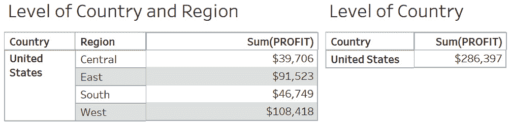

图 9.1：理解 LOD

LOD 计算帮助您控制可视化的粒度。您可以根据使用的 LOD 函数选择在详细级别或汇总级别查看计算结果，LOD 计算需要聚合度量。

在本章中，您将在 Tableau 中使用 LOD 计算。

在这些练习中，您将使用`Sample - Superstore`数据集，了解与 LOD 计算相关的不同概念。

## 练习 9.01：创建 LOD 计算

现在，您将使用`Sample - Superstore`数据集中的`Profit`度量创建一个 LOD 计算。以下步骤将帮助您完成此练习：

1.  在您的 Tableau 实例中加载`Sample – Superstore`数据集。导航到`Documents | My Tableau Repository | Data Sources`，然后打开`Sample - Superstore.xls`文件。

1.  数据加载完成后，在数据面板中，右键单击`Profit`并选择`Create | Calculated Field…`，如下所示：

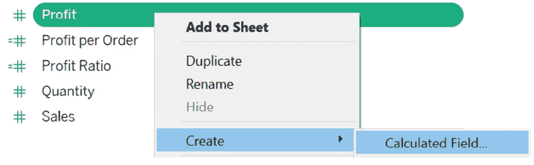

图 9.2：创建计算字段

1.  在计算编辑器中，从下拉菜单中选择`Aggregate`以访问 LOD 计算：

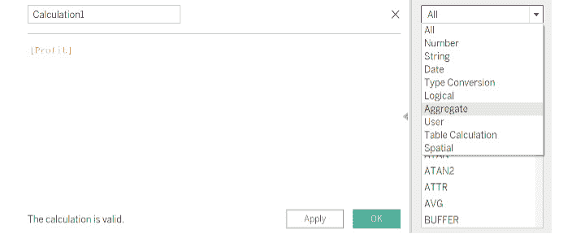

图 9.3：计算字段编辑器

LOD 计算属于`Aggregate`函数集。有四种 LOD 计算类型：`FIXED`、`INCLUDE`、`EXCLUDE`和`Table-Scoped`。随着本章的进展，您将了解更多关于这些内容。现在，将鼠标悬停在`FIXED`上。注意计算语法，如下图所示：

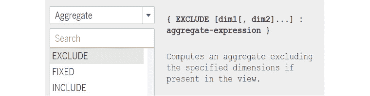

图 9.4：Tableau 中的各种 LOD 类型

1.  点击`FIXED`并将其添加到计算编辑器中。将`{FIXED : SUM([Profit])}`公式添加到编辑器中，然后点击`OK`：

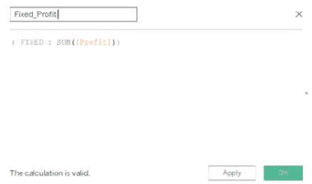

图 9.5：创建 LOD 计算

LOD 计算需要一个聚合度量值。如果你不聚合度量值，Tableau 将显示错误。这里的聚合意味着使用 SUM、AVG 或类似类型的计算与度量值，而不是像之前使用 SUM 函数那样直接使用度量值。

1.  对于这个计算，在数据的最高粒度级别（即`国家`级别）计算`SUM(Profit)`。将其添加到视图中，如下所示：

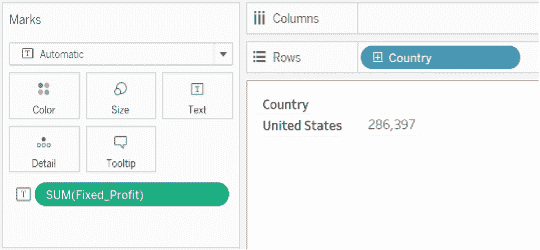

图 9.6：带有国家的初始视图

注意，无论你添加多少维度，度量值都不会改变：

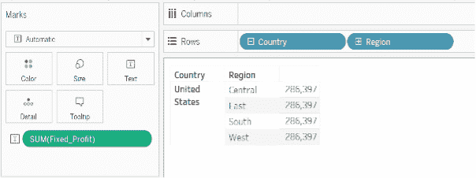

图 9.7：带有区域的初始视图

在这个练习中，你通过比较`SUM(Fixed_Profit)`聚合在不同维度（如`区域`）上的行为，创建了一个 LOD 计算。你观察到输出度量值的值不会改变，无论视图中的其他维度如何，因为你选择了`FIXED` LOD 计算。

接下来，你将学习关于不同类型的 LOD 计算。

# LOD 计算类型

在本节中，你将了解各种 LOD 计算。有四种 LOD 计算类型：

+   `FIXED`

+   `INCLUDE`

+   `EXCLUDE`

+   `表范围`

现在，你将更深入地了解这些 LOD 计算中的每一个。你还将通过为每个计算执行练习来学习它们在可视化中的应用。

## `FIXED`

`FIXED` LOD 计算使用指定的维度计算表达式。例如，可以识别每个国家每个地区的表现最佳的产品类别。这可以通过使用`FIXED` LOD 计算轻松完成。

## 练习 9.02：创建 FIXED LOD 计算

在这个练习中，你将在`国家`级别计算`SUM(Profit)`。假设你是一位国家级经理，你只对在国家级别产生的利润感兴趣，但偶尔也想要关注该国家的`区域`级别。现在，你将在特定维度级别计算一个度量值，而不是使用视图中所有维度进行计算。

注意

如果你使用的是随 Tableau 一起提供的本地副本`Superstore`，则`国家`字段将显示为`国家/区域`标签。这不会影响计算。

执行以下步骤以完成此练习：

1.  在你的 Tableau 实例中加载`Sample – Superstore`数据集。

1.  创建一个显示`国家`和`区域`以及`SUM(Profit)`的视图。当前视图显示的是`区域`级别的`SUM(Profit)`，如下所示：

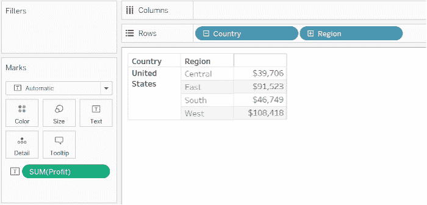

图 9.8：带有国家和区域的初始视图

1.  创建一个`FIXED` LOD 计算：

![图 9.9：计算编辑器]

![图片 B16342_09_09.jpg]

图 9.9：计算编辑器

1.  您可以在冒号（`:`）之前使用任意数量的维度。注意冒号（`:`）右侧的表达式必须是聚合，否则您将得到语法错误：

![图 9.10：理解 LOD 计算的语法]

![图片 B16342_09_10.jpg]

图 9.10：理解 LOD 计算的语法

1.  将此计算添加到视图中：

![图 9.11：比较 LOD 和常规计算]

![图片 B16342_09_11.jpg]

图 9.11：比较 LOD 和常规计算

每行中的第二个计算是 LOD 计算。注意，无论视图中的“区域”维度如何，值都保持不变。

在这个练习中，您学习了`FIXED` LOD 计算类型及其应用。您还看到了在视图中添加另一个维度（如“区域”）时的计算方式。接下来，您将学习关于`INCLUDE` LOD 计算的内容。

## INCLUDE

`INCLUDE` LOD 计算用于根据指定的维度和视图中使用的维度来计算值。这在需要知道详细级别的结果，但又希望视图处于较高级别时很有用。例如，计算地区级别的平均识字率，但查看州级别。在这里，您不会直接在州级别平均，而是在地区级别平均，然后重新在州级别汇总结果。下一项练习将详细介绍这一概念。

## 练习 9.03：创建一个 INCLUDE LOD 计算

在这个练习中，您将使用“客户”和“区域”维度来计算`AVG(Profit)`。您将学习如何在客户级别计算平均利润，然后再次按视图中的“区域”维度分组。完成以下步骤以完成此练习：

1.  在您的 Tableau 实例中加载“Sample – Superstore”数据集。

1.  创建一个视图，显示“区域”以及`AVG(Profit)`，如下所示：

![图 9.12：初始视图]

![图片 B16342_09_12.jpg]

![图 9.12：初始视图]

1.  目前，视图显示的是“区域”级别的`AVG(Profit)`。创建一个`INCLUDE` LOD 计算并按照以下图中的公式编写公式：

![图 9.13：INCLUDE LOD 计算表达式]

![图片 B16342_09_13.jpg]

图 9.13：INCLUDE LOD 计算表达式

1.  使用该地区客户产生的平均利润来计算整体平均值。复制前面的视图，并将此计算而不是`AVG(Profit)`添加到以下内容中：

![图 9.14：将 LOD 计算添加到初始视图]

![图片 B16342_09_14.jpg]

图 9.14：将 LOD 计算添加到初始视图

1.  通过单击计算下拉菜单并选择“度量（平均值）”选项，在“文本”和“列”架板上将聚合设置为平均值：

![图 9.15：更改计算聚合格式]

![图片 B16342_09_15.jpg]

图 9.15：更改计算聚合格式

注意，尽管维度相同，但两个视图中的数字是不同的。现在你将看到计算在 Tableau 中是如何进行的。

1.  在`区域`级别，为了计算平均利润，将区域内的利润相加，然后将总和除以记录总数，如下所示：

![图 9.16：计算逻辑说明

![img/B16342_09_16.jpg]

图 9.16：计算逻辑说明

1.  现在是时候看看客户级别计算是如何工作的了。绘制每个客户在`中部地区`产生的平均利润。一旦你有了平均值，将所有平均值（$8,442）相加，然后除以`Count (630)`以得到该地区每位客户的$13.42 的价值。这些值可以在以下`摘要`卡片中参考：

![图 9.17：客户级别计算

![img/B16342_09_17.jpg]

图 9.17：客户级别计算

当你想在不使用它们的情况下查看不同级别的聚合时，这种计算很有用。

备注

你可以在`细分`、运输方式或任何其他维度上执行类似的计算，以了解数据中的潜在趋势。

在这个练习中，你了解了`INCLUDE` LOD 计算类型及其如何应用于分析维度不同级别的趋势。接下来，你将学习关于`EXCLUDE` LOD 计算。

## EXCLUDE

`EXCLUDE` LOD 计算声明要从不查看 LOD 中省略的维度。它与`INCLUDE` LOD 相反。在`EXCLUDE` LOD 中，计算是在排除表达式中的指定维度的情况下进行的；也就是说，在计算结果时忽略指定的维度。继续上一个示例，你可以在视图中添加客户和产品类别，但在计算销售额时可以排除客户维度，只需在产品类别级别计算销售额。你将在下一个练习中详细了解这一点。

## 练习 9.04：创建一个排除 LOD 计算

在这个练习中，你将使用`客户`和`区域`维度计算`AVG(Profit)`，并了解如何应用`EXCLUDE` LOD 计算。这将帮助你学习如何在视图中有客户信息的情况下，仅在区域级别计算平均利润：

1.  在你的 Tableau 实例中加载`Sample – Superstore`数据集。

1.  创建一个显示`区域`和客户维度以及`AVG(Profit)`的视图，如下所示：

![图 9.18：初始视图

![img/B16342_09_18.jpg]

图 9.18：初始视图

1.  为`区域`添加一个`中央`过滤器。在这里，你只查看`中部地区`的`客户`信息以及平均利润。

1.  创建一个排除客户并重新计算平均利润的`EXCLUDE` LOD 计算，如下所示：

![图 9.19：排除 LOD 表达式

![img/B16342_09_19.jpg]

图 9.19：排除 LOD 表达式

1.  将此计算添加到视图中，你将看到以下内容：

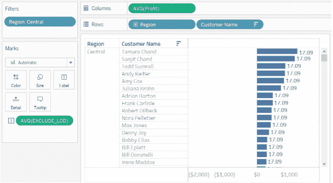

图 9.20：向视图中添加排除 LOD

1.  确认聚合设置为`平均`。在这里，您已排除`客户`级别的利润，并改为在更高粒度的`区域`级别进行分组。

1.  在`区域`级别，要计算平均利润，您可以简单地在该区域内添加利润，然后将总和除以记录数，如下所示：

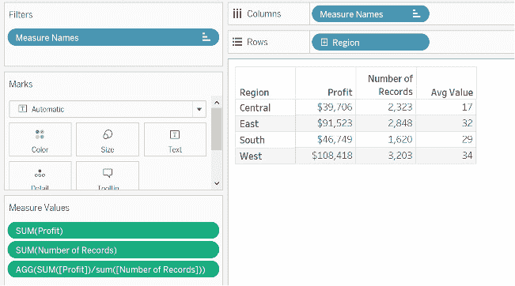

图 9.21：利润计算逻辑解释

当想要查看不同级别的聚合而实际上不使用它们在视图中时，这种计算非常有用。在本练习中，您了解了`EXCLUDE` LOD 计算类型，以及其应用如何帮助在不同维度级别分析趋势。接下来，您将了解`Table-Scoped` LOD 计算。

## 表范围

Tableau 提供了一种定义表达式的方法，而无需使用 LOD 函数，如`FIXED`、`INCLUDE`和`EXCLUDE`。以下表达式返回整个表的最小利润：

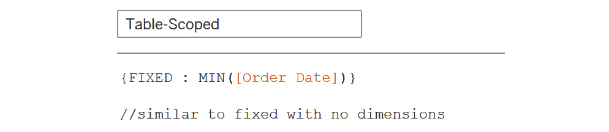

图 9.22：表范围语法

`Table-Scoped`计算等同于没有维度声明的`FIXED` LOD 计算：

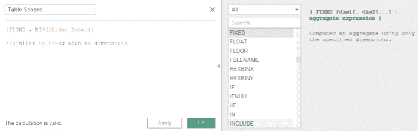

图 9.23：与固定 LOD 计算类型的比较

现在您已经了解了不同的 LOD 计算、它们的语法和它们的应用，您现在可以了解 Tableau 如何对 LOD 计算进行分类，以及工作表视图中需要哪些更改才能使 LOD 计算输出正确。

# LOD 计算：维度或度量？

在之前的练习中，当计算 LOD 计算时，您始终使用度量来给出数值输出。`FIXED` LOD 计算可以根据表达式中的字段显示度量或维度。

因此，`MIN ([Order_Date])}`将是一个维度，因为`[Order_Date]`是一个维度，而`{fixed Country: AVG([GDP])}`将是一个度量，因为`[GDP]`是一个度量。相比之下，`INCLUDE`和`EXCLUDE` LOD 计算始终在度量中显示结果。

您现在将了解视图中使用的维度如何影响 LOD 计算的计算。

## 聚合和 LOD 计算

在之前的练习中，您在`区域`级别计算了`AVG(Profit)`的`客户`，但未在视图中包含`客户`。Tableau 是如何做到这一点的？

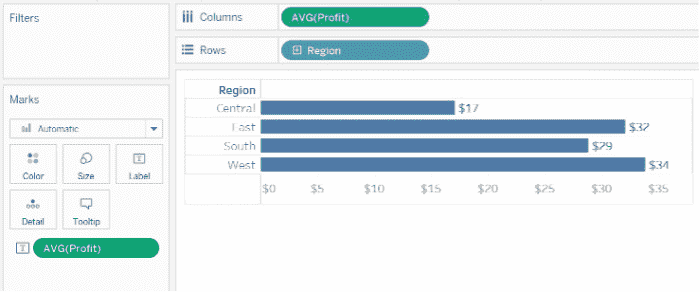

图 9.24：理解聚合

答案在于 Tableau 如何处理聚合级别。在本节中，您将了解 LOD 计算的底层计算与以下场景中视图中的 LOD 的比较：

+   LOD 计算比视图 LOD 更粗糙。

+   LOD 计算比视图 LOD 更精细。

+   嵌套 LOD 计算。

你现在将详细探索这些内容。

### LOD 计算比视图 LOD 高

与视图相比，表达式为维度提供了更高级别的细节。例如，对于包含`Region`和`Customer`维度的视图，你可以构建一个只使用这些维度之一的 LOD 计算：

`{FIXED [Region]: SUM([Profit])}`

在这里，表达式提供了一个比视图更粗糙的 LOD。表达式的值基于一个维度（`[Region]`），而视图基于两个维度（`[Region]`和`[Customer]`）。

结果是，在视图中使用 LOD 计算会导致某些值被复制，即多次出现。观察每个客户的度量值。这就是你在`EXCLUDE` LOD 练习中看到的情况。

![图 9.25：与排除 LOD 计算输出的相似性]

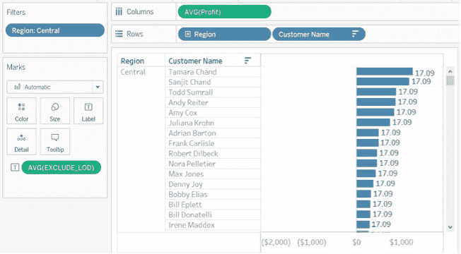

![图 9.25：与排除 LOD 计算输出的相似性]

### LOD 计算比视图 LOD 更精细

当引用维度的超集时，表达式提供的 LOD 比视图更精细。当使用时，Tableau 将结果聚合到视图级别。例如，以下 LOD 表达式引用了两个维度：

`{FIXED [Region],[Customer]: AVG([Profit])}`

当这个表达式在只有`Region`作为其 LOD 的视图中使用时，值必须进行聚合。如果你将这个表达式拖到面板上，你会看到以下内容：

`AVG([{FIXED [Region]], [Customer]] : AVG([Profit]])}])`

这正是`INCLUDE` LOD 计算练习中发生的情况：

![图 9.26：比较更精细的视图与包含 LOD 输出]

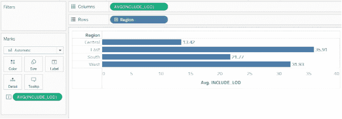

![图 9.26：比较更精细的视图与包含 LOD 输出]

当你在客户级别计算平均利润，而视图只有`Region`时，所有利润首先在客户级别进行平均。然后，这个结果再次在`Region`级别进行平均，这就是前一个图所示的最后输出。

### 嵌套 LOD 计算

在嵌套 LOD 计算中，一个 LOD 表达式在另一个 LOD 表达式中使用，如下所示：

![图 9.27：嵌套 LOD 语法]

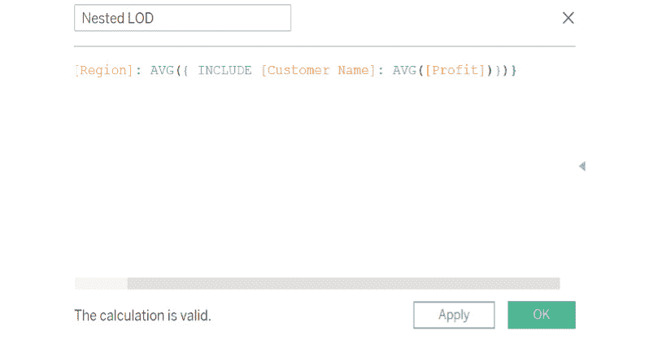

![图 9.27：嵌套 LOD 语法]

在这里，执行了一个`INCLUDE` LOD；也就是说，在客户级别计算平均利润，然后在外部`FIXED` LOD 中再次将此输出在`REGION`级别进行平均。

当使用嵌套 LOD 时，内部表达式从外部表达式继承其维度。这意味着你首先计算内部 LOD 的平均值，但也要为“区域”保持“固定”级别。生成的输出如下：

![图 9.28：嵌套 LOD 输出]

![图 9.28：嵌套 LOD 输出]

你能识别出哪个计算与这个结果匹配吗？它是`INCLUDE` LOD 计算。

嵌套 LOD 目前在工作表中用途有限（取决于所需的复杂性），但在 Tableau 中是一个强大的概念。

现在你已经熟悉了 LOD 计算的内部工作原理，是时候学习工作簿中不同组件如何影响 LOD 计算输出了。你将了解过滤器应用和 LOD 计算的一些限制。

# 过滤器对 LOD 计算的影响

Tableau 中有不同种类的过滤器。由于 LOD 计算根据视图修改聚合级别，因此应用的过滤器根据所应用的 LOD 计算类型执行。以下图表描述了视图中的过滤器是如何执行的：

![图 9.29：过滤器执行顺序]

![img/B16342_09_29.jpg]

图 9.29：过滤器执行顺序

这些将在以下部分更详细地定义：

+   **提取过滤器**：提取过滤器在你提取数据时应用，如下图中所示：

![图 9.30：添加提取过滤器]

![img/B16342_09_30.jpg]

图 9.30：添加提取过滤器

提取过滤器在 LOD 计算之前执行。

+   **数据源过滤器**：这些过滤器在你添加数据到数据探索标签页时应用，如下图中所示：

![图 9.31：添加数据源过滤器]

![img/B16342_09_31.jpg]

图 9.31：添加数据源过滤器

与提取过滤器一样，数据源过滤器在 LOD 计算执行之前应用。

+   **上下文过滤器**：上下文过滤器是一种独立的过滤器类型，它决定了视图中其他过滤器中可用的值。它创建了一个数据分区，确保后续的过滤器只加载分区数据，而不是整个数据集的值。要在上下文中添加过滤器，请点击下拉菜单并选择添加到上下文，如下所示：

![图 9.32：最终过滤器到上下文]

![img/B16342_09_32.jpg]

图 9.32：最终过滤器到上下文

上下文过滤器在 LOD 计算之前执行。作为良好实践，为了确保 LOD 计算正常工作，请确保将所有过滤器添加到`上下文`。

+   **维度过滤器**：维度过滤器与添加到过滤器架的维度相关。固定的 LOD 计算在维度过滤器之前执行。INCLUDE/EXCLUDE LOD 计算在维度过滤器之后执行。

+   **度量值和表计算过滤器**：这两个过滤器在所有 LOD 计算执行之后执行。

现在你已经了解了 LOD 计算的执行过程，你还将了解它们的一些限制。以下是 LOD 计算的一些主要限制：

+   一些数据源，如 Microsoft Access、基于 Microsoft Jet 的连接（Microsoft Excel、Microsoft Access 和 Cubes 的连接器）可能不支持 LOD 计算。

+   当使用 LOD 计算进行数据混合时，主数据源中的链接字段必须在你可以使用来自次要数据源的 LOD 计算之前在视图中可用，否则可能无法工作。

+   LOD 计算在数据探索标签页上不显示。因此，你无法将这些 LOD 计算添加到过滤器中。

+   当在 LOD 计算中使用参数时，你必须通过参数名称引用它，而不是通过值，否则可能会得到错误的结果。

现在你已经了解了 LOD 计算，是时候通过一些可能在实际情况下出现的活动来实践了。

## 活动九.01：识别顶尖销售主管

想象你是一家 ABC 营销公司的数据可视化师，被分配了一个识别一个细分市场中的顶尖表现者的任务。你提供了一个包含所有销售代表姓名、他们工作的城市和州以及销售订单详情（包括订单 ID 和订单日期）的数据集。

注意

你可以在本章的 GitHub 仓库中找到用于此活动的数据集，网址为[`packt.link/v7C3u`](https://packt.link/v7C3u)。

要完成这个活动，你必须识别出每个城市中销售额最高的销售代表。这个活动旨在加强你对 LOD 计算的了解，并给你一个将所学知识应用于实际案例的机会。

以下步骤将帮助你完成这个活动：

1.  在你的 Tableau 实例中打开数据集。

1.  数据应包括`订单 ID`、`订单日期`、销售代表的姓名、`州`、`城市`和销售额。你需要使用`FIXED` LOD 计算来识别每个城市的顶尖销售主管。

1.  创建一个包含`州`、`城市`、`销售主管`、`订单 ID`和`SUM(销售额)`的视图。使用排序选项按`SUM(销售额)`降序排序。这个视图为你提供了不同城市的销售整体情况，包括订单 ID 和销售该订单的销售主管。

1.  识别销售金额最高的订单的销售主管。为此，创建一个`FIXED` LOD 计算来识别每个城市和州的销售额最高的订单。

1.  一旦你得到了最大销售额，编写另一个计算来识别销售这个订单的销售主管，使用前面的 LOD 计算。然后，使用这个作为过滤器来显示视图中销售额最高的销售主管。最终输出应列出所有州和城市，以及销售主管的姓名和销售额。

初始视图将如下所示：

图 9.33：活动 1 初始视图

最终输出将如下所示：

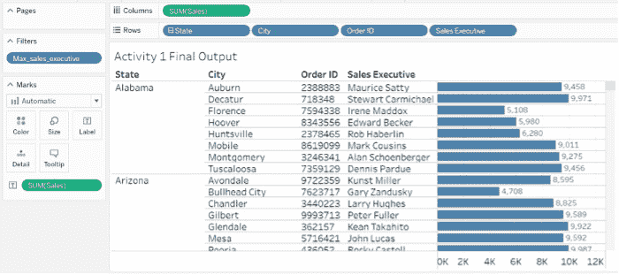

图 9.34：活动 1 最终视图

在这个活动中，你使用`FIXED` LOD 计算识别了顶尖的销售表现者。这个活动模拟了一个现实世界的应用，其中你需要识别类别中的顶尖表现实例，例如顶尖销售产品。通过改变 LOD 表达式中的维度，你可以改变视图的计算方式，从而在数据的各个维度上重用相同的概念。

注意

此活动的解决方案可以在以下位置找到：[`packt.link/CTCxk`](https://packt.link/CTCxk)。

## 活动九.02：执行比较分析

在任何数据可视化项目中，另一个常见用例是根据参数在不同维度之间显示比较。例如，在快餐连锁店中，一些产品的销量超过其他产品。通过识别这些模式，你可以进一步分析这些销售的原因，并据此制定策略。这可能意味着根据最畅销的产品推出新产品，创建组合优惠等。在接下来的活动中，你将处理食品项目数据集。你将比较各种食品项目的烹饪时间。

此活动旨在加强你使用比较分析进行 LOD 计算的知识。在开始活动之前，你必须首先了解数据。数据包含有关食品项目的信息，例如名称、饮食（`veg`或`non-veg`）、`cook_time`、风味类型（包含甜、酸、辣或苦）和课程类型（如开胃菜、小吃、主菜或甜点）。

注意

你可以在[`packt.link/Ie1Ta`](https://packt.link/Ie1Ta)找到用于此活动的数据集。

按照以下步骤完成活动：

1.  在你的 Tableau 实例中打开此活动的数据集。

1.  数据包括食物菜肴名称、饮食、烹饪时间、风味类型和课程类型。在这里，你需要比较不同菜肴的烹饪时间。对于此活动，你将仅比较甜点的烹饪时间。

1.  创建一个包含菜肴名称和烹饪时间的条形图视图。

1.  创建一个包含甜点类别菜肴的参数选择。首先，你需要创建一个计算来检查菜肴是否是甜点。如果是，保留该菜肴，否则可以丢弃。然后，将此计算作为参数的输入。

1.  创建一个`EXCLUDE` LOD 计算，仅保留所选菜肴的烹饪时间。如果没有选择菜肴，烹饪时间应为`0`。通过这样做，你正在创建一个基准，用于比较其他菜肴的烹饪时间。

1.  创建另一个计算，该计算显示所有其他菜肴与所选菜肴的烹饪时间差。此计算显示其他菜肴是否比所选菜肴烹饪得更快（或不是）。

1.  将此计算添加到初始视图中。现在你可以轻松地比较所选菜肴与数据集中所有其他菜肴的烹饪时间。

初始视图将看起来如下所示：

![图 9.35：活动 2 初始视图

![img/B16342_09_35.jpg]

图 9.35：活动 2 初始视图

最终输出应如下所示：

![图 9.36：活动 2 最终视图

![img/B16342_09_36.jpg]

。

# 摘要

在这一章中，你学习了不同类型的 LOD 计算。你了解了 LOD 计算是如何在内部执行的，并看到了在视图中使用的不同组件，如过滤器，是如何执行的，以及这些如何影响 LOD 计算输出。

LOD 计算的关键好处是，它们允许你在不添加或删除视图组件的情况下控制数据聚合级别。这有助于在数据集的不同粒度级别上识别趋势。

LOD 计算大大增强了数据分析，并允许分析师控制分析或可视化的粒度。在下一章中，你将结合迄今为止所学的一切，并开始使用 Tableau 创建故事板和仪表板。
