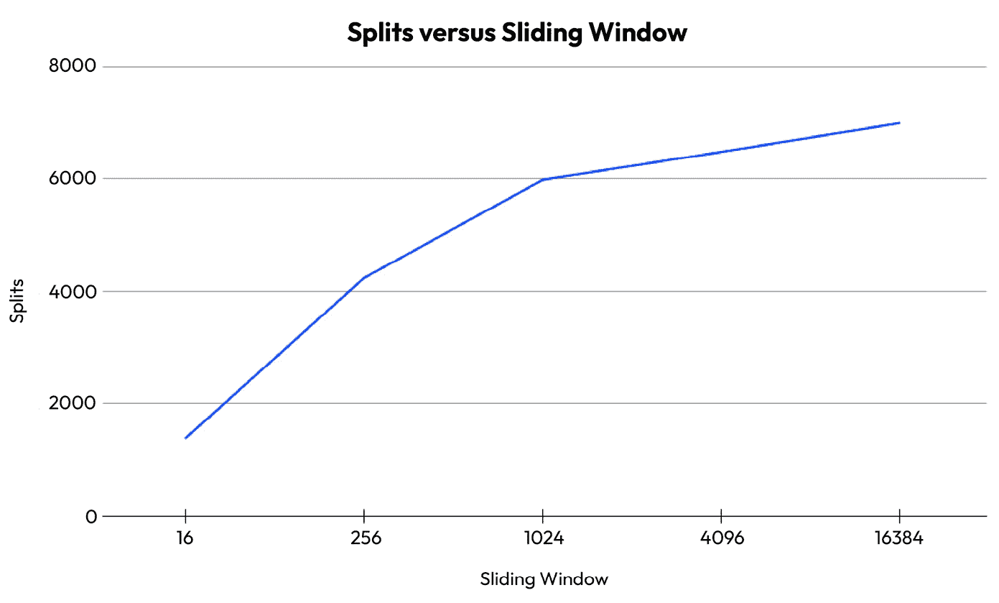
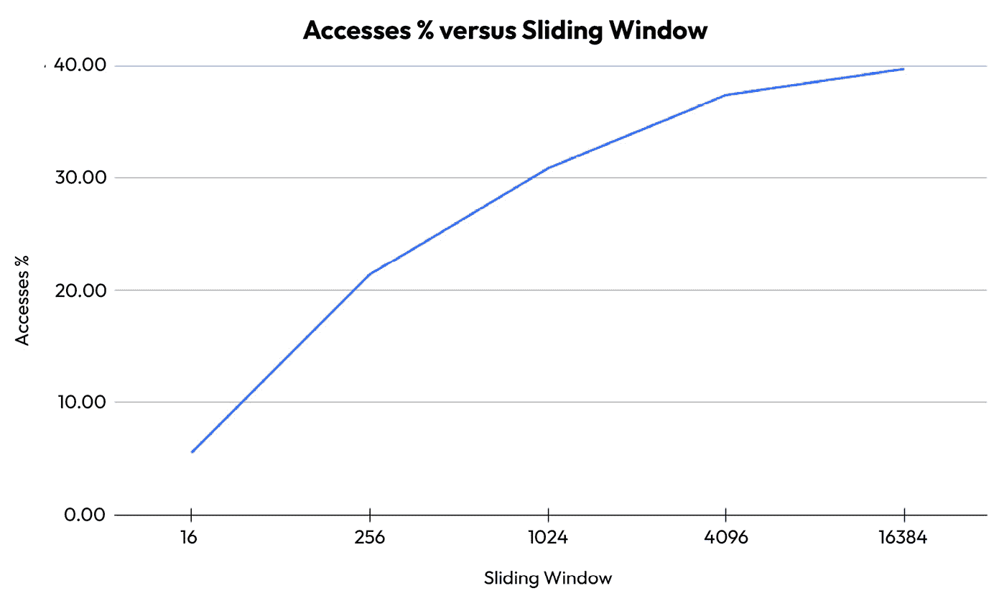

# 第五章：加入和比较 iSAX 索引

在上一章中，我们开发了一个名为 `isax` 的 Python 包，用于创建 iSAX 索引，以索引时间序列的子序列，给定一个滑动窗口。

在本章中，我们将实验滑动窗口大小如何影响在创建 iSAX 索引时分割数和子序列访问次数的数量。

然后，我们将使用 `isax` 包创建的 iSAX 索引，尝试将它们连接并比较。通过 *比较*，我们旨在了解 iSAX 索引的效率，而通过 *连接*，我们意味着能够根据 SAX 表示找到两个 iSAX 索引中的相似节点。

本章的最后部分将简要讨论 Python 测试，然后再为 `isax` 包开发简单的测试。*测试是开发过程中的一个重要部分，不应被忽视*。编写测试所花费的时间是值得的！

在本章中，我们将涵盖以下主要内容：

+   滑动窗口大小如何影响 iSAX 构建速度

+   检查 iSAX 索引的搜索速度

+   连接 iSAX 索引

+   实现 iSAX 索引的连接

+   解释 Python 代码

+   使用 Python 代码

+   编写 Python 测试

# 技术要求

本书的相关 GitHub 仓库可以在 [`github.com/PacktPublishing/Time-Series-Indexing`](https://github.com/PacktPublishing/Time-Series-Indexing) 找到。每个章节的代码都在自己的目录中。因此，本章的代码可以在 `ch05` 文件夹中找到。您可以使用 `git(1)` 在您的计算机上下载整个仓库，或者您可以通过 GitHub 用户界面访问所需的文件。

# 滑动窗口大小如何影响 iSAX 构建速度

在本节中，我们将继续使用上一章中开发的 `accessSplit.py` 工具，以找出滑动窗口大小是否会影响 iSAX 索引的构建速度，前提是剩余的 iSAX 参数保持不变。

简而言之，我们将使用不同的方法来了解更多关于 iSAX 索引的质量以及滑动窗口大小是否会影响构建速度。我们将使用以下滑动窗口大小进行实验：`16`、`256`、`1024`、`4096` 和 `16384`。我们将使用来自 *第四章* 的 `500k.gz` 时间序列，8 个段，最大基数值为 `32`，阈值值为 `500`。

对于窗口大小为 `16` 的情况，结果如下：

```py
$ ./accessSplit.py -s 8 -c 32 -t 500 -w 16 500k.gz
Max Cardinality: 32 Segments: 8 Sliding Window: 16 Threshold: 500 Default Promotion: False
Number of splits: 1376
Number of subsequence accesses: 2776741
```

对于滑动窗口大小为 `256` 的情况，结果如下：

```py
$ ./accessSplit.py -s 8 -c 32 -t 500 -w 256 500k.gz
Max Cardinality: 32 Segments: 8 Sliding Window: 256 Threshold: 500 Default Promotion: False
Number of splits: 4234
Number of subsequence accesses: 10691624
```

与滑动窗口大小为 `16` 相比，使用滑动窗口大小为 `256` 创建的 iSAX 索引具有超过三倍的分割数和四倍的子序列访问次数。

接下来，对于窗口大小为 `1024` 的情况，结果如下：

```py
$ ./accessSplit.py -s 8 -c 32 -t 500 -w 1024 500k.gz
Max Cardinality: 32 Segments: 8 Sliding Window: 1024 Threshold: 500 Default Promotion: False
Number of splits: 5983
Number of subsequence accesses: 15403024
```

与之前一样，我们比`16`和`256`滑动窗口大小有更多的分割和子序列访问。简单来说，构建这个 iSAX 索引需要更多的 CPU 时间。

接下来，对于窗口大小为`4096`的结果如下：

```py
$ ./accessSplit.py -s 8 -c 32 -t 500 -w 4096 500k.gz
Max Cardinality: 32 Segments: 8 Sliding Window: 4096 Threshold: 500 Default Promotion: False
OVERFLOW: 10000_10000_01111_01111_01111_10000_10000_01111
Number of splits: 6480
Number of subsequence accesses: 18537820
```

在这种情况下，不仅构建 iSAX 索引的速度较慢，而且一个`500.gz`时间序列也无法适应这些参数的 iSAX 索引，我们将需要使用不同的 iSAX 参数才能使 iSAX 索引工作。

溢出对 iSAX 索引的构建有影响吗？

当我们在 iSAX 索引上有一个或多个溢出时，这意味着所有 SAX 词的全基数已经被使用——回想一下，SAX 词的数量由段的数量定义。因此，我们在终端节点上有多个基于当前阈值值的分割，这意味着我们比通常有更多的子序列访问。因此，溢出对 iSAX 索引的构建时间有很大影响。此外，就像这还不够糟糕一样，我们必须找到新的 iSAX 参数，以防止溢出发生，同时保持 iSAX 操作高效。记住，分割的数量也是我们接近溢出的一个简单指示。

最后，对于最大的窗口大小（`16384`），结果如下：

```py
$ ./accessSplit.py -s 8 -c 32 -t 500 -w 16384 500k.gz
Max Cardinality: 32 Segments: 8 Sliding Window: 16384 Threshold: 500 Default Promotion: False
OVERFLOW: 01111_10000_10000_01111_10000_01111_10000_01111
Number of splits: 6996
Number of subsequence accesses: 19201125
```

再次，我们有一个溢出情况，这次是在`16384`滑动窗口大小上，针对不同的 SAX 表示。我们将保留这两个溢出，并创建一些结果图。溢出的分辨率留给你作为练习。

*图 5**.1*显示了每个滑动窗口大小的分割数量，我们可以看到滑动窗口的大小越大，特定时间序列的分割数量就越多。



图 5.1– 每个滑动窗口大小的分割数量图

*图 5**.2*显示了每个滑动窗口大小的子序列访问次数。在这种情况下，我们不是绘制子序列访问的绝对数量，而是将总子序列访问次数除以总子序列数来显示一个分数。这是一个公平的计算，因为较大的时间序列有更多的子序列。



图 5.2 – 每个滑动窗口大小的子序列访问百分比图

在*图 5**.2*中，我们可以看到滑动窗口的大小越大，子序列访问的次数也越多。对于最小的滑动窗口（`16`），与最大的滑动窗口（`16384`）相比，对时间序列子序列的访问次数大约少八倍。

iSAX 索引的构建速度是一个重要因素。然而，它并不是 iSAX 索引质量的唯一标准。下一节将探讨 iSAX 索引的搜索速度。

# 检查 iSAX 索引的搜索速度

本节介绍了一个实用工具，它接受两个时间序列，分别命名为`TS1`和`TS2`，理想情况下它们的长度相似，创建两个 iSAX 索引，分别命名为`D1`和`D2`，并执行以下搜索：

+   在`D1`中搜索`TS2`的所有子序列。在这种情况下，我们不确定`TS2`的子序列是否在`D1`中。在大多数情况下，*我们无法在`TS1`中找到`TS2`的子序列*。这是基于 iSAX 节点 SAX 表示的*连接*在寻找子序列相似性时可能更合适的主要原因。

+   在`D2`中搜索`TS1`的所有子序列。在这种情况下，我们不确定`TS1`的子序列是否在`D2`中。和之前一样，在大多数情况下，我们无法在`TS2`中找到`TS1`的子序列，因此，在从`TS2`创建的 iSAX 索引（`D2`）中也无法找到。

+   在`D1`中搜索`TS1`的所有子序列，这意味着`TS1`的所有子序列都在`D1`中。通过这个测试，我们只想了解 iSAX 索引在执行搜索操作时的速度。这个搜索操作主要取决于阈值大小，因为更大的阈值意味着在到达适当的终端节点时需要查找更多的子序列。

+   在`D2`中搜索`TS2`的所有子序列，这意味着`TS2`的所有子序列都在`D2`中，并且将被找到。

所有这些搜索都在一个名为`speed.py`的 Python 脚本中实现。

`speed.py`的核心功能在函数中实现。第一个函数包含以下代码：

```py
def createISAX(file, w, s):
    # Read Sequence as Pandas
    ts = pd.read_csv(file, names=['values'],
        compression='gzip').astype(np.float64)
    # Convert to NParray
    ts_numpy = ts.to_numpy()
    length = len(ts_numpy)
    ISAX = isax.iSAX()
    ISAX.length = length
    # Split sequence into subsequences
    for i in range(length - w + 1):
        # Get the subsequence
        ts = ts_numpy[i:i+w]
        # Create new TS node based on ts
        ts_node = isax.TS(ts, s)
        ISAX.insert(ts_node)
    return ISAX, ts_numpy
```

`createISAX()`函数创建一个 iSAX 索引，并返回一个指向`isax.ISAX()`类的链接以及一个包含时间序列所有元素的 NumPy 数组。

第二个函数实现如下：

```py
def query(ISAX, q):
    global totalQueries
    totalQueries = totalQueries + 1
    Accesses = 0
    # Create TS Node
    qTS = isax.TS(q, variables.segments)
    segs = [1] * variables.segments
    #If the relevant child of root is not there, we have a miss
    lower_cardinality = tools.lowerCardinality(segs, qTS)
    lower_cardinality_str = ""
    for i in lower_cardinality:
        lower_cardinality_str = lower_cardinality_str + "_"
            + i
```

在`query()`的第一部分，我们使用`tools.lowerCardinality()`和`segs`构建 iSAX 索引根节点潜在子节点的 SAX 表示，然后构建`lower_cardinality_str`字符串：

```py
    # Remove _ at the beginning
    Lower_cardinality_str = lower_cardinality_str[1:len(
        lower_cardinality_str)]
    if ISAX.ht.get(lower_cardinality_str) == None:
        return False, 0
    # Otherwise, we have a hit
    n = ISAX.ht.get(lower_cardinality_str)
    while n.terminalNode == False:
        left = n.left
        right = n.right
        leftSegs = left.word.split('_')
        # Promote
        tempCard = tools.promote(qTS, leftSegs)
        if tempCard == left.word:
            n = left
        elif tempCard == right.word:
            n = right
    # Iterate over the subsequences of the terminal node
    for i in range(0, variables.threshold):
        Accesses = Accesses + 1
        child = n.children[i]
        if type(child) == isax.TS:
            # print("Shapes:", child.ts.shape, qTS.ts.shape)
            if np.allclose(child.ts, qTS.ts):
                return True, Accesses
        else:
            return False, Accesses
    return False, Accesses
```

在`query()`的第二部分，我们检查`lower_cardinality_str`键是否可以在 iSAX 索引中找到。

如果可以找到，我们就跟随那个子树，它从 iSAX 索引的根节点的一个子节点开始，直到我们找到适当的终端节点。如果找不到，那么我们有一个错误，并且过程终止。

`query()`函数如果找到子序列则返回`True`，否则返回`False`。它的第二个返回值是在尝试找到该查询子序列时发生的子序列访问次数。

`speed.py`的其余代码放在`main()`函数中，并将分三部分介绍——第一部分如下：

```py
    # Build iSAX for TS1
    i1, ts1 = createISAX(f1, windowSize, segments)
    totalSplits = totalSplits + variables.nSplits
    totalAccesses = totalAccesses + variables.nSubsequences
    # Build iSAX for TS2
    variables.nSubsequences = 0
    variables.nSplits = 0
    i2, ts2 = createISAX(f2, windowSize, segments)
    totalSplits = totalSplits + variables.nSplits
    totalAccesses = totalAccesses + variables.nSubsequences
```

在这个第一部分，我们构建两个 iSAX 索引，并存储拆分和子序列访问次数。

`speed.py`的第二个部分包含以下代码：

```py
    # Query iSAX for TS1
    for idx in range(0, len(ts1)-windowSize+1):
        currentQuery = ts1[idx:idx+windowSize]
        found, ac = query(i1, currentQuery)
        if found == False:
            print("This cannot be happening!")
            return
        totalAccesses = totalAccesses + ac
    # Query iSAX for TS1
    for idx in range(0, len(ts2)-windowSize+1):
        currentQuery = ts2[idx:idx+windowSize]
        found, ac = query(i1, currentQuery)
        totalAccesses = totalAccesses + ac
```

在程序的这个部分，我们查询第一个 iSAX 索引。在第一个`for`循环块中，我们在 iSAX 中搜索第一个时间序列的所有子序列。由于这个 iSAX 索引了第一个时间序列，所有子序列都将在这个 iSAX 索引中找到。在这样做的时候，我们存储了对子序列的访问次数，这是由`query()`函数返回的。在第二个`for`循环块中，我们做同样的事情，但这次是为第二个时间序列。因此，在第一个时间序列的 iSAX 索引中找到第二个时间序列（`TS2`）的子序列的可能性很小。

`speed.py`的最后一部分如下所示：

```py
    # Query iSAX for TS2
    for idx in range(0, len(ts2)-windowSize+1):
        currentQuery = ts2[idx:idx+windowSize]
        found, ac = query(i2, currentQuery)
        if found == False:
            print("This cannot be happening!")
            return
        totalAccesses = totalAccesses + ac
    # Query iSAX for TS2
    for idx in range(0, len(ts1)-windowSize+1):
        currentQuery = ts1[idx:idx+windowSize]
        found, ac = query(i2, currentQuery)
        totalAccesses = totalAccesses + ac
```

`main()`函数的最后一部分与之前的代码类似。唯一的区别是这次我们查询的是第二个 iSAX 索引，而不是第一个。再次，我们存储了对子序列的访问次数。

在运行`speed.py`之前，我们需要创建另一个时间序列，它将被存储在`506k.gz`中。在这种情况下，第二个时间序列被创建如下：

```py
$ ../ch01/synthetic_data.py 506218 -10 10 > 506k
$ gzip 506k
```

虽然两个时间序列不需要有相同的长度，但我们决定使它们的长度尽可能接近。

使用`speed.py`生成以下类型的输出：

```py
$ ./speed.py -s 8 500k.gz 506k.gz
Max Cardinality: 16 Segments: 8 Sliding Window: 16 Threshold: 1000 Default Promotion: False
Total subsequence accesses: 1060326778
Total splits: 1106
Total queries: 2012376
```

请记住，之前的命令在 MacBook Pro 机器上花费了**超过三个小时**！速度将取决于你的 CPU。

如果我们使用了不同的 SAX 参数，输出将如下所示：

```py
$ ./speed.py -s 4 -c 64 500k.gz 506k.gz
Max Cardinality: 64 Segments: 4 Sliding Window: 16 Threshold: 1000 Default Promotion: False
Total subsequence accesses: 1083675402
Total splits: 2034
Total queries: 2012376
```

虽然第一次运行`speed.py`需要 1,106 次分割，第二次运行需要 2,034 次分割，但就总子序列访问次数而言，两个结果都非常接近。

如预期，两种情况下总查询次数相同，因为我们处理的是相同的时间序列，因此子序列的数量也相同。

现在我们已经知道了如何在 iSAX 索引上执行查找和搜索，是时候学习另一个重要的操作了，那就是 iSAX 索引的连接。

# 连接 iSAX 索引

到目前为止，我们已经有了想要用于执行基本时间序列数据挖掘任务的 iSAX 索引。其中之一是**在两个或多个时间序列之间找到相似子序列**。在我们的案例中，我们正在处理两个时间序列，但通过一些小的改动，这个方法可以扩展到更多的时间序列。

如何连接 iSAX 索引

给定两个或多个 iSAX 索引，我们决定如何以及为什么将它们连接起来。我们甚至可以使用具有`2`的基数值的 SAX 表示来连接它们。然而，使用节点 SAX 表示作为连接键是最合理的选择。在我们的案例中，我们将使用 iSAX 索引和节点的 SAX 表示来寻找相似子序列。这是因为我们有这样的直觉：具有相同 SAX 表示的节点中的子序列彼此之间是**接近的**。术语**接近**是相对于一个**距离度量**来定义的。为了本章的目的，我们将使用欧几里得距离来比较相同大小的子序列。

现在，让我们用更精确的方式重新表述。基于 SAX 表示的 iSAX 索引的 **连接** 是一种在搜索使用相同参数构建的第二 iSAX 索引的节点时，为第一个 iSAX 索引的每个节点找到最相似节点（基于 SAX 表示）的方法。这样，我们节省了时间，因为我们只需要比较相似终端节点的子序列。基于 SAX 表示的相似性完美吗？不，它并不完美。但我们使用时间序列索引来使事情更快。

这种连接背后的想法是在阅读了由 Georgios Chatzigeorgakidis、Kostas Patroumpas、Dimitrios Skoutas、Spiros Athanasiou 和 Spiros Skiadopoulos 撰写的 *Scalable Hybrid Similarity Join over Geolocated Time Series* 论文之后产生的，该论文发表在 *Scalable Hybrid Similarity Join over Geolocated Time Series* 上。

下一节将展示如何根据其节点的 SAX 表示实现 iSAX 索引的连接。

# 实现 iSAX 索引的连接

对于 iSAX 索引连接的实现，我们将假设我们有两个准备好的 iSAX 索引，分别保存在两个不同的 Python 变量中，并继续进行。我们需要一个 Python 函数，该函数接受两个 iSAX 索引并返回一个欧几里得距离列表，这是两个时间序列中所有子序列的最近邻。请记住，如果一个 iSAX 索引的节点与另一个 iSAX 索引不匹配，那么该节点及其子序列将不会得到处理。因此，欧几里得距离列表可能比预期的要短一些。这就是我们为什么不能使用不必要的大的 iSAX 参数的主要原因。简单地说，当 4 个段可以完成任务时，不要使用 16 个段。

此外，请记住，子序列的真实最近邻可能不在具有相同 SAX 表示的终端节点中——这是我们为了额外的速度和避免二次处理成本（比较第一时间序列的所有子序列与第二时间序列的所有子序列，反之亦然）所付出的代价。

因此，我们需要根据当前的 iSAX 索引实现和表示实现 `isax` 包的先前功能。

因此，我们将该功能放在 `isax` 包中，使用一个名为 `iSAXjoin.py` 的单独文件。

除了那个文件之外，我们在 `isax/tools.py` 中添加了一个用于计算两个子序列之间欧几里得距离的函数：

```py
def euclidean(a, b):
    return np.linalg.norm(a-b)
```

如果你还记得从 *第一章*，在 `ch01/ed.py` 脚本中，`euclidean()` 使用 NumPy 的魔法来计算两个子序列之间的欧几里得距离。不要忘记，在这本书中，我们总是比较 **归一化子序列**。

最后，我们在 `isax/variables.py` 中添加了以下变量：

```py
# List of Euclidean distances
ED = []
```

`ED` 全局变量是一个 Python 列表，用于存储两个 iSAX 索引之间连接的结果，这是一个欧几里得距离的列表。

现在我们将展示并解释`isax/iSAXjoin.py`的代码。

# 解释 Python 代码

`iSAXjoin.py`中的代码将分为五个部分。

第一部分如下：

```py
from isax import variables
from isax import tools
def Join(iSAX1, iSAX2):
    # Begin with the children of the root node.
    # That it, the nodes with SAX words
    # with a Cardinality of 1.
    for t1 in iSAX1.children:
        k1 = iSAX1.children[t1]
        if k1 == None:
            continue
        for t2 in iSAX2.children:
            k2 = iSAX2.children[t2]
            if k2 == None:
                continue
            # J_AB
            _Join(k1, k2)
            # J_BA
            _Join(k2, k1)
    return
```

`Join()`函数是两个 iSAX 索引连接的入口点。然而，该函数只有一个目的，即创建两个 iSAX 根节点子节点的所有组合，以便传递控制到`_Join()`。由于`_Join()`中参数的顺序很重要，因此`_Join()`被调用了两次。第一次，第一个 iSAX 索引的根子节点是第一个参数，第二次，第二个 iSAX 索引的根子节点是第一个参数。

`iSAXjoin.py`的第二部分如下：

```py
def _Join(t1, t2):
    if t1.word != t2.word:
        return
    # Inner + Inner
    if t1.terminalNode==False and t2.terminalNode==False:
        _Join(t1.left, t2.left)
        _Join(t1.right, t2.left)
        _Join(t1.left, t2.right)
        _Join(t1.right, t2.right)
```

当我们处理来自两个 iSAX 索引的内部节点时，我们只需组合它们的所有子节点——记住每个内部节点有两个子节点——其余部分由递归处理。

第三部分包含以下代码：

```py
    # Terminal + Inner
    elif t1.terminalNode==True and t2.terminalNode==False:
        _Join(t1, t2.left)
        _Join(t1, t2.right)
```

如果我们正在处理一个内部节点和一个终端节点，我们将扩展内部节点，其余部分由递归处理。

`iSAXjoin.py`的第四部分如下：

```py
    # Inner + Terminal
    elif t1.terminalNode == False and t2.terminalNode == True:
        _Join(t1.left, t2)
        _Join(t1.right, t2)
```

如前所述，当处理一个内部节点和一个终端节点时，我们扩展内部节点，其余部分由递归处理。

最后一部分包含以下 Python 代码：

```py
    # Terminal + Terminal
    # As both are terminal nodes, calculate
    # Euclidean Distances between Time Series pairs
    elif t1.terminalNode==True and t2.terminalNode==True:
        for i in range(t1.nTimeSeries()):
            minDistance = None
            for j in range(t2.nTimeSeries()):
                distance =round(tools.euclidean
                (t1.children[i].ts, t2.children[j].ts),
                variables.precision)
                # Keeping the smallest Euclidean Distance for each node
                # of the t1 Terminal node
                if minDistance == None:
                    minDistance = distance
                elif minDistance > distance:
                    minDistance = distance
            # Insert distance to PQ
            if minDistance != None:
                variables.ED.append(minDistance)
    else:
        print("This cannot happen!")
```

最后这部分是递归调用`_Join()`停止的地方，因为我们正在处理两个终端节点。这意味着我们可以计算它们子序列的欧几里得距离。我们没有在调用`tools.euclidean()`之前对子序列进行归一化的事实意味着我们期望所有终端节点中的子序列都是以归一化的形式存储的。请注意，我们将结果存储在`variables.ED`列表中。

关于两个 iSAX 索引连接的实现就到这里。下一节将介绍如何使用（相似性）连接代码。

# 使用 Python 代码

在本节中，我们将使用我们开发的相似性连接代码来开始连接 iSAX 索引。`join.py`的源代码分为三个部分。第一部分如下：

```py
#!/usr/bin/env python3
from isax import variables
from isax import isax
from isax import tools
from isax.sax import normalize
from isax.iSAXjoin import Join
import sys
import pandas as pd
import time
import argparse
def buildISAX(file, windowSize):
    variables.overflow = 0
    # Read Sequence as Pandas
    ts = pd.read_csv(file, names=['values'],
        compression='gzip', header = None)
    ts_numpy = ts.to_numpy()
    length = len(ts_numpy)
    ISAX = isax.iSAX()
    ISAX.length = length
    for i in range(length - windowSize + 1):
        ts = ts_numpy[i:i+windowSize]
        # Create new TS node based on ts
        # Store the normalized version of the subsequence
        ts_node = isax.TS(normalize(ts),
            variables.segments)
        ISAX.insert(ts_node)
    if variables.overflow != 0:
        print("Number of overflows:", variables.overflow)
    return ISAX
```

这里没有新的内容——我们只需要导入必要的外部包，包括`isax.iSAXjoin`，并开发一个函数，该函数根据时间序列文件和滑动窗口大小创建一个 iSAX 索引。该函数返回 iSAX 索引的根节点。然而，请注意，*子序列以归一化的形式存储*在所有`TS()`对象内部。

第二部分是`main()`函数的开始，并包含以下 Python 代码：

```py
def main():
    parser = argparse.ArgumentParser()
    parser.add_argument("-s", "--segments",
        dest = "segments", default = "16",
        help="Number of Segments", type=int)
    parser.add_argument("-c", "--cardinality",
        dest = "cardinality", default = "256",
        help="Cardinality", type=int)
    parser.add_argument("-w", "--window", dest = "window",
        default = "16", help="Sliding Window Size",
        type=int)
    parser.add_argument("-t", "--threshold",
        dest = "threshold", default = "50",
        help="Threshold for split", type=int)
    parser.add_argument("-p", "--promotion",
        action='store_true',
        help="Define Promotion Strategy")
    parser.add_argument("TS1")
    parser.add_argument("TS2")
    args = parser.parse_args()
    variables.segments = args.segments
    variables.maximumCardinality = args.cardinality
    variables.slidingWindowSize = args.window
    variables.threshold = args.threshold
    variables.defaultPromotion = args.promotion
    windowSize = variables.slidingWindowSize
    maxCardinality = variables.maximumCardinality
    f1 = args.TS1
    f2 = args.TS2
    if tools.power_of_two(maxCardinality) == -1:
        print("Not a power of 2:", maxCardinality)
        sys.exit()
    if variables.segments > variables.slidingWindowSize:
        print("Segments:", variables.segments,
            "Sliding window:", variables.slidingWindowSize)
        print("Sliding window size should be bigger than # of segments.")
        sys.exit()
    print("Max Cardinality:", maxCardinality, "Segments:",
        variables.segments,
        "Sliding Window:", variables.slidingWindowSize,
        "Threshold:", variables.threshold,
        "Default Promotion:", variables.defaultPromotion)
```

由于我们正在连接两个 iSAX 索引，我们需要两个单独的命令行参数（`TS1`和`TS2`）来定义包含时间序列数据的压缩纯文本文件的路径。

`join.py`的最后一部分如下：

```py
    # Build iSAX for TS1
    start_time = time.time()
    i1 = buildISAX(f1, windowSize)
    print("i1: %.2f seconds" % (time.time() - start_time))
    # Build iSAX for TS2
    start_time = time.time()
    i2 = buildISAX(f2, windowSize)
    print("i2: %.2f seconds" % (time.time() - start_time))
    # Join the two iSAX indexes
    Join(i1, i2)
    variables.ED.sort()
    print("variables.ED length:", len(variables.ED))
    maximumLength = i1.length+i2.length - 2*windowSize + 2
    print("Maximum length:", maximumLength)
if __name__ == '__main__':
    main()
```

在这里，我们通过两次调用`buildISAX()`创建两个 iSAX 索引，然后使用`Join()`将它们连接起来，该函数返回没有值。为了查看计算出的值列表，我们需要访问`variables.ED`。我们打印欧几里得距离列表的长度以及它的理论最大长度，即`time_series_length – sliding_window_size + 1`，以便更好地了解没有匹配的子序列数量。在输出中，我们还打印了创建每个 iSAX 索引所需的时间，作为过程额外信息的补充。

到目前为止，我们已经准备好使用`join.py`。这意味着我们应该提供必要的参数和输入。

使用`join.py`会产生以下类型的输出：

```py
$ ./join.py -s 8 -c 32 -t 1000 500k.gz 506k.gz
Max Cardinality: 32 Segments: 8 Sliding Window: 16 Threshold: 1000 Default Promotion: False
i1: 170.94 seconds
i2: 179.80 seconds
variables.ED length: 970603
Maximum length: 1006188
```

因此，创建第一个索引花费了`170.94`秒，创建第二个 iSAX 索引花费了`179.80`秒。欧几里得距离列表有`970603`个元素，而最大元素数量是`1006188`，这意味着我们错过了一些终端节点，因为它们的 SAX 表示在另一个 iSAX 索引中没有匹配。这并不罕见，我们大多数时候都应该预料到这种情况，因为时间序列及其 iSAX 索引是不同的。

## 我们有一长串欧几里得距离，那又如何呢？

你可能会问，“我们该如何处理那个欧几里得距离列表？”简单地说，创建这样一个距离列表的主要目的是什么？有很多用途，包括以下：

+   通过找到列表中的最小欧几里得距离来找出两个时间序列有多接近。

+   找出给定数值范围内的欧几里得距离列表。这是比较两个时间序列相似性的另一种方法。

+   根据距离度量找出与其他子序列相比差异更大的子序列。在数据挖掘术语中，这些子序列被称为**异常值**。

我认为你明白了我们为什么要执行连接计算——我们需要更好地理解参与连接的两个时间序列之间的联系。使用 SAX 表示的原因是为了剪枝节点和子序列，从而节省 CPU 时间。

由于连接操作可能很慢，下一小节将介绍一种方便的技术，用于将欧几里得距离列表保存到磁盘上，并在需要时从磁盘加载列表，以便无需从头开始执行整个过程。

## 保存输出

iSAX 索引的连接可能需要时间。有没有办法让这个过程不那么痛苦？是的，我们可以将相似性连接的内容，即一个列表，保存到文件中，这样我们就不必每次需要时都从头创建该列表。记住，为了使这可行，两个 iSAX 索引必须使用相同的参数为完全相同的时间序列创建。

`saveLoadList.py`脚本在`main()`函数中展示了这个想法——你可以看到`join.py`中`buildISAX()`的实现。`main()`函数的前部分如下。为了简洁起见，省略了一些代码：

```py
def main():
. . .
    # Reading command line parameters
. . .
    # Build iSAX for TS1
    start_time = time.time()
    i1 = buildISAX(f1, windowSize)
    print("i1: %.2f seconds" % (time.time() - start_time))
    # Build iSAX for TS2
    start_time = time.time()
    i2 = buildISAX(f2, windowSize)
    print("i2: %.2f seconds" % (time.time() - start_time))
    # Now, join the two iSAX indexes
    Join(i1, i2)
    variables.ED.sort()
    print("variables.ED length:", len(variables.ED))
    # Now save it to disk
    #
    # Define filename
    filename = "List_" + basename(f1) + "_" + basename(f2) + "_" + str(maxCardinality) + "_" + str(variables.segments) + "_" + str(windowSize) + ".txt"
    print("Output file:", filename)
    f = open(filename, "w")
    # Write to disk
    for item in variables.ED:
        f.write('%s\n' %item)
    f.close()
```

在前面的代码中，我们将相似性连接数据放入 `variables.ED` 中，通过从 `isax.iSAXjoin` 调用 `Join()` 并打印其长度。之后，我们计算了输出文件的文件名，该文件名存储在 `filename` 变量中，该变量基于程序的参数。这是一种将 `variables.ED` 创建到该文件中的便捷方法。

`main()` 的第二部分包含以下代码：

```py
    # Now try to open it
    f = open(filename, "r")
    PQ = []
    for item in f.readlines():
        PQ.append(float(item.rstrip()))
    f.close()
    print("PQ length:", len(PQ))
```

在前面的代码中，我们尝试读取用于存储 `variables.ED` 内容的文件名，并将纯文本文件的内容放入 `PQ` 变量中。最后，我们打印 `PQ` 的长度，以便将其与 `variables.ED` 的长度进行比较，并确保一切按预期工作。

运行 `saveLoadList.py` 脚本生成以下输出：

```py
$ ./saveLoadList.py -s 8 -c 32 -t 1000 500k.gz 506k.gz
Max Cardinality: 32 Segments: 8 Sliding Window: 16 Threshold: 1000 Default Promotion: False
i1: 168.73 seconds
i2: 172.39 seconds
variables.ED length: 970603
Output file: List_500k.gz_506k.gz_32_8_16.txt
PQ length: 970603
```

从前面的输出中，我们可以理解列表包含 `970603` 个元素。此外，我们保存列表内容的文件名为 `List_500k.gz_506k.gz_32_8_16.txt`。文件名中缺少的唯一信息是阈值值。

下一个小节将介绍一个实用程序，该实用程序查找在另一个 iSAX 索引中没有匹配的 iSAX 索引的节点，反之亦然。

## 寻找没有匹配的 iSAX 节点

在本小节中，我们指定了在另一个 iSAX 索引中没有匹配的 iSAX 索引的节点，反之亦然。实际上，我们将打印出每个 iSAX 索引终端节点的 SAX 表示，这些终端节点在另一个 iSAX 索引中没有匹配的终端节点。

`noMatch.py` 脚本通过以下代码实现了该想法——我们假设我们已经为两个时间序列创建了两个 iSAX 索引，因此我们不需要重复编写创建 iSAX 索引的代码：

```py
    # Visit all entries in Dictionary
    sum = 0
    for k in i1.ht:
        t = i1.ht[k]
        if t.terminalNode:
            saxWord = t.word
            # Look for a match in the other iSAX
            if saxWord in i2.ht.keys():
                i2Node = i2.ht[saxWord]
                # Need that to be a terminal node
                if i2Node.terminalNode == False:
                    sum = sum + 1
                    print(saxWord, end=' ')
    print()
```

前面的代码遍历第一个 iSAX 索引的所有节点，寻找终端节点。一旦找到终端节点，我们就获取其 SAX 表示，并在另一个 iSAX 索引中寻找具有相同 SAX 表示的终端节点。如果找不到这样的节点，我们就打印出第一个 iSAX 索引终端节点的 SAX 表示，该节点没有匹配项。

我们现在应该对第二个时间序列和第二个 iSAX 索引使用相同的流程。这里展示的代码与前面的代码类似：

```py
    # Look at the other iSAX
    for k in i2.ht:
        t = i2.ht[k]
        if t.terminalNode:
            saxWord = t.word
            # Look for a match in the other iSAX
            if saxWord in i1.ht.keys():
                i1Node = i1.ht[saxWord]
                # Sstill need that to be a terminal node
                if i1Node.terminalNode == False:
                    sum = sum + 1
                    print(saxWord, end=' ')
    print()
    print("Number of iSAX nodes without a match:", sum)
```

因此，在检查第二个 iSAX 索引后，我们打印出没有匹配的终端节点的总数。

运行 `noMatch.py` 生成以下类型的输出：

```py
$ ./noMatch.py -s 8 -c 32 -t 1500 -w 128 500k.gz 506k.gz
Max Cardinality: 32 Segments: 8 Sliding Window: 128 Threshold: 1500 Default Promotion: False
011_10_10_10_01_10_10_01 011_01_01_10_10_10_10_10 011_01_10_01_10_10_10_10 011_10_01_10_10_10_10_01 100_01_01_10_01_01_01_10 011_10_10_01_01_10_10_10 100_01_01_01_10_10_01_01 011_01_10_10_10_01_10_10 100_100_011_100_01_10_01_01 100_011_100_100_01_01_01_10 100_011_011_011_10_01_10_10 011_011_100_011_10_10_01_10 100_100_011_100_10_01_01_01 100_011_011_011_10_10_10_01 100_011_100_100_10_01_01_01 011_100_011_100_01_01_10_10 100_011_011_011_10_10_01_10 011_011_011_100_01_10_10_10 100_100_011_011_01_01_10_10 011_011_011_100_10_01_10_10 011_100_011_100_10_10_01_01 100_100_100_10_10_01_01_01 011_011_011_10_10_01_01_10 100_100_100_10_01_10_01_01 100_100_100_01_01_01_10_10
100_10_01_10_01_01_01_01 100_01_01_10_01_10_01_01 100_01_01_01_10_01_10_01 100_01_01_01_10_01_01_10 100_01_10_01_01_01_10_01 011_10_10_10_10_01_01_10 100_011_100_100_01_01_10_01 011_011_100_011_10_01_10_10 011_100_100_100_01_10_01_01 011_100_100_100_10_01_01_01 011_100_011_100_10_01_01_10 011_011_011_100_10_10_01_10 011_011_100_100_10_10_01_01 011_011_011_01_01_10_10_10 011_011_011_01_10_10_10_01 100_100_100_011_01_01_10_01 011_011_011_10_01_10_01_10 011_011_011_100_10_10_10_01 100_100_100_01_01_10_01_10 011_011_011_10_10_01_10_01 100_100_100_10_01_01_10_01
Total number of SAX nodes without a match: 46
```

由于我们为两个 iSAX 索引使用相同的提升策略，输出显示两个 iSAX 索引具有不同的结构，因此第二个 iSAX 索引上没有匹配的 SAX 表示列表中的差异。此外，我们还可以看到打印的 SAX 表示中的最大基数仅为 `8`，并且大多数 SAX 单词的基数是 `4`，这意味着没有太多的分割。

最后，请注意，一般来说，SAX 表示中的段数越少，没有匹配的节点数就越少。此外，阈值值越大，没有匹配的节点数就越少，因为大的阈值值会最小化分割。一般来说，*可能的 SAX 表示越少，没有匹配的节点数就越少*。

这可以在以下输出中看到，其中我们将段的数量减少到`4`，并将基数增加到`64`：

```py
$ ./noMatch.py -s 4 -c 64 -t 1500 -w 128 500k.gz 506k.gz
Max Cardinality: 64 Segments: 4 Sliding Window: 128 Threshold: 1500 Default Promotion: False
101_01_01_10 010_10_01_10 1001_0110_0110_100 01100_1001_1000_0111 01100_0111_1000_1001 01100_1001_0111_1000 10011_1000_0110_0111 01100_1000_0111_1001 011110_01111_10000_10000 0101_1000_1000_100 1000_0101_1000_100 0111_0111_011_101 01111_01101_1001_1000 10000_01101_10000_10001 10001_01110_10001_01110 01110_01101_1001_1000 01110_10001_01110_10001 01111_10010_01110_01111 01110_10000_01110_1001 01101_10001_10000_10000 10001_10010_0111_0110 01101_10000_10001_10000 01110_01110_10010_1000
1001_0110_1001_011 10011_0110_1000_0111 011110_10000_01111_10000 10010_01111_01111_01110 10001_01110_01110_10001 10001_10010_0110_0111 10001_10000_01101_10000 10010_01111_01110_01111 01110_01111_01111_10010 01111_01110_01111_10010 10001_10001_01101_0111
Total number of SAX nodes without a match: 34
```

在这种情况下，我们没有那么多没有匹配的终端节点。

下一节简要介绍了通过编写三个基本的 Python 测试来测试`isax`包的 Python 代码的主题。

# 编写 Python 测试

在本章的最后部分，我们将学习 Python 测试，并使用`pytest`包编写三个测试来测试我们的代码。

由于`pytest`包默认未安装，你应该首先使用你喜欢的安装方法来安装它。`pytest`包的一部分是`pytest`命令行工具，用于运行测试。

单元测试

在本节中，我们正在编写单元测试，这些通常是用来确保我们的代码按预期工作的函数。单元测试的结果要么是`PASS`，要么是`FAIL`。单元测试越广泛，就越有用。

安装成功后，如果你在一个不包含任何有效测试的目录上执行`pytest`命令，你会得到有关你的系统和 Python 安装的信息。在 macOS 机器上，输出如下：

```py
$ pytest
========================= test session starts ==========
platform darwin -- Python 3.10.9, pytest-7.2.1, pluggy-1.0.0
rootdir: /Users/mtsouk/code/ch05
collected 0 items
================ no tests ran in 0.00s ====================
```

就测试函数而言，有一个简单的规则你必须记住。当使用`pytest`包时，任何以`test_`为前缀的 Python 函数，其文件名也以`test_`为前缀，都可以作为测试函数。

可以编写许多测试。通常，我们希望尽可能多地测试，从代码中最关键的部分开始，逐步过渡到不那么关键的部分。为了本章的目的，我们决定通过编写三个测试来测试实现的核心理念。

下一小节将更详细地讨论本章将要实现的三个测试。

## 我们要测试什么？

首先要定义的是我们要测试什么以及为什么要测试。对于本章，我们将编写以下三个测试：

+   我们将计算 iSAX 索引中的子序列数量，并确保 iSAX 索引包含所有子序列。

+   我们将测试 iSAX 构建过程中的节点分割数量——这次，正确的分割数量将被存储在一个全局变量中。

+   最后，我们将对同一时间序列进行自我连接。这意味着我们应该得到一个欧几里得距离列表，其中所有值都等于 0。请记住，由于我们谈论的是浮点数，欧几里得距离可能非常接近 0，但不是正好等于 0。

测试列表远未完整，但它是一个很好的方式来展示测试的使用和实用性。

时间序列的文件名、iSAX 参数以及分割和子序列的数量将被作为全局变量在包含测试代码的源代码文件中给出，以简化原因。如果您想动态地将参数传递给`pytest`测试，请访问章节末尾的“有用链接”部分中的“*Basic patterns and examples of pytest*”链接以获取更多信息。

## 比较子序列数量

在这个测试中，我们比较 iSAX 索引中的子序列数量与基于滑动窗口大小和时间序列长度的理论子序列数量。

相关代码如下：

```py
def test_count_subsequences():
    variables.nSplits = 0
    variables.segments = segments
    variables.maximumCardinality = cardinality
    variables.slidingWindowSize = slidingWindow
    variables.threshold = threshold
    i, ts = createISAX(TS, slidingWindow, segments)
    sum = 0
    for k in i.ht:
        t = i.ht[k]
        if t.terminalNode:
            sum += t.nTimeSeries()
    assert sum == len(ts) - slidingWindow + 1
```

首先，我们根据在`test_isax.py`的前置部分中找到的全局值，在`./isax/variables.py`中适当地设置全局变量。

`createISAX()`辅助函数用于创建测试用的 iSAX 索引。您之前在`speed.py`实用程序中见过这个函数。

重要的是，与测试密切相关的是`assert`关键字的用法。`assert`检查随后的语句的真实性。如果语句为`True`，则`assert`语句通过。否则，它抛出一个异常，结果测试函数失败。`assert`关键字被用于我们所有的测试函数中。

接下来，我们将讨论检查节点分割数量的测试。

## 检查节点分割数量

为了进行这个测试，我们假设我们有一个任何编程语言中的不同程序，该程序被认为是正确的，并且给我们实际的节点分割数量。这个节点分割数量存储在一个全局变量（`splits`）中，并由测试函数读取。

相关的 Python 代码如下：

```py
def test_count_splits():
    variables.nSplits = 0
    variables.segments = segments
    variables.maximumCardinality = cardinality
    variables.slidingWindowSize = slidingWindow
    variables.threshold = threshold
    variables.defaultPromotion = False
    i, ts = createISAX(TS, slidingWindow, segments)
    assert variables.nSplits == splits
```

在此代码中，我们首先根据在`test_isax.py`中找到的全局值，在`./isax/variables.py`中适当地设置全局变量。不要忘记在您的测试函数中重置`variables.nSplits`并选择正确的提升策略（`variables.defaultPromotion`）。

最后一个测试函数计算时间序列与自身的连接，这意味着连接后的所有欧几里得距离都应该等于`0`。

## 所有欧几里得距离都是 0

在这个测试中，我们将创建时间序列的 iSAX 索引并将其与自身连接。由于我们正在比较时间序列与自身，欧几里得距离列表应该只*包含零*。因此，通过这个单元测试，我们检查我们代码的逻辑正确性。

相关的 Python 测试函数实现如下：

```py
def test_join_same():
    variables.nSplits = 0
    variables.segments = segments
    variables.maximumCardinality = cardinality
    variables.slidingWindowSize = slidingWindow
    variables.threshold = threshold
    i, _ = createISAX(TS, slidingWindow, segments)
    Join(i, i)
    assert np.allclose(variables.ED, np.zeros(len(variables.ED))) == True
```

首先，我们根据在 `test_isax.py` 中找到的全局值，在 `./isax/variables.py` 中适当地设置全局变量。然后，我们调用 `createISAX()` 来构建 iSAX 索引，然后调用 `Join()` 函数来填充欧几里得距离列表。

NumPy 的 `zeros()` 函数创建一个所有元素为零的 NumPy 数组。它的参数定义了将要返回的 NumPy 数组的长度。NumPy 的 `allclose()` 函数在其两个 NumPy 数组参数在容差范围内相等时返回 `True`。这主要是因为当使用浮点值时，由于四舍五入可能会存在小的差异。

在下一个子节中，我们将运行测试并查看结果。

## 运行测试

在本节中，我们将运行测试并查看其结果。所有之前的代码都可以在 `./ch05/test_isax.py` 文件中找到。

所有测试均成功，结果如下：

```py
$ pytest
================= test session starts =====================
platform darwin -- Python 3.10.9, pytest-7.2.1, pluggy-1.0.0
rootdir: /Users/mtsouk/TSi/code/ch05
collected 3 items
test_isax.py ...                                    [100%]
============= 3 passed in 2784.53s (0:46:24) ==============
```

如果有一个或多个测试失败，输出将如下所示（在这种情况下，只有一个测试失败）：

```py
$ pytest
====================== test session starts ================
platform darwin -- Python 3.10.9, pytest-7.2.1, pluggy-1.0.0
rootdir: /Users/mtsouk/TSi/code/ch05
collected 3 items
test_isax.py .F.                                  [100%]
=====================FAILURES ============================
____________________ test_count_splits ___________________
    variables.nSplits = 0
    variables.segments = segments
    variables.maximumCardinality = cardinality
    variables.slidingWindowSize = slidingWindow
    variables.threshold = threshold
    _, _ = createISAX(TS, slidingWindow, segments)
>   assert variables.nSplits == splits
E   assert 5669 == 5983
E    +  where 5669 = variables.nSplits
test_isax.py:58: AssertionError
================ short test summary info ==================
FAILED test_isax.py::test_count_splits - assert 5669 == 5983
=========== 1 failed, 2 passed in 2819.21s (0:46:59) ======
```

好处在于输出显示了为什么一个或多个测试失败的原因，并包含了相关的代码。在这种情况下，是 `assert variables.nSplits == splits` 语句失败了。

这是本章的最后一节，但也是最重要的一节，因为测试可以在开发过程中为你节省大量时间。我们测试的主要目的是测试代码的逻辑和正确性，这非常重要。

# 摘要

在本章中，我们看到了测试 iSAX 索引速度和基于节点 SAX 表示合并两个 iSAX 索引的代码。然后，我们简要讨论了测试 Python 代码的主题，并为 `isax` 包实现了三个测试。

我们还讨论了基于节点类型的 iSAX 索引的合并，以及我们进行的测试确保了代码的核心逻辑是正确的。

在下一章中，我们将学习如何可视化 iSAX 索引，以更好地理解其结构和性能。

在你开始阅读并学习*第六章*之前，尝试使用本章中开发的命令行工具，并尝试创建你自己的。

# 有用链接

+   `pytest` 包：https://pypi.org/project/pytest/

+   官方 `pytest` 文档：[`docs.pytest.org/`](https://docs.pytest.org/%0D)

+   *《Python 专业实践》*，由 Dane Hillard 著

+   *《精通 Python，第 2 版》*，由 Rick van Hattem 著

+   *《编写整洁且可维护的 Python 代码：Robust Python》*，由 Patrick Viafore 著

+   *《使用 pytest 进行 Python 测试，第 2 版》*，由 Brian Okken 著

+   `pytest` 的基本模式和示例：[`docs.pytest.org/en/latest/example/simple.xhtml`](https://docs.pytest.org/en/latest/example/simple.xhtml%0D)

# 练习

尝试完成以下练习：

+   使用`accessSplit.py`来了解滑动窗口大小如何影响从*第四章*中构建`2M.gz`时序数据的速度。为以下滑动窗口大小进行实验：`16`、`256`、`1024`、`4096`、`16384`和`32786`。

+   你能否使用`accessSplit.py`和我们在本章开头遇到的`500.gz`时序数据解决溢出情况？

+   尝试减少在*检查 iSAX 索引的搜索速度*部分中展示的`speed.py`示例中的阈值值，并看看会发生什么。

+   创建两个包含 250,000 个元素的时序数据，并使用`speed.py`来理解当段落数量在 20 到 40 范围内时它们的行为。不要忘记使用适当的大小滑动窗口。

+   使用`speed.py`进行实验，但这次，改变阈值值而不是段落数量。在 iSAX 索引的搜索速度中，阈值值是否比段落数量更重要？

+   修改`speed.py`以显示子序列查询中的缺失次数。

+   修改`join.py`以打印执行连接操作所需的时间。

+   修改`saveLoadList.py`以在保存包含欧几里得距离的列表内容时将阈值值包含在文件名中。

+   在自己的机器上运行`pytest`命令，并查看你得到的输出。
