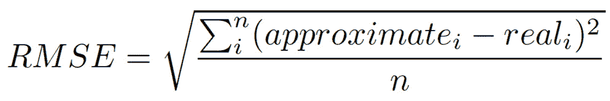
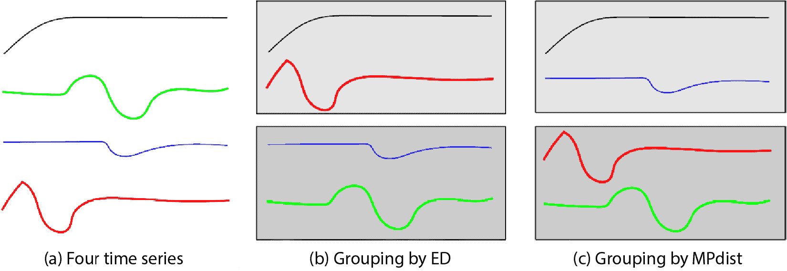
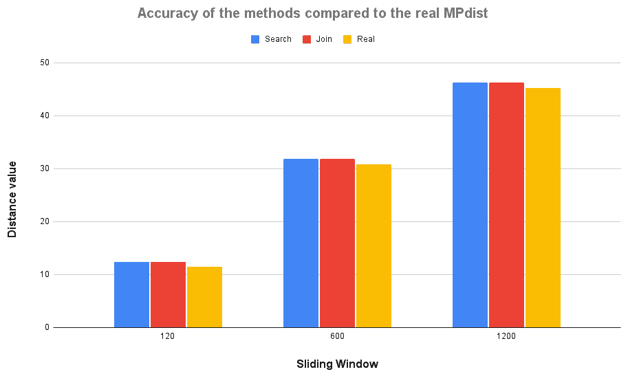
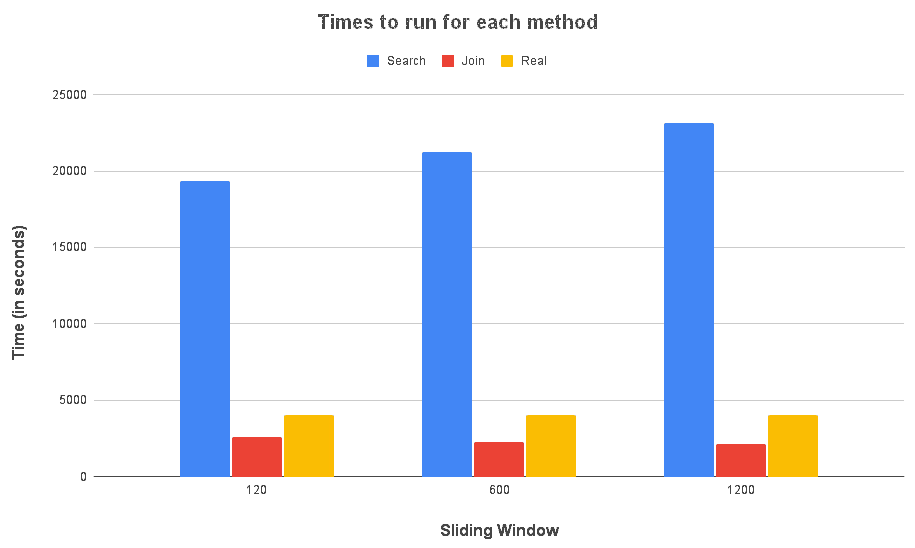

# 第七章：使用 iSAX 近似 MPdist

到目前为止，本书中我们看到了 iSAX 在搜索子序列和基于 SAX 表示的 iSAX 索引连接中的应用，但没有看到其他应用。

在本章中，我们将使用 iSAX 索引来近似计算时间序列之间的**矩阵轮廓**向量和**MPdist**距离——我们仍然会使用 iSAX 进行搜索和连接，但最终结果将更加复杂。本章的主导思想是，从 SAX 表示的角度来看，iSAX 索引组的终端节点具有相似子序列——这是我们试图在我们的近似计算中利用的。

在本章中，我们将涵盖以下主要主题：

+   理解矩阵轮廓

+   使用 iSAX 计算矩阵轮廓

+   理解 MPdist

+   使用 iSAX 计算 MPdist

+   在 Python 中实现 MPdist 计算

+   使用 Python 代码

# 技术要求

本书在 GitHub 上的仓库地址为[`github.com/PacktPublishing/Time-Series-Indexing`](https://github.com/PacktPublishing/Time-Series-Indexing)。每章的代码都存放在各自的目录中。因此，第七章的代码可以在 GitHub 仓库的`ch07`文件夹中找到。

# 理解矩阵轮廓

时间序列无处不在，我们可能需要在大型时间序列上执行许多任务，包括相似性搜索、异常检测、分类和聚类。直接处理大型时间序列非常耗时，并且会减慢处理速度。上述大多数任务都是基于使用给定滑动窗口大小计算子序列最近邻的计算。这就是**矩阵轮廓**发挥作用的地方，因为它可以帮助你在计算了这些任务之后执行它们。

我们已经在第一章中看到了矩阵轮廓，但在这个部分，我们将更详细地讨论它，以便更好地理解它为什么计算起来如此缓慢。

存在许多研究论文介绍了矩阵轮廓及其扩展，包括以下内容：

+   由 Chin-Chia Michael Yeh、Yan Zhu、Liudmila Ulanova、Nurjahan Begum、Yifei Ding、Hoang Anh Dau、Diego Furtado Silva、Abdullah Mueen 和 Eamonn J. Keogh 撰写的*Matrix Profile I: All Pairs Similarity Joins for Time Series: A Unifying View That Includes Motifs, Discords and Shapelets*（[`ieeexplore.ieee.org/document/7837992`](https://ieeexplore.ieee.org/document/7837992)）

+   *矩阵配置 II：利用新型算法和 GPU 突破一亿大关，用于时间序列模式和连接*，由 Yan Zhu、Zachary Zimmerman、Nader Shakibay Senobari、Chin-Chia Michael Yeh、Gareth Funning、Abdullah Mueen、Philip Brisk 和 Eamonn Keogh 撰写([`ieeexplore.ieee.org/abstract/document/7837898`](https://ieeexplore.ieee.org/abstract/document/7837898))

+   *矩阵配置疯狂：数据序列中的可变长度模式和冲突发现*，由 Michele Linardi、Yan Zhu、Themis Palpanas 和 Eamonn J. Keogh 撰写([`doi.org/10.1007/s10618-020-00685-w`](https://doi.org/10.1007/s10618-020-00685-w))

关于归一化

就像 SAX 表示一样，本章中将要计算的所有的欧几里得距离都使用归一化子序列。

下一个子节将展示矩阵配置计算返回的内容。

## 矩阵配置计算什么？

在本节中，我们将解释矩阵配置计算什么。想象一下有一个时间序列和一个小于时间序列长度的滑动窗口大小。矩阵配置计算**两个向量**。

第一个向量包含每个子序列的**欧几里得距离最近邻**。索引`0`处的值是开始于索引`0`的子序列的最近邻的欧几里得距离，依此类推。

在第二个向量中，向量中每个位置的值是最近邻子序列的索引，对应于前一个向量中存储的欧几里得距离。所以，如果索引`0`的值是`123`，这意味着原始时间序列中开始于索引`0`的子序列的最近邻是原始时间序列中开始于索引`123`的子序列。第一个向量将包含那个欧几里得距离值。

非常重要的是理解，当使用自连接来计算时间序列的矩阵配置时——也就是说，通过查找相同时间序列子序列的最近邻——我们需要**排除接近我们正在检查的子序列**。这是必需的，因为共享相同顺序中许多元素的子序列默认情况下往往具有较小的欧几里得距离。然而，当处理来自另一个时间序列的子序列时，我们不需要从计算中排除任何子序列。

矩阵轮廓向量的计算的一个朴素实现是获取第一个子序列，将其与所有其他子序列（排除接近的子序列）进行比较，找到其最近邻，并将欧几里得距离和最近邻的索引放在两个向量的索引`0`处。然后，对其他所有子序列执行相同的操作。虽然这对于较小的时序数据有效，但它的算法复杂度为 O(n²)，这意味着对于一个有 10,000 个子序列的时间序列，我们需要执行 10,000 次 10,000 次计算（100,000,000 次）。我们将实现该算法以了解它在现实生活中的速度有多慢。

原始矩阵轮廓论文的作者创造了一种巧妙的技术，该技术涉及**快速傅里叶变换**，可以以可行的复杂度计算矩阵轮廓向量——该算法的名称是**Mueen 相似性搜索算法**（**MASS**）。如果您想了解更多关于 MASS 算法的细节以及矩阵轮廓背后的思想，您应该阅读*矩阵轮廓 I：时间序列的所有成对相似性连接：一个包含基序、不一致性和形状的统一视图*这篇论文（[`ieeexplore.ieee.org/document/7837992`](https://ieeexplore.ieee.org/document/7837992)）。

下一节将展示计算矩阵轮廓向量的朴素算法的实现。该算法的朴素性在于其复杂度，而不是其准确性。

## 手动计算精确的矩阵轮廓

在本小节中，我们将手动计算精确的矩阵轮廓以展示这个过程可能有多慢，尤其是在处理大型时间序列时。我们使用“精确”这个词来区分我们将在本章的“使用 iSAX 计算矩阵轮廓”部分中实现的近似矩阵轮廓计算。

在`mp.py`的`main()`函数中的最后几个 Python 语句如下：

```py
    dist, index = mp(ta, windowSize)
    print(dist)
    print(index)
```

第一条语句运行`mp()`函数，该函数返回两个值，这两个值都是列表（向量），它们是两个矩阵轮廓向量。

`mp()`函数的实现是我们计算两个向量的地方，分为两部分。第一部分包含以下代码：

```py
def mp(ts, window):
    l = len(ts) - window + 1
    dist = [None] * l
    index = [None] * l
    for i1 in range(l):
        t1 = ts[i1:i1+window]
        min = None
        minIndex = 0
        exclusionMin = i1 - window // 4
        if exclusionMin < 0:
            exclusionMin = 0
        exclusionMax = i1 + window // 4
        if exclusionMax > l-1:
            exclusionMax = l-1
```

在前面的代码中，我们遍历给定时间序列的所有子序列。对于每个这样的子序列，我们定义排除区域的索引，如*矩阵轮廓 I：时间序列的所有成对相似性连接：一个包含基序、不一致性和形状的统一视图*论文中所述。

对于`16`大小的滑动窗口，排除区域是子序列左侧和右侧的`4`个元素（`16 // 4`）。

`mp()`的第二部分如下：

```py
        for i2 in range(l):
            # Exclusion zone
            if i2 >= exclusionMin and i2 <= exclusionMax:
                continue
            t2 = ts[i2:i2+window]
            temp = round(euclidean(t1, t2), 3)
            if min == None:
                min = temp
                minIndex = i2
            elif min > temp:
                min = temp
                minIndex = i2
        dist[i1] = min
        index[i1] = minIndex
    return dist, index
```

在本节的部分，我们比较代码第一部分中的每个子序列与时间序列的所有子序列，同时考虑到排除区域。

`mp()`的缺点是它包含两个`for`循环，这使得其计算复杂度为*O(n*2*)*。

当使用来自*第六章*的`ts.gz`时序（该时序位于书籍 GitHub 仓库的`ch06`目录中）时，`mp.py`的输出与以下内容类似，对于滑动窗口为`16` – 我们将使用这个输出通过将其与原始矩阵轮廓算法及其输出进行比较来测试我们实现的正确性：

```py
$ ./mp.py ../ch06/ts.gz -w 16
TS: ../ch06/ts.gz Sliding Window size: 16
[3.294, 3.111, 3.321, 3.535, 3.285, 3.373, 3.332, 3.693, 4.066, 4.065, 3.898, 3.484, 3.372, 3.1, 3.047, 3.299, 3.056, 3.361, 3.766, 3.759, 3.871, 3.884, 3.619, 3.035, 2.358, 3.012, 3.052, 3.136, 3.161, 3.219, 3.309, 3.526, 3.386, 3.973, 4.207, 4.101, 4.249, 4.498, 4.492, 4.255, 4.241, 3.285, 3.517, 3.494, 3.257, 3.316, 3.526, 4.183, 4.011, 3.294, 3.111, 3.321, 3.535, 3.1, 3.047, 3.332, 3.035, 2.358, 3.012, 3.052, 3.136, 3.161, 3.219, 3.201, 3.187, 3.017, 2.676, 2.763, 2.959, 3.952, 3.865, 3.678, 3.687, 3.201, 3.187, 3.017, 2.676, 2.763, 2.959, 3.316, 3.526, 3.899, 3.651, 3.664, 3.885]
[49, 50, 51, 52, 53, 54, 55, 56, 57, 46, 65, 27, 28, 53, 54, 74, 75, 76, 77, 59, 60, 61, 55, 56, 57, 58, 59, 60, 61, 62, 14, 15, 16, 66, 71, 68, 69, 56, 20, 63, 26, 75, 66, 67, 78, 79, 80, 81, 82, 0, 1, 2, 3, 13, 14, 6, 23, 24, 25, 26, 27, 28, 29, 73, 74, 75, 76, 77, 78, 79, 80, 61, 62, 63, 64, 65, 66, 67, 68, 45, 46, 62, 63, 64, 65]
--- 0.36465 seconds ---
```

想当然地认为，具有最小和最大欧几里得距离的子序列可以被认为是异常值，因为它们与其他所有子序列不同 – 这就是矩阵轮廓用于异常检测的一个例子。

使用滑动窗口大小为`32`，`mp.py`生成以下类型的输出：

```py
$ ./mp.py ../ch06/ts.gz -w 32
TS: ../ch06/ts.gz Sliding Window size: 32
[4.976, 5.131, 5.38, 5.485, 5.636, 5.75, 5.87, 6.076, 6.502, 6.705, 6.552, 6.145, 6.279, 6.599, 6.766, 6.667, 6.577, 6.429, 6.358, 6.358, 5.978, 5.804, 5.588, 5.092, 4.976, 5.01, 5.35, 5.456, 6.036, 6.082, 6.258, 6.513, 6.556, 6.553, 6.672, 6.745, 6.767, 6.777, 7.018, 7.12, 6.564, 6.203, 6.291, 6.118, 6.048, 5.869, 6.142, 6.431, 6.646, 4.976, 5.131, 5.38, 5.485, 5.636, 5.75, 5.588, 5.092, 4.976, 5.01, 5.35, 5.456, 6.036, 6.082, 6.258, 6.513, 6.556, 6.598, 6.518, 6.473]
[49, 50, 51, 52, 53, 54, 55, 56, 24, 58, 24, 25, 26, 27, 63, 64, 65, 55, 56, 52, 53, 54, 55, 56, 57, 58, 59, 60, 61, 62, 63, 64, 65, 67, 68, 62, 63, 0, 65, 67, 0, 1, 2, 3, 4, 5, 6, 7, 8, 0, 1, 2, 3, 4, 5, 22, 23, 24, 25, 26, 27, 28, 29, 30, 31, 32, 17, 57, 59]
--- 0.22118 seconds ---
```

最后，使用滑动窗口大小为`64`，生成的输出如下：

```py
$ ./mp.py ../ch06/ts.gz -w 64
TS: ../ch06/ts.gz Sliding Window size: 64
[10.529, 10.406, 10.475, 10.377, 10.702, 10.869, 10.793, 10.827, 10.743, 11.14, 10.865, 10.819, 10.876, 10.808, 10.802, 10.73, 10.713, 10.67, 11.288, 11.296, 11.113, 11.202, 11.196, 11.121, 11.033, 11.145, 11.228, 11.125, 11.108, 10.865, 10.819, 10.671, 10.702, 10.529, 10.406, 10.475, 10.377]
[33, 34, 35, 36, 32, 33, 34, 35, 36, 28, 29, 30, 31, 32, 33, 34, 35, 36, 0, 1, 2, 3, 4, 5, 6, 7, 8, 8, 0, 10, 11, 3, 4, 0, 1, 2, 3]
--- 0.03179 seconds ---
```

这里输出较小的原因是，滑动窗口大小越大，从时序中创建的子序列数量就越少。

现在，让我们实验一个包含 25,000 个元素的时序，其创建方式如下：

```py
$ ../ch01/synthetic_data.py 25000 -5 5 > 25k
$ gzip 25k
```

与之前相同的滑动窗口大小，`25k.gz`的结果如下（仅显示时间 – 为了简洁，省略了其余输出）：

```py
$ ./mp.py -w 16 25k.gz
--- 43707.95353 seconds ---
$ ./mp.py -w 32 25k.gz
--- 44162.44419 seconds ---
$ ./mp.py -w 64 25k.gz
--- 45113.62417 seconds ---
```

在这个阶段，我们应该意识到计算矩阵轮廓向量可能非常慢，因为在上次运行中，`mp.py`花费了 45,113 秒来计算矩阵轮廓。

你能想到为什么即使滑动窗口大小的微小增加也会增加整体时间吗？答案是，滑动窗口大小越大，子序列长度越大，因此计算两个子序列之间欧几里得距离所需的时间就越长。以下是计算滑动窗口大小为`2048`的矩阵轮廓向量所需的时间：

```py
$ ./mp.py -w 2048 25k.gz
--- 46271.63763 seconds ---
```

请记住，*MASS 算法没有这样的问题*，因为它以自己的巧妙方式计算欧几里得距离。因此，其性能仅取决于时序长度。

现在，让我们展示一个 Python 脚本，该脚本使用`stumpy`Python 包通过 MASS 算法计算精确的矩阵轮廓。我们使用`realMP.py`脚本来计算矩阵轮廓向量，其实现如下：

```py
#!/usr/bin/env python
import pandas as pd
import argparse
import time
import stumpy
import numpy as np
def main():
    parser = argparse.ArgumentParser()
    parser.add_argument("-w", "--window", dest = "window",
        default = "16", help="Sliding Window", type=int)
    parser.add_argument("TS")
    args = parser.parse_args()
    windowSize = args.window
    inputTS = args.TS
    print("TS:", inputTS, "Sliding Window size:",
        windowSize)
    start_time = time.time()
    ts = pd.read_csv(inputTS, names=['values'],
        compression='gzip')
    ts_numpy = ts.to_numpy()
    ta = ts_numpy.reshape(len(ts_numpy))
    realMP = stumpy.stump(ta, windowSize)
    realDistances = realMP[:,0]
    realIndexes = realMP[:,1]
    print("--- %.5f seconds ---" % (time.time() –
        start_time))
    print(realDistances)
    print(realIndexes)
if __name__ == '__main__':
    main()
```

`stumpy.stump()`的返回值是一个多维数组。第一列（`[:,0]`）是距离向量，第二列（`[:,1]`）是索引向量。在前面的代码中，我们打印了这两个向量，当处理大型时序时这并不方便 – 如果你想，请注释掉这两个`print()`语句。

为了验证`mp.py`的正确性，我们展示了`realMP.py`对于`ts.gz`时序和滑动窗口大小为`64`的输出：

```py
$ ./realMP.py ../ch06/ts.gz -w 64
TS: ../ch06/ts.gz Sliding Window size: 64
--- 11.31371 seconds ---
[10.5292 10.40594 10.47460 10.3770 10.7024 10.8689 10.7928
 10.8274 10.74260 11.140 10.864 10.818 10.8757 10.8078
 10.8017 10.7296 10.7129 10.6704
 11.2882 11.2963 11.1125 11.2019 11.19556 11.1206
 11.0330 11.14458 11.22779 11.12475
 11.10825 10.864619 10.8186 10.6714
 10.7024 10.52926 10.40594 10.4746 10.3770]
[33 34 35 36 32 33 34 35 36 28 29 30 31 32 33 34 35 36 0 1 2 3 4 5 6 7 8 8 0 10 11 3 4 0 1 2 3]
```

既然我们已经确信 `mp.py` 的正确性，让我们用 `25k.gz` 时间序列进行实验，看看计算精确矩阵轮廓向量需要多少时间。

`realMP.py` 和 `stumpy.stump()` 函数在单个 CPU 核心上计算 `25k.gz` 时间序列的矩阵轮廓向量所需的时间如下：

```py
$ taskset --cpu-list 0 ./realMP.py 25k.gz -w 1024
TS: 25k.gz Sliding Window size: 1024
--- 11.19547 seconds ---
[42.41325061659 42.4212959655 42.45021115618 ...
 42.64248908665 42.64380072599 42.6591584368]
[10218 10219 10220 ... 7240 7241 20243]
```

`realMP.py` 在 Intel i7 的 8 个 CPU 核心上计算 `25k.gz` 时间序列的矩阵轮廓向量所需的时间如下：

```py
$ ./realMP.py 25k.gz -w 1024
TS: 25k.gz Sliding Window size: 1024
--- 9.68259 seconds ---
[42.41325061659 42.4212959655 42.45021115618 ...
 42.64248908665 42.64380072599 42.6591584368]
[10218 10219 10220 ... 7240 7241 20243]
```

此外，`realMP.py` 和 `stumpy.stump()` 函数在单个 CPU 核心上计算 `ch06/100k.gz` 时间序列和滑动窗口大小为 `1024` 的矩阵轮廓向量所需的时间如下：

```py
$ taskset --cpu-list 0 ./realMP.py ../ch06/100k.gz -w 1024
TS: ../ch06/100k.gz Sliding Window size: 1024
--- 44.45451 seconds ---
[42.0661718111 42.044733861 42.050637591 ...
 42.252694931 42.225343182 42.2147590858]
[51861 51862 51863 ... 13502 13503 13504]
```

最后，让我们在 `500k.gz` 时间序列上尝试 `realMP.py`，该时间序列来自 *第四章* 的**单个 CPU 核心**：

```py
$ taskset --cpu-list 0 ./realMP.py ../ch04/500k.gz -w 1024
TS: ../ch04/500k.gz Sliding Window size: 1024
--- 1229.49608 seconds ---
[41.691930926 41.689248432 41.642429848 ...
 41.712625718 41.6520521157 41.636642904]
[446724 446725 446726 ... 260568 260569 260570]
```

从前面的输出中可以得出结论，随着时间序列长度的增加，计算矩阵轮廓的速度会变慢，这是考虑对其进行近似计算的主要原因。我们在精度上失去的，我们在时间上获得的。我们不能拥有一切！

下一个部分将解释我们将使用的技术，以帮助使用 iSAX 近似计算矩阵轮廓向量。

# 使用 iSAX 计算矩阵轮廓

首先，让我们明确一点：我们将介绍一种**近似方法**。如果您想计算精确的矩阵轮廓，那么您应该使用使用原始算法的实现。

使用的技术背后的想法如下：**子序列的最近邻更有可能出现在与正在检查的子序列相同的终端节点中存储的子序列中**。因此，我们不需要检查时间序列的所有子序列，只需检查其中的一小部分。

下一个小节将讨论并解决可能在我们的计算中出现的一个问题，即如果我们无法在终端节点中找到一个子序列的适当匹配，我们将怎么办。

## 如果没有有效的匹配会发生什么？

在本小节中，我们将阐明过程中的问题案例。存在两种条件可能会导致不希望的情况：

+   一个终端节点只包含一个子序列

+   对于给定的子序列，终端节点中所有剩余的子序列都在排除区域

在这两种情况下，我们都不可能找到一个子序列的近似最近邻。我们能否解决这些问题？

对于这个问题，存在多个答案，包括什么都不做或选择不同的子序列并使用它来计算最近邻的欧几里得距离。我们选择了后者，但不是随机选择子序列，而是选择紧邻排除区左侧的子序列。如果没有空间在排除区左侧，我们将选择紧邻排除区右侧的子序列。由于这两个条件不能同时发生，所以我们没问题！

下一个子节将讨论如何计算与真实距离矩阵配置文件向量相比的近似距离矩阵配置文件向量的误差。

## 计算误差

如前所述，我们正在计算一个近似矩阵配置文件向量。在这种情况下，我们需要一种方法来计算我们与真实值之间的距离。存在多种方法来计算两个数量之间的误差值。由于矩阵配置文件是一系列值，我们需要找到一种方法来计算支持一系列值的误差值，而不仅仅是单个值。

最常见的方法是找到近似向量和精确向量之间的欧几里得距离。然而，这并不总是能揭示全部真相。一个好的替代方案是使用 **均方根** **误差**（**RMSE**）。

RMSE 的公式一开始可能有点复杂。它在 *图 7.1* 中展示：



图 7.1 – RMSE 公式

实际上，这意味着我们找到实际值和近似值之间的差异，并将该差异平方。我们对所有这些对都这样做，然后将所有这些值相加——这就是大希腊字母 Sigma 的作用。之后，我们将这些值除以对的数量。最后，我们找到最后一个值的平方根，这样我们就完成了。如果你不擅长数学，请记住，你不需要记住这个公式——我们将在稍后用 Python 实现。

RMSE 所具有的期望特性是它考虑了我们比较的元素数量。简单来说，RMSE 取的是 *平均值*，而欧几里得距离取的是 *总和*。在我们的情况下，使用平均误差看起来更为合适。

例如，向量 `(0, 0, 0, 2, 2)` 和 `(2, 1, 0, 0, 0)` 之间的欧几里得距离等于 `3.6055`。另一方面，这两个向量的均方根误差（RMSE）等于 `1.61245`。

考虑到所有这些，我们准备展示我们的近似实现。

## 近似矩阵配置文件实现

在本节中，我们展示了用于近似计算矩阵配置文件向量的 Python 脚本。

`apprMP.py` 中的重要代码可以在 `approximateMP()` 函数中找到，该函数分为四个部分。函数的第一部分如下：

```py
def approximateMP(ts_numpy):
    ISAX = isax.iSAX()
    length = len(ts_numpy)
    windowSize = variables.slidingWindowSize
    segments = variables.segments
    # Split sequence into subsequences
    for i in range(length - windowSize + 1):
        ts = ts_numpy[i:i+windowSize]
        ts_node = isax.TS(ts, segments)
        ts_node.index = i
        ISAX.insert(ts_node)
    vDist = [None] * (length - windowSize + 1)
    vIndex = [None] * (length - windowSize + 1)
    nSubsequences = length - windowSize + 1
```

之前的代码将时间序列分割成子序列并创建 iSAX 索引。它还初始化`vDist`和`vIndex`变量，分别用于保存距离列表和索引列表。

`approximateMP()`的第二部分如下：

```py
for k in ISAX.ht:
        t = ISAX.ht[k]
        if t.terminalNode == False:
            continue
        # I is the index of the subsequence
        # in the terminal node
        for i in range(t.nTimeSeries()):
            # This is the REAL index of the subsequence
            # in the time series
            idx = t.children[i].index
            # This is the subsequence that we are examining
            currentTS = t.children[i].ts
            exclusionMin = idx–- windowSize // 4
            if exclusionMin < 0:
                exclusionMin = 0
            exclusionMax = idx + windowSize // 4
            if exclusionMax > nSubsequences-1:
                exclusionMax = nSubsequences-1
            min = None
            minIndex = 0
```

在之前的代码中，我们取 iSAX 索引的每个节点并确定它是否是终端节点 – 我们只对终端节点感兴趣。如果我们处理的是终端节点，我们处理那里存储的每个子序列。首先，我们定义排除区的索引，确保排除区左侧的最小值是`0` – 这是时间序列第一个元素的索引 – 并且排除区右侧的最大值不大于时间序列长度减 1。

其第三部分如下：

```py
           for sub in range(t.nTimeSeries()):
                # This is the REAL index of the subsequence
                # we are examining in the time series
                currentIdx = t.children[sub].index
                if currentIdx >= exclusionMin and currentIdx <= exclusionMax:
                    continue
                temp = round(tools.euclidean(currentTS,
                    t.children[sub].ts), 3)
                if min == None:
                    min = temp
                    minIndex = currentIdx
                elif min > temp:
                    min = temp
                    minIndex = currentIdx
```

我们将所选终端节点的每个子序列与它包含的其他子序列进行比较，因为我们预计最近邻很可能位于同一个节点中。

然后，我们确保将要与初始子序列进行比较的子序列的索引不在排除区域。如果我们找到这样的子序列，我们计算欧几里得距离并保留相关的索引值。从所有这些位于终端节点且位于排除区域外的子序列中，我们保留最小的欧几里得距离和相关的索引。

我们对 iSAX 索引中所有终端节点的所有子序列都这样做。

`approximateMP()`函数的最后部分如下：

```py
            # Pick left limit first, then the right limit
            if min == None:
                if exclusionMin-1 > 0:
                    randomSub = ts_numpy[exclusionMin-
                        1:exclusionMin+windowSize-1]
                    vDist[idx] = round(tools.euclidean(
                        currentTS, randomSub), 3)
                    vIndex[idx] = exclusionMin - 1
                else:
                    randomSub = ts_numpy[exclusionMax+
                        1:exclusionMax+windowSize+1]
                    vDist[idx] = round(tools.euclidean(
                        currentTS, randomSub), 3)
                    vIndex[idx] = exclusionMax + 1
            else:
                vDist[idx] = min
                vIndex[idx] = minIndex
    return vIndex, vDist
```

如果在此阶段我们没有有效的欧几里得距离值（`None`），我们将比较初始子序列与排除区左侧的子序列，如果存在的话 – 这意味着排除区左侧不是`0`。否则，我们将其与排除区右侧的子序列进行比较。我们将相关的索引和欧几里得距离分别放入`vIndex`和`vDist`变量中。然而，如果我们已经从之前得到了索引和欧几里得距离，我们使用这些值。

下一个小节将比较使用不同 iSAX 参数时我们近似技术的准确性。

## 比较两个不同参数集的准确性

在本小节中，我们将使用两组不同的 iSAX 参数来计算单个时间序列的近似矩阵轮廓向量，并使用 RMSE 检查结果的准确性。

为了使事情更简单，我们创建了一个 Python 脚本，该脚本计算欧几里得距离的两个近似矩阵轮廓向量，以及精确的矩阵轮廓向量，并计算 RMSE – 该脚本的名称是`rmse.py`。我们不会展示`rmse.py`的整个 Python 代码，只展示从计算 RMSE 的函数开始的重要 Python 语句：

```py
def RMSE(realV, approximateV):
    diffrnce = np.subtract(realV, approximateV)
    sqre_err = np.square(diffrnce)
    rslt_meansqre_err = sqre_err.mean()
    error = math.sqrt(rslt_meansqre_err)
    return error
```

之前的代码实现了根据 *图 7.1* 中提出的公式计算 RMSE 值。

剩余的相关 Python 代码位于 `main()` 函数中：

```py
    # Real Matrix Profile
    TSreshape = ts_numpy.reshape(len(ts_numpy))
    realMP = stumpy.stump(TSreshape, windowSize)
    realDistances = realMP[:,0]
    # Approximate Matrix Profile
    _, vDist = approximateMP(ts_numpy)
    rmseError = RMSE(realDistances, vDist)
    print("Error =", rmseError)
```

首先，我们使用 `stumpy.stump()` 计算实际的矩阵轮廓向量，然后使用 `approximateMP()` 使用欧几里得距离计算近似的矩阵轮廓向量。之后，我们调用 `RMSE()` 函数并得到数值结果，然后将其打印到屏幕上。

因此，让我们运行 `rmse.py` 并看看我们得到什么：

```py
$ ./rmse.py -w 32 -s 4 -t 500 -c 16 25k.gz
Max Cardinality: 16 Segments: 4 Sliding Window: 32 Threshold: 500 Default Promotion: False
Error = 10.70823863253679
```

现在，让我们再次使用 `rmse.py`，但这次，使用不同的 iSAX 参数，如下所示：

```py
$ ./rmse.py -w 32 -s 4 -t 1500 -c 16 25k.gz
Max Cardinality: 16 Segments: 4 Sliding Window: 32 Threshold: 1500 Default Promotion: False
Error = 9.996114543048341
```

之前的结果告诉我们什么？首先，结果告诉我们我们的近似技术没有留下任何没有欧几里得距离的子序列。如果有这样的情况，那么 `rmse.py` 将会生成如下错误信息：

```py
TypeError: unsupported operand type(s) for -: 'float' and 'NoneType'
```

由于在 `vDist` 的初始化中，所有元素都被设置为 `None`，因此之前的错误意味着至少有一个元素的值没有被重置。因此，它仍然等于 `None`，并且我们的代码无法从 `None` 中减去由 `stumpy.stump()` 计算出的浮点数值。

此外，结果告诉我们更大的阈值值会产生更准确的结果，这是完全合理的，因为每个终端节点中有更多的子序列。然而，这使得近似矩阵轮廓的计算变慢。一般来说，每个终端节点中的子序列数量越接近阈值值，准确性就越好——我们不希望终端节点中存储少量子序列。

既然我们已经了解了矩阵轮廓，让我们讨论 MPdist，它是如何计算的，以及矩阵轮廓在此计算中的作用。

# 理解 MPdist

既然我们已经了解了矩阵轮廓（Matrix Profile），我们就准备好学习 MPdist 以及矩阵轮廓在 MPdist 计算中的作用。定义 MPdist 距离的论文是 S. Gharghabi、S. Imani、A. Bagnall、A. Darvishzadeh 和 E. Keogh 撰写的 *矩阵轮廓 XII：MPdist：一种新的时间序列距离度量，允许在更具挑战性的场景中进行数据挖掘* ([`ieeexplore.ieee.org/abstract/document/8594928`](https://ieeexplore.ieee.org/abstract/document/8594928))。

MPdist 的直觉是，如果两个时间序列在其整个持续时间中具有相似的**模式**，则可以认为它们是相似的。这些模式通过滑动窗口以子序列的形式提取。这如图 *图 7.2* 所示：



图 7.2 – 时间序列分组

在 *图 7.2* 中，我们看到 MPdist *(c)* 更好地理解遵循相同模式的时间序列之间的相似性，而欧几里得距离 *(b)* 则基于时间比较时间序列，因此将呈现的时间序列分组不同。在我看来，基于 MPdist 的分组更准确。

MPdist（根据其创造者所说）的优点在于，MPdist 距离度量试图比大多数可用的距离度量更加灵活，包括欧几里得距离，并且它考虑了可能不会同时发生的相似性。此外，MPdist 可以比较不同大小的时序数据——欧几里得距离无法做到这一点——并且只需要一个参数（滑动窗口大小）来操作。

下一个子节将讨论 MPdist 的计算方式。

## 如何计算 MPdist

在本节中，我们将讨论实际 MPdist 的计算方式，以便更好地理解该过程的复杂性。

MPdist 的计算基于矩阵轮廓。首先，我们得到两个时序 A 和 B 以及一个滑动窗口大小。然后，对于第一个时序的每个子序列，我们在第二个时序中找到其最近邻居，并将相关的欧几里得距离放入值列表中。我们对第一个时序的所有子序列都这样做。这被称为**AB 连接**。然后，我们以相同的方式对第二个时序进行操作——这被称为**BA 连接**。因此，最终我们计算了**ABBA 连接**，并有一个从最小到最大的欧几里得距离列表。从这个列表中，我们得到等于列表长度*5%的索引值处的欧几里得距离——MPdist 的作者决定使用该索引处的欧几里得距离作为 MPdist 值。

对于 AB 连接和 BA 连接，MPdist 的作者使用 MASS 算法计算每个子序列的最近邻居，以避免 O(n²)的低效算法复杂度。

在下一个子节中，我们将创建一个 Python 脚本，手动计算两个时序之间的 MPdist 距离。

## 手动计算 MPdist

在本节中，我们将展示如何手动计算两个时序之间的 MPdist 值。实现背后的思想基于`mp.py`中的代码——然而，由于矩阵轮廓返回的是值向量而不是单个值，因此存在根本性的差异。

`mpdist.py`的逻辑代码在两个函数中实现，分别命名为`mpdist()`和`JOIN()`。`mpdist()`的实现如下：

```py
def mpdist(ts1, ts2, window):
    L_AB = JOIN(ts1, ts2, window)
    L_BA = JOIN(ts2, ts1, window)
    JABBA = L_AB + L_BA
    JABBA.sort()
    index = int(0.05 * (len(JABBA) + 2 * window)) + 1
    return JABBA[index]
```

之前的代码使用`JOIN()`函数来计算`AB Join`和`BA Join`。然后，它将数值结果（都是欧几里得距离）连接起来，并对它们进行排序。基于连接的长度，它计算`index`，该值用于从`JABBA`数组中选择一个值。

`JOIN()`的实现如下：

```py
def JOIN(ts1, ts2, window):
    LIST = []
    l1 = len(ts1) - window + 1
    l2 = len(ts2) - window + 1
    for i1 in range(l1):
        t1 = ts1[i1:i1+window]
        min = round(euclidean(t1, ts2[0:window]), 4)
        for i2 in range(1, l2):
            t2 = ts2[i2:i2+window]
            temp = round(euclidean(t1, t2), 4)
            if min > temp:
                min = temp
        LIST.append(min)
    return LIST
```

这就是连接的实现。对于`ts1`时序中的每个子序列，我们在`ts2`时序中找到最近的邻居——在这种情况下不需要排除区域。

`mpdist.py`的缺点是它包含两个`for`循环，这使得它的计算复杂度为 O(n²)——这并不奇怪，因为 MPdist 基于矩阵轮廓。因此，之前的技术仅适用于小时间序列。一般来说，**暴力算法**通常不适用于大量数据。

到目前为止，我们将创建两个包含 10,000 个元素的时序：

```py
$ ../ch01/synthetic_data.py 10000 -5 5 > 10k1
$ ../ch01/synthetic_data.py 10000 -5 5 > 10k2
$ gzip 10k1; gzip 10k2
```

当使用`10k1.gz`和`10k2.gz`以及滑动窗口大小为`128`时，`mpdist.py`的输出如下：

```py
$ ./mpdist.py 10k1.gz 10k2.gz -w 128
--- 12026.64167 seconds ---
MPdist: 12.5796
```

`mpdist.py`计算 MPdist 大约需要 12,026 秒。

当使用`10k1.gz`和`10k2.gz`以及滑动窗口大小为`2048`时，`mpdist.py`的输出如下：

```py
$ ./mpdist.py 10k1.gz 10k2.gz -w 2048
--- 9154.55179 seconds ---
MPdist: 60.7277
```

你认为为什么`2048`滑动窗口的计算速度比`128`滑动窗口的计算速度快？这很可能与`2048`滑动窗口需要更少的迭代次数（1,920 次乘以 1,920，等于 3,686,400）有关，因为滑动窗口的大小更大，这也补偿了在`2048`滑动窗口情况下计算较大子序列欧几里得距离的成本。

让我们看看 MASS 算法计算 MPdist 需要多少时间。

`stumpy.mpdist()`函数在单个 CPU 核心上计算之前的 MPdist 距离所需的时间如下——我们使用的是来自*第一章*的`mpdistance.py`脚本：

```py
$ taskset --cpu-list 0 ../ch01/mpdistance.py 10k1.gz 10k2.gz 128
TS1: 10k1.gz TS2: 10k2.gz Window Size: 128
--- 10.28342 seconds ---
MPdist: 12.5790
$ taskset --cpu-list 0 ../ch01/mpdistance.py 10k1.gz 10k2.gz 2048
TS1: 10k1.gz TS2: 10k2.gz Window Size: 2048
--- 10.03479 seconds ---
MPdist: 60.7277
```

因此，`stumpy.mpdist()`函数大约需要 10 秒钟。

`stumpy.mpdist()`函数在四个 CPU 核心上计算之前的 MPdist 距离所需的时间如下：

```py
$ taskset --cpu-list 0,1,2,3 ../ch01/mpdistance.py 10k1.gz 10k2.gz 128
TS1: 10k1.gz TS2: 10k2.gz Window Size: 128
--- 9.42861 seconds ---
MPdist: 12.5790
$ taskset --cpu-list 0,1,2,3 ../ch01/mpdistance.py 10k1.gz 10k2.gz 2048
TS1: 10k1.gz TS2: 10k2.gz Window Size: 2048
--- 9.33578 seconds ---
MPdist: 60.7277
```

为什么使用单个 CPU 核心时时间几乎相同？答案是，对于小时间序列，`stumpy.mpdist()`没有足够的时间来使用所有 CPU 核心。

最后，`stumpy.mpdist()`函数在八个 CPU 核心上计算两个 MPdist 距离所需的时间如下：

```py
$ ../ch01/mpdistance.py 10k1.gz 10k2.gz 128
TS1: 10k1.gz TS2: 10k2.gz Window Size: 128
--- 9.54642 seconds ---
MPdist: 12.5790
$ ../ch01/mpdistance.py 10k1.gz 10k2.gz 2048
TS1: 10k1.gz TS2: 10k2.gz Window Size: 2048
--- 9.33648 seconds ---
MPdist: 60.7277
```

为什么使用四个 CPU 核心时时间相同？正如之前所提到的，对于非常小的时序，使用的 CPU 核心数量对计算时间没有影响，因为没有足够的时间来使用它们。

我们现在准备利用现有知识，在 iSAX 的帮助下近似计算 MPdist。

# 使用 iSAX 计算 MPdist

在本节中，我们将讨论我们关于使用 iSAX 索引来**近似**计算 MPdist 的观点和想法。

我们知道 iSAX 会将具有相同 SAX 表示的子序列放在一起。正如之前所提到的，我们的感觉是，在另一个时序的具有相同 SAX 表示的子序列中找到给定时序的子序列的最近邻的可能性更大。

下一节是关于将我们的想法付诸实践。

# 在 Python 中实现 MPdist 计算

在本节中，我们将讨论两种使用 iSAX 帮助近似计算 MPdist 的方法。

第一种方法比第二种方法简单得多，并且稍微基于矩阵轮廓的近似计算。我们从第一时间序列中取每个子序列，并将其与第二时间序列的 iSAX 索引中具有相同 SAX 表示的终端节点匹配，以获取近似最近邻——如果一个子序列没有基于其 SAX 表示的匹配，我们忽略该子序列。因此，在这种情况下，我们不连接 iSAX 索引，这使得过程变得非常慢——我们的实验将展示这种技术有多慢。

对于第二种方法，我们只使用两个 iSAX 索引的**相似性连接**，这是我们第一次在*第五章*中看到的。

下一个子节展示了第一种技术的实现。

## 使用近似矩阵轮廓法

虽然我们不返回任何矩阵轮廓向量，但这种技术看起来像是在计算矩阵轮廓，因为我们**逐个检查子序列**而不是成组检查，并返回它们与近似最近邻的欧几里得距离。在这个技术中，计算中没有**排除区域**，因为我们正在比较来自两个不同时间序列的子序列。

`apprMPdist.py`中的重要代码如下——我们假设我们已经生成了两个 iSAX 索引：

```py
    # We search iSAX2 for the NN of the
    # subsequences from TS1
    for idx in range(0, len(ts1)-windowSize+1):
        currentQuery = ts1[idx:idx+windowSize]
        t = NN(i2, currentQuery)
        if t != None:
            ED.append(t)
    # We search iSAX1 for the NN of the
    # subsequences from TS2
    for idx in range(0, len(ts2)-windowSize+1):
        currentQuery = ts2[idx:idx+windowSize]
        t = NN(i1, currentQuery)
        if t != None:
            ED.append(t)
    ED.sort()
    idx = int(0.05 * ( len(ED) + 2 * windowSize)) + 1
    print("Approximate MPdist:", round(ED[idx], 3))
```

对于第一时间序列的每个子序列，使用`NN()`函数在第二时间序列的 iSAX 索引中搜索近似最近邻。然后，对第二时间序列的子序列和第一时间序列的 iSAX 索引执行相同的操作。

有趣的是`NN()`函数的实现，它在之前的代码中使用。我们将分三部分介绍`NN()`。第一部分如下：

```py
def NN(ISAX, q):
    ED = None
    segments = variables.segments
    threshold = variables.threshold
    # Create TS Node
    qTS = isax.TS(q, segments)
    segs = [1] * segments
    # If the relevant child of root is not there
    # we have a miss
    lower_cardinality = tools.lowerCardinality(segs, qTS)
    lower_cardinality_str = ""
    for i in lower_cardinality:
        lower_cardinality_str=lower_cardinality_str+"_"+i
    lower_cardinality_str = lower_cardinality_str[1:len(
        lower_cardinality_str)]
    if ISAX.ht.get(lower_cardinality_str) == None:
        return None
```

在前面的代码中，我们试图找到与我们要检查的子序列具有相同 SAX 表示的 iSAX 节点——我们从 iSAX 根节点的子节点开始。如果找不到根节点的此类子节点，则我们有一个缺失，并忽略该特定子序列。由于最终的欧几里得距离列表很大（这取决于时间序列的长度），忽略一些子序列对最终结果没有真正的影响。

`NN()`函数的第二部分如下：

```py
    # Otherwise, we have a hit
    n = ISAX.ht.get(lower_cardinality_str)
    while n.terminalNode == False:
        left = n.left
        right = n.right
        leftSegs = left.word.split('_')
        # Promote
        tempCard = tools.promote(qTS, leftSegs)
        if tempCard == left.word:
            n = left
        elif tempCard == right.word:
            n = right
```

在前面的代码中，我们试图通过遍历 iSAX 索引来定位具有所需 SAX 表示的 iSAX 节点。

`NN()`的最后部分如下：

```py
    # Iterate over the subsequences of the terminal node
    for i in range(0, threshold):
        child = n.children[i]
        if type(child) == isax.TS:
            distance = tools.euclidean(normalize(child.ts),
                normalize(qTS.ts))
            if ED == None:
                ED = distance
            if ED > distance:
                ED = distance
        else:
            break
    return ED
```

定位到所需的终端节点后，我们将其子序列与给定的子序列进行比较，并返回找到的最小欧几里得距离。主程序将这些最小欧几里得距离放入一个列表中。

现在，让我们讨论第二种技术，它将两个 iSAX 索引连接起来。

## 使用两个 iSAX 索引的连接

第二种方法比第一种方法快得多。在这种情况下，我们根据*第五章*中的技术*连接两个 iSAX 索引*，并得到欧几里得距离列表。从这个列表中，我们选择一个值作为近似的 MPdist。

如果 iSAX 节点之间没有匹配会发生什么？

在一些罕见的情况下，这取决于时间序列数据和 iSAX 参数，一个 iSAX 中的某些节点可能最终在另一个 iSAX 中没有匹配，反之亦然。在我们的情况下，我们*忽略这些节点*，这意味着我们最终得到的欧几里得距离列表比预期的要小。

`joinMPdist.py`中的重要代码如下——我们假设我们已经生成了两个 iSAX 索引：

```py
    # Join the two iSAX indexes
    Join(i1, i2)
    variables.ED.sort()
    print("variables.ED length:", len(variables.ED))
    # Index
    idx = int(0.05*(len(variables.ED) + 2*windowSize))+1
    print("Approximate MPdist:", variables.ED[idx])
```

之前的代码使用了来自`isax.iSAXjoin`的`Join()`函数，这是我们实现并见过的*第五章*。我们已经看到了两个 iSAX 索引的连接。然而，这是我们第一次真正使用该连接的结果。

我们现在将开始使用现有的实现并查看它们的性能。

# 使用 Python 代码

在本节中，我们将使用我们创建的 Python 脚本。

使用本章前面创建的每个包含 10,000 个元素的两个时间序列运行`apprMPdist.py`会产生以下类型的输出：

```py
$ ./apprMPdist.py 10k1.gz 10k2.gz -s 3 -c 64 -t 500 -w 120
Max Cardinality: 64 Segments: 3 Sliding Window: 120 Threshold: 500 Default Promotion: False
MPdist: 351.27 seconds
Approximate MPdist: 12.603
```

使用更大的滑动窗口大小会产生以下输出：

```py
$ ./apprMPdist.py 10k1.gz 10k2.gz -s 3 -c 64 -t 500 -w 300
Max Cardinality: 64 Segments: 3 Sliding Window: 300 Threshold: 500 Default Promotion: False
MPdist: 384.74 seconds
Approximate MPdist: 21.757
```

因此，更大的滑动窗口大小需要更多时间。如前所述，这是因为计算更大滑动窗口大小的欧几里得距离较慢。

执行`joinMPdist.py`会产生以下输出：

```py
$ ./joinMPdist.py 10k1.gz 10k2.gz -s 3 -c 64 -t 500 -w 120
Max Cardinality: 64 Segments: 3 Sliding Window: 120 Threshold: 500 Default Promotion: False
MPdist: 37.70 seconds
variables.ED length: 17605
Approximate MPdist: 12.60282
```

如前所述，使用更大的滑动窗口会产生以下输出：

```py
$ ./joinMPdist.py 10k1.gz 10k2.gz -s 3 -c 64 -t 500 -w 300
Max Cardinality: 64 Segments: 3 Sliding Window: 300 Threshold: 500 Default Promotion: False
MPdist: 31.24 seconds
variables.ED length: 13972
Approximate MPdist: 21.76263
```

看起来`joinMPdist.py`比`apprMPdist.py`快得多，这是完全合理的，因为它*同时使用两个 iSAX 索引*来构建欧几里得距离列表。简单来说，运行`joinMPdist.py`需要的计算更少。

下一个子节比较了两种方法在处理更长时间序列时的准确性和速度。

## 比较方法的准确性和速度

这两种方法都远非完美。然而，在本节中，我们将比较它们与`stumpy`Python 包中找到的 MPdist 实现相关的准确性和速度。

我们希望在大时间序列上测试我们的代码，因为我们的技术可能比`stumpy`的精确 MPdist 函数更快。在这种情况下，我们将使用两个大约有 50 万个元素的时间序列——我们已经在*第五章*中创建了这样的时间序列。

对于`apprMPdist.py`，以下是对滑动窗口大小为`120`、`600`和`1200`的结果：

```py
$ ./apprMPdist.py ../ch05/500k.gz ../ch05/506k.gz -s 6 -c 64 -t 500 -w 120
Max Cardinality: 32 Segments: 6 Sliding Window: 120 Threshold: 500 Default Promotion: False
MPdist: 19329.64 seconds
Approximate MPdist: 12.405
$ ./apprMPdist.py ../ch05/500k.gz ../ch05/506k.gz -s 6 -c 64 -t 500 -w 600
Max Cardinality: 64 Segments: 6 Sliding Window: 600 Threshold: 500 Default Promotion: False
MPdist: 21219.60 seconds
Approximate MPdist: 31.871
$ ./apprMPdist.py ../ch05/500k.gz ../ch05/506k.gz -s 6 -c 64 -t 500 -w 1200
Max Cardinality: 64 Segments: 6 Sliding Window: 1200 Threshold: 500 Default Promotion: False
MPdist: 23120.07 seconds
Approximate MPdist: 46.279
```

对于`joinMPdist.py`脚本，滑动窗口大小为`120`、`600`和`1200`的输出如下：

```py
$ ./joinMPdist.py ../ch05/500k.gz ../ch05/506k.gz -s 6 -c 64 -t 500 -w 120
Max Cardinality: 64 Segments: 6 Sliding Window: 120 Threshold: 500 Default Promotion: False
MPdist: 2595.92 seconds
variables.ED length: 910854
Approximate MPdist: 12.40684
$ ./joinMPdist.py ../ch05/500k.gz ../ch05/506k.gz -s 6 -c 64 -t 500 -w 600;
Max Cardinality: 64 Segments: 6 Sliding Window: 600 Threshold: 500 Default Promotion: False
MPdist: 2270.72 seconds
variables.ED length: 798022
Approximate MPdist: 31.88064
$ ./joinMPdist.py ../ch05/500k.gz ../ch05/506k.gz -s 6 -c 64 -t 500 -w 1200
Max Cardinality: 64 Segments: 6 Sliding Window: 1200 Threshold: 500 Default Promotion: False
MPdist: 2145.76 seconds
variables.ED length: 674777
Approximate MPdist: 46.29538
```

当处理较大的时间序列时，`joinMPdist.py`的结果非常有希望。尽管看起来滑动窗口越大，技术越快，但这并不完全正确，因为随着滑动窗口的增大，我们会有更多没有匹配的节点，因此值列表会变小，这意味着随着滑动窗口的增加，我们计算的欧几里得距离会更少。这并不总是如此，因为这取决于时间序列数据。

最后，当在单个 CPU 核心上运行`stumpy`Python 包时的结果如下：

```py
$ taskset --cpu-list 0 ../ch01/mpdistance.py ../ch05/500k.gz ../ch05/506k.gz 120
TS1: ../ch05/500k.gz TS2: ../ch05/506k.gz Window Size: 120
500000 506218
--- 4052.73237 seconds ---
MPdist: 11.4175
$ taskset --cpu-list 0 ../ch01/mpdistance.py ../ch05/500k.gz ../ch05/506k.gz 600
TS1: ../ch05/500k.gz TS2: ../ch05/506k.gz Window Size: 600
500000 506218
--- 4042.52154 seconds ---
MPdist: 30.7796
$ taskset --cpu-list 0 ../ch01/mpdistance.py ../ch05/500k.gz ../ch05/506k.gz 1200
TS1: ../ch05/500k.gz TS2: ../ch05/506k.gz Window Size: 1200
500000 506218
--- 4045.72392 seconds ---
MPdist: 45.1887
```

*图 7.3*显示了近似方法的准确性，这些方法被称为**搜索**和**连接**，与使用的三种滑动窗口大小相比，与名为**实际**的真实 MPdist 值。



图 7.3 – 比较近似方法与实际 MPdist 的准确性

*图 7.3*的输出告诉我们什么？首先，近似方法表现相当不错，因为近似值与实际的 MPdist 值非常接近。因此，至少对于我们的示例时间序列，近似技术非常精确。

类似地，*图 7.4*比较了近似方法在单个 CPU 核心上运行时，对于三种滑动窗口大小所用的近似方法的时间与`stumpy`计算时间——所提供的近似方法的时间不包括创建两个* *iSAX 索引*所需的时间。



图 7.4 – 比较近似方法与实际 MPdist 的时间

*图 7.4*的输出告诉我们什么？第一种技术确实很慢，不应该使用——这就是实验的目的：找出什么有效，什么无效。另一方面，第二种近似技术的性能非常好。此外，*图 7.4*显示，无论滑动窗口大小如何，`stumpy`的计算时间都是相同的——这是 MASS 算法的一个良好且期望的特征。

# 摘要

尽管 iSAX 的主要目的是通过索引来帮助我们搜索子序列，但还有其他使用 iSAX 索引的方法。

在这一章中，我们介绍了一种近似计算矩阵轮廓向量的方法，以及两种近似计算两个时间序列之间的 MPdist 距离的方法。所有这些技术都使用了 iSAX 索引。

我们提出了两种近似计算 MPdist 的方法。在这两种方法中，将两个 iSAX 索引合并的方法比另一种方法效率高得多——因此，仅使用 iSAX 索引本身并不能保证效率；我们必须正确使用 iSAX 索引才能获得更好的结果。

剩下一个小章节来完成这本书，内容是如果你对时间序列和数据库真的感兴趣，你可以采取的下一步。

# 有用链接

+   `stumpy` Python 包：[`pypi.org/project/stumpy/`](https://pypi.org/project/stumpy/)

+   `numba` Python 包：[`pypi.org/project/numba/`](https://pypi.org/project/numba/)

+   均方根误差（RMSE）：[`en.wikipedia.org/wiki/Root-mean-square_deviation`](https://en.wikipedia.org/wiki/Root-mean-square_deviation)

+   UCR 矩阵配置文件页面：[`www.cs.ucr.edu/~eamonn/MatrixProfile.xhtml`](https://www.cs.ucr.edu/~eamonn/MatrixProfile.xhtml)

+   SAX 主页：[`www.cs.ucr.edu/~eamonn/SAX.htm`](https://www.cs.ucr.edu/~eamonn/SAX.htm)

# 练习

尝试完成以下练习：

+   尝试使用包含 50,000 个元素的时间序列与`mp.py`一起使用，并查看完成滑动窗口大小为`16`、`2048`和`4096`所需的时间。

+   尝试使用包含 65,000 个元素的时间序列与`mp.py`一起使用，并查看完成所需的时间。

+   尝试调整`mp.py`的排除区域限制，并查看你得到的结果。

+   使用`realMP.py`和`stumpy.stump()`计算包含 200,000 个元素的时间序列的矩阵配置文件向量——如果你没有这样的时间序列，请创建一个。

+   使用`realMP.py`和`stumpy.stump()`计算包含 500,000 个元素的时间序列的矩阵配置文件向量。现在，考虑一下，一个包含 500,000 个元素的时间序列相对较小！

+   使用单核代码在`2M.gz`时间序列上尝试`realMP.py`，如*第四章*所示。正如你所见，`realMP.py`在处理更大的时间序列时会变得非常慢。现在，考虑一下，一个包含 200,000 个元素的时间序列并不大。

+   我们可以通过存储子序列的归一化版本，并在计算欧几里得距离时使用这些归一化版本，而不是每次调用`euclidean()`函数时在`euclidean()`函数内部计算归一化版本，来使`mp.py`运行得更快一些。尝试实现这个功能。

+   类似地，我们可以通过存储子序列的归一化版本并使用它们进行欧几里得距离计算来使`mpdist.py`运行得更快。

+   创建一个类似于*图 7**.4*的图像，但用于更大的时间序列。从包含 1,000,000 个元素的时间序列开始，看看你得到的结果。
