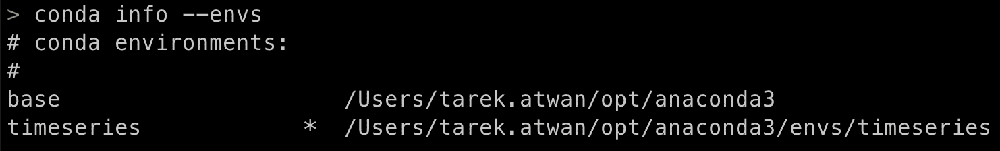
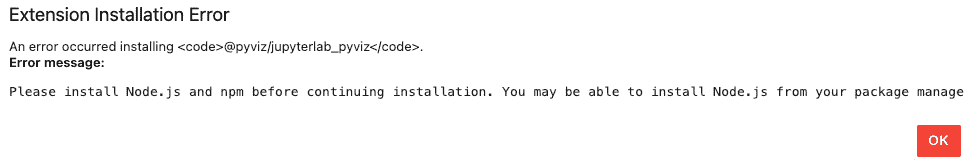

# 第一章：1 开始时间序列分析

## 加入我们在 Discord 上的书籍社区


[`packt.link/zmkOY`](https://packt.link/zmkOY)

当你开始学习**Python**编程时，你经常会按照指示安装包并导入库，然后进入一段跟着代码走的学习流程。然而，在任何数据分析或数据科学过程中，一个常常被忽视的部分就是确保正确的开发环境已经搭建好。因此，从一开始就打好基础是至关重要的，这样可以避免未来可能出现的麻烦，比如实现过于复杂、包冲突或依赖危机。搭建好合适的开发环境会在你完成项目时帮助你，确保你能够以可重现和生产就绪的方式交付成果。

这样的主题可能不会那么有趣，甚至可能会感觉有些行政负担，而不是直接进入核心主题或当前的项目。但正是这个基础，才将一个经验丰富的开发者与其他人区分开来。就像任何项目一样，无论是**机器学习**项目、**数据可视化**项目，还是**数据集成**项目，一切都始于规划，并确保在开始核心开发之前，所有需要的部分都已经到位。

本章中，你将学习如何设置**Python 虚拟环境**，我们将介绍两种常见的方法来实现这一点。步骤将涵盖常用的环境和包管理工具。本章旨在实践操作，避免过多的行话，并让你以迭代和有趣的方式开始创建虚拟环境。

随着本书的进展，你将需要安装多个特定于**时间序列分析**、**时间序列可视化**、**机器学习**和**深度学习**（针对时间序列数据）的 Python 库。不管你有多大的诱惑跳过这一章，都不建议这么做，因为它将帮助你为随后的任何代码开发打下坚实的基础。在这一章结束时，你将掌握使用**conda**或**venv**创建和管理 Python 虚拟环境所需的技能。

本章将涵盖以下内容：

+   开发环境设置

+   安装 Python 库

+   安装 JupyterLab 和 JupyterLab 扩展

## 技术要求

本章中，你将主要使用命令行。对于 macOS 和 Linux，默认的终端将是 (`bash` 或 `zsh`)，而在 Windows 操作系统中，你将使用**Anaconda 提示符**，这是 Anaconda 或 Miniconda 安装包的一部分。关于如何安装 Anaconda 或 Miniconda，将在随后的*准备工作*部分讨论。

我们将使用 **Visual Studio Code** 作为 IDE，它可以免费获取，网址为 [`code.visualstudio.com`](https://code.visualstudio.com)。它支持 Linux、Windows 和 macOS。

其他有效的替代选项也可以让你跟随学习，具体包括：

+   **Sublime Text**，网址为 https://www.sublimetext.com

+   **Spyder**，网址为 [`www.spyder-ide.org`](https://www.spyder-ide.org)

+   **PyCharm Community Edition**，网址为 [`www.jetbrains.com/pycharm/download/`](https://www.jetbrains.com/pycharm/download/)

+   **Jupyter Notebook**，网址为 [`jupyter.org`](https://jupyter.org)

本章的源代码可以在 [`github.com/PacktPublishing/Time-Series-Analysis-with-Python-Cookbook`](https://github.com/PacktPublishing/Time-Series-Analysis-with-Python-Cookbook) 获取

## 开发环境设置

当我们深入本书提供的各种配方时，你将会创建不同的 Python 虚拟环境，以便安装所有依赖项而不影响其他 Python 项目。

你可以将虚拟环境看作是独立的桶或文件夹，每个文件夹都包含一个 Python 解释器和相关的库。下面的图示说明了独立的自包含虚拟环境的概念，每个虚拟环境都有不同的 Python 解释器，并且安装了不同版本的包和库：


图 1.1：三个不同 Python 虚拟环境的示例，每个环境对应一个 Python 项目

如果你安装了 Anaconda，那么这些环境通常会存储在 `envs` 子文件夹中的单独文件夹内，该子文件夹位于主 Anaconda（或 Miniconda）文件夹的安装目录下。举例来说，在 macOS 上，你可以在 `Users/<yourusername>/opt/anaconda3/envs/` 路径下找到 `envs` 文件夹。在 Windows 操作系统中，路径可能看起来像 `C:\Users\<yourusername>\anaconda3\envs`。如果你安装的是 Miniconda，那么 `main` 文件夹将是 `miniconda3` 而不是 `anaconda3`。

每个环境（文件夹）都包含一个 **Python 解释器**，该解释器在创建环境时指定，例如 Python 2.7.18 或 Python 3.9 解释器。

一般来说，如果没有测试作为策略的一部分，升级 Python 版本或包可能会导致许多不希望出现的副作用。常见的做法是复制当前的 Python 环境，在进行所需的升级并进行测试之后，再决定是否继续进行升级。这正是环境管理器（`conda` 或 `venv`）和包管理器（`conda` 或 `pip`）在你的开发和生产部署过程中所带来的价值。

### 准备工作

在本节中，假设你已经通过以下任一方式安装了最新版本的 Python：

+   推荐的方法是通过像 **Anaconda**（[`www.anaconda.com/products/distribution`](https://www.anaconda.com/products/distribution)）这样的 Python 发行版来安装，Anaconda 自带所有必需的包，并支持 Windows、Linux 和 macOS（2022.05 版本起支持 M1）。另外，你也可以安装 **Miniconda**（[`docs.conda.io/en/latest/miniconda.html`](https://docs.conda.io/en/latest/miniconda.html)）或 **Miniforge**（[`github.com/conda-forge/miniforge`](https://github.com/conda-forge/miniforge)）。

+   直接从官方 Python 网站下载安装程序：[`www.python.org/downloads/`](https://www.python.org/downloads/)。

+   如果你熟悉**Docker**，你可以下载官方的 Python 镜像。你可以访问 Docker Hub 来确定要拉取的镜像：[`hub.docker.com/_/python`](https://hub.docker.com/_/python)。同样，**Anaconda** 和 **Miniconda** 可以通过遵循官方说明与 Docker 一起使用，说明请见此处：[`docs.anaconda.com/anaconda/user-guide/tasks/docker/`](https://docs.anaconda.com/anaconda/user-guide/tasks/docker/)

截至撰写时，最新的 Python 版本是 Python 3.11.3。

> Anaconda 支持的最新 Python 版本
> 
> > Anaconda 的最新版本是 2023.03，于 2023 年 4 月发布。默认情况下，Anaconda 会将 Python 3.10.9 作为基础解释器。此外，你可以使用 `conda create` 创建一个 Python 版本为 3.11.3 的虚拟环境，稍后你将在本食谱中看到如何操作。

获取快速顺利启动的最简单有效方法是使用像*Anaconda*或*Miniconda*这样的 Python 发行版。如果你是初学者，我甚至更推荐使用 Anaconda。

如果你是 macOS 或 Linux 用户，一旦安装了 Anaconda，你几乎可以直接使用默认的终端。要验证安装情况，打开终端并输入以下命令：

```py
$ conda info
```

以下截图展示了运行 `conda info` 时的标准输出，列出了有关已安装 `conda` 环境的信息。你应该关注列出的 `conda` 和 Python 的版本：


图 1.2 – 在 Linux（Ubuntu）上使用终端验证 Conda 的安装

如果你在 Windows 操作系统上安装了 Anaconda，你需要使用 Anaconda Prompt。要启动它，你可以在 Windows 搜索栏中输入 Anaconda，并选择列出的其中一个 Anaconda Prompt（**Anaconda Prompt** 或 **Anaconda PowerShell Prompt**）。一旦启动了 **Anaconda Prompt**，你可以运行 `conda` `info` 命令。


图 1.3：使用 Anaconda Prompt 在 Windows 上验证 Conda 的安装

### 如何操作…

在本指南中，我将介绍两个流行的环境管理工具。如果你已经安装了 Anaconda、Miniconda 或 Miniforge，那么`conda`应该是你的首选，因为它为 Python（并且支持许多其他语言）提供了*包依赖管理*和*环境管理*。另一方面，另一个选项是使用`venv`，这是一个内置的 Python 模块，提供*环境管理*，无需额外安装。

`conda`和`venv`都允许你为你的 Python 项目创建多个虚拟环境，这些项目可能需要不同版本的 Python 解释器（例如，3.4、3.8 或 3.9）或不同的 Python 包。此外，你可以创建一个沙箱虚拟环境来尝试新的包，以了解它们如何工作，而不会影响你基础的 Python 安装。

为每个项目创建一个单独的虚拟环境是许多开发者和数据科学实践者采纳的最佳实践。遵循这一建议从长远来看会对你有所帮助，避免在安装包时遇到常见问题，如包依赖冲突。

#### 使用 Conda

首先打开你的终端（Windows 的 Anaconda 提示符）：

1.  首先，让我们确认你拥有最新版本的`conda`。你可以通过以下命令来做到这一点：

```py
$ conda update conda
```

上面的代码将更新 conda 包管理器。如果你使用的是现有的安装，这将非常有用。通过这种方式，你可以确保拥有最新版本。

1.  如果你已经安装了 Anaconda，可以使用以下命令更新到最新版本：

```py
$ conda update anaconda
```

1.  现在，你将创建一个名为`py310`的新虚拟环境，指定的 Python 版本为 Python 3.10：

```py
$ conda create -n py310 python=3.10
```

在这里，`-n`是`--name`的快捷方式。

1.  `conda`可能会识别出需要下载和安装的其他包。系统可能会提示你是否继续。输入`y`然后按*Enter*键继续。

1.  你可以通过添加`-y`选项跳过前面步骤中的确认消息。如果你对自己的操作有信心，并且不需要确认消息，可以使用此选项，让`conda`立即继续而不提示你进行响应。你可以通过添加`-y`或`--yes`选项来更新你的命令，如以下代码所示：

```py
$ conda create -n py10 python=3.10 -y
```

1.  一旦设置完成，你就可以*激活*新的环境。激活一个 Python 环境意味着我们的**$PATH**环境变量会被更新，指向虚拟环境（文件夹）中的指定 Python 解释器。你可以使用**echo**命令来确认这一点：

```py
$ echo $PATH
> /Users/tarekatwan/opt/anaconda3/bin:/Users/tarekatwan/opt/anaconda3/condabin:/usr/local/bin:/usr/bin:/bin:/usr/sbin:/sbin
```

上面的代码适用于 Linux 和 macOS。如果你使用的是 Windows Anaconda 提示符，可以使用`echo %path%`。在 Anaconda PowerShell 提示符中，你可以使用`echo $env:path`。

在这里，我们可以看到我们的`$PATH`变量指向的是基础的`conda`环境，而不是我们新创建的虚拟环境。

1.  现在，激活你新的 `py310` 环境，并再次测试 `$PATH` 环境变量。你会注意到它现在指向 `envs` 文件夹——更具体地说，是 `py310/bin` 子文件夹：

```py
$ conda activate py39
$ echo $PATH
> /Users/tarekatwan/opt/anaconda3/envs/py310/bin:/Users/tarekatwan/opt/anaconda3/condabin:/usr/local/bin:/usr/bin:/bin:/usr/sbin:/sbin
```

1.  另一种确认我们新虚拟环境是活动环境的方法是运行以下命令：

```py
$ conda info –envs
```

上面的命令将列出所有已创建的 `conda` 环境。请注意，`py310` 前面有一个 `*`，表示它是当前活动环境。以下截图显示我们有四个虚拟环境，且 `py310` 是当前活动的环境：


图 1.4：在 MacOS 上通过 conda 创建的所有 Python 虚拟环境列表

1.  一旦激活了特定环境，你安装的任何软件包将只会在该隔离环境中可用。例如，假设我们安装 pandas 库并指定要在 `py310` 环境中安装哪个版本。写作时，pandas 2.0.1 是最新版本：

```py
$ conda install pandas=2.0.1
```

请注意，`conda` 会再次提示你确认，并告知将下载并安装哪些额外的软件包。在这里，conda 正在检查 pandas 2.0.1 所需的所有依赖项，并为你安装它们。你还可以通过在命令末尾添加 `-y` 或 `--yes` 选项来跳过此确认步骤。

消息还会指出安装将发生的环境位置。以下是安装 pandas 2.0.1 时的一个提示消息示例：


图 1.5：Conda 确认提示，列出所有软件包

> 如果你遇到 `PackagesNotFoundError` 错误，你可能需要添加 conda-forge 通道来安装最新版本的 pandas（例如 2.0.1）。你可以使用以下命令来完成此操作：
> 
> > $ conda config --add channels conda-forge
> > 
> > Conda-Forge 提供适用于不同平台和架构的构建，并会自动选择适合你平台和架构的构建版本。
> > 
> > 作为示例，如果你想为 MacOS ARM 指定一个 conda-forge 构建版本，你可以按照以下方式指定该构建：
> > 
> > $ conda config --add channels conda-forge/osx-arm64

1.  一旦你按下 *y* 并按 *Enter* 键，`conda` 将开始下载并安装这些软件包。

1.  一旦你完成在当前 `py310` 环境中的工作，你可以使用以下命令 `deactivate` 来退出并返回到基础 Python 环境：

```py
$ conda deactivate
```

1.  如果你不再需要 py310 环境并希望删除它，你可以使用 `env remove` 命令来删除它。该命令将完全删除该环境及所有已安装的库。换句话说，它将删除（移除）该环境的整个文件夹：

```py
$ conda env remove -n py310
```

#### 使用 venv

一旦安装了 Python 3x，你可以使用内置的`venv`模块，该模块允许你创建虚拟环境（类似于`conda`）。注意，当使用`venv`时，你需要提供一个*路径*，以指定虚拟环境（文件夹）创建的位置。如果没有提供路径，虚拟环境将会在你运行命令的当前目录下创建。在下面的代码中，我们将在`Desktop`目录中创建虚拟环境。

按照以下步骤创建新环境、安装包并使用`venv`删除该环境：

1.  首先，决定你希望将新的虚拟环境放在哪里，并指定路径。在这个示例中，我已经导航到`Desktop`并运行了以下命令：

```py
$ cd Desktop
$ python -m venv py310
```

上面的代码将在`Desktop`目录中创建一个新的 py310 文件夹。`py310`文件夹包含若干子目录、Python 解释器、标准库以及其他支持文件。该文件夹结构类似于`conda`在`envs`目录中创建的环境文件夹。

1.  让我们激活 py310 环境，并检查$PATH 环境变量以确认它已经被激活。以下脚本适用于 Linux 和 macOS（bash 或 zsh），假设你是在 Desktop 目录下运行命令：

```py
$ source py310/bin/activate
$ echo $ PATH
> /Users/tarekatwan/Desktop/py310/bin:/Users/tarekatwan/opt/anaconda3/bin:/Users/tarekatwan/opt/anaconda3/condabin:/usr/local/bin:/usr/bin:/bin:/usr/sbin:/sbin
```

在这里，我们可以看到`py310`环境已经被激活。

在 Windows 上使用 Anaconda PowerShell Prompt 时，没有`bin`子文件夹，因此你需要使用以下语法运行命令，假设你是在`Desktop`目录下运行命令：

```py
$ .py310\Scripts\activate
```

在 Scripts 文件夹下有两个激活文件：`activate.bat`和`Activate.ps1`，后者应在 Anaconda PowerShell Prompt 中使用，而不是 Anaconda Windows 命令提示符。通常在 PowerShell 中，如果你省略文件扩展名，正确的脚本会被执行。但最好是指定正确的文件扩展名，例如指定`Activate.ps1`，如下所示：

```py
.\py310\Scripts\Activate.ps1
```

1.  现在，让我们使用以下命令检查已安装的版本：

```py
$ python --version
> Python 3.10.10
```

1.  一旦完成使用**py310**环境进行开发，你可以使用**deactivate**命令将其停用，返回到基础 Python 环境：

```py
$ deactivate
```

1.  如果你不再需要`py310`环境并希望删除它，只需删除整个`py310`文件夹即可。

### 它是如何工作的…

一旦虚拟环境被激活，你可以验证当前活跃的 Python 解释器位置，以确认你正在使用正确的解释器。之前，你看到激活虚拟环境后，`$PATH`环境变量是如何变化的。在 Linux 和 macOS 中，你可以使用`which`命令实现类似的效果，在 Windows PowerShell 中使用`Get-Command`，或者在 Windows 命令提示符中使用`where`命令。

以下是 macOS 或 Linux 的示例：

```py
$ which python
> /Users/tarekatwan/opt/anaconda3/envs/py310/bin/python
```

以下是 Windows 操作系统（PowerShell）的示例：

```py
$ where.exe python
```

`where`命令的替代方法是`Get-Command`，如下所示：

```py
$ Get-Command python
```

这些命令将输出活动 Python 解释器的路径。前述命令的输出将显示不同的路径，具体取决于活动环境是使用`conda`还是`venv`创建的。激活`conda`虚拟环境时，它将位于`envs`文件夹中，如 MacOS 上所示：

`/Users/tarekatwan/opt/anaconda3/envs/py310/bin/python`

当激活`venv`虚拟环境时，路径将与创建时提供的路径相同，如 MacOS 上的示例所示：

`/Users/tarekatwan/Desktop/py310/bin/python`

您在*激活*虚拟环境后安装的任何额外包或库都将与其他环境隔离，并保存在该环境的文件夹结构中。

如果我们比较`venv`和`conda`的文件夹结构，您会看到相似之处，如下图所示：


图 1.6：使用 conda 和 venv 比较文件夹结构

请回忆，当使用`conda`时，所有环境默认位于`anaconda3/`或`minconda3/`目录下的`/envs/`位置。而使用`venv`时，您需要提供一个路径来指定创建目录或项目的位置；否则，它将默认为您运行命令时所用的当前目录。类似地，您可以使用`conda`通过选项`-p`或`--prefix`指定不同的路径。请注意，使用`venv`时，您无法指定 Python 版本，因为它依赖于当前活动或基础 Python 版本来运行命令。这与`conda`不同，`conda`允许您指定不同的 Python 版本，而不管**基础**Python 版本是什么。例如，当前基础环境的 Python 版本是 3.10，您仍然可以使用以下命令创建一个 3.11.x 环境：

```py
conda create -n py311 python=3.11 -y
```

上述代码将创建一个新的`py311`环境，并安装 Python 3.11.3 版本。

`conda`的另一个优点是，它提供了两个功能：*包和依赖管理器*以及*虚拟环境管理器*。这意味着我们可以使用相同的`conda`环境，通过`conda create`创建额外的环境，并使用`conda install <package name>`安装包，这将在下一个章节“*安装 Python 库*”中使用。

请记住，使用`venv`时，它*仅*是一个虚拟环境管理器，您仍然需要依赖`pip`作为包管理器来安装包；例如，使用`pip install <package name>`。

此外，当使用`conda`安装包时，它会检查是否存在冲突，并会提示您进行任何推荐操作，包括是否需要升级、降级或安装额外的包依赖。

最后，使用`conda`的一个额外好处是，您不仅可以为 Python 创建环境，还可以为其他语言创建环境。包括 Julia、R、Lua、Scala、Java 等。

### 还有更多…

在前面的示例中，你可以使用`conda`或`venv`从零开始创建 Python 虚拟环境。你创建的虚拟环境可能还不包含所需的包，因此你需要特别为项目安装这些包。你将会在接下来的食谱“*安装 Python 库*”中了解如何安装包。

还有其他方式可以在`conda`中创建虚拟环境，我们将在这里讨论这些方式。

#### 使用 YAML 文件创建虚拟环境

你可以从**YAML**文件创建虚拟环境。这个选项可以让你在一步中定义环境的多个方面，包括应该安装的所有包。

你可以在 VSCode 中创建一个 YAML 文件。以下是一个`env.yml`文件的示例，使用 Python 3.10 创建一个名为`tscookbook`的`conda`环境：

```py
# A YAML for creating a conda environment
# file: env.yml
# example creating an environment named tscookbook
name: tscookbook
channels:
  - conda-forge
  - defaults
dependencies:
  - python=3.10
  - pip
  # Data Analysis
  - statsmodels
  - scipy
  - pandas
  - numpy
  - tqdm
  # Plotting
  - matplotlib
  - seaborn
  # Machine learning
  - scikit-learn
  - jupyterlab
```

要使用`env.yml`文件创建虚拟环境，可以使用`conda env create`命令，并添加`-f`或`--file`选项，如下所示：

```py
$ conda env create -f env.yml
```

一旦这个过程完成，你可以激活该环境：

```py
$ conda activate tscookbook
```

你还可以从现有环境引导生成 YAML 文件。如果你想与他人分享环境配置或为将来使用创建备份，这个方法非常有用。以下三个命令将使用稍微不同的语法选项，达到将`py310`的`conda`环境导出为`env.yml`的 YAML 文件的相同效果：

```py
$ conda env export -n py310 > env.yml
$ conda env export -n py310 -f env.yml
$ conda env export –name py310 –file env.yml
```

这将在当前目录下为你生成`env.yml`文件。

#### 从另一个环境克隆虚拟环境

这是一个很棒的功能，适用于你想要尝试新包或升级现有包，但又不希望破坏当前项目中的现有代码。使用`–clone`选项，你可以一步创建环境的副本或克隆。这样可以实现与前面使用`conda env export`命令生成现有环境的 YAML 文件，再基于该 YAML 文件创建新环境相同的效果。以下示例将把`py310`的`conda`环境克隆为一个名为`py310_clone`的新环境：

```py
$ conda create --name py310_clone --clone py310
```

### 另见

值得一提的是，Anaconda 附带了一个工具，**叫做 anaconda-project**，它可以将你的`conda`项目工件打包并创建一个 YAML 文件以确保可重复性。这个工具非常适合创建、共享和确保数据科学项目的可重复性。可以把它看作是手动编写 YAML 的替代方案。更多信息，请参考官方 GitHub 仓库：[`github.com/Anaconda-Platform/anaconda-project`](https://github.com/Anaconda-Platform/anaconda-project)。

要查看参数列表，你可以在终端中输入以下命令：

```py
$ anaconda-project --help
```

如果你正在使用一台不允许安装软件的机器，或者使用一台性能有限的旧机器，不用担心。还有其他选项可以让你在本书中进行动手实践。

你可以探索的一些替代选项如下：

+   **Google Colab** 是一个基于云的平台，允许你在笔记本中编写和运行 Python 代码，这些笔记本已经预装了一些最受欢迎的数据科学包，包括`pandas`、`statsmodels`、`scikit-learn` 和 `TensorFlow`。Colab 允许你通过 `pip install` 在笔记本中安装额外的包。Colab 的一个好特点是你可以选择配置你的笔记本，以便免费使用 CPU、GPU 或 TPU。你可以通过访问 [`colab.research.google.com/`](https://colab.research.google.com/) 来探索 Colab。

+   **Kaggle Notebooks** 类似于 Colab，包含托管的 Jupyter 笔记本，并且已经预装了许多最受欢迎的数据科学包。它也允许你通过 `pip install` 安装任何需要的额外包。有关更多信息，请参考 [`www.kaggle.com/docs/notebooks`](https://www.kaggle.com/docs/notebooks)。

+   **Replit** 提供一个免费的在线 IDE，支持超过 50 种语言，包括 Python。你只需创建一个帐户，并通过访问 [`replit.com/`](https://replit.com/) 来创建你的新 `replit` 空间。

+   **Binder** 是一个在线开源平台，允许你将 Git 仓库转化为一组交互式笔记本。你可以通过访问 [`mybinder.org`](https://mybinder.org) 来探索 Binder。

+   **Deepnote** 类似于 Colab，是一个在线平台，允许你编写、运行和协作 Python 笔记本，并提供了一个免费的计划，你可以在这里查看 [`deepnote.com`](https://deepnote.com)。

## 安装 Python 库

在之前的配方中，你已经了解了 YAML 环境配置文件，它允许你通过一行代码一步创建一个 Python 虚拟环境和所有必要的包。

```py
$ conda env create -f env.yml
```

在本书的整个过程中，你需要安装若干个 Python 库来跟随本书的配方。你将探索几种安装 Python 库的方法。

### 准备工作

在本书中，你将创建并使用不同的文件，包括 `requirements.txt`、`environment_history.yml` 和其他文件。这些文件可以从本书的 GitHub 仓库中下载：[`github.com/PacktPublishing/Time-Series-Analysis-with-Python-Cookbook/tree/main/code/Ch1`](https://github.com/PacktPublishing/Time-Series-Analysis-with-Python-Cookbook/tree/main/code/Ch1)。

在本章中，你将学习如何生成你的 `requirements.txt` 文件，并了解如何安装库的一般过程。

### 如何做...

一次性安装一组库的最简单方法是使用 `requirements.txt` 文件。

简而言之，`requirements.txt`文件列出了你想要安装的 Python 库及其相应的版本。你可以手动创建`requirements.txt`文件，也可以从现有的 Python 环境中导出它。

> 该文件不一定需要命名为`requirements.txt`，它更多的是一种命名约定，并且是 Python 社区非常常见的一种命名方式。一些工具，如 PyCharm，如果`requirements.txt`文件位于项目的根目录中，会自动检测到该文件。

#### 使用 conda

使用`conda`时，你有不同的选择来批量安装包。你可以创建一个新的环境，并一次性安装`requirements.txt`文件中列出的所有包（使用`conda create`命令），或者你可以使用`requirements.txt`文件将 Python 包安装到现有的环境中（使用`conda install`命令）：

+   **选项 1**：创建一个新的`conda`环境，并一步到位安装库。例如，你可以为每一章创建一个新的环境，并使用关联的`requirements.txt`文件。以下示例将创建一个名为`ch1`的新环境，并安装`requirements.txt`文件中列出的所有包：

```py
$ conda create --name ch1 -f requirements.txt
```

+   **选项 2**：将所需的库安装到现有的`conda`环境中。在此示例中，你有一个现有的`timeseries`环境，首先需要激活该环境，然后从`requirements.txt`文件中安装库：

```py
$ conda activate timeseries
$ conda install -f requirements.txt
```

#### 使用 venv 和 pip

由于`venv`只是一个环境管理器，你将需要使用`pip`作为包管理工具。你将首先使用`venv`创建一个新环境，然后使用`pip`安装包：

+   在**MacOS/Linux**上：创建并激活`venv`环境，然后再安装包：

```py
$ python -m venv Desktopn/timeseries
$ source Desktop/timeseries/bin/activate
$ pip install -r requirements.txt
```

+   在**Windows**上：创建并激活`venv`环境，然后安装包：

```py
$ python -m venv .\Desktop\timeseries
$ .\Desktop\timeseries\Scripts\activate
$ pip install -r requirements.txt
```

注意，在前面的 Windows 代码中，没有指定`activate`文件的扩展名（`.bat`或`.ps1`）。这是有效的，能够在 Windows 命令提示符或 PowerShell 中工作。

### 它是如何工作的…

在前面的代码中，提供了`requirements.txt`文件，以便你可以安装所需的库。

那么，如何生成你的`requirements.txt`文件呢？

创建`requirements.txt`文件有两种方法。让我们来看看这两种方法。

#### 手动创建文件

由于它是一个简单的文件格式，你可以使用任何文本编辑器来创建该文件，例如 VSCode，并列出你想要安装的包。如果你没有指定包的版本，那么安装时将考虑最新版本。请参见以下`simple.txt`文件的示例：

```py
pandas==1.4.2
matplotlib
```

首先，让我们测试一下`venv`和`pip`。运行以下脚本（我在 Mac 上运行此操作）：

```py
$ python -m venv ch1
$ source ch1/bin/activate
$ pip install -r simple.txt
$ pip list
Package         Version
--------------- -------
cycler          0.11.0
fonttools       4.33.3
kiwisolver      1.4.2
matplotlib      3.5.2
numpy           1.22.4
packaging       21.3
pandas          1.4.2
Pillow          9.1.1
pip             22.0.4
pyparsing       3.0.9
python-dateutil 2.8.2
pytz            2022.1
setuptools      58.1.0
six             1.16.0
$ deactivate
```

那些额外的包是什么？这些是基于`pip`为我们识别和安装的`pandas`和`matplotlib`的依赖关系。

现在，让我们这次使用`conda`，并使用相同的`simple.txt`文件：

```py
$ conda create -n ch1  --file simple.txt python=3.10
```

安装完成后，您可以激活环境并列出已安装的包：

```py
$ conda activate ch1
$ conda list
```

您可能会注意到列表相当庞大。与 `pip` 方法相比，安装了更多的包。您可以使用以下命令来计算已安装的库数：

```py
$ conda list | wc -l
> 54
```

这里有几个需要注意的事项：

+   `conda` 从 Anaconda 仓库以及 Anaconda 云安装包。

+   `pip` 从 **Python 包索引（PyPI）** 仓库安装包。

+   `conda` 会对它计划下载的所有包进行非常彻底的分析，并且在处理版本冲突时比 `pip` 做得更好。

#### 引导文件

第二个选项是从现有环境中生成 `requirements.txt` 文件。当您为将来的使用重建环境，或与他人共享包和依赖关系列表时，这非常有用，可以确保可重现性和一致性。假设您在一个项目中工作并安装了特定的库，您希望确保在共享代码时，其他用户能够安装相同的库。这时，生成 `requirements.txt` 文件就显得非常方便。同样，导出 YAML 环境配置文件的选项之前已经展示过。

让我们看看如何在`pip`和`conda`中执行此操作。请记住，两种方法都会导出已经安装的包及其当前版本的列表。

##### venv 和 pip freeze

`pip freeze` 允许您导出环境中所有通过 pip 安装的库。首先，激活之前用 `venv` 创建的 `ch1` 环境，然后将包列表导出到 `requirements.txt` 文件中。以下示例是在 macOS 上使用终端：

```py
$ source ch1/bin/activate
$ pip freeze > requirements.txt
$ cat requirements.txt
>>>
cycler==0.11.0
fonttools==4.33.3
kiwisolver==1.4.2
matplotlib==3.5.2
numpy==1.22.4
...
```

完成后，您可以运行 `deactivate` 命令。

##### Conda

让我们激活之前使用 `conda` 创建的环境（`ch1` 环境），并导出已安装的包列表：

```py
$ conda activate ch1
$ conda list -e > conda_requirements.txt
$ cat conda_requirements.txt
>>>
# This file may be used to create an environment using:
# $ conda create --name <env> --file <this file>
# platform: osx-64
blas=1.0=mkl
bottleneck=1.3.4=py39h67323c0_0
brotli=1.0.9=hb1e8313_2
ca-certificates=2022.4.26=hecd8cb5_0
certifi=2022.5.18.1=py39hecd8cb5_0
cycler=0.11.0=pyhd3eb1b0_0
...
```

### 还有更多……

当您使用 `conda` 导出已安装包的列表时，`conda_requirements.txt` 文件包含了大量的包。如果您只想导出您显式安装的包（而不是 `conda` 添加的附加包），则可以使用带有 `--from-history` 标志的 `conda env export` 命令：

```py
$ conda activate ch1
$ conda env export --from-history > env.yml
$ cat env.yml
>>>
name: ch1
channels:
  - defaults
dependencies:
  - matplotlib
  - pandas==1.2.0
prefix: /Users/tarek.atwan/opt/anaconda3/envs/ch1
```

请注意，您不必像之前那样先激活环境。相反，您可以添加 `-n` 或 `--name` 选项来指定环境的名称。否则，它将默认为当前激活的环境。这是修改后的脚本示例：

```py
conda env export -n ch1 --from-history > env.yml
```

### 另请参见

+   要查找 Anaconda 中所有可用的包，您可以访问 [`docs.anaconda.com/anaconda/packages/pkg-docs/`](https://docs.anaconda.com/anaconda/packages/pkg-docs/)。

+   要在 PyPI 仓库中搜索包，您可以访问 [`pypi.org/`](https://pypi.org/)。

## 安装 JupyterLab 和 JupyterLab 扩展

在本书中，你可以使用自己喜欢的 Python IDE（例如 PyCharm 或 Spyder）或文本编辑器（例如 Visual Studio Code、Atom 或 Sublime）进行操作。另一种选择是基于笔记本概念的交互式学习，它通过 Web 界面进行。更具体地说，**Jupyter Notebook** 或 **Jupyter Lab** 是学习、实验和跟随本书教程的首选方法。有趣的是，Jupyter 这个名字来源于三种编程语言：Julia、Python 和 R。或者，你也可以使用 Google 的 Colab 或 Kaggle Notebooks。欲了解更多信息，请参考本章 *开发环境设置* 教程中的 *另见* 部分。如果你不熟悉 Jupyter Notebooks，可以在这里了解更多信息：[`jupyter.org/`](https://jupyter.org/)。

在本教程中，你将安装 Jupyter Notebook、JupyterLab 以及额外的 JupyterLab 扩展。

此外，你还将学习如何安装单个软件包，而不是像前面教程中那样采用批量安装方法。

> 在后续示例中使用 CONDA
> 
> > 在后续的操作中，当新环境被创建时，代码将使用 **conda** 进行编写。前面的教程已经涵盖了创建虚拟环境的两种不同方法（**venv** 与 **conda**）以及安装软件包的两种方法（**pip** 与 **conda**），这将允许你根据自己的选择继续操作。

### 准备就绪

我们将创建一个新环境并安装本章所需的主要软件包，主要是 pandas：

```py
$ conda create -n timeseries python=3.9 pandas -y
```

这段代码创建了一个名为 `timeseries` 的新的 Python 3.9 环境。语句的最后部分列出了你将要安装的各个软件包。如果软件包列表较大，建议使用 `requirements.txt` 文件。如果软件包不多，可以直接用空格分隔列出，如下所示：

```py
$ conda create -n timeseries python=3.9 pandas matplotlib statsmodels -y
```

一旦环境创建完毕并且软件包安装完成，可以继续激活该环境：

```py
$ conda activate timeseries
```

### 操作方法……

现在我们已经创建并激活了环境，接下来安装 Jupyter：

1.  现在我们已经激活了环境，可以使用 `conda` `install` 安装 `conda create` 时未包含的其他软件包：

```py
$ conda install jupyter -y
```

1.  你可以通过输入以下命令启动 JupyterLab 实例：

```py
$ jupyter lab
```

请注意，这会运行一个本地 Web 服务器，并在你的默认浏览器中启动 JupyterLab 界面，指向 `localhost:8888/lab`。以下截图展示了你在终端中输入上述代码后看到的类似界面：


图 1.6：启动 JupyterLab 将运行本地 Web 服务器

1.  要终止 Web 服务器，请在终端中按 *Ctrl* + *C* 两次，或者在 Jupyter GUI 中点击 **Shut Down**，如以下截图所示：

    

    图 1.7：关闭 JupyterLab 网络服务器

1.  现在，你可以安全地关闭浏览器。

1.  请注意，在前面的例子中，当 JupyterLab 启动时，它是在默认浏览器中启动的。如果你希望使用不同的浏览器，可以像这样更新代码：

```py
$ jupyter lab --browser=chrome
```

在这个例子中，我指定了我要在 Chrome 上启动，而不是 Safari，这是我机器上的默认浏览器。你可以将值更改为你偏好的浏览器，比如 Firefox、Opera、Chrome 等。

在 Windows 操作系统中，如果前面的代码没有自动启动 Chrome，你需要使用`webbrowser.register()`注册浏览器类型。为此，首先使用以下命令生成 Jupyter Lab 配置文件：

```py
jupyter-lab --generate-config
```

打开`jupyter_lab_config.py`文件，并在顶部添加以下内容：

```py
import webbrowser
webbrowser.register('chrome', None, webbrowser.GenericBrowser('C:\Program Files (x86)\Google\Chrome\Application\chrome.exe'))
```

保存并关闭文件。你可以重新运行`jupyter lab --browser=chrome`，这应该会启动 Chrome 浏览器。

1.  如果你不希望系统自动启动浏览器，可以使用以下代码：

```py
$ jupyter lab --no-browser
```

网络服务器将启动，你可以手动打开任何你偏好的浏览器，并将其指向`http://localhost:8888`。

如果系统要求你输入 token，你可以复制并粘贴终端中显示的带 token 的 URL，格式如下：

```py
To access the server, open this file in a browser:
        file:///Users/tarek.atwan/Library/Jupyter/runtime/jpserver-44086-open.html
    Or copy and paste one of these URLs:
        http://localhost:8888/lab?token=5c3857b9612aecd3
c34e9a40e5eac4509a6ccdbc8a765576
     or http://127.0.0.1:8888/lab?token=5c3857b9612aecd3
c34e9a40e5eac4509a6ccdbc8a765576
```

1.  最后，如果默认的`port 8888`端口正在使用中，或者你希望更改端口号，可以添加`-p`并指定你想要的端口号，如下例所示。在这里，我指示网络服务器使用`port 8890`：

```py
$ jupyter lab --browser=chrome --port 8890
```

这将启动 Chrome 并指向`localhost:8890/lab`。

请注意，当 JupyterLab 启动时，你只会在**笔记本**/**控制台**部分看到一个内核。这是基础 Python 内核。我们原本预期看到两个内核，分别反映我们拥有的两个环境：基础环境和`timeseries`虚拟环境。让我们使用以下命令检查我们有多少个虚拟环境：

1.  下图显示了 JupyterLab 界面，只有一个内核，属于基础环境：

    

    图 1.8：JupyterLab 界面，只显示一个内核，该内核属于基础环境

1.  下图显示了两个 Python 环境：



图 1.9：显示两个 Python 环境

我们可以看到 timeseries 虚拟环境是活动的。

1.  你需要为新的`timeseries`环境安装 Jupyter 内核。首先，关闭网络服务器（即使没有关闭它也可以继续使用）。假设你仍然处于活动的`timeseries` Python 环境中，只需输入以下命令：

```py
$ python -m ipykernel install --user  --name timeseries --display-name "Time Series"
> Installed kernelspec timeseries in /Users/tarek.atwan/Library/Jupyter/kernels/timeseries
```

1.  我们可以使用以下命令检查 Jupyter 可用的内核数量：

```py
$ jupyter kernelspec list
```

下图显示了创建的`kernelspec`文件及其位置：


图 1.10：Jupyter 可用内核列表

这些作为指针，将 GUI 与适当的环境连接，以执行我们的 Python 代码。

1.  现在，你可以重新启动 JupyterLab，并注意到变化：

```py
$ jupyter lab
```

启动后将出现以下屏幕：


图 1.11：现在我们的时间序列内核已在 JupyterLab 中可用

### 它是如何工作的……

当你创建了新的 `timeseries` 环境并使用 `conda install` 安装所需的包时，它会在 `envs` 文件夹中创建一个新的子文件夹，以隔离该环境及其安装的包与其他环境（包括基础环境）。当从基础环境执行 `jupyter notebook` 或 `jupyter lab` 命令时，它需要读取 `kernelspec` 文件（JSON），以映射到可用的内核，确保它们可以使用。`kernelspec` 文件可以通过 `ipykernel` 创建，方法如下：

```py
python -m ipykernel install --user  --name timeseries --display-name "Time Series"
```

这里，`--name` 是环境名称，`--display-name` 是 Jupyter GUI 中的显示名称，可以是你想要的任何名称。现在，任何你在 `timeseries` 环境中安装的库都可以通过内核从 Jupyter 访问（再次说明，它是 Jupyter GUI 与后端 Python 环境之间的映射）。

### 还有更多……

JupyterLab 允许你安装多个有用的扩展。这些扩展中有些由 Jupyter 创建和管理，而其他的则由社区创建。

你可以通过两种方式管理 JupyterLab 扩展：通过命令行使用 `jupyter labextension install <someExtension>` 或通过图形界面使用 **扩展管理器**。以下截图显示了 Jupyter 扩展管理器 UI 的样子：


图 1.12：点击 JupyterLab 中的扩展管理器图标

一旦你点击 **启用**，你将看到可用的 Jupyter 扩展列表。要安装扩展，只需点击 **安装** 按钮。

一些包需要先安装 Node.js 和 `npm`，你将看到类似以下的警告：



图 1.13：当需要 Node.js 和 npm 时，扩展安装错误

你可以直接从 [`nodejs.org/en/`](https://nodejs.org/en/) 下载并安装 Node.js。

另外，你也可以使用 `conda` 安装 Node.js，方法是使用以下命令：

```py
$ conda install -c conda-forge nodejs
```

### 另见

+   要了解更多关于 JupyterLab 扩展的信息，请参阅官方文档：[`jupyterlab.readthedocs.io/en/stable/user/extensions.html`](https://jupyterlab.readthedocs.io/en/stable/user/extensions.html)。

+   如果你想了解更多关于如何创建 JupyterLab 扩展的示例演示，请参考官方 GitHub 仓库：[`github.com/jupyterlab/extension-examples`](https://github.com/jupyterlab/extension-examples)。

+   在*第 9 步*中，我们手动安装了 `kernelspec` 文件，这为 Jupyter 和我们的 `conda` 环境之间创建了映射。这个过程可以通过 `nb_conda` 自动化。关于 `nb_conda` 项目的更多信息，请参考官方 GitHub 仓库：[`github.com/Anaconda-Platform/nb_conda`](https://github.com/Anaconda-Platform/nb_conda)。
