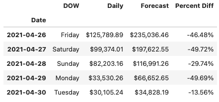
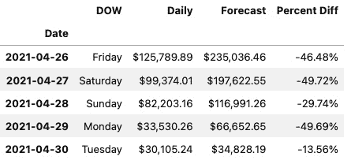
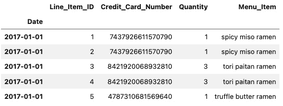
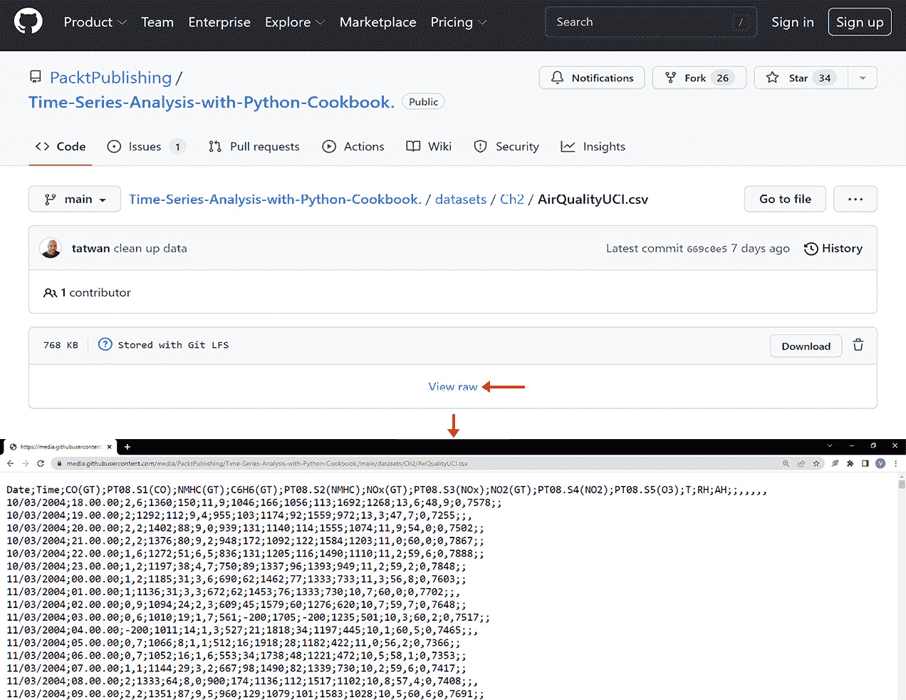
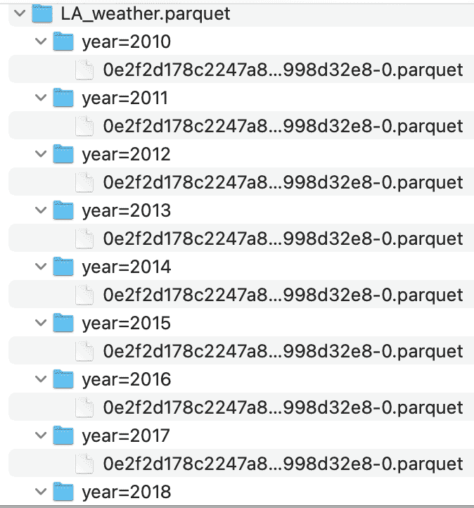

# 第二章：2 从文件读取时间序列数据

## 加入我们的 Discord 书籍社区


[`packt.link/zmkOY`](https://packt.link/zmkOY)

在本章中，我们将使用 **pandas**，一个流行的 **Python** 库，具有丰富的 I/O 工具、数据处理和日期/时间功能，用于简化处理 **时间序列数据**。此外，您还将探索 pandas 中可用的多个读取函数，来导入不同文件类型的数据，如 **逗号分隔值** (**CSV**)、Excel 和 SAS。您将探索如何从文件中读取数据，无论这些文件是存储在本地驱动器上，还是远程存储在云端，如 **AWS S3 桶**。

时间序列数据是复杂的，可能有不同的形状和格式。幸运的是，pandas 的读取函数提供了大量的参数（选项），以帮助处理数据的多样性。

**pandas** 库提供了两个基本的数据结构：Series 和 DataFrame，它们作为类实现。DataFrame 类是一个用于处理表格数据（类似于电子表格中的行和列）的独特数据结构。它们之间的主要区别在于，Series 是一维的（单列），而 DataFrame 是二维的（多列）。它们之间的关系是，当你从 DataFrame 中切片出一列时，你得到的是一个 Series。你可以将 DataFrame 想象成是两个或多个 Series 对象的并排拼接。

Series 和 DataFrame 数据结构的一个特性是，它们都具有一个叫做索引的标签轴。你在时间序列数据中常见的索引类型是 `DatetimeIndex`，你将在本章中进一步了解。通常，索引使切片和切割操作变得非常直观。例如，为了使 DataFrame 准备好进行时间序列分析，你将学习如何创建具有 `DatetimeIndex` 类型索引的 DataFrame。

我们将涵盖以下将数据导入 pandas DataFrame 的方法：

+   从 CSV 和其他分隔文件读取数据

+   从 Excel 文件读取数据

+   从 URL 读取数据

+   从 Parquet 文件读取数据处理大型数据文件

> 为什么选择 DATETIMEINDEX？
> 
> > 一个具有 `DatetimeIndex` 类型索引的 pandas DataFrame 解锁了在处理时间序列数据时所需的大量功能和有用的函数。你可以将其视为为 pandas 增加了一层智能或感知，使其能够将 DataFrame 视为时间序列 DataFrame。

## 技术要求

在本章及后续章节中，我们将广泛使用 pandas 2.2.0（2024 年 1 月 20 日发布）。

在我们的整个过程中，你将安装其他 Python 库，以便与 pandas 一起使用。你可以从 GitHub 仓库下载 Jupyter 笔记本（[`github.com/PacktPublishing/Time-Series-Analysis-with-Python-Cookbook./blob/main/code/Ch2/Chapter%202.ipynb`](https://github.com/PacktPublishing/Time-Series-Analysis-with-Python-Cookbook./blob/main/code/Ch2/Chapter%202.ipynb)）来跟着做。

你可以通过以下链接从 GitHub 仓库下载本章使用的数据集：[`github.com/PacktPublishing/Time-Series-Analysis-with-Python-Cookbook./tree/main/datasets/Ch2`](https://github.com/PacktPublishing/Time-Series-Analysis-with-Python-Cookbook./tree/main/datasets/Ch2)。

## 从 CSV 文件和其他分隔符文件读取数据

在这个示例中，你将使用`pandas.read_csv()`函数，它提供了一个庞大的参数集，你将探索这些参数以确保数据正确读取到时间序列 DataFrame 中。此外，你将学习如何指定索引列，将索引解析为`DatetimeIndex`类型，并将包含日期的字符串列解析为`datetime`对象。

通常，使用 Python 从 CSV 文件读取的数据会是字符串格式（文本）。当使用`read_csv`方法在 pandas 中读取时，它会尝试推断适当的数据类型（dtype），在大多数情况下，它做得非常好。然而，也有一些情况需要你明确指示哪些列应转换为特定的数据类型。例如，你将使用`parse_dates`参数指定要解析为日期的列。

### 准备工作

你将读取一个包含假设电影票房数据的 CSV 文件。该文件已提供在本书的 GitHub 仓库中。数据文件位于`datasets/Ch2/movieboxoffice.csv`。

### 如何操作…

你将使用 pandas 读取我们的 CSV 文件，并利用`read_csv`中的一些可用参数：

1.  首先，加载所需的库：

```py
import pandas as pd
from pathlib import Path
```

1.  为文件位置创建一个`Path`对象：

```py
filepath =\
 Path('../../datasets/Ch2/movieboxoffice.csv')
```

1.  使用`read_csv`函数将 CSV 文件读取到 DataFrame 中，并传递包含额外参数的`filepath`。

CSV 文件的第一列包含电影发布日期，需要将其设置为`DatetimeIndex`类型的索引（`index_col=0`和`parse_dates=['Date']`）。通过提供列名列表给`usecols`来指定你希望包含的列。默认行为是第一行包含表头（`header=0`）：

```py
ts = pd.read_csv(filepath,
                 header=0,
                 parse_dates=['Date'],
                 index_col=0,
                 infer_datetime_format=True,
                 usecols=['Date',
                          'DOW',
                          'Daily',
                          'Forecast',
                          'Percent Diff'])
ts.head(5)
```

这将输出以下前五行：



图 2.1：JupyterLab 中 ts DataFrame 的前五行

1.  打印 DataFrame 的摘要以检查索引和列的数据类型：

```py
ts.info()
>> <class 'pandas.core.frame.DataFrame'>
DatetimeIndex: 128 entries, 2021-04-26 to 2021-08-31
Data columns (total 4 columns):
 #   Column        Non-Null Count  Dtype
---  ------        --------------  -----
 0   DOW           128 non-null    object
 1   Daily         128 non-null    object
 2   Forecast      128 non-null    object
 3   Percent Diff  128 non-null    object
dtypes: object(4)
memory usage: 5.0+ KB
```

1.  注意，`Date` 列现在是一个索引（而非列），类型为 `DatetimeIndex`。另外，`Daily` 和 `Forecast` 列的 dtype 推断错误。你本来期望它们是 `float` 类型。问题在于源 CSV 文件中的这两列包含了美元符号 (`$`) 和千位分隔符（`,`）。这些非数字字符会导致列被解释为字符串。具有 `dtype` 为 `object` 的列表示该列包含字符串或混合类型的数据（不是同质的）。

要解决这个问题，你需要去除美元符号 (`$`) 和千位分隔符（`,`）或任何其他非数字字符。你可以使用 `str.replace()` 来完成此操作，它可以接受正则表达式来移除所有非数字字符，但排除小数点（`.`）。移除这些字符不会转换 dtype，因此你需要使用 `.astype(float)` 将这两列转换为 `float` 类型：

```py
clean = lambda x: x.str.replace('[^\\d]','', regex=True)
c_df = ts[['Daily', 'Forecast']].apply(clean, axis=1)
ts[['Daily', 'Forecast']] = c_df.astype(float)
```

打印更新后的 DataFrame 摘要：

```py
ts.info()
>> <class 'pandas.core.frame.DataFrame'>
DatetimeIndex: 128 entries, 2021-04-26 to 2021-08-31
Data columns (total 4 columns):
 #   Column        Non-Null Count  Dtype
---  ------        --------------  -----
 0   DOW           128 non-null    object
 1   Daily         128 non-null    float64
 2   Forecast      128 non-null    float64
 3   Percent Diff  128 non-null    object
dtypes: float64(2), object(2)
memory usage: 5.0+ KB
```

现在，你拥有一个 `DatetimeIndex` 的 DataFrame，并且 `Daily` 和 `Forecast` 列的 dtype 都是 `float64`（数字类型）。

### 它是如何工作的……

使用 pandas 进行数据转换非常快速，因为它将数据加载到内存中。例如，`read_csv` 方法会读取并将整个数据加载到内存中的 DataFrame 中。当使用 `info()` 方法请求 DataFrame 的摘要时，输出除了显示列和索引的数据类型外，还会显示整个 DataFrame 的内存使用情况。要获取每个列的确切内存使用情况，包括索引，你可以使用 `memory_usage()` 方法：

```py
ts.memory_usage()
>>
Index           1024
DOW             1024
Daily           1024
Forecast        1024
Percent Diff    1024
dtype: int64
```

总计将与 DataFrame 摘要中提供的内容匹配：

```py
ts.memory_usage().sum()
>> 5120
```

到目前为止，你在使用 `read_csv` 读取 CSV 文件时，已经使用了一些可用的参数。你对 pandas 阅读函数中不同选项越熟悉，你在数据读取（导入）过程中就能做更多的前期预处理工作。

你使用了内建的 `parse_dates` 参数，它接收一个列名（或位置）列表。将 `index_col=0` 和 `parse_dates=[0]` 组合在一起，生成了一个具有 `DatetimeIndex` 类型的索引的 DataFrame。

让我们查看官方 `pandas.read_csv()` 文档中定义的本示例中使用的参数（[`pandas.pydata.org/pandas-docs/stable/reference/api/pandas.read_csv.html`](https://pandas.pydata.org/pandas-docs/stable/reference/api/pandas.read_csv.html)）：

+   `filepath_or_buffer`：这是第一个位置参数，也是读取 CSV 文件时所需的唯一必填字段。这里，你传递了一个名为 `filepath` 的 Python 路径对象。它也可以是一个表示有效文件路径的字符串，例如 `'../../datasets/Ch2/movieboxoffice.csv'`，或者指向远程文件位置的 URL，例如 AWS S3 存储桶（我们将在本章的 *从 URL 读取数据* 示例中进一步探讨）。

+   `sep`：该参数用于指定分隔符的字符串。默认分隔符是逗号（`,`），假设是一个 CSV 文件。如果文件使用其他分隔符，例如管道符号（`|`）或分号（`;`），可以更新该参数，例如`sep="|"` 或 `sep=";"`。

+   `sep`的另一个别名是`delimiter`，也可以作为参数名使用。

+   `header`：在这种情况下，你指定了第一行（`0`）包含表头信息。默认值是`infer`，通常在大多数情况下可以直接使用。如果 CSV 文件没有表头，则需要指定`header=None`。如果 CSV 文件有表头，但你希望提供自定义的列名，则需要指定`header=0`并通过`names`参数提供新的列名列表来覆盖它。

+   `parse_dates`：在本示例中，你提供了列位置的列表`[0]`，这表示仅解析第一列（按位置）。`parse_dates`参数可以接受列名的列表，例如`["Date"]`，或者列位置的列表，例如`[0, 3]`，表示第一列和第四列。如果你仅打算解析`index_col`参数中指定的索引列，只需传递`True`（布尔值）。

+   `index_col`：你指定了第一列的位置（`index_col=0`）作为 DataFrame 的索引。或者，你也可以提供列名作为字符串（`index_col='Date'`）。该参数还可以接受一个整数列表（位置索引）或字符串列表（列名），这将创建一个`MultiIndex`对象。

+   `usecols`：默认值为`None`，表示包含数据集中的所有列。限制列的数量，仅保留必要的列可以加快解析速度，并减少内存使用，因为只引入了需要的数据。`usecols`参数可以接受一个*列名*的列表，例如`['Date', 'DOW', 'Daily', 'Percent Diff', 'Forecast']`，或者一个*位置索引*的列表，例如`[0, 1, 3, 7, 6]`，两者会产生相同的结果。

回想一下，你通过将列名列表传递给**usecols**参数，指定了要包含的列。这些列名是基于文件头部（CSV 文件的第一行）。

如果你决定提供自定义的列名，则无法在**usecols**参数中引用原始列名；这会导致以下错误：`ValueError: Usecols do not match columns.`。

### 还有更多内容……

有些情况下，`parse_dates`可能无法正常工作（即无法解析日期）。在这种情况下，相关列将保持原样，并且不会抛出错误。这时，`date_format`参数可以派上用场。

以下代码展示了如何使用`date_format`：

```py
ts = pd.read_csv(filepath,
                 parse_dates=[0],
                 index_col=0,
                 date_format="%d-%b-%Y",
                 usecols=[0,1,3, 7, 6])
ts.head()
```

上述代码将打印出`ts` DataFrame 的前五行，正确地展示解析后的`Date`索引。



图 2.2：使用 JupyterLab 查看 ts DataFrame 的前五行

让我们分解一下。在上面的代码中，由于日期以 `26-Apr-2021` 这样的字符串形式存储，你传递了 `"%d-%b-%Y"` 来反映这一点：

+   `%d` 表示月份中的日期，例如 `01` 或 `02`。

+   `%b` 表示缩写的月份名称，例如 `Apr` 或 `May`。

+   `%Y` 表示四位数的年份，例如 `2020` 或 `2021`。

其他常见的字符串代码包括以下内容：

+   `%y` 表示两位数的年份，例如 `19` 或 `20`。

+   `%B` 表示月份的全名，例如 `January` 或 `February`。

+   `%m` 表示月份，作为两位数，例如 `01` 或 `02`。

有关 Python 字符串格式用于表示日期的更多信息，请访问 [`strftime.org`](https://strftime.org)。

### 另见

处理更复杂的日期格式时，另一个选项是使用 `to_datetime()` 函数。`to_datetime()` 函数用于将字符串、整数或浮动数值转换为日期时间对象。

最初，你将按原样读取 CSV 数据，然后应用 `to_datetime()` 函数将特定列解析为所需的日期时间格式。以下代码展示了这一过程：

```py
ts = pd.read_csv(filepath,
                 index_col=0,
                 usecols=[0,1,3, 7, 6])
ts.index = pd.to_datetime(ts.index, format="%d-%b-%Y")
```

最后一行，`ts.index = pd.to_datetime(ts.index, format="%d-%b-%Y"),` 将 `ts` 数据框的索引转换为 `DatetimeIndex` 对象。请注意，我们如何指定数据字符串格式，类似于在 *还有更多…* 部分的 `read_csv()` 函数中使用 `date_format` 参数的方式。

## 从 Excel 文件中读取数据

要从 Excel 文件中读取数据，你需要使用 pandas 提供的不同读取函数。一般来说，处理 Excel 文件可能会有些挑战，因为文件可能包含格式化的多行标题、合并的标题单元格以及图片。它们还可能包含多个工作表，每个工作表都有自定义的名称（标签）。因此，在操作 Excel 文件之前，务必先检查文件。最常见的场景是读取包含多个工作表的 Excel 文件，这也是本教程的重点。

在这个教程中，你将使用 `pandas.read_excel()` 函数，并检查可用的各种参数，以确保数据作为具有 `DatetimeIndex` 的 DataFrame 正确读取，用于时间序列分析。此外，你还将探索读取包含多个工作表的 Excel 文件的不同选项。

### 准备工作

要使用 `pandas.read_excel()`，你需要安装额外的库来读取和写入 Excel 文件。在 `read_excel()` 函数中，你将使用 `engine` 参数指定处理 Excel 文件所需的库（引擎）。根据你所处理的 Excel 文件扩展名（例如 `.xls` 或 `.xlsx`），你可能需要指定不同的引擎，这可能需要安装额外的库。

支持读取和写入 Excel 的库（引擎）包括 `xlrd`、`openpyxl`、`odf` 和 `pyxlsb`。处理 Excel 文件时，最常用的两个库通常是 `xlrd` 和 `openpyxl`。

`xlrd` 库只支持 `.xls` 文件。因此，如果你正在处理较旧的 Excel 格式，例如 `.xls`，那么 `xlrd` 就能很好地工作。对于更新的 Excel 格式，例如 `.xlsx`，我们需要使用不同的引擎，在这种情况下，推荐使用 `openpyxl`。

要使用 `conda` 安装 `openpyxl`，请在终端运行以下命令：

```py
>>> conda install openpyxl
```

要使用 `pip` 安装，请运行以下命令：

```py
>>> pip install openpyxl
```

我们将使用 `sales_trx_data.xlsx` 文件，你可以从本书的 GitHub 仓库下载。请参阅本章的 *技术要求* 部分。该文件包含按年份拆分的销售数据，分别存在两个工作表中（`2017` 和 `2018`）。

### 如何操作…

你将使用 pandas 和 `openpyxl` 导入 Excel 文件（`.xlsx`），并利用 `read_excel()` 中的一些可用参数：

1.  导入此配方所需的库：

```py
import pandas as pd
from pathlib import Path
filepath = \
Path('../../datasets/Ch2/sales_trx_data.xlsx')
```

1.  使用 `read_excel()` 函数读取 Excel（`.xlxs`）文件。默认情况下，pandas 只读取第一个工作表。这个参数在 `sheet_name` 中指定，默认值设置为 `0`。在传递新的参数之前，你可以先使用 `pandas.ExcelFile` 来检查文件并确定可用工作表的数量。`ExcelFile` 类将提供额外的方法和属性，例如 `sheet_name`，它返回一个工作表名称的列表：

```py
excelfile = pd.ExcelFile(filepath)
excelfile.sheet_names
>> ['2017', '2018']
```

如果你有多个工作表，可以通过将一个列表传递给 `read_excel` 中的 `sheet_name` 参数来指定要导入的工作表。该列表可以是位置参数，如第一个、第二个和第五个工作表 `[0, 1, 4]`，工作表名称 `["Sheet1", "Sheet2", "Sheet5"]`，或两者的组合，例如第一个工作表、第二个工作表和一个名为 `"Revenue"` 的工作表 `[0, 1, "Revenue"]`。

在以下代码中，你将使用工作表位置来读取第一个和第二个工作表（`0` 和 `1` 索引）。这将返回一个 Python `dictionary` 对象，包含两个 DataFrame。请注意，返回的字典（键值对）具有数字键（`0` 和 `1`），分别表示第一个和第二个工作表（位置索引）：

```py
ts = pd.read_excel(filepath,
                   engine='openpyxl',
                   index_col=1,
                   sheet_name=[0,1],
                   parse_dates=True)
ts.keys()
>> dict_keys([0, 1])
```

1.  或者，你可以传递一个工作表名称的列表。请注意，返回的字典键现在是字符串，表示工作表名称，如以下代码所示：

```py
ts = pd.read_excel(filepath,
                   engine='openpyxl',
                   index_col=1,
                   sheet_name=['2017','2018'],
                   parse_dates=True)
ts.keys()
>> dict_keys(['2017', '2018'])
```

1.  如果你想从所有可用工作表中读取数据，可以传递 `None`。在这种情况下，字典的键将表示工作表名称：

```py
ts = pd.read_excel(filepath,
                   engine='openpyxl',
                   index_col=1,
                   sheet_name=None,
                   parse_dates=True)
ts.keys()
>> dict_keys(['2017', '2018'])
```

字典中的两个 DataFrame 在它们的架构（列名和数据类型）上是相同的（同类型）。你可以通过 `ts['2017'].info()` 和 `ts['2018'].info()` 来检查每个 DataFrame。

它们都有一个 `DatetimeIndex` 对象，你在 `index_col` 参数中指定了该对象。2017 年的 DataFrame 包含 36,764 行，2018 年的 DataFrame 包含 37,360 行。在这种情况下，你希望将两个 DataFrame 堆叠（合并）（类似于 SQL 中的 `UNION`），得到一个包含所有 74,124 行且 `DatetimeIndex` 从 `2017-01-01` 到 `2018-12-31` 的单一 DataFrame。

要沿着索引轴（一个接一个堆叠）将两个 DataFrame 合并，你将使用 `pandas.concat()` 函数。`concat()` 函数的默认行为是沿着索引轴连接（`axis=0`）。在以下代码中，你将明确指定要连接哪些 DataFrame：

```py
ts_combined = pd.concat([ts['2017'],ts['2018']])
ts_combined.info()
>> <class 'pandas.core.frame.DataFrame'>
DatetimeIndex: 74124 entries, 2017-01-01 to 2018-12-31
Data columns (total 4 columns):
 #   Column              Non-Null Count  Dtype
---  ------              --------------  -----
 0   Line_Item_ID        74124 non-null  int64
 1   Credit_Card_Number  74124 non-null  int64
 2   Quantity            74124 non-null  int64
 3   Menu_Item           74124 non-null  object
dtypes: int64(3), object(1)
memory usage: 2.8+ MB
```

1.  当返回多个 DataFrame 时（比如多个工作表），你可以对返回的字典使用 `concat()` 函数。换句话说，你可以在一个语句中将 `concat()` 和 `read_excel()` 函数结合使用。在这种情况下，最终你会得到一个 `MultiIndex` DataFrame，其中第一级是工作表名称（或编号），第二级是 `DatetimeIndex`。例如，使用 `ts` 字典，你会得到一个两级索引：`MultiIndex([('2017', '2017-01-01'), ..., ('2018', '2018-12-31')], names=[None, 'Date'], length=74124)`。

要减少级别数，你可以使用 `droplevel(level=0)` 方法，在 pandas `.concat()` 之后删除第一级，示例如下：

```py
ts_combined = pd.concat(ts).droplevel(level=0)
```

1.  如果你只读取一个工作表，行为会略有不同。默认情况下，`sheet_name` 被设置为 `0`，这意味着它读取第一个工作表。你可以修改这个设置并传递一个不同的值（单一值），无论是工作表名称（字符串）还是工作表位置（整数）。当传递单一值时，返回的对象将是一个 pandas DataFrame，而不是字典：

```py
ts = pd.read_excel(filepath,
                   index_col=1,
                   sheet_name='2018',
                   parse_dates=True)
type(ts)
>> pandas.core.frame.DataFrame
```

但请注意，如果你在两个括号内传递一个单一值（`[1]`），那么 pandas 会以不同的方式解释它，返回的对象将是一个包含一个 DataFrame 的字典。

最后，请注意，在最后一个示例中你不需要指定引擎。`read_csv` 函数将根据文件扩展名确定使用哪个引擎。所以，假设该引擎的库没有安装，在这种情况下，它会抛出一个 `ImportError` 消息，指出缺少该库（依赖项）。

### 工作原理……

`pandas.read_excel()` 函数与之前使用过的 `pandas.read_csv()` 函数有许多相同的常见参数。`read_excel` 函数可以返回一个 DataFrame 对象或一个包含 DataFrame 的字典。这里的依赖关系在于你是传递一个单一值（标量）还是一个列表给 `sheet_name`。

在` sales_trx_data.xlsx`文件中，两个工作表具有相同的架构（同质类型）。销售数据按年份进行分区（拆分），每个工作表包含特定年份的销售数据。在这种情况下，连接这两个 DataFrame 是一个自然的选择。`pandas.concat()`函数类似于`DataFrame.append()`函数，其中第二个 DataFrame 被添加（附加）到第一个 DataFrame 的末尾。对于来自 SQL 背景的用户来说，这应该类似于`UNION`子句的行为。

### 还有更多…

另一种读取 Excel 文件的方法是使用`pandas.ExcelFile()`类，它返回一个 pandas `ExcelFile`对象。在本食谱的早些时候，您使用`ExcelFile()`通过`sheet_name`属性检查 Excel 文件中的工作表数量。

`ExcelFile`类具有多个有用的方法，包括`parse()`方法，用于将 Excel 文件解析为 DataFrame，类似于`pandas.read_excel()`函数。

在下面的示例中，您将使用`ExcelFile`类解析第一个工作表，将第一列作为索引，并打印前五行：

```py
excelfile = pd.ExcelFile(filepath)
excelfile.parse(sheet_name='2017',
                index_col=1,
                parse_dates=True).head()
```

您应该会看到类似的结果，显示数据框（DataFrame）的前五行：



图 2.3：使用 JupyterLab 显示数据框的前五行

从*图 2.3*中，应该能清楚地看出，`ExcelFile.parse()`*相当于*`pandas.read_excel()`。

### 另请参见

有关`pandas.read_excel()`和`pandas.ExcelFile()`的更多信息，请参考官方文档：

+   `pandas.read_excel`: [`pandas.pydata.org/docs/reference/api/pandas.read_excel.html`](https://pandas.pydata.org/docs/reference/api/pandas.read_excel.html)

+   `pandas.ExcelFile.parse`: [`pandas.pydata.org/docs/reference/api/pandas.ExcelFile.parse.html`](https://pandas.pydata.org/docs/reference/api/pandas.ExcelFile.parse.html)

## 从 URL 读取数据

文件可以下载并存储在本地计算机上，或存储在远程服务器或云端位置。在前两个示例中，*从 CSV 和其他分隔文件读取*和*从 Excel 文件读取数据*，两个文件都存储在本地。

pandas 的许多读取函数可以通过传递 URL 路径从远程位置读取数据。例如，`read_csv()`和`read_excel()`可以接受一个 URL 来读取通过互联网访问的文件。在本例中，您将使用`pandas.read_csv()`读取 CSV 文件，使用`pandas.read_excel()`读取 Excel 文件，数据源来自远程位置，如 GitHub 和 AWS S3（私有和公共桶）。您还将直接从 HTML 页面读取数据并导入到 pandas DataFrame 中。

### 准备工作

您需要安装**AWS SDK for Python**（**Boto3**），以便从 S3 桶读取文件。此外，您还将学习如何使用`storage_options`参数，它在 pandas 中的许多读取函数中可用，用于在没有 Boto3 库的情况下从 S3 读取数据。

要在 pandas 中使用 S3 URL（例如，`s3://bucket_name/path-to-file`），您需要安装 `s3fs` 库。您还需要安装一个 HTML 解析器，当我们使用 `read_html()` 时。比如，解析引擎（HTML 解析器）可以选择安装 `lxml` 或 `html5lib`；pandas 会选择安装的解析器（它会首先查找 `lxml`，如果失败，则查找 `html5lib`）。如果您计划使用 `html5lib`，则需要安装 Beautiful Soup（`beautifulsoup4`）。

使用 pip 安装，您可以使用以下命令：

```py
>>> pip install boto3 s3fs lxml html5lib
```

使用 Conda 安装，您可以使用：

```py
>>> conda install boto3 s3fs lxml html5lib -y
```

### 如何操作…

本节将向您展示从在线（远程）源读取数据时的不同场景。让我们先导入 pandas，因为在整个本节中都会使用它：

```py
import pandas as pd
```

#### 从 GitHub 读取数据

有时，您可能会在 GitHub 上找到有用的公共数据，希望直接使用并读取（而不是下载）。GitHub 上最常见的文件格式之一是 CSV 文件。让我们从以下步骤开始：

1.  要从 GitHub 读取 CSV 文件，您需要获取原始内容的 URL。如果您从浏览器复制文件的 GitHub URL 并将其作为文件路径使用，您将得到一个如下所示的 URL：[`github.com/PacktPublishing/Time-Series-Analysis-with-Python-Cookbook./blob/main/datasets/Ch2/AirQualityUCI.csv`](https://github.com/PacktPublishing/Time-Series-Analysis-with-Python-Cookbook./blob/main/datasets/Ch2/AirQualityUCI.csv)。此 URL 是指向 GitHub 网页，而不是数据本身；因此，当使用 `pd.read_csv()` 时，它会抛出错误：

```py
url = 'https://github.com/PacktPublishing/Time-Series-Analysis-with-Python-Cookbook./blob/main/datasets/Ch2/AirQualityUCI.csv'
pd.read_csv(url)
ParserError: Error tokenizing data. C error: Expected 1 fields in line 62, saw 2
```

1.  相反，您需要原始内容，这会给您一个如下所示的 URL：[`raw.githubusercontent.com/PacktPublishing/Time-Series-Analysis-with-Python-Cookbook./main/datasets/Ch2/AirQualityUCI.csv`](https://raw.githubusercontent.com/PacktPublishing/Time-Series-Analysis-with-Python-Cookbook./main/datasets/Ch2/AirQualityUCI.csv)：

    

    图 2.4：CSV 文件的 GitHub 页面。注意查看原始按钮

1.  在 *图 2.4* 中，请注意值没有用逗号分隔（不是逗号分隔文件）；相反，文件使用分号（`;`）来分隔值。

文件中的第一列是 `Date` 列。您需要解析（使用 `parse_date` 参数）并将其转换为 `DatetimeIndex`（`index_col` 参数）。

将新的 URL 传递给 `pandas.read_csv()`：

```py
url = 'https://media.githubusercontent.com/media/PacktPublishing/Time-Series-Analysis-with-Python-Cookbook./main/datasets/Ch2/AirQualityUCI.csv'
df = pd.read_csv(url,
                 delimiter=';',
                 parse_dates=['Date'],
                 index_col='Date')
df.iloc[:3,1:4]
>>
              CO(GT)  PT08.S1(CO)  NMHC(GT)
Date
```

```py
10/03/2004 2.6 1360.00 150
10/03/2004  2.0 1292.25 112
10/03/2004  2.2 1402.00 88
```

我们成功地将 GitHub 上的 CSV 文件数据导入到 DataFrame 中，并打印了选定列的前三行数据。

#### 从公共 S3 存储桶读取数据

AWS 支持 **虚拟主机风格** 的 URL，如 `https://bucket-name.s3.Region.amazonaws.com/keyname`，**路径风格** 的 URL，如 `https://s3.Region.amazonaws.com/bucket-name/keyname`，以及使用 `S3://bucket/keyname`。以下是这些不同 URL 在我们文件中的示例：

+   一个虚拟托管样式的 URL 或对象 URL：[`tscookbook.s3.us-east-1.amazonaws.com/AirQualityUCI.xlsx`](https://tscookbook.s3.us-east-1.amazonaws.com/AirQualityUCI.xlsx)

+   一个路径样式的 URL：[`s3.us-east-1.amazonaws.com/tscookbook/AirQualityUCI.xlsx`](https://s3.us-east-1.amazonaws.com/tscookbook/AirQualityUCI.xlsx)

+   一个 S3 协议：`s3://tscookbook/AirQualityUCI.csv`

在此示例中，您将读取 `AirQualityUCI.xlsx` 文件，该文件只有一个工作表，包含与先前从 GitHub 读取的 `AirQualityUCI.csv` 相同的数据。

请注意，在 URL 中，您不需要指定 `us-east-1` 区域。`us-east-1` 区域代表美国东部（北弗吉尼亚），是一个 **例外**。其他区域则不是这种情况：

```py
url = 'https://tscookbook.s3.amazonaws.com/AirQualityUCI.xlsx'
df = pd.read_excel(url,
                   index_col='Date',
                   parse_dates=True)
```

使用 `S3://` URL 读取相同的文件：

```py
s3uri = 's3://tscookbook/AirQualityUCI.xlsx'
df = pd.read_excel(s3uri,
                   index_col='Date',
                   parse_dates=True)
```

您可能会遇到如下错误：

```py
ImportError: Install s3fs to access S3
```

这表明您要么没有安装 `s3fs` 库，要么可能没有使用正确的 Python/Conda 环境。

#### 从私有 S3 存储桶读取数据

从私有 S3 存储桶读取文件时，您需要传递凭证以进行身份验证。pandas 中许多 I/O 函数中的一个便捷参数是 `storage_options`，它允许您在请求中发送额外的内容，例如自定义头部或所需的云服务凭证。

您需要传递一个字典（键值对），以便与请求一起提供额外的信息，例如用户名、密码、访问密钥和密钥访问密钥，传递给 `storage_options`，如 `{"username": username, "password": password}`。

现在，您将读取位于私有 S3 存储桶中的 `AirQualityUCI.csv` 文件：

1.  您将从将您的 AWS 凭证存储在 Python 脚本之外的 `.cfg` 配置文件开始。然后，使用 `configparser` 读取这些值，并将其存储在 Python 变量中。您不希望凭证暴露或硬编码在代码中：

```py
# Example aws.cfg file
[AWS]
aws_access_key=your_access_key
aws_secret_key=your_secret_key
```

您可以使用 `config.read()` 加载 `aws.cfg` 文件：

```py
import configparser
config = configparser.ConfigParser()
config.read('aws.cfg')
AWS_ACCESS_KEY = config['AWS']['aws_access_key']
AWS_SECRET_KEY = config['AWS']['aws_secret_key']
```

1.  *AWS 访问密钥 ID* 和 *密钥访问密钥* 现在存储在 `AWS_ACCESS_KEY` 和 `AWS_SECRET_KEY` 中。使用 `pandas.read_csv()` 读取 CSV 文件，并通过传递您的凭证来更新 `storage_options` 参数，如下代码所示：

```py
s3uri = "s3://tscookbook-private/AirQuality.csv"
df = pd.read_csv(s3uri,
                 index_col='Date',
                 parse_dates=True,
                 storage_options= {
                         'key': AWS_ACCESS_KEY,
                         'secret': AWS_SECRET_KEY
                     })
df.iloc[:3, 1:4]
>>
           CO(GT)  PT08.S1(CO)  NMHC(GT)
Date
2004-10-03      2.6       1360.0     150.0
2004-10-03      2.0       1292.0     112.0
2004-10-03      2.2       1402.0      88.0
```

1.  或者，您可以使用 AWS 的 Python SDK（Boto3）来实现类似的功能。`boto3` Python 库为您提供了更多的控制和额外的功能（不仅仅是读取和写入 S3）。您将传递之前存储在 `AWS_ACCESS_KEY` 和 `AWS_SECRET_KEY` 中的凭证，并通过 `boto3` 进行身份验证：

```py
import boto3
bucket = "tscookbook-private"
client = boto3.client("s3",
                  aws_access_key_id =AWS_ACCESS_KEY,
                  aws_secret_access_key = AWS_SECRET_KEY)
```

现在，`client` 对象可以访问许多特定于 AWS S3 服务的方法，用于创建、删除和检索存储桶信息等。此外，Boto3 提供了两种级别的 API：客户端和资源。在前面的示例中，您使用了客户端 API。

客户端是一个低级服务访问接口，提供更精细的控制，例如，`boto3.client("s3")`。资源是一个更高级的面向对象接口（抽象层），例如，`boto3.resource("s3")`。

在 *第四章*，*将时间序列数据持久化到文件* 中，您将探索写入 S3 时的 **resource** API 接口。目前，您将使用客户端接口。

1.  您将使用 `get_object` 方法来检索数据。只需提供存储桶名称和密钥。这里的密钥是实际的文件名：

```py
data = client.get_object(Bucket=bucket, Key='AirQuality.csv')
df = pd.read_csv(data['Body'],
                 index_col='Date',
                 parse_dates=True)

df.iloc[:3, 1:4]
>>
           CO(GT)  PT08.S1(CO)  NMHC(GT)
Date
2004-10-03    2,6       1360.0     150.0
2004-10-03      2       1292.0     112.0
2004-10-03    2,2       1402.0      88.0
```

调用 `client.get_object()` 方法时，将返回一个字典（键值对），如以下示例所示：

```py
{'ResponseMetadata': {
'RequestId':'MM0CR3XX5QFBQTSG',
'HostId':'vq8iRCJfuA4eWPgHBGhdjir1x52Tdp80ADaSxWrL4Xzsr
VpebSZ6SnskPeYNKCOd/RZfIRT4xIM=',
'HTTPStatusCode':200,
'HTTPHeaders': {'x-amz-id-2': 'vq8iRCJfuA4eWPgHBGhdjir1x52
Tdp80ADaSxWrL4XzsrVpebSZ6SnskPeYNKCOd/RZfIRT4xIM=',
   'x-amz-request-id': 'MM0CR3XX5QFBQTSG',
   'date': 'Tue, 06 Jul 2021 01:08:36 GMT',
   'last-modified': 'Mon, 14 Jun 2021 01:13:05 GMT',
   'etag': '"2ce337accfeb2dbbc6b76833bc6f84b8"',
   'accept-ranges': 'bytes',
   'content-type': 'binary/octet-stream',
   'server': 'AmazonS3',
   'content-length': '1012427'},
   'RetryAttempts': 0},
   'AcceptRanges': 'bytes',
 'LastModified': datetime.datetime(2021, 6, 14, 1, 13, 5, tzinfo=tzutc()),
 'ContentLength': 1012427,
 'ETag': '"2ce337accfeb2dbbc6b76833bc6f84b8"',
 'ContentType': 'binary/octet-stream',
 'Metadata': {},
 'Body': <botocore.response.StreamingBody at 0x7fe9c16b55b0>}
```

你感兴趣的内容在响应体中的 `Body` 键下。你将 `data['Body']` 传递给 `read_csv()` 函数，它会将响应流（`StreamingBody`）加载到 DataFrame 中。

#### 从 HTML 中读取数据

pandas 提供了一种优雅的方式来读取 HTML 表格并使用 `pandas.read_html()` 函数将内容转换为 pandas DataFrame：

1.  在以下示例中，我们将从 Wikipedia 提取 HTML 表格，用于按国家和地区跟踪 COVID-19 大流行病例（[`en.wikipedia.org/wiki/COVID-19_pandemic_by_country_and_territory`](https://en.wikipedia.org/wiki/COVID-19_pandemic_by_country_and_territory)）：

```py
url = "https://en.wikipedia.org/wiki/COVID-19_pandemic_by_country_and_territory"
results = pd.read_html(url)
print(len(results))
>>
```

1.  `pandas.read_html()` 返回一个包含 DataFrame 的列表，每个 HTML 表格对应一个 DataFrame，位于 URL 中找到的每个 HTML 表格。请注意，网站内容是动态的，且会定期更新，因此结果可能会有所不同。在我们的例子中，返回了 69 个 DataFrame。索引为 `15` 的 DataFrame 包含按地区划分的 COVID-19 病例和死亡情况的汇总。获取该 DataFrame（位于索引 `15`）并将其分配给 `df` 变量，接着打印返回的列：

```py
df = results[15]
df.columns
>>
Index(['Region[30]', 'Total cases', 'Total deaths', 'Cases per million',
       'Deaths per million', 'Current weekly cases', 'Current weekly deaths',
       'Population millions', 'Vaccinated %[31]'],
      dtype='object')
```

1.  显示 `Total cases`、`Total deaths` 和 `Cases per million` 列的前五行：

```py
df[['Region[30]','Total cases', 'Total deaths', 'Cases per million']].head(3)
>>
Region[30]      Total cases Total deaths    Cases per million
0   European Union  179537758   1185108 401363
1   North America   103783777   1133607 281404
2   Other Europe        57721948    498259      247054
```

### 它是如何工作的……

大多数 pandas 读取器函数都接受 URL 作为路径。以下是一些示例：

+   `pandas.read_csv()`

+   `pandas.read_excel()`

+   `pandas.read_parquet()`

+   `pandas.read_table()`

+   `pandas.read_pickle()`

+   `pandas.read_orc()`

+   `pandas.read_stata()`

+   `pandas.read_sas()`

+   `pandas.read_json()`

URL 需要是 pandas 支持的有效 URL 方案之一，包括 `http` 和 `https`、`ftp`、`s3`、`gs`，或者 `file` 协议。

`read_html()` 函数非常适合抓取包含 HTML 表格数据的网站。它检查 HTML 并搜索其中的所有 `<table>` 元素。在 HTML 中，表格行使用 `<tr> </tr>` 标签定义，表头使用 `<th></th>` 标签定义。实际数据（单元格）包含在 `<td> </td>` 标签中。`read_html()` 函数查找 `<table>`、`<tr>`、`<th>` 和 `<td>` 标签，并将内容转换为 DataFrame，并根据 HTML 中的定义分配列和行。如果一个 HTML 页面包含多个 `<table></table>` 标签，`read_html` 会返回所有的表格，并且你将得到一个 DataFrame 列表。

以下代码演示了`pandas.read_html()`的工作原理：

```py
from io import StringIO
import pandas as pd
html = """
 <table>
   <tr>
     <th>Ticker</th>
     <th>Price</th>
   </tr>
   <tr>
     <td>MSFT</td>
     <td>230</td>
   </tr>
   <tr>
     <td>APPL</td>
     <td>300</td>
   </tr>
     <tr>
     <td>MSTR</td>
     <td>120</td>
   </tr>
 </table>
 </body>
 </html>
 """

df = pd.read_html(StringIO(html))
df[0]
>>
  Ticker  Price
0   MSFT    230
1   APPL    300
2   MSTR    120
```

> **传递 HTML 字面字符串**
> 
> > 从 pandas 版本 2.1.0 开始，你需要将 HTML 代码包装在`io.StringIO`中。`StringIO(<HTML CODE>)`将从 HTML 字符串创建一个内存中的类文件对象，可以直接传递给`read_html()`函数。

在前面的代码中，`read_html()`函数从类文件对象读取 HTML 内容，并将用“`<table> … </table>`”标签表示的 HTML 表格转换为 pandas 数据框。`<th>`和`</th>`标签之间的内容表示数据框的列名，`<tr><td>`和`</td></tr>`标签之间的内容表示数据框的行数据。请注意，如果你删除`<table>`和`</table>`标签，你将遇到`ValueError: No tables found`错误。

### 还有更多…

`read_html()`函数有一个可选的`attr`参数，它接受一个包含有效 HTML`<table>`属性的字典，例如`id`或`class`。例如，你可以使用`attr`参数来缩小返回的表格范围，仅限那些匹配`class`属性`sortable`的表格，如`<table class="sortable">`。`read_html`函数将检查整个 HTML 页面，确保你定位到正确的属性集。

在前一个练习中，你使用了`read_html`函数在 COVID-19 维基百科页面上，它返回了 71 个表格（数据框）。随着维基百科的更新，表格数量可能会随着时间的推移增加。你可以通过使用`attr`选项来缩小结果集并保证一定的一致性。首先，使用浏览器检查 HTML 代码。你会看到一些`<table>`元素有多个类，如`sortable`。你可以寻找其他独特的标识符。

```py
<table class="wikitable sortable mw-datatable covid19-countrynames jquery-tablesorter" id="thetable" style="text-align:right;">
```

请注意，如果你收到`html5lib not found`的错误，请安装它，你需要同时安装`html5lib`和`beautifulSoup4`。

使用`conda`安装，使用以下命令：

```py
conda install html5lib beautifulSoup4
```

使用`pip`安装，使用以下命令：

```py
pip install html5lib beautifulSoup4
```

现在，让我们使用`sortable`类并重新请求数据：

```py
url = "https://en.wikipedia.org/wiki/COVID-19_pandemic_by_country_and_territory"
df = pd.read_html(url, attrs={'class': 'sortable'})
len(df)
>>  7
df[3].columns
>>
Index(['Region[28]', 'Total cases', 'Total deaths', 'Cases per million',
       'Deaths per million', 'Current weekly cases', 'Current weekly deaths',
       'Population millions', 'Vaccinated %[29]'],
      dtype='object')
```

返回的列表是一个较小的表格子集（从`71`减少到`7`）。

### 另见

如需更多信息，请参考官方的`pandas.read_html`文档：[`pandas.pydata.org/docs/reference/api/pandas.read_html.html`](https://pandas.pydata.org/docs/reference/api/pandas.read_html.html)。

## 从 Parquet 文件读取数据

**Parquet**文件已成为在数据工程和大数据分析领域中高效存储和处理大数据集的热门选择。最初由 Twitter 和 Cloudera 开发，Parquet 后来作为开源列式文件格式贡献给了**Apache 基金会**。Parquet 的重点是优先考虑快速的数据检索和高效的压缩。它的设计专门针对分析型工作负载，并且作为数据分区的优秀选择，你将在本食谱中以及第四章*将时间序列数据持久化到文件*中再次探索它。因此，Parquet 已成为现代数据架构和云存储解决方案的事实标准。

在本食谱中，你将学习如何使用 pandas 读取 parquet 文件，并学习如何查询特定分区以实现高效的数据检索。

### 准备工作

你将读取包含来自美国国家海洋和大气管理局的洛杉矶机场站点天气数据的 parquet 文件，这些文件可以在`datasets/Ch2/ LA_weather.parquet`文件夹中找到。它包含 2010-2023 年的天气读数，并按年份进行分区（14 个子文件夹）。

你将使用`pandas.read_parquet()`函数，这需要你安装一个 Parquet 引擎来处理文件。你可以安装**fastparquet**或**PyArrow**，后者是 pandas 的默认选择。

使用**conda**安装 PyArrow，运行以下命令：

```py
conda install -c conda-forge pyarrow
```

使用**pip**安装 PyArrow，运行以下命令：

```py
pip install pyarrow
```

### 如何操作…

**PyArrow**库允许你将额外的参数`(**kwargs)`传递给`pandas.read_parquet()`函数，从而在读取文件时提供更多的选项，正如你将要探索的那样。

#### 读取所有分区

以下步骤用于一次性读取`LA_weather.parquet`文件夹中的所有分区：

1.  创建一个路径来引用包含分区的 Parquet 文件夹，并将其传递给`read_parquet`函数。

```py
file = Path('../../datasets/Ch2/LA_weather.parquet/')
df = pd.read_parquet(file,
                    engine='pyarrow')
```

1.  你可以使用`.info()`方法验证和检查模式

```py
df.info()
```

这应该会产生以下输出：

```py
<class 'pandas.core.frame.DataFrame'>
RangeIndex: 4899 entries, 0 to 4898
Data columns (total 17 columns):
 #   Column           Non-Null Count  Dtype        
---  ------           --------------  -----        
 0   STATION          4899 non-null   object       
 1   NAME             4899 non-null   object       
 2   DATE             4899 non-null   object       
 3   PRCP             4899 non-null   float64      
 4   PRCP_ATTRIBUTES  4899 non-null   object       
 5   SNOW             121 non-null    float64      
 6   SNOW_ATTRIBUTES  121 non-null    object       
 7   SNWD             59 non-null     float64      
 8   SNWD_ATTRIBUTES  59 non-null     object       
 9   TAVG             3713 non-null   float64      
 10  TAVG_ATTRIBUTES  3713 non-null   object       
 11  TMAX             4899 non-null   int64        
 12  TMAX_ATTRIBUTES  4899 non-null   object       
 13  TMIN             4899 non-null   int64        
 14  TMIN_ATTRIBUTES  4899 non-null   object       
 15  DT               4899 non-null   datetime64[ns]
 16  year             4899 non-null   category     
dtypes: category(1), datetime64ns, float64(4), int64(2), object(9)
memory usage: 617.8+ KB
```

#### 读取特定分区

以下步骤说明如何使用`filters`参数读取特定分区或分区集，并使用 PyArrow 库中的`columns`参数指定列：

1.  由于数据按年份进行分区，你可以使用`filters`参数来指定特定的分区。在下面的示例中，你将只读取 2012 年的分区：

```py
filters = [('year', '==', 2012)]
df_2012 = pd.read_parquet(file,
                          engine='pyarrow',
                          filters=filters)
```

1.  要读取一组分区，例如 2021 年、2022 年和 2023 年的数据，你可以使用以下任意选项，这些选项会产生类似的结果：

```py
filters = [('year', '>', 2020)]
filters = [('year', '>=', 2021)]
filters = [('year', 'in', [2021, 2022, 2023])]
```

在定义`filters`对象后，你可以将其分配给`read_parquet()`函数中的`filters`参数，如下所示：

```py
df = pd.read_parquet(file,
                     engine='pyarrow',
                     filters=filters)
```

1.  另一个有用的参数是`columns`，它允许你指定要检索的列名，作为 Python 列表传递。

```py
columns = ['DATE', 'year', 'TMAX']
df = pd.read_parquet(file,
                     engine='pyarrow',
                     filters=filters,
                     columns=columns)
```

在上面的代码中，`read_parquet()` 函数将仅检索 Parquet 文件中的指定列（‘*Date*’、‘*year*’ 和 ‘*TMAX*’），并使用定义的过滤器。你可以通过运行 `df.head()` 和 `df.info()` 来验证结果。

```py
df.head()
>>
DATE        year    TMAX
0   2021-01-01  2021    67
1   2021-01-02  2021    63
2   2021-01-03  2021    62
3   2021-01-04  2021    59
4   2021-01-05  2021    57
df.info()
>>
<class 'pandas.core.frame.DataFrame'>
RangeIndex: 881 entries, 0 to 880
Data columns (total 3 columns):
 #   Column  Non-Null Count  Dtype  
---  ------  --------------  -----  
 0   DATE    881 non-null    object 
 1   year    881 non-null    category
 2   TMAX    881 non-null    int64  
dtypes: category(1), int64(1), object(1)
memory usage: 15.2+ KB
```

注意，通过指定数据分析所需的分区和列，缩小数据选择范围后，内存使用显著减少。

### 如何运作…

使用 Parquet 文件格式有多个优势，尤其是在处理大型数据文件时。Parquet 的列式格式提供了更快的数据检索和高效的压缩，使其非常适合云存储，并有助于减少存储成本。Parquet 采用了先进的数据编码技术和算法，从而提高了压缩率。

以下图 2.5 显示了一个按年份划分的 Parquet 数据集文件夹结构示例。每个年份都有自己的子文件夹，在每个子文件夹内，包含有单独的文件。



图 2.5：按年份划分的 Parquet 数据集文件夹结构示例

Parquet 文件被称为“**自描述**”文件，因为每个文件包含编码的数据和位于页脚部分的附加元数据。元数据包括 Parquet 格式的版本、数据模式和结构（例如列类型），以及其他统计信息，如列的最小值和最大值。因此，在使用 pandas 读写 Parquet 数据集时，你会注意到 DataFrame 的模式得以保留。

根据官方 pandas 文档，你需要熟悉一些关键参数，这些文档可在其官网页面中找到（[`pandas.pydata.org/docs/reference/api/pandas.read_parquet.html`](https://pandas.pydata.org/docs/reference/api/pandas.read_parquet.html)）。你已经在之前的 *如何操作…* 部分使用了其中一些参数。以下是你已经使用过的关键参数：

```py
read_parquet(
    path: 'FilePath | ReadBuffer[bytes]',
    engine: 'str' = 'auto',
    columns: 'list[str] | None' = None,
    **kwargs,
)
```

+   `path`：这是第一个位置参数，也是读取 Parquet 文件时所需的唯一必填字段（至少需要此项）。在我们的示例中，你传递了名为 `file` 的 Python 路径对象作为参数。你也可以传递一个有效的 URL，指向远程 Parquet 文件的位置，例如 AWS S3 存储桶。

+   `engine`：如果你没有向引擎参数传递任何参数，则默认值为“auto”。另两个有效选项是“pyarrow”和“fastparquet”，具体取决于你安装的引擎。在我们的示例中，你安装了 **PyArrow** 库（参见 *准备工作* 部分）。“auto”选项将首先尝试加载 **PyArrow**，如果不可用，则回退到 **fastparquet**。

+   `columns`：在这里，您可以指定在读取时希望限制的列。即使只选择一列，您也将其作为 Python 列表传递。在我们的示例中，您将列变量定义为`columns = ['DATE', 'year', 'TMAX']`，然后将其作为参数传递。

+   `**kwargs`：表示可以将额外的参数传递给引擎。在我们的案例中，我们使用了**PyArrow**库；因此，`read_parquet()` pandas 函数将这些参数传递给 PyArrow 库中的`pyarrow.parquet.read_table()`函数。在之前的示例中，我们将包含过滤条件的列表传递给了`pyarrow.parquet.read_table()`中的`filters`参数。有关可以使用的其他参数，您可以在这里查看`pyarrow.parquet.read_table()`的官方文档：[`arrow.apache.org/docs/python/generated/pyarrow.parquet.read_table.html`](https://arrow.apache.org/docs/python/generated/pyarrow.parquet.read_table.html)

### 还有更多…

1.  回想一下在*准备工作*部分中，您已将 PyArrow 库安装为处理 Parquet 文件的后端引擎。当您在 pandas 中使用`read_parquet()`读取函数时，`pyarrow`引擎是默认的。

1.  既然您已经安装了该库，您可以直接利用它像使用 pandas 一样处理 Parquet 文件。您将使用`pyarrow.parquet.read_table()`函数，而不是`pandas.read_parquet()`函数，如下所示：

```py
import pyarrow.parquet as pq
from pathlib import Path
file = Path('../../datasets/Ch2/LA_weather.parquet/')
table = pq.read_table(file, filters=filters, columns=columns)
```

`table`对象是`pyarrow.Table`类的一个实例。您可以使用以下代码验证这一点：

```py
import pyarrow as pa
isinstance(table, pa.Table)
>> True
```

`table`对象包含许多有用的方法，包括`.to_pandas()`方法，用于将该对象转换为 pandas DataFrame：

```py
df = table.to_pandas()
```

以下内容进一步说明了`read_table()`和`read_parquet()`函数之间的相似性：

```py
columns = ['DATE','year', 'TMAX']
filters = [('year', 'in', [2021, 2022, 2023])]
tb = pq.read_table(file,
                   filters=filters,
                   columns=columns,
                   use_pandas_metadata=True)
df_pa = tb.to_pandas()
df_pd = pd.read_parquet(file,
                        filters=filters,
                        columns=columns,
                        use_pandas_metadata=True)
```

`df_pa`和`df_pd`是等价的。

PyArrow 库提供了低级接口，而 pandas 提供了建立在 PyArrow 之上的高级接口。如果您决定安装`fastparquet`库，情况也是如此。请注意，PyArrow 是**Apache Arrow**的 Python 实现，Apache Arrow 是一个用于内存数据（列式内存）的开源项目。虽然 Apache Parquet 指定了用于高效存储和检索的列式文件格式，Apache Arrow 则使我们能够高效地在内存中处理如此庞大的列式数据集。

### 另见

```py
To learn more about pandas.read_parquet() function, you can read their latest documentation here https://pandas.pydata.org/docs/reference/api/pandas.read_parquet.html
```

## 处理大数据文件

使用 pandas 的一个优点是，它提供了内存分析的数据结构，这使得处理数据时具有性能优势。然而，当处理大数据集时，这一优势也可能变成约束，因为您可以加载的数据量受可用内存的限制。当数据集超过可用内存时，可能会导致性能下降，尤其是在 pandas 为某些操作创建数据的中间副本时。

在现实场景中，有一些通用的最佳实践可以缓解这些限制，包括：

+   **采样或加载少量行进行探索性数据分析（EDA）**：在将数据分析策略应用于整个数据集之前，采样或加载少量行是一种良好的实践。这可以帮助您更好地了解数据，获得直觉，并识别可以删除的不必要列，从而减小整体数据集的大小。

+   **减少列数**：仅保留分析所需的列可以显著减少数据集的内存占用。

+   **分块处理**：利用 pandas 中许多读取函数提供的 `chunksize` 参数，您可以将数据分成较小、易于管理的块进行处理。此技巧有助于通过逐块处理来应对大规模数据集。

+   **使用其他大数据集库**：有一些专门为处理大数据集设计的替代库，它们提供类似于 pandas 的 API，例如 **Dask**、**Polars** 和 **Modin**。

在本教程中，您将学习 pandas 中处理大数据集的技巧，如 *分块处理*。随后，您将探索三个新库：**Dask**、**Polars** 和 **Modin**。这些库是 pandas 的替代方案，特别适用于处理大规模数据集。

### 准备工作

在本教程中，您将安装 Dask 和 Polars 库。

使用 pip 安装，您可以使用以下命令：

```py
>>> pip install “dask[complete]” "modin[all]" polars
```

使用 Conda 安装，您可以使用：

```py
>>> conda install -c conda-forge dask polars modin-all
```

在本教程中，您将使用来自 [`www.nyc.gov/site/tlc/about/tlc-trip-record-data.page`](https://www.nyc.gov/site/tlc/about/tlc-trip-record-data.page) 的纽约出租车数据集，并且我们将使用 2023 年的 Yellow Taxi 旅行记录（涵盖 1 月至 5 月）。在本书的 GitHub 仓库中，我提供了 `run_once()` 函数，您需要执行一次。它将结合五个月的数据集（五个 parquet 文件），并生成一个大型 CSV 数据集（约 1.72 GB）。

以下是脚本作为参考：

```py
# Script to create one large data file
import pandas as pd
import glob
def run_once():
    # Directory path where Parquet files are located
    directory = '../../datasets/Ch2/yellow_tripdata_2023-*.parquet'

    # Get a list of all Parquet files in the directory
    parquet_files = glob.glob(directory)

    # Read all Parquet files into a single DataFrame
    dfs = []
    for file in parquet_files:
        df = pd.read_parquet(file)
        dfs.append(df)

    # Concatenate all DataFrames into a single DataFrame
    combined_df = pd.concat(dfs)

    combined_df.to_csv('../../datasets/Ch2/yellow_tripdata_2023.csv', index=False)
run_once()
```

### 如何操作……

在本教程中，您将探索四种不同的方法来处理大型数据集以进行摄取。这些方法包括：

+   使用 `chunksize` 参数，该参数在 pandas 的许多读取函数中都有提供。

+   使用 Dask 库

+   使用 Polars 库

`memory_profiler` 库将用于演示内存消耗。您可以使用 `pip` 安装该库：

```py
Pip install -U memory_profiler
```

要在 Jupyter Notebook 中使用 memory_profiler，您需要先运行以下命令一次：

```py
%load_ext memory_profiler
```

加载后，您可以在任何代码单元格中使用它。只需在 Jupyter 代码单元格中以 `%memit` 或 `%%memit` 开头即可。典型的输出将显示峰值内存大小和增量大小。

+   **峰值内存**表示在执行特定代码行时的最大内存使用量。

+   **增量**表示当前行与上一行之间的内存使用差异。

#### 使用 Chunksize

pandas 中有多个读取函数支持通过`chunksize`参数进行分块。当你需要导入一个大型数据集时，这种方法非常方便，但如果你需要对每个数据块执行复杂逻辑（这需要各个数据块之间的协调），它可能不适用。

pandas 中支持`chunksize`参数的一些读取函数包括：`pandas.read_csv()`，`pandas.read_table()`，`pandas.read_sql()`，`pandas.read_sql_query()`，`pandas.read_sql_table()`，`pandas.read_json()`，`pandas.read_fwf()`，`pandas.read_sas()`，`pandas.read_spss()`，以及`pandas.read_stata()`。

1.  首先，让我们开始使用传统方法，通过`read_csv`读取这个大型文件，而不进行数据块分割：

```py
import pandas as pd
from pathlib import Path
file_path = Path('../../datasets/Ch2/yellow_tripdata_2023.csv')
%%time
%%memit
df_pd = pd.read_csv(file_path, low_memory=False)
```

由于我们有两个魔法命令`%%time`和`%%memit`，输出将显示内存使用情况和 CPU 时间，如下所示：

```py
peak memory: 10085.03 MiB, increment: 9922.66 MiB
CPU times: user 21.9 s, sys: 2.64 s, total: 24.5 s
Wall time: 25 s
```

1.  使用相同的`read_csv`函数，你可以利用 chunksize 参数，它表示每个数据块读取的行数。在这个例子中，你将使用`chunksize=10000,`，这将每 10000 行创建一个数据块。

```py
%%time
%%memit
df_pd = pd.read_csv(file_path, low_memory=False, chunksize=10000)
```

这将产生以下输出

```py
peak memory: 3101.41 MiB, increment: 0.77 MiB
CPU times: user 25.5 ms, sys: 13.4 ms, total: 38.9 ms
Wall time: 516 ms
```

执行如此快速的原因是返回的是一个**迭代器**对象，类型为`TextFileReader`，如下所示：

```py
type(df_pd)
pandas.io.parsers.readers.TextFileReader
```

1.  要检索每个数据块中的数据，你可以使用`get_chunk()`方法一次检索一个数据块，或者使用循环检索所有数据块，或者简单地使用`pandas.concat()`函数：

1.  选项 1：使用`get_chunk()`方法或 Python 的`next()`函数。这将一次检索一个数据块，每个数据块包含 10000 条记录。每次运行一个 get_chunk()或 next()时，你将获得下一个数据块。

```py
%%time
%%memit
df_pd = pd.read_csv(file_path, low_memory=False, chunksize=10000)
df_pd.get_chunk()
>>
peak memory: 6823.64 MiB, increment: 9.14 MiB
CPU times: user 72.3 ms, sys: 40.8 ms, total: 113 ms
Wall time: 581 ms
# this is equivalent to
df_pd = pd.read_csv(file_path, low_memory=False, chunksize=10000)
Next(df_pd)
```

1.  选项 2：遍历数据块。这在你希望对每个数据块执行简单操作后再合并各个数据块时非常有用：

```py
%%time
%%memit
df_pd = pd.read_csv(file_path, low_memory=False, chunksize=10000)
final_result = pd.DataFrame()
for chunk in df_pd:
    final_result = pd.concat([final_result, chunk])
```

1.  选项 3：使用 pd.concat()一次性检索所有数据块。这在整体性能上可能不如其他方法：

```py
%%time
%%memit
df_pd = pd.read_csv(file_path, low_memory=False, chunksize=10000)
final_result = pd.concat(pf_pd)
>>
peak memory: 9145.42 MiB, increment: 697.86 MiB
CPU times: user 14.9 s, sys: 2.81 s, total: 17.7 s
Wall time: 18.8 s
```

内存和 CPU 时间的测量是为了说明问题。如你所见，遍历数据块并逐个追加每个数据块可能是一个耗时的过程。

接下来，你将学习如何使用 Polars，它提供了与 pandas 非常相似的 API，使得学习 Polars 的过渡变得更简单。

#### 使用 Polars

类似于 pandas，Polars 库的设计也主要用于单台机器，但在处理大型数据集时，Polars 的性能优于 pandas。与单线程且无法利用单台机器多个核心的 pandas 不同，Polars 可以充分利用单台机器上所有可用的核心进行高效的并行处理。在内存使用方面，pandas 提供了内存数据结构，因此它在内存分析中非常流行。这也意味着，当你加载 CSV 文件时，整个数据集会被加载到内存中，因此，处理超出内存容量的数据集可能会遇到问题。另一方面，Polars 在执行类似操作时所需的内存比 pandas 少。

Polars 是用 Rust 编写的，这是一种性能与 C 和 C++ 相似的编程语言，由于其与 Python 相比的优越性能，Rust 在机器学习操作（MLOps）领域变得非常流行。

在本教程中，你将探索 Polars 的基础知识，主要是使用 `read_csv()` 读取大型 CSV 文件。

1.  首先，导入 Polars 库：

```py
import polars as pl
from pathlib import Path
file_path = Path('../../datasets/Ch2/yellow_tripdata_2023.csv')
```

1.  现在你可以使用 `read_csv` 函数来读取 CSV 文件，类似于你使用 pandas 时的做法。注意为了演示目的，使用了 Jupyter 魔法命令 `%%time` 和 `%%memit`：

```py
%%time
%%memit
df_pl = pl.read_csv(file_path)
>>
peak memory: 8633.58 MiB, increment: 2505.14 MiB
CPU times: user 4.85 s, sys: 3.28 s, total: 8.13 s
Wall time: 2.81 s
```

1.  你可以使用 `.head()` 方法打印出 Polars DataFrame 的前 5 条记录，这与 pandas 类似。

```py
df_pl.head()
```

1.  要获取 Polars DataFrame 的总行数和列数，你可以使用 `.shape` 属性，类似于 pandas 的用法：

```py
df_pl.shape
>>
(16186386, 20)
```

1.  如果你决定使用 Polars 来处理大型数据集，但后来决定将结果输出为 pandas DataFrame，可以使用 `.to_pandas()` 方法来实现：

```py
df_pd = df_pl.to_pandas()
```

从这些简单的代码运行中可以清楚地看出 Polars 的速度有多快。当将 Polars 库中的`read_csv`与 pandas 中的`read_csv`进行比较时，从内存和 CPU 指标上可以更加明显地看出这一点。

#### 使用 Dask

另一个处理大型数据集的流行库是 Dask。它与 pandas 的 API 相似，但在分布式计算能力上有所不同，允许它超越单台机器进行扩展。Dask 与其他流行的库如 pandas、Scikit-Learn、NumPy 和 XGBoost 等集成得很好。

此外，你还可以安装 Dask-ML，这是一款附加库，提供可扩展的机器学习功能，并与流行的 Python ML 库如 Scikit-Learn、XGBoot、PyTorch 和 TensorFlow/Keras 等兼容。

在本教程中，你将探索 Polars 的基础知识，主要是使用 `read_csv()` 读取大型 CSV 文件。

1.  首先，从 `dask` 库中导入 `dataframe` 模块：

```py
import dask.dataframe as dd
from pathlib import Path
file_path = Path('../../datasets/Ch2/yellow_tripdata_2023.csv')
```

1.  现在你可以使用 `read_csv` 函数来读取 CSV 文件，类似于你使用 pandas 时的做法。注意为了演示目的，使用了 Jupyter 魔法命令 `%%time` 和 `%%memit`：

```py
%%time
%%memit
df_dk = dd.read_csv(file_path)
>>
peak memory: 153.22 MiB, increment: 3.38 MiB
CPU times: user 44.9 ms, sys: 12.1 ms, total: 57 ms
Wall time: 389 ms
```

以内存和 CPU 利用率方面的有趣输出为例。一个人可能会以为什么都没有被读取。让我们运行一些测试来了解发生了什么。

1.  你将使用在 pandas 中常用的技术来探索 df_dk DataFrame，例如检查 DataFrame 的大小：

```py
df_dk.shape
>>
(Delayed('int-0ab72188-de09-4d02-a76e-4a2c400e918b'), 20)
df_dk.info()
<class 'dask.dataframe.core.DataFrame'>
Columns: 20 entries, VendorID to airport_fee
dtypes: float64(13), int64(4), string(3)
```

注意，我们可以看到列的数量和它们的数据类型，但没有有关总记录数（行数）的信息。此外，注意 Dask 中的 Delayed 对象。我们稍后会再次提到它。

1.  最后，尝试使用 print 函数输出 DataFrame：

```py
print(df_dk)
>> 
Dask DataFrame Structure:
               VendorID tpep_pickup_datetime tpep_dropoff_datetime passenger_count trip_distance RatecodeID store_and_fwd_flag PULocationID DOLocationID payment_type fare_amount    extra  mta_tax tip_amount tolls_amount improvement_surcharge total_amount congestion_surcharge Airport_fee airport_fee
npartitions=26                                                                                                                                                                                                                                                                                            
                  int64               string                string         float64       float64    float64             string        int64        int64        int64     float64  float64  float64    float64      float64               float64      float64              float64     float64     float64
                    ...                  ...                   ...             ...           ...        ...                ...          ...          ...          ...         ...      ...      ...        ...          ...                   ...          ...                  ...         ...         ...
...                 ...                  ...                   ...             ...           ...        ...                ...          ...          ...          ...         ...      ...      ...        ...          ...                   ...          ...                  ...         ...         ...
                    ...                  ...                   ...             ...           ...        ...                ...          ...          ...          ...         ...      ...      ...        ...          ...                   ...          ...                  ...         ...         ...
                    ...                  ...                   ...             ...           ...        ...                ...          ...          ...          ...         ...      ...      ...        ...          ...                   ...          ...                  ...         ...         ...
Dask Name: to_pyarrow_string, 2 graph layers
```

输出非常有趣；显示的几乎完全是 DataFrame 的结构或布局，但没有数据。为了简化解释，Dask 采用了一种称为懒加载（lazy loading）或懒评估（lazy evaluation）策略。换句话说，Dask 中的大多数工作负载是懒惰的；它们不会立即执行，直到你通过特定操作触发它们，例如使用`compute()`方法。这个特性使得 Dask 能够通过延迟实际计算，直到它变得明确，从而处理大数据集和分布式计算。相反，Dask 几乎瞬间构建了一个任务图或执行逻辑，但任务图或执行逻辑并未被触发。

使用`read_csv`时，Dask 并不会立即加载整个数据集“”。它仅在你执行特定操作或函数时才读取数据。例如，使用`head()`方法将只检索前 5 条记录，仅此而已。这样可以节省内存并提高性能。

1.  使用 head 方法打印 Dask DataFrame 的前五条记录：

```py
df_dk.head()
```

你会注意到，前五（5）条记录的打印结果与使用 pandas 时的预期类似。

1.  要获取数据集中的总记录数，你可以使用`compute()`方法，这将强制进行评估：

```py
%%time
%%memit
print(df_dk.shape[0].compute())
>>
16186386
peak memory: 6346.53 MiB, increment: 1818.44 MiB
CPU times: user 19.3 s, sys: 5.29 s, total: 24.6 s
Wall time: 10.5 s
```

1.  最后，如果你能够将 DataFrame 的大小缩小到便于 pandas 加载的程度，可以使用`compute()`方法将 Dask DataFrame 转换为 pandas DataFrame：

```py
df_pd = df_dk.compute()
type(df_pd)
>>
pandas.core.frame.DataFrame
```

Dask 库提供了不同的 API。你只探讨了类似于 pandas 库的 DataFrame API。Dask 提供了许多优化功能，对于处理非常大数据集并需要扩展当前工作流程的人来说，它有一定的学习曲线，无论是从 NumPy、Scikit-Learn 还是 pandas。

### 它是如何工作的…

由于 pandas 的流行，许多库如 Polars 和 Dask 受到 pandas 简洁性和 API 的启发。因为这些库的设计目标是针对 pandas 用户，提供解决方案，解决 pandas 最重要的限制之一：缺乏扩展能力，无法处理无法放入内存的非常大数据集。

### 还有更多…

到目前为止，你已经了解了在处理大文件时，比使用 pandas 更好的选择，特别是当你有内存限制，无法将所有数据加载到可用内存中时。pandas 是一个单核框架，无法提供并行计算功能。相反，有一些专门的库和框架可以进行并行处理，旨在处理大数据。这些框架不依赖于将所有数据加载到内存中，而是可以利用多个 CPU 核心、磁盘使用，或扩展到多个工作节点（也就是多台机器）。之前，你探讨了**Dask**，它将数据分块，创建计算图，并在后台将较小的任务（分块）并行化，从而加速整体处理时间并减少内存开销。

这些框架虽然很好，但需要你花时间学习框架，可能还需要重写原始代码以利用这些功能。所以，最开始可能会有学习曲线。幸运的是，**Modin**项目正是在这一过程中发挥作用。Modin 库作为**Dask**或**Ray**的封装器，或者更具体地说，是其上面的抽象，使用与 pandas 类似的 API。Modin 让优化 pandas 代码变得更加简单，无需学习另一个框架；只需要一行代码。

首先导入必要的库：

```py
from pathlib import Path
from modin.config import Engine
Engine.put("dask")  # Modin will use Dask
import modin.pandas as pd
file_path = Path('../../datasets/Ch2/yellow_tripdata_2023.csv')
```

注意几点，首先我们指定了要使用的引擎。在这种情况下，我们选择使用 Dask。Modin 支持其他引擎，包括 Ray 和 MPI。其次，请注意`import modin.pandas as pd`语句，这一行代码就足够将你的现有 pandas 代码进行扩展。请记住，Modin 项目仍在积极开发中，这意味着随着 pandas 的成熟和新功能的增加，Modin 可能仍在追赶。

让我们读取 CSV 文件并比较 CPU 和内存利用率：

```py
%%time
%%memit
pd.read_csv(file_path)
>>
peak memory: 348.02 MiB, increment: 168.59 MiB
CPU times: user 1.23 s, sys: 335 ms, total: 1.57 s
Wall time: 8.26 s
```

你的数据加载很快，你可以运行其他 pandas 函数进一步检查数据，例如`df_pd.head(),` `df_pd.info()`，`df_pd.head()`，你会注意到结果出现的速度非常快：

```py
df_pd.info()
>>
<class 'modin.pandas.dataframe.DataFrame'>
RangeIndex: 16186386 entries, 0 to 16186385
Data columns (total 20 columns):
 #   Column                 Dtype 
---  ------                 ----- 
 0   VendorID               int64 
 1   tpep_pickup_datetime   object
 2   tpep_dropoff_datetime  object
 3   passenger_count        float64
 4   trip_distance          float64
 5   RatecodeID             float64
 6   store_and_fwd_flag     object
 7   PULocationID           int64 
 8   DOLocationID           int64 
 9   payment_type           int64 
 10  fare_amount            float64
 11  extra                  float64
 12  mta_tax                float64
 13  tip_amount             float64
 14  tolls_amount           float64
 15  improvement_surcharge  float64
 16  total_amount           float64
 17  congestion_surcharge   float64
 18  Airport_fee            float64
 19  airport_fee            float64
dtypes: float64(13), int64(4), object(3)
memory usage: 2.4+ GB
```

使用 Modin 可以让你在不学习新框架的情况下，利用现有的 pandas 代码、技能和库经验。这包括访问 pandas 的 I/O 函数（读写函数）以及你从 pandas 库中期望的所有参数。

### 另见

其他 Python 项目致力于使大数据集的处理更具可扩展性和性能，在某些情况下，它们提供了比 pandas 更好的选择。

+   Dask: [`dask.org/`](https://dask.org/)

+   Modin: [`modin.readthedocs.io/en/latest/`](https://modin.readthedocs.io/en/latest/)

+   Polars: [`pola.rs`](https://pola.rs)

+   Ray: `ray.io/`

+   Vaex: [`vaex.io/`](https://vaex.io/)
