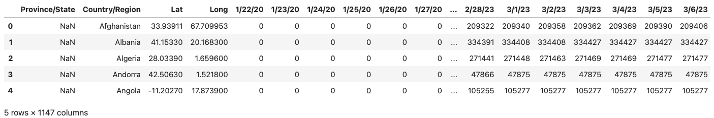
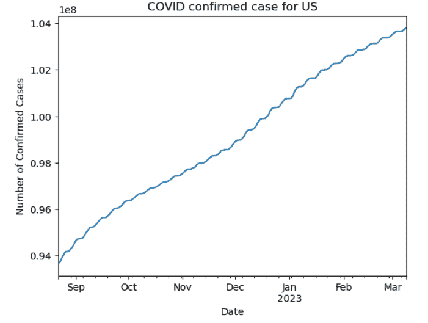
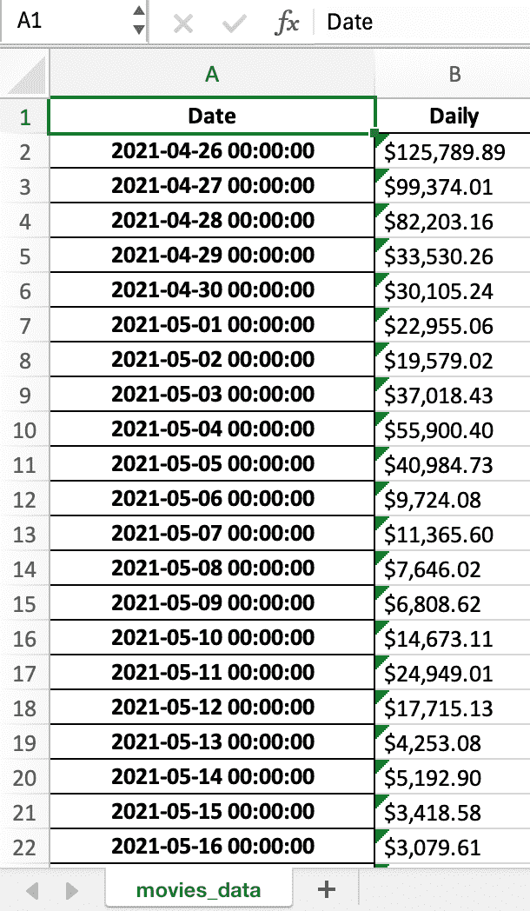
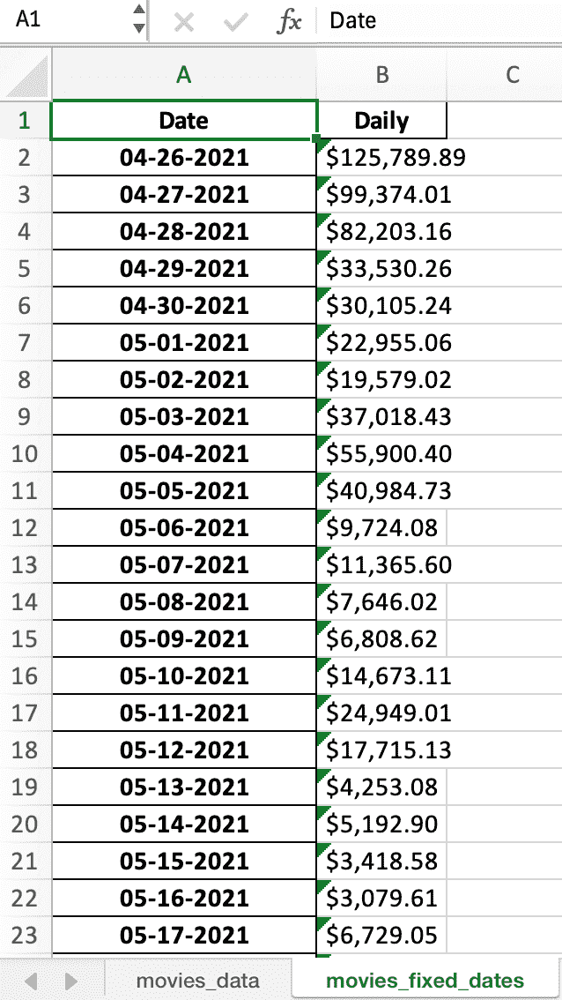
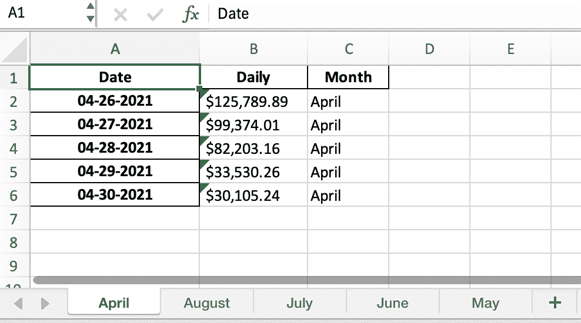
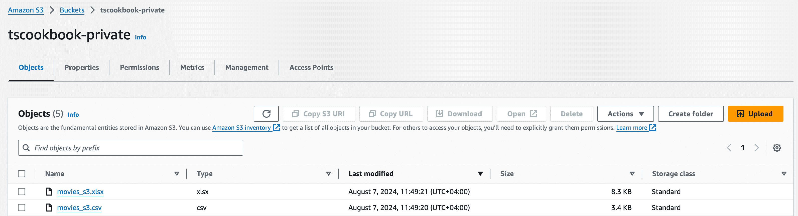
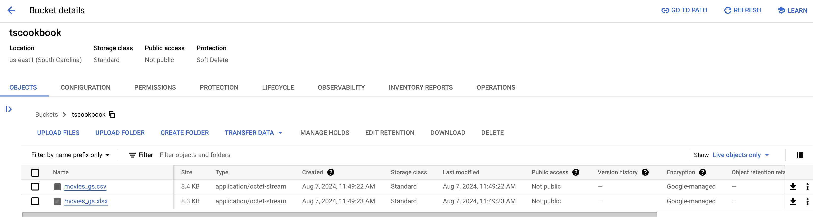
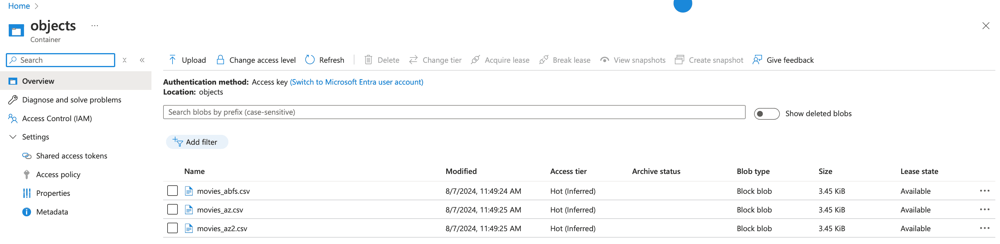

# 第四章：4 将时间序列数据持久化到文件

## 加入我们的书籍社区，访问 Discord


[`packt.link/zmkOY`](https://packt.link/zmkOY)

在本章中，你将使用**pandas**库将你的**时间序列 DataFrame**持久化到不同的文件格式中，如**CSV**、**Excel**、**Parquet**和**pickle**文件。在对 DataFrame 进行分析或数据转换时，实际上是利用了 pandas 的内存分析能力，提供了极好的性能。然而，内存中的数据意味着它很容易丢失，因为它尚未被持久化到磁盘存储中。

在处理 DataFrame 时，你需要持久化数据以便将来取回、创建备份或与他人共享数据。**pandas**库附带了一套丰富的写入函数，可以将内存中的 DataFrame（或系列）持久化到磁盘上的不同文件格式中。这些写入函数使你能够将数据存储到本地驱动器或远程服务器位置，例如云存储文件系统，包括**Google Drive**、**AWS S3**、**Azure Blob Storage**和**Dropbox**。

在本章中，你将探索将数据写入不同的文件格式（本地存储）和云存储位置，如 Amazon Web Services（AWS）、Google Cloud 和 Azure。

以下是本章将涵盖的食谱：

+   使用`pickle`进行时间序列数据序列化

+   写入 CSV 和其他分隔符文件

+   写入 Excel 文件

+   将数据存储到云存储（AWS、GCP 和 Azure）

+   写入大规模数据集

### 技术要求

在本章及之后的内容中，我们将广泛使用 pandas 2.2.2 版本（2023 年 4 月 10 日发布）。

在整个过程中，你将安装多个 Python 库，以与 pandas 协同工作。这些库在每个食谱的*准备工作*部分中都有突出说明。你还可以从 GitHub 仓库下载 Jupyter 笔记本（[`github.com/PacktPublishing/Time-Series-Analysis-with-Python-Cookbook`](https://github.com/PacktPublishing/Time-Series-Analysis-with-Python-Cookbook)）来跟随学习。你可以在这里下载本章使用的数据集：[`github.com/PacktPublishing/Time-Series-Analysis-with-Python-Cookbook./tree/main/datasets/Ch4`](https://github.com/PacktPublishing/Time-Series-Analysis-with-Python-Cookbook./tree/main/datasets/Ch4)

## 使用 pickle 序列化时间序列数据

在 Python 中处理数据时，你可能希望将 Python 数据结构或对象（如 pandas DataFrame）持久化到磁盘，而不是将其保留在内存中。一个方法是将数据序列化为字节流，以便将其存储在文件中。在 Python 中，**pickle**模块是一种常见的对象序列化与反序列化方法（序列化的反过程），也被称为*pickling*（序列化）和*unpickling*（反序列化）。

#### 准备工作

`pickle`模块是 Python 自带的，因此无需额外安装。

在这个食谱中，我们将探索两种常见的序列化数据的方法，这些方法通常被称为**pickling**。

你将使用由*约翰·霍普金斯大学*的*系统科学与工程中心（CSSE）*提供的 COVID-19 数据集，你可以从官方 GitHub 仓库下载该数据集，链接为：[`github.com/CSSEGISandData/COVID-19`](https://github.com/CSSEGISandData/COVID-19)。请注意，约翰·霍普金斯大学自 2023 年 3 月 10 日起不再更新该数据集。

#### 如何实现…

你将使用 pandas 的`DataFrame.to_pickle()`函数将数据写入**pickle**文件，然后使用`pickle`库直接探索另一种选择。

##### 使用 pandas 写入 pickle 文件

你将从读取 COVID-19 时间序列数据到 DataFrame 开始，进行一些转换，然后将结果持久化到`pickle`文件中，以便未来分析。这应该类似于持久化仍在进行中的数据（就分析而言）的一种典型场景：

1.  首先，让我们将 CSV 数据加载到 pandas DataFrame 中：

```py
import pandas as pd
from pathlib import Path
file = \
Path('../../datasets/Ch4/time_series_covid19_confirmed_global.csv')
df = pd.read_csv(file)
df.head()
```

上述代码将显示 DataFrame 的前五行：



图 4.1：COVID-19 全球确诊病例的前五行

你可以从输出中观察到，这是一个宽格式 DataFrame，共有 1147 列，每列代表一个数据收集日期，从**1/22/20**到**3/9/23**。

1.  假设分析的一部分是聚焦于美国，并且只使用 2021 年夏季（6 月、7 月、8 月和 9 月）收集的数据。你将通过应用必要的过滤器转换 DataFrame，然后将数据反向旋转，使日期显示在行中而不是列中（从宽格式转换为长格式）：

```py
# filter data where Country is United States
df_usa = df[df['Country/Region'] == 'US']
# filter columns from June to end of September
df_usa_summer = df_usa.loc[:, '6/1/21':'9/30/21']
# unpivot using pd.melt()
df_usa_summer_unpivoted = \
    pd.melt(df_usa_summer,
            value_vars=df_usa_summer.columns,
            value_name='cases',
            var_name='date').set_index('date')
df_usa_summer_unpivoted.index = \
    pd.to_datetime(df_usa_summer_unpivoted.index, format="%m/%d/%y")
```

1.  检查`df_usa_summer_unpivoted` DataFrame 并打印前五条记录：

```py
df_usa_summer_unpivoted.info()
>>
<class 'pandas.core.frame.DataFrame'>
DatetimeIndex: 122 entries, 2021-06-01 to 2021-09-30
Data columns (total 1 columns):
 #   Column  Non-Null Count  Dtype
---  ------  --------------  -----
 0   cases   122 non-null    int64
dtypes: int64(1)
memory usage: 1.9 KB
df_usa_summer_unpivoted.head()
>>
               cases
date               
2021-06-01  33407540
2021-06-02  33424131
2021-06-03  33442100
2021-06-04  33459613
2021-06-05  33474770
```

你已对数据集进行了筛选，并将其从宽格式的 DataFrame 转换为长格式的时间序列 DataFrame。

1.  假设你现在对数据集已经满意，准备将数据集进行 pickling（序列化）。你将使用`DataFrame.to_pickle()`函数将 DataFrame 写入`covid_usa_summer_2020.pkl`文件：

```py
output = \
Path('../../datasets/Ch4/covid_usa_summer_2021.pkl')
df_usa_summer_unpivoted.to_pickle(output)
```

Pickling 保留了 DataFrame 的结构。当你再次加载 pickle 数据时（反序列化），你将恢复 DataFrame 的原始结构，例如，带有`DatetimeIndex`类型。

1.  使用`pandas.read_pickle()`读取 pickle 文件并检查 DataFrame：

```py
unpickled_df = pd.read_pickle(output)
unpickled_df.info()
>>
<class 'pandas.core.frame.DataFrame'>
DatetimeIndex: 122 entries, 2021-06-01 to 2021-09-30
Data columns (total 1 columns):
 #   Column  Non-Null Count  Dtype
---  ------  --------------  -----
 0   cases   122 non-null    int64
dtypes: int64(1)
memory usage: 1.9 KB
```

从之前的示例中，你能够使用`pandas.read_pickle()`反序列化数据到 DataFrame 中，并保留之前所做的所有转换和数据类型。

##### 使用 pickle 库写入 pickle 文件

Python 自带**pickle**库，你可以导入并使用它来序列化（pickle）对象，使用`dump`（写入）和`load`（读取）。在接下来的步骤中，你将使用`pickle.dump()`和`pickle.load()`来序列化并反序列化`df_usa_summer_unpivoted` DataFrame。

1.  导入`pickle`库：

```py
import pickle
```

1.  然后，您可以使用 `dump()` 方法将 `df_usa_summer_unpivoted` DataFrame 持久化：

```py
file_path = \
Path('../../datasets/Ch4/covid_usa_summer_2021_v2.pkl')
with open(file_path, "wb") as file:
    pickle.dump(df_usa_summer_unpivoted, file)
```

请注意，使用的模式是 `“wb”`，因为我们是以二进制模式写入（以原始字节写入）。

1.  您可以使用 `load()` 方法读取文件并检查 DataFrame。请注意，在以下代码中，导入的对象是一个 pandas DataFrame，尽管您使用的是 `pickle.load()` 而不是 `Pandas.read_pickle()`。这是因为 pickling 保留了模式和数据结构：

```py
with open(file_path, "rb") as file:
    df = pickle.load(file)
type(df)
>>
pandas.core.frame.DataFrame
```

请注意，使用的模式是 `“rb”`，因为我们是以二进制模式读取（作为原始字节读取）。

#### 它是如何工作的……

在 Python 中，Pickling 是将任何 Python 对象序列化的过程。更具体地说，它使用一种二进制序列化协议将对象转换为二进制信息，这是一种不可人类读取的格式。该协议允许我们重新构建（反序列化）被 pickle 的文件（二进制格式），使其恢复到原始内容而不丢失宝贵的信息。如前面的示例所示，我们确认时间序列 DataFrame 在重新构建（反序列化）时，能够恢复到其精确的形式（模式）。

pandas 的 `DataFrame.to_pickle()` 函数有两个额外的参数，重要的是需要了解第一个参数是 `compression`，该参数在其他写入函数中也可用，如 `to_csv()`、`to_json()` 和 `to_parquet()` 等。

在 `DataFrame.to_pickle()` 函数的情况下，默认的压缩值设置为 `infer`，这让 pandas 根据提供的文件扩展名来确定使用哪种压缩模式。在前面的示例中，我们使用了 `DataFrame.to_pickle(output)`，其中 `output` 被定义为 `.pkl` 文件扩展名，如 `covid_usa_summer_2020.pkl`。如果将其更改为 `covid_usa_summer_2020.zip`，则输出将是存储在 ZIP 格式中的压缩二进制序列化文件。您可以尝试以下示例：

```py
zip_output =\
Path('../../datasets/Ch4/covid_usa_summer_2021.zip')
# Write the Dataframe
df_usa_summer_unpivoted.to_pickle(zip_output)
# Read the Dataframe
pd.read_pickle(zip_output)
```

其他支持的压缩模式包括 **gzip**、**bz2**、**tar** 和 **xz**。

第二个参数是 **protocol**。默认情况下，`DataFrame.to_pickle()` 写入函数使用最高协议，截至本文编写时，该协议设置为 5。根据 Pickle 文档，当进行 pickle 时，有六个（6）不同的协议可供选择，从协议版本 0 到最新的协议版本 5。

在 pandas 之外，您可以使用以下命令检查最高协议配置是什么：

```py
pickle.HIGHEST_PROTOCOL
>> 5
```

同样，默认情况下，`pickle.dump()` 使用 `HIGHEST_PROTOCOL` 值，如果没有提供其他值的话。该构造如下所示：

```py
with open(output, "wb") as file:
    pickle.dump(df_usa_summer_unpivoted,
                file,
                pickle.HIGHEST_PROTOCOL)
with open(output, "wb") as file:
    pickle.dump(df_usa_summer_unpivoted,
                file,
                5)
```

前面两个代码片段是等效的。

#### 还有更多……

Pickling（二进制序列化方法）的一个优点是我们几乎可以 pickle 大多数 Python 对象，无论是 Python 字典、机器学习模型、Python 函数，还是更复杂的数据结构，如 pandas DataFrame。然而，某些对象（如 lambda 和嵌套函数）存在一些限制。

让我们来看一下如何将一个函数及其输出进行序列化。你将创建一个`covid_by_country`函数，该函数需要三个参数：*要读取的 CSV 文件*、*回溯的天数*和*国家*。该函数将返回一个时间序列 DataFrame。接着你将对函数、函数的输出以及其图形进行序列化：

```py
def covid_by_country(file, days, country):
    ts = pd.read_csv(file)
    ts = ts[ts['Country/Region'] == country]
    final = ts.iloc[:, -days:].sum()
    final.index = pd.to_datetime(final.index,
                                format="%m/%d/%y")
    return final
file = \
Path('../../datasets/Ch4/time_series_covid19_confirmed_global.csv')
us_past_120_days = covid_by_country(file, 200, 'US')
plot_example = \
us_past_120_days.plot(title=f'COVID confirmed case for US',
                xlabel='Date',
                ylabel='Number of Confirmed Cases');
```

该函数将输出以下图形：



图 4.：– covid_by_country 函数的输出

在将对象序列化之前，你可以通过添加额外的信息来进一步增强内容，以提醒你内容的含义。在以下代码中，你将序列化函数以及返回的 DataFrame，并使用 Python 字典封装附加信息（称为**元数据**）：

```py
from datetime import datetime
metadata = {
    'date': datetime.now(),
    'data': '''
        COVID-19 Data Repository by the
        Center for Systems Science and Engineering (CSSE)
        at Johns Hopkins University'
        ''',
    'author': 'Tarek Atwan',
    'version': 1.0,
    'function': covid_by_country,
    'example_code' : us_past_120_days,
    'example_code_plot': plot_example
}
file_path = Path('../../datasets/Ch4/covid_data.pkl')
with open(file_path, 'wb') as file:
    pickle.dump(metadata, file)
```

为了更好地理解它是如何工作的，你可以加载内容并使用`pickle.load()`进行反序列化：

```py
with open(output, 'rb') as file:
    content = pickle.load(file)
content.keys()
>>
dict_keys(['date', 'data', 'author', 'version', 'function', 'example_df', 'example_plot'])
```

你可以按照以下代码检索并使用该函数：

```py
file_path =\
Path('../../datasets/Ch4/time_series_covid19_confirmed_global.csv')
loaded_func = content['function']
loaded_func(file_path, 120, 'China').tail()
>>
2023-03-05    4903524
2023-03-06    4903524
2023-03-07    4903524
2023-03-08    4903524
2023-03-09    4903524
dtype: int64
```

你也可以检索之前为美国存储的 DataFrame：

```py
loaded_df = content['example_df']
loaded_df.tail()
>>
2023-03-05    103646975
2023-03-06    103655539
2023-03-07    103690910
2023-03-08    103755771
2023-03-09    103802702
dtype: int64
```

你也可以加载你刚刚存储的图形视图。以下代码将展示类似于*图 4.2*中的图形：

```py
loaded_plot = content['example_plot']
loaded_plot.get_figure()
```

上述示例展示了序列化如何有助于存储对象及附加的**元数据**信息。这在存储一个正在进行的工作或执行多个实验并希望跟踪它们及其结果时非常有用。在机器学习实验中也可以采用类似的方法，因为你可以存储模型及与实验和其输出相关的任何信息。

#### 另见

+   有关`Pandas.DataFrame.to_pickle`的更多信息，请访问此页面：[`pandas.pydata.org/pandas-docs/stable/reference/api/pandas.DataFrame.to_pickle.html`](https://pandas.pydata.org/pandas-docs/stable/reference/api/pandas.DataFrame.to_pickle.html)。

+   有关 Python Pickle 模块的更多信息，请访问此页面：[`docs.python.org/3/library/pickle.html`](https://docs.python.org/3/library/pickle.html)。

## 写入 CSV 及其他分隔符文件

在本例中，你将导出一个 DataFrame 为 CSV 文件，并利用`DataFrame.to_csv()`写入函数中的不同参数。

### 准备工作

该文件已提供在本书的 GitHub 代码库中，你可以在这里找到：[`github.com/PacktPublishing/Time-Series-Analysis-with-Python-Cookbook`](https://github.com/PacktPublishing/Time-Series-Analysis-with-Python-Cookbook)。你将使用的文件名为`movieboxoffice.csv`，首先读取该文件以创建你的 DataFrame。

为了准备本例，你将使用以下代码将文件读取为一个 DataFrame：

```py
import pandas as pd
from pathlib import Path
filepath = Path('../../datasets/Ch4/movieboxoffice.csv')
movies = pd.read_csv(filepath,
                 header=0,
                 parse_dates=[0],
                 index_col=0,
                 usecols=['Date',
                          'Daily'],
                date_format="%d-%b-%y")
movies.info()
>>
<class 'pandas.core.frame.DataFrame'>
DatetimeIndex: 128 entries, 2021-04-26 to 2021-08-31
Data columns (total 1 columns):
 #   Column  Non-Null Count  Dtype
---  ------  --------------  -----
 0   Daily   128 non-null    object
dtypes: object(1)
memory usage: 2.0+ KB
```

你现在有了一个以`DatetimeIndex`为索引的时间序列 DataFrame。

### 如何做……

使用 pandas 将 DataFrame 写入 CSV 文件非常简单。DataFrame 对象可以访问许多写入方法，如 `.to_csv`，你将在接下来的步骤中使用这个方法：

1.  你将使用 pandas DataFrame 写入方法来将 DataFrame 持久化为 CSV 文件。该方法有多个参数，但至少你需要传递文件路径和文件名：

```py
output = Path('../../datasets/Ch4/df_movies.csv')
movies.to_csv(output)
```

默认情况下，创建的 CSV 文件是 **逗号分隔的**。

1.  要更改分隔符，可以使用 `sep` 参数并传入不同的参数。在以下代码中，你将创建一个管道符 `(|)` 分隔的文件：

```py
output = Path('../../datasets/Ch4/piped_df_movies.csv')
movies.to_csv(output, sep='|')
```

1.  读取管道分隔的文件并检查生成的 DataFrame 对象：

```py
movies_df = pd.read_csv(output, sep='|')
movies_df.info()
>>
<class 'pandas.core.frame.DataFrame'>
RangeIndex: 128 entries, 0 to 127
Data columns (total 2 columns):
 #   Column  Non-Null Count  Dtype
---  ------  --------------  -----
 0   Date    128 non-null    object
 1   Daily   128 non-null    object
dtypes: object(2)
memory usage: 2.1+ KB
```

从上面的输出可以看出，读取 CSV 文件时丢失了一些信息。例如，原始 DataFrame “`movies`” 中的 `Date` 列实际上不是列，而是 `DatetimeIndex` 类型的索引。当前的 DataFrame “`movies_df`” 并没有 `DatetimeIndex` 类型的索引（现在的索引是 `RangeIndex` 类型，仅为行号的范围）。这意味着你需要配置 `read_csv()` 函数并传递必要的参数，以便正确解析文件（这与读取 **pickle** 文件的情况不同，正如前面的示例中所演示的，*使用 pickle 序列化时间序列数据*）。

一般来说，CSV 文件格式不会保留索引类型或列数据类型信息。

### 它是如何工作的……

`DataFrame.to_csv()` 的默认行为是根据默认的 `sep` 参数（默认为 `","`）写入一个 **逗号分隔的** CSV 文件。你可以通过传递不同的分隔符来覆盖这个默认行为，例如制表符 `("\t")`、管道符 `("|")` 或分号 `(";")`。

以下代码展示了不同 **分隔符** 及其表示方式：

```py
# tab "\t"
Date    DOW Daily   Avg To Date Day Estimated
2019-04-26  Friday  157461641   33775   157461641   1   False
2019-04-27  Saturday    109264122   23437   266725763   2   False
2019-04-28  Sunday  90389244    19388   357115007   3   False
# comma ","
Date,DOW,Daily,Avg,To Date,Day,Estimated
2019-04-26,Friday,157461641,33775,157461641,1,False
2019-04-27,Saturday,109264122,23437,266725763,2,False
2019-04-28,Sunday,90389244,19388,357115007,3,False
# semicolon ";"
Date;DOW;Daily;Avg;To Date;Day;Estimated
2019-04-26;Friday;157461641;33775;157461641;1;False
2019-04-27;Saturday;109264122;23437;266725763;2;False
2019-04-28;Sunday;90389244;19388;357115007;3;False
# pipe "|"
Date|DOW|Daily|Avg|To Date|Day|Estimated
2019-04-26|Friday|157461641|33775|157461641|1|False
2019-04-27|Saturday|109264122|23437|266725763|2|False
2019-04-28|Sunday|90389244|19388|357115007|3|False
```

### 还有更多内容……

注意，在上面的示例中，逗号分隔的字符串值没有被双引号（`""`）包围。如果我们的字符串对象包含逗号（`,`）并且我们将其写入逗号分隔的 CSV 文件，会发生什么呢？让我们看看 pandas 如何处理这个场景。

在以下代码中，我们将创建一个 `person` DataFrame：

```py
import pandas as pd
person = pd.DataFrame({
     'name': ['Bond, James', 'Smith, James', 'Bacon, Kevin'],
     'location': ['Los Angeles, CA', 'Phoenix, AZ', 'New York, NY'],
     'net_worth': [10000, 9000, 8000]
    })
print(person)
>>
           name         location  net_worth
0   Bond, James  Los Angeles, CA      10000
1  Smith, James      Phoenix, AZ       9000
2  Bacon, Kevin     New York, NY       8000
```

现在，将 DataFrame 导出为 CSV 文件。你将指定 `index=False` 来忽略导出的索引（行号）：

```py
person.to_csv('person_a.csv', index=False)
```

如果你检查 `person_a.csv` 文件，你会看到以下表示方式（注意 pandas 添加的双引号）：

```py
name,location,net_worth
"Bond, James","Los Angeles, CA",10000
"Smith, James","Phoenix, AZ",9000
"Bacon, Kevin","New York, NY",8000
```

`to_csv()` 函数有一个 `quoting` 参数，默认值为 `csv.QUOTE_MINIMAL`。这个默认值来自 Python 的 `csv` 模块，它是 Python 安装的一部分。`QUOTE_MINIMAL` 参数只会为包含特殊字符的字段加上引号，例如逗号（`","`）。

`csv` 模块提供了四个常量，我们可以将它们作为参数传递给 `to_csv()` 函数中的 `quoting` 参数。这些常量包括以下内容：

+   `csv.QUOTE_ALL`：为所有字段加上引号，无论是数字型还是非数字型

+   `csv.QUOTE_MINIMAL`：`to_csv()`函数中的默认选项，用于引用包含特殊字符的值。

+   `csv.QUOTE_NONNUMERIC`：引用所有非数字字段

+   `csv.QUOTE_NONE`：不引用任何字段

为了更好地理解这些值如何影响输出的 CSV，你将在以下示例中测试传递不同的引用参数。这是通过使用`person` DataFrame 来完成的：

```py
import csv
person.to_csv('person_b.csv',
               index=False,
               quoting=csv.QUOTE_ALL)
person.to_csv('person_c.csv',
               index=False,
               quoting=csv.QUOTE_MINIMAL)
person.to_csv('person_d.csv',
               index=False,
               quoting= csv.QUOTE_NONNUMERIC)
person.to_csv('person_e.csv',
               index=False,
               quoting= csv.QUOTE_NONE, escapechar='\t')
```

现在，如果你打开并检查这些文件，你应该能看到以下表示：

```py
person_b.csv
"name","location","net_worth"
"Bond, James","Los Angeles, CA","10000"
"Smith, James","Phoenix, AZ","9000"
"Bacon, Kevin","New York, NY","8000"
person_c.csv
name,location,net_worth
"Bond, James","Los Angeles, CA",10000
"Smith, James","Phoenix, AZ",9000
"Bacon, Kevin","New York, NY",8000
person_d.csv
"name","location","net_worth"
"Bond, James","Los Angeles, CA",10000
"Smith, James","Phoenix, AZ",9000
"Bacon, Kevin","New York, NY",8000
person_e.csv
name,location,net_worth
Bond, James,Los Angeles , CA,10000
Smith, James,Phoenix , AZ,9000
Bacon, Kevin,New York, NY,8000
```

注意，在前面的示例中，使用`csv.QUOTE_NONE`时，你必须为`escapechar`参数提供额外的参数，否则会抛出错误。

### 另见

+   欲了解更多关于`Pandas.DataFrame.to_csv()`函数的信息，请参考此页面：[`pandas.pydata.org/docs/reference/api/pandas.DataFrame.to_csv.html`](https://pandas.pydata.org/docs/reference/api/pandas.DataFrame.to_csv.html)。

+   欲了解更多关于 CSV 模块的信息，请参考此页面：[`docs.python.org/3/library/csv.html`](https://docs.python.org/3/library/csv.html)。

## 将数据写入 Excel 文件

在本配方中，你将把 DataFrame 导出为 Excel 文件格式，并利用`DataFrame.to_excel()`写入函数中可用的不同参数。

### 准备工作

在*第二章*的*从 Excel 文件读取数据*配方中，你需要安装`openpyxl`作为使用`pandas.read_excel()`读取 Excel 文件的引擎。在本配方中，你将使用相同的`openpyxl`作为使用`DataFrame.to_excel()`写入 Excel 文件的引擎。

要使用`conda`安装`openpyxl`，请运行以下命令：

```py
>>> conda install openpyxl
```

你也可以使用`pip`：

```py
>>> pip install openpyxl
```

该文件已提供在本书的 GitHub 仓库中，你可以在这里找到：[`github.com/PacktPublishing/Time-Series-Analysis-with-Python-Cookbook`](https://github.com/PacktPublishing/Time-Series-Analysis-with-Python-Cookbook)。文件名为`movieboxoffice.csv`。

为了准备这个配方，你将使用以下代码将文件读取到一个 DataFrame 中：

```py
import pandas as pd
from pathlib import Path
filepath = Path('../../datasets/Ch4/movieboxoffice.csv')
movies = pd.read_csv(filepath,
                 header=0,
                 parse_dates=[0],
                 index_col=0,
                 usecols=['Date',
                          'Daily'],
                date_format="%d-%b-%y")
```

### 如何操作…

要将 DataFrame 写入 Excel 文件，你需要提供包含`filename`和`sheet_name`参数的写入函数。文件名包含文件路径和名称。确保文件扩展名为`.xlsx`，因为你使用的是 openpyxl。

`DataFrame.to_excel()`方法将根据文件扩展名来决定使用哪个引擎，例如`.xlsx`或`.xls`。你也可以通过`engine`参数明确指定使用的引擎，示例如下：

1.  确定文件输出的位置，并将文件路径、所需的工作表名称以及引擎传递给`DataFrame.to_excel()`写入函数：

```py
output = \
Path('../../datasets/Ch4/daily_boxoffice.xlsx')
movies.to_excel(output,
               sheet_name='movies_data',
               engine='openpyxl', # default engine for xlsx files
               index=True)
```

前面的代码将在指定位置创建一个新的 Excel 文件。你可以打开并检查该文件，如下图所示：



图 4.3：来自 daily_boxoffice.xlsx 文件的示例输出

注意，工作表名称是`movies_data`。在 Excel 文件中，你会注意到`Date`列的格式与预期的不符。假设预期`Date`列是一个特定格式，比如`MM-DD-YYYY`。

> 使用`read_excel`读取相同文件将正确读取`Date`列，符合预期。

1.  为了实现这一点，你将使用另一个由 pandas 提供的类，`pandas.ExcelWriter`类为我们提供了两个用于日期格式化的属性：`datetime_format`和`date_format`。这两个参数在使用`xlsxwriter`引擎时效果很好，但截至目前，openpyxl 集成存在一个已知的 bug。openpyxl 相较于 xlsxwriter 有几个优势，尤其是在追加现有 Excel 文件时。我们将利用 openpyxl 的`number_format`属性来修复这个问题。以下代码展示了如何实现这一点：

```py
date_col = 'Date'
with pd.ExcelWriter(output, 
                    engine='openpyxl',
                    mode='a',
                    if_sheet_exists='replace') as writer:
    movies.to_excel(writer, sheet_name='movies_fixed_dates', index=True)

    worksheet = writer.sheets['movies_fixed_dates']
    for col in worksheet.iter_cols():
        header = col[0] # capture headers
        if header.value == date_col:
            for row in range(2, # skip first row
                             worksheet.max_row+1):
                    worksheet.cell(
                        row,
                        header.column
                                  ).number_format='MM-DD-YYYY'
```

以下是新输出的表现形式。这是通过将`MM-DD-YYYY`传递给`writer`对象的`datetime_format`属性实现的：



图 4.4：使用 pd.ExcelWriter 和 number_format 将 Date 列格式更新为 MM-DD-YYYY

### 它是如何工作的……

`DataFrame.to_excel()`方法默认会创建一个新的 Excel 文件（如果文件不存在）或覆盖文件（如果文件已存在）。要向现有的 Excel 文件追加内容或写入多个工作表，你需要使用`Pandas.ExcelWriter`类。`ExcelWriter()`类有一个`mode`参数，可以接受`"w"`（写入）或`"a"`（追加）。截至目前，xlsxwriter 不支持追加模式，而 openpyxl 支持两种模式。

请记住，在`ExcelWriter`中，默认模式设置为`"w"`（写入模式），因此，如果未指定`"a"`（追加模式），将导致覆盖 Excel 文件（任何现有内容将被删除）。

此外，在使用追加模式（`mode="a"`）时，你需要通过`if_sheet_exists`参数指定如何处理现有的工作表，该参数接受以下三种值之一：

+   `error`，会引发`ValueError`异常。

+   `replace`，它会覆盖现有的工作表。

+   `new`，创建一个具有新名称的新工作表。如果重新执行前面的代码并更新`if_sheet_exists='new'`，那么将创建一个新的工作表并命名为`movies_fixed_dates1`。

### 还有更多……

如果你需要在同一个 Excel 文件中创建多个工作表，那么`ExcelWriter`可以帮助实现这一目标。例如，假设目标是将每个月的数据分开到自己的工作表中，并按月命名工作表。在下面的代码中，你将添加一个`Month`列并使用它按月拆分 DataFrame，使用`groupby`将每个组写入一个新工作表。

首先，让我们创建辅助函数`sheet_date_format`，将每个工作表中的`Date`列格式化为 MM-DD-YYYY 格式：

```py
def sheet_date_format(sheet_name, writer, date_col):
    worksheet = writer.sheets[sheet_name]

    for col in worksheet.iter_cols():
        header = col[0]
        if header.value == date_col:
            for row in range(2, worksheet.max_row+1):
                    worksheet.cell(
                        row,
                        header.column).number_format='MM-DD-YYYY'
```

接下来的代码将向 movies DataFrame 添加一个“Month”列，然后将每个月的数据写入独立的工作表，并为每个工作表命名为相应的月份名称：

```py
movies['Month'] = movies.index.month_name()
output = Path('../../datasets/Ch4/boxoffice_by_month.xlsx')
with pd.ExcelWriter(output,
                    engine='openpyxl') as writer:
    for month, data in movies.groupby('Month'):
        data.to_excel(writer, sheet_name=month)
        sheet_date_format(month, writer, date_col='Date')
```

上面的代码将创建一个名为`boxoffice_by_month.xlsx`的新 Excel 文件，并为每个月创建五个工作表，如下图所示：



图 4.5：movies DataFrame 中的每个月都被写入到各自的 Excel 工作表中

### 另见

pandas 的`to_excel()`方法和`ExcelWriter`类使将 DataFrame 写入 Excel 文件变得非常方便。如果您需要对 pandas DataFrame 以外的部分进行更精细的控制，您应该考虑使用已安装的`openpyxl`库作为读取/写入引擎。例如，`openpyxl`库有一个用于处理 pandas DataFrame 的模块（`openpyxl.utils.dataframe`）。一个例子是`dataframe_to_rows()`函数。

+   要了解更多关于`Pandas.DataFrame.to_excel()`的信息，请参考[`pandas.pydata.org/pandas-docs/stable/reference/api/pandas.DataFrame.to_excel.html`](https://pandas.pydata.org/pandas-docs/stable/reference/api/pandas.DataFrame.to_excel.html)。

+   要了解更多关于`Pandas.ExcelWriter()`的信息，请参考[`pandas.pydata.org/pandas-docs/stable/reference/api/pandas.ExcelWriter.html#pandas.ExcelWriter.`](https://pandas.pydata.org/pandas-docs/stable/reference/api/pandas.ExcelWriter.html#pandas.ExcelWriter.)

+   要了解更多关于`openpyxl`的信息，请参考`openpyxl.readthedocs.io/en/stable/index.html`。

+   要了解更多关于`openpyxl.utils.dataframe`的信息，请参考[`openpyxl.readthedocs.io/en/stable/pandas.html#working-with-pandas-dataframes`](https://openpyxl.readthedocs.io/en/stable/pandas.html#working-with-pandas-dataframes)

## 将数据存储到云存储（AWS、GCP 和 Azure）

在本教程中，您将使用 pandas 将数据写入云存储，如 Amazon S3、Google Cloud Storage 和 Azure Blob Storage。多个 pandas 写入函数支持通过`storage_options`参数将数据写入云存储。

### 准备工作

在*第二章*的“从 URL 读取数据”中，您被要求安装`boto3`和`s3fs`来从 AWS S3 桶读取数据。在本教程中，除了需要的 Google Cloud Storage（`gcsfs`）和 Azure Blob Storage（`adlfs`）库外，您还将使用相同的库。

使用`pip`安装，您可以使用以下命令：

```py
>>> pip install boto3 s3fs
>>> pip install google-cloud-storage gcsfs
>>> pip install adlfs azure-storage-blob azure-identity
```

使用`conda`安装，您可以使用以下命令：

```py
>>> conda install -c conda-forge boto3 s3fs -y
>>> conda install -c conda-forge google-cloud-storage gcsfs -y
>>> conda install -c conda-forge adlfs azure-storage-blob azure-identity -y
```

您将使用我们在前一个教程中创建的`boxoffice_by_month.xlsx`文件，*将数据写入 Excel 文件*。该文件可在本书的 GitHub 仓库中找到，链接如下：[`github.com/PacktPublishing/Time-Series-Analysis-with-Python-Cookbook`](https://github.com/PacktPublishing/Time-Series-Analysis-with-Python-Cookbook)。

为了准备这个操作，你将使用以下代码将文件读取到一个 DataFrame 中：

```py
import pandas as pd
from pathlib import Path
source = "../../datasets/Ch4/boxoffice_by_month.xlsx"
movies = pd.concat(pd.read_excel(source,
             sheet_name=None,
             index_col='Date',
             parse_dates=True)).droplevel(0)
print(movies.head())
                   Daily  Month
Date                           
2021-04-26   $125,789.89   April
2021-04-27    $99,374.01   April
2021-04-28    $82,203.16   April
2021-04-29    $33,530.26   April
2021-04-30    $30,105.24   April
```

请注意，movie DataFrame 有两列（Daily 和 Month），并且有一个 DatetimeIndex（Date）。

接下来，你将把 AWS、Google Cloud 和 Azure 的凭证存储在 Python 脚本外部的`cloud.cfg`配置文件中。然后，使用`configparser`读取并将值存储在 Python 变量中。你不希望将凭证暴露或硬编码在代码中：

```py
# Example of configuration file "cloud.cfg file"
[AWS]
aws_access_key=<your_access_key>
aws_secret_key=<your_secret_key>
[GCP]
key_file_path=<GCPKeyFileexample.json>
[AZURE]
storage_account_key=<your_storageaccount_key>
```

然后，我们可以使用`config.read()`加载`aws.cfg`文件：

```py
import configparser
config = configparser.ConfigParser()
config.read('cloud.cfg')
AWS_ACCESS_KEY = config['AWS']['aws_access_key']
AWS_SECRET_KEY = config['AWS']['aws_secret_key']
AZURE_ACCOUNT_KEY = config['AZURE']['storage_account_key']
GCP_KEY_FILE = config['GCP']['key_file_path']
```

### 如何实现…

多个 pandas 写入函数支持直接写入远程或云存储文件系统，例如 AWS 的`s3://`、Google 的`gs://`以及 Azure 的`abfs://`和`az://`协议。这些写入函数提供了`storage_options`参数，支持与远程文件存储系统的协作。这部分得益于 pandas 使用`fsspec`来处理非 HTTP(s)的系统 URL，例如每个云存储专用的 URL。对于每个云存储，你需要使用特定的文件系统实现，例如，AWS S3 使用`s3fs`，Google Cloud 使用`gcsfs`，Azure 使用`adlfs`。

`storage_options`参数接受一个 Python 字典，用于提供附加信息，如凭证、令牌或云提供商要求的任何信息，以键值对的形式提供。

#### 使用 pandas 写入 Amazon S3

在本节中，你将使用 pandas 将`movies` DataFrame 写入`tscookbook-private` S3 桶，保存为 CSV 和 Excel 文件：

若干 pandas 写入函数，如`to_csv`、`to_parquet`和`to_excel`，允许你通过`storage_accounts`参数传递 AWS S3 特定的凭证（`key`和`sercret`），这些凭证在`s3fs`中有说明。以下代码展示了如何利用`to_csv`和`to_excel`将你的 movies DataFrame 写入`tscookbook` S3 桶，分别保存为`movies_s3.csv`和`movies_s3.xlsx`：

```py
# Writing to Amazon S3
movies.to_csv('s3://tscookbook-private/movies_s3.csv',
               storage_options={
                   'key': AWS_ACCESS_KEY,
                   'secret': AWS_SECRET_KEY
               })
movies.to_excel('s3://tscookbook-private/movies_s3.xlsx',
               storage_options={
                   'key': AWS_ACCESS_KEY,
                   'secret': AWS_SECRET_KEY
               })
```

以下图示展示了`tscookbook-private`桶的内容：



图 4.6: 使用 pandas 成功写入 AWS S3 的 movies_s3.csv 和 movie_s3.xlsx

#### 使用 pandas 写入 Google Cloud Storage

在本节中，你将使用 pandas 将`movies` DataFrame 写入 Google Cloud Storage 的`tscookbook`桶，保存为 CSV 和 Excel 文件：

在使用 Google Cloud 时，你将使用存储为 JSON 文件的**服务帐户私钥**。这个文件可以从 Google Cloud 生成并下载。在`storage_options`中，你将传递文件路径。以下代码展示了如何使用`to_csv`和`to_excel`将你的 movies DataFrame 写入`tscookbook`桶，分别保存为`movies_gs.csv`和`movies_gs.xlsx`：

```py
# Writing to Google Cloud Storage
movies.to_csv('gs://tscookbook/movies_gs.csv',
               storage_options={'token': GCP_KEY_FILE})
movies.to_excel('gs://tscookbook/movies_gs.xlsx',
               storage_options={'token': GCP_KEY_FILE})
```

以下图示展示了`tscookbook`桶的内容：



图 4.7: 使用 pandas 成功写入 Google Cloud Storage 的 movies_gs.csv 和 movie_gs.xlsx

#### 使用 pandas 向 Azure Blob 存储写入数据

在这一部分，你将使用 pandas 将`movies` DataFrame 以 CSV 文件的形式写入 Azure Blob 存储中的名为`objects`的容器：

在使用 Azure Blob 存储时，你可以使用`abfs://`或`az://`协议。在`storage_options`中，你将传递`account_key`，这是你在 Azure 存储账户中的 API 密钥。以下代码展示了如何利用`to_csv`将你的 movies DataFrame 写入`objects`容器。下面的三段代码是等效的，并展示了你需要传递的不同 URI 和`storage_options`：

```py
# Writing to Azure Blob Storage
movies.to_csv("abfs://objects@tscookbook.dfs.core.windows.net/movies_abfs.csv",
             storage_options={
                 'account_key': AZURE_ACCOUNT_KEY
             })
movies.to_csv("az://objects@tscookbook.dfs.core.windows.net/movies_az.csv",
             storage_options={
                 'account_key': AZURE_ACCOUNT_KEY
             })
movies.to_csv("az://objects/movies_az2.csv",
             storage_options={
                 'account_name': "tscookbook",
                 'account_key': AZURE_ACCOUNT_KEY
```

```py
 })
```

下图展示了`objects`容器的内容：



图 4.8：movies_abfs.csv、movies_az.csv 和 movie_az2.csv 成功写入 Azure Blob 存储，使用 pandas

### 它是如何工作的……

在前面的代码部分，我们使用了`DataFrame.to_csv()`和`DataFrame.to_excel()`方法，将数据写入 Amazon S3、Azure Blob 存储和 Google Cloud 存储。`storage_options`参数允许传递一个包含存储连接所需信息的键值对；例如，AWS S3 需要传递`key`和`secret`，GCP 需要`token`，而 Azure 需要`account_key`。

支持`storage_options`的 pandas DataFrame 写入函数示例包括：

+   `Pandas.DataFrame.to_excel()`

+   `Pandas.DataFrame.to_json()`

+   `Pandas.DataFrame.to_parquet()`

+   `Pandas.DataFrame.to_pickle()`

+   `Pandas.DataFrame.to_markdown()`

+   `Pandas.DataFrame.to_pickle()`

+   `Pandas.DataFrame.to_stata()`

+   `Pandas.DataFrame.to_xml()`

### 还有更多……

为了更细粒度的控制，你可以使用 AWS（`boto3`）、Google Cloud（`google-cloud-storage`）或 Azure（`azure-storage-blob`）的特定 Python SDK 来写入数据。

首先，我们将把我们的电影 DataFrame 存储为 CSV 格式，以便将数据上传到不同的云存储服务。

```py
data = movies.to_csv(encoding='utf-8', index=True)
```

注意，`index=True`是因为我们的日期列是索引，我们需要确保它在写入 CSV 文件时作为列被包含。

#### 使用 boto3 库向 Amazon S3 写入数据

你将探索**资源 API**和**客户端 API**。资源 API 是一个更高级的抽象，它简化了代码并与 AWS 服务的交互。与此同时，客户端 API 提供了一个低级别的抽象，允许对 AWS 服务进行更细粒度的控制。

当使用资源 API 与`boto3.resource("s3")`时，你首先需要通过提供 S3 桶名称和对象键（文件名）来创建一个对象资源。一旦定义，你将可以访问多个方法，包括`copy`、`delete`、`put`、`download_file`、`load`、`get`和`upload`等。`put`方法将把一个对象添加到定义的 S3 桶中。

使用`boto3.client("s3")`客户端 API 时，你可以访问许多 Bucket 和 Object 级别的方法，包括`create_bucket`、`delete_bucket`、`download_file`、`put_object`、`delete_object`、`get_bucket_lifecycle`、`get_bucket_location`、`list_buckets`等。`put_object`方法将把一个对象添加到定义的 S3 存储桶中。

```py
import boto3
bucket = "tscookbook-private"
# Using the Resource API
s3_resource = boto3.resource("s3",
            aws_access_key_id = AWS_ACCESS_KEY,
            aws_secret_access_key = AWS_SECRET_KEY)
s3_resource.Object(bucket, 'movies_boto3_resourceapi.csv').put(Body=data)
# Using the Client API
s3_client = boto3.client("s3",
            aws_access_key_id = AWS_ACCESS_KEY,
            aws_secret_access_key = AWS_SECRET_KEY)
s3_client.put_object(Body=data, Bucket=bucket, Key='movies_boto3_clientapi.csv')
```

#### 使用 google-cloud-storage 库写入 Google Cloud Storage

你首先需要创建一个客户端对象，这是来自存储模块的 Client 类的一个实例。你将使用服务账户的 JSON 密钥文件进行身份验证。通过`from_service_account_json`方法指定该文件。你将使用`bucket`和`blob`方法创建一个引用，指向你希望放入 Google Storage 中`tscookbook`存储桶的 blob 对象。最后，你可以使用`upload_from_string`方法将数据上传到指定的 blob 对象中。

```py
from google.cloud import storage
# Authenticate using the service account key
storage_client = storage.Client.from_service_account_json(GCP_KEY_FILE)
bucket_name = 'tscookbook'
file_path = 'movies_gsapi.csv'
blob = storage_client.bucket(bucket_name).blob(file_path)
blob.upload_from_string(data)
```

#### 使用 azure-storage-blob 库写入 Azure Blob Storage

你将首先创建一个`BlobServiceClient`对象，并使用 Azure Storage Account API 密钥进行身份验证。然后，你将使用`get_blob_client`为指定的容器创建 blob 对象，并使用`upload_blob`方法将数据上传到指定的对象中。

```py
from azure.storage.blob import BlobServiceClient
blob_service_client = BlobServiceClient(
        account_url="https://tscookbook.blob.core.windows.net",
        credential=AZURE_ACCOUNT_KEY)
blob_client = blob_service_client.get_blob_client(
    container='objects',
    blob='movies_blobapi.csv')
blob_client.upload_blob(data)
```

### 另见

若要了解更多关于如何使用 Python 管理云存储的信息，请查看这些流行库的官方文档

+   **Amazon S3 (Boto3)** [`boto3.amazonaws.com/v1/documentation/api/latest/reference/services/s3.html`](https://boto3.amazonaws.com/v1/documentation/api/latest/reference/services/s3.html)

+   **Azure Blob Storage** [`learn.microsoft.com/en-us/azure/storage/blobs/storage-quickstart-blobs-python`](https://learn.microsoft.com/en-us/azure/storage/blobs/storage-quickstart-blobs-python)

+   **Google Cloud Storage** [`cloud.google.com/python/docs/reference/storage/latest`](https://cloud.google.com/python/docs/reference/storage/latest)

## 写入大数据集

在本示例中，你将探索不同文件格式的选择如何影响整体的写入和读取性能。你将探索 Parquet、优化行列式（ORC）和 Feather，并将它们的性能与其他流行的文件格式，如 JSON 和 CSV，进行比较。

这三种文件格式 ORC、Feather 和 Parquet 是列式文件格式，适用于分析需求，并且总体上显示出更好的查询性能。这三种文件格式也得到了 Apache Arrow（PyArrow）的支持，后者提供了内存中的列式格式，优化了数据分析性能。为了将这种内存中的列式数据持久化并存储，你可以使用 pandas 的`to_orc`、`to_feather`和`to_parquet`写入函数将数据持久化到磁盘。

> Arrow 提供数据的内存表示，采用列式格式，而 Feather、ORC 和 Parquet 则允许我们将这种表示存储到磁盘中。

### 准备工作

在本示例中，您将使用来自([`www.nyc.gov/site/tlc/about/tlc-trip-record-data.page`](https://www.nyc.gov/site/tlc/about/tlc-trip-record-data.page))的纽约出租车数据集，我们将处理 2023 年的黄出租车行程记录。

在以下示例中，我们将使用这些文件之一，`yellow_tripdata_2023-01.parquet`，但您可以选择其他任何文件来跟随学习。在*第二章*的*从 Parquet 文件读取数据*示例中，您安装了**PyArrow**。以下是使用 Conda 或 Pip 安装 PyArrow 的说明。

要使用`conda`安装 PyArrow，运行以下命令：

```py
conda install -c conda-forge pyarrow
```

要使用`pip`安装 PyArrow，运行以下命令：

```py
pip install pyarrow
```

为了准备本示例，您将使用以下代码将文件读取到 DataFrame 中：

```py
import pandas as pd
from pathlib import Path
file_path = Path('yellow_tripdata_2023-01.parquet')
df = pd.read_parquet(file_path, engine='pyarrow')
df.info()
>>
<class 'pandas.core.frame.DataFrame'>
RangeIndex: 3066766 entries, 0 to 3066765
Data columns (total 19 columns):
 #   Column                 Dtype        
---  ------                 -----        
 0   VendorID               int64        
 1   tpep_pickup_datetime   datetime64[us]
 2   tpep_dropoff_datetime  datetime64[us]
 3   passenger_count        float64      
 4   trip_distance          float64      
 5   RatecodeID             float64      
 6   store_and_fwd_flag     object       
 7   PULocationID           int64        
 8   DOLocationID           int64        
 9   payment_type           int64        
 10  fare_amount            float64      
 11  extra                  float64      
 12  mta_tax                float64      
 13  tip_amount             float64      
 14  tolls_amount           float64      
 15  improvement_surcharge  float64      
 16  total_amount           float64      
 17  congestion_surcharge   float64      
 18  airport_fee            float64      
dtypes: datetime64us, float64(12), int64(4), object(1)
memory usage: 444.6+ MB
```

### 如何实现

您将把 DataFrame 写入不同的文件格式，并随后比较压缩效率（文件大小）、写入和读取速度。

为了实现这一点，您需要创建一个返回文件大小的函数：

```py
import os
def size_in_mb(file):
    size_bytes = os.path.getsize(file)
    size_m = size_bytes / (1024**2)
    return round(size_m,2)
```

该函数将获取您创建的文件并返回文件大小（单位：MB）。`os.path.getsize()`将返回文件大小（单位：字节），而`size_bytes / (1024**2)`这一行将其转换为兆字节（MB）。

我们将把这些文件写入`formats`文件夹，以便稍后可以从该文件夹读取以评估读取性能。

#### 写入为 JSON 和 CSV

您将使用`DataFrame.to_json()`方法写入一个`yellow_tripdata.json`文件：

```py
%%time
df.to_json('formats/yellow_tripdata.json', orient='records')
size_in_mb('formats/yellow_tripdata.json')
>>
CPU times: user 4.63 s, sys: 586 ms, total: 5.22 s
Wall time: 5.24 s
1165.21
```

请注意，文件大小约为 1.16 GB，耗时约为 5.24 秒。

您将使用`DataFrame.to_csv()`方法写入一个`yellow_tripdata.csv`文件：

```py
%%time
df.to_csv('formats/yellow_tripdata.csv', index=False)
size_in_mb('formats/yellow_tripdata.csv')
>>
CPU times: user 16.7 s, sys: 405 ms, total: 17.1 s
Wall time: 17.1 s
307.04
```

请注意，文件大小约为 307 MB，耗时约为 17.1 秒。

#### 写入为 Parquet

`to_parquet`写入函数支持多种压缩算法，包括`snappy`、`GZIP`、`brotli`、`LZ4`、`ZSTD`。您将使用`DataFrame.to_parquet()`方法写入三个文件，以比较`snappy`、`LZ4`和`ZSTD`压缩算法：

```py
%%time
df.to_parquet('formats/yellow_tripdata_snappy.parquet',
              compression='snappy')
size_in_mb('formats/yellow_tripdata_snappy.parquet')
>>
CPU times: user 882 ms, sys: 24.2 ms, total: 906 ms
Wall time: 802 ms
59.89
%%time
df.to_parquet('formats/yellow_tripdata_lz4.parquet',
              compression='lz4')
size_in_mb('formats/yellow_tripdata_lz4.parquet')
>>
CPU times: user 898 ms, sys: 20.4 ms, total: 918 ms
Wall time: 817 ms
59.92
%%time
df.to_parquet('formats/yellow_tripdata_zstd.parquet',
              compression='zstd')
size_in_mb('formats/yellow_tripdata_zstd.parquet')
>>
CPU times: user 946 ms, sys: 24.2 ms, total: 970 ms
Wall time: 859 ms
48.95
```

注意，三种压缩算法产生相似的压缩结果（文件大小）和速度。

#### 写入为 Feather

您将使用`DataFrame.to_feather()`方法，使用两个支持的压缩算法`LZ4`和`ZSTD`写入三个 feather 文件。最后一个文件格式将是未压缩的格式，以便进行比较：

```py
%%time
df.to_feather('formats/yellow_tripdata_uncompressed.feather', compression='uncompressed')
size_in_mb('formats/yellow_tripdata_uncompressed.feather')
>>
CPU times: user 182 ms, sys: 75.5 ms, total: 257 ms
Wall time: 291 ms
435.84
%%time
df.to_feather('formats/yellow_tripdata_lz4.feather', compression='lz4')
size_in_mb('formats/yellow_tripdata_lz4.feather')
>>
CPU times: user 654 ms, sys: 42.1 ms, total: 696 ms
Wall time: 192 ms
116.44
%%time
df.to_feather('formats/yellow_tripdata_zstd.feather', compression='zstd', compression_level=3)
size_in_mb('formats/yellow_tripdata_zstd.feather')
>>
CPU times: user 1 s, sys: 39.2 ms, total: 1.04 s
Wall time: 243 ms
61.79
```

1.  注意未压缩文件、使用 LZ4 和 ZSTD 压缩算法之间的文件大小差异。您可以进一步探索`compression_level`来找到最佳输出。总体而言，LZ4 在写入和读取（*压缩*和*解压缩*速度）上提供了出色的性能。ZSTD 算法可能提供更高的压缩比，生成更小的文件，但其速度可能不如 LZ4。

#### 写入为 ORC

类似于 Feather 和 Parquet 文件格式，ORC 支持不同的压缩算法，包括无压缩、`snappy`、`ZLIB`、`LZ4` 和 `ZSTD`。你将使用 `DataFrame.to_orc()` 方法写入三个 ORC 文件，以探索 ZSTD 和 LZ4 压缩算法，并将无压缩文件作为对比：

```py
%%time
df.to_orc('formats/yellow_tripdata_uncompressed.orc',
          engine_kwargs={'compression':'uncompressed'})
size_in_mb('formats/yellow_tripdata_uncompressed.orc')
>>
CPU times: user 989 ms, sys: 66.3 ms, total: 1.06 s
Wall time: 1.01 s
319.94
%%time
df.to_orc(' formats /yellow_tripdata_lz4.orc',
          engine_kwargs={'compression':'lz4'})
size_in_mb('formats/yellow_tripdata_lz4.orc')
>>
CPU times: user 1 s, sys: 67.2 ms, total: 1.07 s
Wall time: 963 ms
319.65
%%time
df.to_orc('yellow_tripdata_zstd.orc',
          engine_kwargs={'compression':'zstd'})
size_in_mb('formats/yellow_tripdata_zstd.orc')
>>
CPU times: user 1.47 s, sys: 46.4 ms, total: 1.51 s
Wall time: 1.42 s
53.58
```

注意，LZ4 算法在与无压缩版本进行比较时并未提供更好的压缩效果。ZSTD 算法确实提供了更好的压缩效果，但执行时间稍长。

### 它的工作原理…

通常，在处理需要完成转换后持久化到磁盘的大型数据集时，决定选择哪种文件格式会显著影响整体的数据存储策略。

例如，JSON 和 CSV 格式是人类可读的格式，几乎任何商业或开源的数据可视化或分析工具都可以处理这些格式。CSV 和 JSON 格式不支持大文件的压缩，会导致写入和读取操作的性能较差。另一方面，Parquet、Feather 和 ORC 是二进制文件格式（不可读），但支持多种压缩算法，并且是基于列的，这使得它们非常适合用于分析应用程序，具有快速的读取性能。

pandas 库通过 PyArrow 支持 Parquet、Feather 和 ORC，PyArrow 是 Apache Arrow 的 Python 封装。

### 还有更多内容…

你已经评估了不同文件格式的写入性能（及大小）。接下来，你将比较读取时间性能以及各种文件格式和压缩算法的效率。

为此，你将创建一个函数（`measure_read_performance`），该函数会读取指定文件夹中的所有文件（例如，`formats` 文件夹）。该函数将评估每个文件扩展名（例如，*.feather*、*.orc*、*.json*、*.csv*、*.parquet*），以确定应使用哪种 pandas 读取函数。然后，该函数会捕获每个文件格式的性能时间，附加结果，并返回一个按读取时间排序的包含所有结果的 DataFrame。

```py
import pandas as pd
import os
import glob
import time
def measure_read_performance(folder_path):
  performance_data = []
  for file_path in glob.glob(f'{folder_path}/*'):
    _, ext = os.path.splitext(file_path)
    start_time = time.time()

    if ext == '.csv':
      pd.read_csv(file_path, low_memory=False)
    elif ext == '.parquet':
      pd.read_parquet(file_path)
    elif ext == '.feather':
      pd.read_feather(file_path)
    elif ext == '.orc':
      pd.read_orc(file_path)
    elif ext == '.json':
      pd.read_json(file_path)
    end_time = time.time()
    performance_data.append({'filename': file_path,
                             'read_time': end_time - start_time})
    df = pd.DataFrame(performance_data)
  return df.sort_values('read_time').reset_index(drop=True)
```

你可以通过指定文件夹（例如，`formats` 文件夹）来执行该函数，以显示最终结果：

```py
results =\
    measure_read_performance(folder_path='formats')
print(results)
>>
                                        filename  read_time
0            formats/yellow_tripdata_lz4.parquet   0.070845
1         formats/yellow_tripdata_snappy.parquet   0.072083
2           formats/yellow_tripdata_zstd.parquet   0.078382
3            formats/yellow_tripdata_lz4.feather   0.103172
4           formats/yellow_tripdata_zstd.feather   0.103918
5   formats/yellow_tripdata_uncompressed.feather   0.116974
6               formats/yellow_tripdata_zstd.orc   0.474430
7       formats/yellow_tripdata_uncompressed.orc   0.592284
8                formats/yellow_tripdata_lz4.orc   0.613846
9                    formats/yellow_tripdata.csv   4.557402
10                  formats/yellow_tripdata.json  14.590845 
```

总体而言，读取性能的结果表明，Parquet 文件格式表现最佳，其次是 Feather，然后是 ORC。时间 `read_time` 以秒为单位。

### 另见

若要了解更多有关高效数据存储的文件格式，可以参考 pandas。

+   **Parquet**

    +   pandas 文档：[`pandas.pydata.org/docs/reference/api/pandas.DataFrame.to_parquet.html`](https://pandas.pydata.org/docs/reference/api/pandas.DataFrame.to_parquet.html)

+   **Feather**

    +   pandas 文档：[`pandas.pydata.org/docs/reference/api/pandas.DataFrame.to_feather.html`](https://pandas.pydata.org/docs/reference/api/pandas.DataFrame.to_feather.html)

    +   Arrow 文档中的附加参数: [`arrow.apache.org/docs/python/generated/pyarrow.feather.write_feather.html`](https://arrow.apache.org/docs/python/generated/pyarrow.feather.write_feather.html)

+   **ORC**

    +   pandas 文档: [`pandas.pydata.org/docs/reference/api/pandas.DataFrame.to_orc.html`](https://pandas.pydata.org/docs/reference/api/pandas.DataFrame.to_orc.html)

    +   Arrow 文档中的附加参数: [`arrow.apache.org/docs/python/generated/pyarrow.orc.write_table.html`](https://arrow.apache.org/docs/python/generated/pyarrow.orc.write_table.html)

+   **Apache Arrow**: [`arrow.apache.org/overview/`](https://arrow.apache.org/overview/)
